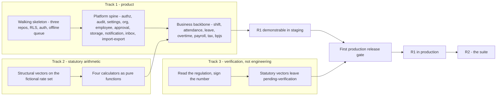

# Implementation Roadmap

Status: Active (Phase 4) · Source: `MANIFEST.md` row 69 · Related ADRs: `ADR-0018` (statutory vectors, **Proposed**), `ADR-0019` (release model, **Proposed**), `ADR-0021` (SLO, **Proposed**), `ADR-0024` (tenant onboarding, **Proposed** — new this session)

## 1. Scope and seam

Every other file in this handbook describes a system. This one describes the order the system is built in, and it is the only file in the handbook that **nothing defers to** — seventy-five documents reference each other constantly, and not one routes a question here.

That is the seam, stated as a rule:

> **This document owns build order, milestones, release gates, and the tenant onboarding sequence. For the V1 cut and the post-GA backlog it indexes and never copies.** Its value is not collecting what is already written — it is the only document whose input is every module at once, so it sees what is invisible from inside any single one.

`MANIFEST.md` names four topics for this file. Two already have owners and are not restated here (A-166):

| Topic | Owner | Treatment here |
|---|---|---|
| V1 cut | `HANDBOOK_SPEC.md` §3.2 and §6, `docs/00-overview/product-overview.md` §9, each module's §1 exclusions, `docs/07-operations/ci-cd.md` §14.1, `docs/07-operations/testing-strategy.md` §14.2, `docs/07-operations/backup-restore.md` §16.1 | §6.1 states the **release boundary**, which is a different thing from the scope boundary and does not move it |
| post-GA | twenty-eight module §15 sections, "Future considerations" in every ADR, the ops backlogs above | §9 indexes by owner and adds the one reading no module could make |
| build order | — nothing. `HANDBOOK_SPEC.md` §7 Phase 3 is a **documentation** order: holiday leads because it is *"small, nearly standalone"* and makes a good structural template, which is an argument about writing, not building | §4 |
| milestones | — nothing anywhere. No date, team size, sprint, or milestone appears anywhere in the handbook — not in `docs/`, not in `HANDBOOK_SPEC.md`, not in `ASSUMPTIONS.md` | §5, §6 |

### Reading rule

This file makes about forty ordering claims. Every one carries a class, because the difference decides whether a reader may move it:

- **Forced** — a port, a foreign key, a lock, or an ADR makes any other order impossible. The constraint is named inline. Moving it breaks the build.
- **Judgment** — the work could be done another way. The reason is named inline. Moving it trades one cost for another, and the trade is written down.

An unmarked ordering claim is a defect in this document.

## 2. Inputs

### 2.1 Capacity

**Roughly three to five engineers, no QA role, plus a part-time statutory advisor** (A-162). This is an input, not a target, and it is recorded so a reader can reverse every parallelism claim in one place if it changes.

The handbook has implied a team this size repeatedly without ever stating it: A-102 refuses a manual UAT gate because *"the org model has no QA role; inventing a gate here would invent a person"*; `ci-cd.md` §11 sets one approving review because *"on a team of this size a two-reviewer rule manufactures rubber stamps"*; `ADR-0019` rejects a release train partly on *"real coordination cost that grows with team size"*. Three repositories (A-006) put a floor under it — below someone who can carry Flutter, someone NestJS, and someone Next.js, the split is cost without benefit.

**No calendar dates appear in this document.** See §10.

### 2.2 Four claims resting on Proposed ADRs

This file leans on unaccepted decisions harder than any other. `CLAUDE.md` makes Accepted override Proposed; it does not make Proposed non-binding, and nothing Accepted conflicts. Building on them is legitimate. Doing it silently is not:

| Claim here | Rests on | If that ADR is rejected |
|---|---|---|
| §5 — a milestone is a capability demonstrable in staging, not a coordinated release | `ADR-0019` decision 4, no release train | the whole definition of a milestone changes shape |
| §4.4 — the statutory calculators run in parallel from day one | `ADR-0018` decisions 3 and 4, structural vectors on a fictional rate set | the parallel track disappears; payroll returns to the end of the queue |
| §4.4, §8 — the verification gate is scoped to reachable calculators | `ADR-0018` Consequences, the `pending-verification` counter | the gate is global; nothing reaches production until all 119 markers are discharged |
| §8 — rollback is rehearsed once; availability has a number | `ADR-0019` decision 5, `ADR-0021` | rollback depth and the availability target become unnumbered |

One decision is deliberately **not** on that list. `PeriodLockPort` ownership has no ADR, but the decision was made and is in force: `docs/06-modules/attendance.md` §4.2 owns the port, grilled 2026-08-02, and `holiday.md` BR-HOL-008, `shift.md` BR-SHF-009, and `organization.md` BR-ORG-008 all cite it with the same sentence — *"the module that owns the frozen data owns the freezing"*. That is documentation debt, not a dependency.

## 3. Three workstreams

The plan has three tracks, and the third is not engineering capacity.

**Track 1 — product.** The walking skeleton, the platform spine, the business backbone, the periphery. This is what §4 orders.

**Track 2 — statutory arithmetic.** The four calculators in `payroll.md`, `tax-pph21.md`, `bpjs.md`, and `overtime.md`. `ADR-0012` makes them pure functions over a snapshot slice; `ADR-0018` decision 4 runs their structural vectors against a deliberately fictional rate set. **They therefore have no runtime dependency at all** — not attendance, not employee, not a database. This is the single most useful ordering fact in the handbook, and it is why the hardest work in the product does not have to wait for anything.

**Track 3 — verification.** Discharging the `⚠️ VERIFY` markers. **119 of them across twenty-seven files**, concentrated in `bpjs.md` (18), `tax-pph21.md` (16), `settings.md` (13), `overtime.md` (11), `payroll.md` (6), `leave.md` (5). None is discharged.

Track 3 is a person reading PMK 168/2023, PP 58/2023, PP 35/2021, UU 13/2003 jo. UU Cipta Kerja, and the BPJS regulations, and signing a number. It produces **no commits** — its output is effective-dated configuration rows and skipped tests turning live. That is exactly why it is missing from every engineering plan ever drawn for this product: work that produces no commits is invisible to a plan made of commits.

Its shape is already designed. `ADR-0018` decision 1 makes a vector file *"the acceptance artifact a domain expert reviews without reading TypeScript"*, and decision 2 makes the file's git history the audit trail of every statutory reinterpretation the product ever makes. What was missing is an owner and a start date. It starts with track 1 and track 2, on day one, and it belongs to the statutory advisor named in §2.1 — **not** to whichever engineer happens to be holding `bpjs.md` when the sprint is short (A-163).

## 4. Build order

### 4.1 The walking skeleton

One thin vertical slice through all three repositories, carrying no product value. That is the point.

**Judgment — it comes first because every mechanism below has been designed and none has been run.** `ADR-0019` promotes by digest, guarantees rollback depth one, and orders the `migrate` Job ahead of application pods. `ci-cd.md` §8.2 gates the worker rollout behind a payroll drain. `testing-strategy.md` §9 tier 4 is *"the only place the three repos meet"*. `ADR-0002` sets `app.tenant_id` per request transaction and layers `FORCE` RLS underneath. Not one of those has executed once. Discovering any of them wrong in month six costs a refactor across every feature written by then; discovering it in the skeleton costs a day.

Contents:

1. **`migrate` Job → `api` → `admin-web` → mobile binary**, promoted by digest, with the staging smoke suite green across all three. **Forced** — `ADR-0019` decision 4 makes the backend promote first, and tier 4 is the only cross-repo assertion in the system.
2. **Tenancy and identity end to end** — login, tenant resolution, `app.tenant_id` in the transaction, RLS on one throwaway table, one route through the full guard chain. **Forced** — BR-AUTHZ-002 gives every route a `@RequirePermission`, `@Public()`, or `@AuthenticatedOnly()` decorator, so no route can exist before the chain does.
3. **The offline mutation queue skeleton.** One trivial queued mutation, end to end: queued locally in Drift → pushed → server idempotency by `op_id` → acknowledged → local state reconciled against server truth. Plus one conflict case and one replay-after-TTL-expiry case, against a throwaway entity that is deleted afterwards.

Item 3 is **judgment**, and it is the one most likely to be argued with. `ADR-0003` makes three claims that can only be tested by running them: the server is authoritative and the client never merges; `op_id` is both the `Idempotency-Key` and a **unique column on the server row**, so a late replay collides at the database independent of Redis; and pending-data protection excludes queued rows and everything they reference from *all* cleanup through one shared helper. The second claim carries more weight than it did when it was written — the idempotency envelope TTL was cut from seven days to **24 hours** in `performance.md` §5.2, and `ADR-0003`'s unique column is precisely what makes that cut safe. Each claim is cheap to prove with a throwaway entity and expensive to discover wrong once six mobile features depend on it. The alternative — the queue arrives with attendance, its first real consumer — finds the structural error at the moment the hardest module lands.

### 4.2 The platform spine

Ordered by how many modules cannot compile without it. All **forced** unless marked.

| Order | What | Consumers |
|---|---|---|
| 1 | authentication, authorization-rbac, audit-log, settings | every route, by BR-AUTHZ-002 |
| 2 | **organization** | `OrgQueryPort` is referenced by eleven module documents — the most-consumed port in the system |
| 3 | **employee** | `EmployeeHirePort` (five), `EmployeePayrollPort` (four), `EmployeeStatusPort`, `AccountLifecyclePort` |
| 4 | approval-engine | `ApprovalEnginePort` / `ApprovalPort` across nine modules; eight request types in V1 |
| 5 | document-storage | `DocumentStoragePort` / `DocumentPort` across nine modules |
| 6 | notification, inbox | forced by 4 — an approval chain with no step notification is a chain nobody acts on |
| 7 | import-export | forced by §7 — every onboarding step after the third is an import |

Items 2 and 3 are business modules that behave like platform. They are listed here rather than in §4.3 because eleven and five consumers respectively is not a business-module relationship.

### 4.3 The business backbone, and the stub rule

Then the backbone in dependency order — **forced** throughout, since each consumes the previous one's query port: shift → attendance → leave → overtime → payroll → tax-pph21 → bpjs.

**One apparent circularity, already resolved by the modules themselves.** holiday, shift, and organization are built before attendance and all three consume `PeriodLockPort`, which attendance owns (§4.2 of that document). This is not a cycle: all three already specify a fake. `shift.md` §14 and `organization.md` §14 both carry the test scenario *"period-lock port: locked month rejects … open passes (fake port both ways)"*. **The stub is sanctioned, and it returns "never locked" until attendance lands** — stated once here so three modules do not have to imply it separately.

`holiday.md` is built with them and is small. It is also the approved structural template for every module document, which is a fact about the handbook and not about the build.

### 4.4 The statutory track, from day one

Track 2 and track 3 start with track 1, not after it.

**Track 2 — judgment, and the strongest one in this document.** Build the four calculators as pure functions with their structural vector files, against `ADR-0018`'s `structural-fiction-v1` rate set. Nothing blocks this: no schema, no API, no attendance data. What it proves is everything that is wrong *regardless of any rate* — tier boundaries landing on the correct side, proration denominators, rounding direction and unit, the month-to-date slice combining a THR run with a regular run, the JP age ceiling deriving from birth date, employer premiums reaching taxable assembly. Deferring this to its dependency-order position puts the product's largest correctness risk last and leaves it unproven longest, when `ADR-0018` has already demonstrated it need not wait for anything.

**Track 3 — forced by the calendar of an external party, which is why it starts first.** The advisor cannot be engaged, briefed, and through 119 markers in the week before a release. Its output flips statutory vectors out of `pending-verification`, and `ADR-0018` decision 2 forbids editing a vector to make a test pass — a failing vector is a code defect until a human re-verifies it against the regulation and records why it changed.

**The gate that counts them is narrowed here.** As written, `ADR-0018` prints the `pending-verification` count and blocks release promotion globally — with 119 markers open, that holds *every* build at staging, including an attendance-only pilot whose BPJS code is unreachable because no payroll run exists. That is a side effect of a counter written before anyone had counted the markers, not an intent. Amended (`ADR-0018`, this session): **the gate blocks promotion for the calculators reachable in that release.** A calculator a Payroll Admin can invoke must be verified. A calculator no code path reaches holds nothing (A-164).

## 5. What a milestone is

`ADR-0019` decision 4 refuses a pinned release pair and a release train, on the ground that an installed mobile app is never part of any tested pair, so pinning web to api is *"a fiction of safety bought with real coordination cost"*. A roadmap that said "milestone 3 ships across all three repositories on one day" would be a release train under another name, and would contradict an anchor.

> **A milestone is a capability demonstrable end to end in staging, asserted by the tier-4 smoke suite. It is not a coordinated production release.** Promotion to production stays independent per repository, backend first, exactly as `ADR-0019` specifies (A-167).

Two properties follow, both wanted.

**Milestone completion is checked, not declared.** A-102 leaves the organization with no QA role and no manual sign-off gate; a milestone defined by a person's opinion would invent the person A-102 refuses to invent. A milestone defined by a green smoke run does not.

**Production exposure is a separate, later, per-repository decision.** A tenant can be using attendance and leave in production while payroll sits behind §8's gate. R1 being demonstrable and R1 being live are two different events, and this document never conflates them.

## 6. Milestones

### 6.1 R1 — the payroll backbone

**Nine of the nineteen business modules**, plus the platform spine: organization, employee, shift, attendance, leave, overtime, payroll, tax-pph21, bpjs.

This is a **release boundary, not a scope boundary** (A-168). `HANDBOOK_SPEC.md` §3.2 places all nineteen modules in V1 and nothing here moves that. Every module remains designed, documented, and in V1. This section says only what arrives first.

**Forced by the port graph, not chosen for taste.** The nine interlock: `payroll.md` consumes `AttendanceQueryPort`, `LeaveQueryPort`, `OvertimeQueryPort`, `Pph21CalculatorPort`, and `BpjsCalculatorPort`. Remove any one and the run is wrong rather than smaller.

Equally forced is what is *outside* it. The periphery — recruitment, performance-goals, training, asset, expense-reimbursement, announcement — is a pure consumer set. Recruitment writes through `EmployeeHirePort` in one direction. **`payroll.md` consumes no expense port at all**, and asset's payroll-charge port is still A-052, deferred. Not one port breaks by deferring them.

Reports and dashboard-analytics defer too, and the reason is worth stating because it looks wrong at first glance: the statutorily mandatory outputs — `tax.monthly_withholding`, `tax.annual_1721a1`, `bpjs.monthly_contribution`, `bpjs.membership_mutation` — are **ExportDefinitions in the import-export registry, registered by tax-pph21 and bpjs**. They travel with their modules, not with `reports.md`. A tenant can meet its filing obligations on R1 alone.

R1 makes a tenant able to hire, schedule, record attendance, approve leave and overtime, run payroll, withhold PPh 21, remit BPJS, and hand an employee a payslip. In this market that is a whole product.

### 6.2 R2 — the suite

The remaining ten: recruitment-candidate, performance-goals, training, asset, expense-reimbursement, announcement, reports, dashboard-analytics, and the rest of system-administration beyond the provisioning path R1 needs.

**Judgment on internal order:** announcement early, because `training.md` §15's mandatory-and-compliance model is explicitly waiting on its audience model — *"needs announcement's audience model to exist first and should consume it rather than build a second one"* (A-067). Otherwise dependency order, which for this set is nearly free: they consume, they do not supply.

### 6.3 Mobile and the store queue

`ADR-0019` says plainly that the mobile client ships *"when a store lets it"*, into review queues nobody controls.

**Therefore a mobile capability attaches to a milestone but never gates it.** Under §5's definition a milestone completes when staging demonstrates it; the store submission is scheduled work with uncontrolled latency running alongside. "Demonstrable in staging" and "on an employee's phone" can be weeks apart, and this document says so rather than drawing a mobile release as though it were a container rollout.

The practical consequence is one-directional: **mobile work for a milestone starts earlier relative to that milestone than backend work does.** Judgment, and it is the reason §4.1 puts the offline queue in the skeleton rather than leaving it to attendance.

## 7. Tenant onboarding

`system-administration.md` owns provisioning — the tenant row, at least one company and one branch, the admin user, the `tenant_keys` row (BR-ADM-005, BR-ADM-007, BR-ADM-009), synchronous and transactional. `import-export.md` owns nine definitions. **Nothing owned the order**, and deriving it is what surfaced §7.1 (A-169).

This sequence never goes stale (§10). It applies to the five-hundredth tenant exactly as to the first.

| # | Step | Blocked by |
|---|---|---|
| 1 | Platform operator provisions the tenant | — synchronous, transactional |
| 2 | Configuration seeded automatically: leave types, expense categories, asset categories. Statutory tables are platform data already present from migration | automatic |
| 3 | **Org structure entered by hand** — departments, positions, job levels | **forced** — `organization.md` §1 excludes an org import from V1, and its `code` columns are the natural keys every later import resolves against |
| 4 | `holiday.calendar` import | **forced** — attendance and leave derive nothing without a calendar |
| 5 | Shift definitions by hand, then `shift.roster` | **forced** — a roster row references a shift code and an employee |
| 6 | `employee.master` import | **forced** — the template resolves `company_code`, `branch_code`, `position_code` from step 3 |
| 7 | **`payroll.salary_opening` import** (§7.1, `ADR-0024`) | **forced** — a payroll run prices a package that does not exist yet |
| 8 | `leave.balance_adjustment` — opening balances as additive ledger entries | **forced** — needs employees |
| 9 | `tax.opening_ytd` — mid-year go-live only | **forced and one-way.** `TAX_OPENING_YTD_LOCKED` refuses the seed after a run closes for that employee-year. BR-TAX-015 and its test scenario already state this; the sequence quotes it rather than discovering it |
| 10 | BPJS company registration and coverage exceptions, by hand | both tables are sparse by design — fifty rows for ten thousand employees |
| 11 | Optional: `asset.registry`, `training.certification`, `performance.goal` | — |
| 12 | Account invitations, per employee | **forced** — BR-EMP-012: *"no account provisioning from files — invites are explicit per-employee acts afterwards"* |

Step 9 is the only step whose mis-ordering damages a tenant irreversibly through the product's own rules. Step 12 means a two-thousand-employee tenant receives two thousand individual invitations; the `hasUser` flag drives the grid affordance so the set is filterable and can be worked through in stages, and inviting by branch in stages is what anyone sensible does anyway. Named, not escalated.

### 7.1 The gap this sequence found

Deriving the sequence exposed a step with no mechanism.

Nine modules refuse an import, and every refusal is correct on its own terms. `import-export.md` §4.3 records them: attendance because spreadsheet-writable punch facts are a fraud amplifier; overtime because a spreadsheet path around statutory caps is a way to manufacture pay; expense because a claim requires a receipt and a row cannot carry a JPEG; bpjs because its tables are sparse; recruitment because a hard-unique email rejects an agency dump mid-file. And payroll, in bold: **"No import."** — *"bulk salary import is the highest-blast-radius import in the product, a spreadsheet that silently supersedes effective-dated pay for a thousand people."*

The `employee.master` template carries *"master fields plus `company_code`/`branch_code`/`position_code`"* and **no salary column**. So a two-thousand-employee tenant imports its people, their leave balances, their year-to-date tax figures, their roster, their assets, and their certificates — and then types two thousand multi-line effective-dated pay packages by hand. Without a package there is no run, and without a run the product has not yet done the thing it exists to do.

No module could see this. `payroll.md` correctly assessed its own blast radius; `import-export.md` correctly recorded nine separate refusals. Only a document whose input is every module at once puts them in one line.

**And the tension dissolves on a close reading.** Payroll's argument is an argument against **supersede**. Onboarding is the **first** package for an employee who has none — there is nothing to supersede — and the framework already has the mode that expresses this: `create_only`, used by `employee.master` (A-019), and described exactly this way by `leave.balance_adjustment`, which writes additive entries *"never an overwrite of a live balance, which is the property A-019 wanted."*

Two different things had been sharing one name:

- **`payroll.salary_opening`** — `create_only`, one opening package per employee, **refusing any row whose employee already has salary history**. The refusal is the safety, so no dry-run is required. Permission `payroll.salary.import`, matching the convention every other import follows. **In V1**, scheduled before the first-tenant milestone. Registered in `import-export.md` §4.3 this session.
- **Bulk salary revision import** — superseding live packages. Stays in `payroll.md` §15, stays behind the mandatory dry-run diff report, stays post-GA.

Payroll's exclusion never said *never*; it said *not without the dry-run*, and the dry-run exists because of supersede. Remove supersede and the cost goes with it. Not one word of payroll's reasoning is reversed (`ADR-0024`, Proposed; A-165).

## 8. The first production release gate

Several documents write *"before the first production release"* in those words. None collects them, so no one can tell whether the set is satisfied. Pointers only — each row's owner holds the content.

| Gate | Owner | Where it stands |
|---|---|---|
| Capacity rehearsal executed — k6 against an ephemeral production-sized environment with a D1-scale synthetic tenant generator | `performance.md` §11.2 | says *"before the first production release"*; unscheduled. §11.2's outputs 3, 4, and 5 replace chosen values in that file, so a rehearsal that changes no number there has not been read |
| Restore drill executed once, clone time measured | `backup-restore.md` §14.1 | quarterly cadence defined, first run unscheduled. It confirms or refutes §3.2's 120 minutes against D3's RTO of four hours |
| **Rollback exercised once** | `ADR-0019` decision 5 | guaranteed to exactly one release back and **never run by anyone**. First execution during an incident is the worst possible first execution. Added to that ADR's Consequences this session |
| Alert routing live with a human at the other end | `observability.md` §4 and §6 | the alert set and its triage entries exist; `ADR-0021`, which gives availability a number and a service window, is still **Proposed** |
| Tier-4 smoke green across three repositories | `testing-strategy.md` §9, `ci-cd.md` §8.4 | mechanism specified, never run — §4.1 makes the skeleton run it first |
| `pending-verification` at zero for reachable calculators | `ADR-0018`, as narrowed in §4.4 | 119 markers open |
| Onboarding sequence executed end to end on staging | §7 | derived here for the first time |
| **`migrate:forward` bootstrap retired** | `ci-cd.md` §8 | *"before the first production release no snapshot exists — `migrate:forward` skips with a recorded reason only while the repository has no snapshot"* |

The last row deserves a sentence. `testing-strategy.md` §14.1 rule 2 applies migrations forward from the previous release's schema **with data present**, which is what catches a `NOT NULL` on a populated table, a unique index over existing duplicates, and a backfill that skipped a tenant. That check is inactive for the entire build and switches on at the first release — so **the riskiest migration in the project's history is the first one it guards, not the last.** Worth knowing before the day it matters.

None of these belongs in `ci-cd.md` as a pipeline stage. Most cannot be automated — a restore drill, a capacity rehearsal, an advisor's signature — and `ci-cd.md` §14.1 already excluded load suites from the pipeline on exactly that ground.

## 9. Post-GA

### 9.1 Index by owner

Roughly two hundred deferred items exist, and every one already lives with the module that deferred it, carrying its own trigger and assumption number. **They are not restated here.** A copy would drift on the first edit, and the trigger written by the person who deferred the item is better information than any rank invented today.

| Where deferred work lives | Contents |
|---|---|
| `docs/06-modules/*.md` §15, `docs/05-platform/*.md` §15 | twenty-eight sections, one dense paragraph each, most items carrying an explicit trigger and an `A-###` |
| `docs/adr/*.md` "Future considerations" | the architectural half |
| `ci-cd.md` §14.1 and §14.2 · `testing-strategy.md` §14.2 and §14.3 · `backup-restore.md` §16.1 and §16.2 · `performance.md` §13 · `environments.md` §12 | operations |
| `product-overview.md` §9 | the seven headline V1 exclusions, including the three `MANIFEST.md` names for this file: kiosk, billing (D13), integrity hardening (D10) |

### 9.2 Dependency clusters

This is the reading no single module could make, and it is the reason §9 exists at all: **several deferred items are the same build.** A post-GA plan that schedules them separately builds the same capability twice.

| Cluster | Members | Evidence |
|---|---|---|
| Day fractions | `attendance.md` §15 day fractions ↔ `leave.md` §15 half-day and hourly ↔ `holiday.md` §15 half-day holidays | three-way, each pointing at the others; one attendance change unblocks all three |
| Audience model | `announcement.md` §15 → `training.md` §15 mandatory and compliance training | training says it *"needs announcement's audience model to exist first and should consume it rather than build a second one"* (A-067) |
| Scheduling | `reports.md` §15 ↔ `import-export.md` §15 ↔ `dashboard-analytics.md` §15 | all three say it *"should be built there once, over definitions, for both registries"* — one cron fan-out, three claimants |
| Document templates | `recruitment-candidate.md` §15 offer letters (A-056) ↔ `training.md` §15 certificates (A-073) | training names it *"the same missing platform capability A-056 named from the offer-letter side"* |
| Materialized aggregates | `reports.md` §15 ↔ `dashboard-analytics.md` §15 | dashboard *"would consume without noticing, since it reads through a port that would not change"* |
| Compensation bands | `recruitment-candidate.md` §15 (A-058) ↔ `performance-goals.md` §15 merit matrix | performance names it *"the same A-058 dependency recruitment hit from the other side"* |
| Per-entry expiry | `overtime.md` §15 TOIL expiry ↔ `leave.md` §15 `expires_on` (A-028) | the same ledger column |
| Cross-source deduction ceiling | `asset.md` §15 payroll charge port (A-052) ↔ `expense-reimbursement.md` §15 cash advance (A-045) | asset names the ceiling, not the port, as the missing piece; both need it |
| Day types | `training.md` §15 `business_trip` ↔ attendance (A-070) | training calls it *"deliberately an attendance amendment rather than something smuggled in from here"* |

### 9.3 Triggers already fired

Most deferred items wait on a fact that has not happened. A few wait on a fact that has:

- **Mandatory and compliance training** (A-067) — `announcement.md` shipped the audience model it was waiting for. The trigger is satisfied; only the build remains.
- **TOTP MFA for tenant users** (A-007) — `security-standards.md` §1 records it as an accepted V2 gap and calls it the *"first fast-follow"*, which is a commitment rather than a discovery. `ADR-0004` reserves the fields.
- **`docs/07-operations/test-vectors/`** — `ADR-0018` puts the handbook's first executable artifact there under a checksum check. It is created by track 2, not deferred.

Everything else keeps its own trigger, and this document does not rank it.

## 10. What this document does not decide

Anti-scope, with the reason each item is excluded (A-170):

- **No calendar dates.** A date in a document nobody reads weekly is wrong within a month; a dependency stays true for years.
- **No per-module estimates.** The person estimating is not the person building.
- **No Gantt and no critical-path arithmetic.** Both need a time axis that §2.1 deliberately does not supply.
- **No assignment of people to work.** Capacity is an input here (A-162), not an allocation.
- **No ranked post-GA backlog.** Triggers beat ranks, and ranking makes the triggers stop being read (§9.1).
- **No commercial decisions** — pricing, contracts, uptime commitments. `ADR-0021` owns the SLO; a contractual SLA is its named revisit trigger and is a business act.
- **No status column, anywhere in this file.** `PROGRESS.md` tracks handbook generation; the implementation repositories track implementation. **This document states order, never state.** The moment it carries status it becomes a second `PROGRESS.md`, and it rots.

### 10.1 Shelf life by section

This is the most perishable file in the handbook, and it is not uniformly perishable. Marked so a future reader discarding the stale half does not take the durable half with it:

| Section | Life |
|---|---|
| §4 Build order | **spent entirely** once built |
| §5, §6 Milestones and the release boundary | spent once R2 lands |
| §8 First production release gate | spent after first use, except the recurring drills it points at |
| §2 Inputs | spent once the Proposed ADRs are accepted or rejected |
| **§7 Tenant onboarding** | **never stale** — as true for the five-hundredth tenant as the first |
| **§9.2 Dependency clusters** | **never stale** — two items that are one build stay one build |

## 11. Exclusions and future improvements

### 11.1 Excluded

| Excluded | Reason |
|---|---|
| A second market or a second region | A-003 fixes one region; `ADR-0018` notes the rate-set indirection that would serve a second market, and nothing else in the plan anticipates one |
| A migration path from a named incumbent product | `import-export.md`'s definitions are format-agnostic by design; a Talenta-specific or Gadjian-specific mapping is a commercial decision with no customer attached to it yet |
| Team topology and module ownership | needs a team larger than §2.1's before the question has an answer |
| Support, onboarding services, and training delivery | not engineering scope, and the handbook has no other place where they would fit either |

### 11.2 Future

This document is rewritten, not extended, when R1 reaches production — §10.1 says which half survives. Before that, three things would change it materially: **acceptance or rejection of the seven Proposed ADRs**, which §2.2 makes readable in one place; **a capacity change**, which A-162 makes reversible in one place; and **the first tenant contract carrying an uptime commitment**, which is already `ADR-0021`'s own revisit trigger and would turn §8's gate from a checklist into an obligation.

The onboarding sequence in §7 outgrows this file the day tenant onboarding becomes a repeated operational task rather than a rare one — at which point it moves to `docs/07-operations/` as a runbook with the operational detail this document deliberately omits, and §7 becomes a pointer.
