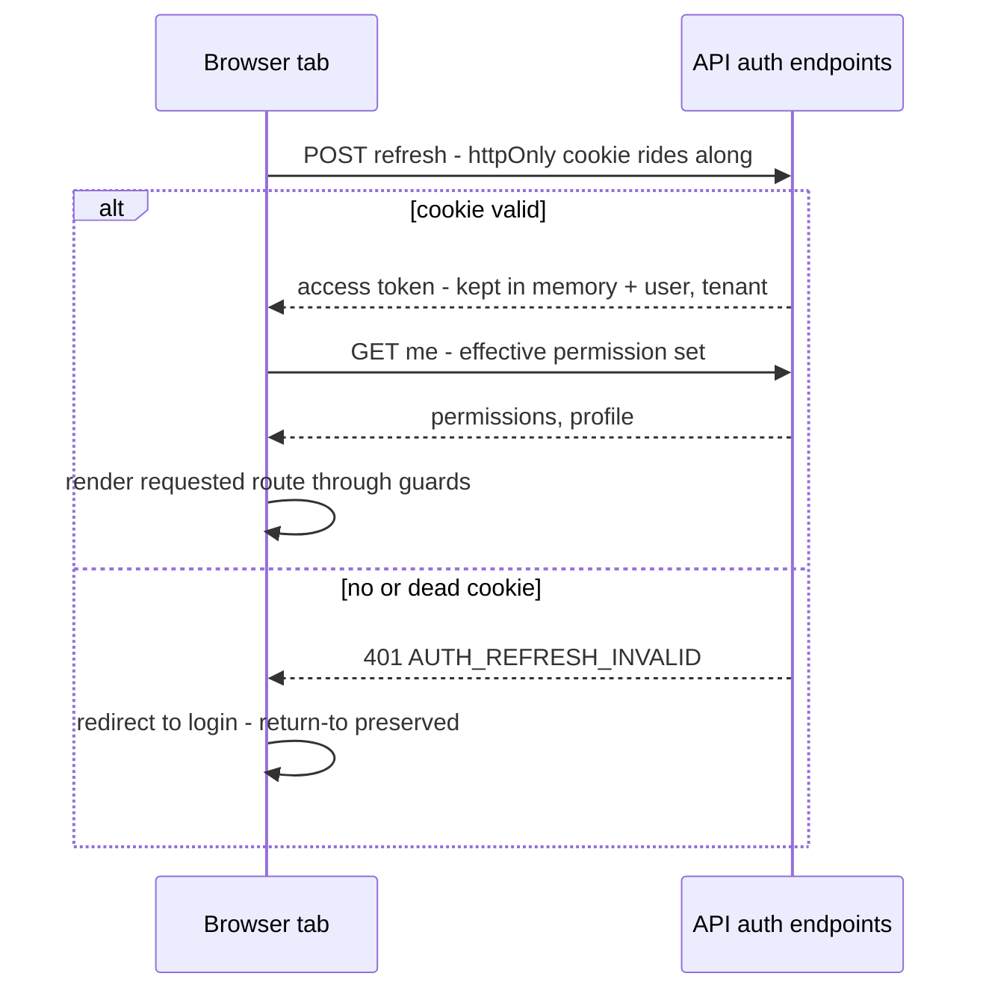

# Admin Web Architecture — Next.js

Status: Active (Phase 2) · Source: `docs/02-architecture/system-overview.md`, `docs/adr/ADR-0007-api-versioning-response-envelope.md` · Related: `docs/adr/ADR-0004-auth-sessions-device-management.md`, `docs/adr/ADR-0005-rbac-permission-model.md`, `docs/adr/ADR-0006-result-pattern-error-handling.md`, `docs/03-standards/naming-conventions.md` §11.2 · Downstream: `docs/03-standards/coding-standards-nextjs.md` (idioms), `docs/03-standards/design-system.md` (visual layer)

This document fixes the concrete mechanics of the Next.js admin app: App Router structure, the rendering/data-fetching model, the Server Actions policy, auth session handling, Axios/React Query/RHF+Zod/TanStack Table conventions, and permission-aware UI. Style idioms belong to `docs/03-standards/coding-standards-nextjs.md`; the visual layer to `docs/03-standards/design-system.md`.

## 1. Fixed frame

- **TypeScript, App Router, feature-based structure** (spec §5.2; Pages Router prohibited). Desktop-first responsive.
- **The REST API is the only business contract.** The Next.js server renders the shell; it holds no business logic and no database access (`docs/02-architecture/system-overview.md` §2).
- **Server state = React Query. Client state = component state + URL params.** No Redux/Zustand/Jotai — a global client-state library requires a documented deviation in coding-standards-nextjs.md before it enters the repo.
- **Forms = React Hook Form + Zod. Grids = TanStack Table. UI kit = Tailwind + shadcn/ui.** HTTP = Axios with the interceptor chain in §6.
- One admin app serves both surfaces: tenant administration and the Super Admin platform console — separated by route groups (§2), not separate deployments (`docs/00-overview/product-overview.md` §5).

## 2. Application anatomy

Per naming §11.2, expanded:

```
src/
├── app/                          # routes ONLY — thin page.tsx files that mount feature components
│   ├── (auth)/login/             # public routes: login, tenant picker, reset password
│   ├── (admin)/                  # tenant-side surface: employees, leave, payroll, settings, …
│   │   └── leave/requests/page.tsx
│   └── (platform)/               # Super Admin console: tenants, feature flags, platform health
├── features/<ns>/                # one folder per module namespace (naming §4)
│   ├── components/               # feature components incl. table column defs
│   ├── hooks/                    # React Query hooks: use-leave-requests.ts
│   ├── api/                      # typed API functions: leave-api.ts (Axios calls)
│   ├── schemas/                  # Zod form schemas: leave-request.schema.ts
│   └── types/                    # wire types mirroring OpenAPI shapes
├── components/
│   ├── ui/                       # shadcn/ui primitives — generated, never hand-edited
│   └── shared/                   # DataTable wrapper, RequirePermission, page scaffolds
├── lib/                          # axios client, query client, envelope/ApiError types (vendored
│                                 # per ADR-0006/0007), result.ts, permission helpers, utils
└── i18n/                         # next-intl messages: id (default) + en (A-013, D12)
```

Rules the tree encodes:

1. `app/` contains **routing only**: a `page.tsx` imports one feature component and passes route params. Business UI never lives under `app/`.
2. Features are isolated the same way backend modules are (ADR-0001 discipline, front-end edition): cross-feature imports go through the other feature's public exports; reaching into another feature's internals is a lint error (§12).
3. `lib/` mirrors the backend `shared/` whitelist: envelope types, `ApiError`, Result, pagination meta — vendored copies canonized by ADR-0006/ADR-0007.

## 3. Rendering and data-fetching model

The token model decides this, so it is fixed as architecture, not preference. ADR-0004: the web access token lives **in browser memory only**; the refresh token is an `httpOnly` cookie scoped to the API's refresh path. Consequences:

1. **Server Components never call the HRIS API.** They cannot attach the access token (it exists only in the browser tab). RSC renders the static shell: layouts, navigation chrome, providers.
2. **All business data is fetched client-side** through React Query + Axios. Every data-bearing component is a Client Component; the shell around it may be RSC.
3. **No Next.js middleware auth.** The refresh cookie belongs to the API origin, not the admin origin — middleware sees nothing. Route protection is a client-side gate (§10) with the API as the real enforcement (ADR-0005); this is honest, not lazy: UI gating is UX, authorization is server-only.
4. SSR data prefetch/hydration is therefore **off the table by design** — an admin dashboard behind login gains nothing from SEO-grade SSR, and smuggling tokens server-side would weaken the ADR-0004 posture for zero product value.

## 4. Server Actions policy

Spec §5.2: "Server Actions only where they are genuinely appropriate." Fixed policy:

> A Server Action may exist only for concerns that **never touch the HRIS API** — today that is exactly: locale cookie and theme cookie writes. Everything that reads or mutates business data goes React Query → Axios → REST.

Rationale is §3's token model: a Server Action calling the API would need its own credential path, creating a second auth surface for no benefit. Enforcement: `'use server'` files are allowed only under `src/app/actions/` and reviewed against this list; the lint rule is in §12. Loosening this policy is an edit to this section with a documented reason, not an ad-hoc exception.

## 5. Auth session model



- **Cold start (any page load / F5):** silent refresh first — the access token does not survive reloads by design. One in-flight refresh promise is shared app-wide; concurrent mounts await it.
- **Login:** password → (tenant picker on multi-tenant match, ADR-0004) → tokens issued; remember-device checkbox drives refresh lifetime (ADR-0004 web rows). Login/refresh are the only endpoints called with `withCredentials`.
- **Session expiry mid-use:** Axios 401 handling (§6) refreshes once, single-flight; refresh failure → hard redirect to login. `AUTH_REFRESH_REUSED` / `AUTH_SESSION_REVOKED` → immediate logout, no retry (family revocation, ADR-0004).
- **Logout:** revoke session server-side, drop in-memory token, clear React Query cache (`queryClient.clear()` — tenant data must not survive into the next login), redirect.
- **Multi-tab:** each tab holds its own in-memory token and refreshes independently; the shared refresh cookie makes that cheap. Cross-tab logout propagates via a `BroadcastChannel` logout ping.

## 6. Axios client

One instance in `lib/`; interceptor order fixed (mirror of the mobile chain, `docs/02-architecture/mobile-flutter.md` §8):

| # | Interceptor | Behavior |
|---|---|---|
| 1 | Request context | `X-Request-Id` (UUIDv7 per request), `Accept-Language` from active locale |
| 2 | Auth | Attach in-memory access token; on 401 `AUTH_TOKEN_EXPIRED`: single-flight refresh, replay queued originals; on `AUTH_REFRESH_REUSED` / `AUTH_SESSION_REVOKED` / `AUTH_TENANT_SUSPENDED`: logout flow, never retry |
| 3 | Envelope | Unwrap ADR-0007 envelope: success → `data` (+ `meta` preserved for pagination); error → **throw typed `ApiError`** carrying `code`, `messageKey`, `details`, `requestId`. Non-envelope payloads (proxy HTML, network failure) → `ApiError` with a `SYS_`-class transport code |

`ApiError` is the only error type feature code sees: React Query's `error` is `ApiError` by declaration module augmentation. Feature code never reads HTTP status — branch on `error.code` (ADR-0006 rule 1). `error.requestId` is surfaced in every error toast/panel as the support handle (ADR-0011).

## 7. React Query conventions

- **Query keys:** one factory per feature, exported from `features/<ns>/api/`: `leaveKeys.list(filters)`, `leaveKeys.detail(id)`. Ad-hoc key arrays are a lint-visible review blocker — invalidation correctness depends on the factory.
- **Defaults:** `staleTime` 30 s, `retry` once and only for transport-class failures (never for catalog business codes — a `LVE_`/`PAY_` error will not heal by retrying), `refetchOnWindowFocus` on. Per-query overrides are fine and local.
- **Mutations invalidate, they do not patch.** On success, invalidate the affected key families and let refetch render server truth. **No optimistic updates on approval-, payroll-, or money-bearing surfaces** — an admin acting on optimistic state that then reverses is worse than a 300 ms wait (D2 budgets reads at p95 < 300 ms). Optimistic updates are permitted only for trivial personal UI state and must be flagged in the feature's module doc.
- **Pagination:** offset style for grids (ADR-0007): query params `page`/`pageSize`/`sortBy`/`q` live in the **URL** (shareable, back-button-correct), flow into the query key, and map 1:1 to the reserved API params (naming §3). `meta.totalItems`/`totalPages` feed the DataTable footer. `keepPreviousData` on for grids.
- Cursor-style endpoints (feeds, exports progress) use `useInfiniteQuery` with `meta.nextCursor`.

## 8. Forms — React Hook Form + Zod

- One Zod schema per form in `features/<ns>/schemas/`, wired via `zodResolver`. The schema validates **transport shape and obvious UX rules** (required, format, range); business rules stay server-side and arrive as catalog codes (ADR-0006 split — never duplicate a domain rule into Zod).
- Money fields are strings end to end (ADR-0007): Zod validates with a decimal-string pattern; display formatting is a design-system utility. No `number` inputs for IDR amounts.
- **Server validation errors map into the form**, not into toasts. The `details` array (`field` as JSON dot-path) feeds `setError` mechanically:

```ts
// lib/forms/apply-server-errors.ts — the one place VAL_ details meet RHF
export function applyServerErrors<T extends FieldValues>(
  form: UseFormReturn<T>, error: ApiError,
) {
  if (error.code !== 'VAL_VALIDATION_FAILED' || !Array.isArray(error.details)) return false;
  for (const d of error.details) {
    form.setError(d.field as Path<T>, {
      type: 'server',
      message: t(`errors.${d.code}`, d.params), // i18n by messageKey, never server text
    });
  }
  return true;
}
```

- Mutation error handling pattern: `applyServerErrors` first; unhandled codes fall through to the feature's error surface with `errors.<CODE>` text + `requestId`.

## 9. UI foundation — shadcn/ui and TanStack Table

- `components/ui/` holds generated shadcn/ui primitives, untouched — customization happens in wrapping components under `components/shared/` or feature folders; upgrades stay mechanical. Tokens/theming per `docs/03-standards/design-system.md` (dark + light, WCAG 2.1 AA).
- **One `DataTable` wrapper** (`components/shared/`) owns: server-side offset pagination bound to URL params (§7), sort header ↔ `sortBy` mapping, loading/empty/error states (error state shows `requestId`), row-level action slots, and column-visibility persistence. Feature code supplies column defs + the query hook — nothing else. Hand-rolled tables are a review blocker; a grid need the wrapper can't meet extends the wrapper.
- **Virtualized rows** (TanStack Virtual) are mandatory above 200 rendered rows (spec §5.14) — relevant for non-paginated pickers (employee selectors), not for paginated grids.
- **Budget** (`performance.md` §10.2, added 2026-08-04): **initial JS per route ≤ 300 KB compressed**, gated on the number Next.js already prints at build; interaction-to-render on this wrapper is measured, not gated. No Core Web Vitals program — this app has no SEO surface, no anonymous traffic, and runs on desktop broadband, so INP is the only vital that maps to how it is used, and a Lighthouse-in-CI gate would be the flaky merge gate testing-strategy §13's zero-retry rule cannot absorb.
- Dates/times render in **branch timezone** with the timezone made visible where ambiguity costs money (attendance, payroll) — display rules in design-system.md; storage/wire stay UTC (product-overview §6).

## 10. Permission-aware UI

- Effective permission set comes from the `me` endpoint at bootstrap (§5) into a `PermissionProvider`; `usePermission('leave.request.approve')` and `<RequirePermission perm="…">` gate routes, nav items, buttons, and columns.
- Route-level guard: `(admin)`/`(platform)` layouts render children only behind session + permission checks; unauthorized → 403 page (for *navigation* the user guessed) — but remember the API's existence-hiding rule: data-scope misses come back as 404 (`docs/03-standards/error-catalog.md` §2), and the UI renders them as plain "not found", never "no access".
- Hiding is UX; the API is the enforcement (ADR-0005). No client-side check is ever a reason to skip server enforcement, and no UI element may leak names/existence of resources the permission set doesn't cover (no disabled-but-labeled rows for other companies' data).
- Permission changes bite within the server cache TTL (ADR-0004/0005); the client refreshes the permission set on refresh-token rotation and on `AUTHZ_PERMISSION_DENIED` responses (a denial that contradicts local state = stale set → refetch `me`).

## 11. i18n (A-013: next-intl)

- **next-intl**, App Router-native: `id` default, `en` second (D12). Locale switch = cookie write (the sanctioned Server Action, §4) + provider swap; no locale URL prefix in V1 — an authenticated admin tool gains nothing from localized URLs.
- Keys per naming §10 (`<ns>.<context>.<element>`, `errors.<CODE>`, `common.*`). No hardcoded user-facing strings; CI runs the same key-completeness check as mobile (both locales or fail).
- Server-generated documents (payslips, 1721-A1) are localized server-side via `Accept-Language` (ADR-0007) — the admin UI only localizes chrome around them.

## 12. Enforcement (CI-gated)

| Rule | Tool |
|---|---|
| Feature isolation: no deep imports across `features/<ns>` boundaries; `app/` imports features only | ESLint `no-restricted-imports` / boundaries plugin |
| No API calls from Server Components; `'use server'` only under `src/app/actions/` against the §4 whitelist | ESLint restricted-syntax + review checklist |
| No raw `axios`/`fetch` in feature components — data flows through `features/<ns>/api` + hooks | ESLint restriction |
| Query keys via factories; `error.code` branching (never `status ===`) | review checklist (coding-standards-nextjs.md) |
| `NEXT_PUBLIC_` never carries secrets; API base URL is the only required public var | env schema check at build (naming §12) |
| i18n key completeness both locales; no string literals in JSX for user-facing text | next-intl lint + CI check (D12) |
