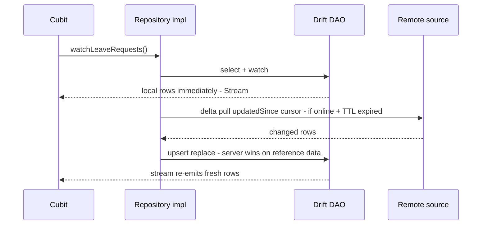
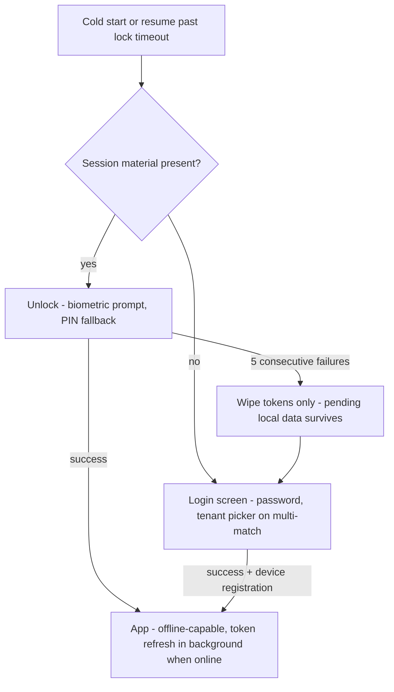

# Mobile Architecture — Flutter

Status: Active (Phase 2) · Source: `docs/02-architecture/system-overview.md`, `docs/adr/ADR-0003-offline-sync-conflict-resolution.md`, `docs/adr/ADR-0004-auth-sessions-device-management.md` · Related: `docs/adr/ADR-0006-result-pattern-error-handling.md`, `docs/03-standards/naming-conventions.md` §11.3, `docs/04-database/database-conventions.md` §11 · Downstream: `docs/02-architecture/offline-sync.md` (sync engine deep dive), `docs/03-standards/coding-standards-flutter.md` (idioms), `docs/03-standards/design-system.md` (UI kit)

This document fixes the concrete mechanics of the Flutter employee app: folder anatomy, layer rules, the Cubit-default discipline, Drift + SQLCipher setup, repository/use-case/DI wiring, networking, secure storage, and bootstrap. The sync engine's internals (queue schema, schedulers, crash recovery, pending-ops UI) belong to `docs/02-architecture/offline-sync.md`; this document fixes where the engine lives and how features plug into it.

## 1. Fixed frame

- **Offline-first is the architecture, not a feature.** Reads serve from Drift; writes enqueue; the server reconciles (ADR-0003). Any screen that only works online must say so in its module doc §10.
- **Clean Architecture, feature-first** per naming §11.3: `features/<ns>/domain|data|presentation`, shared machinery in `core/`.
- **State management: `flutter_bloc`, Cubit by default** (spec §5.1). Bloc requires written justification in the module doc (§4 below).
- **Drift for all business data. SQLCipher always on** (ADR-0003). SharedPreferences only for trivial app settings — theme, locale, onboarding flags. **Prohibited: Riverpod, Hive, Flutter Web**; business data in SharedPreferences is a review blocker (`CLAUDE.md`).
- **Result pattern everywhere** — the vendored Dart sealed classes from ADR-0006 (`core/result.dart`); cubits pattern-match exhaustively.

## 2. Application anatomy

```
lib/
├── main.dart                    # bootstrap order fixed in §10
├── app.dart                     # MaterialApp.router, theme, l10n wiring
├── core/
│   ├── result/                  # result.dart — vendored ADR-0006 sealed classes
│   ├── di/                      # get_it composition root (A-012)
│   ├── network/                 # dio client, interceptor chain (§8)
│   ├── database/                # AppDatabase (Drift), SQLCipher key handling (§6)
│   ├── sync/                    # sync engine: queue, schedulers, sync-class registry (§7)
│   ├── storage/                 # flutter_secure_storage wrapper: tokens, keys, install UUID
│   ├── auth/                    # session state, unlock flow, token refresh coordination
│   ├── router/                  # go_router config, guards, FCM deep-link resolution
│   └── theme/                   # design tokens per design-system.md
├── features/<ns>/               # one folder per module namespace, snake_case
│   ├── domain/                  # entities, repository contracts, use cases
│   ├── data/                    # drift DAOs + remote sources + repository impls + mappers
│   └── presentation/            # cubits/blocs, pages, widgets
└── l10n/                        # ARB files: id (default) + en (D12)
```

Feature anatomy, using leave as the example (files per naming §11.3):

```
features/leave/
├── domain/
│   ├── entities/leave_request.dart          # plain Dart, no Flutter/Drift imports
│   ├── repositories/leave_repository.dart   # abstract contract, returns Result
│   └── usecases/submit_leave_request.dart   # class SubmitLeaveRequest
├── data/
│   ├── local/leave_dao.dart                 # Drift DAO; tables mirror server names
│   ├── remote/leave_api.dart                # dio calls, envelope-aware
│   ├── models/leave_request_model.dart      # JSON/Drift ⇄ entity mappers
│   └── repositories/leave_repository_impl.dart
└── presentation/
    ├── cubit/leave_request_cubit.dart + leave_request_state.dart
    ├── pages/leave_request_page.dart
    └── widgets/
```

## 3. Layer rules

| Layer | Contains | May import | Never contains |
|---|---|---|---|
| `domain/` | Entities, value objects, repository **contracts**, use cases | `core/result`, own domain | Flutter, Drift, dio, JSON — pure Dart only |
| `data/` | Drift DAOs, remote sources, models/mappers, repository implementations | own domain, `core/*` | Business rules; UI types |
| `presentation/` | Cubits/Blocs, pages, widgets | own domain, `core/*`, design-system kit | Repository implementations, DAOs, dio — presentation reaches data **only through domain contracts** |

Same dependency law as the backend (`docs/02-architecture/backend-nestjs.md` §3), enforced by import lint in CI (§12). Cross-feature imports go through the consumed feature's domain contracts — never into another feature's `data/` or `presentation/`.

## 4. State management discipline

**Cubit is the default for every feature.** A feature may use Bloc only when it genuinely needs event-driven mechanics (spec §5.1), and the module doc must carry a one-line justification. The two standing justified cases, fixed here so module docs can reference them:

| Component | Why Bloc | Where documented |
|---|---|---|
| Sync engine (`core/sync`) | Concurrent event handling: connectivity changes, foreground pushes, OS background tasks, and per-op results interleave; event transformers serialize per-aggregate work | `docs/02-architecture/offline-sync.md` |
| Clock-in flow (attendance) | Multi-step pipeline with cancellation: GPS acquisition → geofence check → selfie capture → queue write; steps race against timeouts and user abort | `docs/06-modules/attendance.md` |

Rules:

1. One Cubit per screen scope (page or dialog flow); shared app-level state (session, sync status, connectivity) lives in `core/` cubits provided above the router.
2. States are immutable classes with `Equatable` value equality (A-012); sealed class hierarchies where the UI branches on state shape. No mutable fields, no `copyWith` on non-data states.
3. **Cubits contain zero business logic.** They call use cases, pattern-match the `Result`, and emit states. An `if` that encodes policy belongs in the use case or entity.
4. UI reads state via `BlocBuilder`/`BlocSelector`; side effects (navigation, snackbars) via `BlocListener`. Widgets never call repositories.

## 5. Use cases and Result flow

- Use case = one class, one `call()`/`execute()`, constructor-injected repository contracts, returns `Future<Result<T>>` (or `Stream` for watch cases backed by Drift streams).
- **Repositories return `Result`; data sources throw.** The repository implementation is the conversion boundary (ADR-0006): dio/transport errors → `Failure` with `SYS_`/`SYNC_` codes; server error envelopes → `Failure` with the catalog code from the wire; success payloads → mapped entities.
- Error surfacing: cubits map `Failure.code` to UI via i18n key `errors.<CODE>` (naming §10) — clients never display server `message` text (ADR-0006 rule 4).

The local-first read path every list/detail screen follows (deviations documented per module in §10 Offline Behavior):



Writes never call the remote source directly from a repository used by UI: mutations go to the sync queue (§7), which owns delivery. The one exception class: **online-only actions** (MSS approvals, ADR-0003) — their repositories call the API directly and fail fast with a transport-class failure when unreachable (`SYNC_` offline codes registered when `docs/02-architecture/offline-sync.md` lands); no queueing.

## 6. Drift + SQLCipher setup

1. **One `AppDatabase`** in `core/database`, composing per-feature tables and DAOs. Business tables mirror server names and types exactly (naming §2.6, database-conventions §11) — `leave_requests`, `effective_from`; money via Drift decimal matching `numeric(15,2)`, never integer minor units. Mobile-only tables carry the `local_` prefix (`local_sync_queue`, `local_cache_meta`) and are specified in `docs/02-architecture/offline-sync.md`.
2. **SQLCipher is mandatory** (ADR-0003): database opened via SQLCipher libraries with a 256-bit key generated per install, stored in `flutter_secure_storage` (Keychain/Keystore). No key, no open — there is no plaintext fallback path in code. Key loss (OS keystore wipe) = local DB unreadable = treated as fresh install; server truth re-syncs, and unsynced local data is lost with the same consequence class as device replacement (manual correction flow, ADR-0003/grilling).
3. **Local schema migrations:** Drift `schemaVersion` + written migrations for every release. Hard rule: `local_*` tables (queue, cache metadata) are **never dropped or destructively migrated** — pending-data protection (ADR-0003) extends to schema upgrades. Server-mirror cache tables may be rebuilt (drop + delta re-pull) in a migration **only if** no pending queue op references them; the shared cleanup helper's referenced-by-unsynced-op check (database-conventions §11.5) is consulted by migration code too.
4. **DAOs per feature** in `data/local/`; `core/sync` and the shared cleanup helper are the only writers to `local_*` tables.
5. Local retention: attendance history 90 days, pending-referenced rows exempt (spec §5.7); one shared cleanup helper owns all deletion (ADR-0003 — no other code path deletes local rows).

## 7. Sync engine seam

`core/sync` owns: the durable mutation queue, push scheduling (connectivity regained / foreground / WorkManager–BGTaskScheduler), retry with backoff, op lifecycle, and the pending-ops UI state. Full specification: `docs/02-architecture/offline-sync.md`.

What features see is deliberately small — a **sync registry** contract:

```dart
// core/sync/sync_registry.dart — features register at DI time
abstract class SyncEntityHandler<T> {
  String get entityType;                    // 'attendance_punch'
  SyncClass get syncClass;                  // appendOnlyFact | requestAggregate | mutableOwnedRecord
  Future<void> applyServerState(T remote);  // reconcile local row after ack/conflict
}
```

- Feature repositories **enqueue domain mutations** (`opId` UUIDv7 client-generated, doubles as `Idempotency-Key` — ADR-0003) instead of calling remote sources for queued writes.
- Each synced entity declares exactly one sync class; the registry is the code mirror of every module doc's §10 table.
- Reference data never enters the queue — delta pull only (§5 diagram).

## 8. Networking (dio, A-012)

One dio instance in `core/network`, interceptor order fixed:

| # | Interceptor | Behavior |
|---|---|---|
| 1 | Request context | `X-Request-Id` (UUIDv7 per request), `Accept-Language` from locale |
| 2 | Auth | Attach access token; on 401 `AUTH_TOKEN_EXPIRED`: single-flight refresh (one refresh for N queued requests), replay originals. Auth-loss disposition (grilled 2026-08-02): **session-lost** (`AUTH_REFRESH_INVALID`, `AUTH_REFRESH_REUSED`, `AUTH_SESSION_REVOKED` with `reason ≠ device_revoked`, `AUTH_TENANT_SUSPENDED`) → clear tokens only, Drift DB + queue preserved, to login (or suspended notice); **device-terminal** (`AUTH_DEVICE_REVOKED`, or `reason = device_revoked`) → terminal revoked-device flow (offline-sync §9). Never retry either class |
| 3 | Idempotency | Sync-engine requests carry `Idempotency-Key` = `opId` (set by the sync engine, not per-feature code) |
| 4 | Envelope | Parse ADR-0007 envelope: success → `data`; error → typed failure carrying `code`, `messageKey`, `details`, `requestId`. Non-envelope responses (transport/5xx HTML) → `SYS_`-class failure |

Timeouts, certificate pinning posture, and allowed-cleartext rules: `docs/03-standards/security-standards.md`. The envelope interceptor is the only JSON-error parsing in the app — feature code never inspects HTTP status codes.

## 9. Secure storage and local unlock

`core/storage` wraps `flutter_secure_storage`; nothing else touches Keychain/Keystore. Contents and lifecycle (model fixed in ADR-0004):

| Item | Written | Cleared |
|---|---|---|
| Wrapped refresh token (biometric/PIN-gated key) | First password login + device registration | Logout, revocation, 5 failed unlocks |
| SQLCipher database key | First launch | Never (uninstall only) |
| Install UUID (device registry identity) | First launch | Never |
| DB-owner identity (`tenantId` + `userId`) | First login on install | Rewritten only after an identity-change wipe (grilled 2026-08-02) |
| Access token | Memory, mirrored to secure storage per ADR-0004 | Session end |

Unlock flow (`core/auth`), fully offline-capable (ADR-0003 requirement):



PIN and biometric are **never server credentials** — they gate the locally stored refresh token (ADR-0004). The 5-failure wipe removes tokens, not the Drift database: pending punches survive and sync after re-login (pending-data protection). Session-lost auth failures (§8) behave the same way; the next successful login compares `(tenantId, userId)` against the stored DB-owner identity **before rendering any local data** — same identity → queue drains normally; different → notice + wipe + fresh start (offline-sync §9).

## 10. Bootstrap and DI (get_it, A-012)

`main.dart` order — each step gates the next:

1. `WidgetsFlutterBinding.ensureInitialized()`
2. Load/generate SQLCipher key from secure storage → open `AppDatabase` (failure → fresh-install recovery path, §6.2)
3. `configureDependencies()` — get_it composition root: `core` singletons first (database, dio, secure storage, sync engine), then per-feature registrations (DAOs → sources → repositories → use cases → cubit factories). Manual registration, no codegen (A-012); one `registerLeaveFeature(getIt)` per feature keeps the root readable.
4. Sentry init (errors only — mobile performance tracing stays off, ADR-0011)
5. FCM init: token obtained/refreshed → reported to device registry (ADR-0004); background message handler registered
6. Background task registration: WorkManager (Android) / BGTaskScheduler (iOS) for periodic sync (ADR-0003 scheduling)
7. `runApp` → router decides: session material → unlock flow; none → login (§9 diagram)

Registration scopes: singletons for `core` infrastructure and repositories; factories for use cases and cubits (cubit per screen instance). No service locator calls from widgets — `BlocProvider(create: (_) => getIt<LeaveRequestCubit>())` at route level is the only lookup point.

## 11. Push and deep links

- FCM messages are hybrid (grilled 2026-08-02): OS-rendered `notification` block + `data` block carrying the deep-link route and notification id (contract owned by `docs/05-platform/notification.md`).
- go_router (A-012) resolves links through auth/unlock guards — a tapped notification on a locked app lands on unlock, then the target screen; offline landing shows local data with staleness indicator per design-system.
- Notification taps never mutate state directly — they navigate; the screen loads through the normal local-first path (§5).

## 12. Enforcement (CI-gated)

| Rule | Tool |
|---|---|
| Layer import boundaries (§3), no cross-feature `data`/`presentation` imports | import-lint in CI (exact linter fixed in `docs/03-standards/coding-standards-flutter.md`) |
| Prohibited packages: `riverpod`, `hive`, any `shared_preferences` use outside the settings wrapper | pubspec + import scan, CI fail |
| No Flutter/Drift/dio imports in `domain/` | analyzer lint |
| Bloc (vs Cubit) requires module-doc justification | review checklist (module DoD) |
| Drift business tables mirror server names/types | schema-mirror check against `docs/04-database/core-schema.md` + module schemas, per coding-standards-flutter.md |
| No hardcoded user-facing strings; ARB keys in both locales | l10n lint + CI completeness check (D12) |
