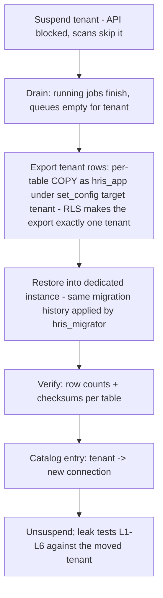

# Multi-Tenancy Implementation

Status: Active (Phase 2) · Source: `docs/adr/ADR-0002-multi-tenancy-rls.md` (model), `docs/04-database/core-schema.md` (§9 RLS application) · Related: `docs/04-database/database-conventions.md` §2/§9, `docs/02-architecture/backend-nestjs.md` §8 (UnitOfWork/ConnectionProvider), `docs/adr/ADR-0004-auth-sessions-device-management.md`, `docs/adr/ADR-0005-rbac-permission-model.md` · Downstream: `docs/07-operations/testing-strategy.md` (leak-test class), `docs/06-modules/system-administration.md` (provisioning, impersonation)

ADR-0002 fixed the model (two independent isolation layers, no-BYPASSRLS, per-tenant platform operations). Backend-nestjs §8 fixed the transaction plumbing. This document owns what remains concrete: the context contracts, the tenant-resolution matrix per entry point, company-scope enforcement, RLS operational setup, the mandatory leak-test matrix, tenant hygiene outside PostgreSQL, and the per-tenant-database migration path.

## 1. Context contracts

Two request-scoped objects, both carried by `AsyncLocalStorage`, both immutable after construction:

| Object | Fields | Built by | Consumed by |
|---|---|---|---|
| `TenantContext` | `tenantId`, `source` (`jwt` \| `job` \| `impersonation` \| `platform-op`), `impersonatorId?` (platform user, when impersonating) | HTTP guard chain / worker job wrapper / platform-op helper | `UnitOfWork` (`set_config`), `ConnectionProvider`, Redis key builders, storage path builders |
| `RequestContext` | `userId?` (`NULL` = system actor), `sessionId?`, `requestId`, effective permission set, `companyScope` (`all` \| explicit company-id list, from ADR-0005 assignment resolution) | after authN/authZ guards; job wrapper builds a system-actor variant from the payload | audit stamping (`created_by`), `PermissionGuard`, company-scoped repositories, logging/tracing fields |

Rules:

1. **No context, no query.** `ConnectionProvider` outside a `UnitOfWork` scope returns the pool, where RLS yields zero rows — fail-closed (backend-nestjs §9). Code never constructs contexts ad hoc; the three builders above are the only sites.
2. `tenantId` never travels as a method parameter through business code — that is what the context is for. A use-case signature taking `tenantId` is a review smell (the exceptions live in platform modules doing per-tenant iteration).
3. Impersonation contexts always carry `impersonatorId`; the audit log records it on every write (ADR-0002, `docs/05-platform/audit-log.md`).
4. Job/system-actor contexts default to `companyScope = all` (grilled 2026-08-02); a payload narrows it only when the job genuinely acts for one company (the processor states so).

## 2. Tenant-resolution matrix

| Entry point | `tenantId` source | Failure handling |
|---|---|---|
| Authenticated HTTP | `tenantId` claim in the access JWT — never a header, query param, or subdomain (V1) | Missing/garbled claim → `AUTH_TOKEN_INVALID`. Unknown tenant → `AUTH_TOKEN_INVALID` (a valid signature with a dead tenant id is a stale/forged token) |
| Login, refresh, password reset | None yet — pre-tenant surface. Lookups run through the dedicated single-purpose auth repository via `SET LOCAL ROLE hris_auth` (§4; mechanism in authentication.md §5 — fulfills the core-schema §9 wrinkle), never general repositories | Multi-tenant match → 200 + tenant choices (success flow, error-catalog §5 note) |
| BullMQ job | `payload.tenantId` (mandatory for tenant work, ADR-0010) | Absent on a tenant-work processor → job fails permanently (defect, not retry) |
| Outbox relay | `domain_events.tenant_id` per row; the relay itself runs platform-level | `NULL` tenant = platform event, dispatched without tenant context |
| Super Admin platform console | None — platform tables only | Any attempt to touch tenant tables from platform context reads zero rows (RLS default-deny) |
| Impersonation | `tenantId` claim of the short-lived impersonation token (ADR-0002) | Standard JWT failures + audit flag on every request |
| Per-tenant platform op (provisioning, support fix, aggregate job) | Explicit target, via the platform-op helper that builds a `TenantContext{source: 'platform-op'}` and audit-logs the invocation | — |

**Tenant status enforcement:** `TenantStatusGuard` checks `status = 'active'` via Redis (`hris:tenant:{tenantId}:status`, TTL 30 s — platform-internal constant, deliberately not tenant-tunable). `suspended`/`archived` → `AUTH_TENANT_SUSPENDED` (403) on every authenticated route including refresh (ADR-0004). Jobs: cron scans enqueue for **active tenants only** (ADR-0010); already-enqueued jobs for a just-suspended tenant run to completion — killing a payroll calculation mid-flight is worse than finishing state that suspension already blocks from being read. Retention/purge `maintenance` jobs keep running for suspended tenants (statutory retention does not pause with the subscription).

## 3. Company scope — the second axis

RLS isolates **tenants**; company scoping inside a tenant is repository-enforced only (database-conventions §2). Mechanics:

1. `RequestContext.companyScope` is resolved once per request from the user's role assignments (`user_roles.company_id`, ADR-0005): any tenant-wide assignment ⇒ `all`; otherwise the explicit company-id list.
2. Repositories for company-scoped tables (class 3, database-conventions §2) expose their queries through the base class, which appends `company_id IN (:scope)` whenever `companyScope ≠ all`. Same by-construction posture as the tenant filter: there is no query path that skips the base class.
3. A company-scope miss is a **data-scope miss**: single-resource lookups return `SYS_NOT_FOUND` (404, existence-hiding — error-catalog §2; a module's own `*_NOT_FOUND` only where one is registered), lists silently exclude. Never 403.
4. Company scope applies to writes too (`WITH CHECK`-equivalent in the base class): creating a payroll run for a company outside scope fails **before the insert with `SYS_NOT_FOUND` on the company reference** (grilled 2026-08-02 — existence-hiding applies to write references; never 403, never a validation code that confirms the company exists).

## 4. RLS operational setup

Policy template, `set_config` wiring, and the migration `-- manual:` rule are database-conventions §9. Operational remainder:

```sql
-- Roles (created once per environment, before first migration)
CREATE ROLE hris_migrator LOGIN BYPASSRLS;       -- owns schema + objects; CI migrations only.
  -- BYPASSRLS (grilled 2026-08-02): FORCE RLS binds the owner too — without the bypass,
  -- in-migration DML on tenant-class rows silently affects zero rows (unset app.tenant_id).
CREATE ROLE hris_app LOGIN NOBYPASSRLS;          -- runtime; never the owner
CREATE ROLE hris_auth NOLOGIN NOBYPASSRLS;       -- pre-tenant auth lookups (grilled 2026-08-02)
GRANT hris_auth TO hris_app;                     -- assumed via SET LOCAL ROLE inside the lookup tx

GRANT USAGE ON SCHEMA public TO hris_app;
GRANT USAGE ON SCHEMA public TO hris_auth;
ALTER DEFAULT PRIVILEGES FOR ROLE hris_migrator IN SCHEMA public
  GRANT SELECT, INSERT, UPDATE, DELETE ON TABLES TO hris_app;
-- No CREATE, no TRUNCATE, no DDL for hris_app. Sequences: none (UUIDv7 PKs).

-- hris_auth: SELECT-only, column-narrow, exactly four tables (authentication.md §5).
-- No default privileges — every grant explicit; the role can write nothing (leak test L7).
GRANT SELECT (id, tenant_id, email, password_hash, status, deleted_at) ON users TO hris_auth;
GRANT SELECT ON sessions, devices, auth_tokens TO hris_auth;
CREATE POLICY auth_lookup ON users FOR SELECT TO hris_auth USING (true);
-- + the same auth_lookup policy on sessions, devices, auth_tokens (their -- manual: blocks)
```

- `api` and `worker` processes connect **only** as `hris_app`. The `hris_migrator` credential lives in the **cluster secret store**, consumed by the migrate Job, and in break-glass tooling — never in CI, never in application pods (system-overview §3.1). *Corrected 2026-08-04:* this line previously said "exists in CI". Since `ci-cd.md` §7.1 moved migrations to an in-cluster Job on the deployed digest, **the pipeline holds no database credential at all** (ci-cd §11), and the old wording reads as permission to hand CI a `DATABASE_URL`. Delivery and break-glass procedure: `environments.md` §5, §13.3.
- **Transaction-mode pooling rule:** `set_config(..., true)` is transaction-local — compatible with PgBouncer/pgcat transaction mode (ADR-0002). Corollary, enforced in review: **no session-level `SET`/`SET SESSION` anywhere in application code**; any session-scoped state would leak across pooled transactions. (`SET LOCAL ROLE hris_auth` in the auth lookup path is transaction-scoped and therefore compatible — reverts at commit/rollback.)
- **Policy-coverage CI gate:** a check script diffs `pg_policies` against the table classification (every tenant-owned/company-scoped table must carry the `tenant_isolation` policy with `FORCE`); a new tenant-class table without its `-- manual:` RLS block fails the pipeline before review sees it.
- FORCE RLS makes `hris_app` ad-hoc queries return nothing without `set_config` — expected; operational queries use the runbook procedures. **Resolved 2026-08-04:** `docs/07-operations/observability.md` §8 supplies the log query patterns and §10 the correlation walk, and `environments.md` §13.3 owns the break-glass session itself. Note also observability.md §4.7's stated reliance: because FORCE RLS fails *closed*, there is no runtime alert for a cross-tenant read — the detection is §5's leak matrix at G9, not production telemetry.

## 5. Leak-test matrix (mandatory per module)

> **Isolation in this document means data, never performance** *(stated 2026-08-04, `performance.md` §13.1)*. Every mechanism here — repository scoping, `FORCE` RLS, the matrix below — stops a tenant **seeing** another tenant's rows. **Nothing anywhere stops a tenant starving another.** security-standards §3's rate limits are per user and per IP; there is no per-tenant limit, quota, or resource class in the system, and a tenant at D1's 10,000-employee ceiling generates five times a typical tenant's load against one shared database, one `noeviction` Redis, and one `api` fleet. Recorded here rather than left silent because a reader of this document will otherwise assume the word covers both. `performance.md` §13.1 carries it as a V1 exclusion with its trigger.

ADR-0002 made two-tenant tests mandatory; this is the concrete matrix `docs/07-operations/testing-strategy.md` encodes as a shared test-kit every module instantiates:

| # | Scenario | Asserts |
|---|---|---|
| L1 | Seed tenants T1 + T2; query via repository under T1 context | Only T1 rows; T2 invisible |
| L2 | Same query as raw SQL via `hris_app` **without** `set_config` | Zero rows (RLS alone isolates — layer 2 works with layer 1 removed) |
| L3 | Write under T1 context with a payload smuggling T2's `tenant_id` | Rejected — base repository stamps the context tenant; RLS `WITH CHECK` backstops |
| L4 | Single-resource GET of a T2-owned id under T1 context | `SYS_NOT_FOUND` 404 (existence-hiding, error-catalog §2), not 403, not empty-200 |
| L5 | Company-scoped user (scope = C1) queries C2 data in the same tenant | Lists exclude; detail = 404; write = `SYS_NOT_FOUND` on the reference (§3.4) |
| L6 | Job processor with T1 payload | Touches only T1 rows; processor without `tenantId` on tenant work fails permanently |
| L7 | `SET LOCAL ROLE hris_auth` (§4): attempt INSERT/UPDATE on the four auth-lookup tables; SELECT any fifth tenant table | Permission denied — the lookup role reads exactly four tables and writes nothing |
| L8 | *(added 2026-08-04, ADR-0017)* Authenticated **platform** session with no tenant resolved (§2 row 5): SELECT any tenant-class table directly; then repeat inside `TenantContext{source: 'platform-op'}` for T1 | Zero rows in the first case — the console cannot read tenant data by holding a platform token; exactly T1's rows in the second, proving the platform-op helper is the *only* door and that it opens onto one tenant |
| L9 | *(added 2026-08-04, ADR-0017)* Impersonation token for a T1 user: query T2 data; then attempt any `sysadmin.*` route | Zero rows / 404 for T2 — an impersonation token is a T1 token; `AUTHZ_FORBIDDEN` on the platform route, because the token carries no platform key (BR-ADM-018). The two halves together are what "impersonation resolves the impersonated user's set, never the Super Admin's" means operationally (BR-AUTHZ-013) |

The kit seeds identical data shapes in both tenants so an isolation bug cannot hide behind data asymmetry.

**The kit is `describeTenantIsolation`** (`docs/07-operations/testing-strategy.md` §5.1): a parameterized suite invoked in one line per module, expanding to this whole matrix against Testcontainers PostgreSQL with real migrations applied. A module that declares a tenant-class table without invoking it fails a lint — the same principle as §4's policy-coverage gate, since a matrix every module is trusted to re-implement is a matrix that shrinks.

## 6. Tenant hygiene outside PostgreSQL

The database is the enforced boundary; these surfaces are convention-enforced and each has an owner:

| Surface | Rule | Owner |
|---|---|---|
| Redis | Key grammar carries the tenant segment: `hris:<ns>:{tenantId}:…`; platform keys use `-` | naming §8 |
| Idempotency store | `hris:idem:{tenantId}:{key}` — replays cannot cross tenants even with a colliding key | ADR-0007 |
| BullMQ | `payload.tenantId` mandatory for tenant work; job IDs embed it (`run.calculate:tenantId:runId`) | ADR-0010, naming §7 |
| Firebase Storage | Path prefix `tenants/{tenantId}/…`; signing happens after permission + metadata checks, so a leaked path alone grants nothing | ADR-0009, naming §11.4 |
| FCM | Tokens live on `devices` rows (tenant-owned, RLS); fan-out resolves targets inside the tenant context | ADR-0004, notification.md |
| Telemetry | `tenantId` is a standard log/span field for support, and the **only** tenant-identifying value allowed in telemetry (PII rule) | ADR-0011 |
| Mobile local DB | Single-tenant by construction — one session's data; logout wipes before another login (offline-sync §9) | ADR-0003 |

## 7. Per-tenant database migration path

V1 runs everyone on the shared database. The escape hatch (ADR-0002) stays cheap because every tenant-data access already flows through `ConnectionProvider`:

- **V1:** `ConnectionProvider.handle()` ignores the tenant and returns the shared pool/transaction (backend-nestjs §8).
- **Future:** a `tenant_databases` catalog (platform table: `tenant_id → connection ref`, cached in-process) consulted per `TenantContext`. Absent row = shared pool. Business logic, repositories, and policies unchanged.

Move procedure (runbook detail lands in operations docs when first exercised):



Notes: RLS policies ship with the schema and stay enabled on the dedicated instance — redundant-but-harmless (ADR-0002). The restore step works because `hris_migrator` carries `BYPASSRLS` (§4) — `FORCE` RLS would otherwise reject owner `COPY FROM` with no tenant variable set. Redis, BullMQ, storage paths, and FCM are already tenant-keyed — untouched by the move. Rollback before the catalog flip = drop the copy; after the flip = reverse copy with the same procedure. Triggers for moving at all: contractual isolation, tenant size near the 10k ceiling, noisy-neighbor pressure — never speculation.

## 8. Provisioning invariant

Tenant creation is a platform operation (`docs/06-modules/system-administration.md`): insert `tenants` row (platform table), then seed inside an explicit `TenantContext{source: 'platform-op'}` — the ten system role templates (core-schema §11), default settings, and the initial Company Administrator user. Provisioning uses the same repositories and RLS path as runtime code — there is no "setup mode" that bypasses isolation, so provisioning bugs cannot become cross-tenant bugs.

**Implemented 2026-08-04** (system-administration.md §5.3, BR-ADM-005 to BR-ADM-008), with three additions this paragraph did not carry. The seed also creates **one company and one branch** through the organization facade, discharging organization.md UC-ORG-007 — a tenant that cannot hold employees is never created. It runs as **one transaction bracketed by two external calls**: KMS key generation before it (ADR-0016's `tenant_keys` row, idempotent on slug, so a network call never holds a transaction open and a rollback leaves only unreferenced key material), and the invite email after commit (an email about a tenant that then rolls back is unrecallable). And every seed step goes through another module's **facade**, never its tables, so the module with the widest privilege in the product holds no cross-module SQL and ADR-0001 §6's read-model exception still has exactly two exercisers.
