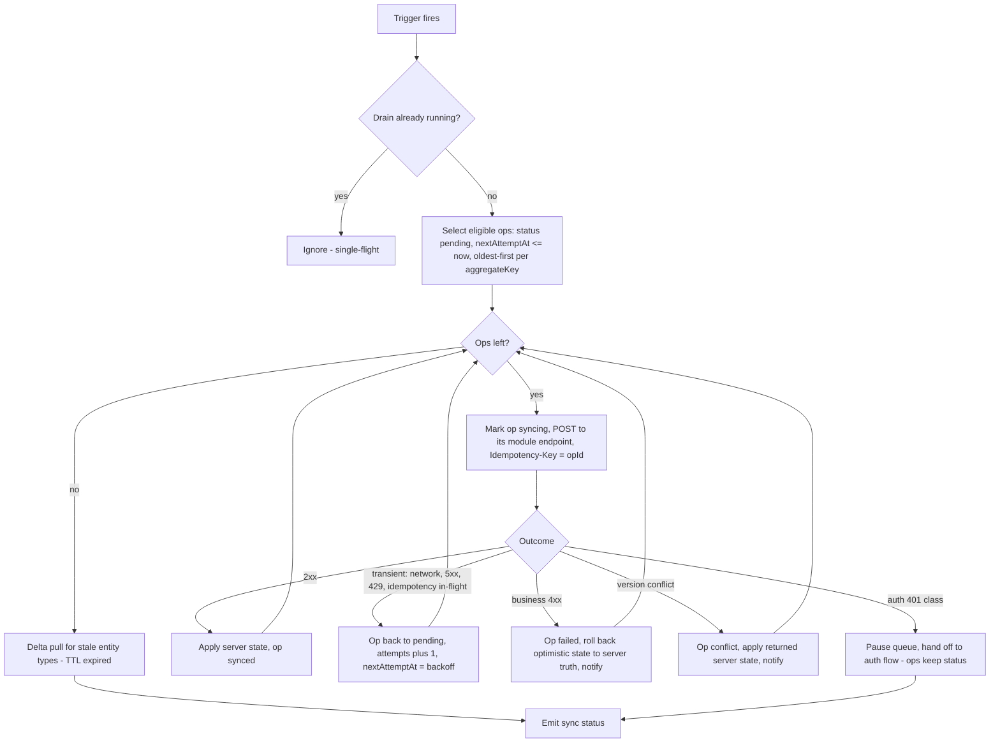
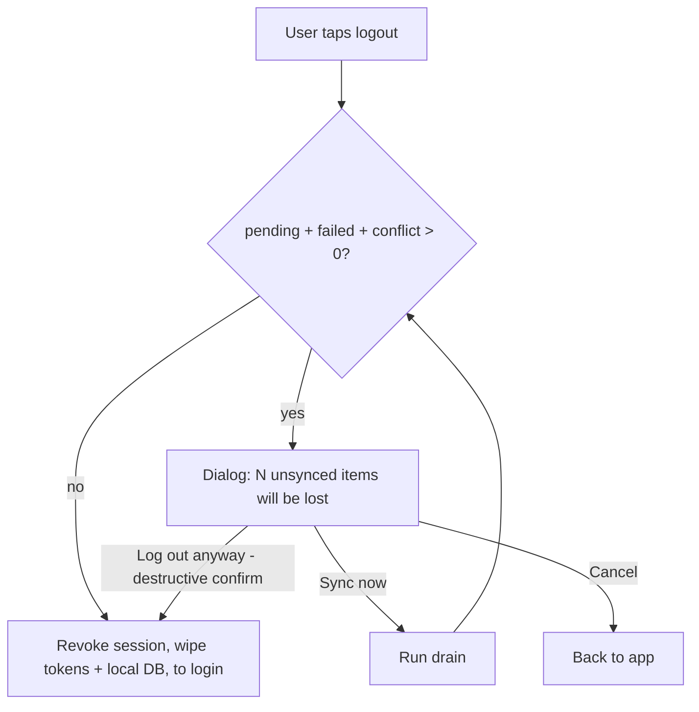

# Offline Sync Engine

Status: Active (Phase 2) · Source: `docs/adr/ADR-0003-offline-sync-conflict-resolution.md` (model), `docs/02-architecture/mobile-flutter.md` (§6 Drift rules, §7 registry seam) · Related: `docs/adr/ADR-0004-auth-sessions-device-management.md`, `docs/adr/ADR-0007-api-versioning-response-envelope.md`, `docs/04-database/database-conventions.md` §11 · Downstream: every mobile module doc §10 Offline Behavior

ADR-0003 fixed the model: server-authoritative, client never merges, four sync classes, pending data never deleted. This document owns the mechanics: queue schema, schedulers, the wire protocol, per-class conflict handling, crash recovery invariants, pending-ops UI, logout-with-pending, and the server-side durable `op_id` rule (ADR-0003 amendment, 2026-08-02). The engine lives in `core/sync` and is one of the two standing Bloc justifications (mobile-flutter §4).

## 1. Local schema (Drift)

The two engine-owned tables. Only `core/sync` and the shared cleanup helper write them (mobile-flutter §6.4); business tables mirror server schemas and are owned by their features.

```dart
// core/sync/tables/local_sync_queue.dart
class LocalSyncQueue extends Table {
  @override
  String get tableName => 'local_sync_queue';

  TextColumn get opId => text()();               // UUIDv7, generated at enqueue;
                                                 // doubles as Idempotency-Key (ADR-0003)
  TextColumn get entityType => text()();         // sync-registry key: 'attendance_punch'
  TextColumn get entityId => text()();           // client-generated UUIDv7 of the row
  TextColumn get aggregateKey => text()();       // FIFO scope, default '<entityType>:<entityId>'
  TextColumn get operation => text()();          // domain verb: create | update | cancel
                                                 // (modules may extend in their §10 table)
  TextColumn get payload => text()();            // JSON mutation DTO, exactly what the API takes
  IntColumn get baseVersion => integer().nullable()();  // mutable-owned-record class only
  TextColumn get status => text()();             // pending | syncing | synced | failed | conflict
  IntColumn get attempts => integer().withDefault(const Constant(0))();
  TextColumn get lastErrorCode => text().nullable()();  // catalog code of last failure
  DateTimeColumn get nextAttemptAt => dateTime().nullable()(); // backoff schedule; NULL = eligible now
  DateTimeColumn get createdAt => dateTime()();
  DateTimeColumn get updatedAt => dateTime()();

  @override
  Set<Column> get primaryKey => {opId};
}
// Indexes: (status, nextAttemptAt) for drain eligibility; (aggregateKey, createdAt) for FIFO.
```

```dart
// core/sync/tables/local_cache_meta.dart
class LocalCacheMeta extends Table {
  @override
  String get tableName => 'local_cache_meta';

  TextColumn get entityType => text()();          // one row per pulled entity type
  TextColumn get cursor => text().nullable()();   // opaque delta cursor from the server
  DateTimeColumn get lastPulledAt => dateTime().nullable()();
  IntColumn get ttlMinutes => integer()();        // freshness class, from the sync registry

  @override
  Set<Column> get primaryKey => {entityType};
}
```

Retention: queue rows in `pending`/`syncing`/`failed`/`conflict` are exempt from every cleanup path (ADR-0003 hard rule); `synced` rows follow the 90-day local retention (database-conventions §4.4). Schema upgrades never destructively migrate these tables (mobile-flutter §6.3).

## 2. Enqueue path

A queued write is **one Drift transaction**: insert the queue row + apply the optimistic local state (insert/update the mirrored business row, flagged locally as unsynced). Atomicity is the first crash invariant — there is no state where the optimistic row exists without its op or vice versa.

- `opId` and `entityId` are UUIDv7, generated at enqueue (database-conventions §1.2 applies on-device too).
- `payload` is the finished API DTO — the drain loop does no per-module marshalling; feature repositories own mapping at enqueue time.
- `baseVersion` is captured from the local mirrored row for the mutable-owned-record class; other classes leave it `NULL`.
- Offline facts carry device event time in the payload (`punchedAt`); the server adds `syncedAt` on arrival (ADR-0003).

## 3. Drain loop and scheduling

Triggers (any of): connectivity regained · app foregrounded · periodic OS background task (WorkManager / BGTaskScheduler, registered at bootstrap — mobile-flutter §10.6) · user-initiated "sync now" from the pending-ops screen.



- **Single-flight:** one drain at a time (in-memory lock; a cold start always starts lock-free). Ops run sequentially — trivially satisfies per-aggregate FIFO (ADR-0003); parallel-across-aggregates is a measured-need upgrade, not V1 (one user's queue is small by construction).
- **Backoff:** exponential with jitter — base 10 s, factor 2, cap 30 min (ADR-0003), written into `nextAttemptAt`. Retried indefinitely for transient classes. Client tunables ship as settings keys `sync.retry_base_seconds`, `sync.retry_cap_minutes`, `sync.banner_after_failures` (definitions land in `docs/05-platform/settings.md`).
- **No batch endpoint.** Each op replays against its **module's normal REST endpoint** — the server stays deviation-free and idempotency lives where the domain lives. Endpoints reachable from the queue are declared in each module doc (§7 API: "queue-reachable", §10 sync class table).
- After the queue drains, the same loop runs **delta pulls** for entity types whose `ttlMinutes` expired — queue-before-pull ordering avoids pulling state the pending ops are about to change anyway.

## 4. Wire protocol and outcome mapping

Every queued op is a normal envelope request (ADR-0007) with `Idempotency-Key: <opId>`. Outcome table (the drain loop's entire decision surface):

| Server response | Class | Engine action |
|---|---|---|
| 2xx envelope | success | `applyServerState` via the entity's `SyncEntityHandler`, op → `synced`. `Idempotency-Replayed: true` means an earlier attempt already landed — same handling |
| network error, 5xx, 429, `SYS_SERVICE_UNAVAILABLE` | transient | backoff retry, indefinitely |
| `SYS_IDEMPOTENCY_IN_FLIGHT` (409) | transient | a previous attempt is mid-execution server-side; retry after backoff |
| `VAL_IDEMPOTENCY_PAYLOAD_MISMATCH` (409) | defect | op → `failed` with the code — this is a client bug (payload mutated after enqueue), never user-recoverable; Sentry breadcrumb |
| `SYNC_VERSION_CONFLICT` (409) | conflict | op → `conflict`; `details.current` carries the server's row — applied to the local mirror; user notified (§6) |
| any other 4xx catalog code (`ATT_`, `LVE_`, …) | business rejection | op → `failed`, optimistic state rolled back to server truth, user notified with `errors.<CODE>` — **never retried** (ADR-0003) |
| `AUTH_TOKEN_EXPIRED` | auth | dio auth interceptor refreshes transparently (mobile-flutter §8); the engine never sees it |
| `AUTH_SESSION_REVOKED` (`reason ≠ device_revoked`), `AUTH_TENANT_SUSPENDED` | session-lost auth | queue paused (ops keep status), tokens cleared, DB preserved — identity-checked re-login flow (§9, grilled 2026-08-02) |
| `AUTH_DEVICE_REVOKED`, or `AUTH_SESSION_REVOKED` with `reason = device_revoked` | device-terminal auth | queue paused; terminal revoked-device flow (§9) — no final push, wipe on acknowledgment |

## 5. Server side — durable `op_id` (ADR-0003 amendment)

Redis replays cover **24 hours** (ADR-0007, *reduced from 7 days on 2026-08-04 — `performance.md` §5.2*); a device may stay dark far longer, which is exactly why this rule and not the window is what makes dedup correct. Binding rule for **every table that sync-class writes create** (append-only facts and request aggregates born offline):

```ts
// module schema pattern (Drizzle) — e.g. attendance_punches, leave_requests
opId: uuid('op_id'),                     // NULL for rows created online by admin/web paths
…
uniqueIndex('uq_attendance_punches_tenant_id_op_id')
  .on(table.tenantId, table.opId)
  .where(sql`op_id IS NOT NULL`),
```

Server insert flow for queue-reachable endpoints: Redis replay hit → replay stored response (fast path). Redis miss → attempt insert; **unique violation on `(tenant_id, op_id)`** → the op already landed beyond the Redis window → load the existing row and respond as a replay (same success envelope, `Idempotency-Replayed: true`). Duplicates are impossible at any TTL, by construction (system-overview §5.1 diagram).

Module docs apply this column to every offline-created entity in their Drizzle schema — it is part of the §10 checklist (§9 below).

Durable `op_id` dedup covers **creates**. State-transition ops (e.g. cancel) beyond the 24-hour Redis window replay as business rejections whose rollback converges to the intended server state — correct, but surfaced as a spurious `failed`; modules may map already-in-target-state rejections to replay-success in their §10 (grilled 2026-08-02).

## 6. Per-class conflict handling (mechanics)

Policy is ADR-0003's table; this is what the engine actually does per terminal state:

| Sync class | `synced` | `failed` (business rejection) | `conflict` |
|---|---|---|---|
| Append-only fact | Local row confirmed; unsynced flag cleared; server-computed fields (e.g. `syncedAt`, derived status) applied | Optimistic row **removed** from the mirror (it never existed server-side); op row keeps the payload for the failed-ops screen; re-submit creates a **new** op after user edit | n/a — cannot conflict (ADR-0003) |
| Request aggregate | Row confirmed; server state (request number, chain snapshot) applied | Same removal + notify: e.g. cancel-after-approval rejected → server state re-pulled, user sees the approved request | Offline action raced an advanced server state: op closed, server state applied, user notified with what happened |
| Mutable owned record | Server echo (incl. new `version`) replaces local | Rollback to server truth | `details.current` replaces local; user re-applies edits if still wanted (no field merge, ADR-0003) |
| Reference data | never queued | — | — |

Rollback mechanics: "roll back to server truth" = fetch-or-tombstone — the engine re-pulls the aggregate (targeted GET, or next delta pull when the entity type is cursor-covered) rather than trying to reverse-apply the optimistic diff. Simple, and correct against any amount of drift.

## 7. Crash recovery invariants

1. **Enqueue is atomic** with the optimistic apply (one Drift transaction, §2).
2. **`syncing` is never terminal.** Cold start demotes every `syncing` row to `pending` (attempts preserved, `nextAttemptAt = now`). Safe because the server is idempotent: if the dying process's request actually landed, the retry replays via Redis or collides on `op_id` (§5) and returns the original result.
3. **Responses may be lost; results may not.** The engine never marks `synced` before the success envelope is fully persisted-applied (handler runs inside a Drift transaction; process death mid-apply re-runs it on the replayed response).
4. **The queue survives anything short of storage loss** — SQLite WAL under SQLCipher; no in-memory queue state is authoritative.
5. **One drain, ever** — the lock is process-local; there is no persisted lock to go stale across restarts.
6. Storage loss (keystore wipe, device replacement) is the accepted data-loss case: recovery is the manual attendance-correction flow, never a trust-the-dead-device backfill (grilling 2026-08-02; `docs/06-modules/attendance.md`).

## 8. Pending-ops UI

Engine exposes one stream: `SyncStatus { pendingCount, failedCount, conflictCount, isDraining, lastSyncedAt }`. UI contract (visual detail in design-system.md):

| State | Surface |
|---|---|
| All synced | Passive timestamp ("Synced 2m ago") in profile/settings; nothing intrusive |
| Pending > 0, no repeated failures | Passive badge with count; affected rows show an "unsynced" chip |
| ≥ `sync.banner_after_failures` (default 3) consecutive failed drain cycles | **Actionable banner** app-wide: count + "sync now" + link to pending-ops screen (ADR-0003 escalation) |
| Failed / conflict ops exist | Pending-ops screen lists each op: entity, submitted time, `errors.<lastErrorCode>` text, and per-class actions — failed: *edit & re-submit* (new op) or *discard* (confirm dialog); conflict: *view server state* acknowledgment |
| Queue paused (auth) | Session-lost: banner "sign in to sync your changes" · tenant suspended: "workspace suspended" notice (data preserved; drains if reactivated) · device-terminal: revoked-device message (§9) |

Discarding a `pending` (not yet failed) op warns explicitly — it is voluntary data loss. Discard of `failed`/`conflict` ops is a normal acknowledgment (server already holds truth).

## 9. Logout, revocation, and pending data

Logout wipes the local database (next login may be a different user/tenant — device-level isolation). Hence the ADR-0003 prompt rule:



- **Session-lost** (`AUTH_REFRESH_INVALID` — e.g. >30 d dark or password reset, `AUTH_REFRESH_REUSED`, `AUTH_SESSION_REVOKED` with `reason ≠ device_revoked`, `AUTH_TENANT_SUSPENDED`; grilled 2026-08-02): tokens cleared, **queue + local DB preserved** — routine credential events (password reset revokes all sessions, BR-AUTH-009) must never destroy pending punches. The next successful login checks the DB-owner identity marker (mobile-flutter §9) before rendering anything local: same `(tenantId, userId)` → queue drains normally; different → "previous account's N unsynced items will be removed" notice → wipe → fresh start.
- **Device revocation** (`AUTH_DEVICE_REVOKED`, or session revoked with `reason = device_revoked`): the queue pauses; no sync path exists anymore (the credential is dead and stays dead). The app shows a terminal notice — "this device was signed out; N unsynced items could not be sent, contact HR for corrections" — and wipes on acknowledgment. This is the deliberate fraud-safe choice: a revoked device never gets a final push (grilling 2026-08-02).
- **Offline logout** is best-effort: the server revoke is attempted when reachable, the local wipe proceeds regardless — tokens are gone, so the session is unusable from this device; the lingering server row is self-revocable from the session list and dies at the sliding window (grilled 2026-08-02).
- **5-failed-unlock wipe** (ADR-0004) removes tokens only; the queue survives and drains after the user logs back in on the same device.

## 10. Module contract checklist (§10 Offline Behavior)

Every mobile module doc must declare — the engine consumes this via the sync registry (mobile-flutter §7):

1. **Per entity: sync class** (exactly one of the four) and, for reads, the **TTL class** (`ttlMinutes`).
2. **Queue-reachable endpoints** — which module endpoints accept `Idempotency-Key` replays (marked in the §7 API table).
3. **`op_id` column** present on every offline-created entity's Drizzle schema (§5 pattern).
4. **`applyServerState` notes** — server-computed fields the handler must copy back (derived statuses, numbers, versions).
5. **Deviations** from this document (e.g. attendance's clock-in Bloc pipeline) — deviations only, no restatement.

**Cosmetic replay lane** (grilled 2026-08-02). Presentation-only marks — notification `read`, inbox `seen` — bypass the op queue entirely: applied to Drift immediately, re-sent on reconnect as fire-and-forget idempotent PATCHes; no pending chip, no failure surfacing, no retry guarantees. Loss is harmless by construction — the next server pull re-derives display state. Reserved for state that never alters business data; anything a human would miss if dropped goes through the queue.

## 11. Registered error codes

Registered in `docs/03-standards/error-catalog.md` this session (`SYNC_` namespace, owner: this document):

| Code | HTTP | Meaning |
|---|---|---|
| `SYNC_VERSION_CONFLICT` | 409 | Mutable-owned-record write with stale `version`; `details.current` = current server row. Engine applies it, op → `conflict` |
| `SYNC_OFFLINE` | — (client-side) | Emitted by mobile repositories for **online-only actions** attempted without connectivity (MSS approvals — ADR-0003); never crosses the wire |
