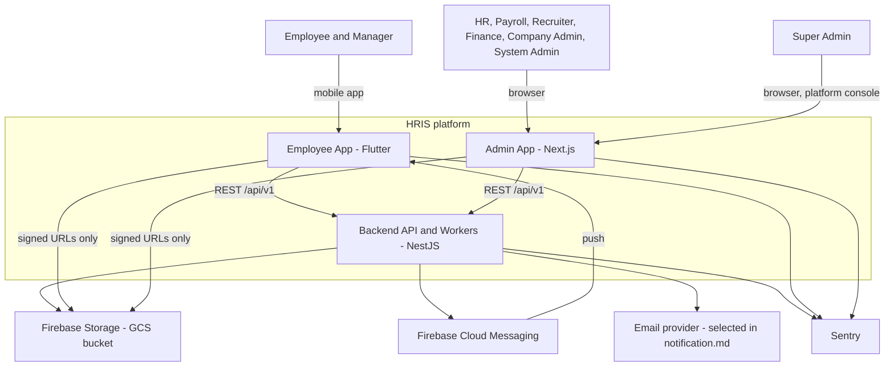
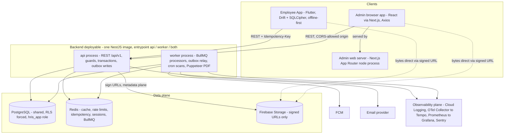
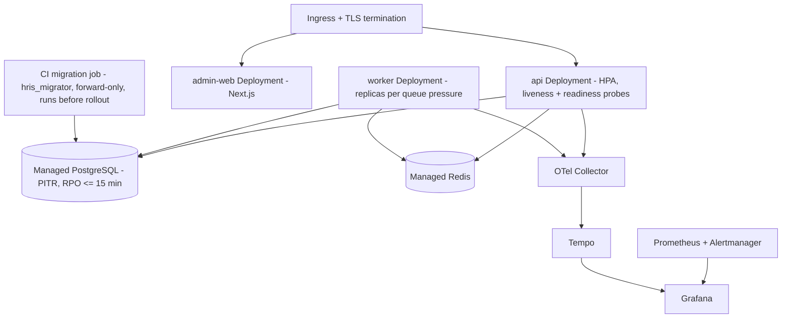
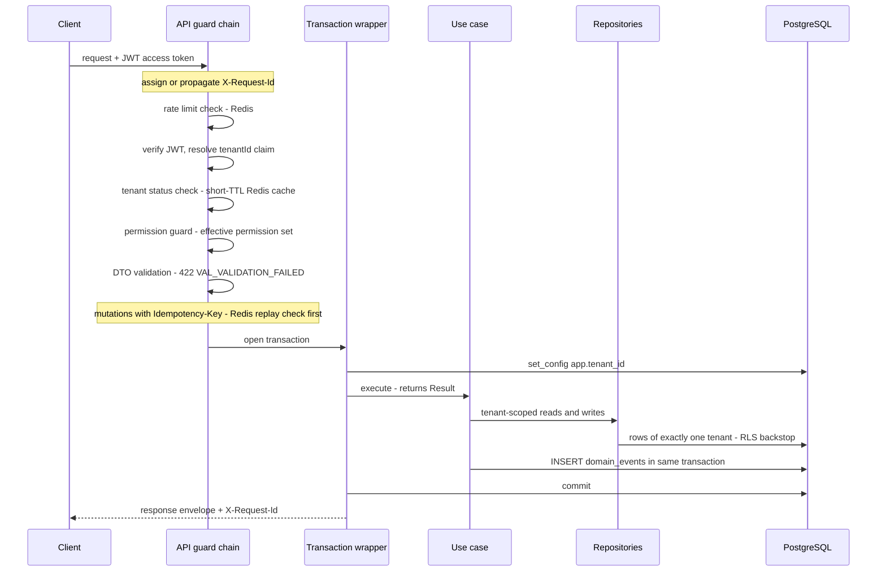
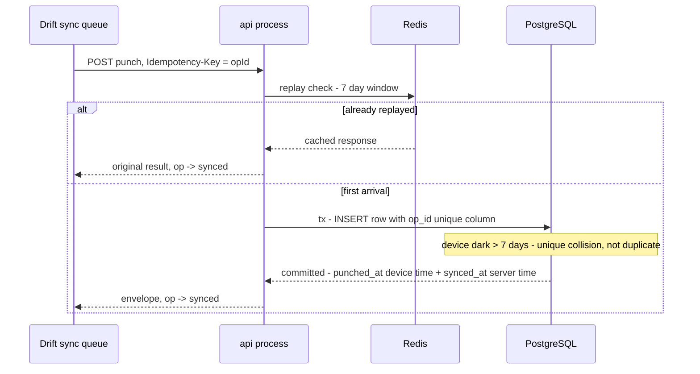
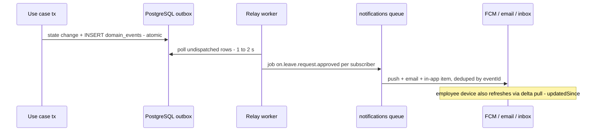

# System Overview

Status: Active (Phase 2) · Source: `docs/00-overview/product-overview.md`, `docs/adr/ADR-0001-modular-monolith-module-boundaries.md` · Downstream: `docs/02-architecture/backend-nestjs.md`, `docs/02-architecture/mobile-flutter.md`, `docs/02-architecture/admin-nextjs.md`, `docs/02-architecture/offline-sync.md`, `docs/02-architecture/multi-tenancy.md`, `docs/07-operations/environments.md`

This document fixes the runtime shape of HRIS: which processes exist, who talks to whom over which channel, and which guarantees hold end to end. It stitches decisions that live in ADRs into one picture and introduces **no new rules** — every section points at the document that owns the detail. Per-stack internals live in the sibling architecture docs; deployment specifics live in `docs/07-operations/environments.md` (Phase 4).

## 1. System context (C4 level 1)

One platform deployment serves all tenants (`docs/adr/ADR-0002-multi-tenancy-rls.md`). Two client applications, one REST API, four external services.

Deliberately **not** in the context: banks and government systems. Payroll produces bank transfer files and statutory documents (1721-A1, BPJS exports) as **downloadable files** — there are no outbound integrations in V1 (`docs/06-modules/payroll.md`, `docs/06-modules/tax-pph21.md`, `docs/06-modules/bpjs.md`). QR attendance is a per-tenant config option inside the apps, not an external system.

## 2. Container view (C4 level 2)

| Container | Technology | Responsibility | Detail |
|---|---|---|---|
| Employee App | Flutter (Android + iOS), Drift + SQLCipher, `flutter_bloc` | ESS + MSS, offline-first: local cache, durable mutation queue, background sync, FCM receiver | `docs/02-architecture/mobile-flutter.md`, `docs/02-architecture/offline-sync.md` |
| Admin browser app | React (Next.js-rendered), React Query, Axios | All admin surfaces; talks to the REST API directly from the browser | `docs/02-architecture/admin-nextjs.md` |
| Admin web server | Next.js App Router node process | Serves/renders the admin app; Server Actions only where genuinely appropriate; **no business logic, no database access** — the REST API is the contract | `docs/02-architecture/admin-nextjs.md` |
| api process | NestJS modular monolith | REST `/api/v1`, auth/tenant/permission guards, request transactions with `set_config`, domain writes + outbox inserts | `docs/02-architecture/backend-nestjs.md` |
| worker process | Same NestJS image, `worker` entrypoint | The 8 BullMQ queues (`docs/adr/ADR-0010-background-jobs-events.md`), outbox relay, scan + fan-out crons, Puppeteer PDF rendering (no-network Chromium, `docs/adr/ADR-0014-pdf-generation.md`) | `docs/adr/ADR-0010-background-jobs-events.md` |
| PostgreSQL | Single shared database, PG 16+ (A-010) | System of record; RLS `ENABLE` + `FORCE` on tenant-class tables; runtime role `hris_app` (never `BYPASSRLS`) | `docs/adr/ADR-0002-multi-tenancy-rls.md`, `docs/04-database/database-conventions.md` |
| Redis | Managed Redis | Tenant-status cache, rate limiting, `Idempotency-Key` replay window, session/device bookkeeping, BullMQ backing store | `docs/adr/ADR-0004-auth-sessions-device-management.md`, `docs/adr/ADR-0007-api-versioning-response-envelope.md` |
| Firebase Storage | One GCS bucket, `asia-southeast2` | File bytes. Clients never use the Firebase SDK — server-signed V4 URLs only; metadata rows in PostgreSQL are the authority | `docs/adr/ADR-0009-file-storage-strategy.md` |
| FCM / Email | Firebase Cloud Messaging, provider per `docs/05-platform/notification.md` | Push and email delivery, driven by the `notifications` queue | `docs/05-platform/notification.md` |
| Observability plane | Pino → Cloud Logging, OTel Collector → Tempo, Prometheus → Grafana + Alertmanager, Sentry | Logs, traces, metrics, errors — identifiers only, never PII | `docs/adr/ADR-0011-observability-stack.md` |

Two plane rules worth reading twice:

- **Byte plane vs metadata plane.** File bytes never transit the API. Upload = staged metadata row → signed PUT → commit (magic-byte check); download = permission check → signed GET. The attendance selfie spike therefore never touches NestJS bandwidth (`docs/adr/ADR-0009-file-storage-strategy.md`).
- **api vs worker is a process split, not a code split.** One image, one codebase, entrypoint flag `api` / `worker` / `both` (`docs/adr/ADR-0001-modular-monolith-module-boundaries.md` §Decision-7). Anything CPU-heavy or retryable runs on the worker side; the api side stays request-shaped.

## 3. Runtime topology

### 3.1 Production (managed Kubernetes — GKE reference, Jakarta)

D5 + A-003: cloud-portable manifests, reference region GCP `asia-southeast2` for UU PDP data residency.

- **Deployables in-cluster:** `api`, `worker`, `admin-web`, plus the observability components (kube-prometheus-stack, Tempo, OTel Collector). PostgreSQL and Redis are managed services outside the cluster (Cloud SQL reference per A-010; any managed Redis).
- **Scaling model:** `api` scales horizontally on request load (stateless — all state in PostgreSQL/Redis); `worker` replicas and per-queue concurrency are tuned per queue class (payroll low-concurrency CPU, notifications high-concurrency fan-out — `docs/adr/ADR-0010-background-jobs-events.md`). The two scale independently; that asymmetry is the first microservice-extraction pressure valve (ADR-0001 §Future).
- **Rollout order:** CI runs drizzle-kit migrations as `hris_migrator` (the only object owner) before deploying app pods; migrations are forward-only and must be compatible with the previous app version during the rollout window (`docs/04-database/database-conventions.md`).
- **Shutdown:** SIGTERM → workers stop taking jobs and finish within the grace window; stalled jobs re-queue safely because every processor is idempotent (ADR-0010).
- **Health:** liveness + readiness on api and worker; readiness gates rollouts (spec §5.16); alert rules are SLO-driven from D1–D3 (`docs/adr/ADR-0011-observability-stack.md`).

### 3.2 Build artifacts (three repositories, A-006)

| Repo | Artifact | Deploys to |
|---|---|---|
| Backend (NestJS) | One container image with `api` / `worker` / `both` entrypoints, plus the `migrate` and `smoke:reset` commands the pipeline invokes as Jobs (`docs/07-operations/ci-cd.md` §7.1, §12) | `api` + `worker` Deployments |
| Admin web (Next.js) | Container image | `admin-web` Deployment |
| Mobile (Flutter) | Android + iOS binaries | Play Store / App Store, not the cluster |

### 3.3 Local development

Docker Compose: PostgreSQL, Redis, backend (entrypoint `both`), plus `fake-gcs-server` for storage and Mailpit for outbound email; the **admin dev server and Flutter run on the host, not in Compose**. FCM is the only real cloud dependency, against a dev Firebase project — no emulator exists for it, while storage is faked so that local development stays offline-capable and needs no signing key. Specifics (compose file layout, seeds, env vars, secrets handling, and the rule that Compose creates all three database roles) are owned by `docs/07-operations/environments.md` §4.

## 4. Synchronous request flow

Every API request passes the same spine. Order matters and is fixed here; the mechanics of each hop belong to the linked docs.

Fixed points, with owners:

1. **Request identity.** `X-Request-Id` in, or assigned at the edge; echoed in every envelope and carried into logs, traces, Sentry, job payloads, and outbox events (`docs/adr/ADR-0011-observability-stack.md` correlation contract).
2. **AuthN before authZ before validation.** Token semantics per `docs/adr/ADR-0004-auth-sessions-device-management.md`; permission checks per `docs/adr/ADR-0005-rbac-permission-model.md` — deny-by-default: a route without a declared permission fails lint. Data-scope misses return 404 (existence-hiding, `docs/03-standards/error-catalog.md` §2).
3. **One transaction per request unit-of-work**, opened after the guards, with `set_config('app.tenant_id', …, true)` as its first statement — the RLS contract (`docs/adr/ADR-0002-multi-tenancy-rls.md`). Repositories are tenant-scoped by construction; RLS is the second, independent layer.
4. **Use cases return `Result`**; the presentation layer maps error codes to the envelope; exceptions are infrastructure-only and reach the global filter as `SYS_INTERNAL` (`docs/adr/ADR-0006-result-pattern-error-handling.md`).
5. **Domain events are outbox inserts inside the same transaction** — never a queue enqueue from the request path (`docs/adr/ADR-0010-background-jobs-events.md`).
6. **Envelope out**, success or error, per `docs/adr/ADR-0007-api-versioning-response-envelope.md`; money as decimal strings; pagination per resource class.
7. **CORS:** the API allows the admin web origin; header/CSP policy is owned by `docs/03-standards/security-standards.md`.

## 5. Asynchronous flows

### 5.1 Offline write reaching the server (sync class: append-only fact)

The mobile queue and conflict model are fixed in `docs/adr/ADR-0003-offline-sync-conflict-resolution.md`; the wire round trip looks like this:

Deduplication is two-layer by decision: Redis replay window (fast path, **24 hours** — reduced 2026-08-04, `performance.md` §5.2) **and** a unique `op_id` column persisted on every row a sync-class write creates (correctness, unbounded) — the ADR-0003 amendment from the 2026-08-02 grilling. Module schemas apply the column to every offline-created entity.

### 5.2 Fact fan-out (outbox → subscribers)

Using the registered example event `leave.request.approved` (`docs/adr/ADR-0010-background-jobs-events.md`):

At-least-once everywhere; every handler idempotent; a crash never loses or fabricates a fact — that is the outbox's whole job (ADR-0010).

## 6. Data flows and their guarantees

| Flow | Path | Guarantee | Owner |
|---|---|---|---|
| Interactive reads | client → api → PostgreSQL | Tenant-scoped transaction; D2 p95 < 300 ms | `docs/03-standards/api-standards.md` |
| Interactive writes | client → api → tx (+ outbox) | Atomic with events; Result-mapped envelope errors | ADR-0006 / ADR-0010 |
| Offline sync writes | Drift queue → api, `Idempotency-Key` = opId | Server-authoritative, per-entity sync class, two-layer dedup, pending data never deleted | ADR-0003, `docs/02-architecture/offline-sync.md` |
| Mobile reads | api `updatedSince` delta endpoints → Drift replace | Read-only reference data; server replaces on pull | ADR-0003 |
| File upload/download | metadata via api; bytes direct to/from GCS via signed URL | `staged → committed` lifecycle; metadata row is the authority | ADR-0009 |
| Push / email / in-app | outbox → relay → `notifications` queue → FCM/provider/inbox | At-least-once, `eventId`-deduped, delivery tracked | ADR-0010, `docs/05-platform/notification.md` |
| Payroll, imports, exports, reports | api enqueues → dedicated queues → worker | Job-class retry policies; progress persisted; D1: 10k-employee run < 30 min | ADR-0010 / ADR-0012 / ADR-0015 |
| Platform analytics | per-tenant jobs materialize platform aggregate tables | Never live cross-tenant SQL; no `BYPASSRLS` runtime | ADR-0002 |
| Telemetry | stdout / OTel / prom-client → observability plane | Identifiers only — PII never leaves the request path | ADR-0011 |

## 7. Cross-cutting invariants

The short list every engineer and AI assistant must hold in working memory. One line each; the owner has the detail.

| Invariant | Owner |
|---|---|
| Every tenant-table statement runs in a transaction with `app.tenant_id` set; repository scoping + RLS are independent layers; no runtime credential holds `BYPASSRLS` | ADR-0002 |
| All client access is REST `/api/v1` with the standard envelope; `X-Request-Id` correlates client → logs → traces → jobs → events | ADR-0007, ADR-0011 |
| Permissions are the unit of enforcement; routes declare them or fail lint; data-scope misses are 404, not 403 | ADR-0005, error-catalog §2 |
| Business failures are `Result` values with catalog codes; exceptions are infrastructure-only | ADR-0006 |
| Money is IDR, `numeric(15,2)` in the database, decimal **string** on every wire | ADR-0007, database-conventions |
| Timestamps stored UTC; attendance/shift/display logic resolves against the **branch** timezone | product-overview §6 |
| Server is authoritative for sync; every synced entity has exactly one sync class; pending offline data is never deleted | ADR-0003 |
| Retryable mutations carry `Idempotency-Key`; sync-class rows persist `op_id` in a unique column | ADR-0003, ADR-0007 |
| Cross-module: facade calls (sync) or outbox events (async) — nothing else; every processor idempotent | ADR-0001, ADR-0010 |
| All user-facing strings are i18n keys in id + en; regulation-dependent values are effective-dated settings, never constants | product-overview §6, `docs/05-platform/settings.md` |
| Telemetry carries identifiers only — no names, NIK/NPWP, salary, bank data, or file contents | ADR-0011 |

## 8. Capacity anchors (D1/D2 → topology)

| Load case | How the topology absorbs it |
|---|---|
| Attendance spike — 30% of a tenant clocks in within 15 min | Stateless `api` behind HPA; punch = one idempotent insert (two-layer dedup, no read-modify-write); selfie bytes go direct to GCS, never through NestJS. **Read per fleet, not per tenant** — see below |
| Payroll run — 10,000 employees < 30 min | `payroll` queue on the worker Deployment: low per-worker concurrency, replicas scaled independently of api; fail-fast retry class surfaces data errors on the run instead of grinding |
| Read p95 < 300 ms / write p95 < 800 ms | Tenant-first composite indexes (database-conventions §7), short-TTL Redis caches (tenant status), transaction-mode pooling compatible `set_config` |
| 99.9% availability, RPO ≤ 15 min, RTO ≤ 4 h | Managed PostgreSQL with PITR; health-gated rollouts; forward-only migrations keep N−1 app compatible during deploys |

**Discharged 2026-08-04 — and this table's per-tenant framing was the thing that needed correcting.** `performance.md` §2 reads D1 at the fleet, because every tenant is Indonesian and offices open at the same hour, so the spike is one event rather than 500 independent ones. At the design point that is **≈ 333 app opens per second**, and the punch is **one of two writes and one of about eight requests** — token rotation is exactly as large a write source (`ADR-0004`), and delta pulls, bootstrap, and permission resolution carry the rest. Row 1 above is correct about mechanism and roughly eightfold optimistic about volume. Row 2's payroll clause is likewise per run, while month-end concentrates a million payslips onto one shared queue and one `worker` Deployment. Row 3's mechanisms are right and now have numbers behind them: `performance.md` §3.2 shows fixed request overhead is ~10 ms of 300, so **97% of the read budget is the query itself**.

## 9. V1 topology boundaries and their seams

What is deliberately absent, and the seam that keeps it cheap later — details in the owning docs:

| Not in V1 | Seam kept |
|---|---|
| Per-tenant databases | `ConnectionProvider` keyed by `TenantContext`; RLS policies stay harmless on dedicated instances (ADR-0002) |
| Message broker (Kafka/PubSub) | Outbox relay is the single swap point; producers never change (ADR-0010) |
| Microservice extraction | Facade + event seams, table-ownership inventory, worker entrypoint split first (ADR-0001) |
| Shared-device kiosk attendance | Queue model reuses ADR-0003 with a device-account twist, post-GA |
| MFA | `sessions.mfa_verified` + remember-device hooks reserved (A-007 — first fast-follow) |
| Inline antivirus scanning | `quarantined` status + commit-hook divert reserved; ClamAV worker post-GA (ADR-0009) |
| Subscription billing | Tenant plan/limit fields reserved (D13, `docs/06-modules/system-administration.md`) |
