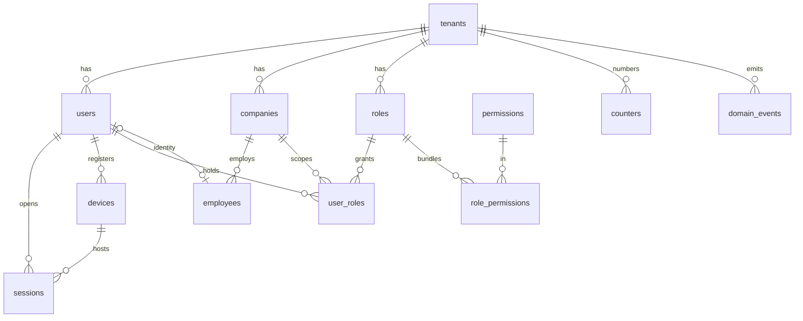

# Core Schema

Status: Active (Phase 1 anchor) · Applies: `docs/04-database/database-conventions.md` (all rules; shared builders §3.4) · Related ADRs: 0002 (RLS), 0004 (sessions/devices), 0005 (RBAC), 0010 (outbox), 0013 (rationale)

Drizzle definitions for the platform skeleton every module builds on: tenancy, identity, RBAC, company, employee core, and event/number infrastructure. Requires **PostgreSQL 16+** (`UNIQUE NULLS NOT DISTINCT`, A-010). All statutory/master-data detail lives in module docs — this file owns table shape, constraints, indexes, and RLS application only.

## 1. Table ownership and deferrals

| Table | Owner (writes) | Extended by |
|---|---|---|
| `tenants`, `platform_users` | system-administration | plan/limit fields reserved (D13) |
| `users`, `sessions`, `devices` | authentication | — |
| `permissions`, `roles`, `role_permissions`, `user_roles` | authorization-rbac | — |
| `companies` | organization | legal/payroll identity fields in `docs/06-modules/organization.md` |
| `employees` | employee | full master data (NIK, NPWP, BPJS, bank — ADR-0016 encrypted set; PTKP plaintext by decision), status history in `docs/06-modules/employee.md` |
| `counters` | shared infra (repository helper) | — |
| `domain_events`, `processed_events` | events relay (ADR-0010) | — |

Deliberately **not** here: branches/departments/positions and employee↔org placement (effective-dated assignment tables, `docs/06-modules/organization.md`); settings tables (`docs/05-platform/settings.md`); files (`docs/05-platform/document-storage.md`). Employees carry no `branch_id` column — placement is an organization-module assignment, so core stays stable when org structure evolves.

## 2. ERD



`platform_users` and `processed_events` stand alone (no tenant FK).

## 3. Enums

```ts
export const tenantStatus = pgEnum('tenant_status', ['active', 'suspended', 'archived']);
export const userStatus = pgEnum('user_status', ['active', 'inactive', 'locked']);
export const devicePlatform = pgEnum('device_platform', ['android', 'ios']);
export const deviceStatus = pgEnum('device_status', ['active', 'revoked']);
export const employeeStatus = pgEnum('employee_status', ['active', 'on_leave', 'resigned', 'terminated']);
export const employmentType = pgEnum('employment_type', ['pkwt', 'pkwtt']);
```

## 4. Platform tables (no `tenant_id`, no RLS — platform-permission access only)

```ts
export const tenants = pgTable('tenants', {
  ...id,
  name: text('name').notNull(),
  slug: text('slug').notNull(),                    // stable machine name
  status: tenantStatus('status').notNull().default('active'),
  // D13 reserved — no billing logic in V1:
  plan: text('plan'),
  employeeLimit: integer('employee_limit'),
  ...auditColumns,
  ...softDeleteColumns,
}, (t) => [
  uniqueIndex('uq_tenants_slug').on(t.slug).where(sql`deleted_at IS NULL`),
]);

export const platformUsers = pgTable('platform_users', {
  ...id,
  email: text('email').notNull(),
  passwordHash: text('password_hash').notNull(),
  status: userStatus('status').notNull().default('active'),
  ...auditColumns,
  ...softDeleteColumns,
}, (t) => [
  uniqueIndex('uq_platform_users_email').on(t.email).where(sql`deleted_at IS NULL`),
]);
```

Super Admin lives in `platform_users`, outside tenant RBAC (ADR-0005); its session mechanics are specified in `docs/06-modules/system-administration.md` and enter tenants only via audited impersonation tokens (ADR-0002).

**Extended 2026-08-04** (system-administration.md §4.1, ADR-0017): `platform_users` gains `totp_secret` (ADR-0016 `encryptedText`) and `totp_enrolled_at` — TOTP is mandatory for platform users and only for platform users. Sessions do **not** reuse `sessions` above, which is tenant-class with `tenant_id NOT NULL` under RLS; a new platform-class table `platform_sessions` holds them, with no device binding and no `mfa_verified` flag, because the row cannot exist without a verified TOTP leg. Three further platform tables arrive with that module — `tenant_keys` (ADR-0016's wrapped per-tenant DEK, one row per tenant), `tenant_feature_flags`, and `impersonation_sessions` — all four listed in the platform class of §9's RLS table below.

```ts
export const permissions = pgTable('permissions', {   // platform catalog, seeded from code
  ...id,
  key: text('key').notNull(),                         // 'leave.request.approve'
  module: text('module').notNull(),                   // ns from naming §4
  description: text('description').notNull(),
  ...auditColumns,
}, (t) => [
  uniqueIndex('uq_permissions_key').on(t.key),
  index('idx_permissions_module').on(t.module),
]);
```

## 5. Identity (tenant-owned, RLS)

```ts
export const users = pgTable('users', {
  ...id,
  ...tenantId,
  email: text('email').notNull(),
  passwordHash: text('password_hash').notNull(),
  status: userStatus('status').notNull().default('active'),
  lastLoginAt: timestamp('last_login_at', { withTimezone: true }),
  ...auditColumns,
  ...softDeleteColumns,
}, (t) => [
  uniqueIndex('uq_users_tenant_id_email').on(t.tenantId, t.email).where(sql`deleted_at IS NULL`),
]);

export const devices = pgTable('devices', {
  ...id,
  ...tenantId,
  userId: uuid('user_id').notNull().references(() => users.id),
  installId: uuid('install_id').notNull(),            // client-generated per install (ADR-0004)
  platform: devicePlatform('platform').notNull(),
  model: text('model').notNull(),
  osVersion: text('os_version').notNull(),
  appVersion: text('app_version').notNull(),
  fcmToken: text('fcm_token'),
  status: deviceStatus('status').notNull().default('active'),
  lastSeenAt: timestamp('last_seen_at', { withTimezone: true }),
  revokedAt: timestamp('revoked_at', { withTimezone: true }),
  revokedReason: text('revoked_reason'),
  ...auditColumns,
}, (t) => [
  uniqueIndex('uq_devices_tenant_id_install_id_active')
    .on(t.tenantId, t.installId).where(sql`status = 'active'`),
  index('idx_devices_tenant_id_user_id').on(t.tenantId, t.userId),
]);

export const sessions = pgTable('sessions', {
  ...id,
  ...tenantId,
  userId: uuid('user_id').notNull().references(() => users.id),
  deviceId: uuid('device_id').references(() => devices.id),   // null = web session
  refreshTokenHash: text('refresh_token_hash').notNull(),     // sha256, rotates (ADR-0004)
  trustedDevice: boolean('trusted_device').notNull().default(false),
  mfaVerified: boolean('mfa_verified').notNull().default(false), // reserved, A-007
  ip: text('ip').notNull(),
  userAgent: text('user_agent'),
  lastUsedAt: timestamp('last_used_at', { withTimezone: true }).notNull().defaultNow(),
  expiresAt: timestamp('expires_at', { withTimezone: true }).notNull(),  // absolute cap
  revokedAt: timestamp('revoked_at', { withTimezone: true }),
  revokedReason: text('revoked_reason'),
  ...auditColumns,
}, (t) => [
  uniqueIndex('uq_sessions_refresh_token_hash').on(t.refreshTokenHash),
  index('idx_sessions_tenant_id_user_id_live')
    .on(t.tenantId, t.userId).where(sql`revoked_at IS NULL`),
]);
```

Rotation history (used-token detection for family revoke) is a Redis structure keyed by session id, not a table — sessions store only the current hash.

## 6. RBAC (ADR-0005)

```ts
export const roles = pgTable('roles', {
  ...id,
  ...tenantId,
  key: text('key').notNull(),                 // 'hr_admin' for system roles; slug for custom
  name: text('name').notNull(),
  description: text('description'),
  isSystem: boolean('is_system').notNull().default(false),  // immutable templates
  ...auditColumns,
  ...softDeleteColumns,
}, (t) => [
  uniqueIndex('uq_roles_tenant_id_key').on(t.tenantId, t.key).where(sql`deleted_at IS NULL`),
]);

export const rolePermissions = pgTable('role_permissions', {
  ...tenantId,                                 // denormalized so RLS applies (conventions §2)
  roleId: uuid('role_id').notNull().references(() => roles.id, { onDelete: 'cascade' }),
  permissionId: uuid('permission_id').notNull().references(() => permissions.id),
}, (t) => [
  primaryKey({ columns: [t.roleId, t.permissionId] }),
  index('idx_role_permissions_tenant_id_role_id').on(t.tenantId, t.roleId),
]);

export const userRoles = pgTable('user_roles', {
  ...id,
  ...tenantId,
  userId: uuid('user_id').notNull().references(() => users.id),
  roleId: uuid('role_id').notNull().references(() => roles.id),
  companyId: uuid('company_id').references(() => companies.id),  // NULL = tenant-wide (ADR-0005)
  ...auditColumns,                             // created_by = who granted
}, (t) => [
  uniqueIndex('uq_user_roles_assignment')
    .on(t.tenantId, t.userId, t.roleId, t.companyId),  // manual: NULLS NOT DISTINCT (§10)
  index('idx_user_roles_tenant_id_user_id').on(t.tenantId, t.userId),
]);
```

`role_permissions` is a pure junction (no audit columns, hard-delete on role edit, cascade from role). `user_roles` is an audited assignment, soft-delete-free: revoking = hard delete + audit-log event (grant history lives in the audit log, not dead rows).

## 7. Company and employee core

```ts
export const companies = pgTable('companies', {
  ...id,
  ...tenantId,
  code: text('code').notNull(),               // human key for imports/numbers
  name: text('name').notNull(),
  ...auditColumns,
  ...softDeleteColumns,
}, (t) => [
  uniqueIndex('uq_companies_tenant_id_code').on(t.tenantId, t.code).where(sql`deleted_at IS NULL`),
]);

export const employees = pgTable('employees', {
  ...id,
  ...tenantId,
  companyId: uuid('company_id').notNull().references(() => companies.id),  // §5.6: one company
  userId: uuid('user_id').references(() => users.id),  // null = no login (e.g. pre-onboarding)
  employeeNumber: text('employee_number').notNull(),   // counters-generated (conventions §6)
  fullName: text('full_name').notNull(),
  joinDate: date('join_date').notNull(),
  employmentType: employmentType('employment_type').notNull(),
  status: employeeStatus('status').notNull().default('active'),
  ...auditColumns,
  ...softDeleteColumns,
}, (t) => [
  uniqueIndex('uq_employees_tenant_id_company_id_number')
    .on(t.tenantId, t.companyId, t.employeeNumber).where(sql`deleted_at IS NULL`),
  uniqueIndex('uq_employees_tenant_id_user_id')
    .on(t.tenantId, t.userId).where(sql`user_id IS NOT NULL AND deleted_at IS NULL`),
  index('idx_employees_tenant_id_company_id_status').on(t.tenantId, t.companyId, t.status),
]);
```

Core deliberately excludes: NIK/NPWP/PTKP/BPJS/bank (sensitive master data; encrypted set fixed by ADR-0016 → `docs/06-modules/employee.md`), org placement (→ organization assignments), status history (→ employee.md state machine; `status` here is the current value). The future `Employment` entity (§5.6) extracts `companyId`/`employmentType`/`joinDate` into its own table — keeping them free of org-placement coupling here is that migration path.

## 8. Infrastructure tables

```ts
export const counters = pgTable('counters', {          // business numbers, conventions §6
  ...id,
  ...tenantId,
  companyId: uuid('company_id').references(() => companies.id),  // NULL = tenant-level counter
  key: text('key').notNull(),                          // 'employee_number', 'payslip_number'
  currentValue: integer('current_value').notNull().default(0),
  ...auditColumns,
}, (t) => [
  uniqueIndex('uq_counters_scope').on(t.tenantId, t.companyId, t.key),  // manual: NULLS NOT DISTINCT
]);

export const domainEvents = pgTable('domain_events', {  // outbox, ADR-0010
  ...id,                                                // uuidv7 = time-ordered relay cursor
  name: text('name').notNull(),                         // 'leave.request.approved'
  tenantId: uuid('tenant_id').references(() => tenants.id),  // NULL = platform-level event
  aggregateId: uuid('aggregate_id').notNull(),
  occurredAt: timestamp('occurred_at', { withTimezone: true }).notNull(),
  requestId: text('request_id'),
  version: integer('version').notNull().default(1),     // payload schema version
  payload: jsonb('payload').notNull(),
  dispatchedAt: timestamp('dispatched_at', { withTimezone: true }),
  createdAt: timestamp('created_at', { withTimezone: true }).notNull().defaultNow(),
}, (t) => [
  index('idx_domain_events_undispatched').on(t.id).where(sql`dispatched_at IS NULL`),
]);

export const processedEvents = pgTable('processed_events', {  // consumer idempotency guard
  consumer: text('consumer').notNull(),                 // 'notifications.on.leave.request.approved'
  eventId: uuid('event_id').notNull(),
  processedAt: timestamp('processed_at', { withTimezone: true }).notNull().defaultNow(),
}, (t) => [
  primaryKey({ columns: [t.consumer, t.eventId] }),
]);
```

`domain_events`/`processed_events` are **platform-infra**: written inside tenant transactions but read by the platform relay, so they carry no RLS (below). They hold tenant payloads — access is repository-only via the events module, same trust class as BullMQ payloads in Redis; rows purge at 30 days (ADR-0010).

## 9. RLS application (ADR-0002, template in conventions §9)

| Table | RLS (`ENABLE` + `FORCE` + tenant policy) |
|---|---|
| `users`, `sessions`, `devices`, `roles`, `role_permissions`, `user_roles`, `companies`, `employees`, `counters` | **yes** |
| `tenants`, `platform_users`, `permissions`, and (2026-08-04) `platform_sessions`, `tenant_keys`, `tenant_feature_flags`, `impersonation_sessions` | no — platform class |
| `domain_events`, `processed_events` | no — platform infra (relay reads cross-tenant); documented exception |

One deliberate wrinkle: the **login flow** (email → candidate tenants, ADR-0004) runs before a tenant context exists. Authentication uses a dedicated, single-purpose repository executing under a narrowly-granted lookup path documented in `docs/05-platform/authentication.md` — never a general RLS bypass.

## 10. Bootstrap migrations

| # | Content |
|---|---|
| `0001_extensions` | `btree_gist` (later effective-dated tables), citext not used (email uniqueness is per-tenant exact) |
| `0002_platform` | enums, `tenants`, `platform_users`, `permissions` |
| `0003_identity` | `users`, `devices`, `sessions` + RLS `-- manual:` |
| `0004_org_core` | `companies`, `employees`, `counters` + RLS; `-- manual:` NULLS NOT DISTINCT on `uq_counters_scope` |
| `0005_rbac` | `roles`, `role_permissions`, `user_roles` + RLS; `-- manual:` `UNIQUE NULLS NOT DISTINCT` rewrite of `uq_user_roles_assignment` |
| `0006_events` | `domain_events`, `processed_events` |

Drizzle cannot express `NULLS NOT DISTINCT` — those two uniques are hand-rewritten in the generated migration (`-- manual:` block), which is why PostgreSQL 16+ is pinned (A-010).

**Order corrected 2026-08-05** (`hris-api` walking skeleton). `rbac` and `org_core` were the other way round, and the pair does not commute: `user_roles.company_id` references `companies.id` (§6), so creating `user_roles` before `companies` fails on the foreign key. The dependency runs one way only — nothing in `org_core` references an RBAC table — so swapping them is the whole fix, and the numbering moves with it. Found by generating the migrations against the list rather than by reading it.

## 11. Seeds

- `permissions`: full catalog from code registry (authorization-rbac doc).
- `roles`: ten system templates per tenant at provisioning (`is_system = true`), re-synced idempotently on deploy (ADR-0005).
- No demo/business data in seeds; fixtures live in test code.
