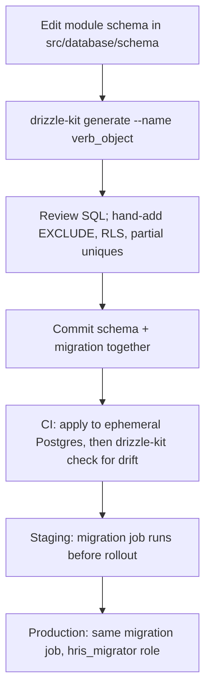

# Database Conventions

Status: Active (Phase 1 anchor) · Related: `docs/03-standards/naming-conventions.md` (§2 DB naming), `docs/adr/ADR-0002-multi-tenancy-rls.md` (isolation model), `docs/adr/ADR-0013-database-conventions-drizzle.md` (rationale), `docs/04-database/core-schema.md` (applies these rules)

Binding rules for every PostgreSQL object and every Drizzle schema in the backend, and for the Drift mirror on mobile. Naming lives in naming-conventions §2; this document defines semantics. Rationale and alternatives live in ADR-0002/ADR-0013 — not here.

## 1. General rules

1. PostgreSQL is the only system of record. Redis is cache/coordination; Drift is a mobile replica — neither is ever authoritative over Postgres.
2. Primary keys: `id uuid`, **UUIDv7 generated in the application** (Drizzle `$defaultFn`), never `serial`. UUIDv7 keeps B-tree locality; no DB-side default so inserts are testable and portable.
3. All timestamps: `timestamptz`, always UTC. Date-only business values: `date` (e.g. `punch_date`, `effective_from`). Branch timezone (IANA string, e.g. `Asia/Jakarta`) converts at the edge — never stored in timestamps.
4. Money: `numeric(15, 2)`, IDR. No floats anywhere near money. Intermediate calculation precision and rounding rules are defined per module (payroll, tax); the stored value is always the rounded result.
5. Enum-like values: PostgreSQL enums (naming §2.3). Add values with `ALTER TYPE … ADD VALUE`; never remove or rename released values — deprecate in code.
6. Columns are `NOT NULL` by default; nullable is an explicit, justified choice.
7. Every logical reference is a declared FK with an index (§7). Referential integrity lives in the database, not only in application code.
8. `jsonb` is allowed only for: config snapshots, denormalized computation snapshots (e.g. payslip breakdown), integration payloads, and genuinely schema-less metadata. Never for fields that business rules filter or join on.
9. Raw SQL exists only inside repository implementations (`CLAUDE.md` hard constraint). Anything else — services, controllers, jobs — goes through a repository.
10. Optimistic locking: mutable entities that mobile edits offline carry `version integer NOT NULL DEFAULT 1`; repositories increment it on every update and reject stale writes (`WHERE version = :expected`). Consumed by the sync engine (`docs/adr/ADR-0003-offline-sync-conflict-resolution.md`). Append-only tables (punches, audit) do not carry `version`.

## 2. Table classification

Every table declares exactly one class; the class dictates tenant column, RLS, and scoping behavior:

| Class | `tenant_id` | RLS | Examples |
|---|---|---|---|
| Platform | absent | no (platform-role access only) | `tenants`, `platform_settings`, `feature_flags` |
| Tenant-owned | `NOT NULL`, FK → `tenants.id` | yes | `users`, `roles`, `holiday_calendars` |
| Company-scoped | `tenant_id NOT NULL` **and** `company_id NOT NULL` | yes (tenant policy; company scoping enforced in repositories) | `employees`, `payroll_runs`, `attendance_punches` |

Rules:

- `tenant_id` is never nullable on tenant-owned/company-scoped tables, never updated after insert, and appears in **every** composite unique constraint on those tables (`uq_employees_tenant_id_nik`, not `uq_employees_nik`).
- Cross-tenant FKs are structurally impossible: FKs from tenant-owned tables may only point at platform tables or tables of the same tenant class; repositories + RLS enforce the tenant match.
- Company-scoped uniqueness includes `company_id` where the business boundary is the company (e.g. employee number).

## 3. Standard columns

### 3.1 Audit fields (every table except pure junction tables)

| Column | Type | Rule |
|---|---|---|
| `created_at` | `timestamptz NOT NULL` | set by Drizzle default at insert |
| `updated_at` | `timestamptz NOT NULL` | set by Drizzle `$onUpdate`; equal to `created_at` until first update |
| `created_by` | `uuid` nullable | user id; `NULL` = system actor (job, migration, sync fan-out) |
| `updated_by` | `uuid` nullable | same semantics |

No DB triggers for audit fields — the Drizzle layer and repositories own them (portable, testable). Full actor context (IP, device, before/after) belongs to `docs/05-platform/audit-log.md`, not to these columns.

### 3.2 Soft delete

| Column | Type | Rule |
|---|---|---|
| `deleted_at` | `timestamptz` nullable | `NULL` = live row |
| `deleted_by` | `uuid` nullable | set together with `deleted_at` |

### 3.3 Effective dating

| Column | Type | Rule |
|---|---|---|
| `effective_from` | `date NOT NULL` | inclusive |
| `effective_to` | `date` nullable | exclusive; `NULL` = open-ended current record |

### 3.4 Shared Drizzle builders

Defined once in `src/database/schema/_shared.ts`; every table spreads them — hand-rolling these columns is a review blocker:

```ts
import { sql } from 'drizzle-orm';
import { date, integer, timestamp, uuid } from 'drizzle-orm/pg-core';
import { uuidv7 } from 'uuidv7';

export const id = { id: uuid('id').primaryKey().$defaultFn(() => uuidv7()) };

export const tenantId = {
  tenantId: uuid('tenant_id').notNull().references(() => tenants.id),
};

export const auditColumns = {
  createdAt: timestamp('created_at', { withTimezone: true }).notNull().defaultNow(),
  updatedAt: timestamp('updated_at', { withTimezone: true })
    .notNull().defaultNow().$onUpdate(() => new Date()),
  createdBy: uuid('created_by'),
  updatedBy: uuid('updated_by'),
};

export const softDeleteColumns = {
  deletedAt: timestamp('deleted_at', { withTimezone: true }),
  deletedBy: uuid('deleted_by'),
};

export const effectiveDating = {
  effectiveFrom: date('effective_from').notNull(),
  effectiveTo: date('effective_to'),
};

export const versionColumn = { version: integer('version').notNull().default(1) };
```

## 4. Soft-delete semantics

1. Soft delete is the default delete for business entities. Hard delete is reserved for: purge jobs (§4.4), platform tooling, and tables documented as hard-delete (pure junctions, ephemeral queue rows).
2. Repositories exclude soft-deleted rows by default; reading them requires an explicit `includeDeleted` repository option, exposed over API only to admin surfaces (`includeDeleted` query param, naming §3).
3. Unique constraints must ignore dead rows — always partial:
   `CREATE UNIQUE INDEX uq_employees_tenant_id_nik ON employees (tenant_id, nik) WHERE deleted_at IS NULL;`
   (Drizzle: `uniqueIndex().where(sql`deleted_at IS NULL`)`.)
4. Restore = set `deleted_at`/`deleted_by` to `NULL`; restore may fail on unique conflict with a newer live row — surfaced as a module error code, never auto-resolved.
5. FKs and soft delete: deleting a parent soft-deletes or blocks per module rules (module docs state which); the DB-level `ON DELETE` policy (§8) only governs hard deletes by purge jobs.

### 4.4 Purge and retention (D4)

A `maintenance` queue job hard-deletes soft-deleted rows after their class window. Windows are configurable via **module-owned retention keys** in settings §4.2 (`notification.retention_days`, `inbox.retention_days`, `audit.hot_retention_months`, `import-export.retention_days`, coming `attendance.selfie_retention_months` — grilled 2026-08-02; there is no `maintenance.*` namespace), floor-bounded by statute:

| Data class | Window after soft delete | Note |
|---|---|---|
| Payroll runs, payslips, tax outputs (1721-A1), BPJS reports | **no purge** before 10 years from period end | stays in the live database for the whole window — see below |
| Audit log | append-only, never soft-deleted; 2 years hot → cold archive | `docs/05-platform/audit-log.md` |
| Employee master + employment history | retained for statutory employment/tax horizon after termination | UU PDP retention interplay in security-standards |
| Operational clutter (read notifications, closed inbox items, import job artifacts) | 12 months | pure hygiene |
| Attendance punches and derived day rows | **undefined — open regulatory question** | added 2026-08-04; `ADR-0023` |
| Mobile sync queue (`local_sync_queue`) | **never purged while pending** | spec §5.7; synced entries follow the 90-day local retention |

**Correction, 2026-08-04 (`backup-restore.md` §10 session).** The payroll row previously read *"archive to cold storage per D4"*. D4's cold-archive clause attaches to the **audit log only** — *"Payroll and tax records ≥ 10 years; audit log 2 years hot + cold archive"* — and no archive job for payroll or tax exists in payroll.md, tax-pph21.md, or bpjs.md; all three state instead that those rows are exempt from every purge path. So this table promised a mechanism nobody owned, on an authority that does not say it.

**Payroll and tax rows stay in the live database for the full ten years.** They are *queried*, not merely retained — payslip reprint, the revisioned 1721-A1 reissue tax-pph21 defines, retro worklists, and the multi-year form search that module's §15 names as a product need. An archive you must restore to answer a routine HR request is worse than disk, the volume is bounded next to attendance punches, and an archive job would be an eleventh entry in testing-strategy §14.1's destructive class. Trigger to revisit, named: those tables reaching a size where vacuum time or disk cost is the binding constraint.

**Attendance retention is a gap, named 2026-08-04 (`ADR-0023`, `performance.md` §4.5–§4.6).** The row above was absent from this table entirely, and `attendance_punches` is the **largest table in the system** — roughly 500M rows a year at D1's design point, with `attendance_days` at 250M. `attendance.selfie_retention_months` governs the image files; nothing governed the rows. No number is invented here: attendance records are evidence in an Indonesian labour dispute, so the horizon is a regulatory fact. Two consequences are already fixed regardless of what it turns out to be — the table cannot be range-partitioned by date (its `op_id` unique carries no date column), so deletion will always be a batched `DELETE` under rule 6 rather than a `DROP PARTITION`.

> ⚠️ VERIFY: confirm against current Indonesian regulation before implementation. — statutory retention horizons (payroll/tax 10-year floor, post-termination employee data, **attendance punch and derived-day records**, UU PDP limits).

## 5. Effective-dating pattern

Used for: salary history, org assignments (position/department moves), regulatory parameter tables (TER, PTKP, BPJS caps), policy configs. Semantics:

1. Interval is `[effective_from, effective_to)` — from inclusive, to exclusive, `effective_to IS NULL` = current. Adjacent records share the boundary date without overlap.
2. **No overlap per entity** is enforced in the database, not only in code — btree_gist exclusion constraint added as hand-written SQL in the generating migration (drizzle-kit cannot express it):

```sql
CREATE EXTENSION IF NOT EXISTS btree_gist;
ALTER TABLE salary_histories ADD CONSTRAINT excl_salary_histories_no_overlap
  EXCLUDE USING gist (
    tenant_id WITH =,
    employee_id WITH =,
    daterange(effective_from, effective_to, '[)') WITH &&
  ) WHERE (deleted_at IS NULL);
```

3. As-of query shape (repository helper, one implementation, reused):
   `WHERE effective_from <= :asOf AND (effective_to IS NULL OR effective_to > :asOf)`
4. Changing history: closing the current record (`effective_to = :newFrom`) and inserting the successor happens in one transaction — repositories expose this as a single `supersede()` operation; callers never write the two rows independently.
5. Payroll and attendance always read config **as-of the period/date being processed**, never "current".

## 6. Business number columns

Human-facing identifiers (`employee_number`, `payslip_number`, `request_number`) are separate from `id`: `text NOT NULL`, unique per tenant (or per company where the module says so) via partial unique index. Formats and reset cadence are module decisions; generation uses a per-tenant counters table with `SELECT … FOR UPDATE` inside the creating transaction — never `MAX()+1`, never global sequences (they leak cross-tenant volume).

## 7. Index rules

1. Every FK column is indexed unless it is the leading column of an existing composite.
2. Composite indexes on tenant-owned tables lead with `tenant_id` (spec §5.14). Order after that: equality columns → range columns.
3. Soft-deleted tables: hot-path indexes are partial `WHERE deleted_at IS NULL`; uniques always are (§4.3).
4. Index only what a documented query needs — every index beyond PK/FK/unique cites its query in the module doc. No speculative indexes.
5. Naming per naming-conventions §2.4; the name lists columns in index order.

## 8. Relations and `ON DELETE`

- Default: `ON DELETE RESTRICT` — purge jobs delete children first, explicitly.
- `CASCADE` only for true composition where the child is meaningless alone (approval steps → approval instance, payslip lines → payslip, punch photos metadata → punch).
- `SET NULL` only for optional reference columns whose loss is not a loss of meaning. **Not actor columns** *(corrected 2026-08-05; A-173, `erd-overview.md` §7)* — this clause originally named `created_by` as its example, and `created_by`/`updated_by`/`deleted_by` carry **no foreign key at all**, ~250 instances across ~96 tables. `SET NULL` on an actor column means deleting a user erases their attribution on every row they ever touched, which is the failure `erd-overview.md` §7's `audit_logs` row already refuses. As written the clause named a column class with zero instances.
- Module docs state the delete/purge order for their aggregates.

## 9. Row Level Security (D11)

Repository scoping is the first line; RLS is defense-in-depth. Model and platform-access rules: `docs/adr/ADR-0002-multi-tenancy-rls.md`. Conventions:

1. Session variable: **`app.tenant_id`**, set per request **transaction** via `set_config(..., true)` (transaction-local). `SET LOCAL` with bind parameters is not valid SQL — always `set_config`:

```ts
await db.transaction(async (tx) => {
  await tx.execute(sql`SELECT set_config('app.tenant_id', ${ctx.tenantId}, true)`);
  return work(tx); // every repository call in this request runs inside tx
});
```

2. Policy template (every tenant-owned/company-scoped table; added in the same migration that creates the table):

```sql
ALTER TABLE leave_requests ENABLE ROW LEVEL SECURITY;
ALTER TABLE leave_requests FORCE ROW LEVEL SECURITY;
CREATE POLICY tenant_isolation ON leave_requests
  FOR ALL
  USING (tenant_id = current_setting('app.tenant_id', true)::uuid)
  WITH CHECK (tenant_id = current_setting('app.tenant_id', true)::uuid);
```

`current_setting(..., true)` yields `NULL` when unset → policy evaluates false → **zero rows / rejected writes by default**. A request that forgets to set the variable reads nothing rather than everything.

3. Roles: `hris_migrator` owns objects, runs migrations, and carries `BYPASSRLS` (grilled 2026-08-02: `FORCE` binds the owner too — without the bypass, in-migration DML on tenant-class rows silently affects zero rows). The runtime connects as **`hris_app`** — not the owner, no `BYPASSRLS` (hence `FORCE` + non-owner double lock). Platform-level operations (Super Admin, cross-tenant jobs) follow ADR-0002 — never by handing `BYPASSRLS` to `hris_app`. A third narrow role, `hris_auth` (pre-tenant auth lookups via `SET LOCAL ROLE`), is defined in `docs/02-architecture/multi-tenancy.md` §4.
4. BullMQ workers processing tenant data open their transaction the same way — job payloads always carry `tenantId`.

## 10. Migration workflow (drizzle-kit)



Rules:

1. Migrations are **forward-only**. No down migrations; recovery is PITR (D3) or a new forward migration.
2. Applied migrations are immutable — never edit; fix with a follow-up migration.
3. One concern per migration; naming §2.5 (`0014_add_leave_balances_carry_over`).
4. Hand-written SQL (RLS, EXCLUDE, backfills) lives in the generated migration file, below the generated statements, commented `-- manual:`.
5. Breaking changes ship expand → migrate-data → contract across releases; a migration is never allowed to break the currently deployed app version (zero-downtime rule).
6. Data backfills that can exceed lock/statement tolerances run as batched BullMQ `maintenance` jobs, not inside schema migrations; the migration only creates structure. **The tolerances are `performance.md` §4.1's** *(defined 2026-08-04 — this rule was written against numbers that did not exist)*: `statement_timeout` 5 s on the api path and 300 s on the worker path, `lock_timeout` 3 s and 5 s on migrations, `idle_in_transaction_session_timeout` 30 s. That file's §9.1 also carries the DDL cost table — which operations are metadata-only, which rewrite, and which scan — and the rule that **index creation on a large table is `CONCURRENTLY` and therefore cannot ride a transactional migration**, which is what rule 4's `-- manual:` convention exists to carry. Small in-migration DML on tenant-class tables executes correctly because `hris_migrator` carries `BYPASSRLS` (§9.3) — RLS guards the runtime, not migrations.
7. CI gates: migration applies cleanly to an empty DB **and** to a schema snapshot of production; `drizzle-kit check` passes (schema ↔ migrations drift).

## 11. Drift (mobile) deltas

1. Mirrored tables/columns keep server names and types (naming §2.6); money as integer minor units is prohibited on mobile too — use Drift's decimal handling matching `numeric(15,2)`.
2. No RLS locally — the device only ever holds its user's tenant data; the sync protocol enforces scope server-side.
3. Mobile-only tables use the `local_` prefix and are documented in `docs/02-architecture/offline-sync.md` (`local_sync_queue`, `local_cache_meta`).
4. `version` from the server is stored and echoed on mutation for conflict detection; the device never invents versions.
5. Local retention: attendance history 90 days (spec §5.7); pending sync rows exempt from every cleanup path — cleanup queries must carry `WHERE sync_status != 'pending'` by construction (single shared cleanup helper).
