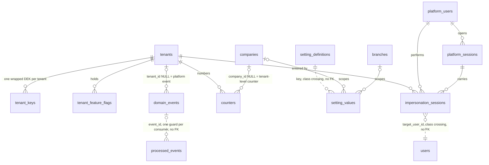
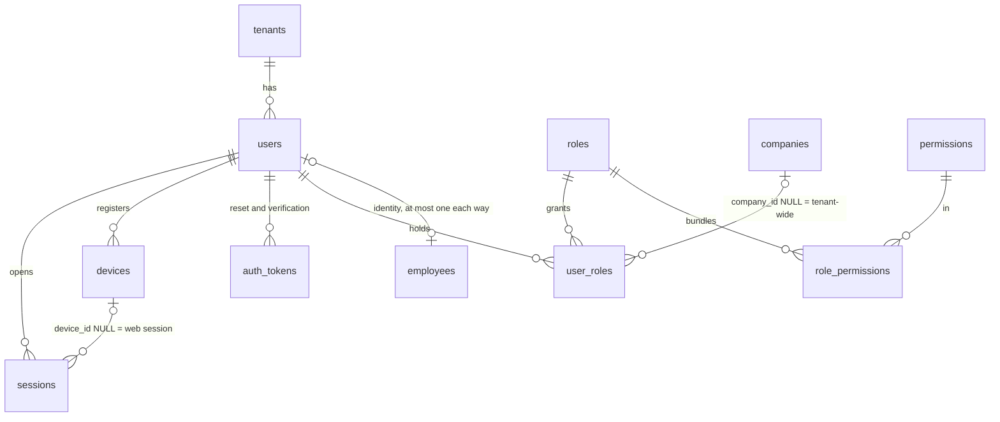
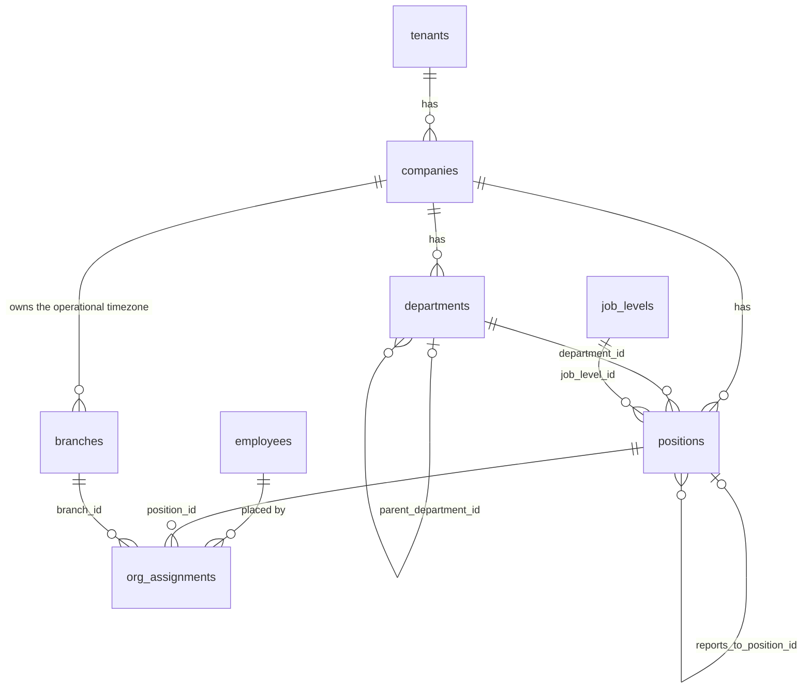
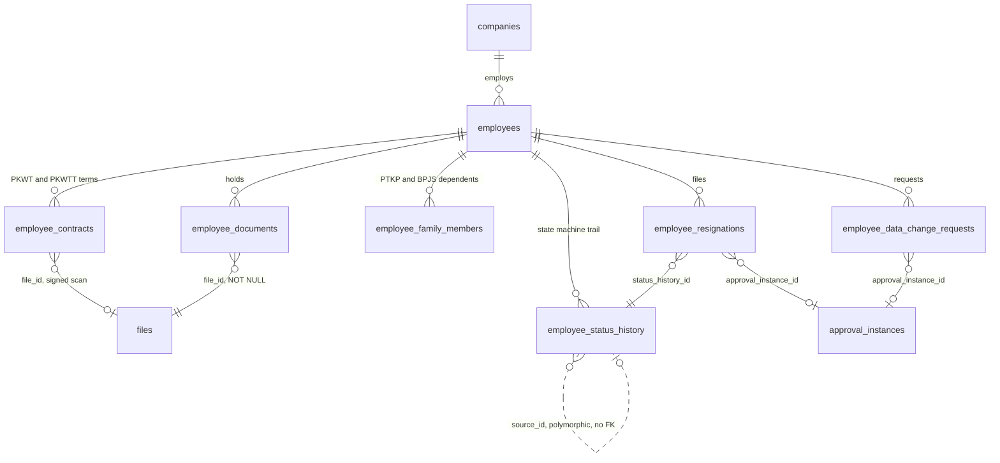
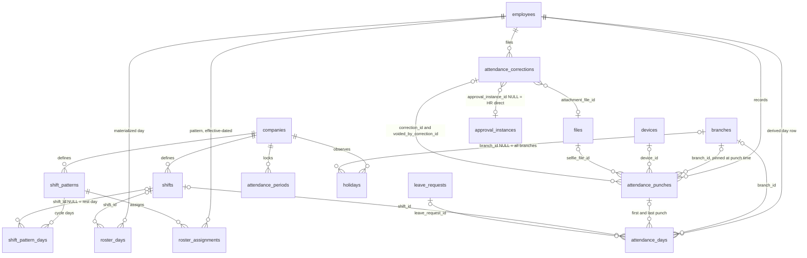
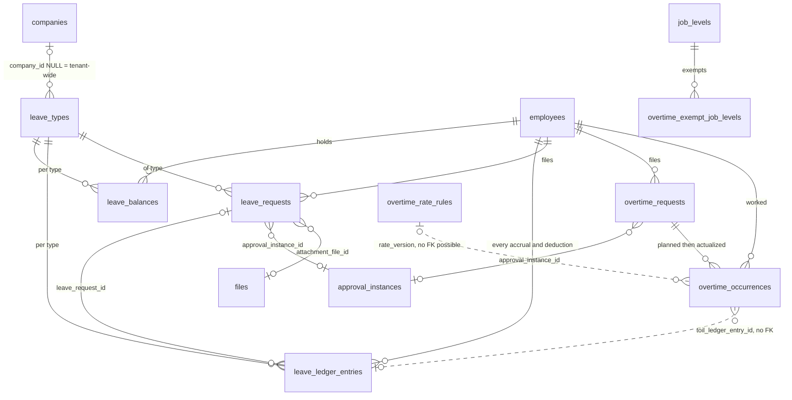
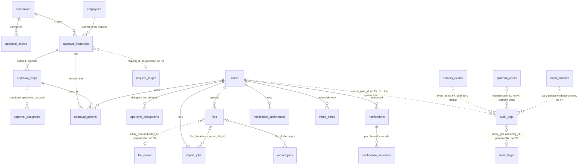
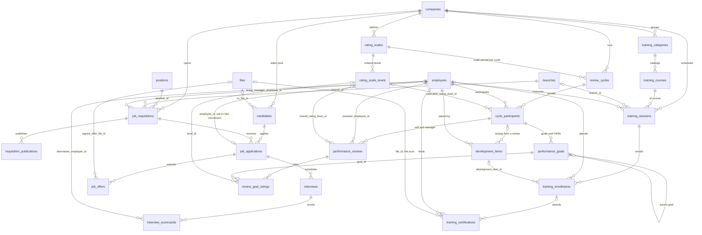
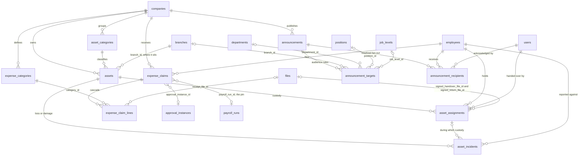

# ERD Overview

Status: Active (Phase 4) · Applies: `docs/04-database/database-conventions.md` (classes, standard columns, `ON DELETE` policy), `docs/04-database/core-schema.md` (the tables every domain hangs off) · Related ADRs: 0001 (module boundaries, table ownership, cross-module FK policy), 0002 (RLS), 0013 (Drizzle conventions), 0023 (table growth)

## 1. What this document owns

**Module docs own column-level truth; this document owns the map.** A column appears here only when it is an *edge* — a foreign key, or a pointer that deliberately is not one. Types, constraints, indexes, defaults, and business meaning stay in the owning module doc and are not repeated.

That seam has a direction. Where this document and a module doc disagree about a **column** — its type, its nullability, its name — the module doc wins and this file is stale. Where they disagree about whether an **edge exists at all**, this file is the one computed from all 115 tables at once, and the disagreement is a defect to be logged, not a preference to be reconciled. §10 lists them.

This document is **derived by `scripts/erd-check.mjs`**, which reads every Drizzle block in `docs/` and recomputes the census, the foreign key graph, and the diagrams' agreement with both. Where a figure here disagrees with that script, the script is right. §11 is the maintenance rule.

This is the only document in the handbook drawn from the whole schema simultaneously, so it answers the three questions no single module doc can:

1. **What is the complete table census, and what class is each table?** (§3, §4)
2. **Which foreign keys cross a module boundary?** ADR-0001 §5 allows them and requires each to be inventoried as extraction cost. That inventory lives here. (§6)
3. **Which relations are deliberately *not* foreign keys, and why?** (§7)

§9.1's module template does not apply — this is a `docs/04-database/` reference document and follows the structure `core-schema.md` set. Sections that a module reader might look for and will not find here: Actors & Permissions, Business Rules, API, UI Flow, Jobs & Events, Approval touchpoints — **N/A: this file introduces no behaviour, only the map of structure that other files introduced.**

## 2. Notation

```
tenants ||--o{ users : has          one-to-many, real FK, NOT NULL on the child
companies |o--o{ counters : scopes  one-to-many, real FK, nullable on the child
a }o..o| b : "col, no FK"           logical pointer with NO database constraint (§7)
```

Crow's foot reads parent-to-child. Diagrams carry **no attributes** — attribute lists here would be a second, drifting copy of each module's Drizzle block, which `CLAUDE.md` forbids. Where a parent is reached by more than one column, the label names the column.

Anchor tables (`companies`, `employees`, `users`, `files`, `branches`, `approval_instances`) appear in several domain diagrams. They are drawn once as owners in their home domain and repeated elsewhere only as endpoints; a repeated node is the same table, never a copy.

## 3. Census

115 tables. Class is `database-conventions.md` §2 — it dictates the tenant column and whether RLS applies, and it is **not** inferable from the presence of a `tenant_id` column: four tables carry `tenant_id` outside the platform class's usual shape while sitting in it (§5).

| Class | Count | `tenant_id` | RLS |
|---|---|---|---|
| Platform | 19 | absent, or a `tenants` FK that is not an RLS discriminator | no |
| Tenant-owned | 68 | `NOT NULL` | yes |
| Company-scoped | 28 | `NOT NULL` + `company_id NOT NULL` | yes |

**The RLS discriminator is a real foreign key.** `database-conventions.md` §3's `...tenantId` spread emits `.references(() => tenants.id)`, so every one of the 96 RLS-class tables carries a genuine constraint against `tenants`. It is excluded from every count in §6 and §9, because 96 identical edges present by class definition are not extraction cost and no extraction removes them — §6 states both bases so a recount converges from either direction.

Nineteen platform tables is higher than `core-schema.md` alone suggests, because **nine of them are statutory parameter tables** — the five `tax_*` and three `bpjs_*` sets in §4.7, plus `overtime_rate_rules` in §4.6. Regulation is identical for every tenant, so it is code-seeded platform data, not tenant configuration.

By owning module (ADR-0001 §5 — exactly one owner per table, only the owner's repositories write it):

| Owner | Tables | Owner | Tables |
|---|---|---|---|
| `core-schema.md` | 14 | `organization.md` | 5 |
| `payroll.md` | 8 | `shift.md` | 5 |
| `performance-goals.md` | 8 | `training.md` | 5 |
| `recruitment-candidate.md` | 7 | `asset.md` | 4 |
| `approval-engine.md` | 6 | `attendance.md` | 4 |
| `bpjs.md` | 6 | `leave.md` | 4 |
| `employee.md` | 6 | `overtime.md` | 4 |
| `tax-pph21.md` | 6 | `system-administration.md` | 4 |
| `announcement.md` | 3 | `audit-log.md` | 2 |
| `expense-reimbursement.md` | 3 | `import-export.md` | 2 |
| `notification.md` | 3 | `settings.md` | 2 |
| `authentication.md` | 1 | `document-storage.md` | 1 |
| `holiday.md` | 1 | `inbox.md` | 1 |

**`payroll_runs` is owned by `payroll.md`**, and until 2026-08-05 it was also declared as a worked example in `naming-conventions.md` §2 — a second definition of a real table name in a document that does not own it. That was not cosmetic: `naming-conventions.md` sorts ahead of `payroll.md`, so a derivation resolving ownership by scanning read the example first and classed `payroll_runs` as **platform**, turning this census into 20/68/27. Fixed in MANIFEST row 70 by making the example unparseable rather than by renaming it — a fictitious table name would simply have been counted as a 116th table (§10, finding 4). Check `C9` catches a recurrence.

## 4. Domain diagrams

The ten domains below partition all 115 tables — every table appears in exactly one domain, none twice, none omitted. The partition is a **presentation choice for legibility only** (spec §13 caps a diagram at ~40 nodes); it carries no architectural meaning and is not a module boundary. Module boundaries are ADR-0001's, and §6 is the document that respects them (A-171).

### 4.1 D1 — Platform, tenancy & configuration

11 tables. The only domain whose tables mostly sit *outside* RLS: `tenants`, `platform_users`, `platform_sessions`, `impersonation_sessions`, `tenant_keys`, `tenant_feature_flags`, `setting_definitions`, `domain_events`, `processed_events` are platform class; only `setting_values` and `counters` are tenant-owned.



`setting_definitions` is the code-owned registry and `setting_values` the tenant data: a tenant may hold a value for a key, never invent one. The `branch` / `company` / tenant / platform-default chain is `settings.md`'s most-specific-wins resolution, not four separate tables.

`impersonation_sessions` is the one table that touches both identity planes — a `platform_users` actor, a `users` target, inside a named tenant. It is platform class, so no RLS policy shields it; ADR-0017 governs access.

### 4.2 D2 — Identity & access

8 tables, all tenant-owned. Unchanged from `core-schema.md` §2 apart from `auth_tokens`, which `authentication.md` adds.



`permissions` is a platform catalog seeded from code — the only platform-class table an RLS-protected table points at, which is safe precisely because it holds no tenant data. `role_permissions` is a pure junction: no audit columns, cascade from `roles`, hard-deleted on role edit.

### 4.3 D3 — Organization

6 tables. Two self-references live here, and both are hierarchies rather than links.



`employees` carries no `branch_id` — placement is `org_assignments`, effective-dated, at most one live row per employee per date, superseded rather than edited. Every consumer that needs "which branch was this employee in on date D" reads that table as-of, and `attendance_punches.branch_id` is the pinned answer at punch time, not a duplicate of it.

`job_levels` is tenant-owned while `positions`, `departments`, and `branches` are company-scoped — a level is a tenant-wide grading vocabulary, a position is a company's org chart.

### 4.4 D4 — Employee master & records

7 tables. All hang off `employees`; none hangs off `users`.



`employee_status_history.source_id` points at whatever caused the transition — a resignation, a data-change request, a payroll event, or nothing for a direct HR act. It is polymorphic and constraint-free (§7).

ADR-0016's encrypted set (NIK, NPWP, BPJS numbers, bank account) lives on `employees` as columns, not as a separate vault table — encryption is a column property, so it creates no edge and appears nowhere in this document.

### 4.5 D5 — Shift, roster & attendance

10 tables, and the system's volume centre: `attendance_punches` at roughly 500M rows/year and `attendance_days` at 250M at D1's design point (ADR-0023).



`attendance_punches` is append-only and carries no `version` — corrections never mutate a punch, they void it and write a new one, which is why the table takes two separate correction columns. It cannot be range-partitioned by date: its `op_id` unique index carries no date column, so purging is always a batched `DELETE` (ADR-0023, `database-conventions.md` §4.4).

`attendance_days.leave_request_id` is what makes a leave day and an attendance day one fact rather than two — the derived row points at the approved request rather than re-deriving absence.

### 4.6 D6 — Leave & overtime

8 tables. `overtime_rate_rules` is the only platform-class table here — statutory multipliers are regulation, not tenant configuration.



**The balance is never a stored truth that the ledger explains.** `leave_balances` is a materialized projection of `leave_ledger_entries`; the ledger is the record, and any disagreement is resolved by replaying the ledger.

`overtime_occurrences.toil_ledger_entry_id` is the single deliberate module-to-module pointer in the system with no constraint behind it — time-off-in-lieu credits an overtime occurrence into the leave ledger. `overtime.md` §schema justifies the missing FK on a reading of ADR-0001 that ADR-0001 does not support (§10, finding 1). The pointer itself is correct either way; only the stated reason is wrong.

`overtime_rate_rules` is drawn here through `overtime_occurrences.rate_version`, its only relation — the pin BR-OVT-009 sets at actualization so a later regulation change cannot re-price paid work. It is the one relation in the schema where a foreign key is not merely declined but unavailable (§7).

### 4.7 D7 — Payroll, tax & BPJS

20 tables, and the largest concentration of **platform-class regulatory tables** in the handbook: `tax_parameters`, `tax_brackets`, `tax_ptkp_amounts`, `tax_ter_rates`, `tax_severance_brackets`, `bpjs_parameters`, `bpjs_program_rates`, `bpjs_jkk_risk_rates` — eight tables holding statutory values that are effective-dated, code-seeded, and identical for every tenant.

```mermaid
erDiagram
  companies ||--o{ payroll_components : "earning and deduction catalog"
  employees ||--o{ salary_histories : "effective-dated"
  salary_histories ||--o{ salary_history_lines : "per component"
  payroll_components ||--o{ salary_history_lines : "component_id"
  companies ||--o{ payroll_runs : executes
  payroll_runs }o--o| approval_instances : "approval_instance_id"
  payroll_runs ||--o{ payroll_run_employees : "one row per employee"
  employees ||--o{ payroll_run_employees : "snapshot frozen at run"
  payroll_run_employees ||--o{ payroll_run_lines : "payslip lines"
  payroll_runs ||--o{ payroll_run_lines : "run_id"
  payroll_components ||--o{ payroll_run_lines : "component_id, code denormalized"
  employees ||--o{ payroll_ytd_ledger : "per tax year"
  payroll_runs |o--o{ payroll_ytd_ledger : "last_run_id"
  employees ||--o{ payroll_retro_flags : "raised against a closed run"
  payroll_runs ||--o{ payroll_retro_flags : "closed_run_id and resolved_in_run_id"
  employees ||--o{ employee_tax_profiles : "PTKP status and NPWP"
  files |o--o{ employee_tax_profiles : "form_document_id, 1721-A1"
  companies ||--o{ company_bpjs_registrations : registers
  employees ||--o{ employee_bpjs_dependents : covers
  employees ||--o{ employee_bpjs_exclusions : excludes
  tax_parameters ||..o{ tax_brackets : "effective_from, no FK possible"
  tax_parameters ||..o{ tax_ptkp_amounts : "effective_from, no FK possible"
  tax_parameters ||..o{ tax_ter_rates : "effective_from, no FK possible"
  tax_parameters ||..o{ tax_severance_brackets : "effective_from, no FK possible"
  bpjs_parameters ||..o{ bpjs_program_rates : "effective_from, no FK possible"
  bpjs_parameters ||..o{ bpjs_jkk_risk_rates : "effective_from, no FK possible"
```



**A payslip does not join to live configuration.** `payroll_run_employees.snapshot` freezes every pulled input as `jsonb` and `payroll_run_lines.component_code` denormalizes the catalog code — the catalog moves, a closed payslip does not. This is why the payroll tables carry so few outbound FKs relative to their size: the run *copies* rather than *references*, deliberately.

The eight statutory tables and their values carry the regulation marker in their owning module docs (`tax-pph21.md`, `bpjs.md`). **This document states no rate, cap, bracket, or multiplier**, so no marker is repeated here — the edges are structural facts, not regulatory ones.

`payroll_runs` is the only table in the system that both `expense-reimbursement.md` and `payroll.md` write against the same column (`expense_claims.payroll_run_id`, the pin) — see §6.

### 4.8 D8 — Approval, documents & platform services

15 tables. The domain every other domain points into.



`request_target`, `file_owner`, and `audit_target` are **not tables** — they are the polymorphic endpoints named in §7, drawn so the shape of the coupling is visible rather than invisible.

`audit_logs` is append-only and never soft-deleted; `audit_anchors` computes a daily anchor over it rather than chaining every row, because per-row hash chaining would serialize concurrent writers on the chain head.

### 4.9 D9 — Talent: recruitment, performance & training

20 tables, three lifecycles, and the one place a candidate becomes an employee.



**`job_applications.employee_id` is the hire conversion**, and it is nullable by necessity: it is `NULL` for every application that never becomes a hire, which is nearly all of them. A candidate is company-scoped and an employee is company-scoped, but they are separate identities — conversion links, it does not merge.

`training_enrollments.development_item_id` closes the loop from performance to training: a development item raised in a review can be discharged by an enrolment, which is the only edge between those two module groups.

### 4.10 D10 — Asset, expense & announcement

10 tables.



`announcement_targets` is the only table in the system with **four mutually-nullable FKs into one module** — each row is one targeting rule against one organizational axis, and the four columns are alternatives, not a composite key.

`expense_claims.payroll_run_id` is the pin that guarantees a claim is paid once (BR-EXP-008): the query port stamps it, and the partial index `idx_expense_claims_payable` filters on `payroll_run_id IS NULL` so a pinned claim can never be returned to a second run.

## 5. Class is not inferable from the columns

Four tables carry a `tenant_id` column that is an ordinary foreign key rather than the RLS discriminator, and two more carry tenant payloads with no policy at all:

| Table | Has `tenant_id` | Class | Why |
|---|---|---|---|
| `tenant_keys` | yes, FK | platform | ADR-0016's wrapped per-tenant DEK. RLS here would let a tenant context reach its own key material. |
| `tenant_feature_flags` | yes, FK | platform | Super Admin writes it; a tenant reads its effect, never the row. |
| `impersonation_sessions` | yes, FK | platform | The actor is a `platform_users` row; no tenant context exists when it is created. |
| `domain_events` | yes, nullable | platform infra | `NULL` = platform event. The relay reads cross-tenant by design. |
| `processed_events` | no | platform infra | Consumer idempotency guard, keyed by consumer + event. |
| `permissions` | no | platform | Code-seeded catalog, no tenant data. |

`core-schema.md` §9 is the authority for this list. **Anything that derives RLS class by testing for a `tenant_id` column will get these six wrong** — including any generated migration tooling, any schema linter, and any reviewer working from the Drizzle block alone.

## 6. Cross-module foreign key inventory

ADR-0001 §5: cross-module FKs are **allowed** — the shared database keeps referential integrity per `database-conventions.md` §1.7 — but each is part of the extraction cost inventory. Rule 5 was amended on 2026-08-04 to place that inventory **here**, derived, rather than in each module doc. This is it.

### 6.1 Basis, and why two numbers

Every figure below is emitted by `scripts/erd-check.mjs` and carries an explicit basis, because two defensible counts exist and a reader who picks the other one is not wrong:

| Basis | Foreign keys | |
|---|---|---|
| **Inclusive** | **323** | every `REFERENCES` constraint in the schema |
| less the RLS discriminator | −96 | `...tenantId` on each RLS-class table (§3) — present by class definition, removed by no extraction |
| **Net** | **227** | the basis for every other number in this document |

Of the 227 net, **150 cross a module boundary**. **111 of those point at `core-schema.md`** — `employees` 39, `companies` 37, `users` 29, `tenants` 3, `platform_users` 2, `devices` 1 — which is not extraction cost at all: core is the shared kernel every module is entitled to reference, and no extraction plan proposes moving it.

**These are now a total, not a floor** *(2026-08-05, MANIFEST row 70)*. Until the schema-declaration sweep, 28 foreign keys existed in the handbook only as comments — sixteen under the retired deferral pattern, the rest across `payroll.md`, which declared none at all — so the script could not see them and this section enumerated 39 module-to-module edges while deriving 23. Every one is now a real `.references()` and the script derives all 39. **The discriminator count is the tell that it is complete: 96, which is exactly the number of RLS-class tables in §3** — before the sweep it was 88, because payroll's eight tables spelled `tenant_id` by hand instead of using the spread.

### 6.2 Module-to-module inventory

**The real inventory is these 39: foreign keys from one module's table into another module's table.**

| Source module | Source table | Column | → Target | Target module | Null |
|---|---|---|---|---|---|
| announcement | `announcement_targets` | `branch_id` | `branches` | organization | nullable |
| announcement | `announcement_targets` | `department_id` | `departments` | organization | nullable |
| announcement | `announcement_targets` | `position_id` | `positions` | organization | nullable |
| announcement | `announcement_targets` | `job_level_id` | `job_levels` | organization | nullable |
| asset | `assets` | `branch_id` | `branches` | organization | NOT NULL |
| asset | `asset_assignments` | `signed_handover_file_id` | `files` | document-storage | nullable |
| asset | `asset_assignments` | `signed_return_file_id` | `files` | document-storage | nullable |
| attendance | `attendance_punches` | `branch_id` | `branches` | organization | nullable |
| attendance | `attendance_punches` | `selfie_file_id` | `files` | document-storage | nullable |
| attendance | `attendance_days` | `branch_id` | `branches` | organization | nullable |
| attendance | `attendance_days` | `shift_id` | `shifts` | shift | nullable |
| attendance | `attendance_days` | `leave_request_id` | `leave_requests` | leave | nullable |
| attendance | `attendance_corrections` | `attachment_file_id` | `files` | document-storage | nullable |
| attendance | `attendance_corrections` | `approval_instance_id` | `approval_instances` | approval-engine | nullable |
| employee | `employee_contracts` | `file_id` | `files` | document-storage | nullable |
| employee | `employee_documents` | `file_id` | `files` | document-storage | NOT NULL |
| employee | `employee_data_change_requests` | `approval_instance_id` | `approval_instances` | approval-engine | nullable |
| employee | `employee_resignations` | `approval_instance_id` | `approval_instances` | approval-engine | nullable |
| expense-reimbursement | `expense_claim_lines` | `receipt_file_id` | `files` | document-storage | nullable |
| expense-reimbursement | `expense_claims` | `approval_instance_id` | `approval_instances` | approval-engine | nullable |
| expense-reimbursement | `expense_claims` | `payroll_run_id` | `payroll_runs` | payroll | nullable |
| holiday | `holidays` | `branch_id` | `branches` | organization | nullable |
| import-export | `import_jobs` | `file_id` | `files` | document-storage | NOT NULL |
| import-export | `import_jobs` | `error_report_file_id` | `files` | document-storage | nullable |
| import-export | `export_jobs` | `file_id` | `files` | document-storage | nullable |
| leave | `leave_requests` | `attachment_file_id` | `files` | document-storage | nullable |
| leave | `leave_requests` | `approval_instance_id` | `approval_instances` | approval-engine | nullable |
| overtime | `overtime_exempt_job_levels` | `job_level_id` | `job_levels` | organization | NOT NULL |
| overtime | `overtime_requests` | `approval_instance_id` | `approval_instances` | approval-engine | nullable |
| payroll | `payroll_runs` | `approval_instance_id` | `approval_instances` | approval-engine | nullable |
| recruitment-candidate | `candidates` | `cv_file_id` | `files` | document-storage | nullable |
| recruitment-candidate | `job_offers` | `signed_offer_file_id` | `files` | document-storage | nullable |
| recruitment-candidate | `job_requisitions` | `position_id` | `positions` | organization | NOT NULL |
| recruitment-candidate | `job_requisitions` | `branch_id` | `branches` | organization | NOT NULL |
| settings | `setting_values` | `branch_id` | `branches` | organization | nullable |
| tax-pph21 | `employee_tax_profiles` | `form_document_id` | `files` | document-storage | nullable |
| training | `training_certifications` | `file_id` | `files` | document-storage | nullable |
| training | `training_enrollments` | `development_item_id` | `development_items` | performance-goals | nullable |
| training | `training_sessions` | `branch_id` | `branches` | organization | nullable |

### 6.3 What the inventory says

**Three tables absorb 30 of the 39.** `files` takes 15, `branches` 8, `approval_instances` 7.

That is a far better result than 39 scattered edges, and it means the extraction cost is not distributed — it is concentrated in three seams that were designed as seams:

- **`files` (15)** — every module that stores a document points at one table. Extracting document-storage converts 15 FKs into 15 id-only references plus a URL-minting port. The edges are all leaf attachments; none carries business logic.
- **`branches` (8)** — organization is the module nobody extracts. Six of the eight are nullable scoping columns, and `assets.branch_id` / `job_requisitions.branch_id` are the two that are not.
- **`approval_instances` (7)** — every approvable module points at the engine, and **all seven are nullable**, because every one of those modules supports a direct administrative act with no chain. The engine can be extracted without a single NOT NULL violation.

The remaining nine are five ordinary organizational references (`positions`, `departments`, `job_levels`) plus exactly **four genuine business couplings between business modules**:

| Edge | Meaning |
|---|---|
| `attendance_days.shift_id → shifts` | the day is scored against the rostered shift |
| `attendance_days.leave_request_id → leave_requests` | an approved leave day *is* the attendance day |
| `expense_claims.payroll_run_id → payroll_runs` | the pin that pays a claim exactly once |
| `training_enrollments.development_item_id → development_items` | the enrolment that discharges a development item (§4.9) |

Everything else in the business layer talks through ports and events. **Four constraints is the whole of the module-to-module coupling that the database enforces** — which is the strongest available evidence that ADR-0001's boundaries are real rather than aspirational.

The fourth was missing from this table until 2026-08-04 (§10, finding 1), and the way it was missed is worth keeping. `training.md` had declared it correctly, in a comment block titled *"Outbound cross-module FKs (ADR-0001 §5 extraction inventory)"*. The inventory was wrong because it was assembled by reading 26 files, and the one edge it dropped was the one whose `.references()` wrapped onto a second line. That is what §6.1's derivation rule and `scripts/erd-check.mjs` exist to prevent.

## 7. Relations that are deliberately not foreign keys

| Source | Column | Points at | Why no constraint |
|---|---|---|---|
| `approval_instances` | `request_id` | `leave_requests` \| `overtime_requests` \| `expense_claims` \| `employee_data_change_requests` \| `attendance_corrections` | Polymorphic. The engine must not know its subject types; a FK would invert the dependency and make every new approvable module a schema change to the engine. |
| `files` | `entity_type` + `entity_id` | any owning entity | Polymorphic. One attachment table serving every module is the reason document-storage owns exactly one table. |
| `audit_logs` | `entity_type` + `entity_id` | any audited entity | Polymorphic, and additionally must survive its target: BR-AUD-006 keeps ids after the source row is erased under UU PDP. A FK would make the audit trail deletable by the erasure it is supposed to record. |
| `audit_logs` | `impersonator_id` | `platform_users` | Class crossing — a tenant-owned, RLS-protected table may not constrain against a platform table holding no tenant data. |
| `domain_events` | `aggregate_id` | any aggregate | Polymorphic outbox; rows purge at 30 days independently of their subject. |
| `processed_events` | `event_id` | `domain_events` | Both purge on independent schedules; a FK would make the consumer guard block the outbox purge. |
| `audit_logs` | `event_id` | `domain_events` | *(added 2026-08-05, MANIFEST row 70)* The `processed_events` argument, with a wider gap: the outbox purges at 30 days and an audit row lives for years (`database-conventions.md` §4.4). A constraint would either block the purge forever or, under `SET NULL`, erase the channel-2 dedup key on every surviving row. |
| `audit_logs` | `actor_user_id` | `users` | *(added 2026-08-05, MANIFEST row 70)* The same rule as the `created_by` row below, applied to the table that needs it most: BR-AUD-006 keeps an audit row after its subject is erased, and an actor column that nulls on user deletion erases *who did it* from the trail whose job is to record exactly that. `NULL` already means a system actor, so a nulled row is indistinguishable from one that was never attributed. |
| `approval_actions` | `actor_user_id` | `users` | *(added 2026-08-05, MANIFEST row 70)* Approval history is a trail (`audit-log.md` §7 lists it as one) and carries the same argument: who approved must survive the approver leaving the company. `NULL` means the engine acted — reminder, escalation. |
| `impersonation_sessions` | `target_user_id` | `users` | *(added 2026-08-05, MANIFEST row 70)* Class crossing, the mirror of the `impersonator_id` row above: a platform table constraining a tenant-owned, RLS-protected table. `system-administration.md` §4 already declared it *"no FK: cross-class reference"*; this records it where the rule lives. ADR-0017's session record is also a trail and must outlive the account it acted on. |
| `setting_values` | `key` | `setting_definitions` | *(added 2026-08-05, MANIFEST row 70)* Class crossing on a natural key. `setting_definitions` is a code-seeded platform table with no `tenant_id`; `setting_values` is tenant-owned and RLS-protected. Not an `*_id` column, which is why check `C6` never saw it and only the diagram edge did. |
| `tax_brackets`, `tax_ptkp_amounts`, `tax_ter_rates`, `tax_severance_brackets`, `bpjs_program_rates`, `bpjs_jkk_risk_rates` | `effective_from` | `tax_parameters` / `bpjs_parameters` | *(added 2026-08-05, MANIFEST row 70)* **No constraint is possible** — the `overtime_rate_rules` case six more times. The version pin is a date matched against `effective_from`, whose parent unique key is `(effective_from, key)`, so it addresses a *row set*, not a row. Every statutory parameter set in the handbook works this way; that is one pattern, not seven coincidences. |
| `employee_status_history` | `source_id` | resignation \| data-change \| direct HR act | Polymorphic, and `NULL` for a direct act. |
| `overtime_occurrences` | `toil_ledger_entry_id` | `leave_ledger_entries` | The one module-to-module pointer left unconstrained on purpose. See §10 finding 1 — the pointer is right, the stated justification cites ADR-0001 for a rule ADR-0001 does not contain. |
| `overtime_occurrences` | `rate_version` | `overtime_rate_rules` | **No constraint is possible.** The pin is a date matched against `effective_from`, whose unique key is `(effective_from, day_class, tier_index)` — so it addresses a *row set*, not a row, and there is no key to reference. Every other row here declined a constraint that was available; this one had none. |
| ~96 tables | `created_by`, `updated_by`, `deleted_by` | `users` | `database-conventions.md` §3's `auditColumns` and `softDeleteColumns` spreads emit plain `uuid`. Constraining them would mean ~250 FKs into `users` on the system's hottest write path, and — the deciding reason — the only sane policy for an actor column is `ON DELETE SET NULL`, which means removing a user **erases their attribution everywhere they ever acted**. That is the failure the `audit_logs` row above already refuses. `NULL` means a system actor (`database-conventions.md` §3). |

**Every one of these is a documented decision, not an omission.** Two rules follow, and `scripts/erd-check.mjs` enforces both:

1. **In every row the Source is the child** — it holds the pointer — and the target is the parent. A diagram that draws one of these the other way round is a defect, not a stylistic variant.
2. **An unconstrained *pointer* column that appears in neither §6 nor this table is a bug.** Pointer, not `*_id`: the suffix decides nothing. `created_by` is a pointer and has no `_id`; `op_id` (ADR-0003's idempotency key) and `devices.install_id` carry one and point at nothing, so neither has a target to constrain and both are exempt by name in the script. *(Until the row 73 audit `C6` inspected only `*_id` columns, so this rule asserted an enforcement it did not have — every `*_by` actor pointer was invisible to it. The check now reads both suffixes. Twelve of the thirteen non-audit actor columns already carried a constraint, so closing the gap cost one: `payroll_runs.paid_by`.)*

## 8. Cascades and delete order

`database-conventions.md` §8 sets the default: `ON DELETE RESTRICT`, with `CASCADE` only for true composition. Its `SET NULL` clause named `created_by` as its example until 2026-08-05 — a column class that carries no constraint at all (§7) and therefore had no live instance; corrected in that file (§10, finding 7). Purge jobs delete children explicitly, in order.

**Eight** cascades are declared as code in the handbook:

| Child | Parent | Composition |
|---|---|---|
| `role_permissions` | `roles` | a permission grant is meaningless without its role |
| `approval_steps` | `approval_instances` | a step is meaningless without its instance |
| `approval_assignees` | `approval_steps` | a candidate approver is meaningless without its step |
| `notification_deliveries` | `notifications` | a channel attempt is meaningless without its notification |
| `expense_claim_lines` | `expense_claims` | a line is meaningless without its claim |
| `payroll_run_employees` | `payroll_runs` | an employee's slot in a run is meaningless without the run |
| `payroll_run_lines` | `payroll_run_employees` | a payslip line is meaningless without its payslip |
| `salary_history_lines` | `salary_histories` | a component amount is meaningless without its salary revision |

The last three are the compositions `database-conventions.md` §8 names by example — *"payslip lines → payslip"*. Until 2026-08-05 they existed in `payroll.md` as `// FK cascade` **comments rather than as `onDelete: 'cascade'` code**, so an implementer generating from the Drizzle block got `RESTRICT` on the one aggregate the convention cites as its own example (§10, finding 2).

Purge order for the deepest aggregate, payroll, is therefore: `payroll_run_lines` → `payroll_run_employees` → `payroll_retro_flags` and `payroll_ytd_ledger` references cleared → `payroll_runs`. **In practice this order is not exercised:** payroll and tax rows are exempt from every purge path and stay in the live database for the full ten-year window (`database-conventions.md` §4.4).

## 9. Fan-in

Net basis (§6.1) — the RLS discriminator is excluded. On the inclusive basis `tenants` leads every table here at **96 — one per RLS-class table, and rising with each new one**, which is exactly why it is excluded: that number describes the tenancy model, not the shape of the schema.

| Table | Inbound FKs | Reading |
|---|---|---|
| `companies` | 40 | The company is the payroll, tax, and legal boundary; company-scoped is the largest class for a reason. |
| `employees` | 39 | Nearly every business fact is about a person. |
| `users` | 33 | Actor columns — approvers, uploaders, acknowledgers. `created_by`/`updated_by`/`deleted_by` are *not* among them and never enter any count here (§7), and neither are `audit_logs.actor_user_id`, `approval_actions.actor_user_id`, or `impersonation_sessions.target_user_id`. **33 is fan-in; §6.1's `users 29` is the cross-module subset** — the four-edge difference is intra-core, and the two numbers are not meant to match. |
| `files` | 15 | §6.3. |
| `approval_instances` | 9 | 7 cross-module, 2 internal. |
| `branches` | 9 | 8 cross-module, 1 internal. |
| `payroll_runs` | 6 | 5 internal, 1 from expense. |

`companies` and `employees` together take 79 edges — **more than a third of the entire foreign key graph on the net basis points at two tables.** Both are `core-schema.md`'s, both are company-scoped, and neither is extractable. Any index, lock, or migration touching either is a whole-system event; `performance.md` §9.1's DDL cost table is the operative guidance.

Three self-references, all hierarchies: `departments.parent_department_id`, `positions.reports_to_position_id`, `performance_goals` parent goal. None is a linked list or an ordering trick.

## 10. Findings

Two passes produced this list: drawing the whole graph (2026-08-04), then regrilling the result against `scripts/erd-check.mjs` (2026-08-04). It is the document's full defect record, not only the open part of it, because §11 pre-commits a future reader to recounting and calling a mismatch a defect — and several figures in this file **were** wrong, so a reader who trusted them needs to find that out here, where they read them, rather than in `PROGRESS.md`.

**Nothing here is open.** §10.1 was the worklist for the schema-declaration sweep (MANIFEST row 70), discharged 2026-08-05 — `node scripts/erd-check.mjs` exits `0`, and the counts in §3, §6 and §9 are the post-sweep ones. §10.2 was fixed when this document was regrilled. The whole record is kept because §11 tells a future reader to recount and to treat a mismatch as a defect: someone reading a figure and finding a different one needs to learn *here* that the numbers moved and why, not conclude the script is broken.

### 10.1 Fixed — other documents, 2026-08-05 (MANIFEST row 70)

1. **`overtime.md` §schema misstates ADR-0001.** It reads *"`toil_ledger_entry_id` carries no foreign key — it points into leave.md's aggregate, and ADR-0001 forbids the constraint even though the shared database would permit it."* ADR-0001 §5 says the opposite: *"Cross-module FKs are **allowed** … but each one is part of the extraction cost inventory."* ADR-0001 is Accepted and outranks a module doc (`CLAUDE.md` authority order). The **decision** — leaving this pointer unconstrained — is sound and is what §7 records; only the citation is wrong. Fix is a one-sentence rewrite in `overtime.md`, not an ADR supersession.
2. **Three composition cascades exist only as comments.** `payroll.md` declares `payroll_run_employees → payroll_runs`, `payroll_run_lines → payroll_run_employees`, and `salary_history_lines → salary_histories` with `// FK cascade` comments and no `onDelete: 'cascade'`. `database-conventions.md` §8 names the payslip-lines case as its own example of when `CASCADE` is correct. As written, an implementer generating from the Drizzle block gets `RESTRICT`.
3. **`payroll.md` declares no `.references()` at all** — zero across its eight tables, where every other module doc uses them. The FKs are in comments. This is why the payroll subgraph cannot be derived mechanically from the handbook and had to be reconstructed by hand for §4.7. Low severity, but it makes payroll the one module whose schema a generator will get structurally wrong.
4. **`naming-conventions.md` contains a full `pgTable('payroll_runs', …)` example.** Not harmless: it is a second definition of a real table name in a document that is not its owner, it sorts ahead of `payroll.md`, and the derivation script therefore reads it first and classes `payroll_runs` as platform — corrupting the §3 census to 20/68/27 (check `C9`). Renaming the example to a fictitious table removes the ambiguity.
5. **Sixteen cross-module FKs are declared only as comments.** The residue of the deferral pattern retired in finding 10. Each column becomes plain `.references()` in its owning module doc; the sweep's exit condition is `node scripts/erd-check.mjs` exiting `0`.
6. **`leave.md` overrides the audit-column convention.** `leave_ledger_entries.created_by` carries `.references(() => users.id)` — the only such override in 115 tables, against §7's rule and `database-conventions.md` §3's spread (check `C5`).
7. **`database-conventions.md` §8's `SET NULL` clause has nothing to attach to.** It reads *"`SET NULL` only for optional actor/reference columns (`created_by`)"*, but the same file's `auditColumns` spread gives `created_by` no constraint, so the policy names a column class with zero instances. Delete the clause or repoint it.
8. **`overtime.md` draws a non-FK relation with solid notation.** `overtime_rate_rules }o--o{ overtime_occurrences` uses the solid form, which under §2 asserts a foreign key. No constraint is possible there (§7). One-character fix.

### 10.2 Fixed — this document, 2026-08-04 (regrilling)

9. **§6 was missing `training_enrollments.development_item_id`**, and with it the claim *"exactly three genuine business couplings"* — there are four. `training.md` had declared the edge correctly; the inventory was assembled by reading and dropped the one `.references()` that wrapped onto a second line. **Every downstream figure was wrong**: 37 → 39 module-to-module, `files` 13 → 15, "28 of the 37" → 30 of 39, 142 → 126 cross-boundary on the derived basis.
10. **§8's deferred-FK pattern rested on a constraint that does not exist.** It claimed *"module load order"* — that `holiday.ts` importing `organization.ts` was impossible. The schema-file dependency graph has **no cycles anywhere**, and every module owning a deferred target imports core only. The pattern bought nothing and cost the drift gate: §8 rule 4 conceded `drizzle-kit check` could not see the constraints. Section deleted; the 16 columns are finding 5.
11. **The 215 / 142 / 37 headline excluded ~88 real foreign keys without saying so.** The `...tenantId` spread emits a genuine `tenants` constraint on every RLS-class table. §6.1 now states both bases (A-172).
12. **`created_by` / `updated_by` / `deleted_by` were absent from §7** — ~250 unconstrained pointers, the largest deliberate non-FK set in the system, undocumented in the file that owns the question. Now a §7 row (A-173).
13. **Three diagram defects.** `domain_events`→`processed_events` and `audit_anchors`→`audit_logs` were drawn with the crow's foot reversed; `job_applications |o--o| employees` put the FK holder on the parent side. All three parse cleanly, which is why the Mermaid validation this file already passed never saw them (checks `C3`, `C4`).
14. **`overtime_rate_rules` was in no diagram**, against §4's claim that the domains omit nothing — 114 of 115 drawn. It holds no FK, so no relation line reached it. Now drawn via the `rate_version` pin (check `C1`).
15. **24 of 26 module docs had never discharged ADR-0001 §5's inventory duty**, and `erd-overview.md` §1 asserted that they had. That assertion is what made finding 9 invisible for three phases. Rule 5 was amended in place on 2026-08-04 to move the duty here, derived; the amendment note records why.

## 11. Maintenance

This document is derived, not authored, and `scripts/erd-check.mjs` is what makes that true rather than aspirational. It reads every Drizzle block under `docs/`, recomputes the census and the foreign key graph on both bases, and checks the diagrams against them:

| Check | Asserts |
|---|---|
| `C1` / `C2` | every table has a node; every node is a table or a declared polymorphic endpoint |
| `C3` | every solid edge has a foreign key behind it, oriented parent-to-child |
| `C4` | every semantic foreign key is drawn — scope and actor columns excluded, per §2 |
| `C5` | no audit column carries a foreign key |
| `C6` | every unconstrained pointer is declared in §7 |
| `C7` / `C8` | no unparseable diagram line; no unresolvable foreign key target |
| `C9` | no table defined outside its owning document |

```
node scripts/erd-check.mjs          # report; exit 1 on any failure
node scripts/erd-check.mjs --json   # same, machine-readable
```

Mermaid *syntax* validation is a separate concern and stays a one-liner — `npx -y @mermaid-js/mermaid-cli -i docs/04-database/erd-overview.md -o /tmp/erd.md`. It is not vendored: a dependency tree in a documentation repository would buy a class of failure that has never occurred here, and findings 13 and 14 are the proof that a syntax parser was never the check this file needed.

**Rule: any task that adds, removes, or re-points a table runs the script and reconciles §3, §4, §6, and §7 in the same session.** That is `CLAUDE.md`'s registry discipline, applied to this file, with the reconciliation mechanised.

The counts as of 2026-08-05, net basis: **115 tables · 323 foreign keys inclusive, 227 net · 150 crossing a module boundary · 39 module-to-module, all of them derivable · 16 documented non-FK pointer classes · 8 declared cascades.** *(Counts as of the row 73 audit, which constrained `payroll_runs.paid_by` — the one non-audit actor column of thirteen that lacked a foreign key — and widened check `C6` to see `*_by` columns at all.)* A future reader who recounts and gets different numbers has found either a change nobody logged here or a defect — and unlike the first edition of this document, they can now settle which in one command.

**Forward note.** Once the three implementation repositories exist, this check changes meaning: it stops comparing the handbook against itself and starts comparing the handbook against the shipped schema. That is a cross-repository drift gate and it earns a `G` number in `testing-strategy.md` §13 at that point. It does not have one today, because G1–G22 gate the implementation pipelines and this validates a documentation repository.
