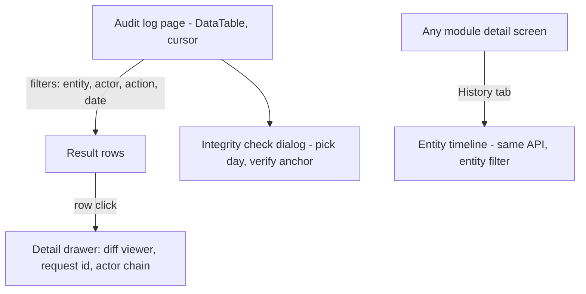

# Module: Audit Log

Status: Active (Phase 2) · Related ADRs: `ADR-0010` (event channel), `ADR-0011` (requestId correlation), `ADR-0002` (tenant scoping), `ADR-0016` (Accepted — sensitive values masked in diffs, not re-encrypted) · Depends on: `docs/04-database/database-conventions.md` §4.4 (D4), `docs/03-standards/security-standards.md` §9–§10, `docs/03-standards/api-standards.md` · Consumers: every module (capture protocols §4.2/§4.3), `docs/06-modules/reports.md`, UU PDP records-of-processing obligation

Namespace `audit` (naming §4, error prefix `AUD`). Owns: the append-only `audit_logs` store, two capture channels (same-transaction diffs + outbox fact consumption), tamper evidence, the audited-table and sensitive-read registries, retention/archival, and the read API.

## 1. Purpose & Scope

Who did what, when, to which entity, with before/after for mutations — tenant-scoped, append-only, tamper-evident, queryable, retained per D4 (2 y hot → cold archive). Serves admin investigation, support forensics, and the UU PDP records-of-processing obligation (security-standards §9).

**V1 exclusions:** full read-access auditing (only registered *sensitive reads* are logged — §4.3), external notarization/WORM storage (daily digest anchor instead), SIEM streaming, tenant-configurable audit rules, log-based analytics (reports.md consumes the API, not the table).

## 2. Actors & Permissions

| Action | Permission key | Data scope | System Administrator |
|---|---|---|---|
| Query audit log, entity timelines | `audit.log.read` | tenant (company filter available, not enforced as scope — audit is a tenant-level duty) | ✅ |
| Verify anchors (integrity check) | `audit.log.read` | tenant | ✅ |

No write surface exists — rows are system-appended only. Super Admin reads via audited impersonation (BR-AUD-007 recurses: reading the audit log is itself a sensitive read). Employees have no self-service audit view in V1 (data-subject access requests are served by admins via the query surface).

## 3. Business Rules

| # | Rule |
|---|---|
| BR-AUD-001 | **Append-only, structurally:** `UPDATE`/`DELETE` on `audit_logs` are revoked from `hris_app` (approval-actions precedent); no soft delete; no purge before archival (D4). Corrections are new rows, never edits. |
| BR-AUD-002 | **Channel 1 — same-transaction capture:** mutations to tables in the audited-table registry (§4.2) write their audit row inside the mutating transaction via the repository hook — atomic with the change: no lost audits on crash, no phantom rows on rollback. This is the only reliable source of before-images. |
| BR-AUD-003 | **Channel 2 — fact consumption:** action facts already published as domain events (§12 list) are consumed by `on.` handlers into audit rows, deduped by `event_id` (partial unique). Facts carry pointers, not diffs — correct for create/action facts where "before" is meaningless. |
| BR-AUD-004 | One fact, one home: the approval engine's `approval_actions` table is the authoritative approval trail — audit stores only instance-terminal headlines (submit/step detail is NOT duplicated here). Settings history lives in effective-dated rows — audit stores the change fact; the values table is its own before/after. |
| BR-AUD-005 | **Diff masking is decided per audited table in §4.2, in three layers.** (1) **Derived, not listed** — a column of ADR-0016's `encryptedText` type masks automatically. This follows the schema, so `employees.npwp` masks while `companies.npwp` diffs in full: same name, right answer both times, no list to keep in sync. (2) **Floor** — credential and token material (§10's auth cluster: passwords, PINs, session/refresh/FCM tokens, signed-URL query strings) never enters a diff on any table, whatever that table's note says. It carries no evidentiary value the action key does not already carry. (3) **Per-table** — everything else is the table's §4.2 masking note, which is the operative list. A column matched by none of the three diffs in full; that is the default and it is deliberate, because an audit row that omits what changed is not evidence. **Money columns diff in full** — the amount is the fact being attested to. Masked columns record `{ masked: true }`, **one marker for all three layers** (the fact that it changed, never the value); §4.2's prose `[encrypted]` and `[redacted]` say *why* a column is masked, they are not a second and third wire format. **Amended 2026-08-06 (issue #21):** this rule previously read "reuses the security-standards §10 redaction registry". §10 is a *telemetry* registry — its question is "may this value appear in a log line", not "may this value appear in the evidence of record", and the two answers differ on money. Read literally it masked every `salary_histories`, `payroll_runs` and `expense_claim_lines` amount that §4.2's own notes exist to preserve, and `payload` would have masked channel 2 out of its own row; meanwhile §4.2 already masks `leave_requests.reason` and three `candidates` columns that appear nowhere in §10, and diffs `company_bpjs_registrations` numbers that do. The registry was never the operative list — it was cited before §4.2 was populated. The anti-drift property it claimed is replaced by layer 1, which is automatic and exact, plus the same-session §4.2 registration rule already in force. |
| BR-AUD-006 | Rows store **ids, not names** — rendering joins live data at read time; UU PDP erasure/crypto-shredding of the source leaves audit rows meaningful ("employee `<id>` (removed)") without holding erased personal data. |
| BR-AUD-007 | Registered **sensitive reads** (§4.3) are audited via explicit port call: payslip/tax-document URL mints, employee-master sensitive-field views, audit-log queries themselves, every impersonated request. Bulk list views are not sensitive reads; single-subject sensitive access is. |
| BR-AUD-008 | Every row carries `request_id` (ADR-0011 correlation) and the acting identity: `actor_type` `user \| system \| platform_op`; impersonation records both `actor_user_id` (the impersonated identity) and `impersonator_id` (multi-tenancy §1 context) — neither is ever inferred. |
| BR-AUD-009 | **Tamper evidence = grants + daily anchor**, not per-row chaining: a per-row hash chain would serialize concurrent writers on the chain head. Instead `cron.audit.anchor` computes a per-tenant daily digest (ordered row hashes + previous anchor) into `audit_anchors` **and** emits it to Cloud Logging (external sink outside DB reach). Detection granularity ≤ 24 h; documented tradeoff, not an accident. **Amended 2026-08-04 (backup-restore.md §12.2):** Cloud Logging retains 30 days while these rows are retained two years hot and the payroll rows they attest to ten, so beyond a month the only surviving digest was `audit_anchors` — a table in the same database as the rows, reachable by anyone who can reach them, which is not an external witness at all. A **Cloud Logging sink filtered to the anchor emit writes it to the audit archive bucket** under that bucket's versioning (environments §11); the witness now outlives the evidence. |
| BR-AUD-010 | Retention: 2 years hot, then cold archive (GCS, same region) via the archive job; hot window tunable via `audit.hot_retention_months` (floor 12). Archived partitions remain restorable for investigations. Statutory horizons per D4 VERIFY (database-conventions §4.4). **The archive job verifies before it deletes** (UC-AUD-006, amended 2026-08-04). |
| BR-AUD-011 | Audit failures never break business flows asymmetrically: channel-1 rows share the mutation's transaction (fail together — correct); channel-2 handler failures retry per queue class and land loudly in the failed set — a lost fact event is an incident, not silence. |

## 4. Domain Model

### 4.1 Schema

```ts
// src/database/schema/audit.ts
export const auditActorType = pgEnum('audit_actor_type', ['user', 'system', 'platform_op']);

export const auditLogs = pgTable('audit_logs', {
  ...id, ...tenantId,                                   // uuidv7 id doubles as time-order tiebreaker
  occurredAt: timestamp('occurred_at', { withTimezone: true }).notNull().defaultNow(),
  actorType: auditActorType('actor_type').notNull(),
  actorUserId: uuid('actor_user_id'),                   // NULL for pure system rows
  impersonatorId: uuid('impersonator_id'),              // BR-AUD-008
  requestId: text('request_id'),
  action: text('action').notNull(),                     // '<table>.updated' | event name | sensitive-read key
  entityType: text('entity_type').notNull(),
  entityId: uuid('entity_id'),
  diff: jsonb('diff'),                                  // { changed: { col: { before, after } | { masked: true } } } — channel 1 only
  metadata: jsonb('metadata'),                          // ip/userAgent for security facts; job ids for system rows
  eventId: uuid('event_id'),                            // channel-2 dedup; no FK (erd-overview §7)
}, (t) => [
  uniqueIndex('uq_audit_logs_event').on(t.eventId).where(sql`event_id IS NOT NULL`),
  index('idx_audit_logs_cursor').on(t.tenantId, t.occurredAt, t.id),           // keyset feed
  index('idx_audit_logs_entity').on(t.tenantId, t.entityType, t.entityId, t.occurredAt),
  index('idx_audit_logs_actor').on(t.tenantId, t.actorUserId, t.occurredAt),
]);

export const auditAnchors = pgTable('audit_anchors', {  // BR-AUD-009
  ...id, ...tenantId,
  day: date('day').notNull(),
  rowCount: integer('row_count').notNull(),
  digest: text('digest').notNull(),                     // sha256(ordered row hashes + prev_digest)
  prevDigest: text('prev_digest'),
  createdAt: timestamp('created_at', { withTimezone: true }).notNull().defaultNow(),
}, (t) => [uniqueIndex('uq_audit_anchors_day').on(t.tenantId, t.day)]);
```

Migration revokes `UPDATE`/`DELETE` from `hris_app` on both tables (hand-written SQL, approval-engine §4 precedent). No lifecycle state machine — rows are immutable facts; the only "state" is hot vs archived, a storage location. RLS standard on both.

### 4.2 Audited-table registry (channel 1 — protocol)

Modules declare audited tables in their §4 (**"Audited: yes — registered in audit-log §4.2"**) and append here in the same session. The repository base hook (TenantScopedRepository) reads this registry: INSERT → `created` (after only), UPDATE → `updated` (changed-column diff), soft/hard DELETE → `deleted` (before only).

**The masker reads this registry as code, and it fails loud.** A table audited without an entry throws at module init rather than defaulting to a full diff — a table nobody classified is a table nobody thought about, and the failure belongs at startup, not in a diff that already shipped.

Registered audited tables (modules append on arrival, same session):

| Table | Owner | Masking notes |
|---|---|---|
| `holidays` | holiday.md BR-HOL-009 | no sensitive columns; full diffs |
| `companies` | organization.md BR-ORG-009 | no sensitive columns; full diffs |
| `branches` | organization.md BR-ORG-009 | no sensitive columns; full diffs |
| `departments` | organization.md BR-ORG-009 | no sensitive columns; full diffs |
| `job_levels` | organization.md BR-ORG-009 | no sensitive columns; full diffs |
| `positions` | organization.md BR-ORG-009 | no sensitive columns; full diffs |
| `org_assignments` | organization.md BR-ORG-009 | no sensitive columns; full diffs |
| `employees` | employee.md BR-EMP-011 | encrypted set (NIK/NPWP/BPJS/bank) masks by column type, BR-AUD-005 layer 1 — never ciphertext or plaintext. `ptkp_status` masks **by this note**, not by derivation: ADR-0016 §14 leaves it unencrypted on purpose (the tax engine reads it for every employee every run), so nothing about the schema would mask it |
| `employee_contracts` | employee.md BR-EMP-011 | no sensitive columns; full diffs |
| `employee_family_members` | employee.md BR-EMP-011 | no sensitive columns; full diffs |
| `employee_documents` | employee.md BR-EMP-011 | no sensitive columns; full diffs |
| `shifts` | shift.md BR-SHF-013 | no sensitive columns; full diffs |
| `shift_patterns` | shift.md BR-SHF-013 | no sensitive columns; full diffs |
| `shift_pattern_days` | shift.md BR-SHF-013 | no sensitive columns; full diffs (replaced wholesale on pattern save — hard DELETE captured as `deleted`) |
| `roster_assignments` | shift.md BR-SHF-013 | no sensitive columns; full diffs |
| `roster_days` | shift.md BR-SHF-013 | no sensitive columns; full diffs — a bulk roster import writes one row per changed day, bounded by `import-export.max_rows` |
| `attendance_punches` | attendance.md BR-ATT-017 | append-only: `created` on every punch, `updated` only for the void marker (BR-ATT-016) and quarantine release; coordinates and integrity signals diff in full, no masking |
| `attendance_corrections` | attendance.md BR-ATT-017 | no sensitive columns; full diffs — the HR-direct path has no approval instance, so this trail is the only control on it |
| `attendance_periods` | attendance.md BR-ATT-017 | no sensitive columns; full diffs — lock and unlock acts, unlock reason included |
| `leave_types` | leave.md BR-LVE-018 | no sensitive columns; full diffs — quota, eligibility, and paid-flag edits are policy changes that move money |
| `leave_requests` | leave.md BR-LVE-018 | `reason` may carry health context on sick leave — masked **by this note**; §10 does not list `reason` and never did. Otherwise full diffs. Registered despite being a request aggregate because the HR-direct file-and-cancel path has no approval instance, so this trail is the only control on it (`attendance_corrections` precedent) |
| `overtime_requests` | overtime.md BR-OVT-017 | no sensitive columns; full diffs. The bulk-order path creates requests `approved` with no chain instance, so this trail — with `ordered_by` and `acknowledged_at` on the row — is the only record that the work was instructed and consented to |
| `overtime_exempt_job_levels` | overtime.md BR-OVT-017 | full diffs. Adding a job level here removes overtime-pay entitlement from everyone placed in it; the diff is who decided that and when |
| `salary_histories` | payroll.md BR-PAY-023 | full diffs. Amounts are not field-encrypted (ADR-0016 amendment 1), so the diff carries real numbers — who changed whose pay, from what, to what, effective when |
| `salary_history_lines` | payroll.md BR-PAY-023 | full diffs, parented to the header. A revision is one audited act across both tables in one transaction |
| `payroll_components` | payroll.md BR-PAY-023 | full diffs. Reclassifying `wage_category` silently moves every statutory base for every employee holding the component — the highest-leverage single edit in the module |
| `payroll_runs` | payroll.md BR-PAY-023 | full diffs. Captures the state machine's irreversible steps: approval, revocation, payment with its reference, and close |
| `employee_tax_profiles` | tax-pph21.md BR-TAX-021 | full diffs. The pinned PTKP is the only historical record of what basis a tax year was computed on — the employee record is not effective-dated — so a change to it, with its mandatory reason, is the row that explains why a year's withholding differs from what the current master data would produce. Opening-YTD seeding and prior-employer figures land here too |
| `company_bpjs_registrations` | bpjs.md BR-BPJS-020 | full diffs. A JKK risk-class revision re-prices the employer's contribution for everyone in the company, and participation flags decide whether a program is contributed to at all. The registration numbers are employer identifiers, plaintext like `companies.npwp`, so they diff in full |
| `employee_bpjs_exclusions` | bpjs.md BR-BPJS-020 | full diffs. An exclusion removes a statutory contribution from one person; nothing in the employee record implies it, so this trail is the only evidence of who judged it and on what ground |
| `employee_bpjs_dependents` | bpjs.md BR-BPJS-020 | full diffs. The count is a direct multiplier on a monthly deduction from the employee's pay |
| `expense_categories` | expense-reimbursement.md BR-EXP-018 | full diffs. A category edit sets the receipt rule, the advisory limits, the disbursement route, and whether a reimbursement is taxable to the employee — four money decisions on one row |
| `expense_claims` | expense-reimbursement.md BR-EXP-018 | full diffs. Registered despite being a request aggregate: the admin file-on-behalf path lands a claim at `approved` with **no approval instance**, and the payment state moves outside any chain, so this trail is the only control on both (`attendance_corrections` and `leave_requests` precedent) |
| `expense_claim_lines` | expense-reimbursement.md BR-EXP-018 | full diffs. The line carries the amount, the pinned tax class, and the receipt reference — the row an approval was actually given over |
| `asset_categories` | asset.md BR-AST-018 | no sensitive columns; full diffs. `requires_serial` decides whether a laptop can enter the registry untracked |
| `assets` | asset.md BR-AST-018 | full diffs. Retirement is the one irreversible act in the module and its mandatory reason lives on this row |
| `asset_assignments` | asset.md BR-AST-018 | full diffs. The custody record itself: who handed what to whom, in what condition, who acknowledged it, and how the episode closed |
| `asset_incidents` | asset.md BR-AST-018 | full diffs. Carries `charged_amount` and `charged_to_employee_id` — a decision that someone owes the company money, taken with no approval chain behind it (BR-AST-009), so this diff is its only control |
| `job_requisitions` | recruitment-candidate.md BR-REC-019 | full diffs. `openings`, `position_id`, and `close_reason` are what an approval was given over, and §7 locks the approved fields on an `open` requisition — this trail is how an unlocked edit would be caught |
| `requisition_publications` | recruitment-candidate.md BR-REC-019 | full diffs; no sensitive columns |
| `candidates` | recruitment-candidate.md BR-REC-017 | **`full_name`, `email`, and `phone` are masked — never as values, in either direction.** The row is otherwise fully diffed. This is the `employees` encrypted-set treatment arrived at from the opposite direction: there the plaintext must not be written because it is encrypted at rest, here because UU PDP erasure runs as an in-place anonymization and a full diff would leave a permanent, queryable copy of exactly what the purge deleted — a purge that files the evidence instead of destroying it |
| `job_applications` | recruitment-candidate.md BR-REC-019 | full diffs. `stage`, `status`, and `rejection_reason` are the funnel's raw material, and `employee_id` is the provenance link that survives the candidate's anonymization |
| `job_offers` | recruitment-candidate.md BR-REC-019 | full diffs. `offered_base_salary` is the figure a chain approved; a revision is a **new row**, so the trail already shows negotiation as history rather than as edits — this diff catches anyone editing a `draft` after review |
| `interviews` | recruitment-candidate.md BR-REC-019 | full diffs. Panel changes and reschedules are the contested facts when an interview is disputed |
| `interview_scorecards` | recruitment-candidate.md BR-REC-019 | full diffs. A submitted scorecard is immutable by rule (`REC_SCORECARD_SUBMITTED`); the diff is what proves the rule held |
| `rating_scales` | performance-goals.md BR-PRF-020 | full diffs. A scale is frozen once a cycle uses it (`PRF_SCALE_IN_USE`); this trail is how an edit that slipped through before the freeze is found |
| `rating_scale_levels` | performance-goals.md BR-PRF-020 | full diffs. A level's `label` and `score` are what four hundred managers' ratings resolve through — renaming one silently rewrites what they wrote |
| `review_cycles` | performance-goals.md BR-PRF-020 | full diffs. `scale_id` and `calibration_enabled` are immutable once `active`, and the window dates are what "overdue" is measured against |
| `cycle_participants` | performance-goals.md BR-PRF-015 | full diffs, no exceptions. **The calibration columns are the reason this table is on the list**: `calibrated_rating_level_id`, `calibration_reason`, `calibrated_by`, and a reversal back to null all appear as diffs, which is the only record that a second thought happened. `reviewer_employee_id` changes are the other contested fact — who was assigned to judge whom, and when it moved |
| `performance_goals` | performance-goals.md BR-PRF-020 | full diffs. Goals freeze at agreement (`PRF_GOALS_LOCKED`) and only `current_value` moves afterwards; a diff touching `weight` or `target_value` past `goals_agreed_at` is the shape of a target edited to match what happened |
| `performance_reviews` | performance-goals.md BR-PRF-009 | full diffs. **An immutable rating is only as immutable as the trail proving it** — `overall_rating_level_id` and `calculated_score` must never change after `submitted_at`, and this is where that is demonstrated rather than asserted |
| `review_goal_ratings` | performance-goals.md BR-PRF-020 | full diffs; the per-goal levels the overall score was computed from |
| `development_items` | performance-goals.md BR-PRF-020 | full diffs; no sensitive columns |
| `training_categories` | training.md BR-TRN-020 | full diffs; reference data, and the dimension every cost report groups by |
| `training_courses` | training.md BR-TRN-020 | full diffs; a `duration_hours` edit changes what every past completion certificate claimed |
| `training_sessions` | training.md BR-TRN-020 | full diffs. `capacity`, `default_cost_per_participant`, and the cancellation reason are the contested fields — a session's price and its size are what a cost dispute is about |
| `training_enrollments` | training.md BR-TRN-007, BR-TRN-010 | full diffs. **The module's load-bearing table**: an attendance verdict and a money figure share one row, and a diff on `attendance_marked_at` is the record of a verdict changed after the fact — the only place "he was marked absent, then present" is visible |
| `training_certifications` | training.md BR-TRN-012 | full diffs. **The deletion is the thing worth proving here**: removing a lapsed credential is the one edit in this module anyone has a motive for, and `training.certification.delete` is company-scoped precisely because of it |
| `announcements` | announcement.md BR-ANN-016 | full diffs. Content is frozen at publish (BR-ANN-005), so the interesting diffs are the acts around it: scheduling, publishing, retracting with its mandatory reason, and the two fields that stay mutable afterwards — `pinned` and `expires_at`, the second of which is the soft unpublish |
| `announcement_targets` | announcement.md BR-ANN-016 | full diffs. **The audience decision, which nothing else records.** Once fan-out resolves the rules into recipients the rules are frozen, and this trail is the only evidence of who chose to send a policy change to Finance rather than to everyone. Replaced wholesale while the post is a draft — hard DELETE captured as `deleted`, the `shift_pattern_days` shape |

**`announcement_recipients` is deliberately excluded** (announcement.md BR-ANN-016) on `leave_ledger_entries`' reasoning rather than `attendance_days`': it is an **append-only fact that is already its own trail** — `created_at` records that the person was targeted, `acknowledged_at` records that they acknowledged, and neither is ever rewritten — so auditing it would duplicate a ledger rather than capture an act. The volume argument seconds it without being the reason: a ten-thousand-employee tenant publishing a hundred posts a year would add a million `created` rows to bury the trail this log exists to support. Every human act on that set lives elsewhere — the composition and the targeting on the two rows above, the acknowledgment additionally on the inbox item that produced it.

Training's five tables are registered with **no exception**, on the same footing as performance's eight and for the same reason — nothing in the module is ADR-0016 encrypted and nothing is masked. The contrast worth noting is the opposite one: training *does* configure an approval chain (`training.enrollment`), so an enrollment carries two independent trails — the engine's decision record and this diff — while the attendance verdict, the cost, and the certification register carry only this one.

Performance's eight tables are registered **with no exception at all**, which is unusual enough to state: nothing in the module is ADR-0016 encrypted and nothing is masked, so the general full-diff rule applies unchanged. The module also configures **no approval chain** (performance-goals.md BR-PRF-019), so unlike leave, overtime, or expense there is no engine decision trail sitting beside this one — the audit log is the *sole* record of who rated whom, who adjusted it, and who reversed the adjustment.

Recruitment's seven tables are registered **with one column-level exception across all of them** — `candidates`' three identity columns. Everything else diffs in full, on asset's reasoning: the module runs almost entirely outside the approval engine, and where a chain does exist it covers only requisition opening and offer terms, not the pipeline decisions in between.

`attendance_days` is **deliberately not audited** (attendance.md BR-ATT-017): it is derived state that recomputes on every upstream change, every input that produces it is already audited on this list, and capturing the churn would bury the trail it exists to support.

`leave_ledger_entries` and `leave_balances` are excluded for the two halves of the same reason (leave.md BR-LVE-018): the ledger is an append-only trail in its own right — auditing a trail duplicates it — and the balance row is arithmetic derived from that trail, rewritten by every accrual. The acts that move them (requests, adjustments, type edits) are all on this list.

`overtime_occurrences` is excluded on the `attendance_days` reasoning (overtime.md BR-OVT-017): a daily actualization pass rewrites every open occurrence in the tenant, and each one's inputs — the request here, the punches and corrections in attendance — are audited at their source. `overtime_rate_rules` is a platform table with no runtime write path at all (ADR-0002), so there is nothing for a tenant-scoped trail to capture.

`payroll_run_employees`, `payroll_run_lines`, and `payroll_ytd_ledger` are excluded on the `attendance_days` reasoning (payroll.md BR-PAY-023), with a stronger version of it: they are not merely derived, they are **immutable derived** — a recalculation overwrites them wholesale from a re-snapshot, and the snapshot plus the trace stored on the row is already a better audit artifact than a diff of it would be. `payroll_retro_flags` stays out for the same reason its state is machine-driven; the acts that matter (assigning a flag to a run, dismissing one with a reason) are on `payroll_runs` and in the run's own trail.

The five tax parameter tables — `tax_ptkp_amounts`, `tax_ter_rates`, `tax_brackets`, `tax_severance_brackets`, `tax_parameters` — are excluded on the `overtime_rate_rules` reasoning (tax-pph21.md BR-TAX-021): platform tables with no `tenant_id` and no runtime write path, whose history *is* their effective-dating, and whose version each run pins onto itself. This resolves the "expected arrivals" line that previously anticipated them here as audited tables.

**BPJS landed the same way** (2026-08-03, bpjs.md BR-BPJS-020): `bpjs_program_rates`, `bpjs_jkk_risk_rates`, and `bpjs_parameters` are excluded on the identical reasoning, while all three of that module's *tenant* tables are audited above. The line the two modules draw together is worth stating once: **a statutory number nobody in the tenant can change needs no diff; a tenant judgement about how that number applies to a person does.** No parameter table is expected in this registry from any module still to come.

**Asset excludes nothing** (2026-08-03, asset.md BR-AST-018) — all four of its tables are above. It has no approval engine anywhere in it (BR-AST-013), so unlike attendance, leave, overtime, and expense there is no `approval_actions` trail running beside these rows and no chain decision to read a history from. The channel-1 diff is the sole control on every act the module performs, which is `attendance_corrections`' reasoning applied to a whole module instead of one path.

Tables covered by channel 2 (evented facts) or that are themselves trails (`approval_actions`, `setting_values`, `domain_events`, `employee_status_history`, request aggregates per BR-AUD-004) stay out by design.

**Platform-class tables cannot be registered here at all** (2026-08-04, system-administration.md BR-ADM-023) — a mechanical limit rather than a judgement, and the only one in this registry. The hook named at the top of this section lives on `TenantScopedRepository`; `tenants`, `tenant_keys`, `tenant_feature_flags`, `impersonation_sessions`, and `platform_sessions` are reached by platform repositories that do not inherit it, so listing them would name tables the hook can never see. Their coverage is **explicit port calls instead**, one row per mutation, filed under the target tenant's id with `actor_type = 'platform_op'` per §9's cross-tenant-platform-operations rule — the ten `sysadmin.*` action strings are enumerated in system-administration.md §4.6. With that, no auditable table in the handbook is left unaccounted for.

### 4.3 Sensitive-read registry (BR-AUD-007 — protocol)

| Action key | Trigger | Registered by |
|---|---|---|
| `document.download.generated_document` | URL mint for payslip/1721-A1 class files | document-storage.md (§12 amended this session) |
| `document.download.gated_export` | URL mint for export output files whose frozen column set includes permission-gated columns (salary, NIK) | import-export.md BR-IMP-010 (grilled 2026-08-02) |
| `audit.log.queried` | any audit query API call (filters recorded in metadata) | this doc |
| `platform.impersonated_request` | every request carrying impersonation context. **Specified 2026-08-04:** the context exists only inside a live `impersonation_sessions` row — a named target user in a named tenant, a mandatory reason of ≥20 characters, a 30-minute non-renewable ceiling, one per operator — so this key fires for a bounded, justified, individually attributable window rather than an open-ended support login. Metadata carries `{ impersonationSessionId, reason }`; the row's `actor_user_id` is the impersonated user and `impersonator_id` the platform operator, per BR-AUD-008 | multi-tenancy §1 / system-administration.md BR-ADM-013, BR-ADM-014 |
| `employee.sensitive.revealed` | reveal endpoints (self + admin) and approver full-value renders of bank/identity data-changes | employee.md BR-EMP-003 (UC-EMP-003) |
| `attendance.selfie.viewed` | URL mint for a punch selfie in the day detail (admin grids carry no thumbnails, so the mint is always a deliberate act) | attendance.md BR-ATT-017 |
| `leave.attachment.viewed` | URL mint for a `leave_attachment` by anyone other than its owner — a sick-leave certificate is health data under UU PDP art. 4, and approver/HR access is the thing that needs a trail | leave.md BR-LVE-018 |
| `report.sensitive.viewed` | Running a `ReportDefinition` flagged `sensitiveRead` — on screen, in-request; on the file path, in the export worker at generation. Metadata carries `{ reportKey, params, appliedScope, rowCount, surface }`. Nine of reports.md's ninety-three definitions carry the flag, and the boundary is stated rather than sensed: **a report rendering an individual's compensation or statutory tax position**. Departmental aggregates over the same tables are unflagged, because a departmental total is not a person's salary. The **file** row is written in the worker rather than at enqueue because BR-AUD-007 requires the owning module to call at the access point, and the access happens where the rows are produced. The two audit reports are exempt — `audit.log.queried` already fires inside the port they call, and a second row would double-count one read | reports.md BR-RPT-012 |
| `expense.receipt.viewed` | URL mint for a `receipt` by anyone other than the claim's owner — a receipt from a medical category is health data with a price on it, and expense is where employees put hospital bills. Registered **unconditionally across every category**: gating it on a per-category sensitive flag fails on exactly the case it exists for, because a tenant that forgets to tick the flag loses the trail on the receipts that needed one and nothing detects the omission | expense-reimbursement.md BR-EXP-015 |

Registry grows the same-session way.

### 4.4 Query port (added 2026-08-03, reports.md — first caller)

```ts
export const AUDIT_QUERY_PORT = Symbol('AUDIT_QUERY_PORT');

export interface AuditQueryPort {
  /** Same filters as GET /audit/logs, bounded rather than cursor-paged. Masking per BR-AUD-005 already applied. */
  search(filter: {
    entityType?: string; entityId?: string; actorUserId?: string;
    action?: string; actorType?: 'user' | 'system'; companyId?: string;
    from?: string; to?: string;
  }, page: { limit: number; offset: number }):
    Promise<{ rows: AuditRowSummary[]; total: number }>;
}
```

§11 and §13 have said since Phase 2 that reports consume "the query API, never the table" — a correct rule with no mechanism behind it, since no port existed and an in-process module calling its own HTTP endpoint is not a design. This is that mechanism, arriving with its first real caller on the `DevelopmentItemPort` / `OrgQueryPort.audienceEmployeeIds` pattern rather than being written speculatively.

Two properties are deliberate. The port is **offset-paged while `GET /audit/logs` stays cursor-paged**: the endpoint exists for deep scans through an append-only table, which is exactly the §5.2 failure offset causes, while the port's callers are bounded by reports.md BR-RPT-010 and never scan deep. And the port **fires `audit.log.queried` itself**, inside the implementation — so a consumer cannot read this log without leaving a trace of having read it, which is the property that made the rule worth stating in the first place. That is also why reports' two audit reports carry no `sensitiveRead` flag: the trail is written one layer down.

## 5. Use Cases

**UC-AUD-001 — Channel-1 capture.** Repository hook on an audited table: compute changed columns (the optimistic-lock read supplies "before" for free), apply BR-AUD-005 masking, insert the audit row in the ambient transaction (BR-AUD-002). System actors (jobs) stamp `actor_type system` + job metadata.

**UC-AUD-002 — Channel-2 capture.** `on.<event>` handler (queue `events`): map event → action/entity fields, insert with `event_id`; conflict → no-op (redelivery). Impersonation/actor fields come from the event payload's context, not the worker's.

**UC-AUD-003 — Sensitive-read capture.** `AuditPort.sensitiveRead(actionKey, entityType, entityId, metadata)` — called by owning modules at the access point (BR-AUD-007). Same-request insert (no queue: a read audit that can be lost isn't an access record) — and **fail-closed** (grilled 2026-08-02): the insert precedes the response; if it fails, the read is refused (`SYS_INTERNAL` + Sentry). In practice free: the read's own metadata query shares the same DB in the same request.

**UC-AUD-004 — Query.** Cursor list with filters: `entityType+entityId` (timeline), `actorUserId`, `action` prefix, `occurredAt` range, `actorType`. Every query itself lands as `audit.log.queried` (BR-AUD-007) — including the filters used, excluding the results.

**UC-AUD-005 — Anchor + verify.** Daily job per tenant: the day's row set = rows **inserted** that day (uuidv7 `id` range — insert time; deterministic, grilled 2026-08-02 precision), hashed in `(occurred_at, id)` order → digest chained to yesterday's → `audit_anchors` row + Cloud Logging emit. Matches §9: late channel-2 rows anchor on their insert day. Verify endpoint recomputes a requested day and compares — mismatch → Sentry event + `verified: false` (investigation is a runbook matter, observability.md).

**UC-AUD-006 — Archive.** Monthly job: partitions older than `audit.hot_retention_months` exported to GCS (jsonl + digest manifest), **verified, then** hard-deleted by the archive job's dedicated role (not `hris_app` — the revoke stands for the app). Restore = reverse import into an investigation schema, never back into the live table.

**Verify-then-delete (amended 2026-08-04, backup-restore.md §12.1).** The job re-reads the written object, recomputes its digest, and compares it against **both** the manifest and that month's daily `audit_anchors` rows. Only then does it delete. On mismatch the partition **stays hot** and the job fails loudly, which OB12 and OB14 already route.

This is the only one of testing-strategy §14.1's ten destructive crons whose damage cannot be reconstructed from anywhere — the others delete selfies, notifications, and staged uploads that a client can re-supply, while this one deletes the evidence of record that `observability.md` §14 scopes a UU PDP breach from. Exporting and deleting in one unverified motion made a truncated write indistinguishable from a successful archive, permanently.

## 6. UI Flow

Admin web only (`audit.log.read`).



- Diff viewer: changed columns as before → after pairs; masked fields render the locked chip ("changed — value protected"); ids resolve to live names with "(removed)" fallback (BR-AUD-006).
- Impersonated rows show the dual-identity badge ("HR Admin Sari — by platform operator", design-system status vocabulary).
- Entity History tabs across modules reuse the same DataTable + timeline query — modules embed, never re-implement.
- No delete/edit affordances anywhere — read-only by construction.

## 7. API

All: Queue-reachable **no** · Idempotency **—** · Pagination: **cursor** (registry: audit log — seeded family).

| Endpoint | Permission |
|---|---|
| `GET /api/v1/audit/logs` | `audit.log.read` |
| `GET /api/v1/audit/logs/{id}` | `audit.log.read` |
| `POST /api/v1/audit/anchors/{day}/verify` | `audit.log.read` |

#### GET /api/v1/audit/logs
Request: `?cursor&limit` + filters `?entityType=&entityId=&actorUserId=&action=&actorType=&from=&to=` (ISO dates, `[from, to)`). Response 200: `data: [{ id, occurredAt, actorType, actorUserId, actorName?, impersonatorId?, action, entityType, entityId, requestId, hasDiff }]`, `meta.nextCursor`. Query itself audited (UC-AUD-004).

#### GET /api/v1/audit/logs/{id}
Response 200: full row incl. `diff`, `metadata`. Masked fields arrive masked — there is no unmask parameter, by design.

#### POST /api/v1/audit/anchors/{day}/verify
Response 200: `{ day, verified: boolean, rowCount, digest }` — recompute-and-compare (UC-AUD-005). Missing anchor (future/pre-tenant day) → 404.

## 8. Validation Rules

| Field | Rule | Error code |
|---|---|---|
| `from`/`to` | ISO date pair, `from < to` | `VAL_INVALID_FORMAT` / `VAL_DATE_RANGE_INVALID` |
| `actorType` | enum | `VAL_INVALID_ENUM` |
| `entityId`/`actorUserId` | UUID | `VAL_INVALID_FORMAT` |
| `cursor`/`limit` | api-standards §5 | `VAL_INVALID_CURSOR` |
| `day` (verify) | ISO date, ≤ yesterday | `VAL_OUT_OF_RANGE` |

## 9. Edge Cases & Failure Modes

- **Rollback after channel-1 insert:** row dies with the transaction — exactly right (the mutation never happened).
- **Event never delivered (outbox row stuck / handler exhausted):** fact missing from audit until the failed job is replayed from the DLQ — the outbox row is the recovery source; anchor digests computed later include the late row on its *insert* day, not the fact day (`occurredAt` keeps fact time; anchors hash by insert order — divergence is visible, not hidden).
- **Masking-note lag:** a column marked sensitive *after* rows captured it plaintext — existing rows are immutable (BR-AUD-001); remediation is an operational decision (targeted archive-early), not a silent rewrite. Classify a column in the table's §4.2 note *with* the column, not after — the same-session registry law exists for this. BR-AUD-005 layer 1 is the one case with no lag: an `encryptedText` column masks from its first insert with nothing to remember.
- **Actor deleted/erased:** ids render "(removed)" (BR-AUD-006); rows stand.
- **Clock skew across pods:** `occurredAt` = DB `now()` per insert (single clock); cursor keyset on `(occurred_at, id)` absorbs same-millisecond ties via uuidv7.
- **Huge diffs (jsonb bloat):** diffs store changed columns only; jsonb-heavy audited columns (chain snapshots) are registered as `exclude` in the audited-table entry — the fact suffices, the blob lives in the source table.
- **Anchor job missed a day:** next run back-fills gap days in order (chain continuity preserved); Cloud Logging emit is per-computed-day.
- **Tenant suspension:** capture continues (suspended ≠ unaudited — retention/purge continue per multi-tenancy §2); query API blocked with the tenant like everything else.
- **Cross-tenant platform operations** (per-tenant-DB move, provisioning): rows written under the target tenant's id with `actor_type platform_op` — nothing escapes tenancy scoping.

## 10. Offline Behavior

N/A — admin-web only. Mobile actions are audited server-side at drain time (the op's server execution is the audited mutation; `metadata.opId` links the offline origin).

## 11. Module Error Codes

None — `AUD_` intentionally registers zero codes: a read-only surface whose failures are all platform-class (`VAL_`, `AUTHZ_`, 404). Ledger updated to reflect owned-but-empty (a later need registers here first, per protocol).

## 12. Background Jobs & Events

| Job | Schedule | Behavior |
|---|---|---|
| `on.<event>` handlers | relay | UC-AUD-002; dedup by `event_id` |
| `cron.audit.anchor` | daily, scan + fan-out | UC-AUD-005; back-fills missed days |
| `cron.audit.archive` | monthly | UC-AUD-006 (hot → GCS cold per BR-AUD-010) |

Events consumed (the promises made by earlier docs, honored verbatim): `auth.session.revoked`, `auth.device.revoked`, `auth.password.changed`, `authz.role.updated`, `authz.assignment.granted`, `authz.assignment.revoked`, `settings.value.changed`, `document.file.committed`, `document.file.deleted`, `approval.instance.approved|rejected|returned|cancelled` (terminal headlines only — BR-AUD-004), `import-export.import.committed`, `import-export.export.completed` (added with import-export.md, same session). Events emitted: **none** (a log of record emits nothing).

## 13. Approval, Notification & Report Touchpoints

- **Approval:** none — and deliberately not a duplicate of `approval_actions` (BR-AUD-004).
- **Notification:** none in V1 (anomaly alerts are an observability concern — Sentry on anchor mismatch, not user notifications).
- **Reports:** access-review and change-history reports (reports.md) consume the query API, never the table directly. **Discharged 2026-08-03** — the mechanism is `AuditQueryPort` (§4.4), added on first caller, and `audit_logs` is the one table in the whole schema that reports.md's §4.4 seam inventory lists as **port-only**. Two definitions consume it: `audit.change_history` and `audit.access_review_history`.
- **Sensitive read registered this session:** `report.sensitive.viewed` (§4.3) — reports.md BR-RPT-012.
- **Settings registered this session:** `audit.hot_retention_months` (default 24, tighten-only floor 12) → settings §4.2.
- **Cross-doc amendment this session:** document-storage §12 gains the `AuditPort.sensitiveRead` call on `generated_document` URL mints (§4.3 seed).

## 14. Test Scenarios

| Scenario | Covers |
|---|---|
| Channel-1: update on an audited table → row with changed-column diff, same tx; rollback → no row | BR-AUD-002 |
| Masking: NIK change → `{ masked: true }`, no value anywhere (incl. jsonb raw dump assert) | BR-AUD-005 |
| Masking: a salary amount change → **both figures present verbatim** in the diff; `companies.npwp` diffs in full while `employees.npwp` masks | BR-AUD-005 |
| Masking: audited table with no §4.2 entry → module init throws, no partial audit | §4.2 |
| Channel-2: event redelivery → single row (event_id unique) | BR-AUD-003 |
| `UPDATE`/`DELETE` as `hris_app` → permission denied (grant test, Testcontainers) | BR-AUD-001 |
| Anchor: compute → verify true; flip one row via superuser → verify false + Sentry | BR-AUD-009 |
| Anchor back-fill after a skipped day preserves chain | UC-AUD-005 |
| Sensitive read: payslip mint → `document.download.generated_document` row; audit query → `audit.log.queried` row with filters | BR-AUD-007 |
| Impersonated mutation → both identities on the row | BR-AUD-008 |
| Erased employee renders "(removed)"; row content unchanged | BR-AUD-006 |
| Archive: month exported (digest manifest matches), hot rows gone, verify against archive manifest passes | BR-AUD-010 |
| Cursor keyset stable under same-ms inserts | §9 |

## 15. Future Improvements

External notarization (periodic anchor to an immutable third-party ledger), SIEM/webhook streaming, tenant-visible employee self-access log (data-subject transparency), full read auditing if UU PDP interpretation hardens (VERIFY dependency), automatic anomaly detection on audit patterns.
