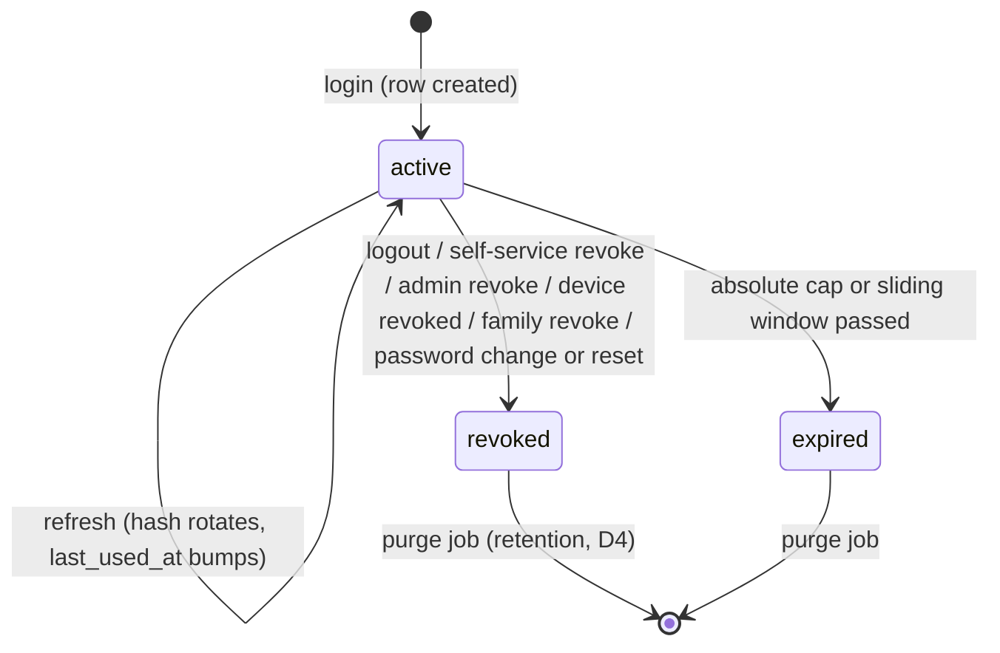
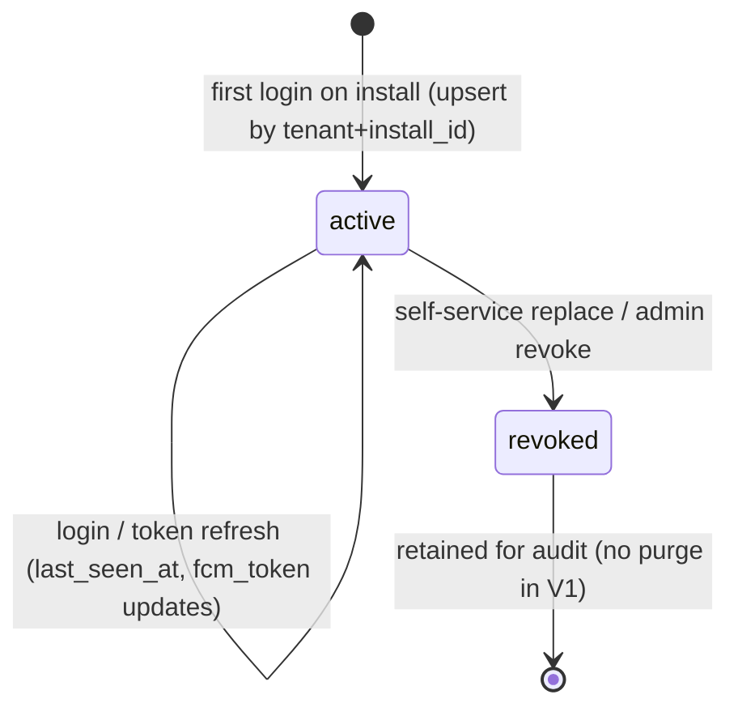
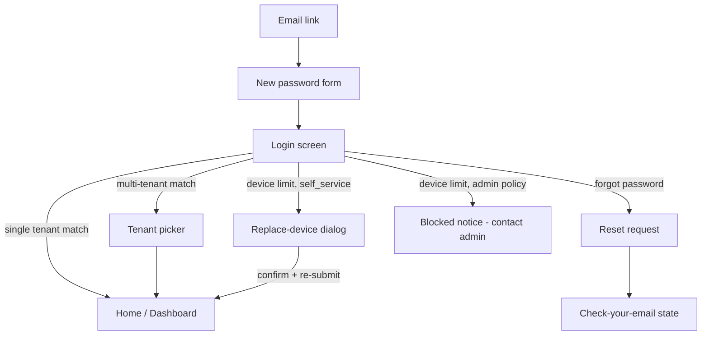

# Module: Authentication

Status: Active (Phase 2) · Related ADRs: `ADR-0004` (model — this doc implements it), `ADR-0002` (tenant claim, suspension), `ADR-0005` (permission resolution), `ADR-0003` (offline unlock constraint) · Depends on: `docs/04-database/core-schema.md` §5, `docs/03-standards/api-standards.md`, `docs/03-standards/security-standards.md` §2–§3, `docs/02-architecture/mobile-flutter.md` §9, `docs/02-architecture/admin-nextjs.md` §5

Namespace `auth` (naming §4). ADR-0004 fixed the credential/token/session/device model; security-standards §2 fixed the hardening defaults. This document owns endpoints, flows, mechanics, and the remaining schema. Neither source is restated.

## 1. Purpose & Scope

Password login with per-tenant identity and tenant picker, JWT access + rotating refresh tokens, session management (self-service + admin), mobile device registry and revocation, device-local PIN/biometric unlock, password reset/change, and invite-based first login.

**V1 exclusions:** MFA/TOTP (A-007 — schema reserved), tenant SSO (OIDC/SAML), passkeys, Play Integrity / App Attest, kiosk mode.

## 2. Actors & Permissions

Self-service identity actions (own sessions, own devices, own password) require authentication but **no permission key** — they are identity care, available to every role. Admin surfaces are permission-gated:

| Action | Permission key | Employee | Manager | HR Admin | System Administrator |
|---|---|---|---|---|---|
| Login / refresh / logout / me | — (public / authenticated) | ✅ | ✅ | ✅ | ✅ |
| List / revoke **own** sessions & devices | — (authenticated) | ✅ | ✅ | ✅ | ✅ |
| Change own password | — (authenticated) | ✅ | ✅ | ✅ | ✅ |
| List sessions/devices of any user in tenant | `auth.session.read` / `auth.device.read` | — | — | — | ✅ |
| Revoke any session / device in tenant | `auth.session.revoke` / `auth.device.revoke` | — | — | — | ✅ |
| Unlock a `locked` account | `auth.user.unlock` | — | — | — | ✅ |
| Trigger reset email for a user | `auth.user.reset` | — | — | — | ✅ |

Template defaults per ADR-0005; final catalog in `docs/05-platform/authorization-rbac.md`. Super Admin acts on tenants via impersonation (system-administration.md), never via direct tenant credentials.

## 3. Business Rules

| # | Rule |
|---|---|
| BR-AUTH-001 | Email is unique per tenant (live rows). A credential matching users in multiple tenants returns a tenant picker listing **only tenants where the password verified**; suspended tenants are excluded from choices. |
| BR-AUTH-002 | Unknown email, wrong password, and `inactive` user all return `AUTH_INVALID_CREDENTIALS` — one code, uniform response time (dummy argon2 verify on unknown email). No enumeration, ever. |
| BR-AUTH-003 | 5 failed password attempts within the window lock the credential for 15 min (`AUTH_ACCOUNT_LOCKED` + `retryAfterSeconds`). Counter keyed by lowercased email (pre-tenant-resolution), stored in Redis with TTL, reset on success. Unknown emails produce the identical lockout behavior. Defaults tenant-tunable (`auth.*`, security-standards §2). |
| BR-AUTH-004 | Refresh tokens are single-use and rotate on every refresh. Reuse outside the concurrency grace window (BR-AUTH-005) revokes the whole session family (`AUTH_REFRESH_REUSED`). |
| BR-AUTH-005 | **Rotation grace window:** a just-rotated refresh token presented again within 10 s returns the *same* successor pair (cached, idempotent). Legitimate multi-tab/web races are not treated as theft; outside the window, BR-AUTH-004 applies. |
| BR-AUTH-006 | A session is live only while `revoked_at IS NULL`, `now < expires_at` (absolute cap) **and** `now < last_used_at + sliding lifetime`. Revocation kills the refresh path immediately; access tokens die at their 15-min horizon; endpoints flagged *sensitive* in module docs re-check session liveness server-side. |
| BR-AUTH-007 | Default one active mobile device per user (`auth.max_active_devices`). Limit hit at login → `AUTH_DEVICE_LIMIT_REACHED`. `auth.device_replacement_policy = self_service` → login may carry `replaceDeviceId` (old device + its sessions revoked atomically). `= admin` → replacement only via an admin revoking the old device; the System Administrator is notified of the blocked attempt. No approval-engine dependency in V1. |
| BR-AUTH-008 | PIN/biometric are device-local unlock only — no PIN, PIN hash, or biometric material is ever transmitted or stored server-side. 5 failed local unlocks wipe local **tokens only** (pending sync data survives — ADR-0003). |
| BR-AUTH-009 | Password change requires the current password and revokes all *other* sessions. Password reset revokes **all** sessions. Both fire a notification (§13). |
| BR-AUTH-010 | Reset and invite tokens: single-use, SHA-256 stored, TTL 30 min (reset) / 7 days (invite), response shape and timing identical whether the email exists or not. |
| BR-AUTH-011 | Suspended tenant blocks login **and** refresh (`AUTH_TENANT_SUSPENDED`); in-flight access tokens die at the 15-min horizon (multi-tenancy §2). |
| BR-AUTH-012 | Access JWTs carry no permission claims (ADR-0004); `typ` must be `access` — refresh material never authenticates a request. |
| BR-AUTH-013 | `users.status = 'locked'` is a persistent administrative lock (distinct from BR-AUTH-003's timed lockout): login returns `AUTH_ACCOUNT_LOCKED` without `retryAfterSeconds`; cleared only via `auth.user.unlock`. |
| BR-AUTH-014 | Every mobile session is bound to an active device row; web sessions have `device_id NULL`. A revoked device turns its sessions dead at the next API contact (`AUTH_DEVICE_REVOKED`). |

## 4. Domain Model

`users`, `sessions`, `devices` are owned here — Drizzle definitions in core-schema §5 (not repeated). This module adds one table:

```ts
// src/database/schema/auth.ts (addition)
export const tokenPurpose = pgEnum('token_purpose', ['password_reset', 'invite']);

export const authTokens = pgTable('auth_tokens', {
  ...id,
  ...tenantId,
  userId: uuid('user_id').notNull().references(() => users.id),
  tokenHash: text('token_hash').notNull(),          // sha256; raw token only in the email link
  purpose: tokenPurpose('purpose').notNull(),
  expiresAt: timestamp('expires_at', { withTimezone: true }).notNull(),
  usedAt: timestamp('used_at', { withTimezone: true }),
  ...auditColumns,                                   // created_by NULL for self-service requests
}, (t) => [
  uniqueIndex('uq_auth_tokens_token_hash').on(t.tokenHash),
  index('idx_auth_tokens_tenant_id_user_id').on(t.tenantId, t.userId),
]);
```

Tenant-owned → standard RLS policy (database-conventions §9 template). Redis structures (all tenant-prefixed per multi-tenancy §6): lockout counters (`TTL 15 min`), rotation-grace cache (`TTL 10 s`, old hash → successor pair), used-refresh-token history per session (7 d, powers family-revoke detection — core-schema §5 note).

**Pre-tenant lookup path (grilled 2026-08-02 — fulfills the core-schema §9 wrinkle):** the login membership scan (`users` by email), refresh lookup (`sessions` by token hash), reset/invite token consumption (`auth_tokens` by token hash), and the revoked-install check (`devices`) all run before a tenant context exists — under plain `hris_app`, FORCE RLS would return zero rows and login would be structurally impossible. The dedicated auth repository wraps exactly these SELECTs in `SET LOCAL ROLE hris_auth`: a `NOLOGIN` role with SELECT-only, column-narrow grants on those four tables and a `FOR SELECT TO hris_auth USING (true)` policy on each (role SQL: multi-tenancy §4). Transaction-local, so pooling-safe; the role can write nothing (leak test L7). Every write that follows — session insert, device upsert, `last_login_at`, token consumption — runs under the resolved tenant's normal `set_config` context.

### Session lifecycle



`expired` is derived (BR-AUTH-006 predicate), not a stored status; `revoked` is stored (`revoked_at` + `revoked_reason`: `logout | user | admin | device_revoked | token_reuse | password_change | password_reset`).

### Device lifecycle



Invariants: one active device per `(tenant_id, install_id)` (partial unique); one current refresh hash per session; `auth_tokens.used_at` set exactly once (single-use, checked in the consuming transaction).

## 5. Use Cases

**UC-AUTH-001 — Login (password).** Actor: any user. Precondition: none (public).
Main: (1) throttle check (security-standards §3 — before argon2); (2) lockout check (BR-AUTH-003); (3) verify password against every tenant membership for the email; (4) zero matches → `AUTH_INVALID_CREDENTIALS`; (5) exactly one → issue session; (6) multiple → return `tenantChoices` (no tokens); client re-calls with `tenantId`.
Session issue: create/refresh device row (mobile), create session row, sign access JWT (A-014), return refresh (body for mobile, `Set-Cookie` for web).
Exceptions: lockout → `AUTH_ACCOUNT_LOCKED`; suspended tenant excluded from choices, sole match suspended → `AUTH_TENANT_SUSPENDED`; device limit → `AUTH_DEVICE_LIMIT_REACHED` (BR-AUTH-007). Postcondition: live session; `users.last_login_at` stamped; failed-counter reset.

**UC-AUTH-002 — Refresh.** Actor: client with refresh token. Main: lookup hash → live-session predicate (BR-AUTH-006) → rotate (new pair, old marked used) → return. Alternates: within grace window → same successor pair (BR-AUTH-005). Exceptions: unknown/expired/revoked → `AUTH_REFRESH_INVALID`; reuse past grace → family revoke + `AUTH_REFRESH_REUSED`; tenant suspended → `AUTH_TENANT_SUSPENDED`; bound device revoked → `AUTH_DEVICE_REVOKED`. Postcondition: `last_used_at` bumped — sliding window extends.

**UC-AUTH-003 — Logout.** Actor: authenticated user. Revokes the acting session (`reason: logout`), clears the web cookie. Mobile honors the pending-sync prompt before local wipe (offline-sync §9). Offline logout (mobile) is best-effort: revoke attempted when reachable, local wipe proceeds regardless; the lingering row is self-revocable from the session list and expires at the sliding window (grilled 2026-08-02). Idempotent: logging out a dead session still returns success.

**UC-AUTH-004 — Session management.** Actor: user (own) or System Administrator (`auth.session.read`/`revoke`). List shows device/user-agent, IP, created/last-used, current-session marker. Revoke any listed session; *revoke-others* kills all but the acting one. Revoking an already-revoked session = success no-op.

**UC-AUTH-005 — Device revocation.** Actor: user (own) or admin. Device → `revoked` + its sessions revoked (`reason: device_revoked`) + FCM token dropped in the same transaction. The device's next API contact gets 401; terminal sync notice per offline-sync §8 (revoked device never gets a final push).

**UC-AUTH-006 — Password reset.** Request (public): accept email, always 200 with identical shape/time; if the email exists in exactly one tenant, create `auth_tokens` row + email; multi-tenant emails get one email per membership (each link carries its own token). Confirm (public): token + new password → validate single-use + TTL (`AUTH_RESET_TOKEN_INVALID`), policy check (`AUTH_PASSWORD_POLICY_VIOLATION`), set hash, mark used, revoke all sessions, notify.

**UC-AUTH-007 — Password change.** Actor: authenticated. Current password verified (`AUTH_INVALID_CREDENTIALS` on mismatch — no lockout counter on this path), policy check, revoke other sessions, notify.

**UC-AUTH-008 — Invite accept.** Actor: invited user (public link from employee provisioning). Token + chosen password → same single-use mechanics (`AUTH_INVITE_TOKEN_INVALID`), sets first credential, user becomes loginable. Invite issuance itself belongs to the employee/user-provisioning flows.

**UC-AUTH-009 — Local unlock (mobile, no API).** Biometric/PIN unwraps the stored refresh token (mobile-flutter §9 flowchart — not restated). Fully offline; 5 failures → token wipe (BR-AUTH-008) → password re-login required when online.

## 6. UI Flow

Component/visual rules: design-system (approved). Unlock-flow diagram: mobile-flutter §9. Navigation:



| Surface | Screens | Notes |
|---|---|---|
| Mobile | Login, tenant picker (bottom sheet), unlock (biometric/PIN), Settings → Sessions list, Settings → Change password | Unlock is the cold-start default once enrolled; sync truth line unaffected by auth screens (design-system §12) |
| Admin web | Login page, tenant picker, forgot/reset pages, invite-accept page, profile menu → Sessions, admin → Users → sessions/devices tabs | Sessions/devices tabs use the DataTable wrapper; current session tagged; revoke = confirm dialog (destructive style) |

Error states render catalog codes via `errors.<CODE>` keys; lockout shows a countdown from `retryAfterSeconds`. Loading/empty states per design-system §6/§9 — no deviations.

## 7. API

Operation-style paths (`/auth/<operation>`) are a sanctioned deviation from api-standards §1 resource grammar — login/refresh/logout are operations, not resources. `sessions`/`devices` follow normal resource grammar. All endpoints: Queue-reachable **no** (auth never syncs offline); Idempotency-Key **—** (rotation and single-use tokens carry their own replay semantics); errors listed beyond the implied set (error-catalog §1.2).

| Endpoint | Auth | Permission |
|---|---|---|
| `POST /api/v1/auth/login` | Public | — |
| `POST /api/v1/auth/refresh` | Public (token is the credential) | — |
| `POST /api/v1/auth/logout` | Access token | — |
| `GET /api/v1/auth/me` | Access token | — |
| `GET /api/v1/auth/sessions` | Access token | own: — · `?userId=` other: `auth.session.read` |
| `POST /api/v1/auth/sessions/{id}/revoke` | Access token | own: — · other: `auth.session.revoke` |
| `POST /api/v1/auth/sessions/revoke-others` | Access token | — |
| `GET /api/v1/auth/devices` | Access token | own: — · `?userId=` other: `auth.device.read` |
| `POST /api/v1/auth/devices/{id}/revoke` | Access token | own: — · other: `auth.device.revoke` |
| `POST /api/v1/auth/password/reset-request` | Public | — |
| `POST /api/v1/auth/password/reset-confirm` | Public | — |
| `POST /api/v1/auth/password/change` | Access token | — |
| `POST /api/v1/auth/invite/accept` | Public | — |
| `POST /api/v1/auth/users/{id}/unlock` | Access token | `auth.user.unlock` |
| `POST /api/v1/auth/users/{id}/reset` | Access token | `auth.user.reset` |

#### POST /api/v1/auth/login
Permission: — (public) · Idempotency: — · Pagination: —

Request:
| Field | Type | Required | Rule |
|---|---|---|---|
| `email` | string | ✅ | email format, lowercased server-side |
| `password` | string | ✅ | 1–128 chars (never trimmed) |
| `tenantId` | uuid | — | second call after picker |
| `rememberDevice` | boolean | — | web only; drives refresh lifetime (ADR-0004) |
| `device` | object | mobile ✅ | `{ installId: uuid, platform: 'android'\|'ios', model, osVersion, appVersion, fcmToken? }` |
| `replaceDeviceId` | uuid | — | self-service replacement (BR-AUTH-007) |

Response 200 (session): `{ accessToken, expiresInSeconds, refreshToken?, user: { id, email, employeeId?, name }, tenant: { id, name } }` — `refreshToken` in body for mobile; web receives it as the `Set-Cookie` (security-standards §5 cookie attributes). Response 200 (picker): `{ tenantChoices: [{ tenantId, tenantName }] }`.
Errors: `AUTH_INVALID_CREDENTIALS` — BR-AUTH-002 · `AUTH_ACCOUNT_LOCKED` — BR-AUTH-003/013 · `AUTH_TENANT_SUSPENDED` — BR-AUTH-011 · `AUTH_DEVICE_LIMIT_REACHED` — BR-AUTH-007, `details: { maxDevices, policy }` · `AUTH_DEVICE_REVOKED` — login attempt from a revoked install.

#### POST /api/v1/auth/refresh
Permission: — (the refresh token is the credential) · Idempotency: — (grace window is the replay story)

Request: mobile `{ refreshToken: string, fcmToken?: string }` — `fcmToken` rides when FCM rotated it since the last report; the server upserts the device row (grilled 2026-08-02). Web — empty body, `httpOnly` cookie rides (`withCredentials`, the only CORS-credentialed path).
Response 200: `{ accessToken, expiresInSeconds, refreshToken? }` (rotated; delivery split as login).
Errors: `AUTH_REFRESH_INVALID` · `AUTH_REFRESH_REUSED` — family revoked · `AUTH_TENANT_SUSPENDED` · `AUTH_DEVICE_REVOKED`.

#### POST /api/v1/auth/logout
Response 200: `{ id }` (revoked session). Idempotent (UC-AUTH-003). Clears the cookie on web.

#### GET /api/v1/auth/me
Response 200: `{ user: { id, email, name, employeeId? }, tenant: { id, name, status }, permissions: string[], companyScope: string[] | null }` — the client bootstrap contract (admin-nextjs §5, ADR-0005 scope shape). No errors beyond the implied set.

#### GET /api/v1/auth/sessions
Permission: own — · other `auth.session.read` · Pagination: offset (registered, api-standards §6)

Request: `?userId=` (admin), `?page&pageSize&sortBy` (reserved params). Response 200: `data: [{ id, deviceSummary, ip, userAgent, createdAt, lastUsedAt, current: boolean, trustedDevice }]` + offset meta. Sessions of other users without the permission → `404` (existence hiding, error-catalog §2).

#### POST /api/v1/auth/sessions/{id}/revoke
Permission: own — · other `auth.session.revoke`. Response 200: `{ id }`. Revoking the acting session behaves as logout. No-op success on already-revoked (UC-AUTH-004).

#### POST /api/v1/auth/sessions/revoke-others
Response 200: `{ revokedCount }`. Always scoped to the acting user.

#### GET /api/v1/auth/devices · POST /api/v1/auth/devices/{id}/revoke
Mirror the two session endpoints (permissions `auth.device.read` / `auth.device.revoke`; offset pagination; existence-hiding 404). Revoke response 200: `{ id }`; cascades per UC-AUTH-005.

#### POST /api/v1/auth/password/reset-request
Request: `{ email }`. Response 200: `{}` — always, identical timing (BR-AUTH-010). Throttled hard (security-standards §3). No errors beyond throttle/validation by design.

#### POST /api/v1/auth/password/reset-confirm
Request: `{ token: string, newPassword: string }`. Response 200: `{}` — all sessions revoked; client routes to login.
Errors: `AUTH_RESET_TOKEN_INVALID` — unknown/expired/used, one code · `AUTH_PASSWORD_POLICY_VIOLATION` — field entries per policy rule.

#### POST /api/v1/auth/password/change
Request: `{ currentPassword, newPassword }`. Response 200: `{}` — other sessions revoked, acting session survives.
Errors: `AUTH_INVALID_CREDENTIALS` — wrong current password · `AUTH_PASSWORD_POLICY_VIOLATION`.

#### POST /api/v1/auth/invite/accept
Request: `{ token, password }`. Response 200: `{}` — client routes to login (no auto-login: keeps one issuance path).
Errors: `AUTH_INVITE_TOKEN_INVALID` · `AUTH_PASSWORD_POLICY_VIOLATION`.

#### POST /api/v1/auth/users/{id}/unlock · POST /api/v1/auth/users/{id}/reset
Admin: clear `locked` status + counters / issue a reset token email for the user. Response 200: `{ id }`. Miss or no permission → 404 (existence hiding).

## 8. Validation Rules

| Field | Rule | Error code (field-level) |
|---|---|---|
| `email` | required, email format, ≤ 254 | `VAL_REQUIRED` / `VAL_INVALID_FORMAT` |
| `password` (login) | required, ≤ 128 | `VAL_REQUIRED` / `VAL_TOO_LONG` |
| `newPassword` / `password` (set) | transport: required, 10–128 (`VAL_TOO_SHORT`/`VAL_TOO_LONG`); tenant policy (breached-list, derived-string) → `AUTH_PASSWORD_POLICY_VIOLATION` with field entries | mixed — see rule |
| `device.installId`, ids | UUID format | `VAL_INVALID_FORMAT` |
| `device.platform` | `android \| ios` | `VAL_INVALID_ENUM` |
| `token` (reset/invite) | required, opaque — validity is a business check, not format | `VAL_REQUIRED` |

Transport minimums are platform-fixed floors; the tenant-tunable policy (security-standards §2) only tightens above them.

## 9. Edge Cases & Failure Modes

- **Web multi-tab refresh race:** both tabs hold the same cookie value; first rotates it, second replays → grace window returns the same successor (BR-AUTH-005). Past grace (a genuinely stale replay) → family revoke; tabs receive the BroadcastChannel logout (admin-nextjs §5).
- **Email case/spacing:** stored and compared lowercased+trimmed; passwords never trimmed.
- **Sole tenant suspended at picker stage:** `AUTH_TENANT_SUSPENDED`; multiple matches with some suspended → suspended ones silently absent (BR-AUTH-001).
- **User deactivated mid-session:** permission cache refresh (ADR-0005 TTL) starts denying; sensitive endpoints re-check liveness (BR-AUTH-006); refresh rejects on user status.
- **Device clock skew (mobile):** access-token `exp` is evaluated server-side only; the client treats `AUTH_TOKEN_EXPIRED` as the refresh trigger rather than trusting local clocks (JWT verify allows 30 s leeway, platform-fixed).
- **FCM token rotation:** no dedicated endpoint — the client caches the last-reported value; the next refresh carries `fcmToken` when it differs (§7, grilled 2026-08-02) and login always reports. ≤15-min propagation while online (notification.md consumes).
- **Reset requested then password changed by other means:** outstanding token still validates single-use but sessions were already revoked — harmless; token consumption revokes again (idempotent).
- **Lockout + correct password:** lockout wins — the window must expire even if the right credential arrives (`AUTH_ACCOUNT_LOCKED`).
- **Session purge vs live list:** purge job (§12) touches only rows dead longer than the retention floor — a session list never shows a gap for recently revoked rows (audit trail intact until D4 horizon).

## 10. Offline Behavior

Deviation summary only (global standard: offline-sync.md): authentication itself is **never queued** — no auth operation enters `local_sync_queue`. Offline unlock is local (UC-AUTH-009). The sync engine refreshes tokens before draining (mobile-flutter §8 interceptor order). Auth loss follows the two-class disposition (grilled 2026-08-02): session-lost (incl. `AUTH_SESSION_REVOKED` with `reason ≠ device_revoked`) → tokens cleared, queue + DB preserved, identity-checked re-login; device-terminal (`AUTH_DEVICE_REVOKED` / `reason = device_revoked`) → terminal revoked-device flow (offline-sync §9). Offline logout is best-effort revoke (UC-AUTH-003). Token wipe after 5 failed unlocks leaves the queue intact (BR-AUTH-008).

## 11. Module Error Codes

`AUTH_` block seeded by the catalog (11 codes — error-catalog §5) is owned here; registered this session:

| Code | HTTP | Trigger |
|---|---|---|
| `AUTH_RESET_TOKEN_INVALID` | 401 | Reset token unknown, expired, or already used — one code, no distinction leaked |
| `AUTH_INVITE_TOKEN_INVALID` | 401 | Invite token unknown, expired, or already used |

## 12. Background Jobs & Events

| Job | Schedule | Behavior |
|---|---|---|
| `cron.auth.purge-dead-sessions` | daily | Hard-deletes `revoked`/`expired` sessions past the D4 retention floor (database-conventions §4.4); per-tenant scan per ADR-0010 |
| `cron.auth.purge-auth-tokens` | daily | Deletes used/expired `auth_tokens` rows past 30 d |

Events emitted (outbox, ADR-0010): `auth.session.revoked` `{ sessionId, userId, reason }`, `auth.device.revoked` `{ deviceId, userId }`, `auth.password.changed` `{ userId, via: 'change' | 'reset' }` — consumed by notification (§13) and audit-log. Payloads are pointers + primitives (coding-standards-nestjs §7).

## 13. Approval, Notification & Report Touchpoints

- **Approval:** none in V1 — the `admin` device-replacement policy is manual admin revocation, not an approval chain (BR-AUTH-007).
- **Notification (templates in notification.md):** password changed (email), password reset requested (email — the token carrier), new device registered (email + push to old device), device revoked (push where reachable — subject to the revoked-device rule), blocked replacement attempt (in-app to System Administrator), account locked (email).
- **Reports:** none owned here; session/device history surfaces through audit-log events.
- **Ports served — `AccountLifecyclePort`** (added 2026-08-02, consumer employee.md): `createUserForEmployee(employeeId, email)` — creates the tenant user, links `employees.user_id`, assigns the Employee role template (authorization-rbac default duty), and queues `auth.invite`, all inside the caller's transaction (BR-EMP-002 hire); `deactivateUser(userId, reason)` — sets `users.status = 'inactive'` and revokes live sessions in the caller's transaction (employee.md BR-EMP-006 exit; login/refresh die immediately per BR-AUTH-002/§9, access tokens age out ≤ 15 min).

## 14. Test Scenarios

| Scenario | Covers |
|---|---|
| Unknown email vs wrong password: identical code, statistically indistinguishable timing | BR-AUTH-002 |
| 5th failure locks; 6th with correct password still locked; expiry unlocks; counter resets on success | BR-AUTH-003 |
| Rotate → replay old token at 5 s (same pair returned) and 15 s (family revoked, all session tokens dead) | BR-AUTH-004/005 |
| Sliding vs absolute expiry: refresh at absolute-cap boundary rejected despite recent use | BR-AUTH-006 |
| Device limit: second device login → 409; with `replaceDeviceId` under `self_service` → old device + sessions revoked atomically; under `admin` → still 409 + admin notification | BR-AUTH-007 |
| Password change revokes others (acting session survives); reset revokes all | BR-AUTH-009 |
| Reset token: second consumption fails; expired fails; both same code | BR-AUTH-010 |
| Suspended tenant: login excluded from picker; refresh rejected; guard blocks (multi-tenancy L-matrix companion) | BR-AUTH-011 |
| Revoked device drain: queued ops rejected terminally, no final push, local pending preserved | BR-AUTH-014 + offline-sync §8 |
| 5 failed unlocks wipe tokens, Drift queue intact (crash-invariant suite) | BR-AUTH-008 |
| Password reset from web: phone's next refresh fails → session-lost flow — tokens cleared, queue + DB preserved; same-user re-login drains; different-user login wipes after notice | BR-AUTH-009 + auth-loss disposition (grilled 2026-08-02) |

E2E per coding-standards-nestjs §9 (supertest over Testcontainers); mobile unlock/wipe per coding-standards-flutter §9.

## 15. Future Improvements

TOTP MFA (fields reserved — A-007, first fast-follow), tenant SSO (OIDC/SAML — session/device model is IdP-agnostic), passkeys for admin web, Play Integrity / App Attest device signals (post-GA, D10), session anomaly alerts (impossible travel), remembered-device MFA skip (marker already on sessions).
