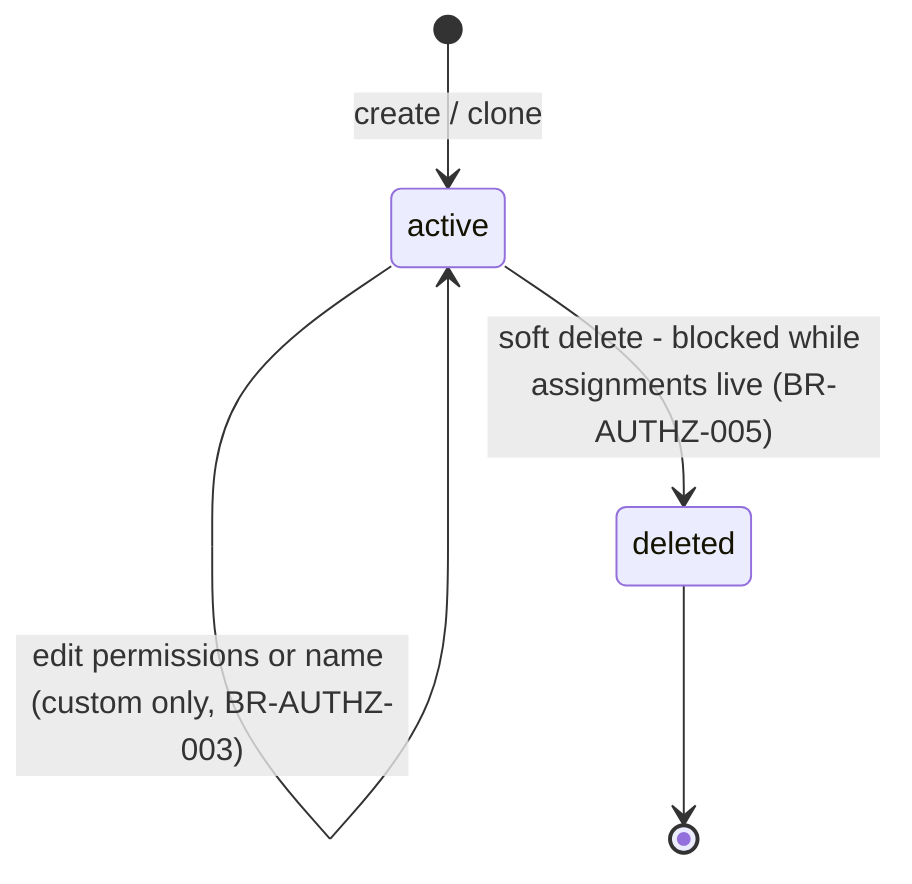
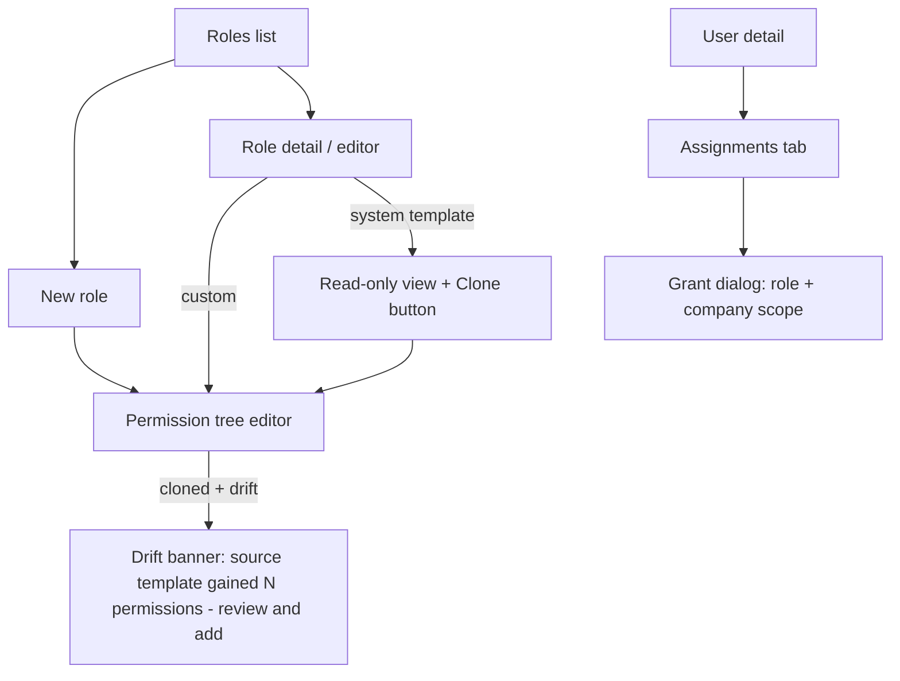

# Module: Authorization (RBAC)

Status: Active (Phase 2) · Related ADRs: `ADR-0005` (model — this doc implements it), `ADR-0004` (permission cache, no claims in JWT), `ADR-0002` (tenant isolation beneath RBAC), `ADR-0008` (two-gate approval boundary) · Depends on: `docs/04-database/core-schema.md` §4/§6, `docs/03-standards/api-standards.md`, `docs/05-platform/authentication.md` (`/auth/me` bootstrap), `docs/03-standards/naming-conventions.md` §5

Namespace `authz` (naming §4). ADR-0005 fixed the two-axis model (permission gates the action, data scope gates the rows), additive-only composition, and the enforcement flow. This document owns the catalog registry protocol, role/assignment mechanics (including clone drift — grilling amendment), the guard contract, endpoints, and `AUTHZ_` codes.

## 1. Purpose & Scope

Permission catalog registry, system role templates (seed + re-sync), custom roles (create/clone/edit/delete), role assignments with company scoping, effective-permission resolution + Redis cache, route guard contract, and the role-builder UI rules.

**V1 exclusions:** ABAC/policy engines, role hierarchy/inheritance, deny rules, time-bound assignments, wildcards, tenant-defined permissions, approval delegation (ADR-0008 owns it).

## 2. Actors & Permissions

| Action | Permission key | Data scope | Company Admin | System Administrator |
|---|---|---|---|---|
| View permission catalog | `authz.permission.read` | tenant (catalog is global, read is gated) | ✅ | ✅ |
| List/inspect roles | `authz.role.read` | tenant | ✅ | ✅ |
| Create / clone / edit / delete custom roles | `authz.role.create` / `update` / `delete` | tenant | ✅ | ✅ |
| List assignments | `authz.assignment.read` | company-scoped admins see their companies only | ✅ (own companies) | ✅ |
| Grant / revoke assignments | `authz.assignment.assign` | grantor may only scope within their own assignment scope (BR-AUTHZ-007) | ✅ (own companies) | ✅ |

Template defaults: Company Administrator carries the full set company-scoped; System Administrator tenant-wide. No self-service surface — Employee/Manager/HR roles hold none of these keys by default. Super Admin acts via impersonation only (system-administration.md).

**Catalog registration protocol (mirrors the error catalog):** permission keys are code-defined (ADR-0005); the handbook registry is the union of every module doc's §2 matrix — each module registers its keys in its own §2 in the same session it introduces them. This document owns only the `authz.*` keys above; `auth.*` keys are registered in authentication.md §2. The seeded-to-DB catalog (`permissions` table, core-schema §4) is generated from code at release (§12).

## 3. Business Rules

| # | Rule |
|---|---|
| BR-AUTHZ-001 | Effective permission set = union of all live assignments' role permissions. Additive only — no deny, no hierarchy, no wildcards. Absence is denial. |
| BR-AUTHZ-002 | Every route declares `@RequirePermission(key…)` (multiple = AND unless the endpoint doc says otherwise), `@Public()`, or `@AuthenticatedOnly()`. A bare route fails CI and startup (backend-nestjs §5). |
| BR-AUTHZ-003 | System templates (`is_system = true`) are immutable to tenants: no edit, no delete, no permission changes (`AUTHZ_SYSTEM_ROLE_IMMUTABLE`). Platform release re-syncs their permission sets in place. |
| BR-AUTHZ-004 | **Clone drift:** cloning a template copies its permission set at clone time and records `cloned_from_role_id`. Template re-sync **never** mutates clones. Drift = set difference (current source template keys − clone keys), computed live; the role editor surfaces it as a nudge (§6) — adopting drift keys is always an explicit admin action. |
| BR-AUTHZ-005 | A role with live assignments cannot be deleted (`AUTHZ_ROLE_IN_USE`); assignments must be revoked first. No cascade-revoke shortcut — removing access for N users must be N visible acts (or a deliberate bulk action), never a side effect. |
| BR-AUTHZ-006 | **Last-admin guard:** the tenant must always retain ≥ 1 live *tenant-wide* assignment of a role granting `authz.assignment.assign`. The revoke/delete that would break this fails (`AUTHZ_LAST_ADMIN`). |
| BR-AUTHZ-007 | A grantor may only create assignments within their own scope: company-scoped admins grant only for their companies and only roles whose permissions they could scope there; tenant-wide grants require a tenant-wide grantor assignment. |
| BR-AUTHZ-008 | Permission checks read the Redis cache (`hris:authz:{tenantId}:{userId}:permissions`, TTL 60 s); every role/assignment mutation busts affected users' entries post-commit (best effort — TTL is the backstop). Grants and revocations bite within seconds, worst case 60 s. |
| BR-AUTHZ-009 | Guards check permission keys only. Data scope (`self`/`team`/`company`/`tenant`) is resolved in use cases/repositories via the shared ownership helpers; a data-scope miss renders as **404** (existence hiding, error-catalog §2), never 403. |
| BR-AUTHZ-010 | `AUTHZ_PERMISSION_DENIED` (403) is returned only for *navigation-level* permission misses — the user knows the surface exists (menu guessing); row-level misses are BR-AUTHZ-009's 404. |
| BR-AUTHZ-011 | Permission keys are immortal (same law as error codes): never renamed, never deleted. Retiring one = mark deprecated in the catalog + remove from enforcement; re-sync prunes deprecated keys from system templates, clones keep them harmlessly (dead keys grant nothing). |
| BR-AUTHZ-012 | Approval rights are two-gate (ADR-0005/0008): the permission gates the endpoint; chain membership gates the instance. Nothing in this module ever entitles approving a specific request. |
| BR-AUTHZ-013 | Impersonation resolves the **impersonated user's** effective set — never the Super Admin's platform keys — with the impersonation marker carried in context for audit (multi-tenancy §1, system-administration.md). |

## 4. Domain Model

Tables owned here: `permissions` (platform catalog, core-schema §4), `roles`, `role_permissions`, `user_roles` (core-schema §6 — not repeated). One schema extension, migrated by this module:

```ts
// addition to roles (src/database/schema/authz.ts)
clonedFromRoleId: uuid('cloned_from_role_id')
  .references((): AnyPgColumn => roles.id, { onDelete: 'set null' }),  // NULL = built from scratch or template
```

Drift needs no timestamps: templates re-sync in place, so drift is always the live set difference against the current source template (BR-AUTHZ-004). `permissions` gains a `deprecatedAt timestamptz` nullable column (BR-AUTHZ-011) — same migration.



Assignments have no lifecycle: created → hard-deleted on revoke, history in the audit log (core-schema §6 note). Invariants: `uq_roles_tenant_id_key` (live rows); `uq_user_roles_assignment` with `NULLS NOT DISTINCT` (duplicate grant = validation error, not silent dedupe); `role_permissions` rows always reference live catalog keys at write time.

### 4.1 Port served — `RoleHolderPort`

Added 2026-08-07 with its first caller (A-196). This module is otherwise consumed through the guard and `PermissionResolverService`, so this is its first declared port; it exists because `user_roles` is this module's table and ADR-0001 rule 2 forbids anyone else reading it.

```ts
export interface RoleHolderPort {
  /**
   * Users holding the role in the company, **plus every holder of it
   * tenant-wide** — a tenant-scoped assignment reaches every company under
   * ADR-0005, so excluding those holders would hide the tenant-wide HR Admin
   * from the fallback that names them.
   */
  holderUserIds(roleId: string, companyId: string): Promise<string[]>;
  /** `null` when the tenant has no live role with that key. */
  findIdByKey(key: string): Promise<string | null>;
  /** approval-engine §8's resolver-ref check — live role, this tenant. */
  exists(roleId: string): Promise<boolean>;
}
```

Two of approval-engine's rungs need it and neither can be served any other way: the `role_holders` resolver names a role by **id** (BR-APRV-006), while `approval.fallback_role` names one by **key** (`hr_admin` by default, settings.md §4.2) — so both lookups are declared rather than one, and a consumer is never asked to translate between them.

## 5. Use Cases

**UC-AUTHZ-001 — Resolve effective permissions (every request).** Actor: PermissionGuard. Cache hit → key check. Miss → one query (assignments ⋈ role_permissions, union, distinct), write cache, check. Missing key → `AUTHZ_PERMISSION_DENIED` (BR-AUTHZ-010). Postcondition: request proceeds to data-scope resolution in the use case (BR-AUTHZ-009).

**UC-AUTHZ-002 — Create custom role.** Actor: role admin. Main: name (+ optional `cloneFromRoleId`) + permission key list → validate keys exist and are live → slug `key` generated from name (unique per tenant, live rows) → role + junction rows in one tx. Clone: permission set copied from source, `cloned_from_role_id` recorded; source may be a template or another custom role. Postcondition: role usable immediately.

**UC-AUTHZ-003 — Edit custom role.** Precondition: `is_system = false` (else `AUTHZ_SYSTEM_ROLE_IMMUTABLE`). Permission-set changes replace junction rows in one tx; cache busted for all assigned users (BR-AUTHZ-008). Detail response carries `driftKeys` when `cloned_from_role_id` is set (BR-AUTHZ-004); adopting them is a normal edit.

**UC-AUTHZ-004 — Delete custom role.** Precondition: zero live assignments (BR-AUTHZ-005). Soft delete; key freed for reuse only by live-row uniqueness (a recreated name gets a fresh slug if the old row lingers).

**UC-AUTHZ-005 — Grant assignment.** Actor: assignment admin. Main: user + role + optional `companyId` → scope check against grantor (BR-AUTHZ-007) → duplicate check (unique index) → insert → cache bust → audit event. Exception: duplicate → `VAL_DUPLICATE` field entry.

**UC-AUTHZ-006 — Revoke assignment.** Last-admin guard (BR-AUTHZ-006) → hard delete → cache bust → audit event. Revoking your own assignment is legal (warned in UI) except where the guard bites.

**UC-AUTHZ-007 — Template re-sync (release job).** Actor: platform (release pipeline). Diff code catalog vs `permissions` table → insert new keys, stamp `deprecated_at` on retired ones → replace each system template's junction rows to match code → prune deprecated keys from templates only (clones untouched) → bulk cache bust per tenant. Idempotent — re-running converges.

## 6. UI Flow

Admin web only (mobile consumes permissions, never manages them).



- **Permission tree editor:** catalog grouped by module namespace, checkbox per key with its description; system templates render the same tree read-only. Deprecated keys never offered; shown struck-through where a clone still carries them.
- **Drift banner** (BR-AUTHZ-004): listed keys with descriptions + one-click "add selected" — never "sync all" silently.
- **Grant dialog:** role picker + company scope selector limited to the grantor's scope (BR-AUTHZ-007); warning copy when granting tenant-wide.
- Revoke = destructive confirm; revoking own assignment gets the explicit "you may lose access now" warning (cache bust is immediate).
- States per design-system §6/§9; assignments/roles grids on the DataTable wrapper. Permission-hidden UI follows admin-nextjs §10 (hiding is UX; 404 rendering for scope misses).

## 7. API

All endpoints: Queue-reachable **no** · Idempotency **—** (single-row mutations; duplicate grant is caught by the unique index) · admin-web only.

| Endpoint | Permission | Pagination |
|---|---|---|
| `GET /api/v1/authz/permissions` | `authz.permission.read` | — (full catalog, grouped; ~small hundreds) |
| `GET /api/v1/authz/roles` | `authz.role.read` | offset |
| `POST /api/v1/authz/roles` | `authz.role.create` | — |
| `GET /api/v1/authz/roles/{id}` | `authz.role.read` | — |
| `PATCH /api/v1/authz/roles/{id}` | `authz.role.update` | — |
| `DELETE /api/v1/authz/roles/{id}` | `authz.role.delete` | — |
| `GET /api/v1/authz/assignments` | `authz.assignment.read` | offset |
| `POST /api/v1/authz/assignments` | `authz.assignment.assign` | — |
| `DELETE /api/v1/authz/assignments/{id}` | `authz.assignment.assign` | — |

Client bootstrap (`permissions: string[]`, `companyScope`) ships in `GET /auth/me` (authentication.md §7) — there is no separate `/me/permissions` endpoint; ADR-0005's consequence line is satisfied there.

#### GET /api/v1/authz/permissions
Response 200: `data: [{ module, permissions: [{ key, description, deprecated: boolean }] }]` — grouped by naming §4 namespace, catalog order.

#### GET /api/v1/authz/roles
Request: reserved offset params + `?q=` (name search) + `?isSystem=`. Response 200: `data: [{ id, key, name, description, isSystem, clonedFromRoleId, assignmentCount }]` + offset meta.

#### POST /api/v1/authz/roles
Request:
| Field | Type | Required | Rule |
|---|---|---|---|
| `name` | string | ✅ | 3–80 |
| `description` | string | — | ≤ 300 |
| `permissionKeys` | string[] | ✅ | ≥ 1; every key live in catalog |
| `cloneFromRoleId` | uuid | — | source role in tenant (template or custom); when set, `permissionKeys` optional — defaults to source set |

Response 201: role detail (below). Errors: `VAL_VALIDATION_FAILED` — unknown/deprecated key as `VAL_INVALID_ENUM` field entry, duplicate name-slug as `VAL_DUPLICATE`.

#### GET /api/v1/authz/roles/{id}
Response 200: `{ id, key, name, description, isSystem, clonedFromRoleId, permissionKeys: string[], assignmentCount, driftKeys: string[] }` — `driftKeys` empty unless cloned (BR-AUTHZ-004). Miss/out-of-tenant → 404.

#### PATCH /api/v1/authz/roles/{id}
Request: `name?`, `description?`, `permissionKeys?` (full replacement set). Errors: `AUTHZ_SYSTEM_ROLE_IMMUTABLE` — target is a template · `VAL_VALIDATION_FAILED` — key entries as above.

#### DELETE /api/v1/authz/roles/{id}
Response 200: `{ id }` (soft-deleted). Errors: `AUTHZ_SYSTEM_ROLE_IMMUTABLE` · `AUTHZ_ROLE_IN_USE` — live assignments exist, `details: { assignmentCount }`.

#### GET /api/v1/authz/assignments
Request: `?userId=` / `?roleId=` / `?companyId=` filters + offset params. Response 200: `data: [{ id, userId, userName, roleId, roleName, companyId, companyName, createdAt, createdBy }]` + meta. Company-scoped readers see only assignments within their companies (BR-AUTHZ-007 mirror).

#### POST /api/v1/authz/assignments
Request: `{ userId: uuid, roleId: uuid, companyId?: uuid }` — `companyId` absent/null = tenant-wide. Response 201: assignment row.
Errors: `VAL_VALIDATION_FAILED` — duplicate assignment (`VAL_DUPLICATE`) · out-of-scope grant or unknown user/role/company → 404 (existence hiding — the grantor cannot probe other companies' entities).

#### DELETE /api/v1/authz/assignments/{id}
Hard delete (core-schema §6 — deliberate deviation from the soft-delete default; history lives in the audit log). Response 200: `{ id }`.
Errors: `AUTHZ_LAST_ADMIN` — BR-AUTHZ-006, `details: { }`.

## 8. Validation Rules

| Field | Rule | Error code |
|---|---|---|
| `name` | required, 3–80 | `VAL_REQUIRED` / `VAL_TOO_SHORT` / `VAL_TOO_LONG` |
| `permissionKeys[]` | each key exists, not deprecated | `VAL_INVALID_ENUM` (`{ allowed }` omitted — catalog endpoint is the reference) |
| `permissionKeys` | ≥ 1 entry | `VAL_REQUIRED` |
| `cloneFromRoleId`, ids | UUID; resolvable in tenant | `VAL_INVALID_FORMAT` / 404 |
| duplicate assignment | unique index surfaced as field entry | `VAL_DUPLICATE` |

## 9. Edge Cases & Failure Modes

- **Self-revocation mid-session:** legal (minus last-admin guard); cache bust makes the next request 403/404. UI warns; no server-side special case — sessions stay alive, permissions don't.
- **Zero-role user:** authenticates fine, holds nothing, sees empty surfaces (mobile Employee experience depends on provisioning assigning the Employee template — employee module owns that default).
- **Company with scoped assignments being archived:** organization module blocks archive while live assignments reference the company (documented there; enforced by FK + check in org flows). Assignments never dangle.
- **Deprecated key in a clone:** grants nothing (enforcement code no longer checks it); editor shows it struck-through; removed on the clone's next edit (full-replacement PATCH naturally drops it).
- **Re-sync race with an in-flight role edit:** both replace junction rows transactionally; last writer wins per row set — acceptable, re-sync is idempotent and release-timed (UC-AUTHZ-007), not concurrent with normal admin hours in practice.
- **Cache-bust failure (Redis blip):** stale grants persist ≤ 60 s TTL (BR-AUTHZ-008) — bounded, documented staleness; revocation-critical paths (session revoke) live in authentication, not here.
- **Permission check inside jobs:** workers act as system, not users — no permission guard; tenant isolation still applies (backend-nestjs §9). User-attributed job actions carry the initiating user for audit only.

## 10. Offline Behavior

Deviation summary: mobile caches the last-fetched permission set (from `/auth/me`) in Drift for offline UI gating only; queued mutations are re-checked server-side at drain — a permission revoked while offline rejects the op at sync (terminal outcome per offline-sync §5 class rules). No `authz` operation is ever queued.

## 11. Module Error Codes

Registered this session (`AUTHZ_PERMISSION_DENIED` was seeded — error-catalog §6):

| Code | HTTP | Trigger |
|---|---|---|
| `AUTHZ_SYSTEM_ROLE_IMMUTABLE` | 409 | Edit/delete attempted on a system template (BR-AUTHZ-003) |
| `AUTHZ_ROLE_IN_USE` | 409 | Role delete with live assignments (BR-AUTHZ-005) |
| `AUTHZ_LAST_ADMIN` | 409 | Revoke/delete would leave no tenant-wide assignment admin (BR-AUTHZ-006) |

## 12. Background Jobs & Events

| Job | Trigger | Behavior |
|---|---|---|
| `authz.sync-templates` | release pipeline (not cron) | UC-AUTHZ-007: catalog diff + template re-sync + deprecated pruning + cache bust; idempotent |

Events emitted (outbox): `authz.role.updated` `{ roleId }`, `authz.assignment.granted` `{ assignmentId, userId, roleId, companyId }`, `authz.assignment.revoked` `{ assignmentId, userId, roleId }` — consumed by audit-log (mandatory) and notification (§13). Cache busting is a post-commit side effect in the mutation path itself, not event-driven (60 s TTL backstops delivery failure).

## 13. Approval, Notification & Report Touchpoints

- **Approval:** none owned — role changes take effect immediately in V1 (a grant-approval chain is a Future item). This module **serves** the engine: `RoleHolderPort` (§4.1) is the `role_holders` resolver and BR-APRV-006's fallback rung.
- **Notification:** in-app to the affected user on grant/revoke ("your access changed"); no email (low stakes, high volume).
- **Reports:** access review export (who holds what, per company) surfaces via reports.md registry; raw history via audit-log.

## 14. Test Scenarios

| Scenario | Covers |
|---|---|
| Route without decorator fails CI/startup | BR-AUTHZ-002 |
| Per-module matrix: each endpoint 403s without its key, 200s with it (shared test harness, every module runs it) | BR-AUTHZ-001/002 |
| Scope leak: company-scoped admin reads another company's assignment → 404 not 403; team scope helper leaks nothing (per-module data-scope tests) | BR-AUTHZ-009/010 |
| Template edit/delete rejected; clone then edit succeeds | BR-AUTHZ-003/004 |
| Drift: re-sync adds key to template → clone unchanged, `driftKeys` lists it, adopt-edit clears it | BR-AUTHZ-004 |
| Delete role with 1 live assignment → 409; after revoke → 200 | BR-AUTHZ-005 |
| Last tenant-wide assignment-admin revoke → 409; second admin exists → 200 | BR-AUTHZ-006 |
| Company-scoped grantor grants tenant-wide → 404/blocked | BR-AUTHZ-007 |
| Grant → cache busted → next request passes without waiting for TTL; Redis down → passes within 60 s | BR-AUTHZ-008 |
| Re-sync twice → identical state (idempotency) | UC-AUTHZ-007 |
| Duplicate grant → `VAL_DUPLICATE`, no second row (NULLS NOT DISTINCT covers tenant-wide pairs) | UC-AUTHZ-005 |

## 15. Future Improvements

Branch-level assignment scope (`branch_id` column — model extends without redesign), time-bound assignments, grant-approval chain via ADR-0008, access-review campaigns (periodic attestation), policy-engine migration if conditional access ever materializes (keys are stable identifiers — ADR-0005 future note).
