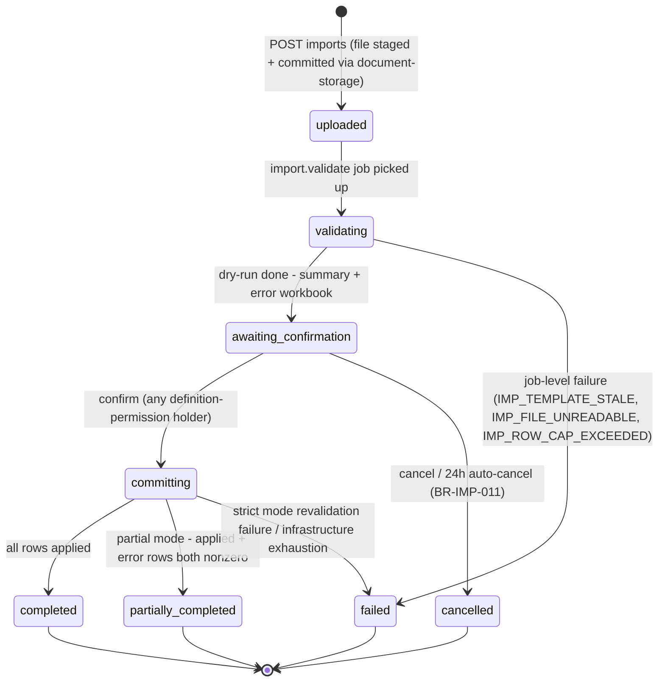
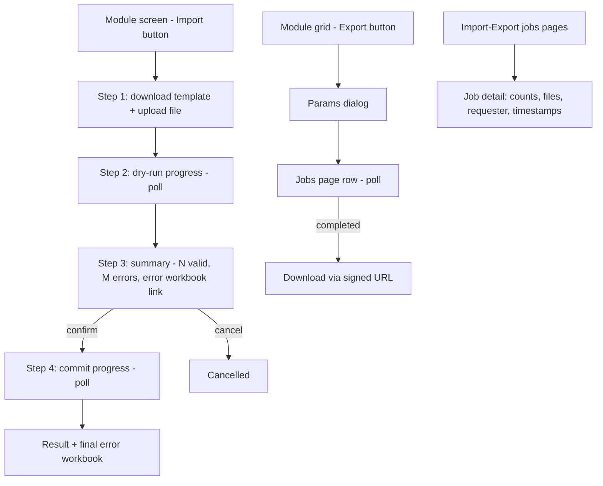

# Module: Import / Export

Status: Active (Phase 2) · Related ADRs: `ADR-0015` (model — this doc implements it), `ADR-0009` (file categories `import_file`), `ADR-0010` (queues `imports`/`exports`), `ADR-0005` (permission-filtered export columns) · Depends on: `docs/05-platform/document-storage.md`, `docs/05-platform/notification.md`, `docs/05-platform/settings.md`, `docs/03-standards/api-standards.md` · Consumers: employee.md (bulk import), holiday.md (yearly import), reports.md + every module's exports

Namespace `import-export` (naming §4, error prefix `IMP`). ADR-0015 fixed the model: declarative definitions, mandatory dry-run, commit revalidation, partial/strict modes, streaming exceljs, injection defense, async-only exports. This document owns job schemas/state machines, the definition contracts, template versioning, APIs, and `IMP_` codes.

## 1. Purpose & Scope

Excel bulk I/O as a platform service: code-registered import/export definitions, staged-upload intake, streaming parse + full validation, dry-run report with error workbook, explicit confirm with revalidation, batched idempotent commits, async export generation with permission-filtered columns, progress polling, completion notifications.

**V1 exclusions:** CSV (parser slot reserved behind the same definitions), tenant-configurable column mapping, `.xls`/`.xlsm` (macros never enter), synchronous HTTP exports, SSE progress (polling), scheduled recurring exports.

## 2. Actors & Permissions

| Action | Permission key | HR Admin | Payroll Admin | System Administrator |
|---|---|---|---|---|
| View jobs pages (imports + exports) | `import-export.job.read` | ✅ | ✅ | ✅ |
| Run an import / download its template | the definition's `requiredPermission` (e.g. `employee.master.import`) | per definition | per definition | per definition |
| Confirm / cancel an import | same definition permission + being in-tenant (any holder may confirm — jobs are tenant artifacts, not personal drafts) | per definition | per definition | per definition |
| Run an export | the definition's `requiredPermission` (e.g. `payroll.run.export`) | per definition | per definition | per definition |
| Download import source file / error workbook | the definition's permission (confirmers need them) | per definition | per definition | per definition |
| Download an export output file | **requester only** (`created_by` — BR-IMP-010, grilled 2026-08-02) | requester | requester | requester |

Export **column** filtering is a second gate (BR-IMP-010): holding the export permission yields the base column set; sensitive column groups (salary, NIK) appear only with their declared additional permissions — ADR-0005 data scope applied to files.

## 3. Business Rules

| # | Rule |
|---|---|
| BR-IMP-001 | **Definitions are code-owned** (the platform law): modules register `ImportDefinition`/`ExportDefinition` in code + their doc §13 + this doc's §4.3 table, same session. No tenant-built mappings. |
| BR-IMP-002 | **Dry-run is mandatory and always first**; commit is a second explicit act. Because data drifts between the two, **commit revalidates every row through the same validation code path** — dry-run informs, commit decides (ADR-0015). |
| BR-IMP-003 | Commit modes per definition: `partial` (default — valid rows apply; failures land in the error report; job ends `partially_completed` when both exist) or `strict` (any failure at commit-revalidation aborts the whole job, nothing written — payroll-affecting imports). |
| BR-IMP-004 | Commits run in batches of ~200 rows per transaction, sequentially, with `last_committed_batch` persisted — a stalled/retried commit job resumes after the last durable batch; batch application is idempotent (jobId + batch index + the definition's natural key). In partial mode a bad row is skipped inside its batch, never a batch rollback. |
| BR-IMP-005 | **Concurrency guard:** one active import per tenant + type (`IMP_ALREADY_RUNNING`, natural-key jobId per ADR-0010). Exports have no guard (read-only). |
| BR-IMP-006 | **Template versioning:** every template carries a version marker (hidden `_meta` sheet); upload with a missing or mismatched marker fails immediately with `IMP_TEMPLATE_STALE` — one specific error instead of fifty mysterious row failures. Version bumps with any column change. |
| BR-IMP-007 | Row cap `import-export.max_rows` (default 10 000, registered in settings §4.2 this session) checked at parse; `.xlsx` only, ≤ 20 MB via the `import_file` category (document-storage) — three independent bounds, all cheap, all early. |
| BR-IMP-008 | Typed coercion is deterministic: Excel serial dates and ISO strings both normalize to `date`; decimals parse strictly per column type (id-ID comma traps rejected, not guessed); strings trimmed; fully-empty rows skipped; formula cells contribute cached values only. |
| BR-IMP-009 | **Error reports** mirror the input file: original row numbers, per-row error **codes** + localized messages. Row-level codes are field-level `VAL_*` plus the owning module's business codes (supplied by the definition's validators) — `IMP_` codes describe job-level failures only. Stored via document-storage (`import_file` category), linked from the job; retention per `import-export.retention_days` (§12 purge cron). |
| BR-IMP-010 | **Export injection defense:** any cell value starting with `=`, `+`, `-`, `@` is apostrophe-prefixed on write. Export columns are permission-filtered per BR/§2. Exports are always async jobs → stored file → notification with link; no inline HTTP export exists. **Download is requester-only** (grilled 2026-08-02): the output resolver grants `created_by` alone — the file embodies *that requester's* frozen entitlements; job rows stay tenant-visible via `import-export.job.read`, only the bytes narrow. Mints of outputs whose frozen column set includes gated columns are audited sensitive reads (`document.download.gated_export`, audit-log §4.3). Import source files + error workbooks: any definition-permission holder. |
| BR-IMP-011 | An import awaiting confirmation auto-cancels after 24 h (platform-fixed) — stale dry-runs must not be committable days later against drifted data (BR-IMP-002's premise, enforced). |
| BR-IMP-012 | Template downloads are the one sanctioned synchronous file response in this module (headers + example row + enum sheet — bounded and tiny); they are generated per request from the live definition, never stored. Everything else follows the async rule. |

## 4. Domain Model

### 4.1 Schema

```ts
// src/database/schema/import-export.ts
export const importJobStatus = pgEnum('import_job_status', [
  'uploaded', 'validating', 'awaiting_confirmation', 'committing',
  'completed', 'partially_completed', 'failed', 'cancelled',
]);
export const exportJobStatus = pgEnum('export_job_status', ['queued', 'running', 'completed', 'failed']);

export const importJobs = pgTable('import_jobs', {
  ...id, ...tenantId,
  type: text('type').notNull(),                          // definition key (§4.3)
  status: importJobStatus('status').notNull().default('uploaded'),
  fileId: uuid('file_id').notNull().references(() => files.id),   // uploaded xlsx (document-storage)
  errorReportFileId: uuid('error_report_file_id').references(() => files.id),
  templateVersion: integer('template_version'),          // read from _meta at parse
  totalRows: integer('total_rows'),
  validRows: integer('valid_rows'),
  errorRows: integer('error_rows'),
  appliedRows: integer('applied_rows'),
  lastCommittedBatch: integer('last_committed_batch'),   // BR-IMP-004 resume cursor
  failureCode: text('failure_code'),                     // job-level IMP_ code when failed
  confirmedBy: uuid('confirmed_by').references(() => users.id),
  confirmedAt: timestamp('confirmed_at', { withTimezone: true }),
  completedAt: timestamp('completed_at', { withTimezone: true }),
  ...auditColumns,                                       // created_by = requester
}, (t) => [
  uniqueIndex('uq_import_jobs_active').on(t.tenantId, t.type)
    .where(sql`status IN ('uploaded','validating','awaiting_confirmation','committing')`), // BR-IMP-005
  index('idx_import_jobs_list').on(t.tenantId, t.createdAt),
]);

export const exportJobs = pgTable('export_jobs', {
  ...id, ...tenantId,
  type: text('type').notNull(),
  status: exportJobStatus('status').notNull().default('queued'),
  params: jsonb('params').notNull(),                     // definition-declared filter shape
  fileId: uuid('file_id').references(() => files.id),             // result (generated_document-adjacent: import_file category, ADR-0009)
  rowCount: integer('row_count'),
  failureCode: text('failure_code'),
  completedAt: timestamp('completed_at', { withTimezone: true }),
  ...auditColumns,
}, (t) => [index('idx_export_jobs_list').on(t.tenantId, t.createdAt)]);
```

### 4.2 Import job lifecycle (ADR-0015 §Consequences, spelled)



Export lifecycle is linear (`queued → running → completed | failed`) — no diagram needed beyond the enum.

### 4.3 Definition registry (protocol + contracts)

```ts
interface ImportDefinition {
  key: string;                          // '<ns>.<subject>' e.g. 'employee.master', 'holiday.calendar'
  requiredPermission: string;
  templateVersion: number;              // BR-IMP-006
  columns: ImportColumn[];              // { key, header: LocalizedText, type: 'string'|'date'|'decimal'|'integer'|'boolean'|'enum', enumValues?, required, validatorRefs }
  crossRowValidators: ValidatorRef[];   // in-file dupes, aggregate checks
  naturalKey: string[];                 // upsert identity (e.g. ['nik'])
  writeMode: 'create_only' | 'upsert' | 'update_only';
  commitMode: 'partial' | 'strict';
  rowHandler: PortRef;                  // module port applying one row (domain logic stays in the module)
}

interface ExportDefinition {
  key: string;
  requiredPermission: string;
  params: ParamSpec[];                  // validated filter shape (period, companyId, …)
  columnSets: { base: ExportColumn[]; gated: { permission: string; columns: ExportColumn[] }[] }; // BR-IMP-010
  queryPort: PortRef;                   // streaming cursor source
}
```

Registered definitions (modules append on arrival, same session):

| Key | Kind | Owner | Contract summary |
|---|---|---|---|
| `holiday.calendar` | import | holiday.md §13 | upsert on `(date, kind)`, tenant-wide rows only, `partial` commit, template v1 (`date`, `name`, `kind` — enum sheet national/cuti_bersama; `custom` rejected), permission `holiday.calendar.import` |
| `employee.master` | import | employee.md §13 | `create_only`, `partial` commit, naturalKey `[nik]` (blind-index duplicate check, ADR-0016), template v1 (master fields + `company_code`/`branch_code`/`position_code`; `employee_number` optional — blank = counter), rowHandler = employee hire port (full BR-EMP-002 transaction per row; no account provisioning from files), permission `employee.master.import` |
| `employee.master` | export | employee.md §13 | base columns (number, name, status, demographics, join/contract, org names, contact) + gated set `employee.sensitive.read` → NIK/NPWP/BPJS ×2/bank ×3/PTKP; gated downloads mint `document.download.gated_export` (BR-IMP-010), permission `employee.master.export` |
| `shift.roster` | import | shift.md §13 | upsert on `(employee_number, date)`, `partial` commit, template v1 (`employee_number`, `date`, `shift_code` — reserved sentinel `OFF` writes an explicit day off; optional `works_on_holiday`), rowHandler = shift roster-day port (validates scope, period lock, punch-window overlap), permission `shift.roster.import`. Writes roster days only — never shifts, patterns, or assignments |
| `attendance.daily` | export | attendance.md §13 | punch-level rows (employee, date, matched shift, in/out instants, worked/late/early minutes, flags, distance, source); params `companyId`, `from`, `to`, optional `branchId`/`departmentId`/`employeeId`; queryPort = `AttendanceQueryPort`, permission `attendance.record.export`. No gated column set — attendance carries no permission-gated fields |
| `attendance.recap` | export | attendance.md §13 | per-employee period totals (`AttendancePeriodSummary` columns: scheduled/present/absent/leave/incomplete/off-worked days, worked/late/early/overtime-candidate minutes, unresolved anomalies); same params and permission as `attendance.daily` |
| `leave.balance_adjustment` | import | leave.md §13 | `create_only`, `partial` commit, **no natural key** — every row writes a new additive `adjustment` ledger entry, never an overwrite of a live balance (which is the property A-019 wanted and `employee.master` could not have). Template v1 (`employee_number`, `leave_type_code`, `period_start`, `days` signed, `effective_date`, `reason`), rowHandler = leave's adjustment port (validates employee scope, type, period existence, and the attendance period lock), permission `leave.balance.import`. The mid-year onboarding path: a tenant loads opening balances as adjustments |
| `leave.balance` | export | leave.md §13 | per employee per type per period (accrued, carried in, adjusted, used, expired, pending, available, carry expiry); params `companyId`, `asOf`, optional `branchId`/`departmentId`/`leaveTypeId`; queryPort = `LeaveQueryPort`, permission `leave.balance.export`. No gated column set |
| `leave.request` | export | leave.md §13 | request-level rows (employee, type, dates, day count, status, decided at, approver, reason); params `companyId`, `from`, `to`, optional `branchId`/`departmentId`/`leaveTypeId`/`status`; permission `leave.request.export`. Attachments are **never** exported — a medical certificate is not a spreadsheet column |
| `overtime.request` | export | overtime.md §13 | request-level rows (employee, dates, reason, status, ordered by, acknowledged at, approver, planned hours); params `companyId`, `from`, `to`, optional `branchId`/`departmentId`/`status`; permission `overtime.request.export`. No gated column set |
| `overtime.recap` | export | overtime.md §13 | per employee per period (planned/actual/payable hours, multiplier-hours split by day class, TOIL hours, meal-entitled occurrence count, unactualized count); queryPort = `OvertimeQueryPort`, same params and permission as `overtime.request`. Multiplier-hours are weighted **hours**, never money — payroll owns the rate |
| `payroll.salary_opening` | import | payroll.md §13, `ADR-0024` (**Proposed**, added 2026-08-04) | `create_only`, `partial` commit, naturalKey `[employee_number]`. The tenant-onboarding path, and the one the registry was missing: `employee.master` carries no salary column, so without this a two-thousand-employee tenant types every opening pay package by hand and cannot run payroll until it does. Template v1 (`employee_number`, `effective_from`, then one row per component: `component_code`, `amount`), rowHandler = payroll's package-creation path so BR-PAY-001's component typing and BR-PAY-005's btree_gist non-overlap exclusion apply per row. **A row is refused when the employee already has any `salary_histories` record** — that refusal is why this needs no dry-run, and it is why it is not the import payroll.md §13 excluded. Permission `payroll.salary.import` |
| `payroll.bank_file` | export | payroll.md §13 | one row per payable employee (account holder, bank, account number, net amount, reference); params `runId` and `scope` = `all \| unpaid` — the `unpaid` scope is the bounced-transfer re-issue path (BR-PAY-017); permission `payroll.run.export`. Accountless employees are omitted from the file and listed in the job report (`PAY_BANK_ACCOUNT_MISSING`) rather than emitted as a zero-account row that gets the whole batch rejected. Account holder and number are a **gated column set** — minting them is an audited sensitive read (BR-IMP-010) |
| `payroll.run_recap` | export | payroll.md §13 | per employee per run (payslip number, gross, per-component amounts, deductions, PPh 21 withheld, net, payment state); params `runId`, optional `branchId`/`departmentId`; permission `payroll.run.export`. No bank columns, so no gated set |
| `tax.opening_ytd` | import | tax-pph21.md BR-TAX-015 | `create_only`, `partial` commit. The mid-year onboarding path: a tenant migrating from another payroll system in July loads its January–June figures so December's recalculation and Form 1721-A1 are computed over a whole year. Template v1 (`employee_number`, `tax_year`, `gross`, `taxable_regular`, `taxable_irregular`, `pph21_withheld`, `jht_employee`, `jp_employee`, `months` — the last two added 2026-08-03 for bpjs.md BR-BPJS-017, without which a mid-year tenant's December recalculation deducts only the contributions this system happened to see and over-taxes the year), rowHandler calls **`PayrollYtdSeedPort.seedOpening`** — the accumulators land in `payroll_ytd_ledger`, payroll's own table, through payroll's own port, so the ledger stays the single source of the year (ADR-0001, ADR-0012). Refused per row once any run has closed for that employee-year (`TAX_OPENING_YTD_LOCKED`). Permission `tax.profile.update`. This is the *same* employer's earlier months and belongs on this employer's form, unlike the prior-employer figures of BR-TAX-014 |
| `tax.monthly_withholding` | export | tax-pph21.md BR-TAX-020 | one row per employee per tax month (identity, gross, taxable regular and irregular, TER category and rate, PTKP status, non-NPWP flag, withheld); params `companyId` and `taxMonth`; permission `tax.form.read`. NIK and NPWP are a **gated column set** — minting them is an audited sensitive read (BR-IMP-010), same treatment as `payroll.bank_file` |
| `tax.annual_1721a1` | export | tax-pph21.md BR-TAX-020 | the data companion to the issued PDFs: one row per employee per tax year read from `payroll_ytd_ledger` (gross, taxable regular and irregular, biaya jabatan, deductible contributions, PTKP, PKP, PPh 21 terutang, withheld, final income and final tax, prior-employer figures, form revision); params `companyId` and `taxYear`; permission `tax.form.read`, gated identifier columns |
| `bpjs.monthly_contribution` | export | bpjs.md BR-BPJS-019 | one row per employee per tax month: membership numbers, per-program base actually used after floor and cap, employee part, employer part, and totals; params `companyId` and `taxMonth`; permission `bpjs.report.export`. NIK and both membership numbers are a **gated column set** minted as an audited sensitive read (BR-IMP-010), same treatment as `payroll.bank_file` and the tax exports. Reads run lines rather than the ledger, because the month is the reporting unit and the ledger accumulates a year |
| `bpjs.membership_mutation` | export | bpjs.md BR-BPJS-019 | the month's joiners, leavers, and wage changes for a company — derived at generation time from hire dates, effectuated terminal statuses, and salary-history intervals, not from a subscribed stream; params `companyId` and `month`; same permission and same gated identifier set. This is the file that removes the monthly reconcile-three-screens task, and every input for it already existed in the repo |
| `expense.claim` | export | expense-reimbursement.md §13 | one row per claim: claim id, employee number and name, branch, department, title, line count, total, status, payment state, route, submitted and decided timestamps, approver, payroll run id, payment reference. Params `companyId`, `from`, `to`, optional branch/department/category/status/paymentState. Permission `expense.claim.export`. **Gated columns:** `bank_account_number`, `bank_holder_name` |
| `expense.disbursement` | export | expense-reimbursement.md BR-EXP-011 | the finance transfer file — employee number, name, bank name, account number, holder, the claim ids being settled, total. Params `companyId` and an optional cutoff; scoped to `approved` + `finance` + not yet paid. Permission `expense.claim.export`. **Gated columns:** the same bank pair, on the `payroll.bank_file` precedent |
| `asset.registry` | import | asset.md BR-AST-017 | `create_only`, `partial` commit, naturalKey `[asset_code]`. The tenant-onboarding path: four hundred laptops in a spreadsheet. Template v1 (`asset_code`, `name`, `category_code`, `company_code`, `branch_code`, `serial_number`, `brand`, `model`, `condition`, `purchase_date`, `purchase_cost`, `warranty_until`, `notes`), rowHandler = asset's registration port, which applies the per-category serial rule (`AST_SERIAL_REQUIRED`) and the tenant-unique code and serial checks per row. Permission `asset.item.import`. `create_only` because an existing `asset_code` is a collision to report, never a silent overwrite of a tracked object (A-019's reasoning) |
| `asset.registry` | export | asset.md §13 | the inventory as of now: code, name, category, serial, brand, model, status, condition, branch, current holder number and name, assigned since, purchase date and cost, warranty. Params `companyId`, optional `branchId`/`categoryId`/`status`. Permission `asset.item.export`. **No gated column set** — nothing in the asset module is ADR-0016 encrypted and nothing is masked |
| `recruitment.pipeline` | export | recruitment-candidate.md §13 | one row per application: requisition code and title, department, branch, candidate name, email, phone, source, applied on, stage, status, rejection reason, latest offer salary and status, hired employee number. Params `companyId`, `from`, `to`, optional `requisitionId`/`status`. Permission `recruitment.candidate.export`. **No gated column set** — nothing in recruitment is ADR-0016 encrypted and nothing is masked; contact details *are* the export's purpose and the permission plus BR-IMP-010's requester-only output is the control. Anonymized candidates (BR-REC-017) export with **empty identity columns and their structural rows intact**, which is the correct behaviour: a funnel that silently drops erased people misreports the funnel |
| `recruitment.requisition` | export | recruitment-candidate.md §13 | code, title, position, department, branch, hiring manager, employment type, openings, filled, status, close reason, opened at, and the publication channels it was advertised on. Params `companyId`, optional `status`. Same permission, no gated set. Joined against `recruitment.pipeline`'s `source` column, this is the file that answers which channel actually produced hires |
| `asset.assignment` | export | asset.md §13 | the custody ledger: asset code and name, employee number and name, assigned at, condition out, acknowledged at, returned at, close reason, condition in, notes. Params `companyId`, `from`, `to`, optional `employeeId`/`open`. Permission `asset.item.export`. No gated column set. This is the file an audit of unreturned company property is run from |
| `performance.goal` | import | performance-goals.md UC-PRF-013 | `create_only`, **`partial` commit at employee granularity — the first definition in this registry whose atomic unit is not the row**. Template v1 (`cycle_name`, `employee_number`, `goal_title`, `parent_goal_title`, `weight`, `measurement_type`, `direction`, `target_value`, `unit`, `description`), rowHandler resolves the participant and the optional parent by title within that employee's own set. BR-PRF-006's weight balance is a property of a **set**, so row-level partial commit would leave half a goal set live and permanently unbalanced; an employee whose rows do not sum to 100.00 is rejected entirely and reported with the actual total, while every other employee commits. Rows for participants past `goal_setting` are refused with `PRF_GOALS_LOCKED`. Permission `performance.goal.import` |
| `performance.rating` | export | performance-goals.md §13 | one row per participant: employee number and name, department, branch, reviewer, manager rating, calibrated rating, `calculated_score`, override reason, calibration reason, shared and acknowledged timestamps, status. Params `cycleId`, optional branch/department/status. Permission `performance.participant.export`. No gated column set — nothing in performance is encrypted or masked. This is the file HR types merit increases from, because A-063 gives the rating no path into payroll |
| `performance.goal_progress` | export | performance-goals.md §13 | one row per goal: employee, cycle, goal title, parent title, weight, measurement type, direction, target, current, achievement, and the manager's level. Same params and permission. Achievement is emitted as it renders in the UI and is **not** the score's input (BR-PRF-012) |
| `training.certification` | import | training.md UC-TRN-013 | `create_only`, `partial` commit, naturalKey `[employee_number, name, issued_on]` so a re-run reports duplicates rather than creating them. Template v1: `employee_number`, `certification_name`, `issuer`, `credential_number`, `issued_on`, `expires_on`, `notes`; rowHandler = training's certification port, permission `training.certification.import`. The **opening-register loader** — a tenant migrating in already holds four hundred K3 cards, and typing them is the reason they would abandon the module. Deliberately the module's only import: see the non-import note below |
| `training.enrollment` | export | training.md §13 | one row per seat: employee number and name, department, branch, course code and title, category, session title and dates, delivery mode, provider, source, status, `cost_amount`, and the development item title where one is linked. Params `companyId`, `from`, `to`, optional `branchId`/`departmentId`/`categoryId`/`status`; queryPort = `TrainingQueryPort`, permission `training.enrollment.export`. **This is the cost report** — cost lives on the enrollment and nowhere else (BR-TRN-010), so the per-employee, per-department, and per-course totals are all sums of this one column. No gated column set |
| `training.certification` | export | training.md §13 | the compliance register: employee number and name, department, credential name, issuer, number, issued, expires, days remaining, and whether a scan is attached. Params `companyId`, optional `branchId`/`departmentId`/`expiringWithinDays`; permission `training.certification.export`. No gated column set — nothing in the module is encrypted or masked, the second Phase 3 module in that position after asset |
| `report.result` | export | reports.md BR-RPT-013 | **The registry's first definition-resolved definition** (2026-08-03). Params are `reportKey` plus that report's own declared params; `requiredPermission`, `columnSets`, and `queryPort` are read from the named `ReportDefinition` (reports.md §4.2) at enqueue rather than declared statically here, which is the same moment BR-IMP-010 already freezes the requester's column entitlements. Carries reports.md's **owned** reports only — its eight *derived* reports download as the `ExportDefinition` they are the screen surface of, because a derived report **is** that export. One row instead of eighty-five: the alternative was appending a row here for every report ever written, which would make BR-IMP-001's same-session rule mean every new report edits a platform document. `columnSets.gated` is always empty for this definition — reports.md BR-RPT-007 forbids an encrypted or masked column on any report surface — so `document.download.gated_export` never fires from it. Runs on the `reports` queue (§12) |
| `announcement.acknowledgment` | export | announcement.md §13 | one row per recipient of **one** announcement: employee number and name, department, branch, targeted-at, and acknowledged-at or blank, with the post's title and publish date as constants. Params `announcementId`, optional `outstandingOnly`; queryPort = `AnnouncementQueryPort.acknowledgmentRegister`, permission `announcement.post.export`. Parameterized by a single row rather than a date window, unlike every other export here, because the artifact is *evidence about one notice* — "who was told about the safety policy, and who confirmed it" — and a multi-post file answers a question nobody asks. No gated column set: a name beside a timestamp carries nothing the requester cannot already read on the register screen |

*(Table repaired 2026-08-03, tax-pph21.md arrival: module groups had been separated by blank lines since shift.md, which terminates a GFM table — every row from `shift.roster` onwards was rendering as literal text. Rows are now contiguous and the interstitial notes moved below.)*

**Deliberate non-imports.** Attendance has none (attendance.md §15): spreadsheet-writable punch facts are the fraud amplifier that pushed `employee.master` to `create_only` (A-019). Overtime has none (overtime.md §13): an overtime record is an order that must clear eligibility, statutory caps, baseline, and the period lock, and a spreadsheet path around those checks would be a way to manufacture pay — the attendance reasoning one step further downstream. Payroll's is **narrowed, not absent** (amended 2026-08-04, `ADR-0024`): bulk salary **revision** is the highest-blast-radius import in the product, a spreadsheet that silently supersedes effective-dated pay for a thousand people, and it returns only behind a mandatory dry-run diff report. But that argument is an argument against `supersede`, and `payroll.salary_opening` above supersedes nothing — it is the first package for an employee who has none, refused outright if one already exists. This is the general rule `ADR-0024` decision 2 states: **an exclusion grounded in "a spreadsheet would silently overwrite live data" does not extend to `create_only`, because the write mode preserves the property the refusal was protecting.** The three refusals below and attendance's and overtime's above are grounded in something else and are untouched — a punch and an overtime order are frauds at *creation*, and a missing receipt is missing whether the row is new or not.

Expense has none (expense-reimbursement.md §13): a claim requires a receipt (BR-EXP-004) and a spreadsheet row cannot carry a JPEG, so an import would exist only by skipping the module's single blocking rule. Historical claims migrated from a legacy system are opening figures, not claims, and belong in payroll's opening balances.

BPJS has none either (bpjs.md Q11 / §15): both of its tenant tables are **sparse by design** — a ten-thousand-employee tenant carries perhaps fifty exclusion rows and fifty dependent counts — and the company registration is one row entered on a form. A bulk loader for that is scaffolding for a later that can build it.

Recruitment has none (2026-08-03, recruitment-candidate.md A-057), and it is the first module whose reason is the **uniqueness rule rather than the data**. A candidate row is inert and a spreadsheet carries it completely — but BR-REC-005 makes email hard-unique per company, so a job-board or agency dump rejects every previously-seen person mid-file for a reason the uploader cannot fix, and the rows that *do* land are people nobody screened, with no CV attached. ADR-0015 names "recruitment/candidate lists" among this framework's consumers; that phrase is read here as list **exports**, and the reading is logged as an assumption so a future reader can reverse it in one place. The import returns in recruitment's §15 with `requisition_code` per row, creating candidate and application together on the `employee.master` three-entity precedent.

Performance splits it the same way from the opposite end (2026-08-03, performance-goals.md A-065): **goals import, ratings never will.** A goal is an agreement typed at the start of a cycle, and five goals across five hundred employees is 2,500 rows an HR admin will build in a spreadsheet whether or not this framework accepts one — so the only real question is whether it arrives validated. A rating is the *output* of a process this module owns end to end, and importing one mints an outcome with no goals, no review, and no reviewer behind it. Asset drew the same line between inert data and asserted evidence; here the evidence is a judgment rather than a possession.

Training splits it a third way (2026-08-03, training.md §13): **credentials import, completions never do.** The sharp form of the argument is that *the part of a person's training history that still matters is the credential* — a K3 card with an expiry is a fact about today, while a 2019 completion whose credential lapsed or never existed is trivia. Importing completions is also structurally worse than importing certifications: a completion needs a session, so the loader would mint sessions that never ran, with dates, capacities, trainers, and attendance verdicts nobody recorded. That is asset's custody reasoning applied to a different fact, and it is why `training.certification` is the module's only import.

Announcement imports **nothing at all** (2026-08-03, announcement.md §13, A-083), and its reason is the plainest yet: nobody holds a spreadsheet of announcements. The one thing that would be worth loading — an archive of posts from a previous system — is a one-off migration script, and giving it a permanent ImportDefinition means a template version, a dry-run, a row-error report, and a rowHandler to maintain forever for something that runs once. The module's export is likewise its only bulk artifact, and it is evidence rather than a data extract.

Asset is the first module to **split** the question (2026-08-03, asset.md BR-AST-017): the registry imports, custody does not. An asset row is inert data a spreadsheet carries completely — unlike a claim, which needs a receipt image — while an assignment row asserts that a named person took possession of a specific object on a date, which is the evidence the module exists to hold. A file path to that is a file path to manufacturing it, and the reasoning is attendance's punch exclusion pointed at a different fact.

Government file formats are deliberately **not** produced. The two tax exports and the two BPJS exports carry our numbers in column sets we define and keep stable; the DJP, SIPP, and e-Dabu portals version their own import schemas outside our release cycle, and a rejected filing is a worse failure than a mapping step (tax-pph21.md §1, §15; bpjs.md §1, §15).

**Definition-resolved definitions** arrived with `report.result` (2026-08-03, reports.md). Everything in this framework assumes a definition is static — its key names its permission, its columns, and its query port, all readable without executing anything. One consumer legitimately breaks that assumption: reports.md holds ninety-three definitions of its own, each with its own permission and column set, and registering ninety-three rows here would duplicate a registry this document does not own and make BR-IMP-001's same-session rule bind a platform doc to every future report. The narrow amendment is that **a definition may declare its permission, columns, and query port as resolved from a consumer registry keyed by one of its own params**. The resolution happens at enqueue, before the permission check and before BR-IMP-010's entitlement freeze, so every downstream guarantee is unchanged; what moves is only *where* the three values are read from. `GET /definitions` reports `report.result` once with its `reportKey` param, not ninety-three times — the report catalog is reports.md's endpoint, and duplicating it here would be the parallel mechanism §13 forbids.

**No arrivals remain.** dashboard-analytics.md landed 2026-08-04 and registered **nothing** — no `ExportDefinition`, no `ImportDefinition`, no queue routing rule. A card's download is its backing report's download, reached by drilling through to `/reports/{key}` with the widget's params pre-filled, so a per-widget export would have been a second path to a file that path already produces. A `dashboard.snapshot` workbook was considered and refused: "email me the executive dashboard every Monday" is a **scheduled report**, which §15 already reserves as cron fan-out over definitions — building half of it as a snapshot export would mean building it twice. The reports registry itself needs no further rows here either.

## 5. Use Cases

**UC-IMP-001 — Start import.** Upload xlsx via document-storage (slot → PUT → confirm, `import_file` category; the slot declares entityType `user` / entityId = uploader — the job doesn't exist yet; write gate = any import definition permission). `POST /imports { type, fileId }`: definition + permission check, file check (committed `import_file`, `uploaded_by` = caller, still user-parented), concurrency guard (unique partial index — race-safe), job `uploaded` + **file re-parented to the job in the same tx** (grilled 2026-08-02; accepted tradeoff: `IMP_ALREADY_RUNNING` surfaces post-upload — collisions rare), enqueue `import.validate:jobId`.

**UC-IMP-002 — Validate (dry-run).** Streaming parse: `_meta` version check (→ `IMP_TEMPLATE_STALE`), structural readability (→ `IMP_FILE_UNREADABLE`), row cap (→ `IMP_ROW_CAP_EXCEEDED`) — job-level failures short-circuit to `failed`. Then per-row typed coercion + column validators + in-file duplicate detection + DB lookups (existence, tenant scope), cross-row validators. Zero writes. Result: counts + error workbook (BR-IMP-009) → `awaiting_confirmation`; notification `import-export.import_finished` fires only at terminal states, not here (the requester is watching the wizard).

**UC-IMP-003 — Confirm + commit.** Status guard (`IMP_INVALID_STATE`) → `committing` → `import.commit:jobId`: re-run the full validation per batch (BR-IMP-002), apply valid rows through the definition's `rowHandler` port inside the batch transaction (module domain logic — audited there per audit-log §4.2 when its tables are registered), advance `last_committed_batch`. Partial vs strict per BR-IMP-003. Final error workbook regenerated from commit-time verdicts (the authoritative one). Terminal state + notification + `import-export.import.committed` event.

**UC-IMP-004 — Cancel.** From `awaiting_confirmation` only (validating is short-lived; committing is not abortable mid-batch in V1). Auto-cancel job sweeps per BR-IMP-011.

**UC-IMP-005 — Template download.** Generate from the live definition: localized headers (requester's locale), one example row, hidden enum sheet + `_meta` version. Synchronous streamed response (BR-IMP-012).

**UC-IMP-006 — Export.** `POST /exports { type, params }`: definition + permission check, params validated against `ParamSpec`, job `queued` → `export.generate:jobId`: streaming query port → streaming writer (injection defense per cell, BR-IMP-010; permission-gated column sets resolved from the *requester's* effective permissions at enqueue, frozen into params) → file committed via worker path (document-storage UC-DOC-004) → `completed` + notification with the job link (URL minted at click, not embedded — TTL hygiene).

## 6. UI Flow

Admin web only.



- Wizard states map 1:1 to the state machine; `partially_completed` renders as the explicit mixed-outcome panel (applied count + error workbook download) — never a green checkmark (design-system status vocabulary: `pending`/`positive`/`negative` composition).
- Strict-mode failure panel names the mode ("nothing was imported — strict mode") + workbook link.
- Polling cadence 2 s during `validating`/`committing`; jobs pages use the DataTable (offset — registry family).
- Stale-template error renders the specific fix ("download the current template") with the template button inline.

## 7. API

All: Queue-reachable **no** · admin-web only. Idempotency: `POST /imports` accepted (`Idempotency-Key`); confirm/cancel are state-guarded (naturally idempotent outcomes).

| Endpoint | Permission | Pagination |
|---|---|---|
| `GET /api/v1/import-export/definitions` | authenticated (rows filtered to holder's permissions) | — |
| `GET /api/v1/import-export/imports/template?type=` | definition permission | — (sync stream, BR-IMP-012) |
| `POST /api/v1/import-export/imports` | definition permission | — |
| `GET /api/v1/import-export/imports` | `import-export.job.read` | offset |
| `GET /api/v1/import-export/imports/{id}` | `import-export.job.read` | — |
| `POST /api/v1/import-export/imports/{id}/confirm` | definition permission | — |
| `POST /api/v1/import-export/imports/{id}/cancel` | definition permission | — |
| `POST /api/v1/import-export/exports` | definition permission | — |
| `GET /api/v1/import-export/exports` | `import-export.job.read` | offset |
| `GET /api/v1/import-export/exports/{id}` | `import-export.job.read` | — |

#### POST /api/v1/import-export/imports
Request: `{ type: string, fileId: uuid }` (file already committed, `import_file` category, uploaded by the caller). Response 201: job row (below).
Errors: `IMP_ALREADY_RUNNING` — `details: { activeJobId }` · type unknown → `VAL_VALIDATION_FAILED` (`VAL_INVALID_ENUM`) · file miss/category mismatch → 404 / `VAL_INVALID_ENUM`.

#### GET /api/v1/import-export/imports/{id}
Response 200: `{ id, type, status, totalRows, validRows, errorRows, appliedRows, templateVersion, fileId, errorReportFileId, failureCode, requestedBy, confirmedBy, createdAt, confirmedAt, completedAt }` — the polling contract. Downloads mint via document-storage endpoints.

#### POST /api/v1/import-export/imports/{id}/confirm · /cancel
Response 200: job row. Errors: `IMP_INVALID_STATE` — `details: { status }` (confirm outside `awaiting_confirmation`; cancel outside it likewise).

#### POST /api/v1/import-export/exports
Request: `{ type: string, params: object }` (validated against the definition's `ParamSpec` — unknown/missing params are `VAL_` field entries). Response 201: export job row `{ id, type, status, params, fileId, rowCount, failureCode, createdAt, completedAt }`.

#### GET /api/v1/import-export/definitions
Response 200: `data: { imports: [{ key, templateVersion, commitMode, writeMode }], exports: [{ key, params }] }` — filtered to the caller's permissions (existence hiding applies to definitions the caller can't run).

## 8. Validation Rules

| Field | Rule | Error code |
|---|---|---|
| `type` | registered definition key | `VAL_INVALID_ENUM` |
| `fileId` | committed `import_file` in tenant | `VAL_INVALID_ENUM` / 404 |
| `params` | definition `ParamSpec` (types, ranges, required) | `VAL_*` field entries |
| Row-level (inside files) | per-definition columns/validators | field-level `VAL_*` + module codes in the error workbook (BR-IMP-009), never HTTP errors |

## 9. Edge Cases & Failure Modes

- **Data drift between dry-run and confirm:** the whole design (BR-IMP-002/011) — commit revalidation catches drift; 24 h auto-cancel bounds the window; `partially_completed` reports what drift cost.
- **Commit job stalls mid-batch:** BullMQ redelivers; resume from `last_committed_batch + 1`; the interrupted batch's transaction rolled back — no half-batches. Double-delivery test mandated (ADR-0015 consequences).
- **Two admins confirm simultaneously:** status guard + optimistic update — one wins, the other gets `IMP_INVALID_STATE { status: 'committing' }`.
- **Concurrent start race (two uploads, same type):** partial unique index decides at insert — loser gets `IMP_ALREADY_RUNNING` with the winner's id.
- **Upsert natural-key collision inside one file** (two rows, same NIK): cross-row validator flags both at dry-run (in-file duplicate) — never last-writer-wins silently.
- **xlsx that is a valid zip but garbage sheets** (or password-protected): `IMP_FILE_UNREADABLE` — distinct from the DOC-layer mime checks, which it already passed.
- **Locale decimals ("1.234,56"):** strict per-column parsing rejects with a row error naming the expected format — never a silent ×100 misparse (money law).
- **Requester's permission revoked between enqueue and export generation:** column sets were frozen at enqueue from the requester's effective permissions (UC-IMP-006) — the file matches what they were entitled to *when they asked*; the download mint still re-checks file access at click (and only the requester may mint — BR-IMP-010).
- **Row handler throws unexpectedly (bug, not validation):** batch transaction rolls back; job → `failed` with `SYS`-class failure surfaced in `failureCode`; rows before that batch remain applied in partial mode — the error workbook + `appliedRows` state exactly what landed.
- **Definition version bumped while a job awaits confirmation:** commit revalidates against the *current* definition; a column contract change surfaces as row errors (or strict abort) — never a crash against a stale shape.

## 10. Offline Behavior

N/A — admin-web only module. Mobile never imports/exports; generated files reach users through notifications + signed URLs.

## 11. Module Error Codes

Registered this session (job-level only — row-level errors use `VAL_*` + module codes inside workbooks, BR-IMP-009):

| Code | HTTP | Trigger |
|---|---|---|
| `IMP_TEMPLATE_STALE` | 422 | Missing/mismatched template version marker — BR-IMP-006 |
| `IMP_FILE_UNREADABLE` | 422 | Structurally unparseable workbook (corrupt, protected, wrong sheets) — UC-IMP-002 |
| `IMP_ROW_CAP_EXCEEDED` | 422 | Rows > `import-export.max_rows` — BR-IMP-007 |
| `IMP_ALREADY_RUNNING` | 409 | Active import exists for tenant + type — BR-IMP-005 |
| `IMP_INVALID_STATE` | 409 | Confirm/cancel outside `awaiting_confirmation` — UC-IMP-003/004 |

## 12. Background Jobs & Events

Queues: `imports` / `exports` (standard retry — ADR-0010).

| Job | Trigger | Behavior |
|---|---|---|
| `import.validate:jobId` | job start | UC-IMP-002; idempotent (re-run regenerates the same verdicts) |
| `import.commit:jobId` | confirm | UC-IMP-003; resumes via `last_committed_batch` (BR-IMP-004) |
| `export.generate:jobId` | export request | UC-IMP-006 |
| `cron.import-export.auto-cancel` | hourly, scan + fan-out | cancels `awaiting_confirmation` jobs > 24 h (BR-IMP-011) |
| `cron.import-export.purge` | daily, scan + fan-out | hard-deletes terminal job rows + their stored files (source, error workbooks, outputs — via document-storage) older than `import-export.retention_days` (settings §4.2, default 365 — grilled 2026-08-02; database-conventions §4.4 class). Covers report outputs too: reports.md registers no retention key because it retains nothing of its own |

**Queue routing (added 2026-08-03, reports.md §12).** `export.generate` is one job with one processor, but not one lane. Jobs whose `type` is `report.result`, and jobs for the eight derived report definitions when enqueued from a report surface, run on the **`reports`** queue; every other export stays on `exports`. No new job, no new processor, no second code path — only the queue the job is added to.

The reason is a measured workload difference rather than a speculative one: a row-stream export is a cursor over one table, while a three-year component-cost breakdown is a `GROUP BY` over `payroll_run_lines` for a ten-thousand-employee tenant. On one lane, a four-hundred-row employee export waits behind an analytics scan. ADR-0010 fixed a set of eight queues precisely so this kind of isolation costs a routing decision instead of an ADR, and it named the `reports` queue "parameterized report jobs" — this is the workload it was named for, arriving after training's certificate renders had been the only thing on it.

Events emitted (outbox): `import-export.import.committed` `{ jobId, type, appliedRows, errorRows }`, `import-export.export.completed` `{ jobId, type, rowCount }` — **appended to audit-log §12's consumed list this session** (channel-2 facts). Consumed: none.

## 13. Approval, Notification & Report Touchpoints

- **Approval:** none — imports are permission-gated direct writes; definitions whose domain requires approval semantics must model that in their row handler's module (e.g. an import that creates *requests*, not facts).
- **Notification (registered in notification §4.2 this session):** `import-export.import_finished` (in_app + email, optional — fires on `completed`/`partially_completed`/`failed`/auto-`cancelled`; audience: requester + confirmer when different), `import-export.export_finished` (in_app, optional — link to the job page; audience: requester only — the sole identity that can download the output, BR-IMP-010).
- **Reports:** reports.md exports ride `ExportDefinition`s wholesale — the report registry is a consumer, not a parallel mechanism. **Discharged 2026-08-03**, and the promise held on inspection: reports.md added no writer, no injection defence, no job row, no polling contract, no completion notification, and no purge cron. It added exactly one row to §4.3 (`report.result`, definition-resolved), one routing line to §12, and no endpoint of its own — its download button posts to `POST /exports` like every other module's. Its eight derived reports needed nothing at all, being screen surfaces over exports that already existed.
- **Settings registered this session:** `import-export.max_rows` (default 10 000, tighten-only) → settings §4.2.

## 14. Test Scenarios

| Scenario | Covers |
|---|---|
| Golden fixtures per definition: file in → exact per-row verdicts + workbook out (dry-run and commit paths produce identical verdicts on unchanged data) | BR-IMP-002/009 |
| Drift: row valid at dry-run, deleted referent before confirm → partial: applied minus that row; strict: nothing applied | BR-IMP-002/003 |
| Commit stall after batch 3 → redelivery resumes at 4; row counts exact; no duplicate applications (natural-key assert) | BR-IMP-004 |
| Concurrency: second start → 409 with active id; second confirm → `IMP_INVALID_STATE` | BR-IMP-005, §9 |
| Stale template marker → immediate 422 at validate, zero row processing | BR-IMP-006 |
| Row cap boundary (10 000 pass / 10 001 fail) | BR-IMP-007 |
| Coercion: Excel serial date = ISO string result; "1.234,56" rejected with format error | BR-IMP-008 |
| In-file NIK duplicate → both rows errored at dry-run | §9 |
| Injection: cell `=HYPERLINK(...)` exports apostrophe-prefixed (byte-level assert on output file) | BR-IMP-010 |
| Gated columns: requester without salary permission → columns absent from output workbook | BR-IMP-010 |
| Non-requester `job.read` holder mints export output URL → 404; requester → 200; gated-column export mint → `document.download.gated_export` audit row | BR-IMP-010 |
| Slot user-parented; `POST /imports` re-parents (files row entity = job); foreign `fileId` (another uploader's) → 404 | UC-IMP-001 |
| Auto-cancel at 24 h + notification; confirm after → 409 | BR-IMP-011 |
| Double event delivery of `import.committed` → single audit row (audit channel-2 companion) | §12 |

## 15. Future Improvements

CSV parser behind the same definitions, SSE/live progress, scheduled recurring exports (cron fan-out over ExportDefinitions), tenant column-mapping UI (only if template discipline fails in the field — ADR-0015), abortable commits (batch-boundary cancellation), import simulation diffs ("this upsert would change these 40 rows") as a dry-run enrichment.
