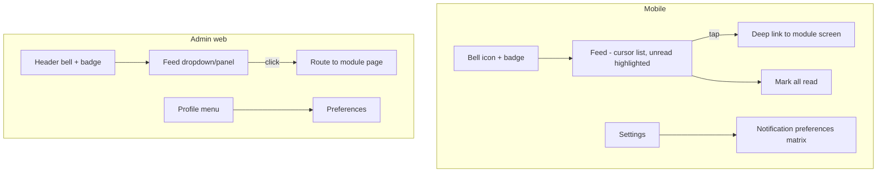

# Module: Notification

Status: Active (Phase 2) · Related ADRs: `ADR-0010` (events/outbox/queues — this module is the `notifications` queue owner), `ADR-0004` (device registry = push targets), `ADR-0011` (no PII in telemetry) · Depends on: `docs/05-platform/settings.md`, `docs/05-platform/authentication.md` (devices, FCM tokens), `docs/04-database/core-schema.md`, `docs/03-standards/api-standards.md` · Consumers: every module's §13 declares its templates here

Namespace `notification` (naming §4, error prefix `NTF`). Owns: the code-owned template registry, the send pipeline (event-driven + direct port), FCM/email/in-app channels, delivery tracking, user preferences, and recipient fan-out batching.

## 1. Purpose & Scope

One pipeline for everything the system tells humans: in-app feed (badge + list), FCM push, email. Consumers declare templates; the module resolves recipients, applies preferences, renders per-locale, dispatches per channel, and records delivery.

**V1 exclusions:** user-facing digests/batched summaries, quiet hours, SMS/WhatsApp channels, open/click tracking (no pixels), admin-composed free-form blasts (announcement.md owns targeted announcements — it *consumes* this module), per-tenant template text overrides.

## 2. Actors & Permissions

Entirely self-service — no admin permission keys in V1 (templates are code-owned, no CRUD surface):

| Action | Permission | Who |
|---|---|---|
| Read own feed, unread count | — (authenticated) | all roles |
| Mark own notifications read | — (authenticated) | all roles |
| Manage own preferences | — (authenticated) | all roles |

Delivery-failure operations surface in the platform failed-jobs view (`sysadmin.*`, system-administration.md), not here. **Discharged 2026-08-04:** that view reads BullMQ's failed set directly across all eight queues and offers retry under `sysadmin.job.execute`; the tenant-level delivery-failure *count* arrives separately through `NotificationStatsPort` (§13).

## 3. Business Rules

| # | Rule |
|---|---|
| BR-NTF-001 | **Templates are code-owned** (the permissions/settings law): key `<ns>.<template_snake_case>`, declared channels, `mandatory` flag, audience kind, i18n keys, variable contract. Modules register templates in their §13 + this doc's §4.2 table in the same session. No runtime template CRUD. |
| BR-NTF-002 | Two entry paths, one pipeline: **event handlers** (`on.<event>` jobs on the `notifications` queue) and the **direct port** (`NotificationPort.send`) for request-path sends (reset emails). Both converge on the same render → preference → dispatch → record flow. |
| BR-NTF-003 | Send is **async always** — request paths enqueue and return. Auth flows depend on this: reset/invite emails must not vary response timing (BR-AUTH-002/010 enumeration defense). |
| BR-NTF-004 | Idempotency: one `notifications` row per `(tenant_id, dedupe_key, user_id)` — `dedupe_key` = `eventId` for event sends, caller-supplied for direct sends. Redelivered handler jobs and relay replays skip on conflict (ADR-0010 processor law). |
| BR-NTF-005 | **Preferences suppress optional templates only.** `mandatory` templates (security notices, approval actionables, statutory documents) ignore preferences — toggling them → `NTF_TEMPLATE_MANDATORY`. Default = all channels on; preference rows store opt-outs only. |
| BR-NTF-006 | Rendering happens **once, at send time, in the recipient's locale** (user locale → tenant default → `id`, D12); the rendered title/body snapshot is stored on the row — locale switches never rewrite history. Variables are i18n placeholders, never concatenation. |
| BR-NTF-007 | Push targets = the recipient's **active** devices only (ADR-0004 registry). Revoked devices are never pushed — including the revocation notice itself (offline-sync §8 promise). FCM invalid-token responses clear `devices.fcm_token` via the auth facade port. |
| BR-NTF-008 | In-app rows are always written when `in_app` is a declared channel — push/email failures never lose the fact; the feed is the durable channel. Channel failures retry per queue class (fast-retry), then land in the failed set with the delivery row marked `failed`. |
| BR-NTF-009 | Fan-out batching: audience sends (role audiences, announcements) chunk recipients into jobs of ≤ 500; each chunk is independently idempotent (BR-NTF-004 per recipient). No synchronous loops over recipient lists in request paths. |
| BR-NTF-010 | Feed retention: rows (and delivery records) purged after `notification.retention_days` (default 90, tenant-tunable — registered in settings §4.2 this session). Unread does not exempt a row — the feed is a feed, not an archive; documents live in document-storage. |
| BR-NTF-011 | Deep links: every push/in-app row carries a `deepLink` route (go_router path, mobile-flutter §7) resolved from the template's link builder; a dead link (entity purged) degrades to the module's list screen, never a crash (mobile owns the fallback). |
| BR-NTF-012 | No notification content in logs/telemetry — `title`/`body`/`params` are redaction-registry entries (security-standards §10); delivery records store provider message ids, never content copies. |

## 4. Domain Model

### 4.1 Schema

```ts
// src/database/schema/notification.ts
export const notificationChannel = pgEnum('notification_channel', ['in_app', 'push', 'email']);
export const deliveryStatus = pgEnum('delivery_status', ['pending', 'sent', 'failed', 'skipped']);

export const notifications = pgTable('notifications', {
  ...id, ...tenantId,
  userId: uuid('user_id').notNull().references(() => users.id),
  templateKey: text('template_key').notNull(),
  dedupeKey: text('dedupe_key').notNull(),            // eventId or caller key (BR-NTF-004)
  title: text('title').notNull(),                     // rendered snapshot (BR-NTF-006)
  body: text('body').notNull(),
  params: jsonb('params').notNull(),                  // variable values (redacted from logs)
  deepLink: text('deep_link'),
  readAt: timestamp('read_at', { withTimezone: true }),
  createdAt: timestamp('created_at', { withTimezone: true }).notNull().defaultNow(),
}, (t) => [
  uniqueIndex('uq_notifications_dedupe').on(t.tenantId, t.dedupeKey, t.userId),
  index('idx_notifications_feed').on(t.tenantId, t.userId, t.createdAt),  // cursor feed
]);

export const notificationDeliveries = pgTable('notification_deliveries', {
  ...id, ...tenantId,
  notificationId: uuid('notification_id').notNull()
    .references(() => notifications.id, { onDelete: 'cascade' }),
  channel: notificationChannel('channel').notNull(),
  status: deliveryStatus('status').notNull().default('pending'),
  providerMessageId: text('provider_message_id'),
  errorCode: text('error_code'),
  attempts: integer('attempts').notNull().default(0),
  sentAt: timestamp('sent_at', { withTimezone: true }),
}, (t) => [
  uniqueIndex('uq_notification_deliveries_channel').on(t.notificationId, t.channel),
  index('idx_notification_deliveries_status').on(t.tenantId, t.status),
]);

export const notificationPreferences = pgTable('notification_preferences', {  // opt-out rows only (BR-NTF-005)
  ...tenantId,
  userId: uuid('user_id').notNull().references(() => users.id),
  templateKey: text('template_key').notNull(),
  channel: notificationChannel('channel').notNull(),
}, (t) => [
  primaryKey({ columns: [t.tenantId, t.userId, t.templateKey, t.channel] }),
]);
```

Delivery lifecycle:

```mermaid
stateDiagram-v2
  [*] --> pending: notification row + delivery rows created
  pending --> sent: provider accepted (FCM id / email provider message id / in_app immediate)
  pending --> skipped: preference opt-out or no target (no active device, no email)
  pending --> failed: retries exhausted (fast-retry class)
  sent --> [*]
  skipped --> [*]
  failed --> [*]: visible in failed-jobs view; purge per BR-NTF-010
```

### 4.2 Template registry (seed)

Protocol per BR-NTF-001; modules append on arrival. `M` = mandatory (preference-immune):

| Template key | Channels | M | Audience | Source |
|---|---|---|---|---|
| `approval.step_activated` | in_app, push | ✅ | step assignees | `approval.step.activated` |
| `approval.step_reminder` | in_app, push | ✅ | assignees pending | SLA scan (direct) |
| `approval.step_escalated` | in_app, push, email | ✅ | escalation targets | `approval.step.escalated` |
| `approval.instance_decided` | in_app, push | ✅ | requester (approved/rejected/returned + comment) | `approval.instance.*` |
| `approval.instance_stuck` | in_app, email | ✅ | System Administrators (role audience) | stuck flag (direct) |
| `auth.password_changed` | email | ✅ | affected user | `auth.password.changed` |
| `auth.password_reset` | email | ✅ | requesting user (carries the link) | direct (UC-AUTH-006) |
| `auth.invite` | email | ✅ | invited user (carries the link) | direct (provisioning) |
| `auth.new_device_registered` | email, push | ✅ | user (push to previous devices) | login flow (direct) |
| `auth.device_revoked` | push | ✅ | remaining active devices | `auth.device.revoked` |
| `auth.replacement_blocked` | in_app | ✅ | System Administrators | BR-AUTH-007 `admin` policy |
| `auth.account_locked` | email | ✅ | affected user | lockout (direct) |
| `authz.access_changed` | in_app | — | affected user | `authz.assignment.granted/revoked` |
| `document.expiring` | in_app, email | ✅ | HR Admins of the owning company | document-storage.md UC-DOC-006 |
| `import-export.import_finished` | in_app, email | — | requester (fires on completed / partially_completed / failed / auto-cancelled) | import-export.md §13 |
| `import-export.export_finished` | in_app | — | requester (link to job page; URL minted at click) | import-export.md §13 |
| `employee.contract_expiring` | in_app, email | ✅ | HR Admins of the owning company | employee.md UC-EMP-009 (contract scan, direct) |
| `shift.roster_changed` | in_app, push | ✅ | the affected employee | shift.md §13 — `on.shift.roster.changed`, batched per employee per mutation batch, future dates only |
| `attendance.missing_clock_out` | in_app, push | ✅ | the employee with an open punch | attendance.md §13 — `cron.attendance.punch-reminder`, at shift end + grace and once more before the day closes, max twice per day |
| `attendance.punch_quarantined` | in_app, push | ✅ | the employee who made the punch | attendance.md BR-ATT-005 — a queued punch failed a policy gate and is not counting until HR releases it |
| `leave.balance_expiring` | in_app, push | ✅ | the employee holding the expiring days | leave.md §13 — `cron.leave.period-maintenance`, inside `leave.balance_expiry_notice_days`; losing carried days is money, so it is not a preference |
| `leave.request_cancelled` | in_app, push | ✅ | the employee whose approved leave was cancelled | leave.md BR-LVE-016 — the one leave event the requester did not initiate; carries the admin's reason |
| `overtime.acknowledgment_required` | in_app, push | ✅ | the employee whose overtime was ordered on their behalf | overtime.md BR-OVT-013 — being told you are working Saturday is not a preference, and the acknowledgment is the worker-consent artifact |
| `payroll.payslip_published` | in_app, push | ✅ | the employee | payroll.md BR-PAY-022 — fires at `paid`, not `closed`; mandatory because a payslip is a statutory document, not an update |
| `sysadmin.impersonation_started` | in_app, email | ✅ | System Administrators of the entered tenant (role audience) | system-administration.md BR-ADM-019 — carries the platform operator, the impersonated user, and the reason. Mandatory because a tenant switching it off would be switching off the only *push* signal that outside access occurred; the audit log is a pull surface BR-AUD-007 makes a sensitive read in its own right. No end-of-session counterpart — the start notice states the 30-minute ceiling |
| `payroll.calculation_finished` | in_app | — | the Payroll Admin who ran it | payroll.md UC-PAY-004 — carries the errored count so the review grid is opened knowing what is broken |
| `payroll.settlement_pending` | in_app | — | Payroll Admins of the company | payroll.md UC-PAY-012 — timeliness nudge only; the derived worklist is the completeness truth, so a dismissed notification loses nothing |
| `tax.form_issued` | in_app, push | ✅ | the employee | tax-pph21.md BR-TAX-018 — fires on issue **and** on every re-issue, carrying tax year and revision; mandatory for the same reason as the payslip, and the revision is the payload that matters when a form the employee already filed against has been superseded |
| `tax.issuance_finished` | in_app | — | the Payroll Admin who ran it | tax-pph21.md UC-TAX-008 — issued and skipped counts, mirroring `payroll.calculation_finished` |
| `expense.claim_paid` | in_app, push | — | the claim's employee | expense-reimbursement.md §13 — fires from **both** disbursement routes (the `payroll.run.closed` handler and the finance mark-paid path), carrying `disburseVia` and `paymentReference` so the employee is told which one paid them. Opt-out: the payslip and the claim's own history both carry the fact durably |
| `overtime.occurrence_actualized` | in_app | — | the employee | overtime.md BR-OVT-008 — fires only when priced hours differ from ordered hours, so a clamp is never a payslip surprise; opt-out because an exact match needs no notice |
| `asset.assigned` | in_app, push | — | the employee the asset was issued to | asset.md §13 — direct send from the assign endpoint, carrying the item, category, outgoing condition, and whether an acknowledgment is awaited. Opt-out: the item is physically in their hands and `/me/assets` carries the fact durably |
| `asset.clearance_pending` | in_app | ✅ | holders of `asset.item.read` in the company (role audience) | asset.md BR-AST-012 — `on.employee.status.changed` to a terminal status, listing the exiting employee's open assignments. **Mandatory** because it fires exactly once, at the last moment anyone can reach the departing employee, and this module owns no cron to send a second one (asset.md §12). Dedupe key `(employeeId, statusEffectiveDate)`; no open assignment, no notification |
| `recruitment.interview_assigned` | in_app, email | — | the assigned panellist | recruitment-candidate.md §13 — direct send from the interview create and reschedule endpoints, carrying candidate name, requisition title, the slot in the **requisition branch's** timezone, mode, and location or link. **Email rather than push**: the module has no mobile surface at all (recruitment-candidate.md §10), so a push whose tap target does not exist would be worse than no push. Opt-out permitted — an interviewer who ignores it still sees the seat on "My scorecards", and the recruiter who booked it is the one chasing attendance |
| `performance.cycle_launched` | in_app, push | — | each newly created participant | performance-goals.md §13 — direct send from `POST /review-cycles/{id}/participants`, carrying the cycle name and the goal-setting deadline. Fires again for late joiners added by a re-run, and never for the participants that run skipped |
| `performance.goals_submitted` | in_app, push | — | the participant's pinned reviewer | performance-goals.md UC-PRF-003 — the employee has handed over a goal set for agreement; carries the employee and the goal count. Skipped silently when no reviewer is pinned (BR-PRF-003), because a goal set is not the manager's to hold hostage |
| `performance.self_review_due` | in_app, push | — | the participant | performance-goals.md UC-PRF-014 — from `cron.performance.window-reminders`, inside `performance.reminder_lead_days` of `self_review_ends_on`, only while the self seat is unsubmitted. One send per recipient per day |
| `performance.manager_review_due` | in_app, push | — | the pinned reviewer | performance-goals.md UC-PRF-014 — same cron and window rule against `manager_review_ends_on` and unsubmitted manager seats. Also carries the unacknowledged-result nudge's counterpart audience when a cycle has released |
| `performance.result_shared` | in_app, push, email | — | the participant | performance-goals.md BR-PRF-016 — fans out from the cohort publish. **The only performance template with email**, because a released appraisal is the one event worth reaching someone who has not opened the app. The body carries the cycle name and **no rating**: a performance level rendered in an inbox preview is a personnel outcome delivered by push notification |
| `training.enrollment_assigned` | in_app, push, email | ✅ | the employee seated by HR | training.md §13 — direct send from `POST /training-sessions/{id}/enrollments`, carrying course, session dates, delivery mode, and place or link. **Mandatory** on the same reasoning as `overtime.acknowledgment_required`: being told you are spending Thursday and Friday in a training room is not a preference, and assignment is the only path in that module that puts a date on someone's calendar without their asking |
| `training.session_reminder` | in_app, push | — | every `enrolled` seat on the session | training.md UC-TRN-014 — from `cron.training.reminders`, inside `training.session_reminder_days` of `start_date`. Opt-out: the enrollment sits durably in "My training", so a muted reminder loses nothing |
| `training.session_cancelled` | in_app, push, email | ✅ | every live enrollment on the cancelled session | training.md BR-TRN-016 — direct send from the session cancel endpoint, carrying the reason. **Mandatory** for the reason `leave.request_cancelled` is: it is the one event the recipient did not initiate, and the failure mode is a person travelling to a session that is not happening |
| `training.certification_expiring` | in_app, email | ✅ | the credential holder **and** HR Admins of the company (role audience) | training.md UC-TRN-014 — from `cron.training.reminders`, inside `training.certification_expiry_notice_days` of `expires_on`, once per credential by its own `expiry_reminded_at` stamp. **Mandatory and dual-audience** because a lapsed statutory certification can stop someone legally performing their job, which is HR's problem as much as the holder's — the same shape as `document.expiring`. Fires from the certification row, never from the uploaded file (training.md BR-TRN-013) |

| `announcement.published` | in_app, push | — | every recipient of the post | announcement.md §13 — from `announcement.fanout`, chunked ≤ 500 per BR-NTF-009. Notification title is the localized frame "New announcement"; the **body is the announcement's title and nothing else**. Opt-out: the post sits durably in the announcement list, and a company notice is the one class of traffic a person is entitled to mute |
| `announcement.acknowledgment_required` | in_app, push | ✅ | every recipient of the post | announcement.md §13 — same source and same frame, title "Acknowledgment required", additionally carrying `acknowledgeBy`. **Mandatory** because `mandatory` is a per-template flag and not a per-send one, and this is the half that asks the recipient to produce something: a canteen menu is a preference, a policy acknowledgment HR must later evidence is not — the split `training.enrollment_assigned` and `training.session_reminder` already drew |

**Free-form admin text passes this registry as a variable, never as a template.** Announcement bodies are markdown written by a tenant admin in whatever language they please, and BR-NTF-001 makes templates code-owned with i18n keys. The resolution is that both announcement templates render a **localized frame with the post's title as the only variable** — so the send keeps its locale, its preference-matrix row, and its i18n key, and nothing here becomes the one message in the system that bypasses the registry. **The body is never previewed in a push**: it has no length discipline, and its author does not know who is standing next to the recipient when the phone lights up.

**Announcement registers no template for a retraction.** Withdrawing a notice by sending a notice re-delivers the thing being withdrawn and cannot carry the correction anyway; the post disappears, the inbox items close silently, and the tenant's tool for "ignore Friday's message" is Saturday's message. It registers **no reminder template** either — an unacknowledged post already nags permanently from the inbox badge, because BR-INB-010 never purges an `open` item, and a second nag would reach only people who have already skipped the first.

**Training registers no template for an approved or rejected enrollment.** Those ride `approval.instance_decided`, exactly as leave's and overtime's decisions do; a bespoke one would put two notifications on one decision.

**No template tells anyone that a calibration happened.** performance-goals.md BR-PRF-017 shows the employee a final rating and not the two behind it, and a notification saying "your rating was adjusted" would undo that in one line. The manager sees the adjustment on the participant screen, where the reason is next to it.

**No candidate-facing template exists, and none can.** Every audience in this registry resolves to a `users` row; a candidate has no identity in this system (recruitment-candidate.md §1), and mailing a non-user is a consent, deliverability, and unsubscribe surface this module does not model. Acknowledgement-on-application and rejection notices are named in recruitment's §15 as part of the careers-portal item, not as templates awaiting registration.

Coming with owning modules (registered on arrival): correction decision notices ride `approval.instance_decided` (leave's and overtime's do too — neither module registers a bespoke decision template). Payroll payslip-published and the announcement fan-out have both since arrived and are in the table above; nothing in this line remains outstanding except the correction notices, which by design never become templates.

## 5. Use Cases

**UC-NTF-001 — Event-driven send.** Relay dispatches `on.<event>` to the `notifications` queue → handler maps event → template + recipients (payload user ids, or role audience resolved via authz at send time) → per recipient: preference check (skip optional opt-outs) → render in recipient locale → insert notification + delivery rows (dedupe on conflict → stop, BR-NTF-004) → dispatch channel jobs.

**UC-NTF-002 — Direct send (port).** `NotificationPort.send({ templateKey, userIds | audience, params, dedupeKey, deepLink? })` from a request path or job — enqueues the same pipeline (BR-NTF-003: never inline SMTP/FCM in a request). Reset/invite params carry the raw link; job payloads are redaction-covered (BR-NTF-012).

**UC-NTF-003 — Channel dispatch.** `dispatch.push:notificationId` — collect active-device tokens (BR-NTF-007), **hybrid FCM message** (grilled 2026-08-02): `notification` block carries the rendered title/body so the OS displays it in every app state (data-only messages don't render on killed iOS apps), `data` block carries `{ notificationId, deepLink }` for tap routing; invalid-token → clear via auth port, `skipped` if zero targets. `dispatch.email:notificationId` — render HTML + text parts, send via `EmailPort` (A-017), store provider id. `in_app` is `sent` at row creation.

**UC-NTF-004 — Feed read + badge.** Cursor list newest-first; unread count = live `COUNT WHERE read_at IS NULL` (indexed, bounded by retention). Mark-read single or all; idempotent.

**UC-NTF-005 — Preference management.** User sees the optional-template matrix (from the code registry), toggles per channel; mandatory templates render locked (BR-NTF-005).

**UC-NTF-006 — Fan-out (consumer-facing).** Announcement-scale sends call `NotificationPort.fanout(templateKey, recipientQuery, params)` → chunk jobs ≤ 500 (BR-NTF-009) → each chunk runs UC-NTF-001's per-recipient tail.

## 6. UI Flow



- Feed rows: title, body (2-line clamp), relative timestamp, unread dot (status vocabulary, design-system §2.3); tap = deep link + mark read.
- Preferences: matrix rows = optional templates grouped by module, columns = the template's declared channels; mandatory section shown locked with explanatory copy (microcopy per design-system §11).
- Push permission: requested on first login (mobile), never re-nagged; denied state shows one settings-link banner in preferences, nothing else.
- Empty feed state = design-system EmptyState; offline: cached feed readable, badge from cache (§10).

## 7. API

All: Queue-reachable **no** · Idempotency **—** (mark-read idempotent by nature).

| Endpoint | Permission | Pagination |
|---|---|---|
| `GET /api/v1/notifications` | — (own feed) | cursor (registry: feeds) |
| `GET /api/v1/notifications/unread-count` | — | — |
| `PATCH /api/v1/notifications/{id}` | — (own) | — |
| `POST /api/v1/notifications/read-all` | — (own) | — |
| `GET /api/v1/notifications/preferences` | — (own) | — |
| `PATCH /api/v1/notifications/preferences` | — (own) | — |

#### GET /api/v1/notifications
Request: `?cursor&limit` (+ `?unread=true` filter). Response 200: `data: [{ id, templateKey, title, body, deepLink, readAt, createdAt }]`, `meta.nextCursor`. Own rows only — structurally (user-scoped query).

#### GET /api/v1/notifications/unread-count
Response 200: `{ count }` — badge source. Polling posture (grilled 2026-08-02): mobile refetches on foreground/focus (push nudges it); admin web — no push channel — refetches on focus **plus a 60 s interval while the tab is visible** (paused hidden). No websockets in V1. Inbox count shares this posture.

#### PATCH /api/v1/notifications/{id}
Request: `{ read: true }` (the only mutable field; `false` unsupported — no unread-restore). Response 200: `{ id, readAt }`. Others' rows → 404.

#### POST /api/v1/notifications/read-all
Operation-style path (auth §7 precedent). Response 200: `{ updatedCount }`.

#### GET /api/v1/notifications/preferences
Response 200: `data: [{ templateKey, module, mandatory, channels: [{ channel, enabled }] }]` — full matrix from the code registry merged with opt-out rows.

#### PATCH /api/v1/notifications/preferences
Request: `{ templateKey, channel, enabled }` (single toggle — the matrix saves per cell). Response 200: `{}`.
Errors: `NTF_TEMPLATE_MANDATORY` — BR-NTF-005 · unknown key/channel → `VAL_VALIDATION_FAILED` (`VAL_INVALID_ENUM`).

## 8. Validation Rules

| Field | Rule | Error code |
|---|---|---|
| `templateKey` | exists in code registry | `VAL_INVALID_ENUM` |
| `channel` | declared by that template | `VAL_INVALID_ENUM` |
| `cursor` / `limit` | api-standards §5 | `VAL_INVALID_CURSOR` |
| `read` | literal `true` | `VAL_INVALID_FORMAT` |

## 9. Edge Cases & Failure Modes

- **Zero active devices at push time:** delivery `skipped` (not failed) — in-app row still lands (BR-NTF-008). Same for missing email on file.
- **FCM token rotated between resolve and send:** provider invalid-token response → clear token via auth port, mark `failed` after retries; next login/refresh re-upserts the token (authentication §7 — refresh carries `fcmToken` when rotated, grilled 2026-08-02).
- **Duplicate event delivery (relay redispatch, stalled handler):** unique dedupe index short-circuits — one feed row, channel jobs keyed by notification id are jobId-deduped (naming §7).
- **Role-audience resolution at send time** (stuck-instance → System Administrators): membership evaluated when the job runs, not when the event occurred — a just-granted admin gets it, a just-revoked one doesn't. Deliberate: notifications address people, not history.
- **Recipient offboarded/inactive:** resolution filters `users.status = 'active'`; rows for already-created notifications stay (feed history) but no further channel dispatch.
- **Email provider outage:** fast-retry ×3 → failed set → platform-health view; in-app unaffected. Reset/invite emails failing = user retries the request flow (tokens single-use, unexpired reissue is a new token).
- **Localized render with missing key/variable:** render falls back to `en` then key-literal + Sentry breadcrumb — a broken translation never blocks a security email (send with fallback beats fail).
- **Deep link to purged entity:** mobile fallback to module list (BR-NTF-011); web routes to the module page which 404s gracefully (admin-nextjs §10).
- **Clock/timezone:** feed timestamps stored UTC, rendered relative client-side; retention purge compares UTC (no branch-timezone semantics in a feed).

## 10. Offline Behavior

Deviation summary: feed = **cached reference data** (pull-only, cursor sync on foreground; no queue writes). Mark-read offline rides the **cosmetic replay lane** (offline-sync §10, grilled 2026-08-02): applied to Drift immediately, re-sent fire-and-forget on reconnect, never queued — loss harmless (worst case a row re-reads as unread elsewhere). Push arrives independently of sync state; tapping a push offline opens the cached entity or the offline notice. Badge counts from local cache may lag the server until next pull — accepted.

## 11. Module Error Codes

Registered this session:

| Code | HTTP | Trigger |
|---|---|---|
| `NTF_TEMPLATE_MANDATORY` | 422 | Preference toggle attempted on a mandatory template — BR-NTF-005 |

## 12. Background Jobs & Events

Queue: `notifications` (fast-retry class — ADR-0010 registry).

| Job | Trigger | Behavior |
|---|---|---|
| `on.<event>` handlers (registry §4.2 source column) | outbox relay | UC-NTF-001; dedupe per BR-NTF-004 |
| `dispatch.push:notificationId` / `dispatch.email:notificationId` | send pipeline | UC-NTF-003; jobId-deduped |
| `fanout.chunk` | `NotificationPort.fanout` | UC-NTF-006, ≤ 500 recipients per job |
| `cron.notification.purge` | daily, scan + fan-out | delete rows + deliveries past `notification.retention_days` (BR-NTF-010) |

Events consumed: `approval.step.activated`, `approval.step.escalated`, `approval.instance.approved|rejected|returned|cancelled`, `auth.password.changed`, `auth.device.revoked`, `authz.assignment.granted`, `authz.assignment.revoked`. Events emitted: **none** — notifications are a terminal effect; nothing downstream should react to "a notification was sent" (delivery state is queryable, not evented).

## 13. Approval, Notification & Report Touchpoints

- **Approval:** none (this module serves the engine, not vice versa).
- **Notification:** self — §4.2 is the platform seed; module docs' §13 rows must name template keys registered here.
- **Reports:** delivery failure counts surface in platform health (system-administration); no tenant-facing reports V1.
- **Ports served:** `NotificationStatsPort` — **added 2026-08-04 for system-administration.md UC-ADM-010**, discharging the platform-health promise on the line above.

  ```ts
  export const NOTIFICATION_STATS_PORT = Symbol('NOTIFICATION_STATS_PORT');

  export interface NotificationStatsPort {
    /** Count of notification_deliveries rows in status 'failed' for the tenant in
     *  the caller's TenantContext, since `from` (inclusive). No channel breakdown,
     *  no message content, no recipients. */
    failedDeliveryCount(from: Date): Promise<number>;
  }
  ```

  The distinction this port draws is worth stating, because the two numbers look alike and mean different things. A **failed delivery** is a `notification_deliveries` row that exhausted the fast-retry class — the recipient did not get the email or push. A **failed job** is a BullMQ entry in the `notifications` queue's failed set, which system-administration reads directly from the queue (its §5.9). One is a product outcome, the other an infrastructure event, and a single delivery failure need not produce either the other or a Sentry issue. The console shows both, side by side, labelled apart.
- **Settings:** `notification.retention_days` registered in settings §4.2 (this session). Email infrastructure (SPF/DKIM/DMARC, sender domain) lands in environments.md (forward note).

## 14. Test Scenarios

| Scenario | Covers |
|---|---|
| Double event delivery → one feed row, one push (dedupe index + jobId) | BR-NTF-004 |
| Optional opt-out → delivery `skipped`, in-app still written when declared; mandatory toggle → 422 | BR-NTF-005/008 |
| Locale render: id user gets id snapshot; switch to en afterwards → history unchanged | BR-NTF-006 |
| Revoked device excluded from push targets (incl. the revocation notice itself) | BR-NTF-007 |
| Push fails ×3 → delivery failed, feed row intact, failed-jobs visible | BR-NTF-008 |
| Fan-out 1 200 recipients → 3 chunk jobs, ≤ 500 each, all idempotent on re-run | BR-NTF-009 |
| Purge removes read+unread rows past retention, leaves newer; preferences untouched | BR-NTF-010 |
| Reset email path: response timing identical whether email exists (send enqueued vs no-op) | BR-NTF-003 |
| Feed cursor pagination stable under concurrent inserts (keyset, api-standards §8 semantics) | UC-NTF-004 |
| Role-audience resolved at send time (grant/revoke between event and job) | §9 |

## 15. Future Improvements

Daily digest option (per-user), quiet hours (branch timezone-aware), WhatsApp Business channel (Indonesian market reality — likely first channel request), per-tenant template text overrides, websocket badge push for admin web, notification grouping/threading in the feed.
