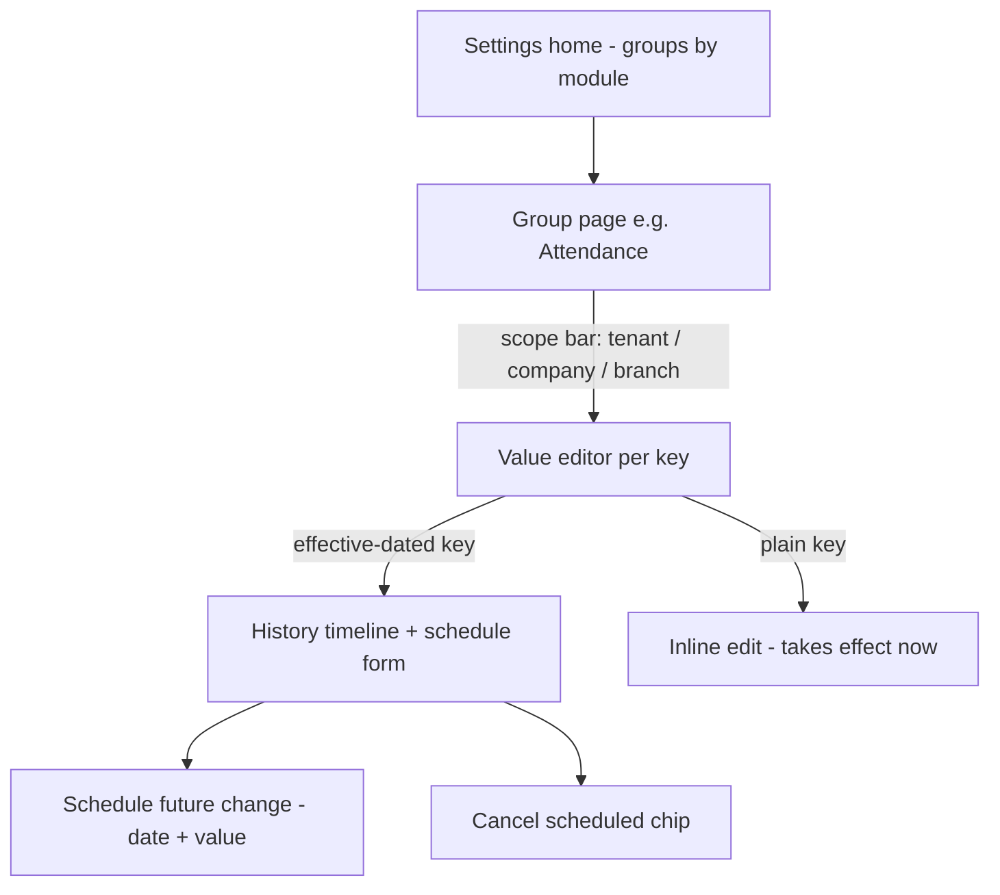

# Module: Settings

Status: Active (Phase 2) · Related ADRs: `ADR-0002` (tenant isolation), `ADR-0012` (as-of config reads for payroll determinism), `ADR-0004` (auth tunables) · Depends on: `docs/04-database/database-conventions.md` §5 (effective dating), `docs/04-database/core-schema.md`, `docs/03-standards/naming-conventions.md` §9, `docs/03-standards/api-standards.md`

Namespace `settings` (naming §4, error prefix `SET`). Generated ahead of manifest rows 37–40 (sanctioned reorder — notification depends on this file; recorded in PROGRESS). Owns: the hierarchical config machinery, the setting-definition registry protocol, and the platform/cross-cutting key seed.

## 1. Purpose & Scope

Hierarchical configuration platform → tenant → company → branch with most-specific-wins resolution; effective-dated values (regulatory parameters schedule ahead; every change is history); code-owned definition registry; scoped admin editor; client-visible subset for app bootstrap.

**V1 exclusions:** secrets in settings (env only — naming §12), per-user preferences (client-local, spec §5.1 SharedPreferences carve-out), A/B or percentage rollouts, feature flags (system-administration.md owns platform flags, D13). **The split was re-tested and upheld 2026-08-04**, on a sharper reason than "different concept": every value in this module is *tenant-writable by design* — that is the module's purpose — while a feature flag is definitionally not, and a platform console request resolves **no `TenantContext`** (multi-tenancy §31) and so has no principal for `PermissionGuard` to evaluate. Flags live in a platform-class table with no tenant read path, resolve over two levels with no effective dating, and reuse none of this machinery.

## 2. Actors & Permissions

| Action | Permission key | Data scope | HR Admin | System Administrator |
|---|---|---|---|---|
| Read definitions + values + history | `settings.setting.read` | company / tenant | ✅ | ✅ |
| Write / schedule / cancel values | `settings.setting.configure` | company / tenant per assignment | ✅ | ✅ |
| High-stakes statutory-adjacent keys | definition-level override, e.g. `settings.statutory_policy.configure` | tenant | — | ✅ (default) |

A definition may declare `requiredPermission` overriding the base configure key — a high-stakes key gets its own without exploding the catalog. **Corrected 2026-08-03**: this row previously read "regulatory parameter groups (tax/BPJS tables)". No statutory table lives in this module. Tax rates, brackets, PTKP amounts (tax-pph21.md §4.1) and BPJS rates, caps, and JKK risk rates (bpjs.md §4.1) are platform tables with no tenant write path at all — see §4.2. What the override now guards is the small set of tenant *policy* keys whose blast radius is statutory-sized: `tax.method` and `bpjs.wage_floor`, each of which re-prices every employee in scope. Mobile/employee surfaces never see this module; clients consume `GET /settings/effective` only.

## 3. Business Rules

| # | Rule |
|---|---|
| BR-SET-001 | **Definitions are code-owned** (same law as permissions and error codes): key, type, allowed levels, default, flags — declared in code, seeded to DB at release. Tenants set values; they never invent keys. Unknown key in a write = field-level `VAL_INVALID_ENUM`. |
| BR-SET-002 | Resolution is most-specific-wins along branch → company → tenant → platform default (the definition's `defaultValue`). A definition declares which levels may hold values (`allowedLevels`); writes outside them → `SET_LEVEL_NOT_ALLOWED`. |
| BR-SET-003 | **Every value row is effective-dated** `[effective_from, effective_to)` with a DB exclusion constraint per (key, scope) — one mechanism for history, scheduling, and as-of reads (database-conventions §5). Keys with `effectiveDated = false` still write dated rows but only with `effective_from = today` (immediate supersede; no future scheduling) — `SET_NOT_EFFECTIVE_DATED` otherwise. |
| BR-SET-004 | Consumers that compute against a period read **as-of that period's date** (`resolve(key, scope, asOf)`) — payroll, tax, BPJS, attendance derivation never read "current" (ADR-0012). Request-path consumers without a period read as-of now. |
| BR-SET-005 | Rows with `effective_from ≤ today` are **immutable history** — no edit, no delete (`SET_HISTORY_IMMUTABLE`). Correcting a live value = supersede from today. Scheduled future rows may be edited/deleted until they take effect. |
| BR-SET-006 | At most one scheduled (future) row per key + scope (`SET_SCHEDULE_OVERLAP`) — a new schedule replaces intent explicitly, never stacks silently. |
| BR-SET-007 | Only `clientVisible` definitions ship to clients via `/settings/effective`; nothing else ever leaves the admin surface. No `sensitive` definitions exist in V1 — secrets are env config, never settings. |
| BR-SET-008 | Direction-constrained definitions enforce it in validation: `tighten_only` (tenant may raise `auth.password_min_length`, never lower; rate/security floors), `loosen_only` (unused V1). Violations are `VAL_OUT_OF_RANGE` field entries against the platform bound. |
| BR-SET-009 | Writes bust the tenant's resolution cache post-commit (TTL backstop 5 min); a single request resolves against one cache snapshot — no mixed-scope reads mid-request. |
| BR-SET-010 | **Registration protocol** (mirrors the error catalog): the module doc that introduces a key appends it to §4.2 in the same session, with type, levels, default, flags. Regulation-dependent defaults carry the VERIFY marker at registration. |

## 4. Domain Model

### 4.1 Schema

```ts
// src/database/schema/settings.ts
export const settingLevel = pgEnum('setting_level', ['tenant', 'company', 'branch']);
export const settingType = pgEnum('setting_type', ['boolean', 'integer', 'decimal', 'string', 'enum', 'json']);

export const settingDefinitions = pgTable('setting_definitions', {  // platform table — no tenant_id, seeded from code
  ...id,
  key: text('key').notNull(),                       // naming §9: <ns>.<setting_snake_case>, units in leaf
  module: text('module').notNull(),                 // ns from naming §4
  type: settingType('type').notNull(),
  allowedLevels: settingLevel('allowed_levels').array().notNull(),
  defaultValue: jsonb('default_value').notNull(),   // the platform level of the hierarchy
  validation: jsonb('validation'),                  // { min?, max?, enum?, pattern?, direction?: 'tighten_only' }
  effectiveDated: boolean('effective_dated').notNull().default(false),
  clientVisible: boolean('client_visible').notNull().default(false),
  requiredPermission: text('required_permission'),  // overrides settings.setting.configure (§2)
  description: text('description').notNull(),
  deprecatedAt: timestamp('deprecated_at', { withTimezone: true }),
  ...auditColumns,
}, (t) => [uniqueIndex('uq_setting_definitions_key').on(t.key)]);

export const settingValues = pgTable('setting_values', {            // tenant-owned, RLS
  ...id, ...tenantId,
  key: text('key').notNull(),
  level: settingLevel('level').notNull(),
  companyId: uuid('company_id').references(() => companies.id),     // level ≥ company
  branchId: uuid('branch_id').references(() => branches.id),        // level = branch
  value: jsonb('value').notNull(),
  effectiveFrom: date('effective_from').notNull(),
  effectiveTo: date('effective_to'),                                // NULL = current
  ...auditColumns,
}, (t) => [
  index('idx_setting_values_resolve').on(t.tenantId, t.key, t.level, t.effectiveFrom),
]);
```

Hand-written SQL in the generating migration (drizzle-kit can't express either — database-conventions §5.2/§10):

```sql
-- scope consistency
ALTER TABLE setting_values ADD CONSTRAINT chk_setting_values_scope CHECK (
  (level = 'tenant'  AND company_id IS NULL AND branch_id IS NULL) OR
  (level = 'company' AND company_id IS NOT NULL AND branch_id IS NULL) OR
  (level = 'branch'  AND company_id IS NOT NULL AND branch_id IS NOT NULL)
);
-- no overlapping intervals per key + exact scope
ALTER TABLE setting_values ADD CONSTRAINT excl_setting_values_no_overlap
  EXCLUDE USING gist (
    tenant_id WITH =, key WITH =, level WITH =,
    COALESCE(company_id, '00000000-0000-0000-0000-000000000000') WITH =,
    COALESCE(branch_id,  '00000000-0000-0000-0000-000000000000') WITH =,
    daterange(effective_from, effective_to, '[)') WITH &&
  );
```

Value lifecycle: no state machine — rows are scheduled (future), live (interval covers today), or history (closed); all three are positions on the date axis, not statuses. Resolution cache: `hris:settings:{tenantId}:{companyId|-}:{branchId|-}` → resolved as-of-now map, busted on write (BR-SET-009); as-of-past reads bypass the cache (payroll runs — bounded, batch).

### 4.2 Key registry (seed)

Protocol per BR-SET-010. Backlog cleared this session — sources in the right column own the semantics:

| Key | Type | Levels | Default | Dated | Client | Source |
|---|---|---|---|---|---|---|
| `sync.retry_base_seconds` | integer | tenant | `10` | — | ✅ | offline-sync §3 |
| `sync.retry_cap_minutes` | integer | tenant | `30` | — | ✅ | offline-sync §3 |
| `sync.banner_after_failures` | integer | tenant | `3` | — | ✅ | offline-sync §7 |
| `auth.max_active_devices` | integer | tenant | `1` | — | — | ADR-0004, BR-AUTH-007 |
| `auth.device_replacement_policy` | enum `self_service \| admin` | tenant | `self_service` | — | — | BR-AUTH-007 |
| `auth.password_min_length` | integer (tighten_only, floor 10) | tenant | `10` | — | — | security-standards §2 |
| `auth.lockout_attempts` | integer (tighten_only, floor 3) | tenant | `5` | — | — | security-standards §2 |
| `auth.lockout_minutes` | integer | tenant | `15` | — | — | security-standards §2 |
| `auth.refresh_sliding_days_mobile` | integer | tenant | `30` | — | — | ADR-0004 |
| `auth.refresh_absolute_days_mobile` | integer | tenant | `90` | — | — | ADR-0004 |
| `auth.refresh_sliding_days_web` | integer | tenant | `7` | — | — | ADR-0004 |
| `auth.refresh_absolute_days_web` | integer | tenant | `30` | — | — | ADR-0004 |
| `auth.refresh_unremembered_hours_web` | integer | tenant | `12` | — | — | ADR-0004 |
| `approval.max_chain_depth` | integer | tenant | `5` | — | — | approval-engine §4 |
| `approval.fallback_role` | string (role key) | tenant, company | `hr_admin` | — | — | approval-engine BR-APRV-006 |
| `notification.retention_days` | integer | tenant | `90` | — | — | notification.md BR-NTF-010 |
| `inbox.retention_days` | integer | tenant | `180` | — | — | inbox.md BR-INB-010 (non-`open` items only) |
| `document.expiry_reminder_days` | integer | tenant, company | `30` | — | — | document-storage.md BR-DOC-008 |
| `document.employee_document_max_size_mb` | integer (tighten_only, ceiling 10) | tenant | `10` | — | ✅ | document-storage.md §4.2 |
| `document.receipt_max_size_mb` | integer (tighten_only, ceiling 10) | tenant | `10` | — | ✅ | document-storage.md §4.2 |
| `audit.hot_retention_months` | integer (tighten_only upward, floor 12) | tenant | `24` | — | — | audit-log.md BR-AUD-010 |
| `import-export.max_rows` | integer (tighten_only, ceiling 10000) | tenant | `10000` | — | — | import-export.md BR-IMP-007 |
| `import-export.retention_days` | integer | tenant | `365` | — | — | import-export.md §12 purge cron (job rows + stored artifacts; grilled 2026-08-02) |
| `holiday.cuti_bersama_deducts_leave` | boolean | company | `true` | ✅ | — | holiday.md BR-HOL-006 (VERIFY there — deduction basis) |
| `employee.contract_reminder_days` | string (csv, descending day offsets) | tenant, company | `60,30` | — | — | employee.md BR-EMP-008 |
| `attendance.geofence_radius_m` | integer | tenant, company, branch | `100` | — | ✅ | attendance.md BR-ATT-006 (default per A-023) |
| `attendance.geofence_policy` | enum `flag \| strict` | tenant, company, branch | `flag` | — | ✅ | attendance.md BR-ATT-005/006 |
| `attendance.selfie_required` | boolean | tenant, company, branch | `true` | — | ✅ | attendance.md BR-ATT-008 (D10 makes it configurable) |
| `attendance.selfie_retention_months` | integer | tenant | `12` | — | — | attendance.md §13 (A-008; ⚠️ VERIFY there — UU PDP retention ceiling); purge runs under `cron.document.purge` |
| `attendance.qr_required` | boolean | tenant, company, branch | `false` | — | ✅ | attendance.md BR-ATT-007 (spec §5.7 tenant option) |
| `attendance.qr_key_version` | integer | branch | `1` | — | — | attendance.md BR-ATT-007 — bumping it invalidates every printed poster for that branch |
| `leave.annual_period_basis` | enum `calendar \| anniversary` | company | `calendar` | — | — | leave.md BR-LVE-008 (A-024); applies to periods opened after the change — live periods are never re-keyed |
| `leave.carry_over_expiry_months` | integer | tenant, company | `3` | — | — | leave.md BR-LVE-010 (A-025; ⚠️ VERIFY there — the expiry basis is PP/PKB territory, not a fixed statutory number) |
| `leave.balance_expiry_notice_days` | integer | tenant | `30` | — | — | leave.md §13 — how far ahead `leave.balance_expiring` fires |
| `overtime.standard_daily_hours` | integer | tenant, company, branch | `7` | — | — | overtime.md BR-OVT-010 (⚠️ VERIFY there) — fallback `H` for a rest day that carries no shift; `ScheduledDay.standardMinutes` wins whenever it is non-zero |
| `overtime.max_hours_per_day` | integer | tenant, company, branch | `4` | — | — | overtime.md BR-OVT-006 (⚠️ VERIFY there) — working-day ceiling; a sector exemption is an audited raise of this value |
| `overtime.max_hours_per_week` | integer | tenant, company, branch | `18` | — | — | overtime.md BR-OVT-006 (⚠️ VERIFY there) |
| `overtime.compensation_mode` | enum `pay \| toil \| employee_choice` | tenant, company | `pay` | — | ✅ | overtime.md BR-OVT-011 — only `employee_choice` lets a requester pick |
| `overtime.meal_threshold_hours` | integer | tenant, company, branch | `4` | — | — | overtime.md BR-OVT-012 (⚠️ VERIFY there) — flags the obligation, never prices it |
| `overtime.max_backdate_days` | integer | tenant, company | `7` | — | ✅ | overtime.md BR-OVT-001 (A-027) — how late unplanned overtime may be filed; there is deliberately no minimum-notice key |
| `payroll.cutoff_day` | integer | tenant, company | `25` | — | — | payroll.md BR-PAY-006 — **default only**: the run declares its own `period_start`/`period_end`, this seeds the new-run wizard |
| `payroll.proration_basis` | enum `calendar_days \| working_days \| fixed_divisor` | tenant, company | `fixed_divisor` | ✅ | — | payroll.md BR-PAY-013 (⚠️ VERIFY there) — drives every day-based proration; contractual, not statutory |
| `payroll.fixed_daily_divisor` | integer | tenant, company | `21` | ✅ | — | payroll.md BR-PAY-013 (⚠️ VERIFY there) — used when `proration_basis = fixed_divisor`; 21 for a 5-day week, 25 for 6 |
| `payroll.overtime_divisor` | integer | tenant, company | `173` | ✅ | — | payroll.md BR-PAY-004 (⚠️ VERIFY there) — statutory, effective-dated, and deliberately **separate** from `proration_basis` so a policy change cannot move it |
| `payroll.overtime_basis_floor_pct` | integer | tenant, company | `75` | ✅ | — | payroll.md BR-PAY-004 (⚠️ VERIFY there) — the 75%-of-total-wage floor on the overtime hourly basis |
| `payroll.retro_window_months` | integer | tenant, company | `24` | — | — | payroll.md BR-PAY-019 — how far back a dirty period may still become a payslip line; beyond it, retro flags are a report |
| `tax.method` | enum `gross \| gross_up` | tenant, company | `gross` | ✅ | — | tax-pph21.md BR-TAX-010 — company default; `employee_tax_profiles.method` overrides per employee. The **only** `tax.*` key: statutory rates, brackets, PTKP amounts, and rounding units are platform tables, not settings values |
| `bpjs.wage_floor` | decimal | tenant, company, **branch** | — (unset) | ✅ | — | bpjs.md BR-BPJS-008 (⚠️ VERIFY there) — the applicable regional minimum wage used as a lower bound on the contribution base. Tenant-entered: regional minimums are set by hundreds of separate local decrees, and branches carry an IANA timezone and coordinates, not an administrative code. Unset is legitimate and warns rather than fails; *which* programs honour it is a statutory flag on the platform rate row, not a key |
| `expense.max_backdate_days` | integer | tenant, company | `90` | — | ✅ | expense-reimbursement.md BR-EXP-014 — how old a line's `incurred_date` may be at submission. Same shape and same reason as `overtime.max_backdate_days`; there is deliberately no forward-dating key, because an expense that has not happened yet is not a reimbursement and that is not a tenant choice |
| `recruitment.candidate_retention_days` | integer | tenant, company | `730` | — | — | recruitment-candidate.md BR-REC-017 (⚠️ VERIFY there — the lawful retention period for an unsuccessful applicant's personal data under UU PDP 27/2022) — how long a candidate with no active application and no hire is kept before `cron.recruitment.candidate-purge` anonymizes them in place. The module's **only** key: there is deliberately no `recruitment.offer_default_expiry_days`, because an expiry date is a term of a specific offer and a default that quietly becomes the term is how a candidate gets three days when the recruiter meant three weeks |
| `performance.reminder_lead_days` | integer | tenant, company | `7` | — | — | performance-goals.md UC-PRF-014 — how many days before a cycle's goal-setting, self-review, and manager-review deadlines `cron.performance.window-reminders` starts nudging. The module's **only** key, and the boundary is worth stating: the window dates themselves live on `review_cycles` because they differ per cycle, and `calibration_enabled` is a cycle column for the same reason — a tenant may calibrate the annual review and not the probation one. A settings key holds tenant policy that outlives any one cycle; this is the only number here that does |
| `training.session_reminder_days` | integer | tenant, company | `3` | — | — | training.md UC-TRN-014 — how many days before a session's `start_date` `cron.training.reminders` nudges every `enrolled` seat |
| `training.certification_expiry_notice_days` | integer | tenant, company | `60` | — | — | training.md UC-TRN-014, BR-TRN-013 — how far ahead of `expires_on` a credential holder and the company's HR Admins are warned. **Two keys and not one, deliberately**: three days before a course is a diary nudge, sixty days before a credential lapses is the time it takes to book and sit a re-certification, and one shared number would be wrong for one of them in every tenant. Nothing else in that module is a setting — capacity, cost, the enrollment close date, and `self_enrollment_enabled` are all properties of one session, on the same boundary `calibration_enabled` sits the other side of |
| `announcement.retention_days` | integer | tenant, company | `365` | — | — | announcement.md BR-ANN-014 — how long a published post **without** a required acknowledgment is kept before `cron.announcement.purge` removes it with its recipients, targets, and attachments. Drafts never purge: they have no `published_at` to measure from |
| `announcement.acknowledgment_retention_days` | integer | tenant, company | `1095` | — | — | announcement.md BR-ANN-014 (⚠️ VERIFY there — how long an employer must retain **proof that an employee was notified** of a company policy or regulation change; 1095 is a placeholder, not a finding). **Two keys and not one, deliberately, and the split is not cosmetic**: "the canteen is closed Friday" and "every employee confirmed they read the safety policy" are different classes of row, and one shared key either destroys the acknowledgment register at a year or makes the canteen menu immortal. The register is that module's only compliance artifact and the purge is the only deletion in it that could destroy evidence someone is later asked to produce, which is why the number carries a marker instead of a confident default |

The five client-facing `attendance.*` keys are read by the mobile app before an offline punch and re-evaluated server-side on arrival **as-of `punched_at`** (BR-SET-004) — a policy changed while a device was dark never retroactively condemns a punch made under the old one. The two client-facing `overtime.*` keys ride the `/me/overtime/snapshot` bootstrap instead (overtime.md §7): they shape the compose form, and the server re-checks both on submit, so a stale client value produces an honest rejection rather than a wrong record.

**Statutory tax parameters are deliberately *not* settings keys** (corrected 2026-08-03, tax-pph21.md BR-TAX-001 — this line previously promised `tax.ter_table_version` plus statutory tables here). A setting value is one scalar per key, scope, and date; a TER table is a matrix of roughly 40 bands across three categories, and `setting_values` is tenant-RLS'd, which would make a tenant technically able to edit the law computing its own withholding. TER rates, PTKP amounts, Article 17 brackets, the severance final tariff, biaya jabatan, the non-NPWP surcharge, and both rounding units live in **platform tables** owned by `docs/06-modules/tax-pph21.md` §4.1 — no `tenant_id`, no RLS, migration-seeded, version pinned onto the run — the same class as `overtime_rate_rules` (overtime.md BR-OVT-009). What remains here is tenant *policy*: `tax.method`, registered above.

**BPJS follows the same split** (2026-08-03, bpjs.md BR-BPJS-001): program rates, per-program caps, the JKK rate per risk class, the JP age ceiling, the dependent allowance, and the rounding unit are platform tables. One BPJS value *is* a key, and the reason is instructive — `bpjs.wage_floor` is regional rather than national. It is set by hundreds of separate local decrees on their own schedules, and we cannot resolve a branch to the administrative area that governs it. So the **amount** is tenant-entered configuration and the **applicability** — which programs honour a floor at all — is a versioned statutory flag on the platform row. Where a statutory fact is genuinely per-branch and unknowable to us, it becomes a key; where it is national, it never does.

The cuti bersama deduction switch stays where holiday.md registered it (`holiday.cuti_bersama_deducts_leave`, company, effective-dated): it is calendar policy that leave.md **reads** as-of the leave date, not a `leave.*` key. One fact, one owner.

**Rate-limit tiers stay platform config** (security-standards §3), not settings rows: no per-tenant variance story in V1, and limits guard the platform, not tenant policy. The "per-tenant overrides only downward" clause becomes settings keys only when a real tenant needs one — recorded here so the PROGRESS debt closes with a decision, not silence.

## 5. Use Cases

**UC-SET-001 — Resolve (in-process, every consumer).** `resolve<T>(key, scope, asOf?)`: definition lookup (type + default) → value rows for the scope chain as-of date → most specific wins → typed value. Backed by the request-scope cache snapshot (BR-SET-009). Unknown key = programmer error → thrown (infra-class), not a Result failure.

**UC-SET-002 — Write immediate.** Admin sets a value at a scope: validate level allowed + type/validation/direction → supersede: close current row at today, insert `[today, ∞)` → cache bust → `settings.value.changed` event. History preserved automatically.

**UC-SET-003 — Schedule future change.** Only `effectiveDated` keys. Insert `[futureDate, ∞)` + close current at `futureDate` in one tx. Existing scheduled row for the same key+scope → `SET_SCHEDULE_OVERLAP` (cancel it first — explicit intent, BR-SET-006). No activation job exists: the row simply starts matching as-of queries on its date.

**UC-SET-004 — Cancel scheduled change.** Delete the future row + reopen the predecessor (`effective_to = NULL`) in one tx, emitting `settings.value.changed` with `action: 'cancelled'` carrying the cancelled `value` + `effectiveFrom` (grilled 2026-08-02 — the hard delete must leave an audit fact; the row itself is gone). Past rows → `SET_HISTORY_IMMUTABLE`.

**UC-SET-005 — Client bootstrap fetch.** Mobile/admin call `/settings/effective` at login/bootstrap; response = resolved `clientVisible` map for the caller's scope. Callers without an employee placement (pure admin users) resolve at tenant scope (grilled 2026-08-02). Mobile caches it in Drift (reference-data class); refreshes on next bootstrap or pull cycle — a changed `sync.retry_base_seconds` propagates lazily, which is fine (client tunables, not correctness).

**UC-SET-006 — Definition sync (release job).** `settings.sync-definitions` mirrors `authz.sync-templates`: insert new keys, update metadata/validation, stamp `deprecated_at` on retired ones (values for deprecated keys stay — resolution just stops being asked). Idempotent.

## 6. UI Flow

Admin web only.



- **Scope bar** (design-system §12 signature device): current tenant/company/branch selection; keys not allowed at the selected level render read-only with their inherited value + "set at tenant" origin chip. Every value shows **origin** (which level supplied it) — inheritance is never invisible.
- **History timeline** for dated keys: past rows (immutable, muted), live row, scheduled row (chip + cancel). Regulatory groups render the VERIFY banner from the definition description.
- Direction-constrained fields show the platform floor inline ("minimum 10 — platform floor").
- No mobile surface. Loading/empty/error per design-system defaults.

## 7. API

All: Queue-reachable **no** · Idempotency **—** (supersede-by-date is naturally idempotent per day; the exclusion constraint catches races).

| Endpoint | Permission | Pagination |
|---|---|---|
| `GET /api/v1/settings/definitions` | `settings.setting.read` | — (grouped, small hundreds) |
| `GET /api/v1/settings/values` | `settings.setting.read` | offset |
| `POST /api/v1/settings/values` | `settings.setting.configure` (or definition override) | — |
| `DELETE /api/v1/settings/values/{id}` | `settings.setting.configure` (or override) | — |
| `GET /api/v1/settings/effective` | — (authenticated) | — |

#### GET /api/v1/settings/definitions
Request: `?module=` filter. Response 200: `data: [{ module, definitions: [{ key, type, allowedLevels, defaultValue, validation, effectiveDated, clientVisible, requiredPermission, description, deprecated }] }]`.

#### GET /api/v1/settings/values
Request: `?key=` (required) `?companyId=` `?branchId=` + offset params. Response 200: `data: [{ id, key, level, companyId, branchId, value, effectiveFrom, effectiveTo, createdBy, createdAt }]` + meta — full history, newest first.

#### POST /api/v1/settings/values
Request:
| Field | Type | Required | Rule |
|---|---|---|---|
| `key` | string | ✅ | registered, not deprecated |
| `level` | enum | ✅ | within definition `allowedLevels` |
| `companyId` / `branchId` | uuid | per level | scope-consistency (§4.1 CHECK) |
| `value` | per type | ✅ | definition `validation`; decimals as strings |
| `effectiveFrom` | date | — | default today; future only for dated keys |

Response 201: value row. Errors: `SET_LEVEL_NOT_ALLOWED` · `SET_NOT_EFFECTIVE_DATED` — future date on plain key · `SET_SCHEDULE_OVERLAP` — `details: { existingValueId }` · `VAL_VALIDATION_FAILED` — unknown key (`VAL_INVALID_ENUM`), type/range/direction violations · out-of-scope company/branch → 404.

#### DELETE /api/v1/settings/values/{id}
Only future rows. Response 200: `{ id }` (predecessor reopened — UC-SET-004). Errors: `SET_HISTORY_IMMUTABLE` — row already effective.

#### GET /api/v1/settings/effective
Response 200: `{ values: { "<key>": <typed value>, … }, resolvedAt }` — `clientVisible` keys only, resolved for the caller's employee scope (branch → company → tenant). Consumed at bootstrap (UC-SET-005).

## 8. Validation Rules

| Field | Rule | Error code |
|---|---|---|
| `key` | registered + live definition | `VAL_INVALID_ENUM` |
| `level` + scope ids | allowed level; CHECK-consistent pair | `SET_LEVEL_NOT_ALLOWED` / `VAL_REQUIRED` |
| `value` | type match; `validation.min/max/enum/pattern`; `tighten_only` direction vs platform bound | `VAL_INVALID_FORMAT` / `VAL_OUT_OF_RANGE` / `VAL_INVALID_ENUM` |
| `effectiveFrom` | ≥ today; future ⇒ dated key | `VAL_OUT_OF_RANGE` / `SET_NOT_EFFECTIVE_DATED` |

## 9. Edge Cases & Failure Modes

- **Concurrent writes to one key+scope:** exclusion constraint serializes; loser gets `SET_SCHEDULE_OVERLAP`/unique-class failure surfaced as 409 — retry with fresh read.
- **Company/branch archived with values present:** rows become unreachable (resolution walks live org scope) but stay as history; org module blocks nothing here (settings are not assignments).
- **Deprecated key with live tenant values:** resolution stops consulting it when code stops calling `resolve` — rows harmless; definition hidden from editor (BR-SET-001 lifecycle mirrors permissions).
- **`allowedLevels` narrowed in a release:** existing rows at the removed level stay historically valid but resolution skips levels outside the current definition — release notes own the migration story per key (definition sync logs the mismatch count).
- **Payroll re-run of an old period after a value change:** as-of read (BR-SET-004) returns the historical row — determinism holds without snapshotting settings into the run (ADR-0012 snapshots computation inputs anyway; both layers agree by construction).
- **Cache bust lost (Redis blip):** 5-min TTL backstop; as-of-past reads bypass cache entirely.
- **Timezone of `effective_from`:** dates are tenant-calendar dates evaluated against branch-local today at resolution edges only for display; resolution itself compares `date` columns to the consumer-supplied `asOf` date (payroll passes period dates; request path passes UTC-derived tenant date — WIB boundary drift on a settings flip at midnight is accepted V1 noise, one line in the editor UI states "takes effect on server date").
- **Definition default change in a release:** affects only scopes with no value rows — tenants that customized keep their rows; release notes call out changed defaults.

## 10. Offline Behavior

N/A — admin-web module. Mobile consumes `/settings/effective` as cached reference data (pull-only, no queue writes); staleness bounded by bootstrap/pull cadence (UC-SET-005).

## 11. Module Error Codes

Registered this session:

| Code | HTTP | Trigger |
|---|---|---|
| `SET_LEVEL_NOT_ALLOWED` | 422 | Write at a level outside the definition's `allowedLevels` — BR-SET-002 |
| `SET_NOT_EFFECTIVE_DATED` | 422 | Future `effectiveFrom` on a non-dated key — BR-SET-003 |
| `SET_HISTORY_IMMUTABLE` | 409 | Edit/delete of a row already effective — BR-SET-005 |
| `SET_SCHEDULE_OVERLAP` | 409 | Second scheduled row for the same key + scope — BR-SET-006 |

## 12. Background Jobs & Events

| Job | Trigger | Behavior |
|---|---|---|
| `settings.sync-definitions` | release pipeline | UC-SET-006; idempotent |

No crons — effective dating needs no activation job (rows start matching by date). Event emitted (outbox): `settings.value.changed` `{ action: 'set' | 'scheduled' | 'cancelled', key, level, companyId?, branchId?, effectiveFrom, value? }` — emitted by UC-SET-002/003/004 alike; `cancelled` carries the cancelled value (grilled 2026-08-02: settings hold no §10-redacted data — BR-SET-007 — so the value is event-safe). Consumed by audit-log (mandatory); cache bust is a post-commit side effect in the write path (BR-SET-009), not event-driven.

## 13. Approval, Notification & Report Touchpoints

- **Approval:** none V1 — settings writes take effect directly (a change-approval chain is a Future item; regulatory groups are protected by the permission override instead).
- **Notification:** none by default. Modules reacting to specific keys subscribe to `settings.value.changed` (e.g. notification.md may alert admins on statutory-table changes — its call).
- **Reports:** configuration audit trail surfaces via audit-log; no owned reports.

## 14. Test Scenarios

| Scenario | Covers |
|---|---|
| Resolution: branch beats company beats tenant beats default; missing intermediate levels skip cleanly | BR-SET-002 |
| As-of read returns the row live at the period date after two supersedes (payroll determinism companion) | BR-SET-004 |
| Immediate write closes predecessor at today; same-day double write supersedes cleanly (idempotent day granularity) | UC-SET-002 |
| Schedule → second schedule 409 → cancel → reschedule OK; cancel reopens predecessor (`effective_to NULL` restored) + emits `action: 'cancelled'` event with the dead value (audit fact) | BR-SET-005/006 |
| Plain key + future date → 422; dated key + past date → 422 | BR-SET-003 |
| `tighten_only`: tenant sets 12 (OK), 8 (`VAL_OUT_OF_RANGE` with floor in details) | BR-SET-008 |
| Level guard: branch write on tenant-only key → `SET_LEVEL_NOT_ALLOWED`; scope CHECK rejects branch row without company | BR-SET-002/§4.1 |
| `/settings/effective` ships only `clientVisible` keys; auth.* absent | BR-SET-007 |
| Exclusion constraint under concurrent writes (Testcontainers, two tx race) | §9 |
| Definition sync: add/deprecate/re-run idempotent; deprecated key hidden from editor, history intact | UC-SET-006 |

## 15. Future Improvements

Change-approval chain for regulatory groups (ADR-0008 consumer), per-tenant rate-limit overrides (the deferred §4.2 decision), settings diff/export for tenant onboarding, branch-timezone-aware effective boundaries if the midnight-flip noise ever matters, definition-level webhooks post-V1.
