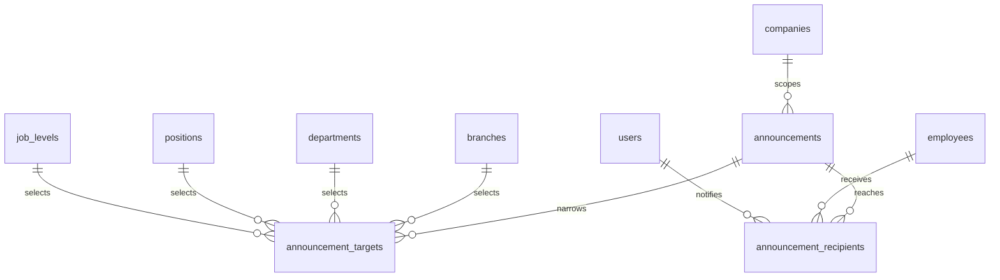
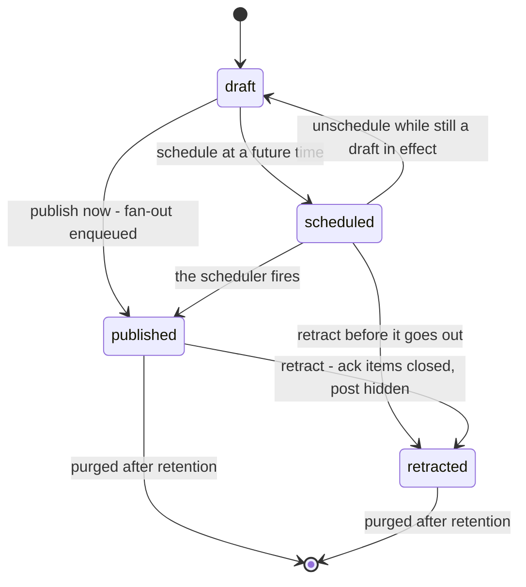
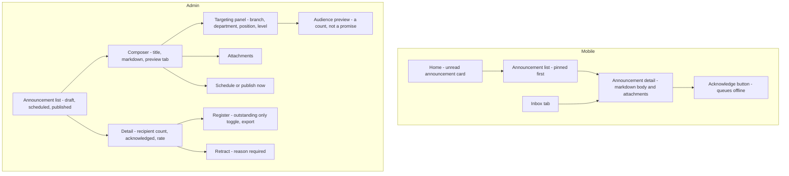

# Module: Announcement

Status: Active (Phase 3) · Related ADRs: `ADR-0001` (module boundaries — §5 outbound FK inventory, §6 read-model views), `ADR-0002` (tenant scoping), `ADR-0003` (reference-data mirror on mobile; this module owns no queued write), `ADR-0005` (data scope + module-resolved row visibility), `ADR-0006` (result pattern), `ADR-0007` (envelope), `ADR-0009` (attachments), `ADR-0010` (the fan-out job, the crons, the outbox handler), `ADR-0013` (Drizzle conventions), `ADR-0015` (one export), `ADR-0016` (encryption boundary — nothing here is encrypted, and §1 says why) · Deliberately **not** related: `ADR-0008` (no approval chain — §13 says why), `ADR-0012` (no payroll path), `ADR-0014` (no generated document — an announcement is read, not issued) · Depends on: `docs/06-modules/holiday.md` (template), `docs/06-modules/organization.md` (`OrgQueryPort`), `docs/06-modules/employee.md` (`employee_directory`), `docs/05-platform/inbox.md` (`InboxPort` — acknowledgment items), `docs/05-platform/notification.md` (`NotificationPort.fanout`), `docs/05-platform/document-storage.md`, `docs/05-platform/settings.md`, `docs/05-platform/import-export.md`, `docs/05-platform/audit-log.md` · Consumers: `docs/06-modules/reports.md`, `docs/06-modules/dashboard-analytics.md`

Namespace `announcement` (naming §4, error prefix `ANN`). A composed post, a set of targeting rules, the frozen list of people those rules resolved to, and — when the post asks for one — an acknowledgment per person. Inherits all global standards; deviations only.

## 1. Purpose & Scope

Three objects. **The announcement** — title, markdown body, optional attachments, a schedule, an expiry, and a flag saying whether it wants an acknowledgment. **The target** — one targeting rule, naming one branch, department, position, or job level. **The recipient** — one employee the rules resolved to at publish, carrying the acknowledgment stamp if there is one.

**The audience is resolved once, at publish, into rows.** Criteria go in; a frozen list comes out, and that list is simultaneously the fan-out roster, the visibility check, and the **denominator of the acknowledgment rate**. Evaluating the rules live on every read is the tempting alternative and it has no denominator that holds still: "42 of 120 acknowledged" changes because someone transferred into Finance overnight, and last quarter's compliance number can never be reproduced. Performance-goals materialized participation at launch for the same reason, and against the same alternative. The cost is stated rather than hidden: **an employee hired the day after a post gets nothing**, and HR reposts (A-078).

**Targeting is placement, and the tree's owner walks the tree.** The four dimensions — branch, department, position, job level — are all organization's, resolved through `OrgQueryPort.audienceEmployeeIds` (§4.4, added this session). **A department rule descends its subtree**; positions and job levels are exact. Descent is the right default on failure asymmetry: over-inclusion is visible and self-correcting because someone says "why did I get this", while under-inclusion is **invisible** — HR believes it reached eighty people, reached twelve, and nobody reports an announcement they never received. Positions do not descend, because a position is a seat and not a container.

**Under every rule sits one hard filter**: `active` or `on_leave`, and **holding a user account**. A terminated employee has no inbox to reach; a pre-onboarding hire with `user_id = NULL` has no identity to target. Neither is a targeting choice and neither is configurable.

**Acknowledgment is inbox's action and this module's fact.** Inbox already owns `POST /inbox/{id}/acknowledge` and it is the single queueable offline write in the platform (BR-INB-007) — sync class *append-only fact*, `opId` idempotency, terminal-rejection handling, all built and grilled. This module registers **no acknowledge endpoint** and follows `inbox.item.acknowledged` to stamp its own recipient row. What it gives up is stated in §9: a permanently failed relay job leaves one recipient unstamped and one rate one short.

**Content is frozen at publish.** Only `expires_at` and `pinned` stay mutable afterwards. "I confirm I have read the leave policy" is worthless if the policy can be rewritten after the confirmations land — and the same holds for posts nobody acknowledged, because an announcement is the record of what the company told people, and silently rewriting it after five hundred readers puts the record and the readers in permanent disagreement. A typo is lived with or paid for with a retraction and a repost (A-077).

**The body is markdown and the API never emits HTML.** security-standards §6 is explicit — `dangerouslySetInnerHTML` and Flutter `Html` widgets need a sanitizer and review sign-off, and the API emits no HTML at all. A WYSIWYG storing HTML would make a tenant admin a stored-XSS author against every employee in their tenant, with the whole defence resting on one sanitizer never having a bypass. Markdown with raw HTML disabled in the parser renders to React elements and Flutter widgets and never touches that path.

**There is no approval chain, and it is a refusal rather than an oversight.** Training registered one because money routed it; asset and performance-goals registered none for their own reasons. Here a chain would sit between "the Jakarta office is closed, flooding" and the people driving to it. An announcement carries no financial or statutory effect, it is already gated behind a permission very few people hold, and — unlike every module that does route through the engine — **its effect cannot be undone by a later decision**, because retracting a post does not unread it. Approval is the wrong control for an act whose only real risk is delay.

**Nothing in this module is ADR-0016 encrypted.** A title, a markdown body, and a timestamp are none of the protected classes.

**V1 exclusions:** **no categories or types** — no taxonomy table, no enum; every other module's categories do real work and an announcement's would drive no routing, no permission, and no report, so `pinned` is the only prominence axis (A-076). **No editing after publish and no un-retract** (A-077). **No recomputation of a published audience**, so late joiners are never added (A-078). **No read or view tracking** — only the acknowledgment, and only when asked for (A-079). **`employment_type` is not a targeting dimension** (A-080). **No retraction notification** (A-081). **No reminder cron for unacknowledged posts** (A-082). **No import** and **no events emitted** (A-083). Also excluded: comments, reactions, replies, and any two-way channel; per-recipient personalization of the body; translation or per-locale variants of the composed text; a public or unauthenticated view of any post; scheduled recurrence; draft approval or co-authoring; and announcements addressed to anyone who is not an employee of the tenant.

> ⚠️ VERIFY: confirm against current Indonesian regulation before implementation. — how long an employer must retain **proof that an employee was notified** of a company policy or regulation change. `announcement.acknowledgment_retention_days` defaults to 1095 and that number is a placeholder, not a finding; the purge cron deletes the acknowledgment register when it passes, which is the one deletion in this module that could destroy evidence someone is later asked to produce.

> ⚠️ VERIFY: confirm against current Indonesian regulation before implementation. — whether an in-app acknowledgment recorded here satisfies any statutory socialization or notification obligation for *peraturan perusahaan*, policy changes, or terms affecting employment. This module records that a person pressed a button; it asserts nothing about legal sufficiency, and **no UI copy may imply that it does** until this is answered.

## 2. Actors & Permissions

| Action | Permission key | Data scope | Employee | Manager | HR Admin | System Administrator |
|---|---|---|---|---|---|---|
| Read announcements addressed to me | — (authenticated) | self | ✅ | ✅ | ✅ | ✅ |
| Acknowledge one addressed to me | — (inbox, BR-INB-007) | self | ✅ | ✅ | ✅ | ✅ |
| List and read every announcement | `announcement.post.read` | company / tenant | — | — | ✅ | ✅ |
| Compose a draft | `announcement.post.create` | company / tenant | — | — | ✅ | ✅ |
| Edit a draft, publish, schedule, retract | `announcement.post.update` | company / tenant | — | — | ✅ | ✅ |
| Delete a draft | `announcement.post.delete` | company / tenant | — | — | ✅ | ✅ |
| Export the acknowledgment register | `announcement.post.export` | company / tenant | — | — | ✅ | ✅ |

Five keys, every action drawn from the reserved set in naming §5 — **no new permission actions**. Three shapes are deliberate:

- **`announcement.post.update` covers publish and retract**, rather than splitting into three keys. This is performance-goals' settled position one file back — `performance.cycle.update` covers launch, publish, close, and unlock because no role holds one without the others — and the same is true here. Publishing to ten thousand people is genuinely a bigger act than drafting, and the day a tenant wants a drafting-only role, registering a `publish` action is purely additive (naming §5's extension clause).
- **Employee-facing reads carry no key at all.** `GET /me/announcements` is structurally scoped to the caller's own recipient rows, exactly as the inbox and notification feeds are.
- **A tenant-wide post needs `tenant` data scope.** `company_id IS NULL` is the tenant-wide marker (BR-ANN-013); a company-scoped admin may neither create one nor target outside their own company, and an out-of-scope branch or department id is `SYS_NOT_FOUND`, not a distinct refusal.

**Row visibility resolves in this module** (ADR-0005 §14) and it resolves against a table rather than a rule: an employee sees a post if and only if `announcement_recipients` holds their row for it, the post is `published`, and it has not expired. There is no `team` clause anywhere in this module — a manager has no business reading their reports' announcement list, because the announcements a report received are the ones the manager received if they share an audience, and the ones they did not are not the manager's to read. `announcement.post.read` at company or tenant scope sees everything in scope including drafts. Everything out of scope is 404 (existence hiding, `SYS_NOT_FOUND`).

## 3. Business Rules

| # | Rule |
|---|---|
| BR-ANN-001 | **Criteria go in, rows come out.** `announcement_targets` holds the rules and `announcement_recipients` holds the resolution, produced **once** at publish. The recipient set is the fan-out roster, the visibility check, and the acknowledgment denominator, and nothing recomputes it afterwards. |
| BR-ANN-002 | **Four targeting dimensions, one per target row**: branch, department, position, or job level, each a real FK (`ck_announcement_targets_one_dimension`). Multiple rows union. **A department rule descends its subtree**; positions and job levels match exactly. **An empty target set means everyone in the announcement's scope** — the all-hands case costs zero rows and needs no `kind = 'all'` value. |
| BR-ANN-003 | **One eligibility filter under every rule**: the employee is `active` or `on_leave` **and** holds a user account. Not configurable, not a dimension, applied by the resolver. `employment_type` is not a dimension at all (A-080) — it is an `employees` column, and admitting it would drag a second module's port into a resolver that otherwise touches one. |
| BR-ANN-004 | **Lifecycle: `draft → scheduled → published`, with `retracted` reachable from `scheduled` and `published`.** `retracted` is terminal — there is no un-retract, because restoring a post people already read cannot restore the reading. **Expiry is a date, never a state**: `expires_at` filters the employee list at read time and no job writes a status when it passes. |
| BR-ANN-005 | **Content is frozen at publish.** `title`, `body`, attachments, targets, `requires_acknowledgment`, and `acknowledge_by` are immutable from `published` onward → `ANN_CONTENT_LOCKED`. Only `expires_at` and `pinned` stay mutable, and neither changes what was said. |
| BR-ANN-006 | **Publish refuses an empty audience.** The endpoint resolves a count through the org port before the state flips; zero → `ANN_EMPTY_AUDIENCE` carrying the rule set. A post delivered to nobody is otherwise indistinguishable from one still being delivered, and it is the failure mode of a mistyped target that nothing else would surface. |
| BR-ANN-007 | **Fan-out is a job, and `recipient_count` is its completion marker.** Publish flips the state, stamps `published_at`, and enqueues `announcement.fanout`; the job resolves, inserts recipients, creates ack items, and calls `NotificationPort.fanout`. `recipient_count IS NULL` means the fan-out has not finished. **No `publishing` status exists**, because a status is a claim somebody has to retract when the job dies. Every step is idempotent — recipient insert on conflict, inbox dedupe key, notification dedupe key — so a retried job converges (ADR-0010 processor law). |
| BR-ANN-008 | **Acknowledgment is inbox's action and this module's fact.** No acknowledge endpoint is registered here. `on.inbox.item.acknowledged` stamps `announcement_recipients.acknowledged_at`, idempotently. Detail responses carry `inboxItemId` and `acknowledgedAt` for the caller so the button works from the announcement screen without a second endpoint behind it. |
| BR-ANN-009 | **`requires_acknowledgment` decides three things together**: whether inbox items are created, which notification template fires, and whether `acknowledge_by` may be set (`ck_announcements_ack` — a deadline on a post that asks for nothing is a deadline for nothing). `acknowledge_by` is passed to the inbox item as `due_at`, where BR-INB-009 already renders it as urgency styling. |
| BR-ANN-010 | **Retraction closes and hides.** One transaction moves the post to `retracted`, stamps the reason, and calls `InboxPort.closeAckItems` → open items `closed/retracted`. The post leaves every employee list immediately and its attachments stop being mintable. From `scheduled`, the same endpoint simply means the fan-out never happens. **No notification is sent** (A-081): withdrawing a notice by sending a notice re-delivers the thing being withdrawn and cannot carry the correction anyway. |
| BR-ANN-011 | **The body is markdown; the API never emits HTML.** Stored as text, rendered to components on both clients with raw HTML disabled in the parser. No HTML is accepted on write, none is stored, and none is returned — security-standards §6. |
| BR-ANN-012 | **Attachments are part of the draft, not a sub-resource.** `attachmentFileIds` is a replace-all array on create and update, writing document-storage parent links in the `announcement_attachment` category. Read access is `announcement.post.read` **or being a recipient of that announcement** — this module's ownership resolver. Frozen at publish with everything else. |
| BR-ANN-013 | **`company_id IS NULL` is the tenant-wide marker** and creating one requires `tenant` data scope. A company-scoped author may only target inside their own company, and an id outside scope is `SYS_NOT_FOUND` per §2 rather than a distinct code. |
| BR-ANN-014 | **Two retention classes, two keys.** `announcement.retention_days` (default 365) purges ordinary posts past `published_at`; `announcement.acknowledgment_retention_days` (default 1095, ⚠️ VERIFY) purges posts that required an acknowledgment. One key would treat "the canteen is closed Friday" and "every employee confirmed they read the safety policy" as the same class of row and quietly destroy the second one. Recipients and attachments go with the post. |
| BR-ANN-015 | **A published audience is never recomputed.** No transfer, hire, promotion, or department move adds or removes a recipient row after fan-out. An employee who leaves the company keeps their recipient row — the fact that they were told stands — but their inbox item closes with their session, per employee.md BR-EMP-006. |
| BR-ANN-016 | **Audit and offline.** `announcements` and `announcement_targets` are channel-1 audited with full diffs. **`announcement_recipients` is deliberately excluded** (§13) on `leave_ledger_entries`' reasoning: it is a machine-materialized, append-only fact that is its own trail, and a million `created` rows a year would bury the trail it was meant to support. **Mobile mirrors this module as reference data** and owns no queued write (§10). |

## 4. Domain Model



### 4.1 Schema

```ts
// src/database/schema/announcement.ts
// No encrypted column anywhere in this file — §1.
// Outbound cross-module FKs (ADR-0001 §5 extraction inventory):
//   announcements.company_id                -> companies    (core)
//   announcement_targets.branch_id           -> branches      (organization)
//   announcement_targets.department_id       -> departments   (organization)
//   announcement_targets.position_id         -> positions     (organization)
//   announcement_targets.job_level_id        -> job_levels    (organization)
//   announcement_recipients.employee_id      -> employees     (employee)
//   announcement_recipients.user_id          -> users         (core)

export const announcementStatus = pgEnum('announcement_status', [
  'draft', 'scheduled', 'published', 'retracted',                 // BR-ANN-004
]);

export const announcements = pgTable('announcements', {
  ...id, ...tenantId,
  companyId: uuid('company_id').references(() => companies.id),   // null = tenant-wide, BR-ANN-013
  title: text('title').notNull(),
  body: text('body').notNull(),                                   // markdown, never HTML — BR-ANN-011
  status: announcementStatus('status').notNull().default('draft'),
  requiresAcknowledgment: boolean('requires_acknowledgment').notNull().default(false),
  acknowledgeBy: date('acknowledge_by'),                          // -> inbox due_at, BR-ANN-009
  pinned: boolean('pinned').notNull().default(false),             // mutable after publish
  publishAt: timestamp('publish_at', { withTimezone: true }),     // the scheduled moment
  publishedAt: timestamp('published_at', { withTimezone: true }), // the actual one
  expiresAt: timestamp('expires_at', { withTimezone: true }),     // a comparison, not a state
  recipientCount: integer('recipient_count'),                     // null = fan-out in flight, BR-ANN-007
  retractedAt: timestamp('retracted_at', { withTimezone: true }),
  retractionReason: text('retraction_reason'),
  ...auditColumns, ...softDeleteColumns,
}, (t) => [
  index('idx_announcements_tenant_id_company_id_status')
    .on(t.tenantId, t.companyId, t.status),
  index('idx_announcements_tenant_id_publish_at')                 // the scheduler scan only
    .on(t.tenantId, t.publishAt).where(sql`status = 'scheduled' AND deleted_at IS NULL`),
  index('idx_announcements_tenant_id_published_at')               // the purge scan
    .on(t.tenantId, t.publishedAt).where(sql`deleted_at IS NULL`),
]);

export const announcementTargets = pgTable('announcement_targets', {
  ...id, ...tenantId,
  announcementId: uuid('announcement_id').notNull().references(() => announcements.id),
  branchId: uuid('branch_id').references(() => branches.id),        // exactly one of the four
  departmentId: uuid('department_id').references(() => departments.id),   // subtree — BR-ANN-002
  positionId: uuid('position_id').references(() => positions.id),   // exact
  jobLevelId: uuid('job_level_id').references(() => jobLevels.id),  // exact
  ...auditColumns,
}, (t) => [
  index('idx_announcement_targets_tenant_id_announcement_id')
    .on(t.tenantId, t.announcementId),
]);

export const announcementRecipients = pgTable('announcement_recipients', {
  ...id, ...tenantId,
  announcementId: uuid('announcement_id').notNull().references(() => announcements.id),
  employeeId: uuid('employee_id').notNull().references(() => employees.id),
  userId: uuid('user_id').notNull().references(() => users.id),     // the inbox and push target
  acknowledgedAt: timestamp('acknowledged_at', { withTimezone: true }),   // BR-ANN-008
  createdAt: timestamp('created_at', { withTimezone: true }).notNull().defaultNow(),
}, (t) => [
  uniqueIndex('uq_announcement_recipients_announcement_id_employee_id')   // fan-out idempotency
    .on(t.tenantId, t.announcementId, t.employeeId),
  index('idx_announcement_recipients_tenant_id_user_id')                  // "my announcements"
    .on(t.tenantId, t.userId),
  index('idx_announcement_recipients_tenant_id_ack')                      // the register + the rate
    .on(t.tenantId, t.announcementId, t.acknowledgedAt),
]);
```

`announcement_targets` and `announcement_recipients` carry **no soft-delete columns**. Targets are replaced wholesale while the post is a draft and frozen afterwards; recipients are a materialized set purged with their parent. Neither is ever individually retired, and a `deleted_at` on either would be a column that only ever holds null.

**Four nullable FK columns rather than a polymorphic `(kind, ref_id)` pair**, and that is the whole reason rows were chosen over a jsonb array in the first place: a polymorphic id references nothing the database can enforce, which is the same defect as jsonb wearing a table's clothes. Four columns and one CHECK give four real foreign keys, so deleting a department cannot leave an announcement pointing at it, and ADR-0001 §5's extraction inventory has something concrete to count.

Hand-written CHECK constraints (database-conventions §2.4):

- `ck_announcement_targets_one_dimension` — `num_nonnulls(branch_id, department_id, position_id, job_level_id) = 1`. Exactly one, never zero and never two: a row naming both a department and a job level is an intersection nobody wrote a rule for, and BR-ANN-002 unions rows rather than intersecting them.
- `ck_announcements_scheduled` — `status <> 'scheduled' OR publish_at IS NOT NULL`. A scheduled post with no time is a draft with a lie on it.
- `ck_announcements_published` — `published_at IS NOT NULL OR status IN ('draft', 'scheduled')`. Written this way rather than as an equivalence because a retracted post keeps the moment it went out.
- `ck_announcements_retracted` — `(status = 'retracted') = (retracted_at IS NOT NULL AND retraction_reason IS NOT NULL)`.
- `ck_announcements_ack` — `acknowledge_by IS NULL OR requires_acknowledgment` (BR-ANN-009).
- `ck_announcements_expiry` — `expires_at IS NULL OR publish_at IS NULL OR expires_at > publish_at`. An expiry before the publish time is a post that is never visible.
- `ck_announcements_recipient_count` — `recipient_count IS NULL OR recipient_count >= 0`.
- `ck_announcements_title_body` — `length(title) BETWEEN 1 AND 200 AND length(body) BETWEEN 1 AND 20000`. The body cap is at the schema and not only in the DTO, because it is what bounds the row a million recipients will read.

### 4.2 Lifecycle



`draft ↔ scheduled` is the one reversible edge and it is reversible because nothing has happened yet — clearing `publish_at` returns the post to the editor. Everything from `published` onward is one-way. **Expiry appears nowhere on this diagram**, deliberately: an expired post is `published` with a date in the past, which is not a bug but yesterday's announcement, correctly. The alternative — an `expired` state written by a cron — buys a job whose entire output is a value already derivable, and a row whose status can disagree with the date it mirrors.

Recipients have **no lifecycle and no status column**. `acknowledged_at` is a stamp that goes from null to a time, once, and never back.

### 4.3 Ports served

**`AnnouncementQueryPort`** — one method, for the export definition and for reports (live 2026-08-03; **dashboard-analytics arrived 2026-08-04 and consumes only `ReportQueryPort`**):

```ts
interface AnnouncementQueryPort {
  // one row per recipient of one announcement: identity, targeted-at, acknowledged-at or null
  acknowledgmentRegister(announcementId: string):
    Promise<AcknowledgmentRow[]>;  // { employeeId, employeeNumber, fullName, targetedAt, acknowledgedAt }
}
```

Declared rather than deferred because import-export's own definition contract names a `queryPort` for every export, and because this module holds the only correct answer to "who was supposed to see this" — a question no other module can reconstruct once the criteria have been resolved away. Nothing else is served. The rate itself is a `COUNT(*) FILTER` over the rows this method returns, and wrapping arithmetic that carries no module semantics in a second method would be a port with nothing in it.

### 4.4 Ports and reads consumed

| Channel | Used for | Authority |
|---|---|---|
| `OrgQueryPort.audienceEmployeeIds` (organization §4.3, **added this session**) | resolving the target rules into employee ids at publish, and the pre-publish count | ADR-0001 §2 exported port |
| `OrgQueryPort.placements` (batch) | department and branch columns on the acknowledgment register | ADR-0001 §2 exported port |
| `InboxPort.createAckItems` / `closeAckItems` (inbox §5) | the acknowledgment items and their closure on retraction — `createAckItems` gains an optional `dueAt` this session | ADR-0008 machinery, inbox-owned |
| `NotificationPort.fanout` (notification §5) | the push and in-app send, chunked ≤ 500 per BR-NTF-009 | ADR-0010 |
| `DocumentPort` (document-storage §5) | attachment parent links and signed-URL mints in the `announcement_attachment` category | ADR-0009 |
| `employee_directory` (view, employee.md §13) | `full_name` + `employee_number` on the register and its `q=` search, and **`user_id`**, which the view gains this session | ADR-0001 §6 as amended 2026-08-03 |

**`employee_directory` gains `user_id` this session**, which is the addition the view's own text invited — *"Additions require an edit here and a consumer that needs them"*. The consumer is the fan-out: inbox items and push notifications are addressed to users, `employees.user_id` is nullable and lives on a table this module may not join, and a batch port cannot help because the eligibility filter (BR-ANN-003) has to run inside the resolution query, not after it. `user_id` is neither encrypted nor masked, so the view stays exactly the boundary employee.md defined it to be.

## 5. Use Cases

**UC-ANN-001 — Compose a draft.** HR Admin writes a title and a markdown body, picks a company or tenant-wide scope, adds target rules, optionally attaches files, sets `requiresAcknowledgment` and an `acknowledgeBy` date, and sets an expiry. The post is created `draft` and is invisible to everyone without `announcement.post.read`. Targets and attachments are replace-all arrays on the same payload. Exceptions: tenant-wide scope without `tenant` data scope → 403 · a target outside the caller's scope → `SYS_NOT_FOUND` · `acknowledgeBy` without `requiresAcknowledgment` → `VAL_VALIDATION_FAILED`.

**UC-ANN-002 — Preview the audience.** `GET /announcements/{id}/audience` returns the count the rules currently resolve to, through the same port call publish will make. It is a **preview and not a promise**: an hour later the number may differ, which is exactly why the resolution that matters happens once, at publish. The screen says so.

**UC-ANN-003 — Publish now.** `POST /{id}/publish` counts the audience, refuses zero with `ANN_EMPTY_AUDIENCE`, moves the post to `published`, stamps `published_at`, and enqueues `announcement.fanout`. `recipient_count` stays null until the job finishes. Exceptions: not `draft` or `scheduled` → `VAL_VALIDATION_FAILED` · empty audience → `ANN_EMPTY_AUDIENCE` with the rule set in `details`.

**UC-ANN-004 — Schedule, and the scheduler.** Setting `publishAt` on a draft and scheduling it moves the post to `scheduled`; clearing it returns the post to `draft`. `cron.announcement.publish-due` runs every five minutes, picks up `scheduled` posts whose `publish_at` has passed, and takes **the identical path as UC-ANN-003** including the empty-audience guard — a scheduled post whose department was deleted last week fails the same way, and lands in the failed-jobs view rather than going out to nobody.

**UC-ANN-005 — Fan out (job).** `announcement.fanout` on the `notifications` queue: resolve target rules through `OrgQueryPort.audienceEmployeeIds`, map to users through `employee_directory`, insert `announcement_recipients` in chunks (`ON CONFLICT DO NOTHING`), call `InboxPort.createAckItems` in ≤ 500-recipient chunks when acknowledgment is required, call `NotificationPort.fanout` with `announcement.published` or `announcement.acknowledgment_required`, then stamp `recipient_count`. **The job re-reads the post's status inside its own transaction and aborts if it is no longer `published`**, which is what makes a retraction during fan-out safe. Every step idempotent; a retry converges rather than duplicating.

**UC-ANN-006 — Read what was addressed to me.** `GET /me/announcements` returns the caller's recipient rows joined to `published`, unexpired, unretracted posts — pinned first, then newest. Detail returns the markdown body, attachment download links, and — when acknowledgment is required — `inboxItemId` and `acknowledgedAt` for this caller. Nothing here needs a permission key.

**UC-ANN-007 — Acknowledge.** The employee presses the button on the announcement screen or in the inbox; both call `POST /api/v1/inbox/{id}/acknowledge`, which is queueable offline (BR-INB-007). Inbox flips its item to `done` and emits `inbox.item.acknowledged`; this module's handler stamps `announcement_recipients.acknowledged_at` for that `(announcementId, userId)`. Idempotent in both directions — a replayed event finds a stamped row and does nothing, a second tap gets inbox's 200 no-op.

**UC-ANN-008 — Retract.** HR Admin retracts with a mandatory reason. One transaction moves the post to `retracted`, stamps the reason, and calls `InboxPort.closeAckItems` so every open item closes with `closed_reason = 'retracted'` — the value inbox wrote into its schema before this module existed. The post leaves every employee list immediately. From `scheduled` the same call simply prevents the fan-out. Terminal: there is no un-retract, and a corrected version is a new announcement with a new audience (§9).

**UC-ANN-009 — Track and export acknowledgments.** The admin detail screen shows `recipient_count`, the acknowledged count, the rate, and a filterable register with an "outstanding only" toggle; `announcement.acknowledgment` exports the same register as xlsx through import-export §7. This is the whole of the chase mechanism (A-082): the outstanding list produces names, and the names go to managers.

**UC-ANN-010 — Purge (job).** `cron.announcement.purge` runs daily per tenant in two passes — posts without acknowledgment past `announcement.retention_days`, posts with it past `announcement.acknowledgment_retention_days` — soft-deleting the post and hard-deleting its recipients and targets, and releasing attachment files to `cron.document.purge`. A `draft` never purges: it has no `published_at` to measure from, and an abandoned draft is somebody's unfinished business, not retained data.

## 6. UI Flow



Screen inventory — mobile: home card, announcement list, detail with attachments, the acknowledge affordance, and the same detail reached from the inbox tab. Admin: list with status filter, composer with a preview tab, targeting panel, audience preview, attachment slot, schedule/publish controls, detail with the acknowledgment summary, the register with its outstanding filter and export, and the retract dialog.

**The composer is a textarea with a preview tab, not a toolbar.** Markdown is what is stored (BR-ANN-011), and a WYSIWYG that emits markdown is a component decision the admin app can make later without changing a byte of what this module persists. What the composer must do instead is show the rendered result before the post goes out, because §1 froze the content at publish and the preview is the only proofread anyone gets.

**The targeting panel states the audience in words above the count.** "Everyone in PT Contoh Jakarta · Finance and everything under it · Senior level" reads back what was selected, because the failure this module cannot detect is a rule that silently matched fewer people than intended (BR-ANN-002). The count sits beside it, labelled *as of now* rather than as a total — an audience preview that looks like a guarantee is worse than none.

**Publishing is a two-step confirm naming the headcount and the channels** — "this reaches 1,240 people by push and in-app, and asks each of them to acknowledge" — for the same reason cancelling a training session is: it is the most irreversible act in the module and the only one that arrives on other people's phones.

**The admin detail leads with the rate, not the body.** `1,240 targeted · So far 902 acknowledged · 73%`, with the outstanding list one tap away, because nobody opens a published announcement to re-read what they wrote. While `recipient_count` is null the same header renders **"Delivering…"** rather than a zero — a count of zero and a count not yet taken are different facts and only one of them is alarming.

States: **empty** — no announcements renders a compose prompt for HR and "Nothing right now" for employees, never an empty table; a register with everyone acknowledged renders the completion rather than a blank filter result. **Loading** — list skeletons; the detail header renders the rate last rather than showing a wrong percentage first. **Error** — `ANN_EMPTY_AUDIENCE` renders on the publish action next to the targeting panel with the rules echoed back, because the fix is in that panel; `ANN_CONTENT_LOCKED` renders as a panel explaining that a published post cannot be edited and offering retract-and-repost, since the user's next question is always "then how do I fix the typo"; `INB_ITEM_CLOSED` on an offline acknowledgment that drained against a retracted post renders as the retracted notice inbox §9 already specifies. Field > panel > toast, per coding-standards-nextjs.

## 7. API

All endpoints follow the canonical spec-block form (api-standards §13). The employee feed uses the **feeds family (cursor)** matching the notification and inbox feeds; admin grids use the seeded transactional-grid family (offset). No new pagination-registry rows. The export rides import-export §7 rather than an endpoint here. Errors beyond the implied set only.

| Endpoint | Permission | Pagination | Queue-reachable | Idempotency |
|---|---|---|---|---|
| `GET /api/v1/announcements` | `announcement.post.read` | offset | no | — |
| `GET /api/v1/announcements/{id}` | `announcement.post.read` | — | no | — |
| `POST /api/v1/announcements` | `announcement.post.create` | — | no | accepted |
| `PATCH /api/v1/announcements/{id}` | `announcement.post.update` | — | no | accepted |
| `DELETE /api/v1/announcements/{id}` | `announcement.post.delete` | — | no | — |
| `GET /api/v1/announcements/{id}/audience` | `announcement.post.read` | — | no | — |
| `POST /api/v1/announcements/{id}/publish` | `announcement.post.update` | — | no | accepted |
| `POST /api/v1/announcements/{id}/retract` | `announcement.post.update` | — | no | accepted |
| `GET /api/v1/announcements/{id}/recipients` | `announcement.post.read` | offset | no | — |
| `GET /api/v1/me/announcements` | — (own) | cursor | no | — |
| `GET /api/v1/me/announcements/{id}` | — (own) | — | no | — |

**One new URL verb: `retract`**, registered in naming §3 and mirrored in api-standards §1 this session — the fifth extension after `terminate`, `assign`, `return`, and `export`. It is registered rather than substituted because **the word is already in the platform**: inbox wrote `closed_reason = 'retracted'` into its schema, its BR-INB-002, its BR-INB-008, and the `INB_ITEM_CLOSED` catalog row before this module existed. Reusing the reserved `revoke` would have the URL say one word while the row it closes says another — one act spelled two ways across a module boundary, which is the precise drift the verb list exists to catch. `publish` is reserved already. The audience preview and the register use the **sub-resource shape** — `GET /{id}/audience`, `GET /{id}/recipients` — rather than minting `preview` and `list`, on the precedent asset set with `retirement`, expense with `payments`, performance with `agreement`, and training with `completion`. **No endpoint is queue-reachable**: the one offline write on this module's screens is inbox's acknowledge (§10).

#### POST /api/v1/announcements · PATCH /{id} · DELETE /{id}

| Field | Type | Required | Rule |
|---|---|---|---|
| `companyId` | uuid | — | in the caller's scope; **null = tenant-wide and requires `tenant` data scope**; immutable on PATCH |
| `title` | string | ✅ | 1–200 |
| `body` | string | ✅ | 1–20000, markdown; HTML rejected, not stripped |
| `requiresAcknowledgment` | boolean | — | default false |
| `acknowledgeBy` | date | — | only when `requiresAcknowledgment`; on or after today |
| `pinned` | boolean | — | default false; **mutable after publish** |
| `publishAt` | timestamp | — | future; setting it schedules, clearing it returns the post to `draft` |
| `expiresAt` | timestamp | — | after `publishAt` when both are set; **mutable after publish** |
| `targets` | array | — | replace-all; each element names exactly one of `branchId`, `departmentId`, `positionId`, `jobLevelId`; **empty or absent = everyone in scope** |
| `attachmentFileIds` | uuid[] | — | replace-all; committed files in the `announcement_attachment` category |

Response 201/200: the announcement with `status`, `recipientCount`, `targets`, `attachments`, and `acknowledgedCount` when published. `DELETE` is a soft delete and is refused on anything that is not a `draft` → `VAL_VALIDATION_FAILED`; a published post is retracted, never deleted. On PATCH, every field except `pinned` and `expiresAt` is refused from `published` onward → `ANN_CONTENT_LOCKED` naming the frozen set (BR-ANN-005).

#### GET /api/v1/announcements/{id}/audience

No body. Response 200: `{ count, asOf, rules: [...] }` — the resolution the current target rows produce **right now**, through the same port call publish makes. Explicitly a preview (UC-ANN-002). Errors: none beyond the implied set; an empty result is `{ count: 0 }` and not an error, because a draft is allowed to be half-built.

#### POST /api/v1/announcements/{id}/publish

No body. Moves `draft` or `scheduled` → `published`, stamps `published_at`, enqueues the fan-out. Response 202: `{ id, status, publishedAt, recipientCount: null }`. Errors: `ANN_EMPTY_AUDIENCE` (422) with `details: { rules }` · already `published` or `retracted` → `VAL_VALIDATION_FAILED`.

#### POST /api/v1/announcements/{id}/retract

Request: `{ reason }` — required, 5–500. Moves `scheduled` or `published` → `retracted`, closes ack items, hides the post. Response 200: `{ id, status, retractedAt, closedItemCount }`. Errors: not `scheduled` or `published` → `VAL_VALIDATION_FAILED`. Idempotent on a re-call: an already-retracted post returns its existing stamp.

#### GET /api/v1/announcements/{id}/recipients

Request: `?page&pageSize&acknowledged=false&q=`. Response 200: `data: [{ employeeId, employeeNumber, fullName, department, branch, targetedAt, acknowledgedAt }]`, `meta.totalCount`, plus `summary: { targeted, acknowledged, rate }`. Identity comes from `employee_directory` and placement from `OrgQueryPort.placements`; `q=` searches name and employee number, which is why the view is the channel and a port is not (ADR-0001 §6).

#### GET /api/v1/me/announcements · GET /api/v1/me/announcements/{id}

Request: `?cursor&limit&unacknowledgedOnly=true`. Response 200: `data: [{ id, title, excerpt, pinned, requiresAcknowledgment, acknowledgedAt, publishedAt, hasAttachments }]`, `meta.nextCursor` — pinned first, then newest, filtered to the caller's recipient rows on `published`, unexpired, unretracted posts. Detail adds `body`, `attachments: [{ fileId, filename, sizeBytes }]`, `acknowledgeBy`, and `inboxItemId` when acknowledgment is required. A post the caller is not a recipient of is 404 (`SYS_NOT_FOUND`), and so is a retracted one — retraction removes it, it does not gray it out.

## 8. Validation Rules

| Field | Rule | Error code |
|---|---|---|
| `title` | required, 1–200 | `VAL_REQUIRED` / `VAL_TOO_LONG` |
| `body` | required, 1–20000, markdown; contains no HTML tags | `VAL_REQUIRED` / `VAL_TOO_LONG` / `VAL_INVALID_FORMAT` |
| `companyId` | in the caller's scope; null requires `tenant` data scope | 403 (`AUTHZ_FORBIDDEN`) / 404 (`SYS_NOT_FOUND`) |
| `targets[]` | exactly one dimension per element, each live and in scope | `VAL_VALIDATION_FAILED` / 404 (`SYS_NOT_FOUND`) |
| `acknowledgeBy` | only with `requiresAcknowledgment`; today or later | `VAL_VALIDATION_FAILED` / `VAL_OUT_OF_RANGE` |
| `publishAt` | in the future when set | `VAL_OUT_OF_RANGE` |
| `expiresAt` | after `publishAt` when both are set | `VAL_VALIDATION_FAILED` |
| `attachmentFileIds` | committed files, category `announcement_attachment` | 404 (`SYS_NOT_FOUND`) |
| publish | the rules resolve to at least one eligible employee | `ANN_EMPTY_AUDIENCE` |
| publish | current status is `draft` or `scheduled` | `VAL_VALIDATION_FAILED` |
| edit | `title`, `body`, `targets`, attachments, and the acknowledgment fields are frozen from `published` | `ANN_CONTENT_LOCKED` |
| delete | the post is a `draft` | `VAL_VALIDATION_FAILED` |
| `reason` (retract) | required, 5–500 | `VAL_REQUIRED` / `VAL_TOO_LONG` |

## 9. Edge Cases & Failure Modes

- **A hire lands the day after an all-hands post.** They receive nothing, and no screen implies otherwise. The audience was resolved once (BR-ANN-001), and the alternative — recomputing on read — destroys every acknowledgment rate the module produces. HR reposts, which is a human act with a human's judgment about whether it is worth it (A-078).
- **HR mistypes a target and the post reaches twelve people instead of eighty.** Not detectable by this module and stated so: the union of rules resolved to what it resolved to. The defences are ordered by strength — department rules descend by default (BR-ANN-002), the targeting panel reads the rules back in words, and the audience preview shows the count before publish. `ANN_EMPTY_AUDIENCE` catches only the total miss.
- **The fan-out job dies permanently after inserting 400 of 1,240 rows.** The post is `published` with `recipient_count` null, 400 people can see it, and 840 cannot. Visible as "Delivering…" on the detail screen and as a failed job in the platform view; re-running converges, because the recipient insert is `ON CONFLICT DO NOTHING` and both the inbox and notification calls dedupe. This is the residual cost of BR-ANN-007 and it is the reason `recipient_count` is a stamp rather than a running total.
- **Someone retracts while the fan-out is mid-flight.** The job re-reads the status inside its own transaction and aborts (UC-ANN-005); the retract path closes whatever ack items already exist. The worst outcome is a handful of pushes already dispatched for a post that no longer opens — which is why the retract confirm says so.
- **Two admins publish the same post at the same second.** The status transition is guarded by the current state, so the second call finds it `published` and returns `VAL_VALIDATION_FAILED`; only one fan-out job is enqueued because only one transition committed.
- **A department is deleted between scheduling and the scheduler firing.** The FK prevents the delete outright while a target row references it — which is the point of four real columns rather than a polymorphic id (§4.1). If the department is archived rather than deleted, the resolution simply returns fewer people, and zero people fails the scheduled publish with `ANN_EMPTY_AUDIENCE` into the failed-jobs view rather than going out to nobody.
- **A typo in a published all-hands post.** `ANN_CONTENT_LOCKED`. The two available paths are living with it or retracting and reposting, which resets acknowledgments. Named rather than softened, because the alternative is an acknowledgment attesting to text that no longer exists (BR-ANN-005).
- **An employee acknowledges offline, then the post is retracted before they sync.** The queued acknowledge drains against a closed item → `INB_ITEM_CLOSED`, terminal per inbox §9, and the mobile client shows the retracted notice. This module's recipient row stays unstamped, correctly: they never acknowledged a live post.
- **`inbox.item.acknowledged` is lost to a permanently failed handler.** One recipient row stays null and the rate is one short, forever, with no user-visible symptom. Accepted deliberately when Q7 put the endpoint in inbox: the alternative was a Phase 2 platform module calling synchronously into a Phase 3 business module, inverting a layering every other module respects. Bounded by the failed-jobs view, and the handler is idempotent on replay.
- **An employee is terminated holding an unacknowledged post.** Their recipient row survives — the fact that they were told is history — while employee.md BR-EMP-006 closes their inbox items with their sessions. The register shows them as targeted and unacknowledged, which is exactly true.
- **A post expires while it still has an open acknowledgment item.** Expiry hides the post from the employee list (BR-ANN-004) but closes nothing in the inbox: an `open` item never purges (BR-INB-010) and the deep link still resolves for a recipient. A post that asks for an acknowledgment and expires before getting one is a configuration mistake the register makes visible, not a state the module repairs.
- **An admin sets `expiresAt` in the past on a published post.** Legal and immediate — it is the closest thing to an "unpublish" that does not lie about history. The post leaves every employee list and stays in the register with its acknowledgments intact. Retraction is the stronger act and it is the one that closes the inbox items.
- **A tenant-scoped admin posts tenant-wide across four companies.** One post, one audience, one rate. The rules resolve across every company in the tenant, and a company-scoped admin cannot see the post at all, because §2's scope check runs on `company_id IS NULL`.
- **Ten thousand recipient rows on a single post.** Expected. Insertion is chunked, the two crons' scans are indexed on `published_at`, and both retention keys bound the table. A tenant of that size producing a hundred posts a year holds roughly a million rows before the first purge, which is the same order as `training_enrollments` and `performance_participants` on a table with four columns.
- **Markdown containing a script tag.** Rejected on write as `VAL_INVALID_FORMAT` rather than silently stripped, and the parser has raw HTML disabled on both clients regardless, so a value that somehow reached storage still renders as text. Two independent defences, because a sanitizer is a single point of failure and security-standards §6 says the API emits no HTML at all.
- **`employee_directory` isolation.** The view is `security_invoker = true`. Without it a Postgres view runs with its owner's rights and bypasses the `employees` RLS policy — a cross-tenant read dressed as a join. This module joins it in the fan-out resolver and on the acknowledgment register, and the fan-out is the worst possible place for that leak, because it would address inbox items and push notifications to another tenant's users.

## 10. Offline Behavior

Deviations from the global standard (offline-sync §10 checklist):

- **Entities:** `announcements` and `announcement_recipients` — sync class **reference data** (pull-only cursor sync; local Drift mirror for the list and detail). Only the caller's own recipient rows and their posts are pulled.
- **Queueable ops:** **none owned by this module.** The one offline write on these screens is `POST /inbox/{id}/acknowledge`, which belongs to inbox and is already class *append-only fact* with `opId` idempotency (BR-INB-007). Registering a second endpoint for the same fact would duplicate a queue class, an idempotency scheme, and a terminal-rejection path that exist and have been grilled.
- **Tombstones are mandatory, not optional.** Retraction and expiry must arrive on the pull cursor as removals. Without them a withdrawn post stays readable forever on a device that never syncs again — the single outcome retraction exists to prevent, and the reason this module cannot use a plain "changed since" pull that only ever adds rows.
- **Attachments are online-only.** Signed URLs carry a 600-second TTL (document-storage §4.2), so a cached URL is dead long before the commute is over, and caching the bytes instead would put company policy documents in SQLCipher on every phone with no revocation path when the post is retracted.
- Composing, publishing, and retracting are admin-web acts and have no mobile surface at all.

An announcement is small, read-mostly, and the most likely thing anyone opens on a train with no signal — which is why this module mirrors at all, unlike training and performance-goals, which are online-only. The write side needs nothing: there is exactly one employee-facing write in the module and another module already owns it.

## 11. Module Error Codes

Registered this session (error-catalog §29):

| Code | HTTP | Trigger |
|---|---|---|
| `ANN_EMPTY_AUDIENCE` | 422 | Publish — immediate or scheduled — whose target rules resolve to zero eligible employees — BR-ANN-006 |
| `ANN_CONTENT_LOCKED` | 409 | Edit of a frozen field on a `published` or `retracted` post — BR-ANN-005 |

`ANN_EMPTY_AUDIENCE` is a **422 rather than a 409** deliberately: nothing about the post's state is wrong, the rules simply describe nobody, and the fix is in the payload the caller controls. `ANN_CONTENT_LOCKED` is a 409 for the opposite reason — the payload is fine and the state refuses it.

Six conditions deliberately take **no module code.** Publishing something already published, retracting something never published, and deleting a post that is not a draft are all `VAL_VALIDATION_FAILED` — one state machine, one refusal, on training's precedent for `publish`. A target, company, branch, or department outside the caller's scope is `SYS_NOT_FOUND` per §2, including the tenant-wide case, where scope is enforced as `AUTHZ_FORBIDDEN` before any row is read. Acknowledging something unacknowledgeable is `INB_NOT_ACKNOWLEDGEABLE` and acknowledging a retracted post is `INB_ITEM_CLOSED` — both inbox's, because the endpoint is inbox's. HTML in the body is `VAL_INVALID_FORMAT`, a field error and not a module condition. And a fan-out that fails raises nothing at all to anyone: it is a job, its failure lands in the failed set, and the null `recipient_count` is what the UI reads.

**No 403 exception here.** Unlike `REC_NOT_A_PANELIST` and `PRF_NOT_THE_REVIEWER`, this module seats nobody against a parent row the caller can already see — a non-recipient cannot see the post at all, so existence hiding applies cleanly and `SYS_NOT_FOUND` is the whole answer. Training reached the same conclusion for its own reasons one file ago; the rule catalog §27 promotes is not triggered by a second module in a row, and inventing an instance to match it would be the pattern using the module.

Announcement registers **no lock-family code and no `APRV_` code**: nothing here is a dated payroll fact, and there is no approval-engine interaction at all (§13).

## 12. Background Jobs & Events

Crons owned (`maintenance` queue, fixed queue set per ADR-0010 — no new queue):

| Job | Trigger | Behavior |
|---|---|---|
| `cron.announcement.publish-due` | every 5 minutes, per-tenant fan-out | UC-ANN-004. `scheduled` posts with `publish_at <= now()` take the publish path in full, including the `ANN_EMPTY_AUDIENCE` guard. Idempotent by the status transition — a redelivered job finds the post `published` and stops. Five minutes is the scheduling granularity the module promises, and the composer says so |
| `cron.announcement.purge` | daily, per-tenant fan-out | UC-ANN-010, two passes in one scan. Posts **without** `requires_acknowledgment` past `announcement.retention_days`, posts **with** it past `announcement.acknowledgment_retention_days`. Soft-deletes the post, hard-deletes its targets and recipients, releases attachments to `cron.document.purge`. Drafts are never purged |

Command job:

| Job | Queue | Behavior |
|---|---|---|
| `announcement.fanout` | `notifications` | UC-ANN-005. Resolve → insert recipients → create ack items → notification fan-out → stamp `recipient_count`. On the `notifications` queue because its entire output is reaching people and its chunking is BR-NTF-009's, not because it sends the pushes itself. Aborts if the post is no longer `published`. Idempotent at every step |

Event-handler job:

| Handler | Event | Behavior |
|---|---|---|
| `on.inbox.item.acknowledged` | inbox §12 | BR-ANN-008 — stamp `acknowledged_at` on the recipient row matching `(sourceRef.announcementId, userId)`. No-op when already stamped or when the event names an approval item. Idempotent by the stamp itself |

**Events emitted: none** (A-083). Nothing in V1 consumes one, channel-1 audit captures every diff on both audited tables, and an event published for no subscriber is scaffolding — adding `announcement.published` when dashboard-analytics wants it is additive, which is the position asset, expense, recruitment, performance, and training all reached.

**No PDF render and no `reports`-queue work.** ADR-0014 enumerates its consumers — payslips, 1721-A1, report exports, training certificates, asset handover documents — and an announcement is on none of them. The check that produced A-056 and A-064 negatively and training's certificate positively lands negatively again here, and correctly: an announcement is read, not issued, and its attachments are files someone already made.

## 13. Approval, Notification & Report Touchpoints

- **Approval — none, and it is a refusal.** No request type is registered, no `ApprovalPort` call is made, and no chain touches any endpoint. Training registered one because `costAmount` made a chain a control; asset registered none because assignment records a fact that already happened; performance registered none because the engine's activation-time resolver conflicted with a reviewer pinned at launch. The reason here is different again and it is about **time**: a chain would sit between "the Jakarta office is closed, flooding" and the people driving to it. An announcement moves no money, creates no statutory obligation, and is already gated behind a permission very few people hold — and unlike every module that does route through the engine, its effect is not reversible by a later decision, because retracting a post does not unread it. The control that fits an act whose risk is delay is the permission, not the queue.
- **Notification — 2 templates registered in notification §4.2 this session.** `announcement.published` (in_app + push, **opt-out**, audience = every recipient of the post, carrying the announcement title and its id). `announcement.acknowledgment_required` (in_app + push, **mandatory**, same audience, additionally carrying `acknowledgeBy`). Two rather than one because **`mandatory` is a per-template flag and not a per-send one**, and the two cases differ in kind: a canteen menu is a preference, an acknowledgment somebody must produce is not — the split training drew between `enrollment_assigned` and `session_reminder`. Both render a **localized frame with the announcement title as the only variable** — notification title is "New announcement" or "Acknowledgment required", body is the post's title — which is how free-form admin text passes a code-owned registry (BR-NTF-001) without becoming the one send in the system with no locale and no i18n key. **The body is never previewed in a push**: HR writes without length discipline and without knowing who is standing next to whom when the phone lights up. **No retraction template** (A-081), and **no reminder template** (A-082) — an unacknowledged post already nags permanently from the inbox badge, because BR-INB-010 never purges an `open` item, and a second nag reaches only people who have already seen the first.
- **Inbox — this module is the acknowledgment source inbox §3 was built for, and the promise is discharged.** `InboxPort.createAckItems(announcementId, targetUserIds, titleParams, deepLink)` is called from the fan-out in ≤ 500-recipient chunks and `closeAckItems(announcementId)` from retraction; `dedupe_key` is the announcement id exactly as BR-INB-004 specified, and `closed_reason = 'retracted'` is the value inbox already wrote. **`createAckItems` gains an optional `dueAt` this session** so `acknowledge_by` reaches BR-INB-009's urgency styling — the one signature change, on the first-caller pattern. `inbox.item.acknowledged` is consumed (§12). **No acknowledge endpoint is registered here** (BR-ANN-008).
- **Import/Export — 1 ExportDefinition, no import.** `announcement.acknowledgment` (export; one row per recipient — employee number, full name, department, branch, targeted-at, acknowledged-at or blank, plus the post's title and publish date as constants; params `announcementId`, optional `acknowledgedOnly`/`outstandingOnly`; queryPort = `AnnouncementQueryPort.acknowledgmentRegister`, permission `announcement.post.export`). **No gated column set** — nothing here is ADR-0016 encrypted or masked, and a name beside a timestamp carries nothing the requester cannot already read on the register screen. **No import at all** (A-083): nobody holds a spreadsheet of announcements, and the one thing worth loading — a historical archive from a previous system — is a one-off migration script rather than a permanent definition with a dry-run, a template version, and an error report to maintain.
- **Settings — 2 keys registered in settings §4.2 this session:** `announcement.retention_days` (integer, tenant + company, default 365) and `announcement.acknowledgment_retention_days` (integer, tenant + company, default 1095, **⚠️ VERIFY** — §1). Two keys and not one for the reason training gave for its two reminder windows: they answer different questions. One bounds a feed, the other bounds evidence that an employee was notified of a policy, and collapsing them either destroys the evidence at a year or makes the canteen menu immortal. Nothing else here is a setting — the reminder window, the push channels, and the scheduling granularity are all fixed, and `pinned`, `expires_at`, and `requires_acknowledgment` are properties of a post, on the same line training drew around `self_enrollment_enabled`.
- **Document storage — 1 new category registered in document-storage §4.2 this session.** `announcement_attachment`: `application/pdf`, `image/jpeg`, `image/png`, 10 MB, 600 s URL TTL, client-deletable while the post is a `draft`, no expiry reminders. **Write** = `announcement.post.create` / `.update`; **read** = `announcement.post.read` **or being a recipient of the announcement the file is parented to** — this module's ownership resolver, which resolves the `announcement` entity. **Not a registered sensitive read**: a company policy PDF carries no health, identity-number, or financial data, the line asset, candidate files, and training certificates all drew. Retention follows the post's own two keys rather than a category key, since an attachment has no reason to outlive the announcement it belonged to. This category exists because **there was nowhere else to put a company-wide document** — `employee_document` is parented to one employee — and without it the module's headline use case ends with HR emailing the PDF outside the system, where nobody can tell who received it.
- **Audit — 2 tables audited, 1 deliberately excluded.** `announcements` and `announcement_targets` → audit-log §4.2, full diffs, no masked or excluded columns; the target diff is the record of who chose an audience, which is the module's most consequential edit and the one nothing else captures. **`announcement_recipients` is excluded** on `leave_ledger_entries`' reasoning: it is an append-only fact that is already its own trail — `created_at` records the targeting, `acknowledged_at` records the acknowledgment, neither is ever rewritten — and it is machine-materialized in bulk, so auditing it would add a million `created` rows a year to bury the trail it was meant to support. The acts a human performs on it all live on the parent row, and the acknowledgment additionally lives in inbox.
- **Reports:** acknowledgment rate per announcement, and the outstanding list behind it · rate by department, branch, and job level, which is the cut that finds the team nobody is reading to · time-to-acknowledge distribution · posts published per period by author · the per-employee view — everything one person was targeted with and what they acknowledged, which is the report a dispute actually asks for · attachments distributed per period — via the reports.md registry. Inbox §13 assigned ack-rate reporting here and this discharges it.
- **Ports served:** `AnnouncementQueryPort.acknowledgmentRegister` (§4.3). **Ports and reads consumed:** §4.4. **Cross-module amendments this session:** `OrgQueryPort` gains `audienceEmployeeIds` in organization.md §4.2 — added by the owner on first real caller, exactly as employee.md added `EmployeeHirePort` for recruitment, leave.md added `LeaveBalancePort` for overtime, and performance-goals added `DevelopmentItemPort` for training — and it lives there rather than here because **a department rule descends a tree that organization owns**, and resolving it in this module would mean joining `departments`. `employee_directory` gains `user_id` in employee.md §4.4. `InboxPort.createAckItems` gains an optional `dueAt` in inbox.md §5.

## 14. Test Scenarios

| Scenario | Covers |
|---|---|
| **The audience freezes:** publish to Finance with 80 members, then move 5 people in and 5 out → `recipient_count` stays 80, the 5 joiners see nothing, the 5 leavers still see it, and the rate's denominator never moves | BR-ANN-001, BR-ANN-015 |
| **Departments descend, positions do not:** target a parent department with three children → every member of all four resolves; target a position that four other positions report to → only its holders resolve | BR-ANN-002 |
| **Union, not intersection:** one branch rule plus one job-level rule → everyone in the branch **plus** everyone at the level, not the overlap; a target row naming two dimensions is rejected by `ck_announcement_targets_one_dimension` | BR-ANN-002, §4.1 |
| **Empty target set means everyone:** a post with zero target rows resolves to every eligible employee in scope, and a tenant-wide one crosses all four companies | BR-ANN-002, BR-ANN-013 |
| **The eligibility filter:** a terminated employee, an employee with `user_id IS NULL`, and an `on_leave` employee in the target set → only the last one gets a recipient row | BR-ANN-003 |
| **Publish refuses nobody:** target a department whose only two members are both terminated → `ANN_EMPTY_AUDIENCE` (422) with the rules in `details`, and the post stays `draft` | BR-ANN-006, UC-ANN-003 |
| **Scheduled publish uses the identical path:** a `scheduled` post whose audience has emptied fails with the same code into the failed-jobs view and is **not** published to nobody | UC-ANN-004, §9 |
| **`recipient_count` is the completion marker:** immediately after publish it is null and the header reads "Delivering…"; after the job it is the number; no `publishing` status exists in the enum | BR-ANN-007, §4.2 |
| **Fan-out converges on retry:** kill the job after 400 of 1,240 inserts and re-run → 1,240 rows, 1,240 inbox items, 1,240 notifications, **no duplicates** on any of the three | BR-ANN-007, ADR-0010 |
| **Retract mid-fan-out:** retract while the job runs → the job aborts on its status re-read, existing ack items close with `retracted`, and the post is invisible to every employee | BR-ANN-010, UC-ANN-008 |
| **Content is frozen:** PATCH `title`, `body`, `targets`, or `attachmentFileIds` on a published post → `ANN_CONTENT_LOCKED` naming the frozen set; PATCH `pinned` or `expiresAt` on the same post → 200 | BR-ANN-005, §7 |
| **Retraction is terminal:** retract, then attempt to publish the same post again → `VAL_VALIDATION_FAILED`; no endpoint or transition returns a retracted post to any live state | BR-ANN-004, UC-ANN-008 |
| **Acknowledgment crosses the boundary:** acknowledge via `POST /inbox/{id}/acknowledge` → the inbox item is `done` and the recipient row is stamped within the event's latency; replay the event → the stamp is unchanged; acknowledge twice → inbox's 200 no-op and one stamp | BR-ANN-008, UC-ANN-007 |
| **This module registers no acknowledge endpoint:** no route under `/announcements` or `/me/announcements` accepts an acknowledgment, and none is queue-reachable | BR-ANN-008, §7, §10 |
| **The deadline reaches the inbox:** a post with `acknowledgeBy` produces items carrying `due_at`; one without produces items with `due_at` null; `acknowledgeBy` without `requiresAcknowledgment` is rejected by `ck_announcements_ack` | BR-ANN-009, §4.1 |
| **Offline acknowledge against a retracted post:** queue offline, retract, drain → `INB_ITEM_CLOSED`, terminal, retracted notice shown, and the recipient row stays **unstamped** | §9, §10 |
| **Tombstones remove:** retract and expire two posts, then pull on a device holding both → both leave the Drift mirror; a pull that only adds rows is proven to leave them readable | BR-ANN-016, §10 |
| **Expiry is a comparison:** a post with `expires_at` yesterday disappears from `/me/announcements` with **no write between them**, keeps `status = 'published'`, and stays on the admin register with its acknowledgments | BR-ANN-004, §4.2 |
| **Backdating the expiry is the soft unpublish:** set `expiresAt` to the past on a live post → invisible to employees immediately, inbox items untouched, retraction still available as the stronger act | §9 |
| **Two retention classes:** a non-ack post at 366 days purges, an ack post at 366 days does not, and the ack post purges at 1096 → in every case targets and recipients go with it and drafts never purge | BR-ANN-014, UC-ANN-010 |
| **HTML never enters and never leaves:** a body containing `<script>` is rejected as `VAL_INVALID_FORMAT` on write; a row seeded directly with HTML renders as literal text on both clients | BR-ANN-011, §9 |
| **Scope enforcement:** a company-scoped admin creating a tenant-wide post → 403; targeting another company's department → `SYS_NOT_FOUND`; reading another company's post → `SYS_NOT_FOUND` | BR-ANN-013, §2 |
| **Non-recipients see nothing:** an employee outside the audience requesting `/me/announcements/{id}` → 404, identical to a post that does not exist | §2, §11 |
| **Attachment access follows recipiency:** a recipient mints a signed URL for an attachment; a non-recipient without `announcement.post.read` gets 404; the file is client-deletable while the post is a draft and not after | BR-ANN-012, §13 |
| **`employee_directory` isolation:** a tenant-A fan-out resolving through the view produces zero tenant-B recipients, and with `security_invoker` removed the same query is proven to leak — the highest-consequence instance in the module, because it would address another tenant's inboxes | ADR-0001 §6, §9 |
| **Audit split:** an edit to `title` or to the target set writes a channel-1 diff; a 1,240-row fan-out writes **zero** audit rows; an acknowledgment writes zero | BR-ANN-016, §13 |
| Leak-test matrix L1–L7 on all three tables plus the employee feed, the admin list, the audience preview, the register, and the export mint (multi-tenancy §5) | security duty |

## 15. Future Improvements

Audience recomputation as an explicit act — a "re-resolve and add newcomers" button that appends recipient rows and records that it happened, which is the honest version of the thing A-078 refuses to do implicitly, and the only shape in which a moving denominator is defensible. A drafting-only role, once a tenant wants interns composing and managers broadcasting, which is one new permission action under naming §5's extension clause and nothing else. Editing a published post with a visible revision history and an `edited_at` marker, which becomes safe the moment the acknowledgment records which revision was acknowledged — that is the real prerequisite A-077 is waiting on, not a UI decision. Reminder sends for outstanding acknowledgments approaching a deadline (A-082), worth building the day someone shows that the permanent inbox badge is not enough. A category or tag column for filtering (A-076), added when someone can name the values. Per-locale variants of a post for tenants that operate in more than one language, which is a different problem from BR-NTF-006's rendering and needs a translation surface nobody has asked for. Rich composition — an editor that emits markdown, inline images, and a link preview — which changes the composer and not the schema, exactly as §6 intends. Scheduled recurrence for the posts that genuinely repeat, such as a monthly safety notice. Read tracking distinct from acknowledgment (A-079), if a tenant ever wants the weaker signal alongside the stronger one and accepts a write per view. Comments or reactions, which would make this a two-way channel and is a product decision rather than a feature. And the consumer already waiting: **training's mandatory and compliance model** (A-067), which needs exactly the audience model this module now has and should consume it rather than grow a second one — the reason A-074 deferred targeting to this file in the first place.
