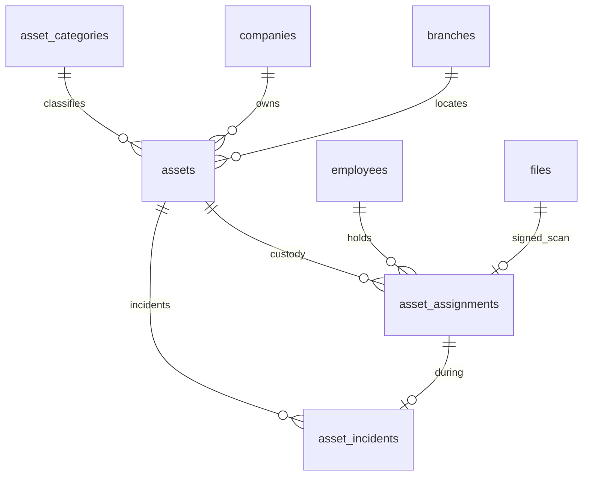
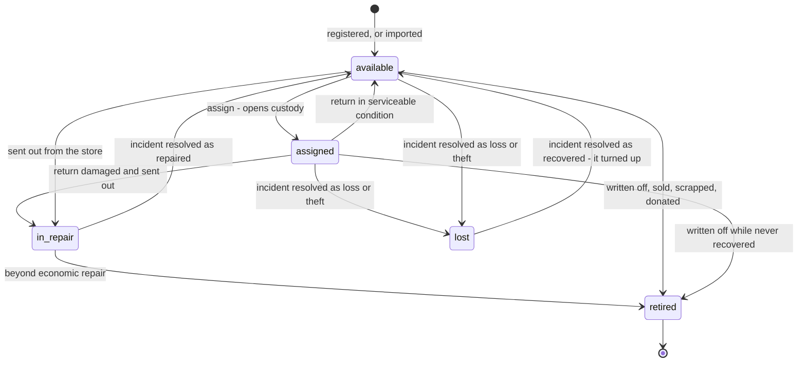
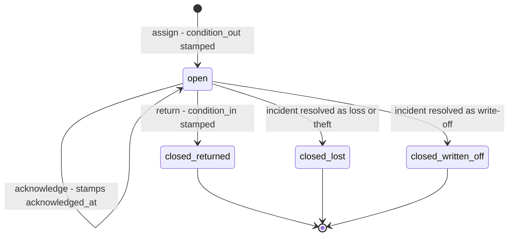
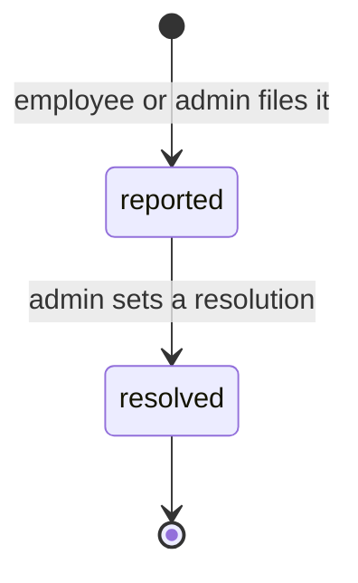
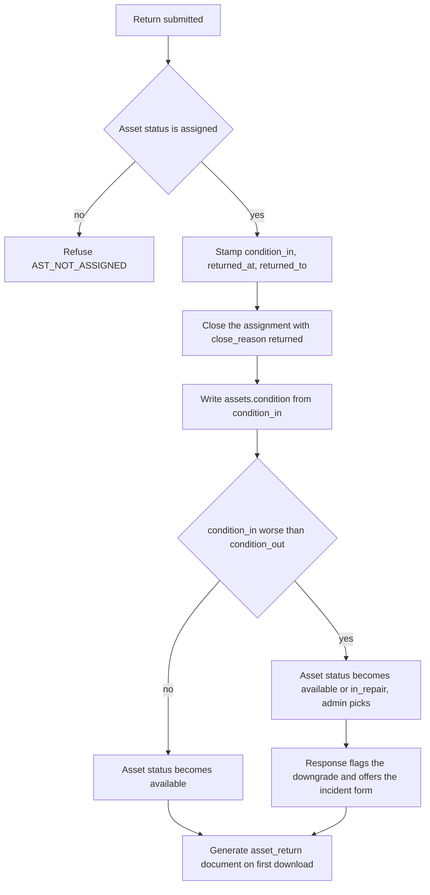
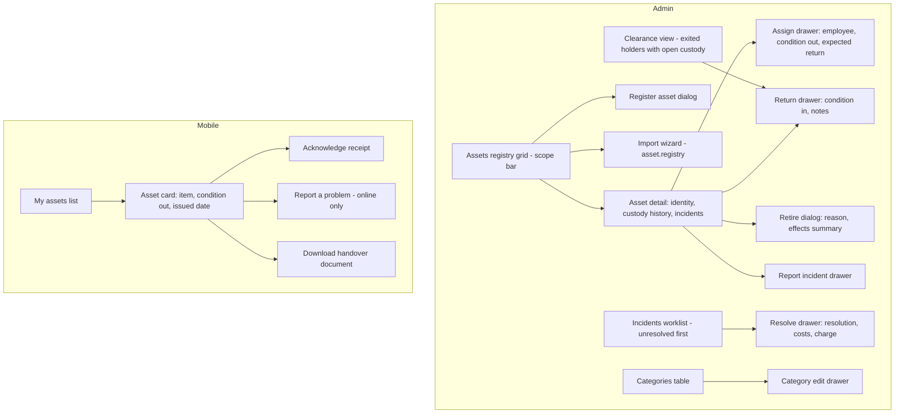

# Module: Asset

Status: Active (Phase 3) · Related ADRs: `ADR-0001` (module boundaries — **§6 amended this session**), `ADR-0002` (tenant scoping), `ADR-0003` (online-only mobile writes), `ADR-0006` (result pattern), `ADR-0007` (envelope), `ADR-0009` (handover objects), `ADR-0010` (jobs + outbox events), `ADR-0013` (Drizzle conventions), `ADR-0014` (handover PDF), `ADR-0015` (registry import) · Depends on: `docs/06-modules/holiday.md` (template), `docs/06-modules/employee.md` (identity, `employee_directory`, exit event), `docs/05-platform/document-storage.md`, `docs/05-platform/import-export.md`, `docs/05-platform/notification.md`, `docs/05-platform/audit-log.md` · Consumers: `docs/06-modules/reports.md`, `docs/06-modules/dashboard-analytics.md`

Namespace `asset` (naming §4, error prefix `AST`). The registry of physical company property, custody assignment and return with condition captured at both ends, generated and signed handover documents, and the loss/damage flow. Inherits all global standards; deviations only.

## 1. Purpose & Scope

Three things. **The item** — one row per physical object in `assets`, with its category, location, condition, and availability. **Custody** — `asset_assignments`, one row per episode of an employee holding an item, opened at handover and closed at return. **Incidents** — `asset_incidents`, the damage, loss, and theft flow, reportable by the person it happened to and resolved by an administrator.

**One row per physical object. There is no quantity column anywhere.** Fifty monitors are fifty rows, each with its own tag, its own custody history, and its own condition. Everything the module does attaches to a specific object: a handover is signed for an object, a return compares one object against how it went out, and a loss is a loss of *that* laptop. A stock model — quantity on hand, issue and consume movements, a balance row to serialize against — cannot answer the only question this module exists to answer, and consumables are never returned, never handed over, and never damaged. Bulk create and `asset.registry` import make the fifty rows one spreadsheet.

**The open assignment is the holder.** There is no `current_holder_employee_id` on the asset. Custody is the assignment row whose `returned_at` is null, and a partial unique index makes "an item cannot be in two hands" a database guarantee rather than an application convention. A denormalized pointer would store the same fact twice, give the second copy no owner, and require a reconciliation job that exists only because the column exists.

**This module records decisions about money. It never moves money.** An incident carries the repair cost, the amount charged, and who it was charged to, because those are facts about the decision. Recovering the amount is a payroll deduction an administrator enters by hand. There is no port, no event, and no line pushed into a run — see BR-AST-009 for why that is a correctness position and not a convenience.

**Nothing here goes through the approval engine.** No request type, no chain, no `approval_instance_id`. holiday, organization, shift, tax-pph21, and bpjs also run without chains, but every one of those is a configuration or computation surface; asset is the first module carrying **employee-facing transactional records** — custody episodes, incidents, and an ESS write path — that still has none. Assignment is not a decision — by the time it is recorded, the laptop is already in the person's hands, and a chain would make the record lag the physical fact. The control is the permission key and the audit diff.

**V1 exclusions:** **consumables and stock** — quantities, issue-and-consume movements, reorder points; a tenant that needs to count pens has an inventory system (A-048). **Non-employee holders** — no department, branch, or meeting-room custody; a handover needs a person who signs for it, can be exited, and can be notified (A-049). **Depreciation and accounting** — `purchase_cost` and `purchase_date` are reference fields, never book value; a depreciation schedule needs a method, a useful life, and journal entries, and no module in this product owns a general ledger (A-051). **Approval chains and asset requests** — an employee asking for a laptop is a procurement request whose fulfilment is a purchase this product does not model (A-050). **A payroll charge port** (A-052, BR-AST-009). **Maintenance vendors, repair invoices, and warranty claims** — `repair_cost` is a number, not an invoice. **Standalone condition inspections** with no assignment behind them. Also excluded: barcode and QR scanning, GPS or telematics tracking, software licence seats (a seat count is the stock model under another name), and asset reservations or bookings.

> ⚠️ VERIFY: confirm against current Indonesian regulation before implementation. — whether an employer may lawfully recover the cost of damaged or lost company property from an employee's wages at all, the ceiling on total wage deductions (*pemotongan upah*) as a share of monthly wages, and whether written employee consent or a clause in the *peraturan perusahaan* / PKB is a precondition. BR-AST-009 keeps every such recovery outside this module precisely because the answer constrains a decision payroll must make across all deduction sources at once, not one this module can make alone.

## 2. Actors & Permissions

| Action | Permission key | Data scope | Employee | Manager | HR Staff | HR Admin | System Administrator |
|---|---|---|---|---|---|---|---|
| View own assets, download own handover document | — (authenticated; mobile + web) | self | ✅ | ✅ | ✅ | ✅ | ✅ |
| Acknowledge receipt of an assigned asset | — (authenticated, own assignment) | self | ✅ | ✅ | ✅ | ✅ | ✅ |
| Report an incident on an asset held by self | — (authenticated, own assignment) | self | ✅ | ✅ | ✅ | ✅ | ✅ |
| Read the registry, assignments, and incidents | `asset.item.read` | company / tenant per assignment | — | — | ✅ | ✅ | ✅ |
| Register / edit an asset | `asset.item.create` / `asset.item.update` | company / tenant per assignment | — | — | ✅ | ✅ | ✅ |
| Assign and return | `asset.item.assign` | company / tenant per assignment | — | — | ✅ | ✅ | ✅ |
| Retire, write off, or delete an asset | `asset.item.delete` | company / tenant per assignment | — | — | — | ✅ | ✅ |
| Report an incident on behalf of an employee | `asset.incident.create` | company / tenant per assignment | — | — | ✅ | ✅ | ✅ |
| Resolve an incident and set the charged amount | `asset.incident.update` | company / tenant per assignment | — | — | — | ✅ | ✅ |
| Read / create / edit / archive categories | `asset.category.configure` (read implied) | company / tenant per assignment | — | — | — | ✅ | ✅ |
| Import the registry | `asset.item.import` (ImportDefinition `asset.registry`) | tenant | — | — | — | ✅ | ✅ |
| Export the registry and the custody ledger | `asset.item.export` | company / tenant per assignment | — | — | ✅ | ✅ | ✅ |

Ten keys, all actions from the reserved set (naming §5) — no new action words. Three of the splits are deliberate and each has a different reason:

- **`asset.item.delete` is separate from `asset.item.update`** because Q5's decision to run this module without approval chains makes the permission key the only second signature. Writing off a 40,000,000 IDR vehicle and correcting its serial number are not the same seat.
- **`asset.incident.create` is separate from `asset.incident.update`** for the same reason one step further along: a floor supervisor reports a cracked screen, and only the holder of `.update` decides whether the employee pays for it. Merging them hands the charge decision to everyone who can file a report.
- **`asset.item.assign` covers both directions.** A return is the same custody act read backwards and needs the same seat.

`asset.item.read` covers list and detail across all three resources including incidents — naming §5 splits `read` only when a module genuinely needs it, and nothing here does. **There is no MSS surface**: a manager sees no team asset view in V1, on the payroll precedent that a scope nobody asked for is a scope that has to be defended forever. Tenants that run a GA or Asset Administrator function create a custom role holding the `asset.*` keys (ADR-0005); this table names the built-in templates, not the only possible holders. Out-of-scope assets, assignments, incidents, and categories are 404 (existence hiding, `SYS_NOT_FOUND`).

## 3. Business Rules

| # | Rule |
|---|---|
| BR-AST-001 | **One row per physical object.** `assets` has no quantity, no on-hand balance, and no movement ledger. `asset_code` is the human-readable tag physically stickered on the item, unique per tenant among live rows, and **immutable after creation** — it is the natural key of the import and the thing a person reads off the object. |
| BR-AST-002 | **A category is light reference data, not policy.** `asset_categories` carries `requires_serial` and `handover_required` and nothing money-shaped. A tenant-wide row applies to every company; a `company_id` row applies to that company only (holiday.md BR-HOL-001 scoping, minus negation). Codes are unique per scope and immutable once any asset references them. |
| BR-AST-003 | **Serial numbers are required by category, unique when present.** A category with `requires_serial = true` refuses a create or an import row with no `serial_number` (`AST_SERIAL_REQUIRED`). Where present, the serial is unique per tenant among live rows — partial unique index. A single nullable column with no per-category rule is the failure this prevents: either a desk is forced to have a serial, or a laptop can enter the registry untracked and nothing objects. |
| BR-AST-004 | **The open assignment is the holder, and the status is the lock.** Custody is `asset_assignments` where `returned_at IS NULL`, enforced one item at a time by a partial unique index on `(tenant_id, asset_id)`. There is no holder column on the asset. The assign transaction updates the asset `WHERE status = 'available'` and inserts the row; the return transaction updates `WHERE status = 'assigned'` and closes it. `status` is therefore the serialization point for custody changes — a guarded transition on current state, never a read-then-write (expense BR-EXP-011 precedent) — and the unique index is the backstop that holds even if a future code path forgets. |
| BR-AST-005 | **Status is one axis; condition is a separate column.** `status ∈ available, assigned, in_repair, lost, retired` are mutually exclusive states of one physical object. `condition ∈ new, good, fair, poor, damaged` is what shape it is in. A damaged laptop still in someone's hands is `assigned` + `damaged`, not a fourth status: damage is not an availability state, and `in_repair` earns its slot only because the item has physically left custody. Two axes would permit `available + lost`, which every query would then have to defend against. |
| BR-AST-006 | **Condition is captured at both ends of custody.** `condition_out` is stamped when the assignment opens, `condition_in` when it closes. `assets.condition` carries the item's current value, written by whichever event happened last and set at registration for an item that has never been assigned. The question this shape answers — *was it already scratched when he got it* — cannot be answered from an audit-log diff without reconstructing a timestamp against an assignment interval, in a table no module may query as data. |
| BR-AST-007 | **A worse return prompts an incident; it never creates one silently.** When `condition_in` is worse than `condition_out`, the return response flags it and the UI opens the incident form pre-filled. An auto-created incident with no description, no date, and no photographs is a row that has to be cleaned up rather than a record of anything. The return itself always succeeds — refusing a return because an item came back damaged leaves the item nowhere. |
| BR-AST-008 | **Custody ends for three reasons, and the row says which.** `close_reason ∈ returned, lost, written_off`. Only `returned` carries a `condition_in`. A lost item's assignment closes because the employee no longer holds it, and recording that as a return would be a lie in the one record a dispute is read from. |
| BR-AST-009 | **Money is recorded, never moved.** An incident carries `repair_cost`, `charged_amount`, `charged_to_employee_id`, and `recovery_status ∈ none, pending, recovered, waived`. **No port, no event, no payroll line.** Three reasons, in order of weight. (1) BR-AST-013 removed every approval chain from this module, so a pushed deduction would let one holder of `asset.incident.update` reduce someone's take-home pay with no second signature and no recorded consent. (2) Statutory ceilings on wage deductions apply across *every* source at once — this charge, a cash advance, union dues, a court order — and this module can see exactly one of them, so a line it pushes can break a ceiling neither module notices (⚠️ VERIFY, §1). (3) Frequency: a ten-thousand-person tenant has perhaps a dozen chargeable incidents a year, which does not earn the pin-and-release apparatus expense needed for a claim payable exactly once. The recovery is a payroll deduction component an administrator enters, and `recovery_status` is this module's record that someone said they would. |
| BR-AST-010 | **Two handover artifacts, and neither gates anything.** The system **generates** `asset_handover` at assignment and `asset_return` at return — `PdfService` (ADR-0014), rendered in a worker, minted lazily on first download into `generated_document`, template version stamped, payroll's `payslip.generate` precedent exactly. The **signed scan** comes back up as an `asset_document` on the assignment row. The generated PDF is what the system asserts; the scan is what a human signed; neither substitutes for the other. `asset_categories.handover_required` decides whether the form is *offered*, never whether the act is permitted — an assignment with no document is recorded, not refused. |
| BR-AST-011 | **Acknowledgment is recorded and never blocking.** The holder taps once and `acknowledged_at` plus the acting user are stamped on the assignment. It gates nothing, expires nothing, and reverses nothing. It is the cheapest evidence in the module and the only answer to "he says he never got the laptop" that does not require finding a piece of paper. Idempotent: a second call returns the original timestamp. |
| BR-AST-012 | **An employee's exit flags custody; it never blocks it and never closes it.** On `employee.status.changed` to a terminal status, this module sends one `asset.clearance_pending` notification to the company's asset administrators. Open assignments stay open until someone physically takes the item back. Blocking is not merely undesirable, it is unimplementable: employee.md BR-EMP-006's side effects run inside the effectuation transaction, this module is not in it, and ADR-0010 events are asynchronous — there is no moment at which asset could answer before the status commits. Auto-closing is worse, because marking an unreturned laptop `returned` destroys the only record that it is missing. The residual cost is named in §9 and logged as A-053. |
| BR-AST-013 | **No approval chains.** No request type is registered in approval-engine §13, no `approval_instance_id` column exists, and no endpoint calls `ApprovalEnginePort`. Assignment records a physical fact that has already happened; retirement and incident resolution are administrative acts controlled by their own permission keys and by the channel-1 audit diff. |
| BR-AST-014 | **Retire and delete are different acts with the same key.** **Retirement** is terminal and always available: `status = 'retired'` with a mandatory `retired_reason` and `retired_at`; the row and its whole custody history survive forever. **Soft delete** is permitted only for an asset with no assignment history at all — the mis-typed row created five minutes ago (`AST_ITEM_IN_USE` otherwise). An item that a person once signed for is retired, never deleted. |
| BR-AST-015 | **A found item comes back.** `lost → available` is a legal transition, taken by resolving the incident as `recovered`. Requiring a new asset row would break the serial's uniqueness against the old one and orphan the custody history from the object it describes. |
| BR-AST-016 | **Location is not custody.** `assets.branch_id` is where the item lives and is NOT NULL — an unlocated asset is untraceable. It is not the holder, and it is not required to match the holder's branch: a laptop taken to Surabaya for three months is normal and raises nothing. |
| BR-AST-017 | **The registry import is create-only.** `ImportDefinition asset.registry`, `create_only`, `partial` commit, natural key `[asset_code]`. Tenant onboarding is four hundred laptops in a spreadsheet, and unlike a claim there is nothing in an asset row a spreadsheet cell cannot carry. Custody is **not** importable: an assignment asserts that a named person took possession on a date, and manufacturing that from a file is manufacturing the evidence the module exists to hold. |
| BR-AST-018 | **Audit and offline.** `asset_categories`, `assets`, `asset_assignments`, and `asset_incidents` are channel-1 audited with full diffs (audit-log §4.2, registered this session) — with no approval instance anywhere in the module, this trail is the *only* control on every act it performs. Mobile is read-cache plus two `SYNC_OFFLINE` writes (acknowledge, report incident): no queued class, no `op_id`, no conflict policy, no replay lane. |

## 4. Domain Model

### 4.1 Schema



```ts
// src/database/schema/asset.ts
export const assetStatus = pgEnum('asset_status', [
  'available', 'assigned', 'in_repair', 'lost', 'retired',      // BR-AST-005 — one axis
]);
export const assetCondition = pgEnum('asset_condition', ['new', 'good', 'fair', 'poor', 'damaged']);
export const assetCloseReason = pgEnum('asset_close_reason', ['returned', 'lost', 'written_off']);
export const assetIncidentType = pgEnum('asset_incident_type', ['damage', 'loss', 'theft']);
export const assetIncidentResolution = pgEnum('asset_incident_resolution', [
  'repaired', 'replaced', 'written_off', 'recovered', 'no_action',
]);
export const assetRecoveryStatus = pgEnum('asset_recovery_status', [
  'none', 'pending', 'recovered', 'waived',                     // BR-AST-009 — a record, not a transaction
]);

export const assetCategories = pgTable('asset_categories', {
  ...id, ...tenantId,
  companyId: uuid('company_id').references(() => companies.id),  // NULL = tenant-wide (BR-AST-002)
  code: text('code').notNull(),                                  // laptop, vehicle, sim_card, …
  name: text('name').notNull(),
  requiresSerial: boolean('requires_serial').notNull().default(false),   // BR-AST-003
  handoverRequired: boolean('handover_required').notNull().default(false), // BR-AST-010
  sortOrder: integer('sort_order').notNull().default(0),
  archivedAt: timestamp('archived_at', { withTimezone: true }),
  ...auditColumns, ...softDeleteColumns,
}, (t) => [
  uniqueIndex('uq_asset_categories_tenant_id_company_id_code')
    .on(t.tenantId, sql`COALESCE(company_id, '00000000-0000-0000-0000-000000000000')`, t.code)
    .where(sql`deleted_at IS NULL`),
  index('idx_asset_categories_tenant_id_company_id').on(t.tenantId, t.companyId),
]);

export const assets = pgTable('assets', {
  ...id, ...tenantId,
  companyId: uuid('company_id').notNull().references(() => companies.id),
  branchId: uuid('branch_id').notNull().references(() => branches.id),   // location, not custody (BR-AST-016)
  categoryId: uuid('category_id').notNull().references(() => assetCategories.id),
  assetCode: text('asset_code').notNull(),                       // the sticker; immutable (BR-AST-001)
  name: text('name').notNull(),
  serialNumber: text('serial_number'),                           // required by category (BR-AST-003)
  brand: text('brand'),
  model: text('model'),
  status: assetStatus('status').notNull().default('available'),  // the custody lock (BR-AST-004)
  condition: assetCondition('condition').notNull().default('good'),
  purchaseDate: date('purchase_date'),
  purchaseCost: numeric('purchase_cost', { precision: 15, scale: 2 }),   // reference only (A-051)
  warrantyUntil: date('warranty_until'),                         // reference only — no reminders
  retiredAt: timestamp('retired_at', { withTimezone: true }),
  retiredReason: text('retired_reason'),                         // mandatory when retired (BR-AST-014)
  notes: text('notes'),
  ...auditColumns, ...softDeleteColumns,
}, (t) => [
  uniqueIndex('uq_assets_tenant_id_asset_code')
    .on(t.tenantId, t.assetCode).where(sql`deleted_at IS NULL`),
  uniqueIndex('uq_assets_tenant_id_serial_number')               // BR-AST-003, only where present
    .on(t.tenantId, t.serialNumber).where(sql`serial_number IS NOT NULL AND deleted_at IS NULL`),
  index('idx_assets_tenant_id_company_id_status').on(t.tenantId, t.companyId, t.status),
  index('idx_assets_tenant_id_category_id').on(t.tenantId, t.categoryId),
  index('idx_assets_tenant_id_branch_id').on(t.tenantId, t.branchId),
]);

export const assetAssignments = pgTable('asset_assignments', {
  ...id, ...tenantId,
  assetId: uuid('asset_id').notNull().references(() => assets.id),
  employeeId: uuid('employee_id').notNull().references(() => employees.id),  // BR-AST-016 — never a place
  assignedAt: timestamp('assigned_at', { withTimezone: true }).notNull(),
  assignedBy: uuid('assigned_by').notNull().references(() => users.id),
  conditionOut: assetCondition('condition_out').notNull(),       // BR-AST-006
  expectedReturnDate: date('expected_return_date'),              // advisory; nothing enforces it
  acknowledgedAt: timestamp('acknowledged_at', { withTimezone: true }),      // BR-AST-011
  acknowledgedBy: uuid('acknowledged_by').references(() => users.id),
  returnedAt: timestamp('returned_at', { withTimezone: true }),  // NULL = live custody (BR-AST-004)
  returnedTo: uuid('returned_to').references(() => users.id),
  closeReason: assetCloseReason('close_reason'),                 // BR-AST-008
  conditionIn: assetCondition('condition_in'),                   // only on close_reason = returned
  signedHandoverFileId: uuid('signed_handover_file_id').references(() => files.id),
  signedReturnFileId: uuid('signed_return_file_id').references(() => files.id),
  notes: text('notes'),
  ...auditColumns,
}, (t) => [
  uniqueIndex('uq_asset_assignments_open_holder')                // BR-AST-004 — the invariant
    .on(t.tenantId, t.assetId).where(sql`returned_at IS NULL`),
  index('idx_asset_assignments_tenant_id_asset_id').on(t.tenantId, t.assetId),
  index('idx_asset_assignments_tenant_id_employee_id').on(t.tenantId, t.employeeId),
  index('idx_asset_assignments_open')                            // the clearance and custody views
    .on(t.tenantId, t.employeeId).where(sql`returned_at IS NULL`),
]);

export const assetIncidents = pgTable('asset_incidents', {
  ...id, ...tenantId,
  assetId: uuid('asset_id').notNull().references(() => assets.id),
  assignmentId: uuid('assignment_id').references(() => assetAssignments.id),  // NULL = not in custody
  type: assetIncidentType('type').notNull(),
  occurredOn: date('occurred_on').notNull(),
  reportedAt: timestamp('reported_at', { withTimezone: true }).notNull(),
  reportedBy: uuid('reported_by').notNull().references(() => users.id),
  description: text('description').notNull(),
  // resolution — the administrative half (BR-AST-009)
  resolution: assetIncidentResolution('resolution'),
  resolvedAt: timestamp('resolved_at', { withTimezone: true }),
  resolvedBy: uuid('resolved_by').references(() => users.id),
  resolutionNotes: text('resolution_notes'),
  repairCost: numeric('repair_cost', { precision: 15, scale: 2 }),
  chargedAmount: numeric('charged_amount', { precision: 15, scale: 2 }),
  chargedToEmployeeId: uuid('charged_to_employee_id').references(() => employees.id),
  recoveryStatus: assetRecoveryStatus('recovery_status').notNull().default('none'),
  recoveryNote: text('recovery_note'),                           // free text: how it was actually recovered
  ...auditColumns,
}, (t) => [
  index('idx_asset_incidents_tenant_id_asset_id').on(t.tenantId, t.assetId),
  index('idx_asset_incidents_open')                              // the resolution worklist
    .on(t.tenantId, t.reportedAt).where(sql`resolution IS NULL`),
  index('idx_asset_incidents_charged')                           // the recovery worklist
    .on(t.tenantId, t.chargedToEmployeeId).where(sql`recovery_status = 'pending'`),
]);
```

Incident photographs carry no column: they are parented through document-storage's own `entityType` / `entityId` (`asset_document`, entity `asset_incident`), which is the pattern the platform already provides for a *set* of files. The two signed scans are explicit columns because an assignment needs *the* handover scan and *the* return scan distinguishably — the same reasoning that put `receipt_file_id` on an expense line.

Hand-written in the generating migrations (database-conventions §10):

- `ck_assets_retired` — `(retired_at IS NULL) = (retired_reason IS NULL)` and `retired_at IS NULL OR status = 'retired'`. A retirement with no reason is an unexplained write-off (BR-AST-014).
- `ck_assets_purchase_cost` — `purchase_cost IS NULL OR purchase_cost >= 0`.
- `ck_asset_assignments_close` — `(returned_at IS NULL) = (close_reason IS NULL)`; and `condition_in IS NULL OR close_reason = 'returned'`. Custody either ended or it did not, and only a real return has an inbound condition (BR-AST-008).
- `ck_asset_incidents_resolution` — `(resolution IS NULL) = (resolved_at IS NULL)`; and `charged_amount IS NULL OR charged_to_employee_id IS NOT NULL`. A charge with no one charged is an amount nobody owes.
- `ck_asset_incidents_amounts` — `repair_cost IS NULL OR repair_cost >= 0` and `charged_amount IS NULL OR charged_amount >= 0`.
- `uq_asset_assignments_open_holder` names the **semantic** key rather than the column list, on the holiday.md `uq_holidays_scope_date_kind` precedent — the invariant is "one open holder", and the spelled-out form buries it.
- Standard RLS on all four tables. No `version` columns: every state change here is a guarded transition on the current status (BR-AST-004), which is strictly stronger than optimistic locking for this shape.







`asset_categories` has no lifecycle — it is present-or-archived reference data (holiday.md §4.1 template note). An incident's own lifecycle is deliberately two states: the investigation between them is a human activity with no system state to hold, and inventing `investigating` would create a value nothing ever transitions out of on its own.

### 4.2 Seeded categories

Provisioning seeds these tenant-wide, editable afterwards.

| Code | Name | `requires_serial` | `handover_required` |
|---|---|---|---|
| `laptop` | Laptop dan komputer | ✅ | ✅ |
| `phone` | Telepon dan tablet | ✅ | ✅ |
| `sim_card` | Kartu SIM dan nomor | ✅ (the number is the serial) | — |
| `vehicle` | Kendaraan | ✅ | ✅ |
| `access_card` | Kartu akses dan kunci | ✅ | — |
| `tool` | Peralatan kerja | — | ✅ |
| `furniture` | Furnitur dan perabot | — | — |
| `other` | Lainnya | — | — |

`handover_required` is seeded on the categories where a wet signature is the local norm — the *Berita Acara Serah Terima* a tenant's legal team asks for when a motorcycle is not returned. It offers the form; it never refuses the assignment (BR-AST-010).

### 4.3 Ports served

**None.** No module in V1 needs to ask this one a question. Payroll deliberately does not (BR-AST-009), reports reads asset tables through the reports.md registry as a designated read-model consumer (ADR-0001 §6) — **dashboard-analytics arrived 2026-08-04 reaching no table at all**, so §6's exception has exactly one exerciser, and nothing else touches custody. Stating the zero is cheaper than every future reader searching for the port that was never written; adding one when a consumer appears is additive.

### 4.4 Ports and reads consumed

| Port / read | Used for | Status |
|---|---|---|
| `DocumentStoragePort` | `asset_document` slot, commit, URL mint; ownership resolver registration | live |
| `PdfService` (ADR-0014) | `asset_handover` and `asset_return` rendering in the `exports` worker | live |
| `NotificationPort` | `asset.assigned`, `asset.clearance_pending` | live |
| **`employee_directory`** (read-model view) | holder name and number in every grid, the `q=` search, and the terminal-status join behind the clearance view — **published by employee.md §13 this session under the ADR-0001 §6 amendment** | live |

**No `OrgQueryPort`.** Placement adds nothing here: an asset carries its own `branch_id` as location, the holder's company comes from `employee_directory`, and department is not a filter this module offers. **No `ApprovalEnginePort`** (BR-AST-013). **No `PeriodLockPort`** — custody is not a dated payroll fact, and returning a laptop in a locked month changes no computed figure. **No `EmployeePayrollPort`**: it decrypts statutory identifiers and writes a sensitive-read audit row per batch, which is the correct behaviour for a payroll roster and completely wrong for painting a name into an asset grid.

### 4.5 Return, the interesting endpoint



Assignment is the simple direction: check `status = 'available'`, insert the row, stamp `condition_out`, notify the holder. Return is where the module earns its keep, because it is the only moment the system can compare the object against how it left — and the comparison is a prompt, never an automatic incident and never a refusal (BR-AST-007).

## 5. Use Cases

**UC-AST-001 — Register an asset.** Actor: HR Staff with `asset.item.create`. Precondition: at least one live category in scope. Main: code, name, category, company, branch, condition, and the optional purchase and warranty reference fields → serial requirement checked against the category (BR-AST-003) → row created `available`. Exception: duplicate `asset_code` or serial → `VAL_DUPLICATE`; missing serial on a category that requires one → `AST_SERIAL_REQUIRED`. Postcondition: the item is assignable.

**UC-AST-002 — Import the registry.** Actor: HR Admin with `asset.item.import`. Main: download the `asset.registry` template, upload, dry-run, commit — the import-export pipeline wholesale. Row validation is UC-AST-001's rule set plus in-file duplicate `asset_code` detection; `create_only` means an existing code is a row error, never a silent overwrite (A-019's reasoning). Postcondition: four hundred laptops, one spreadsheet, every row `available`.

**UC-AST-003 — Assign.** Actor: HR Staff with `asset.item.assign`. Main: pick the employee, confirm the outgoing condition, optionally set an expected return date → the transaction updates the asset `WHERE status = 'available'` and inserts the assignment → `asset.assigned` fires to the employee → the handover PDF is offered when the category asks for one. Exception: the asset already has an open assignment → `AST_ALREADY_ASSIGNED`, naming the current holder; the asset is `in_repair`, `lost`, or `retired` → `AST_NOT_ASSIGNABLE`. Postcondition: `status = 'assigned'`, exactly one open row.

**UC-AST-004 — Employee acknowledges.** Actor: the holder, mobile or web, online. Main: open *My assets*, tap acknowledge → `acknowledged_at` and the acting user stamped. Alternate: never acknowledged — nothing happens, no reminder, no escalation, no consequence (BR-AST-011). Idempotent.

**UC-AST-005 — Return.** Actor: HR Staff with `asset.item.assign`, following §4.5. Main: confirm the incoming condition, close the assignment, land the asset back at `available` or send it to `in_repair`. Alternate: the condition came back worse — the response flags it and the incident form opens pre-filled with the asset, the assignment, and the date. Alternate: attach the signed return scan afterwards. Exception: no open assignment → `AST_NOT_ASSIGNED`.

**UC-AST-006 — Report an incident.** Actor: the holder from mobile (online-only), or HR Staff with `asset.incident.create` on behalf. Main: type, date it happened, description, photographs through the document-storage slot flow → the incident is created unresolved and appears on the resolution worklist. This is the only place in the module where the employee is the one who knows the fact first — a phone stolen on a Sunday is reported by the person it was stolen from, not by an administrator on Monday. Postcondition: incident `reported`; the asset's status is unchanged until someone resolves it.

**UC-AST-007 — Resolve an incident.** Actor: HR Admin with `asset.incident.update`. Main: pick a resolution and let it drive the asset — `repaired` and `recovered` → `available`, `written_off` and `replaced` → `retired` with the reason, `no_action` → unchanged. Record `repair_cost`, and where the employee is being asked to bear part of it, `charged_amount`, `charged_to_employee_id`, and `recovery_status = 'pending'`. **Nothing is deducted from anybody's pay by this act** (BR-AST-009): the administrator then enters a payroll deduction component by hand and comes back to mark `recovered`. Alternate: `written_off` while the item is still in custody closes the assignment with `close_reason = 'written_off'`. Exception: already resolved → `AST_INCIDENT_ALREADY_RESOLVED`.

**UC-AST-008 — Retire an asset.** Actor: HR Admin with `asset.item.delete`. Main: reason and effective moment → `status = 'retired'`, `retired_at`, `retired_reason`; an open assignment closes with `close_reason = 'written_off'`. Terminal. Alternate: soft-delete a mis-typed row that has never been assigned. Exception: delete an asset with custody history → `AST_ITEM_IN_USE`, and the message names retirement as the path.

**UC-AST-009 — Exit clearance.** Actor: system, then a human. Main: `employee.status.changed` to a terminal status → one `asset.clearance_pending` notification to the company's asset administrators carrying the open assignments. The worklist itself is a live filter over open assignments joined to `employee_directory` on terminal status — no stamped column, no cron, no state to go stale. Alternate: the items come back through UC-AST-005 like any other return. Failure mode: nobody opens the notification, and §9 says so plainly.

**UC-AST-010 — Employee views own assets.** Actor: Employee, mobile or web. Main: `/me/assets` lists open assignments with the item, the outgoing condition, the date issued, the acknowledgment state, and the handover document download. Read from cache offline; the list is small and refreshes on foreground.

**UC-AST-011 — Export.** Actor: HR Staff with `asset.item.export`. Main: `asset.registry` for the inventory as of now, or `asset.assignment` for the custody ledger over a period. Neither carries a gated column set — nothing in this module is ADR-0016 encrypted and nothing is masked.

## 6. UI Flow



**Admin web (Next.js).** Assets → registry DataTable (code, name, category, status chip, condition chip, holder, branch, acquired) with the scope bar; filters for status, condition, category, branch, and holder, plus `q=` across code, name, serial, and holder name. Status and condition are **two chips, because they are two facts** — a `damaged` chip on an `assigned` row is the module's most useful single pixel, and collapsing them into one chip is exactly the two-axis mistake BR-AST-005 rejects. Asset detail is three stacked panels: identity, the custody timeline with both conditions per episode, and the incident list.

The **assign drawer** requires an outgoing condition before it will submit, because a handover with no recorded condition makes every future return unarguable. The **return drawer** shows the outgoing condition beside the incoming picker, in that order, so the comparison is on screen rather than in someone's memory; picking a worse value reveals an inline "This came back worse — record an incident?" panel with the incident form one click away, in the warning style, never the error style (design-system status vocabulary, never colour alone).

The **retire dialog** states its effect set before confirm — terminal status, any open custody closed as written off — in destructive-style copy, on the employee.md terminate-dialog precedent. The **clearance view** is a saved filter, not a separate page: open assignments whose holder is `resigned` or `terminated`, sorted oldest first, with the return action inline.

**Mobile (employee, Flutter).** *My assets* is a list of cards, one per open assignment, each showing the item, the condition it was issued in, the date, and either an "Acknowledge receipt" button or the timestamp it was acknowledged. Both writes render the standard "connection required" state offline (offline-sync §8 vocabulary), and the list itself serves from cache with the sync truth line. Empty state: "No company assets are assigned to you" — plain, and not an error, because most employees hold nothing.

Error surfaces follow the field → panel → toast order (coding-standards-nextjs): `AST_SERIAL_REQUIRED` lands on the serial field, `AST_ALREADY_ASSIGNED` and `AST_NOT_ASSIGNABLE` are panels naming the current holder or the blocking status, because no field caused them.

## 7. API

All endpoints follow the canonical spec-block form (api-standards §13). No new pagination-registry rows — admin grids are the seeded transactional-grid family (offset) and `/me/assets` is small enough to be unpaginated. Export endpoints ride import-export §7. Errors beyond the implied set only.

| Endpoint | Permission | Pagination | Queue-reachable | Idempotency |
|---|---|---|---|---|
| `GET /api/v1/asset-categories` | `asset.category.configure` | offset | no | — |
| `POST /api/v1/asset-categories` | `asset.category.configure` | — | no | — |
| `PATCH /api/v1/asset-categories/{id}` | `asset.category.configure` | — | no | — |
| `DELETE /api/v1/asset-categories/{id}` | `asset.category.configure` | — | no | — |
| `GET /api/v1/assets` | `asset.item.read` | offset | no | — |
| `GET /api/v1/assets/{id}` | `asset.item.read` | — | no | — |
| `POST /api/v1/assets` | `asset.item.create` | — | no | accepted |
| `PATCH /api/v1/assets/{id}` | `asset.item.update` | — | no | accepted |
| `DELETE /api/v1/assets/{id}` | `asset.item.delete` | — | no | — |
| `POST /api/v1/assets/{id}/retirement` | `asset.item.delete` | — | no | accepted |
| `POST /api/v1/assets/{id}/assign` | `asset.item.assign` | — | no | accepted |
| `POST /api/v1/assets/{id}/return` | `asset.item.assign` | — | no | accepted |
| `GET /api/v1/asset-assignments` | `asset.item.read` | offset | no | — |
| `PATCH /api/v1/asset-assignments/{id}` | `asset.item.assign` | — | no | accepted |
| `POST /api/v1/asset-assignments/{id}/acknowledge` | — (authenticated, own) | — | no (online-only) | accepted |
| `POST /api/v1/asset-assignments/{id}/export` | `asset.item.read` / own | — | no | accepted |
| `GET /api/v1/asset-incidents` | `asset.item.read` | offset | no | — |
| `POST /api/v1/asset-incidents` | — (own assignment) / `asset.incident.create` | — | no (online-only) | accepted |
| `PATCH /api/v1/asset-incidents/{id}/resolution` | `asset.incident.update` | — | no | accepted |
| `GET /api/v1/me/assets` | — (authenticated, self) | — (bounded) | no | — |

**No new URL verbs.** `assign`, `return`, `acknowledge`, and `export` are all in the naming §3 reserved set. Retirement and incident resolution use the **sub-resource shape** — `POST /{id}/retirement`, `PATCH /{id}/resolution` — rather than minting `retire` and `resolve`, on the precedent expense set with `payments` and payroll set before it. **No endpoint is queue-reachable**: the module has no offline write class (BR-AST-018), so nothing arrives from the sync drain.

#### POST /api/v1/assets · PATCH /{id}

| Field | Type | Required | Rule |
|---|---|---|---|
| `assetCode` | string | ✅ | 2–40, trimmed, unique per tenant, **immutable on PATCH** |
| `name` | string | ✅ | 2–120 |
| `categoryId` | uuid | ✅ | live, unarchived, in scope |
| `companyId` | uuid | ✅ | in the caller's assignment scope |
| `branchId` | uuid | ✅ | inside `companyId` (BR-AST-016) |
| `serialNumber` | string | conditional | required when the category says so; 1–100; unique per tenant where present |
| `brand` / `model` | string | — | ≤ 80 each |
| `condition` | enum | — | default `good`; free to set at registration |
| `purchaseDate` | date | — | not future |
| `purchaseCost` | decimal string | — | ≥ 0, ≤ 999,999,999,999.99 |
| `warrantyUntil` | date | — | reference only |
| `notes` | string | — | ≤ 1000 |

Response 201 / 200: the asset row with its category, resolved branch name, and current holder when one exists. Errors: `AST_SERIAL_REQUIRED` (`details: { categoryCode }`) · duplicate code or serial → `VAL_VALIDATION_FAILED` with `VAL_DUPLICATE` · unknown or out-of-scope category, company, or branch → `SYS_NOT_FOUND`. `PATCH` rejects `assetCode` and `status` as unknown fields (api-standards §3) — status moves only through the custody and retirement endpoints.

#### POST /api/v1/assets/{id}/assign
Request: `{ employeeId, conditionOut, assignedAt?, expectedReturnDate?, notes? }`. `assignedAt` defaults to now and may be backdated to record a handover that already happened; it may not be in the future. Runs BR-AST-004's guarded transition. Response 201: `{ assignment, asset }`. Errors: `AST_ALREADY_ASSIGNED` (`details: { assignmentId, employeeId, assignedAt }` — the message names the current holder) · `AST_NOT_ASSIGNABLE` (`details: { status }`) · unknown or out-of-scope employee → `SYS_NOT_FOUND` · terminal-status employee → `SYS_NOT_FOUND` is wrong here and it is `VAL_VALIDATION_FAILED`: the employee exists and is visible, the assignment is what is invalid.

#### POST /api/v1/assets/{id}/return
Request: `{ conditionIn, returnedAt?, sendToRepair?: boolean, notes? }`. Runs §4.5. Response 200: `{ assignment, asset, conditionDowngraded: boolean }` — the flag is what the UI opens the incident form on (BR-AST-007). `sendToRepair` lands the asset at `in_repair` instead of `available`; the module does not infer it from the condition, because "fair" on a two-year-old chair is not a repair order. Errors: `AST_NOT_ASSIGNED`.

#### POST /api/v1/assets/{id}/retirement
Request: `{ reason (5–500, required), retiredAt? }`. Sets `status = 'retired'`, stamps the reason, and closes any open assignment with `close_reason = 'written_off'`. Response 200: the asset. Terminal — there is no un-retire, and an item that comes back into service after being written off is a registry error corrected by an administrator, not a state transition. Errors: already `retired` → `VAL_VALIDATION_FAILED`.

#### DELETE /api/v1/assets/{id}
Soft delete, permitted only when the asset has **no** assignment rows at all (BR-AST-014). Response 200: `{ id }`. Errors: `AST_ITEM_IN_USE` (`details: { assignmentCount }`), whose message names retirement as the intended path.

#### GET /api/v1/assets · GET /{id}
Grid: `?companyId=` (required) `?status=&condition=&categoryId=&branchId=&employeeId=&unassigned=true&q=` + offset. Response 200: `data: [{ id, assetCode, name, category: { id, code, name }, serialNumber, status, condition, branch: { id, name }, holder: { employeeId, employeeNumber, fullName, assignedAt, acknowledgedAt } | null, purchaseDate, purchaseCost }]` + `meta` with the offset totals and per-status counts. `q=` searches `asset_code`, `name`, `serial_number`, and the holder's name and number — the last two through the `employee_directory` join, which is why a post-hoc enrichment port could not have served this endpoint (§4.4). Detail adds the full custody history with both conditions per episode, the incident list, and the document references.

#### GET /api/v1/asset-assignments · PATCH /{id}
Grid: `?companyId=` (required) `?assetId=&employeeId=&open=true&holderStatus=exited&from=&to=&q=` + offset. `holderStatus=exited` is the **clearance view** — open assignments whose holder is `resigned` or `terminated` (UC-AST-009), a live join rather than a stored flag. Response 200: `data: [{ id, asset: { id, assetCode, name, categoryCode }, employee: { id, employeeNumber, fullName, status }, assignedAt, conditionOut, acknowledgedAt, expectedReturnDate, returnedAt, closeReason, conditionIn }]` + offset meta.
`PATCH /{id}` accepts `signedHandoverFileId`, `signedReturnFileId`, and `notes` only — the custody facts are written by the assign and return endpoints and are not editable here. Errors: file not a committed `asset_document` → `SYS_NOT_FOUND`.

#### POST /api/v1/asset-assignments/{id}/acknowledge
No body. Stamps `acknowledged_at` and the acting user for the employee named on the assignment; anyone else → `SYS_NOT_FOUND` (existence hiding). Idempotent — a second call returns the same 200 with the original timestamp, because a receipt acknowledged twice is still one receipt (overtime.md's acknowledge precedent). Errors: the assignment is already closed → `VAL_VALIDATION_FAILED`.

#### POST /api/v1/asset-assignments/{id}/export
Request: `{ kind: 'handover' | 'return' }`. Enqueues `asset.handover-document` on the `exports` queue and returns `{ fileId, downloadUrl }` with the `generated_document` category's 120-second TTL (payroll's payslip `export` precedent). Generated once and served from storage thereafter (ADR-0014). `kind = 'return'` on an open assignment → `VAL_VALIDATION_FAILED`: there is no return to document yet. Readable by a holder of `asset.item.read` or by the assignment's own employee.

#### POST /api/v1/asset-incidents · PATCH /{id}/resolution
`POST`: `{ assetId, assignmentId?, type, occurredOn, description (10–2000) }`. `occurredOn` may not be in the future and may not precede the asset's creation. On the self path the caller must hold the open assignment named; on the `asset.incident.create` path any in-scope asset is permissible. Photographs are uploaded before or after through the document-storage slot flow with `entityType = 'asset_incident'`. Response 201: the incident. Errors: `SYS_NOT_FOUND` on an asset outside scope or an assignment the caller does not hold.
`PATCH /{id}/resolution`: `{ resolution, resolutionNotes?, repairCost?, chargedAmount?, chargedToEmployeeId?, recoveryStatus?, recoveryNote? }`. Applies UC-AST-007's status mapping in the same transaction. Response 200: `{ incident, asset }`. Errors: `AST_INCIDENT_ALREADY_RESOLVED` · `chargedAmount` without `chargedToEmployeeId` → `VAL_VALIDATION_FAILED`.

#### GET /api/v1/asset-categories · POST · PATCH · DELETE
`GET`: `?companyId=&includeArchived=` + offset. `POST` / `PATCH`: the §4.1 field set per §8; `code` is immutable once any asset references the category. `DELETE` archives (soft delete + `archived_at`) and is **never** blocked by existing assets — an archived category is unselectable for new items and every existing asset keeps its live `category_id` reference and renders the archived name. Errors: duplicate `(scope, code)` → `VAL_VALIDATION_FAILED` with `VAL_DUPLICATE`.

#### GET /api/v1/me/assets
Self-scoped by the authenticated identity. Response 200: `data: [{ assignmentId, asset: { assetCode, name, categoryCode, serialNumber }, assignedAt, conditionOut, expectedReturnDate, acknowledgedAt, hasHandoverDocument }]` — open assignments only, newest first, unpaginated by construction (api-standards §5.1's bounded-collection exemption: nobody holds a hundred company assets). Closed episodes are not returned; an employee's interest is in what they currently hold.

## 8. Validation Rules

| Field | Rule | Error code |
|---|---|---|
| `assetCode` | 2–40, trimmed, `^[A-Za-z0-9][A-Za-z0-9/_-]*$`, unique per tenant, immutable | `VAL_INVALID_FORMAT` / `VAL_DUPLICATE` |
| `name` | required, 2–120, trimmed | `VAL_REQUIRED` / `VAL_TOO_SHORT` / `VAL_TOO_LONG` |
| `serialNumber` | required when the category demands it; 1–100; unique per tenant where present | `AST_SERIAL_REQUIRED` / `VAL_DUPLICATE` |
| `categoryId` | live, unarchived, in scope | 404 (`SYS_NOT_FOUND`) |
| `companyId` / `branchId` | resolvable in caller scope; branch inside company | 404 (`SYS_NOT_FOUND`) |
| `condition` / `conditionOut` / `conditionIn` | enum; `conditionOut` required on assign, `conditionIn` on return | `VAL_INVALID_ENUM` / `VAL_REQUIRED` |
| `purchaseDate` / `assignedAt` / `returnedAt` / `occurredOn` | ISO; not in the future in the branch timezone | `VAL_INVALID_FORMAT` / `VAL_OUT_OF_RANGE` |
| `returnedAt` | not earlier than the assignment's `assignedAt` | `VAL_DATE_RANGE_INVALID` |
| `occurredOn` | not earlier than the asset's creation date | `VAL_OUT_OF_RANGE` |
| `purchaseCost` / `repairCost` / `chargedAmount` | decimal string, ≥ 0, ≤ 999,999,999,999.99, two decimals | `VAL_OUT_OF_RANGE` / `VAL_INVALID_FORMAT` |
| `chargedToEmployeeId` | required whenever `chargedAmount` is present | `VAL_VALIDATION_FAILED` (field entries) |
| `employeeId` (assign) | live employee, non-terminal status, inside the asset's company | `VAL_VALIDATION_FAILED` / 404 |
| `description` (incident) | required, 10–2000 | `VAL_REQUIRED` / `VAL_TOO_SHORT` / `VAL_TOO_LONG` |
| `reason` (retirement) | required, 5–500 | `VAL_REQUIRED` / `VAL_TOO_SHORT` |
| `code` (category) | 2–40, `^[a-z][a-z0-9_]*$`, unique per scope, immutable after first use | `VAL_INVALID_FORMAT` / `VAL_DUPLICATE` |
| `expectedReturnDate` | ISO; not earlier than `assignedAt`; purely advisory | `VAL_DATE_RANGE_INVALID` |
| `signedHandoverFileId` / `signedReturnFileId` | committed `asset_document`, parented to this assignment | 404 (`SYS_NOT_FOUND`) |

## 9. Edge Cases & Failure Modes

- **Two administrators assign the same laptop at the same instant:** the second transaction's guarded update finds no row at `status = 'available'` and returns `AST_ALREADY_ASSIGNED`; if a future code path skips the guard, `uq_asset_assignments_open_holder` rejects the insert outright. Two defences, one invariant, and the second one holds without anybody remembering it.
- **An unreturned asset when the holder has already left:** the assignment stays open forever until a human closes it. This is deliberate — the open row *is* the outstanding-item record — but it means the clearance view grows a tail of items nobody will ever recover, and the honest fix is retiring them with a reason (`written_off`), not deleting the history.
- **Nobody opens the `asset.clearance_pending` notification.** There is no second reminder and no cron (§12), so the clearance list can sit unread indefinitely. Named rather than hidden: the mitigation available today is the saved filter on the assets page, and a weekly digest is in §15.
- **Final settlement pays out while a 20,000,000 IDR laptop is still out.** Payroll cannot withhold, because BR-AST-009 gives this module no channel into a run and no way to see the deduction ceiling. The clearance notification fires at exit, which is the last moment anyone can act; after that, recovery is a conversation. > ⚠️ VERIFY: confirm against current Indonesian regulation before implementation. — whether an employer may lawfully withhold or delay any part of final settlement pay pending the return of company property, and under what documented process.
- **`recovery_status = 'recovered'` and no deduction ever ran.** Nothing verifies it. The field records that an administrator said the money came back, not that it did, and reconciling it against payroll is manual. This is the direct cost of BR-AST-009's decision and it belongs on the record next to the reasoning.
- **A damaged item still in someone's hands:** `assigned` + `condition = 'damaged'`, which is a legal and common state. The incident can be resolved as `repaired` without the item ever leaving custody, and the condition is updated by the resolution.
- **The same laptop broken twice by the same employee:** two incident rows, both permanent, both visible on the asset detail. A single mutable "damage note" on the asset would have overwritten the first one, which is exactly the record a second conversation needs.
- **A lost phone that turns up:** resolve the incident as `recovered` → `lost → available`. The serial's uniqueness and the whole custody history stay attached to the object, which a new asset row would have broken (BR-AST-015).
- **An asset assigned to an employee who then transfers to another company in the tenant:** employee.md BR-EMP-001 makes that a terminate-and-rehire, so the exit path fires and the item lands on the clearance list. The asset does not follow the person: it belongs to the company that owns it, and re-issuing it under the new employment is a return followed by an assignment.
- **A laptop physically in Surabaya while `branch_id` says Jakarta:** correct and expected. The branch is the item's home, not its GPS, and no rule compares it to the holder's placement (BR-AST-016).
- **A category archived while assets reference it:** archive succeeds, every asset keeps rendering the archived name, and no in-use error exists to raise. Unlike expense, nothing is pinned — the `category_id` FK stays live, which is why the row is soft-deleted rather than removed.
- **An asset whose category is later changed from one requiring a serial to one that does not:** the serial stays on the row and stays unique. Nothing strips data because a rule relaxed.
- **A handover PDF requested for an assignment created before the template existed:** the template version is stamped at render, not at assignment, so an old assignment renders under the current template. This is a deliberate divergence from the payslip, where the trace pins `payslip_template_version` because the numbers are statutory; a handover form is not a statutory artifact and the *signed scan* is the authoritative copy of what was agreed.
- **A signed scan uploaded and never attached:** it stays a staged file and the document-storage staging TTL reaps it. Committed scans on a deleted asset are cleaned by `cron.document.purge`, not by this module.
- **An incident reported against an asset the employee no longer holds:** permitted on the admin path with `assignment_id` pointing at the closed episode, refused on the self path. Damage discovered after a return is a real case; the person who no longer holds the item is not the one who should be filing it.
- **An employee reports a theft while offline:** the write is refused with the standard "connection required" state (`SYNC_OFFLINE`), not queued. Four hours' delay changes nothing about a theft, and queueing it would cost a sync class, a conflict policy, and a replay lane for an event that happens roughly once per employee per year.
- **A tenant with no categories configured:** registration is impossible and the UI says so with the shift.md wording — "No asset categories yet, ask your HR admin" — rather than presenting an empty picker. The seed makes this state unreachable for a normally provisioned tenant.
- **The `employee_directory` view and RLS:** the view is created `WITH (security_invoker = true)`. Without it, a Postgres view executes with the view *owner's* rights and silently bypasses the `employees` RLS policy, which would turn a convenience join into a cross-tenant read. Pinned by the leak-test matrix (§14) and stated in employee.md's declaration, because this is the failure mode that makes read-model views dangerous when they are added casually.

## 10. Offline Behavior

Deviations from the global standard (offline-sync §10 checklist):

- **Entities:** `asset_assignments` (the caller's open ones, joined with their asset) → Drift mirror `my_assets` — **read cache**, pull-only, replaced wholesale by `GET /me/assets`, TTL 60 minutes and refreshed on foreground. No delta-sync endpoint and no cursor: an employee holds a handful of items, so the snapshot read replaces the mirror machinery (leave.md and expense.md precedent).
- **Queueable ops: none.** This module has **no offline write class**, no `op_id` column, no conflict policy, and no replay lane.
- **Online-only writes:** `POST /asset-assignments/{id}/acknowledge` and `POST /asset-incidents` both render the standard "connection required" state (`SYNC_OFFLINE`, offline-sync §8 vocabulary), on employee.md's resignation precedent. Justified rather than assumed: both operations happen roughly once per employee per year, neither is time-critical, and the cost of queueing them is a whole sync class for two endpoints.
- **The handover PDF is never persisted by the device.** It downloads through the 120-second signed URL and is not cached, matching the payslip rule.
- **Admin surfaces are online-only.** The registry, custody, incident, and clearance views are admin-web; asset management is not a mobile workflow.
- **Local retention:** nothing here is pending-data protected, because nothing here is pending. The cache is disposable and a wipe loses no user intent.

## 11. Module Error Codes

Registered this session (error-catalog §25):

| Code | HTTP | Trigger |
|---|---|---|
| `AST_ALREADY_ASSIGNED` | 409 | Assign an asset that already has an open assignment — BR-AST-004 |
| `AST_NOT_ASSIGNABLE` | 409 | Assign an asset whose status is `in_repair`, `lost`, or `retired` — BR-AST-005 |
| `AST_NOT_ASSIGNED` | 409 | Return an asset with no open assignment — BR-AST-004 |
| `AST_SERIAL_REQUIRED` | 422 | Create or import an asset in a category with `requires_serial` and no serial number — BR-AST-003 |
| `AST_INCIDENT_ALREADY_RESOLVED` | 409 | Set a resolution on an incident that already carries one — BR-AST-009 |
| `AST_ITEM_IN_USE` | 409 | Soft-delete an asset that has assignment history — BR-AST-014, and the message names retirement |

`AST_ALREADY_ASSIGNED` and `AST_NOT_ASSIGNABLE` share an HTTP status and are deliberately **not** merged: the first means "someone else has it, get it back first" and the second means "it is in the repair shop." Same code would force the client to re-derive the cause from a message string, and the two have different next actions.

Four conditions deliberately take **no code.** A duplicate `asset_code` or serial is `VAL_DUPLICATE` — platform-owned per-field uniqueness already covers it, and a module code would split a branch clients already write. Archiving a category with live assets raises nothing, because nothing breaks. A worse `condition_in` on return is a **flag**, not a failure — giving it a code invites a client to branch on it as one, which is how BR-AST-007's prompt would quietly become a refusal. Every unknown or out-of-scope id is `SYS_NOT_FOUND` per error-catalog §2.

## 12. Background Jobs & Events

**No cron.** Stated with its own reasoning rather than by analogy, because expense's does not transfer: that module skipped its cron because `cron.approval.sla-scan` already nagged the same instances, and BR-AST-013 removed the engine from this module entirely. The real reason is simpler — **asset owns no state that changes with time.** An assignment does not age into another state, an item does not expire, a warranty date drives nothing, and nothing becomes due. A cron here would exist for the single purpose of resending a notification, which is a notification-frequency feature wearing a job's clothes (§15).

Jobs owned (`exports` queue, fixed queue set per ADR-0010 — no new queue):

| Job | Trigger | Behavior |
|---|---|---|
| `asset.handover-document` | `POST /asset-assignments/{id}/export` | Renders `asset_handover` or `asset_return` through `PdfService` (ADR-0014) into `generated_document`; generated once, served from storage on every later download. Natural jobId key `(assignmentId, kind)` makes a double click one render |

Event-handler jobs (`events` queue, idempotent):

| Handler | Trigger | Behavior |
|---|---|---|
| `on.employee.status.changed` | employee.md | Terminal status → send `asset.clearance_pending` to the company's asset administrators with the holder's open assignments. **Nothing is closed, nothing is blocked** (BR-AST-012). No open assignment → no notification. A redelivery re-sends nothing: the notification dedupe key is `(employeeId, statusEffectiveDate)` |

**Events emitted: none.** Nothing in V1 consumes one. Channel-1 audit already captures every diff-bearing mutation in all four tables, and an event published for no subscriber is scaffolding; adding one when reports or dashboard-analytics needs it is additive (expense.md precedent).

**Events consumed:** `employee.status.changed`.

## 13. Approval, Notification & Report Touchpoints

- **Approval: none.** No request type, no chain, no registry entry in approval-engine §13 (BR-AST-013). Five earlier Phase 3 modules also register nothing — holiday, organization, shift, tax-pph21, bpjs — but all five are configuration or computation surfaces, and this is the first module with employee-facing transactional records to make the same call. It is a decision rather than an omission: assignment records a physical fact that has already occurred, and retirement and incident resolution are administrative acts whose controls are `asset.item.delete` and `asset.incident.update` plus the audit diff. An asset *request* flow — an employee asking for a laptop — is procurement, whose fulfilment is a purchase this product does not model (§15, A-050).
- **Notification — 2 templates registered in notification §4.2 this session:** `asset.assigned` (in_app + push, **opt-out**, audience = the assigned employee, carrying the item, category, condition out, and whether an acknowledgment is awaited; source = the assign endpoint, direct send) and `asset.clearance_pending` (in_app, **mandatory**, audience = holders of `asset.item.read` in the company as a role audience, carrying the employee and the list of open assignments; source = `on.employee.status.changed`). The second is mandatory because it fires exactly once, at the last moment anyone can act, and an opt-out on it is an opt-out on ever hearing about company property walking out the door.
- **Import/Export — 1 ImportDefinition and 2 ExportDefinitions, registered in import-export §4.3 this session:** `asset.registry` (import — `create_only`, `partial` commit, naturalKey `[asset_code]`, template v1: `asset_code`, `name`, `category_code`, `company_code`, `branch_code`, `serial_number`, `brand`, `model`, `condition`, `purchase_date`, `purchase_cost`, `warranty_until`, `notes`; rowHandler = this module's registration port, permission `asset.item.import`). `asset.registry` (export — the inventory as of now: code, name, category, serial, brand, model, status, condition, branch, current holder number and name, assigned since, acquired, cost, warranty; params `companyId`, optional `branchId`/`categoryId`/`status`; permission `asset.item.export`). `asset.assignment` (export — the custody ledger: asset code and name, employee number and name, assigned at, condition out, acknowledged at, returned at, close reason, condition in, notes; params `companyId`, `from`, `to`, optional `employeeId`/`open`; permission `asset.item.export`). **Neither export has a gated column set** — nothing in this module is ADR-0016 encrypted and nothing is masked, so unlike the payroll, tax, BPJS, and expense exports there is no audited-mint path to define. **Custody is deliberately not importable** (BR-AST-017): an assignment asserts that a named person took possession on a date, and a spreadsheet path to that manufactures the evidence the module exists to hold.
- **Settings: no keys.** Nothing here is a tenant-tunable number. The two policy-shaped fields, `requires_serial` and `handover_required`, are **per-category columns** and a settings key cannot express a per-row value (BR-EXP-001's reasoning, applied in the other direction). There is deliberately no `asset.clearance_reminder_days`, because §12 has no cron to consume it.
- **Document storage — the `asset_document` category's forward blanks filled in document-storage §4.2 this session:** write = the assignment and incident endpoints' own gates (`asset.item.assign`, `asset.incident.create`, or the reporting employee for their own held asset); read = `asset.item.read`, or the employee named on the assignment the file is parented to; ownership resolver = this module's, resolving both `asset_assignment` and `asset_incident` entities; client-deletable ✅ (a mis-uploaded scan is replaced, and no downstream state depends on it); no expiry reminders. **Not a registered sensitive read** — a signed handover form and a photograph of a cracked screen carry no health, identity, or financial data, so the expense `receipt` treatment would be trail noise. The generated PDFs land in `generated_document` under the existing registry row (ADR-0014).
- **Audit:** `asset_categories`, `assets`, `asset_assignments`, and `asset_incidents` → audit-log §4.2 (BR-AST-018). All four, with no exclusions, because this module has no approval instance anywhere in it — the diff trail is the only control on every act, which is the `attendance_corrections` reasoning applied to a whole module rather than one path.
- **Reports:** inventory by category, status, and branch; assets per employee; custody aging and items held past their expected return date; unreturned assets by exited employee; incident volume by type and category; loss and damage value with recovery status; acknowledgment coverage — via the reports.md registry.
- **Ports served:** none (§4.3). **Ports and reads consumed:** §4.4, including the `employee_directory` view under the ADR-0001 §6 amendment made this session.

## 14. Test Scenarios

| Scenario | Covers |
|---|---|
| **Double-assignment proof:** two concurrent assigns of one asset → exactly one succeeds, the other returns `AST_ALREADY_ASSIGNED`; with the status guard removed in a test harness, `uq_asset_assignments_open_holder` still rejects the second insert | BR-AST-004, §9 |
| Custody round trip: assign, acknowledge, return → one closed row carrying both conditions, both actors, both timestamps, and `close_reason = 'returned'`; the asset lands `available` | BR-AST-004, BR-AST-006, BR-AST-008 |
| Serial rule: create in a `requires_serial` category with no serial → `AST_SERIAL_REQUIRED`; without the flag → accepted; a duplicate serial → `VAL_DUPLICATE`; two assets with null serials → both accepted | BR-AST-003 |
| Status guards: assign an `in_repair`, a `lost`, and a `retired` asset → `AST_NOT_ASSIGNABLE` each; return an unassigned one → `AST_NOT_ASSIGNED` | BR-AST-005 |
| Condition downgrade: return worse than issued → `conditionDowngraded: true`, the return **succeeds**, and no incident row is created until one is filed | BR-AST-007 |
| Incident resolutions drive status: `repaired` → available, `recovered` on a lost item → available, `written_off` → retired with any open custody closed as `written_off`, `replaced` → retired, `no_action` → unchanged | BR-AST-015, UC-AST-007 |
| Money is recorded only: resolve with `chargedAmount` → the incident carries it, `recovery_status = 'pending'`, **no payroll row exists anywhere**, and no port was called | BR-AST-009 |
| Charge integrity: `chargedAmount` with no `chargedToEmployeeId` → rejected by DTO and by `ck_asset_incidents_resolution` | BR-AST-009 |
| Exit: terminate an employee holding two assets → one `asset.clearance_pending` naming both, the assignments stay **open**, the termination is not delayed, and the clearance filter returns them | BR-AST-012, UC-AST-009 |
| Exit with nothing held → no notification at all | BR-AST-012 |
| Retire vs delete: delete an asset with custody history → `AST_ITEM_IN_USE`; retire it → terminal with the reason and the history intact; delete a never-assigned row → soft-deleted | BR-AST-014 |
| Handover documents: generate at assignment, generate at return, request `kind = 'return'` on an open assignment → rejected; a second download serves the stored artifact rather than re-rendering | BR-AST-010, ADR-0014 |
| Signed scan: upload, attach to the assignment, replace it; an `asset_document` parented to another assignment → `SYS_NOT_FOUND` | BR-AST-010 |
| Acknowledgment: acknowledge twice → one timestamp, both calls 200; acknowledge someone else's assignment → `SYS_NOT_FOUND`; acknowledge a closed one → rejected | BR-AST-011 |
| Category archive: archive with live assets → succeeds, assets render the archived name, no in-use error exists to raise; a new asset cannot select it | BR-AST-002, §9 |
| Import: golden fixture with a valid set, an in-file duplicate code, an existing code, a missing serial on a serial-required category, and an unknown branch code → exact per-row verdicts, `create_only` never overwrites | BR-AST-017, UC-AST-002 |
| Audit: create, assign, return, resolve, retire → channel-1 diffs on all four tables with the acting user on each | BR-AST-018 |
| Offline: `/me/assets` serves from cache; acknowledge and incident report offline → `SYNC_OFFLINE` with the connection-required state, nothing queued, nothing lost on app kill | §10, BR-AST-018 |
| **`employee_directory` isolation:** the view is `security_invoker`; a tenant-A session joining it returns zero tenant-B rows, and the same query with the flag removed is proven to leak — the regression that pins why the flag is mandatory | ADR-0001 §6, §9 |
| Leak-test matrix L1–L7 on all four tables plus the registry grid, the clearance filter, `/me/assets`, the export mints, and the document mints (multi-tenancy §5) | security duty |

## 15. Future Improvements

Asset requests from employees — a procurement-shaped flow that would finally justify an approval chain here, and the natural place to reuse `asset.item.assign` as its terminal effect (A-050). A payroll charge port mirroring `ExpenseQueryPort`, once payroll owns a **cross-source deduction ceiling** that can see this charge alongside advances, union dues, and court orders — that ceiling, not the port, is the missing piece (A-052, BR-AST-009). A weekly clearance digest for outstanding items after exit, which is the one cron this module might legitimately grow and the named cost of A-053 (§12). Barcode and QR labels with a mobile scan-to-assign flow, which turns a stock-take from a spreadsheet into a walk. Periodic stock-take campaigns: a scheduled count, a scan list, and a variance report. Maintenance schedules and repair vendor records with invoices, which is where `repair_cost` grows into an entity. Depreciation and book value with a method, a useful life, and an accounting export, if a general ledger integration ever lands (A-051). Non-employee custody for pool and location-held items, once a handover has a signatory that is not a person (A-049). Consumables and stock with issue-and-consume movements, deliberately as a *separate* concern rather than a quantity column on `assets` (A-048). Software licence and seat management, which is the same stock model with renewal dates. Asset reservations and booking for shared equipment. Insurance policy references per item, and a claim path off the incident. Bulk assign for onboarding cohorts, where fifteen new joiners each receive the same three-item kit.
