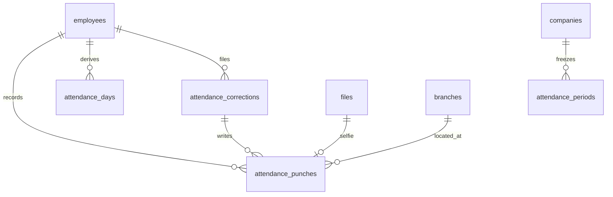
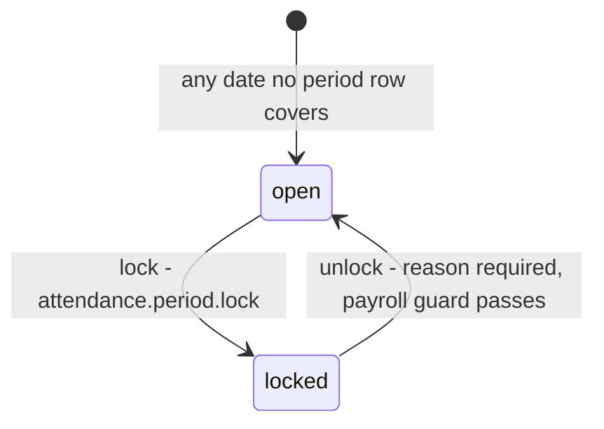
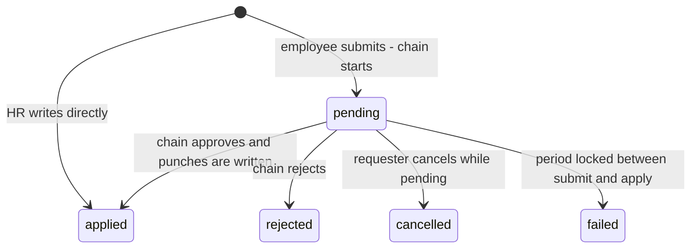
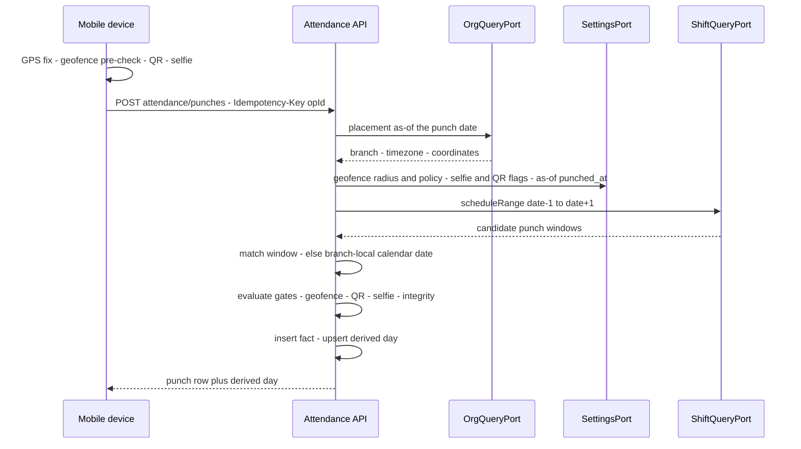
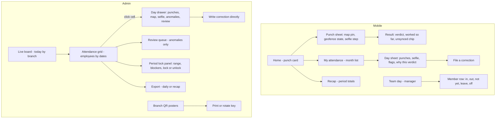

# Module: Attendance

Status: Active (Phase 3) · Related ADRs: `ADR-0001` (port-only cross-module reads), `ADR-0002` (tenant scoping), `ADR-0003` (append-only fact sync class), `ADR-0007` (idempotent punch ingestion), `ADR-0008` (correction chain), `ADR-0009` (punch selfie storage), `ADR-0010` (jobs + outbox events), `ADR-0012` (payroll snapshot inputs), `ADR-0015` (exports) · Depends on: `docs/06-modules/holiday.md` (template), `docs/06-modules/shift.md` (`ShiftQueryPort` — schedule, punch windows), `docs/06-modules/organization.md` (branch coordinates, timezone, placement port), `docs/06-modules/employee.md` (status), `docs/05-platform/document-storage.md` (`punch_selfie`), `docs/05-platform/approval-engine.md`, `docs/05-platform/settings.md`, `docs/05-platform/import-export.md` · Consumers: payroll.md (period summary + the lock), overtime.md (actual worked evidence), leave.md (absence interplay), reports.md, dashboard-analytics.md

Namespace `attendance` (naming §4, error prefix `ATT`). Punch facts, the derived attendance day, the anti-fraud signals attached to both, correction requests, and the **period lock** every other time-touching module already forward-references. Inherits all global standards; deviations only.

## 1. Purpose & Scope

Three layers, in order of authority. **Facts** — punches, append-only, never edited, never deleted. **Derivation** — one `attendance_days` row per employee per date, recomputed freely while its period is open, pinning the schedule it was judged against. **The lock** — the act that freezes derivation so payroll can compute against a stable input.

**Period ownership (grilled 2026-08-02): this module owns the period and its lock.** The "payroll period port" that `holiday.md` BR-HOL-008, `shift.md` BR-SHF-009, and `organization.md` BR-ORG-008 forward-referenced resolves here as `PeriodLockPort` — those three documents were repointed this session, and the stub that always answered "open" is gone. Payroll consumes the port rather than owning it: the module that owns the frozen data owns the freezing.

**Derivation model (grilled 2026-08-02): materialized, not resolved on read.** A punch upserts its day immediately; a close job writes the days nobody punched on. This is the deliberate opposite of shift.md's resolve-on-read choice, and for the opposite reason — a schedule is configuration that should always reflect current truth, while attendance is evidence that must not silently change under a payroll run (BR-SHF-010 states the same contract from the other side).

**Evidence rule (grilled 2026-08-02): a fact that happened is never discarded.** Policy gates refuse punches *online*, where the employee is standing there and can walk closer, retake, or rescan. A punch that arrives from the offline queue is always stored — flagged, quarantined, or routed to review, but stored (BR-ATT-005).

**V1 exclusions:** shared-device kiosk (spec §5.7 — post-GA; the punch model is device-agnostic so nothing here precludes it), fingerprint/biometric machine integration, bulk punch import (§15), break punching and multiple in/out pairs per day (shift.md §15 fixes one shift per day), auto clock-out, day fractions and half-day attendance, overtime *eligibility* (this module measures minutes; overtime.md decides what is payable), work-from-home and business-trip as first-class entities (the flag policy and the punch's recorded location cover V1), rotating or screen-rendered QR codes, Play Integrity / App Attest (D10 post-GA), face recognition and liveness detection, polygon geofences, and push-based real-time for the live board.

> ⚠️ VERIFY: confirm against current Indonesian regulation before implementation. — (a) the statutory retention floor for working-time records feeding payroll (D4 assumes ≥ 10 years for payroll/tax; time records are inputs to it, not obviously the same class), and (b) the lawful basis and retention ceiling for punch selfies as personal data under UU PDP 27/2022 — the 12-month default in `attendance.selfie_retention_months` (A-008) is an operational estimate, not a regulatory figure (security-standards §9 carries the same open item).

## 2. Actors & Permissions

| Action | Permission key | Data scope | Employee | Manager | HR Staff | HR Admin | System Administrator |
|---|---|---|---|---|---|---|---|
| Clock in / clock out | — (authenticated; mobile) | self | ✅ | ✅ | ✅ | ✅ | ✅ |
| View own attendance history, recap, own selfies | — (authenticated; mobile + web) | self | ✅ | ✅ | ✅ | ✅ | ✅ |
| Submit / cancel own attendance correction | — (authenticated) | self | ✅ | ✅ | ✅ | ✅ | ✅ |
| View team attendance + live board for own reports | — (authenticated; manager-derived) | team (org port) | — | ✅ | ✅ | ✅ | ✅ |
| Read any employee's punches, days, selfies | `attendance.record.read` | company / tenant per assignment | — | — | ✅ | ✅ | ✅ |
| Resolve anomalies, mark a day reviewed | `attendance.record.update` | company / tenant per assignment | — | — | ✅ | ✅ | ✅ |
| Write a correction directly, no chain | `attendance.correction.create` | company / tenant per assignment | — | — | ✅ | ✅ | ✅ |
| Lock / unlock a period | `attendance.period.lock` | company / tenant per assignment | — | — | — | ✅ | ✅ |
| Export punches / recap | `attendance.record.export` | company / tenant per assignment | — | — | ✅ | ✅ | ✅ |
| Mint or rotate a branch QR poster | `attendance.qr.configure` | company / tenant per assignment | — | — | — | ✅ | ✅ |

Actions come from the reserved set (naming §5) — no new action words. **document-storage §4.2's open duty is discharged here:** the `punch_selfie` category binds read to `attendance.record.read` with this module's ownership resolver (self = own punches, no key required); its write side is the punch endpoint alone, which mints a slot only for the caller's own punch. Approving a correction is not a permission key — assignees are resolved by the chain (ADR-0008). Out-of-scope employees are 404 (existence hiding).

## 3. Business Rules

| # | Rule |
|---|---|
| BR-ATT-001 | A **punch is an append-only fact**: employee, `punched_at` (device event time, UTC), `received_at` (server arrival), type `in`/`out`, source, device, coordinates, evaluated flags, and the selfie reference. Rows are never updated except to set the void marker of BR-ATT-016, and are never deleted — no soft-delete column exists, because "this punch never happened" is not a statement this module lets anyone make. |
| BR-ATT-002 | **Attribution:** a punch belongs to the working day whose **punch window** contains `punched_at` (`ShiftQueryPort.scheduleRange` over date ± 1; shift.md BR-SHF-005 — the working day of a cross-midnight shift is its start date). Windows cannot overlap for one employee (shift.md BR-SHF-006 enforces it at write), so matching is deterministic and needs no tie-break. No window contains it → `punch_date` is the branch-local calendar date and the day derives as unscheduled work. |
| BR-ATT-003 | **Pairing: first `in`, last `out` of the day.** Extra punches are stored, shown in the day detail, and ignored by derivation — break punching is a shift.md §15 exclusion, so a mid-day pair is noise, not a second session. An `out` with no `in` is accepted and derives `incomplete` with an `orphan_punch` anomaly; refusing it would destroy the only evidence the person was there. |
| BR-ATT-004 | **Duplicate window:** a punch of the same type for the same employee within **60 seconds** of an existing one returns that existing punch as a replay success rather than inserting a second row. This deliberately narrows ADR-0003's "server may reject duplicates" to a no-op success — the fact is already recorded, so a failure outcome would be a lie to the drain loop. `op_id` replay (ADR-0007) covers the exact-retry case; this covers double-taps and re-queues under a fresh id. |
| BR-ATT-005 | **Gate rule (grilled 2026-08-02).** Policy gates — geofence under `strict`, missing selfie, invalid QR — **refuse an online punch** (`422`, immediately recoverable: walk closer, retake, rescan) and **never discard a queued one**. A queued punch failing a gate is stored with `quarantined = true`: it exists, it is visible to the employee and HR, it is excluded from derivation until an HR act clears it, and its owner is told (§13). One rule, three gates, no exceptions. |
| BR-ATT-006 | **Geofence:** distance is computed from the punch coordinates to the branch centre (`branches.latitude`/`longitude`, organization.md) against `attendance.geofence_radius_m`, resolved at branch scope. `attendance.geofence_policy = flag` (default) records the punch with `outside_geofence = true` and a **mandatory typed reason**, and flags the day for review; `strict` applies BR-ATT-005. A branch without coordinates is not evaluated at all (no flag, no rejection) — the missing-coordinate warning belongs to the branch page, not to the employee at the gate. GPS accuracy is stored and a fix worse than the radius is flagged rather than trusted. |
| BR-ATT-007 | **QR (spec §5.7 tenant option):** when `attendance.qr_required` is on for the scope, the punch must carry a branch token — `base64(branchId · keyVersion · HMAC-SHA256(platform key, branchId ‖ keyVersion))`, printed as a poster at the entrance. Rotation is a bump of `attendance.qr_key_version` (branch scope) plus a reprint; only the current version verifies. QR is **additive to geofence, never a substitute** — the token proves which door, the GPS proves you were at it. Honest limit, documented in the admin UI: a photographed poster plus a spoofed fix defeats this; a rotating code needs the entrance screen that spec §5.7 pushed to post-GA. |
| BR-ATT-008 | **Selfie:** `attendance.selfie_required` (default `true`, D10 makes it configurable) requires a committed `punch_selfie` file on the punch. Offline the file rides the queue ahead of the punch op (document-storage §10 drain order — slot → PUT → confirm → punch); the local file is queue-protected until both land (ADR-0003). After retention purge the punch keeps `selfie_sha256` and the file metadata, so the evidence chain survives the image (ADR-0009). |
| BR-ATT-009 | **Integrity signals are recorded, not trusted:** `mock_location`, an `integrity_signals` jsonb (rooted/jailbroken, emulator, developer mode), the registered `device_id`, and **clock drift** = `received_at − punched_at`. Mock location and drift beyond ±5 minutes raise anomalies automatically. Documented limits: mock-location detection is an Android API with no iOS equivalent (iOS spoofing shows only as jailbreak signals), every signal is client-reported and defeatable, and hardened attestation is post-GA (D10). |
| BR-ATT-010 | **The derived day is a snapshot.** Each `attendance_days` row pins the schedule it was judged against — shift id and code, resolved start/end instants, paid minutes, both tolerances, branch and timezone, holiday name — so a later roster or definition edit cannot retroactively change what a stored verdict *meant*. This is the record shift.md BR-SHF-010 defers to; payroll reads it and never re-resolves. |
| BR-ATT-011 | **Derivation** (`kind` from `ShiftQueryPort`, leave from `LeaveQueryPort`): leave covers the date → `on_leave`. Else on a work day: no punches → `absent`; one usable punch → `incomplete`; a pair → `present`. Else on a non-work day: no punches → `off`; any punch → `off_worked`. `late_minutes` and `early_leave_minutes` are stored **raw** (`firstIn − scheduledStart`, `scheduledEnd − lastOut`, floored at 0) with the shift's tolerances pinned beside them — the verdict "late" is `late_minutes > late_tolerance_minutes`, computed by whoever asks. Storing raw keeps discipline policy, payroll policy, and reporting policy from fighting over one number. |
| BR-ATT-012 | **Day close** (`cron.attendance.close-days`, hourly): for each branch, in branch-local time, a date is closable once the latest punch window that started on it has been shut for **2 hours** (A-022). Closing resolves every active employee's schedule in batch and writes the rows nobody punched into — `absent`, `on_leave`, or `incomplete`. Days with no work obligation and no punch get **no row**: the schedule already answers them, and materializing 20 empty rows per employee per month buys nothing. |
| BR-ATT-013 | **Recompute while open, never once locked.** A new punch, an applied correction, `shift.roster.changed`, `shift.definition.changed`, `holiday.calendar.changed`, `organization.assignment.changed`, `organization.branch.updated`, or a leave decision recomputes the affected **unlocked** days from current inputs. A locked day is immutable; every upstream write that could have touched one is already rejected at its source through `PeriodLockPort`, so the only survivor is the late-arriving punch of BR-ATT-015. |
| BR-ATT-014 | **Period lock.** `attendance_periods` is a company-scoped **date range**, not a calendar month — payroll cut-offs are not month-aligned (`payroll.cutoff_day`), and keying the freeze to months would freeze the wrong dates. Ranges may not overlap per company (gist exclusion); a date no row covers is **open**, so periods are created by the act of locking and there is no generation job. Unlock requires a typed reason, is audited, and is refused while payroll holds a non-draft run over the range (`ATT_PERIOD_IN_USE`, via `PayrollRunGuardPort` — the forward contract payroll.md fulfils, the mirror image of what this module just fulfilled for three others). |
| BR-ATT-015 | **Late arrival (grilled 2026-08-02):** a punch whose day is already closed is stored unconditionally. Period open → the day recomputes and the change is audited like any other. Period locked → the punch is stored with `late_arrival = true`, the frozen day is **not** touched, and it surfaces in the review queue; correcting the pay consequence is payroll's retro path, not a silent rewrite of an input somebody already paid against. There is no staleness ceiling — a phone dark for three weeks still delivers its punches. |
| BR-ATT-016 | **Corrections write punches.** An approved correction inserts rows with `source = 'correction'` and stamps `voided_by_correction_id` on any punch it supersedes; the day then recomputes through the **same** derivation path as a live punch. Nothing is edited, nothing is deleted, and there is exactly one code path to test. One date per request; one pending request per `(employee, date)` (`ATT_CORRECTION_PENDING`). Employee-filed requests run the `attendance.correction` chain; a holder of `attendance.correction.create` writes directly, recorded as an applied correction with no instance. Validity is re-checked at apply — a period locked mid-chain fails the request rather than writing into frozen data. |
| BR-ATT-017 | **Audit and retention.** `attendance_punches`, `attendance_corrections`, and `attendance_periods` are channel-1 audited with full diffs (audit-log §4.2, registered this session); minting a selfie URL is a registered sensitive read (§4.3). `attendance_days` is **deliberately excluded**: it is derived, it churns on every recompute, and every input that produces it is already audited — auditing it would bury the trail it is supposed to support. Punches and days are retained on the payroll horizon (D4, VERIFY §1); selfies purge at `attendance.selfie_retention_months` under document-storage's cron, leaving the hash. |
| BR-ATT-018 | **Mobile** holds 90 days of local history (spec §5.7), pending rows exempt from every cleanup path. A punch is an **append-only fact** op keyed by `op_id`; a correction is a **request aggregate**. Between the punch and its server round-trip the app shows a **provisional** day state computed locally from local punches plus shift's mirrored `ScheduledDay` — labelled as unsynced, replaced wholesale by the server row on the next pull. The device never decides late/absent for the record. |

## 4. Domain Model

### 4.1 Schema



```ts
// src/database/schema/attendance.ts
export const attendancePunchType = pgEnum('attendance_punch_type', ['in', 'out']);
export const attendancePunchSource = pgEnum('attendance_punch_source', ['mobile', 'web', 'correction']);
export const attendanceDayStatus = pgEnum('attendance_day_status', [
  'present', 'incomplete', 'absent', 'on_leave', 'off', 'off_worked',
]);
export const attendancePeriodStatus = pgEnum('attendance_period_status', ['open', 'locked']);
export const attendanceCorrectionStatus = pgEnum('attendance_correction_status', [
  'pending', 'applied', 'rejected', 'cancelled', 'failed',
]);

export const attendancePunches = pgTable('attendance_punches', {
  ...id, ...tenantId,
  companyId: uuid('company_id').notNull().references(() => companies.id),
  employeeId: uuid('employee_id').notNull().references(() => employees.id),
  punchDate: date('punch_date').notNull(),                        // attributed working day (BR-ATT-002)
  type: attendancePunchType('type').notNull(),
  punchedAt: timestamp('punched_at', { withTimezone: true }).notNull(),   // device event time
  receivedAt: timestamp('received_at', { withTimezone: true }).notNull().defaultNow(),
  source: attendancePunchSource('source').notNull().default('mobile'),
  branchId: uuid('branch_id').references(() => branches.id),      // placement as-of punchDate, pinned
  deviceId: uuid('device_id').references(() => devices.id),
  latitude: numeric('latitude', { precision: 9, scale: 6 }),
  longitude: numeric('longitude', { precision: 9, scale: 6 }),
  accuracyMeters: integer('accuracy_meters'),
  distanceMeters: integer('distance_meters'),                     // to branch centre; NULL = not evaluated
  outsideGeofence: boolean('outside_geofence').notNull().default(false),
  geofenceReason: text('geofence_reason'),                        // required when outsideGeofence under `flag`
  qrVerified: boolean('qr_verified'),                             // NULL = QR not required for the scope
  mockLocation: boolean('mock_location').notNull().default(false),
  integritySignals: jsonb('integrity_signals'),                   // BR-ATT-009, client-reported
  selfieFileId: uuid('selfie_file_id').references(() => files.id),
  selfieSha256: text('selfie_sha256'),                            // survives retention purge (ADR-0009)
  quarantined: boolean('quarantined').notNull().default(false),   // gate failure on a queued punch (BR-ATT-005)
  lateArrival: boolean('late_arrival').notNull().default(false),  // arrived after its day was locked (BR-ATT-015)
  correctionId: uuid('correction_id')
    .references(() => attendanceCorrections.id),                  // set when source = 'correction'
  voidedByCorrectionId: uuid('voided_by_correction_id')
    .references(() => attendanceCorrections.id),                  // superseded, never deleted (BR-ATT-016)
  note: text('note'),
  opId: text('op_id'),                                            // offline idempotency (offline-sync §5)
  ...auditColumns,                                                // no soft delete: facts are permanent (BR-ATT-001)
}, (t) => [
  uniqueIndex('uq_attendance_punches_tenant_id_op_id')
    .on(t.tenantId, t.opId).where(sql`op_id IS NOT NULL`),
  index('idx_attendance_punches_tenant_id_employee_id_punch_date')
    .on(t.tenantId, t.employeeId, t.punchDate),
  index('idx_attendance_punches_tenant_id_company_id_punch_date')
    .on(t.tenantId, t.companyId, t.punchDate),                    // live board, exports
  index('idx_attendance_punches_tenant_id_employee_id_punched_at')
    .on(t.tenantId, t.employeeId, t.punchedAt),                   // window matching, duplicate check
]);

export const attendanceDays = pgTable('attendance_days', {
  ...id, ...tenantId,
  companyId: uuid('company_id').notNull().references(() => companies.id),
  employeeId: uuid('employee_id').notNull().references(() => employees.id),
  date: date('date').notNull(),
  status: attendanceDayStatus('status').notNull(),
  // pinned schedule snapshot — BR-ATT-010
  shiftId: uuid('shift_id').references(() => shifts.id),
  shiftCode: text('shift_code'),
  scheduleSource: text('schedule_source'),                        // explicit | pattern | default | none
  scheduledStartAt: timestamp('scheduled_start_at', { withTimezone: true }),
  scheduledEndAt: timestamp('scheduled_end_at', { withTimezone: true }),
  scheduledPaidMinutes: integer('scheduled_paid_minutes'),
  scheduledBreakMinutes: integer('scheduled_break_minutes'),
  lateToleranceMinutes: integer('late_tolerance_minutes'),
  earlyLeaveToleranceMinutes: integer('early_leave_tolerance_minutes'),
  holidayName: text('holiday_name'),
  branchId: uuid('branch_id').references(() => branches.id),
  branchTimezone: text('branch_timezone'),
  // measured facts — BR-ATT-011
  firstInPunchId: uuid('first_in_punch_id').references(() => attendancePunches.id),
  lastOutPunchId: uuid('last_out_punch_id').references(() => attendancePunches.id),
  firstInAt: timestamp('first_in_at', { withTimezone: true }),
  lastOutAt: timestamp('last_out_at', { withTimezone: true }),
  punchCount: integer('punch_count').notNull().default(0),
  workedMinutes: integer('worked_minutes').notNull().default(0),
  lateMinutes: integer('late_minutes').notNull().default(0),
  earlyLeaveMinutes: integer('early_leave_minutes').notNull().default(0),
  overtimeCandidateMinutes: integer('overtime_candidate_minutes').notNull().default(0),
  leaveRequestId: uuid('leave_request_id').references(() => leaveRequests.id),
  anomalies: jsonb('anomalies').notNull().default(sql`'[]'::jsonb`),   // [{ code, detail }]
  reviewedAt: timestamp('reviewed_at', { withTimezone: true }),
  reviewedBy: uuid('reviewed_by').references(() => users.id),
  reviewNote: text('review_note'),
  computedAt: timestamp('computed_at', { withTimezone: true }).notNull(),
  lockedAt: timestamp('locked_at', { withTimezone: true }),       // stamped by the lock act (BR-ATT-014)
  ...auditColumns,
}, (t) => [
  uniqueIndex('uq_attendance_days_tenant_id_employee_id_date').on(t.tenantId, t.employeeId, t.date),
  index('idx_attendance_days_tenant_id_company_id_date').on(t.tenantId, t.companyId, t.date),
  index('idx_attendance_days_review').on(t.tenantId, t.companyId, t.date)
    .where(sql`anomalies <> '[]'::jsonb AND reviewed_at IS NULL`),
]);

export const attendanceCorrections = pgTable('attendance_corrections', {
  ...id, ...tenantId,
  companyId: uuid('company_id').notNull().references(() => companies.id),
  employeeId: uuid('employee_id').notNull().references(() => employees.id),
  date: date('date').notNull(),
  requestedInAt: timestamp('requested_in_at', { withTimezone: true }),
  requestedOutAt: timestamp('requested_out_at', { withTimezone: true }),
  reason: text('reason').notNull(),
  attachmentFileId: uuid('attachment_file_id').references(() => files.id),
  approvalInstanceId: uuid('approval_instance_id')
    .references(() => approvalInstances.id),                      // NULL = HR direct (BR-ATT-016)
  status: attendanceCorrectionStatus('status').notNull().default('pending'),
  appliedAt: timestamp('applied_at', { withTimezone: true }),
  failureCode: text('failure_code'),                              // set when status = 'failed'
  opId: text('op_id'),
  ...auditColumns,
}, (t) => [
  uniqueIndex('uq_attendance_corrections_tenant_id_op_id')
    .on(t.tenantId, t.opId).where(sql`op_id IS NOT NULL`),
  uniqueIndex('uq_attendance_corrections_pending')
    .on(t.tenantId, t.employeeId, t.date).where(sql`status = 'pending'`),
  index('idx_attendance_corrections_tenant_id_company_id_status')
    .on(t.tenantId, t.companyId, t.status),
]);

export const attendancePeriods = pgTable('attendance_periods', {
  ...id, ...tenantId,
  companyId: uuid('company_id').notNull().references(() => companies.id),
  label: text('label').notNull(),                                 // '2026-10', '2026-10-26/11-25'
  periodStart: date('period_start').notNull(),
  periodEnd: date('period_end').notNull(),                        // inclusive
  status: attendancePeriodStatus('status').notNull().default('locked'),
  lockedAt: timestamp('locked_at', { withTimezone: true }),
  lockedBy: uuid('locked_by').references(() => users.id),
  unlockedAt: timestamp('unlocked_at', { withTimezone: true }),
  unlockedBy: uuid('unlocked_by').references(() => users.id),
  unlockReason: text('unlock_reason'),
  ...auditColumns,
}, (t) => [
  index('idx_attendance_periods_tenant_id_company_id_period_start')
    .on(t.tenantId, t.companyId, t.periodStart),
]);
```

Hand-written in the generating migration (database-conventions §10):

- `ck_attendance_periods_range` — `period_end >= period_start`.
- `excl_attendance_periods_no_overlap` — gist exclusion on `(tenant_id WITH =, company_id WITH =, daterange(period_start, period_end, '[]') WITH &&)` (BR-ATT-014).
- **No CHECK on the geofence reason.** "Outside the fence ⇒ a reason is present" holds only under `flag`, and the policy is a settings lookup that varies by scope and by date — a constraint would have to read settings, which a constraint cannot do. Enforced in the API layer instead (§8), and recorded here so the absence reads as a decision rather than an omission.
- FK `attendance_punches.correction_id` / `voided_by_correction_id` → `attendance_corrections(id)`, added after both tables exist (circular declaration order, database-conventions §7 pattern).
- `attendance_days.leave_request_id` FK was deferred to leave.md's migration (holiday.md `branch_id` precedent) and **added there on 2026-08-02** as `fk_attendance_days_leave_requests`.

No `version` columns: punches are append-only, days are server-derived, and a correction is create-then-immutable on the client (ADR-0003 request aggregate). Standard RLS on all four tables.





`attendance_punches` has no lifecycle — a fact is not a state machine, and `voided_by_correction_id` is a property of the row, not a transition. `attendance_days.status` is a **computed verdict**, not a lifecycle either: no actor moves a day from `absent` to `present`, they add a fact and the verdict is recomputed. Template note honored (holiday §4.1).

### 4.2 Ports served

```ts
export const PERIOD_LOCK_PORT = Symbol('PERIOD_LOCK_PORT');

export interface PeriodLockPort {
  /** A date no period row covers is open. Consumers: holiday, shift, organization, leave, overtime, payroll. */
  isLocked(companyId: string, date: string): Promise<boolean>;
  /** First locked date in a set — one query for range-affecting writes. */
  firstLockedDate(companyId: string, dates: string[]):
    Promise<{ date: string; periodId: string; label: string } | null>;
}

export const ATTENDANCE_QUERY_PORT = Symbol('ATTENDANCE_QUERY_PORT');

export type AttendanceDaySnapshot = {
  date: string;
  status: 'present' | 'incomplete' | 'absent' | 'on_leave' | 'off' | 'off_worked';
  workedMinutes: number; lateMinutes: number; earlyLeaveMinutes: number;
  overtimeCandidateMinutes: number;
  shift?: { id: string; code: string; startAt: string; endAt: string; paidMinutes: number;
            lateToleranceMinutes: number; earlyLeaveToleranceMinutes: number };
  firstInAt?: string; lastOutAt?: string;
  anomalies: string[]; locked: boolean;
};

export type AttendancePeriodSummary = {
  employeeId: string; from: string; to: string;
  scheduledDays: number; presentDays: number; absentDays: number; leaveDays: number;
  incompleteDays: number; offWorkedDays: number;
  workedMinutes: number; lateMinutes: number; lateOccurrences: number;
  earlyLeaveMinutes: number; overtimeCandidateMinutes: number;
  unresolvedAnomalies: number; quarantinedPunches: number;
};

export interface AttendanceQueryPort {
  dayFor(employeeId: string, date: string): Promise<AttendanceDaySnapshot | null>;
  daysFor(employeeId: string, from: string, to: string): Promise<AttendanceDaySnapshot[]>;
  /** Payroll's snapshot input (ADR-0012) — batched, one query. */
  summaryFor(employeeIds: string[], from: string, to: string): Promise<Map<string, AttendancePeriodSummary>>;
}
```

`summaryFor` is what a payroll run snapshots; `unresolvedAnomalies` and `quarantinedPunches` are carried deliberately so a run can warn before it computes against unreviewed data rather than discovering it in a payslip.

### 4.3 Ports consumed

| Port | Use | Status |
|---|---|---|
| `ShiftQueryPort.scheduleRange` / `scheduleForMany` | window matching and the pinned snapshot (shift.md §4.2) | live |
| `OrgQueryPort.placement` | branch, timezone, coordinates as-of the punch date | live |
| `SettingsPort.resolve` | the six `attendance.*` keys, branch scope, as-of the date (BR-SET-004) | live |
| `DocumentStoragePort` | selfie slot, commit, URL mint | live |
| `ApprovalEnginePort` | `attendance.correction` instances | live |
| `LeaveQueryPort.coverageFor` | approved leave covering a date, answered from the request's pinned `covered_dates` (leave.md §4.3) | live (2026-08-02 — the empty stub is retired) |
| `PayrollRunGuardPort.runsOver` | non-draft runs blocking an unlock | **live 2026-08-02** — payroll.md §4.3 serves it; the stub is retired. `closed` runs are included in the result deliberately: a period a closed run priced can never be reopened, because payroll's numbers are permanent and every later fact routes through retro |
| **`employee_directory`** (read-model view) | `fullName` and `employeeNumber` on the §7 grid, live board, and team views, and the `q=` search over them | **live 2026-08-03** — published by employee.md §13 under the ADR-0001 §6 amendment. Declared retroactively: these three endpoints already returned the columns with no sanctioned channel (`OrgQueryPort` carries IDs only), and a filter on a name must run before the page boundary, which no query port can do |

The holiday verdict arrives **through** `ScheduledDay.holiday` rather than a second `HolidayQueryPort` call: shift.md already applies suppression once, and asking twice invites two answers. holiday.md UC-HOL-001 is annotated accordingly this session.

### 4.4 Derivation arithmetic

| Quantity | Formula |
|---|---|
| `lateMinutes` | `max(0, firstInAt − scheduledStartAt)` in minutes — raw, tolerance not subtracted (BR-ATT-011) |
| `earlyLeaveMinutes` | `max(0, scheduledEndAt − lastOutAt)` |
| `workedMinutes` | scheduled day: `max(0, lastOutAt − firstInAt − scheduledBreakMinutes)`; `off_worked`: `max(0, lastOutAt − firstInAt)` — an unscheduled day has no scheduled break to deduct |
| `overtimeCandidateMinutes` | scheduled day: `max(0, lastOutAt − scheduledEndAt)`; `off_worked`: `workedMinutes` |
| verdict `late` | `lateMinutes > lateToleranceMinutes` (both on the row) |
| `clockDriftSeconds` | `receivedAt − punchedAt` — anomaly beyond ±300 s (BR-ATT-009) |

Worked example, branch `Asia/Jakarta`, Night shift 22:00–06:00 (shift.md §4.3), roster date 2026-09-14, break 30, tolerance 15:

| Event | Instant | Effect |
|---|---|---|
| Clock in | 2026-09-14 22:07 WIB = 15:07 UTC | inside window `14:00 → 00:00+1` → `punch_date = 2026-09-14`; `lateMinutes = 7`, under tolerance → not late |
| Clock out | 2026-09-15 06:41 WIB = 23:41 UTC | same window → same `punch_date`; `earlyLeaveMinutes = 0`; `workedMinutes = 514 − 30 = 484`; `overtimeCandidateMinutes = 41` |
| Verdict | — | `present`, worked 8h04m, 41 minutes offered to overtime.md — which decides whether any of it is payable |

## 5. Use Cases

**UC-ATT-001 — Clock in (mobile, online).** Bloc pipeline with cancellation (mobile-flutter §5, the sanctioned non-Cubit case): GPS fix → local geofence pre-check → QR scan if required → selfie capture and upload → `POST /attendance/punches` with `Idempotency-Key = opId`. Server: resolve placement, resolve the six settings at branch scope, match the window (BR-ATT-002), evaluate gates (BR-ATT-005), insert, recompute the day, respond with the punch **and** the derived day so the screen updates without a second round trip.

**UC-ATT-002 — Clock out.** Same pipeline; the button state comes from `GET /me/attendance/today`, never from local guesswork alone. Pairing per BR-ATT-003; the response carries worked minutes so the employee sees the day as the system will judge it.

**UC-ATT-003 — Offline punch and drain.** The punch is written to Drift and queued as an append-only fact; the selfie file is queued ahead of it (document-storage §10). The card shows the unsynced chip and a provisional verdict (BR-ATT-018). On drain the server re-evaluates everything against the *policy at punch time* — settings are read as-of `punched_at`, not as-of arrival (BR-SET-004), so a policy changed while the phone was dark does not retroactively condemn the punch. Gate failure → quarantine + notify (BR-ATT-005); day closed → BR-ATT-015.

**UC-ATT-004 — Close the day.** `cron.attendance.close-days` (hourly, `maintenance`, per-tenant fan-out per ADR-0010): per branch, in local time, find closable dates (BR-ATT-012), batch-resolve schedules and leave coverage, and write the missing rows. Idempotent by `(employee, date)` upsert — re-running the hour is a no-op.

**UC-ATT-005 — Upstream change recompute.** Handler jobs on the `events` queue take the affected `(employee, date)` set, drop the locked dates, and recompute the rest from current inputs, re-pinning the snapshot. A recompute that changes a status writes the audit trail of its *inputs*, not of the day row (BR-ATT-017).

**UC-ATT-006 — Employee reviews own attendance.** Mobile: month list from the 90-day local mirror, day sheet with punches, map pin, selfie thumbnail, flags, and the reason each verdict came out as it did. Recap tab shows the current period's totals from `/me/attendance/summary`. A day with an anomaly says so in plain language with the correction CTA attached.

**UC-ATT-007 — Manager's day.** `GET /me/team/attendance?date=` — direct reports with each one's live state: in, out, not yet, on leave, off. Read-only; managers do not correct attendance in V1, they approve corrections through the chain.

**UC-ATT-008 — HR works the review queue.** `GET /attendance/days?needsReview=true` over a period: out-of-fence punches with their typed reasons and distances, mock-location hits, orphan punches, quarantined punches, late arrivals, drift outliers. Each row resolves by clearing it (`PATCH …/review`), by writing a direct correction, or by releasing a quarantined punch — all three audited, none of them silent.

**UC-ATT-009 — Employee files a correction.** `POST /attendance-corrections` with date, desired in/out, reason, optional attachment → `attendance.correction` chain (ADR-0008) → on approval the apply step re-checks the lock, writes correction punches, voids what they supersede, recomputes, emits `attendance.correction.applied`. Requester sees the outcome through `approval.instance_decided`.

**UC-ATT-010 — HR corrects directly.** Same endpoint with `attendance.correction.create`: no instance, `status = applied` in one transaction, full audit. Requiring a manager to approve HR's own fix is theatre; the audit row is the control.

**UC-ATT-011 — Lock and unlock a period.** Lock: pick a company and a date range (default = the calendar month, editable for cut-off tenants), the confirm dialog states unresolved anomalies, quarantined punches, and open corrections in range — locking over them is allowed but never accidental. The act creates or flips the period row, stamps `locked_at` on every day in range, emits `attendance.period.locked`. Unlock: typed reason, `PayrollRunGuardPort` check, audited, emits the mirror event.

**UC-ATT-012 — Export.** `attendance.daily` (punch-level) and `attendance.recap` (per-employee period totals) through the import-export pipeline; column sets freeze at enqueue from the requester's permissions (BR-IMP-010).



## 6. UI Flow



- **Scope bar** (design-system §12): company + the **attendance period** with the lock badge — this module is what makes that badge mean something. A locked period renders the grid read-only with the lock tooltip; corrections and edits are hidden, not offered and then refused.
- Status chips map to design-system §2.3: `present` → positive, `late`/`incomplete` → pending, `absent` → negative, `on_leave` → info, `off`/`off_worked` → draft/neutral with the worked-hours label. Never colour alone — every chip carries icon + text, and a late day reads "Present · 12m late", not a red dot.
- **Anomaly chips are always resolvable from where they appear**: out-of-fence shows distance and the typed reason inline; mock-location shows the platform caveat; quarantined shows "not counted yet" with the release action.
- Punch sheet states: acquiring GPS (with a skip-to-manual-reason path under `flag`), accuracy poor, outside the fence (reason field mandatory, primary button relabels "Clock in anyway"), QR required, camera denied, offline (button stays enabled — offline punching is the point).
- The mobile day sheet answers *why*: "Off — Idul Fitri", "Absent — scheduled 08:00–17:00, no punches", "Not scheduled". Empty states: no punches yet today → the punch button is the screen; no schedule → "No schedule set yet, ask your HR admin" (shift.md wording, one voice).
- Live board is explicitly **not** real-time: it refreshes every 60 s and stamps "as of HH:mm" — a stale board that admits it beats a live-looking one that lies (design-system §11 microcopy rule).

## 7. API

All endpoints follow the canonical spec-block form (api-standards §13). No new pagination-registry rows: admin grids here are the seeded transactional-grid family (offset) and mobile history is the seeded self-service family (cursor). Export endpoints ride import-export §7. Errors beyond the implied set only.

| Endpoint | Permission | Pagination | Queue-reachable | Idempotency |
|---|---|---|---|---|
| `POST /api/v1/attendance/punches` | — (authenticated, self) | — | **yes** | **required** |
| `GET /api/v1/attendance/punches` | `attendance.record.read` | offset | no | — |
| `POST /api/v1/attendance/punches/{id}/release` | `attendance.record.update` | — | no | — |
| `GET /api/v1/me/attendance/today` | — (authenticated, self) | — | no | — |
| `GET /api/v1/me/attendance` | — (authenticated, self) | cursor | no | — |
| `GET /api/v1/me/attendance/summary` | — (authenticated, self) | — | no | — |
| `GET /api/v1/me/team/attendance` | — (authenticated; manager-derived) | — (one date) | no | — |
| `GET /api/v1/attendance/days` | `attendance.record.read` | offset (by employee) | no | — |
| `GET /api/v1/attendance/days/{id}` | `attendance.record.read` | — | no | — |
| `PATCH /api/v1/attendance/days/{id}/review` | `attendance.record.update` | — | no | — |
| `GET /api/v1/attendance/live` | `attendance.record.read` | offset | no | — |
| `POST /api/v1/attendance-corrections` | — (self) / `attendance.correction.create` | — | **yes** | **required** |
| `GET /api/v1/attendance-corrections` | `attendance.record.read` (`?mine=true` self) | offset | no | — |
| `POST /api/v1/attendance-corrections/{id}/cancel` | — (authenticated, own pending) | — | no | accepted |
| `GET /api/v1/attendance/periods` | `attendance.record.read` | offset | no | — |
| `POST /api/v1/attendance/periods/lock` | `attendance.period.lock` | — | no | accepted |
| `POST /api/v1/attendance/periods/{id}/unlock` | `attendance.period.lock` | — | no | — |
| `GET /api/v1/attendance/qr` | `attendance.qr.configure` | — | no | — |

`review` on a day is a PATCH of that day's review fields, not a new URL verb — the reserved set (naming §3) is untouched by this module.

#### POST /api/v1/attendance/punches

| Field | Type | Required | Rule |
|---|---|---|---|
| `type` | enum | ✅ | `in \| out` |
| `punchedAt` | timestamp | ✅ | ISO 8601 with offset; ≤ now + 2 min (clock skew), ≥ now − 90 d |
| `latitude` / `longitude` | decimal string | conditional | required unless the branch has no coordinates; −90..90 / −180..180 |
| `accuracyMeters` | integer | — | 0–10000 |
| `qrToken` | string | conditional | required when `attendance.qr_required` for the scope |
| `selfieFileId` | uuid | conditional | required when `attendance.selfie_required`; must be a committed `punch_selfie` owned by the caller |
| `geofenceReason` | string | conditional | required when the client knows it is outside the fence under `flag`; 3–300 |
| `mockLocation` | boolean | — | client-reported (BR-ATT-009) |
| `integritySignals` | object | — | free-form key/boolean map, ≤ 2 KB |
| `deviceId` | uuid | — | defaults to the session's registered device |
| `note` | string | — | ≤ 300 |

Response 201: `{ punch: { …row, punchDate, matchedShiftCode }, day: AttendanceDaySnapshot, warnings: [{ code, detail }] }`. `warnings` carries flags that did **not** block — out-of-fence under `flag`, poor accuracy, mock location — so the app can tell the employee their punch counted *and* was flagged. Errors: `ATT_OUTSIDE_GEOFENCE` (strict, online — `details: { distanceMeters, radiusMeters }`) · `ATT_SELFIE_REQUIRED` · `ATT_QR_INVALID` (`details: { branchId }`) · unresolvable placement → `ATT_NO_PLACEMENT`. A duplicate within the BR-ATT-004 window returns **200** with the existing punch and `Idempotency-Replayed: true` semantics, never an error.

#### GET /api/v1/attendance/punches · POST /{id}/release
`GET` request: `?companyId=` (required) `?employeeId=&from=&to=&flagged=&quarantined=` + offset. Response 200: punch rows with `distanceMeters`, flags, `selfieUrl` (minted on demand only in the day detail — see below), `matchedShiftCode`, `voidedByCorrectionId`.
`POST /{id}/release`: clears `quarantined` on a gate-failed queued punch and recomputes the day (BR-ATT-005). Request: `{ reason }` (✅, 3–300). Errors: `ATT_PERIOD_LOCKED`. Response 200: `{ punch, day }`.

#### GET /api/v1/me/attendance/today
The punch screen's server truth. Response 200: `{ schedule: ScheduledDay, openPunch: { id, punchedAt } | null, day: AttendanceDaySnapshot | null, policy: { geofenceRadiusM, geofencePolicy, selfieRequired, qrRequired, branch: { id, name, latitude, longitude, timezone } } }`. The client caches `policy` for offline punching and re-reads it on every foreground — the server still re-evaluates on arrival (UC-ATT-003).

#### GET /api/v1/me/attendance · GET /api/v1/me/attendance/summary
History: `?from=&to=` + cursor params, newest first, ≤ 90 days per page; each entry is `AttendanceDaySnapshot` plus its punches. Summary: `?from=&to=` (required, ≤ 366 days) → `AttendancePeriodSummary` for the caller, plus `meta: { periodLocked, label }`.

#### GET /api/v1/me/team/attendance
Request: `?date=` (required). Response 200: `data: [{ employeeId, fullName, positionTitle, day: AttendanceDaySnapshot | null, schedule: ScheduledDay, liveState }]` where `liveState` ∈ `in | out | not_yet | on_leave | off`. Direct reports only (org port inverse); empty for non-managers. Unpaginated — team sizes are dozens (shift.md UC-SHF-008 precedent).

#### GET /api/v1/attendance/days · GET /{id} · PATCH /{id}/review
Grid: `?companyId=` (required) `?from=&to=` (required, `[from, to]`, ≤ 62 days) `?branchId=&departmentId=&employeeId=&status=&needsReview=&q=` + offset (paging over **employees**; every page carries the full range). Response 200: `data: [{ employeeId, employeeNumber, fullName, days: [AttendanceDaySnapshot & { id, anomalies, reviewedAt }] }]` + `meta: { from, to, lockedRanges: [{ periodId, label, periodStart, periodEnd }], totals }`.
Detail: the day plus **every** punch on it (including extras and voided ones), each with a freshly minted `selfieUrl` — the mint is a registered sensitive read (§13), which is why thumbnails are not in the grid payload.
`PATCH /{id}/review`: `{ reviewed: true, reviewNote? }` → stamps `reviewed_at`/`reviewed_by`. Errors: none beyond implied — reviewing a locked day is allowed, since acknowledging history is not changing it.

#### GET /api/v1/attendance/live
Request: `?companyId=` (required) `?branchId=&departmentId=&state=` + offset. Response 200: `data: [{ employeeId, employeeNumber, fullName, branchName, liveState, scheduledStartAt, firstInAt, lastOutAt, flags }]` + `meta: { asOf, counts: { in, out, notYet, onLeave, off } }`. Today only, branch-local. Backed by the same day rows; `asOf` is the query instant and the UI shows it (§6).

#### POST /api/v1/attendance-corrections · GET · POST /{id}/cancel

| Field | Type | Required | Rule |
|---|---|---|---|
| `employeeId` | uuid | conditional | omit for self; required with `attendance.correction.create` |
| `date` | date | ✅ | within today − 90 d … today; period must be open |
| `requestedInAt` / `requestedOutAt` | timestamp | ≥1 of 2 | inside the date's punch window ± the window itself; `in < out` |
| `reason` | string | ✅ | 5–500 |
| `attachmentFileId` | uuid | — | committed file owned by the caller |

Response 201: the correction row + `approvalInstanceId` when a chain started. Errors: `ATT_CORRECTION_PENDING` (`details: { pendingRequestId }`) · `ATT_PERIOD_LOCKED` · unknown/out-of-scope employee → `SYS_NOT_FOUND`.
`GET`: `?companyId=&status=&employeeId=&from=&to=` or `?mine=true` + offset. `POST /{id}/cancel`: own pending only; already-decided → `VAL_VALIDATION_FAILED`.

#### GET /api/v1/attendance/periods · POST /periods/lock · POST /{id}/unlock
`GET`: `?companyId=` (required) `?from=&to=` + offset → period rows newest first with `dayCount` and `unresolvedAnomalies`.
`POST /lock` request: `{ companyId, periodStart, periodEnd, label?, force? }`. Without `force`, blockers (unresolved anomalies, quarantined punches, pending corrections) come back as `409 ATT_PERIOD_IN_USE`-shaped **preview** in `details.blockers`; with `force: true` the lock proceeds and the blockers are recorded on the period row. Response 201: the period + `{ daysStamped }`. Errors: overlapping range → `ATT_PERIOD_OVERLAP`.
`POST /{id}/unlock` request: `{ reason }` (✅, 5–500). Errors: `ATT_PERIOD_IN_USE` (`details: { blockers: [{ type, count }] }`) when payroll holds a non-draft run over the range.

#### GET /api/v1/attendance/qr
Request: `?branchId=` (required) `?format=json|png`. Response 200: `{ branchId, branchName, keyVersion, token, printedAt }` or the PNG poster. Rotation is a settings write on `attendance.qr_key_version` (settings module) followed by a reprint — this endpoint mints, it does not rotate, so an accidental refresh cannot invalidate every poster in a branch.

## 8. Validation Rules

| Field | Rule | Error code |
|---|---|---|
| `punchedAt` | ISO 8601 with offset; ≤ now + 120 s; ≥ now − 90 d | `VAL_INVALID_FORMAT` / `VAL_OUT_OF_RANGE` |
| `type` | `in \| out` | `VAL_INVALID_ENUM` |
| `latitude` / `longitude` | decimal string in range; both present or both absent | `VAL_OUT_OF_RANGE` / `VAL_VALIDATION_FAILED` |
| `accuracyMeters` | integer 0–10000 | `VAL_OUT_OF_RANGE` |
| `geofenceReason` | required when outside the fence under `flag`; 3–300, trimmed | `VAL_REQUIRED` / `VAL_TOO_SHORT` |
| `qrToken` | verifies against the branch's current `qr_key_version` | `ATT_QR_INVALID` |
| `selfieFileId` | committed `punch_selfie`, owned by caller, not already attached | `ATT_SELFIE_REQUIRED` / 404 |
| `integritySignals` | object, ≤ 2 KB, scalar values only | `VAL_VALIDATION_FAILED` |
| `date` (correction) | ISO date, today − 90 d … today, period open | `VAL_OUT_OF_RANGE` / `ATT_PERIOD_LOCKED` |
| `requestedInAt` / `requestedOutAt` | at least one; `in < out`; within the date's window ± 12 h | `VAL_REQUIRED` / `VAL_VALIDATION_FAILED` |
| `reason` (correction, unlock, release) | required, 3–500, trimmed | `VAL_REQUIRED` / `VAL_TOO_SHORT` / `VAL_TOO_LONG` |
| `periodStart` / `periodEnd` | ISO dates, `end ≥ start`, span ≤ 62 days, no overlap with a live period | `VAL_OUT_OF_RANGE` / `ATT_PERIOD_OVERLAP` |
| `from`/`to` (grid) | `from ≤ to`, span ≤ 62 days | `VAL_DATE_RANGE_INVALID` / `VAL_OUT_OF_RANGE` |
| `from`/`to` (summary) | span ≤ 366 days | `VAL_OUT_OF_RANGE` |

## 9. Edge Cases & Failure Modes

- **Punch at 00:12 belonging to yesterday:** the window match (BR-ATT-002) attributes it to the shift's start date; the mobile day sheet shows it under 14 Sep, not 15 Sep, and says which shift claimed it. The single most confusing thing in any attendance system, made explicit in the UI.
- **Forgot to clock out:** day derives `incomplete`, worked minutes 0, anomaly `missing_out`. The reminder fired at shift end + grace (§13); nothing is auto-invented. The fix is a correction, which is why corrections are one endpoint away from the day sheet.
- **Clocked out but never in:** accepted, `incomplete`, anomaly `orphan_punch` (BR-ATT-003) — the person was demonstrably there at 17:00, and that evidence survives.
- **Phone dark for a week:** all punches drain on reconnect, each re-evaluated against the policy as-of its own `punched_at`; open days recompute, locked days quarantine the punch (BR-ATT-015). Drift is recorded, not judged — a phone with a wrong clock is a support ticket, not a fraud finding.
- **Device replaced with punches still queued:** the accepted data-loss case (offline-sync invariant 6). Recovery is the manual correction flow — never a trust-the-dead-device backfill. The employee sees missing days in their own history, which is exactly who should notice first.
- **Strict geofence, employee genuinely outside** (client visit, delivery run): the online punch is refused; the honest paths are a correction, or the tenant moving to `flag`. Documented plainly in the admin settings copy so `strict` is chosen with its cost visible.
- **GPS accuracy 500 m inside a 100 m fence:** distance is recorded, the fix is flagged `poor_accuracy`, and under `strict` the punch is refused with the distance in `details` — the employee retries near a window rather than arguing with a number they cannot see.
- **Branch has no coordinates:** geofence silently not evaluated (BR-ATT-006). The gap is surfaced on the branch page and in the review queue's header count, never as a mystery pass.
- **QR poster photographed:** stated limit (BR-ATT-007). Mitigations available today: rotate the key, keep geofence on, keep selfies on. The doc does not pretend the control is stronger than it is.
- **Roster changed after the day closed, period still open:** the day recomputes and re-pins; an employee marked absent against a shift they were never on becomes `off`. This is the correct behavior and the reason the lock exists as a separate act.
- **Holiday announced over a worked day:** shift's suppression flips the schedule to `off`; a day with punches becomes `off_worked` on recompute, which is precisely the state overtime.md prices.
- **Employee terminated mid-period:** derivation stops after the exit date (`employee.status.changed`); existing rows stay as history. No absences are manufactured for the days after someone left.
- **Unscheduled employee punches:** `off_worked` with `scheduleSource = 'none'`. No absence is ever derived from an unscheduled day (shift.md's rule, honored here).
- **Two HR admins lock overlapping ranges:** the gist exclusion rejects the second (`ATT_PERIOD_OVERLAP`); no partial lock exists because the stamp and the row flip in one transaction.
- **Unlock after payroll ran:** refused with the run listed as a blocker (BR-ATT-014). The path forward is payroll's retro mechanism, not rewriting an input someone was paid against.
- **Correction approved after the period locked mid-chain:** apply fails, the request lands in `failed` with `ATT_PERIOD_LOCKED`, the requester is notified through the engine's terminal notice, and no punch is written into frozen data.
- **Selfie upload succeeds, punch op fails:** the file stays committed and orphaned until the staged sweep or retention reaches it; the punch retries with the same `selfieFileId` (drain order, document-storage §10). The reverse order — punch without selfie — cannot happen offline by construction.
- **Clock-in spike, 30% of a workforce in 15 minutes** (D1): the punch path is one insert plus one upsert, no read-modify-write; selfie bytes never touch the API (ADR-0009); the derived-day upsert is keyed uniquely so concurrent punches for one employee serialize on one row, not on a table.

## 10. Offline Behavior

Deviations from the global standard (offline-sync §10 checklist):

- **Entities:** `attendance_punches` → Drift `attendance_punches` (**append-only fact**, queueable, `op_id` present per offline-sync §5); `attendance_days` → Drift `attendance_days` (**reference data**, pull-only, replaced by the server on every window refresh); `attendance_corrections` → Drift `attendance_corrections` (**request aggregate**, single-writer until submitted, immutable after).
- **Queue-reachable endpoints:** `POST /attendance/punches` and `POST /attendance-corrections` (both `Idempotency: required`, key = `opId`). Nothing else — reviewing, releasing, and locking are admin-web acts.
- **Local retention:** 90 days (spec §5.7); rows referenced by a `pending`/`syncing`/`failed` op are exempt from every cleanup path, selfie files included (ADR-0003 pending-data protection).
- **`applyServerState`:** on punch success the handler copies back `id`, `punchDate`, `matchedShiftCode`, all evaluated flags (`outsideGeofence`, `distanceMeters`, `quarantined`, `lateArrival`), and **replaces the provisional local day** with the returned `AttendanceDaySnapshot`. The device's own verdict is never persisted as truth (BR-ATT-018).
- **Declared deviation — provisional local derivation.** The app computes a display-only verdict from local punches plus shift's mirrored `ScheduledDay`; shift.md §10 removed the on-device resolver, so this arithmetic is limited to pairing and minute subtraction against an already-resolved schedule. It is labelled unsynced and never survives contact with the server row. Justification: an employee who just clocked in must see "clocked in 08:03" without connectivity, and the alternative — a blank card until sync — makes the offline-first promise feel broken.
- **Live board and team day are online-only** — a stale "who is in right now" is worse than no answer (`SYNC_OFFLINE`, offline-sync §11).

## 11. Module Error Codes

Registered this session:

| Code | HTTP | Trigger |
|---|---|---|
| `ATT_OUTSIDE_GEOFENCE` | 422 | Online punch outside the branch radius under `strict` policy — BR-ATT-005/006 |
| `ATT_SELFIE_REQUIRED` | 422 | Online punch without a committed `punch_selfie` while the policy requires one — BR-ATT-008 |
| `ATT_QR_INVALID` | 422 | Missing, malformed, wrong-branch, or stale-key QR token — BR-ATT-007 |
| `ATT_NO_PLACEMENT` | 422 | Punch from an employee with no org placement as-of the date — no branch, no timezone, no fence to check |
| `ATT_PERIOD_LOCKED` | 409 | Write touching a date inside a locked period — BR-ATT-014 |
| `ATT_PERIOD_OVERLAP` | 409 | Period range collides with an existing period for the company (exclusion constraint) — BR-ATT-014 |
| `ATT_PERIOD_IN_USE` | 409 | Unlock refused while payroll holds a non-draft run over the range — BR-ATT-014 |
| `ATT_CORRECTION_PENDING` | 409 | A pending correction already exists for the employee and date — BR-ATT-016 |

## 12. Background Jobs & Events

Jobs owned:

| Job | Queue / schedule | Behavior |
|---|---|---|
| `cron.attendance.close-days` | `maintenance`, hourly, per-tenant fan-out (ADR-0010) | UC-ATT-004; closable dates per branch-local time (BR-ATT-012); idempotent by `(employee, date)` upsert |
| `cron.attendance.punch-reminder` | `maintenance`, every 15 min, per-tenant fan-out | Missing clock-out nudge at scheduled end + grace, and a second before close; idempotent via `reminded_at` on the day row's anomaly entry |
| `attendance.period.stamp` | `maintenance`, on demand | The lock's day-stamping pass (`locked_at` over the range) — enqueued by UC-ATT-011, natural jobId `period-stamp:{tenantId}:{periodId}` |

Selfie retention is **not** an attendance job — `cron.document.purge` already owns it against `attendance.selfie_retention_months` (document-storage BR-DOC-010).

Event-handler jobs (`events` queue, all idempotent by `(employee, date)` recompute):

| Handler | Trigger | Behavior |
|---|---|---|
| `on.shift.roster.changed` | shift.md | Recompute the named employees' unlocked days |
| `on.shift.definition.changed` | shift.md | Resolve the affected employee set, recompute unlocked days |
| `on.holiday.calendar.changed` | holiday.md | Recompute unlocked days on the changed dates in scope |
| `on.organization.branch.updated` | organization.md | Timezone or coordinate change → recompute unlocked days for that branch (BR-ORG-007's forward duty, discharged) |
| `on.organization.assignment.changed` | organization.md | Branch move → re-pin the snapshot for unlocked days from the move date |
| `on.employee.status.changed` | employee.md | Terminal status → stop deriving after the exit date; no back-fill, no cleanup |
| `on.leave.request.decided` | leave.md | Approved or cancelled leave → recompute the covered unlocked days (live 2026-08-02; the event carries `coveredDates`, so the handler recomputes exactly those) |

Events emitted (outbox):

- `attendance.punch.synced` `{ employeeId, punchId, punchDate, type, source, flags: string[] }` — every accepted punch, including quarantined ones. Consumers: live-board cache bust, reports. (The name comes from naming §6's own example; this module makes it real.) **dashboard-analytics declined this subscription 2026-08-04** — its cards are TTL-cached and print their own staleness, and a bust per punch is 20–40k handler jobs a morning to delete keys that expire in 60 s anyway (that doc §12, A-090).
- `attendance.correction.applied` `{ employeeId, date, correctionId, actor }` — consumers: audit channel 2. (**dashboard declined 2026-08-04**, same reason as above.)
- `attendance.period.locked` / `attendance.period.unlocked` `{ companyId, periodId, label, periodStart, periodEnd }` — consumers: payroll (run gating), shift/holiday/organization lock-state caches, notification. (**dashboard declined 2026-08-04**, same reason as above.)

Events consumed: `shift.roster.changed`, `shift.definition.changed`, `holiday.calendar.changed`, `organization.branch.updated`, `organization.assignment.changed`, `employee.status.changed`, `leave.request.decided`.

## 13. Approval, Notification & Report Touchpoints

- **Approval:** request type `attendance.correction` (already in approval-engine §13's V1 registry). Declared here as that registry requires — **context fields:** `employeeId` (uuid), `companyId` (uuid), `branchId` (uuid), `date` (date), `hasAttachment` (boolean), `minutesDelta` (integer — how much the correction moves the day, the field a chain condition would actually route on). **Chain-selection dimensions:** company, branch, department. **Terminal effect:** approval applies the correction inside the terminal handler (BR-ATT-016), re-validating the lock first; rejection and cancellation write nothing. **Cancel window:** requester may cancel while `pending`, never after a decision.
- **Notification — 2 templates registered in notification §4.2 this session:** `attendance.missing_clock_out` (in_app + push, **mandatory**, audience = the employee, fired by `cron.attendance.punch-reminder`, at most twice per day) and `attendance.punch_quarantined` (in_app + push, **mandatory**, audience = the employee, fired when a queued punch fails a gate — the person must know their punch is not counting yet). Correction outcomes ride the engine's generic `approval.instance_decided`; no bespoke template.
- **Import/Export — 2 ExportDefinitions registered in import-export §4.3 this session:** `attendance.daily` (punch-level: employee, date, shift, in/out, worked/late/early minutes, flags, distance; params `companyId`, `from`, `to`, optional branch/department) and `attendance.recap` (per-employee period totals = `AttendancePeriodSummary` columns). Both `queryPort` = `AttendanceQueryPort`, permission `attendance.record.export`. **No ImportDefinition** — bulk punch import is §15 (spreadsheet-writable attendance facts are the fraud amplifier that pushed `employee.master` to `create_only`, A-019).
- **Settings — 6 keys registered in settings §4.2 this session:** `attendance.geofence_radius_m` (integer, tenant/company/branch, default 100 — A-023), `attendance.geofence_policy` (enum `flag \| strict`, tenant/company/branch, default `flag`), `attendance.selfie_required` (boolean, tenant/company/branch, default `true`), `attendance.selfie_retention_months` (integer, tenant, default 12 — A-008, ⚠️ VERIFY per §1), `attendance.qr_required` (boolean, tenant/company/branch, default `false`), `attendance.qr_key_version` (integer, branch, default 1). All resolved **as-of the punch instant**, not as-of arrival (BR-SET-004, UC-ATT-003). Day-close grace stays platform-fixed (A-022) per the cluster-F rule that platform mechanics are configuration, not tenant policy.
- **Audit:** `attendance_punches`, `attendance_corrections`, `attendance_periods` → audit-log §4.2 (BR-ATT-017); `attendance_days` deliberately excluded, with the reason recorded there. Sensitive read `attendance.selfie.viewed` → audit-log §4.3 (URL mint in the day detail; the grid carries no thumbnails so the volume stays bounded to deliberate acts).
- **Reports:** period recap, late/absence ranking, anomaly and out-of-fence report, overtime-candidate report, headcount-present by branch — via the reports.md registry.
- **Ports served:** `PeriodLockPort` (holiday, shift, organization, leave, overtime, payroll), `AttendanceQueryPort` (payroll, overtime, reports). **`dashboard` removed 2026-08-04:** dashboard-analytics reaches attendance only through `ReportQueryPort`. **Ports consumed:** §4.3.
- **2026-08-02 (overtime.md arrival):** the `overtimeCandidateMinutes` forward duty is discharged — overtime.md consumes it through `AttendanceQueryPort.daysFor` and clamps each approved occurrence to `min(approved, actual)` (overtime.md BR-OVT-008), so the "41 minutes offered to overtime.md" of §4.4 now has a reader. Two of this module's events gain a consumer: `attendance.correction.applied` re-actualizes the occurrence on that date while its period is open, and `attendance.period.unlocked` re-actualizes occurrences frozen mid-flight. Neither adds an event or a column here. The §15 pre-approval interlock item **stands** — overtime reconciles on its own daily pass, not at day close.

## 14. Test Scenarios

| Scenario | Covers |
|---|---|
| Window matching golden vectors: office day, night shift punch at 00:12 → previous date, punch between two days' windows → nearest containing window, no window → branch-local date and `off_worked` | BR-ATT-002, §9 |
| Pairing: three `in` punches → first wins; four punches → first in / last out; `out` with no `in` → `incomplete` + `orphan_punch`; extras visible in detail, absent from derivation | BR-ATT-003 |
| Duplicate window: same type within 60 s under a **different** `op_id` → single row, 200 replay shape; same `op_id` → ADR-0007 replay; 61 s apart → two rows | BR-ATT-004 |
| Gate matrix: geofence `flag`/`strict` × online/queued × inside/outside; selfie required × present/absent; QR required × valid/stale-key/wrong-branch — online refuses, queued quarantines, nothing is ever dropped | BR-ATT-005/006/007/008 |
| Settings as-of: policy flipped to `strict` while a punch sat in the queue → the punch is judged by the policy at `punched_at`, not at arrival | UC-ATT-003, BR-SET-004 |
| Status derivation truth table across all six statuses, including leave-covered work day, punched holiday, unscheduled punch, and a scheduled day with zero punches | BR-ATT-011 |
| Minutes: raw late/early with tolerance pinned; verdict `late` only above tolerance; night-shift worked/overtime-candidate arithmetic matches §4.4's worked example exactly | BR-ATT-011, §4.4 |
| Close job: three branches in WIB/WITA/WIT close the same date at three different UTC instants; re-running the hour is a no-op; a day whose window ends 06:00 next morning is not closed early | BR-ATT-012, A-022 |
| Recompute: roster change, holiday announcement, branch timezone edit, leave approval — each recomputes unlocked days and re-pins the snapshot; locked days are untouched by all four | BR-ATT-013, BR-ATT-010 |
| Late arrival: punch for a closed-but-open day flips `absent` → `present`; punch for a locked day stores with `late_arrival`, leaves the day byte-identical, and appears in the review queue | BR-ATT-015 |
| Corrections: employee submit → chain → apply writes correction punches, voids superseded ones, recomputes; HR-direct applies with no instance; second pending for the same date → `ATT_CORRECTION_PENDING`; lock mid-chain → `failed` with no write | BR-ATT-016, UC-ATT-009/010 |
| Period lock: overlapping range rejected; lock stamps every day in range; locked day rejects correction, release, and every upstream module's write through `PeriodLockPort`; unlock without reason rejected; unlock with a payroll run → `ATT_PERIOD_IN_USE` (fake port both ways) | BR-ATT-014, port contract |
| `PeriodLockPort` contract tests run from **holiday, shift, and organization** test suites against the real implementation — the three stubs they shipped with are replaced, not shadowed | BR-ATT-014, cross-module |
| Audit: punch insert, correction apply, lock/unlock → channel-1 diffs; a recompute storm writes **zero** audit rows; selfie URL mint → `attendance.selfie.viewed` sensitive read, fail-closed | BR-ATT-017 |
| Offline: punch queued with selfie → drain order upload/confirm/punch; provisional local verdict replaced by the server snapshot; 90-day cleanup skips pending-referenced rows and their selfie files | BR-ATT-018, §10 |
| Spike: 600 concurrent punches for one tenant → no lost updates on shared day rows, p95 within D2 write budget, zero selfie bytes through the API | D1, §9 |
| Leak-test matrix L1–L6 on all four tables plus the grid, live board, `/me/*` reads, and the selfie mint (multi-tenancy §5) | security duty |

## 15. Future Improvements

Shared-device kiosk attendance (the punch model is already device-agnostic; it needs a device account and a pairing flow — spec §5.7 post-GA), fingerprint/biometric machine ingestion and a `attendance.punch` bulk import for migrations, break punching with paid/unpaid segments and multiple pairs per day, day fractions for half-day leave and half-day holidays (holiday.md §15 pairs with this), rotating or screen-rendered QR once a branch display exists, Play Integrity / App Attest attestation and server-side location plausibility checks (travel speed between consecutive punches), face matching or liveness on the selfie, polygon and multi-point geofences for large sites, explicit work-from-home and business-trip modes with their own approval, auto clock-out policies for tenants who ask for them, websocket-backed live board, per-employee attendance policies overriding branch settings, and an overtime pre-approval interlock so `overtimeCandidateMinutes` can be reconciled against requests at close time rather than in payroll.
