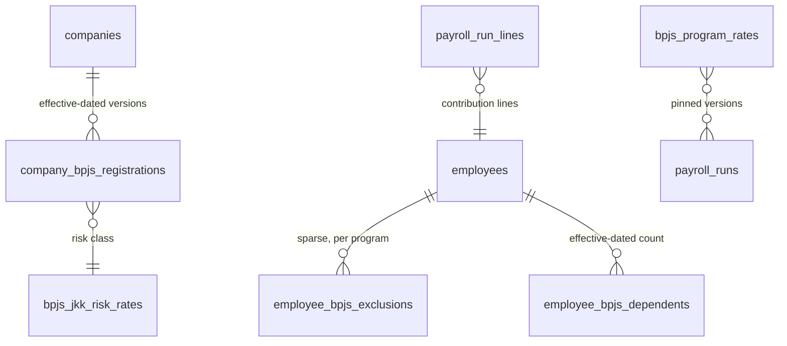
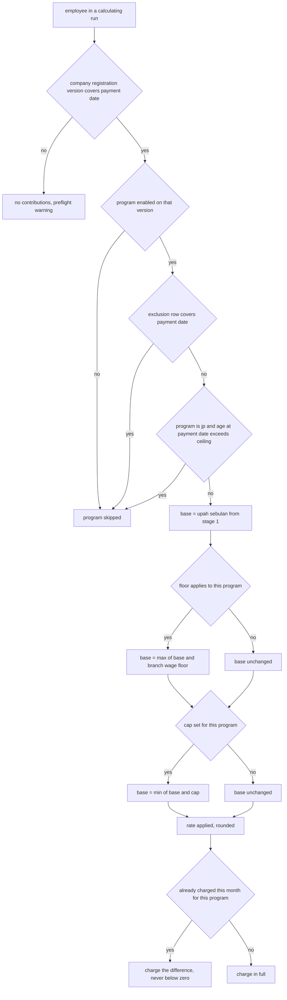
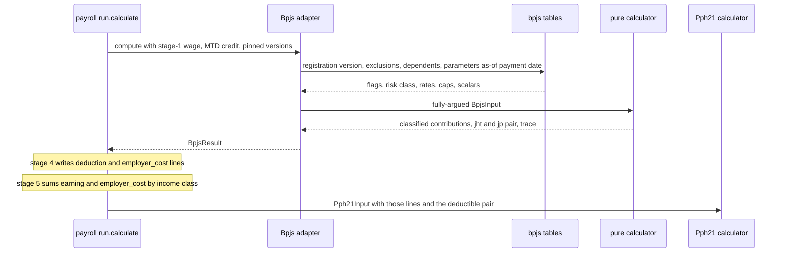
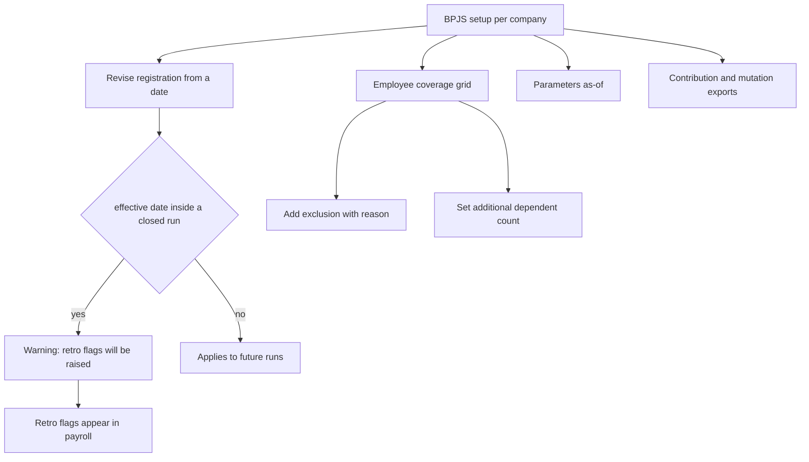

# Module: BPJS

Status: Active (Phase 3) · Related ADRs: `ADR-0001` (port-only cross-module reads), `ADR-0002` (tenant scoping; platform tables carry no `tenant_id`), `ADR-0005` (permission keys immortal, additive-only), `ADR-0006` (result pattern), `ADR-0007` (envelope), `ADR-0010` (jobs + outbox events), `ADR-0012` (calculation engine — **amended a fourth time this session**), `ADR-0013` (Drizzle conventions), `ADR-0015` (exports), `ADR-0016` (membership numbers encrypted) · Depends on: `docs/06-modules/holiday.md` (template), `docs/06-modules/payroll.md` (host pipeline, YTD ledger, component catalog), `docs/06-modules/tax-pph21.md` (sibling calculator contract; consumer of the deductible contributions), `docs/06-modules/employee.md` (`EmployeePayrollPort`), `docs/06-modules/organization.md`, `docs/05-platform/settings.md`, `docs/05-platform/import-export.md`, `docs/05-platform/audit-log.md` · Consumers: `docs/06-modules/reports.md`, `docs/06-modules/dashboard-analytics.md`

Namespace `bpjs` (naming §4, error prefix `BPJS`). The statutory contribution parameters, the coverage facts that decide who contributes to what, and the calculator payroll calls as stage 4 of its pipeline. Inherits all global standards; deviations only.

## 1. Purpose & Scope

Three things. **The parameters** — per-program rates and caps, the JKK rate per risk class, and the scalar knobs, all effective-dated platform data with no tenant write path. **The coverage facts** — which programs a company participates in, at which JKK risk class, under which registration numbers, plus the sparse per-employee exceptions and additional-dependent counts. **The calculator** — a pure function turning one employee's monthly wage into five programs' employee and employer contributions, a trace, and the two figures PPh 21 deducts on its annual path.

**This module computes; payroll orchestrates.** It owns no run, no period, no money movement, no approval, and no remittance. `BpjsCalculatorPort.compute` is a pipeline stage payroll invokes at stage 4 (payroll.md §4.5), before taxable assembly and before PPh 21 — an order that matters, because three of the five employer contributions are taxable income to the employee and must exist as lines before the tax base is assembled.

**The purity split is tax-pph21.md's, verbatim.** The **port adapter** reads this module's tables — the company registration version, the employee's exclusions and dependent count, the parameter rows as-of the run's payment date. The **pure calculator** it wraps receives every one of those as arguments and touches no repository, no clock, and no setting. ADR-0012's golden-file tests target the calculator.

**V1 exclusions**, each for a reason rather than by omission. **Employer-borne employee contributions** (*iuran ditanggung perusahaan*) — the borne amount becomes an employer-paid taxable benefit, which is a second gross-up-shaped mechanism that has to interact with `tax.method` resolution; a tenant needing it today models it as a `non_wage` / `regular` allowance sized to the employee part (§15, A-040). **Remittance tracking** — whether the transfer left the account, the VA numbers, the receipts; a treasury flow, and payroll already declines to track its own transfers beyond `payment_state`. **JHT claims and withdrawals** — between the employee and BPJS. **JKK accident reporting** — the two-stage report inside 2×24 hours ⚠️ VERIFY is a real HR obligation and a case-management feature, not a contribution calculation. **Dependent identity data** — names and NIKs for e-Dabu; §4.1 stores the count the arithmetic needs, and identity registration is the portal's flow. **Government file formats and any SIPP / e-Dabu integration** — this module emits documented column sets and leaves file schemas to the portal that versions them, the same posture tax-pph21.md took.

## 2. Actors & Permissions

| Action | Permission key | Data scope | Payroll Admin | Finance | HR Admin | Employee |
|---|---|---|---|---|---|---|
| Read a company's registration and risk class | `bpjs.registration.read` | company / tenant | ✅ | ✅ | ✅ | — |
| Register a company, revise participation, risk class, numbers | `bpjs.registration.update` | company | ✅ | — | — | — |
| Read employee coverage — exclusions, dependent counts | `bpjs.employee.read` | company / tenant | ✅ | ✅ | ✅ | — |
| Exclude an employee from a program, set a dependent count | `bpjs.employee.update` | company | ✅ | — | ✅ | — |
| Inspect the statutory parameters in force | `bpjs.parameter.read` | — (platform data) | ✅ | ✅ | ✅ | — |
| Run the contribution and mutation exports | `bpjs.report.export` | company | ✅ | ✅ | — | — |

**No `team` scope exists in this module**, carried from payroll §2 and tax §2. A manager holds no key here at any scope, and a contribution figure discloses the wage that produced it.

The six keys are **split at birth deliberately**. ADR-0005 makes permission keys immortal and additive-only — no deny, no hierarchy — so a key that starts too coarse can never be narrowed without breaking every role assignment already carrying it. The two writes have genuinely different blast radii: `bpjs.registration.update` re-prices an entire company and changes the employer's own cost, `bpjs.employee.update` changes one person's take-home. Merging them would let anyone permitted to fix one employee's exclusion also change the company's JKK risk class.

`bpjs.report.export` is minted rather than folded into `bpjs.registration.read`, because the contribution export carries every employee's figures and membership numbers while a registration row carries none. HR Admin holds `bpjs.employee.update` but not `bpjs.registration.update`: recording that a foreign national is outside JP is employee administration, and re-classifying the company's accident risk is not.

## 3. Business Rules

| ID | Rule |
|---|---|
| BR-BPJS-001 | **Statutory parameters are platform data.** `bpjs_program_rates`, `bpjs_jkk_risk_rates`, and `bpjs_parameters` carry no `tenant_id`, no RLS, and no runtime write path (ADR-0002) — same class as `overtime_rate_rules` and the five `tax_*` tables. They are seeded and revised by migration, effective-dated, and the row set in force on the run's payment date is pinned into `payroll_runs.parameter_versions` at snapshot, so a later regulation change can never re-price a computed run. No effective row set for the date fails the run **at creation** with `PAY_PARAMETER_MISSING`, never with a default rate. |
| BR-BPJS-002 | **Five programs, one shape.** `kesehatan`, `jht`, `jp`, `jkk`, `jkm`, each with an employee and an employer rate ⚠️ VERIFY, an optional base cap, and a flag saying whether the wage floor applies. The single exception is the **JKK employer rate**, which is a function of the company's risk class and therefore lives in its own table; its `bpjs_program_rates` row carries the cap and floor facts with a NULL rate, enforced by CHECK so no other program can be rate-less and JKK cannot carry two. |
| BR-BPJS-003 | **A company registration is effective-dated and superseded, never overwritten.** `company_bpjs_registrations` holds participation flags, JKK risk class, and the two registration numbers as one correlated version with a `[from, to)` interval and a no-overlap exclusion constraint. A revision closes the current version at the new `effective_from` and inserts its successor in one transaction — UC-PAY-002's salary-package mechanics. The values move together because deregistering a program and clearing its number is one act with one date; as independent settings keys, six could succeed and one be forgotten. |
| BR-BPJS-004 | **Absent tenant configuration warns; absent statutory parameters fail.** A company with no registration version covering the payment date contributes nothing and raises a preflight warning naming the company. It does not fail the run: a company genuinely outside BPJS is expressible, and blocking payroll over a configuration gap is the worse failure. The supported way to say "not a participant" is a version with all five flags false, so that state and "never configured" are distinguishable by anyone reading the row. |
| BR-BPJS-005 | **Participation is the default; exclusions are sparse.** Every active employee contributes to every program the company has enabled. `employee_bpjs_exclusions` holds only deviations — one interval per employee per program, with a reason from a fixed set. The `overtime_exempt_job_levels` precedent: a full enrolment table would write fifty thousand rows for ten thousand employees to restate a default, and every one of them could be wrong. |
| BR-BPJS-006 | **The JP age ceiling is derived, never a row.** JP contributions stop when the employee passes the statutory age ⚠️ VERIFY, evaluated against `birthDate` at the run's payment date, with the ceiling itself a `bpjs_parameters` scalar. A birthday is not a data-entry event: as an exclusion row it would be wrong by omission for every tenant every year, because nobody files paperwork the month an employee turns 56. Non-derivable exceptions — foreign nationals, coverage under another employer, late registration — stay rows, because nothing in the employee record can imply them. |
| BR-BPJS-007 | **The contribution base is `upah sebulan` taken from pipeline stage 1, unprorated.** Not stage 3's output. BPJS reports a *wage*, not a payment, and the reported wage does not change because an employee joined on the 20th or took unpaid leave ⚠️ VERIFY. The reductio is unpaid leave, which is a proration reason: a prorated base would give a month's unpaid leave a zero base, no contribution, and by implication no coverage — which is not how membership works. A month in which the employee was employed at any point is charged in full ⚠️ VERIFY. |
| BR-BPJS-008 | **The wage floor is split: the amount is tenant data, the applicability is ours.** `bpjs.wage_floor` is a branch-scoped effective-dated settings key the tenant enters — regional minimum wages are set by hundreds of separate local decrees on their own schedules, and branches carry an IANA timezone and coordinates, not an administrative code, so we cannot resolve one. Which programs honour it is `floor_applies` on the platform rate row, a versioned statutory fact. An unconfigured floor warns and computes unfloored, per BR-BPJS-004 — legitimate for a tenant whose every wage clears it. |
| BR-BPJS-009 | **Caps are per program and per version** ⚠️ VERIFY. The capped base is `min(max(upah sebulan, floor where it applies), cap where one exists)`, computed per program, so Kesehatan and JP can cap at different amounts in the same run while JHT, JKK and JKM stay uncapped. |
| BR-BPJS-010 | **One contribution per employee per month, guaranteed two ways.** Run type decides whether the month's contribution is due at all — `regular` and `final_settlement` charge, `thr` never does, because a THR run pays no monthly wage. Independently, payroll passes the **per-program contributions already charged in the same company and tax month** and the calculator charges `max(0, month due − already charged)`. The rule alone misses the common case: an employee exiting on the 20th appears in the regular run *and* in their final settlement, both charging types, both in one payment month. The credit alone misses a THR-only run for someone absent from the regular run, whose floored base would charge a whole month. The credit is per program so a mid-month JP enablement is not absorbed by Kesehatan's, and it also handles a **mid-month raise paid across two runs**: the second run computes a higher month-due and charges only the difference. |
| BR-BPJS-011 | **Employer contributions are `employer_cost` lines carrying an income class.** Three of the five — Kesehatan, JKK, JKM ⚠️ VERIFY — are taxable income to the employee and are classified `regular`; the employer's JHT and JP parts are not and are classified `non_taxable`. All five are `non_wage`, so they enter neither `upah sebulan` nor total wage, which keeps them out of the base that produced them and out of the 75% overtime floor. Payroll's stage 5 sums earning **and** `employer_cost` lines by income class; net pay ignores `employer_cost` entirely, so BR-PAY-012's "the payslip foots" holds unchanged. |
| BR-BPJS-012 | **Employee contributions are deduction lines, and only two of them are tax-deductible.** JHT and JP employee parts reduce the annual PPh 21 base ⚠️ VERIFY and are returned as the named pair `deductibleContributions`; the Kesehatan employee part and the dependent surcharge are not. `income_class` on a deduction line is inert — stage 5 never reads it — and is written `non_taxable` by convention rather than left to imply a tax meaning it does not have. |
| BR-BPJS-013 | **Additional dependents are an explicit count, not a family-table derivation.** Coverage extends to the participant plus a free allowance of family members ⚠️ VERIFY; each further **enrolled** person adds a percentage of the Kesehatan base, employee-paid. The count lives in `employee_bpjs_dependents`, effective-dated. Deriving it from `employee_family_members` would over-deduct from every employee with a large family: enrolling a parent is an election, not a consequence of having one, and that table records who someone's family is, not who was registered. |
| BR-BPJS-014 | **Rounding is parameterized** ⚠️ VERIFY. Every contribution is rounded to `contribution_rounding_unit` from `bpjs_parameters` before it leaves the calculator, so the lines payroll writes are already rounded and BR-PAY-012's foot-to-the-net invariant holds over a sum of rounded lines. A rounding unit is a statutory number; spec §4.4 admits no hardcoded ones. |
| BR-BPJS-015 | **Adapter reads tables; calculator takes arguments.** The adapter loads the registration version, the exclusion set, the dependent count, the branch's floor, and the pinned parameter rows, and merges them into a fully-argued input struct. The calculator reads nothing, calls nothing, and observes no clock. Every branch it takes is a function of its argument, which is what makes ADR-0012's golden-file tests a stable class rather than a snapshot of today's database. |
| BR-BPJS-016 | **Retro deltas contribute in the month that pays them; backdated coverage raises retro flags.** A delta payroll emits into a live run carries that run's month's contributions, and a closed run's contributions are never rewritten (BR-PAY-018). A backdated registration or coverage change — a risk class corrected in June effective January — emits `bpjs.registration.changed` or `bpjs.coverage.changed`, and payroll raises retro flags for the closed runs it touches, so the difference becomes a human decision rather than a silent recompute. If a tenant's reporting practice requires arrears attributed to the original month, that is a filing action outside this system ⚠️ VERIFY. |
| BR-BPJS-017 | **The ledger accumulates two named contributions, not one lump.** `payroll_ytd_ledger` gains `jht_employee_ytd` and `jp_employee_ytd`, written by payroll inside the close transaction, because the annual PPh 21 path needs exactly those two for the whole year and `bpjs_employee_ytd` mixes them with a non-deductible Kesehatan part. `bpjs_base_ytd` is defined as the **uncapped, unfloored** `upah sebulan` accumulated — the reported wage — rather than given four sibling columns nothing reads. Mid-year onboarding seeds the same two figures through `PayrollYtdSeedPort.seedOpening`. |
| BR-BPJS-018 | **Identity on a report is a gated read.** Membership numbers are ADR-0016 encrypted and BR-EMP-003 masked; the export obtains them through `EmployeePayrollPort.bpjsIdentitiesFor`, so decryption, masking policy, and the audit trail stay inside employee where they bind. One `employee.sensitive.revealed` row per export batch, not per employee. |
| BR-BPJS-019 | **Exports carry gated columns.** `bpjs.monthly_contribution` and `bpjs.membership_mutation` include membership numbers and NIK, so their column sets are gated by the requester's permissions at enqueue and each mint registers as an audited sensitive read — `document.download.gated_export`, import-export BR-IMP-010. Outputs are requester-only, identical to the bank file and the tax filing exports. |
| BR-BPJS-020 | **Audit and retention.** All three tenant tables are channel-1 audited with full diffs (audit-log §4.2): each of them changes somebody's pay or the employer's statutory liability. The three parameter tables are not audited — no tenant write path, and their history *is* their effective-dating. Coverage records sit in the 10-year payroll retention class (database-conventions §4.4, D4 ⚠️ VERIFY) and are exempt from every purge path. |
| BR-BPJS-021 | **No employee-facing surface exists.** An employee sees the deduction on their payslip, which payroll renders, and their membership numbers in their profile, which employee.md serves. This module has no `/me/` route, no mobile screen, and no sync class. |

> ⚠️ VERIFY: confirm against current Indonesian regulation before implementation. — every rate, cap, and scalar seeded into the three parameter tables; the employee/employer split per program (BR-BPJS-002); whether the wage floor is the applicable regional minimum wage and which programs honour it (BR-BPJS-008); the JP age ceiling and the foreign-national exclusion (BR-BPJS-006); whether the base is the reported monthly wage rather than the paid wage, and whether the joining month is charged in full (BR-BPJS-007); which employer premiums are taxable income to the employee (BR-BPJS-011); which employee contributions are PPh 21-deductible (BR-BPJS-012); the free dependent allowance and the extra-member rate (BR-BPJS-013); the rounding unit (BR-BPJS-014); whether arrears must be attributed to the original month (BR-BPJS-016); the JKK accident reporting window named in §1; the 10-year retention floor (BR-BPJS-020).

## 4. Domain Model

### 4.1 Schema



```ts
// src/database/schema/bpjs.ts
export const bpjsProgram = pgEnum('bpjs_program', ['kesehatan', 'jht', 'jp', 'jkk', 'jkm']);
export const bpjsPayer = pgEnum('bpjs_payer', ['employee', 'employer']);
export const bpjsRiskClass = pgEnum('bpjs_risk_class', ['i', 'ii', 'iii', 'iv', 'v']);
export const bpjsExclusionReason = pgEnum('bpjs_exclusion_reason', [
  'foreign_national', 'covered_elsewhere', 'not_yet_registered', 'other',
]);

// ---- Platform tables — no tenant_id, no RLS, migration-seeded (BR-BPJS-001) ----

export const bpjsProgramRates = pgTable('bpjs_program_rates', {
  ...id,
  effectiveFrom: date('effective_from').notNull(),                // the pinned "version"
  program: bpjsProgram('program').notNull(),
  payer: bpjsPayer('payer').notNull(),
  rate: numeric('rate', { precision: 6, scale: 4 }),              // NULL only for JKK employer
  baseCap: numeric('base_cap', { precision: 15, scale: 2 }),      // NULL = uncapped
  floorApplies: boolean('floor_applies').notNull().default(false),
  createdAt: timestamp('created_at', { withTimezone: true }).notNull().defaultNow(),
}, (t) => [
  uniqueIndex('uq_bpjs_program_rates_version').on(t.effectiveFrom, t.program, t.payer),
]);

export const bpjsJkkRiskRates = pgTable('bpjs_jkk_risk_rates', {
  ...id,
  effectiveFrom: date('effective_from').notNull(),
  riskClass: bpjsRiskClass('risk_class').notNull(),
  rate: numeric('rate', { precision: 6, scale: 4 }).notNull(),
  createdAt: timestamp('created_at', { withTimezone: true }).notNull().defaultNow(),
}, (t) => [
  uniqueIndex('uq_bpjs_jkk_risk_rates_version').on(t.effectiveFrom, t.riskClass),
]);

export const bpjsParameters = pgTable('bpjs_parameters', {
  ...id,
  effectiveFrom: date('effective_from').notNull(),
  key: text('key').notNull(),                                     // see §4.2
  numericValue: numeric('numeric_value', { precision: 15, scale: 4 }).notNull(),
  note: text('note'),
  createdAt: timestamp('created_at', { withTimezone: true }).notNull().defaultNow(),
}, (t) => [
  uniqueIndex('uq_bpjs_parameters_version_key').on(t.effectiveFrom, t.key),
]);

// ---- Tenant tables (RLS) -----------------------------------------------

export const companyBpjsRegistrations = pgTable('company_bpjs_registrations', {
  ...id, ...tenantId,
  companyId: uuid('company_id').notNull().references(() => companies.id),
  effectiveFrom: date('effective_from').notNull(),
  effectiveTo: date('effective_to'),                              // NULL = open, conventions §5

  kesehatanEnabled: boolean('kesehatan_enabled').notNull().default(false),
  jhtEnabled: boolean('jht_enabled').notNull().default(false),
  jpEnabled: boolean('jp_enabled').notNull().default(false),
  jkkEnabled: boolean('jkk_enabled').notNull().default(false),
  jkmEnabled: boolean('jkm_enabled').notNull().default(false),

  jkkRiskClass: bpjsRiskClass('jkk_risk_class'),                  // required when jkkEnabled
  kesehatanRegNumber: text('kesehatan_reg_number'),               // employer identifier — plaintext
  ketenagakerjaanRegNumber: text('ketenagakerjaan_reg_number'),
  ...auditColumns, ...softDeleteColumns,
}, (t) => [
  index('idx_company_bpjs_registrations_company').on(t.tenantId, t.companyId, t.effectiveFrom),
]);

export const employeeBpjsExclusions = pgTable('employee_bpjs_exclusions', {
  ...id, ...tenantId,
  companyId: uuid('company_id').notNull().references(() => companies.id),
  employeeId: uuid('employee_id').notNull().references(() => employees.id),
  program: bpjsProgram('program').notNull(),
  effectiveFrom: date('effective_from').notNull(),
  effectiveTo: date('effective_to'),
  reason: bpjsExclusionReason('reason').notNull(),
  note: text('note'),
  ...auditColumns, ...softDeleteColumns,
}, (t) => [
  index('idx_employee_bpjs_exclusions_employee').on(t.tenantId, t.employeeId, t.program),
]);

export const employeeBpjsDependents = pgTable('employee_bpjs_dependents', {
  ...id, ...tenantId,
  companyId: uuid('company_id').notNull().references(() => companies.id),
  employeeId: uuid('employee_id').notNull().references(() => employees.id),
  effectiveFrom: date('effective_from').notNull(),
  effectiveTo: date('effective_to'),
  additionalCount: integer('additional_count').notNull(),
  ...auditColumns, ...softDeleteColumns,
}, (t) => [
  index('idx_employee_bpjs_dependents_employee').on(t.tenantId, t.employeeId, t.effectiveFrom),
]);
```

Hand-written SQL beyond Drizzle's reach:

```sql
CREATE EXTENSION IF NOT EXISTS btree_gist;

-- BR-BPJS-003: one registration version per company per interval.
ALTER TABLE company_bpjs_registrations ADD CONSTRAINT excl_company_bpjs_reg_no_overlap
  EXCLUDE USING gist (
    tenant_id WITH =, company_id WITH =,
    daterange(effective_from, effective_to, '[)') WITH &&
  ) WHERE (deleted_at IS NULL);

-- BR-BPJS-005: one exclusion per employee per program per interval.
ALTER TABLE employee_bpjs_exclusions ADD CONSTRAINT excl_employee_bpjs_excl_no_overlap
  EXCLUDE USING gist (
    tenant_id WITH =, employee_id WITH =, program WITH =,
    daterange(effective_from, effective_to, '[)') WITH &&
  ) WHERE (deleted_at IS NULL);

-- BR-BPJS-013: one dependent count per employee per interval.
ALTER TABLE employee_bpjs_dependents ADD CONSTRAINT excl_employee_bpjs_dep_no_overlap
  EXCLUDE USING gist (
    tenant_id WITH =, employee_id WITH =,
    daterange(effective_from, effective_to, '[)') WITH &&
  ) WHERE (deleted_at IS NULL);

-- BR-BPJS-002: the JKK employer row is the only rate-less one, and it must be rate-less.
ALTER TABLE bpjs_program_rates ADD CONSTRAINT ck_bpjs_program_rates_jkk_rate
  CHECK ((rate IS NULL) = (program = 'jkk' AND payer = 'employer'));

-- A cap of zero is not "uncapped"; NULL is.
ALTER TABLE bpjs_program_rates ADD CONSTRAINT ck_bpjs_program_rates_cap
  CHECK (base_cap IS NULL OR base_cap > 0);

-- BR-BPJS-002: JKK cannot be enabled without the class that prices it.
ALTER TABLE company_bpjs_registrations ADD CONSTRAINT ck_company_bpjs_reg_jkk_class
  CHECK (jkk_enabled = false OR jkk_risk_class IS NOT NULL);

ALTER TABLE company_bpjs_registrations ADD CONSTRAINT ck_company_bpjs_reg_interval
  CHECK (effective_to IS NULL OR effective_to > effective_from);

ALTER TABLE employee_bpjs_dependents ADD CONSTRAINT ck_employee_bpjs_dep_count
  CHECK (additional_count >= 0);
```

**Ledger columns added to payroll** (payroll.md amendment this session, BR-BPJS-017): `payroll_ytd_ledger.jht_employee_ytd` and `.jp_employee_ytd`. They live there for the same reason the tax columns do — the ledger is written inside the close transaction UC-PAY-010 refuses to complete on failure, and the annual PPh 21 path reads the year from one place.

### 4.2 Parameter registry

Every row is effective-dated and pinned by `effective_from`. `bpjs_parameters` keys in V1:

| Key | Meaning |
|---|---|
| `jp_max_age_years` | Age at which JP contributions stop — BR-BPJS-006 |
| `kesehatan_free_dependents` | Family members covered before the surcharge starts |
| `kesehatan_extra_dependent_pct` | Rate per additional enrolled dependent, employee-paid |
| `contribution_rounding_unit` | Every contribution rounds to this multiple — BR-BPJS-014 |

> ⚠️ VERIFY: confirm against current Indonesian regulation before implementation. — every value seeded into the three parameter tables, and the composition of this key list itself. The **structure** is the decided part: statutory numbers are versioned platform rows, pinned per run, absent rather than defaulted.

### 4.3 Coverage resolution

There is **no lifecycle diagram in this module and none is missing.** Every entity here is a versioned row on a date axis — a registration version, an exclusion interval, a dependent count — the same shape holiday.md, organization.md, shift.md and overtime.md each justified. Nothing here has states it moves between; it has intervals during which it is true. What does deserve a diagram is the resolution ladder that turns those rows into a contribution:



### 4.4 Calculation contract

```ts
export const BPJS_CALCULATOR_PORT = Symbol('BPJS_CALCULATOR_PORT');

type Program = 'kesehatan' | 'jht' | 'jp' | 'jkk' | 'jkm';

/** Everything the pure calculator may see. Assembled by the adapter; frozen by payroll. */
export type BpjsInput = {
  paymentDate: string;              // drives version resolution and the age test
  taxMonth: string;                 // YYYY-MM — the credit key, BR-BPJS-010
  runType: 'regular' | 'thr' | 'final_settlement';
  employee: {
    employeeId: string;
    birthDate: string;              // BR-BPJS-006, added to the roster this session
    upahSebulan: string;            // pipeline stage 1, unprorated — BR-BPJS-007
    additionalDependents: number;   // BR-BPJS-013
    excludedPrograms: Program[];
  };
  company: {
    registered: boolean;            // false = no version covers paymentDate, BR-BPJS-004
    enabledPrograms: Program[];
    jkkRiskClass: 'i' | 'ii' | 'iii' | 'iv' | 'v' | null;
  };
  wageFloor: string | null;         // branch setting as-of, null = unconfigured, BR-BPJS-008
  mtd: { program: Program; base: string;
         employeeCharged: string; employerCharged: string }[];
  parameters: {
    versionAsOf: string;            // pinned effective_from
    programs: { program: Program; payer: 'employee' | 'employer';
                rate: string | null; baseCap: string | null; floorApplies: boolean }[];
    jkkRates: { riskClass: string; rate: string }[];
    scalars: Record<string, string>;
  };
};

export type BpjsContribution = {
  program: Program;
  payer: 'employee' | 'employer';
  componentCode: string;            // one of the nine seeded refs below
  wageCategory: 'non_wage';
  incomeClass: 'regular' | 'non_taxable';   // BR-BPJS-011; inert on employee lines
  base: string;                     // the capped and floored base actually used
  amount: string;                   // already rounded, BR-BPJS-014
};

export type BpjsResult = {
  contributions: BpjsContribution[];
  deductibleContributions: { jht: string; jp: string };   // employee side, BR-BPJS-012
  trace: { step: string; input: string; output: string; note?: string }[];
  warnings: { code: string; details?: Record<string, unknown> }[];
};

export interface BpjsCalculatorPort {
  compute(input: BpjsInput): Promise<Result<BpjsResult, DomainError>>;
  /** Run-creation preflight: unregistered company, unset risk class, missing wage floor. */
  preflight(companyId: string, paymentDate: string, employeeIds: string[]):
    Promise<{ code: string; employeeCount: number; details?: Record<string, unknown> }[]>;
}
```

The result is **classified rows rather than bare amounts**, which is where this contract deviates from `Pph21CalculatorPort`. Tax returns one or two amounts and payroll builds the lines; BPJS returns up to nine, and each needs the `income_class` that decides whether it enters the employee's taxable bruto. That classification is a BPJS fact — BR-BPJS-011 is exactly the rule that is easy to get wrong — so it belongs in this module's output, not in a mapping payroll maintains. Payroll turns each row into a `payroll_run_lines` row mechanically, knowing no BPJS semantics.

`deductibleContributions` is named separately although it is derivable from the array, because it is the exact struct `Pph21Input` already expects and the pair BR-BPJS-017 accumulates. One name, three readers.

**Nine seeded system components**, in payroll's catalog (UC-PAY-001: seeded BPJS refs cannot be deleted or reclassified, their categories being statutory). `payroll_run_lines.componentId` is FK-restrict, so these must exist as rows:

| Code | Kind | Wage category | Income class |
|---|---|---|---|
| `bpjs_kesehatan_ee` | deduction | non_wage | non_taxable (inert) |
| `bpjs_kesehatan_dependents_ee` | deduction | non_wage | non_taxable (inert) |
| `bpjs_jht_ee` | deduction | non_wage | non_taxable (inert) |
| `bpjs_jp_ee` | deduction | non_wage | non_taxable (inert) |
| `bpjs_kesehatan_er` | employer_cost | non_wage | regular ⚠️ VERIFY |
| `bpjs_jkk_er` | employer_cost | non_wage | regular ⚠️ VERIFY |
| `bpjs_jkm_er` | employer_cost | non_wage | regular ⚠️ VERIFY |
| `bpjs_jht_er` | employer_cost | non_wage | non_taxable |
| `bpjs_jp_er` | employer_cost | non_wage | non_taxable |



The two calculators never speak. Everything BPJS contributes to the tax answer travels through payroll's own pipeline — the taxable employer premiums as ordinary lines, the deductible pair as a named field — which is what keeps both of them pure functions of their arguments and keeps ADR-0001's boundary rule intact with no port between them.

### 4.5 Ports consumed

| Port | Use | Status |
|---|---|---|
| `EmployeePayrollPort.rosterFor` | `birthDate` for the JP age test; branch for the floor lookup | **field added to employee.md this session** |
| `EmployeePayrollPort.bpjsIdentitiesFor` | decrypted membership numbers for the two exports, one audit row per batch | **new, added to employee.md this session** |
| `SettingsPort` | `bpjs.wage_floor` as-of the payment date, resolved per distinct branch in the run rather than per employee | live |
| `OrgQueryPort` | company and branch resolution for registration scoping and exports | live |

No `AttendanceQueryPort`, no `LeaveQueryPort`, no `OvertimeQueryPort`, no `PeriodLockPort`, no `DocumentStoragePort`. This module reads no fact about time and produces no PDF: the base arrives as an argument and the outputs are workbook rows.

### 4.6 Why the month credit exists

**The double-charge.** A company pays March salary in one run and THR in a separate run, both with a March payment date. An employee's `upah sebulan` is 5,000,000; the branch's configured floor is 5,200,000; Kesehatan is 1% employee and 4% employer ⚠️ VERIFY — illustrative numbers, not the real table.

The regular run floors the base to 5,200,000 and charges **52,000 employee, 208,000 employer**. The THR run pays only THR, which is `non_wage`, so its `upah sebulan` is zero — and the floor lifts that zero straight back to 5,200,000, charging **another 52,000 and 208,000**. Two hundred and sixty thousand rupiah of duplicate liability per employee. Across a five-hundred-person company that is 130,000,000 in a single month, remitted or accrued against nothing.

The `thr` run-type rule alone kills that case. It does not kill the next one: an employee exiting on the 20th appears in the March regular run **and** in a final settlement paid on the 28th. Both are charging run types, and both compute a full month. The per-program credit is what makes the second one charge `max(0, 52,000 − 52,000) = 0`.

**The invisible income.** The same employee's employer-side Kesehatan, JKK and JKM premiums are taxable income to them ⚠️ VERIFY. On a 208,000 Kesehatan employer part alone, omitting it from bruto understates the annual taxable base by nearly 2,500,000 — every month, every employee, in the under-withholding direction, and invisible on Form 1721-A1 because the number was never a line. That is why stage 4 emits classified `employer_cost` lines and why payroll's stage 5 sums them: the tax calculator's only view of income is `Pph21Input.lines`.

## 5. Use Cases

**UC-BPJS-001 — Register a company.** Actor: Payroll Admin with `bpjs.registration.update`. Main: create the first version with an `effective_from`, the participation flags, the JKK risk class, and the two registration numbers. Exception: JKK enabled with no risk class → `BPJS_RISK_CLASS_REQUIRED`. Postcondition: runs whose payment date falls in the interval compute contributions; `bpjs.registration.changed` emitted.

**UC-BPJS-002 — Revise a registration.** Actor: Payroll Admin. Main: submit the new values with a new `effective_from`; the current version is closed at that date and the successor inserted in one transaction. Alternate: the effective date falls inside a closed run's period → accepted, and payroll raises retro flags rather than rewriting history. Exception: an interval overlapping an existing version → `BPJS_REGISTRATION_OVERLAP`. Postcondition: the earlier version remains readable, so "which risk class did we contribute under in March" stays answerable.

**UC-BPJS-003 — Exclude an employee from a program.** Actor: Payroll Admin or HR Admin with `bpjs.employee.update`. Main: pick the program, the interval, and a reason. Exception: an overlapping exclusion for the same employee and program → `BPJS_COVERAGE_OVERLAP`. Postcondition: the program is skipped from the effective date; `bpjs.coverage.changed` emitted, and a backdated interval raises retro flags for the closed runs it covers.

**UC-BPJS-004 — Record additional dependents.** Actor: Payroll Admin or HR Admin. Main: set the count with an effective date; the surcharge applies from the next run whose payment date falls in the interval. Exception: overlapping interval → `BPJS_COVERAGE_OVERLAP`; negative count → `VAL_OUT_OF_RANGE`. Postcondition: the employee's Kesehatan deduction rises by the parameterized rate per person.

**UC-BPJS-005 — Compute contributions.** Actor: system, pipeline stage 4. Main: the adapter resolves the registration version, exclusions, dependent count, the branch's floor, and the pinned parameter rows, and hands the calculator a fully-argued struct; the calculator resolves coverage per program, floors and caps the base, applies the rate, rounds, subtracts what the month has already charged, and returns classified rows plus the JHT and JP employee pair. Alternate: `runType = 'thr'` → the array is empty and a trace step records why. Postcondition: payroll writes deduction and `employer_cost` lines, and stage 5 picks the taxable employer premiums into the tax base.

**UC-BPJS-006 — Preflight at run creation.** Actor: system, inside `run.snapshot`. Main: `preflight` returns one entry per condition with the employee count it affects — unregistered company, JKK enabled with no risk class, branch with no configured wage floor. Postcondition: the entries join the tax preflight in payroll's run-creation warning strip. They warn rather than block, per BR-BPJS-004; a statutory parameter version missing for the date is the case that does block, at creation, with `PAY_PARAMETER_MISSING`.

**UC-BPJS-007 — Correct a risk class backwards.** Actor: Payroll Admin. Main: revise the registration with an `effective_from` inside already-closed runs. Postcondition: `bpjs.registration.changed` carries the interval; payroll raises one retro flag per affected closed run and employee, and a human decides whether the difference becomes a delta in a later run. Nothing is recomputed silently, and the closed runs' numbers do not move.

**UC-BPJS-008 — Produce the monthly contribution export.** Actor: Payroll Admin or Finance with `bpjs.report.export`. Main: run `bpjs.monthly_contribution` for a company and tax month; the workbook carries one row per employee with membership numbers, per-program base, employee part, and employer part, plus totals. Exception: the requester lacks the gated columns → those columns are omitted rather than the export refused. Postcondition: the tenant keys or maps the file into the portal; the mint is an audited sensitive read.

**UC-BPJS-009 — Produce the membership mutation export.** Actor: Payroll Admin or Finance. Main: run `bpjs.membership_mutation` for a company and month; the workbook lists joiners, leavers, and wage changes in the month, derived from hire dates, effectuated terminal statuses, and salary history intervals. Postcondition: the monthly reporting file is assembled without anyone reconciling three screens by hand.

**UC-BPJS-010 — Inspect the parameters in force.** Actor: any holder of `bpjs.parameter.read`. Main: `GET /bpjs/parameters?asOf=` returns the exact row sets a run on that date would pin — program rates, JKK rates by class, scalars. Exception: no version covers the date → `PAY_PARAMETER_MISSING`. Postcondition: an admin questioning a payslip can see the rate that priced it without reading a migration.

## 6. UI Flow

**Admin web only.** Screens: **BPJS setup** — per company, the current registration version with its participation flags, risk class, and numbers, plus a version history list and a "revise from" action. **Employee coverage** — a grid of employees with per-program participation state, exclusion reason where one exists, dependent count, and a "needs attention" filter for employees excluded from everything or newly past the JP age ceiling. **Parameters** — read-only, as-of date picker, showing which version is in force and which version each recent run pinned. **Exports** — the two definitions with their period parameters.



Empty states name the cause and the next action: *"This company is not registered for BPJS — no contributions will be calculated. Add a registration to start."* · *"No exclusions recorded. Every active employee contributes to the programs enabled above."* · *"No wage floor set for this branch. Contributions compute on the actual wage; set the applicable regional minimum wage if one applies."* Loading uses the standard skeleton grid. Errors surface field-first, then panel, then toast (design-system §microcopy, coding-standards-nextjs).

**Mobile: none.** BR-BPJS-021 — no screen, no route, no local table.

## 7. API

All endpoints follow the canonical spec-block form (api-standards §13). Admin grids use the seeded transactional-grid family (offset). Exports ride import-export §7. Errors beyond the implied set only.

| Endpoint | Permission | Pagination | Queue-reachable | Idempotency |
|---|---|---|---|---|
| `GET /api/v1/bpjs/registrations` | `bpjs.registration.read` | offset | no | — |
| `GET /api/v1/bpjs/registrations/{companyId}` | `bpjs.registration.read` | — | no | — |
| `PATCH /api/v1/bpjs/registrations/{companyId}` | `bpjs.registration.update` | — | no | accepted |
| `GET /api/v1/bpjs/parameters` | `bpjs.parameter.read` | — (bounded) | no | — |
| `GET /api/v1/bpjs/employees` | `bpjs.employee.read` | offset | no | — |
| `GET /api/v1/bpjs/employees/{employeeId}` | `bpjs.employee.read` | — | no | — |
| `POST /api/v1/bpjs/employees/{employeeId}/exclusions` | `bpjs.employee.update` | — | no | accepted |
| `DELETE /api/v1/bpjs/employees/{employeeId}/exclusions/{id}` | `bpjs.employee.update` | — | no | — |
| `PATCH /api/v1/bpjs/employees/{employeeId}/dependents` | `bpjs.employee.update` | — | no | accepted |

No new URL verbs and no new permission actions — `read`, `update`, and `export` are all in naming §5's reserved set, and no path here carries a verb segment. `PATCH` is the update verb; api-standards §2 leaves `PUT` unused in V1. There is no `/me/` route: BR-BPJS-021. There is no write path of any kind on the three parameter tables (BR-BPJS-001).

#### PATCH /api/v1/bpjs/registrations/{companyId}

Supersedes rather than overwrites — the current version is closed at `effectiveFrom` and the successor inserted in one transaction (BR-BPJS-003).

| Field | Type | Required | Rule |
|---|---|---|---|
| `effectiveFrom` | date | ✅ | not before the company's first registration version |
| `kesehatanEnabled` | boolean | ✅ | — |
| `jhtEnabled` / `jpEnabled` / `jkkEnabled` / `jkmEnabled` | boolean | ✅ | — |
| `jkkRiskClass` | enum | conditional | `i \| ii \| iii \| iv \| v`; required when `jkkEnabled` |
| `kesehatanRegNumber` | string | — | 1–32, digits and dashes |
| `ketenagakerjaanRegNumber` | string | — | 1–32, digits and dashes |

Response 200: the new version with `affectedClosedRuns: [{ runId, label }]` when the effective date reaches into closed runs — the caller learns immediately that money already paid is now in question, the same shape tax's pinned-year correction returns. Errors: `BPJS_REGISTRATION_OVERLAP` (`details: { effectiveFrom, conflictingVersionId }`) · `BPJS_RISK_CLASS_REQUIRED` · unknown or out-of-scope company → `SYS_NOT_FOUND`.

#### GET /api/v1/bpjs/parameters

Query: `asOf` (date, defaults to today). Response 200: `{ versionAsOf, programs: [...], jkkRates: [...], scalars: {...} }` — the exact row sets a run on that date would pin. Read-only by construction: no POST, PATCH, or DELETE exists on any parameter table. Errors: `PAY_PARAMETER_MISSING` (`details: { parameter, asOf }`) when no version covers the date.

#### POST /api/v1/bpjs/employees/{employeeId}/exclusions

| Field | Type | Required | Rule |
|---|---|---|---|
| `program` | enum | ✅ | `kesehatan \| jht \| jp \| jkk \| jkm` |
| `effectiveFrom` | date | ✅ | — |
| `effectiveTo` | date | — | strictly after `effectiveFrom` |
| `reason` | enum | ✅ | `foreign_national \| covered_elsewhere \| not_yet_registered \| other` |
| `note` | string | conditional | required when `reason = other`; 3–500 |

Response 201: the exclusion row plus `affectedClosedRuns` when the interval reaches backwards. Errors: `BPJS_COVERAGE_OVERLAP` (`details: { program, conflictingId }`) · unknown employee → `SYS_NOT_FOUND`. `DELETE` on the same collection soft-deletes a mistakenly recorded exclusion; ending one that was correct while it lasted is a `PATCH` of `effectiveTo`, not a delete, because the interval it covered really happened.

#### PATCH /api/v1/bpjs/employees/{employeeId}/dependents

| Field | Type | Required | Rule |
|---|---|---|---|
| `effectiveFrom` | date | ✅ | — |
| `additionalCount` | integer | ✅ | 0–20 |

Response 200: the new count interval, superseding the prior one at `effectiveFrom`. Setting `0` is the supported way to record that dependents were withdrawn — it is a version, not a deletion, so an earlier month's payslip stays reproducible. Errors: `BPJS_COVERAGE_OVERLAP` · `VAL_OUT_OF_RANGE`.

## 8. Validation Rules

| Field | Rule | Error code |
|---|---|---|
| `effectiveFrom` (all three tables) | valid date; no overlap with a live interval | `BPJS_REGISTRATION_OVERLAP` / `BPJS_COVERAGE_OVERLAP` |
| `effectiveTo` | absent, or strictly after `effectiveFrom` | `VAL_OUT_OF_RANGE` |
| `jkkRiskClass` | member of the enum; present when `jkkEnabled` | `BPJS_RISK_CLASS_REQUIRED` / `VAL_INVALID_ENUM` |
| `kesehatanRegNumber` / `ketenagakerjaanRegNumber` | 1–32 chars, digits and dashes after trim | `VAL_INVALID_FORMAT` |
| `program` | member of `bpjs_program` | `VAL_INVALID_ENUM` |
| `reason` | member of `bpjs_exclusion_reason` | `VAL_INVALID_ENUM` |
| `note` | required when `reason = other`; 3–500 | `VAL_REQUIRED` / `VAL_TOO_LONG` |
| `additionalCount` | integer 0–20 | `VAL_OUT_OF_RANGE` |
| `employeeId` | resolvable within the actor's company scope | `SYS_NOT_FOUND` |
| `asOf` (parameters) | valid date | `VAL_INVALID_FORMAT` |
| `bpjs.wage_floor` (settings) | decimal string ≥ 0 | `VAL_OUT_OF_RANGE` |

## 9. Edge Cases & Failure Modes

**Company never registered.** Zero contributions, one preflight warning naming the company, run proceeds. The warning is the only thing standing between a configuration gap and a silently contribution-free payroll, which is why it names the company rather than counting employees.

**JKK enabled, risk class never set.** Impossible to persist — the CHECK constraint and `BPJS_RISK_CLASS_REQUIRED` both refuse it. The preflight entry exists for data migrated in before the constraint.

**Employee turns 56 mid-year.** JP stops from the first run whose payment date is past the ceiling. No row is written and none is needed; the rule reads the birth date every run. This is the case that makes the derived ceiling necessary rather than convenient.

**Foreign national never excluded.** Over-deducted, every month, and **nothing in this system can detect it** — `employees` carries no nationality, which is exactly why the exclusion is a recorded human judgement rather than a derived one. Stated here so the gap is known rather than discovered.

**Employee exits on the 20th and appears in two runs.** The regular run charges the month; the final settlement charges `max(0, due − charged) = 0`. Without the credit both charge in full.

**THR run for someone absent from the regular run.** Charges nothing: `thr` is not a charging run type. Under the credit alone this employee's floored base would have produced a full month.

**Whole month of unpaid leave.** Contributions continue on the unprorated `upah sebulan`. Coverage does not lapse because someone was absent, and the employee part is deducted from a smaller net.

**Exit on the 2nd.** A few days of prorated pay less a full month of employee contributions, less tax, can go **net negative**. This is correct — the contribution is owed — and surfaces as a negative-net warning on the settlement run. Capping the deduction to make the number look right would leave the employer under-remitting with no record of why.

**Wage below the floor.** The floored base exceeds what the employee is paid, so the employee's percentage is taken against a base larger than their wage. Correct, and worth seeing in the trace, because it is the first thing an admin will query.

**No floor configured for a branch.** Computes unfloored, warns at run creation. A tenant whose every wage clears the local minimum never needs the value, and failing the run over it would be an outage caused by an optional field.

**Backdated raise.** Payroll's retro machinery owns it: the delta is paid in a later run and carries that month's contributions. The original month's contributions are never rewritten.

**Backdated risk class or exclusion.** Retro flags per affected closed run, from `bpjs.registration.changed` or `bpjs.coverage.changed`. A June correction effective January produces a worklist, not a recomputation.

**Dependent enrolled in June.** The surcharge starts from the June interval. Earlier months keep the count they were computed under, which is what makes an April payslip reproducible.

**Company deregisters from a program mid-year.** A new version with that flag false. Runs before the effective date keep their contributions; runs after have none for that program. The ledger's yearly accumulator therefore contains a partial year, correctly.

**Parameter version added retroactively.** Runs already closed keep the version they pinned. A `draft` run re-resolves on its next snapshot. No path exists by which a closed run silently adopts a newer rate.

## 10. Offline Behavior

Deviations from offline-sync only. This module contributes **no sync classes, no queue-reachable operations, and no local mirror table**. Every surface is admin-web (BR-BPJS-021); the only employee-visible consequence is a deduction line on a payslip, which payroll owns and which follows payroll's own offline posture.

## 11. Module Error Codes

Registered in `docs/03-standards/error-catalog.md` §23 this session.

| Code | HTTP | When |
|---|---|---|
| `BPJS_REGISTRATION_OVERLAP` | 409 | A registration version would overlap an existing live interval for the company — BR-BPJS-003 |
| `BPJS_COVERAGE_OVERLAP` | 409 | An exclusion or dependent-count interval would overlap a live one for the employee — BR-BPJS-005, BR-BPJS-013 |
| `BPJS_RISK_CLASS_REQUIRED` | 422 | JKK enabled on a registration version with no risk class — BR-BPJS-002 |

Deliberate reuses rather than new codes: **`PAY_PARAMETER_MISSING`** for an absent statutory version, exactly as tax-pph21.md reuses it — payroll already raises it at run creation with the same `{ parameter, asOf }` shape; **`SYS_NOT_FOUND`** for every unknown or out-of-scope identifier including write references (error-catalog §2); **`VAL_*`** for field-level failures. Three conditions deliberately took no code at all — unregistered company, unset floor, and an employee excluded from every program are **warnings**, not errors, and a code for a warning would invite a client to treat it as a failure.

## 12. Background Jobs & Events

| Job | Trigger | Behavior |
|---|---|---|
| `exports` / `bpjs-report.export` | export request | the two ExportDefinitions through the import-export framework, gated columns resolved at enqueue, membership numbers fetched once per batch via `bpjsIdentitiesFor` |

**No cron, deliberately.** The obvious candidate is a monthly remittance-deadline reminder, and it would fire against a fact this system does not hold: V1 excludes remittance tracking (§1), so the reminder could never know whether the transfer had been made and would nag every tenant every month regardless. Tax's `cron.tax.form-deadline` earns its place because issuance *is* tracked here; remittance is not.

**Emitted** (outbox, ADR-0010): `bpjs.registration.changed` (payroll consumes → retro flags for closed runs the interval covers) · `bpjs.coverage.changed` (same, for employee-level exclusions and dependent counts).

**Consumed: none.** Deliberately, and for tax's reason: coverage changes are acts, the calculator is invoked synchronously in-process by payroll's pipeline, and the mutation export derives its joiners and leavers at generation time from hire dates and effectuated statuses rather than from a stream it has to keep up with. A module that subscribes to nothing cannot fall behind.

## 13. Approval, Notification & Report Touchpoints

- **Approval:** none. No request type is registered in approval-engine §13 and none is needed — nothing here is a request for a decision. A risk class revision is an audited, effective-dated edit that raises retro flags, and the retro deltas themselves ride the *payroll run's* chain (BR-PAY-019). Placing a chain on the correction while the money it affects is approved elsewhere would split one decision across two mechanisms.
- **Notification templates: none.** Stated explicitly rather than left blank. The preflight warnings ride payroll's run-creation strip, export-ready notices ride import-export's own templates, and there is no employee-facing event here at all — a contribution is visible on the payslip, which already notifies. Adding a template would mean inventing an audience.
- **Reports** (reports.md registry): monthly contribution recap per company and program, employer-cost trend by month, coverage exceptions list, employees approaching the JP age ceiling, companies with no registration version, and a risk-class history per company.
- **Ports served:** `BpjsCalculatorPort` (payroll, live from this session — payroll.md §4.4's forward row flips). No other module consumes this one. Tax consumes the *output*, not this module: `deductibleContributions` reaches `Pph21Input` through payroll's pipeline, which is the seam ADR-0012 requires.

## 14. Test Scenarios

| Scenario | Covers |
|---|---|
| Same snapshot, same input struct, byte-identical result across releases | BR-BPJS-015, ADR-0012 golden-file class |
| Calculator invoked with a hand-built input struct and no database present at all | BR-BPJS-015 |
| Unregistered company: zero contributions, one preflight entry, run still reaches `review` | BR-BPJS-004, UC-BPJS-006 |
| All five flags false is distinguishable from no registration version at all | BR-BPJS-004 |
| Exclusion suppresses one program and leaves the other four charging | BR-BPJS-005 |
| Employee crossing the JP age ceiling between two runs stops contributing with no row written | BR-BPJS-006 |
| Base is the stage-1 `upah sebulan`, unchanged by a proration factor of 0.4 | BR-BPJS-007 |
| Whole month of unpaid leave still contributes in full | BR-BPJS-007 |
| Floor lifts a sub-floor wage; `floor_applies = false` programs price on the raw wage | BR-BPJS-008 |
| Kesehatan and JP cap at different amounts in the same run; JHT/JKK/JKM uncapped | BR-BPJS-009 |
| Regular run then THR run in one payment month: the THR run charges nothing | BR-BPJS-010 |
| Exiter in both a regular run and a final settlement in one month is charged exactly once | BR-BPJS-010 |
| Mid-month raise across two runs charges the difference, not a second full month | BR-BPJS-010 |
| Per-program credit: enabling JP mid-month is not absorbed by Kesehatan's credit | BR-BPJS-010 |
| Employer Kesehatan, JKK, JKM appear in `taxable_regular`; employer JHT and JP do not | BR-BPJS-011 |
| Net pay is identical with and without `employer_cost` lines; payslip still foots | BR-BPJS-011, BR-PAY-012 |
| Employer premiums do not move `upah sebulan`, total wage, or the overtime hourly basis | BR-BPJS-011 |
| `deductibleContributions` equals the JHT and JP employee lines and excludes Kesehatan | BR-BPJS-012 |
| Dependent count of 3 adds exactly three surcharge multiples; count of 0 adds no line | BR-BPJS-013 |
| A large `employee_family_members` list with no dependent row produces no surcharge | BR-BPJS-013 |
| Every returned amount is a multiple of the parameterized rounding unit | BR-BPJS-014 |
| Backdated registration revision raises one retro flag per affected closed run and employee | BR-BPJS-016, UC-BPJS-007 |
| Closed-run contribution amounts are unchanged after a backdated risk-class correction | BR-BPJS-016, BR-PAY-018 |
| December annual PPh 21 reads `jht_employee_ytd` + `jp_employee_ytd`, not `bpjs_employee_ytd` | BR-BPJS-017 |
| Mid-year opening seed populates both YTD contribution columns; December uses the whole year | BR-BPJS-017 |
| Contribution export writes exactly one `employee.sensitive.revealed` row for 10,000 employees | BR-BPJS-018 |
| Export requested without gated permissions omits membership columns rather than failing | BR-BPJS-019 |
| Overlapping registration versions and overlapping exclusions are both refused by the database | BR-BPJS-003, BR-BPJS-005 |
| Two-tenant leak test on all three tenant tables; parameter tables readable by both | ADR-0002 |

## 15. Future Improvements

Employer-borne employee contributions (*iuran ditanggung perusahaan*) as per-program flags on the registration version, once the taxable treatment of the borne amount is settled with the same confidence as BR-BPJS-011 — the machinery is already here, since Q5's `employer_cost` kind and income-class pairing is exactly what a borne contribution needs. Branch-scoped JKK risk classes, if a tenant is found running genuinely mixed-risk sites under one legal entity (A-039). A bulk loader for coverage exceptions, which the sparse tables do not need at V1 scale — fifty rows for ten thousand employees — but which a migrating tenant with a large expatriate population would want. JKK accident reporting as a case-management feature with its own state machine, document attachments, and the statutory two-stage reporting clock. Remittance tracking, which becomes worth building the moment a payment integration exists to reconcile against. Direct SIPP and e-Dabu submission, deferred for the reason tax deferred e-Bupot: it means owning a government file schema versioned outside our release cycle. A contribution simulator for an employee considering a package change, once the calculator has a stable public shape — shared with tax's, since both answer the same question from different sides.
