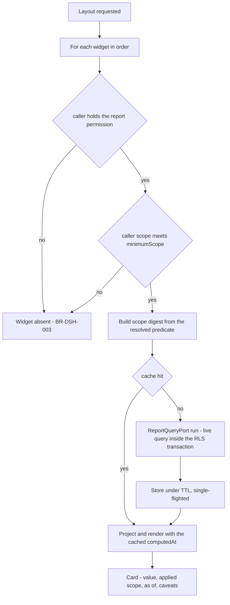
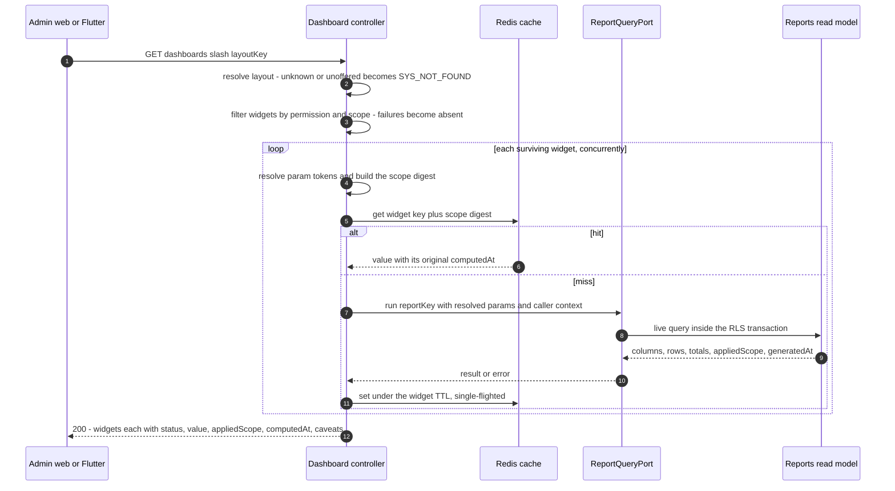
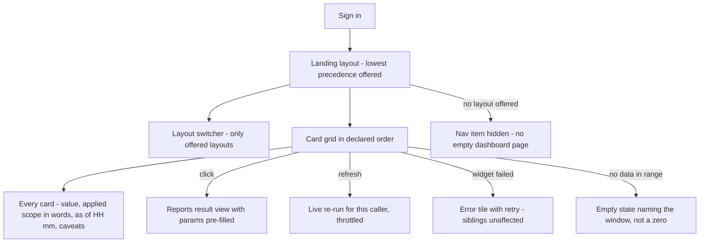

# Module: Dashboard & Analytics

Status: Active (Phase 3) · Related ADRs: `ADR-0001` (module boundaries — this module is the *second* designated read-model consumer, and it reaches nothing directly), `ADR-0002` (tenant scoping — the cache key carries `tenantId` and every miss runs inside the RLS transaction), `ADR-0003` (mobile posture — §10), `ADR-0005` (two-axis model, inherited whole through the port), `ADR-0006` (result pattern), `ADR-0007` (envelope, and the deliberate 200-with-partial-status shape — §7) · Deliberately **not** related: `ADR-0008` (nothing here is requested or approved), `ADR-0009` (owns no file), `ADR-0010` (no queue, no job, no event — §12), `ADR-0012` (reads payroll numbers, computes none), `ADR-0013` (no schema — §4.1), `ADR-0014` (no PDF), `ADR-0015` (no export, no import — §13), `ADR-0016` (unreachable by construction — BR-DSH-009 plus ADR-0001 §6(b)) · Depends on: `docs/06-modules/holiday.md` (template), `docs/06-modules/reports.md` (**every** widget's source; `ReportQueryPort` added there this session), `docs/03-standards/design-system.md` (§7.4 chart rules, inherited by name), `docs/05-platform/authorization-rbac.md` (scope resolution, reached only through the port) · Consumers: none

Namespace `dashboard` (naming §4, error prefix `DSH`). Glanceable projections over `ReportDefinition`s, cached by resolved scope. This module owns no table, mints no permission, writes nothing, and **issues no query of its own**.

## 1. Purpose & Scope

reports.md answers questions somebody sat down to ask. This module answers the question nobody asked: what a person sees when they open the product. It is four code-declared layouts over twenty-four widgets, every widget a projection over a report definition, plus the caching layer the manifest named as this file's deliverable.

The module is thinner than reports.md, which was already the thinnest in the handbook. Reports owns no table but owns eighty-six queries; this one owns neither. That is the correct shape for the second read-model consumer: the first one built the channel, and a second channel would be a second set of numbers.

**One property carries most of the design.** UC-RPT-008 pre-committed it and §4.2 implements it: **a widget never re-derives an aggregate a report already owns.** Two independent implementations over `payroll_run_lines` do diverge, and a card reading 412 against a report reading 408 destroys confidence in both — and in the seventy-eight definitions no widget touches, which is how a single visible disagreement discredits a registry nobody has checked.

**V1 exclusions:** any layout persistence — no reorder, no pin, no hide, no per-user default (A-088); a chart library on Flutter (A-089); event-driven cache invalidation and cron precompute (A-090); an ESS layout (A-092 — an employee's own leave balance is `GET /me/leave/balance` in the module that owns it, already built and already mirrored offline); tenant-authored widgets or a widget builder; scheduled or emailed dashboards (reports.md §15 reserves that for import-export, built once for both registries); cross-tenant or platform-wide views (system-administration owns platform health); real-time push of any kind.

## 2. Actors & Permissions

| Action | Permission key | Data scope | Employee | Manager | HR Staff | HR Admin | Payroll Admin | System Administrator |
|---|---|---|---|---|---|---|---|---|
| List the layouts offered to me | — (authenticated; a layout with no populatable widget is absent) | n/a — metadata | ✅ | ✅ | ✅ | ✅ | ✅ | ✅ |
| Render a layout | the backing report's `requiredPermission`, per widget | the backing report's `minimumScope`, per widget | per widget | per widget | per widget | per widget | per widget | per widget |
| Refresh one widget | same as that widget | same | per widget | per widget | per widget | per widget | per widget | per widget |

**This module mints no permission key.** Every gate is a key in the *owning business module's* namespace — `organization.structure.read`, `payroll.run.read`, `leave.request.read` — reached through the report that already declared it. The Employee row is `✅` for the first action and empty in practice for the rest: an employee holding none of the underlying read keys is offered no layout, which is BR-DSH-004 rather than a special case.

The chain is the security statement worth stating once: BR-RPT-002 says **a report never grants access the owning module would refuse**; this module holds no key of its own, therefore **a widget never grants access the report would refuse.** Access is decided once, in the module that owns the fact, and nothing downstream can widen it.

Second module to reach `done` with **zero tables and zero permission keys**, after reports.md, and the first with zero SQL as well.

## 3. Business Rules

| # | Rule |
|---|---|
| BR-DSH-001 | **A widget is a projection over a `ReportDefinition`, and nothing else.** `scalar`, `series`, `breakdown`, `topN`. This module declares **no query, no repository, and no read-model seam** — it holds no entry in ADR-0001 §6's exception at all, because it never reaches a table. Where a widget needs a shape no report emits, a **report** is registered first (UC-RPT-007), never a dashboard query. |
| BR-DSH-002 | **No permission key, and none is needed.** Widget visibility is the backing report's `requiredPermission`; layout visibility is whether any widget survives. See §2 for the transitive property this produces. |
| BR-DSH-003 | **Scope insufficiency is absence.** A widget whose `minimumScope` exceeds the caller's resolved scope is **not rendered** — no card, no placeholder, no refusal tile. It is never narrowed to fit, which BR-RPT-005 forbids and which on a card with no params panel would be undetectable. A refusal the user asked for is information; a refusal the layout asked for is a dead tile nobody can clear. |
| BR-DSH-004 | **Layouts are code, and a layout is offered only when at least one of its widgets is populatable.** Nobody lands on a blank dashboard, by construction. `executive` is a **layout, not a role** — no role template, no seed row, no permission key, offered to whoever holds the reads its widgets need. |
| BR-DSH-005 | **Every card renders three things beside its number:** `appliedScope` as words naming the actual anchor — "Your team — 14 employees", "PT Maju Jaya", "All companies", never the enum and never absent; `computedAt` as an "as of HH:mm" line carrying the **value's** computation time, not the time it was served from cache; and any `caveats` the backing report emits. A card is the most context-free rendering of a number in the product, and BR-RPT-006 already refused to let a *report* render "Headcount 12" without saying whose rows it counted. |
| BR-DSH-006 | **The cache key is `hris:dashboard:{tenantId}:{widgetKey}:{scopeDigest}`** (naming §8 grammar), where `scopeDigest` is computed from the **resolved scope predicate and frozen params, in the same code path that builds the query** — never from role, never from user id. Two callers share an entry when and only when they would receive identical rows. `tenantId` is in the key and the RLS transaction still opens on every miss: the cache never becomes the reason a tenant boundary is checked once instead of every time. |
| BR-DSH-007 | **TTL only.** Each widget declares `ttlSeconds` ∈ {60, 300, 3600}. **No event subscription, no cache bust, no cron precompute.** Concurrent misses on one key are single-flighted, so a cold cache at 09:00 runs one query rather than fifty. |
| BR-DSH-008 | **The cache sits above the port.** Every `ReportQueryPort` call is a live query, so reports.md's BR-RPT-011 — "no stored results and no cache" — holds **unamended**, and the reports screen never serves a cached number. |
| BR-DSH-009 | **No widget may be backed by a `sensitiveRead: true` definition**, enforced twice: a CI assertion over the registry, and the port **refusing** flagged definitions outright. A cache hit serves rows without executing the query, so a flagged widget would audit on miss and not on hit — an access trail with holes, which reads as complete and is worse than none. |
| BR-DSH-010 | **Partial failure is the normal case.** The layout endpoint returns 200 with a per-widget `status`; one slow `GROUP BY` produces one error tile with a retry, not an error page. |
| BR-DSH-011 | **A comparison is the same definition run twice with the period shifted** — never a second definition, never a widget-side calculation over raw rows. `betterDirection` is **declared**, because up is good for acknowledgment rate, bad for turnover, and neutral for headcount, and a green arrow on a turnover spike is a wrong signal that gets acted on. |
| BR-DSH-012 | **Nothing downloads from here.** A card drills through to `/reports/{key}` with its params pre-filled; download is that surface's, already built. No `ExportDefinition`, no `ImportDefinition`. |
| BR-DSH-013 | **Mobile renders the `manager` layout and nothing else**, online-only, with no Drift mirror and no ADR-0003 sync class — the four classes describe entities that sync, and a computed aggregate is not one. |
| BR-DSH-014 | **Manual refresh bypasses the cache for one caller; it never busts a shared entry.** A GET mutating state another caller depends on is the wrong shape, and the bypass path is throttled per user because it is the only path that reaches the database unconditionally. |
| BR-DSH-015 | **Adding a widget is a code change and nothing else** — no migration, no endpoint, no permission, no screen, no registry outside §4.3 and its layout row. A proposed widget needing any of those is not a widget. Inherited from BR-RPT-016, and the reason a twenty-four-row registry costs what one row costs. |

## 4. Domain Model

### 4.1 Owned tables: none

No table, no schema, no migration, no RLS policy, no soft delete, no `erDiagram`, no `stateDiagram-v2`. Widget and layout definitions are code (BR-DSH-001, BR-DSH-004); values live in Redis under a TTL and are not rows; nothing is persisted anywhere, at any point, on either surface.

What layout persistence would have cost, since it is the one thing a table could plausibly have bought: a table, a CRUD surface, permission keys, an RLS policy, a migration path every time a widget key changes underneath a saved layout, and an orphan-row problem the first time a widget is retired — to reorder six cards (A-088). A stored order remains addable later without touching a single widget definition, because a code-declared order is exactly the default a stored one would override.

### 4.2 The widget contract

```ts
// src/modules/dashboard/definitions/widget-definition.ts
export type Projection = 'scalar' | 'series' | 'breakdown' | 'topN';
export type Surface = 'web' | 'mobile';

export interface WidgetDefinition {
  key: string;                          // '<subject>.<measure>' — dashboard's own key space
  title: LocalizedText;                 // id + en, notification BR-NTF-001 pattern
  reportKey: string;                    // an existing ReportDefinition key — the ONLY source
  projection: Projection;
  /** Literals plus resolver tokens: '@today', '@currentMonth', '@last12Months',
   *  '@currentYear', '@callerCompany'. Resolved server-side; the client sends none. */
  params: Record<string, unknown>;
  valueColumn?: string;                 // scalar and series: which report column is the number
  labelColumn?: string;                 // series, breakdown, topN: the x axis or category
  limit?: number;                       // topN
  compareTo?: 'previous_period';        // BR-DSH-011 — shifts the period param, reruns
  betterDirection?: 'up' | 'down' | 'neutral';
  ttlSeconds: 60 | 300 | 3600;          // BR-DSH-007
  surfaces: Surface[];                  // BR-DSH-013
}

export interface LayoutDefinition {
  key: 'hr' | 'payroll' | 'manager' | 'executive';
  title: LocalizedText;
  widgets: string[];                    // ordered widget keys; order is the layout
  precedence: number;                   // landing = lowest precedence among those offered
}
```

Everything a widget needs to know about permission, scope, columns, and grain lives in the `ReportDefinition` it names — which is why `WidgetDefinition` declares none of them. There is no `requiredPermission` field here to get wrong, and no `minimumScope` field that could disagree with the report's.

Parameters are **server-resolved tokens, never client input**. A card takes no arguments; the layout endpoint accepts one optional `companyId` for multi-company tenants, validated against the caller's scope exactly as reports validates its own (out of scope → `SYS_NOT_FOUND`).



### 4.3 Widget registry

Twenty-four widgets. `Report` names the backing `ReportDefinition` — its permission and `minimumScope` govern, and are not restated. `Cmp` marks `compareTo: 'previous_period'` with its `betterDirection`. `M` marks `surfaces` including mobile.

| Widget | Report | Projection | TTL | Cmp | M | Layouts | Contract |
|---|---|---|---|---|---|---|---|
| `headcount.total` | `organization.headcount` | scalar | 3600 | ↔ | M | hr, manager, executive | Live headcount at the caller's scope as of today. The denominator most other cards divide by, and the one card that appears in three layouts |
| `headcount.by_status` | `employee.headcount_by_status` | breakdown | 3600 | | | hr | The PKWT/PKWTT and status split, as a chart rather than the monthly table HR files upward |
| `headcount.by_department` | `organization.headcount` | breakdown | 3600 | | | executive | Same definition as `headcount.total`, `groupBy: department`. One definition, two shapes — the property that makes the registry cheap |
| `headcount.trend` | `employee.turnover` | series | 3600 | | | executive | Twelve months of average headcount, read off the turnover definition's own denominator column. Costs no additional report row |
| `turnover.rate` | `employee.turnover` | scalar | 3600 | ↓ | | hr, executive | This month's turnover rate against last month's. Carries the definition's convention caveat verbatim — A-091 |
| `turnover.trend` | `employee.turnover` | series | 3600 | | | hr, executive | Twelve months of rate. The shape that distinguishes a bad month from a bad year |
| `turnover.leavers` | `employee.turnover` | scalar | 3600 | ↓ | | hr | Leaver count this month against last. All causes including PKWT expiry, per the definition |
| `contract.expiring_90d` | `employee.contract_expiry` | scalar | 3600 | | M | hr, manager | PKWT contracts ending within 90 days at the caller's scope. A manager sees their own team's, which is the version that gets acted on |
| `contract.expiring_list` | `employee.contract_expiry` | topN 5 | 3600 | | | hr | The five soonest, with days remaining. Drills through to the full renewal worklist |
| `attendance.present_today` | `attendance.headcount_present` | scalar | 60 | | M | hr, manager, executive | Present today against live headcount, per the caller's scope. The shortest TTL in the registry, because it is the one number that changes within an hour |
| `attendance.absent_today` | `attendance.headcount_present` | scalar | 60 | | M | manager | Absent count for today, same definition, different column |
| `attendance.anomalies_open` | `attendance.anomaly` | scalar | 300 | ↓ | | hr | Days this month carrying an out-of-fence, unresolved, or missing-punch flag. The review queue's size, not its contents |
| `attendance.late_top` | `attendance.lateness_ranking` | topN 5 | 300 | | M | manager | Five highest late-minute totals this month. Raw measured minutes, never a status — attendance demoted lateness deliberately and the card keeps the demotion |
| `leave.out_today` | `leave.coverage_calendar` | topN 10 | 60 | | M | manager | Who is out today, by name. **A-087's first named need**, answered where reports.md said it would be |
| `leave.expiring_days` | `leave.carryover_forecast` | scalar | 3600 | ↓ | | hr, executive | Leave days due to expire under the carry-over policy. Days, never rupiah — leave owns the balance, payroll owns the rate |
| `leave.usage_by_type` | `leave.usage` | breakdown | 3600 | | | hr | Days taken by type, year to date, counted from `covered_dates` pinned at approval |
| `leave.absence_unreconciled` | `leave.absence_reconciliation` | scalar | 300 | ↓ | M | manager | Days marked absent this month with no approved leave behind them. The number a manager can still fix |
| `overtime.unordered_hours` | `overtime.unordered_reconciliation` | scalar | 300 | ↓ | M | payroll, manager | Measured overtime minutes this month with no approved order. **A-087's second named need**; unpayable by design, which is exactly why it needs to be visible early |
| `overtime.hours_by_department` | `overtime.cost_driver` | breakdown | 300 | | | payroll, executive | Multiplier-hours by department. **Hours only** — the labour-law/wage-law boundary holds here as it holds in the module |
| `payroll.cost_current` | `payroll.component_cost` | scalar | 3600 | ↔ | | payroll, executive | This month's component cost against last month's. Rides the definition's `kind` predicate (BR-PAY-026) — without it, employer statutory cost renders as employee gross |
| `payroll.cost_trend` | `payroll.component_cost` | series | 3600 | | | payroll, executive | Twelve months of total component cost, on the `month` grain added to that definition this session |
| `payroll.cost_by_department` | `payroll.component_cost` | breakdown | 3600 | | | payroll | This month's cost by department. Third shape off one definition |
| `bpjs.employer_cost_trend` | `bpjs.employer_cost_trend` | series | 3600 | | | payroll, executive | Employer premium per program per month — the employer-cost line finance forecasts from. Gated on `bpjs.report.export`, inherited (§9) |
| `expense.unpaid_liability` | `expense.unpaid_liability` | scalar | 300 | ↓ | | payroll, executive | Approved and unpaid reimbursement totals as of today |

**Twenty-four widgets over sixteen report definitions.** Five definitions carry more than one widget — `employee.turnover` (4), `payroll.component_cost` (3), and `organization.headcount`, `employee.contract_expiry`, `attendance.headcount_present` (2 each) — which is BR-DSH-001 paying for itself: a second shape costs a registry row, not a query. The other eleven map one to one, and that ratio is the honest one: reuse is where it falls out naturally, not a target the registry was bent toward.

**Zero flagged definitions appear above**, and the exclusion is visible rather than asserted: `payroll.ytd_summary`, `payroll.retro_register`, `payroll.payment_reconciliation`, and the four `tax.*` flagged reports are all reports a payroll dashboard would plausibly reach for, and BR-DSH-009 puts every one of them out of reach. The payroll layout shows no individual's pay, by rule.

### 4.4 Layouts

| Layout | Precedence | Widgets in order | Populatable by |
|---|---|---|---|
| `manager` | 1 | `attendance.present_today`, `attendance.absent_today`, `leave.out_today`, `overtime.unordered_hours`, `leave.absence_unreconciled`, `attendance.late_top`, `contract.expiring_90d`, `headcount.total` | any caller with `team` scope on attendance, leave, or overtime reads — the MSS set |
| `hr` | 2 | `headcount.total`, `headcount.by_status`, `turnover.rate`, `turnover.trend`, `turnover.leavers`, `contract.expiring_90d`, `contract.expiring_list`, `attendance.present_today`, `attendance.anomalies_open`, `leave.expiring_days`, `leave.usage_by_type` | HR Staff, HR Admin |
| `payroll` | 3 | `payroll.cost_current`, `payroll.cost_trend`, `payroll.cost_by_department`, `bpjs.employer_cost_trend`, `overtime.hours_by_department`, `overtime.unordered_hours`, `expense.unpaid_liability` | Payroll Admin, Finance |
| `executive` | 4 | `headcount.total`, `headcount.trend`, `headcount.by_department`, `turnover.rate`, `turnover.trend`, `payroll.cost_current`, `payroll.cost_trend`, `bpjs.employer_cost_trend`, `leave.expiring_days`, `expense.unpaid_liability` | whoever holds the reads — typically Company Administrator, Finance |

"Populatable by" describes the roles that hold the keys today; it **grants nothing**. Entitlements decide, names only label — which is how `executive` exists as a layout without existing as a role, and how a tenant that clones "HR Admin" into "People Ops" keeps its dashboard when a role-name lookup would have handed it a blank page.

**The `manager` layout is entirely chart-free** — six scalars and two top-N lists — which is why mobile renders all eight and needs no chart renderer (A-089). `surfaces` is still declared per widget rather than inferred, because the next manager widget might be a series and the inference would then be silently wrong.

Landing layout is the lowest `precedence` among those offered; the caller may switch between any they are offered.

### 4.5 Ports consumed

- **`ReportQueryPort`** — reports.md §4.5, **added there this session on first caller**:

  ```ts
  export const REPORT_QUERY_PORT = Symbol('REPORT_QUERY_PORT');

  export interface ReportQueryPort {
    /** Resolves the definition, checks its requiredPermission against ctx,
     *  resolves ctx's data scope, applies it as a row predicate, and runs live.
     *  Refuses sensitiveRead definitions outright (reports BR-RPT-012 / BR-DSH-009).
     *  Takes no scope override: a consumer cannot widen what the report would grant. */
    run(
      key: string,
      params: Record<string, unknown>,
      ctx: RequestContext,
      page?: { limit: number; offset: number },
    ): Promise<Result<ReportResult, ReportError>>;
  }
  ```

  `ReportResult` is the same envelope `GET /reports/{key}/result` returns — `columns`, `rows`, `totals`, `appliedScope`, `generatedAt`, `caveats` — which is what makes a card and its report incapable of disagreeing, and what BR-DSH-005's two stamps are read from.

**The gate lives inside the port, not in this module.** Same shape as `AuditQueryPort`, which fires `audit.log.queried` inside itself so a consumer cannot read the audit log without leaving a trace: here the permission check and the scope resolution are inside so a consumer cannot read rows without the check. This module passes the caller and receives rows; it never passes a decision.

**Nothing else.** No read-model repository, no published view, no query port on any business module, no `AuditPort`. This module's entry in ADR-0001 §6's extraction-seam inventory is **empty**, and that is the whole answer to "if payroll is extracted, which widgets break?" — the ones whose report breaks, listed on payroll's row in reports.md §4.4, and no others.

**Ports served: none.**

## 5. Use Cases

**UC-DSH-001 — Render a layout.** The hot path, and the only path that matters for latency.



Order is fixed and matters: **permission, then scope, then cache, then query.** The cache is reached only after both gates pass, so a cache entry can never be the thing that decides whether a caller sees rows.

**UC-DSH-002 — List offered layouts.** `GET /dashboards` evaluates each layout's widgets against the caller's permissions and scope and returns the ones with at least one survivor, ordered by precedence, with the landing layout marked. A caller entitled to nothing receives an empty list and the admin web hides the nav item — not an empty dashboard page (BR-DSH-004).

**UC-DSH-003 — Two managers, one widget key.** Both open `manager`. Both request `attendance.present_today`. Their reporting subtrees are disjoint, so the scope resolver produces different predicates, so the digests differ, so the cache entries differ. Two HR Admins in the same company on the same widget resolve to the identical predicate and **share** one entry — which is the entire value of BR-DSH-006's keying, and the reason it is not keyed by user.

**UC-DSH-004 — Manual refresh.** The caller clicks refresh on one card. `GET /dashboards/{layoutKey}/widgets/{widgetKey}?refresh=true` **bypasses** the cache, runs live, and repopulates the entry. It does not delete another caller's entry — a GET that mutates shared state is the wrong shape — and the path carries a tighter per-user throttle bucket (security-standards §2's existing sliding window), because it is the only route in this module that reaches PostgreSQL unconditionally.

**UC-DSH-005 — Manager on a phone.** Opens the app, lands on the MSS home. Eight cards, in layout order: present today, absent today, who is out today, unordered overtime, unreconciled absences, the five latest arrivals, contracts expiring within 90 days, team headcount. Every card stamps "Your team — 14 people · as of 09:12". Offline the surface shows the standard offline state, not yesterday's numbers. **This use case is A-087's discharge**, and both needs reports.md named by hand — "who is out today" and "does my team have unapproved overtime" — are cards 3 and 4.

**UC-DSH-006 — A widget the caller cannot run.** An HR Staff member with `company` scope opens `hr`; every widget renders. A manager granted admin-web access opens `hr`; `turnover.rate` (`minimumScope: company`) is **absent** — no tile, no message, no greyed card — while `contract.expiring_90d` (`team`) renders at their scope, stamped "Your team". The layout renders shorter, and nothing tells them a card exists that they cannot see.

**UC-DSH-007 — Drill through.** Clicking any card opens `/reports/{reportKey}` with the widget's resolved params pre-filled. The report's `totals` **is** the scalar card's number and the report's rows **are** the topN card's rows — same definition, same predicate, same query — so the drill-through cannot contradict the card that launched it. This is also the download path: BR-DSH-012 registers no export because the destination already has one.

**UC-DSH-008 — Register a new widget.** Write the `WidgetDefinition`, add the §4.3 row, add the key to a §4.4 layout row. Same session, no migration, no permission, no endpoint, no screen. If no existing report emits the shape, **register the report first** under UC-RPT-007 — including its §4.3 row and the sentence in its owning module's §13 — and only then the widget. A widget that wants a query is a report that has not been written yet.

## 6. UI Flow



- **Admin web.** Card grid, responsive; `scalar` cards carry value, delta chip, scope line, "as of" line. shadcn/ui `chart` (Recharts) for `series` and `breakdown`, driven by design-system CSS variables so both themes come from the tokens rather than a second palette declared in a chart config.
- **Charts obey design-system §7.4 and §8.5 without exception**: every series carries a direct label or legend entry and a pattern or shape besides hue, so a `breakdown` remains readable in dark theme and to a reader who does not distinguish the hues. This module is the one design-system named as the inheritor of that rule.
- **The delta chip states its baseline.** "+8 vs Jul 2026", never a bare "+8" — the same reasoning that makes `appliedScope` mandatory. Direction colour comes from `betterDirection`, never from the sign.
- **Money is `tabular-nums` and right-aligned** (design-system §5), as an IDR decimal string per ADR-0007; no card renders a `double`.
- **Empty is not zero.** A widget whose query returns no rows renders "No leave recorded in this window", not "0". Zero is a measurement; empty is the absence of one, and a dashboard that renders them identically teaches people to distrust both.
- **Mobile.** The eight `manager` widgets as a scrollable card list on the ESS/MSS home, above the existing inbox and quick actions. Same stamps, same words, same numbers as the web card. Offline: standard offline state per BR-DSH-013, no stale values.
- **No customization affordances at all** — no drag handles, no pin icons, no hide menu. Absent rather than disabled, so nothing on screen advertises a capability that does not exist (A-088).

## 7. API

All: Queue-reachable **no** · Idempotency **—** (reads) · admin web + mobile (`manager` only).

| Endpoint | Permission | Pagination |
|---|---|---|
| `GET /api/v1/dashboards` | authenticated (layouts filtered per BR-DSH-004) | — |
| `GET /api/v1/dashboards/{layoutKey}` | per widget, inside | — (bounded by the layout) |
| `GET /api/v1/dashboards/{layoutKey}/widgets/{widgetKey}` | the widget's backing report permission | — |

#### GET /api/v1/dashboards
Response 200: `data: [{ key, title, widgetCount, isLanding }]`, `meta: { count }`. Empty array when nothing is offered.

#### GET /api/v1/dashboards/{layoutKey}
Request: optional `companyId` (multi-company tenants), validated against the caller's scope.

Response 200 — **partial success is a success** (BR-DSH-010):
```jsonc
{
  "data": {
    "layoutKey": "hr",
    "widgets": [
      { "key": "headcount.total", "title": "Headcount", "projection": "scalar",
        "status": "ok",
        "value": { "current": 412, "previous": 404, "delta": 8, "deltaPct": 1.98,
                   "betterDirection": "neutral", "comparedTo": "2026-07" },
        "appliedScope": "company", "scopeLabel": "PT Maju Jaya",
        "computedAt": "2026-08-04T02:11:07Z", "caveats": [] },
      { "key": "turnover.rate", "title": "Turnover rate", "projection": "scalar",
        "status": "error", "errorKind": "unavailable" }
    ]
  },
  "meta": { "generatedAt": "2026-08-04T02:11:09Z", "cacheHits": 9, "cacheMisses": 2 }
}
```
Widgets the caller cannot run are **absent from the array** (BR-DSH-003), not present with a status. `errorKind` is a rendering hint with one value in V1 — the client's behaviour is "show a retry" regardless of cause, which is why §11 registers no code for it. Errors at the envelope level: unknown or unoffered `layoutKey` → `SYS_NOT_FOUND`; `companyId` outside the caller's scope → `SYS_NOT_FOUND`.

#### GET /api/v1/dashboards/{layoutKey}/widgets/{widgetKey}
Request: `refresh` (boolean, default false). One widget, same object shape as an array element above. `refresh=true` bypasses the cache for this caller and repopulates (BR-DSH-014). Errors: unknown widget, widget not in that layout, or caller not entitled → `SYS_NOT_FOUND` (existence hiding — a widget absent from a caller's render is absent everywhere); throttle exceeded → `SYS_RATE_LIMITED`.

## 8. Validation Rules

| Field | Rule | Error code |
|---|---|---|
| `{layoutKey}` | a declared layout **and** offered to this caller | `SYS_NOT_FOUND` (BR-DSH-004) |
| `{widgetKey}` | declared, present in `{layoutKey}`, and entitled | `SYS_NOT_FOUND` (BR-DSH-003) |
| `companyId` | resolvable inside the caller's scope | `SYS_NOT_FOUND` |
| `refresh` | boolean; throttled per caller | `SYS_RATE_LIMITED` |
| Widget params | **not client input** — resolved server-side from tokens; a client-supplied param is ignored, never merged | — |

The last row is a validation rule shaped as an absence, and it is deliberate: the smallest input surface is the one with no inputs. A card that took client params would need its own `ParamSpec`, its own coercion, and its own injection story, all of which reports already owns for the query that actually runs.

## 9. Edge Cases & Failure Modes

- **The cache keyed by anything but the resolved predicate.** The failure this module was most likely to ship, and the one with a real blast radius: key on role or user-agnostic widget id and one manager's team numbers are served to another manager for up to an hour. Pinned by the §14 leak test, run per `team`-scoped widget rather than sampled.
- **A card and its report disagree.** Impossible by construction — the card's number *is* the report's `totals`, from one query. If it ever happens, the cause is a widget projecting a column the report did not compute, which the §14 column assertion catches at build time.
- **`bpjs.employer_cost_trend` requires an `export` permission to view a card.** Real friction, correctly inherited: the report's key is `bpjs.report.export`, and BR-DSH-002's chain means this module cannot soften it. Softening it here would be a dashboard granting access the report refuses, which is the one thing the chain exists to prevent. If the gate is wrong it is wrong in bpjs.md, and that is where it gets fixed.
- **Redis unavailable.** Every widget misses, every widget runs live, the page is slow and correct. Degradation, not failure — and the single-flight lock degrades with it, so the worst case is duplicate concurrent queries rather than an outage.
- **Cold cache at 09:00, whole company arrives at once.** Single-flight per key collapses N identical misses to one query with N waiters (BR-DSH-007). Shared entries make this cheap for company-scope widgets, where N is largest; team-scope widgets have N near 1 by nature.
- **A backing report's `inlineRowCap` trips.** Cannot, for `scalar`, `series`, and `topN` — the projections are bounded by construction (one row, ≤ 24 points, ≤ `limit`). A `breakdown` over an unbounded grouping could, and renders the error tile; the fix is a bounded `groupBy` in the widget's params, not a larger cap.
- **A widget's backing report is retired or renamed.** Build-time failure: the §14 assertion resolves every `reportKey` against the registry. A widget pointing at nothing never reaches runtime.
- **A definition gains `sensitiveRead: true` later.** The port refuses it and the widget starts erroring — loudly, on the first call, rather than silently serving audited data from cache (BR-DSH-009). Loud is the correct failure here.
- **A comparison window with no prior period** (a company's first month). The delta chip is absent; the value renders alone. No zero baseline, no "+100%", no arrow.
- **Turnover computed two ways.** `turnover.rate` renders the definition's convention as a caveat on the card, not only in the report header — the number gets quoted in meetings and the convention has to travel with it (A-091).
- **A tenant with one company.** `companyId` resolves from `@callerCompany` and the selector is hidden. Multi-company tenants get the selector; single-company tenants never see a control with one option.
- **Someone asks for a widget nobody promised.** UC-DSH-008's protocol, not an exception — and if it needs a query, it is a report first.

## 10. Offline Behavior

**Mobile surface exists** — the `manager` layout, eight widgets (BR-DSH-013) — and it is **online-only**.

No Drift table, no local mirror, no cached values, no queued operation, and **no ADR-0003 sync class**: the four classes assign a conflict policy to entities that sync, and a computed aggregate is not an entity. There is no row to conflict, no `version` to compare, and no write to queue.

Offline renders the standard offline state, not the last-seen numbers. The precedent is exact and deliberate: attendance's live board and team day are online-only on the reasoning that *a stale "who is in right now" is worse than no answer*, and six of these eight cards answer that same class of question. "Team out today: 4 — as of Tuesday" is not a degraded answer; it is a different question answered confidently.

Worth separating from the caching decision, because they look contradictory and are not: reports.md called dashboards **cache-tolerant**, and that means *a sixty-second-old number is fine*. It does not mean a three-day-old one is. Server-side TTL caching (BR-DSH-007) and refusing to persist a number on a device (this section) are the same judgement at two time scales.

## 11. Module Error Codes

**None.** `DSH` leaves the reserved-empty list **owned with zero codes**, following `AUD_`'s existing precedent in error-catalog §33 — recorded as a decision rather than left looking like an unwritten file.

Nothing here needs one. Scope insufficiency is absence, not an error (BR-DSH-003). Permission failure is absence. Unknown layout, unknown widget, and out-of-scope `companyId` are `SYS_NOT_FOUND` under catalog §2's existence-hiding default. A widget whose query fails renders an error tile whose client behaviour is "retry" regardless of cause, and catalog §2's rule for minting a module code is that clients branch on it — this one never would. Throttle is `SYS_RATE_LIMITED`. Nothing writes, so no conflict, no lock, no state-transition code exists to name.

Catalog bookkeeping this session: totals unchanged at **28 owned prefixes / 168 codes**; `DSH` joins `AUD` in the owned-but-empty note; **two** prefixes remain reserved-empty, `TEN` and `ADM`, both belonging to system-administration.md. *(Both discharged 2026-08-04 — `ADM_` registered four codes in catalog §31 and `TEN_` joined the owned-but-empty note. The reserved-empty list is now closed; catalog totals stand at 29 prefixes / 172 codes.)*

## 12. Background Jobs & Events

**Jobs owned: none. Queues: none. Crons: none.** Nothing is generated, nothing is retained, nothing is purged.

**Events emitted: none.** This module produces no fact.

**Events consumed: none** — and this one is a decision with a bill, so it is stated rather than implied. Six event lines across three module docs named this module as a prospective consumer before it existed: `attendance.punch.synced`, `attendance.correction.applied`, `attendance.period.locked` / `.unlocked`, `leave.request.decided`, `overtime.request.decided`, `overtime.occurrence.actualized`. **All six are declined**, and all six lines were amended in their own docs this session, the way reports.md discharged import-export §13 on inspection. A doc promising a subscription the subscriber refuses is worse than no doc.

The arithmetic behind the refusal: `attendance.punch.synced` fires on every accepted punch — ten thousand employees at two to four punches is 20–40k events every morning, each spawning a handler job on the `events` queue whose entire effect is deleting a Redis key that expires in sixty seconds anyway. Average freshness bought: half a TTL, on a card that already prints how stale it is (BR-DSH-005). Cron precompute is worse in a way that is easy to miss: scope is part of the key and every manager's subtree is a distinct scope, so precomputing means computing every manager's team headcount on every cycle whether or not anyone opens the app.

Ceiling named, per A-090: if one widget later proves it needs sub-TTL freshness, it earns a subscription **individually**. An event handler is additive and costs nothing to add later; six of them built now for a benefit nobody has measured is the speculative half.

## 13. Approval, Notification & Report Touchpoints

- **Approval:** none. Nothing here is requested, decided, or reversed. Fifth Phase 3 module to reach `done` with zero engine interaction, after asset, performance-goals, announcement, and reports.
- **Notification:** none owned, none consumed. A dashboard is pulled, never pushed; a card that fired a notification would be an alert, and alerting on business thresholds is not in V1 for any module.
- **Import/Export:** **none, in either direction.** import-export §4.3's expected-arrival note is discharged this session — the consumer arrived and needed nothing, because a card's download is its report's download and BR-DSH-012 routes there. A `dashboard.snapshot` export was considered and refused: "email me the executive dashboard every Monday" is a *scheduled report* wearing a dashboard costume, and reports.md §15 already reserves that as cron fan-out over definitions, to be built once in import-export for both registries.
- **Audit:** **no key registered, no row ever written.** No channel-1 table (owns none), no channel-2 event (emits none), and no sensitive read — BR-DSH-009 makes flagged definitions unreachable, so the question of auditing a cache hit never arises. The two mechanisms stay disjoint instead of interleaved, which is the version a future maintainer cannot get wrong.
- **Settings:** **none registered.** TTL is not a tenant knob. The harmful direction here is *lowering* — a tenant setting 5 s runs every dashboard query fresh against a shared PostgreSQL for every user on every page load — and a raise-only key produces a knob with no user, since nobody has ever wanted their number staler. The freshness complaint has a cheaper answer that is bounded to one deliberate click: BR-DSH-014's refresh control. `import-export.max_rows` is not a counter-precedent: it is **tighten-only**, and a tenant restricting its own uploads harms nobody.
- **Reports:** this module is a pure consumer of reports.md and registers **no report of its own**. What it did require there, and what was registered in the same session:
  - **`employee.turnover`** — new `ReportDefinition`, owned by employee.md, gated on `employee.master.read`, `minimumScope: company`, monthly grain, columns `month · joiners · leavers · averageHeadcount · turnoverRate`. One definition serving four widgets, because average headcount is already the rate's denominator and therefore already a column. Registered in reports.md §4.3 and promised in employee.md §13 this session, per UC-RPT-007's protocol.
  - **`payroll.component_cost`** — params amended to accept a `month` grouping. A grain, not a question: the definition already reads the right tables with BR-PAY-026's `kind` predicate, and a second definition for the same numbers by month would be the drift this module exists to avoid.
  - **No new §4.4 seam.** Every table either change touches is already listed on employee.md's and payroll.md's rows in reports.md's inventory.
- **Anchor amendments made this session:** **none to any ADR.** ADR-0001 §6(b) already bound this module in advance — reports.md extended the encrypted-and-masked-column prohibition to *designated read-model consumers* one file early, explicitly naming dashboard-analytics. That amendment now costs this file zero work, and the prohibition is satisfied trivially rather than carefully: this module reads no column at all.

## 14. Test Scenarios

| Scenario | Covers |
|---|---|
| Every `WidgetDefinition.reportKey` resolves to a registered `ReportDefinition`; asserted over the whole registry at build time | BR-DSH-001 |
| Every `valueColumn` and `labelColumn` exists in the backing definition's `columns`; a widget projecting a column the report does not compute fails the build | BR-DSH-001, §9 |
| No widget names a `sensitiveRead: true` definition; and `ReportQueryPort.run` on a flagged key returns a refusal for every one of the nine | BR-DSH-009 |
| No `dashboard.*` key exists in the permission catalog | BR-DSH-002 |
| **Cache leak:** two managers with disjoint subtrees render the same widget; entries differ, neither result contains the other's employees. Run per `team`-scoped widget, not sampled | BR-DSH-006 |
| **Cache share:** two HR Admins in one company on one widget resolve to one entry; changing only the caller's user id does not change the digest | BR-DSH-006, UC-DSH-003 |
| Digest derives from the same resolved predicate the query runs with: mutating the predicate in a test double changes the key | BR-DSH-006 |
| Cross-tenant: identical widget and scope shape in two tenants never collide; RLS transaction opens on every miss | BR-DSH-006, ADR-0002 |
| `appliedScope`, `scopeLabel`, and `computedAt` present on every rendered card, all 24 widgets, both surfaces; a card missing any fails | BR-DSH-005 |
| `computedAt` on a cache hit equals the original computation time, not the serve time | BR-DSH-005 |
| Caller at `team` on a `company` widget → widget **absent** from the response array, no status object, no error | BR-DSH-003, UC-DSH-006 |
| Caller entitled to nothing → `GET /dashboards` returns an empty array; no layout is offered | BR-DSH-004 |
| One widget's query forced to fail → 200, that widget `status: error`, all siblings `ok` | BR-DSH-010 |
| TTL: second call inside the window hits cache and issues no query; call after expiry re-queries | BR-DSH-007 |
| Single-flight: 50 concurrent misses on one key produce exactly one query | BR-DSH-007, §9 |
| No cache entry is written by, or read from, the reports module's own endpoints | BR-DSH-008, BR-RPT-011 |
| `refresh=true` bypasses cache for the caller and leaves other callers' entries intact; throttle returns `SYS_RATE_LIMITED` | BR-DSH-014, UC-DSH-004 |
| Comparison runs the same definition twice with the period shifted; first-period case renders no delta chip | BR-DSH-011, §9 |
| `betterDirection` drives delta colour: a positive turnover delta renders negative-toned, a positive headcount delta neutral | BR-DSH-011 |
| Parity: each scalar card equals its backing report's `totals` for the same params; each topN equals the report's first N rows | UC-DSH-007, §9 |
| Client-supplied widget params are ignored, never merged into the resolved set | §8 |
| Mobile renders exactly the widgets declaring `mobile`; none is a chart | BR-DSH-013, §4.4 |
| Offline mobile renders the offline state and no numeric value | BR-DSH-013, §10 |
| No INSERT, UPDATE, or DELETE issued on any dashboard code path; no BullMQ job enqueued; no event handler registered | §12 |
| Charts: every series carries a non-hue distinguisher and a direct label, asserted in both themes | design-system §7.4/§8.5, §6 |

## 15. Future Improvements

Layout persistence — reorder, pin, hide, per-user default — addable without touching a widget definition, since a code-declared order is exactly the default a stored one would override (A-088). Per-widget event-driven invalidation for any card measured to need sub-TTL freshness, as an opt-in subscription rather than the six-handler layer refused in §12 (A-090). Threshold alerting — "notify me when unordered overtime exceeds X" — which is a notification feature with a dashboard trigger and belongs in notification.md's registry, not here. Scheduled dashboard delivery, which is reports.md §15's scheduled-report work seen from this side and should be built there once, over definitions, for both registries. An ESS layout, if self-scoped report definitions ever exist for reasons other than this module wanting them (A-092). A mobile chart renderer, if a manager card is ever shown to need a shape a number cannot carry (A-089). Widget-level annotations — a note pinned to an anomalous month — which needs a table and therefore needs to stop being a widget first (BR-DSH-015). A materialized layer under the three or four heaviest definitions, which reports.md §15 already reserves and which this module would consume without noticing, since it reads through a port that would not change.
