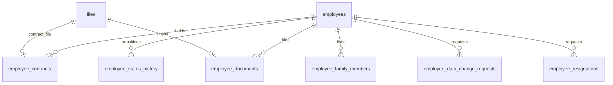
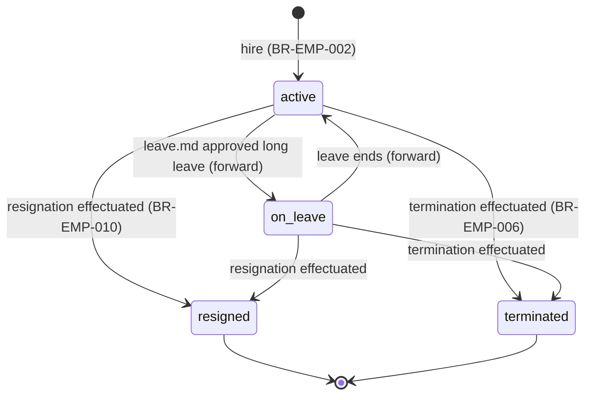
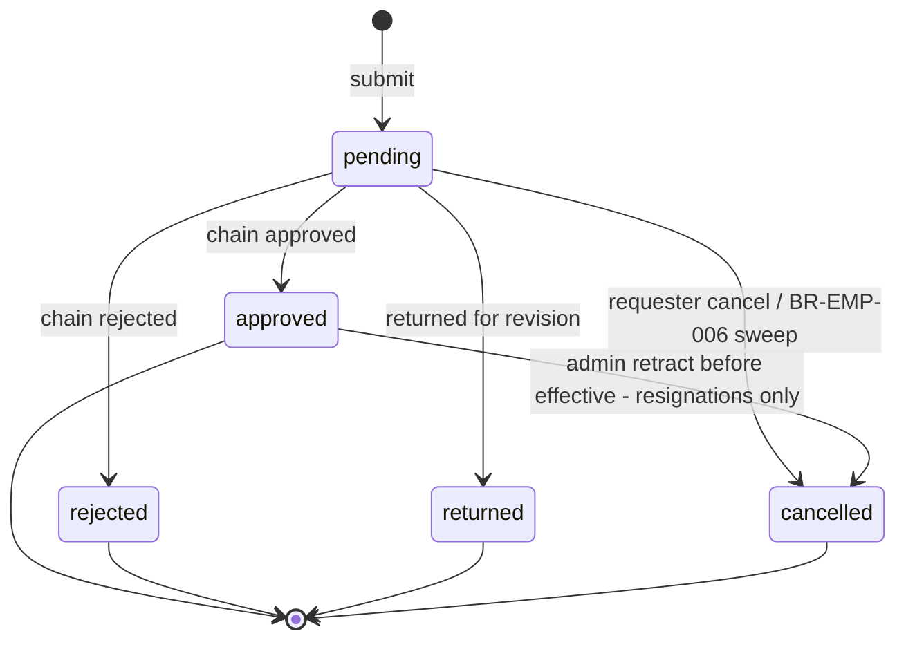
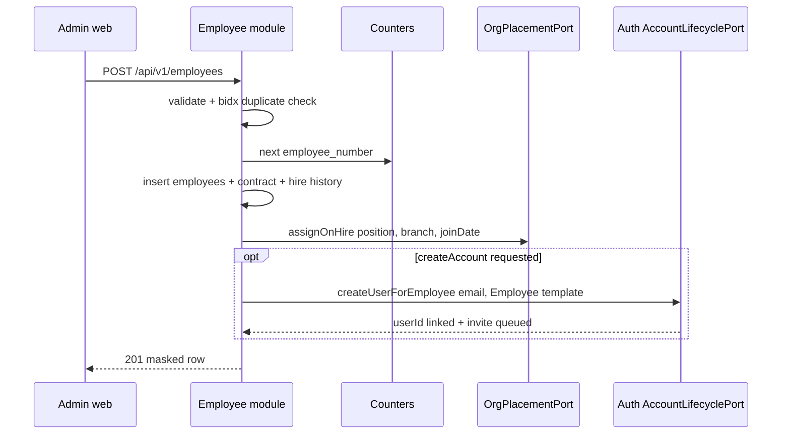
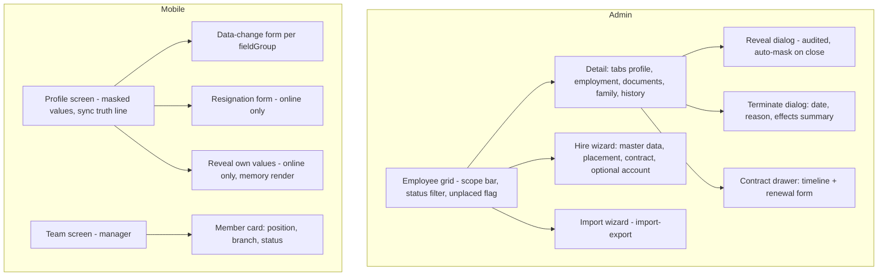

# Module: Employee

Status: Active (Phase 3) · Related ADRs: `ADR-0016` (field-level encryption — Accepted), `ADR-0002` (tenant scoping), `ADR-0005` (data scope), `ADR-0008` (data-change/resignation chains), `ADR-0015` (master import) · Depends on: `docs/06-modules/holiday.md` (template), `docs/06-modules/organization.md` (placement ports), `docs/04-database/core-schema.md` §7 (`employees` core), `docs/05-platform/document-storage.md`, `docs/05-platform/approval-engine.md`, `docs/05-platform/authentication.md` (account lifecycle) · Consumers: shift/attendance/leave/overtime/payroll (master data, status), tax-pph21 (NIK/NPWP/PTKP), bpjs (numbers), recruitment (hire conversion), reports

Namespace `employee` (naming §4, error prefix `EMP`). Employee master data (identity, statutory numbers, bank), PKWT/PKWTT contracts with end-date reminders, status lifecycle, self-service data-change and resignation requests through the approval engine, employee documents, bulk import. Inherits all global standards; deviations only.

## 1. Purpose & Scope

Own the person-level truth every payroll-, tax-, and time-math module reads: who the employee is (NIK, NPWP, PTKP, BPJS numbers, bank account — the ADR-0016 encrypted set), under which contract (PKWT with end date / PKWTT), and in which lifecycle state (`active`, `on_leave`, `resigned`, `terminated`). Exposes masked read surfaces everywhere, audited reveal endpoints for full values, and the hire operation that seeds placement (BR-ORG-002) and optionally the login account.

Religion is captured solely for THR eligibility mapping (payroll.md) and BPJS/tax document needs — a UU PDP special-category field; purpose limitation recorded in security-standards §9 terms (A-020).

**V1 exclusions:** compensation/salary history (payroll.md owns it — nothing money-valued lives here), education & prior-work-history records, employee photos beyond documents, org placement writes other than hire seeding (organization.md owns moves), notice-period policy enforcement on resignations (approvers judge), employee self-upload of documents (HR uploads, employee views), kiosk/shared-device concerns, a first-class `Employment` entity (migration path §4.4).

## 2. Actors & Permissions

| Action | Permission key | Data scope | Employee | Manager | HR Staff | HR Admin | System Administrator |
|---|---|---|---|---|---|---|---|
| View own profile (masked) + team list | — (authenticated; mobile + web) | self / team (org port) | ✅ | ✅ | ✅ | ✅ | ✅ |
| Reveal own sensitive values | — (authenticated; sensitive read §4.3) | self | ✅ | ✅ | ✅ | ✅ | ✅ |
| Submit / cancel own data-change + resignation | — (authenticated) | self | ✅ | ✅ | ✅ | ✅ | ✅ |
| List/read employees (masked) | `employee.master.read` | company / tenant per assignment | — | — | ✅ | ✅ | ✅ |
| Hire (create) | `employee.master.create` | company / tenant per assignment | — | — | — | ✅ | ✅ |
| Edit master data, contracts, family; admin-cancel resignations | `employee.master.update` | company / tenant per assignment | — | — | — | ✅ | ✅ |
| Terminate | `employee.termination.execute` | company / tenant per assignment | — | — | — | ✅ | ✅ |
| Delete (terminal-status rows only) | `employee.master.delete` | company / tenant per assignment | — | — | — | — | ✅ |
| Reveal any employee's sensitive values | `employee.sensitive.read` | company / tenant per assignment | — | — | — | ✅ | ✅ |
| Manage employee documents | `employee.document.create` / `employee.document.delete` | company / tenant per assignment | — | — | ✅ | ✅ | ✅ |
| Read employee documents | `employee.document.read` (self: own docs without key) | company / self | own | — | ✅ | ✅ | ✅ |
| Import / export master data | `employee.master.import` / `employee.master.export` | company / tenant per assignment | — | — | — | ✅ | ✅ |

Document-storage binds `employee_document` category permissions to the three `employee.document.*` keys with this module's ownership resolver (self = subject employee's own committed files; doc-storage §4.2 duty fulfilled). Out-of-scope employees are 404 (existence hiding).

## 3. Business Rules

| # | Rule |
|---|---|
| BR-EMP-001 | **One live employment per person per tenant:** NIK uniqueness is enforced on the blind index over non-terminal rows only — partial unique `(tenant_id, nik_bidx)` `WHERE deleted_at IS NULL AND status IN ('active','on_leave')`. Rehire and cross-company transfer (= terminate + rehire, BR-ORG-002) create a **new** employee row (new employee number); terminal rows are never reactivated. Episodes of the same person share a NIK until the `Employment` entity formalizes the link (§4.4). NPWP gets the same partial unique where present. |
| BR-EMP-002 | **Hire is atomic:** one transaction writes the employees row (number from the per-company counter, conventions §6), the initial contract row (`start_date = join_date`), the `hire` status-history row, and the initial placement via `OrgPlacementPort.assignOnHire` (BR-ORG-002 — position + branch are mandatory create inputs). Optional account provisioning (user + link + Employee role template + `auth.invite`) joins the same transaction. Create form, `employee.master` import rows, and recruitment conversion all run this one use case. |
| BR-EMP-003 | **Masked always; reveal is the only full-value path** (ADR-0016): every list/detail/profile/export surface returns the encrypted set masked (§4.3 matrix); full values exist only on the reveal endpoints and in approver views of bank/identity data-changes — each such render is a fail-closed sensitive read (`employee.sensitive.revealed`, audit-log §4.3). Drift never stores the encrypted set — mobile keeps server-computed masked strings only. |
| BR-EMP-004 | Blind indexes: `nik_bidx`/`npwp_bidx` = `HMAC-SHA256(tenant index key, digits-only value)` written by the repository on every insert/update of the source field; uniqueness (BR-EMP-001) and import duplicate detection run on the bidx, never on ciphertext (ADR-0016). |
| BR-EMP-005 | **Status machine (§4.2):** `active ↔ on_leave` (owned by leave.md — no manual toggle in V1; approving a leave type flagged `sets_employee_on_leave` schedules both rows through `EmployeeStatusPort`, §13, leave.md BR-LVE-017. Short leave never moves the status); `active/on_leave → resigned` (approved resignation, effective the day after the last working day); `active/on_leave → terminated` (admin act). Transitions are `employee_status_history` rows; future-dated rows are applied by the daily effectuate job (`applied_at` stamp = idempotency). `resigned`/`terminated` are terminal (BR-EMP-001 rehire path). Invalid transitions → `EMP_STATUS_TRANSITION_INVALID`. |
| BR-EMP-006 | **Exit side effects run in the effectuation transaction:** close the live org assignment (`OrgPlacementPort.closeOnExit`, effective the status date), deactivate the linked user via authentication's `AccountLifecyclePort.deactivateUser` (login/refresh die immediately — BR-AUTH-002/§9 liveness; access tokens age out ≤ 15 min), cancel the employee's still-`pending` data-change/resignation requests, and emit `employee.status.changed`. Payroll consumes the event for final settlement (forward contract, payroll.md); document retention clocks start per database-conventions §4.4. |
| BR-EMP-007 | **Contracts:** `kind = pkwt ⇒ end_date NOT NULL`, `kind = pkwtt ⇒ end_date NULL` (DB CHECK); per-employee ranges never overlap (gist exclusion, inclusive-end semantics); renewal = new row starting the day after the predecessor ends. `employees.employment_type` mirrors the contract current on today's date (repository sets it on contract writes). Contract files attach via `employee_contracts.file_id` with `document_expires_at = NULL` — end-date reminders ride the contract ladder, not file expiry (grilled 2026-08-02; file expiry is reserved for KTP/certification validity, BR-DOC-008). |
| BR-EMP-008 | **Contract-end reminder ladder:** daily scan over live PKWT contracts without a successor row; windows from `employee.contract_reminder_days` (csv, descending, default `60,30`); fire the largest window `w` where `days_left ≤ w` and not already fired at `w` or below (`last_reminded_days` stamp), notify `employee.contract_expiring` (HR Admins of the company). A renewal row silences the predecessor's remaining windows. |
| BR-EMP-009 | **Data-change requests** (`employee.data_change`, approval-engine registry): fieldGroup ∈ `identity \| contact \| bank \| family` with fixed field whitelists (§8) — NIK, NPWP, and PTKP are **not** self-serviceable (admin edits only; tax identity is not an employee-side toggle). One `pending` request per employee per fieldGroup (`EMP_DATA_CHANGE_PENDING`). The proposed-changes payload is stored whole-encrypted (tenant DEK — it may carry bank numbers). On approval, the diff applies to the master rows in the terminal-event transaction (channel-1 audit captures it); `family` payloads are replace-all lists. Requester cancel while pending. |
| BR-EMP-010 | **Resignations** (`employee.resignation`, approval-engine registry): one pending per employee (`EMP_RESIGNATION_PENDING`); approval schedules the `resigned` status-history row effective `last_day + 1`; requester cancels while pending; HR Admin may cancel an approved, not-yet-effective resignation (retraction — deletes the scheduled row, request → `cancelled`). Online-only on mobile (SYNC_OFFLINE class — rare + heavy, offline-sync §11). |
| BR-EMP-011 | **Audit:** `employees`, `employee_contracts`, `employee_family_members`, `employee_documents` are channel-1 audited (registered audit-log §4.2; encrypted columns diff as an `[encrypted]` change marker — never ciphertext or plaintext; `ptkp_status` masked per the §10 registry). `employee_status_history` and the two request tables stay out: history rows are themselves the trail, and request decisions live in the approval trail (BR-AUD-004). Reveals are sensitive reads (BR-EMP-003). |
| BR-EMP-012 | **Import** (`employee.master`, ADR-0015): `create_only`, `partial` commit; each valid row executes BR-EMP-002 wholesale (org resolution via `company_code`/`branch_code`/`position_code` natural keys); duplicate NIK detection via bidx (in-file and against live non-terminal rows); **no account provisioning from files** — invites are explicit per-employee acts afterwards. Provided `employee_number` is honored (uniqueness validated); blank = counter. |
| BR-EMP-013 | Soft delete only for terminal-status rows (`EMP_STILL_ACTIVE` otherwise) — active employees are terminated first, never deleted. Purge after the statutory post-employment horizon (database-conventions §4.4; individual UU PDP erasure is purge-based per ADR-0016 decision 7). |

## 4. Domain Model

### 4.1 Schema



`employees` is defined in core-schema §7 (owner: this module). This module's migration extends it — the ADR-0016 set uses the `encryptedText` custom column type (repositories see plaintext; storage sees `v1:`-prefixed AEAD):

```ts
// additions to employees (src/database/schema/employee.ts)
nik: encryptedText('nik').notNull(),                          // ADR-0016
nikBidx: text('nik_bidx').notNull(),                          // BR-EMP-004
npwp: encryptedText('npwp'),                                  // NULL = no NPWP (NIK-as-NPWP era)
npwpBidx: text('npwp_bidx'),
bpjsKesehatanNumber: encryptedText('bpjs_kesehatan_number'),
bpjsKetenagakerjaanNumber: encryptedText('bpjs_ketenagakerjaan_number'),
bankName: text('bank_name'),
bankAccountNumber: encryptedText('bank_account_number'),
bankAccountHolder: encryptedText('bank_account_holder'),
birthPlace: text('birth_place'),
birthDate: date('birth_date').notNull(),
gender: gender('gender').notNull(),
maritalStatus: maritalStatus('marital_status').notNull(),
religion: religion('religion'),                               // THR mapping (A-020); payroll validates presence
ptkpStatus: ptkpStatus('ptkp_status').notNull(),              // plaintext by ADR-0016 decision 1
address: text('address'),
phone: text('phone'),
personalEmail: text('personal_email'),
```

```ts
export const gender = pgEnum('gender', ['male', 'female']);
export const maritalStatus = pgEnum('marital_status', ['single', 'married', 'divorced', 'widowed']);
export const religion = pgEnum('religion', ['islam', 'protestant', 'catholic', 'hindu', 'buddhist', 'confucian']);
export const ptkpStatus = pgEnum('ptkp_status', [
  'tk_0', 'tk_1', 'tk_2', 'tk_3', 'k_0', 'k_1', 'k_2', 'k_3', 'k_i_0', 'k_i_1', 'k_i_2', 'k_i_3',
]);
// > ⚠️ VERIFY: confirm against current Indonesian regulation before implementation. — PTKP category set.
export const familyRelationship = pgEnum('family_relationship', ['spouse', 'child', 'parent', 'sibling', 'other']);
export const employeeDocumentType = pgEnum('employee_document_type', ['ktp', 'kartu_keluarga', 'npwp_card', 'ijazah', 'certification', 'other']);
export const dataChangeFieldGroup = pgEnum('data_change_field_group', ['identity', 'contact', 'bank', 'family']);
export const employeeRequestStatus = pgEnum('employee_request_status', ['pending', 'approved', 'rejected', 'returned', 'cancelled']);
export const employeeStatusSource = pgEnum('employee_status_source', ['hire', 'resignation', 'termination', 'leave', 'admin']);

export const employeeContracts = pgTable('employee_contracts', {
  ...id, ...tenantId,
  employeeId: uuid('employee_id').notNull().references(() => employees.id),
  kind: employmentType('kind').notNull(),
  startDate: date('start_date').notNull(),
  endDate: date('end_date'),                                  // NULL = PKWTT (CHECK below)
  fileId: uuid('file_id').references(() => files.id),         // signed contract scan; expiry NULL (BR-EMP-007)
  note: text('note'),
  lastRemindedDays: integer('last_reminded_days'),            // BR-EMP-008 ladder stamp
  ...auditColumns, ...softDeleteColumns,
}, (t) => [
  index('idx_employee_contracts_tenant_id_employee_id_start_date').on(t.tenantId, t.employeeId, t.startDate),
  index('idx_employee_contracts_reminder_scan').on(t.tenantId, t.endDate)
    .where(sql`kind = 'pkwt' AND deleted_at IS NULL`),        // BR-EMP-008
]);

export const employeeStatusHistory = pgTable('employee_status_history', {
  ...id, ...tenantId,
  employeeId: uuid('employee_id').notNull().references(() => employees.id),
  status: employeeStatus('status').notNull(),
  source: employeeStatusSource('source').notNull(),
  sourceId: uuid('source_id'),                                // resignation/leave row when applicable
  effectiveDate: date('effective_date').notNull(),
  reason: text('reason'),
  appliedAt: timestamp('applied_at', { withTimezone: true }), // NULL = scheduled (effectuate job)
  ...auditColumns, ...softDeleteColumns,                      // soft delete = cancelled schedule
}, (t) => [
  index('idx_employee_status_history_tenant_id_employee_id_effective_date')
    .on(t.tenantId, t.employeeId, t.effectiveDate),
  index('idx_employee_status_history_due').on(t.tenantId, t.effectiveDate)
    .where(sql`applied_at IS NULL AND deleted_at IS NULL`),   // effectuate scan
]);

export const employeeFamilyMembers = pgTable('employee_family_members', {
  ...id, ...tenantId,
  employeeId: uuid('employee_id').notNull().references(() => employees.id),
  name: text('name').notNull(),
  relationship: familyRelationship('relationship').notNull(),
  birthDate: date('birth_date'),
  phone: text('phone'),
  isEmergencyContact: boolean('is_emergency_contact').notNull().default(false),
  ...auditColumns, ...softDeleteColumns,
}, (t) => [
  index('idx_employee_family_members_tenant_id_employee_id').on(t.tenantId, t.employeeId),
]);

export const employeeDocuments = pgTable('employee_documents', {
  ...id, ...tenantId,
  employeeId: uuid('employee_id').notNull().references(() => employees.id),
  fileId: uuid('file_id').notNull().references(() => files.id),
  docType: employeeDocumentType('doc_type').notNull(),
  title: text('title'),
  ...auditColumns, ...softDeleteColumns,
}, (t) => [
  uniqueIndex('uq_employee_documents_tenant_id_file_id').on(t.tenantId, t.fileId)
    .where(sql`deleted_at IS NULL`),
  index('idx_employee_documents_tenant_id_employee_id').on(t.tenantId, t.employeeId),
]);

export const employeeDataChangeRequests = pgTable('employee_data_change_requests', {
  ...id, ...tenantId,
  employeeId: uuid('employee_id').notNull().references(() => employees.id),
  fieldGroup: dataChangeFieldGroup('field_group').notNull(),
  payload: encryptedText('payload').notNull(),                // whole-encrypted proposed diff (BR-EMP-009)
  status: employeeRequestStatus('status').notNull().default('pending'),
  approvalInstanceId: uuid('approval_instance_id')
    .references(() => approvalInstances.id),
  decidedAt: timestamp('decided_at', { withTimezone: true }),
  appliedAt: timestamp('applied_at', { withTimezone: true }),
  opId: uuid('op_id'),                                        // offline create dedup (ADR-0003)
  ...auditColumns, ...softDeleteColumns,
}, (t) => [
  uniqueIndex('uq_employee_data_change_requests_tenant_id_op_id').on(t.tenantId, t.opId)
    .where(sql`op_id IS NOT NULL`),
  uniqueIndex('uq_employee_data_change_requests_one_pending')
    .on(t.tenantId, t.employeeId, t.fieldGroup).where(sql`status = 'pending' AND deleted_at IS NULL`),
  index('idx_employee_data_change_requests_tenant_id_employee_id').on(t.tenantId, t.employeeId),
]);

export const employeeResignations = pgTable('employee_resignations', {
  ...id, ...tenantId,
  employeeId: uuid('employee_id').notNull().references(() => employees.id),
  lastDay: date('last_day').notNull(),
  reason: text('reason').notNull(),
  status: employeeRequestStatus('status').notNull().default('pending'),
  approvalInstanceId: uuid('approval_instance_id')
    .references(() => approvalInstances.id),
  decidedAt: timestamp('decided_at', { withTimezone: true }),
  statusHistoryId: uuid('status_history_id')
    .references(() => employeeStatusHistory.id),              // scheduled transition (BR-EMP-010)
  ...auditColumns, ...softDeleteColumns,
}, (t) => [
  uniqueIndex('uq_employee_resignations_one_pending')
    .on(t.tenantId, t.employeeId).where(sql`status = 'pending' AND deleted_at IS NULL`),
  index('idx_employee_resignations_tenant_id_employee_id').on(t.tenantId, t.employeeId),
]);
```

Hand-written in the generating migration (database-conventions §10):

- `uq_employees_tenant_id_nik_bidx` — partial unique `(tenant_id, nik_bidx) WHERE deleted_at IS NULL AND status IN ('active','on_leave')` (BR-EMP-001; replaces the conventions-era `uq_employees_tenant_id_nik` example — the plaintext column no longer exists to index, ADR-0016).
- `uq_employees_tenant_id_npwp_bidx` — same predicate plus `npwp_bidx IS NOT NULL`.
- `ck_employee_contracts_end_by_kind` — `(kind = 'pkwt' AND end_date IS NOT NULL) OR (kind = 'pkwtt' AND end_date IS NULL)` (BR-EMP-007).
- `excl_employee_contracts_no_overlap` — gist exclusion on `(tenant_id, employee_id, daterange(start_date, end_date, '[]')) WHERE deleted_at IS NULL` (inclusive end — a contract ends **on** `end_date`; NULL upper = unbounded PKWTT).

No `version` columns: master rows are admin-web-mutable only, data-change requests are create + transition ops (never offline-edited in place) — database-conventions §1.10 scope. RLS standard on all six tables.

### 4.2 Employee status lifecycle



Terminal states never transition; rehire is a new row (BR-EMP-001). Every arrow = one `employee_status_history` row; future-dated rows sit `applied_at NULL` until the effectuate job runs them.

Data-change and resignation requests share one lifecycle (`employee_request_status`):



`returned` is terminal on the row — resubmission is a new request (engine return semantics). Data-change `approved` additionally stamps `applied_at` in the same transaction (BR-EMP-009); resignation `approved → cancelled` is the retract path (BR-EMP-010).

### 4.3 Masking matrix (BR-EMP-003)

Masked format: all but the last 4 characters replaced (`••••••••••••3456`); holder names keep the first word. `M` = masked, `F` = full, `—` = absent from the payload.

| Field | List (`master.read`) | Detail (`master.read`) | Self profile | Reveal (self / `sensitive.read`) | Approver view (bank/identity change) |
|---|---|---|---|---|---|
| NIK | — | M | M | F | F (sensitive read) |
| NPWP | — | M | M | F | F (sensitive read) |
| BPJS numbers ×2 | — | M | M | F | — |
| Bank account number / holder | — | M | M | F | F (sensitive read) |
| PTKP status | — | F | F | F | — |
| Birth date, address, phone, personal email | — | F | F | F | F |

Plaintext-class fields (birth date, address, phone, PTKP) are RBAC-gated display, not encryption (ADR-0016 decision 1); they stay out of list payloads as hygiene. Exports follow the same split — base columns vs `employee.sensitive.read`-gated columns (§13).

### 4.4 `Employment` entity migration path (spec §5.6)

Kept cheap by construction: (1) `employees` carries **no** org placement (core-schema §1) — placement already lives in an effective-dated satellite; (2) employment-episode facts (`company_id`, `employment_type`, `join_date`, `status`) sit in columns no other module FKs into — satellites reference `employees.id` only; (3) rehire episodes are already separate rows (BR-EMP-001). Extraction = create `employments` (employee_id, company_id, type, join_date, status, dates), move those columns, repoint `org_assignments.employee_id` and payroll/attendance FKs at the episode where period-correctness demands, collapse same-NIK rows into one person row, and flip the NIK partial unique to a total unique. No consumer reads change shape before that migration — they all go through this module's read models and ports.

## 5. Use Cases

**UC-EMP-001 — Hire.** Actor: HR Admin (form), import row handler, recruitment conversion (forward). Main: validate master data + fieldGroup-independent rules → NIK/NPWP bidx duplicate check (BR-EMP-001/004) → number from counter (or honored input, BR-EMP-012) → single transaction per BR-EMP-002 (row + contract + `hire` history + `assignOnHire` + optional account) → 201 masked row. Exceptions: org port failures surface as their `ORG_*` codes; duplicate NIK → `VAL_DUPLICATE` on `nik`.

**UC-EMP-002 — Admin edit.** PATCH master fields (including the encrypted set — write path takes plaintext, response is masked; bidx rewritten on NIK/NPWP change with the uniqueness check). No approval chain — `employee.master.update` is the trusted-admin path; channel-1 audit records the diff (`[encrypted]` markers, BR-EMP-011).

**UC-EMP-003 — Reveal.** `GET …/sensitive` (self or `employee.sensitive.read`): decrypt in-request → fail-closed sensitive-read insert (`employee.sensitive.revealed`, UC-AUD-003) → full values, `Cache-Control: no-store` (global §4 rule), never persisted client-side (mobile renders from memory — ADR-0016 decision 6).

**UC-EMP-004 — Data-change request.** Employee (mobile/web): pick fieldGroup → form pre-filled from masked profile (encrypted fields start blank — entering a value proposes replacement) → submit (queueable offline, `opId`) → whitelist validation (§8) → one-pending guard → payload encrypted → approval submit (`employee.data_change`, context `{ fieldGroup }`). Terminal: approved → apply diff + `applied_at` in the terminal-event transaction (BR-EMP-009); rejected/returned → nothing applied. Cancel: requester, while pending (queueable transition; replay converges per offline-sync §5).

**UC-EMP-005 — Resignation.** Employee (online-only): last day + reason → one-pending guard → approval submit (`employee.resignation`, context `{ lastDay }`). Approved → scheduled `resigned` history row at `last_day + 1` (BR-EMP-010). Effectuation runs BR-EMP-006. Retraction: HR Admin cancel before the effective date (UC path in §7).

**UC-EMP-006 — Terminate.** HR Admin: effective date (today or future, ≥ join date) + reason → `terminated` history row (`source = termination`); today → effectuate inline, future → scheduled. Effectuation transaction = BR-EMP-006 side-effect set.

**UC-EMP-007 — Status effectuation (job).** Daily per tenant: due history rows (`applied_at NULL`, `effective_date ≤ today`) in effective-date order → set `employees.status`, run BR-EMP-006 when entering a terminal state, stamp `applied_at`. Idempotent by the stamp; crash mid-set resumes on next run.

**UC-EMP-008 — Contract renewal / correction.** New row per renewal (BR-EMP-007); PATCH fixes dates/file on an existing row (overlap re-checked); DELETE (soft) removes a mistaken row. `employees.employment_type` re-derived after every write.

**UC-EMP-009 — Contract reminder scan (job).** Daily per tenant over the partial index: BR-EMP-008 ladder → `employee.contract_expiring` notifications → stamp `last_reminded_days`.

**UC-EMP-010 — Documents.** Attach: doc-storage staged upload (`employee_document` category) → `POST …/documents` binds `fileId` + `docType`; KTP/certification rows may set `document_expires_at` through the doc-storage metadata (BR-DOC-008 reminders). Employee reads own documents; HR manages per §2.

**UC-EMP-011 — Team list.** Manager (mobile MSS): `GET /me/team` → org port reporting-line inverse (direct reports = holders of positions whose `reports_to` lands on a position the caller holds) → basic fields only (name, position, branch, status) — no sensitive data, no permission key (data scope team by construction).

**UC-EMP-012 — Import / export.** Import per BR-EMP-012 (pipeline wholesale, import-export.md). Export `employee.master`: base + gated column sets (§13); gated downloads mint `document.download.gated_export` sensitive reads (BR-IMP-010).

Hire sequence (all inside one transaction boundary except the signed invite email, which rides the notification outbox):



## 6. UI Flow



- Grid: TanStack per design-system; **unplaced flag** (warning chip) when the org port returns null placement on a non-pre-join row (UC-ORG-001 anomaly surface — organization.md duty honored). Status chips use the design-system status vocabulary; terminal rows render muted.
- Reveal dialog: explicit button ("Show full values"), fetches `…/sensitive`, auto-masks on close/timeout (60 s), never written to client state stores (React Query `gcTime: 0` for this key; mobile memory-only — ADR-0016).
- Hire wizard steps: identity → statutory (NIK/NPWP/PTKP/BPJS) → placement (company → position → branch pickers) → contract (kind, dates, file) → account (optional email invite). Blocked submit lists per-step errors.
- Terminate dialog states its effect set (assignment closure, account deactivation, pending-request cancellation) before confirm — destructive-style copy per design-system.
- Mobile data-change: per-group forms; pending banner with cancel; offline submit shows the unsynced chip (offline-sync §8 vocabulary). Resignation and reveal render the offline-disabled state with the standard "connection required" hint (SYNC_OFFLINE).
- Empty states: no documents → EmptyState + upload CTA (admin); team empty → "no direct reports".

## 7. API

All endpoints follow the canonical spec-block form (api-standards §13). Import/template/export endpoints ride import-export §7 (definitions `employee.master`). Errors beyond the implied set only.

| Endpoint | Permission | Pagination | Queue-reachable | Idempotency |
|---|---|---|---|---|
| `GET /api/v1/employees` | `employee.master.read` | offset | no | — |
| `POST /api/v1/employees` | `employee.master.create` | — | no | accepted |
| `GET /api/v1/employees/{id}` | `employee.master.read` | — | no | — |
| `PATCH /api/v1/employees/{id}` | `employee.master.update` | — | no | — |
| `DELETE /api/v1/employees/{id}` | `employee.master.delete` | — | no | — |
| `POST /api/v1/employees/{id}/terminate` | `employee.termination.execute` | — | no | accepted |
| `GET /api/v1/employees/{id}/sensitive` | `employee.sensitive.read` | — | no | — |
| `GET /api/v1/employees/{id}/contracts` · `POST` · `PATCH /{cid}` · `DELETE /{cid}` | read: `employee.master.read`; writes: `employee.master.update` | — (history, small) | no | — |
| `GET /api/v1/employees/{id}/family-members` · `POST` · `PATCH /{fid}` · `DELETE /{fid}` | as contracts | — | no | — |
| `GET /api/v1/employees/{id}/documents` · `POST` · `DELETE /{docId}` | `employee.document.read` / `.create` / `.delete` | — | no | — |
| `GET /api/v1/employees/{id}/data-change-requests` | `employee.master.read` | — (small) | no | — |
| `POST /api/v1/employees/{id}/resignations/{rid}/cancel` | `employee.master.update` | — | no | — |
| `GET /api/v1/me/profile` | — (authenticated) | — | no | — |
| `GET /api/v1/me/profile/sensitive` | — (authenticated, self) | — | no | — |
| `GET /api/v1/me/team` | — (authenticated; manager-derived) | — | no | — |
| `GET /api/v1/me/documents` | — (authenticated, self) | — | no | — |
| `POST /api/v1/me/data-change-requests` | — (authenticated) | — | **yes** | **required** |
| `GET /api/v1/me/data-change-requests` | — (authenticated) | cursor | no | — |
| `POST /api/v1/me/data-change-requests/{id}/cancel` | — (authenticated, own pending) | — | **yes** | **required** |
| `POST /api/v1/me/resignation` | — (authenticated) | — | no (online-only) | accepted |
| `POST /api/v1/me/resignation/{id}/cancel` | — (authenticated, own pending) | — | no | — |

#### GET /api/v1/employees
Request: `?companyId=&status=&employmentType=&q=` (name/number contains) `&unplaced=true` + offset params. Response 200: `data: [{ id, employeeNumber, fullName, companyId, status, employmentType, joinDate, contractEndDate, placement: { positionTitle, branchName, departmentName } | null, hasUser, updatedAt }]` + meta. Placement batch-resolved via `OrgQueryPort.placements` (as-of today); `null` placement on a joined row renders the unplaced flag. No sensitive fields (§4.3).

#### POST /api/v1/employees
Request:

| Field | Type | Required | Rule |
|---|---|---|---|
| `companyId` | uuid | ✅ | caller scope |
| `fullName` | string | ✅ | 2–150 |
| `nik` | string | ✅ | 16 digits (BR-EMP-004 normalize) |
| `npwp` | string | — | 15–16 digits |
| `birthPlace` / `birthDate` | string / date | birthDate ✅ | §8 bounds |
| `gender` / `maritalStatus` / `religion` / `ptkpStatus` | enums | gender, maritalStatus, ptkpStatus ✅ | §4.1 enums |
| `address` / `phone` / `personalEmail` | string | — | §8 |
| `bankName` / `bankAccountNumber` / `bankAccountHolder` | string | — | filled before first payroll (payroll validates) |
| `bpjsKesehatanNumber` / `bpjsKetenagakerjaanNumber` | string | — | digits ≤ 16 |
| `employeeNumber` | string | — | blank = counter (BR-EMP-012 rule applies to the form too) |
| `joinDate` | date | ✅ | contract start |
| `employmentType` | enum | ✅ | initial contract kind |
| `contractEndDate` | date | pkwt ✅ | BR-EMP-007 |
| `contractFileId` | uuid | — | committed `employee_document` file |
| `positionId` / `branchId` | uuid | ✅ | BR-ORG-002 (company match) |
| `createAccount` | `{ email }` | — | user + Employee template + invite (BR-EMP-002) |

Response 201: masked detail row. Errors: `VAL_DUPLICATE` (nik/npwp/number) · `ORG_CROSS_COMPANY` / `ORG_ASSIGNMENT_OVERLAP` / `ORG_PERIOD_LOCKED` (port) · duplicate account email → `VAL_DUPLICATE`.

#### GET /api/v1/employees/{id} · PATCH
Detail: everything in the create shape (masked per §4.3) + `status`, `placement`, `currentContract`, `familyMembers`, `documents` summary, `statusHistory` (applied + scheduled), `pendingRequests` summary. PATCH: any master field except `companyId` (transfer = terminate + rehire), `employeeNumber` (identity), `status` (machine-only, `EMP_STATUS_TRANSITION_INVALID` if attempted — rejected as unknown field per api-standards §3), `joinDate` correction allowed while no locked-period facts reference the employee (else `VAL_OUT_OF_RANGE`).

#### POST /api/v1/employees/{id}/terminate
Request: `{ effectiveDate: date, reason: string (✅, 3–300) }` — `effectiveDate` ≥ join date, ≥ today. Response 200: `{ id, status, effectiveDate, applied: boolean }`. Errors: `EMP_STATUS_TRANSITION_INVALID` (already terminal / pending terminal schedule exists).

#### GET /api/v1/employees/{id}/sensitive · GET /api/v1/me/profile/sensitive
Response 200: `{ nik, npwp, bpjsKesehatanNumber, bpjsKetenagakerjaanNumber, bankName, bankAccountNumber, bankAccountHolder }` — full values (UC-EMP-003). Audited fail-closed; audit failure → `SYS_INTERNAL`, no data.

#### Contracts (`/employees/{id}/contracts`)
`GET` 200: rows newest-first `{ id, kind, startDate, endDate, fileId, note, lastRemindedDays, createdBy }`. `POST` request: `kind`, `startDate` (✅), `endDate` (pkwt ✅), `fileId?`, `note?` — overlap → `EMP_CONTRACT_OVERLAP`. `PATCH`: dates/file/note (same checks). `DELETE`: soft; last remaining contract row cannot be deleted (`VAL_VALIDATION_FAILED` — an employee always has a contract).

#### Family members (`/employees/{id}/family-members`)
`POST`/`PATCH` request: `name` (✅ 2–120), `relationship` (✅ enum), `birthDate?`, `phone?`, `isEmergencyContact?`. Response: row. No module codes.

#### Documents (`/employees/{id}/documents`, `/me/documents`)
`POST` request: `{ fileId (committed employee_document file, ✅), docType (✅), title?, documentExpiresAt? }` — expiry forwarded to the files row (BR-DOC-008; `other`/`ijazah` typically none). File already bound → `VAL_DUPLICATE`. `GET` 200: `data: [{ id, docType, title, file: { id, originalName, mime, sizeBytes, documentExpiresAt } }]`. `DELETE`: soft (file row + object follow doc-storage retention). `/me/documents` = same shape, self scope.

#### POST /api/v1/me/data-change-requests
Request: `{ fieldGroup (✅), changes (✅ object per §8 whitelist; family = full list), opId? (queue sets it) }`. Response 201: `{ id, fieldGroup, status, submittedAt }`. Errors: `EMP_DATA_CHANGE_PENDING` · `APRV_NO_CHAIN_CONFIGURED` (tenant misconfig) · whitelist violation → `VAL_VALIDATION_FAILED`. Replayed create (op_id hit) returns the original 201 (offline-sync §5). `GET` (cursor): own requests newest-first with status + decided/applied stamps; payload echoed masked (bank values re-masked). Cancel: pending only → `APRV_INSTANCE_NOT_ACTIONABLE` mapped rejection otherwise; modules' §10 replay-success mapping applies (already-cancelled → success).

#### POST /api/v1/me/resignation · cancels
Request: `{ lastDay (✅, ≥ today), reason (✅ 3–300) }`. Response 201: `{ id, lastDay, status }`. Errors: `EMP_RESIGNATION_PENDING`. Requester cancel: pending only. Admin cancel (`/employees/{id}/resignations/{rid}/cancel`): pending **or** approved-not-yet-effective (deletes the scheduled history row); after effectiveness → `EMP_STATUS_TRANSITION_INVALID`.

#### GET /api/v1/me/profile
Response 200: `{ employee: masked §4.3 self shape, placement: { companyName, branchName, branchTimezone, departmentName, positionTitle, jobLevelName }, manager: { name, positionTitle } | null, currentContract: { kind, startDate, endDate }, familyMembers: [...], leaveSummary: { balances: LeaveBalanceSnapshot[], pendingCount } | null }` — filled from `LeaveQueryPort.balanceFor` as of 2026-08-02 (leave.md §4.3); `null` only while no leave type applies to the employee. The mobile bootstrap read (§10) — the fuller leave surface lives at `GET /me/leave/snapshot` (leave.md §7).

#### GET /api/v1/me/team
Response 200: `data: [{ employeeId, fullName, positionTitle, branchName, status }]` — direct reports via org port; empty for non-managers. No pagination (team sizes are dozens; deviation stated).

## 8. Validation Rules

| Field | Rule | Error code |
|---|---|---|
| `nik` | exactly 16 digits after normalization | `VAL_INVALID_FORMAT` |
| `npwp` | 15–16 digits | `VAL_INVALID_FORMAT` |
| `bpjs*Number` | digits, 8–16 | `VAL_INVALID_FORMAT` |
| `birthDate` | between 1940-01-01 and today − 15 years (working-age floor) | `VAL_OUT_OF_RANGE` |
| `phone` / family `phone` | `+`? then 8–15 digits | `VAL_INVALID_FORMAT` |
| `personalEmail` / account `email` | email format | `VAL_INVALID_FORMAT` |
| `fullName` / `name` / `title` / `reason` | trimmed length bounds per §7 | `VAL_REQUIRED` / `VAL_TOO_SHORT` / `VAL_TOO_LONG` |
| `joinDate` / `startDate` / `effectiveDate` / `lastDay` | ISO date; cross-field rules per §7 | `VAL_OUT_OF_RANGE` / `VAL_DATE_RANGE_INVALID` |
| enums | §4.1 sets | `VAL_INVALID_ENUM` |
| `employeeNumber` | 3–20, `[A-Z0-9-]`, unique per company | `VAL_INVALID_FORMAT` / `VAL_DUPLICATE` |

> ⚠️ VERIFY: confirm against current Indonesian regulation before implementation. — working-age floor (15 years) and PTKP category set (§4.1).

Data-change fieldGroup whitelists (BR-EMP-009):

| fieldGroup | Fields |
|---|---|
| `identity` | `fullName`, `birthPlace`, `birthDate`, `maritalStatus`, `religion` |
| `contact` | `address`, `phone`, `personalEmail` |
| `bank` | `bankName`, `bankAccountNumber`, `bankAccountHolder` |
| `family` | full `familyMembers` list (replace-all) |

Fields outside the group (or NIK/NPWP/PTKP anywhere) → `VAL_VALIDATION_FAILED` field entries.

## 9. Edge Cases & Failure Modes

- **Rehire with live NIK elsewhere in the tenant:** blocked by BR-EMP-001 until the prior row is terminal — the create error names the field (`VAL_DUPLICATE` on `nik`); the UI hint points at transfer-vs-rehire flows.
- **Terminated employee's pending requests:** effectuation cancels pending data-changes/resignations (BR-EMP-006); their approval instances cancel through the engine (terminal event → inbox items close).
- **Future termination vs future resignation both scheduled:** second terminal schedule rejected (`EMP_STATUS_TRANSITION_INVALID`) — one pending terminal transition at a time; retract first.
- **Data-change approved after admin edited the same field:** apply is a full overwrite of the proposed fields — last write wins, both writes audited; approvers see the request's captured values, not a live diff (snapshot semantics, chain snapshot precedent).
- **Bank change fraud surface:** stricter chain recommended (manager + HR Admin — §13); approver full-value render is itself an audited sensitive read, so exfiltration via the approval screen is traceable.
- **Contract gap (PKWT ended, renewal late):** legal — no auto-extension; the employee stays `active` (status is not contract-derived in V1); the reminder ladder is the guard. Payroll treats contract presence per its own rules (forward).
- **Import row with unknown position/branch code:** row error (existence lookup) in the error workbook; other rows commit (partial mode) — each committed row is a full BR-EMP-002 transaction, so no half-hired employees exist.
- **Account email already used by another tenant user:** `VAL_DUPLICATE` on `createAccount.email`; employee row itself is not created (single transaction).
- **Effectuate job down on the effective day:** next run applies the backlog in effective-date order; status reads before that show the stale value — bounded by the daily cadence; consumers reading `employee_status_history` (payroll cut-off checks) see the scheduled row regardless.
- **Reveal under revoked permission race:** each reveal re-checks permission at request time (no caching); the sensitive-read insert failing refuses the response (fail-closed, UC-AUD-003).
- **Employee without user account:** all self-service surfaces absent (no login); HR manages everything; invite later via account provisioning (`hasUser` flag drives the grid affordance).

## 10. Offline Behavior

Deviations from the global standard (offline-sync §10 checklist):

- **Entities:** own profile composite (`GET /me/profile`) → Drift mirrors `employees` (own row; **encrypted-set columns excluded — masked display strings stored instead**, BR-EMP-003) + `employee_family_members` (own). Sync class **reference data** (pull-only); no delta endpoint — a one-row composite refreshes on login, foreground, post-drain, and pull-to-refresh (deviation from api-standards §8: cursor machinery for a single row is waste; declared here).
- **Queueable ops:** `employee.data_change` **create** (`opId`, durable dedup — §4.1 unique) and **cancel** (transition op; replays past the Redis window converge as business rejections, mapped to replay-success when the request is already cancelled — offline-sync §5).
- **Online-only:** resignation submit/cancel, sensitive reveal (memory-render, never persisted — ADR-0016), document operations (signed-URL flows), team list (live org data; cached copy renders with the stale timestamp).
- Local retention: profile mirror lives until identity change (offline-sync §9); request history beyond the cursor window is server-fetched.

## 11. Module Error Codes

Registered this session:

| Code | HTTP | Trigger |
|---|---|---|
| `EMP_STILL_ACTIVE` | 409 | Delete attempted on a non-terminal-status employee — BR-EMP-013 |
| `EMP_STATUS_TRANSITION_INVALID` | 409 | Status transition outside the machine, duplicate terminal schedule, or retract after effectiveness — BR-EMP-005/006/010 |
| `EMP_CONTRACT_OVERLAP` | 409 | Contract range collides with an existing row (gist exclusion) — BR-EMP-007 |
| `EMP_DATA_CHANGE_PENDING` | 409 | A pending data-change already exists for the employee + fieldGroup — BR-EMP-009 |
| `EMP_RESIGNATION_PENDING` | 409 | A pending resignation already exists — BR-EMP-010 |

## 12. Background Jobs & Events

| Job | Queue / schedule | Behavior |
|---|---|---|
| `cron.employee.status-effectuate` | `maintenance`, daily 00:15 per-tenant fan-out (ADR-0010) | UC-EMP-007; idempotent via `applied_at` |
| `cron.employee.contract-scan` | `maintenance`, daily per-tenant fan-out | UC-EMP-009; idempotent via `last_reminded_days` |

Events emitted (outbox): `employee.status.changed` `{ employeeId, companyId, status, effectiveDate, source }` — consumers: payroll (final-settlement trigger), shift/attendance/leave (derivation stop, balance freeze — forward duties recorded in PROGRESS). Events consumed: none (leave.md will call a status port for `on_leave`, not an event — same-tx correctness).

## 13. Approval, Notification & Report Touchpoints

- **Approval — request types declared (engine §13 registry):**
  `employee.data_change` — context fields: `fieldGroup` (enum). Chain-selection dimension: `fieldGroup`; **recommended tenant config: stricter chain for `bank`** (direct manager + HR Admin) vs single-step HR for `contact`/`identity`/`family` (grilled 2026-08-02). Terminal effects: approved → apply diff same-tx (BR-EMP-009). Cancel window: while pending.
  `employee.resignation` — context fields: `lastDay` (date). Terminal effects: approved → scheduled status row (BR-EMP-010). Cancel window: requester while pending; admin until effective.
- **Notification:** registers `employee.contract_expiring` (in_app + email, mandatory, audience HR Admins of the company; source: contract scan, direct send) → notification §4.2 this session. Data-change/resignation outcomes ride `approval.instance_decided`.
- **Import/Export:** ImportDefinition `employee.master` — **registered in import-export §4.3 this session**: `create_only`, `partial`, naturalKey `[nik]` (bidx-checked), template v1 columns (§3 BR-EMP-012 set incl. `company_code`/`branch_code`/`position_code`; `employee_number` optional), rowHandler = this module's hire port, permission `employee.master.import`. ExportDefinition `employee.master`: base columns (number, name, status, gender, marital status, religion, join date, employment type, contract end, org names, phone, address, personal email) + gated set (`employee.sensitive.read` → NIK, NPWP, BPJS ×2, bank ×3, PTKP status); permission `employee.master.export`; gated downloads audit per BR-IMP-010.
- **Settings registered this session:** `employee.contract_reminder_days` (string csv of descending day offsets, tenant + company levels, default `60,30`) → settings §4.2.
- **Audit:** `employees`, `employee_contracts`, `employee_family_members`, `employee_documents` → audit-log §4.2 (masking notes per BR-EMP-011); `employee.sensitive.revealed` → audit-log §4.3. Request/history tables exempt (BR-EMP-011).
- **Reports:** headcount by status/type, contract-expiry pipeline, data-change volume via reports.md registry. **Added 2026-08-04** (dashboard-analytics.md, UC-RPT-007): **turnover** — joiners, leavers, average headcount, and turnover rate per month, gated on `employee.master.read` at `company` scope. This module owns the leaver fact (`employee_status_history`), so it owns the promise; the counting conventions are pinned in the registry row and rendered as a caveat wherever the number appears, because two defensible conventions give different rates (A-091).
- **Ports served:** `EmployeeStatusPort` — **added 2026-08-02 for leave.md BR-LVE-017**, the `active ↔ on_leave` half of BR-EMP-005 that had no writer:

  ```ts
  export const EMPLOYEE_STATUS_PORT = Symbol('EMPLOYEE_STATUS_PORT');

  export interface EmployeeStatusPort {
    /** Schedules active→on_leave at `from` and on_leave→active at `to + 1 day` as two
     *  `employee_status_history` rows with source 'leave' and sourceId = the request.
     *  The daily effectuate job (UC-EMP-008) applies them; same-tx with the caller. */
    scheduleLeaveStatus(employeeId: string, from: string, to: string, leaveRequestId: string): Promise<void>;
    /** Cancels unapplied rows for the request; reverses an already-applied one. */
    cancelLeaveStatus(leaveRequestId: string): Promise<void>;
  }
  ```

  `EmployeePayrollPort` — **added 2026-08-02 for payroll.md**, correcting this line's earlier claim that payroll, tax, and bpjs read employee tables "via repositories per the ADR-0001 whitelist." That whitelist governs `shared/` (ADR-0001 §4); ADR-0001 §2 permits exactly two cross-module channels, an exported port or a domain event, and **nothing else**. The distinction is not bookkeeping: `bank_account_number` and `npwp` are ADR-0016 encrypted, BR-EMP-003 masks them, and reveal writes an audit row — a consumer reading the tables directly would bypass masking, bypass the sensitive-read trail, and decrypt inside a module that never agreed to either rule. The boundary **is** the control.

  ```ts
  export const EMPLOYEE_PAYROLL_PORT = Symbol('EMPLOYEE_PAYROLL_PORT');

  export type PayrollEmployeeFacts = {
    employeeId: string; employeeNumber: string; fullName: string;
    companyId: string; branchId: string; departmentId: string | null;
    hireDate: string; exitDate: string | null; birthDate: string;
    status: 'active' | 'on_leave' | 'resigned' | 'terminated';  // §4.1's enum; `suspended` removed 2026-08-07 — it is a *tenant* status and this column cannot hold it (A-195)
    contractKind: 'pkwt' | 'pkwtt'; contractEndDate: string | null;
    ptkpStatus: string; hasNpwp: boolean; religion: string | null;
    bankName: string | null; bankAccountNumber: string | null; bankAccountHolder: string | null;
  };

  export interface EmployeePayrollPort {
    /** One batched call per run — the roster as-of the period, decrypted here, audited here.
     *  `includeExited` picks up leavers for THR and final-settlement rosters. */
    rosterFor(companyId: string, from: string, to: string,
              opts?: { employeeIds?: string[]; includeExited?: boolean }): Promise<PayrollEmployeeFacts[]>;
    /** Settlement worklist: employees whose terminal status effectuated in the window. */
    exitedBetween(companyId: string, from: string, to: string): Promise<PayrollEmployeeFacts[]>;
    /** Decrypted tax identifiers for statutory documents — Form 1721-A1 rendering and
     *  filing exports. Added 2026-08-03 for tax-pph21.md BR-TAX-019: a tax form must
     *  print the number, and `PayrollEmployeeFacts.hasNpwp` is a boolean by design.
     *  One sensitive-read audit row per batch, on the `rosterFor` reasoning. */
    taxIdentitiesFor(companyId: string, employeeIds: string[]):
      Promise<{ employeeId: string; nik: string | null; npwp: string | null }[]>;
    /** Decrypted membership numbers for the BPJS contribution and mutation exports.
     *  Added 2026-08-03 for bpjs.md BR-BPJS-018. Kept separate from `taxIdentitiesFor`
     *  rather than generalized into a `statutoryIdentitiesFor`: that would change a live
     *  contract for no gain and make every 1721-A1 decrypt two numbers it never prints.
     *  One sensitive-read audit row per batch. */
    bpjsIdentitiesFor(companyId: string, employeeIds: string[]):
      Promise<{ employeeId: string;
                bpjsKesehatanNumber: string | null;
                bpjsKetenagakerjaanNumber: string | null }[]>;
  }
  ```

  `EmployeeHirePort` — **added 2026-08-03 for recruitment-candidate.md BR-REC-015**, discharging the forward duty UC-EMP-001 has carried since 2026-08-02 by naming "recruitment conversion (forward)" as an actor:

  ```ts
  export interface EmployeeHirePort {
    /** Runs UC-EMP-001 unchanged — employees row, initial contract, `hire` status history,
     *  OrgPlacementPort.assignOnHire, optional account — inside the CALLER's transaction.
     *  The payload is the create shape of §7 in full: recruitment prefills what it knows
     *  and a human types every statutory field, because a candidate record holds none of
     *  them. Returns the new employee id; every failure surfaces as its own `EMP_` or
     *  `ORG_` code and rolls the caller back with it — the NIK duplicate check is what
     *  stops an internal applicant becoming a second employee row (recruitment BR-REC-016). */
    hire(input: EmployeeCreateInput): Promise<Result<{ employeeId: string }>>;
  }
  ```

  One hire path, not two. The alternative — recruitment writing `employees` itself, or organization's `assignOnHire` being called from recruitment directly — would fork BR-EMP-002's atomic transaction across two modules and give the placement seed a second caller with its own idea of what a hire is. Callers today: the create form, the `employee.master` import row handler, and recruitment's conversion endpoint, all through this one use case exactly as BR-EMP-002 already stated. The port exists so the third caller lives outside this module without ADR-0001 §2 being bent for it.

  `birthDate` was added to `PayrollEmployeeFacts` in the same session (bpjs.md BR-BPJS-006): JP contributions stop at a statutory age, and that boundary is a date comparison the BPJS calculator must own — passing a pre-computed age would force a caller to guess which date it is measured at and how it rounds. Plaintext class per ADR-0016 decision 1, absent from the security-standards §10 redaction registry, and travelling the same port `ptkp_status` already does.

  **`employee_directory` — published read-model view, added 2026-08-03 (asset.md; ADR-0001 §6 amended in the same session to sanction it).**

  ```sql
  -- src/database/schema/views/employee_directory.sql — owned and versioned by this module
  CREATE VIEW employee_directory WITH (security_invoker = true) AS
  SELECT id AS employee_id, tenant_id, company_id, user_id, employee_number, full_name, status, join_date
  FROM employees
  WHERE deleted_at IS NULL;
  ```

  **`user_id` added 2026-08-03 (announcement.md), which is the addition this entry's own rule anticipated.** The consumer is announcement's fan-out: inbox acknowledgment items and push notifications are addressed to **users**, `employees.user_id` is nullable — null means no login at all — and it lives on a table no other module may join. A batch enrichment port cannot close it for the same structural reason the view exists: announcement's eligibility filter (`active` or `on_leave` **and** holding an account) has to run inside the resolution query over ten thousand rows, not on a page of results afterwards. `user_id` is neither ADR-0016 encrypted nor BR-EMP-003 masked — it is an opaque identifier already used as a join key across the platform — so the column list stays exactly the boundary this entry defines it to be.

  **`join_date` added 2026-08-07 (this module's own arrival), which is the second addition this entry's rule anticipated.** The consumer is organization: a placement may not precede the employment it moves (BR-ORG-002, `plan-placement.ts`), and `EmployeeLookupRepository` had been reading `employees` directly for exactly that column under an `A-194:` marker since 2026-08-06. `join_date` is neither ADR-0016 encrypted nor BR-EMP-003 masked — it is on every contract and every payslip — so the column list stays the boundary this entry defines. With it, **A-194 decision 5 is retired in full**: organization now joins the view everywhere it joined the table, and the one remaining direct read there is `user_roles`, because authorization-rbac publishes no view.

  **What it is for.** Every transactional grid in Phase 3 renders `employee: { id, employeeNumber, fullName }` and offers a `q=` search over the employee's name and number — attendance, leave, overtime, expense, and now asset. None of them had a sanctioned channel for it: `OrgQueryPort` returns IDs only, and `EmployeePayrollPort` is the wrong tool by construction (it decrypts NIK, NPWP, and bank details and writes a sensitive-read audit row per batch — correct for a payroll roster, absurd for painting a name into a grid). A batch enrichment port cannot close the gap either, because a filter or a sort on `full_name` must run **before** the page boundary and a port returns rows after it.

  **Why this is safe.** The column list is the boundary and it is mechanically enforceable: dependency-lint permits `employee_directory` and keeps rejecting `employees`. Not one column in it is ADR-0016 encrypted or BR-EMP-003 masked, so a joining module cannot bypass masking, cannot decrypt, and cannot skip the reveal trail — the three things the port channel exists to protect. `WITH (security_invoker = true)` is **mandatory and not stylistic**: without it the view runs with its owner's rights and silently bypasses the `employees` RLS policy, which turns a convenience join into a cross-tenant read. Covered by the leak-test matrix (multi-tenancy §5) alongside the base table.

  **What it deliberately does not carry.** No `branch_id` — there is none on `employees`, because org assignments own placement (core-schema §7), and consumers that need placement call `OrgQueryPort.placements` as they already do. No contact details, no dates, no employment type: a view that grows toward the table it abstracts stops being a boundary. Additions require an edit here and a consumer that needs them.

  Consumers listed on arrival: `asset.md` §4.4 (2026-08-03), then `recruitment-candidate.md`, `performance-goals.md`, `training.md`, and `announcement.md` §4.4 (2026-08-03), and **`system-administration.md` §5.10 (2026-08-04)** — the platform tenant-detail page counts `status = 'active'` rows inside a `platform-op` `TenantContext`, which is the whole of its employee-count need and is why that module required no new port here. It is the first consumer to read the view for an aggregate rather than to render or filter a grid, and the reason it is safe is unchanged: `security_invoker = true` means the count runs under the caller's RLS and returns exactly one tenant's rows. `attendance.md`, `leave.md`, `overtime.md`, and `expense-reimbursement.md` were repointed to it in the same session it was created — their grids were already reading this data with nothing to declare. Announcement is the first consumer to read the view for something other than painting a grid: it resolves an audience through it, which is why `user_id` had to be there and why the `security_invoker` guarantee matters more in that path than in any other — a leaking view would address another tenant's inboxes.

  Bank fields arrive decrypted and each call writes one sensitive-read audit row per run rather than per employee — a payroll run legitimately reads ten thousand accounts, and ten thousand rows would drown the trail this module keeps for the reveal path. Nothing else is served beyond read models in V1; tax-pph21.md and bpjs.md consume this same port rather than minting their own. `taxIdentitiesFor` is separated from `rosterFor` deliberately rather than folded in as two more fields: a payroll run needs the *presence* of an NPWP to price a surcharge, while only the annual form and the filing export need the number itself, and the narrower call keeps the wider one from decrypting identifiers on every monthly run. Ports consumed: `OrgPlacementPort` (`assignOnHire`, `closeOnExit`), `OrgQueryPort` (`placement`, `placements`, team inverse), `AccountLifecyclePort` (authentication §13 — created this session), doc-storage ownership resolver.

## 14. Test Scenarios

| Scenario | Covers |
|---|---|
| NIK unique among live rows; rehire after termination succeeds with same NIK; concurrent second hire → `VAL_DUPLICATE` via bidx unique | BR-EMP-001/004 |
| Hire transaction atomicity: org port failure → nothing persists (no employee, no counter burn visible); with account → user + role + invite in same commit | BR-EMP-002 |
| Masking: list carries no sensitive keys; detail/self masked format exact; reveal returns full + writes audit row; audit insert failure → `SYS_INTERNAL` and no payload | BR-EMP-003, UC-EMP-003 |
| Encrypted at rest: raw column read shows `v1:` ciphertext; bidx deterministic per tenant; cross-tenant same NIK → different bidx | BR-EMP-004, ADR-0016 |
| Status machine: every legal arrow; illegal (terminated → active, double terminal schedule) → 409; future termination applied by effectuate run exactly once (re-run idempotent) | BR-EMP-005, UC-EMP-007 |
| Termination effects: assignment closed at date, sessions dead on next refresh, pending requests cancelled + inbox items closed, event emitted | BR-EMP-006 |
| Contract CHECK + overlap: pkwt without end / pkwtt with end → DB + DTO reject; adjacent renewal legal; overlap → `EMP_CONTRACT_OVERLAP`; `employment_type` mirrors current row | BR-EMP-007 |
| Reminder ladder golden run: 61→60→31→30-day boundaries, single fire per window, renewal silences predecessor | BR-EMP-008 |
| Data-change: whitelist enforcement (NIK in payload → 422); one-pending unique; payload ciphertext at rest; approve applies diff + audit diff shows `[encrypted]` markers; family replace-all; offline create replay → original 201; cancel replay → replay-success | BR-EMP-009, §10 |
| Resignation: schedule at lastDay+1; requester cancel pending; admin retract before effective; after → 409 | BR-EMP-010 |
| Import golden fixture: valid rows create full aggregates; unknown org codes / duplicate NIK (in-file + DB) / pkwt without end date → per-row errors; partial commit; provided vs generated numbers | BR-EMP-012 |
| Export gating: without `employee.sensitive.read` → base columns only; with → full set + gated-download audit row | §13, BR-IMP-010 |
| Delete guard: active → `EMP_STILL_ACTIVE`; terminated → soft-deleted, NIK freed for live unique | BR-EMP-013 |
| Team list: manager sees direct reports only; non-manager empty; no sensitive fields in payload | UC-EMP-011 |
| Leak-test matrix L1–L6 on all six tables + reveal endpoints (multi-tenancy §5) | security duty |

## 15. Future Improvements

Employment entity extraction (§4.4), education/work-history satellites, employee photo profile, self-upload documents with HR review, notice-period policy (`employee.min_resignation_notice_days`), bulk update import mode (`update_only` with field whitelist), rehire linking UI (episode history view per NIK), mass transfer wizard (batch terminate + rehire for company migrations), data-change diff preview for approvers with side-by-side masking, contract auto-status (probation), multi-window document-expiry ladders shared with BR-EMP-008 machinery.
