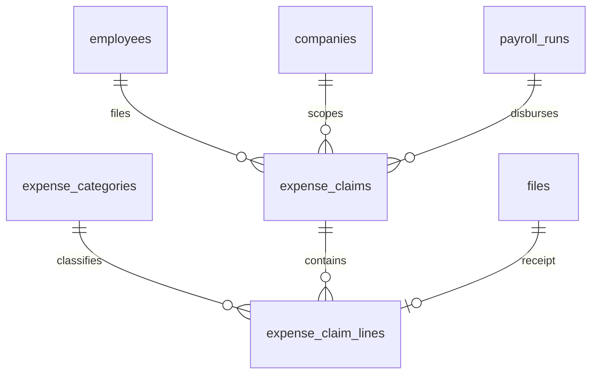
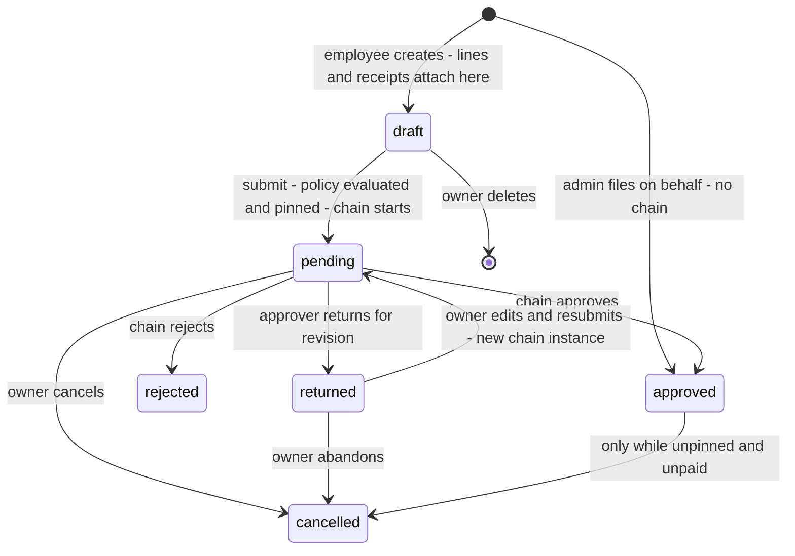
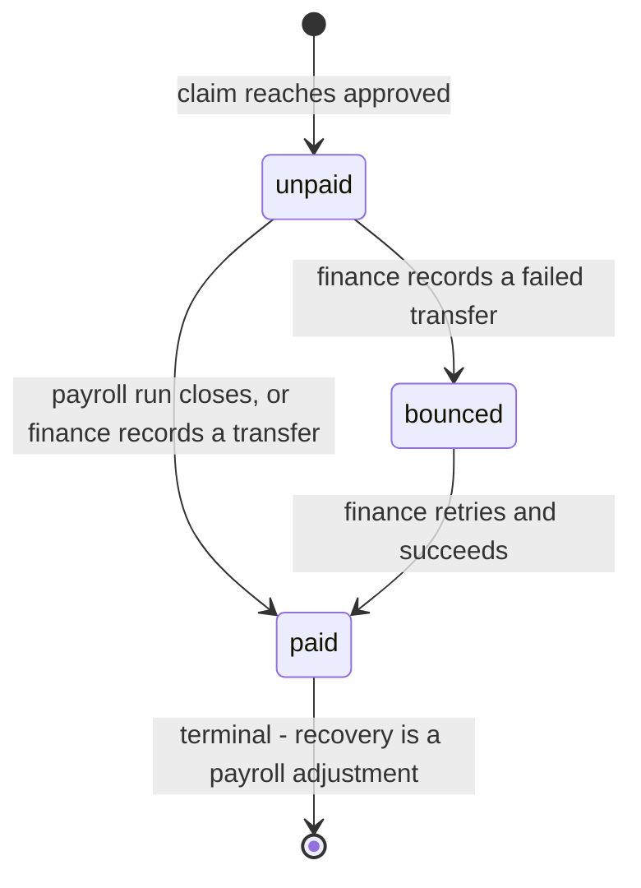
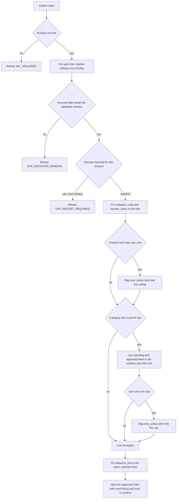

# Module: Expense & Reimbursement

Status: Active (Phase 3) · Related ADRs: `ADR-0001` (port-only cross-module reads), `ADR-0002` (tenant scoping), `ADR-0003` (request-aggregate sync class), `ADR-0006` (result pattern), `ADR-0007` (envelope, idempotent submit), `ADR-0008` (`expense.claim` chain), `ADR-0009` (receipt objects), `ADR-0010` (outbox events), `ADR-0012` (payroll snapshot inputs — `run_input` is pulled, clarified here), `ADR-0015` (exports) · Depends on: `docs/06-modules/holiday.md` (template), `docs/06-modules/employee.md` (identity, status), `docs/06-modules/organization.md` (`OrgQueryPort` placement), `docs/06-modules/payroll.md` (the disbursement consumer), `docs/05-platform/approval-engine.md`, `docs/05-platform/document-storage.md`, `docs/05-platform/settings.md`, `docs/05-platform/import-export.md`, `docs/05-platform/audit-log.md` · Consumers: payroll.md (`ExpenseQueryPort`), reports.md, dashboard-analytics.md

Namespace `expense` (naming §4, error prefix `EXP`). Expense categories and their policy, multi-line claims with receipts, approval through the shared engine, and the two disbursement routes — through a payroll run, or by finance transfer. Inherits all global standards; deviations only.

## 1. Purpose & Scope

Three layers. **Policy** — `expense_categories`, which decides what may be claimed, what proof is required, what is over-budget, how it is paid, and whether it is taxable. **The claim** — a header with lines, each line a single expense with its own category, date, amount, and receipt, routed once through the approval engine. **Disbursement** — the two routes, and the guarantee that a claim travels exactly one of them exactly once.

**Policy advises; the chain decides.** Only one rule blocks a submission: a category that requires a receipt and has none, because there is then nothing to approve against. Every money limit — the per-line ceiling, the monthly or yearly cap — is evaluated at submit, **pinned onto the line** as an over-policy flag with the amount over, and surfaced to the approver and to the chain as `overPolicyLineCount`. A blocking limit gives an employee whose taxi ran over in a rainstorm no path at all, and a blocking annual medical cap makes an 8,000,000 hospital bill submittable only by splitting it across two years.

**A claim is paid once, and the pin is what guarantees it.** `ExpenseQueryPort.claimForRun` returns eligible claims **and stamps `payroll_run_id` on them in the same transaction as the run's snapshot**. Eligibility is `approved AND disburse_via = 'payroll' AND payroll_run_id IS NULL` — a set that only shrinks. Without the stamp, a THR run created after a regular run reaches `approved` re-reads the same claims and pays them twice; `PAY_MONTH_RUN_IN_FLIGHT` does not reach that case, both runs foot internally, and the duplicate exists only in the claim's own history where nothing reads it.

**Everything a claim needs is pinned at submit.** Category code, `disburse_via`, `income_class`, and the limit values the flags were computed against are copied onto the claim and its lines. A later category edit moves policy **forward only**: it can never re-route a claim already approved, re-classify a claim already taxed, or invalidate a claim already inside a run's frozen snapshot. This is the same rule tax pins PTKP with, leave pins `covered_dates` with, and payroll's whole snapshot model rests on.

**Forward duty discharged here:** payroll.md §4.4's `ExpenseQueryPort` row — served, with the promised `approvedForPeriod` **renamed** to `claimForRun` and joined by `releaseForRun`, because a method that stamps rows must not be named like a pure read.

**V1 exclusions:** **cash advance (uang muka / kasbon)** — a payment *to* the employee before any expense exists, an outstanding balance per employee that nothing in this product models, settlement matching, and a return path that would make this module emit a `deduction` line into payroll; every disbursement decision below assumes money moves one way (§15, A-045). **Per-diem and mileage rates** — a computed amount has no receipt, which makes it an allowance, and allowances are payroll components on the salary package (A-046). **Cost-center or project dimension** — branch and department come free from `OrgQueryPort.placements`, and a project has no owner anywhere in this product (A-047). Also excluded: partial approval and approver-edited amounts (§15), reversal of a paid claim (BR-EXP-016 — payroll's ad-hoc adjustment is the clawback), non-IDR currency (CLAUDE.md fixes money as IDR), corporate-card reconciliation, and a claim import (§13).

> ⚠️ VERIFY: confirm against current Indonesian regulation before implementation. — whether a reimbursement in each seeded category of §4.2 is a genuine reimbursement of employer cost (not employee income) or a **natura / kenikmatan** benefit taxable to the employee under the current PMK regime and its negative list, and the threshold amounts and categories that regime exempts. `income_class` is configuration per category precisely because this answer moves and is not uniform across categories.

## 2. Actors & Permissions

| Action | Permission key | Data scope | Employee | Manager | Finance | HR Admin | System Administrator |
|---|---|---|---|---|---|---|---|
| View own claims, categories, own history | — (authenticated; mobile + web) | self | ✅ | ✅ | ✅ | ✅ | ✅ |
| Create / edit / submit / cancel own claim | — (authenticated) | self | ✅ | ✅ | ✅ | ✅ | ✅ |
| Approve / reject / return a claim | `expense.claim.approve` **+ chain membership** | instance (two-gate, BR-APRV-012) | — | ✅ | ✅ | ✅ | — |
| Read any employee's claims and receipts | `expense.claim.read` | company / tenant per assignment | — | — | ✅ | ✅ | ✅ |
| File a claim on behalf, no chain | `expense.claim.create` | company / tenant per assignment | — | — | — | ✅ | ✅ |
| Cancel or amend a filed claim, change its route | `expense.claim.update` | company / tenant per assignment | — | — | ✅ | ✅ | ✅ |
| Mark paid, record a bounce | `expense.claim.execute` | company / tenant per assignment | — | — | ✅ | — | ✅ |
| Read / create / edit / archive categories | `expense.category.configure` (read implied) | company / tenant per assignment | — | — | — | ✅ | ✅ |
| Export claims and the disbursement file | `expense.claim.export` | company / tenant per assignment | — | — | ✅ | ✅ | ✅ |

Actions come from the reserved set (naming §5) — no new action words, and no new URL verbs. **`expense.claim.approve` is the engine's two-gate module key** (approval-engine §2): holding it is necessary and never sufficient, chain membership is the second gate, and reject and return are the same seat's decisions under the same key. **`expense.claim.execute` mirrors `payroll.run.execute`** — the seat that moves money is not the seat that approves the request, and Finance holding it does not let Finance edit a category. **`expense.claim.update` is the leave.md `leave.request.update` parallel**: an admin cancelling or re-routing a filed claim is an update of it, not a new action word. Out-of-scope employees, claims, and categories are 404 (existence hiding, `SYS_NOT_FOUND`).

## 3. Business Rules

| # | Rule |
|---|---|
| BR-EXP-001 | **A category is policy, not code.** `expense_categories` fixes the receipt rule, the advisory limits, the disbursement route, and the tax classification. A tenant-wide row applies to every company; a `company_id` row applies to that company only (holiday.md BR-HOL-001 scoping, minus negation). Codes are unique per scope and immutable after first use. Settings keys cannot express this: settings definitions are a **code registry** (settings.md BR-SET-001), so a tenant creating "Client entertainment" could never mint a key for it. |
| BR-EXP-002 | **A claim is a header with lines.** `expense_claims` carries the employee, the company, the title, the status, and the money state; `expense_claim_lines` carries one expense each — category, incurred date, amount, description, receipt. `total_amount` is the sum of its live lines, recomputed on every write, never entered. A claim with zero lines cannot be submitted. |
| BR-EXP-003 | **Everything is pinned at submit.** Each line copies `category_code` and `income_class` from its category; the claim copies `disburse_via`. The pinned values are what every later reader uses — the approver, the payroll pull, the export, the report. A category edit changes nothing that has already been submitted. |
| BR-EXP-004 | **Receipts block; limits advise.** A line whose category has `receipt_required = true` and whose amount is at or above `receipt_threshold` (or any amount when the threshold is null) must carry a committed `receipt` file or the submission is refused (`EXP_RECEIPT_REQUIRED`). `max_per_line` and the period cap never refuse anything: they set `over_policy = true` and record `policy_notes` on the line. |
| BR-EXP-005 | **The period cap is a query, not a balance.** At submit, the cap window (`monthly` = the incurred date's calendar month; `yearly` = its calendar year) is summed over that employee's lines in the same category across claims in `pending` or `approved` status, plus the incoming lines. There is no ledger, no balance row, and no hold — the advisory outcome makes the concurrency that forced leave's `pending_days` irrelevant, because nothing is being reserved. |
| BR-EXP-006 | **Two independent axes.** `status ∈ draft, pending, returned, approved, rejected, cancelled` is the approval axis. `payment_state ∈ unpaid, paid, bounced` is the money axis and is meaningful only once `status = 'approved'`. A terminal claim is `approved` + `paid`. Encoding both in one enum forces a status that runs backwards on a bounce, and a backwards edge makes the approval trail unreadable (payroll.md BR-PAY-016, the same split). |
| BR-EXP-007 | **Approval is all or nothing.** The engine's three actions are the only actions: approve, reject, return. There is no partial approval and no approver-edited amount. Chain selection is by amount, and an approver who cuts a 12,000,000 claim to 4,000,000 is running a chain that was snapshotted for a number that no longer exists — with a second approver on it who no longer needs to be. Wrong line, wrong receipt, wrong amount: **return for revision**, and the requester resubmits as a new instance (ADR-0008 restart-on-resubmit). |
| BR-EXP-008 | **One claim, one run — the pin.** `ExpenseQueryPort.claimForRun` returns claims **and stamps `payroll_run_id` and `pinned_at` on them inside the caller's snapshot transaction**. `releaseForRun` clears the stamp and is called when a run is revoked. Eligibility is `status = 'approved' AND disburse_via = 'payroll' AND payroll_run_id IS NULL`, bounded by the run's own `approvedBefore` cutoff. A pinned claim cannot be cancelled, edited, re-routed, or returned by any path (`EXP_CLAIM_IN_RUN`). |
| BR-EXP-009 | **Eligibility is approval time. There is no retro.** A claim belongs to the first run that pulls after it is approved. A January dinner approved in March is paid in March. Nothing here ever raises a payroll retro flag: retro exists for corrections to facts a run already computed (BR-PAY-023), and a newly approved claim is a new fact, not a correction. `closed` is terminal (ADR-0012) and this module never asks a closed run to reopen. |
| BR-EXP-010 | **Payroll-route settlement rides `payroll.run.closed`.** On that event, every claim pinned to the run moves to `payment_state = 'paid'` with `payment_reference` = the run id and `paid_at` = the run's payment date. The handler is idempotent on the claim's current state. The async gap is harmless because the pin has already made the claim ineligible for any other run. |
| BR-EXP-011 | **Finance-route settlement is an explicit act.** A holder of `expense.claim.execute` marks approved finance-route claims paid with `paid_at` and a `payment_reference`, in bulk, per api-standards §10's per-item result shape. A failed transfer is recorded as `bounced` with a reason, which returns the claim to the payable pool — it does **not** move `status`, and it never un-approves anything. No batch entity exists: payroll settled this at 10,000 employees per run with per-employee payment state and a filtered export, and a few hundred claims a month do not earn a table whose only novel state is "partially bounced". |
| BR-EXP-012 | **Taxability is a category fact, pinned per line.** `income_class ∈ non_taxable, regular` — a two-value enum of this module's own, deliberately not payroll's four-value one, because a category may never be `irregular` or `final`. Claims reach a run as **`non_wage`** components in both cases (`upah sebulan = Σ basic + Σ fixed_allowance`, BR-PAY-003 — a reimbursement is neither), so no statutory wage base moves; the class chooses between the two seeded components `expense_reimbursement` and `expense_taxable_benefit`. A category hard-coded non-taxable puts real taxable money into a run that `Pph21Input.lines` cannot see as taxable, understating bruto on every payslip and every 1721-A1. |
| BR-EXP-013 | **Five cancellation windows.** `draft` — the owner deletes it outright. `pending` — the owner cancels. `approved`, unpinned, `unpaid` — the owner or a holder of `expense.claim.update` cancels. `approved` **and pinned** — refused (`EXP_CLAIM_IN_RUN`); the run must be revoked first, which releases the pin. `paid` — never. |
| BR-EXP-014 | **Backdating is bounded, forward-dating is not allowed.** A line's `incurred_date` must be no later than today in the employee's branch timezone and no earlier than `today − expense.max_backdate_days`. An expense that has not happened yet is not a reimbursement. |
| BR-EXP-015 | **A receipt read by anyone but its owner is a sensitive read.** Non-owner URL mints for the `receipt` category write `expense.receipt.viewed` (audit-log §4.3), fail-closed, unconditionally across all categories. Gating it on a per-category "sensitive" flag fails on exactly the case it exists for: a tenant that forgets to tick the flag on its medical category loses the trail on the receipts that needed one, and nothing detects the omission. |
| BR-EXP-016 | **No reversal concept.** Money already paid is recovered through **payroll's ad-hoc adjustment**, which ADR-0012 already defines as a directly entered `run_input`. It lands on the payslip where the employee can see it and goes through payroll's own approval. A negative claim here would be a second mechanism for one effect, with its own chain, its own sign conventions, and no answerable category. |
| BR-EXP-017 | **Archiving a category never breaks a live claim.** Because BR-EXP-003 pins everything a claim needs, an archived category leaves pending and approved claims fully computable and fully renderable. There is deliberately no in-use guard and no in-use error code — the blocker organization.md needed has nothing to block here. |
| BR-EXP-018 | **Audit and offline.** `expense_categories`, `expense_claims`, and `expense_claim_lines` are channel-1 audited with full diffs (audit-log §4.2, registered this session) — the claim tables are registered despite being a request aggregate because the admin file-on-behalf path has no approval instance and the payment state moves outside any chain, so this trail is the only control on both (`attendance_corrections` and `leave_requests` precedent). Mobile queues claim create, submit, and cancel as **request-aggregate** ops keyed by `op_id`, with receipts on the document-storage drain order (§10). |

## 4. Domain Model

### 4.1 Schema



```ts
// src/database/schema/expense.ts
export const expenseDisburseVia = pgEnum('expense_disburse_via', ['payroll', 'finance']);
export const expensePeriodCapBasis = pgEnum('expense_period_cap_basis', ['monthly', 'yearly']);
export const expenseIncomeClass = pgEnum('expense_income_class', [
  'non_taxable', 'regular',                                     // BR-EXP-012 — deliberately not payroll's four
]);
export const expenseClaimStatus = pgEnum('expense_claim_status', [
  'draft', 'pending', 'returned', 'approved', 'rejected', 'cancelled',
]);
export const expensePaymentState = pgEnum('expense_payment_state', ['unpaid', 'paid', 'bounced']);

export const expenseCategories = pgTable('expense_categories', {
  ...id, ...tenantId,
  companyId: uuid('company_id').references(() => companies.id),   // NULL = tenant-wide (BR-EXP-001)
  code: text('code').notNull(),                                   // transport, meal, medical, …
  name: text('name').notNull(),
  receiptRequired: boolean('receipt_required').notNull().default(true),
  receiptThreshold: numeric('receipt_threshold', { precision: 15, scale: 2 }),  // below it, receipt optional
  maxPerLine: numeric('max_per_line', { precision: 15, scale: 2 }),             // advisory (BR-EXP-004)
  periodCapAmount: numeric('period_cap_amount', { precision: 15, scale: 2 }),   // advisory, per employee
  periodCapBasis: expensePeriodCapBasis('period_cap_basis'),
  disburseVia: expenseDisburseVia('disburse_via').notNull().default('payroll'),
  incomeClass: expenseIncomeClass('income_class').notNull().default('non_taxable'),  // ⚠️ VERIFY §1
  sortOrder: integer('sort_order').notNull().default(0),
  archivedAt: timestamp('archived_at', { withTimezone: true }),
  ...auditColumns, ...softDeleteColumns,
}, (t) => [
  uniqueIndex('uq_expense_categories_tenant_id_company_id_code')
    .on(t.tenantId, sql`COALESCE(company_id, '00000000-0000-0000-0000-000000000000')`, t.code)
    .where(sql`deleted_at IS NULL`),
  index('idx_expense_categories_tenant_id_company_id').on(t.tenantId, t.companyId),
]);

export const expenseClaims = pgTable('expense_claims', {
  ...id, ...tenantId,
  employeeId: uuid('employee_id').notNull().references(() => employees.id),
  companyId: uuid('company_id').notNull().references(() => companies.id),
  title: text('title').notNull(),
  totalAmount: numeric('total_amount', { precision: 15, scale: 2 }).notNull().default('0'),  // BR-EXP-002
  disburseVia: expenseDisburseVia('disburse_via').notNull(),      // pinned at submit (BR-EXP-003)
  status: expenseClaimStatus('status').notNull().default('draft'),
  approvalInstanceId: uuid('approval_instance_id')
    .references(() => approvalInstances.id),                      // NULL = filed directly by an admin
  submittedAt: timestamp('submitted_at', { withTimezone: true }),
  decidedAt: timestamp('decided_at', { withTimezone: true }),
  cancelledAt: timestamp('cancelled_at', { withTimezone: true }),
  cancelledBy: uuid('cancelled_by').references(() => users.id),
  cancellationReason: text('cancellation_reason'),
  // disbursement — money axis (BR-EXP-006)
  payrollRunId: uuid('payroll_run_id').references(() => payrollRuns.id),  // the pin (BR-EXP-008)
  pinnedAt: timestamp('pinned_at', { withTimezone: true }),
  paymentState: expensePaymentState('payment_state').notNull().default('unpaid'),
  paidAt: timestamp('paid_at', { withTimezone: true }),
  paidBy: uuid('paid_by').references(() => users.id),
  paymentReference: text('payment_reference'),                    // transfer ref, or the run id
  bounceReason: text('bounce_reason'),
  opId: uuid('op_id'),                                            // ADR-0003 durable dedup
  ...auditColumns,
}, (t) => [
  uniqueIndex('uq_expense_claims_tenant_id_op_id')
    .on(t.tenantId, t.opId).where(sql`op_id IS NOT NULL`),
  index('idx_expense_claims_tenant_id_company_id_status').on(t.tenantId, t.companyId, t.status),
  index('idx_expense_claims_tenant_id_employee_id').on(t.tenantId, t.employeeId),
  index('idx_expense_claims_payable')                             // the port's query (BR-EXP-008)
    .on(t.tenantId, t.companyId, t.decidedAt)
    .where(sql`status = 'approved' AND disburse_via = 'payroll' AND payroll_run_id IS NULL`),
  index('idx_expense_claims_unpaid')                              // the finance worklist (BR-EXP-011)
    .on(t.tenantId, t.companyId)
    .where(sql`status = 'approved' AND disburse_via = 'finance' AND payment_state <> 'paid'`),
  index('idx_expense_claims_payroll_run_id').on(t.tenantId, t.payrollRunId),
]);

export const expenseClaimLines = pgTable('expense_claim_lines', {
  ...id, ...tenantId,
  claimId: uuid('claim_id').notNull().references(() => expenseClaims.id, { onDelete: 'cascade' }),
  lineNo: integer('line_no').notNull(),
  categoryId: uuid('category_id').notNull().references(() => expenseCategories.id),
  categoryCode: text('category_code').notNull(),                  // pinned (BR-EXP-003)
  incomeClass: expenseIncomeClass('income_class').notNull(),      // pinned (BR-EXP-012)
  incurredDate: date('incurred_date').notNull(),
  amount: numeric('amount', { precision: 15, scale: 2 }).notNull(),
  description: text('description'),
  receiptFileId: uuid('receipt_file_id').references(() => files.id),
  overPolicy: boolean('over_policy').notNull().default(false),    // BR-EXP-004
  policyNotes: jsonb('policy_notes').notNull().default(sql`'[]'::jsonb`),
  ...auditColumns,
}, (t) => [
  uniqueIndex('uq_expense_claim_lines_claim_id_line_no').on(t.tenantId, t.claimId, t.lineNo),
  index('idx_expense_claim_lines_tenant_id_claim_id').on(t.tenantId, t.claimId),
  index('idx_expense_claim_lines_cap_window')                     // BR-EXP-005 period-cap sum
    .on(t.tenantId, t.categoryId, t.incurredDate),
]);
```

`policy_notes` entries are `{ rule: 'max_per_line' | 'period_cap', limit: string, actual: string }` — the evidence behind the flag, pinned so an approver reading the claim next week sees the limit that applied when it was filed, not the limit the category carries today.

Hand-written in the generating migrations (database-conventions §10):

- `ck_expense_categories_period_cap` — `(period_cap_amount IS NULL) = (period_cap_basis IS NULL)`; a cap amount with no window and a window with no amount are both meaningless.
- `ck_expense_categories_receipt_rule` — `receipt_threshold IS NULL OR receipt_required = true`; a threshold on a category that never wants receipts is dead configuration.
- `ck_expense_claim_lines_amount` — `amount > 0`. A zero or negative line is the reversal concept BR-EXP-016 excludes, arriving through the back door.
- `ck_expense_claims_payment_state` — `payment_state = 'unpaid' OR status = 'approved'`; the money axis cannot move under a claim that is not approved (BR-EXP-006).
- `ck_expense_claims_pin` — `payroll_run_id IS NULL OR (status = 'approved' AND disburse_via = 'payroll')`; the database refuses a pin the port would never have written, so a bug cannot produce a finance-route claim inside a run.
- **`expense_claims.payroll_run_id` → `fk_expense_claims_payroll_runs`**, added after payroll's tables exist — a declared cross-module foreign key in the ADR-0001 inventory, on the `attendance_days.leave_request_id` precedent. `ON DELETE` is omitted deliberately: runs are revoked, never deleted, and revoke calls `releaseForRun`.
- `uq_expense_claim_lines_claim_id_line_no` names the **semantic** key rather than the full column list — the spelled-out form with `tenant_id` runs past PostgreSQL's 63-byte identifier limit, and a silently truncated name is worse than a documented abbreviation (holiday.md `uq_holidays_scope_date_kind` precedent).
- Standard RLS on all three tables. No `version` columns: a draft claim has exactly one writer, its owner, and everything after submission moves through guarded state transitions.





The money axis never moves the approval axis, in either direction. A bounce returns a claim to the payable pool without un-approving it; a cancellation is impossible once `paid`. `expense_categories` has no lifecycle — it is present-or-archived reference data (holiday.md §4.1 template note) — and `expense_claim_lines` has none, because a line has no state its parent does not already carry.

### 4.2 Seeded categories

Provisioning seeds these tenant-wide, editable afterwards. Every value is configuration, never a constant in code (spec §4 item 4).

| Code | Name | Receipt | `max_per_line` | Period cap | Route | `income_class` |
|---|---|---|---|---|---|---|
| `transport` | Transportasi | required | unset | unset | `payroll` | `non_taxable` |
| `accommodation` | Akomodasi | required | unset | unset | `payroll` | `non_taxable` |
| `meal` | Makan dan jamuan | required | unset | unset | `payroll` | `non_taxable` |
| `medical` | Kesehatan | required | unset | unset | `payroll` | `non_taxable` |
| `communication` | Komunikasi dan pulsa | required above threshold | unset | unset | `payroll` | `non_taxable` |
| `training` | Pelatihan dan sertifikasi | required | unset | unset | `payroll` | `non_taxable` |
| `other` | Lainnya | required | unset | unset | `payroll` | `non_taxable` |

> ⚠️ VERIFY: confirm against current Indonesian regulation before implementation. — the `income_class` column above is seeded uniformly `non_taxable` because a genuine receipted reimbursement of an employer cost is not employee income. Several of these categories become **natura or kenikmatan** taxable to the employee once they benefit the employee personally rather than reimbursing a company cost — communication allowances, non-business meals, and medical benefits outside the statutory exemptions are the usual boundaries. Confirm each category and the exemption thresholds before go-live, and set `income_class = 'regular'` where the answer is that it is a benefit.

No limits are seeded. A shipped default cap is a number nobody chose that starts flagging real claims on day one; an unset cap flags nothing until an admin decides what the budget is.

### 4.3 Ports served

```ts
// src/modules/expense/application/ports/expense-query.port.ts
export const EXPENSE_QUERY_PORT = Symbol('EXPENSE_QUERY_PORT');

export type ExpensePayrollClaim = {
  claimId: string;
  employeeId: string;
  title: string;
  totalAmount: string;
  lines: {
    categoryCode: string;
    incomeClass: 'non_taxable' | 'regular';   // BR-EXP-012 — chooses the component
    incurredDate: string;
    amount: string;
  }[];
};

export interface ExpenseQueryPort {
  /** Returns eligible claims AND pins them to the run, in the caller's transaction. BR-EXP-008. */
  claimForRun(input: {
    runId: string;
    companyId: string;
    employeeIds: string[];
    approvedBefore: string;                   // the run's own cutoff — payroll owns the calendar
  }): Promise<Result<ExpensePayrollClaim[], DomainError>>;

  /** Clears the pin for a revoked run. Idempotent; returns the number of claims released. */
  releaseForRun(runId: string): Promise<Result<number, DomainError>>;
}
```

**`claimForRun` is a write, and its name says so.** payroll.md §4.4 promised `approvedForPeriod`; that name describes a pure read, and this method stamps `payroll_run_id` and `pinned_at` on every row it returns. The rename is applied to payroll.md this session. It runs **inside the caller's snapshot transaction** (`payroll` / `run.snapshot`), which is what makes the guarantee atomic: a run either has the claims and the claims know it, or neither happened.

**Why the employee list is a parameter.** The run has already resolved its roster and pinned it; passing it in keeps this module from re-deriving who is in the run and possibly disagreeing. A claim belonging to an employee outside the run's roster is simply not returned, and stays eligible for the next one.

**No read-only variant is served.** Reports read expense data through the reports.md registry, not through a port, and nothing else in V1 needs a claim it is not about to pay.

### 4.4 Ports consumed

| Port | Used for | Status |
|---|---|---|
| `ApprovalEnginePort` | `expense.claim` chain start, decisions, timeline | live |
| `DocumentStoragePort` | `receipt` slot, commit, and URL mint; ownership resolver registration | live |
| `OrgQueryPort.placements` | the employee's company, branch, and department at claim creation | live |
| `SettingsPort` | `expense.max_backdate_days` | live |
| `NotificationPort` | `expense.claim_paid` | live |
| **`employee_directory`** (read-model view) | `fullName` and `employeeNumber` on the claims grid and the disbursement view, and the `q=` search over them | **live 2026-08-03** — published by employee.md §13 under the ADR-0001 §6 amendment; declared retroactively, the columns were already being returned with no sanctioned channel. The two export definitions keep reading their bank columns through payroll's gated path, unchanged — the view carries nothing gated |

**No `PeriodLockPort`.** Nothing here writes into an attendance period: a claim is not a day, it carries no attendance consequence, and BR-EXP-009 routes every late arrival into the next run rather than into a closed one. This is the one request-type module in Phase 3 with no lock interaction, and stating it is cheaper than every future reader rediscovering why it is missing.

### 4.5 Submit-time evaluation



The three refusals are the whole blocking set. Everything else that could be wrong with a claim is a judgement, and judgements go to the approver with the evidence attached.

## 5. Use Cases

**UC-EXP-001 — File a claim.** Actor: Employee, mobile or web. Precondition: at least one live category in scope. Main: create the draft, add lines (category, incurred date, amount, description), attach a receipt per line through the document-storage slot flow, submit. The server re-evaluates every rule of §4.5, pins the policy values, totals the lines, and starts the `expense.claim` chain. Alternate: saved and left as a draft — drafts never expire and never notify anyone. Exception: a missing required receipt, a date outside the window, or an empty claim refuses the submission with the offending line index named. Postcondition: `pending`, one inbox item for the first step's assignees.

**UC-EXP-002 — Approve, reject, or return.** Actor: Manager or Finance holding `expense.claim.approve` **and** membership of the live step. Main: open the claim, read each line with its receipt and any over-policy note, decide once for the whole claim. Alternate: return with a mandatory comment — the claim goes to `returned`, the requester edits and resubmits as a new instance. Exception: the claim is no longer `pending` → `EXP_CLAIM_ALREADY_DECIDED`. Postcondition: on the terminal approval the claim becomes `approved` + `unpaid` and enters exactly one of the two disbursement worklists.

**UC-EXP-003 — Disburse through payroll.** Actor: the payroll run's snapshot job, not a human. Main: `run.snapshot` calls `claimForRun` with the run id, company, roster, and cutoff; the port returns the claims and stamps them in the same transaction; the run creates one line per claim against `expense_reimbursement` or `expense_taxable_benefit` per the pinned `income_class`. Alternate: the run is revoked → `releaseForRun` clears every stamp and the claims return to the worklist untouched. Postcondition: each claim appears in exactly one run and can never be returned to another.

**UC-EXP-004 — Settle the payroll route.** Actor: system, on `payroll.run.closed`. Main: every claim pinned to that run moves to `paid`, `payment_reference` = the run id, `paid_at` = the run's payment date, and `expense.claim_paid` fires to each employee. Idempotent — a redelivered event writes nothing.

**UC-EXP-005 — Disburse through finance.** Actor: Finance with `expense.claim.export` then `expense.claim.execute`. Main: filter approved finance-route claims that are not yet paid, export `expense.disbursement` for the bank, perform the transfers, then bulk mark them paid with the transfer date and reference. Alternate: a transfer fails → record the bounce with a reason; the claim returns to the pool and appears in the next export. Postcondition: `paid`, or `bounced` and still payable.

**UC-EXP-006 — Configure categories.** Actor: HR Admin with `expense.category.configure`. Main: create or edit a category — receipt rule, advisory limits, route, income class. Edits apply to submissions from that moment; every submitted claim keeps its pinned values (BR-EXP-003). Alternate: archive — no in-use guard exists, and pending claims continue to render and pay (BR-EXP-017).

**UC-EXP-007 — Cancel a claim.** Actor: the owner, or a holder of `expense.claim.update`. Main: cancel per BR-EXP-013's five windows, with a mandatory reason on the admin path. Exception: the claim is pinned to a live run → `EXP_CLAIM_IN_RUN`, and the message says which run and that revoking it is the path. Exception: already paid → refused, and the copy points at payroll's adjustment as the recovery.

**UC-EXP-008 — Re-route an approved claim.** Actor: Finance or HR Admin with `expense.claim.update`. Precondition: `approved`, `unpinned`, `unpaid`. Main: change `disburse_via`, with a reason, audited. The case this exists for: a claim approved on the 26th after this month's run has closed, which finance would rather transfer today than hold for five weeks.

**UC-EXP-009 — File on behalf.** Actor: HR Admin with `expense.claim.create`. Main: the same form with an employee picker; the claim is created **already `approved`** with no chain instance, exactly as leave.md's HR-direct path. This is the migration and exception path, and it is why the claim tables are channel-1 audited (BR-EXP-018).

**UC-EXP-010 — Read own history.** Actor: Employee. Main: `/me/expense/claims` returns claims newest first with status, payment state, and the payment reference — the answer to "was I paid, and how". A payroll-route claim shows the run's payment date and links to the payslip period it landed in.

**UC-EXP-011 — Export.** Actor: Finance or HR Admin with `expense.claim.export`. Main: `expense.claim` for a period and scope, or `expense.disbursement` for the bank transfer file. Bank columns are a gated set per the requester's permissions, frozen at enqueue (import-export BR-IMP-010).

## 6. UI Flow

**Mobile (employee, Flutter).** Bottom-nav Expenses → claim list (status chip + payment chip, two chips because there are two axes) → claim detail → line editor. New claim: title, then a repeating line card — category picker, date, amount, description, camera or file for the receipt. The receipt thumbnail is the line's identity in the list; a line without one, where the category requires one, renders with an amber "Receipt needed" state and the submit button explains why it is disabled rather than sitting greyed and silent. Over-policy lines show an inline note — "1,200,000 over the 5,000,000 yearly cap for Kesehatan" — in the warning style, never the error style, because the claim can still be submitted (design-system status vocabulary; never colour alone).

**Mobile empty and offline states.** No categories configured → "No expense categories yet, ask your HR admin" (shift.md wording, one voice). Offline: the unsynced chip on the claim card, the sync truth line at the top of the list, and per-line ceiling flags shown as advisory; the period-cap flag is **absent, not zero**, with a one-line note that the annual cap is checked when the claim syncs (§10).

**Admin web (Next.js).** Expenses → Claims grid (DataTable: employee, title, total, line count, status, payment state, route, submitted, decided) with the scope bar; filters for status, payment state, route, category, branch, department, and date range. Row expands to lines with receipt thumbnails. Approver detail shows the receipt viewer beside the line table so nobody approves from a filename. Finance gets a **Disbursement** view: approved, finance-route, not-yet-paid, with select-all, the export button, and a mark-paid dialog taking one date and one reference for the whole selection.

**Admin web, categories.** A settings-style table with the policy columns inline and an edit drawer. The drawer carries the sentence that matters — "Changes apply to claims submitted from now on. Claims already submitted keep the policy they were filed under." — because BR-EXP-003 is invisible in the UI otherwise and an admin will assume the opposite.

Error surfaces follow the field > panel > toast order (coding-standards-nextjs): `EXP_RECEIPT_REQUIRED` and `EXP_BACKDATE_WINDOW` land on the offending line's field with the line index; `EXP_CLAIM_IN_RUN` is a panel naming the run, because no field caused it.

## 7. API

All endpoints follow the canonical spec-block form (api-standards §13). No new pagination-registry rows: admin grids are the seeded transactional-grid family (offset) and mobile history is the seeded self-service family (cursor). Export endpoints ride import-export §7. Errors beyond the implied set only.

| Endpoint | Permission | Pagination | Queue-reachable | Idempotency |
|---|---|---|---|---|
| `GET /api/v1/expense-categories` | `expense.category.configure` | offset | no | — |
| `POST /api/v1/expense-categories` | `expense.category.configure` | — | no | — |
| `PATCH /api/v1/expense-categories/{id}` | `expense.category.configure` | — | no | — |
| `DELETE /api/v1/expense-categories/{id}` | `expense.category.configure` | — | no | — |
| `GET /api/v1/expense-claims` | `expense.claim.read` (`?mine=true` self) | offset | no | — |
| `GET /api/v1/expense-claims/{id}` | `expense.claim.read` / own | — | no | — |
| `POST /api/v1/expense-claims` | — (self) / `expense.claim.create` | — | **yes** | **required** |
| `PATCH /api/v1/expense-claims/{id}` | — (own, `draft` or `returned`) | — | no | accepted |
| `DELETE /api/v1/expense-claims/{id}` | — (own, `draft` only) | — | no | — |
| `POST /api/v1/expense-claims/{id}/submit` | — (own) | — | **yes** | accepted |
| `POST /api/v1/expense-claims/{id}/cancel` | — (own, per BR-EXP-013) / `expense.claim.update` | — | **yes** | accepted |
| `POST /api/v1/expense-claims/{id}/approve` | `expense.claim.approve` | — | no | accepted |
| `POST /api/v1/expense-claims/{id}/reject` | `expense.claim.approve` | — | no | accepted |
| `POST /api/v1/expense-claims/{id}/return` | `expense.claim.approve` | — | no | accepted |
| `POST /api/v1/expense-claims/bulk-approve` | `expense.claim.approve` | — | no | accepted |
| `POST /api/v1/expense-claims/payments` | `expense.claim.execute` | — | no | accepted |
| `PATCH /api/v1/expense-claims/{id}/payment` | `expense.claim.execute` | — | no | accepted |
| `GET /api/v1/me/expense/snapshot` | — (authenticated, self) | — | no | — |
| `GET /api/v1/me/expense/claims` | — (authenticated, self) | cursor | no | — |

No new URL verbs: `submit`, `cancel`, `approve`, `reject`, `return`, and `export` are all in the naming §3 reserved set, and the disbursement writes use the `payments` sub-resource shape payroll already established rather than minting a `mark-paid` verb.

#### POST /api/v1/expense-claims · PATCH /{id}

| Field | Type | Required | Rule |
|---|---|---|---|
| `employeeId` | uuid | conditional | omit for self; required with `expense.claim.create` |
| `title` | string | ✅ | 3–120, trimmed |
| `lines` | array | ✅ | 1–50 items; the whole set is replaced on `PATCH` |
| `lines[].categoryId` | uuid | ✅ | live, unarchived, in the employee's scope |
| `lines[].incurredDate` | date | ✅ | ISO; not future; ≥ `today − expense.max_backdate_days` |
| `lines[].amount` | decimal string | ✅ | > 0, ≤ 999,999,999.99, two decimals |
| `lines[].description` | string | conditional | ≤ 500; required when `over_policy` results |
| `lines[].receiptFileId` | uuid | conditional | committed `receipt` owned by the caller; per BR-EXP-004 |

`POST` creates a `draft`. Response 201: `{ claim: { …row, lines: [{ …line, overPolicy, policyNotes }] } }` — the policy evaluation runs on save as well as on submit, so the employee sees the flags before an approver does. Errors: `EXP_BACKDATE_WINDOW` (`details: { lineNo, incurredDate, earliestAllowed }`) · unknown or out-of-scope category or employee → `SYS_NOT_FOUND` · field failures → `VAL_VALIDATION_FAILED`. `PATCH` is allowed on an own `draft` or `returned` claim only; any other status → `EXP_CLAIM_ALREADY_DECIDED`.

#### POST /api/v1/expense-claims/{id}/submit
No body. Runs §4.5 in full, pins the policy values and `disburse_via`, totals the lines, and starts the chain (or, on the `expense.claim.create` path, lands the claim directly at `approved` with no instance — UC-EXP-009). Response 200: the claim with `status`, `approvalInstanceId`, and the pinned lines. Errors: `EXP_RECEIPT_REQUIRED` (`details: { lineNo, categoryCode, threshold }`) · `EXP_BACKDATE_WINDOW` · `VAL_REQUIRED` on an empty line set · `EXP_CLAIM_ALREADY_DECIDED`. A `returned` claim resubmits as a **new** engine instance (ADR-0008 restart-on-resubmit).

#### POST /api/v1/expense-claims/{id}/approve · reject · return
Request: `{ comment? }` — mandatory for `reject` and `return` (`APRV_COMMENT_REQUIRED`). Response 200: the claim with its refreshed status plus `{ instance: { status, currentStepIndex } }`. Errors: `EXP_CLAIM_ALREADY_DECIDED` (the module-level guard, raised before the engine when the row is no longer `pending`) · `APRV_NOT_AN_APPROVER` · `APRV_STEP_ALREADY_DECIDED` · `APRV_INSTANCE_NOT_ACTIONABLE`.

#### POST /api/v1/expense-claims/bulk-approve
Request: `{ ids: [...] }`, ≤ 100 (api-standards §10). Response 200: per-item results, each running the full single-approve path. A partial batch is the normal outcome — the shape §10 defines.

#### POST /api/v1/expense-claims/{id}/cancel
Request: `{ reason? }` — mandatory on the `expense.claim.update` path. Response 200: the cancelled claim. Errors: `EXP_CLAIM_IN_RUN` (`details: { payrollRunId, runStatus }` — the message names revoking the run as the path) · `EXP_CLAIM_ALREADY_DECIDED` (already terminal, or already `paid`).

#### POST /api/v1/expense-claims/payments · PATCH /{id}/payment
`POST /payments` is the bulk mark-paid: `{ claimIds: [...] (≤ 200), paidAt: date, paymentReference: string (3–100) }`. Response 200: per-item results (api-standards §10). A claim that is not `approved`, not finance-route, or already `paid` returns `EXP_CLAIM_NOT_PAYABLE` in its item, and the rest of the batch commits — a bank file of 40 transfers where 2 rows moved on is the ordinary case, not an error.
`PATCH /{id}/payment` records a correction or a bounce: `{ paymentState: 'paid' | 'bounced', paidAt?, paymentReference?, bounceReason? }` — `bounceReason` mandatory for `bounced` (5–500). A bounce clears `paid_at` and returns the claim to the payable pool without touching `status` (BR-EXP-011). Errors: `EXP_CLAIM_NOT_PAYABLE` · `EXP_CLAIM_IN_RUN` (a payroll-route claim's payment state is the run's to move, never a human's).

#### GET /api/v1/expense-claims · GET /{id}
Grid: `?companyId=` (required unless `?mine=true`) `?status=&paymentState=&disburseVia=&categoryId=&employeeId=&branchId=&departmentId=&from=&to=&overPolicy=true&q=` + offset. Response 200: `data: [{ id, employee: { id, employeeNumber, fullName }, title, totalAmount, lineCount, overPolicyLineCount, status, paymentState, disburseVia, submittedAt, decidedAt, payrollRunId }]` + `meta` with the offset totals and the filtered sum. Detail adds the full line array with receipt references and `policyNotes`, the approval timeline (engine read), and the payment block. `from`/`to` filter on `incurred_date` across the claim's lines.

#### GET /api/v1/expense-categories · POST · PATCH · DELETE
`GET`: `?companyId=&includeArchived=` + offset. `POST`/`PATCH`: the §4.1 field set per §8; `code` is immutable once any line references the category. `DELETE` archives (soft delete + `archived_at`) and is **never** blocked by existing claims (BR-EXP-017). Errors: duplicate `(scope, code)` → `VAL_VALIDATION_FAILED` with `VAL_DUPLICATE`.

#### GET /api/v1/me/expense/snapshot · GET /me/expense/claims
`snapshot`: the mobile bootstrap read — `{ categories: [{ id, code, name, receiptRequired, receiptThreshold, maxPerLine, periodCapAmount, periodCapBasis }], maxBackdateDays, draftCount, pendingCount }`, scoped to the caller's company. One read instead of a delta-sync mirror: an employee's category list is a handful of rows, so it is TTL-cached and refreshed on foreground (leave.md `/me/leave/snapshot` precedent).
`me/expense/claims`: `?status=&paymentState=&from=&to=` + cursor, newest first, each entry with its lines, payment block, and decision timeline.

## 8. Validation Rules

| Field | Rule | Error code |
|---|---|---|
| `title` | 3–120, trimmed, non-empty | `VAL_REQUIRED` / `VAL_TOO_SHORT` / `VAL_TOO_LONG` |
| `lines` | 1–50 items | `VAL_REQUIRED` / `VAL_OUT_OF_RANGE` |
| `lines[].categoryId` | live, unarchived, in the employee's scope | 404 (`SYS_NOT_FOUND`) |
| `lines[].incurredDate` | ISO date, not in the future in the branch timezone | `VAL_INVALID_FORMAT` / `EXP_BACKDATE_WINDOW` |
| backdate window | `incurredDate ≥ today − expense.max_backdate_days` | `EXP_BACKDATE_WINDOW` (business, post-DTO) |
| `lines[].amount` | decimal string, > 0, ≤ 999,999,999.99, two decimals | `VAL_OUT_OF_RANGE` / `VAL_INVALID_FORMAT` |
| receipt rule | committed `receipt` file present when the category and amount demand it | `EXP_RECEIPT_REQUIRED` |
| `lines[].receiptFileId` | committed, category `receipt`, owned by the caller, not already attached | 404 (`SYS_NOT_FOUND`) |
| `lines[].description` | ≤ 500; required when the line resolves `over_policy` | `VAL_REQUIRED` / `VAL_TOO_LONG` |
| `code` (category) | 2–40, `^[a-z][a-z0-9_]*$`, unique per scope, immutable after first use | `VAL_INVALID_FORMAT` / `VAL_DUPLICATE` |
| `receiptThreshold` | ≥ 0; only when `receiptRequired = true` | `VAL_OUT_OF_RANGE` / `VAL_VALIDATION_FAILED` |
| `maxPerLine` / `periodCapAmount` | > 0 when present | `VAL_OUT_OF_RANGE` |
| `periodCapBasis` | present exactly when `periodCapAmount` is | `VAL_VALIDATION_FAILED` (field entries) |
| `paidAt` | ISO date, not in the future | `VAL_INVALID_FORMAT` / `VAL_OUT_OF_RANGE` |
| `paymentReference` | 3–100, trimmed | `VAL_REQUIRED` / `VAL_TOO_LONG` |
| `bounceReason` | required for `paymentState = 'bounced'`, 5–500 | `VAL_REQUIRED` / `VAL_TOO_LONG` |
| `comment` (reject / return) | required, ≤ 1000 | `APRV_COMMENT_REQUIRED` |
| `claimIds` (bulk) | 1–200 unique uuids | `VAL_OUT_OF_RANGE` |

## 9. Edge Cases & Failure Modes

- **Two runs in one payment month, both eligible for the same claim:** impossible after the first `claimForRun` commits. The regular run stamps the claim; the THR run's query no longer sees it. This is the module's central guarantee and it is pinned by a concurrency test, not by a rule an implementer must remember.
- **A run is revoked after snapshot:** `releaseForRun` clears the stamps and every claim returns to the worklist with its approval intact. Without the release, a revoked run would strand its claims permanently — approved, unpaid, and invisible to every future run.
- **A run is revoked, and the release call fails:** the claims stay pinned to a run that no longer exists. The disbursement view surfaces claims pinned to a non-live run as a **stuck-claim warning** with a manual release action under `expense.claim.update`, on the approval-engine stuck-instance precedent. A silent orphan is worse than a visible one.
- **A claim approved in March for a January dinner:** paid in March. No retro flag, no reopened period, no restatement — BR-EXP-009, and the employee is owed the money now rather than having been owed it in January.
- **A category's route changes between submission and approval:** nothing happens. The claim pinned `disburse_via` at submit and the pin is what the port filters on. The next claim gets the new route.
- **A category is archived while claims are pending:** archive succeeds and every pending claim approves and pays normally, because BR-EXP-003 pinned the code, class, and route. The category row is soft-deleted, never removed, so old claims still render its name.
- **An employee resigns with an approved unpaid claim:** the claim survives. A payroll-route claim is pulled by the employee's final settlement run if they are on its roster; a finance-route claim stays in the disbursement view. Nothing about a terminal employment status cancels money already owed, and no handler here listens for it.
- **An employee resigns with a claim still `pending`:** it stays in the chain. If the chain resolves after the exit, the claim becomes `approved` and payable through the finance route; a payroll-route claim whose owner is on no future roster will never be pulled, and the disbursement view lists it under an **unpayable** filter for a human to re-route via UC-EXP-008.
- **An over-policy claim approved anyway:** the intended outcome. The flag, the note, the limit it was measured against, and the approver's identity are all on the record, which is a stronger control than a validator the employee routes around by picking a different category.
- **The same expense claimed twice on two claims:** not detected, and deliberately not attempted. Duplicate detection on amount and date produces false positives on genuinely repeated costs — two identical taxi fares on the same day is a normal commute — and the receipt is the human control. Named in §15 rather than half-built.
- **A receipt uploaded but never attached to a line:** it stays a staged file and the document-storage staging TTL reaps it. Committed receipts on a deleted draft are cleaned by `cron.document.purge`, not by this module.
- **Two admins mark the same claim paid simultaneously:** the second sees `payment_state = 'paid'` and returns `EXP_CLAIM_NOT_PAYABLE` in its item. No lost update — the transition is guarded on the current state, not on a read taken earlier.
- **A bounced claim that finance never retries:** it sits `approved` + `bounced` and appears in every subsequent disbursement export, which is the correct nag. There is no auto-retry, because retrying a transfer that failed for a bad account number would fail identically forever.
- **A payroll-route claim someone tries to mark paid by hand:** refused with `EXP_CLAIM_IN_RUN`. The run's close event is the only writer of that claim's payment state, and letting a human pre-empt it would produce a claim marked paid by a run that has not paid anybody.
- **`expense.max_backdate_days` tightened while old drafts exist:** the draft survives, the submit fails, and the message names the earliest allowed date. Settings are read as-of the submission, not as-of the draft.
- **A claim filed on behalf by an admin:** lands `approved` with no approval instance, which is why the claim tables carry channel-1 audit — the diff trail is the **only** control on that path (BR-EXP-018).
- **Offline submit refused by the server:** the op fails with the catalog code, the optimistic local row rolls back, and the employee sees `errors.EXP_RECEIPT_REQUIRED` on the claim card — the request-aggregate business-rejection path (offline-sync §4), never a silent retry.
- **A line whose amount exceeds the claim's own scale:** rejected at the DTO. `numeric(15,2)` holds a single claim line up to 9,999,999,999,999.99, well past any real receipt, and the DTO ceiling of 999,999,999.99 per line is the practical guard against a typo adding three zeros to a taxi fare.

## 10. Offline Behavior

Deviations from the global standard (offline-sync §10 checklist):

- **Entities:** `expense_claims` and `expense_claim_lines` → Drift tables of the same names (**request aggregate**, queueable, `op_id` on the claim per offline-sync §5, immutable locally once submitted); `expense_categories` → Drift mirror (**reference data**, pull-only, replaced wholesale by `GET /me/expense/snapshot`, TTL 60 minutes and refreshed on foreground).
- **No delta-sync endpoints.** A tenant's category list is a handful of rows; the snapshot read replaces the cursor machinery (leave.md's reasoning, document-storage §10's read class).
- **Queue-reachable endpoints:** `POST /expense-claims` (`Idempotency: required`, key = `opId`), `POST /expense-claims/{id}/submit`, and `POST /expense-claims/{id}/cancel` (both `accepted`). Approving is **online-only** — MSS approvals are online-only by ADR-0003, and approving money from a stale claim is exactly the decision that must not be replayed hours later (`SYNC_OFFLINE`).
- **Receipts ride the document-storage drain order**, N files before one op: slot → PUT → confirm for every line's receipt, then the claim op posts with the `fileId`s (the `punch_selfie` aggregate-blocked pattern, then leave's attachment). A claim op whose receipts have not drained is blocked, not sent — a claim arriving with dangling file ids would fail server validation and lose the photographs.
- **`applyServerState`:** on submit success the handler copies back `id`, `status`, `submittedAt`, `approvalInstanceId`, `totalAmount`, `disburseVia`, and per line the pinned `categoryCode`, `incomeClass`, `overPolicy`, and `policyNotes`. The device's own policy evaluation is never persisted as truth.
- **Declared deviation — the period-cap flag is server-only.** The device computes the per-line ceiling flag locally from mirrored categories and shows it with the unsynced chip. The **period cap cannot be computed offline at all**: it sums the employee's other claims in the window, including ones filed from the web, filed by an admin, or still draining from another device. So the mobile form shows no cap flag rather than a false one, with a one-line note that the cap is checked on sync, and the flag arrives via `applyServerState`. Justification: this is leave's advisory-cost deviation with the honest half kept — an advisory number computed from data the device provably does not have is not advisory, it is wrong.
- **Local retention:** rows referenced by a `pending`/`syncing`/`failed` op — and their receipts — are exempt from every cleanup path (ADR-0003 pending-data protection).

## 11. Module Error Codes

Registered this session:

| Code | HTTP | Trigger |
|---|---|---|
| `EXP_RECEIPT_REQUIRED` | 422 | Submit with a line whose category requires a receipt at that amount and none is committed — BR-EXP-004 |
| `EXP_BACKDATE_WINDOW` | 422 | A line's `incurred_date` is in the future or older than `expense.max_backdate_days` — BR-EXP-014 |
| `EXP_CLAIM_IN_RUN` | 409 | Cancel, edit, re-route, or hand-payment on a claim pinned to a payroll run — BR-EXP-008, BR-EXP-013 |
| `EXP_CLAIM_NOT_PAYABLE` | 409 | Mark-paid or bounce on a claim that is not `approved`, not finance-route, or already `paid` — BR-EXP-011 |
| `EXP_CLAIM_ALREADY_DECIDED` | 409 | Any action on a claim that is no longer in the status the action requires (single or bulk) — BR-EXP-007, api-standards §10 |

`EXP_CLAIM_IN_RUN` joins the family originating at `ATT_PERIOD_LOCKED` (error-catalog §18) in shape but not in cause: those codes fire on a write into a **period** that is frozen, this one on a write to a **row** that a live run has claimed.

Three conditions deliberately take **no code**. An over-policy line is a flag, not a failure — giving it a code invites a client to branch on it as one, which reintroduces the blocking limit BR-EXP-004 rejects. Archiving a category with live claims raises nothing, because BR-EXP-017 makes it harmless. Every unknown or out-of-scope id is `SYS_NOT_FOUND` per error-catalog §2.

## 12. Background Jobs & Events

**No cron and no owned job.** The only candidate is an aging-claim reminder, and `cron.approval.sla-scan` already runs every 15 minutes doing reminder-at-SLA and escalation-at-2× over these very instances; a second timer would send two reminders for one stuck claim. Receipt retention is `cron.document.purge`. Exports run as import-export framework jobs, not jobs owned here.

Event-handler jobs (`events` queue, idempotent):

| Handler | Trigger | Behavior |
|---|---|---|
| `on.payroll.run.closed` | payroll.md | Every claim pinned to the run → `payment_state = 'paid'`, `payment_reference` = run id, `paid_at` = the run's payment date; queue `expense.claim_paid` per employee. A redelivery writes nothing (BR-EXP-010) |

**Events emitted: none.** Nothing in V1 consumes one. Audit-log's channel 1 — the same-transaction repository hook over the §4.2 registry — already captures every diff-bearing mutation here including the payment state, and the approval engine emits its own terminal events for the inbox and notification. An event published for no subscriber is scaffolding, and adding one when reports or dashboard needs it is additive.

**Events consumed:** `payroll.run.closed`.

## 13. Approval, Notification & Report Touchpoints

- **Approval:** request type `expense.claim` (already in approval-engine §13's V1 registry). Declared here as that registry requires — **context fields:** `employeeId` (uuid), `companyId` (uuid), `branchId` (uuid), `departmentId` (uuid), `totalAmount` (numeric), `lineCount` (integer), `categoryCodes` (string array), `overPolicyLineCount` (integer), `disburseVia` (string). **Chain-selection dimensions:** company, department, `totalAmount`, `categoryCodes`. **Recommended tenant config:** single-step `direct_manager(1)` below a threshold; a second Finance step above it; a stricter chain when `overPolicyLineCount > 0` — which is what makes §4.5's advisory flags an actual control rather than decoration, since the routing happens where a human decides instead of where a validator refuses. **Terminal effects:** approved → `payment_state` becomes meaningful and the claim enters one disbursement worklist; rejected/cancelled → terminal, nothing to release because nothing was reserved; returned → the requester edits and resubmits as a new instance. **Cancel window:** BR-EXP-013's five windows.
- **Notification — 1 template registered in notification §4.2 this session:** `expense.claim_paid` (in_app + push, **opt-out**, audience = the claim's employee, carrying `title`, `totalAmount`, `disburseVia`, `paidAt`, and `paymentReference`) — fired by the `payroll.run.closed` handler and by the finance mark-paid path, so one template covers both routes and the employee is told which one paid them. Decision outcomes ride the engine's generic templates; no bespoke approval template.
- **Import/Export — 2 ExportDefinitions and no import, registered in import-export §4.3 this session:** `expense.claim` (claim id, employee number, name, branch, department, title, line count, total, status, payment state, route, submitted, decided, approver, payroll run id, payment reference; params `companyId`, `from`, `to`, optional branch/department/category/status/paymentState; permission `expense.claim.export`; **gated column set** — `bank_account_number` and `bank_holder_name` appear only for requesters holding the payroll bank-column permission, on the `payroll.bank_file` precedent) and `expense.disbursement` (the finance transfer file: employee number, name, bank name, account number, holder, claim ids, total; params `companyId` and an optional cutoff; scoped to approved, finance-route, not-paid; permission `expense.claim.export`; bank columns gated identically). **No ImportDefinition:** a claim requires a receipt (BR-EXP-004) and a spreadsheet row cannot carry a JPEG, so an import would exist only by skipping this module's one blocking rule. Historical claims from a legacy system are opening balances, not claims, and belong in payroll's opening figures.
- **Settings — 1 key registered in settings §4.2 this session:** `expense.max_backdate_days` (integer, tenant + company, default 90, overtime.md's `overtime.max_backdate_days` precedent — the same shape for the same reason, and there is deliberately no forward-dating key because BR-EXP-014 fixes that at zero for everyone). Category policy is **columns, not keys**, per BR-EXP-001.
- **Document storage — the `receipt` category's forward blanks filled in document-storage §4.2 this session:** write = the claim endpoints' own gate (self, or `expense.claim.create`); read = `expense.claim.read`, the claim's owner, or a live approver of its instance, via this module's ownership resolver; client-deletable while the claim is `draft` or `returned` (the registry's existing "while claim draft" wording is widened by one status — a returned claim is being edited, and a receipt that cannot be replaced makes the return useless). `document.receipt_max_size_mb` already exists.
- **Audit:** `expense_categories`, `expense_claims`, and `expense_claim_lines` → audit-log §4.2 (BR-EXP-018). Sensitive read `expense.receipt.viewed` → audit-log §4.3: a receipt from a medical category is health data under UU PDP with a price attached, and non-owner access is registered unconditionally across every category (BR-EXP-015).
- **Reports:** expense by category and month, by department and cost owner, claim aging in the approval chain, over-policy claims and who approved them, disbursement reconciliation across both routes, and unpaid liability as of a date — via the reports.md registry.
- **Ports served:** `ExpenseQueryPort` (payroll only — §4.3). **Ports consumed:** §4.4.

## 14. Test Scenarios

| Scenario | Covers |
|---|---|
| **Double-pay proof:** regular run snapshots and pins a claim, reaches `approved`; a THR run for the same company and month then snapshots → the claim is absent from its result and appears in exactly one run's lines | BR-EXP-008, §9 |
| **Concurrent `claimForRun`:** two runs snapshot the same company simultaneously → each claim is returned to exactly one, no claim to both, no claim to neither | BR-EXP-008 |
| Revoke and release: pin a claim, revoke the run → `releaseForRun` restores eligibility with the approval intact; a second release is a no-op returning 0 | BR-EXP-008, §9 |
| Pinned-claim guards: cancel, edit, re-route, and hand mark-paid on a pinned claim all return `EXP_CLAIM_IN_RUN`; the `ck_expense_claims_pin` constraint rejects a hand-written pin on a finance-route claim | BR-EXP-008, BR-EXP-013 |
| Settlement idempotency: `payroll.run.closed` delivered twice → payment fields written once, one `expense.claim_paid` per employee | BR-EXP-010 |
| Policy pinning: submit, then edit the category's route, income class, and limits → the submitted claim's pinned values and flags are unchanged; the next claim gets the new ones | BR-EXP-003, §9 |
| Blocking set: a missing required receipt, a receipt below threshold omitted legitimately, a future date, and a date past the backdate window → exactly the three refusals of §4.5 and no others | BR-EXP-004, BR-EXP-014 |
| Advisory set: a line over `max_per_line`, a set of lines crossing a monthly cap, the same crossing a yearly cap → each flags with the correct `policy_notes` evidence and **submits successfully** | BR-EXP-004, BR-EXP-005 |
| Cap window arithmetic: pending and approved lines count, rejected and cancelled ones do not, the window follows `incurred_date` not submission date, and a claim spanning a month boundary is measured per line | BR-EXP-005 |
| Two axes: approve → `unpaid`; mark paid → `paid`; bounce → `bounced` and payable again; retry → `paid`; `status` never moves through any of it | BR-EXP-006 |
| Bulk mark-paid: 40 ids mixing payable, already-paid, payroll-route, and out-of-scope → per-item results with `EXP_CLAIM_NOT_PAYABLE` on the failures and the payable ones committed | BR-EXP-011, api-standards §10 |
| Taxability: a `regular` category's claim produces an `expense_taxable_benefit` line that payroll's taxable assembly includes, and a `non_taxable` one produces a line it excludes; neither moves `upah sebulan` | BR-EXP-012, payroll BR-PAY-003 |
| Cancellation windows: draft delete, pending cancel, approved-unpinned cancel, pinned refused, paid refused — each with the right code and the right actor | BR-EXP-013 |
| Archive: archive a category with pending and approved claims → archive succeeds, both claims approve and pay, the claim renders the archived name, and no in-use error exists to raise | BR-EXP-017 |
| Return and resubmit: return a 5-line claim, fix one line, resubmit → a new engine instance, the chain restarts, and the policy is re-evaluated against today's categories | BR-EXP-007 |
| File on behalf: admin path lands `approved` with a null instance and writes a channel-1 audit diff; the same claim then pays through either route | UC-EXP-009, BR-EXP-018 |
| Audit: category edit, claim lifecycle, and payment state → channel-1 diffs; a receipt URL minted by a non-owner → `expense.receipt.viewed`, fail-closed; minted by the owner → no row | BR-EXP-015, BR-EXP-018 |
| Offline: claim with three receipts queued → drain order is three upload/confirm pairs then the claim op; server rejection surfaces `errors.EXP_RECEIPT_REQUIRED` and rolls back the optimistic row; the period-cap flag is absent locally and present after `applyServerState`; approving offline yields `SYNC_OFFLINE` | §10 |
| Exit: employee terminated with an approved unpaid claim → the claim survives, is pulled by a final settlement run if rostered, and is listed as unpayable if not | §9 |
| Leak-test matrix L1–L7 on all three tables plus the grid, the disbursement view, `/me/*` reads, the export mints, and the receipt mint (multi-tenancy §5) | security duty |

## 15. Future Improvements

Cash advance (uang muka / kasbon) with per-employee outstanding balances, settlement matching against claims, and a return path through payroll deduction — the one item most likely to be asked for first, and the one that turns this module bidirectional (A-045). Per-line approval: a `claimed_amount` / `approved_amount` pair with approver adjustment, which needs the chain to be re-selectable after the amount moves, or an explicit rule that a reduced claim never re-routes. Per-line reject flags as the lighter version of the same thing. Per-diem and mileage schedules with distance capture (A-046). Cost-center and project dimensions once anything else in the product owns a project (A-047). Duplicate-receipt detection by amount, date, and merchant, with a soft flag rather than a block. OCR extraction of amount, date, and merchant from the receipt image to pre-fill the line. Multi-currency with a rate source and a pinned conversion rate per line. Corporate-card statement reconciliation, which changes the claim's meaning from "pay me back" to "here is what the card already paid". Recurring claims for fixed monthly reimbursements. A finance-side batch entity if reconciliation ever needs one artifact per bank submission rather than per claim. Budget tracking per department with consumption visible to the approver at decision time. Mobile receipt capture with automatic cropping and multi-page PDF assembly for stapled receipts.
