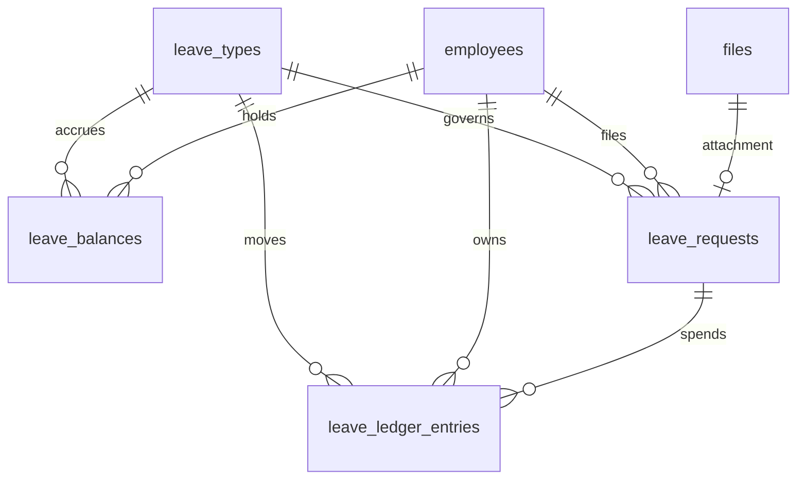
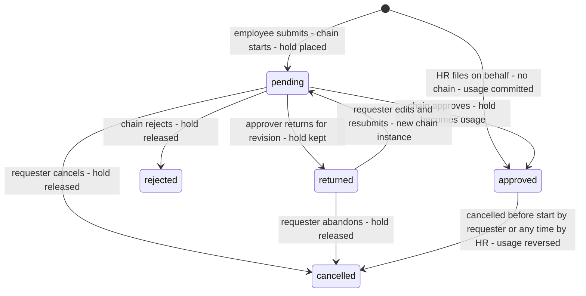
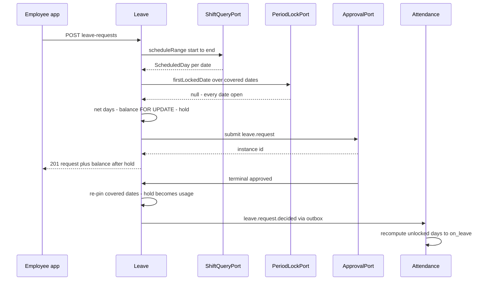
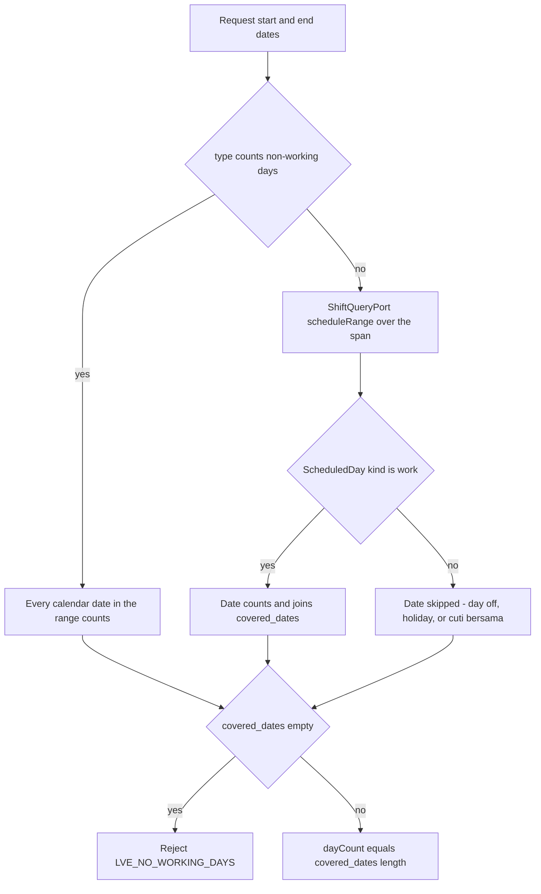
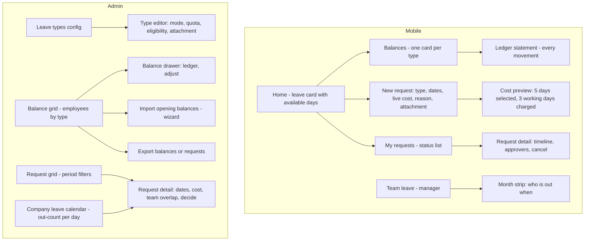

# Module: Leave

Status: Active (Phase 3) · Related ADRs: `ADR-0001` (port-only cross-module reads), `ADR-0002` (tenant scoping), `ADR-0003` (request-aggregate sync class), `ADR-0006` (`LVE_INSUFFICIENT_BALANCE` is its canonical example), `ADR-0007` (envelope, idempotent submit), `ADR-0008` (`leave.request` chain), `ADR-0009` (medical attachments), `ADR-0010` (jobs + outbox events), `ADR-0012` (payroll snapshot inputs), `ADR-0015` (balance adjustment import) · Depends on: `docs/06-modules/holiday.md` (template, cuti bersama), `docs/06-modules/employee.md` (identity, gender, join date, status), `docs/06-modules/shift.md` (`ShiftQueryPort` — the working-day test), `docs/06-modules/attendance.md` (`PeriodLockPort`), `docs/06-modules/organization.md` (placement), `docs/05-platform/approval-engine.md`, `docs/05-platform/document-storage.md`, `docs/05-platform/settings.md`, `docs/05-platform/import-export.md` · Consumers: attendance.md (`on_leave` derivation), payroll.md (paid/unpaid days, final-settlement encashment), reports.md, dashboard-analytics.md

Namespace `leave` (naming §4, error prefix `LVE`). Leave types and their statutory shapes, the balance ledger, accrual and carry-over, cuti bersama deduction, requests through the approval engine, and the coverage answer attendance needs to stop calling a leave day `absent`. Inherits all global standards; deviations only.

## 1. Purpose & Scope

Three layers, in order of authority. **Policy** — `leave_types`, the configuration that decides what a day of leave costs, who may take it, and whether it is paid. **The ledger** — append-only entries that are the only truth about a balance, so "where did my days go" is answerable to the entry. **Requests** — the aggregate that consumes days, routed through the approval engine and published to attendance and payroll.

**Balance model: ledger is truth, the balance row is a running total and the lock target.** Every accrual, carry-in, expiry, usage, reversal, cuti bersama deduction, and adjustment is a `leave_ledger_entries` row; `leave_balances` carries the same arithmetic as columns and is written in the same transaction. The materialized row exists for two reasons that a `SUM()` cannot serve: it is the single row two concurrent submissions serialize on (`SELECT … FOR UPDATE`), and it holds `pending_days` — the reservation that stops one employee spending the same day twice while both requests sit in a chain.

**Cost model: the schedule decides, and the cost is pinned.** Net days come from `ShiftQueryPort` — a date counts only when `ScheduledDay.kind === 'work'`, which is shift.md's forward duty discharged and means weekends, rostered days off, and holidays are free by construction. The resolved dates are stored on the request as `covered_dates` at approval, so a later roster edit cannot retroactively change what an approved leave cost (attendance.md BR-ATT-010's principle, applied to a different fact).

**Forward duties discharged here:** `LeaveQueryPort.coverageFor` (attendance §4.3 — the stub that made every approved leave day derive as `absent` is retired), the `leave.request.decided` event attendance's `on.leave.request.decided` handler subscribes to, the `attendance_days.leave_request_id` foreign key, and the `active ↔ on_leave` half of employee.md's status machine (BR-EMP-005 — "until leave.md lands, no row enters `on_leave`").

**V1 exclusions:** **half-day and hourly leave** (§15 — it needs attendance day fractions first: a half-day would derive as whole-day `on_leave` and silently contradict the punches from the other half; the balance columns are already `numeric(6,2)` so enabling it later is policy, not a migration), leave encashment as an employee-initiated request (payroll owns settlement encashment), blackout periods, negative-balance borrowing, per-employee policy overrides below company level, substitute/handover designation on a request, and leave-liability valuation (leave publishes days, payroll owns the rate).

> ⚠️ VERIFY: confirm against current Indonesian regulation before implementation. — every statutory quota, eligibility rule, and deduction basis in §4.2's seeded type table: annual leave entitlement and the twelve-month service condition (UU 13/2003 art. 79 jo. UU Cipta Kerja and its implementing PP), maternity and miscarriage duration under UU KIA, paternity duration, the art. 93(4) family-event day counts, sick-leave wage scaling by duration quarter (payroll prices it — payroll.md), whether long-service leave (istirahat panjang) remains a statutory entitlement or is now PKB-dependent, and whether a tenant may lawfully opt out of cuti bersama deduction (holiday.md BR-HOL-006 carries the same open item).

## 2. Actors & Permissions

| Action | Permission key | Data scope | Employee | Manager | HR Staff | HR Admin | System Administrator |
|---|---|---|---|---|---|---|---|
| View own balances, ledger, eligible types | — (authenticated; mobile + web) | self | ✅ | ✅ | ✅ | ✅ | ✅ |
| Submit / edit returned / cancel own request | — (authenticated) | self | ✅ | ✅ | ✅ | ✅ | ✅ |
| View team leave calendar + who is out | — (authenticated; manager-derived) | team (org port) | — | ✅ | ✅ | ✅ | ✅ |
| Approve / reject / return a request | `leave.request.approve` **+ chain membership** | instance (two-gate, BR-APRV-012) | — | ✅ | — | ✅ | — |
| Read any employee's requests | `leave.request.read` | company / tenant per assignment | — | — | ✅ | ✅ | ✅ |
| File a request on behalf, no chain | `leave.request.create` | company / tenant per assignment | — | — | ✅ | ✅ | ✅ |
| Cancel or amend a filed request | `leave.request.update` | company / tenant per assignment | — | — | ✅ | ✅ | ✅ |
| Read any employee's balances + ledger | `leave.balance.read` | company / tenant per assignment | — | — | ✅ | ✅ | ✅ |
| Post a balance adjustment | `leave.balance.update` | company / tenant per assignment | — | — | — | ✅ | ✅ |
| Read leave-type configuration | `leave.type.read` | tenant | — | — | ✅ | ✅ | ✅ |
| Create / edit / archive leave types | `leave.type.configure` | company / tenant per assignment | — | — | — | ✅ | ✅ |
| Export requests / balances | `leave.request.export` / `leave.balance.export` | company / tenant per assignment | — | — | ✅ | ✅ | ✅ |
| Import balance adjustments | `leave.balance.import` | tenant | — | — | — | ✅ | ✅ |

Actions come from the reserved set (naming §5) — no new action words. **`leave.request.approve` is the engine's two-gate module key** (approval-engine §2 uses this exact key as its canonical example): holding it is necessary but never sufficient, chain membership is the second gate, and reject/return are covered by the same key because they are the same seat's decisions. Managers hold it through the Manager role template; HR Admin holds it for chains that route to HR. **Retroactive cancellation is `leave.request.update`, not a new `cancel` action** — an admin correcting a filed request is an update of it, and minting an action word for one surface is exactly what naming §5's extension clause exists to prevent. Out-of-scope employees and requests are 404 (existence hiding).

## 3. Business Rules

| # | Rule |
|---|---|
| BR-LVE-001 | **A leave type is policy, not code.** `leave_types` fixes the quota mode, paid flag, eligibility, notice and backdate windows, attachment rule, day-counting basis, and whether the type moves the employee's status. Tenant-wide rows apply to every company; a `company_id` row applies to that company only (holiday.md BR-HOL-001 scoping, minus negation — a company adds types, it does not un-declare a tenant-wide one; archive it at tenant level instead). Codes are unique per scope and immutable after first use. |
| BR-LVE-002 | **Three quota modes, one validation path.** `balance` — deducts from an accrued balance for the period (annual leave). `per_request` — no balance; each request is capped at `max_days_per_request` and optionally at `max_occurrences_per_period` (marriage, bereavement, maternity). `unlimited` — no cap at all (sick, unpaid); the controls are the attachment rule and the approval chain. `LVE_INSUFFICIENT_BALANCE` belongs to the first mode, `LVE_QUOTA_EXCEEDED` to the second; the third can raise neither. |
| BR-LVE-003 | **Net days: the schedule decides.** For a type with `counts_non_working_days = false` (the default) a date consumes balance only when `ShiftQueryPort.scheduleRange` returns `kind = 'work'` for it — weekends, rostered days off, and holidays including cuti bersama are skipped, and the holiday verdict arrives **through** the scheduled day, never from a second `HolidayQueryPort` call (attendance.md §4.3's rule). For `counts_non_working_days = true` (maternity, miscarriage, long unpaid leave) every calendar date in the range counts, because those entitlements are expressed in calendar time. A range that resolves to zero counting dates is rejected (`LVE_NO_WORKING_DAYS`) — silently approving a zero-cost leave hides a roster problem. |
| BR-LVE-004 | **The cost is pinned.** `covered_dates` — the exact dates the leave consumes — is computed at submit so the employee sees the price, and **recomputed and stored at approval**, the moment the days are actually spent. Every later reader (attendance coverage, payroll, reports) uses the stored array; nobody re-resolves a roster to find out what an approved leave meant. |
| BR-LVE-005 | **The ledger is the balance.** Every movement is an append-only `leave_ledger_entries` row with a signed `days` value and a kind: `accrual`, `carry_in`, `carry_expiry`, `usage`, `usage_reversal`, `cuti_bersama`, `adjustment`, `settlement_payout`, `overtime_toil` (the last added 2026-08-02 for overtime.md, written only through `LeaveBalancePort`). Entries are never updated or deleted — a mistake is corrected by a compensating entry. `leave_balances` carries the same totals as columns, written in the same transaction, and is the row every reader and every concurrent writer touches. |
| BR-LVE-006 | **Available = `accrued + carried_in + adjusted − used − expired − pending`.** Submitting a `balance`-mode request takes `SELECT … FOR UPDATE` on the balance row, checks availability, and increments `pending_days` in the same transaction — the **hold**. Approval converts the hold to a `usage` entry; rejection, return, cancellation, and requester abandonment release it. Two overlapping submissions therefore cannot both pass: the second one sees the first one's hold. |
| BR-LVE-007 | **A hold is a reservation and it wins.** Once held, the days are the requester's: a later adjustment, expiry, or accrual change never invalidates a pending request, and carry-expiry skips held days rather than expiring them. Approval commits the hold without re-checking availability. Balance may go negative only through an explicit `adjustment` by an admin; while it is negative every new `balance`-mode request is refused. |
| BR-LVE-008 | **Leave period.** Balances are keyed by an explicit `[period_start, period_end]` date pair, not by a year number, so `leave.annual_period_basis` (`calendar` \| `anniversary`, company scope) selects the basis without a schema branch. `calendar` runs 1 Jan – 31 Dec; `anniversary` runs from the employee's join-date anniversary. Changing the basis applies to periods opened after the change — live periods are never re-keyed. |
| BR-LVE-009 | **Accrual.** `accrual_method = upfront` grants `annual_quota_days` at period start; `monthly` grants `annual_quota_days / 12` on the first day of each month of the period. With `prorates_on_join = true` a mid-period joiner's first period is scaled by remaining whole months. Accrual entries are idempotent on `(employee, type, kind, source_date)` where `source_date` is the grant date, so re-running the job is a no-op. An employee below `min_service_months` accrues nothing and cannot request the type (`LVE_TYPE_NOT_ELIGIBLE`). |
| BR-LVE-010 | **Carry-over.** At period rollover, up to `carry_over_max_days` of the closing balance becomes a `carry_in` entry on the new period, stamped with `carry_expires_on = period_start + leave.carry_over_expiry_months`. On that date the unused remainder of the carried amount — never more than what is still available, never the held days (BR-LVE-007) — is written as a negative `carry_expiry` entry. What does not carry simply does not appear: no entry is written for it, and the closing ledger already shows why. |
| BR-LVE-011 | **Cuti bersama deduction is a ledger entry, not a request.** When `holiday.cuti_bersama_deducts_leave` (holiday.md BR-HOL-006, company scope, effective-dated) resolves true as-of a cuti bersama date, one `cuti_bersama` entry of −1 day is posted against the leave type flagged `deducts_cuti_bersama` (exactly one per scope) for every employee active on that date. A negated cuti bersama day (holiday.md BR-HOL-001) is a working day there and deducts nothing. Because a cuti bersama date is non-working, BR-LVE-003 already skips it inside any leave request spanning it — the day is charged once, by this rule, never twice. |
| BR-LVE-012 | **One idempotent reconcile, three triggers.** Period seeding, accrual, carry-in, carry-expiry, and cuti bersama posting are one function keyed by `(employee, type, kind, source_date)`. It runs from `cron.leave.period-maintenance` daily (the self-healing path, and the one that picks up new hires), from `on.holiday.calendar.changed` (so a calendar edit moves balances immediately, not next month), and from `on.employee.status.changed` (terminal status stops accrual from the exit date). Every path is safe to run twice. |
| BR-LVE-013 | **Eligibility is checked at submit, against the type.** Gender restriction against `employees.gender`; `min_service_months` against `join_date`; `min_notice_days` and `max_backdate_days` against today; `requires_attachment` (optionally only from `attachment_required_from_days`) against the supplied file. Each failure has its own code (§11) — an employee refused a request is told which rule refused it, because "invalid request" is not actionable. |
| BR-LVE-014 | **No overlapping live requests.** A `pending` or `approved` request blocks any other request whose date range touches it, enforced by a gist exclusion, not by an application check (`LVE_OVERLAPPING_REQUEST`). Cancelled, rejected, and returned requests do not block. |
| BR-LVE-015 | **Period lock.** A request, cancellation, or adjustment whose dates fall inside a locked attendance period is refused (`LVE_PERIOD_LOCKED`) via `PeriodLockPort` (attendance.md §4.2). Backdated sick leave into a locked period is the common case and the answer is deliberate: the pay consequence is payroll's retro path, not a rewrite of an input somebody was already paid against (attendance.md BR-ATT-015's rule from the other side). |
| BR-LVE-016 | **Cancellation, two windows.** The requester may cancel a `pending` request at any time, and an `approved` request **strictly before its start date** — both self-service, both releasing the hold or reversing the usage. On or after the start date the requester cannot cancel (`LVE_CANCEL_WINDOW_CLOSED`): attendance has already derived those days and the truth is now a record, not an intention. A holder of `leave.request.update` may cancel at any time with a mandatory reason, subject to the period lock, and the employee is notified. Cancellation writes a `usage_reversal` entry against the **original period**, never the current one. |
| BR-LVE-017 | **Long leave moves the employee's status.** A type with `sets_employee_on_leave = true` (maternity, long unpaid leave) schedules `active → on_leave` at the start date and `on_leave → active` the day after the end date through `EmployeeStatusPort` (employee.md §13, added this session) — two `employee_status_history` rows with `source = 'leave'` and `source_id` = the request, applied by employee.md's existing effectuate job. Cancelling the leave cancels the unapplied rows; a status already applied is reversed by the same port. Short leave never touches employee status: a three-day annual leave is an attendance fact, not a change of employment state. |
| BR-LVE-018 | **Audit and offline.** `leave_types` and `leave_requests` are channel-1 audited with full diffs (audit-log §4.2, registered this session) — the request table is registered despite being a request aggregate because the HR-direct file-and-cancel path has no approval instance, so this trail is the only control on it (`attendance_corrections` precedent). `leave_ledger_entries` is itself a trail and `leave_balances` is derived from it; both are excluded by design, with the reason recorded in the registry. Mobile carries types, balances, and own requests as TTL-cached reference data and queues submit and cancel as **request-aggregate** ops keyed by `op_id`; a balance shown offline is advisory and the server re-checks it on arrival (§10). |

## 4. Domain Model

### 4.1 Schema



```ts
// src/database/schema/leave.ts
export const leaveQuotaMode = pgEnum('leave_quota_mode', ['balance', 'per_request', 'unlimited']);
export const leaveAccrualMethod = pgEnum('leave_accrual_method', ['upfront', 'monthly']);
export const leaveGenderRestriction = pgEnum('leave_gender_restriction', ['any', 'male', 'female']);
export const leaveRequestStatus = pgEnum('leave_request_status', [
  'pending', 'approved', 'rejected', 'returned', 'cancelled',
]);
export const leaveLedgerKind = pgEnum('leave_ledger_kind', [
  'accrual', 'carry_in', 'carry_expiry', 'usage', 'usage_reversal',
  'cuti_bersama', 'adjustment', 'settlement_payout',
  'overtime_toil',                                                // added 2026-08-02, overtime.md
]);

export const leaveTypes = pgTable('leave_types', {
  ...id, ...tenantId,
  companyId: uuid('company_id').references(() => companies.id),   // NULL = tenant-wide (BR-LVE-001)
  code: text('code').notNull(),                                   // annual, sick, maternity, …
  name: text('name').notNull(),
  quotaMode: leaveQuotaMode('quota_mode').notNull(),
  isPaid: boolean('is_paid').notNull().default(true),
  // balance mode
  accrualMethod: leaveAccrualMethod('accrual_method'),            // NULL unless quota_mode = balance
  annualQuotaDays: numeric('annual_quota_days', { precision: 6, scale: 2 }),
  proratesOnJoin: boolean('prorates_on_join').notNull().default(true),
  carryOverMaxDays: numeric('carry_over_max_days', { precision: 6, scale: 2 }),
  deductsCutiBersama: boolean('deducts_cuti_bersama').notNull().default(false),  // BR-LVE-011
  // per_request mode
  maxDaysPerRequest: integer('max_days_per_request'),
  maxOccurrencesPerPeriod: integer('max_occurrences_per_period'),
  // counting + eligibility
  countsNonWorkingDays: boolean('counts_non_working_days').notNull().default(false),
  genderRestriction: leaveGenderRestriction('gender_restriction').notNull().default('any'),
  minServiceMonths: integer('min_service_months').notNull().default(0),
  minNoticeDays: integer('min_notice_days').notNull().default(0),
  maxBackdateDays: integer('max_backdate_days').notNull().default(0),
  requiresAttachment: boolean('requires_attachment').notNull().default(false),
  attachmentRequiredFromDays: integer('attachment_required_from_days'),
  setsEmployeeOnLeave: boolean('sets_employee_on_leave').notNull().default(false),  // BR-LVE-017
  sortOrder: integer('sort_order').notNull().default(0),
  archivedAt: timestamp('archived_at', { withTimezone: true }),
  ...auditColumns, ...softDeleteColumns,
}, (t) => [
  uniqueIndex('uq_leave_types_tenant_id_company_id_code')
    .on(t.tenantId, sql`COALESCE(company_id, '00000000-0000-0000-0000-000000000000')`, t.code)
    .where(sql`deleted_at IS NULL`),
  uniqueIndex('uq_leave_types_cuti_bersama_target')
    .on(t.tenantId, sql`COALESCE(company_id, '00000000-0000-0000-0000-000000000000')`)
    .where(sql`deducts_cuti_bersama = true AND deleted_at IS NULL`),      // BR-LVE-011
  index('idx_leave_types_tenant_id_company_id').on(t.tenantId, t.companyId),
]);

export const leaveBalances = pgTable('leave_balances', {
  ...id, ...tenantId,
  employeeId: uuid('employee_id').notNull().references(() => employees.id),
  leaveTypeId: uuid('leave_type_id').notNull().references(() => leaveTypes.id),
  periodStart: date('period_start').notNull(),
  periodEnd: date('period_end').notNull(),                        // inclusive
  accruedDays: numeric('accrued_days', { precision: 6, scale: 2 }).notNull().default('0'),
  carriedInDays: numeric('carried_in_days', { precision: 6, scale: 2 }).notNull().default('0'),
  adjustedDays: numeric('adjusted_days', { precision: 6, scale: 2 }).notNull().default('0'),
  usedDays: numeric('used_days', { precision: 6, scale: 2 }).notNull().default('0'),
  expiredDays: numeric('expired_days', { precision: 6, scale: 2 }).notNull().default('0'),
  pendingDays: numeric('pending_days', { precision: 6, scale: 2 }).notNull().default('0'),  // the hold
  carryExpiresOn: date('carry_expires_on'),                       // BR-LVE-010
  accruedThrough: date('accrued_through'),                        // last granted month, monthly method
  ...auditColumns,
}, (t) => [
  uniqueIndex('uq_leave_balances_tenant_id_employee_id_type_period')
    .on(t.tenantId, t.employeeId, t.leaveTypeId, t.periodStart),
  index('idx_leave_balances_tenant_id_employee_id_leave_type_id')
    .on(t.tenantId, t.employeeId, t.leaveTypeId),
  index('idx_leave_balances_tenant_id_carry_expires_on')
    .on(t.tenantId, t.carryExpiresOn).where(sql`carry_expires_on IS NOT NULL`),
]);

export const leaveLedgerEntries = pgTable('leave_ledger_entries', {
  ...id, ...tenantId,
  employeeId: uuid('employee_id').notNull().references(() => employees.id),
  leaveTypeId: uuid('leave_type_id').notNull().references(() => leaveTypes.id),
  periodStart: date('period_start').notNull(),
  periodEnd: date('period_end').notNull(),
  kind: leaveLedgerKind('kind').notNull(),
  days: numeric('days', { precision: 6, scale: 2 }).notNull(),    // signed: grants +, spends −
  effectiveDate: date('effective_date').notNull(),
  sourceDate: date('source_date'),                                // idempotency discriminator
  leaveRequestId: uuid('leave_request_id').references(() => leaveRequests.id),
  note: text('note'),
  createdBy: uuid('created_by'),                                  // NULL = job; no FK (erd-overview §7)
  createdAt: timestamp('created_at', { withTimezone: true }).notNull().defaultNow(),
}, (t) => [
  uniqueIndex('uq_leave_ledger_entries_source_key')
    .on(t.tenantId, t.employeeId, t.leaveTypeId, t.kind, t.sourceDate)
    .where(sql`source_date IS NOT NULL`),                         // BR-LVE-012
  index('idx_leave_ledger_entries_tenant_id_employee_id_leave_type_id')
    .on(t.tenantId, t.employeeId, t.leaveTypeId),
  index('idx_leave_ledger_entries_tenant_id_leave_request_id')
    .on(t.tenantId, t.leaveRequestId).where(sql`leave_request_id IS NOT NULL`),
]);

export const leaveRequests = pgTable('leave_requests', {
  ...id, ...tenantId,
  employeeId: uuid('employee_id').notNull().references(() => employees.id),
  companyId: uuid('company_id').notNull().references(() => companies.id),
  leaveTypeId: uuid('leave_type_id').notNull().references(() => leaveTypes.id),
  startDate: date('start_date').notNull(),
  endDate: date('end_date').notNull(),                            // inclusive
  coveredDates: jsonb('covered_dates').notNull().default(sql`'[]'::jsonb`),  // BR-LVE-004
  dayCount: numeric('day_count', { precision: 6, scale: 2 }).notNull(),
  periodStart: date('period_start').notNull(),                    // balance period the days come from
  reason: text('reason'),
  attachmentFileId: uuid('attachment_file_id').references(() => files.id),
  status: leaveRequestStatus('status').notNull().default('pending'),
  approvalInstanceId: uuid('approval_instance_id')
    .references(() => approvalInstances.id),                      // NULL = filed directly by HR
  decidedAt: timestamp('decided_at', { withTimezone: true }),
  cancelledAt: timestamp('cancelled_at', { withTimezone: true }),
  cancelledBy: uuid('cancelled_by').references(() => users.id),
  cancellationReason: text('cancellation_reason'),
  opId: uuid('op_id'),                                            // ADR-0003 durable dedup
  ...auditColumns,
}, (t) => [
  uniqueIndex('uq_leave_requests_tenant_id_op_id')
    .on(t.tenantId, t.opId).where(sql`op_id IS NOT NULL`),
  index('idx_leave_requests_tenant_id_employee_id_start_date')
    .on(t.tenantId, t.employeeId, t.startDate),
  index('idx_leave_requests_tenant_id_company_id_status')
    .on(t.tenantId, t.companyId, t.status),
  index('idx_leave_requests_coverage')
    .on(t.tenantId, t.startDate, t.endDate).where(sql`status = 'approved'`),
]);
```

Hand-written in the generating migrations (database-conventions §10):

- `ck_leave_types_balance_mode` — `quota_mode <> 'balance' OR (accrual_method IS NOT NULL AND annual_quota_days IS NOT NULL)`; `ck_leave_types_per_request_mode` — `quota_mode <> 'per_request' OR max_days_per_request IS NOT NULL`.
- `ck_leave_balances_period` and `ck_leave_requests_range` — `period_end >= period_start`, `end_date >= start_date`.
- `excl_leave_requests_no_overlap` — gist exclusion on `(tenant_id WITH =, employee_id WITH =, daterange(start_date, end_date, '[]') WITH &&) WHERE status IN ('pending','approved')` (BR-LVE-014).
- `leave_ledger_entries.leave_request_id` → `fk_leave_ledger_entries_leave_requests`, added after both tables exist (circular declaration order; attendance.md precedent).
- **`attendance_days.leave_request_id` → `fk_attendance_days_leave_requests`** — the foreign key attendance.md §4.1 deferred to this module, added here (holiday.md `branch_id` precedent).
- `uq_leave_balances_tenant_id_employee_id_type_period` and `uq_leave_ledger_entries_source_key` name the **semantic** key rather than the literal column list: the spelled-out forms are 66 and 76 characters, past PostgreSQL's 63-byte identifier limit, and a silently truncated name is worse than a documented abbreviation. Precedent: holiday.md's `uq_holidays_scope_date_kind`.
- Standard RLS on all four tables. No `version` columns: requests are never edited concurrently (the requester owns a returned request, nobody else writes it), balances are guarded by `FOR UPDATE`, and the ledger is append-only (database-conventions §1.10 scope).



A **returned** request keeps its hold: the days are still spoken for while the requester fixes a date or attaches a note, and taking the reservation away mid-revision would let a colleague's request eat it. `leave_types` has no lifecycle (present-or-archived reference data), `leave_ledger_entries` has none (an append-only fact is not a state machine), and `leave_balances` has none (a running total is arithmetic, not state). Template note honored (holiday §4.1).

### 4.2 Seeded statutory types

Provisioning seeds these tenant-wide, editable afterwards. Quotas and eligibility are **configuration**, never constants in code (spec §4 item 4).

> ⚠️ VERIFY: confirm against current Indonesian regulation before implementation. — every quota, duration, and eligibility rule in the table below; see §1 for the specific open items.

| Code | Name | Quota mode | Paid | Days | Calendar-day count | Attachment | Gender | Sets `on_leave` |
|---|---|---|---|---|---|---|---|---|
| `annual` | Cuti tahunan | balance | ✅ | 12 / period ⚠️ | — | — | any | — |
| `sick` | Sakit | unlimited | ✅ | — | — | ✅ from day 2 ⚠️ | any | — |
| `maternity` | Cuti melahirkan | per_request | ✅ | 90 ⚠️ | ✅ | ✅ | female | ✅ |
| `miscarriage` | Cuti keguguran | per_request | ✅ | 45 ⚠️ | ✅ | ✅ | female | ✅ |
| `paternity` | Cuti pendamping melahirkan | per_request | ✅ | 2 ⚠️ | — | — | male | — |
| `marriage` | Cuti menikah | per_request | ✅ | 3 ⚠️ | — | — | any | — |
| `child_marriage` | Menikahkan anak | per_request | ✅ | 2 ⚠️ | — | — | any | — |
| `child_ceremony` | Khitan atau baptis anak | per_request | ✅ | 2 ⚠️ | — | — | any | — |
| `bereavement_family` | Duka keluarga inti | per_request | ✅ | 2 ⚠️ | — | — | any | — |
| `bereavement_household` | Duka anggota rumah tangga | per_request | ✅ | 1 ⚠️ | — | — | any | — |
| `unpaid` | Cuti di luar tanggungan | unlimited | — | — | ✅ | — | any | ✅ |
| `toil` | Cuti pengganti lembur | balance | ✅ | 0 | — | — | any | — |

`toil` (added 2026-08-02, overtime.md BR-OVT-011) is the only seeded type that is **not** statutory: it holds time off earned in lieu of overtime pay. `annual_quota_days = 0` with `accrual_method = upfront` is deliberate rather than a placeholder — an upfront accrual of zero means "this type never accrues on its own," so the balance grows only from `overtime_toil` ledger entries and the maintenance cron still opens a period for it to live in. `carry_over_max_days = 0`, so unused TOIL expires at the period boundary (A-028); per-entry expiry is §15. A tenant whose policy is pay-only simply never has entries against it.

`annual` carries `deducts_cuti_bersama = true`, `accrual_method = monthly`, `prorates_on_join = true`, `min_service_months = 12` ⚠️, and `carry_over_max_days = 6` ⚠️. Sick-leave wage scaling by duration quarter is payroll's arithmetic, not a leave column — leave publishes the type, the paid flag, and the day count; payroll prices them (payroll.md, ⚠️ VERIFY there).

### 4.3 Ports served

```ts
export const LEAVE_QUERY_PORT = Symbol('LEAVE_QUERY_PORT');

export type LeaveCoverage = {
  leaveRequestId: string;
  leaveTypeId: string; leaveTypeCode: string; leaveTypeName: string;
  isPaid: boolean;
};

export type LeaveUsageSummary = {
  employeeId: string; from: string; to: string;
  paidLeaveDays: number; unpaidLeaveDays: number;
  byType: { leaveTypeCode: string; isPaid: boolean; days: number; dates: string[] }[];
};

export type LeaveBalanceSnapshot = {
  leaveTypeId: string; leaveTypeCode: string; periodStart: string; periodEnd: string;
  accrued: number; carriedIn: number; adjusted: number;
  used: number; expired: number; pending: number; available: number;
  carryExpiresOn: string | null;
};

export interface LeaveQueryPort {
  /** Attendance derivation, batched per date — the stub attendance.md §4.3 shipped with. */
  coverageFor(employeeIds: string[], date: string): Promise<Map<string, LeaveCoverage>>;
  /** Payroll's snapshot input (ADR-0012) — paid vs unpaid days over the run period. */
  summaryFor(employeeIds: string[], from: string, to: string): Promise<Map<string, LeaveUsageSummary>>;
  /** Final settlement: encashable remainder as-of the exit date. */
  balanceFor(employeeId: string, asOf: string): Promise<LeaveBalanceSnapshot[]>;
}

export const LEAVE_BALANCE_PORT = Symbol('LEAVE_BALANCE_PORT');

export interface LeaveBalancePort {
  /**
   * Credit or reverse time off in lieu of overtime pay. Added 2026-08-02 for overtime.md
   * BR-OVT-011. `days` is signed — a cancelled or re-actualized occurrence posts the
   * compensating negative. Idempotent on `sourceRef`: the same occurrence credits once.
   */
  creditOvertimeToil(input: {
    employeeId: string; days: number; effectiveDate: string;
    sourceRef: string;                    // the overtime occurrence id
    note?: string;
  }): Promise<{ ledgerEntryId: string; balance: LeaveBalanceSnapshot }>;
}
```

`LeaveBalancePort` is this module's **first write port**, and the only one: it posts `overtime_toil` entries against the seeded `TOIL` type and nothing else. Every other cross-module write into a leave balance is refused — an adjustment is a human act through `POST /leave-ledger-entries`, and an accrual belongs to the maintenance cron. The direction mirrors what this module already does to employee.md through `EmployeeStatusPort`: the module that owns the aggregate exposes the one verb another module legitimately needs, rather than surrendering the table.

`coverageFor` answers from `covered_dates` on approved requests (BR-LVE-004) — a containment check over a small, date-bounded row set, which is why no GIN index exists on the jsonb column: the partial index on `(tenant_id, start_date, end_date) WHERE status = 'approved'` already narrows to a handful of rows before the array is touched.

### 4.4 Ports consumed

| Port | Use | Status |
|---|---|---|
| `ShiftQueryPort.scheduleRange` | the working-day test of BR-LVE-003 (shift.md §4.2) | live |
| `PeriodLockPort.firstLockedDate` | BR-LVE-015 over a request's covered dates (attendance.md §4.2) | live |
| `HolidayQueryPort.nonWorkingDays` | cuti bersama dates for the BR-LVE-011 reconcile — a different question from the working-day test, which `ScheduledDay` already answers; this one needs the holiday's `kind` | live |
| `OrgQueryPort.placement` | branch and department for chain context and grid filters | live |
| `SettingsPort.resolve` | the three `leave.*` keys plus `holiday.cuti_bersama_deducts_leave`, as-of the leave date | live |
| `DocumentStoragePort` | `leave_attachment` slot, commit, URL mint | live |
| `ApprovalEnginePort` | `leave.request` instances | live |
| `EmployeeStatusPort` | BR-LVE-017 long-leave status scheduling — **added to employee.md §13 this session** | live |
| **`employee_directory`** (read-model view) | `fullName` and `employeeNumber` on the requests grid, the balances grid, the team calendar, and `teamOverlap`, plus the `q=` search over them | **live 2026-08-03** — published by employee.md §13 under the ADR-0001 §6 amendment; declared retroactively, the columns were already being returned with no sanctioned channel |

### 4.5 Balance arithmetic

| Quantity | Formula |
|---|---|
| `available` | `accrued + carried_in + adjusted − used − expired − pending` |
| monthly accrual grant | `round(annual_quota_days / 12, 2)`, granted on the 1st of each month within the period |
| join proration (`prorates_on_join`) | `round(annual_quota_days × remaining_whole_months / 12, 2)` from the join month |
| carry-in at rollover | `min(closing_available, carry_over_max_days)`; `carry_expires_on = period_start + leave.carry_over_expiry_months` |
| carry expiry on that date | `min(carried_in − consumed_since_rollover, available − pending)`, floored at 0 |
| request cost | `covered_dates.length` (BR-LVE-003) |

Worked example — annual leave, calendar basis, monthly accrual, quota 12, carry cap 6, expiry 3 months, joined 15 Mar 2026:

| Moment | Movement | Running available |
|---|---|---|
| 1 Apr – 1 Dec 2026 | 9 monthly accruals of 1.00 (proration starts the month after joining) | 9.00 |
| 12 Jun 2026 | cuti bersama on 12 Jun deducts 1.00 | 8.00 |
| 3–7 Aug 2026 submitted | 5 calendar days, 1 is a Saturday off and 1 is a holiday → `covered_dates` = 3 dates, hold 3.00 | 5.00 |
| 10 Aug 2026 approved | hold becomes `usage` −3.00 | 5.00 |
| 1 Jan 2027 | closing 5.00, carry cap 6 → `carry_in` +5.00, `carry_expires_on` = 1 Apr 2027; new period accrues from 1 Jan | 5.00 + new accruals |
| 1 Apr 2027 | 2.00 of the carried 5.00 still unused and unheld → `carry_expiry` −2.00 | accruals only |

## 5. Use Cases

**UC-LVE-001 — Employee submits a request.** `POST /leave-requests`: type eligibility (BR-LVE-013) → `ShiftQueryPort.scheduleRange` over the span → `covered_dates` and `dayCount` (BR-LVE-003) → `PeriodLockPort.firstLockedDate` over those dates (BR-LVE-015) → overlap exclusion (BR-LVE-014) → quota-mode check: `balance` takes the balance row `FOR UPDATE` and places the hold (BR-LVE-006), `per_request` counts occurrences in the period, `unlimited` skips both → attachment slot already committed → `ApprovalPort.submit('leave.request', …)` in the same transaction. Response carries the request, the resolved dates, and the balance after the hold, so the employee sees the price before an approver ever looks.

**UC-LVE-002 — Approver decides.** `POST /leave-requests/{id}/approve|reject|return` — module-owned routes calling the engine port (approval-engine §7: the engine has no public action API). Two-gate: `leave.request.approve` then chain membership. The approval detail shows **who else on the team is out** across the requested dates (UC-LVE-008's query, scoped to the requester's department) — the single question an approver actually needs answered. On the terminal `approval.instance.approved` the module re-pins `covered_dates`, converts the hold to a `usage` entry, schedules the status rows for a long-leave type (BR-LVE-017), and emits `leave.request.decided`. Reject and return release or keep the hold per BR-LVE-016 / §4.1.

**UC-LVE-003 — HR files on behalf.** Same endpoint with `leave.request.create` and an explicit `employeeId`: no instance, `status = 'approved'`, usage committed in one transaction, full audit. HR entering sick leave the employee phoned in is the daily reality of this module, and requiring a manager to approve HR's own entry is theatre — the audit row is the control (attendance.md UC-ATT-010's reasoning).

**UC-LVE-004 — Cancellation.** Requester on a `pending` request, or on an `approved` one strictly before its start date: hold released or `usage_reversal` posted against the **original** period, engine instance cancelled, `leave.request.decided` emitted so attendance recomputes the freed days. On or after the start date the button is not offered and the endpoint refuses (`LVE_CANCEL_WINDOW_CLOSED`). HR with `leave.request.update` cancels at any time with a reason, subject to the lock, and the employee gets the `leave.request_cancelled` notice.

**UC-LVE-005 — Period maintenance.** `cron.leave.period-maintenance` (daily, `maintenance`, per-tenant fan-out per ADR-0010) runs one idempotent pass per active employee per `balance`-mode type, in order: open the current period if missing (proration on a fresh joiner), grant accruals due today, roll carry-in when a period starts, expire carried days reaching `carry_expires_on`, reconcile cuti bersama entries against the calendar, and queue the `leave.balance_expiring` notice `leave.balance_expiry_notice_days` ahead of an expiry. One job because these are one concern — the period's arithmetic — and every step is keyed by `(employee, type, kind, source_date)`, so a re-run costs one no-op upsert each (BR-LVE-012).

**UC-LVE-006 — Calendar change lands.** `on.holiday.calendar.changed` → re-run the cuti bersama reconcile for the affected dates and scope (posting new deductions, reversing entries whose day was negated or deleted), then **revalidate pending requests spanning the changed dates** and recompute their `covered_dates` — a newly announced holiday inside a pending leave makes it cheaper, and the requester is shown the new cost. Already-approved requests are **not** silently recomputed (holiday.md §9 assigns that rule here): they are flagged in the admin grid as "calendar changed after approval" for HR to cancel-and-refile if the tenant wants the day back. Silently editing an approved request's cost would move a balance nobody asked to move.

**UC-LVE-007 — Employee views balances.** Mobile: `GET /me/leave/balances` — one card per eligible type showing available, pending, and the carry-expiry date with a countdown when it is near; tapping opens the ledger, which reads as a statement ("+1.00 accrued 1 Jun", "−1.00 cuti bersama 12 Jun", "−3.00 leave 3–7 Aug"). This screen is the answer to the most common leave support ticket in any HRIS, and it is why the ledger exists.

**UC-LVE-008 — Team and company calendar.** Manager: `GET /me/team/leave?month=` → direct reports with their approved and pending leave as date ranges, rendered as a month strip so overlap is visible at a glance. Admin: `GET /leave-calendar` over a company with branch/department filters and a per-day out-count. Read-only; approving happens in the request detail.

**UC-LVE-009 — Balance adjustment.** `POST /leave-ledger-entries` with employee, type, period, signed days, and a mandatory reason → one `adjustment` ledger entry + balance update in one transaction, audited, refused when the period is locked. This is the only way a human moves a balance directly, and it is additive — nothing is ever overwritten.

**UC-LVE-010 — Opening balance import.** `ImportDefinition leave.balance_adjustment`, `create_only`, `partial` commit: a tenant onboarding mid-year loads opening balances as adjustment rows through the standard pipeline (download template → upload → dry-run → confirm). `create_only` is not a limitation here but the model: an import row writes an audited additive fact, never a silent overwrite of a live balance — which is exactly the property A-019 wanted from `employee.master` and could not get.

**UC-LVE-011 — Employee exits.** `on.employee.status.changed` to a terminal status → stop accrual from the exit date, cancel `pending` requests and their instances, cancel approved requests whose dates start after the exit date (with the reason recorded), and leave everything already taken untouched. The remaining balance is **not** zeroed: payroll reads it through `LeaveQueryPort.balanceFor` for final-settlement encashment and posts a `settlement_payout` entry when the run closes (payroll.md forward duty).

**UC-LVE-012 — Type configuration.** `leave.type.configure` → validate the mode-dependent field set (§8), the single `deducts_cuti_bersama` per scope, and code immutability after first use → write + audit. Archiving is refused while live balances or non-terminal requests reference the type (`LVE_TYPE_IN_USE`, `ORG_IN_USE` / `SHF_IN_USE` precedent); an archived type disappears from the request form and keeps answering historical reads.





## 6. UI Flow



- **Scope bar** (design-system §12): company + the attendance period with the lock badge — a locked period disables the request form for those dates and hides the cancel action rather than offering it and then refusing.
- Status chips map to design-system §2.3: `pending` → pending, `approved` → positive, `rejected` → negative, `returned` → pending with the revision label, `cancelled` → draft/neutral. Never colour alone.
- **The cost preview is the signature detail of this module's UI.** The request form recomputes on every date change and states the arithmetic in words — "5 days selected · 3 working days charged · Sat 8 Aug is your day off, Mon 10 Aug is Idul Adha" — because a leave form that shows a total without showing why is the single most-disputed screen in an HRIS. Offline the same preview runs against the mirrored schedule and is labelled advisory (§10).
- Balance cards lead with **available**, with pending shown as a secondary line ("2 days awaiting approval"), and a carry-expiry countdown appears only inside `leave.balance_expiry_notice_days` — a permanent countdown is noise.
- The approver's detail screen shows team overlap for the requested dates inline (UC-LVE-002); an approver should never have to open a calendar in another tab to answer "can we spare them".
- Empty states: no types configured → EmptyState + "Add a leave type" (admin) and "No leave types available yet, ask your HR admin" (mobile, shift.md wording, one voice); zero balance → the card still renders with 0 and the accrual date, never a blank.
- Error surfaces follow the field > panel > toast order (coding-standards-nextjs): `LVE_INSUFFICIENT_BALANCE` and `LVE_QUOTA_EXCEEDED` land on the date field with the shortfall in the message; `LVE_PERIOD_LOCKED` is a panel, because no field caused it.

## 7. API

All endpoints follow the canonical spec-block form (api-standards §13). No new pagination-registry rows: admin grids here are the seeded transactional-grid family (offset) and mobile history is the seeded self-service family (cursor). Import/export endpoints ride import-export §7. Errors beyond the implied set only.

| Endpoint | Permission | Pagination | Queue-reachable | Idempotency |
|---|---|---|---|---|
| `GET /api/v1/leave-types` | `leave.type.read` | offset | no | — |
| `POST /api/v1/leave-types` | `leave.type.configure` | — | no | — |
| `PATCH /api/v1/leave-types/{id}` | `leave.type.configure` | — | no | — |
| `DELETE /api/v1/leave-types/{id}` | `leave.type.configure` | — | no | — |
| `GET /api/v1/leave-requests` | `leave.request.read` (`?mine=true` self) | offset | no | — |
| `GET /api/v1/leave-requests/{id}` | `leave.request.read` / own | — | no | — |
| `POST /api/v1/leave-requests` | — (self) / `leave.request.create` | — | **yes** | **required** |
| `GET /api/v1/leave-requests/preview` | — (authenticated, self) | — | no | — |
| `PATCH /api/v1/leave-requests/{id}` | — (own, `returned` only) | — | no | accepted |
| `POST /api/v1/leave-requests/{id}/submit` | — (own, `returned` only) | — | no | accepted |
| `POST /api/v1/leave-requests/{id}/cancel` | — (own, per BR-LVE-016) / `leave.request.update` | — | **yes** | accepted |
| `POST /api/v1/leave-requests/{id}/approve` | `leave.request.approve` | — | no | accepted |
| `POST /api/v1/leave-requests/{id}/reject` | `leave.request.approve` | — | no | accepted |
| `POST /api/v1/leave-requests/{id}/return` | `leave.request.approve` | — | no | accepted |
| `POST /api/v1/leave-requests/bulk-approve` | `leave.request.approve` | — | no | accepted |
| `GET /api/v1/leave-balances` | `leave.balance.read` | offset | no | — |
| `GET /api/v1/leave-ledger-entries` | `leave.balance.read` / own | offset | no | — |
| `POST /api/v1/leave-ledger-entries` | `leave.balance.update` | — | no | accepted |
| `GET /api/v1/leave-calendar` | `leave.request.read` | — (month-bounded) | no | — |
| `GET /api/v1/me/leave/snapshot` | — (authenticated, self) | — | no | — |
| `GET /api/v1/me/leave/requests` | — (authenticated, self) | cursor | no | — |
| `GET /api/v1/me/team/leave` | — (authenticated; manager-derived) | — (one month) | no | — |

`return` is registered as a URL verb in naming §3 and api-standards §1.2 **this session** — ADR-0008 made "return for revision" a first-class approver action and every request-owning module (overtime, expense, data change) will need the same route; the shift.md `assign` registration is the precedent.

#### POST /api/v1/leave-requests · GET /leave-requests/preview

| Field | Type | Required | Rule |
|---|---|---|---|
| `employeeId` | uuid | conditional | omit for self; required with `leave.request.create` |
| `leaveTypeId` | uuid | ✅ | live, in the caller's scope, eligible for the employee |
| `startDate` / `endDate` | date | ✅ | ISO; `end ≥ start`; span ≤ 366 days; inside the type's notice/backdate window |
| `reason` | string | conditional | required when the type says so; 5–500 |
| `attachmentFileId` | uuid | conditional | committed `leave_attachment` owned by the caller; required per BR-LVE-013 |

Response 201: `{ request: { …row, coveredDates, dayCount }, balance: LeaveBalanceSnapshot | null, approvalInstanceId: string | null }`. **`preview` is a `GET`** taking the same fields as query params: it resolves the schedule, computes the cost, and evaluates every rule with **zero writes**, returning `{ coveredDates, dayCount, skipped: [{ date, reason }], balance, blockers: [{ code, details }] }` — the cost preview of §6, and the reason the form never guesses. A pure read gets a pure method (api-standards §2); it needs no verb from the naming §3 set and is free to retry. Errors (POST path): `LVE_INSUFFICIENT_BALANCE` (`details: { availableDays, requestedDays }`) · `LVE_QUOTA_EXCEEDED` (`details: { maxDays, requestedDays }` or `{ maxOccurrences }`) · `LVE_OVERLAPPING_REQUEST` (`details: { conflictingRequestId }`) · `LVE_TYPE_NOT_ELIGIBLE` (`details: { reason }`) · `LVE_NOTICE_TOO_SHORT` (`details: { minNoticeDays, maxBackdateDays }`) · `LVE_ATTACHMENT_REQUIRED` · `LVE_NO_WORKING_DAYS` · `LVE_PERIOD_LOCKED` (`details: { periodId, date }`) · unknown or out-of-scope employee → `SYS_NOT_FOUND`.

#### PATCH /api/v1/leave-requests/{id} · POST /{id}/submit
Editing is allowed on an own `returned` request only — `leaveTypeId`, `startDate`, `endDate`, `reason`, `attachmentFileId`. The hold is recomputed on save (BR-LVE-006/007) and the same error set applies. `submit` starts a **new** chain instance on the same request (ADR-0008 restart-on-resubmit) and flips the status back to `pending`. Any other status → `LVE_REQUEST_ALREADY_DECIDED`.

#### POST /api/v1/leave-requests/{id}/approve · reject · return
Request: `{ comment? }` — mandatory for `reject` and `return` (`APRV_COMMENT_REQUIRED`). Response 200: the request with its refreshed status plus `{ instance: { status, currentStepIndex } }`. Errors: `LVE_REQUEST_ALREADY_DECIDED` (the module-level guard, raised before the engine when the row is no longer `pending`) · `APRV_NOT_AN_APPROVER` · `APRV_STEP_ALREADY_DECIDED` · `APRV_INSTANCE_NOT_ACTIONABLE` · `LVE_PERIOD_LOCKED` (a period locked between submit and approval — the request lands in `rejected` with the code recorded, and nothing is written into frozen data).

#### POST /api/v1/leave-requests/bulk-approve
Request: `{ ids: [...] }`, ≤ 100 (api-standards §10). Response 200: per-item results — this is the shape api-standards §10 illustrates with `LVE_REQUEST_ALREADY_DECIDED`, and the code registers here. Each item runs the full single-approve path; a partial batch is the normal outcome.

#### POST /api/v1/leave-requests/{id}/cancel
Request: `{ reason? }` — mandatory for the `leave.request.update` path, optional for the requester's own. Response 200: the cancelled request + the reversed balance. Errors: `LVE_CANCEL_WINDOW_CLOSED` (requester, on or after `startDate`) · `LVE_PERIOD_LOCKED` · `LVE_REQUEST_ALREADY_DECIDED` (already `rejected` or `cancelled`).

#### GET /api/v1/leave-requests · GET /{id}
Grid: `?companyId=` (required unless `?mine=true`) `?status=&leaveTypeId=&employeeId=&branchId=&departmentId=&from=&to=&calendarChanged=true&q=` + offset. Response 200: `data: [{ id, employee: { id, employeeNumber, fullName }, leaveType: { id, code, name, isPaid }, startDate, endDate, dayCount, status, approvalInstanceId, decidedAt, flags }]` + `meta` with the offset totals and `lockedRanges`. Detail adds `coveredDates`, `reason`, the attachment reference, the approval timeline (engine read), and `teamOverlap: [{ employeeId, fullName, startDate, endDate }]` for the requester's department across the requested dates.

#### GET /api/v1/leave-balances · GET /leave-ledger-entries · POST /leave-ledger-entries
`GET /leave-balances`: `?companyId=` (required) `?leaveTypeId=&employeeId=&branchId=&departmentId=&asOf=&q=` + offset, paging over **employees** with every eligible type per row. Response 200: `data: [{ employeeId, employeeNumber, fullName, balances: LeaveBalanceSnapshot[] }]` + meta.
`GET /leave-ledger-entries`: `?employeeId=` (required; own id needs no permission) `?leaveTypeId=&periodStart=&from=&to=&kind=` + offset, newest first. Response 200: entry rows with `kind`, signed `days`, `effectiveDate`, `sourceDate`, `leaveRequestId`, `note`, and the actor. The employee-facing statement of UC-LVE-007 reads the same endpoint scoped to self.
`POST /leave-ledger-entries` — the adjustment write, and the **only** entry kind a human may create; `kind` is fixed to `adjustment` server-side, so the trail cannot be forged into an accrual. Request: `{ employeeId, leaveTypeId, periodStart, days (signed, ≠ 0), effectiveDate, reason }` (reason ✅, 5–500). Response 201: the entry + the refreshed snapshot. Errors: `LVE_PERIOD_LOCKED` · unknown period or out-of-scope employee → `SYS_NOT_FOUND`. One resource rather than a `/leave-balances/adjustments` sub-collection: an adjustment *is* a ledger entry, and nesting a collection under a collection is not the one-level ownership nesting naming §3 allows.

#### GET /api/v1/leave-types · POST · PATCH · DELETE
`GET`: `?companyId=&includeArchived=` + offset → configuration rows. `POST`/`PATCH`: the §4.1 field set, mode-dependent per §8; `code` is immutable once any balance or request references the type. `DELETE` archives (soft delete + `archived_at`). Errors: `LVE_TYPE_IN_USE` (`details: { blockers: [{ type, count }] }`) · duplicate `(scope, code)` → `VAL_VALIDATION_FAILED` with `VAL_DUPLICATE` · a second `deductsCutiBersama` in one scope → `VAL_DUPLICATE` on that field.

#### GET /api/v1/me/leave/snapshot · GET /me/leave/requests · GET /me/team/leave
`snapshot`: the mobile bootstrap read — `{ types: [{ id, code, name, quotaMode, isPaid, requiresAttachment, minNoticeDays, maxBackdateDays, countsNonWorkingDays, maxDaysPerRequest }], balances: LeaveBalanceSnapshot[], pendingCount }`, scoped to the caller's eligible types. One read instead of three delta-sync endpoints: an employee's leave surface is a handful of rows, so it is cached with a TTL and refreshed on foreground rather than mirrored with a cursor (§10).
`me/leave/requests`: `?status=&from=&to=` + cursor, newest first, each entry with `coveredDates` and the decision timeline.
`me/team/leave`: `?month=` (required, `YYYY-MM`). Response 200: `data: [{ employeeId, fullName, positionTitle, entries: [{ leaveRequestId, leaveTypeCode, startDate, endDate, status }] }]`. Direct reports only (org port inverse); empty for non-managers. Unpaginated — team sizes are dozens (shift.md UC-SHF-008 precedent).

#### GET /api/v1/leave-calendar
Request: `?companyId=` (required) `?month=` (required) `?branchId=&departmentId=&leaveTypeId=`. Response 200: `{ days: [{ date, outCount, entries: [{ employeeId, fullName, leaveTypeCode, status }] }] }`. Month-bounded, so unpaginated by construction (api-standards §5.1's bounded-collection exemption, stated here).

## 8. Validation Rules

| Field | Rule | Error code |
|---|---|---|
| `startDate` / `endDate` | ISO dates, `end ≥ start`, span ≤ 366 days | `VAL_DATE_RANGE_INVALID` / `VAL_OUT_OF_RANGE` |
| filing window | `startDate ≥ today + min_notice_days`; `startDate ≥ today − max_backdate_days` | `LVE_NOTICE_TOO_SHORT` (business, post-DTO) |
| `leaveTypeId` | live, unarchived, in the employee's scope | `VAL_INVALID_FORMAT` / 404 |
| eligibility | gender matches; service ≥ `min_service_months` | `LVE_TYPE_NOT_ELIGIBLE` |
| `reason` | required where the type demands it; 5–500, trimmed | `VAL_REQUIRED` / `VAL_TOO_SHORT` / `VAL_TOO_LONG` |
| `attachmentFileId` | committed `leave_attachment`, owned by the caller, not already attached | `LVE_ATTACHMENT_REQUIRED` / 404 |
| net days | `covered_dates` non-empty | `LVE_NO_WORKING_DAYS` |
| balance mode | `available ≥ dayCount` | `LVE_INSUFFICIENT_BALANCE` |
| per-request mode | `dayCount ≤ max_days_per_request`; occurrences in period `< max_occurrences_per_period` | `LVE_QUOTA_EXCEEDED` |
| overlap | no live request touching the range | `LVE_OVERLAPPING_REQUEST` |
| period lock | every covered date open | `LVE_PERIOD_LOCKED` |
| `code` (type) | 2–40, `^[a-z][a-z0-9_]*$`, unique per scope, immutable after first use | `VAL_INVALID_FORMAT` / `VAL_DUPLICATE` |
| `quotaMode` field set | `balance` ⇒ `accrualMethod` + `annualQuotaDays`; `per_request` ⇒ `maxDaysPerRequest`; `unlimited` ⇒ neither present | `VAL_VALIDATION_FAILED` (field entries) |
| `annualQuotaDays` / `carryOverMaxDays` / `maxDaysPerRequest` | 0–366; carry cap ≤ quota | `VAL_OUT_OF_RANGE` |
| `days` (adjustment) | numeric, ≠ 0, −366..366, two decimals | `VAL_OUT_OF_RANGE` |
| `comment` (reject / return) | required, ≤ 1000 | `APRV_COMMENT_REQUIRED` |
| `month` (calendar) | `YYYY-MM`, within year ± 2 | `VAL_INVALID_FORMAT` / `VAL_OUT_OF_RANGE` |

## 9. Edge Cases & Failure Modes

- **Leave spanning a weekend and a holiday:** a Mon–Fri request over a week containing Idul Adha costs 4 days, not 5, and the preview says which date was skipped and why. If the holiday is announced *after* submission, UC-LVE-006 recomputes the pending request and the requester sees the new, lower cost.
- **Holiday announced over an already-approved leave:** the request is flagged, never silently recomputed (holiday.md §9 assigns this rule here). Refunding a day requires cancel-and-refile, which is an audited act by a human, not a background job quietly moving a balance.
- **Cuti bersama inside a leave request:** charged exactly once, by BR-LVE-011's ledger entry, because BR-LVE-003 already skips the date inside the request — the double-charge this pairing invites is closed by construction, and pinned by a test.
- **Two requests for the same week, submitted seconds apart:** the balance row `FOR UPDATE` serializes them; the second sees the first's hold and gets `LVE_INSUFFICIENT_BALANCE`, or is refused outright by the overlap exclusion when the dates touch. Neither outcome depends on read-then-write timing.
- **Backdated sick leave over a day attendance already called `absent`:** allowed inside the type's `max_backdate_days` while the period is open; `leave.request.decided` recomputes the day to `on_leave`. This is the single most valuable interaction in the module and the reason attendance's handler exists.
- **The same request into a locked period:** refused with `LVE_PERIOD_LOCKED` and the offending date named. The honest path is payroll's retro adjustment, and the admin copy says so rather than leaving HR to guess.
- **Approval lands after the period locks:** the apply step re-checks the lock and rejects the request with the code recorded, exactly like attendance.md's correction path — a chain decision never writes into frozen data.
- **Employee resigns with approved future leave:** UC-LVE-011 cancels the future portion with a recorded reason and leaves taken days alone. Remaining balance survives for payroll's encashment; zeroing it here would destroy the number final settlement is supposed to pay.
- **Employee resigns mid-leave:** the days before the exit date stay `approved` and `on_leave`; the days after are cancelled. Attendance stops deriving after the exit date anyway (attendance.md §9), so the two modules agree without coordinating.
- **Maternity crossing the leave year:** `per_request` mode has no period balance, so a 90-day maternity starting in November spans two leave years without arithmetic. The `covered_dates` array carries both years' dates and payroll reads them per run period.
- **Carry-over expiring inside a pending request:** the held days are exempt from expiry (BR-LVE-007). An employee who submitted before the deadline keeps the days even if approval lands after it — the alternative punishes people for their approver's slowness.
- **Balance driven negative by an adjustment:** allowed for HR (correcting a bad opening import is exactly this), reads render it in the negative style, and every new `balance`-mode request is refused until it recovers. Nothing is auto-corrected.
- **Employee with no roster and no placement:** `ScheduledDay` returns `off / unscheduled` for every date, `covered_dates` is empty, and the request is refused with `LVE_NO_WORKING_DAYS` rather than approved at zero cost. The message points at the schedule, which is where the actual problem is.
- **A type archived while requests are pending:** archive is refused (`LVE_TYPE_IN_USE`). Archiving after everything settles keeps history readable — the type row is soft-deleted, never removed, and old requests still render its name.
- **Two HR admins adjust the same balance simultaneously:** both entries land; the ledger is append-only and additive, so there is no lost update to have. The balance row's `FOR UPDATE` serializes the column arithmetic.
- **Half-day requested by a tenant that expects it:** not offered in V1 (§1). The form has no half-day control and the API rejects fractional spans, so nobody discovers the gap after the fact by getting a wrong balance.
- **Offline submit that the server refuses:** the op fails with the catalog code, the local optimistic row rolls back, and the employee sees `errors.LVE_INSUFFICIENT_BALANCE` on the request card — the request-aggregate class's business-rejection path (offline-sync §4), never a silent retry.
- **Delegated approver acts:** engine mechanics, unchanged here (approval-engine BR-APRV-009); the module records the decision through the port and the `delegateOf` marker appears in the timeline.

## 10. Offline Behavior

Deviations from the global standard (offline-sync §10 checklist):

- **Entities:** `leave_requests` → Drift `leave_requests` (**request aggregate**, queueable, `op_id` present per offline-sync §5, immutable locally once submitted); `leave_types` and `leave_balances` → Drift mirrors of the same names (**reference data**, pull-only, replaced wholesale by `GET /me/leave/snapshot`, TTL 60 minutes and refreshed on foreground).
- **No delta-sync endpoints.** An employee's leave surface is a handful of rows for a handful of types, so the cursor-mirroring machinery holidays and rosters need buys nothing here — the snapshot read replaces it. This is the TTL-cached read class of the offline-sync §10 checklist, not a deviation: document-storage §10 already serves its metadata lists the same way. `/sync` endpoints are for scoped mirrors that grow without bound.
- **Queue-reachable endpoints:** `POST /leave-requests` (`Idempotency: required`, key = `opId`) and `POST /leave-requests/{id}/cancel` (`accepted`). Approving is **online-only** — MSS approvals are online-only by ADR-0003, and a manager approving from a stale balance is exactly the decision that must not be replayed hours later (`SYNC_OFFLINE`, offline-sync §11).
- **`applyServerState`:** on submit success the handler copies back `id`, `coveredDates`, `dayCount`, `periodStart`, `status`, `approvalInstanceId`, and replaces the mirrored balance row with the server's snapshot. The device's own cost estimate is never persisted as truth.
- **Declared deviation — advisory offline cost and balance.** The request form computes `covered_dates` locally from shift's mirrored `ScheduledDay` and checks the mirrored balance, showing both as advisory with the unsynced chip. The server re-runs every rule on arrival and may refuse the op. Justification: the alternative is a form that cannot tell an employee what a request costs until they have connectivity, which makes the offline-first promise feel like a lie — and the honest failure (a clear rejection on drain) is cheaper than the dishonest silence.
- **Local retention:** rows referenced by a `pending`/`syncing`/`failed` op — and their attachments — are exempt from every cleanup path (ADR-0003 pending-data protection). Attachments ride the document-storage drain order (slot → PUT → confirm → then the request op posts with `fileId`).

## 11. Module Error Codes

Registered this session:

| Code | HTTP | Trigger |
|---|---|---|
| `LVE_INSUFFICIENT_BALANCE` | 422 | `balance`-mode request exceeding `available` — BR-LVE-002/006 |
| `LVE_QUOTA_EXCEEDED` | 422 | `per_request`-mode request over `max_days_per_request` or `max_occurrences_per_period` — BR-LVE-002 |
| `LVE_OVERLAPPING_REQUEST` | 409 | Date range touches another live request for the employee (exclusion constraint) — BR-LVE-014 |
| `LVE_TYPE_NOT_ELIGIBLE` | 422 | Gender restriction or minimum-service rule refuses the type for this employee — BR-LVE-013 |
| `LVE_NOTICE_TOO_SHORT` | 422 | Start date outside the type's notice / backdate window — BR-LVE-013 |
| `LVE_ATTACHMENT_REQUIRED` | 422 | Type requires an attachment and none is committed — BR-LVE-013 |
| `LVE_NO_WORKING_DAYS` | 422 | Range resolves to zero counting dates — BR-LVE-003 |
| `LVE_PERIOD_LOCKED` | 409 | Request, cancellation, or adjustment touching a date inside a locked attendance period — BR-LVE-015 |
| `LVE_CANCEL_WINDOW_CLOSED` | 409 | Requester cancelling an approved request on or after its start date — BR-LVE-016 |
| `LVE_REQUEST_ALREADY_DECIDED` | 409 | Action on a request that is no longer `pending` (single or bulk) — BR-LVE-016, api-standards §10 |
| `LVE_TYPE_IN_USE` | 409 | Archive blocked by live balances or non-terminal requests — UC-LVE-012 |

`LVE_PERIOD_LOCKED` joins the lock family originating at `ATT_PERIOD_LOCKED` (error-catalog §18). `LVE_INSUFFICIENT_BALANCE` and `LVE_REQUEST_ALREADY_DECIDED` were used as illustrative examples in ADR-0006, ADR-0007, api-standards §10, and coding-standards-nestjs before any module owned them; they are now real.

## 12. Background Jobs & Events

Jobs owned:

| Job | Queue / schedule | Behavior |
|---|---|---|
| `cron.leave.period-maintenance` | `maintenance`, daily, per-tenant fan-out (ADR-0010) | UC-LVE-005: seed periods, accrue, carry in, expire, reconcile cuti bersama, queue expiry notices. Idempotent on `(employee, type, kind, source_date)` — a re-run writes nothing |

One job, not five, because these are one concern and share one keyed upsert (BR-LVE-012). Approval SLA reminders belong to the engine; attachment retention belongs to `cron.document.purge`.

Event-handler jobs (`events` queue, all idempotent):

| Handler | Trigger | Behavior |
|---|---|---|
| `on.holiday.calendar.changed` | holiday.md | Re-run the cuti bersama reconcile for the changed dates in scope; recompute pending requests spanning them; flag approved ones (UC-LVE-006) |
| `on.employee.status.changed` | employee.md | Terminal status → stop accrual, cancel pending and future-dated approved requests (UC-LVE-011). Hire → open the first period on the next maintenance pass |
| `on.shift.roster.changed` | shift.md | Recompute `covered_dates` for **pending** requests over the changed dates; approved requests keep their pinned cost (BR-LVE-004) |

Events emitted (outbox):

- `leave.request.decided` `{ employeeId, companyId, leaveRequestId, leaveTypeCode, isPaid, status, startDate, endDate, coveredDates }` — fired on every terminal outcome (`approved`, `rejected`, `cancelled`), so one handler covers both directions of coverage change. Consumers: **attendance** (`on.leave.request.decided`, the recompute that turns an `absent` day into `on_leave` and back), notification, reports. (**dashboard-analytics declined this subscription 2026-08-04** — TTL-only invalidation, that doc §12 and A-090.)
- `leave.balance.expiring` `{ employeeId, leaveTypeId, days, expiresOn }` — emitted by the maintenance job inside the notice window. Consumer: notification.

Events consumed: `holiday.calendar.changed`, `employee.status.changed`, `shift.roster.changed`.

## 13. Approval, Notification & Report Touchpoints

- **Approval:** request type `leave.request` (already in approval-engine §13's V1 registry). Declared here as that registry requires — **context fields:** `employeeId` (uuid), `companyId` (uuid), `branchId` (uuid), `departmentId` (uuid), `leaveTypeCode` (string), `isPaid` (boolean), `dayCount` (numeric), `startDate` (date), `endDate` (date), `hasAttachment` (boolean), `balanceAfter` (numeric — the field a chain condition actually routes on: a request that empties someone's balance deserves a second approver). **Chain-selection dimensions:** company, department, `leaveTypeCode`, `dayCount`. **Recommended tenant config:** single-step `direct_manager(1)` for short paid leave, a second HR Admin step above a day threshold and for `unpaid`. **Terminal effects:** approved → re-pin `covered_dates`, commit the usage entry, schedule long-leave status rows, emit `leave.request.decided`; rejected/cancelled → release the hold and emit; returned → keep the hold, requester edits and resubmits as a new instance. **Cancel window:** requester while `pending` or before `startDate`; `leave.request.update` at any time (BR-LVE-016).
- **Notification — 2 templates registered in notification §4.2 this session:** `leave.balance_expiring` (in_app + push, **mandatory**, audience = the employee, fired by `cron.leave.period-maintenance` inside `leave.balance_expiry_notice_days` — losing carried days is money, so it is not a preference) and `leave.request_cancelled` (in_app + push, **mandatory**, audience = the employee whose approved leave an admin cancelled — the one leave event the requester did not initiate). Decision outcomes ride the engine's generic `approval.instance_decided`; no bespoke template.
- **Import/Export — 1 ImportDefinition and 2 ExportDefinitions registered in import-export §4.3 this session:** `leave.balance_adjustment` (import, `create_only`, `partial` commit, naturalKey none — every row is a new additive entry, template v1 `employee_number`, `leave_type_code`, `period_start`, `days`, `effective_date`, `reason`; rowHandler = this module's adjustment port, permission `leave.balance.import`); `leave.balance` (export: employee, type, period, accrued, carried in, adjusted, used, expired, pending, available, carry expiry; params `companyId`, `asOf`, optional branch/department/type; permission `leave.balance.export`); `leave.request` (export: employee, type, dates, day count, status, decided at, approver, reason; params `companyId`, `from`, `to`, optional branch/department/type/status; permission `leave.request.export`). Neither export has a gated column set — leave carries no permission-gated fields, though the **attachment is never exported** (a medical certificate is not a spreadsheet column).
- **Settings — 3 keys registered in settings §4.2 this session:** `leave.carry_over_expiry_months` (integer, tenant + company, default 3, ⚠️ VERIFY per §1 — the expiry basis is PP/PKB territory, not a fixed statutory number), `leave.annual_period_basis` (enum `calendar \| anniversary`, company, default `calendar` — BR-LVE-008), `leave.balance_expiry_notice_days` (integer, tenant, default 30). The cuti bersama deduction switch stays where holiday.md put it (`holiday.cuti_bersama_deducts_leave`) — it is calendar policy read by this module, not a leave key.
- **Document storage — 1 category registered in document-storage §4.2 this session:** `leave_attachment` (application/pdf, image/jpeg, image/png; 10 MB; 600 s URL TTL; client-deletable while the request is `pending` or `returned`; no expiry reminders; write = the request endpoints' own gate, read = `leave.request.read` or the request's approver/owner via this module's ownership resolver).
- **Audit:** `leave_types` and `leave_requests` → audit-log §4.2 (BR-LVE-018). `leave_ledger_entries` (an append-only trail in its own right — auditing a trail duplicates it) and `leave_balances` (derived from that trail, rewritten by every accrual) are **deliberately excluded**, with the reason recorded in the registry alongside `attendance_days`. Sensitive read `leave.attachment.viewed` → audit-log §4.3: minting a URL for someone else's attachment touches health data under UU PDP, and the access trail is the control.
- **Reports:** balance and liability listing (days only — payroll owns the rate), leave usage by type/department/month, absence-vs-leave reconciliation against attendance, carry-over expiry forecast, and the coverage calendar — via the reports.md registry.
- **Ports served:** `LeaveQueryPort` (attendance, payroll, reports) and `LeaveBalancePort` (overtime only — §4.3, added 2026-08-02). **`dashboard` removed 2026-08-04:** dashboard-analytics reads leave numbers only through `ReportQueryPort`, so this port has one fewer consumer than anticipated and reports.md §4.4 carries the whole seam. **Ports consumed:** §4.4.
- **2026-08-02 (payroll.md arrival):** `LeaveQueryPort.summaryFor` and `balanceFor` both have live consumers — the first as a run snapshot input, the second for final-settlement encashment, which posts the `settlement_payout` ledger entry at run close (UC-PAY-012). Sick-leave wage scaling stays out of this module as designed: leave publishes type, paid flag, day count, and dates, and payroll prices them (payroll.md BR-PAY-014). The daily-rate port §15 anticipates is **still not built** — payroll computes the rate internally for proration and settlement, and it becomes a port when leave-liability valuation has a live consumer rather than a planned one.
- **2026-08-02 (overtime.md arrival):** ledger kind `overtime_toil` added to the enum and BR-LVE-005; seeded type `toil` added to §4.2; `LeaveBalancePort.creditOvertimeToil` served. Nothing in this module's own arithmetic changes — a TOIL credit is a signed ledger entry like any other, and redemption is an ordinary leave request against a `balance`-mode type, so the hold, the net-day counting, the coverage answer, and the cancellation windows all apply unmodified.

## 14. Test Scenarios

| Scenario | Covers |
|---|---|
| Net-day golden vectors: Mon–Fri over a Saturday off; a span containing a national holiday; a span containing a cuti bersama; a `counts_non_working_days` type over the same spans; an unscheduled employee → `LVE_NO_WORKING_DAYS` | BR-LVE-003, §9 |
| Cost pinning: approve, then change the roster over the covered dates → `covered_dates` and `dayCount` unchanged; the same change over a **pending** request recomputes both | BR-LVE-004, §12 |
| `LeaveBalancePort.creditOvertimeToil` contract tests run from **overtime's** suite: the same `sourceRef` credits once; a negative `days` reverses; the credited balance is spendable as an ordinary request; unused TOIL expires at the period boundary with `carry_over_max_days = 0` | §4.3, overtime.md BR-OVT-011 |
| Ledger↔balance equality: after a randomized sequence of accruals, holds, approvals, cancellations, adjustments, and expiries, every balance column equals the signed ledger sum for its period | BR-LVE-005 |
| Hold semantics: two concurrent submissions for one employee → exactly one succeeds; overlapping dates → exclusion constraint rejects; reject/return/cancel release or keep the hold per §4.1 | BR-LVE-006, BR-LVE-014 |
| Hold immunity: expiry date arrives while a request is pending → held days survive; an admin adjustment downward does not invalidate the pending request | BR-LVE-007 |
| Period basis: the same employee under `calendar` and `anniversary` → different period bounds, same arithmetic; a basis change mid-period leaves the live period untouched | BR-LVE-008 |
| Accrual: `upfront` vs `monthly`; mid-period joiner prorated; re-running the job twice writes nothing; an employee under `min_service_months` accrues nothing and cannot request | BR-LVE-009, BR-LVE-012 |
| Carry-over: cap applied at rollover, expiry writes exactly the unused unheld remainder, a second run is a no-op, and nothing carries when the cap is 0 | BR-LVE-010 |
| Cuti bersama: deduction posted once per employee per date; setting off → nothing posted; day negated at branch scope → entry reversed; a leave request spanning the date is **not** charged twice | BR-LVE-011, §9 |
| Eligibility matrix: gender × type, service months × type, notice and backdate windows, attachment threshold — each refusal returns its own code | BR-LVE-013 |
| Period lock: request, cancel, and adjustment inside a locked range all 409; lock landing between submit and approval fails the approval with nothing written | BR-LVE-015 |
| Cancellation windows: requester before start → reversed; requester on the start date → `LVE_CANCEL_WINDOW_CLOSED`; HR at any time with a reason → reversed + notified; reversal posts against the **original** period | BR-LVE-016 |
| Long leave: approving a `sets_employee_on_leave` type schedules both status rows via the port and employee.md's effectuate job applies them; cancelling before effectuation removes them; cancelling after reverses via the port | BR-LVE-017, employee.md BR-EMP-005 |
| `LeaveQueryPort.coverageFor` contract tests run from **attendance's** suite against the real implementation — the empty stub is replaced, not shadowed; an approved leave day derives `on_leave`, a cancelled one derives back to `absent`/`off` | BR-LVE-004, attendance.md BR-ATT-011 |
| Backdated sick leave over an `absent` day: open period → the day flips to `on_leave` through the event handler; locked period → refused with `LVE_PERIOD_LOCKED` and the day untouched | §9, BR-LVE-015 |
| Bulk approve: 100 ids with a mix of already-decided and actionable → per-item results, `LVE_REQUEST_ALREADY_DECIDED` on the decided ones, HTTP 200 for the batch | api-standards §10 |
| Exit: terminal status cancels pending and future approved requests, keeps taken days, and leaves the balance readable for `balanceFor`; accrual stops at the exit date | UC-LVE-011 |
| Calendar change: pending request recomputed and cheaper; approved request flagged, never recomputed; both visible in the grid filter | UC-LVE-006, holiday.md §9 |
| Import: opening-balance fixture with unknown employee numbers, bad type codes, zero-day rows, and valid rows → exact per-row verdicts, valid rows commit as adjustment entries, ledger and balance agree afterwards | UC-LVE-010 |
| Audit: type edit and request lifecycle → channel-1 diffs; an accrual storm writes **zero** audit rows; attachment URL mint by a non-owner → `leave.attachment.viewed` sensitive read, fail-closed | BR-LVE-018 |
| Offline: submit queued with an attachment → drain order upload/confirm/request; server rejection surfaces `errors.LVE_INSUFFICIENT_BALANCE` and rolls back the optimistic row; approving offline yields `SYNC_OFFLINE` | §10 |
| Leak-test matrix L1–L7 on all four tables plus the grid, calendar, ledger, `/me/*` reads, and the attachment mint (multi-tenancy §5) | security duty |

## 15. Future Improvements

Half-day and hourly leave — the pairing item with attendance.md §15's day fractions, unblocked the moment an attendance day can hold a worked fraction alongside a leave fraction (the balance columns already carry two decimals, so this is a policy flag and a UI control, not a migration). Leave encashment as an employee-initiated request rather than only at final settlement. Blackout periods per company or department (no leave during payroll close, Lebaran peak, stock-take). Negative-balance borrowing with a floor, for tenants that grant the year upfront. Long-service leave (istirahat panjang) as a multi-year accrual with its own eligibility clock ⚠️ VERIFY its current statutory standing. Substitute or handover designation on a request, and a coverage warning when too many of one department are out on the same date. Leave policy assignment per employee group rather than per company. Automatic approval for requests under a threshold. Leave forecasting and liability valuation for finance (needs payroll's daily-rate port). Per-branch leave-year variants. Medical-certificate expiry and validity checks on sick-leave attachments, and an optional stricter chain when a sick-leave run exceeds a duration quarter. Per-entry expiry on ledger rows — an `expires_on` column so TOIL can carry "take within three months of earning" instead of dying at the period boundary (A-028), which would also give carry-over a finer instrument than the current period-level `carry_expires_on`.
