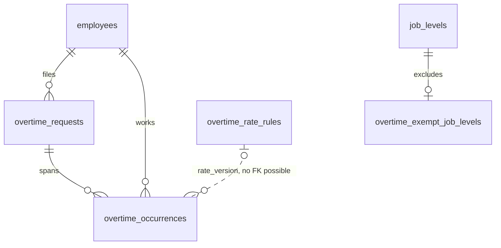
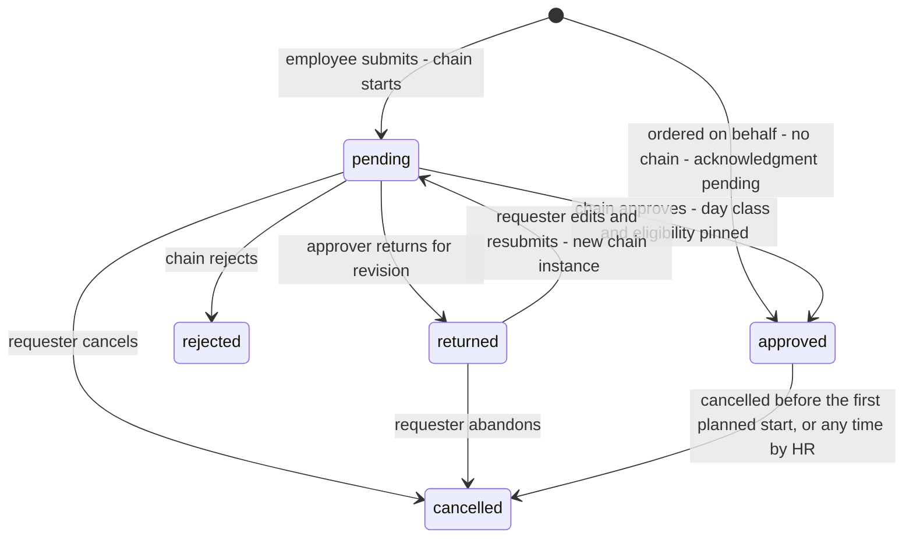
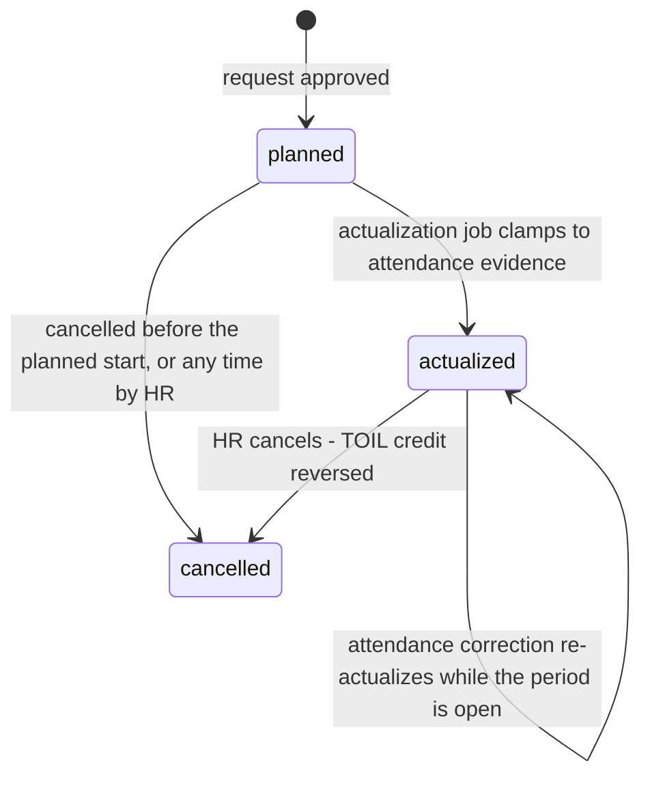
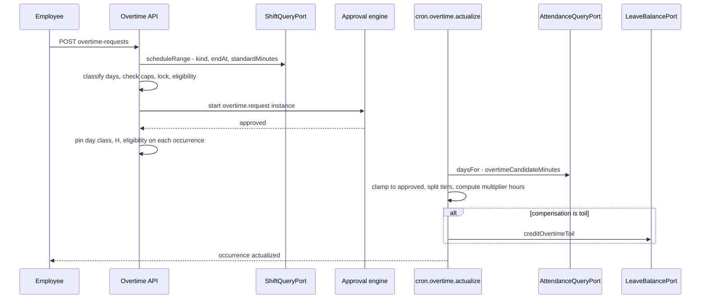
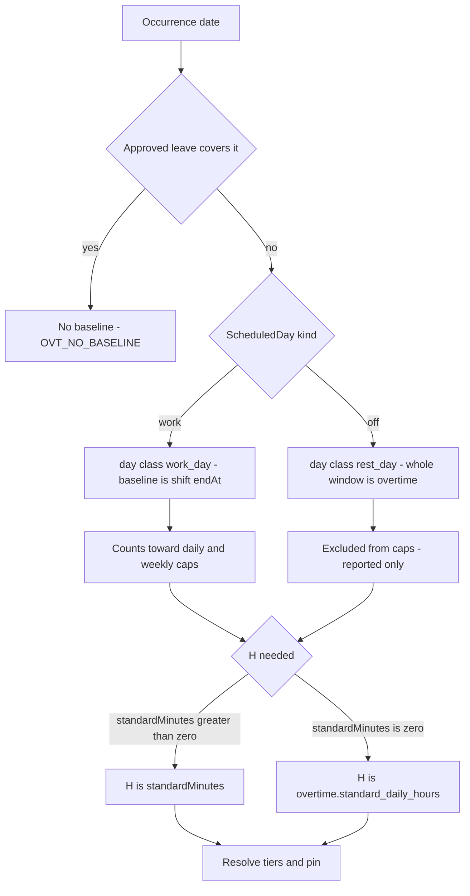

# Module: Overtime

Status: Active (Phase 3) · Related ADRs: `ADR-0001` (port-only cross-module reads), `ADR-0002` (tenant scoping, platform tables), `ADR-0003` (request-aggregate sync class), `ADR-0006` (result pattern), `ADR-0007` (envelope, idempotent submit), `ADR-0008` (`overtime.request` chain), `ADR-0010` (jobs + outbox events), `ADR-0012` (payroll snapshot inputs — **amended this session**), `ADR-0015` (exports) · Depends on: `docs/06-modules/holiday.md` (template, holiday day class), `docs/06-modules/shift.md` (`ShiftQueryPort` — baseline instant, day kind, standard minutes), `docs/06-modules/attendance.md` (`AttendanceQueryPort`, `PeriodLockPort`), `docs/06-modules/leave.md` (`LeaveQueryPort`, `LeaveBalancePort`), `docs/06-modules/organization.md` (placement, job level), `docs/06-modules/employee.md` (status), `docs/05-platform/approval-engine.md`, `docs/05-platform/settings.md`, `docs/05-platform/import-export.md` · Consumers: payroll.md (multiplier-hours + trace), reports.md, dashboard-analytics.md

Namespace `overtime` (naming §4, error prefix `OVT`). Ordered overtime as a request, priced per date against the statutory multiplier tiers, actualized against attendance evidence, and published to payroll as weighted hours. Inherits all global standards; deviations only.

## 1. Purpose & Scope

Three layers, in order of authority. **The order** — an approved `overtime_requests` row, which is simultaneously the employer's instruction and the ceiling on liability. **The occurrence** — one row per date, the unit that carries a day class, a tier split, an actual measurement, and a lock verdict. **The price** — multiplier-hours, the one number payroll multiplies by a wage basis this module never sees.

**Model: request-first, strict (grilled 2026-08-02).** Overtime exists only because someone asked and someone approved. `overtimeCandidateMinutes` arriving from attendance with no matching approved occurrence is **never payable** — it appears in the reconciliation report and nowhere else. The alternative, auto-drafting a claim from measured minutes, generates pay liability from a forgotten clock-out, and attendance.md §1 already drew this line from the other side: *this module measures minutes; overtime.md decides what is payable*. Genuine unplanned overtime is filed the next morning inside `overtime.max_backdate_days`, against the same table and the same chain.

**Boundary: this module owns labor law, payroll owns wage law (grilled 2026-08-02).** Overtime decides what counts as overtime, which day class applies, which tier each hour falls in, and what the statutory caps are. Payroll decides the divisor, what wage the hourly basis is computed from, and the tax treatment of the resulting component. Neither needs a fact the other owns — a tier table needs no salary, a divisor needs no roster. The seam is `OvertimeQueryPort.summaryFor`, and it carries `multiplierHours` plus a per-occurrence trace, never money.

**Evidence: `min(approved, actual)` (grilled 2026-08-02).** The approval is the ceiling, attendance is the meter. Approving three hours and working five pays three; approving three and working twenty minutes pays twenty minutes. Both artifacts stay meaningful, which neither "pay the approval" nor "pay the actual" achieves.

**Consent (grilled 2026-08-02).** A self-submitted request needs no acknowledgment — submitting *is* consenting. A request created **on behalf** by HR or a manager requires the employee to `acknowledge` it before it actualizes, because otherwise the bulk case — forty people ordered onto a Saturday shift — is exactly where the worker's signature would be missing.

**V1 exclusions:** rounding increments and minimum-duration floors (§15 — exact minutes are paid, and rounding down is the legally exposed direction), tenant-editable multiplier tables (§15 — statutory factors are floors; a tenant paying above them uses payroll's component model), per-position or per-employee eligibility overrides below job level (§15), per-entry TOIL expiry (V1 expires at the leave-period boundary), unpaid break deduction inside a long overtime span ⚠️ VERIFY below, a meal *allowance* amount (this module flags the obligation, never prices it), a `paid` status mirrored back from payroll (§15), overtime for daily- and hourly-waged workers as a distinct model (the port publishes multiplier-hours whatever the wage shape — payroll resolves the basis), and standing or recurring overtime schedules.

> ⚠️ VERIFY: confirm against current Indonesian regulation before implementation. — every statutory value and structural rule in §4.2 and §4.5: the 1.5× / 2× first-and-subsequent-hour tiers on a working day; the 2× / 3× / 4× tiers on a weekly rest day or public holiday and the fact that their boundary is the day's normal working hours; the daily and weekly maxima and the rule that they **exclude** rest-day and holiday overtime; the job categories excluded from overtime pay entirely; whether a written employer order and written worker consent are required and in what form; the meal-and-drink obligation threshold, its calorie floor, and the ban on substituting money for it; whether a rest break inside a long overtime span is deducted from payable hours; and whether time-off-in-lieu is lawful at all, at what conversion rate, and with what redemption deadline. The `1/173` divisor and the 75%-of-total-wage basis floor carry the same marker and are owned by `docs/06-modules/payroll.md`.

## 2. Actors & Permissions

| Action | Permission key | Data scope | Employee | Manager | HR Staff | HR Admin | System Administrator |
|---|---|---|---|---|---|---|---|
| View own overtime, acknowledge an ordered request | — (authenticated; mobile + web) | self | ✅ | ✅ | ✅ | ✅ | ✅ |
| Submit / edit returned / cancel own request | — (authenticated) | self | ✅ | ✅ | ✅ | ✅ | ✅ |
| View team overtime + pending acknowledgments | — (authenticated; manager-derived) | team (org port) | — | ✅ | ✅ | ✅ | ✅ |
| Approve / reject / return a request | `overtime.request.approve` **+ chain membership** | instance (two-gate, BR-APRV-012) | — | ✅ | — | ✅ | — |
| Read any employee's requests and occurrences | `overtime.request.read` | company / tenant per assignment | — | — | ✅ | ✅ | ✅ |
| Order overtime on behalf, singly or in bulk | `overtime.request.create` | company / tenant per assignment | — | ✅ | ✅ | ✅ | ✅ |
| Cancel or amend a filed request or occurrence | `overtime.request.update` | company / tenant per assignment | — | — | ✅ | ✅ | ✅ |
| Read the multiplier tiers and the exemption list | `overtime.policy.read` | tenant | — | — | ✅ | ✅ | ✅ |
| Set which job levels are exempt from overtime pay | `overtime.policy.configure` | tenant | — | — | — | ✅ | ✅ |
| Export requests / recap | `overtime.request.export` | company / tenant per assignment | — | — | ✅ | ✅ | ✅ |

Actions come from the reserved set (naming §5) — no new action words. **`overtime.request.approve` is the engine's two-gate module key** (approval-engine §2): holding it is necessary, chain membership is the second gate, and reject/return ride the same key because they are the same seat's decisions. `overtime.request.create` reaches Manager as well as HR because ordering overtime is a line-management act, not an HR one — the bulk order of UC-OVT-003 is its main use. Cancelling someone else's filed request is `overtime.request.update`, following leave.md's rule that an admin correcting a request is an update of it. `overtime.policy.configure` is deliberately **tenant-scoped and HR Admin only**: it decides who is entitled to overtime pay at all. Multiplier tiers have no write key — they are platform data (BR-OVT-009). Out-of-scope employees and requests are 404 (existence hiding).

## 3. Business Rules

| # | Rule |
|---|---|
| BR-OVT-001 | **Overtime is ordered, never inferred.** A payable hour requires an `approved` request and an `overtime_occurrences` row for the date. Candidate minutes measured by attendance with no matching occurrence are unpaid and surface only in the reconciliation report. Unplanned overtime is filed after the fact within `overtime.max_backdate_days`; beyond that window the request is refused (`OVT_BACKDATE_WINDOW_CLOSED`), because a month-old claim has no evidence left that anyone ordered it. |
| BR-OVT-002 | **The occurrence is the unit.** A request is a header spanning one or more dates; every date gets its own occurrence row carrying its own day class, planned window, actual minutes, tier split, multiplier-hours, and compensation mode. Approval is one decision over the whole request; pricing, actualization, cancellation, and locking are all per occurrence. Payroll consumes occurrences, never headers. |
| BR-OVT-003 | **Eligibility is a job-level fact.** A job level listed in `overtime_exempt_job_levels` is excluded from overtime pay; its holders may not submit (`OVT_NOT_ELIGIBLE`). Eligibility is resolved through `OrgQueryPort.placement` as-of each occurrence date and **pinned on the occurrence at approval** — a promotion into an exempt grade does not retroactively unmake work already ordered. The list is empty at provisioning, so a tenant that never configures it pays everyone. |
| BR-OVT-004 | **Day class comes from the schedule.** `rest_day` when `ScheduledDay.kind = 'off'` for any reason — weekly rest, rostered day off, or holiday suppression — otherwise `work_day`. The holiday verdict arrives **through** the scheduled day rather than a second `HolidayQueryPort` call, per attendance.md §4.3's rule. The class is pinned on the occurrence at approval; a roster edit afterwards does not re-price ordered work. |
| BR-OVT-005 | **Baseline.** On a `work_day` the planned window must begin at or after the shift's `endAt` (shift.md §4.3) — overtime is work *beyond* the schedule, and a window starting inside it is a shift change, not overtime. On a `rest_day` there is no schedule, so the entire planned window is overtime. A date covered by approved leave has **no baseline at all** (`LeaveQueryPort.coverageFor`): a person cannot simultaneously be on leave and working ordered overtime, and the request is refused with `OVT_NO_BASELINE`. Same code for an unplaced employee, whose schedule resolves to nothing. |
| BR-OVT-006 | **Statutory caps block.** `overtime.max_hours_per_day` and `overtime.max_hours_per_week` are checked at submit and re-checked at approval against the employee's approved plus pending planned hours. **Rest-day and holiday occurrences are excluded from both counters** — the statutory ceiling governs working-day overtime ⚠️ VERIFY §1 — while still appearing in the report, so HR can see total hours worked where no legal ceiling binds. Exceeding a cap is `OVT_CAP_EXCEEDED` with the counter and the ceiling in `details`. A sector with a ministerial exemption raises the settings value; that change is an audited HR Admin act, which is the paper trail an in-app override flow would have produced anyway. |
| BR-OVT-007 | **No overlapping occurrences.** One employee cannot hold two occurrences whose planned windows intersect, live or pending (gist exclusion, §4.1). This kills double-booking the same evening. The **weekly** cap check is not serialized and can be raced by two concurrent submissions; the residual is one hour over a ceiling rather than double-spent money, and no balance row exists to take `FOR UPDATE` the way leave.md does. |
| BR-OVT-008 | **Actualization is `min(approved, actual)`.** `cron.overtime.actualize` reads `AttendanceQueryPort.daysFor` for the occurrence date and takes the lesser of the approved planned minutes and `overtimeCandidateMinutes`. **Zero actual is a valid outcome**, not an error: the occurrence goes `actualized` with zero minutes, because the evidence says nobody worked and the order was not retroactively wrong. Since actual is clamped to approved, an actualized occurrence can never breach a cap enforced at approval — the check has exactly one home. |
| BR-OVT-009 | **Multiplier tiers are platform data.** `overtime_rate_rules` is a platform table (ADR-0002 — no `tenant_id`, no RLS), effective-dated, seeded by migration, and **not tenant-editable**: statutory factors are floors, and a tenant paying above them does it with a payroll component. The row set effective on the occurrence date is resolved at actualization and its version is **pinned on the occurrence**, so a later regulation change cannot silently re-price work already paid. No effective row set for the date is `OVT_RATE_RULES_MISSING` — a loud failure, never a default factor. |
| BR-OVT-010 | **The rest-day tier boundary is that day's normal hours, `H`.** The statute reads as three separate rest-day tables — 7-hour day, 5-hour short day, 8-hour day — but they are one rule with three values of `H` (§4.5). `H` comes from `ScheduledDay.standardMinutes`, the paid minutes the arrangement schedules for that date with holiday suppression ignored; when it is zero — a genuine weekly rest day that never carries a shift — `H` falls back to `overtime.standard_daily_hours`. Both are pinned on the occurrence. |
| BR-OVT-011 | **Compensation is pay or time off, decided per occurrence.** `overtime.compensation_mode` is `pay`, `toil`, or `employee_choice`; only under the third may a requester pick. A `toil` occurrence is **excluded from `multiplierHours`** on the port — payroll must never pay for time already granted — and instead credits leave through `LeaveBalancePort.creditOvertimeToil` inside the actualization transaction, as an `overtime_toil` ledger entry against the seeded `TOIL` type. **The credit is multiplier-hours, not raw hours** ⚠️ VERIFY §1: crediting raw hours would make conversion a pay cut nobody would choose. Hours convert to leave days at the same `H`. A cancelled or re-actualized occurrence posts a compensating negative entry — the ledger is append-only (leave.md BR-LVE-005). |
| BR-OVT-012 | **Meal obligation is flagged, never priced.** `mealEntitled` is derived from **actual** payable hours against `overtime.meal_threshold_hours` and published on the port, in the report, and in the export. The obligation is food and drink and may not be substituted with money ⚠️ VERIFY §1, so this module records that it was triggered and stays silent on how the tenant discharges it. A tenant that pays cash configures a payroll component keyed off the exported count. |
| BR-OVT-013 | **Consent on ordered overtime.** A request created through `overtime.request.create` carries `orderedBy` and requires `acknowledgedAt` before any of its occurrences actualize. An unacknowledged occurrence **actualizes to zero and reports the reason** — not silently paid, not silently dropped. A self-submitted request needs no acknowledgment; the submission carries the requester's identity and timestamp. |
| BR-OVT-014 | **Period lock.** Every write touching an occurrence date inside a locked attendance period is refused (`OVT_PERIOD_LOCKED`, via `PeriodLockPort`): submission, approval, cancellation, and actualization alike. A period locked between submit and approval fails the approval with nothing written, exactly as leave.md BR-LVE-015 does. Locked occurrences are frozen inputs; correcting one afterwards is payroll's retro path, not a rewrite of data somebody already paid against. |
| BR-OVT-015 | **Re-actualization while open.** `attendance.correction.applied` for a date holding an actualized occurrence re-runs BR-OVT-008 for that occurrence if its period is open, re-pinning tiers and multiplier-hours and posting a compensating TOIL entry where the mode is `toil`. Locked occurrences are untouched (BR-OVT-014). This is the only path by which a settled number changes, and it is audited through the correction, not through the occurrence row. |
| BR-OVT-016 | **Cancellation.** The requester may cancel a whole request while `pending`, or an individual `planned` occurrence before its planned start. From the planned start onwards, only `overtime.request.update` may cancel, with a reason (`OVT_CANCEL_WINDOW_CLOSED` otherwise) — leave.md BR-LVE-016's split, for the same reason: once the window has opened, attendance is already recording what happened and the truth is a record rather than an intention. Cancelling an `actualized` occurrence reverses its TOIL credit. |
| BR-OVT-017 | **Audit and retention.** `overtime_requests` and `overtime_exempt_job_levels` are channel-1 audited with full diffs (audit-log §4.2, registered this session). `overtime_occurrences` is **deliberately excluded**: a daily actualization pass rewrites every open occurrence in the tenant, and auditing that would bury the trail it exists to support — the same argument that excluded `attendance_days` and `leave_balances`, and every input behind an occurrence (the request, the punches, the correction) is audited at its source. Occurrences are retained on the payroll horizon (D4, ⚠️ VERIFY at attendance.md §1). |
| BR-OVT-018 | **Mobile** treats a request as an ADR-0003 request aggregate: single-writer until submitted, immutable on the client afterwards, `op_id`-deduped. Approve, reject, return, and acknowledge are **online-only** (ADR-0003) — they are decisions about other people's time and must not be replayed from a stale queue. The employee's overtime surface is a TTL-cached snapshot read, not a delta-sync mirror (§10). |

## 4. Domain Model

### 4.1 Schema



```ts
// src/database/schema/overtime.ts
export const overtimeRequestStatus = pgEnum('overtime_request_status', [
  'pending', 'approved', 'rejected', 'returned', 'cancelled',
]);
export const overtimeOccurrenceStatus = pgEnum('overtime_occurrence_status', [
  'planned', 'actualized', 'cancelled',
]);
export const overtimeDayClass = pgEnum('overtime_day_class', ['work_day', 'rest_day']);
export const overtimeCompensation = pgEnum('overtime_compensation', ['pay', 'toil']);
export const overtimeBoundsBasis = pgEnum('overtime_bounds_basis', ['absolute', 'standard_day']);

// Platform table — no tenant_id, no RLS (ADR-0002). Seeded by migration, never written at runtime.
export const overtimeRateRules = pgTable('overtime_rate_rules', {
  ...id,
  effectiveFrom: date('effective_from').notNull(),      // the pinned "version" (BR-OVT-009)
  dayClass: overtimeDayClass('day_class').notNull(),
  tierIndex: integer('tier_index').notNull(),           // 0-based, ascending
  boundsBasis: overtimeBoundsBasis('bounds_basis').notNull(),
  fromHour: numeric('from_hour', { precision: 5, scale: 2 }),  // NULL = 0; half-open [from, to)
  toHour: numeric('to_hour', { precision: 5, scale: 2 }),      // NULL = unbounded
  factor: numeric('factor', { precision: 4, scale: 2 }).notNull(),
  note: text('note'),
  createdAt: timestamp('created_at', { withTimezone: true }).notNull().defaultNow(),
}, (t) => [
  uniqueIndex('uq_overtime_rate_rules_effective_class_tier')
    .on(t.effectiveFrom, t.dayClass, t.tierIndex),
  index('idx_overtime_rate_rules_effective_from').on(t.effectiveFrom),
]);

export const overtimeExemptJobLevels = pgTable('overtime_exempt_job_levels', {
  ...id, ...tenantId,
  jobLevelId: uuid('job_level_id').notNull().references(() => jobLevels.id),
  reason: text('reason'),                               // the tenant's own justification
  ...auditColumns,
}, (t) => [
  uniqueIndex('uq_overtime_exempt_job_levels_tenant_id_job_level_id')
    .on(t.tenantId, t.jobLevelId),
]);

export const overtimeRequests = pgTable('overtime_requests', {
  ...id, ...tenantId,
  employeeId: uuid('employee_id').notNull().references(() => employees.id),
  companyId: uuid('company_id').notNull().references(() => companies.id),
  reason: text('reason').notNull(),                     // why the work was ordered
  status: overtimeRequestStatus('status').notNull().default('pending'),
  compensation: overtimeCompensation('compensation').notNull().default('pay'),
  orderedBy: uuid('ordered_by').references(() => users.id),   // NOT NULL = filed on behalf (BR-OVT-013)
  acknowledgedAt: timestamp('acknowledged_at', { withTimezone: true }),
  approvalInstanceId: uuid('approval_instance_id')
    .references(() => approvalInstances.id),            // NULL = no chain
  decidedAt: timestamp('decided_at', { withTimezone: true }),
  cancelledAt: timestamp('cancelled_at', { withTimezone: true }),
  cancelledBy: uuid('cancelled_by').references(() => users.id),
  cancellationReason: text('cancellation_reason'),
  opId: uuid('op_id'),                                  // ADR-0003 durable dedup
  ...auditColumns,
}, (t) => [
  uniqueIndex('uq_overtime_requests_tenant_id_op_id')
    .on(t.tenantId, t.opId).where(sql`op_id IS NOT NULL`),
  index('idx_overtime_requests_tenant_id_company_id_status')
    .on(t.tenantId, t.companyId, t.status),
  index('idx_overtime_requests_tenant_id_employee_id')
    .on(t.tenantId, t.employeeId),
  index('idx_overtime_requests_unacknowledged')
    .on(t.tenantId, t.employeeId)
    .where(sql`ordered_by IS NOT NULL AND acknowledged_at IS NULL AND status = 'approved'`),
]);

export const overtimeOccurrences = pgTable('overtime_occurrences', {
  ...id, ...tenantId,
  overtimeRequestId: uuid('overtime_request_id').notNull().references(() => overtimeRequests.id),
  employeeId: uuid('employee_id').notNull().references(() => employees.id),
  date: date('date').notNull(),                         // branch-local working date
  plannedStartAt: timestamp('planned_start_at', { withTimezone: true }).notNull(),
  plannedEndAt: timestamp('planned_end_at', { withTimezone: true }).notNull(),
  plannedMinutes: integer('planned_minutes').notNull(),
  status: overtimeOccurrenceStatus('status').notNull().default('planned'),
  // pinned at approval (BR-OVT-003, BR-OVT-004, BR-OVT-010)
  dayClass: overtimeDayClass('day_class').notNull(),
  standardDayMinutes: integer('standard_day_minutes').notNull(),   // H, in minutes
  countsTowardCap: boolean('counts_toward_cap').notNull(),         // false on rest_day (BR-OVT-006)
  // pinned at actualization (BR-OVT-008, BR-OVT-009)
  actualMinutes: integer('actual_minutes'),
  payableMinutes: integer('payable_minutes'),
  tiers: jsonb('tiers'),                                // [{ factor, minutes }] — the payslip trace
  multiplierHours: numeric('multiplier_hours', { precision: 8, scale: 4 }),
  rateVersion: date('rate_version'),                    // overtime_rate_rules.effective_from
  compensation: overtimeCompensation('compensation').notNull(),
  mealEntitled: boolean('meal_entitled').notNull().default(false),
  toilLedgerEntryId: uuid('toil_ledger_entry_id'),      // leave.md ledger row, no FK across modules
  actualizedAt: timestamp('actualized_at', { withTimezone: true }),
  cancellationReason: text('cancellation_reason'),
  ...auditColumns,
}, (t) => [
  uniqueIndex('uq_overtime_occurrences_tenant_id_request_id_date')
    .on(t.tenantId, t.overtimeRequestId, t.date),
  index('idx_overtime_occurrences_tenant_id_employee_id_date')
    .on(t.tenantId, t.employeeId, t.date),
  index('idx_overtime_occurrences_pending_actualization')
    .on(t.tenantId, t.date).where(sql`status = 'planned'`),
]);
```

Hand-written in the generating migrations (database-conventions §10):

- `ck_overtime_occurrences_window` — `planned_end_at > planned_start_at`; `ck_overtime_rate_rules_bounds` — `to_hour IS NULL OR from_hour IS NULL OR to_hour > from_hour`; `ck_overtime_occurrences_priced` — `status <> 'actualized' OR multiplier_hours IS NOT NULL`.
- `excl_overtime_occurrences_no_overlap` — gist exclusion on `(tenant_id WITH =, employee_id WITH =, tstzrange(planned_start_at, planned_end_at) WITH &&) WHERE status <> 'cancelled'` (BR-OVT-007). The window is a timestamp range rather than a date range because two occurrences on one date at different hours are legitimate; overlapping ones are not.
- Standard RLS on `overtime_exempt_job_levels`, `overtime_requests`, and `overtime_occurrences`. **`overtime_rate_rules` is a platform table** — no `tenant_id`, no RLS, guarded by having no runtime write path at all (ADR-0002). Tenant tables may FK to it (database-conventions §2), but occurrences pin `rate_version` as a value instead: the pin must survive a row set being superseded.
- `toil_ledger_entry_id` carries **no foreign key** — it points into leave.md's aggregate, and the constraint is declined so that a FK does not become the join the port exists to replace. *(Corrected 2026-08-05, MANIFEST row 70: this previously read "ADR-0001 forbids the constraint". ADR-0001 §5 says the opposite — "Cross-module FKs are **allowed** … but each one is part of the extraction cost inventory" — and an Accepted ADR outranks a module doc. The decision is unchanged and right; only the justification was wrong, so this is a rewrite and not a supersession. `erd-overview.md` §7 records the pointer as the one module-to-module relation left unconstrained on purpose.)*
- No `version` columns: a request is single-writer until submitted and immutable afterwards, and occurrences are written by one job or one admin act (database-conventions §1.10 scope).





Lock is deliberately **not** an occurrence status: it is a property of the date, answered by `PeriodLockPort`, and a status column would be a second copy of the truth that goes stale the moment a period is unlocked. `overtime_rate_rules` and `overtime_exempt_job_levels` have no lifecycle — effective-dated reference data and a membership list respectively (settings §4.1 precedent, template note honored per holiday §4.1).

### 4.2 Seeded multiplier tiers

Seeded by platform migration with the effective date of the governing regulation. Five rows, because the statute's three rest-day tables are one rule with three values of `H` (BR-OVT-010).

| `day_class` | tier | basis | `[from_hour, to_hour)` | factor |
|---|---|---|---|---|
| `work_day` | 0 | `absolute` | `[0, 1)` | 1.50 |
| `work_day` | 1 | `absolute` | `[1, ∞)` | 2.00 |
| `rest_day` | 0 | `standard_day` | `[0, H)` | 2.00 |
| `rest_day` | 1 | `standard_day` | `[H, H+1)` | 3.00 |
| `rest_day` | 2 | `standard_day` | `[H+1, ∞)` | 4.00 |

> ⚠️ VERIFY: confirm against current Indonesian regulation before implementation.

Under `standard_day` basis, `from_hour` and `to_hour` are offsets added to `H` — so tier 0's upper bound of `0` reads as `H`, and tier 2's lower bound of `1` reads as `H+1`. Absolute bounds are literal overtime hours. The three published rest-day variants fall out without a work-week column: a 5-day arrangement gives `H = 8`, a 6-day arrangement `H = 7`, and its shortest working day `H = 5`.

### 4.3 Ports served

```ts
export const OVERTIME_QUERY_PORT = Symbol('OVERTIME_QUERY_PORT');

export type OvertimeTier = { factor: string; minutes: number };

export type OvertimeOccurrenceSnapshot = {
  date: string;
  dayClass: 'work_day' | 'rest_day';
  plannedMinutes: number; actualMinutes: number; payableMinutes: number;
  standardDayMinutes: number;
  tiers: OvertimeTier[];                 // the payslip explain-view, ADR-0012's trace requirement
  multiplierHours: string;               // decimal string, ADR-0007
  compensation: 'pay' | 'toil';
  mealEntitled: boolean;
  rateVersion: string;
};

export type OvertimePeriodSummary = {
  employeeId: string; from: string; to: string;
  /** Payroll's one number: Σ multiplierHours over `pay` occurrences only. */
  multiplierHours: string;
  paidHours: string;                     // unweighted, for reporting and the cap audit
  toilHours: string;                     // converted to time off, never in multiplierHours
  occurrenceCount: number; mealOccurrences: number;
  unactualizedOccurrences: number;       // still `planned` inside the range — payroll warns
  occurrences: OvertimeOccurrenceSnapshot[];
};

export interface OvertimeQueryPort {
  /** Payroll's snapshot input (ADR-0012) — batched, one query. */
  summaryFor(employeeIds: string[], from: string, to: string): Promise<Map<string, OvertimePeriodSummary>>;
  occurrencesFor(employeeId: string, from: string, to: string): Promise<OvertimeOccurrenceSnapshot[]>;
}
```

`unactualizedOccurrences` mirrors attendance's `unresolvedAnomalies`: a payroll run can warn that ordered overtime has not been measured yet rather than discovering it in a payslip. Money never crosses this port — payroll multiplies `multiplierHours` by `wageBasis / 173` ⚠️ VERIFY §1, and `tiers` is what lets the payslip explain the result years later.

### 4.4 Ports consumed

| Port | Use | Status |
|---|---|---|
| `ShiftQueryPort.scheduleRange` | baseline `endAt`, day `kind`, and `standardMinutes` for `H` (shift.md §4.2) | live — **`standardMinutes` added to `ScheduledDay` this session** |
| `AttendanceQueryPort.daysFor` | `overtimeCandidateMinutes` per date, the actualization evidence (attendance.md §4.2) | live — the forward duty attendance recorded is discharged here |
| `PeriodLockPort.isLocked` / `firstLockedDate` | every write and the actualization pass (BR-OVT-014) | live |
| `LeaveQueryPort.coverageFor` | a leave-covered date has no overtime baseline (BR-OVT-005) | live |
| `LeaveBalancePort.creditOvertimeToil` | TOIL credit and its reversal (BR-OVT-011) | live — **added to leave.md §13 this session** |
| `OrgQueryPort.placement` | job level for eligibility, company and branch for scoping | live |
| `SettingsPort.resolve` | the six `overtime.*` keys, branch scope where the key allows it | live |
| `ApprovalEnginePort` | `overtime.request` instances (ADR-0008) | live |
| **`employee_directory`** (read-model view) | `fullName` and `employeeNumber` on the requests grid and `me/team/overtime`, and the `q=` search over them | **live 2026-08-03** — published by employee.md §13 under the ADR-0001 §6 amendment; declared retroactively, the columns were already being returned with no sanctioned channel |

The holiday verdict arrives **through** `ScheduledDay` rather than a second `HolidayQueryPort` call — attendance.md §4.3's rule, and unlike leave.md this module never needs the holiday `kind`, because tier selection turns on `rest_day` versus `work_day` and not on why the day is off.

### 4.5 Pricing arithmetic

| Quantity | Formula |
|---|---|
| `plannedMinutes` | `plannedEndAt − plannedStartAt` in minutes |
| `actualMinutes` | `AttendanceQueryPort.dayFor(date).overtimeCandidateMinutes` — attendance's own arithmetic (attendance.md §4.4) |
| `payableMinutes` | `min(plannedMinutes, actualMinutes)`, and `0` when the request is unacknowledged (BR-OVT-013) |
| `H` | `ScheduledDay.standardMinutes` when non-zero, else `overtime.standard_daily_hours × 60` |
| tier split | walk `overtime_rate_rules` for `(dayClass, rateVersion)` in `tierIndex` order, resolving `standard_day` bounds against `H`; assign `payableMinutes` to each half-open interval in turn |
| `multiplierHours` | `Σ (tierMinutes / 60) × factor`, `numeric(8,4)` |
| `mealEntitled` | `payableMinutes ≥ overtime.meal_threshold_hours × 60` |
| TOIL days credited | `multiplierHours × 60 / H` when `compensation = 'toil'` |

Worked examples. Factors per §4.2 ⚠️ VERIFY.

| # | Situation | Split | `multiplierHours` |
|---|---|---|---|
| 1 | Working day, 3 h approved, employee clocked out 2 h 35 m past `endAt` | `payable = 155 min`; `[0,1) → 60 min × 1.5`; `[1,∞) → 95 min × 2.0` | `1.50 + 3.1667 = 4.6667` |
| 2 | Sunday, 5-day arrangement so `H = 8`, 10 h approved and worked | `[0,H) → 480 × 2.0`; `[H,H+1) → 60 × 3.0`; `[H+1,∞) → 60 × 4.0` | `16.00 + 3.00 + 4.00 = 23.00` |
| 3 | Public holiday landing on the short Friday of a 6-day arrangement, `standardMinutes = 300` so `H = 5`, 8 h worked | `[0,5) → 300 × 2.0`; `[5,6) → 60 × 3.0`; `[6,∞) → 120 × 4.0` | `10.00 + 3.00 + 8.00 = 21.00` |

Example 3 is why `ScheduledDay.standardMinutes` was worth adding to shift.md. Resolving `H` from a flat company constant of 7 would have produced `14.00 + 3.00 = 17.00` — **four multiplier-hours underpaid**, in the direction that matters, on precisely the day the regulation singles out.

## 5. Use Cases

**UC-OVT-001 — Employee requests overtime.** `GET /overtime-requests/preview` resolves the schedule, classifies each date, checks eligibility, caps, baseline, and lock, and returns the priced occurrences with any blockers — so the form never guesses. `POST /overtime-requests` with `Idempotency-Key = opId` writes the header plus one occurrence per date and starts the `overtime.request` chain. Compensation defaults from `overtime.compensation_mode` and is only selectable under `employee_choice`.

**UC-OVT-002 — Approver decides.** `approve` pins day class, `H`, eligibility, and `countsTowardCap` on every occurrence, re-checks the caps and the lock, and flips the request. `reject` and `return` require a comment (`APRV_COMMENT_REQUIRED`); a returned request keeps its occurrences so the requester edits dates rather than retyping them. The chain is the employer's order — approver identity and timestamp are the record that the work was instructed.

**UC-OVT-003 — Manager orders a team onto a Saturday.** `POST /overtime-requests/bulk-assign` with one date range, one reason, and a list of employees → one request per employee, created `approved` with no chain (the ordering manager holds `overtime.request.create`), each carrying `orderedBy` and awaiting acknowledgment. Per-item results per api-standards §10 — a partial batch is the normal outcome, since some employees will be on leave or exempt. The batch is not an entity.

**UC-OVT-004 — Employee acknowledges an order.** The mobile inbox shows the ordered dates and hours; `POST /overtime-requests/{id}/acknowledge` stamps consent. Until then the occurrences actualize to zero (BR-OVT-013), which is visible to the manager in UC-OVT-008's board — the reminder is social, not a blocking notification storm.

**UC-OVT-005 — Actualize.** `cron.overtime.actualize` (daily, `maintenance`, per-tenant fan-out per ADR-0010): find `planned` occurrences whose date is closed for attendance purposes and whose period is open, batch-read `AttendanceQueryPort.daysFor`, clamp per BR-OVT-008, resolve tiers, pin the result, credit TOIL where the mode says so, and stamp `actualizedAt`. Idempotent by `(occurrence)` — a re-run over an already-actualized occurrence recomputes to the same values and writes nothing new. There is no attendance day-close event to subscribe to, so this pulls rather than waits.

**UC-OVT-006 — Attendance correction lands.** `on.attendance.correction.applied` re-actualizes the affected occurrence when its period is open (BR-OVT-015), posting a compensating TOIL entry where relevant. A locked period leaves it alone; payroll's retro path owns the consequence.

**UC-OVT-007 — HR reconciles unordered overtime.** `GET /overtime-occurrences?reconcile=true` over a period joins attendance's candidate minutes against approved occurrences and lists the dates where someone stayed late with no order. Each row resolves by filing a backdated request or by leaving it as evidence of a policy problem. This is the report that makes BR-OVT-001's strictness supportable rather than merely strict.

**UC-OVT-008 — Manager's overtime board.** `GET /me/team/overtime?month=` — direct reports with planned, actualized, and unacknowledged occurrences, plus each person's running weekly hours against the cap so the next order is not the one that breaches it.

**UC-OVT-009 — HR configures exemptions.** `PATCH /overtime-exemptions` replaces the job-level list in one transaction, with the count of currently-placed employees per level stated in the confirm dialog — flipping a grade to exempt changes what those people are entitled to, so it is never a quiet toggle. Audited (BR-OVT-017).

**UC-OVT-010 — Payroll takes its snapshot.** Run creation calls `OvertimeQueryPort.summaryFor` for the roster and period and stores the result — occurrences, tiers, and all — inside the run snapshot (ADR-0012, clarified this session). Overtime is never asked again for that run; a later re-actualization cannot change a computed payslip.

**UC-OVT-011 — Employee exits.** `on.employee.status.changed` with a terminal status cancels `planned` occurrences after the exit date and leaves everything actualized intact, so final settlement still sees the hours. Accrued TOIL is a leave balance and follows leave.md's own exit rules.





## 6. UI Flow

**Mobile — Flutter (ESS + MSS).** *Overtime* tab beside Attendance and Leave. **List** — own requests newest first, each showing dates, planned versus actual hours, status chip, and an unsynced chip where applicable (mobile-flutter §11). **Compose** — pick date or range, start and end time per date, reason, compensation selector shown only under `employee_choice`; a live cost strip renders `preview`'s priced occurrences with the tier breakdown, so the employee sees "2 h 35 m → 4.67 multiplier-hours" before submitting, and blockers appear inline against the offending date rather than as one form-level error. **Detail** — per-occurrence rows with the pinned tier split once actualized, the approval timeline, and the cancel action while the window allows it. **Acknowledge** — an ordered request arrives as an inbox item with the dates and hours and a single primary action; refusing is a conversation with the manager, not a button, since a decline has no lawful workflow here. **Manager** — team board with weekly cap gauges and a bulk-order flow.

**Admin web — Next.js.** *Overtime* section with three surfaces. **Requests grid** — TanStack Table over company, status, employee, branch, department, date range, plus a `reconcile` toggle that switches the grid to UC-OVT-007's unordered-overtime view. Bulk-approve from row selection. **Occurrence detail drawer** — planned versus actual, the tier split as a small stacked bar, `H` and its source, the pinned rate version, meal flag, and the lock state of the date. **Policy page** — read-only multiplier tiers with their effective date and a plain-language rendering of each tier, beside the editable exemption list. The tiers are shown precisely *because* they are not editable: an HR Admin needs to see what the product will pay before they trust it.

Design-system tokens, table density, empty states, and the unsynced/lock chip vocabulary come from `docs/03-standards/design-system.md`; nothing here deviates.

## 7. API

All endpoints follow the canonical spec-block form (api-standards §13). No new pagination-registry rows: admin grids are the seeded transactional-grid family (offset), mobile history the seeded self-service family (cursor). Export endpoints ride import-export §7. Errors beyond the implied set only.

| Endpoint | Permission | Pagination | Queue-reachable | Idempotency |
|---|---|---|---|---|
| `GET /api/v1/overtime-requests` | `overtime.request.read` (`?mine=true` self) | offset | no | — |
| `GET /api/v1/overtime-requests/{id}` | `overtime.request.read` / own | — | no | — |
| `POST /api/v1/overtime-requests` | — (self) / `overtime.request.create` | — | **yes** | **required** |
| `GET /api/v1/overtime-requests/preview` | — (authenticated, self) | — | no | — |
| `PATCH /api/v1/overtime-requests/{id}` | — (own, `returned` only) | — | no | accepted |
| `POST /api/v1/overtime-requests/{id}/submit` | — (own, `returned` only) | — | no | accepted |
| `POST /api/v1/overtime-requests/{id}/cancel` | — (own, per BR-OVT-016) / `overtime.request.update` | — | **yes** | accepted |
| `POST /api/v1/overtime-requests/{id}/acknowledge` | — (own, authenticated) | — | no | accepted |
| `POST /api/v1/overtime-requests/{id}/approve` | `overtime.request.approve` | — | no | accepted |
| `POST /api/v1/overtime-requests/{id}/reject` | `overtime.request.approve` | — | no | accepted |
| `POST /api/v1/overtime-requests/{id}/return` | `overtime.request.approve` | — | no | accepted |
| `POST /api/v1/overtime-requests/bulk-assign` | `overtime.request.create` | — | no | accepted |
| `POST /api/v1/overtime-requests/bulk-approve` | `overtime.request.approve` | — | no | accepted |
| `GET /api/v1/overtime-occurrences` | `overtime.request.read` | offset | no | — |
| `POST /api/v1/overtime-occurrences/{id}/cancel` | — (own, per BR-OVT-016) / `overtime.request.update` | — | no | accepted |
| `GET /api/v1/overtime-rate-rules` | `overtime.policy.read` | — (bounded) | no | — |
| `GET /api/v1/overtime-exemptions` | `overtime.policy.read` | — (bounded) | no | — |
| `PATCH /api/v1/overtime-exemptions` | `overtime.policy.configure` | — | no | accepted |
| `GET /api/v1/me/overtime/snapshot` | — (authenticated, self) | — | no | — |
| `GET /api/v1/me/overtime/requests` | — (authenticated, self) | cursor | no | — |
| `GET /api/v1/me/team/overtime` | — (authenticated; manager-derived) | — (one month) | no | — |

No new URL verbs: `submit`, `cancel`, `acknowledge`, `approve`, `reject`, `return`, and `assign` are all in naming §3's reserved set — `return` registered by leave.md, `assign` by shift.md. Ordering overtime for a team is `bulk-assign` rather than a bulk create precisely because `create` is **not** a reserved verb and `assign` is the accurate one: a manager assigns work to people, which is the same act shift.md's `bulk-assign` performs against a roster. Both bulk routes use api-standards §10's per-item-results shape. Exemptions are `PATCH` with a replace-all array, not `PUT` — api-standards §2 leaves `PUT` unused in V1, and shift.md UC-SHF-003 set the precedent for replacing a child collection through the parent's `PATCH`.

#### POST /api/v1/overtime-requests · GET /overtime-requests/preview

| Field | Type | Required | Rule |
|---|---|---|---|
| `employeeId` | uuid | conditional | omit for self; required with `overtime.request.create` |
| `dates` | array | ✅ | 1–31 entries of `{ date, startTime, endTime }`, branch-local times; `endTime` may cross midnight |
| `reason` | string | ✅ | 5–500 — why the work is needed |
| `compensation` | enum | conditional | `pay \| toil`; rejected unless `overtime.compensation_mode = employee_choice` |

Response 201: `{ request: { …row }, occurrences: [{ date, plannedMinutes, dayClass, standardDayMinutes, countsTowardCap, estimatedMultiplierHours, estimatedTiers }], approvalInstanceId: string | null }`. **`preview` is a `GET`** taking the same fields as query params and performing **zero writes**, returning the same occurrence array plus `blockers: [{ date, code, details }]` and `weeklyHoursAfter` — the cost strip of §6, and the reason the form never guesses. A pure read gets a pure method (api-standards §2) and needs no verb from naming §3; leave.md's `GET /leave-requests/preview` is the precedent. Estimated figures are exactly that: tiers are re-resolved and pinned at approval and again at actualization. Errors on the POST path: `OVT_NOT_ELIGIBLE` (`details: { jobLevelId }`) · `OVT_CAP_EXCEEDED` (`details: { scope: 'day' | 'week', limitHours, requestedHours, existingHours }`) · `OVT_OVERLAPPING_OCCURRENCE` (`details: { date, conflictingOccurrenceId }`) · `OVT_NO_BASELINE` (`details: { date, reason: 'leave' | 'unscheduled' | 'unplaced' | 'inside_shift' }`) · `OVT_BACKDATE_WINDOW_CLOSED` (`details: { date, maxBackdateDays }`) · `OVT_PERIOD_LOCKED` (`details: { periodId, date }`) · `OVT_TOIL_NOT_ENABLED` · unknown or out-of-scope employee → `SYS_NOT_FOUND`.

#### PATCH /api/v1/overtime-requests/{id} · POST /{id}/submit
Editing is allowed on an own `returned` request only — `dates`, `reason`, `compensation`. Occurrences are replaced wholesale on save and every §8 rule re-runs. `submit` starts a **new** chain instance on the same request (ADR-0008 restart-on-resubmit) and flips the status back to `pending`. Any other status → `OVT_REQUEST_ALREADY_DECIDED`.

#### POST /api/v1/overtime-requests/{id}/approve · reject · return
Request: `{ comment? }` — mandatory for `reject` and `return` (`APRV_COMMENT_REQUIRED`). Approval pins day class, `H`, eligibility, and `countsTowardCap` per occurrence and re-runs the cap and lock checks against current state. Response 200: the request with its refreshed status, the pinned occurrences, and `{ instance: { status, currentStepIndex } }`. Errors: `OVT_REQUEST_ALREADY_DECIDED` (module-level guard, raised before the engine when the row is no longer `pending`) · `OVT_CAP_EXCEEDED` · `OVT_NOT_ELIGIBLE` (a grade change between submit and approval) · `OVT_PERIOD_LOCKED` · `APRV_NOT_AN_APPROVER` · `APRV_STEP_ALREADY_DECIDED` · `APRV_INSTANCE_NOT_ACTIONABLE`.

#### POST /api/v1/overtime-requests/{id}/acknowledge
No body. Stamps `acknowledged_at` for the employee named on the request; anyone else → `SYS_NOT_FOUND`. Idempotent — a second call returns the same 200 with the original timestamp, because a consent recorded twice is still one consent. Errors: `OVT_REQUEST_ALREADY_DECIDED` when the request is not `approved`.

#### POST /api/v1/overtime-requests/bulk-assign · bulk-approve
`bulk-assign`: `{ employeeIds: [...], dates: [...], reason, compensation? }`, ≤ 100 employees (api-standards §10). One request per employee, each `approved` with `orderedBy` set and no chain instance. Response 200: per-item results — `{ employeeId, requestId }` or `{ employeeId, error: { code, details } }`. A partial batch is the normal outcome: exempt grades, employees on leave, and locked dates each fail their own row without touching the rest.
`bulk-approve`: `{ ids: [...] }`, ≤ 100. Each item runs the full single-approve path.

#### POST /api/v1/overtime-requests/{id}/cancel · POST /overtime-occurrences/{id}/cancel
Request: `{ reason? }` — mandatory for the `overtime.request.update` path, optional for the requester's own. The request-level call cancels every non-`cancelled` occurrence; the occurrence-level call cancels one date and leaves the rest of the order standing. Both reverse any TOIL credit through `LeaveBalancePort` (BR-OVT-011). Errors: `OVT_CANCEL_WINDOW_CLOSED` (requester, at or after the planned start) · `OVT_PERIOD_LOCKED` · `OVT_REQUEST_ALREADY_DECIDED`.

#### GET /api/v1/overtime-requests · GET /{id} · GET /overtime-occurrences
Requests grid: `?companyId=` (required unless `?mine=true`) `?status=&employeeId=&branchId=&departmentId=&from=&to=&unacknowledged=true&q=` + offset. Response 200: `data: [{ id, employee: { id, employeeNumber, fullName }, dateRange, occurrenceCount, plannedHours, actualHours, multiplierHours, status, compensation, orderedBy, acknowledgedAt, approvalInstanceId }]` + `meta` with offset totals and `lockedRanges`. Detail adds every occurrence with its pinned fields, the tier split, and the approval timeline.
Occurrences grid: `?companyId=` (required) `?employeeId=&from=&to=&status=&dayClass=&reconcile=true` + offset. Under `reconcile=true` the response is the **unordered-overtime** view of UC-OVT-007: one row per `(employee, date)` where attendance reported candidate minutes and no approved occurrence exists, carrying `candidateMinutes` and the day's status, and it is read from `AttendanceQueryPort` rather than from this module's tables.

#### GET /api/v1/overtime-rate-rules · GET /overtime-exemptions · PATCH /overtime-exemptions
`GET /overtime-rate-rules`: `?asOf=` (defaults today). Response 200: `{ effectiveFrom, tiers: [{ dayClass, tierIndex, boundsBasis, fromHour, toHour, factor, note }] }` — the platform table, read-only, unpaginated because it is five rows. There is no write endpoint at any permission level (BR-OVT-009).
`GET /overtime-exemptions`: response 200: `data: [{ jobLevelId, jobLevelCode, jobLevelName, reason, placedEmployeeCount }]`, unpaginated — job levels are tenant-wide grade bands, counted in dozens.
`PATCH /overtime-exemptions`: `{ entries: [{ jobLevelId, reason? }] }` — replace-all in one transaction (shift.md UC-SHF-003's pattern-day precedent). Response 200: the new list. Errors: unknown job level → `SYS_NOT_FOUND`.

#### GET /api/v1/me/overtime/snapshot · GET /me/overtime/requests · GET /me/team/overtime
`snapshot`: the mobile bootstrap read — `{ compensationMode, canChooseCompensation, maxBackdateDays, capHoursPerDay, capHoursPerWeek, hoursThisWeek, pendingAcknowledgments: [{ requestId, dates, plannedHours }], toilBalanceDays }`. `toilBalanceDays` comes from `LeaveQueryPort.balanceFor` for the `TOIL` type — the employee should not have to visit the leave tab to see what their overtime bought.
`me/overtime/requests`: `?status=&from=&to=` + cursor, newest first, each entry with its occurrences.
`me/team/overtime`: `?month=` (required, `YYYY-MM`). Response 200: `data: [{ employeeId, fullName, plannedHours, actualHours, multiplierHours, unacknowledgedCount, weeklyHours: [{ weekStart, cappedHours, limitHours }] }]`. Direct reports only (org port inverse); empty for non-managers. Unpaginated — team sizes are dozens (shift.md UC-SHF-008 precedent).

## 8. Validation Rules

| Field | Rule | Error code |
|---|---|---|
| `dates` | 1–31 entries, no duplicate dates within one request | `VAL_VALIDATION_FAILED` / `VAL_DUPLICATE` |
| `dates[].startTime` / `endTime` | `HH:mm`, span > 0 and ≤ 24 h after cross-midnight normalization | `VAL_DATE_RANGE_INVALID` / `VAL_OUT_OF_RANGE` |
| filing window | `date ≥ today − overtime.max_backdate_days` | `OVT_BACKDATE_WINDOW_CLOSED` (business, post-DTO) |
| baseline | on `work_day`, `plannedStartAt ≥ ScheduledDay.shift.endAt` | `OVT_NO_BASELINE` (`reason: 'inside_shift'`) |
| baseline | date not covered by approved leave, employee scheduled and placed | `OVT_NO_BASELINE` |
| eligibility | employee's job level as-of the date not in `overtime_exempt_job_levels` | `OVT_NOT_ELIGIBLE` |
| daily cap | Σ planned hours on the date over `counts_toward_cap` occurrences ≤ `overtime.max_hours_per_day` | `OVT_CAP_EXCEEDED` |
| weekly cap | same over the containing week | `OVT_CAP_EXCEEDED` |
| overlap | no intersecting live occurrence for the employee | `OVT_OVERLAPPING_OCCURRENCE` |
| period | no occurrence date inside a locked attendance period | `OVT_PERIOD_LOCKED` |
| `compensation` | `toil` only when `overtime.compensation_mode` allows it and the `TOIL` leave type exists | `OVT_TOIL_NOT_ENABLED` |
| `reason` | 5–500 characters | `VAL_VALIDATION_FAILED` |
| rate rules | an effective row set exists for the occurrence date | `OVT_RATE_RULES_MISSING` |

DTO-shape failures return `VAL_VALIDATION_FAILED` with field details (api-standards §9); business-rule failures return their own code, per error-catalog §1 rule 3.

## 9. Edge Cases & Failure Modes

- **Cross-midnight overtime.** A window starting 22:00 and ending 02:00 belongs to the **start** date's occurrence — shift.md BR-SHF-005's rule applied to a different span, so an overnight overtime does not straddle two occurrences or two day classes. The day class comes from the start date: overtime that begins on a working Saturday evening and runs into a Sunday morning is priced as `work_day` throughout.
- **Holiday announced after approval.** The occurrence keeps its pinned `work_day` class and its pinned `H`. This is deliberate and it is the same choice leave.md made for approved requests: re-pricing settled work because a calendar changed would move numbers under a payroll run. The reconciliation report surfaces the affected occurrences so HR can cancel and re-order at the better rate if the tenant wants to.
- **Employee never worked the ordered overtime.** `actualMinutes = 0` → `payableMinutes = 0` → `multiplierHours = 0`, status `actualized`. Nothing is owed, nothing is an exception, and the manager sees it on the board.
- **Employee worked more than ordered.** Paid to the approval. The excess appears in UC-OVT-007's reconcile view as unordered overtime; HR can file it backdated within the window.
- **Unacknowledged order.** Actualizes to zero with the reason recorded. If the employee acknowledges later while the period is open, the next actualization pass prices it properly — the job is idempotent and re-reads state, so no manual re-trigger is needed.
- **Late-arriving punch after actualization.** The punch reopens attendance's day if the period is open, which raises `attendance.correction.applied` or a recompute; BR-OVT-015 re-actualizes. If the period is locked, attendance quarantines it (BR-ATT-015) and payroll's retro path owns the money — this module writes nothing into frozen data.
- **Regulation changes mid-period.** A new `overtime_rate_rules` row set with a later `effective_from` prices occurrences from that date forward; earlier occurrences keep their pinned `rate_version`. A payroll run over a period spanning the change sees both, correctly, because the version is per occurrence and not per run.
- **Exemption flipped mid-month.** Occurrences already approved keep their pinned eligibility and pay out; new requests from that grade are refused. The confirm dialog of UC-OVT-009 states the placed-employee count precisely so this is a considered act.
- **TOIL credited, then the occurrence cancelled.** A compensating negative `overtime_toil` entry is posted. If the employee has already *spent* the TOIL, the leave balance goes negative — leave.md forbids negative-balance borrowing at request time but the ledger arithmetic tolerates the state, and it surfaces on the balance report for HR to settle. Documented rather than prevented: blocking the cancellation would be worse, and silently keeping the credit would be a gift.
- **`standardMinutes` missing because the employee is unplaced.** Schedule resolution already fails, so the request never reaches pricing — `OVT_NO_BASELINE` with `reason: 'unplaced'`.
- **Two managers order the same employee for the same evening.** The gist exclusion rejects the second (`OVT_OVERLAPPING_OCCURRENCE`) with the conflicting occurrence id, so the second manager sees who booked it.

## 10. Offline Behavior

Overtime is an **ADR-0003 request aggregate**: single-writer by the owner until submitted, immutable on the client afterwards, later state arriving from the server. Deviations from `docs/02-architecture/offline-sync.md` — none in the queue mechanics; the notes below are scope statements.

- **Queued offline:** `POST /overtime-requests` and `POST /{id}/cancel`, both `op_id`-deduped (ADR-0007). The optimistic row shows an unsynced chip and its **estimated** multiplier-hours, computed locally from the mirrored `ScheduledDay` and the snapshot's cap values, clearly labelled as an estimate — the device never pins a price for the record.
- **Online-only:** `approve`, `reject`, `return`, `acknowledge`, and `bulk-assign`. Approvals are online-only by ADR-0003; `acknowledge` joins them because a consent replayed from a stale queue days after the fact is not evidence of consent, and `bulk-assign` because it writes on other people's behalf.
- **Reads:** `/me/overtime/snapshot` is a TTL-cached read refreshed on foreground, not a delta-sync mirror. An employee's overtime surface is a handful of rows and the cap counters must be current to be useful; leave.md §10 made the same call, and offline-sync §10's checklist already contemplates TTL-class reads.
- **Rejection on drain** surfaces the server code against the offending date and rolls the optimistic row back — `OVT_CAP_EXCEEDED` and `OVT_PERIOD_LOCKED` are the common ones after a phone has been dark, and both are honest outcomes rather than sync failures.

## 11. Module Error Codes

Registered in `docs/03-standards/error-catalog.md` §20 this session. Listed here for module reference; the catalog is authoritative.

| Code | HTTP | Raised by |
|---|---|---|
| `OVT_NOT_ELIGIBLE` | 422 | BR-OVT-003 — job level is exempt from overtime pay |
| `OVT_NO_BASELINE` | 422 | BR-OVT-005 — leave-covered, unscheduled, unplaced, or inside the shift |
| `OVT_CAP_EXCEEDED` | 422 | BR-OVT-006 — daily or weekly statutory maximum |
| `OVT_OVERLAPPING_OCCURRENCE` | 409 | BR-OVT-007 — intersecting live occurrence for the employee |
| `OVT_BACKDATE_WINDOW_CLOSED` | 422 | BR-OVT-001 — filed beyond `overtime.max_backdate_days` |
| `OVT_PERIOD_LOCKED` | 409 | BR-OVT-014 — occurrence date inside a locked attendance period |
| `OVT_REQUEST_ALREADY_DECIDED` | 409 | BR-OVT-016 — action against a request that is no longer actionable |
| `OVT_CANCEL_WINDOW_CLOSED` | 409 | BR-OVT-016 — requester cancelling at or after the planned start |
| `OVT_TOIL_NOT_ENABLED` | 422 | BR-OVT-011 — `toil` requested where policy or the `TOIL` type does not allow it |
| `OVT_RATE_RULES_MISSING` | 422 | BR-OVT-009 — no effective multiplier row set for the occurrence date |

## 12. Background Jobs & Events

Jobs owned:

| Job | Queue / schedule | Behavior |
|---|---|---|
| `cron.overtime.actualize` | `maintenance`, daily, per-tenant fan-out (ADR-0010) | UC-OVT-005: clamp, split tiers, pin, credit TOIL, stamp. Idempotent per occurrence — a re-run recomputes to identical values |

One job, not three, because seeding is not needed (occurrences are created by the request), reminders belong to the engine's SLA machinery, and there is nothing to expire in this module — TOIL expiry is leave's cron against the `TOIL` type. There is no `close-days` equivalent to subscribe to: attendance emits no day-close event (§4.4), so this pulls.

Event-handler jobs (`events` queue, all idempotent):

| Handler | Trigger | Behavior |
|---|---|---|
| `on.attendance.correction.applied` | attendance.md | Re-actualize the occurrence on that date while its period is open (BR-OVT-015) |
| `on.attendance.period.unlocked` | attendance.md | Re-actualize occurrences in the range that were frozen mid-flight, so an unlock does not leave stale prices behind |
| `on.employee.status.changed` | employee.md | Terminal status → cancel `planned` occurrences after the exit date, leave actualized ones intact (UC-OVT-011) |
| `on.leave.request.decided` | leave.md | Approved leave landing over a `planned` occurrence cancels it with a recorded reason — the baseline disappeared (BR-OVT-005) |

Events emitted (outbox):

- `overtime.request.decided` `{ employeeId, companyId, overtimeRequestId, status, dates, plannedHours, compensation, orderedBy }` — fired on every terminal outcome (`approved`, `rejected`, `cancelled`). Consumers: notification, reports. (**dashboard-analytics declined 2026-08-04** — TTL-only invalidation, that doc §12 and A-090.)
- `overtime.occurrence.actualized` `{ employeeId, companyId, occurrenceId, date, payableMinutes, multiplierHours, compensation, mealEntitled }` — one per priced occurrence. Consumers: reports. (**dashboard-analytics declined 2026-08-04**, same reason.) Payroll does **not** subscribe: it pulls at snapshot time (ADR-0012, §13).

Events consumed: `attendance.correction.applied`, `attendance.period.unlocked`, `employee.status.changed`, `leave.request.decided`.

## 13. Approval, Notification & Report Touchpoints

- **Approval:** request type `overtime.request` (already in approval-engine §13's V1 registry). Declared here as that registry requires — **context fields:** `employeeId` (uuid), `companyId` (uuid), `branchId` (uuid), `departmentId` (uuid), `jobLevelId` (uuid), `dates` (array of date), `plannedHours` (numeric), `restDayHours` (numeric — the field a chain condition actually routes on: a Sunday order at 2×–4× deserves a second approver that a Tuesday hour does not), `compensation` (string), `estimatedMultiplierHours` (numeric). **Chain-selection dimensions:** company, department, `plannedHours`, `restDayHours`. **Recommended tenant config:** single-step `direct_manager(1)` for working-day overtime, a second HR Admin step above an hours threshold and for any occurrence on a rest day or holiday. **Terminal effects:** approved → pin day class, `H`, eligibility and cap flags on every occurrence, emit `overtime.request.decided`; rejected/cancelled → cancel the occurrences and emit; returned → occurrences kept so the requester edits dates rather than retyping them. **Cancel window:** requester while `pending`, or per occurrence before its planned start; `overtime.request.update` at any time (BR-OVT-016). **Note for tenant chain design:** where a manager both orders overtime and sits in the chain, the order is created `approved` with no instance and the control is the employee's `acknowledge`, not a second approval — see BR-OVT-013.
- **Notification — 2 templates registered in notification §4.2 this session:** `overtime.acknowledgment_required` (in_app + push, **mandatory**, audience = the employee whose overtime was ordered on their behalf — being told you are working Saturday is not a preference) and `overtime.occurrence_actualized` (in_app, **opt-out**, audience = the employee, fired when a priced occurrence differs from what was ordered, so a clamp is never a payslip surprise). Decision outcomes ride the engine's generic `approval.instance_decided`; no bespoke template, per leave.md's precedent.
- **Import/Export — 2 ExportDefinitions and no import registered in import-export §4.3 this session:** `overtime.request` (export: employee, dates, reason, status, ordered by, acknowledged at, approver, planned hours; params `companyId`, `from`, `to`, optional branch/department/status; permission `overtime.request.export`) and `overtime.recap` (export: per employee per period — planned, actual, and payable hours, multiplier-hours split by day class, TOIL hours, meal-entitled occurrence count, unactualized count; same params and permission). No import: an overtime record is an order that must pass eligibility, caps, baseline, and lock, and a spreadsheet path around those checks would be a way to manufacture pay.
- **Settings — 6 keys registered in settings §4.2 this session:** `overtime.standard_daily_hours` (integer, company + branch, default 7, ⚠️ VERIFY per §1 — the fallback `H` for a genuine rest day, BR-OVT-010), `overtime.max_hours_per_day` (integer, company + branch, default 4, ⚠️ VERIFY), `overtime.max_hours_per_week` (integer, company + branch, default 18, ⚠️ VERIFY), `overtime.compensation_mode` (enum `pay \| toil \| employee_choice`, company, default `pay`), `overtime.meal_threshold_hours` (integer, company + branch, default 4, ⚠️ VERIFY), `overtime.max_backdate_days` (integer, company, default 7 — A-027).
- **Audit:** `overtime_requests` and `overtime_exempt_job_levels` → audit-log §4.2 (BR-OVT-017). `overtime_occurrences` is **deliberately excluded**, with the reason recorded in the registry alongside `attendance_days` and `leave_balances`: the daily actualization pass rewrites every open occurrence, and every input behind one is audited at its source. No sensitive reads — this module holds no personal data beyond the identity of who worked when, which the requests grid already gates on `overtime.request.read`.
- **Reports:** overtime cost driver by department and month (hours only — payroll owns the rate), unordered-overtime reconciliation (UC-OVT-007), cap-breach and near-cap watchlist, rest-day and holiday working analysis, meal-obligation count, TOIL earned versus redeemed, and per-approver ordering volume — via the reports.md registry.
- **Ports served:** `OvertimeQueryPort` (payroll, reports). **`dashboard` removed 2026-08-04:** dashboard-analytics reaches overtime only through `ReportQueryPort`. **Ports consumed:** §4.4.
- **2026-08-02 (payroll.md arrival):** every money-shaped forward duty this module handed off is discharged. `payroll.overtime_divisor` (173) and `payroll.overtime_basis_floor_pct` (75) are effective-dated settings owned there; the hourly basis is `max(upah sebulan, floor × total wage) / divisor` (payroll.md BR-PAY-004), and `multiplierHours × hourly basis` is the line amount, with the tier trace carried into the payslip explain-view. `toil` occurrences are excluded from `multiplierHours` at this end, so payroll never has to know they exist. `unactualizedOccurrences` surfaces as a pre-calculation warning on run creation (payroll.md UC-PAY-003). A locked-period correction to an occurrence raises a payroll retro flag rather than a recompute (payroll.md BR-PAY-019). The cash-meal component remains unbuilt on both sides pending the substitution question in §15.
- **Anchor amendments made this session:** `docs/06-modules/shift.md` §4.2 — `ScheduledDay.standardMinutes` added; `docs/06-modules/leave.md` — `overtime_toil` ledger kind, the `TOIL` seeded type, and `LeaveBalancePort` served; `docs/adr/ADR-0012-payroll-calculation-engine.md` — one-line clarification that overtime and leave effects are **pulled** from their ports at snapshot time rather than pushed as `run_input` rows; `docs/06-modules/attendance.md` §13 — the `overtimeCandidateMinutes` consumer flipped forward → live.

## 14. Test Scenarios

| Scenario | Covers |
|---|---|
| Tier golden vectors: the three §4.5 worked examples plus a rest-day span shorter than `H`, a working-day span under one hour, and a span crossing midnight | BR-OVT-009, BR-OVT-010, §4.5 |
| `H` resolution: `standardMinutes = 420` → 7; `= 300` → 5 and the short-Friday example prices at 21.00 not 17.00; `= 0` → the settings fallback | BR-OVT-010, §4.5 |
| Clamp: approved 3 h / actual 5 h → 3 h; approved 3 h / actual 20 min → 20 min; actual 0 → `actualized` at zero with no ledger write | BR-OVT-008, §9 |
| Strictness: candidate minutes with no approved occurrence are never priced and appear exactly once in the reconcile view | BR-OVT-001, UC-OVT-007 |
| Caps: daily and weekly breaches refused with counters in `details`; a rest-day occurrence does not move either counter but does appear in the report; raising the settings value admits the previously-refused request | BR-OVT-006 |
| Overlap: two orders for one employee on intersecting windows → the second rejected with the conflicting id; adjacent non-intersecting windows on one date both accepted | BR-OVT-007, §9 |
| Eligibility: exempt grade cannot submit; a grade flipped exempt after approval still pays the pinned occurrence; a promotion into an exempt grade blocks new requests only | BR-OVT-003, §9 |
| Baseline: leave-covered date, unscheduled employee, unplaced employee, and a window starting inside the shift each return `OVT_NO_BASELINE` with their own `reason` | BR-OVT-005 |
| Consent: on-behalf request unacknowledged → actualizes to zero; acknowledged later while open → next pass prices it; self-submitted request needs no acknowledgment; double acknowledge is idempotent | BR-OVT-013, §9 |
| TOIL: `toil` occurrence excluded from `multiplierHours`, credited to leave at multiplier-hours ÷ `H`; cancellation posts the compensating negative entry; spent-then-cancelled leaves a negative balance that surfaces on the report | BR-OVT-011, §9 |
| Rate versioning: a new effective row set prices later occurrences only; a period spanning the change yields two `rateVersion` values in one summary; no effective set → `OVT_RATE_RULES_MISSING` | BR-OVT-009, §9 |
| Period lock: submit, approve, cancel, and the actualization pass all refuse inside a locked range; a lock landing between submit and approval fails the approval with nothing written; unlock re-actualizes the frozen occurrences | BR-OVT-014, §12 |
| Re-actualization: correction applied over an actualized occurrence recomputes and reverses/reposts TOIL while open; the same correction against a locked period changes nothing | BR-OVT-015 |
| Cancellation windows: requester before the planned start → cancelled; requester at or after it → `OVT_CANCEL_WINDOW_CLOSED`; HR at any time with a reason; occurrence-level cancel leaves siblings standing | BR-OVT-016 |
| Bulk order: 100 employees with a mix of exempt grades, leave-covered dates, and locked dates → per-item results, valid rows created `approved` and awaiting acknowledgment, HTTP 200 for the batch | UC-OVT-003, api-standards §10 |
| Payroll seam contract tests run from **payroll's** suite: `summaryFor` excludes `toil` occurrences from `multiplierHours`, carries `unactualizedOccurrences`, and returns a tier trace whose factors reproduce the total exactly | §4.3, ADR-0012 |
| Cross-midnight: an order 22:00–02:00 lands on the start date's occurrence with one day class; a Saturday-evening-into-Sunday span prices as `work_day` throughout | §9, shift.md BR-SHF-005 |
| Audit: request lifecycle and exemption edits → channel-1 diffs; a full actualization pass over a 500-employee tenant writes **zero** audit rows | BR-OVT-017 |
| Offline: submit queued → drains with the server's pinned estimate replacing the local one; approve/acknowledge attempted offline → `SYNC_OFFLINE`; cap rejection on drain rolls the optimistic row back | §10, BR-OVT-018 |
| Leak-test matrix L1–L7 on the three tenant tables plus the grids, reconcile view, and `/me/*` reads; `overtime_rate_rules` asserted readable from every tenant context and writable from none (multi-tenancy §5) | security duty |

## 15. Future Improvements

Rounding increments and a minimum-duration floor per tenant policy, once a real PKB specifies one — the arithmetic already carries exact minutes, so this is a configuration layer rather than a migration. Tenant multiplier overrides above the statutory floor, with a never-below-floor validator and its own configure permission, for tenants whose collective agreement grants richer tiers than the regulation. Per-position and per-employee eligibility exceptions below job level, for the senior specialist at a managerial grade who is genuinely entitled. Per-entry TOIL expiry — "take within three months of earning" — which needs an `expires_on` column on leave's ledger entry and turns the V1 period-boundary rule into a policy choice. A `paid` marker written back from payroll so the grid can show settlement state without opening a payslip, which requires a payroll → overtime write port that does not exist yet. Standing overtime schedules for tenants who run a permanent extra shift, so a recurring Saturday does not need a new order every week. Unpaid break deduction inside long overtime spans ⚠️ VERIFY its statutory basis. A meal-allowance component generated from `mealEntitled` for tenants who pay cash, once the legal question of substitution is settled. An overtime budget per department with soft warnings as the month's approved cost approaches it — the numbers exist here, the money does not, so this needs payroll's daily-rate port. Pre-approval interlock at attendance close time, the pairing item with attendance.md §15, so candidate minutes are reconciled against orders the moment a day closes rather than on the next actualization pass.
