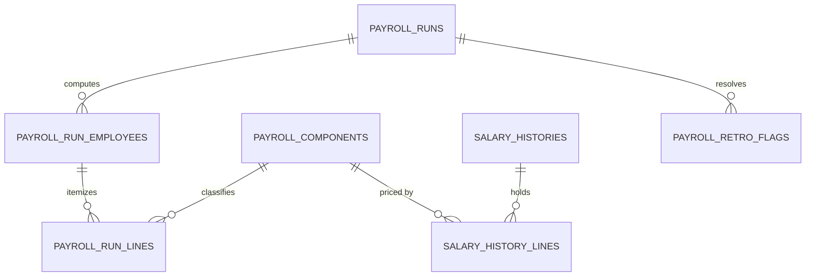
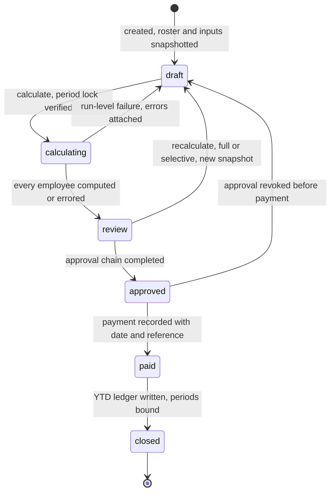
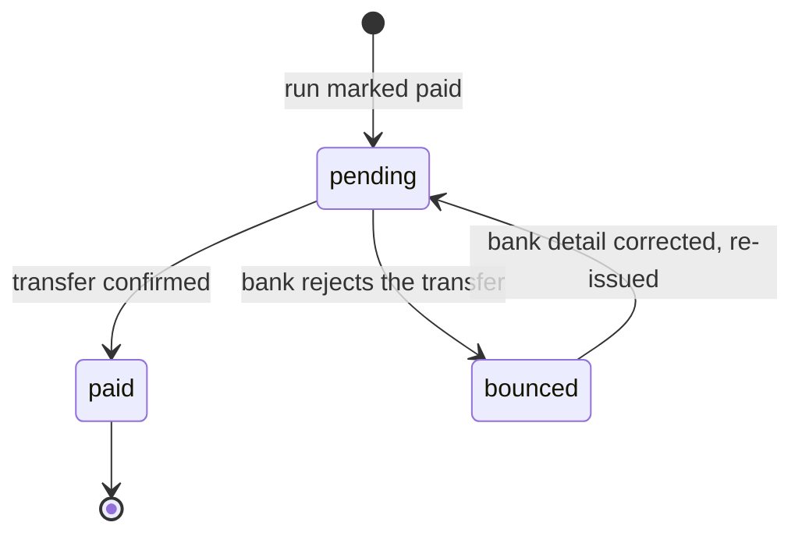
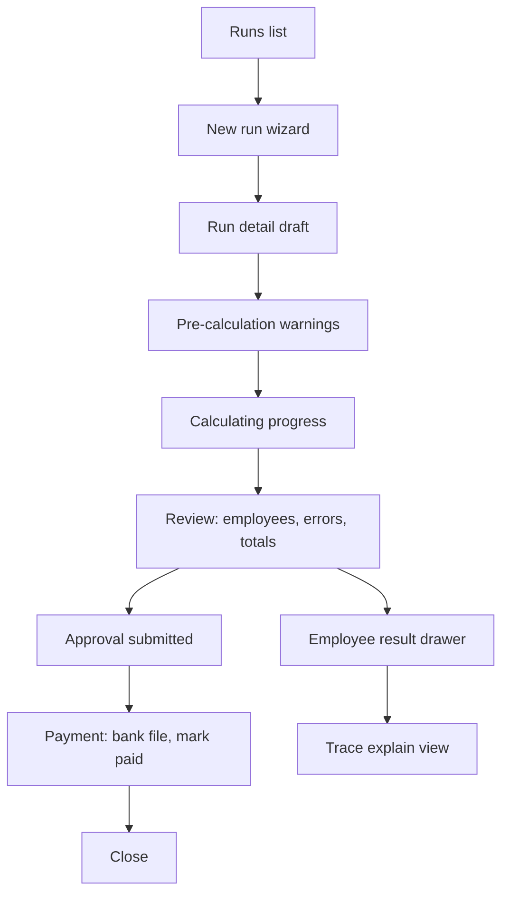

# Module: Payroll

Status: Active (Phase 3) · Related ADRs: `ADR-0001` (port-only cross-module reads), `ADR-0002` (tenant scoping), `ADR-0006` (result pattern), `ADR-0007` (envelope), `ADR-0008` (`payroll_run` chain), `ADR-0009` (payslip objects), `ADR-0010` (jobs + outbox events), `ADR-0012` (calculation engine — **amended twice this session**), `ADR-0013` (Drizzle conventions), `ADR-0014` (PDF), `ADR-0015` (exports), `ADR-0016` (amounts deliberately **not** field-encrypted) · Depends on: `docs/06-modules/holiday.md` (template), `docs/06-modules/employee.md` (`EmployeePayrollPort`), `docs/06-modules/attendance.md` (`AttendanceQueryPort`, `PeriodLockPort`), `docs/06-modules/leave.md` (`LeaveQueryPort`), `docs/06-modules/overtime.md` (`OvertimeQueryPort`), `docs/06-modules/organization.md`, `docs/05-platform/approval-engine.md`, `docs/05-platform/settings.md`, `docs/05-platform/document-storage.md`, `docs/05-platform/import-export.md` · Consumers: `docs/06-modules/tax-pph21.md`, `docs/06-modules/bpjs.md`, `docs/06-modules/expense-reimbursement.md`, `docs/06-modules/reports.md`, `docs/06-modules/dashboard-analytics.md`

Namespace `payroll` (naming §4, error prefix `PAY`). The effective-dated pay package, the snapshot-deterministic run that prices a period from it, and the year-to-date ledger that outlives both. Inherits all global standards; deviations only.

## 1. Purpose & Scope

Three layers, in order of authority. **The package** — `salary_histories`, one effective-dated record per employee holding the component lines that constitute their pay. **The run** — a frozen snapshot of every input for one company, one period, one run type, computed by a pipeline whose order is fixed in code, producing one result row and one trace per employee. **The ledger** — per-employee year-to-date accumulators written once, at `closed`, which the December recalculation and Form 1721-A1 read instead of re-summing history.

**Payroll orchestrates; it does not calculate statutory math.** PPh 21 belongs to `tax-pph21.md`, BPJS to `bpjs.md`, both reached as pipeline-stage ports (§4.4). Overtime publishes multiplier-hours, leave publishes paid and unpaid days, attendance publishes worked days; this module is the only one that turns any of them into rupiah. The seam is deliberate and it is the same seam overtime.md drew from its side: *labor law decides how much time counts, wage law decides what time costs.*

**V1 exclusions.** Employee loans and salary advances (no amortization schedule, no balance carry). Multi-currency and non-IDR payment. Court-ordered garnishments. Salary bands and pay grades — organization.md owns job levels, and attaching money to a level is a different model than attaching it to a person. Manager-facing payroll visibility of any kind (§2). A salary-revision approval chain — revisions are audited, not approved, in V1 (§15). Pay slips for non-employees (contractors, interns outside the employee register).

## 2. Actors & Permissions

| Action | Permission key | Data scope | Payroll Admin | Finance | HR Admin | Employee |
|---|---|---|---|---|---|---|
| Read component catalog | `payroll.component.configure` (read implied) | company / tenant | ✅ | — | ✅ | — |
| Create/edit/deactivate components | `payroll.component.configure` | company / tenant | ✅ | — | ✅ | — |
| Read a salary package | `payroll.salary.read` | company / tenant | ✅ | — | ✅ | — |
| Create/supersede a salary package | `payroll.salary.update` | company / tenant | ✅ | — | — | — |
| Import opening salary packages | `payroll.salary.import` | company / tenant | ✅ | — | — | — |
| Read runs, results, traces | `payroll.run.read` | company / tenant | ✅ | ✅ | ✅ | — |
| Create a run, snapshot, calculate, revoke | `payroll.run.create` | company | ✅ | — | — | — |
| Act on the run approval chain | `payroll.run.approve` **+ chain membership** | instance | per chain | per chain | per chain | — |
| Mark paid, record a bounce, close | `payroll.run.execute` | company | ✅ | ✅ | — | — |
| Bank file, recap, payslip batch export | `payroll.run.export` | company | ✅ | ✅ | — | — |
| Own payslip and YTD summary | — (authenticated self) | self | — | — | — | ✅ |

**No `team` scope exists in this module** — not for reads, not for aggregates, not with a headcount floor. A manager holds no payroll key, and `/me/team/*` has no payroll counterpart. Spec §10 item 8 defines no manager payroll surface, and a team-scoped aggregate over a team of one is a per-person amount. If manager cost visibility is wanted later it is dashboard-analytics.md's design problem with its own key, not a scope flag granted here.

`payroll.salary.*` is deliberately separate from `payroll.run.*`: revisions happen outside runs, and a Finance user reconciling a bank file has no business editing pay. Acting on the approval chain follows approval-engine §2's two-gate rule — the module key **and** chain membership, never either alone.

## 3. Business Rules

| ID | Rule |
|---|---|
| BR-PAY-001 | **A component is typed configuration, never a formula.** `source ∈ {fixed_amount, rate_of_base, calculator_ref, run_input}`; `calculator_ref` names a code-registered calculator. There is no tenant-authored expression language (ADR-0012). |
| BR-PAY-002 | **Two orthogonal classification axes.** `wage_category ∈ {basic, fixed_allowance, variable_allowance, non_wage}` decides membership in statutory **wage** bases. `income_class ∈ {regular, irregular, non_taxable, final}` decides **tax** treatment. They are independent: THR is `non_wage` + `irregular`; a reimbursement is `non_wage` + `non_taxable`; a fixed transport allowance is `fixed_allowance` + `regular`; a severance amount is `non_wage` + `final`. **`final`** (added 2026-08-03, tax-pph21.md BR-TAX-011, ADR-0012 amendment 3) marks income taxed under a separate final tariff: it is excluded from the monthly withholding base and from the annual recalculation, and accumulates in its own ledger columns. Payroll classifies; `tax-pph21.md` prices. **`income_class` is read on `earning` and `employer_cost` lines and is inert on `deduction` lines** (BR-PAY-026) — a deduction is not income, so the axis has no meaning there and stage 5 never reads it. |
| BR-PAY-003 | **Statutory bases are code formulas over categories, never per-component flags.** `upah sebulan = Σ(basic) + Σ(fixed_allowance)`. Every BPJS contribution base, the THR base, and the overtime hourly basis derive from that one definition plus their own caps and floors. A tenant classifies each component once, in the statute's vocabulary; which categories a base sums is law, and law does not vary per tenant. |
| BR-PAY-004 | **Overtime hourly basis** = `upah sebulan / 173`, subject to the floor: where `basic + fixed_allowance < 75%` of total wage, the basis is computed from 75% of total wage instead. Divisor and floor are effective-dated parameters, never literals. |
| BR-PAY-005 | **One package per employee per interval.** `salary_histories` is effective-dated `[effective_from, effective_to)` with non-overlap enforced by a btree_gist exclusion constraint (database-conventions §5). A revision closes the current record and inserts its successor in one transaction via `supersede()`. Basic salary is the seeded component `basic` — there is no privileged column. |
| BR-PAY-006 | **A run declares its own period.** `period_start`/`period_end` are the pay period and are independent of attendance period boundaries. One non-closed run per `(company, type, period_start, period_end)`. A THR run declares a period it pays *for* while consuming no attendance at all. |
| BR-PAY-007 | **The roster is pinned at snapshot.** Employees are resolved once, at run creation, into `payroll_run_employees`. A hire, exit, or transfer after that point does not join or leave a run in flight; it is picked up by a re-snapshot, which is what recalculation means (ADR-0012). |
| BR-PAY-008 | **Period lock is a precondition of `calculating`, never an effect of it.** Every date in `[period_start, period_end]` must be covered by a locked attendance period before the run may leave `draft`. Payroll never writes attendance state. The reverse guard is `PayrollRunGuardPort.runsOver` (§4.3), which blocks release while a non-draft run exists. THR runs are exempt — they consume no attendance facts. |
| BR-PAY-009 | **Calculation is a pure function of the snapshot.** Same snapshot in, byte-identical result out, forever. Every input is captured at snapshot time: package as-of, attendance summary, leave summary, overtime summary, employee facts, component definitions, and every effective-dated parameter version. Nothing is read live during calculation. |
| BR-PAY-010 | **Inputs are pulled, never pushed** (ADR-0012, clarified 2026-08-02). Overtime, leave, attendance, and expense effects are read from their owning modules' ports at snapshot time. No module writes a row into a run. |
| BR-PAY-011 | **Per-employee failure does not kill the run.** A failing employee row is marked `errored` with its code and details; the run still reaches `review`. Submitting for approval while any row is `errored` is refused — errors are fixed and selectively recalculated first. |
| BR-PAY-012 | **Rounding binds per statutory stage, and the payslip foots.** Each stage rounds by its own effective-dated rule; the net is the **sum of already-rounded lines**, never a rounded sum of unrounded values. Displayed lines therefore add up to the displayed net, exactly, for an employee with a calculator. Precisely: `net_pay = Σ earning − Σ deduction`. **`employer_cost` lines are outside both sides of that equation** (BR-PAY-026) — they are the employer's own liability, never withheld from anyone, and including them in either sum would break the invariant this rule exists to protect. |
| BR-PAY-013 | **Proration** of `is_proratable` components uses `payroll.proration_basis` — `calendar_days`, `working_days`, or `fixed_divisor` with `payroll.fixed_daily_divisor`. The `1/173` overtime divisor is a separate statutory parameter and does not move when a tenant changes its proration policy. |
| BR-PAY-014 | **Sick-leave wage scaling is percentage-of-wage, not day-based.** Leave publishes type, paid flag, day count, and dates; payroll applies the statutory percentage for the elapsed quarter of the illness as a `deduction` component. It never touches the proration divisor. |
| BR-PAY-015 | **THR run targeting.** A THR run carries `religious_holiday_date` and `target_religions[]`. A tenant paying everyone at one hari raya selects all religions in one run; a tenant paying per faith creates several. Eligibility is ≥1 month continuous service as of the holiday date; below 12 months the entitlement prorates `service_months / 12 × upah sebulan`; at or above 12 months it is one full `upah sebulan`. Employees terminated inside the pre-holiday entitlement window remain on the roster. |
| BR-PAY-016 | **`approved → paid` is a deliberate act**, recorded with payment date, actor, and reference, under `payroll.run.execute`. Generating a bank file is not payment and never moves the run. |
| BR-PAY-017 | **A bounced transfer is a payment fact, not a run state.** `payroll_run_employees.payment_state` flips to `bounced`; the bank detail is corrected in employee.md; the row returns to `pending`; the bank-file export re-runs filtered to unpaid. The run stays `paid` and **a bounce never blocks `closed`** — the obligation, the withholding, and the contribution are all real from approval onward, and December's recalculation needs them in the ledger. |
| BR-PAY-018 | **`closed` is terminal.** No reopen, ever (ADR-0012). At close the YTD ledger is written and the attendance periods the run consumed become permanently payroll-bound. |
| BR-PAY-019 | **Post-close corrections are retro, and a human selects them.** An upstream correction to a closed period raises a `payroll_retro_flags` row — a dirty mark, not a recompute. The retro worklist shadow-recomputes the marked set on demand, shows the diff, and HR selects which deltas enter the current run. Selected deltas ride that run's own approval chain. Bounded by `payroll.retro_window_months`. |
| BR-PAY-020 | **Payslip numbers are business identifiers**, `text NOT NULL`, unique per tenant (database-conventions §6), minted at calculation and stable for the life of the result row. |
| BR-PAY-021 | **The trace is the payslip.** The in-app payslip renders from `payroll_run_employees.trace`; the PDF is a download generated on demand and cached in `generated_document`. The trace stamps `payslip_template_version` so a document regenerated years later reproduces the original layout with the original numbers. |
| BR-PAY-022 | **Payslips become visible at `paid`**, not at `closed`. A bounced transfer does not hide a payslip — the entitlement stands, the bank detail is what failed. |
| BR-PAY-023 | **Audit and retention.** `payroll_runs`, `salary_histories`, `salary_history_lines`, and `payroll_components` are channel-1 audited (audit-log §4.2). Runs, results, traces, and the YTD ledger sit in the 10-year payroll retention class (database-conventions §4.4) and are exempt from every purge path. |
| BR-PAY-024 | **Reading another employee's package or payslip is a sensitive read.** `payroll.salary.read` and per-employee result reads write audit rows the same way employee.md's reveal path does. Aggregate run totals do not. |
| BR-PAY-025 | **One run at a time per company and payment month.** A run may not enter `calculating` while another run for the same company whose `payment_date` falls in the same calendar month sits in `calculating` or `review` (`PAY_MONTH_RUN_IN_FLIGHT`). Added 2026-08-03 (tax-pph21.md BR-TAX-007, ADR-0012 amendment 3): withholding is computed on the month's cumulative base, so while a second run's numbers are still moving the first's answer is not determined. `approved` and later are stable and do not block — approve the THR run, then calculate the regular one. Runs in different months, or a `draft` run that has not been asked to calculate, never conflict. |
| BR-PAY-026 | **The employer's own statutory cost is a third line kind.** `kind = employer_cost` (added 2026-08-03, bpjs.md BR-BPJS-011, ADR-0012 amendment 4) holds money the employer owes on an employee's behalf that the employee never receives and that is never withheld from them. Three consequences bind together. **Net is untouched**: `net_pay = Σ earning − Σ deduction`, employer-cost lines outside both (BR-PAY-012). **Taxable assembly reads them**: stage 5 sums `earning` and `employer_cost` lines by `income_class`, because some employer-paid premiums are taxable income to the employee while others are not, and the existing axis is exactly the right place to say which. **Aggregations must filter by kind**: `payroll_run_lines` now holds rows that are neither pay nor deduction, so any consumer summing amounts without a kind predicate reports the employer's costs as employee gross. Before this kind existed the whole employer side was two scalar totals, and a premium that is not a line is a premium the tax calculator — whose only view of income is its `lines` argument — cannot see. |
| BR-PAY-027 | **The BPJS contribution base is the stage-1 wage, not the stage-3 payment.** Stage 4 reads the unprorated `upah sebulan` produced at stage 1, never proration's output (bpjs.md BR-BPJS-007 ⚠️ VERIFY). Written as a rule because the pipeline's own ordering implies the opposite and would otherwise apply proration by accident: BPJS reports a *wage*, and a month of unpaid leave would otherwise yield a zero base, no contribution, and by implication lapsed coverage. |

> ⚠️ VERIFY: confirm against current Indonesian regulation before implementation. — the `1/173` divisor and the 75%-of-total-wage floor (BR-PAY-004); the THR service threshold, proration formula, pre-holiday payment deadline, and post-termination entitlement window (BR-PAY-015); the sick-leave wage percentages per quarter of illness (BR-PAY-014); the lawful proration divisor for mid-period join, exit, and unpaid absence (BR-PAY-013); rounding rule and direction per statutory stage (BR-PAY-012); the 10-year retention floor (BR-PAY-023).

## 4. Domain Model

### 4.1 Schema



```ts
export const payrollRunType = pgEnum('payroll_run_type', ['regular', 'thr', 'final_settlement']);
export const payrollRunStatus = pgEnum('payroll_run_status', [
  'draft', 'calculating', 'review', 'approved', 'paid', 'closed',
]);
export const payrollEmployeeState = pgEnum('payroll_employee_state', [
  'pending', 'computed', 'errored', 'excluded',
]);
export const payrollPaymentState = pgEnum('payroll_payment_state', ['pending', 'paid', 'bounced']);
export const payrollComponentKind = pgEnum('payroll_component_kind', [
  'earning', 'deduction', 'employer_cost',                        // employer_cost: BR-PAY-026
]);
export const payrollComponentCadence = pgEnum('payroll_component_cadence', ['recurring', 'one_off']);
export const payrollComponentSource = pgEnum('payroll_component_source', [
  'fixed_amount', 'rate_of_base', 'calculator_ref', 'run_input',
]);
export const wageCategory = pgEnum('wage_category', [
  'basic', 'fixed_allowance', 'variable_allowance', 'non_wage',
]);
export const payrollIncomeClass = pgEnum('payroll_income_class', ['regular', 'irregular', 'non_taxable', 'final']);
export const salaryChangeReason = pgEnum('salary_change_reason', [
  'hire', 'promotion', 'adjustment', 'contract_renewal', 'correction',
]);
export const payrollRetroState = pgEnum('payroll_retro_state', ['dirty', 'resolved', 'dismissed']);

export const payrollComponents = pgTable('payroll_components', {
  ...id, ...tenantId,
  companyId: uuid('company_id').references(() => companies.id),   // NULL = tenant-wide catalog
  code: text('code').notNull(),                                   // stable key: 'basic', 'transport', 'overtime'
  name: text('name').notNull(),
  kind: payrollComponentKind('kind').notNull(),
  cadence: payrollComponentCadence('cadence').notNull(),
  source: payrollComponentSource('source').notNull(),
  wageCategory: wageCategory('wage_category').notNull(),          // BR-PAY-002, statutory wage axis
  incomeClass: payrollIncomeClass('income_class').notNull(),      // BR-PAY-002, tax axis
  isProratable: boolean('is_proratable').notNull().default(false),
  roundingRule: text('rounding_rule').notNull().default('rupiah'),// effective-dated parameter key
  calculatorRef: text('calculator_ref'),                          // source = calculator_ref
  rateOfBase: numeric('rate_of_base', { precision: 7, scale: 4 }),// source = rate_of_base
  rateBase: text('rate_base'),                                    // which base the rate multiplies
  isSystem: boolean('is_system').notNull().default(false),        // seeded; not deletable, not reclassifiable
  isActive: boolean('is_active').notNull().default(true),
  sortOrder: integer('sort_order').notNull().default(100),
  // + audit fields, soft delete (database-conventions §2)
});

export const salaryHistories = pgTable('salary_histories', {
  ...id, ...tenantId,
  employeeId: uuid('employee_id').notNull().references(() => employees.id),
  effectiveFrom: date('effective_from').notNull(),
  effectiveTo: date('effective_to'),                              // NULL = current
  reason: salaryChangeReason('reason').notNull(),
  note: text('note'),
  // + audit fields, soft delete
});

export const salaryHistoryLines = pgTable('salary_history_lines', {
  ...id, ...tenantId,
  salaryHistoryId: uuid('salary_history_id').notNull()
    .references(() => salaryHistories.id, { onDelete: 'cascade' }),
  componentId: uuid('component_id').notNull()
    .references(() => payrollComponents.id),                      // RESTRICT (database-conventions §8)
  amount: numeric('amount', { precision: 15, scale: 2 }).notNull(),
});

export const payrollRuns = pgTable('payroll_runs', {
  ...id, ...tenantId,
  companyId: uuid('company_id').notNull().references(() => companies.id),
  type: payrollRunType('type').notNull(),
  status: payrollRunStatus('status').notNull().default('draft'),
  label: text('label').notNull(),
  periodStart: date('period_start').notNull(),
  periodEnd: date('period_end').notNull(),
  paymentDate: date('payment_date').notNull(),
  religiousHolidayDate: date('religious_holiday_date'),           // type = thr
  targetReligions: religion('target_religions').array(),          // type = thr
  parameterVersions: jsonb('parameter_versions'),                 // pinned at snapshot, BR-PAY-009
  snapshotAt: timestamp('snapshot_at', { withTimezone: true }),
  calculatedAt: timestamp('calculated_at', { withTimezone: true }),
  approvalInstanceId: uuid('approval_instance_id')
    .references(() => approvalInstances.id),
  approvedAt: timestamp('approved_at', { withTimezone: true }),
  paidAt: timestamp('paid_at', { withTimezone: true }),
  paidBy: uuid('paid_by').references(() => users.id),
  paymentReference: text('payment_reference'),
  closedAt: timestamp('closed_at', { withTimezone: true }),
  employeeCount: integer('employee_count').notNull().default(0),
  errorCount: integer('error_count').notNull().default(0),
  totalGross: numeric('total_gross', { precision: 15, scale: 2 }),
  totalNet: numeric('total_net', { precision: 15, scale: 2 }),
  totalEmployerCost: numeric('total_employer_cost', { precision: 15, scale: 2 }),  // derived, BR-PAY-026
  // + audit fields, soft delete
});

export const payrollRunEmployees = pgTable('payroll_run_employees', {
  ...id, ...tenantId,
  runId: uuid('run_id').notNull()
    .references(() => payrollRuns.id, { onDelete: 'cascade' }),
  employeeId: uuid('employee_id').notNull().references(() => employees.id),
  state: payrollEmployeeState('state').notNull().default('pending'),
  snapshot: jsonb('snapshot').notNull(),                          // every pulled input, frozen
  trace: jsonb('trace'),                                          // per-stage arithmetic, BR-PAY-021
  payslipNumber: text('payslip_number'),
  payslipTemplateVersion: text('payslip_template_version'),
  prorationFactor: numeric('proration_factor', { precision: 7, scale: 4 }),
  grossEarnings: numeric('gross_earnings', { precision: 15, scale: 2 }),
  totalDeductions: numeric('total_deductions', { precision: 15, scale: 2 }),
  netPay: numeric('net_pay', { precision: 15, scale: 2 }),
  employerCost: numeric('employer_cost', { precision: 15, scale: 2 }),   // = Σ employer_cost lines, BR-PAY-026
  taxableRegular: numeric('taxable_regular', { precision: 15, scale: 2 }),
  taxableIrregular: numeric('taxable_irregular', { precision: 15, scale: 2 }),
  pph21Withheld: numeric('pph21_withheld', { precision: 15, scale: 2 }),
  paymentState: payrollPaymentState('payment_state').notNull().default('pending'),
  paidAt: timestamp('paid_at', { withTimezone: true }),
  bouncedAt: timestamp('bounced_at', { withTimezone: true }),
  bounceReason: text('bounce_reason'),
  errorCode: text('error_code'),
  errorDetails: jsonb('error_details'),
  // + audit fields
});

export const payrollRunLines = pgTable('payroll_run_lines', {
  ...id, ...tenantId,
  runId: uuid('run_id').notNull().references(() => payrollRuns.id),
  runEmployeeId: uuid('run_employee_id').notNull()
    .references(() => payrollRunEmployees.id, { onDelete: 'cascade' }),
  componentId: uuid('component_id').notNull()
    .references(() => payrollComponents.id),                      // RESTRICT (database-conventions §8)
  componentCode: text('component_code').notNull(),                // denormalized: the catalog moves, a payslip does not
  kind: payrollComponentKind('kind').notNull(),
  wageCategory: wageCategory('wage_category').notNull(),
  incomeClass: payrollIncomeClass('income_class').notNull(),
  quantity: numeric('quantity', { precision: 10, scale: 4 }),     // multiplier-hours, days
  rate: numeric('rate', { precision: 15, scale: 2 }),
  amount: numeric('amount', { precision: 15, scale: 2 }).notNull(),// already rounded, BR-PAY-012
  sourceRef: text('source_ref'),                                  // occurrence id, claim id, retro flag id
  sortOrder: integer('sort_order').notNull().default(100),
});

export const payrollYtdLedger = pgTable('payroll_ytd_ledger', {
  ...id, ...tenantId,
  companyId: uuid('company_id').notNull().references(() => companies.id),
  employeeId: uuid('employee_id').notNull().references(() => employees.id),
  taxYear: integer('tax_year').notNull(),
  grossYtd: numeric('gross_ytd', { precision: 15, scale: 2 }).notNull().default('0'),
  taxableRegularYtd: numeric('taxable_regular_ytd', { precision: 15, scale: 2 }).notNull().default('0'),
  taxableIrregularYtd: numeric('taxable_irregular_ytd', { precision: 15, scale: 2 }).notNull().default('0'),
  pph21WithheldYtd: numeric('pph21_withheld_ytd', { precision: 15, scale: 2 }).notNull().default('0'),
  finalIncomeYtd: numeric('final_income_ytd', { precision: 15, scale: 2 }).notNull().default('0'),
  pph21FinalYtd: numeric('pph21_final_ytd', { precision: 15, scale: 2 }).notNull().default('0'),
  bpjsBaseYtd: numeric('bpjs_base_ytd', { precision: 15, scale: 2 }).notNull().default('0'),
  bpjsEmployeeYtd: numeric('bpjs_employee_ytd', { precision: 15, scale: 2 }).notNull().default('0'),
  bpjsEmployerYtd: numeric('bpjs_employer_ytd', { precision: 15, scale: 2 }).notNull().default('0'),
  // The two the annual PPh 21 path deducts — bpjs.md BR-BPJS-017. Named separately
  // because bpjsEmployeeYtd also carries the non-deductible Kesehatan part.
  jhtEmployeeYtd: numeric('jht_employee_ytd', { precision: 15, scale: 2 }).notNull().default('0'),
  jpEmployeeYtd: numeric('jp_employee_ytd', { precision: 15, scale: 2 }).notNull().default('0'),
  monthsCounted: integer('months_counted').notNull().default(0),
  lastRunId: uuid('last_run_id').references(() => payrollRuns.id),
  // + audit fields
});

export const payrollRetroFlags = pgTable('payroll_retro_flags', {
  ...id, ...tenantId,
  companyId: uuid('company_id').notNull().references(() => companies.id),
  employeeId: uuid('employee_id').notNull().references(() => employees.id),
  closedRunId: uuid('closed_run_id').notNull().references(() => payrollRuns.id),
  periodStart: date('period_start').notNull(),
  periodEnd: date('period_end').notNull(),
  reason: text('reason').notNull(),                               // 'attendance.correction' | 'overtime.correction' | 'salary.backdated'
                                                                  // | 'tax.profile' | 'bpjs.registration' | 'bpjs.coverage'
  sourceRef: text('source_ref').notNull(),                        // dedup discriminator
  state: payrollRetroState('state').notNull().default('dirty'),
  shadowTrace: jsonb('shadow_trace'),                             // computed on demand, kept as delta evidence
  deltaNet: numeric('delta_net', { precision: 15, scale: 2 }),
  resolvedInRunId: uuid('resolved_in_run_id').references(() => payrollRuns.id),
  dismissedReason: text('dismissed_reason'),
  // + audit fields
});
```

Hand-written in the generating migration (drizzle-kit cannot express these):

```sql
CREATE EXTENSION IF NOT EXISTS btree_gist;

-- BR-PAY-005: one package per employee per interval, database-enforced (conventions §5)
ALTER TABLE salary_histories ADD CONSTRAINT excl_salary_histories_no_overlap
  EXCLUDE USING gist (
    tenant_id WITH =,
    employee_id WITH =,
    daterange(effective_from, effective_to, '[)') WITH &&
  ) WHERE (deleted_at IS NULL);

-- BR-PAY-006: one live run per company, type, and period
CREATE UNIQUE INDEX uq_payroll_runs_live_period
  ON payroll_runs (tenant_id, company_id, type, period_start, period_end)
  WHERE deleted_at IS NULL AND status <> 'closed';

-- ADR-0012: results keyed (run, employee) so re-execution overwrites idempotently
CREATE UNIQUE INDEX uq_payroll_run_employees_key
  ON payroll_run_employees (run_id, employee_id);

CREATE UNIQUE INDEX uq_payroll_run_employees_payslip
  ON payroll_run_employees (tenant_id, payslip_number)
  WHERE payslip_number IS NOT NULL;

CREATE UNIQUE INDEX uq_payroll_ytd_ledger_key
  ON payroll_ytd_ledger (tenant_id, company_id, employee_id, tax_year);

CREATE UNIQUE INDEX uq_payroll_components_code
  ON payroll_components (tenant_id, COALESCE(company_id, '00000000-0000-0000-0000-000000000000'::uuid), code)
  WHERE deleted_at IS NULL;

-- BR-PAY-019: one dirty mark per correction, however many times its event redelivers
CREATE UNIQUE INDEX uq_payroll_retro_flags_source
  ON payroll_retro_flags (tenant_id, employee_id, closed_run_id, source_ref)
  WHERE state <> 'dismissed';

ALTER TABLE payroll_runs ADD CONSTRAINT ck_payroll_runs_period
  CHECK (period_end >= period_start);

ALTER TABLE payroll_runs ADD CONSTRAINT ck_payroll_runs_thr_targeting
  CHECK (type <> 'thr' OR (religious_holiday_date IS NOT NULL AND array_length(target_religions, 1) >= 1));
```

`payroll_run_lines` are real rows rather than entries inside the trace for one reason: ADR-0016 amendment 1 left amounts unencrypted **specifically** so aggregate queries work. `SUM(amount) WHERE component_code = 'transport' GROUP BY department` is the dashboard and reports use case, and jsonb would have traded it away to save a table.

### 4.2 Run lifecycle



Payment state is per employee and moves independently of the run:



Invariants. `closed` is terminal and unreachable from anywhere except `paid`. A run cannot leave `draft` while any covering attendance period is unlocked (BR-PAY-008). A run cannot leave `review` upward while `error_count > 0`. A bounced row cannot block `closed` (BR-PAY-017), and closing does not resolve it — the row stays `bounced` until re-issued, which remains possible after close because payment state is not run state.

### 4.3 Port served

```ts
export const PAYROLL_RUN_GUARD_PORT = Symbol('PAYROLL_RUN_GUARD_PORT');

export interface PayrollRunGuardPort {
  /**
   * Non-draft runs whose period intersects [from, to]. Attendance calls this before
   * releasing a period lock; a non-empty result blocks the unlock. Discharges the stub
   * attendance.md §4.3 shipped with.
   */
  runsOver(companyId: string, from: string, to: string): Promise<
    { runId: string; label: string; type: 'regular' | 'thr' | 'final_settlement';
      status: 'calculating' | 'review' | 'approved' | 'paid' | 'closed';
      periodStart: string; periodEnd: string }[]
  >;
}
```

A `closed` run is included deliberately: a period a closed run priced can never be reopened, because BR-PAY-018 makes the numbers permanent and BR-PAY-019 routes every later fact through retro instead.

```ts
export const PAYROLL_YTD_SEED_PORT = Symbol('PAYROLL_YTD_SEED_PORT');

export interface PayrollYtdSeedPort {
  /**
   * Seed opening year-to-date accumulators for a tenant onboarding mid-year.
   * Refused once any run has closed for that (employee, taxYear) — the ledger is
   * only writable before it becomes real. Called by tax-pph21.md's `tax.opening_ytd`
   * import row handler; there is no HTTP surface.
   */
  seedOpening(input: {
    companyId: string; employeeId: string; taxYear: number;
    gross: string; taxableRegular: string; taxableIrregular: string;
    pph21Withheld: string;
    // Added 2026-08-03, bpjs.md BR-BPJS-017: without these, a mid-year tenant's
    // December path deducts only the contributions this system saw.
    jhtEmployee: string; jpEmployee: string;
    months: number;
  }): Promise<Result<void, DomainError>>;
}
```

Added 2026-08-03 (tax-pph21.md BR-TAX-015). The ledger stays payroll's table with payroll's write path; what tax owns is the user-facing concept and the import definition. Keeping the accumulators in one place is the point — a parallel opening-balance table would mean every reader of the year (December's recalculation, 1721-A1, reports, dashboards) had to remember to add it, and nothing would fail loudly when one forgot.

### 4.4 Ports consumed

| Port | Use | Status |
|---|---|---|
| `EmployeePayrollPort.rosterFor` | roster as-of the period, hire/exit dates, contract kind, status, PTKP, NPWP presence, bank account, religion — one batched call per run | **new, added to employee.md this session** |
| `AttendanceQueryPort.summaryFor` | worked days, unpaid absence, anomaly counts — snapshot input | live |
| `PeriodLockPort.isLocked` / `firstLockedDate` | BR-PAY-008 precondition check | live |
| `LeaveQueryPort.summaryFor` | paid vs unpaid leave days with dates and types — snapshot input | live |
| `LeaveQueryPort.balanceFor` | encashable remainder as-of the exit date, final settlement only | live |
| `OvertimeQueryPort.summaryFor` | multiplier-hours and per-occurrence tier trace — snapshot input | live |
| `Pph21CalculatorPort.compute` | TER monthly, December and exit recalculation, severance final tax, gross-up allowance | **live** — `tax-pph21.md` §4.4 |
| `Pph21CalculatorPort.preflight` | run-creation warnings: mid-year hires with no prior-employer record, employees whose PTKP cannot be pinned | **live** — `tax-pph21.md` §4.4 |
| `BpjsCalculatorPort.compute` | Kesehatan + JHT/JP/JKK/JKM employee and employer parts, returned as classified lines plus the named JHT/JP employee pair | **live** — `bpjs.md` §4.4 |
| `BpjsCalculatorPort.preflight` | run-creation warnings: unregistered company, JKK enabled with no risk class, branch with no wage floor | **live** — `bpjs.md` §4.4 |
| `ExpenseQueryPort.claimForRun` | approved claims flagged `disburse_via = payroll`, **returned and pinned to this run in the snapshot transaction** | **live** — `expense-reimbursement.md` §4.3 |
| `ExpenseQueryPort.releaseForRun` | clears the pin when a run is revoked | **live** — `expense-reimbursement.md` §4.3 |
| `ApprovalEnginePort` | `payroll_run` instances | live |
| `SettingsPort` | proration basis, divisors, cut-off default, retro window | live |
| `DocumentStoragePort` | payslip PDFs into `generated_document` | live |
| `OrgQueryPort` | company and branch resolution for run scoping and grouping | live |

Both calculator ports take a **pure input struct and return a pure result** — component amounts, computed bases, the employee's YTD slice, the **MTD slice**, and the pinned parameter versions go in; amounts and trace steps come out. Neither calculator reads a repository, and neither calls back into payroll during a run. The YTD slice is passed *in* precisely so the December recalculation stays a function of its argument: a callback would make the pipeline order-dependent on live state and destroy the golden-file test class ADR-0012 names as primary.

**The MTD slice** (added 2026-08-03, tax-pph21.md BR-TAX-007, ADR-0012 amendment 3) is bruto and PPh 21 already withheld in the same company and **tax month** — the calendar month of `payment_date` — from runs at `approved`, `paid`, or `closed`. It exists because TER is a rate on a month's *total* bruto and two runs may legitimately share a payment month: a THR run beside a regular one, a final settlement beside either. Without it each run prices its own gross in isolation, lands the month in a lower band than it belongs in, and the whole company under-withholds until December claws it back in one deduction. Assembled here at snapshot, like every other input, so the calculators stay pure.

**The MTD slice carries BPJS too** (added 2026-08-03, bpjs.md BR-BPJS-010): per program, the base and the employee and employer amounts already charged in the same company and tax month. A contribution is a monthly obligation, and the same two-runs-one-month situation that lands tax in the wrong TER band charges BPJS **twice** — most reliably for an employee who exits mid-month and appears in both the regular run and their own final settlement. The calculator charges `max(0, month due − already charged)` per program, which also gives the right answer for a mid-month raise paid across two runs. Same query, same serialization guard, one more column.

**`claimForRun` is the one consumed port that writes** (added 2026-08-03, expense-reimbursement.md BR-EXP-008). It was declared here as `approvedForPeriod`; the module renamed it on arrival because it stamps `payroll_run_id` on every claim it returns, and a method that stamps rows must not be named like a pure read. The stamp runs inside `run.snapshot`'s own transaction, which is what makes the guarantee atomic — either this run has the claims and the claims know it, or neither happened. Without it a THR run created after a regular run reaches `approved` re-reads the same claims and pays them twice: `PAY_MONTH_RUN_IN_FLIGHT` does not reach that case, both runs foot internally, and the duplicate exists only in the claim's history where nothing reads it. `revoke` must call `releaseForRun` or a revoked run strands every claim it touched, approved and unpayable, forever.

### 4.5 Pipeline and bases

Order is fixed in code (ADR-0012). Each stage rounds by its own rule before the next reads it.

| # | Stage | Reads | Produces |
|---|---|---|---|
| 1 | Gross earnings | package lines, `run_input` components (incl. expense claims pulled by `ExpenseQueryPort.claimForRun`) | `earning` lines, `upah sebulan`, total wage |
| 2 | Overtime | `OvertimeQueryPort` multiplier-hours × hourly basis (BR-PAY-004) | one `earning` line per occurrence group, `quantity` = multiplier-hours |
| 3 | Proration | hire/exit dates, unpaid leave days, `payroll.proration_basis` | `proration_factor`, adjusted proratable lines |
| 4 | BPJS | `BpjsCalculatorPort` over the **stage-1 unprorated** `upah sebulan` (BR-PAY-027), per-program caps and floor, + the **MTD credit** | employee `deduction` lines + `employer_cost` lines, each carrying its own `income_class` |
| 5 | Taxable assembly | `income_class` on `earning` **and** `employer_cost` lines (BR-PAY-026); `deduction` lines never | `taxable_regular`, `taxable_irregular`; `final` and `non_taxable` excluded from both |
| 6 | PPh 21 | `Pph21CalculatorPort` + YTD slice + **MTD slice** | withholding `deduction` line, plus a `tunjangan_pajak` `earning` line under gross-up, plus the final-tax line for `final` income |
| 7 | Other deductions | `deduction` components, sick-leave scaling (BR-PAY-014) | `deduction` lines |
| 8 | Net and rounding | rounded lines | `net_pay` = Σ rounded earnings − Σ rounded deductions |

**Statutory bases, one definition each** (BR-PAY-003):

| Base | Formula |
|---|---|
| `upah sebulan` | `Σ basic + Σ fixed_allowance` |
| Total wage | `Σ basic + Σ fixed_allowance + Σ variable_allowance` |
| Overtime hourly basis | `max(upah sebulan, 0.75 × total wage) / 173` ⚠️ VERIFY |
| THR base | `upah sebulan` as-of the holiday date |
| BPJS contribution base | `upah sebulan` **unprorated** (BR-PAY-027); per-program floor and cap applied by `bpjs.md` |
| Daily rate | `upah sebulan / divisor`, divisor per `payroll.proration_basis` ⚠️ VERIFY |

> ⚠️ VERIFY: confirm against current Indonesian regulation before implementation. — every row of this table, including the composition of `upah sebulan` itself. The **structure** is the decided part: one definition per base, derived from wage categories, versioned as effective-dated parameters. Which categories each base sums, and each cap and floor, are regulatory facts to confirm before implementation.

**Worked example — the 75% floor doing its job.** Basic 3,000,000; fixed transport 500,000; variable performance allowance 4,000,000. `upah sebulan` = 3,500,000. Total wage = 7,500,000; 75% of that = 5,625,000. The floor binds, so the overtime hourly basis is `5,625,000 / 173 = 32,514.45`, not `3,500,000 / 173 = 20,231.21`. On 10 multiplier-hours that is **325,145 rather than 202,312** — a 61% difference, and precisely the wage-structuring the floor exists to prevent. A per-component flag model cannot express this rule at all, because the floor is a comparison *between* two bases, not a property of any one component.

## 5. Use Cases

**UC-PAY-001 — Configure the component catalog.** Actor: Payroll Admin. Create a component with kind, cadence, source, `wage_category`, `income_class`. Seeded system components (`basic`, `overtime`, the PPh 21 calculator ref, and the **nine BPJS refs** enumerated in bpjs.md §4.4 — four employee deductions and five `employer_cost` rows, plus the two **expense** refs `expense_reimbursement` and `expense_taxable_benefit` — both `non_wage`, differing only in `income_class`, chosen per claim by the class the category pinned) cannot be deleted or reclassified — their categories are statutory, and the `income_class` on an employer-cost ref is what decides whether that premium enters the employee's taxable bruto. Deleting a component referenced by any salary line or run line → `PAY_COMPONENT_IN_USE`; deactivation is the supported path.

**UC-PAY-002 — Set or revise a salary package.** Actor: Payroll Admin with `payroll.salary.update`. Pick employee, effective date, component lines. Main: `supersede()` closes the current record at the new `effective_from` and inserts the successor in one transaction. Exception: an effective date inside a closed run's period is accepted but raises a retro flag (BR-PAY-019) rather than changing history silently. Overlap that the exclusion constraint rejects → `PAY_SALARY_OVERLAP`. Postcondition: `payroll.salary.changed` emitted, channel-1 audit row written.

**UC-PAY-003 — Create a regular run.** Actor: Payroll Admin. Pick company, period start/end, payment date. Precondition: no live run for the same key (`PAY_RUN_OVERLAPS`). Main: roster resolved via `EmployeePayrollPort.rosterFor` and pinned; every input pulled and frozen into `payroll_run_employees.snapshot`; parameter versions pinned onto the run. Employees with no package covering the period are seeded `errored` with `PAY_NO_SALARY_PACKAGE` rather than silently dropped. Postcondition: `draft`, with a pre-calculation warning strip carrying unresolved attendance anomalies, unactualized overtime occurrences, and missing bank accounts.

**UC-PAY-004 — Calculate.** Actor: Payroll Admin. Precondition: every covering attendance period locked (`PAY_PERIOD_NOT_LOCKED`, `details: { firstUnlockedDate }`). Main: `run.calculate` fans out ~100 employees per child job; each computes the pipeline over its frozen snapshot and writes result, lines, and trace. Alternate: a per-employee failure marks that row `errored` and the run continues (BR-PAY-011). Exception: a run-level failure returns the run to `draft` with errors attached. Postcondition: `review`, totals aggregated in a join step, `payroll.run.completed` emitted.

**UC-PAY-005 — Selective recalculation.** Actor: Payroll Admin, from `review`. Select a subset of employees; only those rows are re-snapshotted and recomputed. A late attendance correction on an open period costs one employee's recompute, not ten thousand.

**UC-PAY-006 — Submit for approval.** Actor: Payroll Admin. Precondition: `error_count = 0` (`PAY_RUN_HAS_ERRORS`). Main: an `approval_instances` row of type `payroll_run` opens per ADR-0008. Terminal approve → `approved`; reject or return → back to `draft` with the comment attached.

**UC-PAY-007 — Revoke an approval.** Actor: Payroll Admin, `approved` only, before payment. Returns to `draft`; the chain re-runs in full on resubmission. After `paid` → `PAY_ALREADY_PAID`. No silent recalculation ever sits behind a completed approval.

**UC-PAY-008 — Export the bank file and mark paid.** Actor: Finance. Export `payroll.bank_file` scoped `all` or `unpaid` through the import-export framework; employees without a bank account are listed as an export-level warning and, if the export is run anyway, appear in the report rather than the file (`PAY_BANK_ACCOUNT_MISSING` on the per-employee row). Marking paid is a separate act recording payment date, actor, and reference; the export never moves the run (BR-PAY-016).

**UC-PAY-009 — Record and re-issue a bounce.** Actor: Finance. Flip the employee row to `bounced` with a reason. HR corrects the bank detail through employee.md's data-change path. The row returns to `pending`; the bank-file export re-runs filtered to unpaid. The run's status never changes, and this works after `closed`.

**UC-PAY-010 — Close.** Actor: Payroll Admin or Finance with `payroll.run.execute`. Main: YTD accumulators updated per employee in one transaction, `closed_at` stamped, periods permanently bound. Exception: closing is refused if a YTD write fails — a partial ledger is worse than an open run. Postcondition: `payroll.run.closed` emitted; tax-pph21 and bpjs read the ledger from here on.

**UC-PAY-011 — Resolve retro.** Actor: Payroll Admin, from a live run. Open the pending-retro worklist: dirty flags inside `payroll.retro_window_months`, each shadow-recomputed on demand against a corrected snapshot and diffed against what was paid. Select flags to include; selected deltas enter the current run as `run_input` lines typed `regular` or `irregular`, with `source_ref` pointing at the flag. Dismissal requires a reason. Flags older than the window → `PAY_RETRO_WINDOW_CLOSED`, and appear in the retro report instead.

**UC-PAY-012 — Final settlement.** Actor: Payroll Admin. The pending-settlements worklist lists exited employees with no settlement run covering them — derived, not notification-driven, so a missed nudge cannot lose one. Create a `final_settlement` run holding one or more leavers. Main: prorated final period, `LeaveQueryPort.balanceFor(employeeId, exitDate)` for encashable remainder, outstanding deduction components. On close, leave.md's `settlement_payout` ledger entry is posted for the encashed days.

**UC-PAY-013 — THR run.** Actor: Payroll Admin. Pick the religious holiday date and target religions; roster resolves to eligible employees per BR-PAY-015. No attendance dependency, so BR-PAY-008 does not apply. Payment date is warned against the statutory pre-holiday deadline.

**UC-PAY-014 — Employee views a payslip.** Actor: Employee. `GET /me/payslips` lists runs in `paid` or `closed`; detail renders from the trace with per-line explain rows. Download mints a PDF on demand into `generated_document` with a 120-second URL.

## 6. UI Flow

**Admin web (primary surface).** Screens: Runs list · Run detail with Employees / Errors / Totals / Retro tabs · Employee result drawer with the trace explain-view · Component catalog · Salary package editor with history timeline · Pending settlements · Pending retro.



The new-run wizard is a three-step form: scope and period, warnings review, confirm. Warnings are never blocking except the period lock, which is — the wizard shows the first unlocked date with a deep link to attendance's lock screen rather than offering to lock it here (BR-PAY-008). Calculating shows live `computed / total` from the job's progress channel. The review grid is the seeded transactional-grid family on the DataTable wrapper (design-system §6), with errored rows pinned to the top and a bulk selective-recalculate action.

States per design-system §6/§9. Empty: no runs yet → a single primary action. Loading: skeleton rows, never a spinner over stale money. Error: per-row error codes rendered as the catalog message plus `details`. Money is right-aligned with tabular numerals (design-system typography rule) so columns compare vertically.

**Mobile (employee only).** Payslip list and payslip detail with expandable line explanations, and a download action. No approval surface — payroll approvals are an admin act on a desktop grid, not a phone tap.

## 7. API

All endpoints follow the canonical spec-block form (api-standards §13). Admin grids use the seeded transactional-grid family (offset); the employee payslip list uses the self-service family (cursor). Exports ride import-export §7. Errors beyond the implied set only.

| Endpoint | Permission | Pagination | Queue-reachable | Idempotency |
|---|---|---|---|---|
| `GET /api/v1/payroll/components` | `payroll.component.configure` | offset | no | — |
| `POST /api/v1/payroll/components` | `payroll.component.configure` | — | no | accepted |
| `PATCH /api/v1/payroll/components/{id}` | `payroll.component.configure` | — | no | accepted |
| `DELETE /api/v1/payroll/components/{id}` | `payroll.component.configure` | — | no | — |
| `GET /api/v1/payroll/salaries/{employeeId}` | `payroll.salary.read` | — (bounded) | no | — |
| `POST /api/v1/payroll/salaries/{employeeId}` | `payroll.salary.update` | — | no | accepted |
| `GET /api/v1/payroll-runs` | `payroll.run.read` | offset | no | — |
| `POST /api/v1/payroll-runs` | `payroll.run.create` | — | no | accepted |
| `GET /api/v1/payroll-runs/{id}` | `payroll.run.read` | — | no | — |
| `PATCH /api/v1/payroll-runs/{id}` | `payroll.run.create` | — | no | accepted |
| `DELETE /api/v1/payroll-runs/{id}` | `payroll.run.create` | — | no | — |
| `POST /api/v1/payroll-runs/{id}/execute` | `payroll.run.create` | — | no | accepted |
| `POST /api/v1/payroll-runs/{id}/submit` | `payroll.run.create` | — | no | accepted |
| `POST /api/v1/payroll-runs/{id}/approve` | `payroll.run.approve` | — | no | accepted |
| `POST /api/v1/payroll-runs/{id}/reject` | `payroll.run.approve` | — | no | accepted |
| `POST /api/v1/payroll-runs/{id}/revoke` | `payroll.run.create` | — | no | accepted |
| `POST /api/v1/payroll-runs/{id}/close` | `payroll.run.execute` | — | no | accepted |
| `GET /api/v1/payroll-runs/{id}/employees` | `payroll.run.read` | offset | no | — |
| `GET /api/v1/payroll-runs/{id}/employees/{employeeId}` | `payroll.run.read` | — | no | — |
| `POST /api/v1/payroll-runs/{id}/payments` | `payroll.run.execute` | — | no | accepted |
| `PATCH /api/v1/payroll-runs/{id}/payments/{employeeId}` | `payroll.run.execute` | — | no | accepted |
| `GET /api/v1/payroll/retro-flags` | `payroll.run.read` | offset | no | — |
| `POST /api/v1/payroll/retro-flags/{id}/assign` | `payroll.run.create` | — | no | accepted |
| `GET /api/v1/payroll/pending-settlements` | `payroll.run.read` | offset | no | — |
| `GET /api/v1/me/payslips` | — (authenticated, self) | cursor | no | — |
| `GET /api/v1/me/payslips/{runEmployeeId}` | — (authenticated, self) | — | no | — |
| `POST /api/v1/me/payslips/{runEmployeeId}/export` | — (authenticated, self) | — | no | accepted |

No new URL verbs: `execute`, `submit`, `approve`, `reject`, `revoke`, `close`, `export`, and `assign` are all in naming §3's reserved set. Calculation is `execute` rather than a bespoke `calculate` for exactly that reason, and assigning a retro flag to a run is `assign` — the same verb shift.md and overtime.md use when work is attached to a target. `PATCH` is the update verb throughout; api-standards §2 leaves `PUT` unused in V1.

#### POST /api/v1/payroll-runs

| Field | Type | Required | Rule |
|---|---|---|---|
| `companyId` | uuid | ✅ | within actor scope |
| `type` | enum | ✅ | `regular \| thr \| final_settlement` |
| `label` | string | ✅ | 3–80 |
| `periodStart` / `periodEnd` | date | ✅ | `periodEnd >= periodStart` |
| `paymentDate` | date | ✅ | not before `periodStart` |
| `religiousHolidayDate` | date | conditional | required when `type = thr` |
| `targetReligions` | array | conditional | required when `type = thr`, ≥1 of the `religion` enum |
| `employeeIds` | array | conditional | required when `type = final_settlement`; otherwise omitted — a regular run's roster is derived, never hand-picked |

Response 201: `{ run: { …row }, roster: { total, errored }, warnings: [{ code, employeeCount, details }] }`. Warnings carry `unresolvedAnomalies` and `quarantinedPunches` from attendance, `unactualizedOccurrences` from overtime, missing bank accounts, and — from `Pph21CalculatorPort.preflight` — mid-year hires with no prior-employer record and employees whose PTKP cannot be pinned; and — from `BpjsCalculatorPort.preflight` — an unregistered company, JKK enabled with no risk class, and branches with no configured wage floor. All surfaced before the money is computed, which is the whole reason attendance and overtime carry those counts across their ports. The tax preflight matters most on a December run: a prior-employer record entered after that run closes makes the whole year wrong and turns a data-entry gap into a retro flag. The BPJS preflight matters most on a **first** run for a new company, where the failure it catches is total and silent — zero contributions for everyone, computed successfully. Errors: `PAY_RUN_OVERLAPS` (`details: { existingRunId, status }`) · `PAY_SETTLEMENT_EXISTS` (`details: { employeeId, runId }`) · `PAY_PARAMETER_MISSING` (`details: { parameter, asOf }`) · unknown or out-of-scope company → `SYS_NOT_FOUND`.

#### POST /api/v1/payroll-runs/{id}/execute

Request: `{ employeeIds?: string[] }` — omitted means the full roster; present means selective recalculation from `review` (UC-PAY-005). Response 202: `{ jobId, employeeCount }`; progress is polled from the run detail endpoint. Errors: `PAY_PERIOD_NOT_LOCKED` (`details: { firstUnlockedDate, companyId }`) · `PAY_RUN_NOT_IN_STATE` (`details: { status, allowed: ['draft','review'] }`) · `PAY_NO_SALARY_PACKAGE` on the per-employee row, never on the request.

#### POST /api/v1/payroll-runs/{id}/submit · approve · reject · revoke

`submit` opens the `payroll_run` chain instance and moves `review → approved` only on terminal approval. `approve` and `reject` carry `{ comment? }`, mandatory for reject (`APRV_COMMENT_REQUIRED`), and enforce approval-engine §2's two-gate rule — `payroll.run.approve` **and** chain membership. `revoke` returns an `approved`, unpaid run to `draft` **and calls `ExpenseQueryPort.releaseForRun` in the same transaction** (2026-08-03) — the run's expense claims were pinned at snapshot and stay unpayable by any other run until released. Errors: `PAY_RUN_HAS_ERRORS` (`details: { erroredCount }`) · `PAY_RUN_NOT_IN_STATE` · `PAY_ALREADY_PAID` · `APRV_NOT_AN_APPROVER` · `APRV_STEP_ALREADY_DECIDED` · `APRV_INSTANCE_NOT_ACTIONABLE`.

#### POST /api/v1/payroll-runs/{id}/payments

| Field | Type | Required | Rule |
|---|---|---|---|
| `paymentDate` | date | ✅ | not in the future |
| `paymentReference` | string | ✅ | 1–120 — bank batch reference |

Moves `approved → paid`, stamps actor and timestamp, and seeds every employee row `pending`. Response 200: the run with `paidAt`, `paidBy`, `paymentReference`. Errors: `PAY_RUN_NOT_IN_STATE` · `PAY_ALREADY_PAID`.

#### PATCH /api/v1/payroll-runs/{id}/payments/{employeeId}

Request: `{ paymentState: 'paid' | 'bounced' | 'pending', bounceReason?: string }` — `bounceReason` mandatory for `bounced`. Legal on a `paid` **or `closed`** run, because payment state is not run state (BR-PAY-017). Errors: `PAY_RUN_NOT_IN_STATE` when the run has never been paid · `VAL_REQUIRED` for a missing bounce reason.

#### POST /api/v1/payroll/retro-flags/{id}/assign

Request: `{ runId }` — the live run that will carry the delta. Shadow-recomputes if not already computed, writes `shadow_trace` and `delta_net`, emits the delta lines into the target run, and moves the flag to `resolved`. Errors: `PAY_RETRO_WINDOW_CLOSED` (`details: { periodEnd, windowMonths }`) · `PAY_RUN_NOT_IN_STATE` when the target run is past `review`.

#### GET /api/v1/me/payslips · GET /me/payslips/{runEmployeeId} · POST /{runEmployeeId}/export

Self-scoped by the authenticated identity; another employee's id → `SYS_NOT_FOUND`, never 403. The list carries runs in `paid` or `closed` only (BR-PAY-022). Detail returns `{ payslipNumber, run: { label, periodStart, periodEnd, paymentDate }, lines: [{ componentCode, name, kind, quantity, rate, amount }], grossEarnings, totalDeductions, netPay, explain: [...] }` rendered from the trace. `export` enqueues `payslip.generate` and returns `{ fileId, downloadUrl }` with the category's 120-second TTL.

## 8. Validation Rules

| Field | Rule | Error code |
|---|---|---|
| `code` (component) | 2–40, `snake_case`, unique per tenant and company | `VAL_DUPLICATE` |
| `wageCategory` / `incomeClass` | member of the enum; immutable on `is_system` components | `VAL_INVALID_ENUM` / `PAY_COMPONENT_IN_USE` |
| `rateOfBase` | required when `source = rate_of_base`; 0 < value ≤ 10 | `VAL_REQUIRED` / `VAL_OUT_OF_RANGE` |
| `calculatorRef` | required when `source = calculator_ref`; must resolve in the calculator registry | `VAL_REQUIRED` / `VAL_INVALID_ENUM` |
| `effectiveFrom` (salary) | date; no overlap with an existing interval | `VAL_INVALID_FORMAT` / `PAY_SALARY_OVERLAP` |
| salary lines | ≥1 line; exactly one `basic` component; amounts ≥ 0 | `VAL_REQUIRED` / `VAL_OUT_OF_RANGE` |
| `periodEnd` | `>= periodStart` | `VAL_DATE_RANGE_INVALID` |
| `paymentDate` | not before `periodStart`; not in the future when marking paid | `VAL_OUT_OF_RANGE` |
| `targetReligions` | required and non-empty when `type = thr` | `VAL_REQUIRED` |
| `employeeIds` | required and non-empty when `type = final_settlement` | `VAL_REQUIRED` |
| `paymentReference` | 1–120 | `VAL_REQUIRED` / `VAL_TOO_LONG` |
| `bounceReason` | required when `paymentState = bounced`, ≤ 500 | `VAL_REQUIRED` / `VAL_TOO_LONG` |
| `dismissedReason` | required to dismiss a retro flag, ≤ 500 | `VAL_REQUIRED` |

## 9. Edge Cases & Failure Modes

**Employee joins mid-period.** Roster resolution includes anyone employed for at least one day of the period; proratable components scale by `proration_factor`, non-proratable ones do not. A hire dated after the snapshot is simply absent — re-snapshot to include them.

**Employee exits mid-period with a regular run already paid.** The regular run stands; the final settlement is a separate `final_settlement` run over the residual period. Two runs may legitimately cover overlapping dates when their types differ, which is why the live-run unique index keys on `type`.

**No salary package for part of the period.** The row errors with `PAY_NO_SALARY_PACKAGE` rather than computing from a neighbouring interval. Guessing a package is how an employee gets paid a stranger's salary.

**Attendance period unlocked after a run is paid.** Impossible by construction — `PayrollRunGuardPort.runsOver` returns the run and attendance refuses the unlock. This is the reverse half of BR-PAY-008 and the reason the port includes `closed` runs.

**Correction lands on a closed period.** A retro flag, never a recompute. The closed run's numbers are what was paid and reported; changing them would desynchronize the payslip, the bank file, the tax filing, and the ledger simultaneously.

**Two retro flags for the same correction.** The partial unique index on `(employee, closed_run_id, source_ref)` collapses redeliveries. Event redelivery is normal under ADR-0010's at-least-once semantics.

**Parameter version missing for the period.** `PAY_PARAMETER_MISSING` at run creation, not at calculation. Discovering at employee 4,000 of 10,000 that the TER table has no version covering March is a wasted half hour and a half-written run.

**Calculation worker dies mid-chunk.** Results are keyed `(run_id, employee_id)`; the retried chunk overwrites its own rows idempotently. The run stays `calculating` until every chunk reports; the join step is what moves it to `review`.

**Bank account missing at export time.** The employee is excluded from the file and listed in the export report. Emitting a zero-account row into a bank file is how a batch gets rejected wholesale.

**Bounce discovered after close.** Supported (BR-PAY-017). The payment state machine and the run state machine are deliberately independent for this case alone.

**Salary revision backdated into a closed period.** Accepted as history, flagged as retro. Refusing the backdate would force HR to lie about the effective date, which corrupts every future as-of read.

**Component reclassified between two runs.** `payroll_run_lines` denormalizes `component_code`, `wage_category`, and `income_class` at calculation. A payslip issued in March keeps March's classification even after the catalog changes in July.

## 10. Offline Behavior

Admin surfaces are online-only — payroll is not a mobile workflow and has no queued write class. The employee payslip list and detail are held as **read-cache only** in the SQLCipher database (ADR-0003), last 12 payslips, refreshed on open. Nothing payroll-shaped is ever queued for sync: there is no offline write in this module, so there is no conflict class, no `op_id`, and no replay lane. A payslip PDF is downloaded through the standard 120-second URL and is not persisted by the app.

## 11. Module Error Codes

Registered in `docs/03-standards/error-catalog.md` §21 the same session.

| Code | HTTP | Meaning |
|---|---|---|
| `PAY_NO_SALARY_PACKAGE` | 422 | No `salary_histories` record covers the run period for this employee — BR-PAY-005, UC-PAY-003 |
| `PAY_PERIOD_NOT_LOCKED` | 409 | Calculation attempted while a covering attendance period is open — BR-PAY-008 |
| `PAY_RUN_OVERLAPS` | 409 | A non-closed run already covers this company, type, and period — BR-PAY-006 |
| `PAY_RUN_NOT_IN_STATE` | 409 | Command illegal for the run's current status — §4.2 |
| `PAY_RUN_HAS_ERRORS` | 422 | Approval submission blocked while errored rows remain — BR-PAY-011 |
| `PAY_SALARY_OVERLAP` | 409 | Effective interval overlaps an existing package — BR-PAY-005 |
| `PAY_COMPONENT_IN_USE` | 409 | Delete or reclassify refused; the component is referenced by salary or run lines — UC-PAY-001 |
| `PAY_PARAMETER_MISSING` | 422 | No effective-dated parameter version covers the period — BR-PAY-009 |
| `PAY_ALREADY_PAID` | 409 | Revoke or re-pay attempted on a paid run — BR-PAY-016 |
| `PAY_BANK_ACCOUNT_MISSING` | 422 | Bank file row skipped; employee has no usable account — UC-PAY-008 |
| `PAY_RETRO_WINDOW_CLOSED` | 422 | Retro flag older than `payroll.retro_window_months` — BR-PAY-019 |
| `PAY_SETTLEMENT_EXISTS` | 409 | A settlement run already covers this leaver — UC-PAY-012 |
| `PAY_MONTH_RUN_IN_FLIGHT` | 409 | Another run for the same company and payment month is in `calculating` or `review` — BR-PAY-025 |

## 12. Background Jobs & Events

| Job | Trigger | Behavior |
|---|---|---|
| `payroll` / `run.snapshot` | run creation | resolve roster, pull every port, freeze snapshots and parameter versions |
| `payroll` / `run.calculate` | `execute` | parent chunks ~100 employees per child job; join step aggregates totals — ADR-0012 |
| `payroll` / `payslip.generate` | employee download | Puppeteer via `PdfService` (ADR-0014) into `generated_document` |
| `payroll` / `bank-file.export` | export request | import-export framework, scoped `all` or `unpaid` |
| `payroll` / `run.close` | close command | YTD accumulators in one transaction, then `closed_at` |
| `cron.payroll.thr-deadline` | daily | remind Payroll Admin when a THR run's payment date approaches the statutory deadline ⚠️ VERIFY |

**Emitted** (outbox, ADR-0010): `payroll.run.completed` · `payroll.run.approved` · `payroll.run.paid` · `payroll.run.closed` · `payroll.payslip.published` · `payroll.salary.changed`. `payroll.run.closed` gained its first module consumer 2026-08-03 — expense-reimbursement.md settles every claim pinned to the run on it (BR-EXP-010), which is safe to do asynchronously precisely because the pin already made those claims ineligible everywhere else.

**Consumed:** `attendance.correction.applied` and `overtime.occurrence.actualized` → raise a retro flag when the affected date falls inside a closed run's period, and are ignored otherwise (an open period recomputes normally). `employee.status.changed` with a terminal status → notification only; the pending-settlements worklist is the completeness truth (BR-PAY-019, UC-PAY-012). `tax.profile.corrected` (added 2026-08-03) → raise a retro flag for every closed run in the corrected tax year: a re-pinned PTKP changes the basis every month of that year was computed on, which is the same class of fact as a late attendance correction and takes the same path — a dirty mark a human decides on, never a silent recompute. `bpjs.registration.changed` and `bpjs.coverage.changed` (added 2026-08-03) → the same treatment, scoped to the closed runs whose payment date falls inside the changed interval: a risk class corrected in June effective January means every closed run since January priced JKK at the wrong rate, and an exclusion backdated over a closed month means an employee contributed to a program they were never in. Both add `bpjs.registration` and `bpjs.coverage` to `payroll_retro_flags.reason`.

## 13. Approval, Notification & Report Touchpoints

- **Approval:** new request type **`payroll_run`**, registered in approval-engine §13 this session. Context fields for chain conditions: `companyId` (uuid), `type` (enum), `totalNet` (numeric), `employeeCount` (integer) — a tenant can route runs above a threshold through a second approver. Terminal effects: approve → `approved`; reject and return → `draft` with the comment. No cancel window: revocation is an explicit command (UC-PAY-007) and is refused after payment.
- **Notification templates** (notification.md §4.2, registered this session): `payroll.calculation_finished` (in-app, to the initiating Payroll Admin, carries the errored count), `payroll.payslip_published` (in-app + push, to the employee, at `paid`), `payroll.settlement_pending` (in-app, to Payroll Admin, on a terminal `employee.status.changed`). Template keys are two-segment per the registry's convention; the three-segment `payroll.payslip.published` in §12 is the **domain event**, which follows naming §6's `<ns>.<entity>.<event>` grammar instead. Approval step and outcome notifications come from the engine's own templates and are not duplicated here.
- **Reports** (reports.md registry): payroll register per run, component cost breakdown by department and branch, bank-file reconciliation with payment states, retro register, THR register, YTD summary per employee.
- **Exports** (import-export §4.3, registered this session): `payroll.bank_file` and `payroll.run_recap`. **One import, and it is not the one this section used to refuse.** `payroll.salary_opening` (added 2026-08-04, `ADR-0024`, Proposed): `create_only`, `partial` commit, natural key `[employee_number]`, permission `payroll.salary.import`, `rowHandler` = this module's existing package-creation path, so BR-PAY-001's component typing and BR-PAY-005's btree_gist non-overlap exclusion apply per row unchanged. **A row is refused when the employee already has any `salary_histories` record** — the refusal is the safety mechanism, which is why this definition needs no dry-run. It exists because the tenant-onboarding sequence (`docs/00-overview/implementation-roadmap.md` §7) has no other way to load two thousand opening pay packages, and no module could see that from inside itself. **Bulk salary *revision* stays excluded on its original terms** — a spreadsheet that silently supersedes effective-dated pay for a thousand people is the highest-blast-radius import in the product, and it is listed in §15 behind a dry-run requirement. The two had been sharing one name; `ADR-0024` separates them and reverses none of the reasoning. **`payroll.run_recap` filters `kind` explicitly** (added 2026-08-03, BR-PAY-026): with `employer_cost` lines in `payroll_run_lines`, an unfiltered `SUM(amount)` reports the employer's statutory costs as employee gross. Every aggregate in this module, in reports.md, and in dashboard-analytics.md carries the same predicate.
- **Ports served to later modules:** `PayrollRunGuardPort` (attendance, live) and `PayrollYtdSeedPort` (tax-pph21, live). `tax-pph21.md` and `bpjs.md` implement calculator ports rather than consuming payroll's; the YTD and MTD slices reach them through the calculation input struct (§4.4). BPJS's employee JHT and JP figures pass **through** this module into the tax input — the two calculators never speak to each other, and stage order is what connects them.

## 14. Test Scenarios

| Scenario | Covers |
|---|---|
| Salary overlap rejected by the exclusion constraint; `supersede()` closes and inserts atomically | BR-PAY-005, UC-PAY-002 |
| `upah sebulan` sums basic + fixed only; variable allowance excluded; reclassifying a component changes the base | BR-PAY-002/003 |
| 75% floor: basic 3.0M + fixed 0.5M + variable 4.0M yields hourly basis 32,514.45, not 20,231.21 | BR-PAY-004, §4.5 |
| Golden file: fixed snapshot in, byte-identical payslip out, across two runs and a service restart | BR-PAY-009, ADR-0012 |
| Payslip foots: Σ displayed lines equals displayed net, every employee, every run, exactly | BR-PAY-012 |
| Net pay is byte-identical with and without `employer_cost` lines present on the run | BR-PAY-026, BR-PAY-012 |
| `taxable_regular` includes `employer_cost` lines classed `regular` and excludes those classed `non_taxable` | BR-PAY-026 |
| `payroll.run_recap` totals match `payroll_runs.total_gross`; an unfiltered `SUM(amount)` does not | BR-PAY-026 |
| Stage 4 base is unchanged by a proration factor of 0.4 on the same employee | BR-PAY-027 |
| Two runs sharing a payment month charge the month's BPJS exactly once, per program | BR-PAY-025, bpjs.md BR-BPJS-010 |
| Calculate refused while any covering attendance period is open; error names the first unlocked date | BR-PAY-008 |
| Attendance unlock refused while a paid or closed run covers the range | §4.3, attendance BR-ATT-014 |
| One employee fails; run still reaches `review`; approval submission blocked until the row is fixed | BR-PAY-011, UC-PAY-004/006 |
| Selective recalculation touches only the named employees; other rows keep their original trace bytes | UC-PAY-005 |
| Worker dies mid-chunk; retry overwrites `(run, employee)` rows; totals identical | ADR-0012, §9 |
| Bank file excludes an accountless employee, reports them, and the batch stays valid | UC-PAY-008 |
| Bounce recorded after `closed`; run status unchanged; re-issue export contains exactly the bounced set | BR-PAY-017, UC-PAY-009 |
| Correction on a closed period raises exactly one retro flag across three event redeliveries | BR-PAY-019, §9 |
| Retro delta enters the current run typed regular or irregular and rides its approval chain | BR-PAY-019, UC-PAY-011 |
| Retro flag beyond the window is refused for assignment and appears in the retro report | BR-PAY-019 |
| THR run computes with no attendance dependency; ineligible service length excluded; terminated-in-window included | BR-PAY-015, UC-PAY-013 |
| Settlement worklist lists an exited employee with no covering run and stops listing them once one exists | UC-PAY-012 |
| Component reclassified between runs; March payslip retains March classification | §9 |
| Manager holds no payroll key: every payroll endpoint returns 404 for a manager identity, including aggregates | §2 |
| Cross-tenant: run, salary, and payslip reads under another tenant's context return nothing (RLS leak test) | ADR-0002 |
| Employee reads another employee's payslip id → `SYS_NOT_FOUND`, never 403 | §7 |

## 15. Future Improvements

Salary-revision approval chain (`payroll.salary_revision` request type) — revisions are audited but not approved in V1. Bulk salary **revision** import behind a mandatory dry-run diff report, given the blast radius noted in §13 — narrowed 2026-08-04 (`ADR-0024`): the *opening* import shipped in V1 as `payroll.salary_opening`, since a first package supersedes nothing and `create_only` carries the property the dry-run was there to buy. The revision case, which does supersede, is unchanged. Employee loans and advances with amortization against future runs. A correction-only run type for mid-month retro batches without a regular cycle (ADR-0012 names it). `PayrollRatePort.dailyRate` exposed as a real port once leave.md's leave-liability valuation has a live consumer — the function exists internally today for proration and settlement, and an internal function is not a port. Per-bank file format templates beyond the default layout. Cost-center and project allocation splitting a component across dimensions. Pay-band and grade modeling, which is a compensation-planning module rather than a payroll one.
