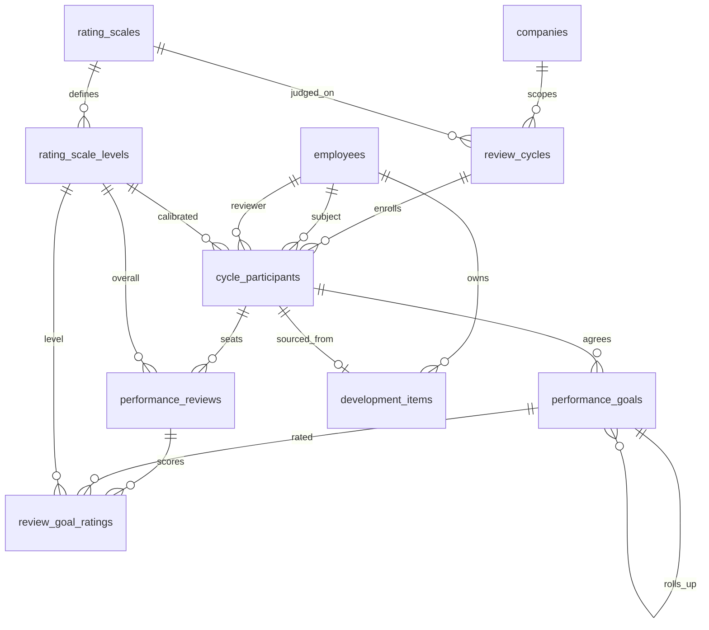
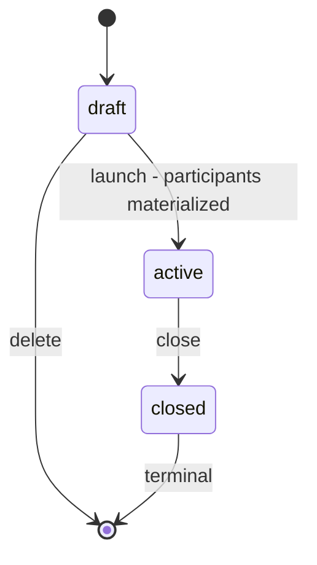
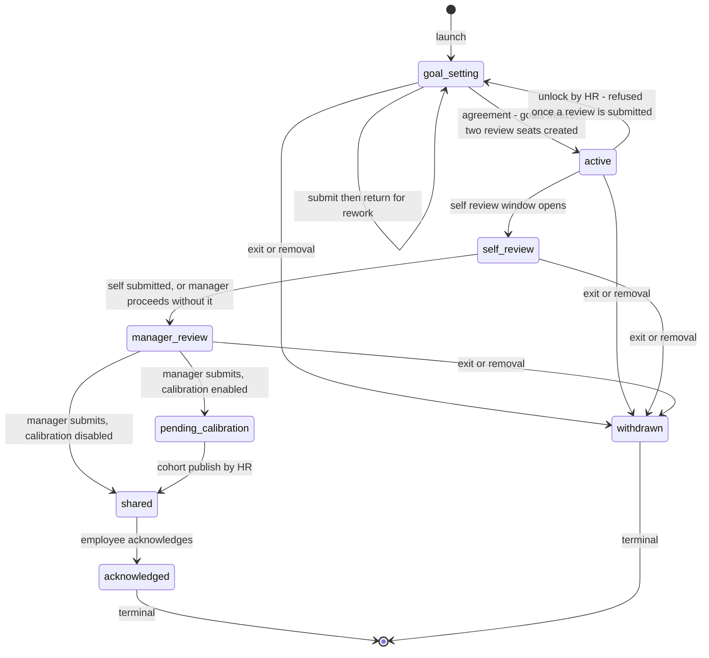
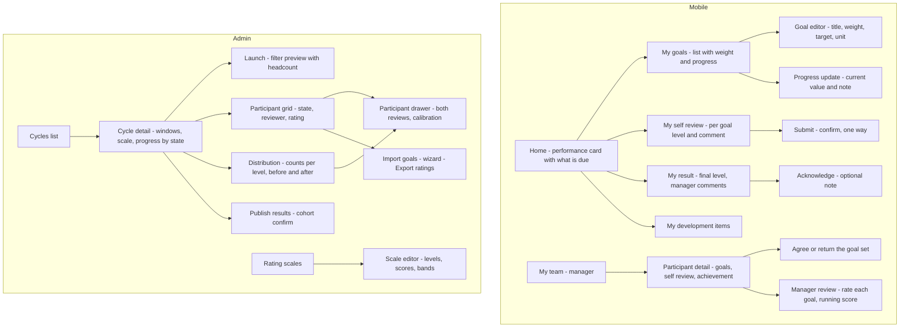

# Module: Performance & Goals

Status: Active (Phase 3) · Related ADRs: `ADR-0001` (module boundaries — §5 FK inventory, §6 read-model views), `ADR-0002` (tenant scoping), `ADR-0003` (online-only mobile writes), `ADR-0005` (data scope + module-resolved row visibility), `ADR-0006` (result pattern), `ADR-0007` (envelope), `ADR-0010` (jobs + outbox events), `ADR-0013` (Drizzle conventions), `ADR-0015` (goal import, rating exports), `ADR-0016` (encryption boundary — nothing here is encrypted, and §1 says why) · Deliberately **not** related: `ADR-0008` (no approval chains — §1, BR-PRF-019), `ADR-0009` and `ADR-0014` (no files, no generated document — A-064) · Depends on: `docs/06-modules/holiday.md` (template), `docs/06-modules/organization.md` (`OrgQueryPort`), `docs/06-modules/employee.md` (`employee_directory`), `docs/05-platform/import-export.md`, `docs/05-platform/notification.md`, `docs/05-platform/settings.md`, `docs/05-platform/audit-log.md` · Consumers: `docs/06-modules/reports.md`, `docs/06-modules/dashboard-analytics.md`, `docs/06-modules/training.md` (development items, its call — §13)

Namespace `performance` (naming §4, error prefix `PRF`). Review cycles, weighted goals that hold both a KPI and an OKR, symmetric self and manager reviews on a tenant-configured rating scale, calibration that adjusts without overwriting, cohort release, and development items that outlive the cycle that produced them. Inherits all global standards; deviations only.

## 1. Purpose & Scope

Four objects in the order a review moves through them. **The cycle** — a company-scoped period with a goal-setting window and a review window, holding the rating scale everyone in it will be judged on. **The participant** — one employee in one cycle, carrying the state machine, the pinned reviewer, and the calibrated outcome. **The goal** — what was agreed, weighted, one level of nesting deep. **The review** — one row per participant per side, self and manager, identical in shape. Rating scales are configuration; development items hang off the employee rather than the cycle, and that is the point of them.

**The cycle is the spine and nothing exists outside one.** No free-floating goals, no continuous OKR surface, no review without a cycle. The alternative — goals with their own dates, collected into a review by date overlap — recomputes the goal set every time it renders, so editing a goal's end date in December silently changes what was reviewed in November with nothing recording that it happened. Payroll pins its roster and attendance pins its schedule snapshot for the same reason: the thing being judged has to stop moving before judgment. A goal outside a cycle also has no reviewer, no scale, and no rating, which means more than half the rules below cannot be stated about it.

**Participation is a row, written once.** `cycle_participants` is materialized when HR launches the cycle from a filter, and it is where the state lives. Resolving membership live from a filter has nowhere to put "this person is at `manager_review`", so it becomes this design plus a filter that keeps disagreeing with it — and it silently moves the denominator, so completion reads 40/50 on Monday and 40/53 on Friday because three people were hired, not because any work was done.

**One goal table holds both models, because they differ in arity and not in kind.** A KPI is a top-level leaf carrying a measurement; an OKR objective is a top-level parent carrying none, whose achievement rolls up from its key results. Nesting is capped at one level by rule, a parent carries no `target_value` by CHECK, and weights balance to 100 among top-level goals and again within each parent's children. Three tables for objectives, key results, and KPIs would give a tenant that mixes them a rating assembled from two incompatible numbers.

**The rating is judgment weighted by goals, never arithmetic dressed as judgment.** The manager assigns each goal a level from the cycle's scale; `calculated_score` is the weighted mean of those level scores and it pre-fills the overall level. Disagreeing with the pre-fill is permitted and costs a required `override_reason`. Raw achievement — `current_value` against `target_value` — renders beside each goal and never enters the arithmetic. Computing the score from achievement instead forces three problems with no clean answer: lower-is-better goals invert the division, `binary` goals have no percentage at all, and a salesman at 300% of target drags a weighted mean into a band nobody intended. Rating a binary goal on a scale is natural; dividing by its target is not. "Hit 140% of target" is not "performed 1.4× as well", and the module refuses to pretend otherwise.

**Calibration adjusts beside, never over.** The manager's rating is immutable once submitted; `calibrated_rating_level_id` sits next to it with a required reason and an actor. The manager sees both. **The employee sees only the final level**, because showing someone "your manager said Exceeds and HR moved you to Meets" destroys exactly the relationship calibration exists to protect, and it sends the manager into a review meeting defending a number he did not give.

**There are no approval chains here, and that is a defect avoided rather than a feature declined.** The engine resolves approvers **at step activation** (BR-APRV-006), deliberately, so org changes between steps are honored. This module pins the reviewer at launch, deliberately, so an org change does not move an in-flight review. Register a chain and those two rules run against each other on the same participant: the engine hands goal approval to February's manager while the review form still belongs to January's. Two people, one participant, both correct according to their own document. The participant state machine is the routing, and unlike leave or expense it is **fixed, not configurable** — there is no threshold in a performance review for a chain to select on.

**Nothing here touches money.** A rating is an outcome and it stops there: no merit matrix, no recommended increase, no bonus factor, no port into payroll. This is the third consecutive module to draw the same line from a different side — asset records an acquisition cost it never charges (A-052), recruitment records an offered salary it never pays (A-059), performance records a rating it never converts (A-063). A merit matrix additionally needs salary bands, which A-058 declined three days ago precisely so nothing would grow to depend on them.

**Nothing in this module is ADR-0016 encrypted and nothing carries a file.** A goal is a sentence and a number, a review is prose and a level. Statutory identifiers, bank details, and health data live where they already live, encrypted there. No evidence attachments on goals, no appraisal PDF: ADR-0014 enumerates its consumers — payslips, 1721-A1, report exports, training certificates, asset handover documents — and an appraisal form is not among them. The employee's `acknowledged_at` against an immutable rating is better evidence than a scan of it (A-064).

**V1 exclusions:** **360 and peer review** — self and manager only, per spec §10 item 14; a peer seat is a new `kind` value and a new visibility model (A-062). **Competency and behavioral rating sections** — goals only; a competency framework is proficiency levels, a second scoring model, and a second thing to calibrate (A-061). **Cross-employee OKR cascade and org-level objectives** — `parent_goal_id` is constrained to the same participant (A-060). **Any path from a rating into pay** (A-063). **A generated appraisal document** (A-064). **A rating import** — goals import, outcomes do not (A-065). **Forced distribution** — the grid shows the bell is lopsided and nothing refuses the sixth Exceeds (BR-PRF-015). **Offline** (§10). Also excluded: goal template and KPI libraries, continuous feedback and 1:1 check-in notes, a probation-review *type* — a cycle with one participant is a probation review — nine-box grids and succession planning, engagement or pulse surveys, anonymous upward feedback, promotion and career-path tracking, and performance improvement plans as a tracked entity.

> ⚠️ VERIFY: confirm against current Indonesian regulation before implementation. — that a rating recorded here carries **no statutory weight on its own**. Termination on performance grounds follows the surat peringatan procedure — SP1, SP2, SP3 with their own intervals and delivery requirements — and this module issues none of them, links to none of them, and must not be presented to a tenant as a substitute. Confirm the current procedure and whether an appraisal record may be cited as supporting evidence within it before any UI implies that it can.

> ⚠️ VERIFY: confirm against current Indonesian regulation before implementation. — whether appraisal records fall under the employment-record exemption that permits retention for the duration of employment and beyond, or whether UU PDP 27/2022 imposes a limit that would require a purge job this module deliberately does not have (A-066). Recruitment answered the same question the other way for candidates, who are strangers; an appraisal is a personnel record about someone the employer employs.

## 2. Actors & Permissions

| Action | Permission key | Data scope | Employee | Manager | HR Admin | System Administrator |
|---|---|---|---|---|---|---|
| Read cycles | `performance.cycle.read` | company | — | ✅ | ✅ | ✅ |
| Create a cycle | `performance.cycle.create` | company | — | — | ✅ | ✅ |
| Launch, add participants, publish, close, unlock | `performance.cycle.update` | company | — | — | ✅ | ✅ |
| Delete a draft cycle | `performance.cycle.delete` | company | — | — | ✅ | ✅ |
| Configure rating scales | `performance.scale.configure` | tenant / company | — | — | ✅ | ✅ |
| Read participants and their ratings | `performance.participant.read` | self / team / company | ✅ own | ✅ team | ✅ | ✅ |
| Reassign a reviewer, withdraw a participant | `performance.participant.update` | company | — | — | ✅ | ✅ |
| Export ratings and goal progress | `performance.participant.export` | company | — | — | ✅ | ✅ |
| Create goals | `performance.goal.create` | self / team | ✅ own | ✅ team | ✅ | ✅ |
| Edit goals, update progress, agree or return a goal set | `performance.goal.update` | self / team | ✅ own | ✅ team | ✅ | ✅ |
| Delete a goal before agreement | `performance.goal.delete` | self / team | ✅ own | ✅ team | ✅ | ✅ |
| Import goals | `performance.goal.import` | company | — | — | ✅ | ✅ |
| Write and submit a review | `performance.review.create` **+ the seat** | own seat (two-gate) | ✅ self seat | ✅ manager seat | ✅ | — |
| Calibrate a rating | `performance.calibration.update` | company | — | — | ✅ | ✅ |
| Record a development item | `performance.development.create` | team / company | — | ✅ team | ✅ | ✅ |
| Update a development item | `performance.development.update` | self / team / company | ✅ own | ✅ team | ✅ | ✅ |

Sixteen rows, sixteen keys, every action drawn from the reserved set in naming §5 — **no new action words and no new URL verbs**. Four shapes are deliberate:

- **`performance.calibration.update` rather than a `calibrate` action.** Naming §5's action set already expresses it, and cluster F's action-extension clause exists to be avoided rather than exercised. The endpoint is a `PATCH` on a sub-resource for the same reason: minting a `calibrate` verb costs a registry entry to say what `PATCH .../calibration` already says.
- **`performance.review.create` is the module's only two-gate key**, on the recruitment scorecard precedent. Holding it is necessary and never sufficient — the seat is the second gate. It is the one key a plain Employee holds, because every employee writes a self review, and it is the reason `PRF_NOT_THE_REVIEWER` exists (§11).
- **Goal keys are scoped `self / team`, not `company`.** A manager holds them for his own reports through the row-visibility rule below; an HR Admin holds them at company scope. There is no world in which one employee edits another employee's goals without one of those two relationships.
- **`performance.cycle.update` covers launch, publish, close, and unlock** rather than splitting into four keys. All four are acts of cycle administration by the same person on the same screen; naming §5 splits an action only when a module needs the split, and no role here holds one without the others.

**Row visibility resolves in this module** (ADR-0005 §14). `self` is the caller's own participant rows. **`team` is the union of two clauses:** participants where the caller is the pinned `reviewer_employee_id`, **and** participants whose employee's live direct manager is the caller, resolved through `OrgQueryPort.directManagers` — which is cached with a 5-minute TTL and already on the hot path for attendance. One clause alone is wrong in each direction: reviewer-only means a manager who took the team over in February cannot read any of his reports' history, which is the first thing a new manager asks HR for; live-manager-only means a reviewer whom HR assigned *against* the org chart loses access to the review he is supposed to write. `company` and `tenant` see everything in scope.

**What the employee sees is narrower than what he owns.** Before `shared`, a participant reads his own goals, his own progress, and his own self review — nothing from the manager's side. After `shared` he additionally reads the manager's per-goal levels and comments and the **final** overall level. He never reads `calculated_score`, and never the pre-calibration rating (BR-PRF-017). Everything out of scope is 404 (existence hiding, `SYS_NOT_FOUND`).

## 3. Business Rules

| # | Rule |
|---|---|
| BR-PRF-001 | **The cycle is the container.** Every goal, review, rating, and calibration belongs to exactly one `review_cycles` row through its participant. A cycle is company-scoped and moves `draft → active → closed`; `closed` is terminal and freezes every row beneath it. Its window dates — goal-setting end, self-review window, manager-review window — drive reminders and an overdue flag and **gate nothing**, because a date that blocks a submission strands the employee who was on leave that week. |
| BR-PRF-002 | **Participation is pinned at launch.** Launching materializes one `cycle_participants` row per employee matched by the launch filter, unique on `(tenant_id, cycle_id, employee_id)`. Late joiners are added by an explicit act; re-running the launch is idempotent and skips those already present. **Overlapping cycles are permitted** — an employee may sit in an annual cycle and a probation cycle at once, which is how this module has probation reviews without a cycle type. |
| BR-PRF-003 | **The reviewer is pinned and never auto-refreshed.** `reviewer_employee_id` is seeded from `OrgQueryPort.directManagers` at launch and thereafter changes only by explicit reassignment. Launch proceeds with a null reviewer rather than refusing — three vacant manager seats must not block a five-hundred-person launch — those participants surface on an unassigned grid, and the transition into `manager_review` refuses while it is null (`PRF_NO_REVIEWER`). This deliberately departs from BR-APRV-006: a chain step asks who is authorized to decide right now; a review asks who watched this person work for twelve months. |
| BR-PRF-004 | **Nobody reviews himself.** `reviewer_employee_id <> employee_id` as a CHECK. A manager is also a participant with a reviewer of his own, and nothing else in the model stops the two roles landing on one row. |
| BR-PRF-005 | **Goals are one table, one level deep, one participant.** `parent_goal_id` is nullable and must point at a goal on the **same participant**; a goal with a parent may not itself be a parent; a parent carries no `target_value` and no `measurement_type`. The first two are use-case rules — depth needs a lookup a CHECK cannot do — the third is a CHECK. Together they make an OKR objective and a KPI the same row shape with different columns filled. |
| BR-PRF-006 | **Weights balance to exactly 100, and it blocks.** Top-level goals on a participant sum to `100.00`; each parent's children sum to `100.00` among themselves. Validated at goal submission and at import commit, never per row — a set mid-edit is legitimately unbalanced. `PRF_WEIGHT_NOT_BALANCED` carries the actual total. Unlike expense's advisory policy limits, a weight is an arithmetic input to the number this module exists to produce: weights summing to 85 yield a score silently 15% low on a document that gets cited in a termination. `numeric(5,2)` and never a float, so 33.33 + 33.33 + 33.34 is exactly 100. |
| BR-PRF-007 | **Goals freeze at agreement.** Once the participant leaves `goal_setting` the mutable surface is `current_value` and `progress_note`. Adding, removing, retitling, retargeting, or reweighting requires HR to **unlock** the participant back to `goal_setting` — audited, and refused once any review has been submitted (`PRF_GOALS_LOCKED`). The mid-year re-plan is legitimate; a target edited in December to match what happened is not, and by review time someone has written prose against the old numbers. |
| BR-PRF-008 | **A goal set is at least one goal.** Submission with none is `PRF_NO_GOALS`. A participant with no goals has nothing for a manager to rate and would arrive at `manager_review` with an empty form and a required overall level. |
| BR-PRF-009 | **Two review seats, created with the goal set, keyed by role.** Agreement inserts exactly two `performance_reviews` rows — `kind = 'self'` and `kind = 'manager'` — unique on `(tenant_id, participant_id, kind)`. `submitted_at IS NULL` means the seat exists and is unfilled, the same idiom as an interview scorecard. Submission is one-way (`PRF_REVIEW_SUBMITTED`); there is no unsubmit, only HR unlocking. Keyed by **kind and not by reviewer**, unlike `interview_scorecards`, because a panel is genuinely N people with no role distinction while this is two roles with one seat each — keying by reviewer would permit two different people to file a manager review. |
| BR-PRF-010 | **A missing self review never deadlocks the cycle.** The manager may submit his review with the self seat unfilled. Nothing is stamped, nothing is flagged, and no `skipped` column exists: the null `submitted_at` is the entire record. |
| BR-PRF-011 | **The manager rates every goal, and the score is the weighted mean of those levels.** `review_goal_ratings` carries one row per goal per manager review — the self review may rate as well and its numbers are never scored. `calculated_score = Σ(weight × level.score) / 100` over top-level goals, with a parent's own level taken from the weighted mean of its children's. Stored on the review at submission, not derived at read, because it is what calibration argues about and it must not move when a scale is later cloned. |
| BR-PRF-012 | **Achievement is displayed and never computed into the score.** `current_value` against `target_value` renders as a percentage or a done/not-done beside each goal, respecting `direction`. It informs the level the manager picks and enters no arithmetic — which is what dissolves lower-is-better inversion, `binary` goals with no percentage, and the 300%-of-target outlier in one move, with no achievement cap to configure and argue about. |
| BR-PRF-013 | **A scale in use is frozen; changing one means cloning it.** `rating_scales` and `rating_scale_levels` are tenant tables; a cycle FKs a scale, a rating FKs a level. Editing or deleting a scale referenced by any cycle past `draft` is `PRF_SCALE_IN_USE`. Without the freeze, renaming "Meets Expectations" to "Solid" silently rewrites what four hundred managers wrote last year. Provisioning seeds one 5-level scale per tenant so a cycle can launch out of the box, on the BR-APRV-003 precedent. |
| BR-PRF-014 | **Bands are validated as a set at activation.** Level `rank` values are contiguous from 1, `min_score`/`max_score` do not overlap and cover the full range with no gap, and `score` ascends with `rank`. A row-level CHECK cannot see its siblings, so this is a use-case rule raising `VAL_VALIDATION_FAILED` naming the offending level. The bands exist only to pre-fill the overall level from `calculated_score`. |
| BR-PRF-015 | **Calibration writes beside the rating, never over it.** `calibrated_rating_level_id`, `calibration_reason` — required, 10–2000 — `calibrated_by`, `calibrated_at`. The manager's `overall_rating_level_id` is immutable from submission onward. The distribution grid reports counts per level before and after, sliced by department and branch, and **enforces nothing**: no forced ranking, no quota, no refusal of the sixth Exceeds. A system that blocks a rating is a system HR runs in a spreadsheet instead. |
| BR-PRF-016 | **Results are released as a cohort, by HR, at cycle level.** `POST /review-cycles/{id}/publish` moves every participant in `pending_calibration` or `manager_review` to `shared` in one transaction and stamps `results_released_at` on the cycle. Per-manager release staggers over days, so employees compare notes while half of them are looking at an empty screen — and an early release leaks which ratings calibration did not touch. |
| BR-PRF-017 | **The employee's view is the final rating and nothing behind it.** After `shared`: goals, own self review, the manager's per-goal levels and comments, and `COALESCE(calibrated_rating_level_id, overall_rating_level_id)`. Never `calculated_score`, never both ratings. The score is advisory by BR-PRF-011, and handing the subject a number the module has already declared non-binding turns every appraisal meeting into a debate about weights instead of about work. |
| BR-PRF-018 | **Development items are keyed by employee and sourced from a participant.** `employee_id` is the key; `source_participant_id` is nullable provenance. That is what makes "carried forward" true: next year's goal-setting screen opens with last year's `open` items on it, which a participant-keyed row could never do since a participant is per-cycle by construction. Nothing nags — status changes are manual. |
| BR-PRF-019 | **No approval chains, no money, no files, no generated document.** Zero request types registered with the engine, zero `APRV_` codes, zero `PdfService` consumers, zero `files` references, and no port or event carrying a rating toward payroll. Each has its own reason in §1; together they are why this module's dependency list is four platform docs and two modules. |
| BR-PRF-020 | **Audit and offline.** All eight tables are channel-1 audited with full diffs — reviews and calibrations especially, since an immutable rating is only as immutable as the trail proving it. **Online-only on mobile**: no Drift mirror for any entity, no queued ops, no `op_id`, no conflict policy, no replay lane (§10). |

## 4. Domain Model



### 4.1 Schema

```ts
// src/database/schema/performance.ts
// No `files` reference and no encrypted column anywhere in this file — §1.

export const cycleStatus = pgEnum('cycle_status', [
  'draft', 'active', 'closed',                                   // BR-PRF-001
]);
export const participantStatus = pgEnum('participant_status', [
  'goal_setting', 'active', 'self_review', 'manager_review',
  'pending_calibration', 'shared', 'acknowledged', 'withdrawn',  // BR-PRF-016, one axis
]);
export const goalMeasurementType = pgEnum('goal_measurement_type', [
  'number', 'percentage', 'currency', 'binary',                  // null on a parent — BR-PRF-005
]);
export const goalDirection = pgEnum('goal_direction', [
  'higher_is_better', 'lower_is_better',                         // display only — BR-PRF-012
]);
export const reviewKind = pgEnum('review_kind', ['self', 'manager']);
export const developmentItemStatus = pgEnum('development_item_status', [
  'open', 'in_progress', 'done', 'dropped',
]);

export const ratingScales = pgTable('rating_scales', {
  ...id, ...tenantId,
  companyId: uuid('company_id').references(() => companies.id),   // null = tenant-wide
  name: text('name').notNull(),
  description: text('description'),
  isActive: boolean('is_active').notNull().default(true),
  ...auditColumns, ...softDeleteColumns,
}, (t) => [
  uniqueIndex('uq_rating_scales_tenant_id_company_id_name')
    .on(t.tenantId, t.companyId, t.name).where(sql`deleted_at IS NULL`),
]);

export const ratingScaleLevels = pgTable('rating_scale_levels', {
  ...id, ...tenantId,
  scaleId: uuid('scale_id').notNull().references(() => ratingScales.id),
  rank: integer('rank').notNull(),                                // 1 = lowest, contiguous
  label: text('label').notNull(),                                 // "Meets Expectations"
  description: text('description'),
  score: numeric('score', { precision: 5, scale: 2 }).notNull(),   // the weighted-mean input
  minScore: numeric('min_score', { precision: 5, scale: 2 }).notNull(),  // BR-PRF-014 band
  maxScore: numeric('max_score', { precision: 5, scale: 2 }).notNull(),
  ...auditColumns, ...softDeleteColumns,
}, (t) => [
  uniqueIndex('uq_rating_scale_levels_scale_id_rank')
    .on(t.tenantId, t.scaleId, t.rank).where(sql`deleted_at IS NULL`),
]);

export const reviewCycles = pgTable('review_cycles', {
  ...id, ...tenantId,
  companyId: uuid('company_id').notNull().references(() => companies.id),
  scaleId: uuid('scale_id').notNull().references(() => ratingScales.id),   // BR-PRF-013 frozen once active
  name: text('name').notNull(),                                   // "FY2026 Annual Review"
  periodStart: date('period_start').notNull(),                    // what the review is about
  periodEnd: date('period_end').notNull(),
  goalSettingEndsOn: date('goal_setting_ends_on').notNull(),      // reminder windows, BR-PRF-001
  selfReviewEndsOn: date('self_review_ends_on').notNull(),
  managerReviewEndsOn: date('manager_review_ends_on').notNull(),
  calibrationEnabled: boolean('calibration_enabled').notNull().default(true),
  status: cycleStatus('status').notNull().default('draft'),
  launchedAt: timestamp('launched_at', { withTimezone: true }),
  resultsReleasedAt: timestamp('results_released_at', { withTimezone: true }),   // BR-PRF-016
  closedAt: timestamp('closed_at', { withTimezone: true }),
  ...auditColumns, ...softDeleteColumns,
}, (t) => [
  uniqueIndex('uq_review_cycles_tenant_id_company_id_name')
    .on(t.tenantId, t.companyId, t.name).where(sql`deleted_at IS NULL`),
  index('idx_review_cycles_tenant_id_company_id_status').on(t.tenantId, t.companyId, t.status),
]);

export const cycleParticipants = pgTable('cycle_participants', {
  ...id, ...tenantId,
  cycleId: uuid('cycle_id').notNull().references(() => reviewCycles.id),
  employeeId: uuid('employee_id').notNull().references(() => employees.id),          // ADR-0001 §5
  reviewerEmployeeId: uuid('reviewer_employee_id').references(() => employees.id),    // ADR-0001 §5, BR-PRF-003
  status: participantStatus('status').notNull().default('goal_setting'),
  goalsSubmittedAt: timestamp('goals_submitted_at', { withTimezone: true }),  // null = not yet handed over
  goalsAgreedAt: timestamp('goals_agreed_at', { withTimezone: true }),        // the freeze point, BR-PRF-007
  calibratedRatingLevelId: uuid('calibrated_rating_level_id')
    .references(() => ratingScaleLevels.id),                      // BR-PRF-015 — beside, never over
  calibrationReason: text('calibration_reason'),
  calibratedBy: uuid('calibrated_by').references(() => users.id),
  calibratedAt: timestamp('calibrated_at', { withTimezone: true }),
  sharedAt: timestamp('shared_at', { withTimezone: true }),
  acknowledgedAt: timestamp('acknowledged_at', { withTimezone: true }),
  acknowledgementNote: text('acknowledgement_note'),              // the employee's own words, optional
  withdrawalReason: text('withdrawal_reason'),
  ...auditColumns, ...softDeleteColumns,
}, (t) => [
  uniqueIndex('uq_cycle_participants_cycle_id_employee_id')       // BR-PRF-002
    .on(t.tenantId, t.cycleId, t.employeeId).where(sql`deleted_at IS NULL`),
  index('idx_cycle_participants_tenant_id_reviewer')              // the manager's queue
    .on(t.tenantId, t.reviewerEmployeeId, t.status),
  index('idx_cycle_participants_tenant_id_employee_id').on(t.tenantId, t.employeeId),
  index('idx_cycle_participants_tenant_id_cycle_id_status').on(t.tenantId, t.cycleId, t.status),
]);

export const performanceGoals = pgTable('performance_goals', {
  ...id, ...tenantId,
  participantId: uuid('participant_id').notNull().references(() => cycleParticipants.id),
  parentGoalId: uuid('parent_goal_id').references(() => performanceGoals.id),   // BR-PRF-005, same participant
  title: text('title').notNull(),
  description: text('description'),
  weight: numeric('weight', { precision: 5, scale: 2 }).notNull(),              // BR-PRF-006
  measurementType: goalMeasurementType('measurement_type'),       // null on a parent
  direction: goalDirection('direction').notNull().default('higher_is_better'),
  targetValue: numeric('target_value', { precision: 15, scale: 2 }),            // null on a parent
  startValue: numeric('start_value', { precision: 15, scale: 2 }),
  currentValue: numeric('current_value', { precision: 15, scale: 2 }),
  unit: text('unit'),                                             // "units", "IDR", "%", free text
  progressNote: text('progress_note'),
  progressUpdatedAt: timestamp('progress_updated_at', { withTimezone: true }),
  sortOrder: integer('sort_order').notNull().default(0),
  ...auditColumns, ...softDeleteColumns,
}, (t) => [
  index('idx_performance_goals_tenant_id_participant_id').on(t.tenantId, t.participantId),
  index('idx_performance_goals_tenant_id_parent_goal_id').on(t.tenantId, t.parentGoalId),
]);

export const performanceReviews = pgTable('performance_reviews', {
  ...id, ...tenantId,
  participantId: uuid('participant_id').notNull().references(() => cycleParticipants.id),
  kind: reviewKind('kind').notNull(),                             // BR-PRF-009 — the seat key
  reviewerEmployeeId: uuid('reviewer_employee_id')
    .notNull().references(() => employees.id),                    // ADR-0001 §5; = employee on the self seat
  overallComment: text('overall_comment'),
  overallRatingLevelId: uuid('overall_rating_level_id').references(() => ratingScaleLevels.id),
  calculatedScore: numeric('calculated_score', { precision: 5, scale: 2 }),      // BR-PRF-011, stored at submit
  overrideReason: text('override_reason'),                        // required when the level leaves its band
  submittedAt: timestamp('submitted_at', { withTimezone: true }), // null = the seat, unfilled
  ...auditColumns, ...softDeleteColumns,
}, (t) => [
  uniqueIndex('uq_performance_reviews_participant_id_kind')       // BR-PRF-009
    .on(t.tenantId, t.participantId, t.kind).where(sql`deleted_at IS NULL`),
  index('idx_performance_reviews_tenant_id_reviewer_pending')     // "reviews waiting on me"
    .on(t.tenantId, t.reviewerEmployeeId).where(sql`submitted_at IS NULL`),
]);

export const reviewGoalRatings = pgTable('review_goal_ratings', {
  ...id, ...tenantId,
  reviewId: uuid('review_id').notNull().references(() => performanceReviews.id),
  goalId: uuid('goal_id').notNull().references(() => performanceGoals.id),
  ratingLevelId: uuid('rating_level_id').notNull().references(() => ratingScaleLevels.id),
  comment: text('comment'),
  ...auditColumns, ...softDeleteColumns,
}, (t) => [
  uniqueIndex('uq_review_goal_ratings_review_id_goal_id')
    .on(t.tenantId, t.reviewId, t.goalId).where(sql`deleted_at IS NULL`),
]);

export const developmentItems = pgTable('development_items', {
  ...id, ...tenantId,
  employeeId: uuid('employee_id').notNull().references(() => employees.id),      // ADR-0001 §5 — the key
  sourceParticipantId: uuid('source_participant_id')
    .references(() => cycleParticipants.id),                      // BR-PRF-018 — provenance, nullable
  title: text('title').notNull(),
  description: text('description'),
  targetDate: date('target_date'),
  status: developmentItemStatus('status').notNull().default('open'),
  completedOn: date('completed_on'),
  ...auditColumns, ...softDeleteColumns,
}, (t) => [
  index('idx_development_items_tenant_id_employee_id_status')     // "my open items", across cycles
    .on(t.tenantId, t.employeeId, t.status),
]);
```

Hand-written CHECK constraints (database-conventions §2.4):

- `ck_review_cycles_windows` — `period_end >= period_start AND goal_setting_ends_on <= self_review_ends_on AND self_review_ends_on <= manager_review_ends_on` (BR-PRF-001). Ordering only; no window is compared against the period, because a review window legitimately falls after the period it reviews.
- `ck_cycle_participants_reviewer` — `reviewer_employee_id IS NULL OR reviewer_employee_id <> employee_id` (BR-PRF-004).
- `ck_cycle_participants_calibration` — `(calibrated_rating_level_id IS NOT NULL) = (calibrated_at IS NOT NULL AND calibrated_by IS NOT NULL AND calibration_reason IS NOT NULL)` (BR-PRF-015). A calibration without a reason and an actor is exactly the edit this module refuses to allow.
- `ck_cycle_participants_withdrawn` — `(status = 'withdrawn') = (withdrawal_reason IS NOT NULL)`.
- `ck_performance_goals_weight` — `weight > 0 AND weight <= 100` (BR-PRF-006). The set-level sum is a use-case rule; a row-level CHECK cannot see its siblings.
- `ck_performance_goals_measurement` — `(measurement_type IS NULL) = (target_value IS NULL)` (BR-PRF-005). A goal never carries a target without a measurement type, nor a type without a target. **This is the only half of BR-PRF-005 a CHECK can hold**, and saying so is the point: "a parent carries no measurement" and "a child may not itself be a parent" both require looking at *other rows*, which a row-level CHECK cannot do. They are use-case rules validated on write and asserted in §14, and the constraint here is what stops the halves of a measurement drifting apart underneath them.
- `ck_rating_scale_levels_band` — `rank >= 1 AND score >= 0 AND max_score >= min_score` (BR-PRF-014). Contiguity and non-overlap across levels are the use-case rule.
- `ck_performance_reviews_submitted` — `submitted_at IS NULL OR (overall_rating_level_id IS NOT NULL AND (kind = 'self' OR calculated_score IS NOT NULL))` (BR-PRF-011). Unsubmitted seats are unconstrained, a submitted review of either kind always carries an overall level, and a submitted **manager** review additionally carries the score. A self review has none, because BR-PRF-011 does not score a self-assessment.
- `ck_development_items_completed` — `(status = 'done') = (completed_on IS NOT NULL)`.

### 4.2 Lifecycles

Cycle:



Participant — one axis, eight states, transitions are acts and never dates:



`pending_calibration` is a gate and not bookkeeping: without it a manager shares "Exceeds" on Tuesday and HR calibrates to "Meets" on Thursday, which is the wound BR-PRF-015's design exists to prevent. When `calibration_enabled` is false the transition goes straight to `shared` — one boolean read once, not the conditional step skipping approval-engine excluded.

Goal set — a sub-state of `goal_setting` expressed by two timestamps rather than two more enum values, on the interview-scorecard precedent where a null `submitted_at` *is* the seat:

| `goals_submitted_at` | `goals_agreed_at` | Meaning |
|---|---|---|
| null | null | The employee is still drafting |
| set | null | Handed to the manager, awaiting agreement — the manager's action queue |
| null | null, after a return | Sent back for rework; the stamp is cleared and the reason lands in the notification |
| set | set | Frozen. Participant is `active` and only progress moves |

### 4.3 Ports served

**One, added 2026-08-03 when its first caller arrived.**

```ts
interface DevelopmentItemPort {
  // that employee's live items only — `open` and `in_progress`, never `done` or `dropped`
  openItemsFor(employeeId: string): Promise<{ id: string; title: string; targetDate: string | null }[]>;
}
```

`docs/06-modules/training.md` consumes it for the development-item picker on its enrollment request form, and declares the matching nullable FK `training_enrollments.development_item_id` in its own §4.1 outbound inventory (ADR-0001 §5). Storing an id whose label the caller cannot render would be a foreign key to nowhere, which is why the FK and the port arrive together.

The port returns **titles only, and only live items**. It carries no `description`, no status, and no source cycle: a picker needs a label, and the rest of a development item is this module's business. Nothing else is served — this section said "none" until a real caller existed, which is the same discipline employee.md applied to `EmployeeHirePort` and leave.md to `LeaveBalancePort`.

### 4.4 Ports and reads consumed

| Channel | Used for | Authority |
|---|---|---|
| `OrgQueryPort.directManagers` (organization §4.3) | seeding `reviewer_employee_id` at launch, and the live-manager clause of `team` visibility | ADR-0001 §2 exported port |
| `OrgQueryPort.placements` (batch) | department and branch on every participant grid, and the launch filter's slicing | ADR-0001 §2 exported port |
| `employee_directory` (view, employee.md §13) | employee and reviewer `full_name` + `employee_number` on every grid, and the `q=` search over them | ADR-0001 §6 as amended 2026-08-03. Same reason attendance, leave, overtime, expense, asset, and recruitment all point here: a filter or sort on a name has to run **before** the page boundary, and a port returns rows after it |

The launch filter reads `employees` for status and hire date **through `employee_directory`**, which carries both — this module never touches the base table, and it needs nothing the view withholds.

### 4.5 The score, worked

A participant with three top-level goals on a 5-level scale where `Exceeds = 4.00`, `Meets = 3.00`, `Below = 2.00`:

| Goal | Weight | Manager's level | Level score | Contribution |
|---|---|---|---|---|
| Revenue — target 2,000,000,000, actual 2,800,000,000 | 50.00 | Exceeds | 4.00 | 2.000 |
| Defect rate — target 2%, actual 1.4%, `lower_is_better` | 30.00 | Exceeds | 4.00 | 1.200 |
| Launch the partner portal — `binary`, delivered | 20.00 | Meets | 3.00 | 0.600 |

`calculated_score = 3.80`, which falls in the `Exceeds` band, so the overall level pre-fills as `Exceeds` and the manager accepts it with no `override_reason`.

The same three rows under an achievement-driven model give 140%, 143% — after someone decides that beating a lower-is-better target *inverts* the ratio — and no number at all for the third, which is exactly the arithmetic BR-PRF-012 refuses to perform. Note also that the manager rated a 140% revenue result and a 143% defect result at the same level: that is a judgment about difficulty, and it is the whole reason the level exists between the measurement and the score.

## 5. Use Cases

**UC-PRF-001 — Configure a rating scale.** HR Admin creates or clones a scale with its full level set in one payload. Validation runs across the set (BR-PRF-014). Editing a scale referenced by a non-draft cycle → `PRF_SCALE_IN_USE`, and the UI offers "duplicate and edit" as the action instead of the error. Postcondition: a scale a cycle can be created against.

**UC-PRF-002 — Create and launch a cycle.** HR Admin creates the cycle in `draft` with its scale and four windows, then launches with a filter — company plus optional branch, department, employment type, and a hire-date cutoff. Launch materializes one participant per matched employee, seeds each reviewer through `OrgQueryPort.directManagers`, moves the cycle to `active`, and sends `performance.cycle_launched`. Alternate: employees already present are skipped, so re-running is idempotent and is also how late joiners are added. Exception: a filter matching nobody is refused with `VAL_VALIDATION_FAILED` rather than creating an empty active cycle. Postcondition: N participants in `goal_setting`, some with a null reviewer, listed on the unassigned grid.

**UC-PRF-003 — Set and submit goals.** The employee — or his manager on his behalf — adds goals, nests key results under an objective, and sets weights. Submit validates at least one goal (`PRF_NO_GOALS`) and the balance (`PRF_WEIGHT_NOT_BALANCED`, carrying the actual total), stamps `goals_submitted_at`, and notifies the reviewer. Exception: no reviewer pinned → the submission still succeeds and the notification is skipped, because the goal set is not the manager's to hold hostage.

**UC-PRF-004 — Agree or return a goal set.** The reviewer opens the submitted set. **Agreement** stamps `goals_agreed_at`, moves the participant to `active`, and inserts the two review seats in the same transaction. **Return** clears `goals_submitted_at` and carries a mandatory comment into the notification. Exception: agreeing an unbalanced set is impossible — the balance was checked at submission and goals are unwritable between the two acts by anyone but HR through UC-PRF-006.

**UC-PRF-005 — Update progress.** Owner or reviewer writes `current_value` and `progress_note` on a leaf goal at any time while the participant is `active` or later and the cycle is `active`. Parent goals reject a progress write (BR-PRF-005). This is the only mutation permitted on a frozen goal set.

**UC-PRF-006 — Unlock a goal set.** HR Admin returns a participant from `active` to `goal_setting` for a mid-year re-plan. Refused once any review carries `submitted_at` (`PRF_GOALS_LOCKED`). The two review seats survive the round trip — they are keyed by participant and kind, and re-agreement finds them already there.

**UC-PRF-007 — Write and submit the self review.** The participant rates each goal, writes per-goal comments and an overall comment, and picks an overall level. Draft saves are `PATCH`; submit stamps `submitted_at` and is one-way. No `calculated_score` is written on a self seat. Exception: a second submit → `PRF_REVIEW_SUBMITTED`.

**UC-PRF-008 — Write and submit the manager review.** The reviewer sees the goals, the achievement figures, and — once submitted — the self review side by side. He rates every goal; the client shows the running `calculated_score` and the level its band implies. Submit requires a rating on every top-level goal and on every child of a rated parent, computes and stores `calculated_score`, and requires `override_reason` when `overall_rating_level_id` falls outside the band. It then moves the participant to `pending_calibration`, or to `shared` when the cycle has calibration disabled. Exceptions: null reviewer → `PRF_NO_REVIEWER`; someone other than the seat holder → `PRF_NOT_THE_REVIEWER` 403; the self seat unsubmitted → permitted (BR-PRF-010).

**UC-PRF-009 — Calibrate.** HR Admin opens the distribution grid for a cycle, filters by department or branch, and adjusts individual participants with a required reason. The manager's rating is untouched. Idempotent: re-calibrating overwrites the calibration columns and appends a new audit diff, which is the trail of the second thought.

**UC-PRF-010 — Publish results.** HR Admin releases the cycle. Every participant in `pending_calibration` or `manager_review` moves to `shared` with `shared_at` stamped, `results_released_at` lands on the cycle, and `performance.result_shared` fans out. Alternate: participants still in `goal_setting`, `active`, or `self_review` are left where they are and reported in the response — they never had a manager review to share. Idempotent: a second publish moves whatever has since arrived.

**UC-PRF-011 — Acknowledge.** The participant opens the shared result and acknowledges, optionally with a note. Before `shared` → `PRF_RESULT_NOT_SHARED`. A second acknowledgement is a no-op returning 200 — the first stamp stands, because acknowledging twice is not a new fact.

**UC-PRF-012 — Record and track a development item.** The reviewer creates items during the review, or HR at any time; the employee updates status and adds notes. Items are listed by employee across all cycles, and the goal-setting screen opens with the `open` ones from prior cycles visible. Deleting is a soft delete and is permitted while `open`.

**UC-PRF-013 — Import goals.** HR Admin uploads a goal spreadsheet for a launched cycle. Dry run reports per-row errors and per-employee balance failures; commit is **partial at employee granularity** — a set that does not sum to 100 rejects that employee entirely while the rest commit (BR-PRF-006). Rows for participants past `goal_setting` are refused with `PRF_GOALS_LOCKED` against that employee.

**UC-PRF-014 — Window reminders.** `cron.performance.window-reminders` scans active cycles per tenant and sends inside `performance.reminder_lead_days` of each window: `self_review_due` to participants who have not submitted, `manager_review_due` to reviewers with unsubmitted seats, and a nudge on unacknowledged shared results. Idempotent — one send per recipient per template per day, which the notification layer dedupes.

**UC-PRF-015 — Reassign a reviewer or withdraw a participant.** Both are `PATCH` on the participant by HR. Reassignment repoints `reviewer_employee_id` and moves the unsubmitted manager seat's `reviewer_employee_id` with it; a submitted seat keeps its original author forever. Withdrawal requires a reason, is terminal, and preserves every rating and review row already written.

## 6. UI Flow



Screen inventory — mobile: home card, my goals with the editor and the progress sheet, self review, my result, acknowledge, my development items, and the manager's team list with participant detail, goal-set agreement, and the review form. Admin: cycles list and detail, launch filter, participant grid, participant drawer, distribution, scale list and editor, import wizard.

**The manager's review form is the module's signature screen and it is built around one comparison.** Each goal renders as a row carrying the target, the actual, the achievement in words — "2.8B against a 2.0B target · 140%" — the self level if the self seat is submitted, and the manager's level selector. The running `calculated_score` and the level its band implies sit pinned at the bottom and update on every selection, so the manager sees the arithmetic move before he chooses the overall level rather than discovering it after. When his overall choice leaves the band, the `override_reason` field opens inline with the gap stated plainly — "the score suggests Meets; you chose Exceeds" — because that sentence is the one calibration will read next.

**The launch filter previews before it commits.** Choosing company, branch, department, and hire-date cutoff renders the matched headcount and the count with no resolvable manager, and launch is a two-step confirm. Materializing four hundred participants is the least reversible act in the module.

**Employee-facing screens never render `calculated_score` or the manager's pre-calibration level** (BR-PRF-017), and this is enforced at the API rather than by hiding a field the payload contains.

States: **empty** — no scales configured renders "Add a rating scale" for HR and blocks cycle creation with a message naming that screen, not a validation error; a cycle with no participants renders the launch prompt; an employee with no active cycle renders "No review cycle is open for you right now" rather than an empty goal list. **Loading** — table skeletons on grids, per-panel skeletons in the participant drawer so the distribution never waits on review text. **Error** — `PRF_WEIGHT_NOT_BALANCED` renders on the weight column header with the running total and the gap; `PRF_GOALS_LOCKED` and `PRF_RESULT_NOT_SHARED` render as panels, because no field caused them; `PRF_SCALE_IN_USE` renders with "duplicate this scale" as the primary action, since that is the actual next step. Field > panel > toast, per coding-standards-nextjs.

## 7. API

All endpoints follow the canonical spec-block form (api-standards §13). No new pagination-registry rows — every grid is the seeded transactional-grid family (offset). Exports and imports ride import-export §7 rather than endpoints here. Errors beyond the implied set only.

| Endpoint | Permission | Pagination | Queue-reachable | Idempotency |
|---|---|---|---|---|
| `GET /api/v1/rating-scales` | `performance.scale.configure` | — (bounded) | no | — |
| `GET /api/v1/rating-scales/{id}` | `performance.scale.configure` | — | no | — |
| `POST /api/v1/rating-scales` | `performance.scale.configure` | — | no | accepted |
| `PATCH /api/v1/rating-scales/{id}` | `performance.scale.configure` | — | no | accepted |
| `DELETE /api/v1/rating-scales/{id}` | `performance.scale.configure` | — | no | — |
| `GET /api/v1/review-cycles` | `performance.cycle.read` | offset | no | — |
| `GET /api/v1/review-cycles/{id}` | `performance.cycle.read` | — | no | — |
| `POST /api/v1/review-cycles` | `performance.cycle.create` | — | no | accepted |
| `PATCH /api/v1/review-cycles/{id}` | `performance.cycle.update` | — | no | accepted |
| `DELETE /api/v1/review-cycles/{id}` | `performance.cycle.delete` | — | no | — |
| `POST /api/v1/review-cycles/{id}/participants` | `performance.cycle.update` | — | no | accepted |
| `POST /api/v1/review-cycles/{id}/publish` | `performance.cycle.update` | — | no | accepted |
| `POST /api/v1/review-cycles/{id}/close` | `performance.cycle.update` | — | no | accepted |
| `GET /api/v1/review-cycles/{id}/distribution` | `performance.participant.read` | — (bounded) | no | — |
| `GET /api/v1/performance-participants` | `performance.participant.read` | offset | no | — |
| `GET /api/v1/performance-participants/{id}` | `performance.participant.read` | — | no | — |
| `PATCH /api/v1/performance-participants/{id}` | `performance.participant.update` | — | no | accepted |
| `POST /api/v1/performance-participants/{id}/submit` | `performance.goal.update` | — | no | accepted |
| `POST /api/v1/performance-participants/{id}/agreement` | `performance.goal.update` | — | no | accepted |
| `POST /api/v1/performance-participants/{id}/return` | `performance.goal.update` | — | no | accepted |
| `POST /api/v1/performance-participants/{id}/unlock` | `performance.cycle.update` | — | no | accepted |
| `POST /api/v1/performance-participants/{id}/acknowledge` | `performance.participant.read` / own row | — | no | accepted |
| `PATCH /api/v1/performance-participants/{id}/calibration` | `performance.calibration.update` | — | no | accepted |
| `GET /api/v1/performance-goals` | `performance.participant.read` | offset | no | — |
| `POST /api/v1/performance-goals` | `performance.goal.create` | — | no | accepted |
| `PATCH /api/v1/performance-goals/{id}` | `performance.goal.update` | — | no | accepted |
| `DELETE /api/v1/performance-goals/{id}` | `performance.goal.delete` | — | no | — |
| `GET /api/v1/performance-reviews` | `performance.participant.read` / own seat | offset | no | — |
| `GET /api/v1/performance-reviews/{id}` | `performance.participant.read` / own seat | — | no | — |
| `PATCH /api/v1/performance-reviews/{id}` | `performance.review.create` + seat | — | no | accepted |
| `POST /api/v1/performance-reviews/{id}/submit` | `performance.review.create` + seat | — | no | accepted |
| `GET /api/v1/development-items` | `performance.participant.read` | offset | no | — |
| `POST /api/v1/development-items` | `performance.development.create` | — | no | accepted |
| `PATCH /api/v1/development-items/{id}` | `performance.development.update` | — | no | accepted |
| `DELETE /api/v1/development-items/{id}` | `performance.development.update` | — | no | — |

**No new URL verbs.** `submit`, `return`, `unlock`, `acknowledge`, `publish`, and `close` are all in the naming §3 reserved set. Goal-set agreement, participant materialization, and calibration use the **sub-resource shape** — `POST /{id}/agreement`, `POST /{id}/participants`, `PATCH /{id}/calibration` — rather than minting `agree`, `launch`, and `calibrate`, on the precedent asset set with `retirement`, expense with `payments`, and recruitment with `response` and `employee`. **No endpoint is queue-reachable**: there is no offline write class (§10).

#### POST /api/v1/rating-scales · PATCH /{id} · DELETE /{id}

| Field | Type | Required | Rule |
|---|---|---|---|
| `companyId` | uuid | — | null = tenant-wide; in the caller's assignment scope when set |
| `name` | string | ✅ | 2–100, unique per tenant and company |
| `description` | string | — | ≤ 500 |
| `levels[]` | array | ✅ | 2–10 entries, written as a whole set |
| `levels[].rank` | integer | ✅ | contiguous from 1, ascending |
| `levels[].label` | string | ✅ | 1–50 |
| `levels[].score` | decimal string | ✅ | ≥ 0, two decimals, ascending with `rank` |
| `levels[].minScore` / `maxScore` | decimal string | ✅ | contiguous, non-overlapping, covering the full range |

Response 201 / 200: the scale with its levels ordered by rank. The level set is written whole rather than through per-level endpoints because BR-PRF-014's validation is a property of the set. Errors: `PRF_SCALE_IN_USE` on any edit or delete once a non-draft cycle references it, with `details: { cycleIds }` · band gaps, overlaps, or a non-ascending score → `VAL_VALIDATION_FAILED` naming the level rank.

#### POST /api/v1/review-cycles · PATCH /{id}

| Field | Type | Required | Rule |
|---|---|---|---|
| `companyId` | uuid | ✅ | in the caller's assignment scope; **immutable on PATCH** |
| `scaleId` | uuid | ✅ | active scale, tenant-wide or this company's; **immutable once `active`** |
| `name` | string | ✅ | 2–150, unique per company |
| `periodStart` / `periodEnd` | date | ✅ | end on or after start |
| `goalSettingEndsOn` | date | ✅ | ≤ `selfReviewEndsOn` |
| `selfReviewEndsOn` | date | ✅ | ≤ `managerReviewEndsOn` |
| `managerReviewEndsOn` | date | ✅ | — |
| `calibrationEnabled` | boolean | — | default true; **immutable once `active`** |

Response 201 / 200: the cycle with participant counts by state. `PATCH` on `draft` is free; on `active` only `name` and the three window dates move, because the scale and the calibration flag are what everyone under the cycle is already being judged by. `status`, `launchedAt`, and `resultsReleasedAt` are rejected as unknown fields (api-standards §3). `DELETE` is a soft delete permitted on `draft` only.

#### POST /api/v1/review-cycles/{id}/participants
Request: `{ filter: { branchIds?, departmentIds?, employmentTypes?, hiredOnOrBefore? }, employeeIds?, dryRun? }`. Either a filter or an explicit id list. `dryRun: true` returns the counts without writing — the screen's preview. Live: inserts participants, seeds reviewers, sets the cycle `active` on the first call, and sends `performance.cycle_launched`. Response 200: `{ created, skipped, withoutReviewer, participants: [...] }` — `skipped` is the already-present set, which is what makes re-running safe. Errors: a filter matching nobody → `VAL_VALIDATION_FAILED` · `PRF_CYCLE_NOT_ACTIVE` on a `closed` cycle.

#### POST /api/v1/review-cycles/{id}/publish · POST /{id}/close
`publish`: no body. Moves every participant in `pending_calibration` or `manager_review` to `shared`, stamps `shared_at` per row and `results_released_at` on the cycle, fans out `performance.result_shared`. Response 200: `{ shared, skipped: { goalSetting, active, selfReview } }` — participants with no submitted manager review are reported, never forced. Idempotent.
`close`: `{ note? }`. Terminal; every row beneath the cycle becomes read-only including calibration. Response 200: the cycle with a final state census, `unacknowledged` among the counts. Errors: not `active` → `VAL_VALIDATION_FAILED`. There is no reopen.

#### GET /api/v1/review-cycles/{id}/distribution
Query: `?branchId=&departmentId=`. Response 200: `{ levels: [{ id, rank, label, managerCount, finalCount }], calibratedCount, overriddenCount, participantsRated, participantsTotal }` — `managerCount` is the pre-calibration distribution and `finalCount` the post. `overriddenCount` is the number of manager reviews whose overall level left its `calculated_score` band, which is the other number a calibration session actually looks at. **Nothing here refuses anything** (BR-PRF-015).

#### GET /api/v1/performance-participants · GET /{id}
Grid: `?cycleId=` (required) `?status=&departmentId=&branchId=&reviewerEmployeeId=&mine=true&unassignedReviewer=true&q=` + offset. `mine=true` is the manager's team view and is the default when the caller lacks company scope (§2 visibility rule). Response 200: `data: [{ id, employee: { employeeId, employeeNumber, fullName }, department: { id, name }, branch: { id, name }, reviewer: { employeeId, employeeNumber, fullName } | null, status, goalCount, goalsSubmittedAt, goalsAgreedAt, selfSubmittedAt, managerSubmittedAt, calculatedScore, managerRating: { id, label } | null, finalRating: { id, label } | null, calibrated: boolean, sharedAt, acknowledgedAt }]` + offset meta. Identity comes from `employee_directory`; `q=` searches employee and reviewer name and number, which is why the join is a view and not a post-hoc enrichment (§4.4). **`calculatedScore` and `managerRating` are omitted entirely from the payload when the caller is the subject** — not nulled, omitted (BR-PRF-017). Detail adds both reviews, the goal set with ratings, the calibration block, and the development items.

#### PATCH /api/v1/performance-participants/{id}
Request: `{ reviewerEmployeeId }` or `{ status: 'withdrawn', withdrawalReason }`. Reassignment also repoints the **unsubmitted** manager seat; a submitted one keeps its author. Withdrawal is terminal and requires a reason 5–500. Any other status value is rejected as an unknown field — every other transition has its own endpoint. Response 200: the participant. Errors: `PRF_PARTICIPANT_WITHDRAWN` on a write to a withdrawn row · a reviewer equal to the subject → `VAL_VALIDATION_FAILED` (BR-PRF-004) · unknown employee → `SYS_NOT_FOUND`.

#### POST /api/v1/performance-participants/{id}/submit · agreement · return · unlock · acknowledge
`submit` — the participant hands over the goal set. `goal_setting` only. Validates ≥ 1 goal and the weight balance; stamps `goals_submitted_at`; notifies the reviewer. Errors: `PRF_NO_GOALS` · `PRF_WEIGHT_NOT_BALANCED` (`details: { scope: 'top-level' | 'children', parentGoalId?, total }`) · `PRF_CYCLE_NOT_ACTIVE`.
`agreement` — the reviewer accepts. Requires `goals_submitted_at`. Stamps `goals_agreed_at`, moves to `active`, inserts the two review seats in the same transaction. Errors: `PRF_NOT_THE_REVIEWER` 403 · `PRF_NO_REVIEWER` when none is pinned.
`return` — `{ comment }` mandatory 5–1000. Clears `goals_submitted_at`, leaves the participant in `goal_setting`, notifies the employee with the comment.
`unlock` — `{ reason }` mandatory. HR only. `active` → `goal_setting`; refused once any review carries `submitted_at` (`PRF_GOALS_LOCKED`, `details: { kind, submittedAt }`).
`acknowledge` — `{ note? }` ≤ 2000, by the subject only. Errors: `PRF_RESULT_NOT_SHARED`. A second call is a no-op 200.

#### PATCH /api/v1/performance-participants/{id}/calibration
Request: `{ calibratedRatingLevelId, calibrationReason }` — reason 10–2000, both required together; `{ calibratedRatingLevelId: null, calibrationReason }` reverses a calibration and is itself audited. The level must belong to the cycle's scale. Response 200: the participant with both ratings. Errors: `PRF_CYCLE_NOT_ACTIVE` on a closed cycle · a participant with no submitted manager review → `VAL_VALIDATION_FAILED`, because there is nothing to calibrate yet · a level from another scale → `SYS_NOT_FOUND`. **The manager's `overall_rating_level_id` is never writable here** — that is the rule, not a validation (BR-PRF-015).

#### POST /api/v1/performance-goals · PATCH /{id} · DELETE /{id}

| Field | Type | Required | Rule |
|---|---|---|---|
| `participantId` | uuid | ✅ | visible to the caller; **immutable on PATCH** |
| `parentGoalId` | uuid | — | a goal on the **same participant** that is not itself a child |
| `title` | string | ✅ | 2–200 |
| `description` | string | — | ≤ 2000 |
| `weight` | decimal string | ✅ | > 0, ≤ 100, two decimals |
| `measurementType` | enum | leaf ✅ | `number` / `percentage` / `currency` / `binary`; must be null on a parent |
| `direction` | enum | — | default `higher_is_better` |
| `targetValue` | decimal string | leaf ✅ | required with `measurementType`; `binary` accepts `1` |
| `startValue` / `currentValue` | decimal string | — | `currentValue` is the progress write |
| `unit` | string | — | ≤ 20 |
| `progressNote` | string | — | ≤ 1000 |
| `sortOrder` | integer | — | display order within the level |

Response 201 / 200: the goal with its children and computed achievement. Free while the participant is in `goal_setting`; afterwards only `currentValue` and `progressNote` are accepted and everything else returns `PRF_GOALS_LOCKED`. Errors: a parent that is already a child, or a target on a parent → `VAL_VALIDATION_FAILED` · a parent on another participant → `SYS_NOT_FOUND` · `PRF_PARTICIPANT_WITHDRAWN`. `DELETE` is a soft delete permitted in `goal_setting` only, and deleting a parent cascades to its children in the same transaction — an orphaned key result is not a goal.

#### GET /api/v1/performance-reviews · PATCH /{id} · POST /{id}/submit
Grid: `?participantId=&cycleId=&kind=&mine=true&pending=true` + offset. `mine=true&pending=true` is the "waiting on me" list on both mobile home screens. Response 200: `data: [{ id, participant: { id, employee: {...}, cycleName }, kind, reviewer: {...}, overallRating: { id, label } | null, calculatedScore, submittedAt }]`.
`PATCH`: `{ overallComment?, overallRatingLevelId?, overrideReason?, goalRatings?: [{ goalId, ratingLevelId, comment? }] }`. `goalRatings` upserts by `goalId` in one transaction — a partial array updates only the goals it names. Draft saves are unrestricted until submission.
`submit`: no body. Requires a rating on every top-level goal and on every child of a rated parent, and an `overallRatingLevelId`. On the manager seat it computes and stores `calculatedScore`, requires `overrideReason` when the chosen level falls outside its band, and advances the participant. Errors: `PRF_REVIEW_SUBMITTED` · `PRF_NOT_THE_REVIEWER` 403 · `PRF_NO_REVIEWER` · missing ratings or a missing `overrideReason` → `VAL_VALIDATION_FAILED` listing the goals · a level from another scale → `SYS_NOT_FOUND`.

#### POST /api/v1/development-items · PATCH /{id} · DELETE /{id}
Request: `{ employeeId, sourceParticipantId?, title, description?, targetDate?, status?, completedOn? }`. `title` 2–200, `description` ≤ 2000. Grid: `?employeeId=&status=&cycleId=&mine=true` + offset — `cycleId` filters by `sourceParticipantId`, and the default list is **every** item for the employee regardless of cycle, which is the whole point of the key (BR-PRF-018). Response 201 / 200: the item with its source cycle name when it has one. The subject may move `status` and write `description`; creating one for someone else needs `performance.development.create`. Errors: an employee outside the caller's visibility → `SYS_NOT_FOUND`.

## 8. Validation Rules

| Field | Rule | Error code |
|---|---|---|
| `name` (cycle, scale) | required, 2–150 / 2–100, unique in scope | `VAL_REQUIRED` / `VAL_TOO_LONG` / `VAL_DUPLICATE` |
| `periodStart` / `periodEnd` | end on or after start | `VAL_VALIDATION_FAILED` |
| `goalSettingEndsOn` / `selfReviewEndsOn` / `managerReviewEndsOn` | non-decreasing in that order | `VAL_VALIDATION_FAILED` |
| `scaleId` | active scale in scope; immutable once the cycle is `active` | 404 (`SYS_NOT_FOUND`) / `VAL_VALIDATION_FAILED` |
| `levels[]` | 2–10, ranks contiguous from 1, scores ascending, bands contiguous and non-overlapping | `VAL_VALIDATION_FAILED` |
| scale edit or delete | refused while a non-draft cycle references it | `PRF_SCALE_IN_USE` |
| `employeeId` / `reviewerEmployeeId` | live, non-terminal employee in the company; reviewer ≠ subject | 404 / `VAL_VALIDATION_FAILED` |
| goal set at submission | ≥ 1 goal | `PRF_NO_GOALS` |
| `weight` | > 0 and ≤ 100 per row; top-level set and each child set sum to exactly 100.00 | `VAL_OUT_OF_RANGE` / `PRF_WEIGHT_NOT_BALANCED` |
| `parentGoalId` | same participant, not itself a child | `VAL_VALIDATION_FAILED` / 404 |
| `measurementType` / `targetValue` | both present on a leaf, both absent on a parent | `VAL_REQUIRED` / `VAL_VALIDATION_FAILED` |
| `targetValue` / `currentValue` / `startValue` | decimal string, ≤ 999,999,999,999.99, two decimals | `VAL_INVALID_FORMAT` / `VAL_OUT_OF_RANGE` |
| goal write after agreement | only `currentValue` and `progressNote` | `PRF_GOALS_LOCKED` |
| `ratingLevelId` / `overallRatingLevelId` / `calibratedRatingLevelId` | a level of the cycle's scale | 404 (`SYS_NOT_FOUND`) |
| review submission | every top-level goal rated, every child of a rated parent rated, overall level set | `VAL_VALIDATION_FAILED` |
| `overrideReason` | required when the chosen level falls outside the `calculatedScore` band; 10–2000 | `VAL_REQUIRED` / `VAL_TOO_SHORT` |
| review write after submission | refused | `PRF_REVIEW_SUBMITTED` |
| review seat | caller is the seat's `reviewerEmployeeId` | `PRF_NOT_THE_REVIEWER` (403) |
| manager-review transition | `reviewerEmployeeId` not null | `PRF_NO_REVIEWER` |
| `calibrationReason` | required with a calibration level; 10–2000 | `VAL_REQUIRED` / `VAL_TOO_SHORT` |
| `withdrawalReason` / `return.comment` / `unlock.reason` | required, 5–500 / 5–1000 | `VAL_REQUIRED` / `VAL_TOO_LONG` |
| acknowledge | participant is `shared` or later | `PRF_RESULT_NOT_SHARED` |
| any write | the cycle is `active` | `PRF_CYCLE_NOT_ACTIVE` |
| any write | the participant is not `withdrawn` | `PRF_PARTICIPANT_WITHDRAWN` |

## 9. Edge Cases & Failure Modes

- **An employee is hired the week after launch.** He is not a participant, and nothing adds him. HR re-runs `POST /participants` with a wider hire-date cutoff, which skips everyone already present and creates only him. That the launch endpoint is also the add endpoint is why this is one act and not a special case.
- **An employee exits mid-cycle.** Nothing here subscribes to `employee.status.changed` — that would auto-withdraw someone whose review is nearly complete, discarding a manager's work on a leaver whose file is exactly what a dispute will want. HR withdraws deliberately, and every rating already written survives.
- **The reviewer exits mid-cycle.** The participant is stuck at `manager_review` with a seat nobody can fill; the account is deactivated so the seat is unreachable rather than misusable. HR reassigns, the unsubmitted seat repoints, and the new reviewer starts from an empty form — which is honest, since he was not there.
- **An employee changes manager in month eight.** He is reviewed by the old manager unless HR reassigns. Usually correct: the review asks who watched him work, not who signs his leave today. The visibility union means the new manager can still read the result (§2).
- **The CEO, or anyone at the top of the chart.** `directManagers` returns empty at launch, so `reviewer_employee_id` is null and the row lands on the unassigned grid. Nothing forces a value; the participant simply cannot reach `manager_review` until someone decides who reviews the CEO, which is a decision and not a lookup.
- **A manager rates himself.** Impossible: `ck_cycle_participants_reviewer` refuses the row at launch and `PATCH` refuses the reassignment. Without it, seeding a reviewer from a chart where someone holds their own reporting position would produce a self-review dressed as a manager review.
- **Two goals, one submitted at 60 and one edited to 50 concurrently.** The balance is checked at submission, not per row, so the second write lands and the submit then fails with `PRF_WEIGHT_NOT_BALANCED` carrying `total: 110`. Checking per row would refuse every intermediate edit and make re-weighting a set impossible.
- **A parent objective whose key results are rated but which is not itself rated.** Submission refuses: BR-PRF-011 requires a level on every top-level goal, and a parent's own level comes from the weighted mean of its children as a **pre-fill**, not as an automatic value. The manager is asked to look at the objective as a whole, which is the only reason to have objectives.
- **A cycle whose scale someone tries to fix after launch.** `PRF_SCALE_IN_USE`, and the UI offers "duplicate and edit". The clone is usable by the next cycle and the current one is untouched. The cost is two scales in the picker and cross-cycle comparison spanning two vocabularies — which is honest, because after the vocabulary changed the ratings genuinely are not comparable.
- **HR calibrates, then the manager wants to change his rating.** He cannot: `overall_rating_level_id` is immutable from submission. The path is HR reversing the calibration and HR calibrating again, both audited. Making the manager's rating editable would silently invalidate a calibration decision taken against it.
- **A participant is published, then someone spots an error.** `shared` is not reversible by an endpoint. The rating is corrected by calibration — which the employee sees as the final level moving — and the correction carries its reason. Un-sharing would mean taking a result back from someone who has already read it, which no state transition can actually accomplish.
- **The cycle closes with forty participants at `shared` and unacknowledged.** It closes anyway, and the count lands in the close response and in the export. Chasing acknowledgements is not the system's job; recording who never gave one is.
- **A cycle closes with participants still in `self_review`.** They close in that state. Their goals, progress, and any submitted self review are preserved and readable; there is simply no rating. A forced auto-advance would mint manager reviews nobody wrote.
- **Two overlapping cycles for one employee.** Legal by BR-PRF-002 and it is how probation reviews exist here. He gets two goal sets, two reminder streams, and two ratings. The reminder cron does not deduplicate across cycles, because two open cycles are two real obligations.
- **A development item from a cycle closed two years ago, still `open`.** It renders on this year's goal-setting screen. Nothing nags and nothing expires it (BR-PRF-018). The alternative — auto-dropping stale items — deletes the record that something was promised and not done, which is the item's only real value.
- **The employee never submits a self review and the manager submits his.** The self seat stays unsubmitted forever. The review screen renders "No self review submitted" in the comparison column rather than an empty box, and the export column is empty rather than zero.
- **Achievement over 300%.** Rendered as-is beside the goal and entering no arithmetic (BR-PRF-012). The manager rates it on the scale, which is where a conversation about whether the target was too low actually belongs.
- **A `binary` goal with `currentValue = 0` at review time.** Achievement renders "not done", not 0%. A percentage on a binary goal is the arithmetic BR-PRF-012 exists to refuse.
- **Grid identity through `employee_directory`.** The view is `security_invoker = true`. Without it a Postgres view runs with its owner's rights and bypasses the `employees` RLS policy — a cross-tenant read dressed as a join. This module joins it on the participant grid, the review grid, and the development-item grid.
- **A subject requesting his own `calculated_score` by calling the API directly.** The field is omitted server-side for the subject, not hidden client-side (BR-PRF-017, §7). A UI-only rule here would be a leak with a screenshot.

## 10. Offline Behavior

**Online-only. No Drift mirror for any entity in this module, no queued ops, no `op_id`, no conflict policy, no replay lane, and nothing in the offline-sync §10 registry.** Declared here because mobile-flutter §1 requires any screen that only works online to say so in its module doc.

This is a deliberate departure from the platform default rather than an oversight, and the reason is not ADR-0003's. Approvals are online-only because acting on stale state can silently override a colleague's decision; a self review has exactly one writer and no concurrency, so queueing it would be **safe**. It is still not worth building. Every write in this module happens once or twice a year, at a moment the employee chooses, and mirroring goals, reviews, ratings, and scale levels into Drift costs local schema, migrations, and a conflict policy to remove a wait with no urgency behind it. Offline-first exists for a punch taken in a basement at 07:00.

The cost lands on one person: an employee with no signal cannot draft his self review in the app. He waits, or writes it elsewhere and pastes it. Named here rather than discovered in a support ticket.

Mobile repositories therefore call the API directly and fail fast with `SYNC_OFFLINE` (offline-sync §7), and the review form warns before it loses unsaved text rather than promising a queue that does not exist.

## 11. Module Error Codes

Registered this session (error-catalog §27):

| Code | HTTP | Trigger |
|---|---|---|
| `PRF_CYCLE_NOT_ACTIVE` | 409 | Any write against a participant whose cycle is `draft` or `closed` — BR-PRF-001 |
| `PRF_PARTICIPANT_WITHDRAWN` | 409 | Any write against a withdrawn participant — BR-PRF-002 |
| `PRF_GOALS_LOCKED` | 409 | Structural goal edit after agreement, or an unlock once a review is submitted — BR-PRF-007 |
| `PRF_NO_GOALS` | 409 | Submit a goal set with no goals — BR-PRF-008 |
| `PRF_WEIGHT_NOT_BALANCED` | 409 | Top-level goals or a parent's children do not sum to 100.00 — BR-PRF-006 |
| `PRF_NO_REVIEWER` | 409 | Advance to `manager_review`, or agree a goal set, with no reviewer pinned — BR-PRF-003 |
| `PRF_REVIEW_SUBMITTED` | 409 | Write a review that already carries `submitted_at` — BR-PRF-009 |
| `PRF_NOT_THE_REVIEWER` | 403 | Write or submit a review seat belonging to someone else — BR-PRF-009 |
| `PRF_RESULT_NOT_SHARED` | 409 | Acknowledge before the cohort release — BR-PRF-016 |
| `PRF_SCALE_IN_USE` | 409 | Edit or delete a rating scale referenced by a cycle past `draft` — BR-PRF-013 |

`PRF_NOT_THE_REVIEWER` is **403, not 404** — the second deliberate exception to §2's existence-hiding default after `REC_NOT_A_PANELIST`, and for the identical reason: the seat is listed on a participant the caller can already read, so a 404 would contradict a payload the same caller just received. Two instances now share one shape, which is worth naming as a pattern rather than a coincidence: **a seat on a row you can see is a row you can see.** Existence hiding protects rows the caller cannot reach; it does not license lying about rows already disclosed.

`PRF_CYCLE_NOT_ACTIVE` deliberately covers **both** ends — a `draft` cycle and a `closed` one — with `details: { cycleStatus }` distinguishing them. They are one rule ("writes happen inside an active cycle") and error-catalog §1 rule 3 binds one code to one violated rule; splitting them would hand clients a branch that answers the same question twice.

`PRF_GOALS_LOCKED` likewise covers the structural edit and the refused unlock, because both are the same rule from either side: a goal set stops moving at agreement, and a review submitted against it stops even HR from moving it back.

Six conditions deliberately take **no module code.** A weight outside 0–100 on one row is `VAL_OUT_OF_RANGE` — the set-level rule is what earns a code, not the field. A missing `overrideReason`, an unrated goal at submission, a band gap in a scale, and a parent carrying a target are all `VAL_VALIDATION_FAILED`, which names the offending field or level; giving each a code would invite clients to branch on shapes the form already prevents. A duplicate participant at launch is **skipped and counted**, not an error, which is what makes re-running the launch the way to add late joiners. And every unknown or out-of-scope id is `SYS_NOT_FOUND` per error-catalog §2. **No `APRV_` code appears anywhere in this module** — there is no chain (BR-PRF-019).

## 12. Background Jobs & Events

Crons owned (`maintenance` queue, fixed queue set per ADR-0010 — no new queue):

| Job | Trigger | Behavior |
|---|---|---|
| `cron.performance.window-reminders` | daily per-tenant fan-out | UC-PRF-014 — for every `active` cycle, inside `performance.reminder_lead_days` of each window: `self_review_due` to participants in `self_review` with an unsubmitted self seat, `manager_review_due` to reviewers with unsubmitted manager seats, and a nudge on `shared` participants with no `acknowledged_at`. Idempotent by one send per recipient per template per day |

**One cron, and it moves no state.** Every transition in this module is a human act (BR-PRF-001), so there is nothing here that a scan could legitimately advance — a self review auto-submitted at a deadline is a blank review with the employee's name on it. The reminder job only reads and notifies, which also makes a redelivery harmless in a way a state-changing sweep would not be.

**No retention or purge job**, and that is a deliberate contrast with recruitment: a candidate is a stranger with a lawful time limit, an appraisal is a personnel record about someone the employer employs. The VERIFY in §1 covers the case where that reading is wrong, and the fix would be one more row in this table (A-066).

Event-handler jobs: **none.** This module subscribes to nothing. `employee.status.changed` is the one that looks like a candidate and is refused in §9 — auto-withdrawing a leaver would discard a nearly complete review on exactly the employee whose file is most likely to be needed. `organization.assignment.changed` is refused by BR-PRF-003, because a silent reviewer swap hands a new manager a form containing someone else's unfinished sentences.

**Events emitted: none.** Nothing in V1 consumes one. Channel-1 audit captures every diff across all eight tables, and an event published for no subscriber is scaffolding — adding `performance.result.shared` when reports or dashboard-analytics wants it is additive (asset, expense, and recruitment precedent).

## 13. Approval, Notification & Report Touchpoints

- **Approval — none.** Zero request types registered with the engine, zero `APRV_` codes, zero chain configuration. The reasoning is in §1 and BR-PRF-019, and it is a conflict rather than a preference: the engine resolves approvers at step activation (BR-APRV-006) while this module pins the reviewer at launch (BR-PRF-003), so a chain would route goal agreement to a different person than the one holding the review form. Performance is the **second** Phase 3 module with employee-facing transactional records and no chain, after asset — and the reasons differ enough to record both. Asset's was "assignment records a fact that already happened, and a chain would make the record lag the object." This one's is "the approver is already pinned, and a chain would re-resolve him into someone else." A tenant wanting skip-level sign-off before release has calibration as that gate, held by HR.
- **Notification — 5 templates registered in notification §4.2 this session.** `performance.cycle_launched` (in_app + push, opt-out, audience = each new participant, carrying the cycle name and the goal-setting deadline; source = the participants endpoint). `performance.goals_submitted` (in_app + push, opt-out, audience = the pinned reviewer, carrying the employee and the goal count; source = participant submit). `performance.self_review_due` and `performance.manager_review_due` (in_app + push, opt-out, audience = the participant and the reviewer respectively; source = the reminder cron). `performance.result_shared` (**in_app + push + email**, opt-out, audience = the participant, carrying the cycle name and nothing about the rating itself; source = cycle publish). Email only on the last one because a released appraisal is the module's single event worth reaching someone who has not opened the app — and the body deliberately carries **no rating**, since a level in an inbox preview is a personnel outcome delivered by push notification. **No notification of any kind to a calibration subject**, because BR-PRF-017 does not tell the employee a calibration happened.
- **Import/Export — 1 ImportDefinition and 2 ExportDefinitions, registered in import-export §4.3 this session.** `performance.goal` (import; `create_only`, **partial commit at employee granularity**; template `cycle_name`, `employee_number`, `goal_title`, `parent_goal_title`, `weight`, `measurement_type`, `direction`, `target_value`, `unit`, `description`; permission `performance.goal.import`). Per-employee atomicity is the whole design: BR-PRF-006's balance is a property of a set, so row-level partial commit would leave half a goal set live and permanently unbalanced. `performance.rating` (export; one row per participant with employee identity, department, branch, reviewer, both ratings, `calculated_score`, calibration reason, shared and acknowledged timestamps; params `cycleId`, optional branch/department/status; permission `performance.participant.export`). `performance.goal_progress` (export; one row per goal with weight, target, current, achievement, and the manager's level; same params and permission). **Neither export has a gated column set** — nothing here is ADR-0016 encrypted and nothing is masked. **There is no rating import** (A-065): a rating is the output of a process this module owns end to end, and loading one from a spreadsheet would mint an outcome with no goals, no review, and no reviewer behind it.
- **Settings — 1 key registered in settings §4.2 this session:** `performance.reminder_lead_days` (integer, tenant + company, default 7). The module's only tunable number. The window dates themselves live on the cycle rather than in settings because they differ per cycle, and `calibration_enabled` is a cycle column for the same reason — a tenant may calibrate the annual review and not the probation one.
- **Document storage — none.** No file category, no `files` FK, no evidence attachments on goals, and no generated appraisal document (A-064, ADR-0014).
- **Audit:** all eight tables → audit-log §4.2 (BR-PRF-020), full diffs, no redacted or excluded columns — nothing here is encrypted or masked, so the general rule applies unchanged. Two are load-bearing rather than routine: `performance_reviews` is where an immutable rating's immutability is actually proven, and `cycle_participants` is where a calibration and its reversal both appear as diffs, which is the only record that a second thought happened.
- **Reports:** rating distribution by department, branch, and job level, before and after calibration · calibration rate and override rate per manager, which is the number that finds the manager who rates everyone Exceeds · goal completion and average achievement by department · cycle progress funnel by participant state · overdue self and manager reviews by reviewer · acknowledgement rate · development items open, completed, and overdue by employee and department · rating movement across consecutive cycles for the same employee, which is the report a scale change legitimately breaks (§9) — via the reports.md registry.
- **Ports served:** `DevelopmentItemPort.openItemsFor` (§4.3). **Ports and reads consumed:** §4.4 — `OrgQueryPort` and the `employee_directory` view under ADR-0001 §6. **Forward note discharged 2026-08-03:** this section previously read *"a training enrollment pointing at a `development_items` row is the natural link between the two modules, and it is training's cross-module FK to declare in ADR-0001 §5's inventory"*, with no port because no caller existed. `docs/06-modules/training.md` is that caller. The FK lives on **its** table (`training_enrollments.development_item_id`, nullable) and is inventoried in its own §4.1; the port is added here by the owner, on first real use, exactly as employee.md gained `EmployeeHirePort` for recruitment and leave.md gained `LeaveBalancePort` for overtime. This module still reaches into training for nothing at all: it does not know whether an enrollment exists, and a development item is `done` because someone said so, never because a course was attended.

## 14. Test Scenarios

| Scenario | Covers |
|---|---|
| **Weight balance blocks:** submit three goals at 40/30/20 → `PRF_WEIGHT_NOT_BALANCED` with `total: 90`; fix to 40/30/30 → accepted; a parent whose two children are 60/30 → refused naming `parentGoalId` | BR-PRF-006 |
| **Score arithmetic:** the §4.5 worked example → `calculated_score = 3.80`, overall pre-fills `Exceeds`, submitting with `Meets` and no reason → `VAL_VALIDATION_FAILED`; with a reason → accepted and the reason is on the row | BR-PRF-011, §4.5 |
| **Achievement never scores:** the same three goals with actuals at 300%, 0%, and not-done produce the *same* `calculated_score` when the manager picks the same levels — proving achievement is display only | BR-PRF-012 |
| **Goals freeze:** after agreement, `PATCH title` → `PRF_GOALS_LOCKED`, `PATCH currentValue` → accepted; HR unlock → structural edits accepted again; submit a self review, then unlock → `PRF_GOALS_LOCKED` | BR-PRF-007, UC-PRF-006 |
| **Two seats, one each:** agreement inserts exactly two reviews; a second insert for the same `(participant, kind)` violates `uq_performance_reviews_participant_id_kind`; submitting someone else's seat → `PRF_NOT_THE_REVIEWER` 403; submitting twice → `PRF_REVIEW_SUBMITTED` | BR-PRF-009 |
| **Missing self review never deadlocks:** manager submits with the self seat unfilled → participant advances, self `submitted_at` stays null, the export column is empty rather than zero | BR-PRF-010 |
| **Calibration adjusts beside:** calibrate a submitted review → `calibrated_rating_level_id` set, `overall_rating_level_id` **unchanged**, both readable by the manager; the employee payload carries only the final level and **no `calculatedScore` key at all** | BR-PRF-015, BR-PRF-017 |
| **Calibration needs a reason:** a level with no reason violates `ck_cycle_participants_calibration`; reversing with `null` + a reason is accepted and produces a second audit diff | BR-PRF-015 |
| **Subject cannot read behind the rating:** the subject calls `GET /performance-participants/{own}` directly → response omits `calculatedScore` and `managerRating`; the same call by the reviewer returns both | BR-PRF-017, §7 |
| **Nothing is visible before release:** a participant at `pending_calibration` reads own goals and own self review, and gets no manager comments; after publish the same call returns them | BR-PRF-016, BR-PRF-017 |
| **Cohort publish:** publish with participants spread across five states → only `manager_review` and `pending_calibration` move, the rest are reported in `skipped`, and a second publish moves whatever has since arrived | BR-PRF-016, UC-PRF-010 |
| **Scale freeze:** edit a scale used by an `active` cycle → `PRF_SCALE_IN_USE` naming the cycles; clone it and edit the clone → accepted; the original cycle's ratings still resolve to their original labels | BR-PRF-013 |
| **Band validation:** a level set with a gap between 2.99 and 3.01, an overlap, a non-contiguous rank, or a score descending with rank → each `VAL_VALIDATION_FAILED` naming the level | BR-PRF-014 |
| **Nobody reviews himself:** launch where an employee holds his own reporting position → the row is created with a **null** reviewer, not himself; `PATCH reviewerEmployeeId` to himself → refused | BR-PRF-004, §9 |
| **Reviewer pinned, not live:** move the employee to a new manager mid-cycle → `reviewer_employee_id` unchanged and the review form unchanged; the new manager can still read the participant through the live-manager clause | BR-PRF-003, §2 |
| **Reassignment moves only what is unfilled:** reassign with an unsubmitted manager seat → the seat repoints; reassign after submission → the submitted seat keeps its original author | UC-PRF-015 |
| **Idempotent launch:** run the participants endpoint twice with the same filter → second call creates zero and reports the rest as `skipped`; widen the hire-date cutoff → only the new hires are created | BR-PRF-002, §9 |
| **Overlapping cycles:** enroll one employee in an annual and a probation cycle → two participants, two goal sets, two ratings, and no uniqueness violation | BR-PRF-002 |
| **Development items outlive the cycle:** create an item in cycle A, close cycle A, open cycle B → the `open` item still lists for the employee and renders on the goal-setting screen with its source cycle named | BR-PRF-018 |
| **Nesting depth:** attach a child to a child → refused; set a `targetValue` on a parent → refused; delete a parent → children soft-delete in the same transaction | BR-PRF-005, §7 |
| **Closed is terminal:** close a cycle, then attempt a goal write, a review submit, and a calibration → `PRF_CYCLE_NOT_ACTIVE` each, with `details.cycleStatus` distinguishing it from a draft cycle | BR-PRF-001, §11 |
| **Import atomicity:** upload a file where one employee's goals sum to 90 → that employee's whole set rejects, every other employee commits, and the report names the total | UC-PRF-013, BR-PRF-006 |
| **`employee_directory` isolation:** a tenant-A session joining the view on the participant, review, and development grids returns zero tenant-B rows; with `security_invoker` removed the same query is proven to leak | ADR-0001 §6, §9 |
| Leak-test matrix L1–L7 on all eight tables plus the participant grid, review grid, distribution endpoint, development grid, and export mints (multi-tenancy §5) | security duty |

## 15. Future Improvements

Cross-employee OKR cascade — `aligned_to_goal_id` pointing at another employee's goal, with company and department objectives above them — which is the single most-requested thing missing here and needs a decision first about whether a parent's achievement rolls up from its reports' goals or stays independent, because that is a different scoring model from BR-PRF-011's (A-060). A competency or behavioral section beside the goals, with a proficiency framework per job level and its own weight against the goal score (A-061). 360 and peer review, which is a new `reviewKind` value, a reviewer-keyed seat index instead of BR-PRF-009's kind-keyed one, and an anonymity model the visibility rules in §2 do not currently have a shape for (A-062). A merit matrix mapping rating and position-in-band to a recommended increase, which needs compensation bands to exist first — the same A-058 dependency recruitment hit from the other side — and would land as a proposal HR approves rather than as a write into payroll (A-063). Calibration sessions as an entity, with attendees, an agenda of participants, and proposed-versus-final ratings captured in the meeting rather than after it. Forced distribution as an **advisory** target per level with the variance shown on the distribution grid, never as a refusal (BR-PRF-015). Goal template and KPI libraries per job level, which is what would make the goal import unnecessary for most tenants. Continuous check-ins — dated 1:1 notes against a participant, visible to both sides — which is the feature that turns an annual event into an ongoing one and is a genuinely separate surface. A signed appraisal record through `PdfService`, once ADR-0014's consumer list is amended and there is a reason beyond wanting paper (A-064). Retention and purge for appraisal records, if §1's VERIFY comes back against indefinite retention (A-066). Offline drafting of the self review, with its own Drift mirror and a conflict policy for the one row that has no concurrency (§10). Rating history on the employee profile spanning cycles and scales, with the vocabulary change of §9 shown as a break in the series rather than smoothed over. Goal check-in cadence and streaks. Nine-box placement derived from rating and a potential axis this module does not have. Weighted goals at team level, rolled from members, which is cascade's harder sibling and belongs after it.
