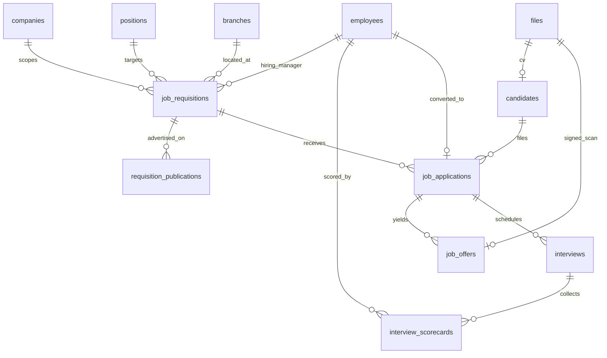
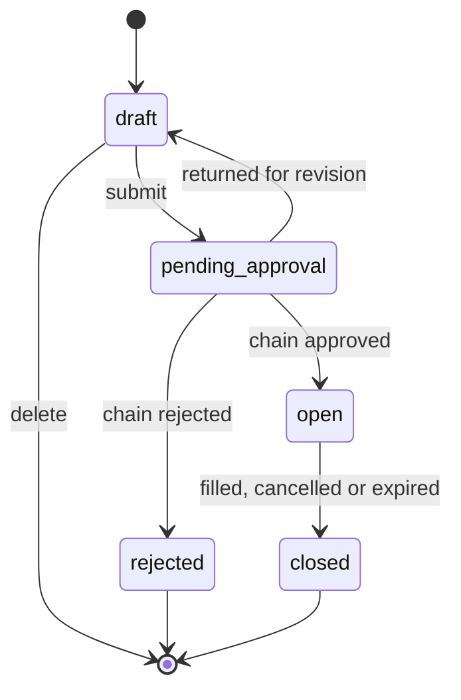
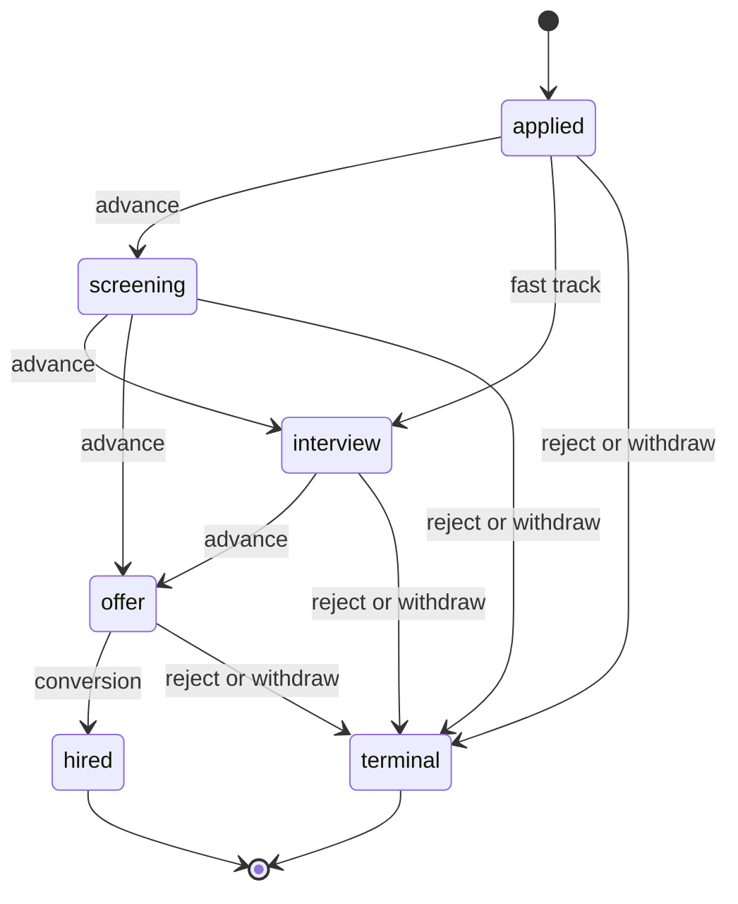
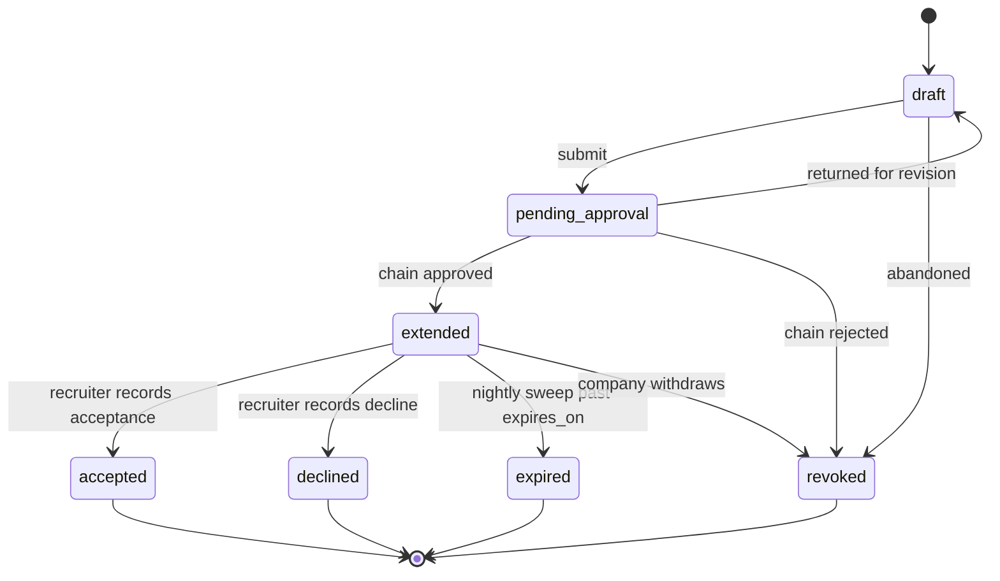
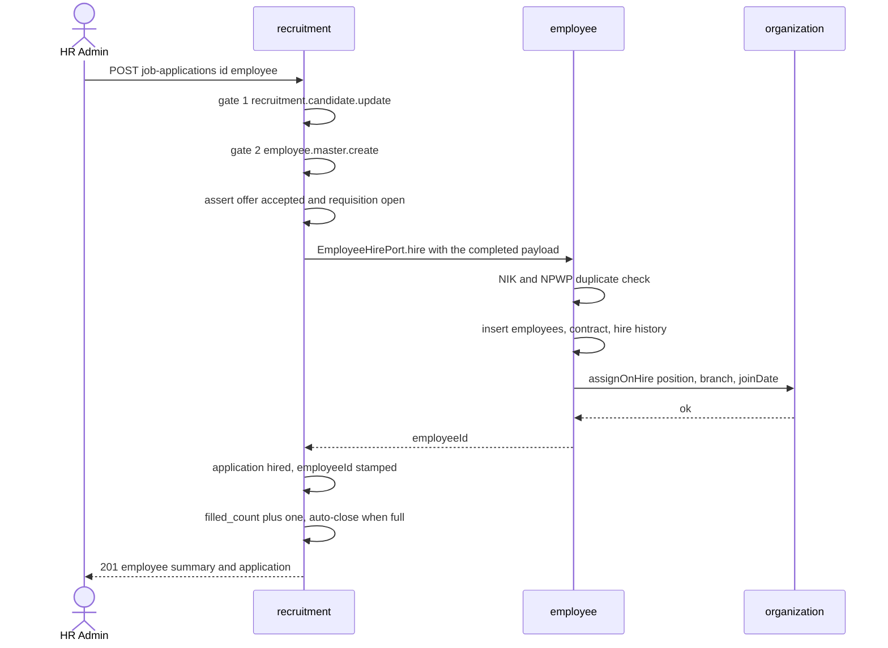
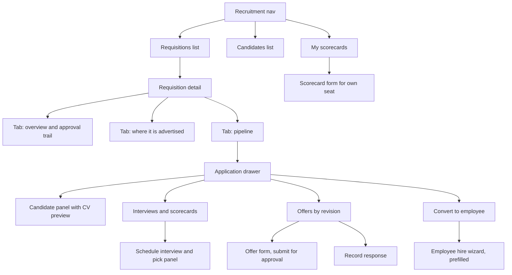

# Module: Recruitment & Candidate

Status: Active (Phase 3) · Related ADRs: `ADR-0001` (module boundaries — §5 FK inventory, §6 read-model views), `ADR-0002` (tenant scoping), `ADR-0003` (online-only mobile writes), `ADR-0005` (data scope + two-gate), `ADR-0006` (result pattern), `ADR-0007` (envelope), `ADR-0008` (approval engine — this module owns two of its eight named request types), `ADR-0009` (candidate files), `ADR-0010` (jobs + outbox events), `ADR-0013` (Drizzle conventions), `ADR-0015` (pipeline exports), `ADR-0016` (encryption boundary — nothing here is encrypted, and §1 says why) · Depends on: `docs/06-modules/holiday.md` (template), `docs/06-modules/organization.md` (`positions`, `OrgQueryPort`, `assignOnHire`), `docs/06-modules/employee.md` (`EmployeeHirePort`, `employee_directory`), `docs/05-platform/approval-engine.md`, `docs/05-platform/document-storage.md`, `docs/05-platform/import-export.md`, `docs/05-platform/notification.md`, `docs/05-platform/settings.md`, `docs/05-platform/audit-log.md` · Consumers: `docs/06-modules/reports.md`, `docs/06-modules/dashboard-analytics.md`

Namespace `recruitment` (naming §4, error prefix `REC`). Job requisitions with approval, where a vacancy was advertised, the candidate pipeline as a stage machine, interviews and scorecards, versioned offers with approval, and the conversion of a hire into an employee. Inherits all global standards; deviations only.

## 1. Purpose & Scope

Four objects, in the order a hire moves through them. **The requisition** — approved permission to fill a named `positions` row, with a count of openings. **The candidate** — a person, company-scoped, deduplicated by email. **The application** — one candidate against one requisition, carrying the pipeline. **The offer** — approved terms, one row per revision. Interviews and their scorecards hang off the application; conversion hangs off the offer.

**There is no public surface.** No careers page, no application form, no candidate login, no email to anyone outside the tenant. Every row in this module is created by a recruiter through the admin web. That is not a shortcut: the entire platform resolves a tenant from an authenticated identity (ADR-0004), RLS binds on `TenantContext` (ADR-0002), and an unauthenticated write into a tenant table has neither. A portal is a real product and it is a different one — it needs a tenant resolver outside the session, spam and rate-limit handling on writes from strangers, virus scanning on files nobody vouched for, and an account system that is not the `users` table. `requisition_publications` records **where the job was advertised**, which is what spec §10.13's "publishing metadata" asks for and all it asks for (A-054).

**A person and a pipeline are different things.** `candidates` is who someone is; `job_applications` is what happened when they applied. One person applying to two open requisitions is one candidate row and two applications; the same person re-applying next year is a match rather than a duplicate. Collapsing them into one row per application makes "have we seen this person before" a string comparison across free text, and the merge migration that follows is the worst one in this handbook.

**The pipeline has two axes and both are load-bearing.** `stage` records how far someone got and moves forward only; `status` records how it ended. A single enum that overwrites `screening` with `rejected` destroys the only interesting question in recruiting — *where do we lose people* — and no report can reconstruct it afterwards.

**An offer is versioned because approval is snapshotted.** A chain approves 15,000,000; the candidate counters; the recruiter agrees 17,000,000. If the number is a column that gets edited, the approval instance still reads `approved` against terms that no longer exist. Expense settled this exact failure three modules ago. Here, a revision is a **new row with a new instance**, and the superseded row keeps its approved terms permanently.

**Conversion is prefill plus a human, and it is dual-gated.** `UC-EMP-001` needs NIK, NPWP, PTKP, BPJS numbers, a bank account, a contract, a position, and a branch. A candidate record has a name, an email, a phone, a CV, and offered terms. No design makes that automatic. The conversion endpoint calls `EmployeeHirePort.hire` with a payload the admin completes, and it requires **`employee.master.create` in addition to a recruitment key** — a recruiter alone must not be able to mint an employee row carrying an encrypted national identity number and a bank account.

**Erasure is anonymization, not deletion.** Hard-deleting an unsuccessful candidate cascades into applications, interviews, and scorecards, which destroys the requisition's funnel and — if the exclusion logic ever slips — the provenance of someone who *was* hired. `cron.recruitment.candidate-purge` nulls the personal fields in place and stamps `anonymized_at`; the structural rows survive and the person does not. The audit trail is redacted for the same columns, because a channel-1 diff that preserves the name and email it just erased would defeat the whole exercise.

**Nothing in this module is ADR-0016 encrypted.** A candidate gives a name, an email, a phone, and a CV. NIK, NPWP, BPJS numbers, and bank details are collected at conversion, by the employee module, into columns that are already encrypted there. Adding encryption here would encrypt an email address that Q4's unique index has to compare and the `q=` search has to match — cost with no protected field behind it.

**V1 exclusions:** **the careers portal and candidate self-service** — public listings, an application form, candidate accounts, status-check pages, and any outbound email to a candidate (A-054). **Internal applicants** — no employee-to-candidate link; an internal move is an organization transfer or promotion, which already exists and is already effective-dated (A-055). **Generated offer letters** — the terms are structured fields and the signed copy comes back as a scan; ADR-0014 does not declare this consumer and the platform has no tenant-editable document template surface (A-056). **Candidate import** — exports only (A-057). **Compensation bands** — `job_levels` carry a rank and no money, so an offer has nothing to be validated against and routing reads the raw number (A-058). **Any path from an offered salary into payroll** (A-059). Also excluded: background and reference checks, assessments and tests, CV parsing and resume search, job-board API integrations, interview calendar and video-conference integration, agency vendor records and placement-fee tracking, onboarding task lists after the hire, a group-wide talent pool across companies, blind scoring, offer templates per job level, and diversity or EEO reporting.

> ⚠️ VERIFY: confirm against current Indonesian regulation before implementation. — the retention period an employer may lawfully keep the personal data of unsuccessful applicants under UU PDP 27/2022, whether an explicit erasure request must be honoured ahead of that period, and whether the applicant's consent at collection must state the period. `recruitment.candidate_retention_days` carries the number so the answer is a settings change and never a migration.

> ⚠️ VERIFY: confirm against current Indonesian regulation before implementation. — the maximum duration and renewal limits of a PKWT under the current employment law, which constrain the `contract_end_date` an offer may propose. This module **stores** the proposed date and validates only its ordering; the statutory rule is enforced where contracts live, at conversion, by employee.md BR-EMP-007.

## 2. Actors & Permissions

| Action | Permission key | Data scope | Employee | Manager | Recruiter | HR Admin | System Administrator |
|---|---|---|---|---|---|---|---|
| Read requisitions | `recruitment.requisition.read` | company / own requisition | — | ✅ own | ✅ | ✅ | ✅ |
| Raise and submit a requisition | `recruitment.requisition.create` | company | — | ✅ | ✅ | ✅ | ✅ |
| Edit, publish, or close a requisition | `recruitment.requisition.update` | company / own requisition | — | — | ✅ | ✅ | ✅ |
| Delete a draft requisition | `recruitment.requisition.delete` | company | — | — | — | ✅ | ✅ |
| Approve / reject / return a requisition | `recruitment.requisition.approve` **+ chain membership** | instance (two-gate, BR-APRV-012) | — | ✅ | — | ✅ | — |
| Read candidates, applications, interviews, scorecards, offers | `recruitment.candidate.read` | company / own requisition / panel | — | ✅ own | ✅ | ✅ | ✅ |
| Add a candidate and file an application | `recruitment.candidate.create` | company | — | — | ✅ | ✅ | ✅ |
| Edit a candidate; advance, reject, or withdraw an application | `recruitment.candidate.update` | company / own requisition | — | — | ✅ | ✅ | ✅ |
| Delete a candidate with no application | `recruitment.candidate.delete` | company | — | — | — | ✅ | ✅ |
| Export the pipeline and requisitions | `recruitment.candidate.export` | company | — | — | ✅ | ✅ | ✅ |
| Schedule an interview and assign the panel | `recruitment.interview.create` | company / own requisition | — | — | ✅ | ✅ | ✅ |
| Submit **own** scorecard | `recruitment.scorecard.create` **+ panel seat** | own seat (two-gate) | ✅ | ✅ | ✅ | ✅ | — |
| Draft, revise, and submit an offer | `recruitment.offer.create` | company | — | — | ✅ | ✅ | ✅ |
| Record the response, revoke an offer | `recruitment.offer.update` | company | — | — | ✅ | ✅ | ✅ |
| Approve / reject / return an offer | `recruitment.offer.approve` **+ chain membership** | instance (two-gate) | — | ✅ | — | ✅ | — |
| Convert a hire into an employee | `recruitment.candidate.update` **+ `employee.master.create`** | company | — | — | — | ✅ | ✅ |

Sixteen rows, fifteen keys, every action from the reserved set (naming §5) — no new action words and no new URL verbs. Four of the shapes are deliberate:

- **`recruitment.candidate.read` covers five resources.** Candidates, applications, interviews, scorecards, and offers are one screen with tabs, and naming §5 splits `read` only when a module genuinely needs it. Requisitions keep their own read key because a hiring manager needs the requisition without the candidates behind it.
- **`recruitment.scorecard.create` is the module's second two-gate key.** Holding it is necessary and never sufficient — the panel seat is the second gate, exactly as chain membership is for `.approve` (ADR-0005, BR-APRV-012). It is the only key in this module a plain Employee may hold, because a panel is whoever is qualified to interview.
- **Conversion demands a key this module does not own.** `employee.master.create` is the second gate and it is not negotiable: the act creates a row with an encrypted NIK, an encrypted bank account, and a contract. Recruiting authority and employee-master authority are different seats, and this endpoint is where they must both be present.
- **`recruitment.offer.create` and `.update` are split** because drafting terms and recording that the candidate accepted them are different moments with different consequences — and only the second one moves an application toward an employee record.

**Data scope has an ownership rule, not a new scope kind** (ADR-0005 §14: modules resolve row visibility themselves). An actor sees a requisition and its applications when they hold the key at `company` scope, **or** when they are the requisition's `hiring_manager_employee_id`, **or** when they hold a panel seat on one of its interviews. Expense's "owner, or a live approver of its instance" resolver reused verbatim. Without it, giving a line manager their own pipeline also gives them every other search in the company — routinely including the one to backfill someone who has not resigned yet. **There is no MSS surface and no mobile surface at all** (§10). Out-of-scope requisitions, candidates, applications, interviews, scorecards, and offers are 404 (existence hiding, `SYS_NOT_FOUND`).

## 3. Business Rules

| # | Rule |
|---|---|
| BR-REC-001 | **A requisition targets an existing position.** `position_id` and `branch_id` are required FKs into organization (ADR-0001 §5 inventory entry, both). A new role is created in organization first, where structure belongs — an approved requisition never creates a position, because that would make the org chart a side effect of a recruiting decision and would need a cross-module write ADR-0001 §2 does not permit. |
| BR-REC-002 | **The requisition counts its own seats and nothing else counts them.** `openings ≥ 1`, `filled_count` starts at zero and increments only inside a conversion transaction, `filled_count ≤ openings` as a CHECK. Two open requisitions against the same position are legal and organization neither knows nor cares — organization §1 excludes headcount budgeting and position capacity, and this module does not smuggle it back in. |
| BR-REC-003 | **Approval is required to open a requisition, and only an open requisition accepts applications.** `draft → pending_approval → open`, chain rejection is terminal (`rejected`), return-for-revision goes back to `draft`. Filing an application against anything other than `open` is `REC_REQUISITION_NOT_OPEN`. A tenant that wants no real gate configures a one-step chain — the engine has no zero-step chain and `APRV_NO_CHAIN_CONFIGURED` aborts a submit with nothing matching (BR-APRV-002), which is the same answer leave and expense already give. |
| BR-REC-004 | **Closing says why.** `close_reason ∈ filled, cancelled, expired`, NOT NULL exactly when `status = 'closed'` (CHECK). `filled` is written by the auto-close at `filled_count = openings`; the other two are administrator choices. `expired` means the need lapsed — **no cron closes a requisition**, because a hiring need does not stop existing on a date the system knows. Closed is terminal; a renewed need is a new requisition. |
| BR-REC-005 | **A candidate is a person, company-scoped, keyed by email.** Unique on `(tenant_id, company_id, lower(email))` among live, non-anonymized rows. A re-applicant collides with `VAL_DUPLICATE` on `email` and the recruiter files a second application against the existing person — the same mechanic BR-EMP-001 uses for NIK, the same code, no new vocabulary. The same human at two companies in one group is two rows: a shared row would let a recruiter scoped to company A read that this person also applied at company B, which is a disclosure about a third party in a system whose entire scoping model is company-level. |
| BR-REC-006 | **Stage moves forward and may skip; it never moves backward.** `applied → screening → interview → offer`, any forward jump permitted — a referral going straight to `interview` is ordinary and strict adjacency would only manufacture fake `screening` rows. A backward move is `REC_STAGE_BACKWARD`. Re-interviewing needs no backward edge: multiple rounds are multiple `interviews` rows inside one `interview` stage. |
| BR-REC-007 | **Status is the second axis and it is terminal.** `status ∈ active, rejected, withdrawn, hired`. Rejection and withdrawal freeze the stage where they happened, which is what makes the funnel readable. `status = 'hired'` requires `stage = 'offer'` **and** a non-null `employee_id` (CHECK) — the word means an employee row exists, never that someone said yes. Reconsidering a rejected person is a **new application** on the same candidate, which BR-REC-005's person/pipeline split makes cheap. |
| BR-REC-008 | **Terminal reasons are enums where they can be grouped and prose where they cannot.** `rejection_reason ∈ not_qualified, failed_interview, salary_mismatch, position_closed, other`, required when `status = 'rejected'`, with a mandatory note on `other` (CHECK). `withdrawal_reason` is free text, because it is the candidate's own words and no enum honestly holds them. |
| BR-REC-009 | **One active application per candidate per requisition.** Partial unique index on `(tenant_id, candidate_id, requisition_id) WHERE status = 'active'`. A closed application does not block a fresh one against the same requisition next year — which is why the index is partial rather than total. |
| BR-REC-010 | **The scorecard row is the panel seat.** Scheduling an interview inserts one `interview_scorecards` row per panellist with everything but the identity null; `submitted_at IS NULL` means assigned-and-not-yet-submitted. There is no separate panel table, because the seat and the result are the same fact at two times (asset BR-AST-004's shape, applied to people instead of objects). Unique on `(tenant_id, interview_id, interviewer_employee_id)`. Submitting is a one-way act — `REC_SCORECARD_SUBMITTED` on a second attempt — since a rating edited after seeing the decision is not a rating. |
| BR-REC-011 | **Offers are versioned; at most one is live.** Partial unique on `(tenant_id, application_id) WHERE status IN ('draft','pending_approval','extended')`. A revision is a new row with `revision_number + 1` and its own approval instance; the superseded row is terminal and keeps its approved terms forever. `revision_number` is the chain-selection field that makes negotiation a control instead of a quiet loop — a third revision can be routed to someone senior. |
| BR-REC-012 | **Chain approval is what extends the offer.** `pending_approval → extended` on the terminal approval; there is no separate send step, because with no candidate-facing channel (§1) the act of extending happens offline and approval is the authority that permits it. Chain rejection is terminal (`revoked`); return-for-revision goes to `draft`. The candidate's answer is recorded by the recruiter through `POST /{id}/response`. |
| BR-REC-013 | **An offer carries one salary number and it never reaches payroll.** `offered_base_salary` exists to be approved and to be remembered. There are no components, because payroll owns that vocabulary and a second owner would drift from it; there is no port and no event, because a recruiter's offer must not be the thing that sets someone's pay. Payroll setup after conversion is the deliberate separate act it already is (A-059) — and `UC-EMP-001` writes no salary either, so nothing regresses. |
| BR-REC-014 | **Expiry is a stored state, flipped nightly.** `expires_on` is required on every offer. `cron.recruitment.offer-expiry` moves `extended → expired` daily, idempotently. Deriving expiry at read instead would put `AND expires_on >= current_date` into every grid, every count, and the live-offer index — twenty places, and the one that forgets shows a dead offer as live. The stored flip also releases BR-REC-011's index, so a candidate who simply never replies stops blocking a fresh offer without anyone filing a revocation. |
| BR-REC-015 | **Conversion is one transaction, dual-gated, and it is the only writer of `hired`.** `POST /job-applications/{id}/employee` requires `recruitment.candidate.update` **and** `employee.master.create`, and requires a live `accepted` offer (`REC_OFFER_NOT_ACCEPTED`). Inside a single transaction: `EmployeeHirePort.hire` runs `UC-EMP-001` in full — employees row, contract, `hire` status history, `OrgPlacementPort.assignOnHire`, optional account — then the application takes `status = 'hired'` and the new `employee_id`, `filled_count` increments, and the requisition auto-closes as `filled` when it reaches `openings`. Any failure inside the port surfaces as its own `EMP_*` / `ORG_*` code and nothing here commits. |
| BR-REC-016 | **There is no internal-applicant model, and the existing NIK index is the backstop.** No `employee_id` on `candidates`, no internal-mobility path. If someone does run a current employee through the pipeline, conversion hits BR-EMP-001's NIK duplicate check and fails with `VAL_DUPLICATE` on `nik` — the disaster of two employee rows for one human is prevented one module over, with no column, no code, and no rule added here (A-055). Internal moves are organization transfers. |
| BR-REC-017 | **Erasure is anonymization, and the audit trail is redacted to match.** `cron.recruitment.candidate-purge` selects candidates with no `active` application, never hired, whose `last_activity_at` is older than `recruitment.candidate_retention_days`; it nulls `full_name`, `email`, and `phone`, stamps `anonymized_at`, and soft-deletes the CV so `cron.document.purge` collects the object. `candidates.full_name`, `email`, and `phone` are audited as a **`[redacted]` change marker**, never as values — employee.md's `[encrypted]` marker treatment applied for a different reason and the same effect. A full diff would preserve in the audit table exactly what the purge removed from the row. |
| BR-REC-018 | **Publishing is a record, and it gates nothing.** `requisition_publications` rows say where and when a vacancy was advertised and when it came down. Nothing validates a URL, nothing polls a channel, and an open requisition with no publication row is perfectly legal. Joined against `candidates.source`, it answers the only question the data is ever asked: which channel actually produced hires. |
| BR-REC-019 | **Audit and offline.** All seven tables are channel-1 audited with full diffs except BR-REC-017's three redacted columns (audit-log §4.2, registered this session). **No mobile surface, no offline class**: no Drift mirror, no queued ops, no `op_id`, no replay lane. Recruiting is admin-web work. |

## 4. Domain Model



### 4.1 Schema

```ts
// src/database/schema/recruitment.ts
// `employmentType` is core-schema §3's shared enum, imported rather than re-declared —
// an offer's contract kind and the contract row it becomes must be the same two values.

export const requisitionStatus = pgEnum('requisition_status', [
  'draft', 'pending_approval', 'open', 'rejected', 'closed',
]);
export const requisitionCloseReason = pgEnum('requisition_close_reason', [
  'filled', 'cancelled', 'expired',                            // BR-REC-004 — closed alone cannot tell them apart
]);
export const candidateSource = pgEnum('candidate_source', [
  'job_board', 'referral', 'agency', 'walk_in', 'other',
]);
export const applicationStage = pgEnum('application_stage', [
  'applied', 'screening', 'interview', 'offer',                // BR-REC-006 — forward only, skippable
]);
export const applicationStatus = pgEnum('application_status', [
  'active', 'rejected', 'withdrawn', 'hired',                  // BR-REC-007 — the second axis
]);
export const applicationRejectionReason = pgEnum('application_rejection_reason', [
  'not_qualified', 'failed_interview', 'salary_mismatch', 'position_closed', 'other',
]);
export const offerStatus = pgEnum('offer_status', [
  'draft', 'pending_approval', 'extended', 'accepted', 'declined', 'expired', 'revoked',
]);
export const interviewMode = pgEnum('interview_mode', ['onsite', 'online', 'phone']);
export const interviewStatus = pgEnum('interview_status', ['scheduled', 'completed', 'cancelled', 'no_show']);
export const scorecardRecommendation = pgEnum('scorecard_recommendation', [
  'strong_yes', 'yes', 'no', 'strong_no',
]);

export const jobRequisitions = pgTable('job_requisitions', {
  ...id, ...tenantId,
  companyId: uuid('company_id').notNull().references(() => companies.id),
  positionId: uuid('position_id').notNull().references(() => positions.id),        // ADR-0001 §5 inventory
  branchId: uuid('branch_id').notNull().references(() => branches.id),             // ADR-0001 §5 inventory
  hiringManagerEmployeeId: uuid('hiring_manager_employee_id')
    .notNull().references(() => employees.id),                                     // ADR-0001 §5 inventory
  code: text('code').notNull(),                                 // REQ-2026-0007 — tenant-unique, immutable
  title: text('title').notNull(),                               // as advertised; positions.title stays org truth
  employmentType: employmentType('employment_type').notNull(),
  openings: integer('openings').notNull().default(1),
  filledCount: integer('filled_count').notNull().default(0),    // BR-REC-002
  targetStartDate: date('target_start_date'),
  description: text('description'),
  status: requisitionStatus('status').notNull().default('draft'),
  openedAt: timestamp('opened_at', { withTimezone: true }),
  closeReason: requisitionCloseReason('close_reason'),
  closedAt: timestamp('closed_at', { withTimezone: true }),
  ...auditColumns, ...softDeleteColumns,
}, (t) => [
  uniqueIndex('uq_job_requisitions_tenant_id_code')
    .on(t.tenantId, t.code).where(sql`deleted_at IS NULL`),
  index('idx_job_requisitions_tenant_id_company_id_status').on(t.tenantId, t.companyId, t.status),
  index('idx_job_requisitions_tenant_id_hiring_manager').on(t.tenantId, t.hiringManagerEmployeeId),
  index('idx_job_requisitions_tenant_id_position_id').on(t.tenantId, t.positionId),
]);

export const requisitionPublications = pgTable('requisition_publications', {
  ...id, ...tenantId,
  requisitionId: uuid('requisition_id').notNull().references(() => jobRequisitions.id),
  channel: text('channel').notNull(),                           // JobStreet, LinkedIn, Instagram, campus fair
  url: text('url'),
  postedOn: date('posted_on').notNull(),
  closedOn: date('closed_on'),
  note: text('note'),
  ...auditColumns, ...softDeleteColumns,
}, (t) => [
  index('idx_requisition_publications_tenant_id_requisition')
    .on(t.tenantId, t.requisitionId),
]);

export const candidates = pgTable('candidates', {
  ...id, ...tenantId,
  companyId: uuid('company_id').notNull().references(() => companies.id),
  fullName: text('full_name'),                                  // nullable ONLY so BR-REC-017 can null it
  email: text('email'),
  phone: text('phone'),
  source: candidateSource('source').notNull().default('other'),
  sourceDetail: text('source_detail'),                          // referrer name, agency name, board campaign
  currentTitle: text('current_title'),
  cvFileId: uuid('cv_file_id').references(() => files.id),       // candidate_file category
  notes: text('notes'),
  lastActivityAt: timestamp('last_activity_at', { withTimezone: true }).notNull().defaultNow(),
  anonymizedAt: timestamp('anonymized_at', { withTimezone: true }),
  ...auditColumns, ...softDeleteColumns,
}, (t) => [
  uniqueIndex('uq_candidates_tenant_id_company_id_email')       // BR-REC-005
    .on(t.tenantId, t.companyId, sql`lower(${t.email})`)
    .where(sql`deleted_at IS NULL AND anonymized_at IS NULL`),
  index('idx_candidates_tenant_id_company_id_name').on(t.tenantId, t.companyId, t.fullName),
  index('idx_candidates_purge_scan')                            // BR-REC-017 — the nightly sweep
    .on(t.tenantId, t.lastActivityAt).where(sql`anonymized_at IS NULL`),
]);

export const jobApplications = pgTable('job_applications', {
  ...id, ...tenantId,
  candidateId: uuid('candidate_id').notNull().references(() => candidates.id),
  requisitionId: uuid('requisition_id').notNull().references(() => jobRequisitions.id),
  stage: applicationStage('stage').notNull().default('applied'),
  status: applicationStatus('status').notNull().default('active'),
  appliedOn: date('applied_on').notNull(),
  stageChangedAt: timestamp('stage_changed_at', { withTimezone: true }).notNull().defaultNow(),
  rejectionReason: applicationRejectionReason('rejection_reason'),
  rejectionNote: text('rejection_note'),
  withdrawalReason: text('withdrawal_reason'),
  closedAt: timestamp('closed_at', { withTimezone: true }),
  employeeId: uuid('employee_id').references(() => employees.id),   // stamped at conversion, BR-REC-015
  ...auditColumns, ...softDeleteColumns,
}, (t) => [
  uniqueIndex('uq_job_applications_active_per_req')             // BR-REC-009 — one live pipeline per pairing
    .on(t.tenantId, t.candidateId, t.requisitionId)
    .where(sql`status = 'active' AND deleted_at IS NULL`),
  index('idx_job_applications_tenant_id_req_stage').on(t.tenantId, t.requisitionId, t.stage),
  index('idx_job_applications_tenant_id_candidate_id').on(t.tenantId, t.candidateId),
  index('idx_job_applications_tenant_id_status_stage').on(t.tenantId, t.status, t.stage),   // the funnel
]);

export const jobOffers = pgTable('job_offers', {
  ...id, ...tenantId,
  applicationId: uuid('application_id').notNull().references(() => jobApplications.id),
  revisionNumber: integer('revision_number').notNull().default(1),
  offeredBaseSalary: numeric('offered_base_salary', { precision: 15, scale: 2 }).notNull(),
  employmentType: employmentType('employment_type').notNull(),
  contractEndDate: date('contract_end_date'),                   // pkwt only, CHECK-paired
  proposedStartDate: date('proposed_start_date').notNull(),
  expiresOn: date('expires_on').notNull(),                      // BR-REC-014
  status: offerStatus('status').notNull().default('draft'),
  note: text('note'),
  extendedAt: timestamp('extended_at', { withTimezone: true }),
  respondedAt: timestamp('responded_at', { withTimezone: true }),
  declineReason: text('decline_reason'),
  signedOfferFileId: uuid('signed_offer_file_id').references(() => files.id),
  ...auditColumns, ...softDeleteColumns,
}, (t) => [
  uniqueIndex('uq_job_offers_live_per_application')             // BR-REC-011 — the invariant
    .on(t.tenantId, t.applicationId)
    .where(sql`status IN ('draft','pending_approval','extended') AND deleted_at IS NULL`),
  uniqueIndex('uq_job_offers_application_id_revision')
    .on(t.tenantId, t.applicationId, t.revisionNumber).where(sql`deleted_at IS NULL`),
  index('idx_job_offers_expiry_scan')                           // BR-REC-014 — the nightly sweep
    .on(t.tenantId, t.expiresOn).where(sql`status = 'extended'`),
]);

export const interviews = pgTable('interviews', {
  ...id, ...tenantId,
  applicationId: uuid('application_id').notNull().references(() => jobApplications.id),
  round: integer('round').notNull().default(1),
  scheduledAt: timestamp('scheduled_at', { withTimezone: true }).notNull(),   // UTC, shown in branch tz
  durationMinutes: integer('duration_minutes').notNull().default(60),
  mode: interviewMode('mode').notNull(),
  location: text('location'),                                   // room, address, or meeting link
  status: interviewStatus('status').notNull().default('scheduled'),
  notes: text('notes'),
  ...auditColumns, ...softDeleteColumns,
}, (t) => [
  uniqueIndex('uq_interviews_tenant_id_application_round')
    .on(t.tenantId, t.applicationId, t.round).where(sql`deleted_at IS NULL`),
  index('idx_interviews_tenant_id_scheduled_at').on(t.tenantId, t.scheduledAt),
]);

export const interviewScorecards = pgTable('interview_scorecards', {
  ...id, ...tenantId,
  interviewId: uuid('interview_id').notNull().references(() => interviews.id),
  interviewerEmployeeId: uuid('interviewer_employee_id')
    .notNull().references(() => employees.id),                  // ADR-0001 §5 inventory
  rating: integer('rating'),                                    // 1..5, null until submitted
  recommendation: scorecardRecommendation('recommendation'),
  strengths: text('strengths'),
  concerns: text('concerns'),
  submittedAt: timestamp('submitted_at', { withTimezone: true }),   // BR-REC-010 — null = the seat, unfilled
  ...auditColumns, ...softDeleteColumns,
}, (t) => [
  uniqueIndex('uq_interview_scorecards_seat')                   // BR-REC-010 — one seat per interviewer
    .on(t.tenantId, t.interviewId, t.interviewerEmployeeId).where(sql`deleted_at IS NULL`),
  index('idx_interview_scorecards_tenant_id_interviewer')
    .on(t.tenantId, t.interviewerEmployeeId).where(sql`submitted_at IS NULL`),   // "my pending scorecards"
]);
```

Hand-written CHECK constraints (database-conventions §2.4):

- `ck_job_requisitions_close` — `(status = 'closed') = (close_reason IS NOT NULL AND closed_at IS NOT NULL)` (BR-REC-004).
- `ck_job_requisitions_openings` — `openings >= 1 AND filled_count >= 0 AND filled_count <= openings` (BR-REC-002).
- `ck_candidates_anonymized` — `(anonymized_at IS NULL AND full_name IS NOT NULL AND email IS NOT NULL) OR (anonymized_at IS NOT NULL AND full_name IS NULL AND email IS NULL AND phone IS NULL)` (BR-REC-017). One constraint holds both directions: a live candidate always has an identity, and an anonymized one never does.
- `ck_job_applications_terminal` — `(status = 'rejected') = (rejection_reason IS NOT NULL)` AND `(rejection_reason = 'other') <= (rejection_note IS NOT NULL)` AND `status <> 'hired' OR (stage = 'offer' AND employee_id IS NOT NULL)` AND `status <> 'active' OR employee_id IS NULL` (BR-REC-007, BR-REC-008).
- `ck_job_offers_contract_end` — `(employment_type = 'pkwt') = (contract_end_date IS NOT NULL)` — the same shape as employee.md's `ck_employee_contracts_end_by_kind`, so the offer cannot propose something the contract row would reject.
- `ck_job_offers_dates` — `offered_base_salary >= 0 AND expires_on <= proposed_start_date AND revision_number >= 1`. An offer that expires after the day the person was meant to start is a data-entry slip, not a policy.
- `ck_interview_scorecards_submitted` — `(submitted_at IS NULL AND rating IS NULL AND recommendation IS NULL) OR (submitted_at IS NOT NULL AND rating BETWEEN 1 AND 5 AND recommendation IS NOT NULL)` (BR-REC-010).

### 4.2 Lifecycles

Requisition:



Application — `stage` is the path, `status` is how it ended, and the two are independent columns:



`terminal` above is `status ∈ rejected, withdrawn` — **the stage column keeps whatever it was**, which is the whole point of BR-REC-007 and the reason the funnel report needs no extra column. `hired` is the only status that also constrains the stage.

Offer:



Two words for two actors, deliberately: an application is **withdrawn** by the candidate, an offer is **revoked** by the company. `revoke` is already a reserved URL verb (naming §3), so the vocabulary and the route agree.

### 4.3 Ports served

**None.** Nothing in V1 reads this module's data through a port. Reports reads the tables under ADR-0001 §6's read-model channel (live 2026-08-03); **dashboard-analytics arrived 2026-08-04 and reaches no table, reading only through `ReportQueryPort`**; adding a port when a caller exists is additive, and a port with no caller is scaffolding (asset.md and expense.md precedent).

### 4.4 Ports and reads consumed

| Source | What is read | Why not a table read |
|---|---|---|
| `OrgQueryPort.positions` / `.branches` | position title, job level rank, department and branch names on requisition forms and grids | ADR-0001 §2 — organization owns the structure |
| `employee_directory` (view, employee.md §13) | hiring manager and interviewer `full_name` + `employee_number` on every grid, and the `q=` search over them | ADR-0001 §6 as amended 2026-08-03. A batch enrichment port cannot serve a filter that has to run **before** the page boundary — the same reason attendance, leave, overtime, expense, and asset all point here |
| `EmployeeHirePort.hire` (**new, employee.md §13 this session**) | runs `UC-EMP-001` in full inside this module's conversion transaction | BR-REC-015. Discharges the "recruitment conversion (forward)" actor employee.md has carried since 2026-08-02 |
| `ApprovalEnginePort` | submit / approve / reject / return for `recruitment.requisition` and `recruitment.offer` | ADR-0008 — the engine never touches domain tables and this module never mutates instances |
| document-storage slot flow | CV upload, signed offer scan | ADR-0009 — no module invents a storage path |

`OrgPlacementPort.assignOnHire` is **not** called from here directly — it is called by `EmployeeHirePort.hire` inside `UC-EMP-001`, which is exactly what organization.md BR-ORG-002 anticipated when it named "recruitment.md conversion" as a caller. Routing it through employee keeps one hire path, not two.

### 4.5 Conversion, the interesting endpoint

Everything else in this module writes its own tables. This one writes another module's.



Four things this shape buys. The **dual gate** is checked before anything is written, so a recruiter without employee authority gets a 403 rather than a half-finished person. The **port call is inside the transaction**, so a `VAL_DUPLICATE` on NIK from BR-EMP-001 rolls the whole thing back and the application stays `active` — which is also how BR-REC-016 stops an internal applicant from becoming a second employee row. The **application is stamped, not copied**: `employee_id` is the only link and there is no denormalized name or number that could drift from the employee record. And the **counter moves exactly once per hire**, inside the same transaction, so `filled_count` can never disagree with the number of `hired` applications.

The payload is the employee create shape (employee.md §7) prefilled with what recruitment knows — full name, personal email, phone, position, branch, company, `employment_type`, `contract_end_date`, and `join_date` from the offer's `proposed_start_date`. Everything statutory is typed by the admin. This module validates none of it: those rules belong to employee.md and duplicating them here would be two owners for one truth.

## 5. Use Cases

**UC-REC-001 — Raise a requisition.** Actor: Manager or Recruiter with `recruitment.requisition.create`. Main: pick company → position → branch → hiring manager, set `openings`, employment type, target start, description → save `draft` → `POST /submit` → engine selects a chain and opens an instance. Exceptions: no chain configured → `APRV_NO_CHAIN_CONFIGURED` surfaced to the admin, nothing submitted (BR-APRV-002); position or branch outside the caller's scope → `SYS_NOT_FOUND`. Postcondition: `pending_approval`, inbox items live.

**UC-REC-002 — Requisition decided.** Actor: engine terminal event. Main: approved → `open` + `opened_at`; rejected → `rejected`, terminal; returned → `draft` for revision. Postcondition: only `open` accepts applications (BR-REC-003).

**UC-REC-003 — Record where it was advertised.** Actor: Recruiter with `recruitment.requisition.update`. Main: add one publication row per channel with `posted_on`; stamp `closed_on` when a listing comes down. Nothing is validated against the outside world and nothing is gated (BR-REC-018).

**UC-REC-004 — Add a candidate and file an application.** Actor: Recruiter with `recruitment.candidate.create`. Main: enter identity + source → email uniqueness check → create candidate → attach CV through the document-storage slot flow → file an application against an `open` requisition at stage `applied`. Alternate: the email already exists → the duplicate response carries the existing candidate id and the UI offers "file another application for this person" instead of an error the recruiter must decode. Exceptions: requisition not `open` → `REC_REQUISITION_NOT_OPEN`; an active application already exists for the pairing → `REC_DUPLICATE_APPLICATION`; the candidate is anonymized → `REC_CANDIDATE_ANONYMIZED`.

**UC-REC-005 — Move, reject, or withdraw.** Actor: Recruiter or HR Admin with `recruitment.candidate.update`. Main: `PATCH` the application with a forward stage → `stage_changed_at` refreshed, `candidates.last_activity_at` touched. Alternate: reject with a reason enum, or record a withdrawal with the candidate's words; both stamp `closed_at` and freeze the stage. Exceptions: backward stage → `REC_STAGE_BACKWARD`; the application is already terminal → `REC_APPLICATION_CLOSED`.

**UC-REC-006 — Schedule an interview and assign the panel.** Actor: Recruiter with `recruitment.interview.create`. Main: pick date/time in the branch timezone (stored UTC), mode, location or link, and the panel → one `interview_scorecards` seat inserted per panellist → `recruitment.interview_assigned` to each. Alternate: reschedule updates `scheduled_at` and re-notifies; cancel sets `cancelled` and leaves unsubmitted seats in place as history. Postcondition: the application is at stage `interview` — advancing it is part of the same act, since scheduling an interview for someone still at `applied` and leaving them there is a bookkeeping error waiting to happen.

**UC-REC-007 — Submit a scorecard.** Actor: the panellist, holding `recruitment.scorecard.create` **and** the seat. Main: open own seat → rating 1–5, recommendation, strengths, concerns → `submitted_at` stamped. Exceptions: not the seat's interviewer → `REC_NOT_A_PANELIST`; already submitted → `REC_SCORECARD_SUBMITTED`. Postcondition: the scorecard is visible to everyone who can read the application, including panellists who have not yet submitted — V1 does not blind (§15).

**UC-REC-008 — Draft and submit an offer.** Actor: Recruiter with `recruitment.offer.create`. Main: application at stage `offer` → enter salary, employment type, contract end for PKWT, proposed start, expiry → save `draft` → submit → chain. Alternate: a revision after negotiation creates a **new row** at `revision_number + 1` with its own instance, and the predecessor goes terminal. Exceptions: a live offer already exists → `REC_OFFER_ALREADY_LIVE`; the application is terminal → `REC_APPLICATION_CLOSED`.

**UC-REC-009 — Offer decided, then answered.** Actor: engine event, then Recruiter with `recruitment.offer.update`. Main: approved → `extended` + `extended_at` (BR-REC-012); the recruiter hands the letter over offline and later posts the response — `accepted` or `declined` with a reason and a `responded_at` that may be backdated to the day it actually happened. Alternate: chain rejected → `revoked`; returned → `draft`; the company changes its mind → `POST /revoke`. Exceptions: responding to an offer that is not `extended` → `REC_OFFER_EXPIRED` when it lapsed, `VAL_VALIDATION_FAILED` otherwise.

**UC-REC-010 — Convert to employee.** Actor: HR Admin holding `recruitment.candidate.update` **and** `employee.master.create`. Main: §4.5 in full. Exceptions: no accepted offer → `REC_OFFER_NOT_ACCEPTED`; the requisition is already full → `REC_REQUISITION_FILLED`; anything inside the port fails → its own `EMP_*` / `ORG_*` code and a full rollback. Postcondition: an employee exists, the application is `hired`, the seat is counted, and the requisition may have auto-closed as `filled`.

**UC-REC-011 — Expire stale offers (job).** Daily per tenant over `idx_job_offers_expiry_scan`: `extended` with `expires_on < today` → `expired`. Idempotent — a second run finds nothing (BR-REC-014).

**UC-REC-012 — Anonymize old candidates (job).** Daily per tenant over `idx_candidates_purge_scan`: no `active` application, never hired, `last_activity_at` older than `recruitment.candidate_retention_days` → null the three identity columns, stamp `anonymized_at`, soft-delete the CV. Idempotent by the stamp (BR-REC-017).

**UC-REC-013 — Export the pipeline.** Actor: Recruiter with `recruitment.candidate.export`. Main: the import-export framework job produces `recruitment.pipeline` or `recruitment.requisition` for the requested company and window; output is requester-only per BR-IMP-010. Anonymized candidates export with empty identity columns and their structural rows intact — which is the correct behaviour and worth asserting in a test.

## 6. UI Flow

Admin web only (Next.js). No mobile screens exist in this module (§10).



Screen inventory: requisitions list (TanStack Table, filters company / status / department / hiring manager, `q=` over code and title), requisition detail with three tabs, candidates list with `q=` over name, email, and phone, application drawer as the working surface, interview scheduling modal, offer form, response modal, conversion entry into employee's existing hire wizard, and "My scorecards" — the one screen a non-recruiter opens.

**The pipeline is a table, not a drag-and-drop board.** Every ATS has the board and it is the obvious choice, which is why it needs a reason to be refused: BR-REC-006 makes stage moves forward-only and skippable, and drag-and-drop communicates the opposite — that a card can go back. A grid with an explicit "advance to…" action expresses exactly the rule the database enforces, and the board is in §15 where it can be built against the same PATCH.

States: **empty** — no requisitions yet renders the create prompt; an open requisition with no applications renders "No candidates yet" beside the publication tab rather than an empty grid; a candidate with no applications renders the person with a "file an application" action. **Loading** — table skeletons, drawer skeleton per panel so the CV preview never blocks the pipeline. **Error** — `REC_STAGE_BACKWARD` and `REC_DUPLICATE_APPLICATION` render inline on the action that raised them; `APRV_NO_CHAIN_CONFIGURED` renders as an admin-actionable message naming the chain editor, because it is a configuration gap and not a user mistake. Conversion is a two-step confirm — the wizard, then a summary naming the position, branch, join date, and salary, because it is the one irreversible act in the module.

## 7. API

All endpoints follow the canonical spec-block form (api-standards §13). No new pagination-registry rows — every grid is the seeded transactional-grid family (offset). Exports ride import-export §7 rather than an endpoint here. Errors beyond the implied set only.

| Endpoint | Permission | Pagination | Queue-reachable | Idempotency |
|---|---|---|---|---|
| `GET /api/v1/job-requisitions` | `recruitment.requisition.read` | offset | no | — |
| `GET /api/v1/job-requisitions/{id}` | `recruitment.requisition.read` | — | no | — |
| `POST /api/v1/job-requisitions` | `recruitment.requisition.create` | — | no | accepted |
| `PATCH /api/v1/job-requisitions/{id}` | `recruitment.requisition.update` | — | no | accepted |
| `DELETE /api/v1/job-requisitions/{id}` | `recruitment.requisition.delete` | — | no | — |
| `POST /api/v1/job-requisitions/{id}/submit` | `recruitment.requisition.create` | — | no | accepted |
| `POST /api/v1/job-requisitions/{id}/approve` | `recruitment.requisition.approve` | — | no | accepted |
| `POST /api/v1/job-requisitions/{id}/reject` | `recruitment.requisition.approve` | — | no | accepted |
| `POST /api/v1/job-requisitions/{id}/return` | `recruitment.requisition.approve` | — | no | accepted |
| `POST /api/v1/job-requisitions/{id}/close` | `recruitment.requisition.update` | — | no | accepted |
| `GET /api/v1/job-requisitions/{id}/publications` | `recruitment.requisition.read` | — (bounded) | no | — |
| `POST /api/v1/job-requisitions/{id}/publications` | `recruitment.requisition.update` | — | no | accepted |
| `PATCH /api/v1/job-requisitions/{id}/publications/{pid}` | `recruitment.requisition.update` | — | no | accepted |
| `DELETE /api/v1/job-requisitions/{id}/publications/{pid}` | `recruitment.requisition.update` | — | no | — |
| `GET /api/v1/candidates` | `recruitment.candidate.read` | offset | no | — |
| `GET /api/v1/candidates/{id}` | `recruitment.candidate.read` | — | no | — |
| `POST /api/v1/candidates` | `recruitment.candidate.create` | — | no | accepted |
| `PATCH /api/v1/candidates/{id}` | `recruitment.candidate.update` | — | no | accepted |
| `DELETE /api/v1/candidates/{id}` | `recruitment.candidate.delete` | — | no | — |
| `GET /api/v1/job-applications` | `recruitment.candidate.read` | offset | no | — |
| `GET /api/v1/job-applications/{id}` | `recruitment.candidate.read` | — | no | — |
| `POST /api/v1/job-applications` | `recruitment.candidate.create` | — | no | accepted |
| `PATCH /api/v1/job-applications/{id}` | `recruitment.candidate.update` | — | no | accepted |
| `POST /api/v1/job-applications/{id}/employee` | `recruitment.candidate.update` **+ `employee.master.create`** | — | no | accepted |
| `GET /api/v1/interviews` | `recruitment.candidate.read` | offset | no | — |
| `POST /api/v1/interviews` | `recruitment.interview.create` | — | no | accepted |
| `PATCH /api/v1/interviews/{id}` | `recruitment.interview.create` | — | no | accepted |
| `GET /api/v1/interview-scorecards` | `recruitment.candidate.read` / own seat | offset | no | — |
| `PATCH /api/v1/interview-scorecards/{id}` | `recruitment.scorecard.create` + seat | — | no | accepted |
| `GET /api/v1/job-offers` | `recruitment.candidate.read` | offset | no | — |
| `POST /api/v1/job-offers` | `recruitment.offer.create` | — | no | accepted |
| `PATCH /api/v1/job-offers/{id}` | `recruitment.offer.create` | — | no | accepted |
| `POST /api/v1/job-offers/{id}/submit` | `recruitment.offer.create` | — | no | accepted |
| `POST /api/v1/job-offers/{id}/approve` | `recruitment.offer.approve` | — | no | accepted |
| `POST /api/v1/job-offers/{id}/reject` | `recruitment.offer.approve` | — | no | accepted |
| `POST /api/v1/job-offers/{id}/return` | `recruitment.offer.approve` | — | no | accepted |
| `POST /api/v1/job-offers/{id}/response` | `recruitment.offer.update` | — | no | accepted |
| `POST /api/v1/job-offers/{id}/revoke` | `recruitment.offer.update` | — | no | accepted |

**No new URL verbs.** `submit`, `approve`, `reject`, `return`, `close`, and `revoke` are all in the naming §3 reserved set. Conversion and the candidate's answer use the **sub-resource shape** — `POST /{id}/employee`, `POST /{id}/response` — rather than minting `hire` and `respond`, on the precedent asset set with `retirement` and expense set with `payments`. **No endpoint is queue-reachable**: there is no offline write class (§10).

#### POST /api/v1/job-requisitions · PATCH /{id}

| Field | Type | Required | Rule |
|---|---|---|---|
| `companyId` | uuid | ✅ | in the caller's assignment scope |
| `positionId` | uuid | ✅ | live position inside `companyId` |
| `branchId` | uuid | ✅ | live branch inside `companyId` |
| `hiringManagerEmployeeId` | uuid | ✅ | live, non-terminal employee in `companyId` |
| `code` | string | — | server-generated `REQ-<year>-<seq>` when omitted; unique per tenant, **immutable on PATCH** |
| `title` | string | ✅ | 2–150 — as advertised, defaulting to the position title |
| `employmentType` | enum | ✅ | `pkwt` / `pkwtt` |
| `openings` | integer | ✅ | 1–999, and never below `filled_count` on PATCH |
| `targetStartDate` | date | — | not in the past on create |
| `description` | string | — | ≤ 5000 |

Response 201 / 200: the requisition with resolved position, branch, department, and hiring-manager name. `PATCH` is permitted on `draft` freely, and on `open` for `title`, `description`, `targetStartDate`, and `openings` only — the position, branch, and employment type were what the chain approved and changing them silently re-uses an approval for a different job (`VAL_VALIDATION_FAILED` naming the field). `status`, `code`, and `filled_count` are rejected as unknown fields (api-standards §3). Errors: unknown or out-of-scope position, branch, company, or employee → `SYS_NOT_FOUND`.

#### POST /api/v1/job-requisitions/{id}/submit · approve · reject · return
`submit` calls `ApprovalEnginePort.submit` with §13's context after domain validation; `draft` only, else `VAL_VALIDATION_FAILED`. `approve` / `reject` / `return` are the engine's two-gate actions (BR-APRV-012) — permission plus live-step membership; `reject` and `return` carry a mandatory comment. Terminal effects per UC-REC-002. Errors: `APRV_NO_CHAIN_CONFIGURED`, `APRV_NOT_AN_APPROVER`, `APRV_STEP_ALREADY_DECIDED`, `APRV_INSTANCE_NOT_ACTIONABLE`.

#### POST /api/v1/job-requisitions/{id}/close
Request: `{ reason: 'cancelled' | 'expired', note? }`. `filled` is not accepted here — it is written only by the conversion transaction, because a requisition that says it was filled must have the hires to prove it. Response 200: the requisition. Errors: not `open` → `VAL_VALIDATION_FAILED`. Terminal; there is no reopen.

#### GET /api/v1/job-requisitions · GET /{id}
Grid: `?companyId=` (required) `?status=&departmentId=&branchId=&hiringManagerEmployeeId=&mine=true&q=` + offset. `mine=true` is the hiring manager's own view and is the default when the caller lacks company scope (§2 ownership rule). Response 200: `data: [{ id, code, title, position: { id, code, title, jobLevelRank }, department: { id, name }, branch: { id, name }, hiringManager: { employeeId, employeeNumber, fullName }, employmentType, openings, filledCount, status, closeReason, openedAt, targetStartDate, pipelineCounts: { applied, screening, interview, offer } }]` + offset meta. Hiring-manager identity comes from `employee_directory`; `q=` searches `code`, `title`, and the manager's name and number, which is why the join has to be a view and not a post-hoc enrichment (§4.4). Detail adds the approval trail, the publication list, and the full pipeline.

#### POST /api/v1/candidates · PATCH /{id} · DELETE /{id}

| Field | Type | Required | Rule |
|---|---|---|---|
| `companyId` | uuid | ✅ | in the caller's assignment scope; **immutable on PATCH** |
| `fullName` | string | ✅ | 2–150, trimmed |
| `email` | string | ✅ | RFC-shaped, ≤ 254, lowercased for the uniqueness check |
| `phone` | string | — | 6–30, digits and `+ - space` |
| `source` | enum | ✅ | default `other` |
| `sourceDetail` | string | — | ≤ 150 — referrer, agency, or campaign |
| `currentTitle` | string | — | ≤ 150 |
| `cvFileId` | uuid | — | committed `candidate_file` |
| `notes` | string | — | ≤ 2000 |

Response 201 / 200: the candidate with its applications summarised. Errors: duplicate email → `VAL_VALIDATION_FAILED` with `VAL_DUPLICATE` on `email`, and `details` carries `{ candidateId }` so the UI can offer the existing person instead of making the recruiter search for them · `REC_CANDIDATE_ANONYMIZED` on any write to an anonymized row. `DELETE` is a soft delete permitted only when the candidate has no applications at all — anyone who reached a pipeline is retained until BR-REC-017 anonymizes them, because the funnel is a record about the requisition and not only about the person.

#### GET /api/v1/candidates · GET /{id}
Grid: `?companyId=` (required) `?source=&requisitionId=&stage=&status=&hasOffer=true&q=` + offset. `q=` searches name, email, and phone. Response 200: `data: [{ id, fullName, email, phone, source, currentTitle, hasCv, anonymized: boolean, applications: [{ id, requisitionCode, requisitionTitle, stage, status }], createdAt, lastActivityAt }]` + offset meta. Anonymized rows render with null identity fields and the flag set — they are not hidden, because a funnel count that silently drops rows is worse than one that shows a redacted person.

#### POST /api/v1/job-applications · PATCH /{id}
`POST`: `{ candidateId, requisitionId, appliedOn?, stage? }` — `appliedOn` defaults to today and may be backdated; `stage` defaults to `applied` and may start higher for a direct-sourced candidate. Response 201: the application. Errors: `REC_REQUISITION_NOT_OPEN` · `REC_DUPLICATE_APPLICATION` (`details: { applicationId, stage, status }`) · `REC_CANDIDATE_ANONYMIZED`.
`PATCH`: `{ stage? }` for a forward move, or `{ status: 'rejected', rejectionReason, rejectionNote? }`, or `{ status: 'withdrawn', withdrawalReason }`. `status: 'hired'` is rejected as an unknown field — only conversion writes it (BR-REC-015). Response 200: the application. Errors: `REC_STAGE_BACKWARD` (`details: { from, to }`) · `REC_APPLICATION_CLOSED` · `rejectionReason: 'other'` with no note → `VAL_VALIDATION_FAILED`.

#### POST /api/v1/job-applications/{id}/employee
Request: the employee create shape (employee.md §7) — every statutory field, plus `positionId`, `branchId`, `joinDate`, contract fields, and the optional account block. Runs §4.5. Response 201: `{ employee: <masked row>, application }`. Errors: `REC_OFFER_NOT_ACCEPTED` · `REC_REQUISITION_FILLED` · `REC_APPLICATION_CLOSED` · everything raised inside the port surfaces unchanged, including `VAL_DUPLICATE` on `nik` (BR-REC-016) and any `ORG_*` placement failure. Missing `employee.master.create` is 403 `AUTHZ_FORBIDDEN`, not a 404 — the application is legitimately visible to the caller and it is the act that is refused.

#### POST /api/v1/interviews · PATCH /{id}
`POST`: `{ applicationId, scheduledAt, durationMinutes?, mode, location?, panel: [employeeId] (1–10), notes? }`. Inserts the interview and one scorecard seat per panellist, advances the application to `interview` when it is behind, and notifies each panellist. `round` is assigned as the next integer for that application. Response 201: `{ interview, seats }`. Errors: `REC_APPLICATION_CLOSED` · an empty panel or a duplicate panellist → `VAL_VALIDATION_FAILED` · an out-of-scope employee → `SYS_NOT_FOUND`.
`PATCH`: `scheduledAt`, `durationMinutes`, `mode`, `location`, `status`, `notes`, and `panel`. Adding a panellist inserts a seat; removing one is refused once that seat is submitted (`VAL_VALIDATION_FAILED`) — a submitted opinion is not deleted by editing an invite list. `status = 'cancelled'` leaves unsubmitted seats in place as history.

#### GET /api/v1/interview-scorecards · PATCH /{id}
Grid: `?applicationId=&interviewId=&mine=true&pending=true` + offset. `mine=true&pending=true` is the "My scorecards" screen and is the only recruitment surface a plain Employee opens. Response 200: `data: [{ id, interview: { id, round, scheduledAt, mode }, application: { id, candidateName, requisitionTitle }, interviewer: { employeeId, employeeNumber, fullName }, rating, recommendation, submittedAt }]`.
`PATCH`: `{ rating (1–5), recommendation, strengths?, concerns? }` — all four write together and `submitted_at` is stamped server-side. Errors: `REC_NOT_A_PANELIST` (403 — the seat exists and belongs to someone else, so hiding it would be a lie about a row the caller can see on the interview) · `REC_SCORECARD_SUBMITTED`.

#### POST /api/v1/job-offers · PATCH /{id} · POST /{id}/submit

| Field | Type | Required | Rule |
|---|---|---|---|
| `applicationId` | uuid | ✅ | active, stage `offer`, no live offer |
| `offeredBaseSalary` | decimal string | ✅ | ≥ 0, ≤ 999,999,999,999.99, two decimals |
| `employmentType` | enum | ✅ | `pkwt` / `pkwtt` |
| `contractEndDate` | date | pkwt ✅ | after `proposedStartDate`; statutory limits are employee.md's at conversion |
| `proposedStartDate` | date | ✅ | not in the past |
| `expiresOn` | date | ✅ | not in the past, `≤ proposedStartDate` |
| `note` | string | — | ≤ 2000 |
| `signedOfferFileId` | uuid | — | committed `candidate_file`; attachable after acceptance |

`POST` on an application whose previous offer is terminal creates `revision_number + 1`. Response 201 / 200: the offer with its revision history. `PATCH` is `draft` only. `submit` calls the engine with §13's context. Errors: `REC_OFFER_ALREADY_LIVE` (`details: { offerId, status, revisionNumber }`) · `REC_APPLICATION_CLOSED` · stage not `offer` → `VAL_VALIDATION_FAILED`.

#### POST /api/v1/job-offers/{id}/response · POST /{id}/revoke
`response`: `{ outcome: 'accepted' | 'declined', respondedAt?, declineReason?, signedOfferFileId? }`. `respondedAt` defaults to now and may be backdated to the day the candidate actually answered; it may not precede `extended_at`. `declined` requires a reason. Response 200: the offer. Errors: `REC_OFFER_EXPIRED` when the offer has lapsed — and the message says so plainly, because "the offer expired yesterday" and "this offer was never extended" send the recruiter to different places · not `extended` → `VAL_VALIDATION_FAILED`.
`revoke`: `{ reason (5–500) }`. Legal from `draft` and `extended`; terminal. Response 200: the offer. An accepted offer cannot be revoked — at that point the disagreement is a conversation, and rewriting the record of an acceptance is exactly what a dispute would need it not to do.

## 8. Validation Rules

| Field | Rule | Error code |
|---|---|---|
| `code` (requisition) | `^REQ-[0-9]{4}-[0-9]{4,}$` when supplied, unique per tenant, immutable | `VAL_INVALID_FORMAT` / `VAL_DUPLICATE` |
| `title` | required, 2–150, trimmed | `VAL_REQUIRED` / `VAL_TOO_SHORT` / `VAL_TOO_LONG` |
| `openings` | integer 1–999; on PATCH never below `filled_count` | `VAL_OUT_OF_RANGE` |
| `positionId` / `branchId` / `companyId` | resolvable in caller scope; branch and position inside the company | 404 (`SYS_NOT_FOUND`) |
| `hiringManagerEmployeeId` / `panel[]` / `interviewerEmployeeId` | live, non-terminal employee in the company | 404 / `VAL_VALIDATION_FAILED` |
| `email` (candidate) | required, RFC-shaped, ≤ 254, unique per `(company, lower(email))` among live non-anonymized rows | `VAL_REQUIRED` / `VAL_INVALID_FORMAT` / `VAL_DUPLICATE` |
| `phone` | 6–30, `^[0-9+\-\s]+$` | `VAL_INVALID_FORMAT` |
| `fullName` | required, 2–150 | `VAL_REQUIRED` / `VAL_TOO_SHORT` |
| `cvFileId` / `signedOfferFileId` | committed `candidate_file`, parented to this candidate or offer | 404 (`SYS_NOT_FOUND`) |
| `stage` | forward-only against the current value | `REC_STAGE_BACKWARD` |
| `rejectionReason` | required when `status = 'rejected'`; `other` requires `rejectionNote` | `VAL_REQUIRED` / `VAL_VALIDATION_FAILED` |
| `withdrawalReason` | required when `status = 'withdrawn'`, ≤ 500 | `VAL_REQUIRED` / `VAL_TOO_LONG` |
| `offeredBaseSalary` | decimal string, ≥ 0, ≤ 999,999,999,999.99, two decimals | `VAL_OUT_OF_RANGE` / `VAL_INVALID_FORMAT` |
| `contractEndDate` | required iff `employmentType = 'pkwt'`; after `proposedStartDate` | `VAL_REQUIRED` / `VAL_DATE_RANGE_INVALID` |
| `proposedStartDate` / `targetStartDate` | ISO date, not in the past on create | `VAL_OUT_OF_RANGE` |
| `expiresOn` | ISO date, not in the past, not after `proposedStartDate` | `VAL_DATE_RANGE_INVALID` |
| `respondedAt` | not before `extendedAt`, not in the future | `VAL_DATE_RANGE_INVALID` |
| `scheduledAt` | ISO timestamp; interpreted in the branch timezone, stored UTC | `VAL_INVALID_FORMAT` |
| `durationMinutes` | 15–480 | `VAL_OUT_OF_RANGE` |
| `rating` | integer 1–5, required at submission | `VAL_OUT_OF_RANGE` / `VAL_REQUIRED` |
| `panel` | 1–10 distinct employees | `VAL_VALIDATION_FAILED` |
| `postedOn` / `closedOn` | ISO date; `closedOn` not before `postedOn` | `VAL_DATE_RANGE_INVALID` |
| `url` (publication) | ≤ 500, `http`/`https` scheme when present — never fetched | `VAL_INVALID_FORMAT` |

## 9. Edge Cases & Failure Modes

- **Two recruiters draft an offer for the same application at the same instant:** the second insert violates `uq_job_offers_live_per_application` and returns `REC_OFFER_ALREADY_LIVE` naming the live offer. The invariant is the index, not a read-then-write check, so it holds even if a future code path forgets to look.
- **The last opening is filled by two conversions at once:** both transactions increment `filled_count`, the second violates `ck_job_requisitions_openings` and rolls back with `REC_REQUISITION_FILLED` — and the employee it was about to create rolls back with it, because the port call is inside the same transaction (§4.5). This is the case that makes the CHECK worth having rather than an application-level count.
- **A candidate accepts, then never turns up on the start date.** Nothing in this module notices. The offer stays `accepted`, the application stays at stage `offer`, the requisition stays open, and no employee exists — which is the honest state. Chasing it is a recruiter's job and a §15 report, not a cron guessing that a start date passing means a hire failed.
- **An accepted offer where the candidate later asks for more money.** The offer cannot be revoked once accepted, so the path is a **new revision** on the same application — the accepted row stays terminal and the negotiation is legible as two rows rather than one edited one.
- **A requisition approved for a position that is later deleted in organization.** The FK is live, so organization's soft delete keeps the row and the requisition keeps rendering it. A hard delete is impossible while the FK exists, which is exactly what the ADR-0001 §5 inventory entry is for.
- **The hiring manager leaves mid-search.** The requisition keeps pointing at a terminated employee and stays open; the ownership rule stops granting them access because their account is deactivated (BR-EMP-006). Reassignment is a `PATCH` on `hiringManagerEmployeeId`, and nothing forces it — an unreassigned requisition is visible to everyone with company scope, which is the safe direction to fail.
- **A panellist is exited between scheduling and the interview.** The seat stays, unsubmitted, and their name still renders from `employee_directory`. Removing the seat would erase the fact that they were invited; submitting it is impossible because the account is dead.
- **An interview scheduled across a timezone boundary.** `scheduled_at` is stored UTC and rendered in the branch timezone of the requisition's branch — not the interviewer's, not the browser's — so a Jakarta recruiter and a Makassar panellist read the same slot in the same frame of reference. This is holiday.md's and attendance's rule applied to a calendar entry.
- **An offer that expires while its approval is still in flight.** `expires_on` only governs `extended` offers, so a `pending_approval` offer is never swept. It can be approved after its own expiry date and lands `extended` already stale — the next nightly sweep expires it, and the recruiter sees an expired offer with an approved trail. Named rather than hidden: the fix is a revision with a new date, and refusing the approval instead would discard a real decision an approver made.
- **A candidate anonymized while an application is still active.** Impossible by construction — UC-REC-012 excludes candidates with any `active` application — but if a manual anonymization ever lands there, every write to the candidate returns `REC_CANDIDATE_ANONYMIZED` and the application remains readable with a redacted person. Degraded, not corrupt.
- **A candidate who asks to be erased before the retention window.** V1 has no request endpoint; an HR Admin achieves it by anonymizing manually, which is the same code path the cron uses. A self-service erasure request needs a candidate identity to authenticate, which §1 excluded — this is the one place the missing portal has a compliance cost, and it is named here rather than discovered later.
- **The audit trail after anonymization.** The diff records that `full_name`, `email`, and `phone` changed, as `[redacted]` on both sides. Without BR-REC-017's marker the audit table would hold a permanent, queryable copy of exactly the data the purge deleted — a purge that files the evidence rather than destroying it.
- **A duplicate person under two email addresses.** Not detected. Q4's uniqueness is on email alone; a candidate who applies from a personal address and later a work one is two people to this system. Deliberate — fuzzy name-and-phone matching produces false merges of a father and son with the same name, and a wrong merge is unrecoverable while a duplicate is merely untidy (§15).
- **The same person applying to two companies in one tenant group.** Two candidate rows, two pipelines, no link. The cost of BR-REC-005's company scoping, and the reason a group-wide talent pool is in §15 rather than achieved by widening the index.
- **A tenant with no approval chain configured for `recruitment.requisition`.** Every submit fails with `APRV_NO_CHAIN_CONFIGURED` and no requisition can ever open. The UI renders it as a configuration message naming the chain editor rather than a validation error on the form — the same treatment leave and expense give the same failure.
- **An application filed against a requisition that closes an hour later.** The application survives at whatever stage it reached; `closed` blocks new applications, not existing pipelines. Forcing terminal status on everyone in flight would reject people nobody rejected.
- **A recruiter holding every recruitment key but not `employee.master.create`.** The pipeline runs to `accepted` and stops. `POST /{id}/employee` returns 403. This is the intended shape, not a gap: the recruiter's work ends where employee-master authority begins.
- **Grid identity through `employee_directory`.** The view is `security_invoker = true`. Without it a Postgres view runs with the view owner's rights and bypasses the `employees` RLS policy — the same hazard asset.md pinned, and it applies identically here because this module joins the view on three different grids.

## 10. Offline Behavior

**N/A — admin-web only.** No Flutter screens, no Drift tables, no queued ops, no `op_id`, no conflict policy, no replay lane, and nothing in the offline-sync §10 registry.

Stated rather than assumed, because one surface looked like a candidate. "My scorecards" is the only screen a non-recruiter opens, and an interviewer with a phone is a plausible mobile user — but scoring on mobile means candidate CVs, names, and contact details cached on handsets, a new sync class and conflict policy for a write that happens a handful of times a year, and a push notification whose tap target does not exist. `recruitment.interview_assigned` therefore ships as **in_app + email** rather than push (§13). Mobile scorecards are §15, where they can be designed with their own retention rules for candidate data on a device.

## 11. Module Error Codes

Registered this session (error-catalog §26):

| Code | HTTP | Trigger |
|---|---|---|
| `REC_REQUISITION_NOT_OPEN` | 409 | File an application against a requisition that is not `open` — BR-REC-003 |
| `REC_REQUISITION_FILLED` | 409 | Convert when `filled_count` already equals `openings` — BR-REC-002 |
| `REC_DUPLICATE_APPLICATION` | 409 | A second active application for the same candidate and requisition — BR-REC-009 |
| `REC_STAGE_BACKWARD` | 409 | Move an application to an earlier stage — BR-REC-006 |
| `REC_APPLICATION_CLOSED` | 409 | Act on an application whose status is terminal — BR-REC-007 |
| `REC_CANDIDATE_ANONYMIZED` | 409 | Any write to a candidate past retention — BR-REC-017 |
| `REC_OFFER_ALREADY_LIVE` | 409 | Create an offer while one is `draft`, `pending_approval`, or `extended` — BR-REC-011 |
| `REC_OFFER_EXPIRED` | 409 | Record a response on an offer past `expires_on` — BR-REC-014 |
| `REC_OFFER_NOT_ACCEPTED` | 409 | Convert without a live accepted offer — BR-REC-015 |
| `REC_NOT_A_PANELIST` | 403 | Submit a scorecard for someone else's seat — BR-REC-010 |
| `REC_SCORECARD_SUBMITTED` | 409 | Edit a scorecard that is already submitted — BR-REC-010 |

`REC_NOT_A_PANELIST` is **403, not 404**, breaking this handbook's usual existence-hiding rule on purpose: the seat is listed on an interview the caller can already read, so pretending it does not exist would contradict a response the same caller just received. Existence hiding protects rows the caller cannot see; this row they can.

`REC_OFFER_EXPIRED` and `REC_OFFER_NOT_ACCEPTED` are deliberately **not merged** even though both block conversion-adjacent acts: the first says "this lapsed, issue a revision", the second says "nobody has said yes yet". Same status, different next action.

Four conditions take **no module code.** A duplicate candidate email is `VAL_DUPLICATE` — platform-owned per-field uniqueness already covers it, and the `details` payload carries the existing `candidateId` so the client can act. A missing approval chain is `APRV_NO_CHAIN_CONFIGURED`, owned by the engine. Missing `employee.master.create` on conversion is `AUTHZ_FORBIDDEN`. Every unknown or out-of-scope id is `SYS_NOT_FOUND` per error-catalog §2.

## 12. Background Jobs & Events

Crons owned (`maintenance` queue, fixed queue set per ADR-0010 — no new queue):

| Job | Trigger | Behavior |
|---|---|---|
| `cron.recruitment.offer-expiry` | daily per-tenant fan-out | UC-REC-011 — `extended` offers past `expires_on` become `expired`. Idempotent by the status predicate; a redelivery finds nothing |
| `cron.recruitment.candidate-purge` | daily per-tenant fan-out | UC-REC-012 — anonymize candidates past `recruitment.candidate_retention_days` with no active application and no hire; soft-delete the CV so `cron.document.purge` collects the object. Idempotent by `anonymized_at` |

Two crons is one more than this module wanted. Each earns it by owning **state that changes with time**, which is the test asset.md failed and skipped its cron for: an offer has a deadline, and personal data has a lawful retention limit. Neither is derivable at read without pushing a date predicate into every query that touches the table — and in the purge's case, "derived" is not even a coherent option, since erasure is a write.

Event-handler jobs (`events` queue, idempotent):

| Handler | Trigger | Behavior |
|---|---|---|
| `on.approval.instance.decided` | approval-engine terminal set | Subscribed for `recruitment.requisition` and `recruitment.offer` only. Requisition: approved → `open` + `opened_at`; rejected → `rejected`; returned → `draft`. Offer: approved → `extended` + `extended_at`; rejected → `revoked`; returned → `draft`. Cancelled → `draft` for both. A redelivery re-applies the same terminal state and writes nothing new |

**Events emitted: none.** Nothing in V1 consumes one. Channel-1 audit captures every diff-bearing mutation across all seven tables, the engine emits its own terminal events for the inbox and notification, and an event published for no subscriber is scaffolding — adding `recruitment.application.hired` when reports or dashboard-analytics needs it is additive (asset.md and expense.md precedent).

**Events consumed:** the approval-engine terminal set. Notably **not** `employee.status.changed` — an exit means nothing to a recruiting pipeline, and BR-REC-016 keeps employees out of the candidate model entirely.

## 13. Approval, Notification & Report Touchpoints

- **Approval — two request types, both already in approval-engine §13's V1 registry, declared here as that registry requires.**
  - **`recruitment.requisition`** — context fields: `companyId` (uuid), `positionId` (uuid), `departmentId` (uuid), `branchId` (uuid), `jobLevelRank` (integer), `hiringManagerEmployeeId` (uuid), `openings` (integer), `employmentType` (string). Chain-selection dimensions: company, department, `jobLevelRank`, `openings`. Recommended tenant config: a single HR Admin step for ordinary backfills, with a second step above a `jobLevelRank` threshold or when `openings > 1` — the two shapes of "this costs more than one headcount". Terminal effects: approved → `open`; rejected → terminal; returned → `draft`. Cancel window: requester-only while `pending_approval`; an `open` requisition is closed, never cancelled.
  - **`recruitment.offer`** — context fields: `companyId` (uuid), `requisitionId` (uuid), `positionId` (uuid), `departmentId` (uuid), `branchId` (uuid), `jobLevelRank` (integer), `offeredBaseSalary` (numeric), `employmentType` (string), `revisionNumber` (integer). Chain-selection dimensions: company, `offeredBaseSalary`, `jobLevelRank`, `revisionNumber`. **`revisionNumber` is the control field** — expense's `overPolicyLineCount` role in a different module: a first offer routes normally, a third renegotiation routes to someone senior instead of looping quietly between a recruiter and a candidate. There is no compensation band to route against, because `job_levels` carry a rank and no money (A-058), so the raw figure is the only monetary dimension available. Terminal effects: approved → `extended`; rejected → `revoked`; returned → `draft`. Cancel window: requester-only while `pending_approval`; after that the act is `revoke`.
- **Notification — 1 template registered in notification §4.2 this session:** `recruitment.interview_assigned` (**in_app + email**, opt-out permitted, audience = the assigned panellist as a user, carrying the candidate name, requisition title, scheduled time in the branch timezone, mode, and location; source = the interview create and reschedule endpoints, direct send). **No push**, because §10 gives an interviewer no mobile screen to open. **No candidate-facing notification of any kind** — there is no candidate identity, no candidate address of record this system is authorised to write to, and outbound mail to non-users is a deliverability and consent surface the platform does not have (§1). Requisition and offer outcomes ride the engine's own terminal events into the inbox.
- **Import/Export — 2 ExportDefinitions and no import, registered in import-export §4.3 this session:** `recruitment.pipeline` (application × candidate × requisition: requisition code and title, department, branch, candidate name, email, phone, source, applied on, stage, status, rejection reason, latest offer salary and status, hired employee number; params `companyId`, `from`, `to`, optional `requisitionId`/`status`; permission `recruitment.candidate.export`) and `recruitment.requisition` (code, title, position, department, branch, hiring manager, employment type, openings, filled, status, close reason, opened at, publication channels; params `companyId`, optional `status`; same permission). **Neither has a gated column set** — nothing here is ADR-0016 encrypted and nothing is masked, so there is no audited-mint path to define; contact details *are* the export's purpose and `recruitment.candidate.export` plus BR-IMP-010's requester-only output is the control. **No import** (A-057): a candidate-list import mints people nobody screened, with no CV, and BR-REC-005's hard uniqueness would reject half an agency dump mid-file for a reason the uploader cannot fix. ADR-0015 names "recruitment/candidate lists" among framework consumers and this reading treats that as list *exports*; the assumption is logged so a future reader can reverse it cheaply.
- **Settings — 1 key registered in settings §4.2 this session:** `recruitment.candidate_retention_days` (integer, tenant + company levels, default 730 ⚠️ VERIFY per §1). It is the only tunable number in the module. There is deliberately no `recruitment.offer_default_expiry_days` — an expiry date is typed on every offer because it is a term of that offer, and a default that quietly becomes the term is how a candidate gets three days when the recruiter meant three weeks.
- **Document storage — the `candidate_file` category's forward blanks filled in document-storage §4.2 this session:** write = `recruitment.candidate.create` / `.update` for CVs and `recruitment.offer.update` for signed offer scans; read = `recruitment.candidate.read`, or the requisition's hiring manager, or a panellist on one of the application's interviews — this module's ownership resolver, resolving both `candidate` and `job_offer` entities; client-deletable ✅ (a mis-uploaded CV is replaced and nothing downstream depends on it); retention = `recruitment.candidate_retention_days`, so `cron.document.purge` collects a CV once BR-REC-017 has soft-deleted it. **Not a registered sensitive read** — a CV and a signed offer carry no health, identity-number, or financial data of an employee, and a mint-level audit row on every CV preview would be trail noise on the module's most ordinary action. The mint is still a normal channel-2 access record.
- **Audit:** all seven tables → audit-log §4.2 (BR-REC-019), with `candidates.full_name`, `candidates.email`, and `candidates.phone` diffing as a **`[redacted]` change marker** — the employee.md `[encrypted]` treatment for a different reason, registered this session. The offer tables carry no approval instance of their own beyond the engine's, so this diff trail plus the engine's decision trail are jointly the control on every act in the module.
- **Reports:** funnel by requisition and by stage with drop-out reasons; time-to-fill from `opened_at` to conversion; time-in-stage; source effectiveness joining `candidates.source` against publication channels; offer acceptance and decline rates by job level and by revision count; interviewer load and scorecard turnaround; open requisitions aged past target start date; hires per requisition against `openings` — via the reports.md registry.
- **Ports served:** none (§4.3). **Ports and reads consumed:** §4.4, including `EmployeeHirePort` added to employee.md §13 this session and the `employee_directory` view under ADR-0001 §6.

## 14. Test Scenarios

| Scenario | Covers |
|---|---|
| **Conversion atomicity:** convert with a NIK that already exists → `VAL_DUPLICATE` from BR-EMP-001, **no employee row, no placement, application still `active`, `filled_count` unchanged** — the single most important assertion in the module | BR-REC-015, BR-REC-016, §4.5 |
| Dual gate: convert holding every `recruitment.*` key but not `employee.master.create` → 403; add the key → succeeds | BR-REC-015, §2 |
| Last-opening race: two concurrent conversions on a one-opening requisition → exactly one employee exists, the other returns `REC_REQUISITION_FILLED`, and `ck_job_requisitions_openings` is proven to be the thing that stopped it | BR-REC-002, §9 |
| Auto-close: fill the final opening → requisition `closed` with `close_reason = 'filled'` in the same transaction; `POST /close` with `reason: 'filled'` is refused | BR-REC-004 |
| Live-offer invariant: two concurrent offer creates on one application → one succeeds, one `REC_OFFER_ALREADY_LIVE`; after the first is declined a revision at `revision_number = 2` is accepted | BR-REC-011 |
| Revision preserves the past: approve revision 1 at 15,000,000, decline it, approve revision 2 at 17,000,000 → both rows readable with their own instances and their own approved figures | BR-REC-011, §1 |
| Stage machine: `applied → interview` accepted, `interview → screening` → `REC_STAGE_BACKWARD`, reject at `screening` → stage stays `screening` and the funnel groups it there | BR-REC-006, BR-REC-007 |
| Terminal integrity: `status = 'rejected'` with no reason → CHECK violation; `other` with no note → rejected; `status = 'hired'` set over the API → unknown field | BR-REC-007, BR-REC-008 |
| Duplicate application: file twice against one open requisition → `REC_DUPLICATE_APPLICATION`; reject the first, file again → accepted, proving the partial index | BR-REC-009 |
| Candidate uniqueness: same email in the same company → `VAL_DUPLICATE` carrying `candidateId`; same email in a sibling company → accepted as a separate person | BR-REC-005 |
| Panel seats: schedule with three panellists → three seats with null ratings; submit one → the other two stay pending; submit twice → `REC_SCORECARD_SUBMITTED`; submit someone else's → `REC_NOT_A_PANELIST` 403; remove a submitted panellist → refused | BR-REC-010 |
| Offer expiry sweep: an `extended` offer past `expires_on` → `expired` on the nightly run, the live-offer index frees, a new offer is accepted; running the job twice changes nothing | BR-REC-014, UC-REC-011 |
| Approval-in-flight past expiry: approve an offer whose `expires_on` has passed → `extended`, then expired on the next sweep; the approval is not discarded | §9 |
| **Anonymization erases and the audit does not resurrect:** run the purge → identity columns null, `anonymized_at` stamped, CV soft-deleted, applications and scorecards intact, and the channel-1 diff shows `[redacted]` on both sides with **no plaintext anywhere in `audit_logs`** | BR-REC-017, §9 |
| Purge exclusions: a candidate with an active application, and one who was hired, are both skipped no matter how old | BR-REC-017, UC-REC-012 |
| Anonymized candidate is read-only: any write → `REC_CANDIDATE_ANONYMIZED`; the pipeline export still emits the row with empty identity columns | BR-REC-017, UC-REC-013 |
| Requisition gate: file an application against `draft`, `pending_approval`, `rejected`, and `closed` → `REC_REQUISITION_NOT_OPEN` each; against `open` → accepted | BR-REC-003 |
| Chain absence: submit with no matching chain → `APRV_NO_CHAIN_CONFIGURED`, nothing persisted, requisition still `draft` | BR-REC-003, §9 |
| Ownership rule: a hiring manager with no company scope reads own requisition and its applications, and gets 404 on a sibling requisition; a panellist reads only the application they are seated on | §2, ADR-0005 |
| Approved-fields lock: `PATCH` `positionId` on an `open` requisition → rejected; `title` and `description` → accepted | §7 |
| Timezone: an interview scheduled 09:00 WITA renders 09:00 for a Makassar branch requisition and 08:00 WIB for a Jakarta viewer of the same row | §9 |
| `employee_directory` isolation: a tenant-A session joining the view on all three grids returns zero tenant-B rows; with `security_invoker` removed the same query is proven to leak | ADR-0001 §6, §9 |
| Leak-test matrix L1–L7 on all seven tables plus the requisition grid, candidate grid, scorecard grid, export mints, and CV mints (multi-tenancy §5) | security duty |

## 15. Future Improvements

The careers portal — public listings, an application form, candidate accounts, and status pages — which is the single largest item here and needs its own ADR for the unauthenticated tenant resolver, write rate limiting, and AV scanning of files from strangers (A-054). Candidate-facing email: acknowledgement on application, rejection notices, and interview invitations, which requires an outbound-to-non-user channel with consent and unsubscribe handling that notification.md does not model today. A self-service erasure request endpoint, the one compliance cost of having no candidate identity (§9). Internal mobility — an employee applying to an internal requisition, converting into an organization transfer rather than a hire, which is a second conversion path and a cross-module write (A-055). Generated offer letters through `PdfService`, once a tenant-editable document template surface exists anywhere in the product; today it would mean one hardcoded letter every tenant's counsel must accept unread (A-056, ADR-0014). A candidate import for agency spreadsheets, with `requisition_code` per row creating candidate and application together on the `employee.master` three-entity precedent (A-057). Compensation bands on `job_levels` or `positions`, which would give offer approval something to route *against* rather than a bare number, and would let a validator flag an out-of-band offer the way expense flags an over-policy line (A-058). A drag-and-drop pipeline board, buildable against the same PATCH once the forward-only rule is expressed in the interaction rather than contradicted by it (§6). Blind scoring — hiding panellists' ratings from each other until each submits — a one-line read filter whose real cost is explaining the empty column to the first recruiter who sees it. Configurable pipeline stages per tenant, which trades the state machine for a config table and belongs in the same release as the board. Scorecard criteria per requisition, structured rather than one overall rating. Mobile scorecards for interviewers, with their own retention rules for candidate data on a device (§10). Fuzzy duplicate detection across email addresses, phone numbers, and names, as a **warning** beside the hard email rule rather than instead of it (§9). A group-wide talent pool spanning companies, which needs a consent model for sharing an applicant's data between legal entities before the index can be widened (BR-REC-005). Requisition budget and cost-per-hire tracking. Referral bonus tracking against `source = 'referral'`, which becomes interesting the moment money attaches to it. Interview calendar and video-conference integration. Offer letter e-signature, which would finally give `signed_offer_file_id` a machine-verifiable provenance instead of a scan.
