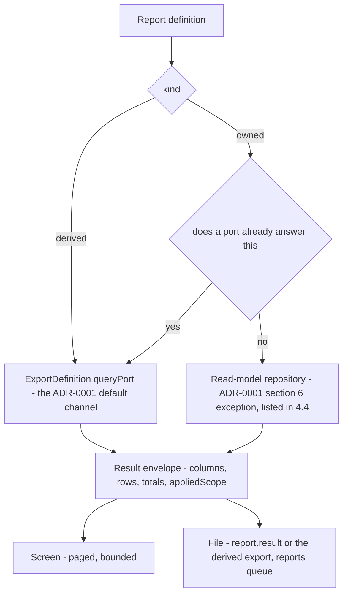
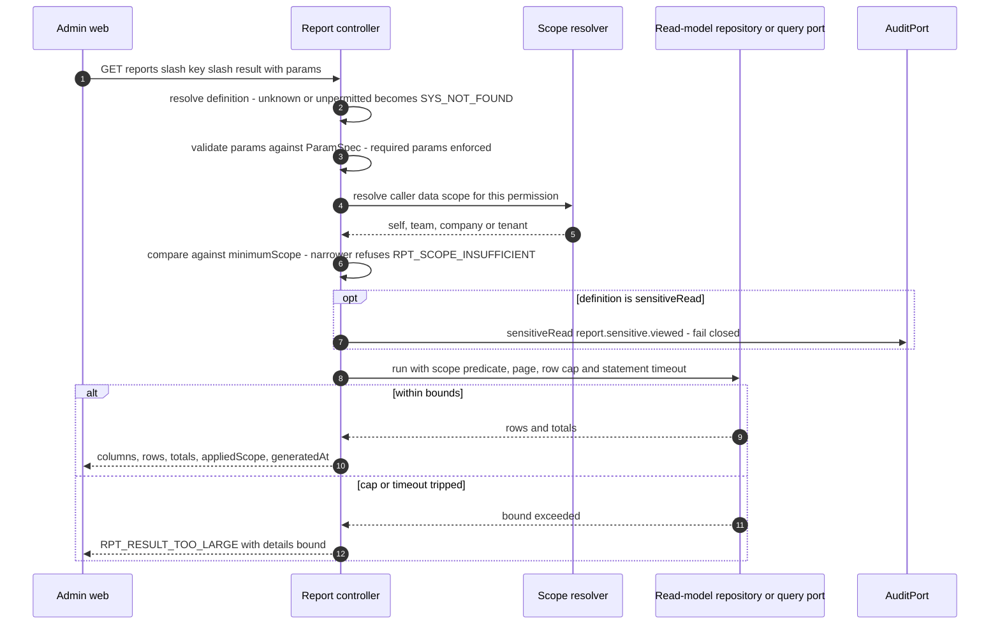
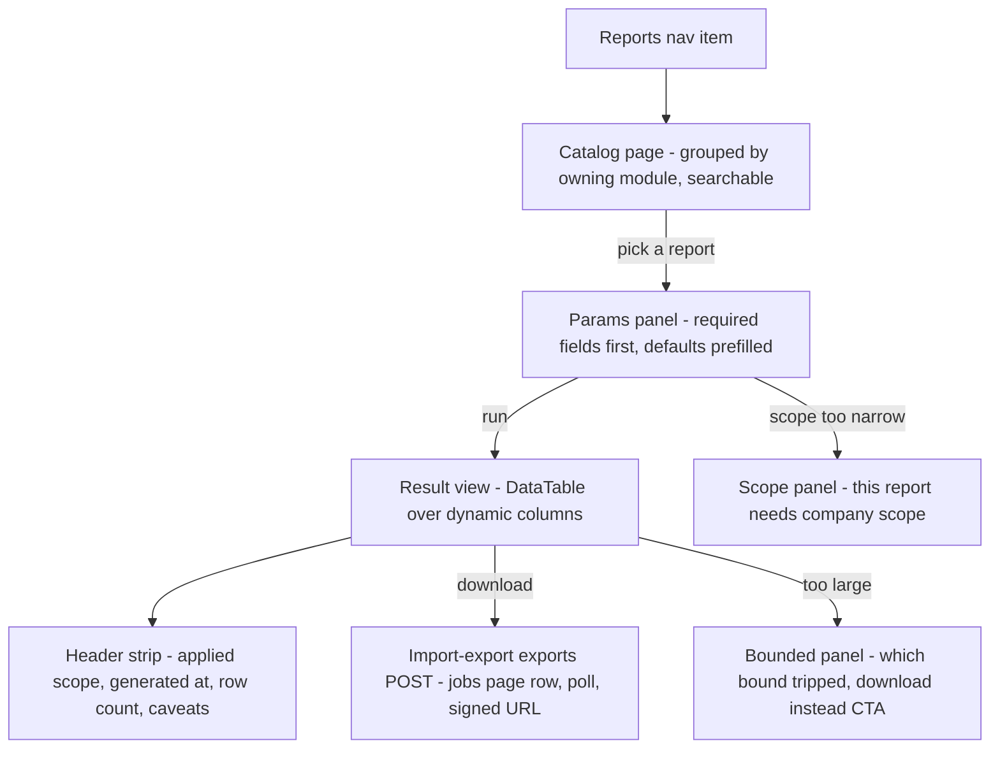

# Module: Reports

Status: Active (Phase 3) · Related ADRs: `ADR-0001` (module boundaries — **§6 amended this session**; this module is the designated read-model consumer that exception was written for), `ADR-0002` (tenant scoping), `ADR-0005` (two-axis model — the whole of §3's scope machinery), `ADR-0006` (result pattern), `ADR-0007` (envelope, offset pagination), `ADR-0010` (the `reports` queue), `ADR-0015` (every file rides the export framework) · Deliberately **not** related: `ADR-0003` (no mobile surface, no sync class — §10), `ADR-0008` (nothing here is requested or approved), `ADR-0009` (this module stores no file of its own; outputs are import-export's), `ADR-0012` (reads payroll, writes nothing), `ADR-0013` (no schema — §4.1), `ADR-0014` (no PDF in V1 — A-084), `ADR-0016` (no encrypted column is reachable from here, by rule — BR-RPT-007) · Depends on: `docs/06-modules/holiday.md` (template), `docs/05-platform/import-export.md` (`ExportDefinition`, the `report.result` definition, job rows, download policy), `docs/05-platform/audit-log.md` (`AuditQueryPort`, `AuditPort.sensitiveRead`), `docs/06-modules/employee.md` (`employee_directory`), `docs/05-platform/authorization-rbac.md` (scope resolution helpers), plus every module whose tables or query ports appear in §4.4 · Consumers: `docs/06-modules/dashboard-analytics.md`

Namespace `report` (naming §4, error prefix `RPT`). A registry of code-owned, parameterized queries with two surfaces off one definition — a paged result on screen and an xlsx file through import-export. This module owns no table, mints no permission, and writes nothing.

## 1. Purpose & Scope

Every module doc's §13 ends with a **Reports** line naming the questions its data must answer. Nineteen of them do, and together they name 93 reports. This module is where those promises land: a definition registry (§4.3), the read-model channel that reaches across module boundaries to answer them (§4.4), the scope machinery that decides *whose rows* a given runner sees (BR-RPT-005/006), and one generic result contract the admin web renders all of them with.

The module is deliberately thin in every direction except the registry. Ninety-four registry rows and zero tables is the correct shape for a read-model consumer: it owns no fact, it is never the source of anything, and every number it renders belongs to the module that computed it.

**V1 exclusions:** PDF output (A-084 — every promised report is a table of numbers, and the two artifacts that must be pixel-stable for a decade already have their own render paths in payroll and tax); caching and stored results of any kind (A-085 — a stale report is a wrong report; caching is dashboard-analytics' declared scope); saved report views and scheduled recurring runs (A-086); any mobile surface (A-087); tenant-authored reports or a query builder; CSV (import-export's exclusion, inherited); cross-tenant or platform-wide aggregates (system-administration owns platform health).

## 2. Actors & Permissions

| Action | Permission key | Data scope | Employee | Manager | HR Staff | HR Admin | Payroll Admin | System Administrator |
|---|---|---|---|---|---|---|---|---|
| Browse the report catalog | — (authenticated; rows filtered to the caller's permissions) | n/a — catalog is metadata | ✅ | ✅ | ✅ | ✅ | ✅ | ✅ |
| Read one definition's parameter spec | the definition's `requiredPermission` | n/a | per definition | per definition | per definition | per definition | per definition | per definition |
| Run a report on screen | the definition's `requiredPermission` | the definition's `minimumScope`, narrowed to the runner's own | per definition | per definition | per definition | per definition | per definition | per definition |
| Download a report | same key; enqueued through import-export §7 | same | per definition | per definition | per definition | per definition | per definition | per definition |

**This module mints no permission key of its own.** Every gate above is a key that already exists in the owning module's namespace — `payroll.run.export`, `leave.balance.read`, `announcement.post.read`, and so on. The catalog is authenticated because a list filtered to the caller's entitlements is already empty for someone entitled to nothing, and a second gate over an empty set buys nothing while costing an immortal key in every role template and every access review forever (ADR-0005: additive-only, never deleted).

Reports is the first module in the handbook to reach `done` with **zero tables and zero permission keys** — it owns no data and grants no access, which is what a read-model consumer should be.

## 3. Business Rules

| # | Rule |
|---|---|
| BR-RPT-001 | **Definitions are code-owned**, on BR-IMP-001's law: a report is registered in code, in the owning module's §13, and in this doc's §4.3 table, in the same session. No tenant-built reports, no query builder, no mapping UI. |
| BR-RPT-002 | **A report never grants access the owning module would refuse.** Every definition's `requiredPermission` is an existing key in the *owning* module's namespace. Where no suitable key exists, the owning module mints it in its own namespace — never this one. This is the module's load-bearing security property: reports is a lens over data, never a door into it. |
| BR-RPT-003 | **Two kinds.** A **derived** report is an existing `ExportDefinition` given a screen surface: same key, same params, same `queryPort`, no new SQL. An **owned** report is a cross-module aggregate this module queries through its own read-model repositories under ADR-0001 §6. The §6 exception is used **only where no port already answers the question** — the licence is wide, the usage is not. |
| BR-RPT-004 | **One key space.** A derived report's key *is* its `ExportDefinition` key. An owned report's key may never equal one. `report.result`'s `reportKey` param therefore resolves to exactly one thing across both registries. |
| BR-RPT-005 | **Scope gates the rows.** Each definition declares `minimumScope` (`self` / `team` / `company` / `tenant`). The read-model repository applies the runner's own scope as a row predicate using the shared reporting-line and company-membership helpers (ADR-0005 §2). A runner whose scope is narrower than `minimumScope` is **refused** with `RPT_SCOPE_INSUFFICIENT` — never served a silently narrowed result. |
| BR-RPT-006 | **Every result stamps the scope it was computed at** — `appliedScope` in the screen envelope and in the file's header block, always, including at `tenant`. A narrowed aggregate is not a partial answer: "Headcount 12" renders identically whether it means a manager's team or a whole company, and nothing in the number itself says which. The stamp is what makes the number readable. |
| BR-RPT-007 | **No encrypted column, no masked column, ever.** ADR-0001 §6 constraint (b) — written for published views, **extended to designated read-model consumers this session** — binds every query here. A report over a derived export reads that definition's `columnSets.base` **only**; its gated sets stay reachable through import-export's own path, unchanged. Consequence, true by construction rather than by discipline: no report output ever carries a gated column set, so `document.download.gated_export` never fires from a report. |
| BR-RPT-008 | **Read-only, and the owner's own predicates come with the rows.** No query here writes anything, ever. Every read filters `deleted_at IS NULL` on soft-deleted tables and carries the owning module's own visibility predicates — most pointedly payroll's `kind` filter (BR-PAY-026), without which `SUM(amount)` over `payroll_run_lines` reports the employer's statutory costs as employee gross. A report that drops an owner's predicate reports a different number than the owner's own screen, which is worse than reporting nothing. |
| BR-RPT-009 | **Identity comes from the published view.** Employee number and full name are read from `employee_directory` (ADR-0001 §6, employee.md §13); `employees` is read only for attributes that view does not publish, and never for an ADR-0016 encrypted column. |
| BR-RPT-010 | **The inline surface is bounded twice** — row count and statement duration. Definitions declare which params are **required**, so an unbounded source can never be queried unbounded. Tripping either bound refuses with `RPT_RESULT_TOO_LARGE` and `details.bound`, pointing at the file path, which takes the same query with a worker budget. The row bound is not a new number: api-standards §5.2 already caps offset depth at `page × pageSize ≤ 10 000`, past which the result is unpageable regardless. |
| BR-RPT-011 | **No stored results and no cache.** Every run is a live query; every result carries `generatedAt`; a number is never served from a row someone forgot to refresh. A report is pulled to answer a question or file a figure, and "as of a moment we did not tell you" is the failure mode that matters here. Glanceable, cache-tolerant numbers are dashboard-analytics' scope by manifest. |
| BR-RPT-012 | **Sensitive reports are audited reads.** A definition carrying `sensitiveRead: true` calls `AuditPort.sensitiveRead` under action key `report.sensitive.viewed` (audit-log §4.3, registered this session) — in-request and fail-closed on the screen path, in-worker at generation on the file path. The flag marks reports rendering an **individual's compensation or statutory tax position**; nine of the ninety-four carry it. The two audit reports are exempt: `audit.log.queried` already fires inside the port they call, and a second row would double-count one read. |
| BR-RPT-013 | **File output rides the export framework wholesale.** A derived report downloads as the `ExportDefinition` it derives from. An owned report downloads as `report.result` — import-export's first **definition-resolved** definition, whose permission, columns, and query are read from the `ReportDefinition` named in `params.reportKey` at enqueue, the same moment BR-IMP-010 freezes the requester's column entitlements. Either way the job routes to the `reports` queue (§12). This module registers no job, no processor, and no export endpoint. |
| BR-RPT-014 | **The catalog is the existence boundary.** `GET /reports` returns only definitions whose `requiredPermission` the caller holds. A key absent from a caller's catalog answers `SYS_NOT_FOUND` on every other endpoint (catalog §2 existence hiding), exactly as import-export's `/definitions` behaves. |
| BR-RPT-015 | **Admin web only.** No report surface exists on mobile, no report participates in any ADR-0003 sync class, and nothing here is queue-reachable from a device. |
| BR-RPT-016 | **Adding a report is a code change and nothing else.** No migration, no endpoint, no permission, no screen. That property is what makes a ninety-four-row registry affordable, and it is a constraint on future rows as much as a description of the present ones: a proposed report that needs a table, a key, or a bespoke page is not a report. |

## 4. Domain Model

### 4.1 Owned tables: none

This module owns **no table**. The statement is a design decision, not an omission, and it holds in three places:

- **Definitions are code** (BR-RPT-001), so the registry needs no storage.
- **File runs are `export_jobs` rows**, owned by import-export. A second job table would mean a second polling contract, a second purge cron, and a second place the retention key has to be right.
- **Screen runs are queries**, and BR-RPT-011 forbids storing their results.

The consequence worth stating plainly: **there is no such thing as a stored report result in this system.** Nothing is lost by that. The compliance question — who pulled the salary register, and when — is answered by the sensitive-read trail (BR-RPT-012), which is an access record rather than a copy of the data, and is exactly the artifact the question wants.

No entity, therefore no lifecycle and no `stateDiagram-v2` (holiday.md §4.1's template note applies: when an entity has no lifecycle, say so rather than forcing a diagram). The export job's linear lifecycle belongs to import-export §4.2 and is not restated.

### 4.2 The definition contract

```ts
// src/modules/report/definitions/report-definition.ts
export type ReportScope = 'self' | 'team' | 'company' | 'tenant';

export interface ReportColumn {
  key: string;
  header: LocalizedText;                 // id + en, notification §BR-NTF-001 pattern
  type: 'string' | 'date' | 'datetime' | 'integer' | 'decimal' | 'money' | 'percent' | 'boolean';
  align?: 'left' | 'right';
  /** Aggregated in the totals row when the column is numeric and the report declares one. */
  total?: 'sum' | 'avg' | 'none';
}

export interface ReportDefinition {
  key: string;                           // '<owning-ns>.<subject>' — BR-RPT-004
  kind: 'owned' | 'derived';             // BR-RPT-003
  owner: string;                         // owning module doc path, for the seam inventory
  requiredPermission: string;            // an existing key in the OWNING module — BR-RPT-002
  minimumScope: ReportScope;             // BR-RPT-005
  params: ParamSpec[];                   // same shape import-export validates against
  columns: ReportColumn[];               // 'derived' takes the export's columnSets.base — BR-RPT-007
  source:
    | { via: 'port'; port: PortRef }     // 'derived' always; 'owned' when a port already answers
    | { via: 'read-model'; repository: RepositoryRef };  // ADR-0001 §6 — declared in §4.4
  sensitiveRead?: boolean;               // BR-RPT-012
  inlineRowCap?: number;                 // default 10 000 — BR-RPT-010
}
```

`derived` rows carry no `columns` of their own: the renderer reads the `ExportDefinition`'s `columnSets.base` so the screen and the file cannot drift apart. That is the same property Q1 bought at the module level, applied one layer down.

**Why the two `source` shapes are not one.** The channel is the boundary, and it is the thing ADR-0001 §6 asks this module to make visible. A `port` source is the ADR's **default** path and costs nothing at extraction — it is already an interface. A `read-model` source is the **exception**, and every one of them is an extraction seam listed in §4.4. Collapsing them into one field would make the count impossible, and the count is the point.



### 4.3 Report registry

Ninety-four definitions, covering all 93 reports promised across nineteen `done` module docs. Announcement's first promise splits into two rows — the per-post register and the rate computed over it — and nothing is dropped. **Derived** rows name the `ExportDefinition` they are the screen surface of; every other row is **owned**. `Scope` is `minimumScope`; `S` marks `sensitiveRead: true`.

| Key | Kind | Scope | S | Params | Permission | Contract |
|---|---|---|---|---|---|---|
| `organization.headcount` | owned | team | | `asOf`, `groupBy` = company \| branch \| department \| job_level, optional `companyId`/`branchId`/`departmentId` | `organization.structure.read` | Live headcount as of a date at the requested grouping. The denominator every other ratio in this registry divides by, which is why it takes one `groupBy` rather than existing four times |
| `organization.vacancy` | owned | company | | `companyId`, optional `branchId`/`departmentId` | `organization.structure.read` | Positions carrying no live holder as of today, with department, branch, and job level. Multi-holder positions are counted by live holders, not by an establishment number the schema does not hold |
| `organization.placement_history` | owned | team | | `companyId`, `from`, `to`, optional `employeeId` | `organization.assignment.read` | Every effective-dated placement change in the window: employee, prior and new department, position, branch, job level, effective date, and who recorded it |
| `employee.headcount_by_status` | owned | company | | `asOf`, `companyId`, optional `branchId`/`departmentId` | `employee.master.read` | Live employees grouped by status and employment type — the PKWT/PKWTT split HR reports upward every month |
| `employee.contract_expiry` | owned | team | | `companyId`, `withinDays` default 90, optional `branchId`/`departmentId` | `employee.master.read` | PKWT contracts ending inside the window with days remaining and current status; the renewal worklist behind employee.md's contract reminders |
| `employee.data_change_volume` | owned | company | | `companyId`, `from`, `to`, optional `fieldGroup`/`status` | `employee.master.read` | Self-service change requests by field group and outcome, with approval turnaround. Values are never rendered — this counts requests, and BR-EMP-003 owns who may see what changed |
| `employee.turnover` | owned | company | | `companyId`, `from`, `to` as months, optional `branchId`/`departmentId` | `employee.master.read` | **Registered 2026-08-04** (dashboard-analytics.md, UC-RPT-007's first live exercise). Per month: joiners, leavers, average headcount, turnover rate. Conventions are a **choice, not a fact**, so they are pinned here and rendered as a caveat: leavers counts every employee entering a terminal status in the month, **all causes including PKWT expiry**; average headcount is start-of-month plus end-of-month over two; rate is leavers ÷ average headcount (A-091). `averageHeadcount` doubles as the headcount-trend series, so one definition answers four dashboard widgets |
| `shift.roster_coverage` | owned | team | | `companyId`, `from`, `to`, optional `branchId` | `shift.roster.read` | Scheduled headcount per branch per date against that branch's live employees. Resolve-on-read means an uncovered day exists only as an absence of rows, and this is the report that renders it |
| `shift.unscheduled_employees` | owned | team | | `companyId`, `from`, `to`, optional `branchId`/`departmentId` | `shift.roster.read` | Employees with no resolved scheduled day in the window — the roster hole the assignment ladder hides until someone fails to clock in |
| `shift.distribution` | owned | company | | `companyId`, `from`, `to`, optional `branchId` | `shift.roster.read` | Scheduled days per shift definition, with a night-shift subtotal and a cross-midnight count |
| `attendance.recap` | derived | team | | `companyId`, `from`, `to`, optional `branchId`/`departmentId`/`employeeId` | `attendance.record.export` | Screen surface over `ExportDefinition attendance.recap` — per-employee period totals: scheduled, present, absent, leave, incomplete, off-worked days and worked, late, early, overtime-candidate minutes |
| `attendance.lateness_ranking` | owned | team | | `companyId`, `from`, `to`, optional `branchId`/`departmentId`, `minMinutes` | `attendance.record.read` | Employees ranked by total late minutes and absence days. Lateness is raw measured minutes, never a status — attendance demoted it deliberately and this report keeps the demotion |
| `attendance.anomaly` | owned | team | | `companyId`, `from`, `to`, optional `branchId`, `flag` | `attendance.record.read` | Days carrying an out-of-fence, unresolved, or missing-punch flag, with the recorded distance. The review queue's reporting twin |
| `attendance.overtime_candidate` | owned | team | | `companyId`, `from`, `to`, optional `branchId`/`departmentId` | `attendance.record.read` | Measured minutes beyond schedule with no approved overtime order behind them. Overtime's strict model makes these unpayable by design; this is where they are visible |
| `attendance.headcount_present` | owned | team | | `companyId`, `date`, optional `branchId` | `attendance.record.read` | Present, absent, on-leave, and off counts per branch for one date — the morning board, as a report rather than a widget |
| `leave.balance` | derived | team | | `companyId`, `asOf`, optional `branchId`/`departmentId`/`leaveTypeId` | `leave.balance.export` | Screen surface over `ExportDefinition leave.balance` — per employee per type per period: accrued, carried in, adjusted, used, expired, pending, available, carry expiry. The liability listing, in **days**; payroll owns the rate |
| `leave.usage` | owned | team | | `companyId`, `from`, `to`, optional `branchId`/`departmentId`/`leaveTypeId` | `leave.request.read` | Days taken by type, department, and month, counted from `covered_dates` pinned at approval rather than recomputed |
| `leave.absence_reconciliation` | owned | team | | `companyId`, `from`, `to`, optional `branchId` | `leave.request.read` | Attendance days marked `absent` carrying no approved leave, and approved leave days carrying a punch. Reads `attendance_days` beside `leave_requests` — one of the joins that could not be a port |
| `leave.carryover_forecast` | owned | company | | `companyId`, `asOf`, optional `branchId`/`leaveTypeId` | `leave.balance.read` | Balances due to expire under the carry-over policy, with expiry date and days at risk per employee |
| `leave.coverage_calendar` | owned | team | | `companyId`, `from`, `to`, optional `departmentId` | `leave.request.read` | Approved leave per employee per date — the who-is-out grid a manager plans against |
| `overtime.cost_driver` | owned | team | | `companyId`, `from`, `to`, optional `branchId`/`departmentId` | `overtime.request.read` | Multiplier-hours by department and month. **Hours only** — the labour-law/wage-law boundary holds here exactly as it holds in the module |
| `overtime.unordered_reconciliation` | owned | team | | `companyId`, `from`, `to`, optional `branchId` | `overtime.request.read` | Measured overtime minutes with no approved order, per employee per month (UC-OVT-007's reporting surface) |
| `overtime.cap_watchlist` | owned | company | | `companyId`, `month`, optional `branchId`, `thresholdPct` default 80 | `overtime.policy.read` | Employees at or approaching the statutory cap, with the cap value in force for that month read from settings, so a sector exemption is visible in the report rather than only in the audit trail |
| `overtime.day_class_analysis` | owned | company | | `companyId`, `from`, `to`, optional `branchId` | `overtime.request.read` | Occurrences and multiplier-hours split by day class — normal, rest day, holiday — using the per-occurrence tier trace the module already stores |
| `overtime.meal_obligation` | owned | company | | `companyId`, `from`, `to`, optional `branchId` | `overtime.request.read` | Occurrences that crossed the meal-entitlement threshold, per employee per month. A count of obligations, not a cost |
| `overtime.toil_ledger` | owned | company | | `companyId`, `from`, `to`, optional `branchId` | `overtime.request.read` | TOIL hours earned here against redemptions in leave's ledger. Reads `overtime_occurrences` beside `leave_ledger_entries` — TOIL lives in leave's balance by design, so the two-sided view exists only at this layer |
| `overtime.approver_volume` | owned | company | | `companyId`, `from`, `to` | `overtime.request.read` | Orders raised and approved per approver, with median decision time |
| `payroll.run_recap` | derived | company | S | `runId`, optional `branchId`/`departmentId` | `payroll.run.export` | Screen surface over `ExportDefinition payroll.run_recap` — the register: payslip number, gross, per-component amounts, deductions, PPh 21 withheld, net, payment state |
| `payroll.component_cost` | owned | company | | `runId`, or `companyId` + `from`/`to`, optional `branchId`/`departmentId`, `groupBy` = department \| branch \| month (**`month` added 2026-08-04**, dashboard-analytics.md) | `payroll.run.read` | Component totals at the requested grouping. **Filters `kind` explicitly** (BR-PAY-026): without the predicate `employer_cost` lines report as employee gross, silently, on every row. The `month` grain is a grain, not a second question — a separate monthly definition over the same tables is exactly the drift BR-RPT-008's parity tests exist to catch |
| `payroll.payment_reconciliation` | owned | company | S | `runId`, optional `paymentState` | `payroll.run.read` | Per employee: net, payment state, bounce count, payment reference. **No bank columns** — those are a gated set on `payroll.bank_file` and BR-RPT-007 keeps them out of every report |
| `payroll.retro_register` | owned | company | S | `companyId`, `from`, `to` | `payroll.run.read` | Open and cleared retro flags with the dirty period, the cause, and the run that absorbed them. The worklist a human selects from, as a report |
| `payroll.thr_register` | owned | company | S | `companyId`, `year` | `payroll.run.read` | THR runs with per-employee amount and proration basis |
| `payroll.ytd_summary` | owned | company | S | `companyId`, `year`, optional `employeeId`/`branchId`/`departmentId` | `payroll.run.read` | The YTD ledger per employee: gross, taxable regular and irregular, deductible contributions, PPh 21 withheld — the figures December's recalculation runs on |
| `tax.monthly_withholding` | derived | company | S | `companyId`, `taxMonth` | `tax.form.read` | Screen surface over `ExportDefinition tax.monthly_withholding`, **base columns only** — gross, taxable regular and irregular, TER category and rate, PTKP status, non-NPWP flag, withheld. The definition's gated NIK/NPWP set stays reachable through import-export's own path and never through a report |
| `tax.annual_summary` | derived | company | S | `companyId`, `taxYear` | `tax.form.read` | Screen surface over `ExportDefinition tax.annual_1721a1`, base columns only — the per-employee annual position behind each issued form |
| `tax.ptkp_distribution` | owned | company | | `companyId`, `taxYear` | `tax.profile.read` | Employees per PTKP status for the year, from the pinned profile rather than the live employee record — a live change never rewrites a pinned year, and this report shows the pinned truth |
| `tax.non_npwp_exposure` | owned | company | S | `companyId`, `taxYear` | `tax.profile.read` | Employees flagged non-NPWP and the surcharge borne. Renders the **flag**, never an NPWP value |
| `tax.form_issuance_status` | owned | company | | `companyId`, `taxYear` | `tax.form.read` | Issued, revised, and outstanding 1721-A1 per employee with revision number and issue date — issuance is an explicit revisioned act, and this is how you see which acts are missing |
| `tax.prior_employer_completeness` | owned | company | S | `companyId`, `taxYear` | `tax.profile.read` | Mid-year joiners with no prior-employer figures recorded. The December preflight: every row here is a 1721-A1 that will be wrong if nobody acts |
| `bpjs.contribution_recap` | owned | company | | `companyId`, `taxMonth`, optional `program` | `bpjs.report.export` | Per program: base actually used after floor and cap, employee part, employer part, headcount. Aggregate — the per-employee detail is the `bpjs.monthly_contribution` export, which is gated |
| `bpjs.employer_cost_trend` | owned | company | | `companyId`, `from`, `to` as months | `bpjs.report.export` | Employer premium per program per month; the employer-cost line finance forecasts from |
| `bpjs.coverage_exceptions` | owned | company | | `companyId`, `asOf` | `bpjs.employee.read` | Employees carrying a program exclusion, with reason and who set it. Participation is default-on with sparse exclusions, so this report is short by design and long only when something is wrong |
| `bpjs.jp_age_ceiling` | owned | company | | `companyId`, `withinMonths` default 6 | `bpjs.employee.read` | Employees reaching the JP age ceiling inside the window, derived from birth date. The ceiling is derived and never stored, which is exactly why it needs a report |
| `bpjs.unregistered_companies` | owned | tenant | | — | `bpjs.registration.read` | Companies with no live registration version, per program. Tenant-scoped because a company that has no registration cannot be found by filtering on that company |
| `bpjs.risk_class_history` | owned | company | | `companyId` | `bpjs.registration.read` | JKK risk class versions with effective dates and who recorded each |
| `expense.by_category` | owned | team | | `companyId`, `from`, `to`, optional `branchId`/`departmentId`/`categoryId` | `expense.claim.read` | Approved amounts by category and month |
| `expense.by_cost_owner` | owned | team | | `companyId`, `from`, `to`, optional `branchId`/`departmentId` | `expense.claim.read` | Approved amounts by department and cost owner |
| `expense.claim_aging` | owned | team | | `companyId`, `asOf` | `expense.claim.read` | Pending claims by age bucket and current approval step, with the approver holding each |
| `expense.over_policy` | owned | company | | `companyId`, `from`, `to` | `expense.claim.read` | Claims carrying over-policy lines and the approver who passed them. Policy limits advise rather than block, which makes this the only place the advice is ever counted |
| `expense.disbursement_reconciliation` | owned | company | | `companyId`, `from`, `to`, optional `route` | `expense.claim.read` | Approved claims by route — payroll and finance — with payment state and, for payroll-route claims, the run that carried them. **No bank columns** |
| `expense.unpaid_liability` | owned | company | | `companyId`, `asOf` | `expense.claim.read` | Approved and unpaid totals by department as of a date |
| `asset.registry` | derived | company | | `companyId`, optional `branchId`/`categoryId`/`status` | `asset.item.export` | Screen surface over `ExportDefinition asset.registry` — the inventory: code, name, category, serial, status, condition, branch, current holder, purchase date and cost, warranty |
| `asset.by_employee` | owned | team | | `companyId`, optional `branchId`/`departmentId` | `asset.item.read` | Open assignments per employee with item count and total purchase value |
| `asset.custody_aging` | owned | company | | `companyId`, `asOf` | `asset.item.read` | Open assignments by age bucket, and items held past their expected return date |
| `asset.unreturned_by_exit` | owned | company | | `companyId`, optional `from`/`to` | `asset.item.read` | Open assignments whose holder is in a terminal employment status. Joins `asset_assignments` against employee status — the offboarding gap, and the report the module exists to make impossible to miss |
| `asset.incident_volume` | owned | company | | `companyId`, `from`, `to`, optional `categoryId` | `asset.item.read` | Incidents by type and category, per month |
| `asset.loss_value` | owned | company | | `companyId`, `from`, `to` | `asset.item.read` | Purchase value of lost and damaged items with recovery status. Money is recorded and never moved (BR-AST-009), and this report is the whole of what recording it buys |
| `asset.acknowledgment_coverage` | owned | company | | `companyId`, `asOf` | `asset.item.read` | Open assignments with and without an employee acknowledgment, by branch |
| `recruitment.funnel` | owned | company | | `companyId`, `from`, `to`, optional `requisitionId` | `recruitment.candidate.read` | Applications per stage with drop-out reasons. Reads `stage` and `status` as the two axes they are — a single-enum model could not produce this report at all |
| `recruitment.time_to_fill` | owned | company | | `companyId`, `from`, `to` | `recruitment.requisition.read` | Days from `opened_at` to conversion per requisition, with median and p90 |
| `recruitment.time_in_stage` | owned | company | | `companyId`, `from`, `to` | `recruitment.candidate.read` | Median and p90 days per stage across applications in the window |
| `recruitment.source_effectiveness` | owned | company | | `companyId`, `from`, `to` | `recruitment.candidate.read` | Applications, offers, and hires per `candidates.source`, joined against `requisition_publications` — which channel we advertised on against which channel produced hires |
| `recruitment.offer_outcomes` | owned | company | | `companyId`, `from`, `to`, optional `jobLevelId` | `recruitment.candidate.read` | Acceptance and decline rates by job level and by offer revision count. Offers are versioned rows, so revision count is a real column rather than an inference |
| `recruitment.interviewer_load` | owned | company | | `companyId`, `from`, `to` | `recruitment.candidate.read` | Interviews held and scorecards outstanding per panelist, with turnaround |
| `recruitment.aged_requisitions` | owned | company | | `companyId`, `asOf` | `recruitment.requisition.read` | Open requisitions past their target start date, with days over and hiring manager |
| `recruitment.hires_per_requisition` | owned | company | | `companyId`, `from`, `to` | `recruitment.requisition.read` | Hires against `openings` per requisition, with fill rate |
| `performance.rating_distribution` | owned | company | | `cycleId`, optional `branchId`/`departmentId`/`jobLevelId` | `performance.participant.read` | Counts per rating level **before and after calibration side by side**, which is the comparison calibration writing beside the rating rather than over it was built to preserve |
| `performance.calibration_activity` | owned | company | | `cycleId` | `performance.participant.read` | Calibration rate and override rate per manager — the number that finds the manager who rates everyone Exceeds |
| `performance.goal_completion` | owned | team | | `cycleId`, optional `departmentId` | `performance.cycle.read` | Completion and average achievement by department. Achievement is display-only (BR-PRF-012) and is labelled as such in the output, because it is not the score's input |
| `performance.cycle_funnel` | owned | company | | `cycleId` | `performance.cycle.read` | Participants per state — the launch-to-release progress view |
| `performance.overdue_reviews` | owned | team | | `cycleId`, `asOf` | `performance.participant.read` | Self and manager review seats past due, by reviewer. Keyed by seat `kind`, so a manager holding forty seats appears once per outstanding seat |
| `performance.acknowledgement_rate` | owned | company | | `cycleId`, optional `departmentId` | `performance.participant.read` | Released results acknowledged against released, by department |
| `performance.development_items` | owned | team | | `companyId`, optional `status`/`departmentId` | `performance.participant.read` | Open, completed, and overdue development items by employee and department — keyed by employee, which is what makes "carried forward" true across cycles |
| `performance.rating_movement` | owned | company | | `cycleId`, `previousCycleId` | `performance.participant.read` | Per employee, the two cycles' final ratings side by side. **Legitimately breaks across a rating-scale change** (performance-goals §9); the output labels each column with its scale so the break is visible rather than silent |
| `training.certification` | derived | team | | `companyId`, optional `branchId`/`departmentId`/`expiringWithinDays` | `training.certification.export` | Screen surface over `ExportDefinition training.certification` — the compliance register: credential, issuer, number, issued, expires, days remaining, scan attached. Covers both the expiring-in-30/60/90 cut and the lapsed one through one param |
| `training.cost` | owned | team | | `companyId`, `from`, `to`, optional `branchId`/`departmentId`/`categoryId`/`courseId` | `training.enrollment.read` | Cost by department, branch, category, and course, summed off `training_enrollments.cost_amount` — the only column cost lives in (BR-TRN-010) |
| `training.cost_per_employee` | owned | team | | `companyId`, `year` | `training.enrollment.read` | Annual spend per employee, including seats marked no-show, whose fee is exactly the number this report exists to surface |
| `training.delivery_volume` | owned | company | | `companyId`, `from`, `to` | `training.session.read` | Sessions delivered and headcount trained per period, by delivery mode |
| `training.attendance_rate` | owned | team | | `companyId`, `from`, `to`, optional `departmentId` | `training.enrollment.read` | Attended against seats taken, with no-show rate by department — the number that finds the team booking seats it does not use |
| `training.credential_coverage` | owned | company | | `companyId`, `asOf`, optional `positionId` | `training.certification.read` | Live credentials per position against that position's holders. The report training's second ⚠️ VERIFY is really about: which statutory certifications a role must hold is a regulatory question this system reports on but does not decide |
| `training.development_linkage` | owned | company | | `companyId`, `from`, `to` | `training.enrollment.read` | Development items with a training enrollment behind them against those without. Reads `development_items` beside `training_enrollments` across the FK training already owns |
| `training.provider_spend` | owned | company | | `companyId`, `from`, `to` | `training.enrollment.read` | Spend grouped by provider — **and provider is free text, so the grouping fragments** (A-069). The caveat is rendered in the report header, not hidden in a doc |
| `announcement.acknowledgment` | derived | company | | `announcementId`, optional `outstandingOnly` | `announcement.post.export` | Screen surface over `ExportDefinition announcement.acknowledgment` — the per-post register: every recipient, targeted-at, acknowledged-at or blank. The outstanding list |
| `announcement.ack_rate` | owned | company | | `companyId`, `from`, `to` | `announcement.post.read` | Acknowledged against recipients per post. The denominator is the frozen recipient set, which is why this rate is reproducible months later and a live-rule rate would not be |
| `announcement.ack_rate_by_dimension` | owned | company | | `announcementId`, or `companyId` + `from`/`to`; `groupBy` = department \| branch \| job_level | `announcement.post.read` | The same rate cut by dimension — the cut that finds the team nobody is reading to |
| `announcement.time_to_acknowledge` | owned | company | | `companyId`, `from`, `to` | `announcement.post.read` | Distribution of acknowledged-at minus published-at, bucketed, with median and p90 |
| `announcement.publishing_volume` | owned | company | | `companyId`, `from`, `to` | `announcement.post.read` | Posts published per period by author, split by whether acknowledgment was required |
| `announcement.per_employee` | owned | team | | `employeeId`, optional `from`/`to` | `announcement.post.read` | Everything one person was targeted with and what they acknowledged — the report a dispute actually asks for. `minimumScope` is `team` rather than `self`: the employee's own view of this is the mobile inbox, not a report surface |
| `announcement.attachment_volume` | owned | company | | `companyId`, `from`, `to` | `announcement.post.read` | Attachments distributed per period — count and total bytes, by post |
| `document.expiry` | owned | team | | `companyId`, `withinDays` default 60, optional `category` | `employee.document.read` | Employee documents expiring or already expired, by category and employee. Renders metadata only — no signed URL is minted from a report, so a row here is never a download |
| `authz.access_review` | owned | company | | `companyId`, `asOf`, optional `roleId` | `authz.assignment.read` | Who holds which role in which company, with the permission count each role carries. The quarterly access review, as one file instead of ten screenshots |
| `audit.change_history` | owned | company | | `entityType` + `entityId`, or `companyId` + `from`/`to`; optional `action`/`actorUserId` | `audit.log.read` | Channel-1 diffs for one entity or one window, through `AuditQueryPort` — **never `audit_logs` directly** (audit-log §11). Masked fields arrive masked; there is no unmask parameter here either |
| `audit.access_review_history` | owned | company | | `companyId`, `from`, `to` | `audit.log.read` | Role and permission assignment changes over the window, through the same port. The history behind `authz.access_review`'s snapshot |
| `approval.aging` | owned | team | | `companyId`, `asOf`, optional `requestType` | `approval.instance.read` | Pending instances by age bucket and current step, with SLA breaches and the assignees holding each. Source is the engine's oversight query, covering all eight request types in one report rather than one per module |

*(One table, rows contiguous. The 2026-08-03 repair of import-export §4.3 is the reason: a blank line between module groups terminates a GFM table and renders every row after it as literal text.)*

**Eight derived, eighty-six owned.** The ratio is the honest one and it is the argument for BR-RPT-003's second sentence: eight of the ninety-four questions were already answered by an existing export, and eighty-six need a join no port offers. Where a port exists it is used; the exception carries the rest.

**Nine sensitive-flagged**, all in payroll and tax, and the boundary is stated rather than sensed: **the flag marks a report that renders an individual's compensation or statutory tax position.** Aggregates over the same tables — `payroll.component_cost`, `bpjs.contribution_recap` — are unflagged because a departmental total is not a person's salary. Expense is unflagged throughout: a reimbursement is money owed, not compensation, and every claim in those reports was already visible to its approval chain.

### 4.4 Read-model seam inventory

ADR-0001 §6 requires this module's cross-module reads be "explicitly marked as extraction seams in their module docs." This is that marking — the mirror of rule 5's outbound-FK inventory: every other module lists what it points at, and reports lists what it reads.

| Owning module | Channel | Read |
|---|---|---|
| `core-schema` | read-model | `companies`, `branches` |
| `employee.md` | **published view** | `employee_directory` — identity on every report that names a person (BR-RPT-009) |
| `employee.md` | read-model | `employees` for status, employment type, join and birth dates; `employee_contracts`, `employee_data_change_requests`, `employee_documents`, `employee_status_history`. **No ADR-0016 encrypted column is read from any of these** |
| `organization.md` | read-model | `departments`, `positions`, `job_levels`, `org_assignments` |
| `shift.md` | read-model | `shifts`, `shift_patterns`, `shift_pattern_days`, `roster_assignments`, `roster_days` |
| `attendance.md` | port + read-model | `AttendanceQueryPort` for `attendance.recap`; `attendance_days`, `attendance_punches`, `attendance_periods` for the four owned attendance reports and `leave.absence_reconciliation` |
| `leave.md` | port + read-model | `LeaveQueryPort` for `leave.balance`; `leave_requests`, `leave_balances`, `leave_ledger_entries`, `leave_types` for the four owned leave reports and `overtime.toil_ledger` |
| `overtime.md` | read-model | `overtime_requests`, `overtime_occurrences`, `overtime_exempt_job_levels` |
| `payroll.md` | port + read-model | the `payroll.run_recap` export's query port; `payroll_runs`, `payroll_run_employees`, `payroll_run_lines`, `payroll_components`, `payroll_retro_flags`, `payroll_ytd_ledger` — every aggregate over `payroll_run_lines` carrying BR-PAY-026's `kind` predicate |
| `tax-pph21.md` | port + read-model | the two tax exports' query ports, base column sets only; `employee_tax_profiles` and the platform `tax_ptkp_amounts` |
| `bpjs.md` | read-model | `company_bpjs_registrations`, `employee_bpjs_exclusions`, `employee_bpjs_dependents`, and the platform `bpjs_program_rates` |
| `expense-reimbursement.md` | read-model | `expense_claims`, `expense_claim_lines`, `expense_categories` |
| `asset.md` | port + read-model | the `asset.registry` export's query port; `assets`, `asset_assignments`, `asset_incidents`, `asset_categories` |
| `recruitment-candidate.md` | read-model | `job_requisitions`, `job_applications`, `candidates`, `interviews`, `interview_scorecards`, `job_offers`, `requisition_publications` |
| `performance-goals.md` | read-model | `review_cycles`, `cycle_participants`, `performance_goals`, `performance_reviews`, `review_goal_ratings`, `rating_scales`, `rating_scale_levels`, `development_items` |
| `training.md` | port + read-model | `TrainingQueryPort` and the `training.certification` export's query port; `training_courses`, `training_sessions`, `training_enrollments`, `training_certifications`, `training_categories` |
| `announcement.md` | port + read-model | `AnnouncementQueryPort.acknowledgmentRegister`; `announcements`, `announcement_targets`, `announcement_recipients` |
| `document-storage.md` | read-model | `files` — metadata only; no report mints a signed URL |
| `authorization-rbac.md` | read-model | `roles`, `role_permissions`, `permissions`, `user_roles` |
| `approval-engine.md` | read-model | `approval_instances`, `approval_steps`, `approval_assignees`, `approval_actions` |
| `audit-log.md` | **port only** | `AuditQueryPort` — `audit_logs` is never read directly (audit-log §11, discharged this session) |

Twenty-one rows over twenty owning modules — employee.md appears twice because its published view and its tables are different channels with different constraints, and collapsing them would hide exactly the distinction ADR-0001 §6 draws.

The question this inventory exists to answer, and could not answer without it: *if payroll is extracted into a service, which reports break?* Five owned reports plus one derived, listed on payroll's row, and nothing else.

### 4.5 Ports consumed

- **Each derived report's `ExportDefinition.queryPort`** (8) — the contract declares `queryPort` non-optionally, so every definition has one whether or not §4.3's prose names it.
- **`AuditQueryPort`** — audit-log.md §4, **added there this session on first caller**, mirroring `GET /audit/logs`' filters with `limit`/`offset` instead of a cursor. The HTTP surface stays cursor-paged for deep scans; the port is bounded by BR-RPT-010 and never scans deep.
- **`AuditPort.sensitiveRead`** — BR-RPT-012.
- **`employee_directory`** — published read-model view, counted as an outbound read per ADR-0001 §6(d).

**Ports served: `ReportQueryPort`** — **added 2026-08-04 on first caller** (`docs/06-modules/dashboard-analytics.md`), discharging §13's forward duty:

```ts
export const REPORT_QUERY_PORT = Symbol('REPORT_QUERY_PORT');

export interface ReportQueryPort {
  /** Resolves the definition, checks its requiredPermission against ctx, resolves ctx's
   *  data scope, applies it as a row predicate, and runs live. Returns the same envelope
   *  GET /reports/{key}/result returns. */
  run(
    key: string,
    params: Record<string, unknown>,
    ctx: RequestContext,
    page?: { limit: number; offset: number },
  ): Promise<Result<ReportResult, ReportError>>;
}
```

Three properties are deliberate, and each closes a hole a plainer signature would leave open:

- **The gate is inside the port.** A caller passes its context, never a decision. `run` takes **no scope override**, so a consumer cannot widen what a report would grant — BR-RPT-002's guarantee survives the boundary instead of being re-implemented past it. Same shape as `AuditQueryPort`, which fires `audit.log.queried` inside itself for the same class of reason.
- **The port refuses `sensitiveRead: true` definitions outright.** Not a policy for callers to honour: BR-RPT-012's fail-closed trail assumes a read happens whenever rows are returned, and a caller that caches rows would satisfy that assumption on a miss and violate it on a hit. Refusing at the port makes the flagged nine unreachable through it, so no consumer can hold the mechanism wrong.
- **It returns the whole envelope**, `appliedScope` and `generatedAt` included, because a consumer rendering a number without them re-creates precisely the failure BR-RPT-006 exists to prevent — one layer further from the query, where it is harder to see.

## 5. Use Cases

**UC-RPT-001 — Browse the catalog.** `GET /reports` returns every definition whose `requiredPermission` the caller holds, with key, owning module, localized title, `minimumScope`, and whether the caller's own scope can run it. Definitions the caller cannot run are absent, not disabled — BR-RPT-014, and import-export's `/definitions` behaviour verbatim. No pagination: the catalog is bounded at ninety-four by code.

**UC-RPT-002 — Run a report on screen.** The hot path.



The order matters and is fixed: **permission, then params, then scope, then audit, then query.** The audit row precedes the read because a read audit written after a successful read is not fail-closed (UC-AUD-003), and it follows the scope check because a refused run disclosed nothing to record.

**UC-RPT-003 — Download an owned report.** The client posts to import-export's existing endpoint: `POST /import-export/exports { type: 'report.result', params: { reportKey, ...reportParams } }`. Import-export resolves the `ReportDefinition` from `reportKey`, checks *its* `requiredPermission`, validates the remaining params against *its* `ParamSpec`, and freezes the requester's entitlements exactly as BR-IMP-010 already does. The job routes to the `reports` queue, streams through the same exceljs writer with the same injection defence, and lands as an `export_jobs` row the requester alone may download. `appliedScope` and `generatedAt` are written into the file's header block (BR-RPT-006). This module contributes no endpoint to the flow.

**UC-RPT-004 — Download a derived report.** Identical, except `type` is the export's own key — `attendance.recap`, `payroll.run_recap`, `announcement.acknowledgment` — because a derived report *is* that export. The screen surface added it a viewer; the file path was already there. Gated column sets, where the export declares them, behave exactly as they always have on this path; BR-RPT-007 constrains the report surface, not the export.

**UC-RPT-005 — Run a sensitive report.** A Payroll Admin runs `payroll.ytd_summary`. Everything in UC-RPT-002 applies, plus the `AuditPort.sensitiveRead` call with `{ reportKey, params, appliedScope, rowCount, surface: 'screen' }`. On the file path the same call is made **in the worker**, at generation, with `surface: 'file'` and the `exportJobId` — in the worker rather than at enqueue because BR-AUD-007 requires the owning module to call at the access point, and the access happens where the rows are produced. A failed audit insert fails the job, which retries; no data was released.

**UC-RPT-006 — Manager runs a team-scoped report.** A department manager opens `attendance.lateness_ranking` (`minimumScope: team`). The scope resolver returns `team`; the repository restricts to their reporting subtree through the shared helper; the envelope stamps `appliedScope: 'team'` and the screen renders "Your team — 14 employees" above the grid. The same manager opening `payroll.component_cost` (`minimumScope: company`) is refused with `RPT_SCOPE_INSUFFICIENT { requiredScope: 'company', callerScope: 'team' }`, and the UI says which scope the report needs — not that they lack a permission they in fact hold.

**UC-RPT-007 — Register a new report.** The developer protocol, and the whole of what BR-RPT-016 promises: write the `ReportDefinition`, write its query, add the row to §4.3, add the sentence to the owning module's §13, same session. If the source is a new table, add it to §4.4. No migration, no permission, no endpoint, no screen. A proposed report that needs any of those four is not a report and belongs in its owning module.

**UC-RPT-008 — dashboard-analytics consumes a definition.** Forward duty, discharged by the next file: a widget names a report key and params, receives the same rows through the port added at that time, and applies its own caching. The rule stated here is the one that matters — **a widget never re-derives an aggregate a report already owns**, so a headcount widget and the headcount report cannot show different numbers.

## 6. UI Flow

Admin web only (BR-RPT-015).



- **The catalog groups by owning module**, because ninety-four flat entries is a list nobody reads. Search matches title, key, and owning module. Reports the caller cannot run are absent (BR-RPT-014) — never greyed out, which would disclose their existence.
- **The header strip is not decoration.** `appliedScope`, `generatedAt`, and row count sit above every result, and BR-RPT-006 is the reason: a number without its scope is unreadable. Rendered as a design-system metadata strip, `info` class.
- **Caveats travel with the report.** `training.provider_spend` renders A-069's fragmentation warning in the strip; `performance.rating_movement` labels each cycle column with its rating scale; `performance.goal_completion` marks achievement display-only. A caveat that lives only in a doc is a caveat nobody reading the number will see.
- **The bounded panel names which bound tripped** and puts the download CTA inline — same pattern as import-export's stale-template panel, which names the specific fix rather than the general failure.
- **The scope panel says what the report needs**, never "forbidden": the caller holds the permission, and telling them otherwise sends them to ask for a key they already have.
- **One result component for all ninety-four.** Column type drives alignment and formatting — `money` right-aligned as an IDR decimal string per ADR-0007, `percent` to one decimal, `date` in the branch's display convention. Totals row where the definition declares one.
- Download reuses the import-export jobs page verbatim — no bespoke progress UI, no second downloads list.

## 7. API

All: Queue-reachable **no** · Idempotency **—** (reads) · admin-web only. Downloads are import-export §7's endpoints and are not duplicated here.

| Endpoint | Permission | Pagination |
|---|---|---|
| `GET /api/v1/reports` | authenticated (rows filtered to the caller's permissions) | — (bounded by code) |
| `GET /api/v1/reports/{key}` | the definition's `requiredPermission` | — |
| `GET /api/v1/reports/{key}/result` | the definition's `requiredPermission` | offset |

#### GET /api/v1/reports
The catalog. Response 200: `data: [{ key, kind, owner, title, description, minimumScope, runnableAtCallerScope: boolean, sensitiveRead: boolean }]`, `meta: { count }`. Filtered per BR-RPT-014. `runnableAtCallerScope` is what lets the UI sort runnable reports first without disclosing anything the caller could not already infer from their own scope.

#### GET /api/v1/reports/{key}
The parameter spec, for the params panel. Response 200: `{ key, kind, owner, title, description, minimumScope, sensitiveRead, params: [{ name, type, required, enumValues?, default? }], columns: [{ key, header, type, align, total }] }`. Errors: unknown or unpermitted key → `SYS_NOT_FOUND`.

#### GET /api/v1/reports/{key}/result
Request: the definition's declared params as query string, plus `page`, `pageSize`, `sortBy`. Sort fields are whitelisted per definition (api-standards §5.1), and every sort appends a deterministic tiebreaker.

Response 200:
```jsonc
{
  "data": {
    "columns": [ { "key": "department", "header": "Department", "type": "string", "align": "left" },
                 { "key": "headcount",  "header": "Headcount",  "type": "integer", "align": "right", "total": "sum" } ],
    "rows":    [ { "department": "Finance", "headcount": 14 } ],
    "totals":  { "headcount": 412 }
  },
  "meta": { "appliedScope": "company", "generatedAt": "2026-08-03T02:11:07Z",
            "page": 1, "pageSize": 50, "total": 27, "caveats": [] }
}
```

`totals` is computed over the **whole result**, not the page — a page-local total is a wrong number, and it is the wrong number a reader is most likely to trust. Errors: `RPT_SCOPE_INSUFFICIENT` — BR-RPT-005 · `RPT_RESULT_TOO_LARGE` — BR-RPT-010 · unknown or unpermitted key → `SYS_NOT_FOUND` · missing or malformed params → `VAL_VALIDATION_FAILED` with per-field entries · `page × pageSize > 10 000` → `VAL_VALIDATION_FAILED` (`VAL_OUT_OF_RANGE`), api-standards §5.2.

## 8. Validation Rules

| Field | Rule | Error code |
|---|---|---|
| `{key}` | registered definition **and** caller holds its permission | `SYS_NOT_FOUND` (existence hiding, BR-RPT-014) |
| Declared params | present when `required`; typed per `ParamSpec`; enums whitelisted | `VAL_REQUIRED` / `VAL_INVALID_FORMAT` / `VAL_INVALID_ENUM` |
| Date-window params | `from < to`; window within the definition's declared maximum span | `VAL_OUT_OF_RANGE` |
| `companyId`, `branchId`, `departmentId`, `employeeId` | resolvable inside the caller's scope | 404 (`SYS_NOT_FOUND`) |
| Caller data scope | at least the definition's `minimumScope` | `RPT_SCOPE_INSUFFICIENT` (business, post-DTO) |
| `page`, `pageSize` | `page × pageSize ≤ 10 000` (api-standards §5.2) | `VAL_OUT_OF_RANGE` |
| `sortBy` | whitelisted per definition | `VAL_INVALID_ENUM` |
| Result size / duration | within the definition's `inlineRowCap` and the statement timeout — **`limitMs` = 15 000**, `performance.md` §4.1 | `RPT_RESULT_TOO_LARGE` |

## 9. Edge Cases & Failure Modes

- **An aggregate silently narrowed by scope.** The failure this module was most likely to ship. `appliedScope` is mandatory in the envelope, in the file header, and on the screen (BR-RPT-006) — a result cannot be rendered without it, and a client that drops it fails the §14 assertion.
- **A report disagrees with the owning module's own screen.** Almost always a dropped owner predicate: a missing `deleted_at IS NULL`, or payroll's `kind` filter (BR-RPT-008). Pinned by the §14 parity tests, which run each owned aggregate against the owning module's own count for the same filter.
- **A derived export's columns change.** The report follows automatically — it reads `columnSets.base`, holds no column list of its own, and that is precisely why derived reports declare none.
- **A derived export gains a gated column set.** The report keeps rendering the base set. BR-RPT-007 is a property of the report surface, not of the export, so a later gating decision in the owning module cannot leak into a report by accident.
- **Requester's permission is revoked between enqueue and generation.** Import-export's existing answer stands unchanged: column sets froze at enqueue, the file matches the entitlement at asking time, and only the requester may mint the download.
- **A `team`-scoped runner whose reporting line changes mid-window.** The predicate resolves at run time, so the result reflects the line as of now, not as of the window. Stated rather than fixed: retroactive line reconstruction would need effective-dated reporting-line history the org module does not keep, and inventing it here would be reports asserting a fact it does not own.
- **A report over a period whose payroll run was later revoked.** Reads current state; a revoked run's rows are gone and the report shrinks. Correct — payroll is the source, and a report that remembered a revoked run would be the only place in the system claiming it existed.
- **Two reports over the same tables give different totals for the same window.** Legitimate when their grains differ (`bpjs.contribution_recap` aggregates by program; the `bpjs.monthly_contribution` export is per employee) and a defect otherwise. The registry's contract column states the grain for exactly this reason.
- **A statement timeout on the file path.** Fails the job with a `SYS`-class `failureCode`, surfaced on the jobs page and retried per ADR-0010's standard class. There is no smaller surface to fall back to — the file *is* the fallback.
- **The inline path is the one route exempt from D2** *(recorded 2026-08-04, `performance.md` §3.3)*. `GET /reports/{key}/result` is synchronous, interactive, and legitimately slower than 300 ms, so **OB1 excludes it by route label** — otherwise one admin running a report degrades the read SLO guarding every other route in the product. It is the exemption list's only member and the list is closed. Its control is the 15-second duration bound above, not D2. That file also records, for the day a read replica is considered, that BR-RPT-011 does **not** forbid one: sub-second replication lag is not the failure that rule was written against, and `generatedAt` already discloses the staleness this module cares about.
- **Ninety-four reports and no cache under a 10 000-employee tenant.** The accepted cost of BR-RPT-011, bounded by required params, the row and duration caps, and the `reports` queue lane. If one specific report proves intolerable in the field it earns a cache individually — a smaller decision than pre-building a caching layer for ninety-four queries whose costs nobody has measured (A-085).
- **A report is asked for that nobody promised.** Answer is UC-RPT-007's protocol, not an exception. The registry grows by code; the constraint is BR-RPT-016, not the count.

## 10. Offline Behavior

**N/A — admin web only** (BR-RPT-015). No entity, no Drift mirror, no queueable operation, no cache. This module participates in **no ADR-0003 sync class**: the four classes describe writes and mirrors, and reports has neither.

The underlying need — a manager on a phone asking "who is out today" or "does my team have unapproved overtime" — is real and is answered one file over. Those are dashboard widgets and inbox items, not paged aggregates, and answering them with a report surface would build the wrong shape for the right requirement (A-087).

## 11. Module Error Codes

Registered this session (catalog §30 — `RPT` leaves the reserved-empty list):

| Code | HTTP | Trigger |
|---|---|---|
| `RPT_RESULT_TOO_LARGE` | 422 | Inline result exceeds the row cap or the statement duration bound — BR-RPT-010. `details: { bound: 'rows' \| 'duration', rowCount?, limitRows?, limitMs? }` |
| `RPT_SCOPE_INSUFFICIENT` | 403 | Caller's data scope is narrower than the definition's `minimumScope` — BR-RPT-005. `details: { requiredScope, callerScope }` |

Both bounds in BR-RPT-010 are **one rule seen twice** — "the inline surface is bounded" — so they take one code with `details.bound` distinguishing them, per catalog §1 rule 3 and `PRF_CYCLE_NOT_ACTIVE`'s precedent.

`RPT_SCOPE_INSUFFICIENT` is **403 rather than 404**, the third deliberate exception to §2's existence-hiding default after `REC_NOT_A_PANELIST` and `PRF_NOT_THE_REVIEWER`, and it follows the rule catalog §27 promoted rather than inventing a fourth answer: existence hiding protects rows the caller cannot reach, and never licenses lying about rows already disclosed. The catalog disclosed this report to this caller one request ago. The alternative — `AUTHZ_FORBIDDEN` — would additionally be **false**: the caller holds the permission, which is why the report is in their catalog at all, and being told they do not sends them to request a key they already have.

Everything else takes an existing code. Unknown or unpermitted key → `SYS_NOT_FOUND`. Missing or malformed params → `VAL_VALIDATION_FAILED`. A file-path timeout → `SYS`-class `failureCode` on the export job, import-export's existing shape. No `IMP_` code is shadowed and no `APRV_` code is raised — this module configures no chain.

## 12. Background Jobs & Events

**Jobs owned: none.** File generation is `export.generate:jobId`, import-export's job, on import-export's processor.

**One routing rule, registered in import-export §12 this session:** export jobs whose `type` is `report.result`, or whose type is one of the eight derived reports' definitions when enqueued from a report surface, run on the **`reports` queue** rather than `exports`. Same job, same code, different lane. ADR-0010 named that queue "parameterized report jobs" and training already renders certificates there; this is the workload it was named for.

The reason is measured rather than speculative: a row-stream export is a cursor over one table, while a three-year component cost breakdown is a `GROUP BY` over `payroll_run_lines` for a ten-thousand-employee tenant. Sharing one lane puts a four-hundred-row employee export behind an analytics scan, and lane isolation is why ADR-0010 fixed a set of eight rather than one.

**Crons: none.** Report output files are already purged by `cron.import-export.purge` under `import-export.retention_days`. No retention key is registered here, because this module retains nothing.

**Events emitted: none.** Reports produces no fact. **Events consumed: none.** Nothing here reacts to a change; every query runs at read time against current state (BR-RPT-011).

## 13. Approval, Notification & Report Touchpoints

- **Approval:** none. Nothing here is requested, decided, or reversed. Fourth Phase 3 module to reach `done` with zero engine interaction, after asset, performance-goals, and announcement — and the first whose reason is simply that it has no write to gate.
- **Notification:** none owned. File completion already fires `import-export.export_finished` (in_app, optional, requester-only audience, link to the job page). A second template for the same event addressed to the same person would be a duplicate notification, and the existing one already carries the only identity permitted to download.
- **Import/Export:** one `ExportDefinition` registered in import-export §4.3 this session — **`report.result`**, the registry's first **definition-resolved** definition: `requiredPermission`, `columnSets`, and `queryPort` are read from the `ReportDefinition` named in `params.reportKey` at enqueue rather than declared statically. Carries owned reports only; derived reports download as the export they derive from (BR-RPT-013). **No ImportDefinition, in any form.** A report is an output; importing one would mint a number with no query behind it, which is performance's rating argument at its logical end.
- **Audit:** one sensitive-read key registered in audit-log §4.3 this session — **`report.sensitive.viewed`**, fired by the nine flagged definitions. **No channel-1 table registration**, because this module owns no table, and **no channel-2 event**, because it emits none.
- **Settings:** none registered. The row and duration bounds are platform-fixed infrastructure limits, not tenant preferences. `import-export.max_rows` does not set a precedent: it is **tighten-only**, and a tenant restricting its own uploads harms nobody, whereas a report cap is useful as a key only if a tenant can *raise* it, and a tenant raising its own query timeout is granting itself a denial of service against a shared database. Grill cluster F settled the same shape for rate limits.
- **Forward duty to `dashboard-analytics.md` — discharged 2026-08-04.** Widgets are backed by report definitions and never re-derive an aggregate this registry owns (UC-RPT-008); `ReportQueryPort` landed in §4.5 on first call, per the `DevelopmentItemPort` / `OrgQueryPort.audienceEmployeeIds` pattern. That module holds **no read-model repository and no §4.4 seam of its own** — it reaches no table, so the ADR-0001 §6 exception has exactly one exerciser after both designated consumers exist, which is this file. What it required back here was one definition (`employee.turnover`, registered above under UC-RPT-007's protocol and promised in employee.md §13) and one param (`payroll.component_cost` gains a `month` grain) — a smaller bill than the caching layer, the second registry, or the parallel query path the alternative designs would each have cost.
- **Anchor amendments made this session:** ADR-0001 §6 — constraint (b) extended from published views to designated read-model consumers, so the encrypted-and-masked-column prohibition binds reports and, in advance, dashboard-analytics. audit-log.md — `AuditQueryPort` added on first caller, discharging its §11/§13 promise that reports consume the query API rather than `audit_logs`. api-standards §5.3 — report **results** added to the pagination family table beside the existing report **job lists** row.

## 14. Test Scenarios

| Scenario | Covers |
|---|---|
| Every definition's `requiredPermission` resolves to a key in the authorization catalog whose namespace is the definition's `owner` — asserted over the whole registry, not sampled | BR-RPT-002 |
| Registry key uniqueness across both registries: no owned report key collides with an `ExportDefinition` key; every derived key equals one | BR-RPT-003/004 |
| Runner at `team` on a `company` report → `RPT_SCOPE_INSUFFICIENT` with both scopes in `details`; runner at `company` on a `team` report → runs, `appliedScope: 'company'` | BR-RPT-005, UC-RPT-006 |
| Scope leak: two managers with disjoint subtrees run the same `team` report; neither result contains the other's employees; assertion runs per `team`-scoped definition | BR-RPT-005, ADR-0005 §65 |
| `appliedScope` and `generatedAt` present in every screen envelope and every file header, for all 94 definitions | BR-RPT-006 |
| Column-set assertion over the whole registry: no rendered column is ADR-0016 encrypted or BR-EMP-003 masked; derived reports render exactly `columnSets.base` and never a gated set | BR-RPT-007 |
| Parity: each owned aggregate versus the owning module's own count for the same filter — headcount against employee.md's grid, leave usage against leave's request list, component cost against payroll's run totals | BR-RPT-008 |
| Payroll predicate: `payroll.component_cost` over a run containing `employer_cost` lines equals the module's own gross; removing the `kind` filter fails the test | BR-RPT-008, BR-PAY-026 |
| Soft-delete: deleting a source row removes it from the next run of every report reading that table | BR-RPT-008 |
| Row cap: result at the cap renders, cap plus one → `RPT_RESULT_TOO_LARGE { bound: 'rows' }`; forced slow query → same code with `{ bound: 'duration' }` | BR-RPT-010 |
| Totals are whole-result, not page-local: page 1 and page 4 of the same run report the identical `totals` object | §7 |
| Sensitive read: flagged report on screen writes one `report.sensitive.viewed` row before the response; audit insert forced to fail → read refused, zero rows returned | BR-RPT-012, UC-AUD-003 |
| Sensitive read on the file path: row written in the worker at generation with `surface: 'file'` and `exportJobId`; job failure after a written row does not double-write on retry | BR-RPT-012, UC-RPT-005 |
| Audit reports write no `report.sensitive.viewed` row and exactly one `audit.log.queried` row per run | BR-RPT-012 |
| Owned report download: `report.result` resolves permission and params from the definition; caller lacking the definition's permission → refused at enqueue, no job row created | BR-RPT-013, UC-RPT-003 |
| Queue routing: a `report.result` job and a derived report job both land on `reports`; a plain `employee.master` export lands on `exports` | §12 |
| Catalog filtering: caller holding only `leave.balance.read` sees exactly the definitions gated on it; every other key → `SYS_NOT_FOUND` on `/reports/{key}` and `/result` | BR-RPT-014 |
| Derived report follows its export: adding a base column to `attendance.recap` appears on the report screen with no report-side change | §9 |
| Read-only: query-log assertion that no report execution path issues INSERT, UPDATE, or DELETE against any table | BR-RPT-008 |
| Seam inventory completeness: every table touched by a read-model repository appears in §4.4; CI fails on an unlisted table, the same lint that allows `employee_directory` and rejects `employees` | ADR-0001 §6, §4.4 |

## 15. Future Improvements

Saved report views — a named parameter set an admin re-runs monthly, deferred because a params panel with sensible defaults covers most of it and a saved view costs a table, a CRUD surface, permissions, and a migration whenever a definition's params change under it (A-086). Scheduled recurring reports, which import-export §15 already reserves as cron fan-out over definitions and which should be built there once, for both registries. PDF rendering for the handful of reports that get physically filed, behind ADR-0014's existing `PdfService` and the `reports` queue that already carries training's certificates (A-084). Per-definition caching for any report measured intolerable in the field, as an opt-in flag rather than a layer (A-085). Report-level column gating, if a future report genuinely needs a column BR-RPT-007 excludes — it would ride `ExportDefinition`'s existing `columnSets.gated` shape rather than inventing a second gating model. Cross-cycle and cross-period comparison as a first-class parameter shape, rather than the two-cycle special case `performance.rating_movement` carries today. A materialized layer for the three or four heaviest aggregates, once dashboard-analytics has established what the tenant actually looks at.
