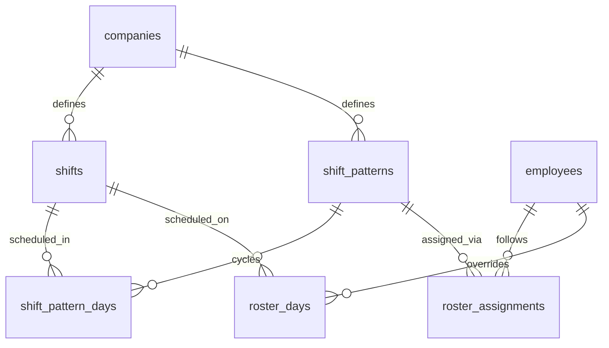
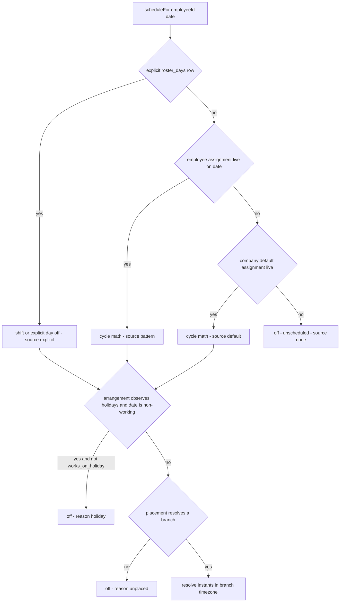
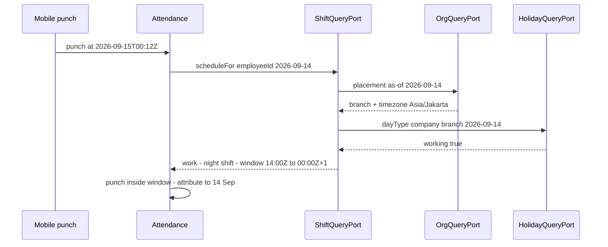
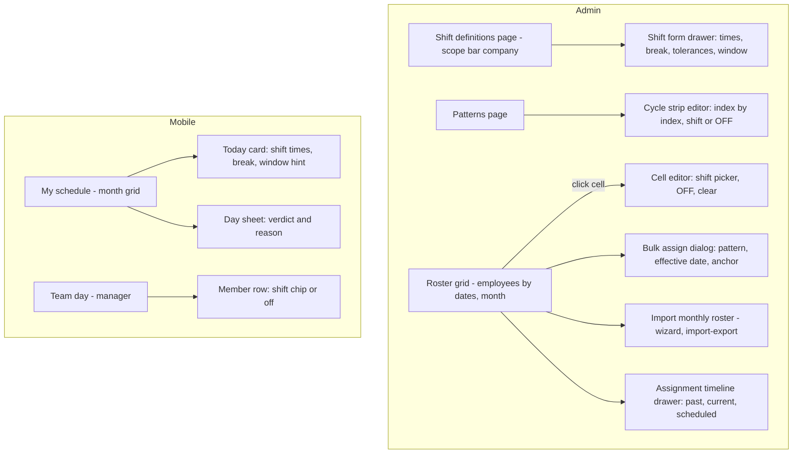

# Module: Shift

Status: Active (Phase 3) · Related ADRs: `ADR-0001` (port-only cross-module reads), `ADR-0002` (tenant scoping), `ADR-0003` (reference-data sync class), `ADR-0010` (change events), `ADR-0015` (roster import) · Depends on: `docs/06-modules/holiday.md` (template + `HolidayQueryPort`), `docs/06-modules/organization.md` (branch timezone, placement port), `docs/06-modules/employee.md` (status), `docs/04-database/core-schema.md` §7, `docs/05-platform/import-export.md` · Consumers: attendance.md (schedule per punch and per day), overtime.md (scheduled end = overtime baseline), leave.md (working-day counting), payroll.md (paid-hours context)

Namespace `shift` (naming §4, error prefix `SHF`). Shift definitions, cyclic patterns, effective-dated roster assignments, explicit per-day roster rows, and the one resolution port that answers "is this employee working on this date, from when to when" with holiday suppression already applied. Inherits all global standards; deviations only.

## 1. Purpose & Scope

Own the schedule truth every time-math module reads. Four kinds of configuration — shifts (time windows), patterns (repeating cycles), roster assignments (who runs which pattern, from when), roster days (explicit per-date decisions) — collapse into one verdict per employee per date through `ShiftQueryPort`. Downstream consequences (late/absent derivation, overtime hours, leave day counting, paid hours) belong to their modules.

**Resolution model (grilled 2026-08-02): configuration only, resolved on read.** Nothing is materialized ahead: no roster-generation cron, no generation horizon, no regeneration-versus-hand-edit conflict, no per-employee-per-date row for days nobody thought about. Rows exist only where HR actually made a decision. The trade accepted with it is recorded in BR-SHF-010.

**V1 exclusions:** shift swap requests between employees (needs a 9th approval request type and mutual-consent semantics — §15), roster draft/publish workflow (rosters are live when saved), split shifts (at most one shift per employee per date), per-day time overrides (define a shift instead), break punching (break is a fixed unpaid deduction), minimum-rest-between-shifts policy, weekly-rest and continuous-work-break guards, department-scoped roster assignment as a resolution level (bulk assignment writes personal rows), roster export definition, shift-based allowances (payroll owns money), international timezones and DST.

> ⚠️ VERIFY: confirm against current Indonesian regulation before implementation. — statutory weekly rest and rest-break provisions (UU 13/2003 and amendments) are **not** enforced by this module in V1; roster legality is the tenant's responsibility, and any future guard (§15) must carry the confirmed day/hour figures.

## 2. Actors & Permissions

| Action | Permission key | Data scope | Employee | Manager | HR Staff | HR Admin | System Administrator |
|---|---|---|---|---|---|---|---|
| View own schedule | — (authenticated; mobile + web) | self | ✅ | ✅ | ✅ | ✅ | ✅ |
| View team schedule for a date | — (authenticated; manager-derived) | team (org port) | — | ✅ | ✅ | ✅ | ✅ |
| Read shift definitions + patterns | `shift.definition.read` | company / tenant per assignment | — | — | ✅ | ✅ | ✅ |
| Create / edit / archive shifts + patterns | `shift.definition.configure` | company / tenant per assignment | — | — | — | ✅ | ✅ |
| Read roster of any employee | `shift.roster.read` | company / tenant per assignment | — | — | ✅ | ✅ | ✅ |
| Assign patterns, edit roster days | `shift.roster.assign` | company / tenant per assignment | — | — | — | ✅ | ✅ |
| Import monthly roster | `shift.roster.import` (ImportDefinition `shift.roster`) | company / tenant per assignment | — | — | — | ✅ | ✅ |

Actions come from the reserved verb set (naming §5) — no new action words. Company-scoped admins configure only inside their companies; out-of-scope shifts, patterns, and employees are 404 (existence hiding).

## 3. Business Rules

| # | Rule |
|---|---|
| BR-SHF-001 | A **shift** is a company-scoped named time window in **branch-local wall clock**: `start_time`, `end_time`, unpaid `break_minutes`, late and early-leave tolerances, and a punch window (`punch_in_before_minutes` / `punch_out_after_minutes`). `end_time = start_time` is invalid (DB CHECK); `end_time < start_time` means the shift **crosses midnight** and is legal. Code `OFF` is reserved (import sentinel, BR-SHF-012). |
| BR-SHF-002 | **Resolution ladder — most-specific-wins per (employee, date):** explicit `roster_days` row > employee `roster_assignments` row (cycle math) > company-default `roster_assignments` row (`employee_id IS NULL`) > unscheduled. Resolution is a pure function of the rows plus the calendar; no schedule is stored. Departments are a bulk-assignment affordance in the UI, never a resolution level. |
| BR-SHF-003 | **Cycle math:** `dayIndex = floor(date − cycle_anchor_date) mod cycle_length`; the pattern's entry for that index is a shift or `OFF`. `cycle_anchor_date` lives on the assignment (default = `effective_from`), so two crews can run the same pattern out of phase. |
| BR-SHF-004 | **Holiday suppression:** the arrangement in force on that date decides via `shift_patterns.observes_holidays` (default `true`; when no arrangement is in force, the default is to observe). If it observes and `HolidayQueryPort.dayType` reports non-working for the employee's branch scope, the day resolves to `off` with reason `holiday` — **unless** an explicit `roster_days` row sets `works_on_holiday = true`. A newly announced cuti bersama therefore clears already-rostered days on its own; deliberate holiday work is the flagged row, not the default. |
| BR-SHF-005 | **The working day of a shift is its start date.** All of a cross-midnight shift — including the post-midnight hours — belongs to the calendar date it starts on. The punch window `[start − punch_in_before, end + punch_out_after]` may span three calendar dates; attendance matches a punch to the shift whose window contains it (attendance.md owns matching, this module owns the window). |
| BR-SHF-006 | **Punch windows may not overlap for one employee** (`SHF_SHIFT_WINDOW_OVERLAP`), checked at write: statically across a pattern's cycle (entry *i*'s out-window against entry *i+1*'s in-window, wrap-around included) when the pattern is saved, and against the resolved neighbour days (date ± 1) when a roster day, assignment, or shift definition is written. Unambiguous punch→shift matching is a property of the roster, enforced where the roster is edited. |
| BR-SHF-007 | **Roster assignments are effective-dated** `[effective_from, effective_to)` (database-conventions §5), never overlapping: one live arrangement per employee, and one live default per company, both enforced by a single gist exclusion (§4.1). Re-assignment is a `supersede()` — close the current row at the new date, insert the successor, one transaction (BR-ORG-008 pattern). Future-dated assignments are legal and cancellable while future. |
| BR-SHF-008 | **Timezone:** shift times are branch-local wall clock; instants resolve against the timezone of the branch in the employee's placement **as-of that date** (`OrgQueryPort.placement`). No placement → `off` with reason `unplaced` (the org anomaly employee.md flags — this module refuses to guess a timezone). Indonesia observes no DST, so no local time is ambiguous or skipped. |
| BR-SHF-009 | **Period lock:** any write whose effect touches a date inside a locked attendance/payroll period is rejected (`SHF_PERIOD_LOCKED`) through **`PeriodLockPort`** — including shift-definition edits, whose new times would silently re-interpret locked days. The port is owned and implemented by `docs/06-modules/attendance.md` §4.2 (grilled 2026-08-02); the "answers open until payroll.md lands" stub is retired. |
| BR-SHF-010 | **Definitions are current truth, not history.** Resolution always reflects definitions as they stand now, so editing a pattern or a shift changes what past unlocked dates resolve to. The record of what an employee was *actually* scheduled for is attendance's derived day snapshot (attendance.md), and payroll reads that snapshot — never a re-resolution. Every write emits a change event (§12) so consumers recompute unlocked derived state. |
| BR-SHF-011 | **Archive guards** (soft delete, `SHF_IN_USE` with `details: { blockers: [{ type, count }] }`): a **shift** blocked by live pattern entries or live/future roster days referencing it; a **pattern** blocked by live or future roster assignments. Dependents are removed by explicit acts first, never cascaded (BR-ORG-006 philosophy). |
| BR-SHF-012 | **Import** (`ImportDefinition shift.roster`, ADR-0015): upsert on `(employee_number, date)`, `partial` commit; `shift_code = OFF` writes an explicit day off; each row runs the same validation as a UI write (scope, period lock, window overlap). The import never creates shifts, patterns, or assignments — it only writes roster days. |
| BR-SHF-013 | **Audit:** all five tables are channel-1 audited with full diffs (audit-log §4.2, registered this session). A bulk roster import writes one audit row per changed day, bounded by `import-export.max_rows`. |
| BR-SHF-014 | **Mobile carries the employee's resolved schedule window** — today − 30 days … today + 60 days, platform-fixed (A-021) — as reference data, pull-only. The device does no pattern, holiday, or timezone math (deviation from holiday.md's shared-reducer precedent, §10); `shift.roster_changed` push triggers a refetch. |

## 4. Domain Model

### 4.1 Schema



```ts
// src/database/schema/shift.ts
export const shifts = pgTable('shifts', {
  ...id, ...tenantId,
  companyId: uuid('company_id').notNull().references(() => companies.id),
  code: text('code').notNull(),                                  // `OFF` reserved (BR-SHF-001)
  name: text('name').notNull(),
  startTime: time('start_time').notNull(),                       // branch-local wall clock (BR-SHF-008)
  endTime: time('end_time').notNull(),                           // < start ⇒ crosses midnight
  breakMinutes: integer('break_minutes').notNull().default(0),   // unpaid, deducted from paid minutes
  breakStartTime: time('break_start_time'),                      // optional fixed window, display only in V1
  lateToleranceMinutes: integer('late_tolerance_minutes').notNull().default(0),
  earlyLeaveToleranceMinutes: integer('early_leave_tolerance_minutes').notNull().default(0),
  punchInBeforeMinutes: integer('punch_in_before_minutes').notNull().default(60),
  punchOutAfterMinutes: integer('punch_out_after_minutes').notNull().default(60),
  color: text('color'),                                          // roster-grid chip token (design-system §2.1)
  ...auditColumns, ...softDeleteColumns,
}, (t) => [
  uniqueIndex('uq_shifts_tenant_id_company_id_code')
    .on(t.tenantId, t.companyId, t.code).where(sql`deleted_at IS NULL`),
  index('idx_shifts_tenant_id_company_id').on(t.tenantId, t.companyId),
]);

export const shiftPatterns = pgTable('shift_patterns', {
  ...id, ...tenantId,
  companyId: uuid('company_id').notNull().references(() => companies.id),
  code: text('code').notNull(),
  name: text('name').notNull(),
  cycleLength: integer('cycle_length').notNull(),                // days, 1..31 (CHECK)
  observesHolidays: boolean('observes_holidays').notNull().default(true),   // BR-SHF-004
  ...auditColumns, ...softDeleteColumns,
}, (t) => [
  uniqueIndex('uq_shift_patterns_tenant_id_company_id_code')
    .on(t.tenantId, t.companyId, t.code).where(sql`deleted_at IS NULL`),
]);

export const shiftPatternDays = pgTable('shift_pattern_days', {
  ...id, ...tenantId,
  patternId: uuid('pattern_id').notNull().references(() => shiftPatterns.id),
  dayIndex: integer('day_index').notNull(),                      // 0 .. cycleLength-1, each exactly once
  shiftId: uuid('shift_id').references(() => shifts.id),         // NULL = OFF day in the cycle
  ...auditColumns,                                               // replaced wholesale on pattern save (hard delete)
}, (t) => [
  uniqueIndex('uq_shift_pattern_days_tenant_id_pattern_id_day_index')
    .on(t.tenantId, t.patternId, t.dayIndex),
]);

export const rosterAssignments = pgTable('roster_assignments', {
  ...id, ...tenantId,
  companyId: uuid('company_id').notNull().references(() => companies.id),
  employeeId: uuid('employee_id').references(() => employees.id),   // NULL = company default (BR-SHF-002)
  patternId: uuid('pattern_id').notNull().references(() => shiftPatterns.id),
  cycleAnchorDate: date('cycle_anchor_date').notNull(),             // phase (BR-SHF-003)
  note: text('note'),
  ...effectiveDating, ...auditColumns, ...softDeleteColumns,
}, (t) => [
  index('idx_roster_assignments_tenant_id_employee_id_effective_from')
    .on(t.tenantId, t.employeeId, t.effectiveFrom),
  index('idx_roster_assignments_tenant_id_company_id_effective_from')
    .on(t.tenantId, t.companyId, t.effectiveFrom),                  // default-row lookup + pattern archive guard
  index('idx_roster_assignments_tenant_id_pattern_id').on(t.tenantId, t.patternId),
]);

export const rosterDays = pgTable('roster_days', {
  ...id, ...tenantId,
  employeeId: uuid('employee_id').notNull().references(() => employees.id),
  date: date('date').notNull(),
  shiftId: uuid('shift_id').references(() => shifts.id),            // NULL = explicit day off
  worksOnHoliday: boolean('works_on_holiday').notNull().default(false),  // per-day escape (BR-SHF-004)
  note: text('note'),
  ...auditColumns, ...softDeleteColumns,
}, (t) => [
  uniqueIndex('uq_roster_days_tenant_id_employee_id_date')
    .on(t.tenantId, t.employeeId, t.date).where(sql`deleted_at IS NULL`),
  index('idx_roster_days_tenant_id_date').on(t.tenantId, t.date),   // grid range scan
  index('idx_roster_days_tenant_id_shift_id').on(t.tenantId, t.shiftId),  // shift archive guard
]);
```

Hand-written in the generating migration (database-conventions §10):

- `ck_shifts_times_differ` — `end_time <> start_time` (BR-SHF-001). Naming §2.4's illustrative constraint name `ck_shifts_end_after_start` was renamed to this one **in the anchor** this session: a cross-midnight shift legitimately has `end_time < start_time`, so the old example invited a constraint that would reject half this module's use cases.
- `ck_shifts_tolerances_non_negative` — all four minute columns `>= 0`; `break_minutes >= 0`.
- `ck_shift_patterns_cycle_length` — `cycle_length BETWEEN 1 AND 31`.
- `ck_shift_pattern_days_day_index` — `day_index >= 0` (upper bound against `cycle_length` is validated in the application: cross-row, cheap there, awkward as a constraint).
- `excl_roster_assignments_no_overlap` — gist exclusion on `(tenant_id WITH =, COALESCE(employee_id, company_id) WITH =, daterange(effective_from, effective_to, '[)') WITH &&) WHERE deleted_at IS NULL` — one constraint covering both invariants of BR-SHF-007 (per-employee rows keyed by employee, company-default rows keyed by company; UUID values never collide across the two).

No `version` columns anywhere: every mutation is admin-web, nothing here is offline-mutable (database-conventions §1.10 scope; holiday §4.1 precedent). Standard RLS on all five tables.

No lifecycle state machines: shifts and patterns are present-or-archived reference data, `roster_assignments` rows are positions on the date axis (scheduled / current / history), and a `roster_day` is a fact about one date — none of them has states. Template note honored (holiday §4.1).

### 4.2 Resolution port (the consumer contract)

```ts
export const SHIFT_QUERY_PORT = Symbol('SHIFT_QUERY_PORT');

export type ScheduledDay = {
  date: string;                                    // YYYY-MM-DD, branch-local calendar date
  kind: 'work' | 'off';
  source: 'explicit' | 'pattern' | 'default' | 'none';
  offReason?: 'day_off' | 'holiday' | 'unscheduled' | 'unplaced';
  standardMinutes: number;                         // paid minutes this arrangement schedules for
                                                   // this date, suppression ignored; 0 = real day off
  shift?: {
    id: string; code: string; name: string;
    startAt: string; endAt: string;                // UTC instants (BR-SHF-008)
    windowFrom: string; windowTo: string;          // punch window, UTC (BR-SHF-005)
    breakMinutes: number; paidMinutes: number;     // §4.3
    lateToleranceMinutes: number; earlyLeaveToleranceMinutes: number;
  };
  holiday?: { kind: HolidayKind; name: string };   // present whenever a holiday lands on the date, worked or not
};

export interface ShiftQueryPort {
  /** One employee, one date — the attendance hot path. */
  scheduleFor(employeeId: string, date: string): Promise<ScheduledDay>;
  /** [from, to) — mobile window, leave working-day counting, overtime baselines. */
  scheduleRange(employeeId: string, from: string, to: string): Promise<ScheduledDay[]>;
  /** Batch for grids and per-day derivation runs. One query, keyed result. */
  scheduleForMany(employeeIds: string[], date: string): Promise<Map<string, ScheduledDay>>;
}
```



Resolution is a pure function over `(assignment rows, pattern days, roster day row, holiday verdict, branch timezone)` — implemented once, server-side, and pinned by golden vectors (§14). Verdicts are cached per employee-month (`hris:shift:{tenantId}:schedule:{employeeId}:{yyyy-mm}`, TTL 15 min) and busted on `shift.roster.changed`, `shift.definition.changed`, `holiday.calendar.changed`, and `organization.assignment.changed` (holiday UC-HOL-001 pattern; month buckets because attendance derivation walks a period, not a date).

### 4.3 Time arithmetic (what consumers compute against)

| Quantity | Formula |
|---|---|
| `spanMinutes` | `(end_time − start_time + 1440) mod 1440` — never 0 (BR-SHF-001 CHECK) |
| `paidMinutes` | `spanMinutes − break_minutes` |
| `startAt` | branch-local `(date, start_time)` → UTC |
| `endAt` | `startAt + spanMinutes` |
| `windowFrom` / `windowTo` | `startAt − punch_in_before_minutes` / `endAt + punch_out_after_minutes` |

Worked examples (branch `Asia/Jakarta`, UTC+7, roster date 2026-09-14):

| Shift | start–end | break | span / paid | `startAt` → `endAt` (UTC) | Window (UTC) |
|---|---|---|---|---|---|
| Office | 08:00–17:00 | 60 | 540 / 480 | 01:00 → 10:00 (14 Sep) | 00:00 → 11:00 |
| Night | 22:00–06:00 | 30 | 480 / 450 | 15:00 (14 Sep) → 23:00 (14 Sep) | 14:00 → 00:00 (15 Sep) |
| Morning | 06:00–14:00 | 45 | 480 / 435 | 23:00 (13 Sep) → 07:00 (14 Sep) | 22:00 (13 Sep) → 08:00 |

Overtime's baseline is `endAt` (overtime.md); leave's working-day test is `kind = 'work'`; payroll reads paid minutes through attendance's derived day, never from here directly.

**`standardMinutes` (added 2026-08-02, overtime.md).** `paidMinutes` for the shift the resolution ladder produced **before** holiday suppression is applied — so a suppressed holiday still reports what that weekday normally schedules, while a pattern `OFF` entry or an unplaced employee reports `0`. It is `shift.paidMinutes` whenever `shift` is present, and non-zero without a `shift` block only on a suppressed day. Sole consumer today is overtime.md BR-OVT-010, whose rest-day multiplier steps up at exactly this boundary: a public holiday landing on the short day of a six-day arrangement schedules 5 hours, not 7, and pricing it as 7 underpays the employee by four multiplier-hours (overtime.md §4.5, example 3). The alternative — probing the same weekday in an adjacent week — resolves correctly and is unreadable, so the fact is published rather than reconstructed.

## 5. Use Cases

**UC-SHF-001 — Resolve a schedule (port, hot path).** Attendance calls `scheduleFor` per punch and per derivation day; the ladder (§4.2) runs against cached inputs, holiday and placement come from their ports, instants are computed last. Missing arrangement → `off / unscheduled`; missing placement → `off / unplaced`. Consumers never join this module's tables (ADR-0001).

**UC-SHF-002 — Define a shift.** `shift.definition.configure` → validate times, tolerances, reserved code (§8) → window-overlap re-check for every pattern and future roster day already using the shift (BR-SHF-006) → period-lock check (BR-SHF-009) → write + audit + `shift.definition.changed`. The edit dialog states how many employees are scheduled on this shift in the next 30 days before confirming — a time change is a working-hours change (organization.md BR-ORG-007 warning pattern).

**UC-SHF-003 — Build a pattern.** Cycle length + one entry per index (shift or `OFF`), saved as a replace-all of `shift_pattern_days` in one transaction. Static validation: every index `0..cycleLength-1` present exactly once; consecutive-entry window overlap including the wrap from the last index to the first (BR-SHF-006). `observes_holidays` is set here (BR-SHF-004).

**UC-SHF-004 — Assign a pattern.** `shift.roster.assign` → target employees (individual, multi-select, or "everyone in department X" — the UI resolves the department to employee ids and writes personal rows) or the company default row → `effective_from` ≥ today unless correcting an unlocked past date, `cycle_anchor_date` defaults to `effective_from` → `supersede()` per employee in one transaction each → audit + `shift.roster.changed`. Bulk calls return per-item results (api-standards §10).

**UC-SHF-005 — Edit the roster grid.** Painting a cell writes a `roster_days` row (shift, or `OFF` for an explicit rest day); clearing a cell deletes the row and the day falls back to the pattern. Each write validates neighbours for window overlap and the period lock. Bulk paint sends ≤ 100 items per call with per-item results — a partial batch is normal and the grid re-renders per cell.

**UC-SHF-006 — Import a monthly roster.** Download template (`shift.roster`: `employee_number`, `date`, `shift_code`, optional `works_on_holiday`) → upload → dry-run → confirm; the framework owns the pipeline (import-export.md). Row validation: employee resolvable and non-terminal, date parse, shift code in the employee's company or the `OFF` sentinel, period lock, neighbour window overlap, in-file duplicate `(employee_number, date)`. Commit upserts one roster day per row.

**UC-SHF-007 — Employee views own schedule.** Mobile: month grid + today card, served from the local resolved window (§10); web: same endpoint. Each day renders the verdict and its reason, so "why am I off today" is answerable without asking HR — day off, holiday name, or not scheduled.

**UC-SHF-008 — Manager views the team's day.** MSS: `GET /me/team/schedule?date=` → direct reports (org port inverse, employee.md UC-EMP-011 shape) with each one's verdict — who is on which shift, who is off, who is unscheduled. Read-only; managers do not edit rosters in V1.

**UC-SHF-009 — Calendar change lands.** `holiday.calendar.changed` → bust affected month buckets and flag, in the grid, every explicit roster day on a changed date that has `works_on_holiday = true` (those still stand, BR-SHF-004) so HR sees the deliberate holiday work it now implies. Days without the flag simply resolve to `off` on the next read — no rows are mutated, ever.

**UC-SHF-010 — Placement or employment changes.** `organization.assignment.changed` → bust that employee's buckets (a branch move changes the timezone the same wall-clock shift resolves in; the wall-clock roster itself is unchanged — this discharges organization.md §12's forward duty for this module). `employee.status.changed` to a terminal status → no roster mutation: assignments and days stay as history, the resolver keeps answering, and consumers stop asking (attendance halts derivation, the grid hides terminal employees by default).



## 6. UI Flow



- **Scope bar** (design-system §12): company drives every admin surface here; the grid's period selector doubles as the lock indicator — locked months render read-only cells with the lock tooltip (BR-SHF-009), never a failing save.
- Roster cells carry the shift **code as text** plus the shift's color — color is never the only signal (design-system §2.3). Verdict styling: work = shift chip; explicit day off = `status-draft` muted; holiday-suppressed = `status-info` with the holiday name; unscheduled = `status-draft` dashed outline reading "not scheduled"; unplaced = the warning chip employee.md's grid already uses.
- Cells sourced from a pattern render lighter than explicit cells, with the pattern code in the tooltip — inheritance is visible (holiday §6 origin-chip pattern).
- Shift form shows the computed span, paid minutes, and the resolved punch window live as fields change; a cross-midnight shift is labelled "ends next day" rather than looking like a typo.
- Bulk assign confirms with the affected employee count and the first date changed; overlap and lock failures come back per item and mark the offending cells rather than dropping the batch.
- Mobile: month grid offline-served with the sync truth line (design-system §12); today card shows start/end in branch-local time plus "you can clock in from HH:MM" derived from the punch window. Empty states — no schedule configured → "No schedule set yet, ask your HR admin"; team day with no reports → "no direct reports".

## 7. API

All endpoints follow the canonical spec-block form (api-standards §13). Import and template endpoints ride import-export §7 (definition `shift.roster`). No new pagination-registry rows: admin lists here are the seeded master-data grid family (offset), and the date-bounded reads are unpaginated by the holiday `/resolved` precedent. Errors beyond the implied set only.

| Endpoint | Permission | Pagination | Queue-reachable | Idempotency |
|---|---|---|---|---|
| `GET /api/v1/shifts` | `shift.definition.read` | offset | no | — |
| `POST /api/v1/shifts` · `PATCH /{id}` · `DELETE /{id}` | `shift.definition.configure` | — | no | — |
| `GET /api/v1/shift-patterns` · `GET /{id}` | `shift.definition.read` | offset | no | — |
| `POST /api/v1/shift-patterns` · `PATCH /{id}` · `DELETE /{id}` | `shift.definition.configure` | — | no | — |
| `GET /api/v1/roster-assignments` | `shift.roster.read` | offset | no | — |
| `POST /api/v1/roster-assignments` | `shift.roster.assign` | — | no | — |
| `POST /api/v1/roster-assignments/bulk-assign` | `shift.roster.assign` | — | no | accepted |
| `DELETE /api/v1/roster-assignments/{id}` | `shift.roster.assign` | — | no | — |
| `GET /api/v1/roster-days/resolved` | `shift.roster.read` | offset (by employee) | no | — |
| `POST /api/v1/roster-days/bulk-assign` | `shift.roster.assign` | — | no | accepted |
| `DELETE /api/v1/roster-days/{id}` | `shift.roster.assign` | — | no | — |
| `GET /api/v1/me/schedule` | — (authenticated, self) | — (window-bounded) | no | — |
| `GET /api/v1/me/team/schedule` | — (authenticated; manager-derived) | — (one date) | no | — |

`assign` was added to the approved URL verb set (naming §3 + api-standards §1.2 mirror) this session, same protocol employee.md used for `terminate`.

#### GET /api/v1/shifts
Request: `?companyId=` (required) `?q=` + offset params. Response 200: `data: [{ id, companyId, code, name, startTime, endTime, crossesMidnight, breakMinutes, breakStartTime, spanMinutes, paidMinutes, lateToleranceMinutes, earlyLeaveToleranceMinutes, punchInBeforeMinutes, punchOutAfterMinutes, color, usageCount }]` + offset meta. `usageCount` = live pattern entries + future roster days (the archive-guard preview).

#### POST /api/v1/shifts · PATCH /{id} · DELETE /{id}

| Field | Type | Required | Rule |
|---|---|---|---|
| `companyId` | uuid | ✅ (POST) | caller scope; identity — not patchable |
| `code` | string | ✅ (POST) | 1–20, `[A-Z0-9-]`, not `OFF`; identity — not patchable |
| `name` | string | ✅ | 2–80 |
| `startTime` / `endTime` | time | ✅ | `HH:mm`; must differ (BR-SHF-001) |
| `breakMinutes` | integer | — | 0 ≤ n < span; default 0 |
| `breakStartTime` | time | — | inside the shift span |
| `lateToleranceMinutes` / `earlyLeaveToleranceMinutes` | integer | — | 0–240 |
| `punchInBeforeMinutes` / `punchOutAfterMinutes` | integer | — | 0–720; defaults 60 |
| `color` | string | — | design-system palette token key |

Response 201/200: the shift row. `DELETE`: soft delete. Errors: `SHF_SHIFT_WINDOW_OVERLAP` — the new window collides with a neighbouring scheduled shift for at least one employee (`details: { employeeId, date, conflictingShiftId }`) · `SHF_PERIOD_LOCKED` · `SHF_IN_USE` (DELETE) · duplicate code → `VAL_VALIDATION_FAILED` (`VAL_DUPLICATE`).

#### Shift patterns
`GET` request: `?companyId=` (required) `?q=` + offset. Response 200: `data: [{ id, companyId, code, name, cycleLength, observesHolidays, days: [{ dayIndex, shiftId, shiftCode }], assignedEmployeeCount }]`; `GET /{id}` returns one.
`POST` request: `companyId` (✅), `code` (✅, 1–20 `[A-Z0-9-]`), `name` (✅, 2–80), `cycleLength` (✅, 1–31), `observesHolidays` (—, default `true`), `days` (✅, exactly `cycleLength` entries, `{ dayIndex, shiftId | null }`, each index once). `PATCH`: `name?`, `observesHolidays?`, `cycleLength?` + `days?` (replace-all; changing `cycleLength` requires a full `days` array). `DELETE`: soft delete.
Errors: `SHF_SHIFT_WINDOW_OVERLAP` (consecutive cycle entries, wrap included — `details: { dayIndex, conflictingShiftId }`) · `SHF_IN_USE` (DELETE with live/future assignments) · `SHF_PERIOD_LOCKED` (edit re-interpreting a locked date) · index gaps/duplicates → `VAL_VALIDATION_FAILED`.

#### Roster assignments
`GET` request: `?employeeId=` or `?companyDefault=true` (one required) `?companyId=` + offset. Response 200: `data: [{ id, employeeId, companyId, patternId, patternCode, cycleAnchorDate, note, effectiveFrom, effectiveTo, createdBy, createdAt }]` newest first, including scheduled future rows.
`POST` request:

| Field | Type | Required | Rule |
|---|---|---|---|
| `employeeId` | uuid | — | omit for the company-default row |
| `companyId` | uuid | ✅ | must match the employee's company when `employeeId` is set |
| `patternId` | uuid | ✅ | same company |
| `effectiveFrom` | date | ✅ | ≥ employee join date; > current row's `effective_from`; unlocked period |
| `cycleAnchorDate` | date | — | default `effectiveFrom`; ≤ `effectiveFrom` |
| `note` | string | — | ≤ 300 |

Response 201: the new row (predecessor closed). Errors: `SHF_ASSIGNMENT_OVERLAP` — backdated range collides (exclusion constraint) · `SHF_SHIFT_WINDOW_OVERLAP` — the incoming pattern collides with the outgoing one across the switch-over date · `SHF_PERIOD_LOCKED` · `ORG_CROSS_COMPANY` (port) · unknown employee/pattern → 404.
`POST /bulk-assign` request: `{ employeeIds: [uuid] (✅, ≤ 100), patternId, effectiveFrom, cycleAnchorDate?, note? }` → per-item results (api-standards §10 shape). `DELETE /{id}`: future rows only, reopens the predecessor (`effective_to = NULL`); past/current → `VAL_VALIDATION_FAILED`.

#### GET /api/v1/roster-days/resolved
The grid read — resolution applied (BR-SHF-002), including days that have no row. Request: `?companyId=` (required) `?from=&to=` (required, `[from, to)`, ≤ 62 days) `?branchId=&departmentId=&employeeId=&q=` + offset params (paging is over **employees**; every page carries the full date range). Response 200: `data: [{ employeeId, employeeNumber, fullName, days: [ScheduledDay & { rosterDayId?: uuid, patternCode?: string }] }]` + offset meta + `meta: { from, to, lockedDates: [date] }`. `rosterDayId` is present exactly when `source = 'explicit'` — it is what `DELETE /roster-days/{id}` takes.

#### POST /api/v1/roster-days/bulk-assign · DELETE /api/v1/roster-days/{id}
Request: `{ items: [{ employeeId, date, shiftId | null, worksOnHoliday?, note? }] }` — ≤ 100 items, `shiftId: null` = explicit day off. Upsert on `(employeeId, date)`. Deviation from api-standards §10's `{ ids }` shape, declared here: the rows being written may not exist yet, so items carry their natural key instead; the per-item result envelope is unchanged. Response 200: `{ results: [{ employeeId, date, success, rosterDayId?, error? }] }` + `meta: { succeeded, failed }`. Per-item errors: `SHF_SHIFT_WINDOW_OVERLAP` · `SHF_PERIOD_LOCKED` · unknown shift/employee → `SYS_NOT_FOUND`.
`DELETE /{id}`: soft-deletes the explicit row so the date falls back to its pattern. Errors: `SHF_PERIOD_LOCKED`. Response 200: `{ id }`.

#### GET /api/v1/me/schedule
Request: `?from=&to=` — optional; defaults to the platform window (today − 30 … today + 60, BR-SHF-014), and a wider range is clamped to it. Response 200: `data: [ScheduledDay]` (one entry per date, ascending) + `meta: { from, to, branchTimezone, generatedAt }`. This is the mobile mirror payload (§10) and the web self-service read.

#### GET /api/v1/me/team/schedule
Request: `?date=` (required). Response 200: `data: [{ employeeId, fullName, positionTitle, schedule: ScheduledDay }]` — direct reports only (org port inverse), empty for non-managers. No pagination: team sizes are dozens (employee.md UC-EMP-011 precedent).

## 8. Validation Rules

| Field | Rule | Error code |
|---|---|---|
| `code` (shift, pattern) | 1–20, `[A-Z0-9-]`, unique per company among live rows; `OFF` reserved for shifts | `VAL_INVALID_FORMAT` / `VAL_DUPLICATE` |
| `name` | required, 2–80, trimmed | `VAL_REQUIRED` / `VAL_TOO_SHORT` / `VAL_TOO_LONG` |
| `startTime` / `endTime` | `HH:mm` 24-hour; `start ≠ end` | `VAL_INVALID_FORMAT` / `VAL_VALIDATION_FAILED` |
| `breakMinutes` | integer, `0 ≤ n < spanMinutes` | `VAL_OUT_OF_RANGE` |
| `breakStartTime` | inside `[start, end)` accounting for midnight crossing | `VAL_OUT_OF_RANGE` |
| tolerance minutes | integer 0–240 | `VAL_OUT_OF_RANGE` |
| punch window minutes | integer 0–720 | `VAL_OUT_OF_RANGE` |
| `cycleLength` | integer 1–31 | `VAL_OUT_OF_RANGE` |
| `days` (pattern) | exactly `cycleLength` entries; each `dayIndex` in `0..cycleLength-1` exactly once; `shiftId` resolvable in the same company | `VAL_VALIDATION_FAILED` / 404 |
| `effectiveFrom` | ISO date; ≥ employee join date; > current row's `effective_from`; unlocked | `VAL_OUT_OF_RANGE` / `SHF_PERIOD_LOCKED` |
| `cycleAnchorDate` | ISO date; ≤ `effectiveFrom`; within 10 years of it | `VAL_OUT_OF_RANGE` |
| `date` (roster day) | ISO date; within today ± 2 years (fat-finger guard); unlocked | `VAL_OUT_OF_RANGE` / `SHF_PERIOD_LOCKED` |
| `from`/`to` (resolved grid) | `from < to`, span ≤ 62 days | `VAL_DATE_RANGE_INVALID` / `VAL_OUT_OF_RANGE` |
| `items` / `employeeIds` (bulk) | 1–100 entries, no in-batch duplicate `(employeeId, date)` / duplicate ids | `VAL_VALIDATION_FAILED` |
| `shift_code` (import) | resolvable code in the employee's company, or the sentinel `OFF` | row error, `VAL_INVALID_ENUM` |

## 9. Edge Cases & Failure Modes

- **Employee with no arrangement and no rows:** every date resolves `off / unscheduled`. Attendance derives no absence from an unscheduled day (its rule), and the grid shows the dashed "not scheduled" cell — a tenant that never configured a roster is in a coherent state, not a broken one.
- **Unplaced employee:** placement port returns null → `off / unplaced` rather than a guessed timezone. Same anomaly employee.md flags in its grid; fixing the placement fixes the schedule with no roster edit.
- **Newly announced cuti bersama over a built roster:** rows are never mutated. Days whose arrangement observes holidays flip to `off / holiday` on the next read; rows explicitly marked `works_on_holiday` stand and are flagged in the grid for review (UC-SHF-009). Nothing silently disappears, nothing silently persists.
- **Cross-midnight shift ending on a holiday morning:** suppression looks only at the shift's start date (BR-SHF-005), so a Sunday-night shift ending on a holiday Monday is ordinary work — the holiday's own pay treatment is overtime.md's multiplier class, not a scheduling question.
- **Pattern edited mid-cycle:** future dates re-resolve immediately; past unlocked dates re-resolve on paper (BR-SHF-010) while attendance's snapshots keep payroll evidence intact. Locked dates block the edit outright.
- **24-hour continuous coverage:** a night shift ending 06:00 with a 60-minute out-window and a morning shift starting 06:00 with a 60-minute in-window overlap by two hours → `SHF_SHIFT_WINDOW_OVERLAP` naming both shifts. The tenant shrinks the windows (that is what they are for); the module does not silently pick a winner at punch time.
- **Two admins painting the same cell:** last write wins on the `(employee, date)` upsert, both writes audited. No `version` column here by design (nothing is offline-mutable), so this is a data-entry race, not a lost-update class problem.
- **Branch transfer mid-month:** wall-clock roster unchanged; instants for dates on and after the move resolve in the new timezone because placement is queried as-of the date. Cache bust rides `organization.assignment.changed`.
- **Employee terminated mid-month:** roster rows stay as history and keep resolving; consumers stop (attendance halts, grid hides terminal rows). No exit hook, no roster cleanup — deleting a schedule would erase the reason a mid-month absence looks the way it does.
- **Shift or pattern archived with future dependents:** `SHF_IN_USE` with blocker counts; HR clears the future rows or reassigns the pattern first. Past dependents never block — history keeps its references.
- **Import row inside a locked period:** row error in the workbook, the rest of the file commits (partial mode) — one locked week does not sink a monthly roster.
- **Same pattern, two crews, different phase:** two assignments with the same `patternId` and different `cycle_anchor_date` — the anchor is the whole mechanism for rotating crews, and no extra entity is needed.
- **Leap day and month ends:** cycle math is integer day arithmetic over calendar dates, so 29 Feb is just another day and no cycle re-phases at month boundaries.

## 10. Offline Behavior

Deviations from the global standard (offline-sync §10 checklist):

- **Entities:** the employee's **resolved** schedule window (`GET /me/schedule`, today − 30 … today + 60, BR-SHF-014) → Drift mirror `schedule_days` (server-resolved rows, not configuration). Sync class **reference data** (pull-only), TTL none — the window is replaced wholesale on refresh.
- **No delta-sync endpoint and no local resolver** — two declared deviations. A resolved verdict has no row identity to keyset over (api-standards §8 assumes rows), and the whole window is ~90 small rows, so refresh is a window replace on login, foreground, post-drain, pull-to-refresh, and on receiving `shift.roster_changed` (employee.md `/me/profile` composite precedent). Consequently the device does no pattern, holiday, or timezone math for schedules; holiday.md's Dart reducer still serves attendance's day-type needs, and there is exactly one schedule resolver to test.
- **Queueable ops:** none — every mutation here is admin-web (ADR-0003 already classifies shifts as reference data that never enters the queue).
- **`applyServerState`:** nothing to copy back — no offline creates exist in this module.
- Local retention: the mirror lives until identity change (offline-sync §9); a device offline past the window's far edge shows the last known days with the stale-sync line rather than inventing schedules.

## 11. Module Error Codes

Registered this session:

| Code | HTTP | Trigger |
|---|---|---|
| `SHF_SHIFT_WINDOW_OVERLAP` | 409 | A write would leave two punch windows overlapping for one employee — BR-SHF-006 |
| `SHF_ASSIGNMENT_OVERLAP` | 409 | Roster-assignment range collides with existing history, or a second company default is live (exclusion constraint) — BR-SHF-007 |
| `SHF_IN_USE` | 409 | Archive blocked by live dependents — BR-SHF-011, `details: { blockers: [{ type, count }] }` |
| `SHF_PERIOD_LOCKED` | 409 | Write touching a date inside a locked attendance/payroll period — BR-SHF-009 |

## 12. Background Jobs & Events

Jobs: **none owned** — the resolve-on-read model has nothing to generate, and nothing here decays on a schedule. Event-handler jobs only:

| Handler | Trigger | Behavior |
|---|---|---|
| `on.holiday.calendar.changed` | holiday.md | Bust affected month buckets; flag explicit holiday-work days for review (UC-SHF-009) |
| `on.organization.assignment.changed` | organization.md | Bust that employee's buckets (timezone may have moved) — organization §12 forward duty discharged |
| `on.employee.status.changed` | employee.md | Bust buckets; terminal status stops nothing here by design (UC-SHF-010) |
| `on.shift.roster.changed` | this module | Batch the affected employees into `shift.roster_changed` notifications (§13) |

Events emitted (outbox):

- `shift.roster.changed` `{ companyId, employeeIds: string[], dates: string[] }` — assignment or roster-day writes, one event per mutation batch. Consumers: attendance (recompute unlocked derived days), notification batching, cache bust.
- `shift.definition.changed` `{ companyId, shiftIds?: string[], patternIds?: string[] }` — definition edits, deliberately coarse: the affected employee set is unbounded and consumers resolve it themselves. Consumers: attendance (recompute), cache bust.

Events consumed: `holiday.calendar.changed`, `organization.assignment.changed`, `employee.status.changed`.

## 13. Approval, Notification & Report Touchpoints

- **Approval:** none — rostering is direct admin work. Shift swap (the one plausible request type here) is a V1 exclusion; adding it later means registering a 9th request type in approval-engine §13, not reshaping this module.
- **Notification:** registers `shift.roster_changed` (in_app + push, **mandatory**, audience = the affected employee) → notification §4.2 this session. Fired from `on.shift.roster.changed`, batched to one message per employee per mutation batch, **future dates only** — a corrected past cell is bookkeeping, a changed future shift is when you show up. Definition edits deliberately do **not** notify (unbounded fan-out for what is usually an announced policy change); the edit dialog states the affected-employee count instead, and §15 keeps the option open.
- **Import/Export:** ImportDefinition `shift.roster` — **registered in import-export §4.3 this session**: upsert on `(employee_number, date)`, `partial` commit, template v1 (`employee_number`, `date`, `shift_code` with the `OFF` sentinel, optional `works_on_holiday`), rowHandler = this module's roster-day port, permission `shift.roster.import`. No ExportDefinition in V1 — the resolved grid plus reports.md cover reads (§15).
- **Settings:** none registered — no `shift.*` keys. Tolerances, breaks, and punch windows are per-shift columns (a tenant-wide default would be wrong for any tenant running more than one kind of shift), and the mobile window horizon is platform-fixed (A-021), following the cluster-F rule that platform mechanics are configuration, not tenant policy.
- **Audit:** `shifts`, `shift_patterns`, `shift_pattern_days`, `roster_assignments`, `roster_days` → audit-log §4.2 registry (BR-SHF-013); no sensitive columns, full diffs.
- **Reports:** roster coverage per branch/date, unscheduled-employee list, shift-distribution and night-shift counts via the reports.md registry.
- **Ports served:** `ShiftQueryPort` (§4.2) — attendance, overtime, leave, payroll. **Ports consumed:** `OrgQueryPort.placement` (branch + timezone), `HolidayQueryPort.dayType` / `nonWorkingDays`, `PeriodLockPort` (attendance.md §4.2 — BR-SHF-009).
- **2026-08-02 (overtime.md arrival):** `ScheduledDay.standardMinutes` added to the port (§4.3) — the pre-suppression paid minutes overtime's rest-day multiplier boundary is defined against. Purely additive; existing consumers are unaffected, and the golden vectors of §14 gain the field. The forward duty this module recorded for overtime — "overtime's baseline is `endAt`" — is discharged in overtime.md BR-OVT-005.

## 14. Test Scenarios

| Scenario | Covers |
|---|---|
| Golden resolution vectors: explicit row beats pattern; pattern beats company default; default beats nothing; cleared row falls back; each verdict's `source` and `offReason` exact | BR-SHF-002, UC-SHF-001 |
| Cycle math: `cycleLength` 1/7/21, anchor before and equal to `effective_from`, two employees same pattern different anchor, date far past the anchor (no drift) | BR-SHF-003 |
| Holiday suppression matrix: observes × holiday × `works_on_holiday` (8 combinations); no arrangement + explicit row + holiday → suppressed; negated holiday (holiday.md `observed=false`) → work | BR-SHF-004 |
| `standardMinutes`: equals `shift.paidMinutes` on a worked day; survives holiday suppression on a day the pattern schedules; `0` on a pattern `OFF` entry, an explicit day off, an unscheduled employee, and an unplaced one | §4.3, overtime.md BR-OVT-010 |
| Cross-midnight: night shift instants and window across the date boundary; punch at 00:12 next day attributes to the start date; shift ending on a holiday morning stays work | BR-SHF-005, §4.3 |
| Window-overlap guard: pattern consecutive entries incl. wrap; roster-day write against both neighbours; shift-definition edit that would break an existing neighbour pair; error names both shifts | BR-SHF-006 |
| Exclusion constraint: overlapping employee assignments → `SHF_ASSIGNMENT_OVERLAP`; second live company default → same code; adjacent ranges sharing a boundary date → legal | BR-SHF-007 |
| Timezone: same wall-clock shift in `Asia/Jakarta` vs `Asia/Jayapura` yields instants 2 h apart; branch transfer mid-range switches at the move date; null placement → `unplaced` | BR-SHF-008 |
| Period lock: locked month rejects shift edit, pattern edit, assignment, roster-day write, and import rows; open month passes (fake port both ways) | BR-SHF-009 |
| Archive guards: shift with live pattern entries / future roster days, pattern with future assignments → `SHF_IN_USE` with exact blocker counts; clean rows archive | BR-SHF-011 |
| Import golden fixture: valid rows, `OFF` sentinel, unknown shift code, terminal employee, locked date, in-file duplicate `(employee, date)`, neighbour overlap → exact per-row verdicts; partial commit | BR-SHF-012, UC-SHF-006 |
| Every mutation → channel-1 audit diff row on all five tables; a 500-row import writes 500 audit rows | BR-SHF-013 |
| Events: roster write emits `shift.roster.changed` with exact employees + dates; definition edit emits `shift.definition.changed`; cache bucket busted (stale-verdict test) | §12, §4.2 |
| Notification batching: one `shift.roster_changed` per employee per batch; past-date-only edit sends nothing | §13 |
| Mobile window: `/me/schedule` clamps a wider range; refetch after `shift.roster_changed`; offline render past the window edge shows stale line, not invented days | BR-SHF-014, §10 |
| Bulk endpoints: 100-item cap, per-item results with mixed success/failure, in-batch duplicate rejected before any write | §7, api-standards §10 |
| Leak-test matrix L1–L6 on all five tables plus the resolved grid and `/me/schedule` (multi-tenancy §5) | security duty |

## 15. Future Improvements

Shift swap requests (a 9th approval request type: counterparty consent, then chain, then a validity re-check at apply), roster draft/publish with change diffs, split shifts and per-day time overrides, break punching with paid/unpaid segments, minimum-rest-hours and weekly-rest guards (both regulation-dependent — VERIFY the figures before implementing), notification on shift-definition changes with a bounded affected-employee fan-out, department-scoped assignment as a real resolution level if tenants ask for it, ExportDefinition for the resolved roster, a materialized schedule snapshot table if grid reads ever outgrow the resolver (purely an internal optimization — the port contract would not change), shift-based allowance metadata for payroll, and international timezones with DST-safe instant resolution.
