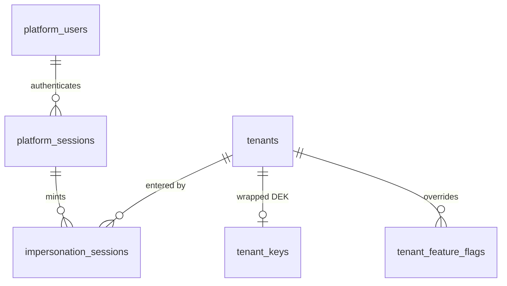
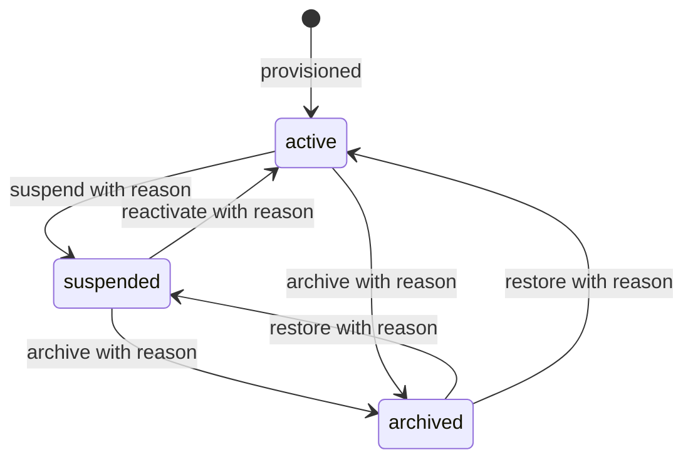
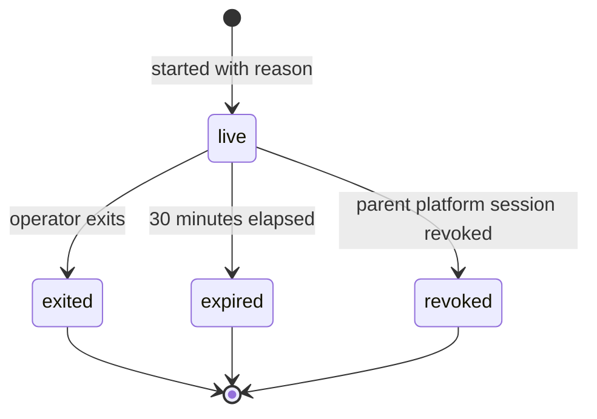
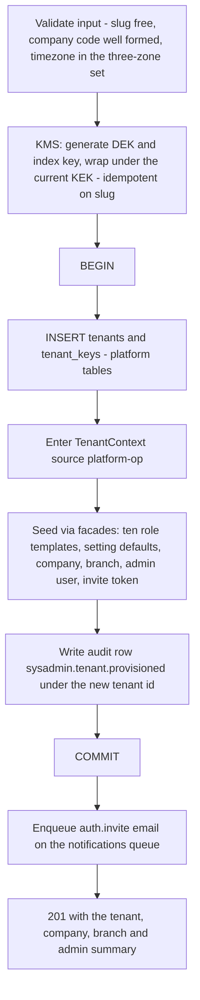
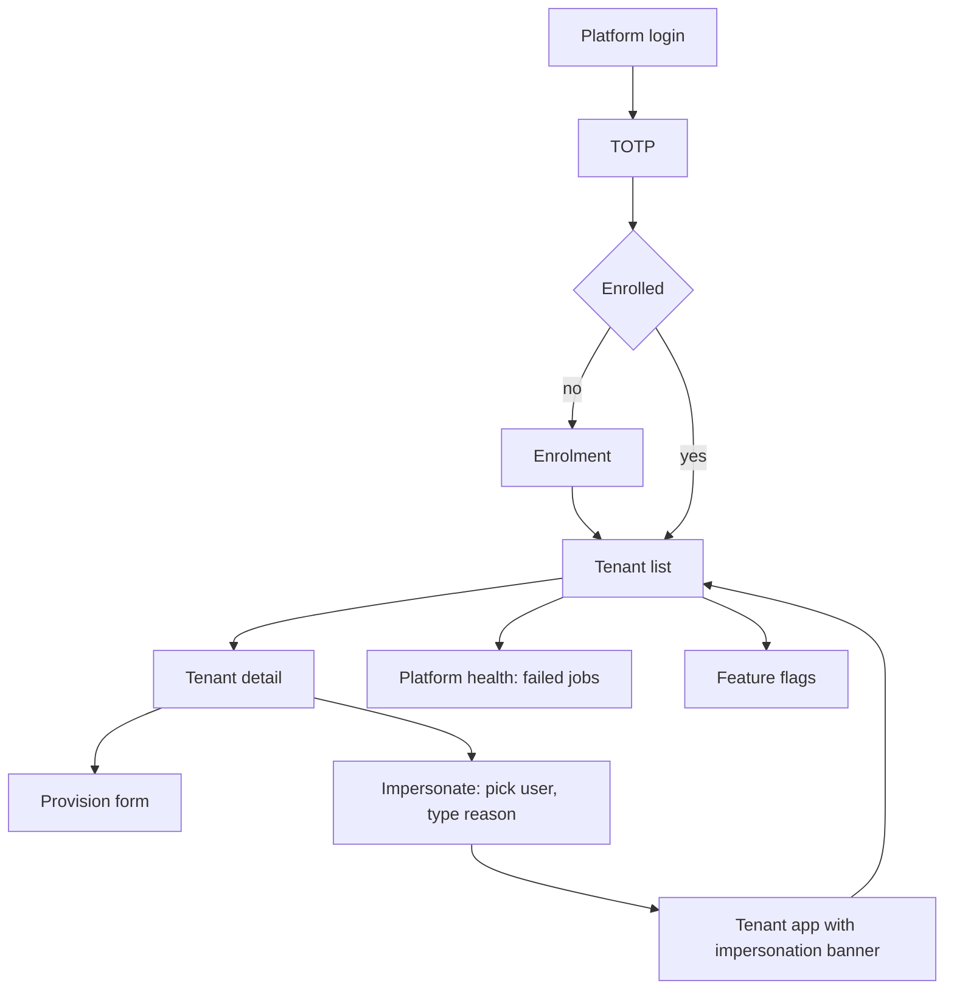

# Module: System Administration

Status: Active (Phase 3) · Related ADRs: `ADR-0017` (**new this session, Proposed** — platform identity and impersonation; the decision record behind §2, §3, and §4), `ADR-0002` (platform tables, the provisioning invariant, the impersonation token), `ADR-0004` (session mechanics, applied to a second identity class rather than changed), `ADR-0005` (Super Admin sits outside tenant RBAC), `ADR-0006` (result pattern), `ADR-0007` (envelope), `ADR-0010` (the failed set **is** the DLQ — §5.9), `ADR-0011` (health links out rather than in; its PII discipline is what BR-ADM-018 enforces), `ADR-0013` (Drizzle conventions for four new tables), `ADR-0016` (per-tenant DEK generated at provisioning; `tenant_keys` lands here) · Deliberately **not** related: `ADR-0001` §6 (this module reaches no other module's tables — §5.3 and §5.10 both go through facades), `ADR-0003` (no mobile surface — §10), `ADR-0008` (nothing here is requested or approved), `ADR-0009` (owns no file), `ADR-0012` (computes no payroll), `ADR-0014` (no PDF), `ADR-0015` (no import, no export — §13) · Depends on: `docs/06-modules/holiday.md` (template), `docs/04-database/core-schema.md` §4 (`tenants`, `platform_users`), `docs/02-architecture/multi-tenancy.md` §1/§2/§8, `docs/05-platform/authentication.md` (reused codes and session law), `docs/05-platform/authorization-rbac.md` (BR-AUTHZ-013), `docs/06-modules/organization.md` (UC-ORG-007), `docs/05-platform/audit-log.md` §4.2/§4.3/§9, `docs/05-platform/notification.md` §4.2 · Consumers: `FeatureFlagPort` — **none in V1**

Namespace `sysadmin` (naming §4, error prefixes `ADM` **and** `TEN`). The platform side of the product: who a Super Admin is, how a tenant comes into existence, and what happens when support has to go inside one. Owns four platform tables and no tenant table.

## 1. Purpose & Scope

Sixty of the sixty-one files in this handbook describe what a tenant can do. This one describes what can be done *to* a tenant, from outside it, by someone the tenant never hired. That inversion is the whole design brief, and it is why the module's centre of gravity is not features but constraints.

Five capabilities, from spec §10 item 19: tenant provisioning (D13), plan and limit fields held in reserve, feature flags, platform health, and impersonation with audit safeguards. A sixth was found missing during grilling and is added here: **platform authentication**. `platform_users` has carried `email` and `password_hash` since core-schema §4 with nothing specifying how either is used, which left the one credential that can reach every tenant's NIK, salary, and bank data as the only credential in the system with no documented login. §5.1 and ADR-0017 close that.

**One property does most of the work.** This module mints no tenant permission, writes no tenant table directly, and issues no cross-module query. Provisioning seeds through the organization, authorization, settings, and authentication **facades**; platform health counts through the owners' **query ports**. So the widest-privileged module in the product holds the *narrowest* data channel in it, and ADR-0001 §6's read-model exception still has exactly two exercisers — reports and dashboard-analytics — neither of them this one.

**V1 exclusions:** any data-destruction endpoint — crypto-shred, storage purge, and tenant deletion are a runbook procedure and not an HTTP route (BR-ADM-009, A-095); platform-user administration of any kind, including creating a second Super Admin (BR-ADM-021, A-093); tiered platform roles — every platform user holds every `sysadmin.*` key (A-094); enforcement of `plan` or `employee_limit` (BR-ADM-010, D13); any feature-flag definition at all — the registry ships empty (BR-ADM-011, A-096); percentage rollouts, A/B assignment, and per-user flags (settings.md §1 already excluded these and nothing here reopens them); charts, time series, or alert configuration in the console (§5.9 — that is ADR-0011's stack, linked to, not rebuilt); a tenant-side kill switch for an impersonation session (A-098); staff SSO and IP allowlisting (ADR-0017 alternatives); self-signup, billing, invoicing, and plan upgrade (D13); any mobile surface (§10).

## 2. Actors & Permissions

This is the only module in the handbook whose actor column is not a tenant role. A platform user is not in `users`, holds no row in `user_roles`, and can never appear in any other module's permission matrix.

| Action | Permission key | Platform user | Tenant roles |
|---|---|---|---|
| Log in, verify TOTP, refresh, log out, change own password | — (identity, pre-authorization) | ✅ | — |
| List / revoke **own** platform sessions | — (authenticated) | ✅ | — |
| List tenants | `sysadmin.tenant.read` | ✅ | — |
| View tenant detail, including counts | `sysadmin.tenant.read` | ✅ | — |
| Provision a tenant | `sysadmin.tenant.create` | ✅ | — |
| Edit tenant name, plan, employee limit | `sysadmin.tenant.update` | ✅ | — |
| Suspend / unsuspend / archive / restore | `sysadmin.tenant.lock` | ✅ | — |
| Read feature-flag definitions and tenant values | `sysadmin.feature_flag.read` | ✅ | — |
| Toggle a tenant's feature flag | `sysadmin.feature_flag.configure` | ✅ | — |
| View failed jobs, queue depth, tenant counts | `sysadmin.health.read` | ✅ | — |
| Retry or discard a failed job | `sysadmin.job.execute` | ✅ | — |
| Start / exit impersonation, list live sessions | `sysadmin.impersonation.execute` | ✅ | — |

Nine keys. They follow naming §5's grammar exactly — `<ns>.<resource>.<action>`, verbs from the reserved set, `lock` covering every status transition — but they live in a **code constant, deliberately not in the `permissions` table**. That table is the tenant catalog: it is seeded per tenant, joined through `role_permissions`, and offered in the role editor. A `sysadmin.*` row in it would be assignable to a tenant role by a Company Administrator, which is the one thing the whole platform/tenant split exists to prevent. `PlatformPermissionGuard` reads the constant; V1's grant rule is one line — every live platform user holds every key (A-094).

The two-way exclusion is total and is worth stating as a pair, because each half fails differently:

- A platform user holds **no tenant permission key ever**, including while impersonating. BR-AUTHZ-013 already fixed this: impersonation resolves *the impersonated user's* effective set. A Super Admin inside a tenant can do exactly what the person they entered as can do, and nothing more.
- A tenant user holds **no `sysadmin.*` key ever**, including the System Administrator role whose name invites the confusion. That role is tenant-wide technical administration — device revocation, audit access, tenant settings — and its ceiling is its own tenant.

## 3. Business Rules

| # | Rule |
|---|---|
| BR-ADM-001 | Platform identity and tenant identity are disjoint. A `platform_users` row is never a `users` row; the access token carries `typ: 'platform_access'` and **no `tenantId`**. Separation is enforced in both directions — a tenant token on a platform route and a platform token on a tenant route both fail `AUTH_TOKEN_INVALID`. One signature key, two audiences, no route trusting the other's. |
| BR-ADM-002 | **TOTP is mandatory for every platform user.** No opt-out, no remember-device, no trusted-device marker. A user without `totp_enrolled_at` may reach exactly one route — enrolment — and no other. This is the deliberate exception to A-007's "no MFA in V1", which was written about the tenant login surface (spec §5.8) before a platform login surface existed; ADR-0017 records the scope split and A-007 is narrowed accordingly. |
| BR-ADM-003 | A `platform_sessions` row **cannot exist without TOTP having been verified** — the row is minted only by the second leg of §5.1. There is therefore no `mfa_verified` flag on it; the row's existence is the proof, and a boolean that is `true` on every row is a column that can be wrong. |
| BR-ADM-004 | Revoking a `platform_sessions` row **cascades**: every `impersonation_sessions` row minted from it ends immediately with reason `revoked`. Without the cascade, killing a compromised platform account would leave a live token inside a customer tenant for up to thirty more minutes. Revocation means revoked. |
| BR-ADM-005 | Provisioning is **three ordered phases and exactly one transaction** (§5.3): KMS key generation before it, invite dispatch after it. A tenant is whole or absent — there is no state in which a `tenants` row exists without a company, a branch, role templates, settings, and an administrator. |
| BR-ADM-006 | Provisioning seeds through other modules' **facades**, never their tables, and inside `TenantContext{source: 'platform-op'}` on the ordinary repository and RLS path. There is no setup mode, so a provisioning bug cannot become a cross-tenant bug (multi-tenancy §8, restated because this is the file that implements it). |
| BR-ADM-007 | Every provisioned tenant has **at least one company and at least one branch** at the moment of commit. This discharges organization.md UC-ORG-007's forward contract: a tenant with zero companies cannot hold employees, so no such tenant is ever created. |
| BR-ADM-008 | The initial Company Administrator is a `users` row with **no `employees` row**. `employees.user_id` is nullable and nothing requires the reverse — the first administrator is an account, not a person on payroll. Provisioning therefore never touches the employee module, and the tenant's first real act is hiring somebody. |
| BR-ADM-009 | **No API in this module destroys data.** Status transitions are reversible in every direction; there is no delete endpoint for a tenant, and crypto-shredding (ADR-0016) plus storage purge is a runbook procedure executed against the database and KMS. `archived` is a commercial state, not a data state: statutory retention and its purge jobs continue exactly as multi-tenancy §2 already specifies. |
| BR-ADM-010 | `plan` and `employee_limit` are **recorded and displayed, never enforced** (D13). No module reads them. The tenant detail page shows headcount beside the limit when one is set; nothing acts on the comparison. |
| BR-ADM-011 | Feature-flag **definitions are code-owned** — key, description, default, declared in code and never invented by data. Same law as permissions, error codes, setting definitions, report definitions, and dashboard widgets. V1 ships **zero definitions**; the registration protocol is that the module doc introducing a flag appends it to §4.5 in the same session, exactly as error codes and setting keys already work. |
| BR-ADM-012 | Flag resolution is two levels — code default, then tenant override — with no company or branch level and no effective dating. Resolution degrades to the **definition's own default**, never to `true`: Redis unreachable falls back to the table, table unreachable falls back to the constant. A flag guarding an unfinished feature defaults `false`, and an outage must not switch it on. |
| BR-ADM-013 | Impersonation targets a **named, `active` user in a named tenant**, chosen explicitly, with a **mandatory free-text reason** of at least 20 characters. There is no "enter the tenant" abstraction — BR-AUTHZ-013 resolves a specific person's permissions, so a specific person must be picked. |
| BR-ADM-014 | An impersonation token lives **30 minutes with no refresh path**. The TTL is the entire session. This diverges from ADR-0004's 15-minute access horizon deliberately and for a stated reason: 15 minutes is correct when a refresh path sits behind it and is merely the re-authentication interval; here it would be the whole working session. Re-entry after expiry is a fresh act with a fresh reason and a fresh audit row. |
| BR-ADM-015 | **One live impersonation per platform user** (`uq_impersonation_sessions_live`). A second attempt is `ADM_IMPERSONATION_ACTIVE`, naming the tenant and user already held so the console can offer "exit and switch" rather than a bare refusal. |
| BR-ADM-016 | Impersonation **bypasses `TenantStatusGuard`** for `suspended` and `archived` tenants — fixing the cause of a suspension, and servicing an export request against an archived tenant, are both the job. This is the only bypass of that guard in the system; nothing else in this module bypasses anything. |
| BR-ADM-017 | There is **no action deny-list**. BR-AUTHZ-013's ceiling — the impersonated user's own permission set — is the entire boundary. A deny-list's real failure mode is the destructive action nobody thought to list, and its cost is that every future module must declare an impersonation-forbidden set that is complete only until the next module ships. The consequence is stated rather than hidden: an operator impersonating a Payroll Admin **can finalize a payroll run** (A-097). |
| BR-ADM-018 | Impersonation is **impossible from inside impersonation**, at no cost: the impersonation token carries no `sysadmin.*` key, so `sysadmin.impersonation.execute` fails on the ordinary guard. Likewise, changing the impersonated user's password is already impossible — BR-AUTH-009 requires the current password, which the impersonator does not have. Triggering a *reset* stays available and is legitimate support. |
| BR-ADM-019 | Starting an impersonation session sends a **mandatory, preference-immune** notification to the target tenant's System Administrators, carrying the operator, the impersonated user, and the reason. The audit log is a pull surface that BR-AUD-007 makes a sensitive read in its own right; this is the push half. Without it, "audited" would mean "recorded where nobody looks". |
| BR-ADM-020 | The failed-jobs view **never renders a job's payload body**. Queue, job name, job id, tenant id, attempt count, `failedReason`, timestamps, and the `requestId` link — nothing more. ADR-0011 bans names, NIK, salary, and bank data from logs and traces; a console that pretty-prints `data` is the same leak through a different window, and import payloads are precisely where it would bite. |
| BR-ADM-021 | Retry is BullMQ's `job.retry()` on the existing job — same id, same payload — which preserves ADR-0010's `jobId` dedup semantics; a fresh enqueue would mint a new id and could double-execute exactly where a natural key was doing the work. Safe by construction, because ADR-0010 already makes every processor idempotent. **There is no retry-all**: after an outage the failed set spans eight queues and thousands of jobs, and one button that re-floods all of them is how a recovery becomes a second incident. |
| BR-ADM-022 | **Platform-user administration is not an API surface.** Creating, disabling, or resetting a platform user is a deploy-time operations act. This is what makes every remaining console action tenant-targeted, which in turn makes audit-log §9's cross-tenant-platform-operations rule sufficient without amending `audit_logs` — and it removes the escalation path where a compromised session mints itself a persistent second identity. |
| BR-ADM-023 | Every console mutation writes **one explicit audit row** under the target tenant's id with `actor_type = 'platform_op'`, `actor_user_id = NULL`, and `impersonator_id` = the platform user (§4.6). Channel 1 does not apply: audit-log §4.2's diff hook lives on `TenantScopedRepository`, and these are platform repositories that do not inherit it. |
| BR-ADM-024 | Per-tenant counts are read **through the owning modules' query ports** inside `TenantContext{source: 'platform-op'}`, on the tenant detail page only. The tenant *list* renders platform-table columns exclusively. No cross-module SELECT exists anywhere in this module. |

## 4. Domain Model

### 4.1 Schema

All four tables are **platform-class** (core-schema §4): no `tenant_id` column under RLS, no policy, no tenant write path, reachable only by platform repositories. Three of them nonetheless carry a tenant *key*, which is what lets BR-ADM-023 file every audit row under a real tenant.



```ts
// src/database/schema/sysadmin.ts
export const impersonationEnd = pgEnum('impersonation_end', ['exited', 'expired', 'revoked']);

// --- platform_users extension (core-schema §4) — ADR-0017, BR-ADM-002 -----------------
//   totpSecret:     encryptedText('totp_secret'),        // ADR-0016 encryptedText, platform DEK
//   totpEnrolledAt: timestamp('totp_enrolled_at', { withTimezone: true }),

export const platformSessions = pgTable('platform_sessions', {
  ...id,
  platformUserId: uuid('platform_user_id').notNull().references(() => platformUsers.id),
  refreshTokenHash: text('refresh_token_hash').notNull(),   // sha256, rotates per ADR-0004
  ip: text('ip').notNull(),
  userAgent: text('user_agent'),
  lastUsedAt: timestamp('last_used_at', { withTimezone: true }).notNull().defaultNow(),
  expiresAt: timestamp('expires_at', { withTimezone: true }).notNull(),   // absolute cap
  revokedAt: timestamp('revoked_at', { withTimezone: true }),
  revokedReason: text('revoked_reason'),
  ...auditColumns,
}, (t) => [
  uniqueIndex('uq_platform_sessions_refresh_token_hash').on(t.refreshTokenHash),
  index('idx_platform_sessions_user_live')
    .on(t.platformUserId).where(sql`revoked_at IS NULL`),
]);
// No mfa_verified column — BR-ADM-003: the row cannot exist without TOTP.
// No device_id — the console is web-only; devices are a tenant-mobile concept.

export const tenantKeys = pgTable('tenant_keys', {          // ADR-0016 §4, table unassigned until now
  ...id,
  tenantId: uuid('tenant_id').notNull().references(() => tenants.id),
  wrappedDek: text('wrapped_dek').notNull(),                // KMS-wrapped; plaintext never persisted
  wrappedIndexKey: text('wrapped_index_key').notNull(),     // HMAC key for nik_bidx / npwp_bidx
  kekVersion: text('kek_version').notNull(),                // re-wrap target on KEK rotation
  dekVersion: integer('dek_version').notNull().default(1),  // matches the 'v1:' ciphertext prefix
  rotatedAt: timestamp('rotated_at', { withTimezone: true }),
  ...auditColumns,
}, (t) => [uniqueIndex('uq_tenant_keys_tenant_id').on(t.tenantId)]);

export const tenantFeatureFlags = pgTable('tenant_feature_flags', {
  ...id,
  tenantId: uuid('tenant_id').notNull().references(() => tenants.id),
  flagKey: text('flag_key').notNull(),                      // must resolve in the code registry
  enabled: boolean('enabled').notNull(),
  ...auditColumns,
}, (t) => [uniqueIndex('uq_tenant_feature_flags').on(t.tenantId, t.flagKey)]);
// Absence of a row means "the definition's default" — never "off". BR-ADM-012.

export const impersonationSessions = pgTable('impersonation_sessions', {
  ...id,
  platformSessionId: uuid('platform_session_id').notNull().references(() => platformSessions.id),
  platformUserId: uuid('platform_user_id').notNull().references(() => platformUsers.id),
  tenantId: uuid('tenant_id').notNull().references(() => tenants.id),
  targetUserId: uuid('target_user_id').notNull(),           // users.id — no FK: cross-class reference
  reason: text('reason').notNull(),                         // >= 20 chars, BR-ADM-013
  startedAt: timestamp('started_at', { withTimezone: true }).notNull().defaultNow(),
  expiresAt: timestamp('expires_at', { withTimezone: true }).notNull(),   // startedAt + 30 min
  endedAt: timestamp('ended_at', { withTimezone: true }),
  endReason: impersonationEnd('end_reason'),
  ...auditColumns,
}, (t) => [
  uniqueIndex('uq_impersonation_sessions_live')
    .on(t.platformUserId).where(sql`ended_at IS NULL`),     // BR-ADM-015
  index('idx_impersonation_sessions_tenant').on(t.tenantId, t.startedAt),
]);
```

**`target_user_id` carries no foreign key, deliberately.** `users` is tenant-class under RLS and this is a platform-class table; an FK across that line would be the one constraint the platform repository cannot validate without a tenant context, and enforcing it would mean opening one just to insert an audit-adjacent row. The reference is resolved at render time, and a deleted target renders as "user removed" — audit-log BR-AUD-006's ids-not-names posture applied to a second table.

**Audited:** no table in this module is registered in audit-log §4.2. See §4.6 — that registry drives a hook these tables do not inherit, and the coverage is explicit instead.

### 4.2 Tenant lifecycle



Every edge is reversible and every edge requires a reason. There is no terminal state and no destruction edge — BR-ADM-009. Runtime consequences are **inherited whole from multi-tenancy §2** and are not restated here: `TenantStatusGuard` reads `hris:tenant:{tenantId}:status` with a 30-second TTL, non-`active` yields `AUTH_TENANT_SUSPENDED` on every authenticated route including refresh, cron scans enqueue for active tenants only, already-enqueued jobs run to completion, and retention and purge `maintenance` jobs continue regardless. The only thing this module adds is the transition itself, its reason, its audit row, and a post-commit bust of the Redis key so the change is visible inside 30 seconds rather than at TTL expiry.

### 4.3 Impersonation session lifecycle



Liveness is **computed, not swept**: a session is live while `ended_at IS NULL AND now < expires_at`. That is BR-AUTH-006's predicate shape reused, and it is why this module owns no cron — a background job whose only work is stamping a column that a comparison already answers would be pure ceremony. `expired` is materialized lazily, on the first read after the horizon.

### 4.4 Invariants

1. `platform_sessions.expires_at > created_at`; a row without a verified TOTP leg cannot be created (BR-ADM-003).
2. At most one `impersonation_sessions` row per platform user with `ended_at IS NULL`, by partial unique index (BR-ADM-015).
3. `impersonation_sessions.expires_at = started_at + 30 minutes`, always; no path extends it (BR-ADM-014).
4. Revoking a `platform_sessions` row and ending its children happen in one transaction (BR-ADM-004).
5. Exactly one `tenant_keys` row per tenant, created before the provisioning transaction and never deleted by any API (BR-ADM-009 — deleting it *is* the crypto-shred).
6. Every `tenant_feature_flags.flag_key` resolves in the code registry; a row whose key no longer resolves is ignored at read and surfaced in the console as orphaned rather than silently applied.
7. A tenant row implies at least one company and one branch (BR-ADM-007).

### 4.5 Feature-flag definition registry

```ts
export interface FeatureFlagDefinition {
  key: string;                 // '<ns>.<flag_snake_case>' — naming §9 grammar, ns from §4
  description: string;
  defaultValue: boolean;       // the platform level; a tenant row overrides it
  owner: string;               // the module doc that registered it
}

export const FEATURE_FLAGS: readonly FeatureFlagDefinition[] = [];
```

| Flag key | Default | Owner | Registered |
|---|---|---|---|
| *(none)* | — | — | — |

**Zero definitions is a finding, not an omission.** Every one of the eighteen finished business modules was searched; not one registers a flag, and not one says "behind a flag" anywhere. The mechanism ships because five documents promise it — spec §10 item 19, product-overview twice, CONTEXT.md's glossary, settings.md's deferral, and admin-nextjs's route tree — and because inventing plausible-sounding flags would be worse than shipping none: a flag whose only consumer is the flag list invites somebody to toggle it, observe nothing, and stop trusting the page. The registration protocol is live from today (BR-ADM-011); the first genuine flag arrives with the first module that needs one. The precedent for a live registry with no entries is `AUD_` and `DSH_`, both prefixes **owned with zero codes** and recorded as decisions.

### 4.6 Audit coverage

`tenants`, `tenant_feature_flags`, and `impersonation_sessions` are **not** in audit-log §4.2's registry, and that absence is a decision rather than a gap. §4.2 states its own mechanism: *"The repository base hook (`TenantScopedRepository`) reads this registry."* These are platform-class tables reached by platform repositories, which do not inherit that base class — registering them would list tables the hook can never see, and a registry that lies is worse than one that is short.

Coverage is explicit instead. Every mutation writes one row through the audit port, filed per audit-log §9 (*"rows written under the target tenant's id with `actor_type platform_op`"*):

| `action` | Written when | `entity_type` |
|---|---|---|
| `sysadmin.tenant.provisioned` | §5.3 commits | `tenant` |
| `sysadmin.tenant.updated` | name / plan / limit changed | `tenant` |
| `sysadmin.tenant.suspended` · `.reactivated` · `.archived` · `.restored` | each transition, reason in metadata | `tenant` |
| `sysadmin.feature_flag.toggled` | override written or cleared, before/after in metadata | `tenant_feature_flag` |
| `sysadmin.impersonation.started` · `.ended` | session start; session end with `endReason` | `impersonation_session` |
| `sysadmin.job.retried` · `.discarded` | per job acted on, queue and job id in metadata | `job` |

The column semantics already fit with no schema change: no tenant user is acting, so `actor_user_id` is genuinely `NULL`, and `impersonator_id` is the only column in `audit_logs` that references `platform_users`. audit-log §6's dual-identity badge degrades correctly — "HR Admin Sari — by platform operator" becomes "by platform operator" alone.

Impersonated *requests* are covered separately and already registered: `platform.impersonated_request` in audit-log §4.3's sensitive-read registry, attributed to multi-tenancy §1 and this file.

## 5. Use Cases

**UC-ADM-001 — Platform login.** Actor: platform user. Main: `POST /platform/auth/login` with email and password → argon2 verify with the same uniform-timing and dummy-verify discipline as BR-AUTH-002 → if `totp_enrolled_at IS NULL`, return **200** with an enrolment challenge (UC-ADM-002); otherwise return **200** with `{ mfa: 'required', challengeToken }`, a 5-minute single-use token that authenticates nothing → `POST /platform/auth/totp` with the challenge token and a 6-digit code → verify against `totp_secret` with a ±1 step window → mint `platform_sessions` row, access token (`typ: 'platform_access'`, 15 min), refresh cookie. Alternates: bad credentials → `AUTH_INVALID_CREDENTIALS`; five failures → `AUTH_ACCOUNT_LOCKED` (BR-AUTH-003's Redis counter, keyed on the lowercased email); bad code → `ADM_TOTP_INVALID`, counted against the same lockout budget; expired challenge → `AUTH_INVALID_CREDENTIALS`, restart. Postcondition: one live platform session. The two-leg shape and the 200-with-a-next-step follow authentication.md's tenant-picker precedent — a step in a success flow is not an error.

**UC-ADM-002 — First-login TOTP enrolment.** Actor: platform user without `totp_enrolled_at`. Precondition: password verified. Main: response carries the challenge token, a generated secret, and an `otpauth://` URI for the QR code → the user submits one correct code to `POST /platform/auth/totp/enrol` → `totp_secret` is written encrypted and `totp_enrolled_at` stamped, in the same transaction that mints the session. Alternates: wrong code → `ADM_TOTP_INVALID`, secret discarded, restart from login — an unconfirmed secret is never persisted; abandonment leaves the account exactly as it was. Postcondition: enrolled, logged in. **No route other than login and enrolment is reachable while unenrolled** (BR-ADM-002).

**UC-ADM-003 — Provision a tenant.** Actor: platform user with `sysadmin.tenant.create`. Precondition: slug unused.



The ordering is the design. **KMS runs before the transaction** because an external call inside one holds a database transaction open across a network round trip, and because its failure mode is the benign one: an orphan wrapped DEK is unreferenced key material that costs nothing and is reused when the same slug is retried. **The invite runs after commit** because an email about a tenant that then rolls back is unrecallable. **Everything else is one transaction**, which is what makes BR-ADM-005 and BR-ADM-007 true rather than aspirational.

Alternates: slug taken → `VAL_DUPLICATE` field entry; KMS unavailable → `SYS_UNAVAILABLE`, nothing written; any seed failure → full rollback, and the operator retries the identical form. Postcondition: a tenant that can immediately be logged into, with an administrator holding a 7-day invite (BR-AUTH-010).

**UC-ADM-004 — Change tenant status.** Actor: `sysadmin.tenant.lock`. Main: pick target status, type a reason → transition written → audit row → `hris:tenant:{tenantId}:status` busted post-commit. Alternates: same status requested → idempotent no-op, still audited with the reason, because "why did somebody re-suspend an already-suspended tenant" is a question worth being able to answer. Postcondition: the guard sees the new status within 30 seconds at worst, immediately in practice. **No notification is sent to the tenant** — suspension is normally a commercial or security act the customer already knows about, and dispatching into a tenant that can no longer log in is noise.

**UC-ADM-005 — Edit plan and limit.** Actor: `sysadmin.tenant.update`. Main: set `plan`, `employeeLimit`, or the tenant's display name → audit row. Postcondition: values recorded. **Nothing reads them** (BR-ADM-010). The tenant detail page shows current headcount beside the limit when one is set, as information.

**UC-ADM-006 — Toggle a feature flag.** Actor: `sysadmin.feature_flag.configure`. Precondition: the flag key resolves in the code registry. Main: upsert the override, or delete it to fall back to the definition default → audit row with before and after → bust `hris:flags:{tenantId}`. Alternates: unknown key → `VAL_INVALID_ENUM` field entry (settings BR-SET-001's precedent verbatim). Postcondition: every request in that tenant sees the new value within 60 seconds at worst, immediately after the bust. **In V1 this use case has no reachable input**, since the registry is empty — it is specified now so the first flag needs no design work.

**UC-ADM-007 — Start impersonation.** Actor: `sysadmin.impersonation.execute`. Precondition: no live impersonation for this operator; target user exists and is `active`. Main: pick tenant → pick user from the tenant's user list → type a reason of at least 20 characters → insert `impersonation_sessions` → mint a 30-minute impersonation token carrying the target `tenantId`, `sub` = target user, `impersonatorId`, and **no `sysadmin.*` keys** → audit `sysadmin.impersonation.started` → notify the tenant's System Administrators. Alternates: operator already impersonating → `ADM_IMPERSONATION_ACTIVE` naming the current tenant and user; target inactive or absent → `SYS_NOT_FOUND` (existence-hiding, error-catalog §2); reason too short → `VAL_TOO_SHORT`. **The tenant being `suspended` or `archived` is not an alternate flow** — BR-ADM-016 makes it a main-flow case. Postcondition: the operator is inside the tenant with exactly the target user's permissions, every request writing `platform.impersonated_request`, every mutation carrying both identities per BR-AUD-008.

**UC-ADM-008 — End impersonation.** Actor: the operator, the clock, or an incident responder. Main: `DELETE /platform/impersonation` → `ended_at` stamped, `end_reason = 'exited'` → audit row → the console returns to the platform context. Alternates: 30 minutes elapse → `end_reason = 'expired'`, materialized on the first read after the horizon, and any further request on the token returns `ADM_IMPERSONATION_ENDED` so the console offers re-entry rather than sending the operator to the login page; the parent platform session is revoked → `end_reason = 'revoked'` in the same transaction as the revocation (BR-ADM-004). Postcondition: no live impersonation for that operator.

**UC-ADM-009 — Retry a failed job.** Actor: `sysadmin.job.execute`. Precondition: the job is in a queue's failed set. Main: list across the eight queues filtered by queue, tenant, job name, or age → select one or several → `job.retry()` per job → audit `sysadmin.job.retried` per job. Alternates: the job left the failed set between render and click — retried by a colleague, or archived past ADR-0010's 7-day window — → `ADM_JOB_NOT_RETRYABLE`, and the list refreshes. Discard is the same flow with `sysadmin.job.discarded`. Postcondition: re-queued under the same `jobId`, so ADR-0010's dedup still holds and idempotent processors make a double retry harmless. **No retry-all** (BR-ADM-021).

**UC-ADM-010 — View tenant detail.** Actor: `sysadmin.tenant.read`. Main: platform columns straight from `tenants` → then, inside `TenantContext{source: 'platform-op'}`, three port calls: employee count, storage usage by category (discharging document-storage.md §13), notification delivery-failure count (discharging notification.md §13) → render, with links out to the Grafana tenant dashboard and the Sentry issue stream. Alternates: a port times out → that tile renders "unavailable", the page does not fail; the platform-op invocation is audit-logged per multi-tenancy §2. Postcondition: nothing written except the audit row for entering the tenant. The **list** view makes none of these calls — 500 tenants times three ports is a page load nobody should pay for to see a status column.

## 6. UI Flow

Admin web only, in the existing `(platform)` route group (admin-nextjs §2's route tree). It is a separate application in every way that matters: separate login page, separate layout shell, no tenant switcher, no company scope selector, and a permanently visible environment badge so nobody mistakes staging for production.

| Screen | Route | Notes |
|---|---|---|
| Platform login | `/platform/login` | Two legs: credentials, then TOTP. Distinct chrome from the tenant login — the surest way to phish an operator is a page that looks like the one they use daily |
| TOTP enrolment | `/platform/enrol` | QR plus manual secret; the only route reachable while unenrolled |
| Tenant list | `/platform/tenants` | Platform columns only: name, slug, status, plan, limit, created. Filter by status, search by name or slug |
| Provision tenant | `/platform/tenants/new` | Single form, nine fields, no wizard — a wizard implies resumable partial state, which BR-ADM-005 forbids |
| Tenant detail | `/platform/tenants/:id` | Header with status and reason history; counts tile; flags tile; impersonate button; links to Grafana and Sentry |
| Feature flags | `/platform/feature-flags` | Definition list with per-tenant override counts. V1 renders the empty state and the registration protocol |
| Platform health | `/platform/health` | Failed jobs across eight queues, filters, multi-select retry and discard, queue depth counters, links out |
| Impersonation banner | global | Persistent, full-width, high-contrast: tenant, impersonated user, **live countdown**, and an always-reachable Exit |
| My sessions | `/platform/account` | Own platform sessions with revoke; change own password; re-enrol TOTP |



States. **Empty:** no tenants yet renders the provision call to action; the flag list renders the protocol, not a shrug; an empty failed set renders "no failed jobs" as the good news it is. **Loading:** the tenant detail's three count tiles load independently of the page, because a slow storage port must not hold the status header hostage. **Error:** a failed count tile says which figure is unavailable and offers retry; nothing about a count failure blocks the impersonate button. **The impersonation banner is not dismissible** — an operator who forgets they are inside a customer tenant is the failure mode the whole design is written against, and the countdown is there so the ceiling is visible rather than remembered.

Design-system note: this console inherits `docs/03-standards/design-system.md` wholesale and introduces no token, pattern, or component of its own. The one deliberate divergence is the impersonation banner's colour treatment, which must read as a warning state and must not be reusable for anything routine.

## 7. API

All routes are prefixed `/api/v1/platform` and are served by a guard chain that resolves **no tenant** (multi-tenancy §2). ADR-0007's envelope, `X-Request-Id` correlation, and ADR-0006's Result mapping apply unchanged.

| Method | Path | Permission |
|---|---|---|
| POST | `/auth/login` | — |
| POST | `/auth/totp` | — |
| POST | `/auth/totp/enrol` | — |
| POST | `/auth/refresh` | — |
| POST | `/auth/logout` | authenticated |
| GET | `/auth/sessions` | authenticated |
| DELETE | `/auth/sessions/{id}` | authenticated |
| POST | `/auth/password` | authenticated |
| GET | `/tenants` | `sysadmin.tenant.read` |
| POST | `/tenants` | `sysadmin.tenant.create` |
| GET | `/tenants/{id}` | `sysadmin.tenant.read` |
| PATCH | `/tenants/{id}` | `sysadmin.tenant.update` |
| POST | `/tenants/{id}/status` | `sysadmin.tenant.lock` |
| GET | `/tenants/{id}/users` | `sysadmin.impersonation.execute` |
| GET | `/feature-flags` | `sysadmin.feature_flag.read` |
| GET | `/tenants/{id}/feature-flags` | `sysadmin.feature_flag.read` |
| PUT | `/tenants/{id}/feature-flags/{flagKey}` | `sysadmin.feature_flag.configure` |
| GET | `/health/jobs` | `sysadmin.health.read` |
| POST | `/health/jobs/retry` | `sysadmin.job.execute` |
| POST | `/health/jobs/discard` | `sysadmin.job.execute` |
| GET | `/impersonation` | `sysadmin.impersonation.execute` |
| POST | `/impersonation` | `sysadmin.impersonation.execute` |
| DELETE | `/impersonation` | `sysadmin.impersonation.execute` |

**`POST /auth/login`** — request `{ email, password }`. Response 200, one of: `{ mfa: 'required', challengeToken, expiresIn: 300 }` · `{ mfa: 'enrol', challengeToken, secret, otpauthUri, expiresIn: 300 }`. Errors: `AUTH_INVALID_CREDENTIALS` (401, uniform timing), `AUTH_ACCOUNT_LOCKED` (423, `retryAfterSeconds`), `VAL_VALIDATION_FAILED`.

**`POST /auth/totp`** — request `{ challengeToken, code }`. Response 200 `{ accessToken, expiresIn: 900, user: { id, email } }` plus the refresh cookie (`httpOnly`, `Secure`, `SameSite=Strict`, path-scoped — security-standards §5). Errors: `ADM_TOTP_INVALID` (401), `AUTH_ACCOUNT_LOCKED` (423), `AUTH_INVALID_CREDENTIALS` (401, expired or unknown challenge).

**`POST /auth/totp/enrol`** — request `{ challengeToken, code }`. Response 200, identical shape to `/auth/totp`. Errors: `ADM_TOTP_INVALID` (401) — secret discarded, restart from login.

**`POST /auth/refresh`** — request: refresh cookie only. Response 200 `{ accessToken, expiresIn }` + rotated cookie. Errors: `AUTH_REFRESH_REUSED` (401, revokes the family — **no 10-second grace window**, BR-ADM-001's rationale: BR-AUTH-005 exists for multi-tab races on a product surface, and the console is one tab), `AUTH_TOKEN_INVALID` (401).

**`POST /auth/logout`** · **`DELETE /auth/sessions/{id}`** — response 204. Revoking cascades to impersonation sessions (BR-ADM-004). Errors: `SYS_NOT_FOUND`.

**`GET /auth/sessions`** — response 200 `data: [{ id, ip, userAgent, lastUsedAt, expiresAt, current }]`. **`POST /auth/password`** — request `{ currentPassword, newPassword }`; response 204; revokes all other sessions (BR-AUTH-009's shape). Errors: `AUTH_INVALID_CREDENTIALS`, `VAL_OUT_OF_RANGE`.

**`GET /tenants`** — request `?q=&status=&limit=&offset=`. Response 200 `data: [{ id, name, slug, status, plan, employeeLimit, createdAt }]` + meta. **No counts** (BR-ADM-024). Errors: `AUTHZ_FORBIDDEN`.

**`POST /tenants`** — request: `name` (✅ 2–120), `slug` (✅ 2–40, `[a-z0-9-]`), `plan?`, `employeeLimit?` (≥1), `company` `{ code ✅ 2–20 [A-Z0-9-], name ✅ 2–120 }`, `branch` `{ code ✅, name ✅, timezone ✅ }`, `admin` `{ email ✅, fullName ✅ }`. Response 201 `{ tenant, company, branch, admin: { id, email, inviteExpiresAt } }`. Errors: `VAL_DUPLICATE` (slug or company code), `VAL_INVALID_ENUM` (timezone outside the three-zone set), `VAL_VALIDATION_FAILED`, `SYS_UNAVAILABLE` (KMS).

**`GET /tenants/{id}`** — response 200 `{ tenant, counts: { employees, storageBytesByCategory, notificationFailures }, statusHistory: [...], flags: [...] }`. Any count may be `null` with a `unavailable` marker (UC-ADM-010). Errors: `SYS_NOT_FOUND`.

**`PATCH /tenants/{id}`** — request `{ name?, plan?, employeeLimit? }`. Response 200: row. Errors: `SYS_NOT_FOUND`, `VAL_OUT_OF_RANGE`. **`POST /tenants/{id}/status`** — request `{ status: 'active'|'suspended'|'archived', reason ✅ }`. Response 200: row. Errors: `SYS_NOT_FOUND`, `VAL_REQUIRED`, `VAL_INVALID_ENUM`.

**`GET /tenants/{id}/users`** — impersonation target picker. Request `?q=&limit=&offset=`. Response 200 `data: [{ id, email, fullName, status, roles: [...] }]`, `active` only. Runs inside a platform-op context through the authentication module's port. Errors: `SYS_NOT_FOUND`.

**`GET /feature-flags`** — response 200 `data: [{ key, description, defaultValue, owner, overrideCount }]`; `[]` in V1. **`GET /tenants/{id}/feature-flags`** — response 200 `data: [{ key, effective, source: 'default'|'override' }]`. **`PUT /tenants/{id}/feature-flags/{flagKey}`** — request `{ enabled: boolean | null }` (`null` clears the override). Response 200. Errors: `VAL_INVALID_ENUM` (unknown key), `SYS_NOT_FOUND`.

**`GET /health/jobs`** — request `?queue=&tenantId=&name=&olderThan=&limit=&offset=`. Response 200 `data: [{ queue, jobId, name, tenantId, attemptsMade, failedReason, failedAt, requestId }]` + `meta.queueDepths`. **Never `data.payload`** (BR-ADM-020). Errors: `AUTHZ_FORBIDDEN`.

**`POST /health/jobs/retry`** · **`POST /health/jobs/discard`** — request `{ jobs: [{ queue, jobId }] }`, max 50. Response 200 `{ succeeded: [...], failed: [{ queue, jobId, code }] }` — **partial success is the normal case**, since jobs move between render and click; the ADR-0007 envelope carries 200 with per-item status, the shape dashboard-analytics §7 established. Errors per item: `ADM_JOB_NOT_RETRYABLE`.

**`GET /impersonation`** — response 200 `data: [{ id, tenant, targetUser, reason, startedAt, expiresAt }]`, live sessions across all operators. **`POST /impersonation`** — request `{ tenantId ✅, targetUserId ✅, reason ✅ ≥20 }`. Response 201 `{ impersonationToken, expiresIn: 1800, tenant, targetUser }`. Errors: `ADM_IMPERSONATION_ACTIVE` (409), `SYS_NOT_FOUND` (tenant or target), `VAL_TOO_SHORT`. **`DELETE /impersonation`** — response 204. Errors: `SYS_NOT_FOUND`.

## 8. Validation Rules

| Field | Rule | Message key | Code |
|---|---|---|---|
| `email` (login) | required, RFC-shaped, lowercased before lookup | `validation.email` | `VAL_VALIDATION_FAILED` |
| `password` | required; strength floor from `auth.password_min_length`, `tighten_only` (settings BR-SET-008) | `validation.password_weak` | `VAL_OUT_OF_RANGE` |
| `code` (TOTP) | required, exactly 6 digits, ±1 time step | `validation.totp` | `ADM_TOTP_INVALID` |
| `slug` | required, 2–40, `[a-z0-9-]`, unique across live tenants | `validation.slug` | `VAL_DUPLICATE` |
| `name` (tenant) | required, 2–120 | `validation.length` | `VAL_TOO_SHORT` / `VAL_TOO_LONG` |
| `company.code` | required, 2–20, `[A-Z0-9-]`, unique within the new tenant | `validation.code` | `VAL_DUPLICATE` |
| `branch.timezone` | required, IANA, one of `Asia/Jakarta`, `Asia/Makassar`, `Asia/Jayapura` (BR-ORG-001) | `validation.timezone` | `VAL_INVALID_ENUM` |
| `admin.email` | required, RFC-shaped; must not already exist in the new tenant — vacuous at provisioning, checked anyway because the check is the same code path the tenant will use tomorrow | `validation.email` | `VAL_DUPLICATE` |
| `employeeLimit` | optional integer ≥ 1 | `validation.min` | `VAL_OUT_OF_RANGE` |
| `status` | required, one of the three enum values | `validation.enum` | `VAL_INVALID_ENUM` |
| `reason` (status) | required, 5–500 | `validation.length` | `VAL_REQUIRED` / `VAL_TOO_SHORT` |
| `reason` (impersonation) | required, **20**–500 — a longer floor than status because "support ticket 4471, payslip totals wrong" is a reason and "fix" is not | `validation.length` | `VAL_TOO_SHORT` |
| `flagKey` | must resolve in the code registry | `validation.enum` | `VAL_INVALID_ENUM` |
| `jobs[]` | 1–50 entries, each `{ queue, jobId }`, queue in ADR-0010's fixed set | `validation.enum` | `VAL_INVALID_ENUM` |

## 9. Edge Cases & Failure Modes

- **KMS is down at provisioning.** Nothing is written; `SYS_UNAVAILABLE`; the operator retries the same form later. The alternative — provision now, key later — would create a tenant whose employee module cannot encrypt a NIK, failing at the tenant's first hire rather than at the operator's click.
- **Provisioning succeeds, the invite email fails.** The tenant is real and correct; the invite is a `notifications` job that retries on the fast-retry class and lands in the failed-jobs view if it exhausts. Recovery is `auth.user.reset` against the created account, which authentication.md already owns. This is the deliberate cost of putting the email after the commit, and it is the cheap side of the trade.
- **Two operators provision the same slug simultaneously.** The unique index decides; the loser gets `VAL_DUPLICATE` and their orphan wrapped DEK is unreferenced. Idempotency on slug means a retry reuses the same key material rather than accumulating it.
- **A platform session is revoked while its impersonation is mid-request.** The in-flight request completes — it was authorized when it started — and the next one fails `ADM_IMPERSONATION_ENDED`. The 15-minute access-token horizon does not apply, because the impersonation token is checked against its session row on every request; that is what makes BR-ADM-004's cascade real rather than eventual.
- **The impersonated user is deactivated mid-session.** The session stays live to its horizon and the target's permission resolution starts returning an empty set, so the operator progressively loses access rather than being ejected. Accepted: ejecting mid-write is worse, and the ceiling is 30 minutes.
- **A tenant is archived while an impersonation into it is live.** Nothing changes — BR-ADM-016 already exempts impersonation from `TenantStatusGuard`, in both directions of the transition.
- **`hris:tenant:{tenantId}:status` bust fails after a suspend commits.** The status is authoritative in the database; the guard converges at the 30-second TTL. A failed bust delays enforcement by under half a minute and never reverses it.
- **Redis is down entirely.** Flags fall back to the table, then to code defaults (BR-ADM-012). Tenant status falls back to multi-tenancy §2's own path. Platform login is unaffected except for the lockout counter, which fails open on counting and closed on credentials — an attacker gains unlimited attempts against a password that still has to be right, and TOTP still has to be right after it.
- **The failed set holds 40 000 jobs after an outage.** The list pages; retry is capped at 50 per call and there is no retry-all (BR-ADM-021). Recovering ten thousand jobs is deliberately a deliberate act.
- **A flag key is removed from code while tenant override rows still reference it.** Reads ignore the orphan (invariant 6) and the console lists it as orphaned. Deleting the rows is a migration, not a runtime concern — the same posture settings takes with deprecated definitions.
- **An operator's browser keeps an expired impersonation banner on screen.** The countdown reaches zero and the next request returns `ADM_IMPERSONATION_ENDED`; the banner switches to "session ended — re-enter?" rather than silently disappearing, because a banner that vanishes reads as "you are back in the platform" whether or not you are.
- **A platform user forgets their TOTP device.** There is no self-service recovery and no backup codes in V1 (A-093's consequence). Recovery is the same deploy-time operations act that created the account. At the population size D13 implies, this is correct; at ten operators it would not be.

## 10. Offline Behavior

**N/A — platform console, admin web only.** Flutter never reaches any route in this module, no table here has a Drift mirror, and no ADR-0003 sync class applies to any of them. The exclusion is structural rather than a scoping choice: every table is platform-class, and the mobile sync engine's unit of replication is a tenant.

## 11. Module Error Codes

Registered in `docs/03-standards/error-catalog.md` §31 this session.

| Code | HTTP | Condition |
|---|---|---|
| `ADM_TOTP_INVALID` | 401 | Submitted TOTP code is wrong or outside the ±1 step window, at login or at enrolment. Distinct from `AUTH_INVALID_CREDENTIALS` because the client branches: "try the code again" keeps the challenge, "the password was wrong" restarts the flow |
| `ADM_IMPERSONATION_ACTIVE` | 409 | The operator already holds a live impersonation session (BR-ADM-015). Carries the held tenant and user so the console offers "exit and switch" rather than a bare refusal |
| `ADM_IMPERSONATION_ENDED` | 401 | The impersonation token's session is expired, exited, or revoked. Distinct from a generic auth failure because the correct client action is re-entry into the same tenant, not a return to the login page |
| `ADM_JOB_NOT_RETRYABLE` | 409 | The job is no longer in the failed set — retried by someone else, or archived past ADR-0010's 7-day horizon. **403/409 rather than 404**: the caller was shown this job one request ago, so hiding its existence would contradict a payload they already hold — the reasoning error-catalog §27 promoted to a rule and `RPT_SCOPE_INSUFFICIENT` first exercised |

**Four codes, and the absences are the more interesting half.** Wrong password and lockout reuse `AUTH_INVALID_CREDENTIALS` and `AUTH_ACCOUNT_LOCKED` — the condition, the anti-enumeration requirement, and the client behaviour are identical, and a parallel code meaning "the password was wrong on a different form" is exactly the duplication the registration protocol exists to prevent. Unenrolled TOTP is a **200 with an enrolment challenge**, following authentication.md's tenant-picker precedent that a step in a success flow is not an error. Duplicate slugs and company codes are `VAL_DUPLICATE`; unknown flag keys are `VAL_INVALID_ENUM` on settings BR-SET-001's precedent; short reasons are `VAL_TOO_SHORT`; a missing impersonation target is `SYS_NOT_FOUND` under §2's existence-hiding; a KMS outage is `SYS_UNAVAILABLE`; and `sysadmin.*` attempted from inside impersonation is plain `AUTHZ_FORBIDDEN`, because BR-ADM-018 makes it an ordinary guard failure rather than a special condition. Invalid status transitions have no code because BR-ADM-008 leaves no invalid transitions to refuse.

**`TEN_` is owned with zero codes.** This module owns both prefixes naming §4 assigns it, and the second one earns no entries: every tenant-lifecycle refusal already has a code somewhere else. `AUTH_TENANT_SUSPENDED` is what the runtime actually returns, minted by authentication and enforced by a guard this module does not own; `TEN_SUSPENDED` would be a synonym that no code path could ever reach. `TEN_` therefore joins `AUD_` and `DSH_` as a prefix owned with zero codes — a recorded decision, not an unwritten file. **With this file the catalog's reserved-empty list closes completely, two to zero**, which is the correct ending for the last module in the handbook.

## 12. Background Jobs & Events

**None. No queue, no job, no cron, no processor, no event emitted, no event consumed.** The last module in the handbook is the only one that touches ADR-0010's machinery exclusively as an *operator* of it and never as a producer.

| What might have been a job | Why it is not |
|---|---|
| Provisioning | Synchronous and transactional (BR-ADM-005). A job would need a progress surface and a partial-failure story for a dozen inserts, and would reintroduce the half-provisioned tenant that UC-ORG-007 exists to forbid |
| The invite email | Already a job — `auth.invite`, on the `notifications` queue, owned by notification.md. This module enqueues it and owns nothing about it |
| Expiring impersonation sessions | Liveness is **computed**, not swept (§4.3). A cron whose only work is stamping a column that `now < expires_at` already answers is ceremony with a failure mode |
| Per-tenant statistics | Read on demand through ports at page open (BR-ADM-024). A nightly scan across 500 tenants would add a table, a cron, a fan-out, and up to a day of staleness to numbers a human reads a few times a day |
| Retrying a failed job | A direct BullMQ call inside the request, not a job that schedules a job |

**Events emitted: none.** Nothing here is a fact another module reacts to. A `tenant.suspended` event was considered and declined: the only consumer would be a cache invalidator, and multi-tenancy §2 already owns that mechanism as a direct post-commit bust of `hris:tenant:{tenantId}:status`. Routing it through the outbox would add a relay hop, a handler job, and a window of inconsistency to replace a synchronous one-line delete.

**Events consumed: none.** No tenant-side fact changes anything on the platform side.

## 13. Approval, Notification & Report Touchpoints

- **Approval:** none. Nothing in this module is requested, decided, or routed — the sixth module to reach `done` with no approval-engine interaction, after asset, performance-goals, announcement, reports, and dashboard-analytics. The reason here is the strongest of the six: an approval chain resolves to tenant users, and there is no tenant user with standing to approve a platform act.
- **Notification:** one new template, registered in notification.md §4.2 this session.

| Template key | Channels | Mandatory | Audience |
|---|---|---|---|
| `sysadmin.impersonation_started` | in_app, email | ✅ | the target tenant's System Administrators |

  Mandatory for the same reason `payroll.payslip_published` is: a tenant switching it off would be switching off the only push signal that outside access occurred. **No end-of-session notice** — the start notice already states a 30-minute ceiling, and a second message would double the volume to tell the recipient something they can compute. `auth.invite` is reused unchanged for provisioning; its §4.2 row already reads *"direct (provisioning)"*, so the promise was registered before this file existed and needs no amendment.
- **Reports:** none, in both directions. This module registers no `ReportDefinition` — platform figures are cross-tenant and reports.md's every definition resolves inside one tenant — and no report reads a table it owns. The three tenant-detail counts arrive through the owning modules' query ports, which is the same channel reports would have used and one hop shorter.

## 14. Test Scenarios

| Scenario | Covers |
|---|---|
| Tenant access token rejected on a platform route; platform access token rejected on a tenant route | BR-ADM-001 |
| Unenrolled platform user is refused every route except enrolment | BR-ADM-002 |
| Enrolment with a wrong code persists no secret; the account is unchanged after abandonment | UC-ADM-002 |
| Revoking a platform session ends its live impersonation in the same transaction; the next impersonated request fails | BR-ADM-004, UC-ADM-008 |
| Seed failure inside provisioning rolls back the `tenants` row; no orphan tenant exists | BR-ADM-005 |
| Every provisioned tenant has ≥1 company and ≥1 branch at commit | BR-ADM-007, UC-ORG-007 |
| The initial administrator has a `users` row and no `employees` row | BR-ADM-008 |
| KMS failure before the transaction writes nothing; a retry on the same slug reuses the wrapped DEK | UC-ADM-003 |
| No route in the module deletes a tenant, a `tenant_keys` row, or any tenant data | BR-ADM-009 |
| Creating employees past `employee_limit` succeeds | BR-ADM-010 |
| Flag read with Redis down returns the definition default, not `true`, for a `defaultValue: false` flag | BR-ADM-012 |
| Second impersonation attempt by one operator returns `ADM_IMPERSONATION_ACTIVE` naming the held session | BR-ADM-015 |
| Impersonation into a `suspended` tenant succeeds; ordinary login into it still fails | BR-ADM-016 |
| An impersonated request resolves the target user's permissions, never any `sysadmin.*` key | BR-AUTHZ-013, BR-ADM-018 |
| `sysadmin.impersonation.execute` from inside impersonation returns `AUTHZ_FORBIDDEN` | BR-ADM-018 |
| Impersonation start delivers `sysadmin.impersonation_started` to every System Administrator in the tenant, and is not suppressible by preference | BR-ADM-019 |
| Failed-jobs response contains no `data` payload field for any job, including import jobs | BR-ADM-020 |
| Retry preserves `jobId`; a double retry of an idempotent processor produces one effect | BR-ADM-021 |
| Provisioning, every status transition, every flag toggle, and every impersonation write exactly one `audit_logs` row under the target tenant with `actor_type = 'platform_op'` and `impersonator_id` set | BR-ADM-023 |
| The tenant **list** endpoint issues zero port calls; the **detail** endpoint issues three | BR-ADM-024 |
| Dependency-lint: this module imports no other module's repository, entity, or table | ADR-0001 rules 1–2 |
| Leak test: a platform-context query against any tenant-class table returns zero rows | multi-tenancy §5 L8, §2 |
| A `platform_sessions` row cannot be created without a verified TOTP leg | BR-ADM-003 |
| `ADM_JOB_NOT_RETRYABLE` returned per item; the batch still reports 200 with partial success | UC-ADM-009 |

## 15. Future Improvements

Staff SSO (OIDC) once there are enough operators for a directory to be the source of truth — ADR-0017 records it as the rejected alternative it currently is, and `platform_sessions` is IdP-agnostic by construction. TOTP backup codes and a self-service recovery path, which become necessary at roughly the same headcount. A `support` tier holding a read-only subset of the nine keys, which is a grant table and nothing else because §2 put the annotations on the routes from day one. Tenant-side termination of an impersonation session (A-098), which needs one new tenant permission key and one endpoint inside authentication.md. Per-tenant statistics as a nightly projection if the detail page's three port calls ever become slow. IP allowlisting for `/api/v1/platform/*` once operator egress is predictable. Billing and self-signup on top of the reserved `plan` and `employee_limit` columns (D13). A destruction runbook promoted to a two-person-authorized console flow — deliberately **not** V1, and deliberately not a single button whenever it does arrive.
