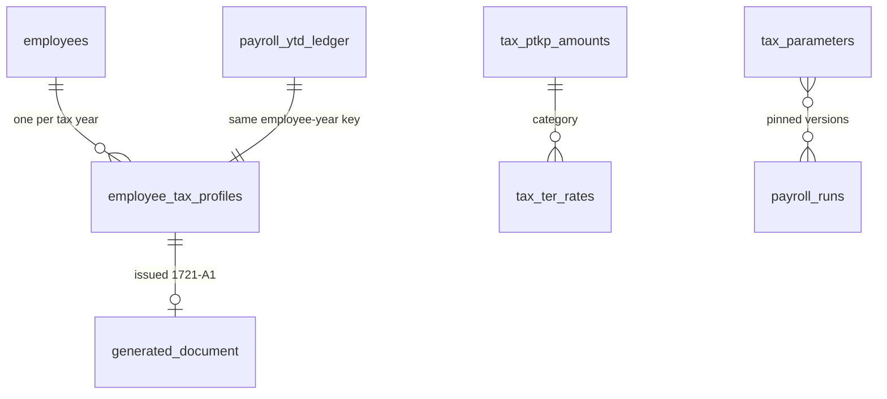
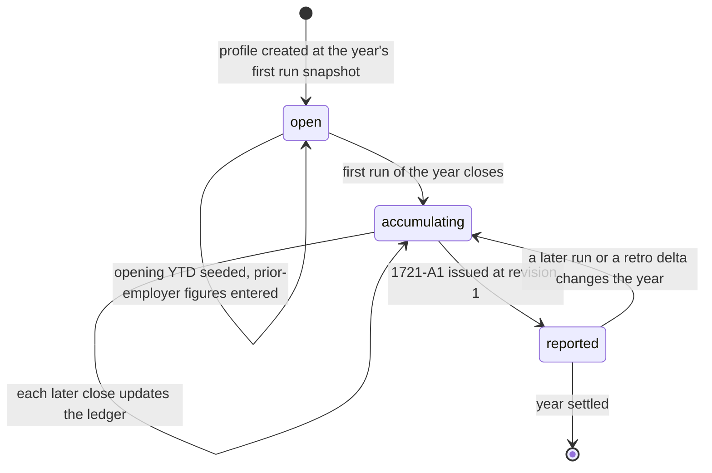
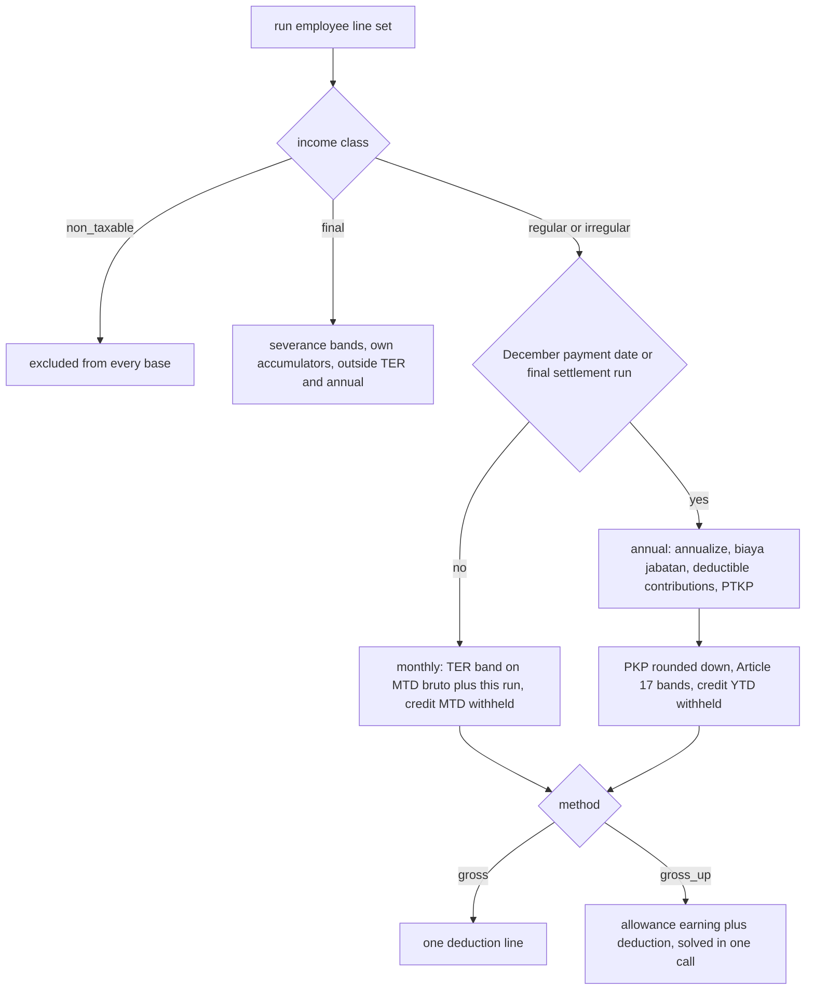
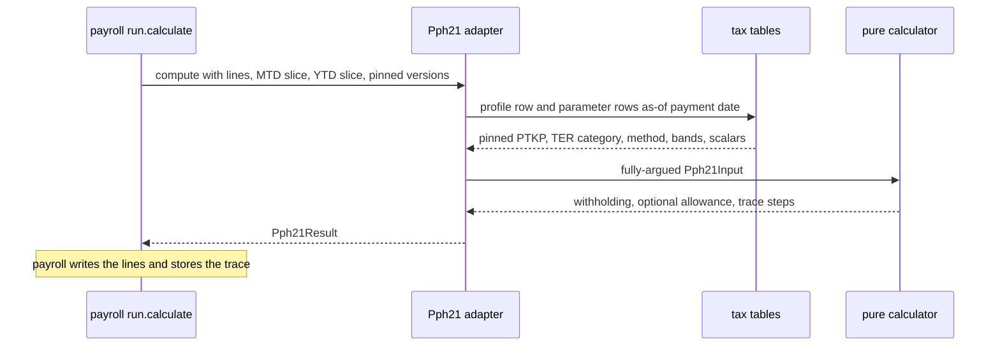
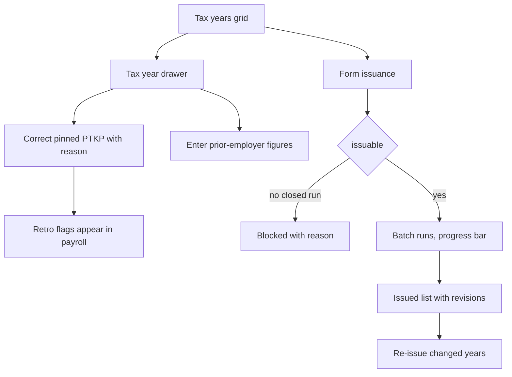

# Module: Tax — PPh 21

Status: Active (Phase 3) · Related ADRs: `ADR-0001` (port-only cross-module reads), `ADR-0002` (tenant scoping; platform tables carry no `tenant_id`), `ADR-0005` (permission keys immortal, additive-only), `ADR-0006` (result pattern), `ADR-0007` (envelope), `ADR-0009` (form objects), `ADR-0010` (jobs + outbox events), `ADR-0012` (calculation engine — **amended a third time this session**), `ADR-0013` (Drizzle conventions), `ADR-0014` (PDF), `ADR-0015` (imports + exports), `ADR-0016` (identifiers encrypted, amounts deliberately not) · Depends on: `docs/06-modules/holiday.md` (template), `docs/06-modules/payroll.md` (host pipeline, YTD ledger, `PayrollYtdSeedPort`), `docs/06-modules/employee.md` (`EmployeePayrollPort`), `docs/05-platform/settings.md`, `docs/05-platform/document-storage.md`, `docs/05-platform/import-export.md`, `docs/05-platform/audit-log.md` · Consumers: `docs/06-modules/reports.md`, `docs/06-modules/dashboard-analytics.md`

Namespace `tax` (naming §4, error prefix `TAX`). The statutory parameter set, the per-employee tax year, and the withholding calculator payroll calls as one stage of its pipeline. Inherits all global standards; deviations only.

## 1. Purpose & Scope

Three things, and nothing else. **The parameters** — TER rates, PTKP amounts, Article 17 brackets, the severance final tariff, and the scalar knobs (biaya jabatan, non-NPWP surcharge, rounding units), all effective-dated platform data with no tenant write path. **The tax year** — `employee_tax_profiles`, one row per employee per year, holding the facts that are true of a *year* rather than of a run: the pinned PTKP, prior-employer figures, the method, and which revision of Form 1721-A1 has been issued. **The calculator** — a pure function that turns one employee's slice of a payroll run into a withholding amount, a trace, and (under gross-up) an allowance line.

**This module computes; payroll orchestrates.** It owns no run, no period, no money movement, and no approval. `Pph21CalculatorPort.compute` is a pipeline stage payroll invokes at stage 6 (payroll.md §4.5) with every input already assembled and frozen. The seam is the same one payroll drew against overtime and leave, one level further in: *payroll decides what was earned, tax decides what is withheld from it.*

**The purity split is load-bearing and it is not "the calculator reads nothing".** The **port adapter** reads this module's own tables — the profile row, the parameter versions as-of the run's payment date. The **pure calculator** it wraps receives every one of those as arguments and touches no repository, no clock, and no setting. ADR-0012 names golden-file tests as the primary payroll test class; those tests target the calculator, and they stay stable precisely because nothing behind it can move.

**V1 exclusions.** The nett / *PPh ditanggung perusahaan* method — the arithmetic is trivial, but the treatment of employer-borne tax as natura/kenikmatan is exactly the area that moved under UU HPP, PP 55/2022 and PMK 66/2023, and the consequence lands in the employer's corporate tax position rather than in this product (§15). Every PPh 21 subject class other than **pegawai tetap**: pegawai tidak tetap, bukan pegawai / tenaga ahli, peserta kegiatan, komisaris, mantan pegawai — supporting the first of those is a payroll data-model change (a daily-wage package) before it is a tax rule, because every statutory base in payroll.md is defined over `upah sebulan`. Severance **entitlement** calculation — the amount is entered as a one-off component and taxed correctly here; the UU 13/2003 jo. Cipta Kerja multiplier tables are not modelled (§15, A-038). Monthly bukti potong PDFs and any direct e-Bupot / DJP filing integration (§15) — this module emits its own numbers in documented column sets and leaves government file formats to the portal that versions them.

## 2. Actors & Permissions

| Action | Permission key | Data scope | Payroll Admin | Finance | HR Admin | Employee |
|---|---|---|---|---|---|---|
| Read a tax profile / year list | `tax.profile.read` | company / tenant | ✅ | ✅ | ✅ | — |
| Edit a pinned year, seed opening YTD, enter prior-employer figures | `tax.profile.update` | company / tenant | ✅ | — | — | — |
| Read issued forms, download another employee's 1721-A1 | `tax.form.read` | company / tenant | ✅ | ✅ | — | — |
| Issue or re-issue 1721-A1 | `tax.form.execute` | company | ✅ | — | — | — |
| Inspect the statutory parameters in force | `tax.parameter.read` | — (platform data) | ✅ | ✅ | ✅ | — |
| Own 1721-A1 | — (authenticated self) | self | — | — | — | ✅ |

**No `team` scope exists in this module**, carried over verbatim from payroll §2 and for a stronger version of the same reason: a manager holds no tax key at any scope, and a tax figure is more disclosing than the salary it derives from — PTKP status reveals marital status and dependants.

The five keys are **split at birth deliberately**. ADR-0005 makes permission keys immortal and additive-only — no deny, no hierarchy — so a key that starts too coarse can never be tightened without breaking every role assignment already carrying it. `tax.profile.update` is the blast radius that matters: re-pinning a PTKP raises retro flags against closed runs (BR-TAX-005) and seeding opening YTD rewrites the annual base (BR-TAX-015). Reading a form does neither. Merging them would cost nothing today and cannot be undone later.

Riding payroll's keys was rejected on meaning before granularity: under that scheme the key authorizing a PTKP correction would be `payroll.salary.update`, which grants pay editing to anyone who may fix a tax status and makes the audit trail say "salary permission" for an action that changed nobody's salary.

## 3. Business Rules

| ID | Rule |
|---|---|
| BR-TAX-001 | **Statutory parameters are platform data.** `tax_ptkp_amounts`, `tax_ter_rates`, `tax_brackets`, `tax_severance_brackets`, and `tax_parameters` carry no `tenant_id`, no RLS, and no runtime write path (ADR-0002) — same class as `overtime_rate_rules`. They are seeded and revised by migration, effective-dated, and the row set in force on the run's payment date is pinned into `payroll_runs.parameter_versions` at snapshot, so a later regulation change can never re-price a run already computed. No effective row set for the date fails the run **at creation** with `PAY_PARAMETER_MISSING`, never with a default rate. |
| BR-TAX-002 | **Subject scope is pegawai tetap.** Every rule below is written for permanent, monthly-paid employees in the employee register. No other PPh 21 subject class is priced in V1 (§1), and there is deliberately **no subject-class column**: a column with one legal value refuses nothing, and it arrives with the second value that makes it meaningful. |
| BR-TAX-003 | **The tax year is the calendar year of the run's `payment_date`.** Withholding attaches when income is paid ⚠️ VERIFY, and the monthly filing is made by payment month, so the ledger and the filing must sit on the same basis. Consequence, stated because it reads like a bug: a tenant whose period runs 26 Dec – 25 Jan and pays in January has that run in the **new** tax year, and the annual recalculation lands on the run *paid* in December — the one covering November work. That is correct and must not be "fixed". |
| BR-TAX-004 | **The tax point is the run's declared `payment_date`, and a bounce never moves it.** A failed transfer is a settlement failure, not a re-dating of income (payroll BR-PAY-017). Re-issuing in February does not shift a January tax point; the alternative would require rewriting withholding inside a closed run. This discharges the open marker on A-032. |
| BR-TAX-005 | **PTKP is pinned per tax year.** `employee_tax_profiles` is created lazily at the first run snapshot that includes the employee that year, copying the employee record's live `ptkp_status`. A later change to that record **never** auto-applies to a pinned year — it is picked up at next year's first snapshot. Changing a pinned year requires an explicit correction carrying a reason; without it the edit is refused with `TAX_PROFILE_YEAR_CLOSED` once any run in that year has closed, and when accepted it emits `tax.profile.corrected` so payroll raises retro flags (BR-PAY-019). The employee record is not effective-dated, so this pin is the only historical record of the year's basis that will ever exist. |
| BR-TAX-006 | **Monthly withholding is TER over the month's cumulative bruto.** The TER category comes from the pinned PTKP status ⚠️ VERIFY; the rate comes from `tax_ter_rates` for that category and bracket. Withholding for a run = `rate × (MTD bruto + this run's bruto) − MTD PPh 21 already withheld`. Applying TER to each run's own gross in isolation would place a THR month in a lower bracket than the month deserves. |
| BR-TAX-007 | **The MTD slice is an input, never a query.** Payroll assembles it at snapshot from runs in the same company and tax month at `approved`, `paid`, or `closed`, and passes it in beside the YTD slice. To make the result deterministic, a run may not enter `calculating` while another run for the same company and payment month sits in `calculating` or `review` (`PAY_MONTH_RUN_IN_FLIGHT`) — without that, the answer depends on which job finished first, and a pure function whose result depends on scheduling is not one. |
| BR-TAX-008 | **The annual path runs on a December payment date or any `final_settlement` run.** Derived at snapshot from the run itself — there is no flag and no override, because no case exists where the derived answer is wrong and a mis-set switch is undetectable until December. Skeleton ⚠️ VERIFY: annualized gross → less biaya jabatan at its rate and cap → less the employee's own JHT and JP contributions **for the whole year** — supplied by bpjs.md BR-BPJS-012 and accumulated as `payroll_ytd_ledger.jht_employee_ytd` + `.jp_employee_ytd`, which exist separately because the combined employee total also carries a non-deductible Kesehatan part → less annual PTKP → PKP rounded **down** to the parameterized unit → Article 17 brackets → less PPh 21 already withheld this year → this run's withholding, **which may be negative and is then a refund line**. |
| BR-TAX-009 | **The non-NPWP surcharge is one effective-dated percentage** ⚠️ VERIFY, applied to the computed withholding, with NPWP presence read **per run** from `EmployeePayrollPort` — not pinned, because no statutory rule fixes it at the start of the year. Registering an NPWP mid-year stops the surcharge from the next run, and the excess already withheld is recovered **by the annual recalculation itself**, which credits YTD withheld against true annual liability. It is never recovered by a retro flag: two mechanisms correcting one overcharge refund it twice. If NIK-as-NPWP has retired the rule, the percentage goes to **0** from its effective date and the predicate stops mattering by arithmetic — one knob, not two. |
| BR-TAX-010 | **Two methods: `gross` and `gross_up`.** Resolution is the profile override, else `tax.method` as-of the payment date. Under gross-up the calculator returns a **line pair** from a single call — one `earning` (`tunjangan_pajak`) and one `deduction` (the withholding) — so ADR-0012's fixed pipeline order survives with no second pass. Under TER the allowance solves closed-form as `A = r·G / (1 − r)`; on the annual path it solves per bracket layer. The allowance is classified `non_wage` + `regular` ⚠️ VERIFY (A-034): classify it `variable_allowance` and it joins total wage, raising the 75% overtime-basis floor, raising overtime pay, raising tax, raising the allowance — a cycle in a pipeline ADR-0012 requires to be acyclic. |
| BR-TAX-011 | **`final` is a fourth income class.** Severance and comparable lump sums are priced on `tax_severance_brackets` ⚠️ VERIFY, are **excluded** from the monthly TER base and from the annual recalculation entirely, and accumulate in their own ledger columns. Before this class existed, every available classification produced a wrong answer — `irregular` priced it progressively and poisoned December, `non_taxable` under-withheld a tax genuinely owed. Wrong-by-configuration is the defect this class removes; it does not add entitlement math. |
| BR-TAX-012 | **Retro deltas are taxed in the month that pays them.** A delta payroll emits into a live run is ordinary income of that run's month and tax year. A correction to last November paid this February lands in the **new** tax year and the prior year's 1721-A1 is **not** amended ⚠️ VERIFY on cross-year filing practice. Re-attributing to the original month would require re-opening a closed run's tax position, which BR-PAY-018 forbids, and a hybrid rule would give the same correction two different treatments depending on the day it was noticed. |
| BR-TAX-013 | **`regular` versus `irregular` is a reporting split, not a rate split.** Under TER the monthly rate applies to the month's total bruto, and the annual recalculation sums both into annual gross. The axis survives because **1721-A1 breaks out THR, bonus, and gratifikasi on their own lines**. Written down so that `taxable_regular` / `taxable_irregular` are not mistaken for dead columns and deleted. |
| BR-TAX-014 | **Prior-employer figures feed the annual path only.** `previous_employer_neto` and `previous_employer_pph21` ⚠️ VERIFY on whether the combination is required at all, enter the annual recalculation and never the monthly TER rate — TER is a rate on this employer's payment this month, and annualizing another employer's income into it mis-withholds every month to fix one. Neto without withheld, or either without `previous_employer_months`, is `TAX_PREVIOUS_EMPLOYER_INCOMPLETE`. Storage is plaintext: these are the *previous employer's* identifiers and aggregates, outside ADR-0016's employee-identifier scope, and mirror `companies.npwp`. |
| BR-TAX-015 | **Opening YTD seeds the ledger, not a shadow.** A tenant onboarding mid-year loads its earlier months through the `tax.opening_ytd` import, which writes opening accumulators into `payroll_ytd_ledger` via `PayrollYtdSeedPort`. The seed carries the employee's opening JHT and JP contributions alongside the income figures (added 2026-08-03, bpjs.md BR-BPJS-017) — without them a July onboarding's December path deducts only the contributions this system happened to see and over-taxes the year. Refused with `TAX_OPENING_YTD_LOCKED` once any run has closed for that employee and year. One source of truth: the ledger **is** the year (ADR-0012), so December, 1721-A1, reports, and dashboards all read the same number instead of each remembering to add an opening. Unlike BR-TAX-014 this is the *same* employer's own earlier months, and it belongs on this employer's form. |
| BR-TAX-016 | **Rounding is parameterized per statutory stage** ⚠️ VERIFY: PKP rounds **down** to `pkp_rounding_unit`, PPh 21 terutang rounds to `pph21_rounding_unit`. Both live in `tax_parameters` and are pinned like any rate, because a rounding unit is a statutory number and spec §4.4 admits no hardcoded ones. The withholding line handed back to payroll is already rounded, which is what lets BR-PAY-012's "the payslip foots" hold over a sum of rounded lines. |
| BR-TAX-017 | **Adapter reads tables; calculator takes arguments.** The port adapter loads the profile row and the pinned parameter versions and merges them into a fully-argued input struct. The calculator reads nothing, calls nothing, and observes no clock. Every branch it can take is a function of its argument, which is what makes ADR-0012's golden-file tests a stable class rather than a snapshot of today's database. |
| BR-TAX-018 | **1721-A1 issuance is an explicit act, and revisioned.** An admin issues forms for a company and year; a fan-out job renders one PDF per employee from the **ledger** (never by re-summing runs) into `generated_document`, and stamps `form_issued_at` + `form_revision` on the profile. A later change to the year re-issues at `revision + 1`; the superseded PDF is retained, never deleted (ADR-0014, generate-once-store-forever). Auto-issuing at December close was rejected because a December close is not the year's last tax event — a late leaver's settlement or a January-selected retro delta can follow it, and unlike a payslip this document is filed with the tax office by the person who receives it. |
| BR-TAX-019 | **Identity on a form is a gated read.** NIK and NPWP are ADR-0016 encrypted and BR-EMP-003 masked; the renderer obtains them through `EmployeePayrollPort.taxIdentitiesFor`, so decryption, masking policy, and the audit trail all stay inside employee where they bind. One `employee.sensitive.revealed` row per issuance batch, not per employee — a batch legitimately reads ten thousand identities. |
| BR-TAX-020 | **Filing exports carry gated columns.** `tax.monthly_withholding` and `tax.annual_1721a1` include per-employee tax identifiers, so their column sets are gated by the requester's permissions at enqueue and each mint registers as an audited sensitive read (`document.download.gated_export`, import-export BR-IMP-010) — identical treatment to payroll's bank file. Outputs are requester-only. |
| BR-TAX-021 | **Audit and retention.** `employee_tax_profiles` is channel-1 audited with full diffs (audit-log §4.2). The five parameter tables are not audited: they have no tenant write path, and their history *is* their effective-dating. Profiles and issued forms sit in the 10-year payroll retention class (database-conventions §4.4, D4 ⚠️ VERIFY) and are exempt from every purge path. |
| BR-TAX-022 | **Mobile is read-only and online-only.** The employee's 1721-A1 list and download are TTL-cached snapshot reads, never a delta-sync mirror and never queue-reachable: the form is a signed short-TTL URL over a document that only exists once issued, and a queued replay of a download is meaningless. |

> ⚠️ VERIFY: confirm against current Indonesian regulation before implementation. — every rate, bracket, cap, threshold, and rounding unit in §4.2; the PTKP-to-TER-category mapping and the start-of-year PTKP rule (BR-TAX-005, BR-TAX-006); whether TER applies to combined monthly bruto across several payments (BR-TAX-006); the annual deduction sequence and which contributions are deductible (BR-TAX-008); whether the non-NPWP surcharge survives NIK-as-NPWP (BR-TAX-009); the wage classification of a tax allowance (BR-TAX-010, A-034); the severance final tariff and its bands (BR-TAX-011); whether a cross-year underpayment requires a pembetulan of the prior period (BR-TAX-012); whether a new employer must combine a prior employer's 1721-A1 (BR-TAX-014); the annual form issuance deadline (§12); the 10-year retention floor (BR-TAX-021).

## 4. Domain Model

### 4.1 Schema



```ts
// src/database/schema/tax.ts
export const taxMethod = pgEnum('tax_method', ['gross', 'gross_up']);
export const taxTerCategory = pgEnum('tax_ter_category', ['a', 'b', 'c']);

// ---- Tenant table (RLS) ------------------------------------------------

export const employeeTaxProfiles = pgTable('employee_tax_profiles', {
  ...id, ...tenantId,
  companyId: uuid('company_id').notNull().references(() => companies.id),
  employeeId: uuid('employee_id').notNull().references(() => employees.id),
  taxYear: integer('tax_year').notNull(),

  // Pinned at the year's first run snapshot — BR-TAX-005
  ptkpStatus: text('ptkp_status').notNull(),
  ptkpPinnedAt: timestamp('ptkp_pinned_at', { withTimezone: true }).notNull(),
  ptkpCorrectionReason: text('ptkp_correction_reason'),

  method: taxMethod('method'),                                    // NULL = follow tax.method

  // Different employer, same year — annual path only, BR-TAX-014
  previousEmployerName: text('previous_employer_name'),
  previousEmployerNpwp: text('previous_employer_npwp'),           // company id, not personal — plaintext
  previousEmployerNeto: numeric('previous_employer_neto', { precision: 15, scale: 2 }),
  previousEmployerPph21: numeric('previous_employer_pph21', { precision: 15, scale: 2 }),
  previousEmployerMonths: integer('previous_employer_months'),

  // Form issuance — BR-TAX-018
  formDocumentId: uuid('form_document_id').references(() => files.id),  // latest revision
  formIssuedAt: timestamp('form_issued_at', { withTimezone: true }),
  formRevision: integer('form_revision').notNull().default(0),
  ...auditColumns,
}, (t) => [
  index('idx_employee_tax_profiles_company_year').on(t.tenantId, t.companyId, t.taxYear),
  index('idx_employee_tax_profiles_employee').on(t.tenantId, t.employeeId, t.taxYear),
]);

// ---- Platform tables — no tenant_id, no RLS, migration-seeded (BR-TAX-001) ----

export const taxPtkpAmounts = pgTable('tax_ptkp_amounts', {
  ...id,
  effectiveFrom: date('effective_from').notNull(),                // the pinned "version"
  ptkpStatus: text('ptkp_status').notNull(),                      // TK/0, K/1, K/I/2 …
  annualAmount: numeric('annual_amount', { precision: 15, scale: 2 }).notNull(),
  terCategory: taxTerCategory('ter_category').notNull(),          // statutory mapping, BR-TAX-006
  createdAt: timestamp('created_at', { withTimezone: true }).notNull().defaultNow(),
}, (t) => [
  uniqueIndex('uq_tax_ptkp_amounts_version_status').on(t.effectiveFrom, t.ptkpStatus),
]);

export const taxTerRates = pgTable('tax_ter_rates', {
  ...id,
  effectiveFrom: date('effective_from').notNull(),
  terCategory: taxTerCategory('ter_category').notNull(),
  fromAmount: numeric('from_amount', { precision: 15, scale: 2 }).notNull(),  // half-open [from, to)
  toAmount: numeric('to_amount', { precision: 15, scale: 2 }),                // NULL = unbounded
  rate: numeric('rate', { precision: 6, scale: 4 }).notNull(),                // 0.0000–1.0000
  createdAt: timestamp('created_at', { withTimezone: true }).notNull().defaultNow(),
}, (t) => [
  uniqueIndex('uq_tax_ter_rates_version_cat_from').on(t.effectiveFrom, t.terCategory, t.fromAmount),
]);

export const taxBrackets = pgTable('tax_brackets', {
  ...id,
  effectiveFrom: date('effective_from').notNull(),
  fromAmount: numeric('from_amount', { precision: 15, scale: 2 }).notNull(),
  toAmount: numeric('to_amount', { precision: 15, scale: 2 }),
  rate: numeric('rate', { precision: 6, scale: 4 }).notNull(),
  createdAt: timestamp('created_at', { withTimezone: true }).notNull().defaultNow(),
}, (t) => [
  uniqueIndex('uq_tax_brackets_version_from').on(t.effectiveFrom, t.fromAmount),
]);

export const taxSeveranceBrackets = pgTable('tax_severance_brackets', {
  ...id,
  effectiveFrom: date('effective_from').notNull(),
  fromAmount: numeric('from_amount', { precision: 15, scale: 2 }).notNull(),
  toAmount: numeric('to_amount', { precision: 15, scale: 2 }),
  rate: numeric('rate', { precision: 6, scale: 4 }).notNull(),
  createdAt: timestamp('created_at', { withTimezone: true }).notNull().defaultNow(),
}, (t) => [
  uniqueIndex('uq_tax_severance_brackets_version_from').on(t.effectiveFrom, t.fromAmount),
]);

export const taxParameters = pgTable('tax_parameters', {
  ...id,
  effectiveFrom: date('effective_from').notNull(),
  key: text('key').notNull(),                                     // see §4.2
  numericValue: numeric('numeric_value', { precision: 15, scale: 4 }).notNull(),
  note: text('note'),
  createdAt: timestamp('created_at', { withTimezone: true }).notNull().defaultNow(),
}, (t) => [
  uniqueIndex('uq_tax_parameters_version_key').on(t.effectiveFrom, t.key),
]);
```

Hand-written SQL beyond Drizzle's reach:

```sql
-- One profile per employee per tax year. Company is part of the row, not the key:
-- an employee moving company mid-year gets a second row and a second 1721-A1.
CREATE UNIQUE INDEX uq_employee_tax_profiles_key
  ON employee_tax_profiles (tenant_id, company_id, employee_id, tax_year);

-- A correction to a pinned year must carry its reason - BR-TAX-005.
ALTER TABLE employee_tax_profiles ADD CONSTRAINT ck_employee_tax_profiles_correction
  CHECK (ptkp_correction_reason IS NULL OR length(btrim(ptkp_correction_reason)) > 0);

-- A revision number without a document, or vice versa, is a half-written issuance.
ALTER TABLE employee_tax_profiles ADD CONSTRAINT ck_employee_tax_profiles_issuance
  CHECK ((form_revision = 0 AND form_document_id IS NULL AND form_issued_at IS NULL)
      OR (form_revision > 0 AND form_document_id IS NOT NULL AND form_issued_at IS NOT NULL));

-- Prior-employer figures are all-or-nothing - BR-TAX-014.
ALTER TABLE employee_tax_profiles ADD CONSTRAINT ck_employee_tax_profiles_prev_employer
  CHECK (num_nonnulls(previous_employer_neto, previous_employer_pph21, previous_employer_months) IN (0, 3));

-- Half-open bands, ascending, on every rate table.
ALTER TABLE tax_ter_rates ADD CONSTRAINT ck_tax_ter_rates_band
  CHECK (to_amount IS NULL OR to_amount > from_amount);
ALTER TABLE tax_brackets ADD CONSTRAINT ck_tax_brackets_band
  CHECK (to_amount IS NULL OR to_amount > from_amount);
ALTER TABLE tax_severance_brackets ADD CONSTRAINT ck_tax_severance_brackets_band
  CHECK (to_amount IS NULL OR to_amount > from_amount);
```

**Ledger columns added to payroll** (payroll.md amendment this session, BR-TAX-011): `payroll_ytd_ledger.final_income_ytd` and `.pph21_final_ytd`. They live there rather than on the profile — despite sharing the `(employee, year)` key — because the ledger is the shared accumulator payroll writes inside the close transaction, and UC-PAY-010 refuses to close if a ledger write fails. Splitting half the year's tax position into an asynchronously written table would put it outside that guarantee.

### 4.2 Parameter registry

Every row is effective-dated and pinned by `effective_from`. `tax_parameters` keys in V1:

| Key | Meaning |
|---|---|
| `biaya_jabatan_pct` | Occupational cost as a fraction of gross, annual path |
| `biaya_jabatan_monthly_cap` | Monthly ceiling on the above |
| `biaya_jabatan_annual_cap` | Annual ceiling on the above |
| `non_npwp_surcharge_pct` | BR-TAX-009; `0` expresses "this rule no longer exists" |
| `pkp_rounding_unit` | PKP rounds **down** to this multiple |
| `pph21_rounding_unit` | PPh 21 terutang rounds to this multiple |

> ⚠️ VERIFY: confirm against current Indonesian regulation before implementation. — every value seeded into the five parameter tables, and the composition of this key list itself. The **structure** is the decided part: statutory numbers are versioned platform rows, pinned per run, absent rather than defaulted.

### 4.3 The tax year lifecycle

The parameter tables are versioned reference data on a date axis and have no lifecycle, exactly as holiday.md and organization.md justified for theirs. The entity that does have one is an employee's tax **year**:



Invariants. `open` is the only state in which opening YTD may be seeded — the first close makes the year real and the seed path closes permanently (`TAX_OPENING_YTD_LOCKED`). `reported` is not terminal and deliberately so: BR-TAX-018's re-issue is the `reported → accumulating → reported` loop, and each pass increments `form_revision` while the superseded document survives. A profile row never leaves the tenant: it is retained for the payroll horizon even after the employee exits, because the form must be reproducible for a decade.

### 4.4 Calculation contract

```ts
export const PPH21_CALCULATOR_PORT = Symbol('PPH21_CALCULATOR_PORT');

/** Everything the pure calculator may see. Assembled by the adapter; frozen by payroll. */
export type Pph21Input = {
  taxYear: number;
  paymentDate: string;              // drives version resolution and the annual trigger
  path: 'monthly' | 'annual';       // derived by payroll, BR-TAX-008
  employee: {
    ptkpStatus: string;             // pinned, BR-TAX-005
    terCategory: 'a' | 'b' | 'c';
    hasNpwp: boolean;               // per run, BR-TAX-009
    method: 'gross' | 'gross_up';
    monthsEmployedInYear: number;
  };
  lines: { componentCode: string; incomeClass: 'regular' | 'irregular' | 'non_taxable' | 'final';
           amount: string }[];
  deductibleContributions: { jht: string; jp: string };   // employee side, annual path;
                                                          // supplied by bpjs.md, BR-BPJS-012
  mtd: { bruto: string; pph21Withheld: string };          // BR-TAX-007
  ytd: { gross: string; taxableRegular: string; taxableIrregular: string;
         pph21Withheld: string; finalIncome: string; pph21Final: string };
  previousEmployer?: { neto: string; pph21: string; months: number };
  parameters: {
    versionAsOf: string;            // pinned effective_from
    ptkpAnnualAmount: string;
    terBands: { from: string; to: string | null; rate: string }[];
    progressiveBands: { from: string; to: string | null; rate: string }[];
    severanceBands: { from: string; to: string | null; rate: string }[];
    scalars: Record<string, string>;
  };
};

export type Pph21Result = {
  withholding: string;                          // rounded, may be negative on the annual path
  taxAllowance: string | null;                  // gross-up only, BR-TAX-010
  finalTax: string;                             // severance, BR-TAX-011
  taxableRegular: string;                       // as actually used, incl. any allowance
  taxableIrregular: string;
  trace: { step: string; input: string; output: string; note?: string }[];
  warnings: { code: string; details?: Record<string, unknown> }[];
};

export interface Pph21CalculatorPort {
  compute(input: Pph21Input): Promise<Result<Pph21Result, DomainError>>;
  /** Run-creation preflight: mid-year hires with no prior-employer record, unpinnable PTKP. */
  preflight(companyId: string, taxYear: number, employeeIds: string[]):
    Promise<{ code: string; employeeCount: number; details?: Record<string, unknown> }[]>;
}
```

`compute` is the adapter. It resolves the profile row and the parameter versions, merges them into `Pph21Input`, and hands that to a calculator that reads nothing else — no repository, no `Clock`, no settings lookup (BR-TAX-017, coding-standards-nestjs' `Clock` port rule made moot by having no time dependency at all).

### 4.5 Ports consumed

| Port | Use | Status |
|---|---|---|
| `EmployeePayrollPort.taxIdentitiesFor` | decrypted NIK/NPWP for form rendering and filing exports, one audit row per batch | **new, added to employee.md this session** |
| `PayrollYtdSeedPort.seedOpening` | opening YTD rows written into payroll's ledger | **new, added to payroll.md this session** |
| `SettingsPort` | `tax.method` as-of the payment date | live |
| `DocumentStoragePort` | 1721-A1 PDFs into the existing `generated_document` category — no new category is minted, document-storage §4.2 already reads "module payslip/tax read keys" with a 120 s URL TTL and no client delete | live |
| `OrgQueryPort` | company resolution and scoping for issuance and exports | live |

No `AttendanceQueryPort`, no `LeaveQueryPort`, no `OvertimeQueryPort`, no `PeriodLockPort`. This module never reads a fact about time — payroll has already priced all of it by the time stage 6 runs, and the amounts arrive as `lines`.

### 4.6 Withholding paths





**Worked example — why the MTD slice exists.** A tenant pays March salary of 10,000,000 in one run and THR of 10,000,000 in a separate THR run, both with a March payment date. Suppose the employee's TER category bands give 2% up to 10,000,000 and 5% above it ⚠️ VERIFY — illustrative numbers, not the real table.

Without the slice, each run prices its own 10,000,000 at 2%: **200,000 + 200,000 = 400,000**.
With the slice, the second run prices cumulative bruto of 20,000,000 at 5% and credits what the first already withheld: **1,000,000 − 200,000 = 800,000**, total **1,000,000**.

The gap is 600,000 on one employee in one month, in the direction of under-withholding, for every tenant that pays THR as its own run — and it compounds across the whole company. December's recalculation would eventually claw it back in a single deduction, which is precisely the outcome monthly withholding exists to prevent, and it never happens at all for an employee who leaves before December.

## 5. Use Cases

**UC-TAX-001 — Pin a tax year.** Actor: system, inside `run.snapshot`. Precondition: a run includes an employee with no profile row for the run's tax year. Main: create the row, copying `ptkp_status` from `EmployeePayrollPort.rosterFor`, stamp `ptkp_pinned_at`, resolve `method` to NULL so the setting governs. Exception: the employee record carries no PTKP status → the employee row errors with `TAX_PTKP_UNRESOLVED` rather than defaulting to TK/0. Postcondition: the year's basis is a stored fact.

**UC-TAX-002 — Correct a pinned year.** Actor: Payroll Admin with `tax.profile.update`. Main: edit `ptkp_status` with a mandatory reason. Alternate: no run in the year has closed → the correction applies silently to future runs. Exception: a run has closed and no reason is supplied → `TAX_PROFILE_YEAR_CLOSED`. Postcondition: `tax.profile.corrected` emitted; payroll raises retro flags for closed runs in that year, so the difference becomes a human decision rather than a silent recompute.

**UC-TAX-003 — Enter prior-employer figures.** Actor: Payroll Admin. Main: record name, NPWP, neto, PPh 21, and months from the employee's prior 1721-A1. Exception: partial set → `TAX_PREVIOUS_EMPLOYER_INCOMPLETE`. Postcondition: the figures enter the annual recalculation only, and the preflight warning for that employee clears.

**UC-TAX-004 — Seed opening YTD on mid-year onboarding.** Actor: Payroll Admin. Main: upload the `tax.opening_ytd` workbook; the import framework's dry-run reports per-row errors, commit writes accumulators into `payroll_ytd_ledger` through `PayrollYtdSeedPort`. Exception: a run has already closed for an employee-year in the file → that row fails with `TAX_OPENING_YTD_LOCKED`; the rest commit under partial mode (ADR-0015). Postcondition: December computes the first year correctly, from one ledger.

**UC-TAX-005 — Monthly withholding.** Actor: system, pipeline stage 6. Main: adapter assembles the input; the calculator picks the monthly path, applies the TER band to cumulative month bruto, credits MTD withholding, applies the surcharge if the employee has no NPWP, and returns a rounded deduction line plus trace steps. Alternate: method resolves to `gross_up` → the allowance line is returned with it and the revised taxable figures come back in the result. Postcondition: payroll writes the lines; the trace becomes the payslip explain-view.

**UC-TAX-006 — December recalculation.** Actor: system, on a run whose payment date is in December. Main: annualize, apply biaya jabatan at its rate and caps, subtract deductible employee contributions and annual PTKP, round PKP down, apply the progressive bands, add prior-employer figures where present, subtract PPh 21 withheld year-to-date, return the remainder. Alternate: the remainder is negative → a refund line, which reduces that run's total deductions and may make net pay exceed gross. Postcondition: the year's withholding is correct in aggregate regardless of what each month withheld.

**UC-TAX-007 — Exit recalculation.** Actor: system, on any `final_settlement` run. Identical to UC-TAX-006 with the year truncated at the exit month. Alternate: the run also carries a severance amount → that line is priced on the severance bands and excluded from the annual arithmetic entirely (BR-TAX-011). Postcondition: the leaver's year is closed for tax before their form is issued.

**UC-TAX-008 — Issue 1721-A1.** Actor: Payroll Admin with `tax.form.execute`. Precondition: at least one closed run for the company and year. Main: a parent job fans out one child per employee, each reading the ledger, calling `taxIdentitiesFor` once for the batch, rendering the PDF, and stamping the profile at `revision + 1`. Exception: an employee-year with no ledger row → `TAX_FORM_NOT_ISSUABLE` on that employee, the batch continues. Postcondition: `tax.form.issued` per employee; `tax.issuance_finished` to the initiating admin with issued and skipped counts.

**UC-TAX-009 — Re-issue after a year changes.** Actor: Payroll Admin. Main: the pending-issuance worklist lists employees whose ledger changed after `form_issued_at` — derived, so a dismissed notification cannot lose one, the same pattern payroll uses for pending settlements and pending retro. Re-issuing bumps the revision; the previous document remains downloadable to anyone with `tax.form.read` for audit. Postcondition: the employee is notified that a revised form exists.

**UC-TAX-010 — Employee downloads their own form.** Actor: Employee. Main: `/me/tax-forms` lists issued years; export mints a signed URL at the `generated_document` TTL. Exception: an unissued year is simply absent; another employee's identifier resolves to `SYS_NOT_FOUND`, never 403. Postcondition: one `document.download.generated_document` sensitive-read row.

**UC-TAX-011 — Produce the monthly filing set.** Actor: Payroll Admin or Finance. Main: run the `tax.monthly_withholding` export for a company and tax month; the workbook carries one row per employee with identity, gross, taxable, TER category and rate, PTKP status, surcharge flag, and withheld. Exception: the requester lacks the gated columns → those columns are omitted rather than the export refused (import-export §4.3). Postcondition: the tenant keys or maps the file into the filing portal; the mint is audited.

## 6. UI Flow

**Admin web (primary surface).** Screens: **Tax years** — grid per company and year with pinned PTKP, method, prior-employer completeness, form revision and issue date, filtered by "needs attention". **Tax year drawer** — the pinned basis with its correction history, prior-employer block, opening-YTD block, and a read-only ledger summary for the year. **Form issuance** — pick company and year, see counts of issuable / already issued / changed-since-issue, run the batch, watch progress. **Parameters** — read-only, as-of date picker, showing which version is in force and the version each recent run pinned. **Filing exports** — the two definitions with their period parameters.



Empty states name the cause and the next action: *"No tax years yet — a profile is created the first time a payroll run includes this employee."* · *"Nothing to issue for 2026 — no payroll run has closed for this company yet."* · *"12 employees hired mid-year have no prior-employer record. Enter them before issuing, or issue without."* Loading uses the standard skeleton grid; the issuance batch shows determinate progress from the job. Errors surface field-first, then panel, then toast (design-system §microcopy, coding-standards-nextjs).

**Mobile (ESS).** One screen: **My tax forms** — a list of issued years, each opening a viewer with a download action. Rendered under `FLAG_SECURE` like the payslip (security-standards §mobile posture). No editing surface of any kind exists on mobile.

## 7. API

All endpoints follow the canonical spec-block form (api-standards §13). Admin grids use the seeded transactional-grid family (offset); the employee list uses the self-service family (cursor). Exports ride import-export §7. Errors beyond the implied set only.

| Endpoint | Permission | Pagination | Queue-reachable | Idempotency |
|---|---|---|---|---|
| `GET /api/v1/tax/profiles` | `tax.profile.read` | offset | no | — |
| `GET /api/v1/tax/profiles/{employeeId}/{taxYear}` | `tax.profile.read` | — | no | — |
| `PATCH /api/v1/tax/profiles/{employeeId}/{taxYear}` | `tax.profile.update` | — | no | accepted |
| `GET /api/v1/tax/parameters` | `tax.parameter.read` | — (bounded) | no | — |
| `GET /api/v1/tax/forms` | `tax.form.read` | offset | no | — |
| `POST /api/v1/tax/forms/execute` | `tax.form.execute` | — | no | accepted |
| `GET /api/v1/tax/forms/{employeeId}/{taxYear}` | `tax.form.read` | — | no | — |
| `POST /api/v1/tax/forms/{employeeId}/{taxYear}/export` | `tax.form.read` | — | no | accepted |
| `GET /api/v1/me/tax-forms` | — (authenticated, self) | cursor | no | — |
| `POST /api/v1/me/tax-forms/{taxYear}/export` | — (authenticated, self) | — | no | accepted |

No new URL verbs: `execute` and `export` are both in naming §3's reserved set. Batch issuance is `execute` on the forms collection rather than a bespoke `issue`, for the same reason payroll's calculation is `execute`. `PATCH` is the update verb; api-standards §2 leaves `PUT` unused in V1. The opening-YTD import has no endpoint here — it rides `POST /api/v1/imports` with definition `tax.opening_ytd` (import-export §7).

#### PATCH /api/v1/tax/profiles/{employeeId}/{taxYear}

| Field | Type | Required | Rule |
|---|---|---|---|
| `ptkpStatus` | string | — | must exist in `tax_ptkp_amounts` for the year |
| `correctionReason` | string | conditional | required when `ptkpStatus` changes and a run in the year has closed; 3–500 |
| `method` | enum | — | `gross \| gross_up`, or null to follow `tax.method` |
| `previousEmployerName` | string | — | 1–120 |
| `previousEmployerNpwp` | string | — | digits-only after normalization |
| `previousEmployerNeto` | decimal string | — | ≥ 0 |
| `previousEmployerPph21` | decimal string | — | ≥ 0 |
| `previousEmployerMonths` | integer | — | 1–12 |

Response 200: the profile row with `affectedClosedRuns: [{ runId, label }]` when the correction raised retro flags — the caller learns immediately that money already paid is now in question. Errors: `TAX_PROFILE_YEAR_CLOSED` (`details: { taxYear, closedRunCount }`) · `TAX_PREVIOUS_EMPLOYER_INCOMPLETE` (`details: { missing: [...] }`) · unknown employee or out-of-scope company → `SYS_NOT_FOUND`.

#### GET /api/v1/tax/parameters

Query: `asOf` (date, defaults to today). Response 200: `{ versionAsOf, ptkp: [...], ter: [...], progressive: [...], severance: [...], scalars: {...} }` — the exact row sets a run on that date would pin. Read-only by construction: there is no POST, PATCH, or DELETE on any parameter table anywhere in the API, because BR-TAX-001 gives them no runtime write path. Errors: `PAY_PARAMETER_MISSING` (`details: { parameter, asOf }`) when no version covers the date.

#### POST /api/v1/tax/forms/execute

| Field | Type | Required | Rule |
|---|---|---|---|
| `companyId` | uuid | ✅ | within actor scope |
| `taxYear` | integer | ✅ | a year with ≥1 closed run |
| `employeeIds` | array | — | omitted means every issuable employee; present means a subset, used for re-issues |
| `reissue` | boolean | — | default false; when false, employees already at revision ≥1 are skipped |

Response 202: `{ jobId, issuableCount, skippedCount }`. Errors: `TAX_FORM_NOT_ISSUABLE` (`details: { taxYear, reason: 'no_closed_run' }`) at the request level when the whole year is unissuable; the same code appears per employee in the job result when only some rows lack a ledger entry.

#### GET /api/v1/tax/forms · GET /{employeeId}/{taxYear} · POST /{employeeId}/{taxYear}/export

The list is the issuance worklist: one row per employee-year with `revision`, `issuedAt`, and `changedSinceIssue` — the derived flag UC-TAX-009 works from. Detail returns the issued figures rendered from the ledger plus the document pointer. `export` mints a signed URL at the `generated_document` category's 120-second TTL and writes one **`document.download.generated_document`** sensitive-read row — the existing registered event, which audit-log §4.3 already describes as covering "payslip/1721-A1 class files". Fail-closed per UC-AUD-003: the insert precedes the URL, and a failed insert refuses the download.

#### GET /api/v1/me/tax-forms · POST /me/tax-forms/{taxYear}/export

Self-scoped by the authenticated identity; another employee's year is not addressable at all on this path. The list carries issued years only — an unissued year is absent rather than empty, because "your 2026 form does not exist yet" and "your 2026 form is blank" are different statements and only the first is true. Same TTL, same audited mint.

## 8. Validation Rules

| Field | Rule | Error code |
|---|---|---|
| `taxYear` | 4-digit; not in the future relative to the payment date | `VAL_OUT_OF_RANGE` |
| `ptkpStatus` | exists in `tax_ptkp_amounts` for the year's version | `VAL_INVALID_ENUM` |
| `correctionReason` | required when the pinned status changes and a run has closed; 3–500 | `VAL_REQUIRED` / `VAL_TOO_LONG` |
| `method` | member of `tax_method`, or null | `VAL_INVALID_ENUM` |
| prior-employer block | all five fields present or all absent | `TAX_PREVIOUS_EMPLOYER_INCOMPLETE` |
| `previousEmployerNpwp` | digits-only after normalization, 15–16 digits ⚠️ VERIFY | `VAL_INVALID_FORMAT` |
| `previousEmployerNeto` / `Pph21` | decimal string, ≥ 0 | `VAL_OUT_OF_RANGE` |
| `previousEmployerMonths` | 1–12 | `VAL_OUT_OF_RANGE` |
| `employeeIds` (issuance) | non-empty when present; all within the company | `VAL_REQUIRED` / `SYS_NOT_FOUND` |
| opening-YTD row | employee resolvable, year has no closed run, amounts ≥ 0 | `TAX_OPENING_YTD_LOCKED` / `VAL_OUT_OF_RANGE` |
| `asOf` (parameters) | valid date | `VAL_INVALID_FORMAT` |

## 9. Edge Cases & Failure Modes

**Employee has no PTKP status at first snapshot.** `TAX_PTKP_UNRESOLVED` on that employee row; the run reaches `review` with the error attached (payroll BR-PAY-011). Defaulting to TK/0 would be the maximum-withholding guess and would look like a deliberate configuration for a year.

**Employee marries in June.** Nothing happens this year. The pinned PTKP stands, and next year's first snapshot picks up the new status. This is the case that makes the pin necessary rather than convenient.

**PTKP was wrong from the start.** An explicit correction with a reason. Closed runs get retro flags; open runs recompute normally on the next `execute`. The system cannot distinguish this from the marriage case, which is exactly why the human must say which it is.

**Two runs, same payment month.** Priced together via the MTD slice, serialized by `PAY_MONTH_RUN_IN_FLIGHT`. The operational consequence is real and intended: approve the THR run before calculating the regular one.

**Arrears tenant's December.** The run paid in December carries the annual recalculation even though it covers November work, and the run paid in January belongs to the new tax year. Every artifact — ledger, form, monthly export — agrees, because all of them key on payment date.

**Employee registers an NPWP in July.** The surcharge stops in August. Nothing is refunded in August. December's recalculation returns the excess as a smaller or negative December withholding. Anyone who "fixes" this with a retro flag has built a double refund.

**Employee moves company mid-year.** Two profile rows, two ledger rows, two 1721-A1 forms — the unique key includes `company_id` for exactly this. Neither company reports the other's payments; the employee combines them in their own annual filing.

**Employee exits in March and is rehired in September.** employee.md's rehire model creates a new employment row, but the tax year is keyed on employee and company, so it is **one** profile and one form. The September runs continue accumulating the same year, and the March exit recalculation is superseded by December's, which sees the whole year. This is correct and it is why the profile is not keyed on employment.

**Retro delta crosses a tax year.** Taxed in the paying month, in the paying year. The prior year's form is untouched. If the tenant's filing practice requires a pembetulan instead, that is a filing action outside this system ⚠️ VERIFY.

**Form issued, then a retro delta lands.** `changedSinceIssue` flips on the worklist. Re-issuing produces revision 2; revision 1 stays downloadable, because the employee may already have filed against it.

**Gross-up on a negative December.** The allowance solves against a negative withholding to zero rather than to a negative allowance — an employer does not claw back a tax allowance for a refund it is about to hand over. The refund itself still reaches the employee as the reduced deduction.

**Parameter version added retroactively.** Runs already closed keep the version they pinned. A run in `draft` re-resolves on its next snapshot. There is no path by which an existing closed run silently adopts a newer table.

## 10. Offline Behavior

Deviations from offline-sync only. This module contributes **no sync classes and no queue-reachable operations**. The employee's form list and download are online-only reads (BR-TAX-022): the artifact exists only after issuance, the URL is short-TTL and signed, and replaying a download from a queue has no meaning. There is no local mirror table — a stale cached list would claim a form exists that may have been superseded, and revision correctness matters more here than availability. All admin surfaces are admin-web only.

## 11. Module Error Codes

Registered in `docs/03-standards/error-catalog.md` §22 this session.

| Code | HTTP | When |
|---|---|---|
| `TAX_PTKP_UNRESOLVED` | 422 | Employee record carries no PTKP status at pin time — BR-TAX-005, UC-TAX-001 |
| `TAX_PROFILE_YEAR_CLOSED` | 409 | Pinned-year edit attempted without a correction reason while a run in that year has closed — BR-TAX-005 |
| `TAX_OPENING_YTD_LOCKED` | 409 | Opening YTD seed attempted after a run closed for that employee-year — BR-TAX-015 |
| `TAX_PREVIOUS_EMPLOYER_INCOMPLETE` | 422 | Partial prior-employer figure set — BR-TAX-014 |
| `TAX_FORM_NOT_ISSUABLE` | 422 | No ledger row for the employee-year, or no closed run for the year — BR-TAX-018 |

Deliberate reuses rather than new codes: **`PAY_PARAMETER_MISSING`** for an absent parameter version (payroll already raises it at run creation with `{ parameter, asOf }`, and a second code for the same condition would split the branch clients write); **`SYS_NOT_FOUND`** for every unknown or out-of-scope identifier including write references (error-catalog §2, grill cluster C); **`PAY_MONTH_RUN_IN_FLIGHT`** stays in the `PAY_` block because the precondition is enforced by payroll on its own runs.

## 12. Background Jobs & Events

| Job | Trigger | Behavior |
|---|---|---|
| `exports` / `form-1721a1.issue` | issuance command | parent fans out one child per employee; each reads the ledger, renders via `PdfService` (ADR-0014) into `generated_document`, stamps `form_revision` |
| `exports` / `tax-filing.export` | export request | the two ExportDefinitions through the import-export framework, gated columns resolved at enqueue |
| `imports` / opening YTD | import commit | framework-owned; this module supplies the `rowHandler` that calls `PayrollYtdSeedPort` |
| `cron.tax.form-deadline` | daily | reminds Payroll Admin when the annual form issuance deadline approaches for a company with unissued years ⚠️ VERIFY |

**Emitted** (outbox, ADR-0010): `tax.profile.corrected` (payroll consumes → retro flags for closed runs in that year) · `tax.form.issued` (per employee, drives the notification).

**Consumed: none.** Deliberately. Issuance is an act, the pending-issuance and retro worklists are derived queries, and the calculator is invoked synchronously in-process by payroll's pipeline — there is no fact this module needs to learn asynchronously. A module that subscribes to nothing cannot fall behind.

## 13. Approval, Notification & Report Touchpoints

- **Approval:** none. No request type is registered in approval-engine §13 and none is needed — nothing here is a request for a decision. Correcting a pinned year is an audited edit that raises retro flags, and the retro deltas themselves ride the *payroll run's* chain (BR-PAY-019). Adding a chain would place an approval on the correction of a data-entry error while leaving the money it affects approved elsewhere.
- **Notification templates** (notification.md §4.2, registered this session): `tax.form_issued` (in-app + push, to the employee, on issue and on every re-issue, carrying the year and revision) and `tax.issuance_finished` (in-app, to the initiating admin, carrying issued and skipped counts). Two segments each, per the registry's convention; the three-segment `tax.form.issued` in §12 is the **domain event**, which follows naming §6's `<ns>.<entity>.<event>` grammar instead — the same distinction payroll.md §13 draws.
- **Reports** (reports.md registry): monthly withholding recap per company and month, annual withholding summary per employee, PTKP distribution, non-NPWP exposure, issuance status per year, and a prior-employer completeness list for the December preflight.
- **Ports served:** `Pph21CalculatorPort` (payroll, live from this session — payroll.md §4.4's forward row flips). No other module consumes this one. `bpjs.md` (2026-08-03) implements a sibling calculator port against the same pipeline rather than talking to this module: its employee JHT and JP figures reach `Pph21Input.deductibleContributions` **through payroll**, and its taxable employer premiums reach `Pph21Input.lines` as `employer_cost` rows that payroll's stage 5 assembles. The two calculators never call each other; pipeline order is the whole of the coupling.

## 14. Test Scenarios

| Scenario | Covers |
|---|---|
| Same snapshot, same input struct, byte-identical result across releases | BR-TAX-017, ADR-0012 golden-file class |
| Calculator invoked with a hand-built input struct and no database present at all | BR-TAX-017 |
| Regular run and THR run in one payment month price at the combined TER band, second run credits the first | BR-TAX-006, BR-TAX-007 |
| A run refuses to calculate while a same-month run sits in `review` | BR-TAX-007 |
| December run with eleven months of TER withholding lands the year on the progressive figure | BR-TAX-008, UC-TAX-006 |
| December remainder is negative and emerges as a refund line, net pay exceeds gross | UC-TAX-006 |
| Arrears tenant: run paid 5 Jan is tax year N+1; run paid 30 Dec carries the annual path | BR-TAX-003 |
| Bounced payment re-issued the following month does not move the tax point | BR-TAX-004 |
| PTKP change in June leaves the pinned year untouched; next year's first snapshot adopts it | BR-TAX-005 |
| Reasoned correction on a year with a closed run raises retro flags and returns `affectedClosedRuns` | UC-TAX-002 |
| Correction without a reason on a closed year → `TAX_PROFILE_YEAR_CLOSED` | BR-TAX-005 |
| NPWP registered mid-year: surcharge stops next run, excess recovered only once, in December | BR-TAX-009 |
| Gross-up under TER: allowance and withholding are equal, take-home unchanged, allowance taxable | BR-TAX-010 |
| Gross-up allowance is `non_wage`: overtime hourly basis is identical with and without it | BR-TAX-010, A-034 |
| Severance line priced on the final bands, absent from TER base, absent from annual gross | BR-TAX-011 |
| Retro delta for last November paid in February taxed in February's year; prior form untouched | BR-TAX-012 |
| Opening YTD seeded before the first close; the same seed refused after it | BR-TAX-015, UC-TAX-004 |
| Mid-year hire with no prior-employer record raises a preflight warning at December run creation | BR-TAX-014, UC-TAX-003 |
| PKP rounds down to the parameterized unit; withholding rounds to the parameterized unit | BR-TAX-016 |
| Issuance renders from the ledger, not by re-summing runs; deleting a run row changes nothing | BR-TAX-018 |
| Re-issue produces revision 2 and revision 1 remains downloadable | BR-TAX-018, UC-TAX-009 |
| Issuance batch writes exactly one `employee.sensitive.revealed` row for 10,000 employees | BR-TAX-019 |
| Employee downloading another employee's form receives `SYS_NOT_FOUND` | UC-TAX-010 |
| Form download with the audit insert failing refuses the download | BR-TAX-021, audit-log fail-closed |
| Export requested without gated permissions omits identifier columns rather than failing | BR-TAX-020 |
| Employee moving company mid-year receives two forms; neither carries the other's figures | §9 |
| Two-tenant leak test on `employee_tax_profiles`; parameter tables readable by both | ADR-0002 |

## 15. Future Improvements

The nett / *PPh ditanggung perusahaan* method, once the natura and kenikmatan treatment under UU HPP, PP 55/2022 and PMK 66/2023 can be stated with confidence. Pegawai tidak tetap — which needs a daily-wage package in payroll.md before it needs a TER Harian table here — followed by bukan pegawai and the remaining subject classes, each arriving with the `tax_employee_class` column that BR-TAX-002 deliberately withholds until a second value exists. Severance **entitlement** calculation: the UU 13/2003 jo. Cipta Kerja and PP 35/2021 multipliers per termination reason, UPMK by tenure, and UPH composition — a real feature that belongs with payroll's final settlement rather than with the tax that prices it. Monthly bukti potong PDFs and a direct e-Bupot 21/26 submission path, which means owning a government file schema versioned outside our release cycle — deferred on purpose, not overlooked. Parameter-update tooling that drafts a new effective-dated row set from a published regulation, the workflow ADR-0012 already anticipates for TER updates. Employee-facing tax simulation ahead of a package change, once the calculator has a stable public shape. Multi-year form archive search for employees who have left, currently reachable only by admin.
