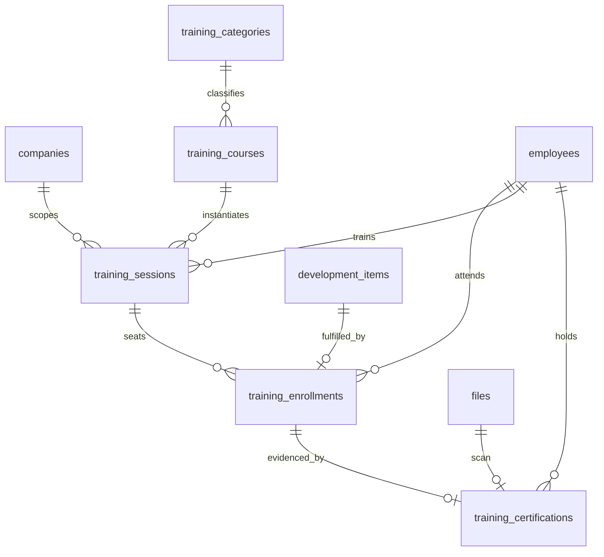
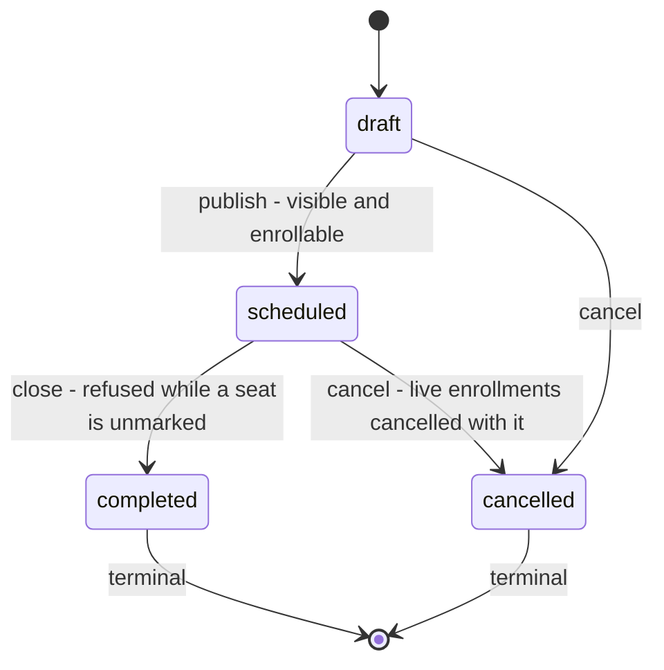
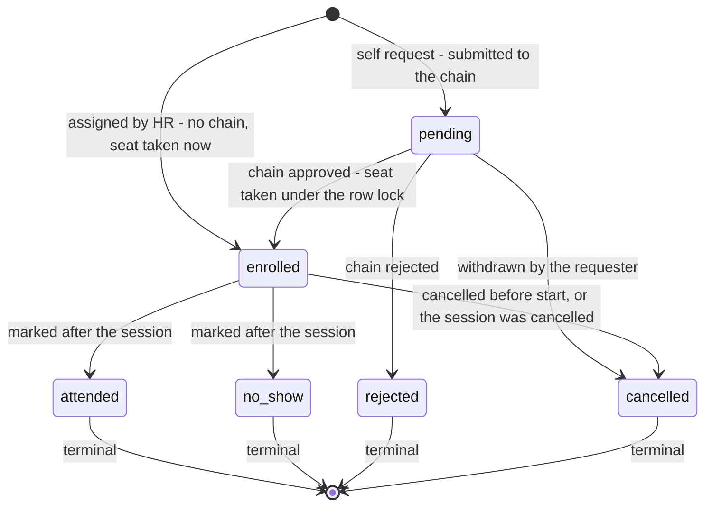
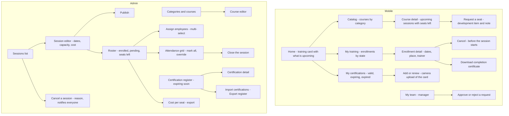

# Module: Training

Status: Active (Phase 3) · Related ADRs: `ADR-0001` (module boundaries — §5 outbound FK inventory, §6 read-model views), `ADR-0002` (tenant scoping), `ADR-0003` (online-only mobile writes), `ADR-0005` (data scope + module-resolved row visibility), `ADR-0006` (result pattern), `ADR-0007` (envelope), `ADR-0008` (one request type — `training.enrollment`), `ADR-0009` (uploaded certificate scans), `ADR-0010` (jobs + outbox handler), `ADR-0013` (Drizzle conventions), `ADR-0014` (the generated completion certificate — this module is one of its five enumerated consumers), `ADR-0015` (certification import, two exports), `ADR-0016` (encryption boundary — nothing here is encrypted, and §1 says why) · Deliberately **not** related: `ADR-0012` (no path from a training cost into payroll — A-072) · Depends on: `docs/06-modules/holiday.md` (template), `docs/06-modules/organization.md` (`OrgQueryPort`), `docs/06-modules/employee.md` (`employee_directory`), `docs/06-modules/performance-goals.md` (`DevelopmentItemPort`), `docs/05-platform/approval-engine.md`, `docs/05-platform/document-storage.md`, `docs/05-platform/notification.md`, `docs/05-platform/settings.md`, `docs/05-platform/import-export.md`, `docs/05-platform/audit-log.md` · Consumers: `docs/06-modules/reports.md`, `docs/06-modules/dashboard-analytics.md`

Namespace `training` (naming §4, error prefix `TRN`). A course catalog, dated sessions run against it, enrollment by request or by assignment, one attendance verdict per seat, a per-head cost, a generated completion certificate, and a credential register that outlives every session in it. Inherits all global standards; deviations only.

## 1. Purpose & Scope

Five objects. **The category** — the tenant's taxonomy, and the dimension every cost report groups by. **The course** — the reusable curriculum: a title, a category, a duration. **The session** — one dated running of a course, with a place, a trainer, a capacity, and a price. **The enrollment** — one employee in one session, carrying the approval state, the attendance verdict, and the money. **The certification** — a credential an employee holds, with an issuer and an expiry, keyed to the employee and not to any session.

**The catalog is separate from the thing you attend.** A course is browsed; a session is scheduled. Collapsing them means running the same course twice is a copied row, so "how many people did we put through Excel this year, at what cost" becomes a string match instead of a `GROUP BY`, and a course with no upcoming date is invisible to the employee who wanted to ask for it. The cost is honest and small: a one-off external seminar for one person still needs a course row first, and the catalog accumulates single-use entries.

**Capacity binds when a seat is taken, never when one is requested.** The session row is the serialization point — `SELECT … FOR UPDATE`, then a **live count of `enrolled` rows**, with no denormalized counter anywhere in the module. Pending requests may exceed capacity freely and the approver's screen reads `18/20 enrolled · 5 pending`. Leave holds a balance while a request is pending because a leave day is money-equivalent and a double-spend is unrecoverable; a chair is recoverable — HR adds one or opens a second session — and a forgotten request that silently occupies a physical seat for three weeks is the worse failure. A materialized `seats_taken` would drift the first time a cancellation ran inside a transaction that failed halfway, and the count it replaces is over one session's enrollments.

**One status axis on the enrollment.** `pending → enrolled → attended | no_show`, plus the terminals `rejected` and `cancelled`. Expense split into two axes because a payment bounce runs the approval status backwards, and recruitment split because a rejection must freeze the stage it happened at; nothing here runs backwards. An attendance mark never un-approves anything, and `no_show` entails having been enrolled. **A no-show never frees its seat retroactively** — the chair was reserved and wasted, and a module that silently reopened it would report a capacity the room never had.

**Attendance here is one verdict per enrollment, and it is not the attendance module.** A 5-day course where someone appears for 3 is one judgment call by the marker; there is no `partial`, because the only consumer that would want one is a training-hours calculation this module does not perform, and a third value with no reader gets filled in inconsistently. More importantly, marking `attended` **writes nothing to `attendance_days`** (BR-TRN-009). An enrollment knows a session has dates; it does not know whether Budi traveled.

**Money is recorded and never moved.** Cost is one column, on the enrollment, pre-filled from the session and editable per row — the same device performance used where `calculated_score` pre-fills an overall rating and never *is* it. A session total is `SUM(cost_amount)`, so there is no second place for the number to disagree with itself, and **a no-show still carries its cost**, which a total-divided-by-headcount model cannot express at all. Nothing here reaches payroll: this is the fourth consecutive module drawing that line from a different side, after asset's acquisition cost it never charges (A-052), recruitment's offered salary it never pays (A-059), and performance's rating it never converts (A-063).

**A certification is a state, not an event.** Completing "Excel for Finance" happened once; holding a valid K3 card is true until a date. `training_certifications` is keyed by employee with a nullable `source_enrollment_id`, exactly the shape performance used for development items — and for the same reason, it is what makes "carried forward" true. Three facts force it: an employee arrives holding credentials earned before they joined and there is no enrollment to hang those on; the compliance query is `expires_on <= today + 60` against a row, not against a file; and renewal replaces a credential's expiry, which under a file-owned model means mutating a document to record a fact about a credential.

**The completion certificate is generated, on demand.** ADR-0014 enumerates its consumers — payslips, 1721-A1, report exports, **training certificates**, asset handover documents — and this is the one module whose artifact is on that list. The same check declined an offer letter (A-056) and an appraisal form (A-064) because neither was. Minted only from a `completed` session for an `attended` enrollment, first request renders and stores, later requests re-fetch the object — payroll's payslip pattern, because 200 PDFs at session close for documents most people never open is exactly the volume ADR-0014 flagged. It carries `companies.legal_name`, the employee, the course, the hours, the dates, and a serial. **It carries no logo**, because no tenant logo column exists anywhere in this schema and the platform has no tenant-editable template surface at all (A-073).

**There is one approval chain and it routes on money.** `training.enrollment` is registered with the engine; the context field that makes it a control rather than a rubber stamp is `costAmount`, so a 500,000 IDR internal workshop goes to the direct manager and a 40,000,000 IDR external certification goes higher — the role `overPolicyLineCount` plays in expense and `revisionNumber` plays in recruitment. **Assignment skips the chain entirely**, because BR-APRV-003 seeds `direct_manager(1)` on every registered type, and routing an HR-nominated, already-budgeted enrollment through the nominee's own line manager inverts who is deciding.

**Nothing in this module is ADR-0016 encrypted.** A course title, a room, a credential number, and a price are none of the protected classes. Statutory identifiers, bank details, and health data live where they already live, encrypted there.

**V1 exclusions:** **mandatory / compliance training with due dates and a chase list** — no `is_mandatory`, no completion matrix; it needs targeting *and* a recurrence model, and §1's certification register already answers the sharper question (A-067). **A waitlist** — the pending set already is one, ordered by human judgment instead of FIFO (A-068). **A provider or vendor registry** — `provider_name` is text, on the line asset drew for repair vendors and recruitment drew for advertising channels (A-069). **Any interaction with the attendance module** (A-070, ⚠️ flagged). **A `partial` attendance value** (A-071). **Any path from a training cost into payroll** (A-072). **A tenant logo or template editor for the certificate** (A-073). **Audience targeting on the catalog** — the whole catalog is visible and `self_enrollment_enabled` gates the button; targeting is `announcement.md`'s job, and announcement is the next file in the manifest (A-074). **Assessment, scoring, and pass/fail** — the certificate is the pass signal (A-075). Also excluded: e-learning content hosting, SCORM or LMS integration, course prerequisites and learning paths, per-day session rosters, trainer scheduling and conflict detection, participant feedback surveys, budget envelopes with a spend ceiling, and a historic-training import.

> ⚠️ VERIFY: confirm against current Indonesian regulation before implementation. — the tax treatment of employer-paid training. `docs/06-modules/expense-reimbursement.md` §4 already seeds the `training` expense category as `non_taxable`, which asserts an answer this module now records money against. Confirm whether employer-funded training and certification is an excluded natura/kenikmatan or taxable income to the employee under the current rules, and whether the answer differs for job-required certification versus general development. If it is taxable, the fix is **not** in this module — it is a component in payroll and a correction to that expense category default — and A-072 stays as written.

> ⚠️ VERIFY: confirm against current Indonesian regulation before implementation. — whether any statutory certification this register holds (K3 / occupational safety being the common case) carries a **mandated refresh interval or an employer record-keeping obligation** with a defined retention period. This module records `expires_on` and reminds against it; it enforces no interval, refuses no work assignment on a lapsed credential, and produces no regulator-facing report. Confirm before any UI implies that holding a certification here satisfies an inspection.

## 2. Actors & Permissions

| Action | Permission key | Data scope | Employee | Manager | HR Admin | System Administrator |
|---|---|---|---|---|---|---|
| Configure categories | `training.category.configure` | tenant / company | — | — | ✅ | ✅ |
| Browse the catalog and its sessions | `training.course.read` | company | ✅ | ✅ | ✅ | ✅ |
| Create a course | `training.course.create` | company | — | — | ✅ | ✅ |
| Edit a course | `training.course.update` | company | — | — | ✅ | ✅ |
| Archive a course | `training.course.delete` | company | — | — | ✅ | ✅ |
| Schedule a session | `training.session.create` | company | — | — | ✅ | ✅ |
| Edit, publish, cancel, or close a session | `training.session.update` | company | — | — | ✅ | ✅ |
| Read enrollments | `training.enrollment.read` | self / team / company | ✅ own | ✅ team | ✅ | ✅ |
| Request a seat | `training.enrollment.create` | self / team | ✅ own | ✅ team | ✅ | ✅ |
| Assign employees to a session | `training.enrollment.assign` | company | — | — | ✅ | ✅ |
| Approve an enrollment request | `training.enrollment.approve` **+ chain membership** | instance (two-gate) | — | ✅ | ✅ | — |
| Reject an enrollment request | `training.enrollment.reject` **+ chain membership** | instance (two-gate) | — | ✅ | ✅ | — |
| Mark attendance, edit cost, admin-cancel | `training.enrollment.update` | company | — | — | ✅ | ✅ |
| Export enrollments and cost | `training.enrollment.export` | company | — | — | ✅ | ✅ |
| Read certifications | `training.certification.read` | self / team / company | ✅ own | ✅ team | ✅ | ✅ |
| Record a certification | `training.certification.create` | self / team / company | ✅ own | ✅ team | ✅ | ✅ |
| Edit a certification | `training.certification.update` | self / team / company | ✅ own | ✅ team | ✅ | ✅ |
| Delete a certification | `training.certification.delete` | company | — | — | ✅ | ✅ |
| Import certifications | `training.certification.import` | company | — | — | ✅ | ✅ |
| Export certifications | `training.certification.export` | company | — | — | ✅ | ✅ |

Twenty keys, every action drawn from the reserved set in naming §5 — **no new action words and no new URL verbs**. Four shapes are deliberate:

- **`training.course.read` covers sessions too.** There is no `training.session.read`, because no role in this product reads a session without reading the course it instantiates; naming §5 splits an action only when a module needs the split. Sessions are still gated for *writes*, which is where the split actually earns its keep.
- **`training.enrollment.create` and `.assign` are two keys for two acts**, and the difference is the chain. `create` files a request; `assign` seats someone directly and skips the engine. Collapsing them would mean either every HR nomination waits on a line manager, or every employee can seat themselves.
- **`training.certification.delete` is company-scoped while `create` and `update` are not.** An employee records and corrects their own credentials; removing the record of one is an administrative act, because the natural reason to delete a certification is that it turned out not to exist.
- **`training.category.configure` rather than four CRUD keys**, matching `settings.setting.configure` and expense's category treatment. Reading categories rides `training.course.read`, since a category is never read on its own.

**Row visibility resolves in this module** (ADR-0005 §14). `self` is the caller's own enrollments and certifications. **`team` is the caller's direct reports**, resolved through `OrgQueryPort.directManagers` — the same cached call attendance already keeps on the hot path. There is no second clause here as there is in performance: a training enrollment has no pinned reviewer to be the other half of, and the approver of a request reads that request through the approval instance rather than through this module's grids. `company` and `tenant` see everything in scope. Everything out of scope is 404 (existence hiding, `SYS_NOT_FOUND`).

**The catalog itself is not scoped by anything.** Every authenticated employee reads every live course and every `scheduled` session in their company (BR-TRN-018). `draft` sessions are invisible to anyone without `training.session.update`.

## 3. Business Rules

| # | Rule |
|---|---|
| BR-TRN-001 | **Catalog and instance are separate rows.** A `training_courses` row is the curriculum — title, category, `duration_hours` — and carries no date, place, price, or capacity. A `training_sessions` row is one running of it and always references a course; there is no session without one. An ad-hoc external seminar is a course with one session, which is the honest cost of the split. |
| BR-TRN-002 | **A session moves `draft → scheduled → completed`, with `cancelled` reachable from the first two.** `draft` is invisible to employees and freely editable. `scheduled` is visible and enrollable until `enrollment_closes_at`, which is a **date and not a state** — one fewer state for a thing a date already says. `completed` and `cancelled` are terminal. There is no reopen. |
| BR-TRN-003 | **Two ways into a session, one approval rule.** `source = 'self_request'` submits to the `training.enrollment` chain and lands `pending`; `source = 'assigned'` is written by a holder of `training.enrollment.assign` and lands `enrolled` with no engine interaction at all. The assigner is the authority, on the same reasoning that makes ordered overtime skip a request and asset custody skip a chain. |
| BR-TRN-004 | **Capacity binds at `enrolled`, under a row lock, against a live count.** Every path that seats someone — the approval that completes an instance, and a direct assignment — locks the `training_sessions` row, counts live `enrolled`, `attended`, and `no_show` rows, and refuses with `TRN_SESSION_FULL` when `capacity` is reached. `capacity IS NULL` means unlimited, which is what an online session is. **No counter column exists.** Pending requests are unbounded by design. |
| BR-TRN-005 | **One live enrollment per employee per session.** Partial unique on `(tenant_id, session_id, employee_id)` where the row is live and its status is not `rejected` or `cancelled` → `TRN_ALREADY_ENROLLED`. Excluding the two terminals is deliberate: someone whose request was rejected, or who cancelled and changed their mind, may ask again. |
| BR-TRN-006 | **One status axis, and nothing runs backwards.** `pending → enrolled → attended \| no_show`, terminals `rejected` and `cancelled`. A `no_show` retains its seat and its cost; the seat is not returned to the pool after the fact, because the chair was reserved and paid for. |
| BR-TRN-007 | **Attendance is one verdict per enrollment.** Marked after the session on one grid with a bulk action, stamping `attendance_marked_at` and `attendance_marked_by`. There is no `partial`, no per-day roster, and no `training_session_days` table. A multi-day session is one row with `start_date` and `end_date`. |
| BR-TRN-008 | **A session cannot close while a seat is unmarked.** `scheduled → completed` requires every `enrolled` row to carry `attended` or `no_show` → otherwise `TRN_ATTENDANCE_INCOMPLETE` with the unmarked count. Auto-marking the remainder `attended` would issue completion certificates to people who never appeared, which is the one thing this module's artifact must not be wrong about; auto-marking `no_show` writes HR's forgetfulness onto the employee's permanent record and denies them a certificate for it. The friction lands on the person who can fix it, at the screen they are already on. |
| BR-TRN-009 | **This module never writes attendance.** No row in `attendance_days` is created, updated, or influenced by a training enrollment, and no port or event carries one there. In-house training is an ordinary working day and the employee punches normally. An off-site day with no punch derives `absent` and is corrected through attendance's own correction flow — manual, and stated here rather than discovered in production (A-070). |
| BR-TRN-010 | **Cost is one column, on the enrollment.** `cost_amount numeric(15,2)`, nullable, pre-filled from the session's `default_cost_per_participant` at seating and editable per row by `training.enrollment.update`. **The session carries no total.** A lump-sum vendor invoice is divided by hand and the rounding remainder lands on whichever row HR puts it on; venue and catering that were never per-head are folded in or not recorded. That is the price of one source of truth, and an allocation model is a second engine. |
| BR-TRN-011 | **Money is recorded, never moved.** No port into payroll, no component, no deduction, no event carrying an amount. Employee-paid course fees are a reimbursement and already have a path — expense's `training` category (A-072). |
| BR-TRN-012 | **Certifications are keyed by employee.** `training_certifications.employee_id` is the key; `source_enrollment_id` is nullable provenance. A credential earned before joining, one earned outside any session, and one earned here are the same row shape with different provenance. Renewal is a **new row**, not an edit — a lapsed 2023 K3 card and a live 2026 one are two facts, and overwriting the first destroys the only evidence of continuous coverage. |
| BR-TRN-013 | **The certification row owns the expiry; the file never does.** `expires_on` lives here and `training_certificate` files carry `document_expires_at = NULL`. document-storage §4.2's `expiryReminders` flag for that category is turned **off** this session and the reminder moves here (§12), because a credential exists before its scan does and may never get one, and the compliance query runs against the row regardless. |
| BR-TRN-014 | **The completion certificate is generated on demand, from a completed session, for an attended seat.** Any other combination is `TRN_CERTIFICATE_NOT_AVAILABLE`. First mint renders and stores a `generated_document`; every later request re-fetches the same object, so the artifact a person was given never changes (ADR-0014's generate-once-store-forever). It is **not** client-deletable, and it is distinct from the `training_certificate` category, which holds scans people upload. |
| BR-TRN-015 | **Cancellation splits at the session start date.** The employee may cancel their own enrollment while `pending`, or while `enrolled` **before `start_date`**; from `start_date` onward cancelling requires `training.enrollment.update` → `TRN_ENROLLMENT_LOCKED`. This is leave's split and the reason is leave's: before the thing starts it is the employee's own business, after it starts it is a record of what happened. |
| BR-TRN-016 | **Cancelling a session cancels its live enrollments.** One transaction moves every `pending` and `enrolled` row to `cancelled` with the session's reason copied onto them, and sends `training.session_cancelled` to each. Pending approval instances are cancelled through `ApprovalPort.cancel` in the same unit of work, so no approver is left holding a task for a session that is not happening. |
| BR-TRN-017 | **An exiting employee stops holding a seat.** `on.employee.status.changed` to a terminal status cancels that employee's `pending` and `enrolled` rows on sessions that have **not started**, and cancels any live approval instance with them. Sessions already begun are left alone — attendance on those is a fact about what happened, and a leaver who sat through Monday's session attended it. |
| BR-TRN-018 | **The catalog is open; the button is what is gated.** Every employee sees every live course and `scheduled` session in their company. `training_sessions.self_enrollment_enabled` controls whether `POST /training-enrollments` is accepted for that session — a `false` session is browsable and not requestable, and HR seats it by assignment. There is no audience model here (A-074). |
| BR-TRN-019 | **An enrollment may name the development item it serves.** `development_item_id` is nullable and points at `development_items` (performance-goals.md BR-PRF-018) — an **outbound cross-module FK**, counted as extraction cost under ADR-0001 §5 and listed in §4.1. The picker offers only that employee's own `open` and `in_progress` items, read through `DevelopmentItemPort.openItemsFor`; an id outside that set is `VAL_VALIDATION_FAILED` and takes no module code. |
| BR-TRN-020 | **Audit and offline.** All five tables are channel-1 audited with full diffs and no column exceptions — nothing here is encrypted or masked. **Online-only on mobile**: no Drift mirror, no queued ops, no `op_id`, no conflict policy, no replay lane (§10). |

## 4. Domain Model



### 4.1 Schema

```ts
// src/database/schema/training.ts
// No encrypted column anywhere in this file — §1.
// Outbound cross-module FKs (ADR-0001 §5 extraction inventory):
//   training_sessions.company_id      -> companies        (core)
//   training_sessions.branch_id       -> branches         (organization)
//   training_sessions.trainer_employee_id -> employees    (employee)
//   training_enrollments.employee_id  -> employees        (employee)
//   training_enrollments.development_item_id -> development_items  (performance-goals)
//   training_certifications.employee_id -> employees      (employee)
//   training_certifications.file_id   -> files            (document-storage)

export const trainingSessionStatus = pgEnum('training_session_status', [
  'draft', 'scheduled', 'completed', 'cancelled',                 // BR-TRN-002
]);
export const trainingDeliveryMode = pgEnum('training_delivery_mode', [
  'in_person', 'online',                                          // decides what `location` means
]);
export const trainingEnrollmentStatus = pgEnum('training_enrollment_status', [
  'pending', 'enrolled', 'attended', 'no_show',
  'rejected', 'cancelled',                                        // BR-TRN-006, one axis
]);
export const trainingEnrollmentSource = pgEnum('training_enrollment_source', [
  'self_request', 'assigned',                                     // BR-TRN-003 — decides the chain
]);

export const trainingCategories = pgTable('training_categories', {
  ...id, ...tenantId,
  companyId: uuid('company_id').references(() => companies.id),    // null = tenant-wide
  code: text('code').notNull(),                                    // 'K3', 'LEADERSHIP'
  name: text('name').notNull(),
  isActive: boolean('is_active').notNull().default(true),
  ...auditColumns, ...softDeleteColumns,
}, (t) => [
  uniqueIndex('uq_training_categories_tenant_id_company_id_code')
    .on(t.tenantId, t.companyId, t.code).where(sql`deleted_at IS NULL`),
]);

export const trainingCourses = pgTable('training_courses', {
  ...id, ...tenantId,
  companyId: uuid('company_id').notNull().references(() => companies.id),
  categoryId: uuid('category_id').notNull().references(() => trainingCategories.id),
  code: text('code').notNull(),
  title: text('title').notNull(),
  description: text('description'),
  durationHours: numeric('duration_hours', { precision: 6, scale: 2 }),   // curriculum, not schedule
  isActive: boolean('is_active').notNull().default(true),
  ...auditColumns, ...softDeleteColumns,
}, (t) => [
  uniqueIndex('uq_training_courses_tenant_id_company_id_code')
    .on(t.tenantId, t.companyId, t.code).where(sql`deleted_at IS NULL`),
  index('idx_training_courses_tenant_id_company_id_category_id')
    .on(t.tenantId, t.companyId, t.categoryId),
]);

export const trainingSessions = pgTable('training_sessions', {
  ...id, ...tenantId,
  companyId: uuid('company_id').notNull().references(() => companies.id),
  courseId: uuid('course_id').notNull().references(() => trainingCourses.id),   // BR-TRN-001
  branchId: uuid('branch_id').references(() => branches.id),       // null = not tied to a branch
  title: text('title'),                                            // null = the course title
  startDate: date('start_date').notNull(),
  endDate: date('end_date').notNull(),                             // = start_date for a one-day session
  deliveryMode: trainingDeliveryMode('delivery_mode').notNull().default('in_person'),
  location: text('location'),                                      // a room, or a meeting link
  providerName: text('provider_name'),                             // free text — A-069
  trainerName: text('trainer_name'),
  trainerEmployeeId: uuid('trainer_employee_id').references(() => employees.id),  // internal trainer
  capacity: integer('capacity'),                                   // null = unlimited — BR-TRN-004
  enrollmentClosesAt: date('enrollment_closes_at'),                // a date, not a state
  selfEnrollmentEnabled: boolean('self_enrollment_enabled').notNull().default(true),  // BR-TRN-018
  defaultCostPerParticipant: numeric('default_cost_per_participant', { precision: 15, scale: 2 }),
  status: trainingSessionStatus('status').notNull().default('draft'),
  completedAt: timestamp('completed_at', { withTimezone: true }),
  cancelledAt: timestamp('cancelled_at', { withTimezone: true }),
  cancellationReason: text('cancellation_reason'),
  ...auditColumns, ...softDeleteColumns,
}, (t) => [
  index('idx_training_sessions_tenant_id_company_id_start_date')
    .on(t.tenantId, t.companyId, t.startDate),
  index('idx_training_sessions_tenant_id_course_id').on(t.tenantId, t.courseId),
  index('idx_training_sessions_tenant_id_status').on(t.tenantId, t.status),
]);

export const trainingEnrollments = pgTable('training_enrollments', {
  ...id, ...tenantId,
  sessionId: uuid('session_id').notNull().references(() => trainingSessions.id),
  employeeId: uuid('employee_id').notNull().references(() => employees.id),        // ADR-0001 §5
  developmentItemId: uuid('development_item_id')
    .references(() => developmentItems.id),                        // ADR-0001 §5 — BR-TRN-019
  source: trainingEnrollmentSource('source').notNull(),
  status: trainingEnrollmentStatus('status').notNull(),
  costAmount: numeric('cost_amount', { precision: 15, scale: 2 }), // BR-TRN-010 — the only money here
  requestNote: text('request_note'),
  enrolledAt: timestamp('enrolled_at', { withTimezone: true }),    // the moment the seat was taken
  attendanceMarkedAt: timestamp('attendance_marked_at', { withTimezone: true }),
  attendanceMarkedBy: uuid('attendance_marked_by').references(() => users.id),
  attendanceNote: text('attendance_note'),
  cancelledAt: timestamp('cancelled_at', { withTimezone: true }),
  cancellationReason: text('cancellation_reason'),
  ...auditColumns, ...softDeleteColumns,
}, (t) => [
  uniqueIndex('uq_training_enrollments_session_id_employee_id')    // BR-TRN-005
    .on(t.tenantId, t.sessionId, t.employeeId)
    .where(sql`deleted_at IS NULL AND status NOT IN ('rejected', 'cancelled')`),
  index('idx_training_enrollments_tenant_id_session_id_status')    // the capacity count + the roster
    .on(t.tenantId, t.sessionId, t.status),
  index('idx_training_enrollments_tenant_id_employee_id_status')   // "my training", across sessions
    .on(t.tenantId, t.employeeId, t.status),
]);

export const trainingCertifications = pgTable('training_certifications', {
  ...id, ...tenantId,
  employeeId: uuid('employee_id').notNull().references(() => employees.id),        // BR-TRN-012 — the key
  sourceEnrollmentId: uuid('source_enrollment_id')
    .references(() => trainingEnrollments.id),                     // nullable provenance
  name: text('name').notNull(),                                    // 'Sertifikat K3 Umum'
  issuer: text('issuer'),                                          // free text, same reason as provider
  credentialNumber: text('credential_number'),
  issuedOn: date('issued_on').notNull(),
  expiresOn: date('expires_on'),                                   // null = does not expire — BR-TRN-013
  fileId: uuid('file_id').references(() => files.id),               // the uploaded scan, optional
  notes: text('notes'),
  expiryRemindedAt: timestamp('expiry_reminded_at', { withTimezone: true }),   // §12 idempotency
  ...auditColumns, ...softDeleteColumns,
}, (t) => [
  index('idx_training_certifications_tenant_id_employee_id')
    .on(t.tenantId, t.employeeId),
  index('idx_training_certifications_tenant_id_expires_on')        // the compliance register + the scan
    .on(t.tenantId, t.expiresOn).where(sql`deleted_at IS NULL AND expires_on IS NOT NULL`),
]);
```

Hand-written CHECK constraints (database-conventions §2.4):

- `ck_training_courses_duration` — `duration_hours IS NULL OR duration_hours > 0`.
- `ck_training_sessions_dates` — `end_date >= start_date` (BR-TRN-007 — a multi-day session is one row).
- `ck_training_sessions_capacity` — `capacity IS NULL OR capacity > 0`. Null is unlimited; zero is a session nobody may attend, which is a cancelled session written badly.
- `ck_training_sessions_enrollment_close` — `enrollment_closes_at IS NULL OR enrollment_closes_at <= start_date`. Enrollment closing *after* the course begins is not a policy, it is a typo.
- `ck_training_sessions_cancelled` — `(status = 'cancelled') = (cancelled_at IS NOT NULL AND cancellation_reason IS NOT NULL)` (BR-TRN-016).
- `ck_training_sessions_cost` — `default_cost_per_participant IS NULL OR default_cost_per_participant >= 0`.
- `ck_training_enrollments_cost` — `cost_amount IS NULL OR cost_amount >= 0` (BR-TRN-010).
- `ck_training_enrollments_marked` — `(status IN ('attended', 'no_show')) = (attendance_marked_at IS NOT NULL AND attendance_marked_by IS NOT NULL)` (BR-TRN-007). A verdict without a marker is an unattributable claim about a person's record.
- `ck_training_enrollments_cancelled` — `(status = 'cancelled') = (cancelled_at IS NOT NULL)`.
- `ck_training_enrollments_source` — `source <> 'assigned' OR status <> 'pending'` (BR-TRN-003). **This is the only half of BR-TRN-003 a row-level CHECK can hold**, and saying so is the point: it stops an assigned row ever sitting in the approval state, but it cannot assert that a `self_request` row *reached* `enrolled` through the engine, because that fact lives in `approval_instances` in another module's table. That half is a use-case rule (UC-TRN-005) asserted in §14.
- `ck_training_certifications_dates` — `expires_on IS NULL OR expires_on >= issued_on`.

### 4.2 Lifecycles

Session:



Enrollment — one axis, and the entry state is what the source decides:



`attended` and `no_show` are terminal and neither returns its seat (BR-TRN-006). There is no transition from `enrolled` back to `pending`: an approval already happened, and re-opening it would make the chain's decision reversible by the module that asked for it.

Certifications have **no lifecycle diagram and no status column**, deliberately. A credential's state is a date comparison — `expires_on` against today — and materializing that into `valid | expiring | expired` creates a column that is wrong every night at midnight unless a job rewrites it. The register computes it at read, and `cron.training.reminders` only notifies.

### 4.3 Ports served

**`TrainingQueryPort`** — one method, for reports (live 2026-08-03; **dashboard-analytics arrived 2026-08-04 and consumes only `ReportQueryPort`**, so reports is the sole caller):

```ts
interface TrainingQueryPort {
  // per-employee training summary over a window: sessions attended, hours, cost
  summaryFor(companyId: string, from: string, to: string, employeeIds?: string[]):
    Promise<TrainingSummary[]>;   // { employeeId, attendedCount, noShowCount, hours, totalCost }
}
```

Declared rather than deferred because both consumers are named in the manifest with training in their dependency set, and the alternative — reports joining five tables to sum `duration_hours × attended` — puts this module's cost and attendance semantics into another module's query. Nothing else is served: the certification register is read through the export and the grid, not through a port, because no module has asked.

### 4.4 Ports and reads consumed

| Channel | Used for | Authority |
|---|---|---|
| `OrgQueryPort.directManagers` (organization §4.3) | the `team` clause of row visibility | ADR-0001 §2 exported port |
| `OrgQueryPort.placements` (batch) | department and branch columns on the enrollment grid and the assignment picker | ADR-0001 §2 exported port |
| `DevelopmentItemPort.openItemsFor` (performance-goals §4.3, **added this session**) | the development-item picker on the request form — that employee's `open` and `in_progress` items only | ADR-0001 §2 exported port |
| `ApprovalPort` (approval-engine §12) | `submit` on a self-request, `approve` / `reject` from this module's own endpoints, `cancel` when a session or an enrollment is cancelled | ADR-0008 |
| `DocumentPort` (document-storage §5) | the upload slot for a certification scan, and the worker-side write of a generated completion certificate | ADR-0009, ADR-0014 |
| `employee_directory` (view, employee.md §13) | employee `full_name` + `employee_number` on every grid, and the `q=` search over them | ADR-0001 §6 as amended 2026-08-03. Same reason as attendance, leave, overtime, expense, asset, recruitment, and performance: a filter or sort on a name must run **before** the page boundary, and a port returns rows after it |

The assignment picker reads status and placement through `employee_directory` and `OrgQueryPort.placements`; this module never touches `employees` directly and needs nothing the view withholds.

## 5. Use Cases

**UC-TRN-001 — Configure a category.** HR Admin creates or renames a category, tenant-wide or per company. Archiving one with live courses **raises nothing** — the courses keep their FK and the category stops being offered for new ones, the rule expense and asset both landed on. Postcondition: a category a course can be created against.

**UC-TRN-002 — Create a course.** HR Admin enters code, title, category, and duration. Codes are unique per company. Archiving a course hides it from the catalog and from session creation; its completed sessions and their enrollments are untouched, because the history of who was trained is not a property of whether the course is still offered.

**UC-TRN-003 — Schedule a session.** HR Admin picks a course and enters dates, delivery mode, location, provider, trainer, capacity, enrollment close date, and the default per-participant cost. The session is created `draft` and is invisible. `POST /{id}/publish` moves it to `scheduled`, at which point it appears in the catalog and — if `selfEnrollmentEnabled` — carries a Request button. Exception: `end_date` before `start_date`, or an enrollment close date after the start, are refused by CHECK-mirroring validation with `VAL_VALIDATION_FAILED`.

**UC-TRN-004 — Request a seat.** Employee opens a `scheduled` session and requests, optionally naming a development item from `DevelopmentItemPort.openItemsFor` and adding a note. The enrollment is written `pending` with `source = 'self_request'` and `ApprovalPort.submit` runs in the same transaction with the §13 context. Exceptions: the session is not `scheduled`, past its close date, or has `selfEnrollmentEnabled = false` → `TRN_SESSION_NOT_OPEN` with `details.reason` · a live enrollment already exists → `TRN_ALREADY_ENROLLED` · no chain configured → `APRV_NO_CHAIN_CONFIGURED`. **Capacity is not checked here** (BR-TRN-004) — the request queue is deliberately unbounded.

**UC-TRN-005 — Approve or reject a request.** The approver acts from the inbox or the module's own screen, holding `training.enrollment.approve` **and** a seat on the live step (two-gate, BR-APRV-012). **The approval that completes the instance is where the seat is allocated**: the endpoint locks the session row, counts live seats, and refuses with `TRN_SESSION_FULL` before recording the decision — so `ApprovalPort.approve` and the seat are one unit of work and the terminal event never has to handle a full room. Intermediate steps do not allocate; the screen shows remaining seats so an approver knows what they are queuing into. The terminal `approval.instance.approved` handler moves the row to `enrolled`, stamps `enrolled_at`, and copies `default_cost_per_participant` into `cost_amount` if it is still null. Rejection moves it to `rejected` and rides `approval.instance_decided` for the notice.

**UC-TRN-006 — Assign employees to a session.** HR Admin multi-selects from the employee grid and posts a list to `POST /training-sessions/{id}/enrollments`. One transaction: lock the session, count, and write every row `enrolled` with `source = 'assigned'`. **The batch is all-or-nothing against capacity** — 30 people into 20 seats refuses the whole call with `TRN_SESSION_FULL` carrying `{ capacity, enrolledCount, requested }`, because a partial bulk assign leaves HR guessing who got in. Employees already holding a live enrollment are **skipped and counted**, not raised, which makes re-running the assignment the supported way to add latecomers. Each new row sends `training.enrollment_assigned`.

**UC-TRN-007 — Cancel an enrollment.** The employee cancels their own while `pending`, or while `enrolled` before `start_date`; a live approval instance is cancelled with it. From `start_date` onward → `TRN_ENROLLMENT_LOCKED`, and only `training.enrollment.update` may cancel, with a reason. The seat returns to the pool immediately in both cases, because the count is live (BR-TRN-004).

**UC-TRN-008 — Cancel a session.** HR Admin cancels with a mandatory reason. One transaction moves every `pending` and `enrolled` row to `cancelled` with the reason copied down, cancels their approval instances, and fans out `training.session_cancelled`. A `completed` session cannot be cancelled — what happened, happened.

**UC-TRN-009 — Mark attendance.** After the session, HR Admin opens the roster and marks each seat `attended` or `no_show`, with a bulk "mark all attended" and a per-row override. `PATCH /training-sessions/{id}/attendance` accepts the whole set in one call and is idempotent — re-marking overwrites the verdict and appends an audit diff, which is the trail of a correction. Exception: marking a seat on a `cancelled` session → `TRN_SESSION_NOT_OPEN`.

**UC-TRN-010 — Close a session.** HR Admin closes it. Refused while any `enrolled` row is unmarked → `TRN_ATTENDANCE_INCOMPLETE` with `{ unmarkedCount }`, and the UI jumps to the unmarked rows. Success stamps `completed_at`, and completion certificates become mintable. Terminal.

**UC-TRN-011 — Download a completion certificate.** The employee — or HR — mints it from an `attended` enrollment on a `completed` session. First call enqueues a `PdfService` render on the `reports` queue and returns the job; the worker writes a `generated_document` and stores its `fileId`. Later calls return a fresh signed URL for the **same object** (ADR-0014). Exceptions: session not `completed`, or the seat is not `attended` → `TRN_CERTIFICATE_NOT_AVAILABLE` with both statuses in `details`.

**UC-TRN-012 — Record a certification.** The employee records their own credential from the phone — name, issuer, number, issued and expiry dates — and optionally photographs the card, which rides document-storage's ordinary sign→PUT→confirm pipeline into the `training_certificate` category. HR records them for others. A renewal is a **new row**, not an edit (BR-TRN-012); the UI offers "renew" as a pre-filled create. Deleting requires `training.certification.delete`.

**UC-TRN-013 — Import certifications.** HR Admin uploads the opening register — the 400 employees who already hold K3 cards on the day the tenant goes live. `create_only`, `partial` commit, natural key `(employee_number, name, issued_on)` so a re-run reports duplicates instead of creating them. Rows for unknown employee numbers fail with `SYS_NOT_FOUND` in the row report. There is deliberately **no import of historic training records** (A-075's neighbour, stated in §13).

**UC-TRN-014 — Reminders and expiry scan (job).** `cron.training.reminders` runs daily per tenant and does two passes. Sessions starting within `training.session_reminder_days` send `training.session_reminder` to every `enrolled` seat. Certifications with `expires_on` inside `training.certification_expiry_notice_days` and no `expiry_reminded_at` send `training.certification_expiring` to the holder and to HR Admins of the company, then stamp. One reminder per credential, matching document-storage's own single-window rule; a renewal creates a new row with a null stamp, which is what makes the next cycle fire.

**UC-TRN-015 — An employee exits.** `on.employee.status.changed` to a terminal status cancels that employee's `pending` and `enrolled` rows on sessions with `start_date > today`, cancels their live approval instances, and stamps a system cancellation reason. Sessions already begun are untouched (BR-TRN-017). Idempotent by status transition.

## 6. UI Flow



Screen inventory — mobile: home card, catalog with course detail, request sheet, my training list and enrollment detail, cancel, certificate download, my certifications with add/renew and camera upload, and the manager's approval action. Admin: categories, course list and editor, session list and editor, publish, roster, assignment picker, attendance grid, close confirm, cancel dialog, certification register with the expiring filter, import wizard, and the cost export.

**The roster is the module's signature screen and it does three jobs at once.** A single header reads `18/20 enrolled · 5 pending · 2 seats left`, and it is the same number the approve endpoint enforces — the approver is never guessing. Below it the pending block sits above the enrolled block, because the question on that screen is always "who is waiting", and each pending row shows the requested cost so an approver sees the number their chain was selected on. After the session the same table becomes the attendance grid in place: one column of `attended` / `no_show` toggles, a "mark all attended" action, and a persistent footer counting what is still unmarked — which is the exact number `TRN_ATTENDANCE_INCOMPLETE` will quote if they close early.

**The certification register opens on "expiring within 60 days", not on "all".** A compliance list sorted by expiry with a lapsed section at the top is the only view anyone opens it for; an alphabetical roll of every credential ever recorded is the view nobody does.

**Cancelling a session is a two-step confirm naming the headcount** — "this cancels 18 enrollments and notifies 18 people" — because it is the most irreversible act in the module and the only one that reaches into other people's calendars.

States: **empty** — no categories renders "Add a category" for HR and blocks course creation with a message naming that screen rather than a validation error; a course with no scheduled session renders "No dates scheduled yet" beside a Request button that is absent rather than disabled; an employee with no enrollments renders the catalog prompt, not an empty list; a certification register with nothing expiring renders the count of valid credentials, which is itself the answer. **Loading** — table skeletons on grids, and the roster's seat header renders last rather than showing a wrong count first. **Error** — `TRN_SESSION_FULL` renders on the approve action with the seat numbers and an "open another session" link, because that is the actual next step; `TRN_ATTENDANCE_INCOMPLETE` renders as a panel that scrolls to the unmarked rows; `TRN_ENROLLMENT_LOCKED` renders inline on the cancel action naming who can still do it; `APRV_NO_CHAIN_CONFIGURED` renders as an admin-actionable message naming the chain editor, since it is a configuration gap and not a user mistake. Field > panel > toast, per coding-standards-nextjs.

## 7. API

All endpoints follow the canonical spec-block form (api-standards §13). No new pagination-registry rows — every grid is the seeded transactional-grid family (offset). Exports and imports ride import-export §7 rather than endpoints here. Errors beyond the implied set only.

| Endpoint | Permission | Pagination | Queue-reachable | Idempotency |
|---|---|---|---|---|
| `GET /api/v1/training-categories` | `training.course.read` | — (bounded) | no | — |
| `POST /api/v1/training-categories` | `training.category.configure` | — | no | accepted |
| `PATCH /api/v1/training-categories/{id}` | `training.category.configure` | — | no | accepted |
| `DELETE /api/v1/training-categories/{id}` | `training.category.configure` | — | no | — |
| `GET /api/v1/training-courses` | `training.course.read` | offset | no | — |
| `GET /api/v1/training-courses/{id}` | `training.course.read` | — | no | — |
| `POST /api/v1/training-courses` | `training.course.create` | — | no | accepted |
| `PATCH /api/v1/training-courses/{id}` | `training.course.update` | — | no | accepted |
| `DELETE /api/v1/training-courses/{id}` | `training.course.delete` | — | no | — |
| `GET /api/v1/training-sessions` | `training.course.read` | offset | no | — |
| `GET /api/v1/training-sessions/{id}` | `training.course.read` | — | no | — |
| `POST /api/v1/training-sessions` | `training.session.create` | — | no | accepted |
| `PATCH /api/v1/training-sessions/{id}` | `training.session.update` | — | no | accepted |
| `POST /api/v1/training-sessions/{id}/publish` | `training.session.update` | — | no | accepted |
| `POST /api/v1/training-sessions/{id}/cancel` | `training.session.update` | — | no | accepted |
| `POST /api/v1/training-sessions/{id}/completion` | `training.session.update` | — | no | accepted |
| `POST /api/v1/training-sessions/{id}/enrollments` | `training.enrollment.assign` | — | no | accepted |
| `PATCH /api/v1/training-sessions/{id}/attendance` | `training.enrollment.update` | — | no | accepted |
| `GET /api/v1/training-enrollments` | `training.enrollment.read` / own | offset | no | — |
| `GET /api/v1/training-enrollments/{id}` | `training.enrollment.read` / own | — | no | — |
| `POST /api/v1/training-enrollments` | `training.enrollment.create` | — | no | accepted |
| `PATCH /api/v1/training-enrollments/{id}` | `training.enrollment.update` | — | no | accepted |
| `POST /api/v1/training-enrollments/{id}/approve` | `training.enrollment.approve` + chain | — | no | accepted |
| `POST /api/v1/training-enrollments/{id}/reject` | `training.enrollment.reject` + chain | — | no | accepted |
| `POST /api/v1/training-enrollments/{id}/cancel` | own row, or `training.enrollment.update` | — | no | accepted |
| `POST /api/v1/training-enrollments/{id}/export` | `training.enrollment.read` / own | — | no | accepted |
| `GET /api/v1/training-certifications` | `training.certification.read` / own | offset | no | — |
| `GET /api/v1/training-certifications/{id}` | `training.certification.read` / own | — | no | — |
| `POST /api/v1/training-certifications` | `training.certification.create` | — | no | accepted |
| `PATCH /api/v1/training-certifications/{id}` | `training.certification.update` | — | no | accepted |
| `DELETE /api/v1/training-certifications/{id}` | `training.certification.delete` | — | no | — |

**No new URL verbs.** `publish`, `cancel`, `approve`, `reject`, and `export` are all in the naming §3 reserved set — `export` in its registered sense of *mint a document artifact for this one row*, the same shape as payroll's `POST /me/payslips/{id}/export` and asset's `POST /asset-assignments/{id}/export`. Session completion, bulk assignment, and attendance marking use the **sub-resource shape** — `POST /{id}/completion`, `POST /{id}/enrollments`, `PATCH /{id}/attendance` — rather than minting `complete`, `enroll`, and `mark`, on the precedent asset set with `retirement`, expense with `payments`, recruitment with `response`, and performance with `agreement` and `calibration`. **No endpoint is queue-reachable**: there is no offline write class (§10).

#### POST /api/v1/training-courses · PATCH /{id} · DELETE /{id}

| Field | Type | Required | Rule |
|---|---|---|---|
| `companyId` | uuid | ✅ | in the caller's assignment scope; **immutable on PATCH** |
| `categoryId` | uuid | ✅ | live category, tenant-wide or this company's |
| `code` | string | ✅ | 2–30, uppercase alphanumeric with dashes, unique per company |
| `title` | string | ✅ | 2–200 |
| `description` | string | — | ≤ 2000 |
| `durationHours` | decimal string | — | > 0, ≤ 9999.99, two decimals |
| `isActive` | boolean | — | default true |

Response 201 / 200: the course with its category and a count of sessions by status. `DELETE` is a soft delete; it is permitted with completed sessions behind it and simply removes the course from the catalog and from session creation. Errors: duplicate code → `VAL_DUPLICATE` · archived category → `VAL_VALIDATION_FAILED`.

#### POST /api/v1/training-sessions · PATCH /{id}

| Field | Type | Required | Rule |
|---|---|---|---|
| `courseId` | uuid | ✅ | live course in scope; **immutable on PATCH** |
| `branchId` | uuid | — | a branch of the course's company |
| `title` | string | — | ≤ 200; null renders the course title |
| `startDate` / `endDate` | date | ✅ | `endDate >= startDate` |
| `deliveryMode` | enum | — | `in_person` / `online`, default `in_person` |
| `location` | string | — | ≤ 500 — a room, or a meeting link |
| `providerName` / `trainerName` | string | — | ≤ 200 each |
| `trainerEmployeeId` | uuid | — | a live employee in the company |
| `capacity` | integer | — | > 0; null = unlimited |
| `enrollmentClosesAt` | date | — | ≤ `startDate` |
| `selfEnrollmentEnabled` | boolean | — | default true |
| `defaultCostPerParticipant` | decimal string | — | ≥ 0, ≤ 999,999,999,999.99 |

Response 201 / 200: the session with `enrolledCount`, `pendingCount`, and `seatsLeft`. `PATCH` on `draft` is free. On `scheduled`, dates, capacity, location, and cost still move — a room change and a price correction are ordinary — but **lowering `capacity` below the current enrolled count is refused** with `TRN_SESSION_FULL` carrying both numbers, because the alternative is silently holding a session over its own limit. `status`, `completedAt`, and `cancelledAt` are rejected as unknown fields (api-standards §3): every transition has its own endpoint.

#### POST /api/v1/training-sessions/{id}/publish · cancel · completion
`publish` — no body. `draft` → `scheduled`. Errors: not `draft` → `VAL_VALIDATION_FAILED`.
`cancel` — `{ reason }` mandatory 5–500. Moves the session to `cancelled`, cancels every `pending` and `enrolled` enrollment with the reason copied down, cancels their approval instances through `ApprovalPort.cancel`, and fans out `training.session_cancelled`. Response 200: `{ session, cancelledEnrollments }`. Refused on `completed`.
`completion` — no body. `scheduled` → `completed`, stamping `completed_at`. Errors: any `enrolled` row still unmarked → `TRN_ATTENDANCE_INCOMPLETE` with `details: { unmarkedCount, sessionId }`. Terminal; certificates become mintable.

#### POST /api/v1/training-sessions/{id}/enrollments
Request: `{ employeeIds: uuid[], costAmount?, developmentItemId? }` — up to 200 ids. One transaction under the session row lock. Response 200: `{ created, skipped, seatsLeft, enrollments: [...] }` — `skipped` is the already-enrolled set, which makes re-running safe. Errors: `TRN_SESSION_FULL` with `{ capacity, enrolledCount, requested }` when the batch would exceed capacity — **the whole call refuses**, nothing partial (UC-TRN-006) · `TRN_SESSION_NOT_OPEN` on a session that is not `scheduled` · an employee outside the caller's scope → `SYS_NOT_FOUND`. Assignment is **not** gated by `selfEnrollmentEnabled` or by `enrollmentClosesAt` — both are self-service controls, and HR seating someone the morning of the course is the case they exist to leave open.

#### PATCH /api/v1/training-sessions/{id}/attendance
Request: `{ marks: [{ enrollmentId, status: 'attended' | 'no_show', note? }] }`. Upserts by `enrollmentId` in one transaction; a partial array marks only the seats it names. Stamps `attendance_marked_at` and `attendance_marked_by` on each. Idempotent — re-marking overwrites and appends an audit diff. Response 200: `{ marked, unmarkedCount }`, so the client's footer count comes from the server rather than from a local tally. Errors: a seat that is not `enrolled`, `attended`, or `no_show` → `VAL_VALIDATION_FAILED` naming it · a `cancelled` session → `TRN_SESSION_NOT_OPEN`.

#### POST /api/v1/training-enrollments · PATCH /{id} · POST /{id}/cancel

| Field | Type | Required | Rule |
|---|---|---|---|
| `sessionId` | uuid | ✅ (create) | `scheduled`, open, `selfEnrollmentEnabled` |
| `employeeId` | uuid | — | defaults to the caller; another employee needs `team` or `company` scope |
| `developmentItemId` | uuid | — | one of that employee's `open` or `in_progress` items (§4.4) |
| `requestNote` | string | — | ≤ 1000 |
| `costAmount` | decimal string | — | `PATCH` only, `training.enrollment.update`; ≥ 0, two decimals |
| `attendanceNote` | string | — | `PATCH` only; ≤ 500 |

Create response 201: the enrollment `pending` with its approval instance id. `PATCH` carries cost, the development item, and the attendance note — never `status`, never `source`. `cancel` takes `{ reason? }`; a reason is mandatory when an admin cancels someone else's. Errors: `TRN_SESSION_NOT_OPEN` with `details.reason` = `status` / `closed` / `self_enrollment_disabled` · `TRN_ALREADY_ENROLLED` with the existing row's id and status · `TRN_ENROLLMENT_LOCKED` on a self-cancel from `start_date` onward · a development item belonging to someone else → `VAL_VALIDATION_FAILED` · `APRV_NO_CHAIN_CONFIGURED`.

#### POST /api/v1/training-enrollments/{id}/approve · reject
Two-gate: `training.enrollment.approve` / `.reject` **and** a live seat on the current step (BR-APRV-012). `approve` takes `{ comment? }`; `reject` requires `{ comment }` 5–1000 (BR-APRV-008). **`approve` locks the session row and allocates the seat in the same transaction as `ApprovalPort.approve` whenever the decision completes the instance** — so `TRN_SESSION_FULL` is raised at the click, not discovered by an event handler. Response 200: the enrollment with the instance's current step state. Errors: `TRN_SESSION_FULL` with `{ capacity, enrolledCount }` · `APRV_NOT_AN_ASSIGNEE` · `APRV_INSTANCE_NOT_ACTIONABLE` · a cancelled session → `TRN_SESSION_NOT_OPEN`.

#### POST /api/v1/training-enrollments/{id}/export
Mints the completion certificate (BR-TRN-014). No body. First call enqueues the render and returns `202` with the job id; subsequent calls return `200` with `{ fileId, url, expiresAt }` for the **same stored object**. The caller must be the seat's employee or hold `training.enrollment.read` at company scope. Errors: `TRN_CERTIFICATE_NOT_AVAILABLE` with `details: { sessionStatus, enrollmentStatus }`.

#### GET /api/v1/training-enrollments · GET /{id}
Grid: `?companyId=` (required) `?sessionId=&courseId=&categoryId=&employeeId=&status=&from=&to=&mine=true&q=` + offset. `mine=true` is the employee's own list and is the default when the caller lacks `team` or `company` scope (§2 visibility rule). Response 200: `data: [{ id, employee: { employeeId, employeeNumber, fullName }, department: { id, name }, session: { id, title, startDate, endDate, deliveryMode, location }, course: { id, code, title }, category: { id, code, name }, source, status, costAmount, developmentItem: { id, title } | null, enrolledAt, attendanceMarkedAt, certificateAvailable }]` + offset meta with per-status counts and `totalCost`. Identity comes from `employee_directory`; `q=` searches the course title and the employee's name and number, which is why the join is a view and not a post-hoc enrichment (§4.4). Detail adds the approval trail through the engine and the cancellation reason.

#### POST /api/v1/training-certifications · PATCH /{id} · DELETE /{id}

| Field | Type | Required | Rule |
|---|---|---|---|
| `employeeId` | uuid | — | defaults to the caller; another employee needs `team` or `company` scope |
| `sourceEnrollmentId` | uuid | — | an `attended` enrollment of that same employee |
| `name` | string | ✅ | 2–200 |
| `issuer` | string | — | ≤ 200 |
| `credentialNumber` | string | — | ≤ 100 |
| `issuedOn` | date | ✅ | not in the future in the company's branch timezone |
| `expiresOn` | date | — | ≥ `issuedOn`; null = does not expire |
| `fileId` | uuid | — | a committed `training_certificate` file owned by this employee |
| `notes` | string | — | ≤ 1000 |

Response 201 / 200: the certification with a computed `validity` of `valid` / `expiring` / `expired` — **computed at read, never stored** (§4.2). Grid: `?companyId=&employeeId=&expiringWithinDays=&expired=true&mine=true&q=` + offset, defaulting to expiry order. A renewal is a create, not a `PATCH` of the dates (BR-TRN-012); the UI pre-fills from the row being renewed. Errors: a `sourceEnrollmentId` for another employee, or one that is not `attended` → `VAL_VALIDATION_FAILED` · a file in the wrong category or owned by someone else → `SYS_NOT_FOUND`.

## 8. Validation Rules

| Field | Rule | Error code |
|---|---|---|
| `code` (category, course) | required, 2–30, unique in scope | `VAL_REQUIRED` / `VAL_DUPLICATE` |
| `title` (course, session) | required on a course, 2–200 | `VAL_REQUIRED` / `VAL_TOO_LONG` |
| `categoryId` | live category in scope | 404 (`SYS_NOT_FOUND`) / `VAL_VALIDATION_FAILED` |
| `durationHours` | > 0, ≤ 9999.99, two decimals | `VAL_OUT_OF_RANGE` / `VAL_INVALID_FORMAT` |
| `startDate` / `endDate` | end on or after start | `VAL_VALIDATION_FAILED` |
| `enrollmentClosesAt` | on or before `startDate` | `VAL_VALIDATION_FAILED` |
| `capacity` | > 0 when set; never below the current enrolled count | `VAL_OUT_OF_RANGE` / `TRN_SESSION_FULL` |
| `defaultCostPerParticipant` / `costAmount` | decimal string, ≥ 0, ≤ 999,999,999,999.99, two decimals | `VAL_OUT_OF_RANGE` / `VAL_INVALID_FORMAT` |
| `trainerEmployeeId` | a live employee of the session's company | 404 (`SYS_NOT_FOUND`) |
| enrollment create | session `scheduled`, within its close date, self-enrollment enabled | `TRN_SESSION_NOT_OPEN` |
| enrollment create | no live enrollment for this employee and session | `TRN_ALREADY_ENROLLED` |
| seat allocation | live seats below `capacity` at the moment of approval or assignment | `TRN_SESSION_FULL` |
| `developmentItemId` | an `open` or `in_progress` item of the same employee | `VAL_VALIDATION_FAILED` / 404 |
| self-cancel | before the session's `start_date` | `TRN_ENROLLMENT_LOCKED` |
| attendance mark | the seat is `enrolled`, `attended`, or `no_show`; the session is not `cancelled` | `VAL_VALIDATION_FAILED` / `TRN_SESSION_NOT_OPEN` |
| session close | every `enrolled` seat marked | `TRN_ATTENDANCE_INCOMPLETE` |
| certificate mint | session `completed` **and** seat `attended` | `TRN_CERTIFICATE_NOT_AVAILABLE` |
| `issuedOn` | required, not in the future | `VAL_REQUIRED` / `VAL_OUT_OF_RANGE` |
| `expiresOn` | on or after `issuedOn` when set | `VAL_VALIDATION_FAILED` |
| `fileId` | committed, category `training_certificate`, owned by the same employee | 404 (`SYS_NOT_FOUND`) |
| `reason` (session cancel, admin enrollment cancel) | required, 5–500 | `VAL_REQUIRED` / `VAL_TOO_LONG` |

## 9. Edge Cases & Failure Modes

- **Two approvers click approve in the same second on the last seat.** Both transactions take the session row lock, so they serialize: the first allocates, the second counts a full room and gets `TRN_SESSION_FULL` before its decision is recorded. Neither over-allocates and neither leaves an instance half-decided, because the count and the `ApprovalPort.approve` call are one unit of work (UC-TRN-005). This is the whole reason the seat is allocated at the click rather than in the terminal event handler.
- **An approval is granted while the session is being cancelled.** The cancel transaction holds the same row lock and cancels the instance through the engine; whichever commits first wins, and the loser sees `TRN_SESSION_NOT_OPEN` or finds its instance already cancelled. There is no ordering in which an employee ends up `enrolled` in a cancelled session.
- **A lump-sum vendor invoice for 40,000,000 across 12 seats.** HR enters 3,333,333.33 per row and puts the remaining 0.04 wherever they like. The module does not divide, does not hold a session total, and does not reconcile against one (BR-TRN-010). Named as the cost of one source of truth rather than solved with an allocation engine.
- **A 20-person off-site training for three days.** Sixty attendance corrections, because this module writes nothing to `attendance_days` (BR-TRN-009, A-070). The correction flow is the right tool — it exists for "the derived day is wrong because of something the system could not observe" — but it is manual, and this is the module's largest operational cost.
- **HR forgets to mark attendance and tries to close.** `TRN_ATTENDANCE_INCOMPLETE` with the count, and the grid scrolls to the unmarked rows. Nothing auto-marks in either direction (BR-TRN-008): one default issues certificates to absentees, the other writes `no_show` onto the record of someone who was there.
- **An employee is a no-show and asks for the certificate anyway.** `TRN_CERTIFICATE_NOT_AVAILABLE`. The mint is gated on the seat's verdict, not on the session's completion alone, and the two statuses are both in `details` so the UI can say which one blocked it.
- **A certificate minted last year, and the course title has since been edited.** The stored PDF is unchanged — ADR-0014's generate-once-store-forever means the object a person was given never silently re-renders. The grid shows the current title and the certificate shows the title as issued; they disagree, and that is correct.
- **An employee holds a K3 card from a previous employer that expires next month.** Recorded with no `source_enrollment_id`, reminded on by the ordinary cron, and renewed as a **new row** so both the lapsed and the live credential remain (BR-TRN-012). A model that edited the dates in place would erase the evidence of when coverage actually began.
- **A credential is renewed before the reminder fires.** The old row keeps its `expiry_reminded_at` and the new row has none, so the next window fires against the new one. The employee still gets one notice about the old card if it lapses — which is correct, because a superseded credential lapsing is exactly what the register is for.
- **Someone deletes a certification to hide a lapse.** `training.certification.delete` is company-scoped and the delete is a soft delete with a full audit diff (BR-TRN-020). The employee holding `create` and `update` on their own record cannot remove one.
- **An employee resigns with a seat in next month's session.** Cancelled by the `employee.status.changed` handler with the seat returned (BR-TRN-017). A seat on a session that started last week is left as it is — they attended it.
- **An employee resigns mid-way through a five-day session.** The session has started, so the enrollment survives and HR marks the verdict they judge correct. The module does not pro-rate attendance, because there is no `partial` (BR-TRN-007).
- **Capacity is lowered below the enrolled count.** Refused with both numbers. The alternative is a session quietly over its own limit, which makes every seat count in the module a lie from that point on.
- **A session with `capacity = NULL` and 400 enrollments.** Legal, and it is what an online session is. The roster paginates; the seat header reads `400 enrolled · unlimited`.
- **The chain approves an enrollment for an employee who has since been terminated.** The status handler already cancelled the row and its instance (BR-TRN-017), so the approval finds an instance that is not in progress and returns `APRV_INSTANCE_NOT_ACTIONABLE`. The ordering is safe in both directions because both paths cancel the instance, not just the enrollment.
- **A `self_request` row that somehow reaches `enrolled` without an approval.** Impossible through the API and only half-preventable in the schema — `ck_training_enrollments_source` stops an `assigned` row sitting in `pending`, but the engine's decision lives in another module's table, so "this row was approved" is a use-case invariant and a test, not a constraint (§4.1, §14).
- **Grid identity through `employee_directory`.** The view is `security_invoker = true`. Without it a Postgres view runs with its owner's rights and bypasses the `employees` RLS policy — a cross-tenant read dressed as a join. This module joins it on the enrollment grid, the certification register, and the assignment picker.
- **The development item picker for an employee with no performance participation.** Returns empty, the field renders as "No development items", and the enrollment is created without one. The FK is nullable precisely so training does not depend on performance being in use.

## 10. Offline Behavior

**Online-only. No Drift mirror for any entity in this module, no queued ops, no `op_id`, no conflict policy, no replay lane, and nothing in the offline-sync §10 registry.** Declared here because mobile-flutter §1 requires any screen that only works online to say so in its module doc.

The reason is specific to this module rather than inherited. **A seat request is an allocation against a live capacity check under a row lock** (BR-TRN-004). Queueing one offline would show the employee a confirmed request for a chair that was taken an hour earlier, then reverse it on sync — the module would be manufacturing exactly the false certainty offline-first exists to prevent. Approvals are online-only for ADR-0003's own reason: acting on stale state can silently override a colleague's decision.

Certification records are the one write here with no concurrency at all, and they are still online-only — the same call performance made about self reviews. Mirroring one table into Drift costs local schema, a migration, and a conflict policy to remove a wait that nobody is standing in the rain for.

Reads cache under the ordinary HTTP policy, so a browsed catalog and "my training" survive a tunnel. Mobile repositories call the API directly and fail fast with `SYNC_OFFLINE` (offline-sync §7); the request sheet refuses to submit rather than promising a queue that does not exist.

## 11. Module Error Codes

Registered this session (error-catalog §28):

| Code | HTTP | Trigger |
|---|---|---|
| `TRN_SESSION_FULL` | 409 | Seat allocation — approval or assignment — against a session at capacity, or lowering capacity below the enrolled count — BR-TRN-004 |
| `TRN_SESSION_NOT_OPEN` | 409 | Enrollment or attendance write against a session that is not `scheduled`, past its enrollment close date, or with self-enrollment disabled — BR-TRN-002, BR-TRN-018 |
| `TRN_ALREADY_ENROLLED` | 409 | A second live enrollment for the same employee and session — BR-TRN-005 |
| `TRN_ATTENDANCE_INCOMPLETE` | 409 | Close a session while an `enrolled` seat carries no verdict — BR-TRN-008 |
| `TRN_CERTIFICATE_NOT_AVAILABLE` | 409 | Mint a completion certificate before the session is `completed` or for a seat that is not `attended` — BR-TRN-014 |
| `TRN_ENROLLMENT_LOCKED` | 409 | Self-cancel an enrollment from the session's `start_date` onward — BR-TRN-015 |

`TRN_SESSION_NOT_OPEN` deliberately covers **three** conditions — the wrong status, a passed close date, and self-enrollment disabled — with `details.reason` distinguishing them. They are one rule ("this session is not open to you for enrollment right now") and error-catalog §1 rule 3 binds one code to one violated rule; the same shape `PRF_CYCLE_NOT_ACTIVE` uses for a draft and a closed cycle. `TRN_SESSION_FULL` likewise covers both the seat allocation and the capacity reduction, because both are the same invariant approached from either end.

`TRN_CERTIFICATE_NOT_AVAILABLE` is deliberately **one code and not two**. "The session has not closed yet" and "you did not attend" have different remedies, but the mint button is absent in both cases, so the code is a backstop against a direct API call rather than a branch a client renders — and `details` carries both statuses for the message.

**No 403 exception here.** Unlike `REC_NOT_A_PANELIST` and `PRF_NOT_THE_REVIEWER`, this module seats nobody against a visible parent row: acting on an approval you do not hold is the engine's `APRV_NOT_AN_ASSIGNEE`, and everything else out of scope is `SYS_NOT_FOUND` per §2. The rule those two established — *a seat on a row the caller can see is a row the caller can see* — is not triggered, and inventing a third instance to match the pattern would be the pattern using the module rather than the other way around.

Five conditions deliberately take **no module code.** A duplicate category or course code is `VAL_DUPLICATE` — §4's platform field-level uniqueness already covers it. Archiving a category or a course with live rows behind it **raises nothing at all**, on the rule expense and asset both settled: the dependent rows keep their FK and the archived row stops being offered. A development item belonging to another employee is `VAL_VALIDATION_FAILED`, because the picker already prevents it and a code would invite a client to branch on a form error. A missing approval chain is `APRV_NO_CHAIN_CONFIGURED`, owned by the engine. Unknown or out-of-scope ids stay `SYS_NOT_FOUND` per §2.

Training registers **no lock-family code**: nothing here is a dated payroll fact and no endpoint writes into a locked period, which is the same position asset, recruitment, and performance took.

## 12. Background Jobs & Events

Crons owned (`maintenance` queue, fixed queue set per ADR-0010 — no new queue):

| Job | Trigger | Behavior |
|---|---|---|
| `cron.training.reminders` | daily per-tenant fan-out | UC-TRN-014, two passes in one scan. **Sessions**: `scheduled` sessions with `start_date` inside `training.session_reminder_days` → `training.session_reminder` to every `enrolled` seat. **Certifications**: live rows with `expires_on` inside `training.certification_expiry_notice_days` and `expiry_reminded_at IS NULL` → `training.certification_expiring` to the holder and the company's HR Admins, then stamp. Idempotent — the session pass is deduped one send per recipient per day by the notification layer, the certification pass by its own stamp |

Event-handler jobs:

| Handler | Event | Behavior |
|---|---|---|
| `on.employee.status.changed` | employee.md | BR-TRN-017 — on a **terminal** status only, cancel that employee's `pending` and `enrolled` rows on sessions with `start_date > today` and cancel their live approval instances. Sessions already begun are untouched. Idempotent by `(employeeId, statusEffectiveDate)` |
| `on.approval.instance.approved` | approval-engine §12 | Move the enrollment `pending → enrolled`, stamp `enrolled_at`, and copy `default_cost_per_participant` into `cost_amount` when it is still null. **The seat was already allocated in the approve transaction** (UC-TRN-005), so this handler performs no capacity check and cannot fail on one |
| `on.approval.instance.rejected` | approval-engine §12 | Move the enrollment to `rejected`. The requester's notice rides `approval.instance_decided` |
| `on.approval.instance.cancelled` | approval-engine §12 | No-op when the enrollment is already `cancelled` — this module is what cancelled the instance in every path that produces this event (BR-TRN-016, BR-TRN-017) |

**Events emitted: none.** Nothing in V1 consumes one. Channel-1 audit captures every diff across all five tables, and an event published for no subscriber is scaffolding — adding `training.session.completed` when dashboard-analytics wants it is additive (asset, expense, recruitment, and performance precedent).

**No retention or purge job.** Training records are personnel records about people the employer employs, on the same reading as A-066 and the deliberate opposite of recruitment's candidate treatment. The certification register in particular is the thing an inspection would ask for, which is the second ⚠️ VERIFY in §1.

**The PDF render runs on the `reports` queue**, not a new one — ADR-0010's queue set is fixed, and a completion certificate is the same shape of work as an export mint.

## 13. Approval, Notification & Report Touchpoints

- **Approval — 1 request type, `training.enrollment`, registered in approval-engine §13 this session.** Context: `companyId`, `employeeId`, `departmentId`, `branchId`, `courseId`, `categoryId`, `costAmount`, `sessionStartDate`. **`costAmount` is the dimension that makes this chain a control** rather than a formality — a 500,000 IDR internal workshop routes to the direct manager and a 40,000,000 IDR external certification routes to someone who owns the budget. It plays the role `overPolicyLineCount` plays in expense and `revisionNumber` plays in recruitment: the field that turns a chain from an acknowledgment into a decision. `categoryId` is the second useful dimension, because compliance training and discretionary development are approved by different people in most tenants. Terminal effects: approved → `enrolled` (the seat having been taken in the approving transaction, UC-TRN-005), rejected → `rejected`, cancelled → `cancelled`. **Cancel window**: the requester may cancel while `pending`, which cancels the instance; after approval the enrollment cancels but there is no instance left to cancel. **Assignment never touches the engine at all** (BR-TRN-003).
- **Notification — 4 templates registered in notification §4.2 this session.** `training.enrollment_assigned` (**in_app + push + email, mandatory**, audience = the assigned employee, carrying course, dates, place, and whether attendance is expected; source = the assignment endpoint). Mandatory on the same reasoning as `overtime.acknowledgment_required`: being told you are spending Thursday and Friday in a training room is not a preference, and this is the only path that puts a date on someone's calendar without their asking. `training.session_reminder` (in_app + push, opt-out, audience = every `enrolled` seat; source = the reminder cron — the enrollment is in the app durably, so a muted reminder loses nothing). `training.session_cancelled` (**in_app + push + email, mandatory**, audience = every live enrollment on the cancelled session, carrying the reason; source = the cancel endpoint). Mandatory for the reason `leave.request_cancelled` is: it is the one event the recipient did not initiate, and the failure mode is a person travelling to a session that is not happening. `training.certification_expiring` (**in_app + email, mandatory**, audience = the credential holder **and** the company's HR Admins; source = the reminder cron). Mandatory and dual-audience because a lapsed statutory certification can stop someone legally performing their job, which is HR's problem as much as the holder's — the same shape as `document.expiring`. **No template for an approved or rejected request**: those ride `approval.instance_decided`, exactly as leave's and overtime's decisions do, and registering a bespoke one would put two notifications on one decision.
- **Import/Export — 1 ImportDefinition and 2 ExportDefinitions, registered in import-export §4.3 this session.** `training.certification` (import; `create_only`, `partial` commit, naturalKey `[employee_number, name, issued_on]` so a re-run reports duplicates instead of creating them; template v1: `employee_number`, `certification_name`, `issuer`, `credential_number`, `issued_on`, `expires_on`, `notes`; rowHandler = this module's certification port, permission `training.certification.import`). It is the opening-register loader — a tenant migrating in holds four hundred K3 cards, and typing them is the reason they would abandon the module. `training.enrollment` (export; one row per seat with employee identity, department, branch, course, category, session dates, delivery mode, provider, status, `cost_amount`, and the development item title; params `companyId`, `from`, `to`, optional `branchId`/`departmentId`/`categoryId`/`status`; queryPort = `TrainingQueryPort`, permission `training.enrollment.export`). This is the cost report. `training.certification` (export; the compliance register — employee identity, credential, issuer, number, issued, expires, days remaining, and whether a scan is attached; params `companyId`, optional `branchId`/`departmentId`/`expiringWithinDays`; permission `training.certification.export`). **Neither export has a gated column set** — nothing here is ADR-0016 encrypted and nothing is masked, the second Phase 3 module in that position after asset. **There is deliberately no import of historic training records**: the part of a person's training history that still matters is the credential, and that is precisely what the certification import loads. Importing completions would mint sessions that never ran, with dates, capacities, and attendance verdicts nobody recorded — asset's reason for refusing to import custody.
- **Settings — 2 keys registered in settings §4.2 this session:** `training.session_reminder_days` (integer, tenant + company, default 3) and `training.certification_expiry_notice_days` (integer, tenant + company, default 60). Two keys and not one, deliberately: three days before a course and sixty days before a credential lapses are different numbers for different reasons — one is a diary nudge, the other is the time it takes to book and sit a re-certification — and collapsing them would make one of them wrong for every tenant. Nothing else here is a setting: capacity, cost, and the enrollment close date are properties of a session, and `self_enrollment_enabled` is a property of a session for the same reason `calibration_enabled` was a property of a cycle.
- **Document storage — 1 existing category bound, 1 shared category used, and 1 registry correction.** `training_certificate` (uploaded scans) is bound to this module's keys: **write** = `training.certification.create` / `.update`, or the employee recording their own credential; **read** = `training.certification.read`, or the employee the certification belongs to — training's ownership resolver, which resolves the `training_certification` entity. **Not a registered sensitive read**: a training certificate carries no health, identity-number, or financial data, so the `receipt` treatment would be trail noise (asset and candidate-file precedent). The generated completion certificate lands in `generated_document` (worker-only, not client-deletable), which is what keeps `training_certificate` meaning exactly what its `clientDeletable ✅` says. **Correction made this session:** `training_certificate`'s `expiryReminders` flag moves from ✅ to ❌ and the reason is recorded there — the credential row owns `expires_on` and this module's own cron reminds against it (BR-TRN-013), because a certification exists before its scan does and may never get one. This is a repair of a Phase 2 forward promise, the same class as the settings §2 and §4.2 corrections, and it does **not** disturb employee.md's reservation of `document_expires_at` "for KTP/cert validity" — that reservation is about the `employee_document` category, where the scan genuinely is the thing that expires.
- **Audit:** all five tables → audit-log §4.2 (BR-TRN-020), full diffs, no redacted or excluded columns. Two are load-bearing rather than routine: `training_enrollments` is where an attendance verdict and a cost figure both live, and a diff on `attendance_marked_at` is the record of a verdict being changed after the fact; `training_certifications` is where a deletion is the thing worth proving, since removing a lapsed credential is the one edit anyone has a motive for.
- **Reports:** training cost by department, branch, category, and course · cost per employee per year · sessions delivered and headcount trained per period · attendance rate and no-show rate by department, which is the number that finds the team that books seats it does not use · certifications expiring in 30/60/90 days, and the lapsed register · credential coverage by position, which is the report the second ⚠️ VERIFY in §1 is really about · development items with a training enrollment behind them, versus those without · spend by provider, **with the caveat that provider is free text and the grouping fragments** (A-069) — via the reports.md registry.
- **Ports served:** `TrainingQueryPort.summaryFor` (§4.3). **Ports and reads consumed:** §4.4. **Cross-module amendment this session:** performance-goals §4.3 gains `DevelopmentItemPort.openItemsFor`, discharging the forward note its §13 left — *"a training enrollment pointing at a `development_items` row is the natural link between the two modules, and it is training's cross-module FK to declare"*. The FK is declared in §4.1's outbound inventory; the port is what makes it renderable, and it is added by the owner on first real caller, exactly as employee.md added `EmployeeHirePort` for recruitment and leave.md added `LeaveBalancePort` for overtime.

## 14. Test Scenarios

| Scenario | Covers |
|---|---|
| **Capacity binds at the seat, not the request:** 20-seat session, 25 requests all accepted `pending`; approve 20 → all `enrolled`; approve the 21st → `TRN_SESSION_FULL` with `{ capacity: 20, enrolledCount: 20 }` | BR-TRN-004, UC-TRN-005 |
| **Concurrent last seat:** two approvals on the last seat in parallel transactions → exactly one commits `enrolled`, the other raises `TRN_SESSION_FULL` **and records no approval decision**; the session ends at 20/20, never 21 | BR-TRN-004, §9 |
| **No counter to drift:** enroll 20, cancel 3, assign 3 → the seat header reads 20/20 at every step and no column anywhere stores the number | BR-TRN-004 |
| **A no-show keeps its seat:** mark one of 20 `no_show`, then assign one more → `TRN_SESSION_FULL`; the wasted chair is not returned | BR-TRN-006 |
| **Bulk assign is all-or-nothing:** assign 30 into a 20-seat session → whole call refuses with `{ capacity, enrolledCount, requested }` and zero rows written; assign 15 where 5 already hold seats → 15 created, 5 skipped, no error | UC-TRN-006 |
| **Assignment skips the chain:** an assigned row is created `enrolled` with **no** `approval_instances` row, and `ck_training_enrollments_source` rejects an `assigned` row written as `pending` | BR-TRN-003, §4.1 |
| **A self request never reaches `enrolled` without an instance:** approve through the engine → `enrolled` with a completed instance; write `enrolled` directly on a `self_request` row through the service layer → refused by the use case (the schema cannot see the instance, §4.1) | BR-TRN-003, §9 |
| **Chain routes on cost:** two chains configured, one conditioned `costAmount > 10000000` → a 500,000 request activates the manager step, a 40,000,000 request activates the senior step | §13 |
| **Close is blocked while a seat is unmarked:** 20 enrolled, 19 marked → `TRN_ATTENDANCE_INCOMPLETE` with `unmarkedCount: 1`; mark the last → close succeeds and stamps `completed_at` | BR-TRN-008, UC-TRN-010 |
| **Nothing auto-marks:** closing never writes `attended` or `no_show` on an unmarked row in either direction, and no marked row is created without `attendance_marked_by` | BR-TRN-008, §4.1 |
| **Certificate gating:** mint on a `scheduled` session → `TRN_CERTIFICATE_NOT_AVAILABLE`; mint for a `no_show` on a `completed` session → same code with both statuses in `details`; mint for an `attended` seat → 202 then 200 with a `fileId` | BR-TRN-014, UC-TRN-011 |
| **Generate once:** mint twice → the second call returns the **same** `fileId` with a fresh URL; edit the course title and mint again → still the same object, still the original title inside | BR-TRN-014, ADR-0014 |
| **Cancellation window:** self-cancel the day before `start_date` → accepted, seat returned; self-cancel on `start_date` → `TRN_ENROLLMENT_LOCKED`; admin cancel the same row with a reason → accepted | BR-TRN-015, UC-TRN-007 |
| **Session cancellation cascades:** cancel a session with 12 enrolled and 4 pending → 16 rows `cancelled` with the reason copied, 4 approval instances cancelled, 16 notifications sent, all in one transaction | BR-TRN-016, UC-TRN-008 |
| **Exit frees future seats only:** terminate an employee holding a seat next month and one on a session that started last week → the future row is `cancelled`, the started row is untouched and still markable | BR-TRN-017, §9 |
| **Re-enrollment after a terminal:** cancel an enrollment, then request the same session again → accepted, because the partial unique index excludes `cancelled` and `rejected` | BR-TRN-005 |
| **Attendance writes nothing to attendance:** mark 20 seats `attended` across a 3-day session → zero rows created, updated, or touched in `attendance_days`, and no port or event fires toward attendance | BR-TRN-009 |
| **Cost lives once:** set `defaultCostPerParticipant` 5,000,000 and enroll 12 → each row carries 5,000,000, the session carries no total, and the export's sum is 60,000,000; edit one row to 7,500,000 → the sum moves and nothing else does | BR-TRN-010 |
| **A no-show still costs:** mark one `no_show` → its `cost_amount` is unchanged and it is still in the export's total | BR-TRN-006, BR-TRN-010 |
| **Renewal is a new row:** renew a K3 credential → two rows for the employee, the old one still carrying its original `expires_on` and `expiry_reminded_at`, the new one with a null stamp that the next scan fires against | BR-TRN-012, §9 |
| **Validity is computed, never stored:** a credential expiring tomorrow reads `expiring` today and `expired` the day after with **no write between them**, and no `status` column exists on the table | §4.2 |
| **Expiry reminder is the module's, not the file's:** a certification with no `fileId` still fires `training.certification_expiring`; a `training_certificate` file carries `document_expires_at = NULL` and `cron.document.expiry-scan` sends nothing for it | BR-TRN-013, §13 |
| **Capacity cannot be lowered under the roster:** 18 enrolled, `PATCH capacity: 15` → `TRN_SESSION_FULL` with both numbers; `PATCH capacity: 25` → accepted | §7, §9 |
| **Catalog visibility:** an ordinary employee lists every live course and every `scheduled` session in their company, sees **no** `draft` session, and gets no Request button where `selfEnrollmentEnabled` is false — with the API refusing the same request as `TRN_SESSION_NOT_OPEN` with `details.reason` | BR-TRN-018, §2 |
| **Development item picker is scoped:** the picker returns only the requesting employee's `open` and `in_progress` items; posting another employee's item id → `VAL_VALIDATION_FAILED`, not a module code | BR-TRN-019, §4.4 |
| **`employee_directory` isolation:** a tenant-A session joining the view on the enrollment grid, the certification register, and the assignment picker returns zero tenant-B rows; with `security_invoker` removed the same query is proven to leak | ADR-0001 §6, §9 |
| Leak-test matrix L1–L7 on all five tables plus the enrollment grid, the roster, the certification register, the certificate mint, and the export mints (multi-tenancy §5) | security duty |

## 15. Future Improvements

Mandatory and compliance training as a first-class model — a course marked required for an audience, a due date per employee, a recurrence interval for refreshers, and the completion matrix that chases stragglers — which needs announcement's audience model to exist first and should consume it rather than build a second one (A-067). A waitlist with automatic promotion when a seat frees, once someone has felt the loss of the manual version enough to want FIFO instead of an approver's judgment (A-068). A provider registry with contacts, contracts, and rated performance, which is what turns "spend by provider" from a fragmenting text grouping into a real report (A-069). A `business_trip` or `training` day type **owned by attendance**, which this module and others could publish into — the clean version of the sixty corrections A-070 currently costs, and deliberately an attendance amendment rather than something smuggled in from here. Per-day session rosters with attendance per day, which is also where a `partial` verdict would finally have a reader (A-071). Assessment and pass/fail with a score, a passing threshold, and a re-sit path, which is the feature that makes the completion certificate mean something stronger than presence (A-075). A budget envelope per department per year with the spend gauge on the roster, which is the natural sequel to A-072's decision that money is recorded and not moved. Course prerequisites and learning paths, so requesting an advanced session checks the foundational one first. E-learning content hosting or an LMS integration, where a session has no room and completion arrives over an API rather than from a marker. Participant feedback surveys after a session, which is the other half of "was this training any good" that cost data alone cannot answer. Trainer scheduling with conflict detection for internal trainers, which is a roster problem this module deliberately does not own. A tenant logo and a certificate template surface, which would let the generated certificate stop being one hardcoded design (A-073) and is the same missing platform capability A-056 named from the offer-letter side. Bulk certificate minting for a whole session, once someone wants the stack of paper rather than the individual download. Skills and competency mapping off the certification register, which is where this module meets the competency framework performance declined in A-061.
