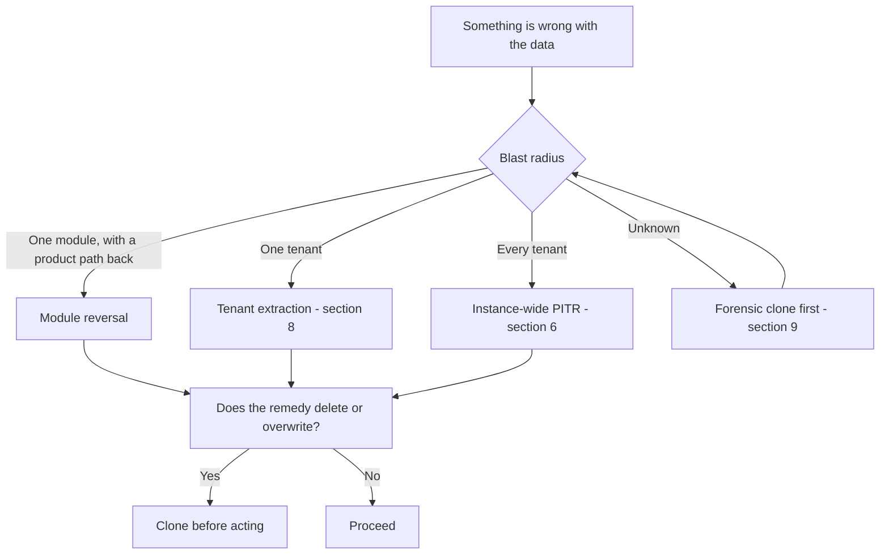

# Backup and Restore

Status: Active (Phase 4) · Related ADRs: `ADR-0002` (tenant isolation, RLS), `ADR-0003` (the offline queue is the only copy), `ADR-0009` (storage model), `ADR-0010` (outbox, idempotent consumers), `ADR-0011` (telemetry retention), `ADR-0016` (per-tenant DEKs, crypto-shredding), `ADR-0019` (rollback depth — **Proposed**), `ADR-0020` (production data boundary — **Proposed**), `ADR-0022` (tenant-scoped recovery — **Proposed**) · Source: `docs/07-operations/environments.md` §9, §10.2, §13 (what is switched on, and where), `HANDBOOK_SPEC.md` §5 D3 and D4, `docs/05-platform/audit-log.md` (archive and anchors), `docs/04-database/database-conventions.md` §4.4 (retention classes), `docs/07-operations/testing-strategy.md` §14.1 (destructive crons) · Downstream: `docs/07-operations/performance.md` (the volumes that move these numbers)

## 1. Scope and seam

`environments.md` §9 turns PITR on, sets deletion protection, and enables RDB snapshots. It says so explicitly: *"whether they are on is this document; the RPO they serve and the restore procedure are `backup-restore.md`'s."*

That is the seam, and it closes the Phase 4 set:

> `environments.md` says a backup exists. **This document says what it can restore, what it cannot, what you do to use it, and the proof that it still works.**

| This document owns | Owner elsewhere |
|---|---|
| What each store's loss actually costs, and whether anything recovers it | `environments.md` §9–§10 — which backup features are enabled |
| Per-store RPO and RTO, and the arithmetic that reaches D3's four hours | D3 — the numbers themselves |
| Which instrument fits which failure | `ci-cd.md` §14 — rollback, which restores code and never data |
| Every restore procedure, and the reconciliation after one | `observability.md` — the signals that tell you a restore is needed |
| Retention windows for backups and PITR | `database-conventions.md` §4.4 — retention classes for *rows* |
| Drills, and what counts as passing one | `testing-strategy.md` §14.1 — that purge jobs are correct in the first place |

Three things deliberately absent. **Backup configuration is quoted here and decided in `environments.md`** — a second copy of a flag is a flag that will disagree. **Release rollback is never described**, on `observability.md` §6's precedent: `ci-cd.md` owns it, `ADR-0019` fixes the depth at one, and a second decision tree would contradict the first within a quarter. And **alert thresholds are `observability.md`'s** — §12 here names the one alert this document required into existence, and stops.

## 2. What is protected

A backup document that lists only the database implies total coverage by omission. Every stateful thing in the system, with its posture today:

| Store | Holds | Protection | Recovers? |
|---|---|---|---|
| **Cloud SQL** | all business data | Regional HA, PITR, deletion protection, automated backups | Yes — §6, §8 |
| **GCS application bucket** | payslip and tax PDFs, selfies, employee documents, CVs, handover scans, attachments | Versioning + soft delete (§10) | Yes, inside the noncurrent window |
| **GCS audit archive** | audit months past the hot window, after the hot rows are hard-deleted | Versioning, plus verify-then-delete (§12) | Yes |
| **Cloud KMS KEK** | wraps every tenant DEK | Non-exportable by design; never destroyed (§11) | **No — permanent, and global** |
| **`tenant_keys` rows** | per-tenant wrapped DEK and index key | Inside Cloud SQL, therefore inside PITR (§11) | Yes |
| **Secret Manager** | database role passwords, which exist nowhere else | Google-managed versions; re-bootstrappable (§13) | Yes, by regeneration |
| **Terraform state** | the infrastructure definition's memory | Versioned GCS backend with locking (§13) | Yes |
| **Artifact Registry** | the digests `ADR-0019`'s rollback depth requires | Retention policy that never reaps tagged digests (§13) | Yes |
| **Memorystore** | queues, sessions cache, rate counters, idempotency envelopes, dashboard cache | RDB only; anything beyond it excluded (A-116) | Partially — §15 |
| **Prometheus, Tempo, Cloud Logging, Sentry** | 30 d / 7 d / 30 d / per plan | Retention **is** the objective | **No, by design** |
| **Employee phones — Drift** | unsynced punches | None possible | **No** |
| **GitHub** | code, Issues-as-tracker, Actions history | Vendor | Vendor's problem |

Four rows recover nothing. Two of those — the KEK and, until §13, Terraform state — are unrecoverable rather than merely painful, and both were undocumented before this file.

### 2.1 Staging is re-seeded, never restored

Staging holds exactly two synthetic tenants (`environments.md` §14), one of which `ci-cd.md` §12 resets before every smoke run. Its recovery instrument is **re-seed**: `environments.md` §13.2 steps 4–7 plus system-administration §5.3, a path CI already exercises on every pull request.

**No restore procedure exists for staging, and none should be written.** The daily backup `environments.md` §9 configures stays enabled because disabling it is a decision somebody would have to defend, but nothing depends on it and nothing here references it.

The corollary matters more than the rule, because it forecloses the cheapest-looking idea in §14: **a staging restore is never a rehearsal for a production restore.** Different mechanism — staging has no PITR at all — different data volume by orders of magnitude, and the line that dominates §3.2's budget is the one that scales with size.

## 3. Objectives

### 3.1 D3 binds one row

D3 reads: *"99.9% monthly; **PostgreSQL** PITR with RPO ≤ 15 min; RTO ≤ 4 h."* The RPO clause names one store. Everything else is derived here.

| Store | RPO | RTO |
|---|---|---|
| Cloud SQL | Seconds in practice — **D3 ceiling is 15 min** | **≤ 4 h — D3** |
| GCS objects, both buckets | Zero for objects that existed | Minutes — an undelete |
| `tenant_keys` | As Cloud SQL | As Cloud SQL |
| Cloud KMS KEK | — it is never lost, or lost permanently | — |
| Secret Manager | Version history | Minutes |
| Terraform state | Last apply | Hours |
| Artifact Registry | Vendor | Minutes |
| Memorystore | Last RDB; jobs recovered by re-trigger | Minutes |
| Telemetry | None — retention *is* the objective | None |
| Employee phones | None | None |

Two facts fall out of writing it as a table. Cloud SQL's real RPO is bounded by write-ahead-log archival, which is seconds — **D3's fifteen minutes is a ceiling the mechanism beats without effort, so RPO is not the clause under threat**. And if RTO ≤ 4 h is read as *service restored*, a database back inside four hours with every payslip PDF gone is not service restored, which is what makes the bucket a first-class row rather than a footnote.

### 3.2 The four hours, line-itemed

The fact that breaks most restore runbooks at step 1: **Cloud SQL PITR does not restore in place.** It produces a *new instance*. So "restore the database" is really "stand up a second database and repoint the fleet at it" — and repointing is a new `DATABASE_URL` secret version, an External Secrets sync, and a rollout, because A-111 already established that env vars are fixed at pod start and **rotation requires a rollout**. Existing mechanism, no new machinery.

| # | Step | Budget |
|---|---|---|
| 1 | Decide, and get the §6.1 acknowledgement | 15 m |
| 2 | **PITR clone to a new instance** | **120 m** |
| 3 | Verify the clone — §6.3's three checks | 20 m |
| 4 | Repoint: secret version → ESO sync → `rollout restart` on `api` and `worker` | 15 m |
| 5 | Reconcile — §7 | 30 m |
| 6 | Smoke S1–S5 | 15 m |
| | | **≈ 3 h 35 m of 4 h** |

The margin is thin deliberately. Step 2 is size-dependent and **nobody in this handbook has measured it**, which is exactly why §14's quarterly drill is a requirement rather than hygiene. Two named budget-breakers: that clone exceeding 120 minutes at real volume, and somebody reaching for §8's tenant extraction instead — which is not a four-hour operation and is not what D3 budgets.

**The volume that decides it now has a projection and a source** *(2026-08-04)*. `performance.md` §4.5 puts `attendance_punches` near 500M rows a year and `attendance_days` near 250M at D1's design point, which is what makes 120 minutes a guess worth testing rather than a round number. And §11.2's **D1-scale synthetic tenant generator** — built for the capacity rehearsal — is the only thing in the handbook that produces data at that volume, so the quarterly drill's clone measurement finally has something realistic to run against. Two procedures, one fixture.

### 3.3 Two clocks, both stated

The budget above runs **from the decision to restore**. Detection lag sits before it and is governed by `ADR-0021`'s service window, not by this document — with no on-call role, an outage at 02:00 is found at 08:00.

Following that ADR's own precedent of computing both numbers so the gap stays visible, **the customer-visible outage is reported as detection lag plus this budget**, never as the budget alone. Folding the two together would let a four-hour RTO describe a fourteen-hour outage.

## 4. Retention windows

### 4.1 Both numbers are derived

| Setting | Value | Derivation |
|---|---|---|
| PITR window — transaction log retention | **14 days** | Its job is a recent, wide-blast-radius event. Beyond about two weeks an instance-wide rewind is never the instrument anyway, since nobody discards three weeks of 500 tenants' writes — and §8 already rules PITR out for the single-tenant case entirely |
| Automated backup retention | **35 days** | Longest destructive-cron cadence plus notice margin |
| Backup schedule | Daily, early WIB | Clear of D1's 08:00 clock-in peak and of `environments.md` §9's Sunday 02:00–04:00 maintenance window |
| Staging | PITR off, backups 7 days | §2.1 — nothing depends on them |

The 35 is arithmetic, not a round number chosen for comfort. `testing-strategy.md` §14.1 counts ten destructive crons; nine are hourly or daily, and a defect in one of those is visible within days because data goes missing. The tenth — `cron.audit.archive` — is **monthly**, so a defect in it can be 31 days old before the next run reveals it, and what it destroys is the evidence of record. Floor = longest cadence + margin.

### 4.2 The only setting in the handbook bounded from both ends

Longer retention is normally free capability. Here it is not.

**Backup retention is exactly how long a crypto-shred stays incomplete** (§11.3). Ninety days would triple, and 365 would decuple, the window during which a completed UU PDP erasure remains reversible by restore — buying no recovery capability the 35-day rule does not already deliver.

So the value is squeezed from below by the monthly cron and from above by an erasure obligation. Anyone raising it must answer the second question, not just the first.

## 5. Choosing the instrument

The commonest defect in a restore document is not a wrong step. It is being *used* when something narrower would have worked, and instance-wide PITR turns a one-tenant incident into a 500-tenant one.

| Symptom | Instrument | Where |
|---|---|---|
| A bad release wrote wrong rows, bounded blast radius | Forward fix | `ci-cd.md` §14 — rollback restores code, never data |
| A module-level mistake with a product path back | The module's own reversal — attendance corrections, approval reversal, payroll retro | The module |
| **One tenant's data lost or overwritten** | **Tenant extraction** | §8 |
| A purge cron deleted wrongly, one tenant | Tenant extraction | §8 |
| A purge cron deleted wrongly, **every tenant** | **Instance-wide PITR** | §6 |
| Instance lost, or a zone gone | Regional HA failover — Google's, automatic. PITR only if the *data* is bad | `environments.md` §9 |
| Files missing | Object undelete, then row reconciliation | §10, §7 |
| "What did production look like on Tuesday?" | Read-only forensic clone, destroyed after | §9 |
| A job never ran, or was lost | Re-trigger; OB14 is the detector | `observability.md` §6.3 |
| Staging broken | Re-seed | §2.1 |

Two rules over the table:

- **Instance-wide PITR is justified only when the damage is instance-wide.** One row in ten reaches for it.
- **Take a forensic clone before any remedy that deletes or overwrites.** A clone is one control-plane call, and every other instrument here destroys the evidence of what actually happened — including the forward fix, which is the one people reach for fastest. A remedy that only *writes new rows* needs no clone; this is not a ceremony to attach to everything.

One instrument is deliberately absent from the table: **crypto-shred appears nowhere**, because it is an erasure instrument and not a recovery one. Stated so that nobody reaches for it under pressure.

## 6. Procedure — instance-wide PITR

### 6.1 Who, and what stops the wrong one

A restore is a **control-plane act** — `gcloud`, not SQL — so `environments.md` §13.3's break-glass path does not cover it. It is IAM on the project.

- **The capability belongs to the human operator identity, never to the deploy identity and never to a workload.** `environments.md` §13.1 already forbids the deploy identity from deleting a database; the same boundary holds for creating one from a point in time, which discards data rather than adding it.
- **Instance-wide PITR of production requires a second person's acknowledgement in the incident channel, with the target timestamp recorded, before execution.** It is the only operation in this system that destroys committed data **for every tenant simultaneously, with no undo** — strictly more destructive than anything BR-ADM-009 refused to expose as an HTTP route.
- **§8's extraction and §9's clone are not gated this way.** One is read-only and the other only inserts. Gating all three identically is how a gate becomes a formality clicked through at 02:00.
- **The trail needs no new machinery.** GCP's audit log records the control-plane call, OB24 already alerts on break-glass retrieval, and `observability.md` §13.2 requires a human to declare the incident. Nothing is written to `audit_logs`: that table is tenant-scoped and this act happens outside the application entirely.

### 6.2 Steps

1. **Declare the incident** and record the target timestamp. Both, before touching anything.
2. **Get the acknowledgement** — §6.1.
3. **Clone to a new instance** at the target timestamp, in `hris-production`, same VPC, private IP only.
4. **Verify** — §6.3. A clone that fails verification is not promoted; the incident continues with the old instance still serving.
5. **Scale `api` and `worker` to zero.** Writes to the old instance after this point are writes that will be discarded twice.
6. **Flush Redis** — §7.5, before the fleet comes back, never after.
7. **Repoint**: new `DATABASE_URL` secret version → External Secrets sync → scale back up.
8. **Reconcile** — §7.1 to §7.4.
9. **Smoke** S1–S5.
10. **Stop, but do not delete, the superseded instance.** §6.4.

### 6.3 Verification, before promotion

Three checks, not an impression:

- **Row counts** on the largest tables, against the last known figures.
- **The most recent `audit_anchors` digest, recomputed and compared.** This verifies the restore and exercises the integrity mechanism in the same action — and if it mismatches, §12 applies before anything is promoted.
- **One spot decrypt** of an `ADR-0016` column through the live `tenant_keys` row, proving restored ciphertext still resolves against current key material.

### 6.4 The superseded instance is kept for 30 days

Stopped, not deleted, for the same 35-day-adjacent horizon as §4.1's backups.

It holds **the only copy of the writes the restore discarded** — and someone will want them: the tenant whose Thursday afternoon was rewound to repair somebody else's Tuesday. Those writes are extractable from it by exactly §8's procedure.

Deleting it during cleanup converts recoverable collateral damage into permanent loss, which is the most self-inflicted way this runbook could fail. `environments.md` §9's deletion protection makes the mistake harder; this rule makes it explicit.

## 7. Post-restore reconciliation

Postgres lands at T. GCS, Redis, and KMS are still at *now*. Four skews, one of which the handbook already answers.

### 7.1 Dangling file rows

`document-storage.md` BR-DOC-009 purges **object-then-row**, deliberately, so an orphan object never exists. A restore inverts that guarantee: the row comes back and the object does not, so a download mints a signed URL for nothing and the failure surfaces at the storage layer rather than as a `DOC_` code.

**Do:** list `files` rows committed after T, check each against the bucket, soft-delete the unbacked ones.

### 7.2 Orphan objects

Committed at T+1, row discarded. Invisible to the application forever — and `cron.document.purge` walks **rows**, so it can never reach them. An orphaned selfie or CV is personal data with no retention path at all.

**Do:** list objects newer than T with no matching row, delete them. This is a UU PDP step, not housekeeping.

### 7.3 Outbox re-dispatch — already covered

Rows dispatched between T and now return undispatched, and the relay re-publishes them. **Change nothing.** `ADR-0010` requires idempotent consumers and `testing-strategy.md` G11 asserts it per processor. Recorded here because the next reader will otherwise spend an hour deciding whether it is a problem.

### 7.4 Resurrected key material

A tenant crypto-shredded after T gets its wrapped DEK back. **The restore undoes an erasure** — a UU PDP event, not a nuisance.

**Do:** re-execute the shred, re-record it, and recompute the completion date per §11.3.

### 7.5 Redis holds a future that no longer happened

Not a skew so much as a store describing events that were just discarded: queued jobs referencing rows that no longer exist, and — the nastiest state in the set — **idempotency envelopes asserting "already processed" for work whose database effect is gone**, which makes a legitimate retry silently succeed while doing nothing.

**Flush it entirely, before the fleet is repointed.** The justification already exists rather than being invented here: `environments.md` §9.1 and A-116 state that Redis is the only durable home a job has and that recovery is by re-trigger, repeatable crons re-register when workers start, and the outbox relay re-publishes. Cost, named: in-flight one-off runs need re-triggering, dashboard cards recompute, tenant-status caches re-read within their 30-second TTL.

**Sessions are unaffected** — `sessions` is a Postgres table (authentication §4), so the flush logs nobody out.

### 7.6 What cannot drift

**No sequences and no generated running numbers exist anywhere in the schema.** `uuidv7` throughout, and a grep across all 28 module documents finds no `serial`, no `nextval`, and no minted human-facing counter. So a rewind can never reissue an identifier already in use — which is also the property that makes §8 feasible at all rather than a re-keying exercise.

## 8. Procedure — tenant-scoped extraction

`ADR-0022` records the decision; this is the execution.

The likeliest incident in this product is not "the database died" — regional HA answers that and it is Google's mechanism. It is *tenant 47's HR admin ran an import that overwrote 300 salary rows*, on a Tuesday, noticed Thursday. **Instance-wide PITR is the wrong instrument for it**: rewinding to Tuesday discards 499 other tenants' writes, converting one tenant's data-entry error into a company-wide incident.

### 8.1 Steps

1. **Clone to a temporary instance** at a timestamp before the damage, inside `hris-production` — the shape `ADR-0020` sanctions, same VPC, private IP, no public address.
2. **Extract** the affected tables for that `tenant_id` alone.
3. **Re-insert** into the live database in foreign-key dependency order, carrying original ids.
4. **Verify** row counts and foreign-key integrity for the tenant.
5. **Destroy the temporary instance.** Not later, not when someone remembers.

### 8.2 Four existing mechanisms make it work

- **Uniform `tenant_id`** (`ADR-0002`) makes the extraction predicate identical across all 28 modules.
- **Stable `uuidv7` primary keys** mean a re-inserted row carries its original id and every foreign key pointing at it still resolves (§7.6).
- **`ADR-0016`'s `v1:` ciphertext version prefix** means rows encrypted under a DEK generation the tenant has since rotated past still decrypt — so the extraction needs no historical key material, only the live `tenant_keys` row. This is also the rule that makes step 3 safe: **an extraction carrying encrypted columns must land in the same tenant, or it carries nothing readable.**
- **Re-insertion is a new audited fact, never a rewrite of history.** Anchors hash by insert day (UC-AUD-005), and OB26 already names *"a restore that replayed rows"* among its expected causes.

### 8.3 What this is not

A manual, engineer-run, hours-to-days procedure. **No endpoint, no console button, no support-desk action** — consistent with BR-ADM-009 and A-095, which already refused to ship destruction as a route.

It is also the procedure most likely to rot, because its cost is FK ordering across 28 modules and that ordering changes with the schema. §14's second drill exists for exactly this reason.

## 9. Procedure — forensic clone

`ADR-0020` refused to build an anonymization path and replaced it with this. `environments.md` §14 owns the rule that the target lives inside the production project and is torn down; here is the execution.

1. Clone to a temporary instance at the timestamp of interest, inside `hris-production`, private IP only.
2. Connect through an ephemeral pod as `hris_app` with an explicit `set_config` — `environments.md` §13.3's warning applies unchanged: under `FORCE` RLS a query without the tenant variable returns zero rows, which reads as "no data" rather than "wrong query".
3. Read. Never write.
4. **Destroy the instance the same day.**

The clone is subject to every control the production database has, because it *is* in production: same VPC, same IAM, same KMS. That is the whole argument — the data never crosses a boundary, so there is nothing to anonymize.

Two uses beyond investigation: it is step 1 of §8, and it is the venue for §14's drills.

## 10. Files and objects

`environments.md` §10.2 gives the production bucket uniform access, no public objects, a path grammar, and a 24-hour lifecycle on `uploads/`. Before this document, nothing else — no versioning, no soft delete, no replication.

What it holds: payslip and tax PDFs under a **ten-year statutory floor**, punch selfies, employee documents, candidate CVs, signed handover scans, announcement attachments. For most of those **the object is the only copy in existence** — the database holds sha256 and metadata, which proves the file was there and reconstructs nothing.

Four ways to lose them: an inverted predicate in `cron.document.purge`, which is `testing-strategy.md` §14.1's named failure mode for exactly this class of job; a mis-scoped lifecycle rule; a human `gsutil rm -r`; a bucket deletion.

**Object versioning plus soft delete, with a lifecycle rule reaping noncurrent versions at 30 days**, on both the application bucket and the audit archive. It is a bucket flag: no job, no sync, nothing to monitor, and **nothing that can silently stop** — which matters more than raw capability here, because the failure mode being fixed is silence. Restore is an undelete, measured in minutes.

Rejected, with reasons:

- **Cross-bucket replication** doubles storage, adds a process that lags or dies unobserved, needs its own freshness alert, and protects nothing better than versioning against three of the four causes.
- **Bucket retention lock** is rejected on sharper grounds: it would make `cron.document.purge` and `cron.recruitment.candidate-purge` unable to delete, and those crons exist to satisfy UU PDP retention limits. **A locked bucket makes an erasure obligation unsatisfiable.**

### 10.1 Versioning extends every erasure window

The same shape as §11.3, and it must be stated where the setting lives. When `cron.document.purge` deletes a selfie at its retention horizon, **a noncurrent version survives it**. The object is not erased until that version is reaped.

So 30 days is a **UU PDP parameter, not a cost knob**, and it is short for that reason. Raising it lengthens every retention promise the handbook makes, silently, in a bucket setting nobody reads.

## 11. Key material

`ADR-0016` sent a duty here by name: *"backup-restore.md notes wrapped-DEK backup requirements."* Three rules discharge it.

### 11.1 The wrapped DEKs need no separate backup

`tenant_keys` is an ordinary Postgres table, so PITR and the automated backups already carry it. `ADR-0016`'s phrase *"wrapped-DEK backups alongside PITR"* is satisfied by their being **inside** PITR — no second artifact, no escrow file, nothing stored anywhere else.

Worth stating explicitly, because "back up the keys" is an instruction that invites someone to export them, and **an exported wrapped DEK plus KEK access is the entire plaintext**.

### 11.2 A KEK version is never destroyed, only disabled

Disabled is reversible. Destroyed is not, and it takes every tenant's ciphertext with it simultaneously.

- Rotation retires versions to **disabled**, never to destruction.
- The IAM binding capable of destruction belongs to the human Terraform identity — never the deploy identity, never a workload.
- **The crypto-shred destroys a DEK, which is a database row. It never touches a KMS version.** Conflating the two shreds all 500 tenants at once, which is why this sentence is here rather than assumed.
- The KEK is regional — `asia-southeast2`, A-003 — so a restore in any other region decrypts nothing. A second reason A-120's multi-region exclusion is structural rather than a cost decision.

### 11.3 The crypto-shred is not complete when you perform it

Deleting the `tenant_keys` row makes the ciphertext unreadable *in the live database*. Every automated backup, and every point inside the PITR window, taken before that moment still contains the wrapped DEK — and a restore resurrects it, which is §7.4 stated in general form.

So the tenant-offboarding erasure story `ADR-0016` sells is incomplete for the length of §4.1's backup retention.

**The shred procedure ends by recording the date the erasure actually completes** — shred date plus backup retention — and that is the date reported if anyone asks. Whether an unreadable-but-restorable copy counts as erased is a legal question and not an engineering one:

> ⚠️ VERIFY: confirm against current Indonesian regulation before implementation.

## 12. The audit trail as evidence

`observability.md` §14 scopes a UU PDP breach **from the audit log**, because 30 days of telemetry cannot scope a breach. That makes the audit log the evidence of record, and evidence has durability requirements the rest of the data does not.

### 12.1 Verify before delete

UC-AUD-006 exports a month to GCS as jsonl plus a digest manifest and **then hard-deletes the hot partition**. Nothing required the written object to be read back first. A truncated write or a mismatched manifest and the month is gone — permanently and totally.

Of `testing-strategy.md` §14.1's ten destructive crons this is the only one whose damage cannot be reconstructed from anywhere; the others delete selfies, notifications, and staged uploads that a client can re-supply.

**Rule: re-read the object, recompute the digest, compare against both the manifest and that month's daily `audit_anchors` rows, and only then delete.** On mismatch the partition stays hot and the job fails loudly, which OB12 and OB14 already route. This is what makes the archive an archive rather than a hope.

### 12.2 The witness must outlive the evidence

BR-AUD-009's entire tamper-evidence argument is that the daily digest is emitted to **Cloud Logging — an external sink outside DB reach**. Cloud Logging retention is 30 days (`environments.md` §11). The audit log is two years hot plus archive, and the payroll rows it attests to are kept for ten.

Beyond 30 days the only surviving copy of the digest is `audit_anchors` — a table in the same database as the rows it attests to, reachable by anyone who can reach them. **The tamper evidence was tamper-evident for one month out of a hundred and twenty.**

**Rule: a Cloud Logging sink filtered to the anchor emit lands in the audit archive bucket**, under §10's versioning. Native mechanism, one Terraform resource, no new code and no new cron — and it preserves exactly the property BR-AUD-009 wanted. It also gives §12.1's verification a third independent copy to check against.

Rejected: extending Cloud Logging retention wholesale, which pays ten times over for every log line in order to keep one line per tenant per day; and a bespoke job writing anchors to GCS, which is a second scheduled thing that can silently stop, when a sink cannot.

### 12.3 A restore is a reason anchors mismatch

OB26 already lists it. After any restore, the anchors for days between T and now describe rows that no longer exist.

**Do not re-anchor** — `observability.md` §6.6 is unambiguous, and re-anchoring overwrites the only evidence that a mismatch existed. Record the restore, its target timestamp, and the affected day range in the incident issue. A mismatch with a recorded restore behind it is explained; a mismatch without one is §14 of that document.

## 13. Reconstitution

Restoring the data is not restoring the system. If the production project were gone tomorrow, backups answer one question and four other things answer the rest.

| Artifact | Rule |
|---|---|
| **Terraform state** | **GCS backend, versioned bucket, in the production project, with state locking** |
| **Secret Manager** | Treated as re-bootstrappable, never escrowed |
| **Artifact Registry** | Tagged digests are never reaped; untagged go at 30 days |
| **Schema snapshot** | Already produced per release by `ci-cd.md` §7.3 — noted, not rebuilt |

**The state backend was named nowhere.** `environments.md` §13.1 describes one root module applied by a human and mentions the state file only to forbid putting secrets in it. `terraform init` with no backend block means **local state on one engineer's laptop**, which is the literal reading of the documentation as it stood. Lose it and the infrastructure's memory is gone; recovery is `terraform import` across every resource, measured in days, with the plan lying to you throughout. Versioning is the load-bearing half: a corrupt apply is repaired by rolling state back, and without versions there is nothing to roll back to.

**Secret Manager holds the only copy of the database role passwords**, deliberately (`environments.md` §13.2 step 2). That is a *re-bootstrap*, not a data loss — the script regenerates them and the grants follow. Written down specifically so that nobody responds to this document by building a secret escrow file, which would invert A-111's entire argument.

**Artifact Registry retention has to keep `ADR-0019`'s promise true.** Rollback depth of exactly one requires the previous digest to still exist, and a default age-based cleanup policy silently converts that guarantee into "usually".

## 14. Drills

`testing-strategy.md` §1 and `ci-cd.md` §1 both assign restore rehearsal and DR drills here by name, in their seam tables, and neither says what one is. Two constraints shape the answer: A-102's organization is small, so a drill costing a day will not happen twice; and `ADR-0020` sanctions exactly one lawful venue, §9's clone inside the production project.

### 14.1 PITR drill — quarterly

Restore production to a **random timestamp inside the PITR window** into a temporary instance, measure wall-clock from decision to verified, destroy it.

Random on purpose: a drill that always restores to "one hour ago" only ever exercises the newest transaction logs.

**Pass = §3.2's steps 2 and 3 met at their budgets**, plus §6.3's three checks — row counts, a recomputed anchor digest, and a live-key spot decrypt. The measured clone time replaces the 120-minute estimate in this document; that is the drill's primary output, not a by-product of it.

### 14.2 Extraction drill — semi-annual

Run §8 end to end: extract one tenant from the temporary instance into a scratch schema, assert zero FK violations and matching row counts. **Never into live.**

Its rot is driven by schema change across 28 modules rather than by calendar risk, so its interval tracks release cadence.

### 14.3 What is not drilled

A **forced Cloud SQL failover**. It exercises Google's mechanism rather than ours, it is the one component carrying a vendor SLA, and forcing it in production is a self-inflicted outage inside `ADR-0021`'s service window. Trigger to add it: a real failover that misbehaves.

### 14.4 The rule that stops drills being decorative

> **A procedure not executed within its interval is presumed broken.**

The last-executed date for each drill lives in this document, updated in the same pull request that runs one.

The limit is stated rather than papered over: nothing automated enforces a drill at this organization's size. An alert would be wrong — a calendar fact is not telemetry, and `observability.md` §15 excludes that class deliberately. So a missed drill is **an issue with an owner**, the same device §13.3 there uses for postmortem follow-ups, and for the same reason: an action item with no owner is a wish.

| Drill | Interval | Last executed |
|---|---|---|
| PITR restore — §14.1 | Quarterly | — not yet run |
| Tenant extraction — §14.2 | Semi-annual | — not yet run |

## 15. What cannot be recovered

| Lost | Disposition |
|---|---|
| A one-off job in flight when Redis is lost | Repeatable crons re-register, the outbox re-publishes, a one-off run needs a human re-trigger — A-116 |
| Telemetry beyond retention — metrics 30 d, traces 7 d, logs 30 d | **By design.** `ADR-0011`: audit-grade history is the audit log's job. This is precisely *why* `observability.md` §14 scopes a breach from the audit log |
| Unsynced punches on a lost or destroyed phone | No mechanism can. The Drift queue is the only copy (`ADR-0003`); mitigation is sync cadence and OB17, not backup. Auth loss no longer destroys the queue — the offline-sync grilling fixed that — so what remains is physical loss |
| A destroyed KMS KEK version | Permanent, and **global across every tenant**. §11.2's never-destroy rule is the entire control |
| A crypto-shredded tenant, once backups age out | **This is the feature**, completing at §11.3's recorded date |
| An object deleted outside §10's 30-day noncurrent window | Accepted; the window is bounded by an erasure obligation, not by cost |
| An audit month whose archive object is lost | Near-zero after §12, not zero: verify-then-delete, versioning, and the log sink must all fail |

**None of these has an RTO, because none has a restore.** D3's four hours describe one row of §3.1 and say nothing about the rest.

## 16. Exclusions and future

### 16.1 Excluded from V1

| Excluded | Why not now | Trigger |
|---|---|---|
| **Cross-region backup copies** | A-003 fixes `asia-southeast2`, and it is the only Indonesian region — so "replicate to Singapore" is a data-residency question before it is a cost one, and A-003 does not answer it | A DR requirement that must survive regional loss, taken together with a residency position |
| **A warm standby in a second region** | Same residency question, plus a second full environment to keep at parity | A contractual RTO below four hours |
| **One-click restore tooling** | The procedure is ten steps run rarely; automation would be exercised only during incidents, which is the worst time to discover it is stale | §14.1's measurements showing manual steps rather than clone time dominate the budget |
| **Automated post-restore reconciliation** | §7 is a checklist run by a human who is already reading this file | The second time it is run by hand |
| **Per-tenant logical backups** | `ADR-0022`'s rejected alternative: 500 dumps a night and a second retention system to monitor, for a rare event | Extraction frequency rising past roughly once a quarter |
| **Redis persistence beyond RDB** | A-116 already decided it; queues are recoverable by re-trigger | A one-off job loss that actually cost something |
| **CMEK on backups** | `ADR-0009` defers CMEK generally; A-120 lists it | A customer contract |
| **Backup of Prometheus, Tempo, or Grafana state** | Dashboards are git-tracked and reviewed like code; `ADR-0011` makes telemetry disposable by design | **Never** — this one has no trigger |
| **Continuous backup validation** — nightly automated restore-and-verify | The correct end state; the only reason it is not V1 is that §14.1 costs an afternoon at current volume | Data volume making a quarterly manual drill infeasible |

Two deserve more than a row. **Cross-region** is the first suggestion anyone makes and the one this handbook cannot answer alone — `asia-southeast2` is Indonesia's only region, so any second copy leaves the country, and that is a legal position rather than an infrastructure choice. **Continuous validation** is the only exclusion here that is not a genuine trade-off: it is simply larger than a quarterly drill, and it is where this document goes next.

### 16.2 Future

Continuous backup validation, as above. Automated reconciliation once §7 has been run twice by hand and the shape has stopped moving. Cross-region copies the day a residency position exists to permit them. And the measurement that makes several numbers in this file real rather than estimated: §14.1's first clone timing, which either confirms §3.2's 120 minutes or forces the conversation about a warm standby years before a contract would.
