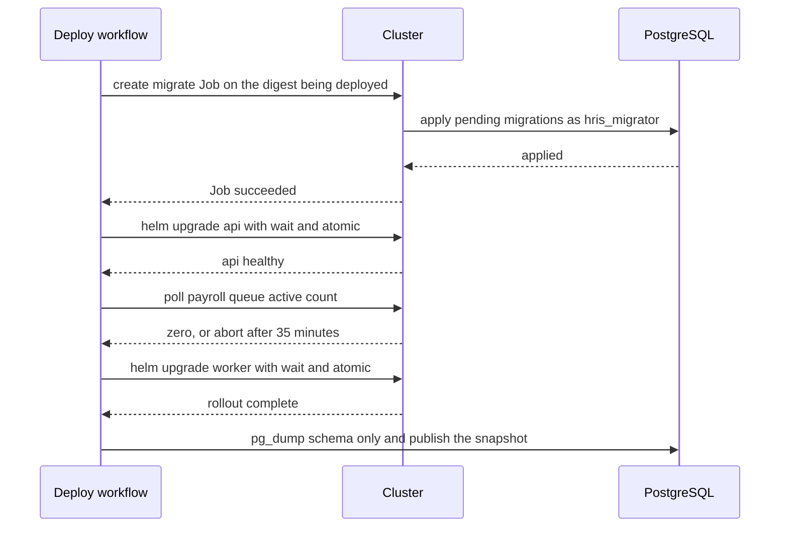
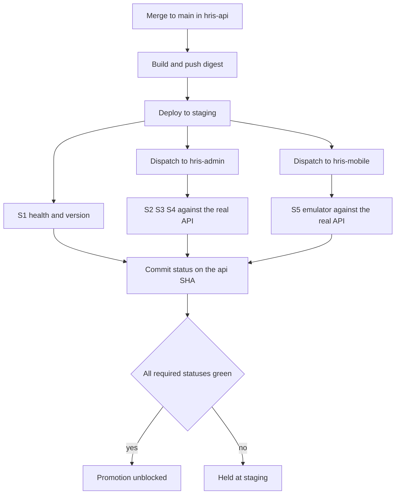

# CI/CD

Status: Active (Phase 4) · Related ADRs: `ADR-0007` (versioning, open enums), `ADR-0010` (queues, idempotency), `ADR-0011` (sourcemaps and symbols), `ADR-0013` (forward-only migrations), `ADR-0014` (PDF rendering), `ADR-0018` (statutory vectors — **Proposed**), `ADR-0019` (release and promotion model — **Proposed**) · Source: `docs/07-operations/testing-strategy.md` §13 (gate table and thresholds — **not restated here**), `docs/03-standards/security-standards.md` §11 and §13 (supply-chain policy), `docs/04-database/database-conventions.md` §10 (migration rules), `docs/02-architecture/system-overview.md` §3 (topology and artifacts) · Downstream: `docs/07-operations/environments.md` (deploy targets, secret storage), `docs/07-operations/observability.md` (alert routing), `docs/07-operations/backup-restore.md` (PITR procedure), `docs/07-operations/performance.md` (load testing)

## 1. Scope and seam

testing-strategy §1 fixed half of this seam already: **that document says what must pass and at what threshold; this one says where, when, and on which trigger it runs.** A threshold appears in exactly one of the two files and it is never this one.

The other seam is with `environments.md`, which is written after this file. It is drawn the same way, and the rule reads in both directions:

| This document owns | `environments.md` owns |
|---|---|
| Triggers, job graph, gate-to-job mapping | What an environment *is*: compose file, manifests, sizing, parity rules |
| Image build, tag scheme, registry push | Registry provisioning, node pools, managed PostgreSQL and Redis |
| **Names** of the secrets CI consumes | **Where** secrets live and how they reach a pod |
| Deploy mechanics: migrate Job, rollout order, drain gate | Per-environment config *values*, DNS, TLS, ingress |
| Promotion, rollback, and release artifacts | Environment inventory, seed data, demo tenant |

**A secret's name appears here. Its value and its store never do.**

Not owned, with owners named:

| Concern | Owner |
|---|---|
| Test tiers, coverage floors, every numeric threshold | `docs/07-operations/testing-strategy.md` |
| Alert thresholds, dashboards, Sentry triage | `docs/07-operations/observability.md` |
| Load, soak, latency budgets, migration lock duration | `docs/07-operations/performance.md` — **defined 2026-08-04**: a manual capacity rehearsal on an ephemeral production-sized environment using k6, no per-merge gate, and the §9 DDL cost table plus `lock_timeout` |
| PITR execution, restore rehearsal, DR drills | `docs/07-operations/backup-restore.md` — **defined 2026-08-04**, §6 and §14 |
| Kubernetes manifests, secret storage, environment values | `docs/07-operations/environments.md` |
| Penetration testing | **undefined — commercial decision, A-103 (narrowed)** |

CI for the handbook repository itself is out of scope; this document describes the three implementation repositories (A-006) and nothing else.

## 2. Branching, triggers, and the release model

naming-conventions §12 already fixes branch names as `<type>/<issue>-<kebab-slug>` over the types `feat`, `fix`, `refactor`, `docs`, `test`, `chore`, `perf`, `ci`. There is **no `release/` type and no `hotfix/` type**, so the handbook already implies trunk-based development; inventing a release branch here would contradict an anchor.

`main` is the only long-lived branch and is always releasable.

| Event | What happens |
|---|---|
| Pull request opened or pushed | G1–G18, G21, G22, C1–C3, C6–C9. Nothing is built, nothing deploys |
| Merge to `main` | Build the image **once**, tag `sha-<short12>`, scan it, deploy to staging, run smoke |
| Manual promotion | Re-tag **that same digest** `v<semver>`, deploy production behind an environment approval |

Three rules carry the model, and `ADR-0019` records why:

1. **Staging deploys automatically, never on request.** G19 is a post-deploy gate. A manual staging deploy means smoke runs when someone remembers, and a gate that runs when someone remembers is not a gate.
2. **Production promotes a digest, never a rebuild.** A rebuild from the same commit is a different image — base-image drift, timestamps, transitive resolution — and re-opens everything smoke just closed.
3. **A hotfix uses the identical path.** Branch, pull request, merge, staging, smoke, promote. Urgency changes priority, not mechanism; an emergency bypass lane is used exactly when the system is already broken, which is when the gates matter most.

The escape hatch is named rather than improvised: promoting with G19 red requires a written approval on the production environment and files a tracker issue. Visible, logged, rare.

Several merges may accumulate on staging before one promotion. Promotion ships the latest green digest, not one release per merge.

### 2.1 Cross-repo promotion order

The three repositories promote **independently**. Compatibility is guaranteed by contract, not by co-testing them as a pair — `ADR-0007` already requires the API to serve app versions months old, so the backend must tolerate clients it was never co-tested with regardless of what CI does, and G14 enforces that per pull request.

Two rules keep independence safe:

- **The backend promotes first**, always. Additive-then-consume — the API-surface mirror of database-conventions §10 rule 5's expand → migrate-data → contract.
- **A web pull request consuming a new API field states the API version that introduced it** in the description. Reviewer check, not a gate; it catches merge-order mistakes before staging does.

Residual, accepted rather than solved: production can briefly run an api/web pair no smoke run exercised. That is the same exposure the mobile app carries permanently, and the contract gate is the mitigation.

## 3. Pipeline spine

Every repository runs the same stage order. Deltas are §4; the mapping to named gates is §5.

| # | Stage | Contents |
|---|---|---|
| 1 | Setup | Checkout, toolchain, cache restore |
| 2 | **Fast static** | Lint, format check, typecheck, PR-title Conventional Commit lint, secret scan |
| 3 | Supply chain | Dependency advisories, SAST |
| 4 | Unit + coverage | Tier 1 suites, layer floors, diff coverage |
| 5 | Repo gates | Traceability, registries, vectors, contract diff, journey filenames |
| 6 | Integration | Testcontainers kits, destructive-operation class, migration jobs |
| 7 | End-to-end | Playwright or `integration_test`, accessibility |
| 8 | Housekeeping | Quarantine cap and expiry |
| 9 | *merge only* | Build, push, image scan |
| 10 | *merge only* | Deploy staging, smoke fan-out |
| 11 | *manual* | Promote, publish artifacts |

**Stage 2 is a `needs:` barrier for everything after it.** One extra minute on a green run, in exchange for never spending an E2E suite on a typo. Nothing else is serialized — stages 3 through 8 run concurrently.

**Everything runs on every push.** Two carve-outs, both justified by billing rather than speed:

- `concurrency: <repo>-pr-<ref>` with `cancel-in-progress: true`. Most CI waste is a suite finishing for a commit nobody will review.
- **iOS builds never run per pull request** — only on `main` and on release. macOS runners bill at a 10× multiplier, and an iOS-only compile break surviving `flutter analyze` and the Android build is rare and cheap to fix on `main`. M1–M4 run per pull request on the Android emulator, which testing-strategy §8.2 fixes as the target.

**Path filtering inside a repository is prohibited.** "Only test the module that changed" is how a shared-helper change ships broken, and it defeats G6 registry integrity, whose entire job is cross-module cross-referencing. The isolation people want from path filters, A-006 already gave for free. The one exception adds a job rather than skipping one: a pull request touching a `Dockerfile` or a base-image digest builds and scans the image at pull-request time (§9).

**No merge queue.** Real machinery for a batch-conflict problem a single team does not have. Adopt when `main` starts breaking from concurrent merges.

Consequence stated honestly: pull-request feedback is one wall-clock number for the whole suite, not a fast-lane split. When that number crosses roughly fifteen minutes the correct response is making tests faster, not making fewer of them run.

## 4. Per-repo deltas

### 4.1 `hris-api`

| Aspect | Value |
|---|---|
| Runner | `ubuntu-latest` |
| Extra services | Testcontainers PostgreSQL + Redis (coding-standards-nestjs §9) |
| Sole owner of | G4, G5, G6, G7, G8, G14, G20, G21, C6, C7 |
| Build | One image, entrypoints `api` / `worker` / `both`, plus the `migrate` command used by the deploy Job |
| Publishes | OpenAPI JSON, schema snapshot, container digest |
| Deploys | `api` and `worker` Deployments |

### 4.2 `hris-admin`

| Aspect | Value |
|---|---|
| Runner | `ubuntu-latest` |
| Extra services | None — E1–E6 run against MSW (testing-strategy §8.1) |
| Sole owner of | G15 (E-journeys), G17, S2–S4 |
| Build | One container image; **not** a Vercel deployment (D5, system-overview §3.1) |
| Publishes | Container digest, sourcemaps to Sentry |
| Deploys | `admin-web` Deployment |

### 4.3 `hris-mobile`

| Aspect | Value |
|---|---|
| Runner | `ubuntu-latest`; `macos-latest` **only** on `main` and release |
| Extra services | Android emulator |
| Sole owner of | G15 (M-journeys), S5 |
| Build | AAB + IPA; no container image, no cluster deployment |
| Publishes | Play internal track, TestFlight internal, `mapping.txt` + dSYMs to Sentry |
| Deploys | Nothing — store distribution only (§10) |

Caching per repository: `actions/setup-node` cache for the two TypeScript repos, the pub cache and Gradle cache for Flutter, and a buildx layer cache for image builds.

## 5. Gate-to-job matrix

testing-strategy §13 fixes the threshold and the blocking level for G1–G21. This table fixes where each one runs.

| # | Repo | Job | Trigger | Blocks |
|---|---|---|---|---|
| G1 | all three | `test:unit` | PR | Merge |
| G2 | all three | `test:unit` — coverage step | PR | Merge |
| G3 | all three | `coverage:diff` | PR | Merge |
| G4 | `hris-api` | `gate:traceability` | PR | Merge |
| G5 | `hris-api` | `gate:error-codes` | PR | Merge |
| G6 | `hris-api` | `test:registry` | PR | Merge |
| G7 | `hris-api`, `hris-mobile` | `test:vectors` | PR | Merge |
| G8 | `hris-api` | `test:properties` | PR | Merge |
| G9 | `hris-api` | `test:integration` | PR | Merge |
| G10 | `hris-api` | `test:integration` | PR | Merge |
| G11 | `hris-api` | `test:integration` | PR | Merge |
| G12 | `hris-api` | `test:integration` | PR | Merge |
| G13 | `hris-api` | `test:integration` + `migrate:forward` | PR | Merge |
| G14 | `hris-api` | `gate:openapi` | PR | Merge |
| G15 | `hris-admin`, `hris-mobile` | `test:e2e` / `test:android` | PR | Merge |
| G16 | `hris-admin`, `hris-mobile` | `gate:journeys` | PR | Merge |
| G17 | `hris-admin` | `test:e2e` — axe project | PR | Merge |
| G18 | all three | `gate:quarantine` | PR | Merge |
| G19 | all three | `smoke:*` (§8.4) | Post staging deploy | Release promotion |
| G20 | `hris-api` | `gate:pending-vectors` | Promotion | Release promotion |
| G21 | `hris-api` | `test:render` | PR | Merge |
| G22 | all three | `test:redaction` | PR | Merge |

Checks this document adds that are not test thresholds and therefore have no §13 row:

| # | Check | Repo | Trigger | Blocks |
|---|---|---|---|---|
| C1 | Dependency advisories | all three | PR | Merge |
| C2 | SAST | `hris-api`, `hris-admin` | PR | Merge |
| C3 | Secret scan | all three | PR | Merge |
| C4 | Image vulnerability scan | `hris-api`, `hris-admin` | Post-merge build | Staging deploy |
| C5 | Re-scan of deployed digests | `hris-api`, `hris-admin` | Weekly | Nothing — opens an issue |
| C6 | `migrate:empty` | `hris-api` | PR | Merge |
| C7 | `drizzle-kit check` | `hris-api` | PR | Merge |
| ~~C8~~ | ~~Vector `sha256` equality~~ | — | — | **Retired 2026-08-05 (`ADR-0025`)** |
| C9 | PR title is a Conventional Commit | all three | PR | Merge |
| C10 | Branch-protection drift | all three | Weekly | Nothing — fails the job |
| C11 | Handbook submodule present | all three | PR | Merge |
| C12 | Banned dependencies | all three | PR | Merge |
| C13 | Handbook-managed regions match their source | all three | PR | Merge |

**C8 is retired, not renumbered.** It checked that a vendored copy of `docs/07-operations/test-vectors/holiday-resolution.json` matched the handbook original — a hash comparison standing in for a handbook-access mechanism nothing had defined. `ADR-0025` mounts the handbook as a pinned submodule at `docs/handbook/`, so both repositories read the vector in place and the pin is the equality guarantee. `ADR-0018` decision 7 is amended to match. The number stays burned because a C-number is a registry entry, and reusing one silently rewrites every reference written before today.

**C11 is the gate that makes the other two possible.** `actions/checkout` runs with `submodules: true`, and C11 asserts `docs/handbook/HANDBOOK_SPEC.md` exists. A shallow or non-recursive clone otherwise yields an empty directory, and the failure mode is not a build error — it is an agent reasoning confidently with no anchors, which nothing downstream would catch.

**C12 already exists for one repository.** `coding-standards-flutter.md` §10 gates `riverpod`, `hive`, and stray `shared_preferences` in `pubspec.yaml`. C12 generalises it: `prisma` and `typeorm` in `hris-api`, a `pages/` directory in `hris-admin`. Every entry is one line of `CLAUDE.md`'s must-NOT column, and one grep per repository retires the whole column from anyone's memory.

**C13 discharges `ADR-0006`, and generalises past it.** That ADR has asserted since Phase 1 that the three vendored `Result` copies *"are kept identical by this ADR + the AI development guide"* with nothing behind the claim. C13 diffs a **handbook-managed region** against its handbook source, over a manifest of pairs:

| Local path | Handbook source |
|---|---|
| `shared/result.ts` · `src/lib/result.ts` · `core/result.dart` | `ADR-0006`'s canonical block |
| `CLAUDE.md` | `implementation-claude-md-template.md` §3 / §4 / §5 |
| `docs/agents/domain.md` | `implementation-claude-md-template.md` §6 |

Every pair carries a `do not edit above this line` marker; local additions live below it, which is what makes this an equality test instead of a judgement call and keeps the files from being frozen. *(Generalised 2026-08-05, MANIFEST row 72 — a single mechanism rather than two invented a session apart.)* Possible only because C11's submodule puts every source on disk at build time.

All three are specified in `docs/08-ai-guide/ai-development-guide.md` §8.

## 6. Build artifacts, tagging, and retention

**Registry: Artifact Registry**, in the cluster's region. Workload Identity Federation authenticates natively, pulls stay in-region, and Firebase already anchors the ecosystem (D5). Cloud portability survives because the registry host is one value in an environment file — D5 requires portable *manifests*, and manifests stay portable.

**Two images exist.** `hris-api` produces one image serving `api`, `worker`, and the migrate Job. `hris-admin` produces one. Mobile produces none.

| Tag | Applied | Mutable |
|---|---|---|
| `sha-<short12>` | Every merge to `main` | Never |
| `v<semver>` | At promotion, to the **same digest** | Never |
| `latest` | **Prohibited** | — |

Deployments reference `@sha256:` digests, not tags. **A tag is a label for humans; the digest is the identity.** The same principle sets the version number: the promotion workflow takes it as an input defaulting to a patch bump, and release notes come from `gh release --generate-notes` over squashed pull-request titles, which §13 already forces into Conventional Commit form. `release-please` is not adopted — it wants to own version bumps and open its own pull requests, and semver inferred from commit types ships major versions nobody intended for a product with no consumers pinning versions.

**Architecture: `amd64` only.** GKE nodes are amd64. Multi-arch doubles every build to serve an Apple-Silicon convenience that local Compose already solves by building natively.

Base images are pinned by digest and scanned before push — security-standards §11 fixed both; this document only places them in the graph.

| Artifact | Retention | Reason for that number |
|---|---|---|
| OpenAPI JSON, per release | **Permanent** | G14 diffs against "the last released one"; the set *is* the contract history |
| Schema snapshot, per release | **Permanent** | Kilobytes, and `migrate:forward` depends on it |
| Coverage reports | 7 days | Useful only while the pull request is open |
| Playwright traces and video | 7 days, **failures only** | Zero retries (testing-strategy §12) makes every failure a real signal |
| Images tagged `v*` | Indefinite | Promoted digests are the rollback surface |
| Images tagged `sha-*` only | 90 days | Rollback depth is one release (§8.3); 90 days is slack, not need |

**SBOM and build provenance are not generated.** One buildx flag produces them and nothing consumes the output; no policy exists for what a bad SBOM means. Revisit when a customer security questionnaire asks — a real trigger, not a hypothetical one.

## 7. Migrations

### 7.1 Execution

Migrations run as a **discrete Job inside the cluster**, created by the pipeline, awaited, and only then followed by the application rollout. system-overview §3.1 fixed the ordering; this fixes the mechanism.

- **In-cluster, because the alternative is worse.** Running `drizzle-kit migrate` from the GitHub runner requires the production database to accept connections from GitHub's public address ranges, or a bastion to operate. Neither is worth avoiding one Job manifest.
- **The Job runs the same image digest being deployed**, with the command overridden to `migrate`. The migration code and the application are then literally one artifact, so running migrations from a different build becomes impossible rather than discouraged.
- **A discrete Job, not a Helm `pre-upgrade` hook.** The pipeline owns ordering and reads the exit code and logs directly, and the release's `--atomic` lifecycle stays clean. A hook failure entangled with rollback semantics is the case nobody wants to debug during an incident.
- **One deploy per environment at a time**, enforced by a concurrency group. Two pipelines migrating concurrently is the real failure mode; drizzle-kit takes no lock of its own.
- The Job runs as `hris_migrator`, the only object owner, which carries `BYPASSRLS` (database-conventions §9.3).

### 7.2 The three migration checks

| Job | Proves | Required by |
|---|---|---|
| `migrate:empty` (C6) | From-scratch bootstrap works — new environments, Testcontainers, local dev | database-conventions §10 rule 7 |
| `migrate:forward` (G13) | Migrations survive a **real prior schema with real rows** | testing-strategy §14.1 rule 2; subsumes §10 rule 7's snapshot clause |
| `drizzle-kit check` (C7) | Schema code and migration files agree. Touches no row | database-conventions §10 rule 7 |

### 7.3 The production schema snapshot

Both database-conventions §10 rule 7 and testing-strategy §14.1 rule 2 depend on a snapshot of the production schema, and nothing in the handbook produced one.

**The promotion workflow produces it.** After the production migrate Job succeeds, it runs `pg_dump --schema-only --no-owner --no-privileges` and publishes the result as a release artifact under the semver tag, plus a `schema-latest` pointer that `migrate:forward` pulls.

Two properties make this work rather than merely look tidy:

- **Schema only, never data.** No rows, no identifiers, no salaries — safe to hold as a CI artifact. The two-tenant seed supplies the rows `migrate:forward` needs. A production data dump in CI would be the worst idea in this document.
- **The pipeline that consumes it produces it**, so it can never be staler than the last production release and nobody maintains it by hand.

**Bootstrap, stated rather than discovered.** Before the first production release no snapshot exists. `migrate:forward` skips with a recorded reason **only while the repository has no `v*` tag**, and hard-fails on a missing snapshot after that. Self-clearing: no flag to remember to flip, and no gate that silently skips forever.

## 8. Deploy, promotion, and rollback

### 8.1 Mechanism

`helm upgrade --install --wait --atomic`, pushed from GitHub Actions, authenticated by Workload Identity Federation. The chart lives in the application repository under `deploy/`, versioned with the code it deploys; values files hold **non-secret configuration only**, and secret references resolve at pod start from the store `environments.md` selects.

**`--atomic` is safe here specifically because migrations are forward-only.** Helm rolls the application back on a failed rollout, the database stays migrated, and database-conventions §10 rule 5 already guarantees a migration never breaks the previously deployed application version. That rule looks like a database constraint and is in fact what makes application auto-rollback correct — worth stating, because otherwise someone will relax rule 5 as over-cautious.

No GitOps controller. Argo CD or Flux would be a component to run, upgrade, secure, and debug, buying drift detection and declarative rollback for **three Deployments and one team**, while splitting "why is production on this version" across two systems. Adopt on a second cluster or a second deploying team.

### 8.2 Rollout order and the payroll drain gate

system-overview §3.1 covers graceful shutdown: SIGTERM, workers finish inside the grace window, stalled jobs re-queue safely because every processor is idempotent (`ADR-0010`). That answers short jobs. It does not answer D1's: **a payroll run for 10,000 employees completes in under 30 minutes.** No sane termination grace period covers that, so a routine merge can otherwise kill a payroll run mid-flight.

- **`api` rolls immediately. The `worker` rollout waits for the `payroll` queue's active count to reach zero**, capped at 35 minutes. system-overview §3.1 already has the two scaling independently; this has them rolling independently for the same reason.
- **Only `payroll` gates the rollout.** Draining all eight queues would block indefinitely on `notifications`, and for the other seven an idempotent re-run genuinely is fine — that is what idempotency bought. Payroll is the one queue where a restart costs thirty minutes and the anxiety is about money.
- **Cap expiry aborts the deploy and alerts.** A payroll run exceeding its own D1 ceiling is already an incident; deploying into it produces a second one.

The abort leaves **new schema + new `api` + old `worker`**, and that state is already safe by two rules written for other reasons: database-conventions §10 rule 5, and §8.5's additive-only job payloads.

**The gate protects the worker restart, not the schema change** *(noted 2026-08-04, `performance.md` §9.2)*. The `migrate` Job runs **first** and is gated by nothing, so a merge on the 25th applies DDL to a database a payroll run is actively writing to — the more dangerous of the two operations, outside the gate invented for that moment. It stays ungated deliberately, because moving the gate ahead of it would make every deploy wait up to 35 minutes including the majority carrying no migration. What makes that safe rather than lucky is **`lock_timeout` on the migration session**: a waiting `ACCESS EXCLUSIVE` request blocks every query queued behind it, so without a timeout a migration stuck behind one long report takes the table down. With one, the failure degrades to *"the deploy failed, run it again"* — and since migrate is step one, the abort leaves the old application on the old schema, the cleanest failure state in this document. The failure message must name the blocking relation, or the hour goes into debugging the application.

### 8.3 Rollback

`--atomic` catches a rollout that fails readiness. It does nothing for a deploy that comes up healthy and is wrong.

1. **Rollback redeploys the previous digest**, through a `rollback` workflow carrying the same environment approval — audited and identical every time, not a human running `helm` from a laptop.
2. **Guaranteed rollback depth is exactly one release.** database-conventions §10 rule 5 requires a migration never break *the currently deployed* application version, so release N's schema is compatible with N−1 and nothing is promised about N−2. Rolling back two releases is unsupported by construction. This number is what an on-call engineer needs at the moment they have no time to derive it.
3. **A contract step is a one-way door.** Once expand → migrate-data → **contract** drops the column, every earlier version is unrunnable. A release containing a contract step **declares it in the release notes**, and rollback past it is prohibited; recovery is a forward fix or PITR.
4. **Rollback restores code, not data.** Rows written by the bad version survive it. Bad data is a forward fix, or PITR (D3: RPO ≤ 15 minutes, RTO ≤ 4 hours) — which discards post-restore writes **for every tenant**, making it a last resort. `backup-restore.md` owns the procedure; this document owns only the fact that the pipeline cannot undo data. *(2026-08-04: that "for every tenant" caveat turned out to be the whole design question — `ADR-0022` makes instance-wide PITR reachable only when the damage is instance-wide, and routes single-tenant loss to a manual extraction instead.)*

### 8.4 Smoke fan-out across three repositories

Smoke is unavoidably distributed. S2–S4 *are* E1, E5, and E6 with MSW swapped for the real API, so they must live where the Playwright specifications live; S5 is Flutter; S1 is a backend health probe. Copying specifications into a central runner would duplicate page objects and let them drift — precisely the failure smoke exists to catch.

- **Each repository hosts the smoke journeys written in its own stack.** No fourth repository (A-006), no shared test repository.
- **`hris-api`'s staging deploy is the single fan-out trigger**, since it is the component the other two depend on. It runs S1 and dispatches into `hris-admin` (S2–S4) and `hris-mobile` (S5). `hris-admin`'s own staging deploy dispatches S2–S4 only.
- **Each smoke workflow posts a commit status back to the triggering SHA.** Promotion reads statuses; nobody reads a dashboard and remembers.

| Promotion | Requires |
|---|---|
| `hris-api` → production | S1–S5 green on that digest **and** G20 |
| `hris-admin` → production | S2–S4 green on that digest |
| `hris-mobile` → store track | S5 green |

**G20 attaches to `hris-api` only.** The four statutory calculators are server-side; holding a web deployment on an unverified TER table would be theatre.

**And it counts only the calculators that release exposes** *(scoped 2026-08-04, `ADR-0018` decision 5)*. The marker count was made for the first time during `implementation-roadmap.md` grilling — **119 across twenty-seven files** — and a global count holds every promotion indefinitely, including one that exposes attendance and leave alone and reaches no calculator at all. The rule G20 enforces is unchanged: a calculator a user can invoke does not reach production unverified.

Cost admitted: roughly thirty lines of dispatch-and-status plumbing across three repositories, which is the price of A-006's split. The lazier alternative — a human confirming three green runs before promoting — is one sentence to write and drifts within a month, because the whole point of G19 is that it fires on a schedule no human controls.

### 8.5 Job payloads across a release pair

`ADR-0010` versions **events** (`{ eventId, name, tenantId, aggregateId, occurredAt, requestId, version, data }`) and `outbox.version` carries the payload schema version. **Job** payloads have no version field: `{ tenantId, actorId?, requestId?, data }`.

During any rollout, rollback, or aborted drain, workers at one version drain jobs enqueued by the other. So:

**New fields in a job payload's `data` are optional within a release pair.** A genuinely breaking payload change ships as a **new job name**, with the old name drained and retired over two releases. This is the queue analogue of expand → migrate-data → contract, and without it the drain gate's abort state (§8.2) is unsafe.

## 9. Supply chain

security-standards §11 and §13 already set the policy — committed lockfiles, Renovate with grouped minor updates, advisories failing on high or critical, pinned base digests, image scanning, a gitleaks secret scan. It deferred *"pipeline detail"* here, and left SAST undefined anywhere in the handbook (A-103).

| Check | Tool | Runs | Blocks |
|---|---|---|---|
| Dependency advisories (C1) | `npm audit` / `dart pub` | Every PR | Merge |
| SAST (C2) | **Semgrep OSS CLI** for TypeScript; strict `dart analyze` for Flutter | Every PR | Merge on `ERROR`, advisory on `WARNING` |
| Secret scan (C3) | gitleaks over the pull request's full history | Every PR | Merge |
| Image scan (C4) | Trivy on the built image, fail on high/critical **fixable** | Post-merge build | Staging deploy |
| Re-scan (C5) | Trivy against the currently deployed digests | Weekly | Opens a tracker issue |

Four things carry the weight:

- **Semgrep, not CodeQL** (A-108). CodeQL on private repositories requires GitHub Advanced Security — a per-committer bill for the small team the handbook already describes (D13, A-102). Semgrep OSS is a CLI with community rulesets and no licence. Stated plainly: **Dart gets no real static analysis beyond strict lints.** Claiming three-stack SAST parity would be a claim the pipeline cannot back.
- **`security-exceptions.yml` mirrors `test-waivers.yml`.** Each entry names the advisory id, the package, a reason, a reviewer, and an **expiry date**; an expired entry fails the pipeline, exactly as testing-strategy §12's quarantine expiry does. The handbook now has one waiver *discipline* across three registers rather than three inventions.
- **The weekly re-scan is the only check here that can find a vulnerability in code nobody touched.** A build-time scan judges an image once, forever; a CVE published the day after a build stays invisible until the next deploy, and a stable service may not redeploy for weeks.
- **Image builds stay post-merge**, so C4 blocks the staging deploy rather than the merge. The exception: a pull request touching a `Dockerfile` or a base-image digest builds and scans at pull-request time. Since base digests change almost exclusively through isolated Renovate pull requests, this costs little and stops a vulnerable base from ever blocking the shared pipeline.

**Third-party GitHub Actions are pinned by commit SHA, never by tag.** A tag is mutable and an action executes with repository secrets in scope.

**Renovate automerges dev-dependency patch and minor updates only** (A-110), after every gate is green. Runtime dependencies always get a human. Without automerge, dependency pull requests pile up and are eventually bulk-merged unread, which is worse than the risk automerge carries.

**Penetration testing remains undefined** and is a commercial decision; A-103 is narrowed to that residual rather than closed.

## 10. Mobile store release

security-standards §12 makes this sharper than it looks: release builds are obfuscated, so **every crash report is unreadable without the symbol upload `ADR-0011` requires**.

- **Merge to `main` builds the AAB and IPA and uploads to the Play internal track and TestFlight internal.** iOS builds happen only here, never per pull request (§3).
- **CI never submits to production store review** (A-110). Store review is asynchronous, human, and rejectable, and phased rollout is a store-side control. A human promotes from the internal track in the console. Automating submission buys nothing and produces releases nobody expected.
- **Build number is the GitHub Actions run number** — monotonic and never reused, the one hard constraint both stores impose. `pubspec.yaml` holds the semver name. Hand-managed build numbers collide, and a collision burns an upload.
- **The release keystore exists in exactly one place: CI secrets.** No developer holds it, and a locally built release artifact is not a thing. This is the rule that prevents the unrecoverable outcome — a lost or forked Android signing key means the application can never be updated again.
- **iOS signs without a fourth repository.** Certificates and profiles arrive as base64 secrets imported into a temporary keychain; upload authenticates with an App Store Connect API key. No fastlane and no `match`, which would want its own encrypted certificate repository — a lifecycle to maintain and a collision with A-006.
- **Symbols upload in the same job as the binary, or not at all**: Android `mapping.txt`, iOS dSYMs, and the Flutter `--split-debug-info` output go to Sentry beside the artifact they describe. Discharges `ADR-0011`'s CI line.

Mobile has no staging deployment, so S5 runs against the staging API from an emulator, triggered by `hris-api`'s staging deploy and by `hris-mobile`'s own merges to `main`.

## 11. CI identity and secrets

- **Keyless to Google Cloud** via Workload Identity Federation. A long-lived service-account JSON in a repository secret is the credential that eventually leaks.
- **GitHub Environments carry the privilege split.** `staging` deploys unattended; `production` requires reviewers and holds its own scoped secrets, so a staging-scoped workflow cannot reach production credentials.
- **Cross-repo dispatch (§8.4) uses a GitHub App installation token, not a personal access token.** A PAT is bound to a person — they leave, the pipeline dies — is long-lived, and scopes badly. A GitHub App is scoped to the three repositories and mints short-lived tokens.
- **`permissions:` is declared explicitly in every workflow**, with the organization default read-only. The cheapest real hardening available: it turns a compromised action from "can push to `main`" into "can read".
- **`pull_request_target` is prohibited**, and workflows triggered from forks receive no secrets.

| Secret | Consumed by | Environment |
|---|---|---|
| `GCP_WIF_PROVIDER`, `GCP_DEPLOY_SA` | Deploy, migrate Job creation, registry push | staging, production |
| `SENTRY_AUTH_TOKEN` | Sourcemap and symbol upload | all |
| `ANDROID_KEYSTORE_BASE64`, `ANDROID_KEYSTORE_PASSWORD`, `ANDROID_KEY_ALIAS`, `ANDROID_KEY_PASSWORD` | Android release signing | release |
| `IOS_CERT_P12_BASE64`, `IOS_CERT_PASSWORD`, `IOS_PROFILE_BASE64` | iOS signing | release |
| `APPSTORE_API_KEY_ID`, `APPSTORE_API_ISSUER_ID`, `APPSTORE_API_PRIVATE_KEY` | TestFlight upload | release |
| `PLAY_SERVICE_ACCOUNT` | Play internal track upload | release |
| `SMOKE_ADMIN_*`, `SMOKE_MANAGER_*`, `SMOKE_EMPLOYEE_*` — email and password each | S2–S5 authentication | staging |
| `DISPATCH_APP_ID`, `DISPATCH_APP_PRIVATE_KEY` | Cross-repo smoke dispatch | all |

**Smoke credentials are a set keyed by role, not one shared pair** (amended 2026-08-04 by `environments.md` §12.2). Two reasons, both found while writing that file: S5 is M2 — an *employee* punching offline — and the original single admin pair gave it no credential at all; and four journeys authenticating on one email would eventually trip security-standards §3's per-email login limit of 5/minute and 20/hour, a failure indistinguishable from a real defect whose natural "fix" is relaxing staging's limits and destroying parity. Distinct emails keep the per-email limit unreachable and leave the NAT-tolerant per-IP backstop as the only ceiling.

**The pipeline never holds a database credential.** Because §7.1 puts migrations in-cluster, no CI job needs `DATABASE_URL`. Runtime secrets — database, JWT signing, Firebase, FCM — are pod secrets resolved from the store, not CI secrets. The obvious-looking shortcut of handing CI the production database URL is exactly what the in-cluster Job design avoids, and it should stay avoided.

## 12. Staging data and the smoke reset

testing-strategy §9 requires the smoke suite to run on a dedicated tenant that **is reset and reseeded before each run**. A capability that erases a tenant's data is the most destructive thing this product could contain, so its shape matters more than its convenience.

- **The reset is a Job, never an HTTP route** (A-109). The same image as the deployment, a `smoke:reset` command, run by the deploy identity. It carries no permission key, no module, no error codes, and no `UC-*`: it is an operational capability, not product surface, and must not be modelled as one. A route is reachable by anything that can reach the API; a Job is reachable only by something that can create workloads in the cluster. There is no version of "delete every row for a tenant" that belongs on the API surface — least of all in a product that already ships impersonation and platform users.
- **Two independent guards, both hard failures:** the command refuses to run when the target environment is production, **and** refuses any tenant slug other than the fixed smoke slug. One guard is one typo away from a disaster; two require two independent mistakes.
- **Reseeding reuses the real provisioning path** — system-administration §5.3's tenant seed, not a bespoke fixture script. A smoke suite running on data shaped differently from a real tenant tests a system that does not exist.
- **Staging also holds a demo tenant CI never touches**, so people can click around without racing the reset.

**Production data is never restored into staging.** NIK, salary, and bank account numbers are exactly the fields security-standards §10 redacts, and a staging restore moves all of them outside their security boundary. `environments.md` owns what staging *is*; this document owns the rule that no pipeline job may populate it that way.

## 13. Merge requirements and drift checks

- **Squash merge only**; rebase and merge-commit are disabled. Linear history, one commit per pull request.
- **The pull-request title therefore carries the Conventional Commit** (C9), not the individual commits, which cease to exist at merge. naming-conventions §12 mandates the format without naming the artifact; under squash merge the answer is forced, and linting commits instead gates text nobody will ever read.
- **One approving review.** On a team of this size (D13, A-102) a two-reviewer rule manufactures rubber stamps rather than scrutiny.
- **CODEOWNERS covers the escape hatches only** — `test-waivers.yml`, `security-exceptions.yml`, `test/vectors/**`. testing-strategy §4.3 already requires a named reviewer *inside* each waiver entry; CODEOWNERS makes that binding instead of aspirational. Everything else is reviewed by whoever is available.
- **Protection applies to administrators.** The escape hatch is §2's logged environment approval, not a silent force-push.
- **Branch protection is checked for drift weekly** (C10): a committed `required-checks.yml` against what the API reports, failing on mismatch. Someone quietly unchecking a required status check is a real and otherwise invisible failure. It rides the same scheduled workflow as C5 — one weekly job, two drift checks, no new machinery.

**`hris-handbook` follows this section too** *(added 2026-08-05, when protection was first applied)*. `ADR-0019` §1's trunk-based model and naming-conventions §12's branch types are not scoped to the three implementation repositories, and the handbook repository was briefly and wrongly put on gitflow before that was noticed (issue #1). It is squash-merged onto a single `main` like everything else. Its protection: pull request required on `main`, force-push and deletion blocked, `enforce_admins` on, **zero** required approvals, and no required status checks. The last two are forced rather than chosen — one collaborator cannot approve their own pull request, so this section's `1` deadlocks the repository until a second engineer joins, and a required check that no workflow reports blocks every pull request forever. Wiring `erd-check` and `guide-check` into CI is what makes that second setting safe to raise. A-180.

Residual, stated: branch protection lives in GitHub settings rather than in the repository, so the matrix in §5 and the actual configuration can diverge for up to a week.

## 14. Exclusions and future improvements

### 14.1 Excluded from V1

| Excluded | Reason | Trigger to revisit | Assumption |
|---|---|---|---|
| Per-PR preview environments | Three deployables, a database, and a seed per open pull request; E2E is MSW-backed, so UI review needs no live backend | A review loop screenshots cannot serve | A-107 |
| Canary and blue-green deploys | Require traffic splitting and metric-based analysis; rolling updates with readiness gates cover the failure mode GKE actually presents | A bad deploy causes a customer-visible incident a canary would have caught | A-107 |
| Automatic rollback on error-rate spike | Needs `ADR-0011` alerting wired into a deploy controller; today the alert fires and a human runs §8.3's workflow | Same as canary | A-107 |
| Self-hosted runners | A machine to patch, and a persistent runner leaks state and secrets between jobs | Billing, or a need for private network access | A-104 |
| GitOps controller | Drift detection and declarative rollback for three Deployments and one team, at the cost of a second source of truth | A second cluster or a second deploying team | A-105 |
| Nightly full-suite runs | Zero retries plus an expiring quarantine attack flake directly; a nightly green run proves nothing new | — | — |
| SBOM and provenance attestation | Generated in one flag, consumed by nothing, with no policy for a bad result | A customer security questionnaire | A-106 |
| Load and soak suites | `performance.md`, file 67 | **Manual capacity rehearsal, not a pipeline stage** — k6 against an ephemeral production-sized environment, with a D1-scale synthetic tenant generator | Before first production release, then on named triggers; a per-merge gate is excluded until a regression reaches production twice |
| Penetration testing | Commercial decision; none scheduled for V1 | — | A-103 |

### 14.2 Future improvements

- **Merge queue**, when `main` starts breaking from concurrent merges — the §3 upgrade path.
- **Ephemeral preview environments**, if a design or product review loop appears that screenshots cannot serve.
- **Consumer-driven contract tests or generated clients**, both of which would change what G14 and §8.4 need to cover (testing-strategy §14.3).
- **Progressive delivery** — canary with automated analysis — once observability alerting is mature enough that a promotion decision can read a metric rather than a person.
- **Multi-region deployment**, which would turn the promotion model from a single production environment into a fleet and is out of scope while A-003 fixes a single region.
