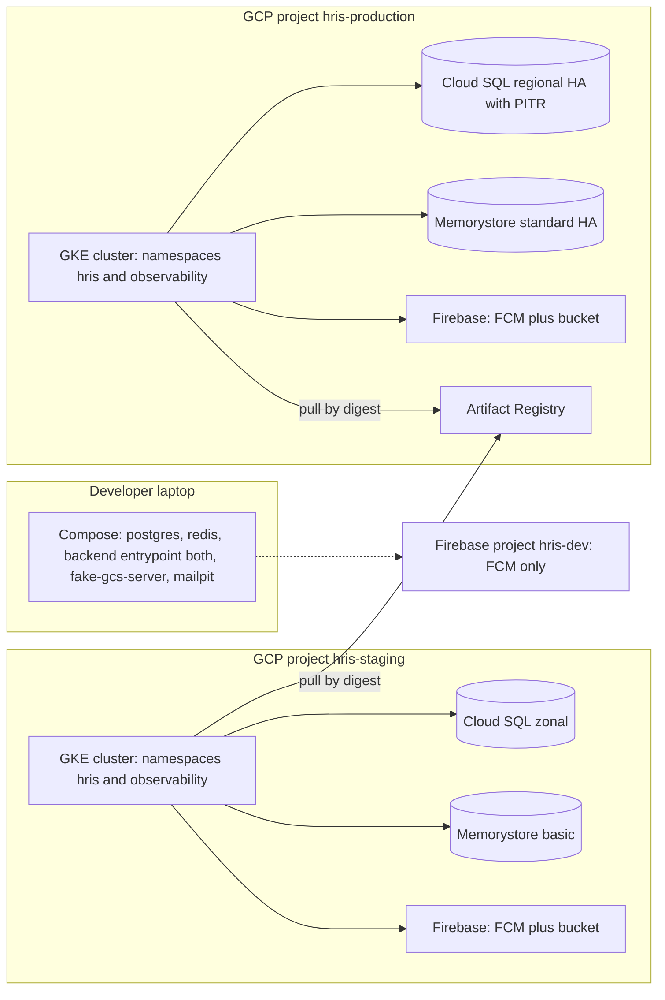
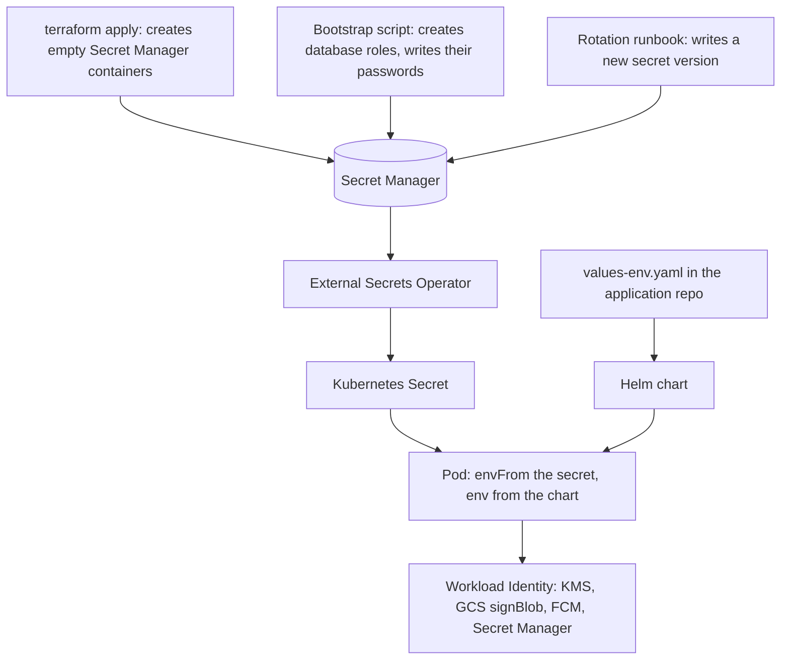

# Environments

Status: Active (Phase 4) · Related ADRs: `ADR-0002` (RLS roles), `ADR-0004` (tenant picker), `ADR-0009` (storage and Firebase), `ADR-0010` (queues), `ADR-0011` (observability stack), `ADR-0014` (Chromium rendering), `ADR-0016` (field-level encryption), `ADR-0019` (release and promotion — **Proposed**), `ADR-0020` (environment isolation and the production data boundary — **Proposed**) · Source: `docs/07-operations/ci-cd.md` §1 (seam), `docs/02-architecture/system-overview.md` §3 (topology), `docs/03-standards/security-standards.md` §3, §4, §7, §8 (rate limits, transport, secrets, encryption), `docs/02-architecture/multi-tenancy.md` §4 (database roles) · Downstream: `docs/07-operations/observability.md` (thresholds, dashboards, triage), `docs/07-operations/backup-restore.md` (PITR execution, drills), `docs/07-operations/performance.md` (tuning the numbers this file sets)

## 1. Scope and seam

**This document answers *what exists and how it is configured*. Its siblings answer *what you do when it misbehaves*.**

ci-cd §1 drew half of this seam before this file existed. It holds unchanged, and the secret rule now reads in both directions: **ci-cd names the secrets CI consumes; this document names the store, the path, and the rotation cadence. The value appears nowhere in the handbook.**

| This document owns | Owner elsewhere |
|---|---|
| Environment inventory and parity rules | — |
| Local Compose: services, seeds, what runs natively | — |
| Cluster topology: projects, namespaces, node pools | — |
| Managed services: Cloud SQL, Memorystore, registry, Firebase per environment | — |
| **The environment-variable and secret registry**, and how a value reaches a pod | ci-cd §11 names the secrets *CI* holds |
| DNS, TLS, ingress, HSTS | — |
| Per-environment sizing: replicas, requests, limits, pool sizes | `performance.md` — why that number, and how to tune it |
| Which observability components are deployed, and where alerts **route** | `observability.md` — thresholds, dashboards, triage |
| Staging data, and the rule that production data never leaves production | `backup-restore.md` — PITR execution and restore drills |
| Database role provisioning | `multi-tenancy.md` §4 — the grants themselves |
| Triggers, gates, pipelines | `ci-cd.md` |

Values in this document are **reference configuration**, not a bill of materials. The cluster is described so that a second one can be built to match; the account numbers, project ids, and domain are commercial and live in the values files.

## 2. Environment inventory

Three deployment environments exist. Nothing else is one.

| Name | Is | Deployed by |
|---|---|---|
| `local` | Docker Compose on a laptop (D5) | The developer |
| `staging` | GKE namespace in `hris-staging` | Automatically, on merge to `main` (ci-cd §2) |
| `production` | GKE namespace in `hris-production` | Human promotion behind an environment approval (`ADR-0019`) |

Two things get mistaken for environments and are named here so the mistake is short-lived:

- **CI ephemeral.** Testcontainers PostgreSQL and Redis, created and destroyed inside a job. No address, no configuration, nothing to provision. It receives `APP_ENV=test` and nothing else.
- **The GitHub Environment `release`** (ci-cd §11). A *secret scope* holding store-signing credentials, not a deploy target. Same word, different noun; there is no release cluster.

**`APP_ENV` is a closed set: `local`, `test`, `staging`, `production`.** It is stamped on every log line (`ADR-0011`), tags every Sentry event, and is one of the two guards ci-cd §12's `smoke:reset` refuses to run without. A value outside the set fails boot — it never falls back to a default, because the value that falls back is the one that deletes a tenant.

**No shared development cluster.** The fourth environment nobody owns, that drifts, and that eventually becomes the thing being debugged instead of the product. A-006's repository split and Compose already give every developer an isolated stack.

**No separate demo environment.** ci-cd §12 already places the demo tenant on staging beside the smoke tenant. A second cluster to patch so that a walkthrough can happen is not worth it at D13 scale.

**Mobile has no environment.** It has build flavors that point at an environment (§10.4).

## 3. Topology

Two GCP projects. The split is not a preference: `ADR-0009` puts the storage bucket in the same Firebase project as FCM, and a staging push must never reach a real employee's phone, so **two Firebase projects — and therefore two GCP projects — exist before anyone chooses anything.**

Given they exist, the cluster and the managed data services go in the matching project, because that converts an isolation boundary we assert into one Google enforces. ci-cd §11 already splits CI privilege by GitHub Environment so a staging workflow cannot reach production credentials; in a single cluster that split survives only as long as every RBAC binding is correct. Across projects the staging deploy identity holds no grant in the production project at all. `ADR-0020` records the decision.



| Resource | `hris-staging` | `hris-production` |
|---|---|---|
| GKE | Standard, regional cluster, one node pool | Standard, regional cluster, one node pool |
| Namespaces | `hris`, `observability` | `hris`, `observability` |
| Cloud SQL | Zonal, private IP | Regional HA, private IP |
| Memorystore | Basic | Standard HA |
| Firebase | Own project — FCM and bucket | Own project — FCM and bucket |
| Artifact Registry | Reader | **Owns it**, CI is writer |

Three consequences that are derived rather than chosen:

- **GKE Standard, not Autopilot.** `ADR-0011` deploys kube-prometheus-stack, whose node-exporter requires host mounts that Autopilot refuses, and §7.3's seccomp profile needs a node-level file. D5's cloud-portable manifests also survive better on Standard.
- **Neither database has a public IP.** This is what makes ci-cd §7.1's in-cluster migration Job structural instead of a preference — there is no address for a GitHub runner to reach even if someone decided to try.
- **One registry, so promotion re-tags one digest** (`ADR-0019`). Two registries would turn promotion into a copy, doubling what C4 and C5 scan and what ci-cd §6 retains.

Residual, stated: the merge-time CI identity holds `artifactregistry.writer` in the production project. It can write an image; it cannot deploy one, because promotion requires the environment approval. A separate `hris-shared` project holding only the registry is the upgrade, and it waits for a second consumer.

## 4. Local development

system-overview §3.3 sketched this and deferred the specifics here.

| In Compose | On the host | Real cloud |
|---|---|---|
| PostgreSQL 16, Redis 7, backend `both`, `fake-gcs-server`, Mailpit | `admin-web` via `next dev`, Flutter | **FCM only**, via the `hris-dev` Firebase project |

```
postgres        postgres:16          5432   init script creates the three roles
redis           redis:7              6379   maxmemory-policy noeviction
api             built locally        3000   APP_ROLE=both
gcs             fsouza/fake-gcs      4443   STORAGE_EMULATOR_HOST
mail            axllent/mailpit      8025   catches every outbound message
```

- **`admin-web` is not containerized.** Bind-mounted hot reload on macOS is slow and fails in ways nobody should spend a morning on. The container image exists to be deployed, not to be edited in.
- **`fake-gcs-server`, not the real bucket.** Signing a V4 URL from a laptop needs either a service-account JSON key — the exact artifact §5 eliminates everywhere else — or online ADC impersonation. A fake keeps local development working offline. The escape hatch for the rare case where real signed URLs must be exercised is ADC impersonation of a development service account, still with no key file.
- **FCM has no emulator.** It is the one dependency that must be real, which is why `hris-dev` exists and why it holds nothing else.
- **Mailpit catches everything.** No provider credential on a laptop, and every rendered template is inspectable — which matters given the size of notification.md §4.2's registry.
- **`ADR-0016`'s KEK resolves to a local provider** behind the same `KeyProvider` port, key from `LOCAL_KEK`, hard-refusing to load unless `APP_ENV=local`.

**Compose creates all three database roles, and the application connects as `hris_app`.**

This is the highest-value rule in the section and it is not hygiene. Connecting as `postgres` means connecting as the object owner, and database-conventions §9.3 is explicit that `FORCE` RLS binds the owner too — so **every tenant-isolation defect becomes invisible on a laptop** and first appears in CI, or in production. multi-tenancy §5's L1–L9 leak tests exist because that class of bug is silent by nature. The local database is not permissive.

Seeding uses the same path everything else does: system-administration §5.3's provisioning, producing two tenants so that cross-tenant behaviour is visible while developing, not only while testing.

## 5. Configuration and secret delivery

security-standards §7 fixed the shape and deferred the wiring: *"secrets reach processes as env vars injected from the cluster secret store"*. ci-cd §8.1 fixed the other half: values files carry non-secret configuration only.

| Class | Lives in | Reaches the pod as |
|---|---|---|
| Non-secret configuration | `deploy/values-{env}.yaml`, committed | `env:` from the chart |
| Secret | Google Secret Manager | `ExternalSecret` → Kubernetes Secret → `envFrom` |
| GCP API access | **Nothing** — Workload Identity | KSA bound to a GSA |

The boundary test is not whether something feels sensitive. It is **"would publishing this in the repository be a problem"**, which keeps the argument off adjectives and produces the same answer twice.



An `ExternalSecret` is where a registry name meets a store key, and it is the only place the mapping exists:

```yaml
spec:
  target: { name: hris-api }
  data:
    - secretKey: DATABASE_URL
      remoteRef: { key: hris-api-database-url }
```

Rejected, each for a reason specific to this stack:

- **Secret Manager CSI driver.** Mounts files. security-standards §7 says env vars and backend-nestjs §11 validates env at boot; making the application read files rewrites both for nothing.
- **SOPS or Sealed Secrets.** Ciphertext in git, so rotation is a commit and the decryption key becomes the thing being protected — the same problem one layer down. A secret committed once is in the history forever.
- **Hand-made Kubernetes Secrets.** No audit trail, no rotation story, and the authoritative copy ends up on somebody's laptop.

Two consequences that bite in practice:

- **No service-account JSON key exists anywhere.** Including for `ADR-0009`'s V4 signed URLs, which sign through IAM Credentials `signBlob` under Workload Identity, and for `ADR-0016`'s KMS access. Those two are precisely where a key file usually gets introduced.
- **Rotation requires a rollout, and that is a rule.** Environment variables are fixed at pod start. Writing a new Secret Manager version changes nothing visible — until an HPA scale-up mints a pod holding the new credential while every existing pod holds the old one, and half the fleet fails on a rotated database password. The procedure is therefore **write the new version, then `rollout restart`**, never a silent value swap. No reloader controller: one runbook step is cheaper than a component.

Rotation cadences come from security-standards §7 — JWT signing keys every 90 days, database and Redis credentials per this file's policy (annually, or immediately on suspicion), tenant DEKs on demand. Every rotation is an audit-log platform event.

## 6. The environment-variable registry

This is the only place in the handbook where **"what does this process need in order to start"** is answerable. It is a registry in the CLAUDE.md sense: a new variable is added here in the same session that introduces it.

Reading the tables: **Class** is `cfg` for values-file configuration or `sec` for Secret Manager. Where the three environments differ, the cell shows `local · staging · production`. A secret shows its store key, never its value, in any environment.

There is deliberately **no CI gate** on this table. A missing variable already fails the pod at boot in every environment including Compose, so the feedback loop is immediate; an extra one is harmless. The residual — this table drifting from the code's validation schema — is carried by the same discipline every other registry here uses, plus the Phase 4 audit.

### 6.1 Core

| Variable | Class | Consumers | Value |
|---|---|---|---|
| `APP_ENV` | cfg | all | `local` · `staging` · `production` |
| `APP_ROLE` | cfg | api, worker | `both` · `api` or `worker` |
| `APP_VERSION` | cfg | api, worker, web | The promoted image tag, reported by the version endpoint S1 asserts |
| `GIT_SHA` | cfg | all | Build SHA; `ADR-0011` uses it as the Sentry release |
| `PORT` | cfg | api, web | `3000` |
| `METRICS_PORT` | cfg | worker | `9090` — the listener `ADR-0011` requires, and what §7.1's probes answer on |
| `LOG_LEVEL` | cfg | api, worker | `debug` · `info` · `info` |
| `PUBLIC_API_URL` | cfg | all | §8's hostnames |
| `PUBLIC_ADMIN_URL` | cfg | api, worker | Deep-link target for notification templates |
| `SWAGGER_ENABLED` | cfg | api | `true` · `true` · **`false`** — backend-nestjs §11 serves it in non-production only |

### 6.2 Data stores

| Variable | Class | Consumers | Value |
|---|---|---|---|
| `DATABASE_URL` | sec | api, worker | `hris-api-database-url` — connects as `hris_app` |
| `DATABASE_MIGRATOR_URL` | sec | migrate Job only | `hris-api-database-migrator-url` — `hris_migrator`, never mounted on an application pod |
| `DATABASE_POOL_MAX` | cfg | api, worker | `10` — §7.4's arithmetic |
| `DATABASE_CA_PATH` | cfg | api, worker | ConfigMap mount; the instance CA is a public certificate, so it is configuration |
| `REDIS_URL` | sec | api, worker | `hris-api-redis-url` — `rediss://` with the AUTH string |

### 6.3 Identity and encryption

| Variable | Class | Consumers | Value |
|---|---|---|---|
| `JWT_PRIVATE_KEY` | sec | **api only** | `hris-api-jwt-private-{kid}` — Ed25519 per A-014 |
| `JWT_PUBLIC_KEYS` | sec | api, worker | `hris-api-jwt-public-set` — verify-only material, kept in the store despite not being secret so that rotation writes one place, not two |
| `JWT_ACTIVE_KID` | cfg | api | The `kid` currently signing; older entries stay in the public set until the A-014 window expires |
| `ACCESS_TOKEN_TTL`, `REFRESH_TOKEN_TTL` | cfg | api | `ADR-0004` values, platform-fixed |
| `KMS_KEK_RESOURCE` | cfg | api, worker | The `ADR-0016` KEK resource name — a name, not a key |
| `LOCAL_KEK` | sec | api | **`local` only**; the provider refuses to load when `APP_ENV != local` |
| `RATE_LIMIT_*` | cfg | api | Nine variables carrying security-standards §3's table — values there, not restated here |

### 6.4 External services

| Variable | Class | Consumers | Value |
|---|---|---|---|
| `GCS_BUCKET` | cfg | api, worker | Per-environment bucket, `ADR-0009` path grammar |
| `GCS_SIGNER_SA` | cfg | api | The GSA email used for `signBlob`; no key material |
| `STORAGE_EMULATOR_HOST` | cfg | api, worker | **`local` only** — `fake-gcs-server` |
| `FIREBASE_PROJECT_ID` | cfg | api, worker | `hris-dev` · `hris-staging` · `hris-production` |
| `MAIL_PROVIDER` | cfg | worker | `smtp` · `resend` · `resend` |
| `RESEND_API_KEY` | sec | worker | `hris-api-resend-key` |
| `MAIL_FROM` | cfg | worker | §10.1's sender per environment |
| `SMTP_URL` | cfg | worker | **`local` only** — Mailpit |
| `SENTRY_DSN` | cfg | all | Configuration by necessity: `admin-web` ships its DSN to the browser |
| `SENTRY_ENVIRONMENT` | cfg | all | Mirrors `APP_ENV` |
| `OTEL_EXPORTER_OTLP_ENDPOINT` | cfg | api, worker | The in-cluster Collector; unset locally |
| `OTEL_TRACES_SAMPLER_ARG` | cfg | api, worker | `1.0` · `1.0` · `0.1` per `ADR-0011` |

### 6.5 Worker behaviour

| Variable | Class | Consumers | Value |
|---|---|---|---|
| `WORKER_QUEUES` | cfg | worker | All eight (`ADR-0010`). **This is the lever that splits the Deployment** (§7.2) without a code change |
| `QUEUE_CONCURRENCY_PAYROLL` | cfg | worker | Low — CPU-bound |
| `QUEUE_CONCURRENCY_NOTIFICATIONS` | cfg | worker | High — fan-out |
| `QUEUE_CONCURRENCY_DEFAULT` | cfg | worker | The remaining six |
| `PDF_PAGE_CONCURRENCY` | cfg | worker | `ADR-0014`'s bounded page concurrency |
| `PDF_RECYCLE_AFTER` | cfg | worker | Renders before the browser is recycled — the memory-hygiene number `ADR-0014` requires |
| `SMOKE_TENANT_SLUG` | cfg | `smoke:reset` Job | Guard two of ci-cd §12's two |

### 6.6 Admin web and mobile

| Variable | Class | Consumers | Value |
|---|---|---|---|
| `NEXT_PUBLIC_API_BASE_URL` | cfg | web | §8's API hostname |
| `NEXT_PUBLIC_APP_ENV` | cfg | web | Mirrors `APP_ENV` |
| `NEXT_PUBLIC_SENTRY_DSN` | cfg | web | Browser-side; never anything else under `NEXT_PUBLIC_` (naming §12) |
| `API_BASE_URL`, `APP_FLAVOR`, `SENTRY_DSN` | cfg | mobile | `--dart-define` at build time, per §10.4's flavor. **No secret ever travels this way** (security-standards §12) |

## 7. Workloads and sizing

### 7.1 What exists

| Object | Kind | Notes |
|---|---|---|
| `api` | Deployment, HPA, PDB | Liveness and readiness; readiness gates the rollout (system-overview §3.1) |
| `worker` | Deployment, PDB, **no HPA** | Probes ride the `METRICS_PORT` listener |
| `admin-web` | Deployment, HPA, PDB | Stateless |
| `migrate`, `smoke:reset` | Job | Created by the pipeline (ci-cd §7.1, §12) |

Three clarifications, each preventing a specific mistake:

- **The handbook's 26 crons are BullMQ repeatable jobs inside `worker`, not Kubernetes CronJobs.** `ADR-0010` owns scheduling and every one of them is tenant-aware and idempotent. Someone reading "cron" in a module document will otherwise write 26 CronJob manifests — a second scheduler with no tenant context, no idempotency contract, and no queue. *(Count corrected 2026-08-04 from 27; the extra was an `ADR-0010` illustration — testing-strategy §14.1.)*
- **`worker` has no HPA.** CPU is the wrong signal for a queue consumer: a pod blocked on a Redis read looks exactly like a pod with nothing to do. Replicas are a values-file number until KEDA earns its place.
- **`worker` still serves HTTP**, because `ADR-0011` puts `prom-client` metrics on workers. Without that listener a worker's readiness probe has nothing to answer.

### 7.2 One worker Deployment

ci-cd §8.2 and system-overview §3.2 both say `worker`, singular, and per-queue concurrency is in-process configuration `ADR-0010` already defines. Splitting is a values-file change on the same image — a different `WORKER_QUEUES` list — so it costs nothing to defer.

Named triggers to split: **payroll CPU starving notification latency**, or `ADR-0014`'s Chromium footprint — 300 MB of image and 100–200 MB per render — making the whole fleet expensive to scale for a queue that renders nothing.

**The second trigger is arithmetic, not a hypothesis** *(added 2026-08-04, `performance.md` §7.3)*. A 1Gi memory limit with `NODE_OPTIONS` at 75% leaves roughly 256 MB outside the V8 heap, which fits **one** Chromium render per pod. Two pods is ~2 renders/s against a month-end fleet requirement near 12/s. The resolution is a values-file choice this document owns — raise `worker` memory, or split `pdf` onto its own Deployment — and `pdf` concurrency stays at 1 per pod until one of them happens. `performance.md` §7.1 also adds the cheaper first move for the *first* trigger: per-queue concurrency, which `ADR-0010` already owns as in-process configuration.

### 7.3 Sizing

| | requests | limits | staging | production |
|---|---|---|---|---|
| `api` | 250m / 512Mi | no CPU limit / 512Mi | 1 | 2–6, HPA on CPU at **70%** of request |
| `worker` | 500m / 1Gi | no CPU limit / 1Gi | 1 | 2 |
| `admin-web` | 100m / 256Mi | no CPU limit / 256Mi | 1 | 2 |

- **CPU requests without CPU limits; memory requests equal to limits.** Throttling at a CPU limit produces latency spikes indistinguishable from a code defect, and D2 fixes p95 budgets that would then be chased in the wrong place. Memory is incompressible, so a limit above the request only buys a later and more confusing OOMKill.
- **`NODE_OPTIONS=--max-old-space-size` at roughly 75% of the memory limit.** Without it V8 grows past the cgroup and the kernel kills the pod before the garbage collector runs — the classic mystery OOM in containerized Node.
- **Grace periods: `api` 30 s, `worker` 300 s.** The 30-minute payroll case is handled by ci-cd §8.2's drain gate on deploys. A *node* eviction mid-payroll is handled by `ADR-0010` idempotency, and the honest residual is that it costs a re-run, not corruption.
- **PodDisruptionBudgets exist because node auto-upgrade exists** (§13.4). Without a budget a node drain can evict every `api` replica at once.

### 7.4 Connection pool

backend-nestjs §8.1 deferred the number here. The rule is arithmetic so that it survives a resize:

> `DATABASE_POOL_MAX` × maximum replicas + the migrate Job + break-glass ≤ Cloud SQL `max_connections`.

Production: 10 × 6 `api` + 10 × 2 `worker` + headroom. **No PgBouncer in V1** — the arithmetic fits, and multi-tenancy §4 already made the code pooler-compatible by using transaction-local `set_config` and prohibiting session-level `SET` anywhere. Adding a pooler later is a hostname change, not a rewrite.

**The right-hand side, supplied 2026-08-04 by `performance.md` §4.2–§4.3.** 10 × 6 + 10 × 2 + 5 migrate + 5 break-glass = **90**, and OB6 alerts at 80% of `max_connections`, so a configuration tripping its own alert at steady state is wrong by construction: **`max_connections` ≥ 200** is the floor (§9). And the number that actually matters is not the pool size but the **hold time** — 80 pooled connections carry the morning peak only while mean database hold time stays near **30 ms**, so OB5 firing means hold time crossed the line and **raising `DATABASE_POOL_MAX` is the wrong fix**. That file owns the derivation and the triage correction.

### 7.5 Chromium sandbox

`ADR-0014` requires the Chromium sandbox enabled, non-root, and prohibits `--no-sandbox`. Under the default container seccomp profile the layer-1 sandbox cannot start, because it needs namespace-creation syscalls that `RuntimeDefault` blocks. That is why `--no-sandbox` is so common, and it is why the ADR pushed the mechanism to this file.

**A `Localhost` seccomp profile derived from `RuntimeDefault`, adding exactly three syscalls — `clone` with `CLONE_NEWUSER`, `unshare`, `setns` — placed on nodes by a small DaemonSet and referenced only by `worker`:**

```yaml
securityContext:
  runAsNonRoot: true
  seccompProfile:
    type: Localhost
    localhostProfile: chromium.json
```

- The widening is enumerable rather than vague: three syscalls, named, on one workload out of three.
- Rejected: adding `SYS_ADMIN`, which is near-root for the sake of a PDF; and splitting a render-only Deployment purely for this, which contradicts §7.2 for a blast radius of three syscalls.
- **Residual, and the one place D5 portability leaks: the profile is a file on a node, not a manifest.** Named exit — pod user namespaces remove the DaemonSet entirely once GKE ships them, and the profile becomes a pod field again.

## 8. Networking, ingress, TLS, DNS

| | production | staging |
|---|---|---|
| API | `api.{domain}` | `api.staging.{domain}` |
| Admin | `admin.{domain}` | `admin.staging.{domain}` |

- **`ingress-nginx` with `cert-manager`, not GKE Ingress.** D5 requires cloud-portable manifests, and GKE Ingress means `ManagedCertificate` and `BackendConfig` CRDs that exist on exactly one cloud — so the manifests would stop being portable at the edge, which is the first place a migration touches. Two boring Helm charts buy standard `Ingress` and `Certificate` resources that apply unchanged anywhere.
- **Four DNS records, total, forever.** `ADR-0004` resolves the tenant through a picker *after* login rather than through a hostname, so there are no per-tenant subdomains, no wildcard certificate, no DNS provisioning inside tenant creation, and no per-tenant TLS. Worth recording as the operational dividend of a decision taken for product reasons.
- **The apex domain is a values-file variable.** Which domain the product ships under is commercial and not the handbook's to invent.
- **TLS 1.2 or better, HSTS `max-age=31536000; includeSubDomains`** on both origins — security-standards §4 fixed both; this places them at the ingress.
- **Cloud SQL and Memorystore over private IP only, TLS enforced.** No Cloud SQL Auth Proxy sidecar: a second process per pod to size, patch, and have fail, buying nothing over a private address.
- **NetworkPolicy: default-deny inbound, permissive egress.** Inbound is three rules that never change — the ingress controller to `api` and to `admin-web`, and nothing at all to `worker`. Egress would be a list amended every time a dependency appears, and a stale egress rule fails in production as a timeout nobody attributes correctly.

## 9. Managed data services

| | production | staging |
|---|---|---|
| Cloud SQL | PostgreSQL 16 (A-010), regional HA, PITR on, deletion protection on | Zonal, daily backup, PITR off |
| Backup retention | **35 days**, daily, early WIB | 7 days |
| PITR window — transaction log retention | **14 days** | — |
| Memorystore | Redis 7, Standard HA, AUTH and TLS, RDB snapshots on | Basic |
| **Sizing floor** — production only | Cloud SQL `max_connections` ≥ **200**, **8 vCPU / 32 GB**; Memorystore `maxmemory` ≥ **16 GB** | — |
| Maintenance window | Sunday 02:00–04:00 **WIB** | Any |

- **Regional HA in production, zonal in staging.** D3 asks for 99.9% monthly, which a single zone's maintenance and failure exposure does not support. Staging holds nothing worth a second zone.
- **PITR and deletion protection are production-only flags.** Whether they are on is this document; the RPO they serve and the restore procedure are `backup-restore.md`'s.
- **The two retention numbers are derived, not chosen, and `backup-restore.md` §4 owns the derivation** *(added 2026-08-04)*. 35 days is the longest destructive-cron cadence — `cron.audit.archive` is monthly — plus a margin to notice. 14 days is the useful life of an instance-wide rewind, since nobody discards three weeks of 500 tenants' writes. Raising either number lengthens the window in which a completed crypto-shred is still reversible by restore, so this is the one retention setting in the handbook bounded from **both** ends.
- **The sizing floor is not a tier, and it is where "cost, not behaviour" stops** *(added 2026-08-04)*. §12's parity table files instance tier under cost, and that stays true **above** the floor. Below it the choice becomes a correctness one: `max_connections` is derived from §7.4's pool arithmetic plus OB6's 80% headroom, and `maxmemory` from `performance.md` §5.4's per-consumer budget — under `noeviction` the ceiling is an outage, not a slowdown. `performance.md` §4.4 and §5.4 own both derivations; picking a tier at or above them is still this document's and still a cost question.
- **The maintenance window is expressed in WIB, not UTC.** Every tenant is Indonesian and D1 puts 30% of a workforce through clock-in inside 15 minutes; a UTC-framed window quietly lands inside a Jakarta morning.

### 9.1 `maxmemory-policy` is `noeviction`

Redis holds BullMQ's queues, and BullMQ stores job payloads as ordinary keys. Under `allkeys-lru` — a common default, and exactly what someone reaching for "it is a cache" would choose — **memory pressure silently evicts queued jobs**. Not a delay and not a retry: a payroll run that was accepted and then never happened, no error anywhere, and `ADR-0010`'s at-least-once guarantee quietly void.

`noeviction` converts that into a write rejection, which is loud and alertable. Two things follow from choosing loud:

- **Redis memory needs an alert.** The threshold is `observability.md`'s; the requirement is this document's; and `maxmemory` itself — the value OB7's 80% is 80% *of* — is `performance.md` §5.4's, added to §9's table on 2026-08-04. Until then all three existed and the number they depended on did not.
- **One Redis instance** serves queues, sessions, rate-limit counters, idempotency envelopes (security-standards §8), and the dashboard cache (A-090), all under the `hris:` key prefix. The trigger to split is named rather than pre-empted: cache growth pressuring queue writes, at which point the cache moves to its own instance where `allkeys-lru` is the correct policy.

**RDB snapshots on in production**, with the residual stated plainly: Redis is the only durable home a *job* has — `ADR-0010`'s outbox covers events, not jobs — so a total Redis loss can strand an in-flight run. Repeatable crons re-fire on schedule and the outbox relay re-publishes; a one-off run needs a human to re-trigger it.

## 10. External services

### 10.1 Mail

**Resend, per D7.** A-017 previously recorded Amazon SES on the stated premise that the specification named no provider; D7 names Resend and prohibits SES explicitly, so A-017 has been corrected. The `EmailPort` abstraction, its state machine, its retry model, and its dedupe key are unchanged — which is what the port was for, and the first time it has been called upon.

| Environment | Sender | Delivery |
|---|---|---|
| `local` | anything | Mailpit, nothing leaves the machine |
| `staging` | `noreply@staging.{domain}` | Resend, separate domain |
| `production` | `noreply@{domain}` | Resend |

**Separate sending domains are the point, not tidiness.** A staging defect that fans out to a stale address list burns sending reputation, and reputation is per-domain. Each domain carries its own SPF record, its own DKIM key pair published by the provider, and a DMARC record — `p=none` while volume is being observed, tightened afterwards, with the aggregate reports going to a monitored address. Recipient mailboxes sit outside A-003's residency scope, which concerns storage rather than delivery.

### 10.2 Storage and FCM

One bucket per environment in `asia-southeast2`, in the same Firebase project as FCM, following `ADR-0009`: uniform bucket-level access, zero public objects, and the naming §11.4 path grammar. The 24-hour lifecycle rule on the `uploads/` staging prefix is a bucket setting, so it is provisioned here rather than assumed by the application.

**Object versioning and soft delete are on, with noncurrent versions reaped at 30 days** *(added 2026-08-04)* — on the application bucket and on the audit archive bucket. Until then the bucket had no recovery of any kind, while holding payslip and tax PDFs under a ten-year floor for which **the object is the only copy in existence**; the database keeps sha256 and metadata, which proves a file was there and reconstructs nothing. A bucket flag beats a replication job here because the failure mode is silence and a flag cannot stop running. `backup-restore.md` §10 owns the reasoning, the rejected alternatives — replication, and a retention *lock*, which would leave `cron.document.purge` unable to satisfy a UU PDP retention limit — and the consequence that **the 30-day noncurrent window extends every erasure the purge crons perform**, which makes it a privacy parameter rather than a cost knob.

FCM credentials do not exist as secrets — the pod's Workload Identity is the credential.

### 10.3 Sentry

**Three projects, one per repository. Environments are tags, not projects.** `ADR-0011` already ties the release to a git SHA and the environment to a tag; six projects would split every issue's history in half at the moment of promotion, which is exactly when the history is being read.

### 10.4 Mobile flavors

ci-cd §10 says merge to `main` uploads to the Play internal track and TestFlight without saying which API the artifact points at — and that answer decides whether S5 means anything.

| Flavor | applicationId | API | Built | Distributed |
|---|---|---|---|---|
| `dev` | `…hris.dev` | localhost or LAN | Locally | Never |
| `staging` | `…hris.staging` | staging | Merge to `main` | Staging Play app, TestFlight |
| `production` | `…hris` | production | **The promotion workflow** | Production app internal track, promoted by a human |

- **Distinct application ids let staging and production coexist on one device**, which is the practical reason flavors exist at all. It also forces two Play listings and two TestFlight apps.
- **The production artifact is built at promotion, not at merge.** `ADR-0019`'s "promote a digest, never rebuild" governs container digests and mobile has none (ci-cd §4.3). Building at promotion is what prevents the alternative failure: a human in the Play console promoting an internal-track build straight to production while it points at the staging API.
- Honest residual: **the artifact that reaches the store is not the artifact S5 smoke-tested.** Unavoidable for mobile. The two differ only in `--dart-define` values and the Firebase configuration file — no code path, no flag, no conditional.
- **The Firebase configuration files are committed per flavor.** `google-services.json` ships inside every installed APK, so under §5's test it is not a secret. security-standards §12's rule is untouched: no secret ever reaches a release build through `--dart-define`.

## 11. Observability deployment and alert routing

`ADR-0011` fixed the stack and deferred deployment and routing here.

| Component | Shape | production | staging |
|---|---|---|---|
| kube-prometheus-stack | Helm release, `observability` namespace | metrics 30 d | 7 d |
| Tempo | Helm release, monolithic mode | traces 7 d | 2 d |
| OTel Collector | Deployment, gateway mode | 2 replicas | 1 replica |
| Cloud Logging | GKE-native sink, `_Default` bucket | 30 d | 7 d |
| Grafana | In kube-prometheus-stack, **Google OAuth** | — | — |

**Staging keeps every component, and is cut on retention instead.** The tempting saving — Grafana in production only — makes observability the single subsystem with no staging, while `ADR-0011` puts dashboards in the repository specifically so they are reviewed like code. A dashboard nobody can render before promotion is reviewed by reading JSON. Retention is where the cost actually accumulates, so retention is where staging gives way.

**Grafana authenticates through Google OAuth**, so there is no shared admin password to store, rotate, or leak.

| Route | Destination |
|---|---|
| production `critical` | Chat channel **and** email |
| production `warning` | Chat channel, non-paging |
| staging, any severity | A **separate** channel, non-paging |
| Sentry, all three applications | The production warning channel |

- **No PagerDuty in V1.** Paging requires a rotation, and A-102's organization has no on-call role to rotate; a pager with nobody assigned is a notification everyone learns to ignore, plus a bill.
- **Staging alerts route somewhere else deliberately.** Sharing one channel is how the channel becomes noise, and then the production critical is the one people scroll past.
- Channel names are values-file configuration; the webhook is `ALERT_WEBHOOK_URL` in Secret Manager. **Thresholds and triage stay `observability.md`'s** — this places the wire, not the rule.

**One log sink, added 2026-08-04.** A Cloud Logging sink filtered to audit-log's daily anchor emit writes it into the **audit archive bucket**, under §10.2's versioning. BR-AUD-009's tamper-evidence argument rests on that digest living outside the database, and the `_Default` bucket keeps it 30 days while the rows it attests to are kept two years hot and the payroll rows behind them ten — so without the sink the independent witness expired a hundred and nineteen months before the evidence did. A sink rather than a job, deliberately: a job is a second scheduled thing that can silently stop. `backup-restore.md` §12.2.

## 12. Parity rules

Without this section "it worked on staging" means nothing, and G19's five smoke journeys prove only that staging works.

| Identical, always | May differ | Because |
|---|---|---|
| PostgreSQL major version and extensions (A-010) | Cloud SQL tier, disk, HA | Cost, not behaviour — **above §9's floor** |
| The three roles, every RLS policy, `FORCE` RLS on | Replica counts, HPA bounds | Load, not logic |
| Redis major version and `maxmemory-policy` | Memorystore tier | Cost — **above §9's floor** |
| Migration history, in order (`ADR-0013`) | Pool sizes | Instance size |
| **The container image digest** (`ADR-0019`) | Observability retention | Cost |
| **Presence of every §6 variable** | Their values | The registry's whole purpose |
| TLS and HSTS at ingress | Hostnames | Obvious |
| **Rate-limit values** (security-standards §3) | — | §12.2 |

### 12.1 The closed list of environment branches

**Exactly four behaviours may branch on `APP_ENV`: Swagger exposure, log level, trace sampling rate, and ci-cd §12's `smoke:reset` guard. Nothing else, ever.**

An `if (env === 'production')` inside business logic is the mechanism by which staging stops predicting production, and it is always introduced for a defensible-sounding reason. The list is closed so that adding a fifth is a conversation rather than a commit.

### 12.2 Rate limits are identical, and the smoke suite is budgeted to fit them

security-standards §3 sets login at 5/minute and **20/hour per email**. ci-cd §11 provisioned exactly one credential pair, `SMOKE_TENANT_ADMIN_*`, and testing-strategy §9 runs five journeys per staging deploy, four of which authenticate. Two problems follow.

First, four journeys sharing one email across several merges an hour eventually trips the throttle. That failure looks exactly like a real defect, and the natural "fix" is raising staging's limit — destroying parity in order to hide a test-design problem.

Second, and more concretely: **S5 is M2, run by an employee, and §11 provisioned only an administrator.** It had no credential at all.

So the smoke seed defines accounts by role and the secret is a set rather than a pair — `SMOKE_ADMIN_*`, `SMOKE_MANAGER_*` for S3's approver, and `SMOKE_EMPLOYEE_*` for S5. Distinct emails mean the per-email limit never binds, the per-IP backstop of 30/minute and 300/hour is the only ceiling, and GitHub-hosted runners vary by address. The limits stay identical; the suite fits inside them. ci-cd §11's secret table is amended accordingly.

## 13. Infrastructure as code, bootstrap, and break-glass

### 13.1 Terraform

**One root module with a variable file per environment, in `hris-api` under `infra/`, applied by a human. State lives in a versioned GCS bucket in `hris-production`, with state locking** *(backend named 2026-08-04 — it had been left unstated, and `terraform init` with no backend block means local state on one laptop, whose loss is recoverable only by `terraform import` across every resource while the plan lies to you throughout). Versioning is the load-bearing half: a corrupt apply is repaired by rolling state back, and without versions there is nothing to roll back to.*

| Declared in Terraform | Not in Terraform |
|---|---|
| Projects, VPC, GKE cluster and node pools | Application Helm charts — they live with the code (ci-cd §8.1) |
| Cloud SQL, Memorystore, Artifact Registry | Platform Helm releases — `infra/helm/`, applied by `helm upgrade` |
| IAM, Workload Identity bindings, DNS, budget alerts | **Secret values** |
| Secret Manager secret **containers** | Database roles and their passwords |

- **Terraform is what makes §12's parity rules real.** Two environments from one module with different variables either match, or the plan says so. Parity maintained by clicking is parity maintained by memory.
- **`hris-api/infra/`, not a fourth repository.** A-006 fixed three, and ci-cd already declined a fourth twice — once for smoke tests, once for iOS certificates. The asymmetry is real and worth admitting: `hris-admin` deploys into a cluster declared in another repository. The backend is nonetheless the right holder, since it already owns the migrate Job, the `smoke:reset` Job, and two of the three workloads.
- **Applied by a human, not by CI.** The deploy identity must not be able to delete a database, and auto-applying a plan on merge is how a refactor drops Cloud SQL. Infra changes are rare enough at this scale that plan-review machinery does not yet pay for itself. Named trigger: infra changes becoming frequent enough that a reviewer needs the diff.
- **Secret values never enter Terraform.** A value passed through Terraform is a value in the state file — a plaintext store with no audit trail and a copy in every backend that has ever held it. This is the most common way an otherwise well-run IaC setup leaks credentials.
- **Artifact Registry retention never reaps a tagged digest**; untagged ones go at 30 days *(added 2026-08-04)*. `ADR-0019` guarantees a rollback depth of exactly one, which requires the previous digest to still exist — and a default age-based cleanup policy converts that guarantee into "usually" without anyone noticing. `backup-restore.md` §13.

### 13.2 Bootstrapping a new environment

| # | Step | By |
|---|---|---|
| 1 | Project, VPC, GKE, Cloud SQL, Memorystore, registry, IAM, empty secret containers | `terraform apply` |
| 2 | **Create `hris_migrator`, `hris_app`, `hris_auth`; write their passwords straight to Secret Manager** | Bootstrap script, once |
| 3 | Grants, `FORCE` RLS, and the `auth_lookup` policies exactly as multi-tenancy §4 | Same script |
| 4 | `ingress-nginx`, `cert-manager`, kube-prometheus-stack, Tempo, Collector, seccomp DaemonSet | `helm upgrade` |
| 5 | DNS records and certificate issuance | Terraform, then cert-manager |
| 6 | First deploy: migrate Job, then rollout | ci-cd §7.1, §8.2 |
| 7 | Seed the smoke and demo tenants | system-administration §5.3 |

Step 2 is deliberately not Terraform, and this document says so out loud so that nobody helpfully imports it later. `google_sql_user` — and every `random_password` variant of it — writes the password into state, which §13.1 just prohibited. The password is generated, written to Secret Manager, and exists nowhere else.

**Cloud SQL IAM database authentication was the tempting alternative and is rejected:** it requires a GCP-specific connector library in the application, contradicting both D5's portability requirement and §8's direct private-IP connection. Password authentication into Secret Manager keeps the application portable and the credential auditable.

Steps 2 and 3 are also what give ci-cd's `migrate:empty` (C6) its meaning — a from-scratch environment is exercised on every pull request, so this list cannot rot quietly.

### 13.3 Break-glass database access

An **ephemeral pod in the cluster** — `kubectl run --rm -it` — authenticated by the engineer's own Google identity through GKE RBAC, reading a break-glass Secret Manager entry. No bastion VM to patch, and every access leaves a trail in both the GKE audit log and Secret Manager's access log.

- **The default role is `hris_app` with an explicit `set_config`.** multi-tenancy §4 warns that `FORCE` RLS makes an ad-hoc query without the tenant variable return zero rows — which reads as "no data" rather than "wrong query", and has sent people looking for a data-loss incident that never happened.
- **`hris_migrator` is for schema work only, and its use is alertable.**
- multi-tenancy §4's line that this credential "exists in CI" is corrected in this session: since ci-cd §7.1 moved migrations in-cluster, **the pipeline never holds a database credential at all** (ci-cd §11). It lives in the cluster secret store, consumed by the migrate Job, and in break-glass tooling — never in CI, never on an application pod.

### 13.4 Cluster maintenance

**GKE release channel `regular`, node auto-upgrade on, maintenance window aligned with Cloud SQL's Sunday 02:00–04:00 WIB.** This is why §7.3's PodDisruptionBudgets exist: an upgrade drains nodes, and without a budget it can take every `api` replica at once.

**Budget alerts on both GCP projects**, routed to the warning channel — one Terraform resource, and the only thing standing between a runaway job and a surprising invoice.

## 14. Staging data and the production data boundary

Staging contains exactly two tenants, both synthetic, both seeded through system-administration §5.3: the **smoke tenant** that ci-cd §12's Job resets before each run, and a **demo tenant** CI never touches so that people can click around without racing the reset.

**No anonymization path exists, and none will be built.** testing-strategy §7 rule 4 stated the prohibition and assigned the mechanism here; the mechanism is a refusal, and `ADR-0020` records it.

- **`ADR-0016` already blocks it.** NIK, NPWP, BPJS numbers, and bank data are AES-GCM under a per-tenant DEK wrapped by a **production** KMS key. A staging restore either cannot decrypt them — leaving ciphertext, which debugs nothing — or staging is granted production KMS access, which is far worse than the problem being solved.
- **An anonymizer must be perfect forever.** It is a column allowlist that fails open: the first migration adding a sensitive column that nobody remembers to add to the scrubber exports real salaries into an environment with none of the controls, and nothing reports it.
- **The legitimate need is met without moving the boundary.** "Reproduce this with production-shaped data" becomes a **PITR restore into a temporary instance inside `hris-production`** — same VPC, same IAM, no public IP — read, then destroyed. Data never leaves its security boundary, so there is nothing to anonymize. `backup-restore.md` owns the procedure; this document owns the rule that the target lives inside the production project and is torn down afterwards.

**Production data is never restored into staging, into CI, or onto a laptop** — the same rule ci-cd §12 states from the pipeline's side, holding here from the environment's side.

## 15. Exclusions and future improvements

### 15.1 Excluded from V1

| Excluded | Reason | Trigger to revisit | Assumption |
|---|---|---|---|
| Service mesh and in-cluster mTLS | security-standards §4 deferred it here by name; V1 traffic is plaintext inside the private VPC | A compliance requirement, or a shared cluster | A-120 |
| Multi-region deployment | A-003 fixes one region; ci-cd §14.2 already names it | A regional outage, or a residency change | A-120 |
| CMEK on managed services | `ADR-0009` defers it; Google-managed keys in V1 | A customer contract requiring it | A-120 |
| Cloud Armor or a WAF | Rate limiting lives in the application (security-standards §3) | Volumetric abuse | A-120 |
| KEDA queue-depth autoscaling | `worker` replicas are a values number (§7.1) | Queue latency tracking replica count | A-120 |
| PgBouncer | The pool arithmetic fits; the code is already pooler-safe (§7.4) | Replica growth breaching `max_connections` | A-120 |
| Cloud SQL IAM database auth | Needs a GCP-specific driver, contradicting D5 (§13.2) | Portability ceasing to matter | A-118 |
| Terraform applied by CI | The deploy identity must not be able to delete a database | Infra changes frequent enough to need plan-review | A-118 |
| Dedicated per-tenant infrastructure | `ADR-0002`'s escape hatch and multi-tenancy §7's runbook exist; **nothing is provisioned** | A contractual isolation demand | A-120 |
| Redis backup beyond RDB | Queues are recoverable by re-trigger (§9.1) | — | A-116 |
| A shared development cluster, a separate demo environment | §2 | — | — |
| Preview environments, canary, automatic rollback | ci-cd §14.1 | — | A-107 |
| GitOps controller | ci-cd §8.1 | A second cluster or a second deploying team | A-105 |

### 15.2 Future improvements

- **Pod user namespaces**, which delete §7.5's DaemonSet and return the seccomp profile to being a pod field — closing the only place where D5 portability leaks.
- **A shared `hris-shared` project for Artifact Registry**, once a second consumer exists, removing CI's write grant in the production project.
- **KEDA**, when queue latency starts tracking replica count closely enough that a human is doing arithmetic a controller should do.
- **Splitting `worker`**, by `WORKER_QUEUES` alone, when payroll CPU starves notification latency or Chromium's footprint makes the fleet expensive to scale.
- **A second Redis instance for the dashboard cache**, where `allkeys-lru` is correct, once cache growth starts pressuring queue writes.
- **Per-tenant infrastructure**, following multi-tenancy §7's existing runbook rather than a new design, if a contract demands it.
