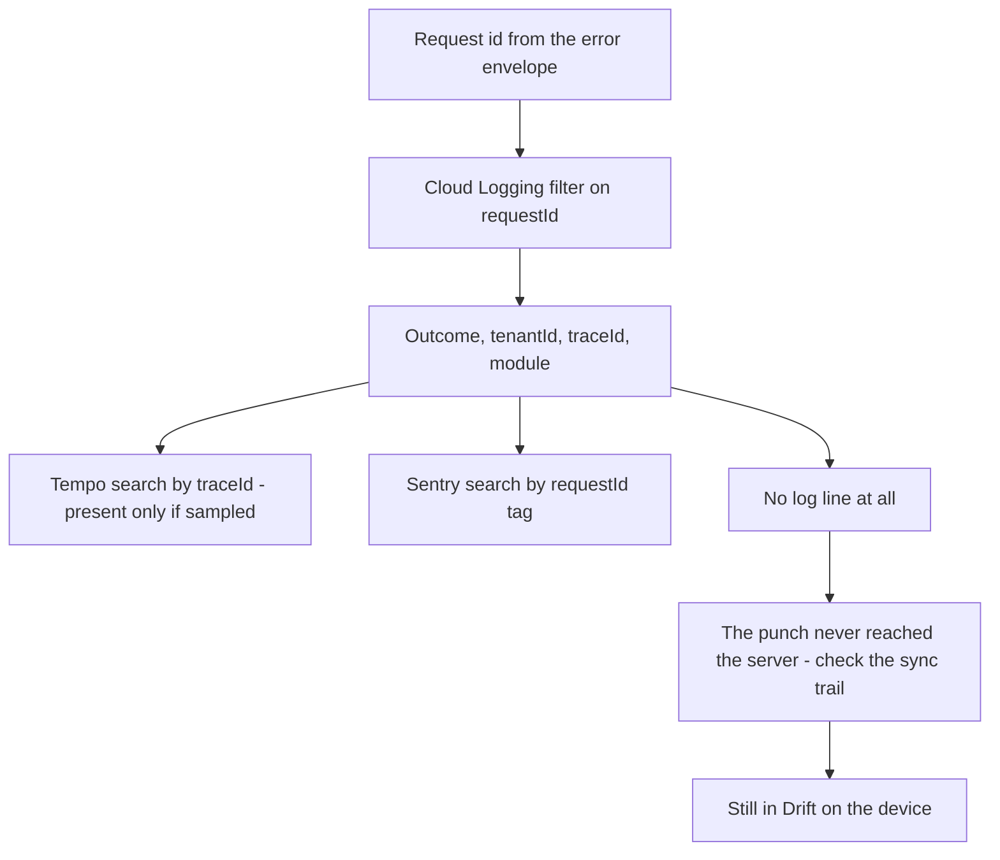

# Observability

Status: Active (Phase 4) · Related ADRs: `ADR-0003` (sync rejection classes), `ADR-0006` (Result vs exception), `ADR-0007` (request id, client skew), `ADR-0010` (queues, outbox, job envelope), `ADR-0011` (observability stack), `ADR-0016` (per-tenant DEKs), `ADR-0017` (platform identity, impersonation), `ADR-0019` (release and promotion — **Proposed**), `ADR-0021` (availability service window — **Proposed**) · Source: `docs/adr/ADR-0011-observability-stack.md` (stack, base fields, sampling, correlation contract, PII ban), `docs/07-operations/environments.md` §11 (components, retention, routes), `docs/02-architecture/backend-nestjs.md` §8 (SDK wiring, health module), `docs/03-standards/security-standards.md` §9, §10 (UU PDP map, sensitive-key registry), `docs/05-platform/audit-log.md` (evidence of record) · Downstream: `docs/07-operations/backup-restore.md` (restore execution), `docs/07-operations/performance.md` (tuning what these signals expose)

## 1. Scope and seam

Three documents already own most of observability. `ADR-0011` fixed the stack, the base log fields, 10% head sampling, the correlation contract, and the PII ban. `backend-nestjs.md` §8 wired the SDKs and the health module. `environments.md` §11 deployed kube-prometheus-stack, Tempo, the OTel Collector, Cloud Logging, and Grafana, set their retention, and routed `critical`, `warning`, staging, and Sentry to channels.

Restating any of that would make this the fourth document to describe Pino.

**This document owns the rule and the response.** The seam, completing the Phase 4 trio:

> `environments.md` says a channel exists. **This document says what arrives in it, what it means, and what you do next.**

| This document owns | Owner elsewhere |
|---|---|
| The metric registry: names, labels, and the cardinality budget | `ADR-0011` — that metrics exist at all |
| SLI definitions, SLO targets, the service window, the error budget | D1–D3 — the targets; `ADR-0021` — how D3's is read |
| Alert rules: expression basis, threshold, duration, severity | `environments.md` §11 — where each severity routes |
| One triage entry per alert | — |
| Dashboard inventory and panel lists | `ADR-0011` — that dashboards are JSON reviewed like code |
| Log query patterns, trace lookup, the correlation walk | `ADR-0011` — the correlation contract itself |
| Sentry triage and the bridge to GitHub Issues | `environments.md` §10.3 — three projects, environments as tags |
| Incident severities, response, postmortems | — |
| The UU PDP breach runbook | `security-standards.md` §9 — the obligation; `audit-log.md` — the evidence |
| Telemetry PII enforcement — the requirement | `security-standards.md` §10 — the registry; `testing-strategy.md` §5 — the gate |
| — | Retention values: **quoted from `environments.md` §11, never re-decided here** |
| — | Rollback: `ci-cd.md` and `ADR-0019` — one procedure, referenced, never duplicated |

## 2. What is measured

### 2.1 The cardinality rule

D1 designs for **500 tenants**. Seventeen module documents state an endpoint count; they sum to 370 at a mean of 22, which across the handbook's 28 platform and business modules puts the product at roughly **600 route-and-method pairs**. A RED histogram carries twelve buckets plus a count and a sum.

Labelled by route and status class alone: `600 × 3 × 14 ≈ 25,000` series. One metric, comfortably fine.

Add `tenant_id`: **over 12 million series from a single metric.** Prometheus does not degrade gracefully at that point; it stops.

> **`tenant_id` is not a label on any histogram or any high-cardinality counter. No exception.**

Per-tenant questions are answered by **logs and traces**, which already carry `tenantId` on every line (`ADR-0011`) and are built for unbounded cardinality. **Metrics answer "is the system healthy". They never answer "is tenant 47 healthy".**

The cost, stated rather than discovered: *"one tenant's payroll is slow"* is not a Prometheus question under this rule. It is a Tempo query against the force-sampled payroll trace `ADR-0011` already guarantees, or a Cloud Logging filter. Both are the right tool and neither costs anything extra.

Three supporting rules:

1. **The `route` label is the path template, never the resolved path.** `/api/v1/employees/:id`, never the uuid. With `uuidv7` identifiers the resolved path is not merely high-cardinality — it is unbounded, and it grows for as long as the service runs.
2. **`user_id`, `employee_id`, `request_id`, `email`, and every `ADR-0016` field are never labels.** The first four for cardinality, the last for §12.
3. **Adding a metric or a label edits this registry**, on the same protocol as naming §4 prefixes and the error catalog. A metric absent from §2.3 is a metric nobody has costed.

### 2.2 Permitted labels

The closed vocabulary. Anything outside it is a registry change.

| Label | Values | Bound |
|---|---|---|
| `env` | `staging`, `production` | 2 |
| `service` | `api`, `worker`, `admin-web` | 3 |
| `route` | Path template | ~600 |
| `method` | HTTP verb | 7 |
| `status_class` | `2xx`, `4xx`, `5xx` | 3 |
| `queue` | The eight fixed queues (`ADR-0010`) | 8 |
| `job` | Registered job and cron names | ~150 |
| `module` | naming §4 module namespace | 29 |
| `channel` | `push`, `email`, `in_app` | 3 |
| `outcome` | `success`, `failure`, plus a bounded reason set where declared | small |
| `platform` | `android`, `ios`, `web` | 3 |
| `version` | Released app versions | see §2.3 note |

### 2.3 The registry

`hris_` prefix throughout. Cluster, node, and pod metrics come from kube-prometheus-stack and are not listed — they are not ours to name.

| Metric | Type | Labels | Answers |
|---|---|---|---|
| `hris_http_request_duration_seconds` | histogram | `service`, `route`, `method`, `status_class` | D2 latency, throughput, error rate — the whole RED triple from one metric |
| `hris_http_requests_in_flight` | gauge | `service` | Is the process saturated right now |
| `hris_queue_jobs_waiting` | gauge | `queue` | Backlog size |
| `hris_queue_jobs_active` | gauge | `queue` | Are workers actually consuming |
| `hris_queue_oldest_job_age_seconds` | gauge | `queue` | **The pipeline signal.** Depth without age cannot tell a spike from a stall |
| `hris_queue_job_duration_seconds` | histogram | `queue`, `job` | Which job class got slower |
| `hris_queue_jobs_failed_total` | counter | `queue`, `job` | DLQ growth (`ADR-0010`: the failed set *is* the DLQ) |
| `hris_job_last_success_timestamp_seconds` | gauge | `job` | §4.4 — the only signal for a job that never ran |
| `hris_job_max_age_seconds` | gauge | `job` | Per-job tolerance, exported from the same registry that declares the schedule |
| `hris_outbox_undispatched_count` | gauge | — | Relay health |
| `hris_outbox_undispatched_oldest_age_seconds` | gauge | — | Relay stalled versus relay busy |
| `hris_db_pool_connections` | gauge | `service`, `state` | Against environments §7.4's arithmetic. **`state="waiting"` above zero means hold time, not pool size** — `performance.md` §4.3 |
| `hris_db_query_duration_seconds` | histogram | `module` | Which module's repositories slowed down. **`module`, never the SQL text** |
| `hris_payroll_run_duration_seconds` | histogram | `run_type` | D1's 30-minute budget. **Processing only** — first chunk started to last chunk finished. Queue wait is `hris_queue_oldest_job_age_seconds{queue="payroll"}`; customer-visible time is the sum (`performance.md` §3.4) |
| `hris_payroll_runs_active` | gauge | — | Feeds ci-cd §8.2's drain gate and OB16 |
| `hris_pdf_render_duration_seconds` | histogram | `document_type` | `ADR-0014`'s Chromium cost in production |
| `hris_punch_sync_lag_seconds` | histogram | — | `received_at − occurred_at`. **A distribution, never a mean** — see §2.4 |
| `hris_punch_sync_failures_total` | counter | `outcome` | `ADR-0003` rejection classes; a spike in one class after a release is a broken client version |
| `hris_notification_delivery_total` | counter | `channel`, `outcome` | Did the FCM or Resend path break |
| `hris_login_attempts_total` | counter | `outcome` | Credential stuffing against security-standards §3's limits |
| `hris_impersonation_sessions_started_total` | counter | — | §7 security alerting; `ADR-0017`'s controls are otherwise purely detective |
| `hris_audit_anchor_mismatch_total` | counter | — | UC-AUD-005 tamper evidence, promoted from a Sentry event to a routed alert |
| `hris_mobile_app_version_active` | gauge | `platform`, `version` | `ADR-0019`'s client skew — see the note below |
| `hris_import_job_duration_seconds` | histogram | `definition` | `ADR-0015` imports at tenant scale |
| `hris_tenant_count` | gauge | `status` | Growth against D1's 500, and the denominator for capacity planning |

**Note on `version`.** Released app versions accumulate forever unless bounded. The metric reports **only versions seen in the trailing 30 days**, capped at the fifteen most recent; anything older aggregates into a single `older` bucket. Without the cap this is the one metric in the registry that grows without limit, and it would do so slowly enough that nobody notices until it matters.

**Note on Redis.** `redis_memory_used_bytes` and `redis_memory_max_bytes` come from the Memorystore exporter, not from application code. OB7 depends on them and they are named here so the dependency is visible.

### 2.4 Distributions, not averages

`hris_punch_sync_lag_seconds` and `hris_http_request_duration_seconds` are histograms and are read at quantiles. A mean sync lag is dominated by the healthy majority — 20,000 punches synced in two seconds and 40 stuck for six hours produce a mean that looks excellent. The interesting population is always the tail, and D2 is stated as a p95 for exactly this reason.

## 3. SLOs, SLIs, and the service window

### 3.1 The three SLIs

Each is a **recording rule**, so "are we meeting it" has exactly one definition and one answer. Recording rules are not alert expressions — §4's rules are separate, and deliberately so.

| SLI | Definition | Target |
|---|---|---|
| Availability | Fraction of requests not returning 5xx, over the ingress-facing routes | 99.9% monthly, **within the service window** (`ADR-0021`) |
| Read latency | p95 of `hris_http_request_duration_seconds` for safe methods | < 300 ms (D2) |
| Write latency | p95 for mutating methods | < 800 ms (D2) |

Batch work is excluded from both latency SLIs, per D2's own wording. Payroll, imports, and exports are measured against D1's budgets by `hris_payroll_run_duration_seconds` and `hris_import_job_duration_seconds` instead.

### 3.2 The service window

D3 sets 99.9% monthly. That is **43 minutes 12 seconds** of unavailability per month, in total.

A-102's organization has no on-call role. `environments.md` §11 has no PagerDuty for that reason, and consequently no vendor heartbeat either. Every route is a chat channel and an inbox. All tenants are Indonesian (A-003, D1), so the people who would respond are on WIB.

An outage beginning at 23:00 WIB and noticed at 08:00 is nine hours — roughly **twelve months of budget in one night**. Across a weekend it is closer to eight years' worth. D3 as written is not a target that is being missed; it is a target that cannot be met by the operation that exists.

`ADR-0021` records the resolution:

- **The SLO is 99.9% within a service window** — 08:00 to 20:00 WIB, Monday to Saturday — and best-effort outside it.
- **Both numbers are computed.** The recording rules produce windowed *and* unqualified 24×7 availability, so the gap stays visible rather than becoming invisible the moment it is scoped away.
- **Alerts do not respect the window.** Rules fire at any hour, the external uptime check runs at any hour, and staging routes as normal. What the window scopes is the *commitment*, not the *detection* — an outage at 02:00 is still in the channel when someone opens it.

D3's other two clauses — PITR RPO ≤ 15 min and RTO ≤ 4 h — are untouched. Those are mechanism-bound, they belong to `backup-restore.md`, and nothing here changes them.

### 3.3 The error budget

Computed monthly, read monthly. Three rules keep it from becoming theatre:

- **The budget never pages.** A burn-rate alert exists to protect a rotation's attention across a multi-hour horizon; with no rotation it is machinery serving an absent consumer.
- **The budget never gates a release.** `ADR-0019` makes promotion a human act. A freeze policy nobody enforces is worse than no policy, because it is cited once and then quietly ignored forever.
- **Budget exhaustion is an input to a conversation**, and the conversation is the monthly one about where the next two weeks of engineering go.

## 4. Alert inventory

**27 rules in six groups.** Every row carries a duration; no row carries `for: 0`.

### 4.1 Severity

`environments.md` §11 admits exactly two: production `critical` → chat **and** email; production `warning` → chat, non-paging; any staging severity → a separate channel.

Severity is defined by **response expectation**, not by impact. Impact is arguable and every rule's author can argue it upward.

| Severity | Means | The test |
|---|---|---|
| `critical` | Someone stops what they are doing **today** | If the honest answer is "we would look tomorrow", it is not `critical` |
| `warning` | It goes on the list and is read in a batch | If the honest answer is "we would never look", **delete the rule** |

- **No third severity, ever.** An `info` tier is a rule nobody reads on a route nobody watches, and it is how the warning channel becomes noise by proxy.
- **Thresholds are identical in both environments.** Only the *route* differs. `environments.md` §12 lists observability retention as a permitted difference and says nothing about thresholds — so thresholds do not differ either, and a staging `critical` is real information about staging rather than a summons.

### 4.2 SLO

| # | Fires when | For | Severity |
|---|---|---|---|
| OB1 | Read p95 above 300 ms **and** ≥ 20 requests in the window, **excluding `performance.md` §3.3's exempt routes by label** | 10 m | `warning` |
| OB2 | Write p95 above 800 ms **and** ≥ 20 requests in the window | 10 m | `warning` |
| OB3 | 5xx share of requests above 2% | 5 m | `critical` |
| OB4 | Windowed availability SLI below target, projected to exhaust the month's budget | 30 m | `warning` |

The **minimum request count on OB1 and OB2** is what stops a p95 over four requests from paging — which is precisely what staging is at 03:00, and what a low-traffic tenant's Sunday is in production.

**Two additions, 2026-08-04 (`performance.md` §3.3, §8.2).** OB1 excludes `GET /reports/{key}/result` by route label: it is a live query across 94 definitions with no cache by design (BR-RPT-011), it runs under its own 15-second statement bound rather than D2, and an alert that fires on correct behaviour is the alert that gets muted — muting OB1 costs the whole read SLO. The exemption list is **closed**; a second member is a conversation, not a commit. Separately, OB1's **10-minute `for` clause now carries a second load-bearing job**: `api` autoscaling reacts 60–90 seconds after the fleet-synchronised morning spike begins, and that daily blip sits inside this window. It was chosen for the low-traffic case and absorbs the daily one by accident; narrowing it later now has two reasons to weigh instead of one.

### 4.3 Saturation

| # | Fires when | For | Severity |
|---|---|---|---|
| OB5 | `hris_db_pool_connections{state="waiting"}` above zero | 5 m | `warning` |
| OB6 | Cloud SQL connections above 80% of `max_connections` | 5 m | `critical` |
| OB7 | Redis memory above 80% of `maxmemory` | 5 m | `critical` |
| OB8 | Container memory above 90% of limit, or any OOMKill observed | 5 m / immediate | `critical` |
| OB9 | HPA pinned at maximum replicas | 15 m | `warning` |
| OB10 | Cloud SQL disk above 80%, or projected full within 7 days | 30 m | `warning` |

**OB7 is required by `environments.md` §9.1, not chosen here.** That section set `maxmemory-policy` to `noeviction` specifically so that memory pressure becomes a loud write rejection rather than a silently evicted payroll job — and it stated that the requirement was its own and the threshold was this document's. Under `noeviction`, hitting the ceiling means BullMQ can no longer enqueue. This is the alert that makes that choice safe.

### 4.4 Pipeline

| # | Fires when | For | Severity |
|---|---|---|---|
| OB11 | `hris_queue_oldest_job_age_seconds` above 600 for any queue | 5 m | `critical` |
| OB12 | `hris_queue_jobs_failed_total` increasing above 10 in 15 minutes for any queue | 15 m | `warning` |
| OB13 | Outbox oldest undispatched event older than 300 s | 5 m | `critical` |
| OB14 | Any registered job stale beyond its `hris_job_max_age_seconds`, **or absent from the metric entirely** | 10 m | `critical` |
| OB15 | A queue has waiting jobs and zero active workers | 10 m | `critical` |

**OB11 alerts on age, never on depth.** A 40,000-job backlog at 08:05 is D1's attendance spike behaving exactly as designed. A 200-job backlog whose oldest member is twenty minutes old is a stuck worker. A depth alert fires every single morning until somebody silences it permanently — and that silence is still in place on the day it would have mattered.

**OB14 is the only signal in the handbook for a job that never ran.** 26 `cron.*` jobs are registered across the module docs; testing-strategy §14 established that ten of them delete data. Every other signal — failure counters, the DLQ, Sentry — catches a job that *runs and fails*. Nothing catches one that never started: a Redis restart losing repeatable registrations (`environments.md` §9 already admits Redis is the only durable home a job has), a wrong `WORKER_QUEUES` value, a scheduler that never registered. For `cron.leave.period-maintenance` that failure is invisible until the following January.

One gauge and one rule cover all 26 rather than a chosen subset, because "the important ones" is a judgment made at authoring time and the leave-accrual case shows the judgment is usually wrong — the damage is longest-lived for the jobs that look boring.

> **The absence arm is load-bearing.** A job that was never wired exports no series, and `time() - <empty result>` is not a comparison — it is an empty vector, which evaluates as a silent pass. OB14 pairs the staleness expression with `absent()` over the expected job set. Without it the rule fails in exactly the case it was built for.

The outbox relay is not a cron but has the identical failure shape — running, healthy, dispatching nothing — so OB13 covers it on the same principle.

### 4.5 Business

| # | Fires when | For | Severity |
|---|---|---|---|
| OB16 | A payroll run exceeds D1's 30-minute budget | immediate | `critical` |
| OB17 | p95 punch sync lag above 30 minutes | 15 m | `warning` |
| OB18 | Notification failure share above 10% on any channel | 15 m | `warning` |
| OB19 | Login failure share above 40% of attempts, at volume | 10 m | `warning` |

OB16 is `critical` because ci-cd §8.2 already treats a run past its own ceiling as an incident, and refuses to deploy into one.

OB17 measures the quantile sustained, not any individual old punch. One punch arriving three days late is a phone that was switched off, which is normal and expected under `ADR-0003`.

### 4.6 Platform

| # | Fires when | For | Severity |
|---|---|---|---|
| OB20 | Any certificate expires within 14 days | 1 h | `warning` |
| OB21 | **Watchdog absent**, or the external uptime check fails from two locations | 15 m / 5 m | `critical` |
| OB22 | A deploy or the migrate Job fails | immediate | `warning` |
| OB27 | No successful automated backup within 26 hours, **or** the PITR window shorter than its configured retention | 1 h | `critical` |

**OB21 exists because everything that decides whether to alert lives inside the cluster it is watching.** `environments.md` §11 put kube-prometheus-stack, Alertmanager, Tempo, and the Collector in the `observability` namespace of the same GKE cluster as `api` and `worker`. So:

- Cluster networking fails → Alertmanager cannot reach the webhook. Silence.
- The Prometheus pod OOMs or its volume fills → no rules evaluate. Silence.
- The ingress or the load balancer dies → the product is 100% down, Prometheus is perfectly healthy, every scrape target is green because scraping is in-cluster. **Silence.**

In all three, "everything is fine" and "the alerting is dead" produce byte-identical output: nothing in the channel. And with no PagerDuty there is no vendor heartbeat to notice the gap by accident.

Two mechanisms, the cheapest in the file:

1. **The watchdog.** kube-prometheus-stack ships a `Watchdog` rule that fires always, by design. It routes to a low-traffic channel on a fixed cadence, **and its absence is the alert.** Honest limitation, stated rather than pretended away: a human noticing an absence is unreliable, so the receiving channel is checked as part of the weekly rhythm (§13.4), not continuously.
2. **An external uptime check.** Google Cloud Monitoring hits `https://api.{domain}/health` — the endpoint backend-nestjs §8 already defines — from outside GCP's network path, alerting through Cloud Monitoring's own notification channel, which shares **no failure domain with Alertmanager**. It is the only signal in the entire handbook that survives total cluster loss, and it is the only one that asks "is the product up" from where a customer stands.

The check is unauthenticated and holds no credential, so it cannot drift and cannot expire. It is deliberately **not** a synthetic journey — see §15.

Cost, named: a Cloud Monitoring uptime check is GCP-specific and therefore a small debt against D5's portability. Accepted. It is a console-configured check rather than a manifest, and re-creating it on another provider is a five-minute action.

**OB27 was seeded by `ADR-0011` and had never been built.** That ADR's alerting section lists *"PITR/backup freshness"* among its seed rules; every other item on that list became OB6, OB11, OB12, or OB16, and this one was missed. Added 2026-08-04 during the `backup-restore.md` session.

It matters more than its position in the file suggests, because it is the **only signal that tells you your recovery capability is already gone**, and its failure mode is silence: a backup that has not run for three weeks looks exactly like one that ran an hour ago, right up to the moment somebody needs it. The second arm is the quieter of the two — a PITR window shorter than its configured retention means D3's RPO is void while every individual backup still looks healthy.

Mechanism is a **Cloud Monitoring condition, not a Prometheus rule.** The fact lives in Google's control plane and there is no code path to instrument, which is OB21's situation rather than OB24's — an external-plane signal, not a log-based metric, so §15's exclusion is untouched. `backup-restore.md` §4.1 owns the retention values this rule compares against.

### 4.7 Security

Four rules, all `critical`, all cheap. Until this group existed, security detection stopped at CI and the audit log — multi-tenancy §5's L1–L9 kit and G9 are merge gates, and RLS *fails closed*, so a missing tenant variable returns zero rows and produces no alert, no error, and no log line anyone would read.

| # | Fires when | Source | Why it is not noise |
|---|---|---|---|
| OB23 | A `hris_migrator` connection exists outside a deploy window | `pg_stat_activity` by `usename` | Its only legitimate use is the migrate Job's lifetime; anything else is a human holding BYPASSRLS |
| OB24 | The break-glass credential is retrieved from Secret Manager | **Cloud Audit Logs** | Rare by construction, and the retrieval *is* the act — no application change needed |
| OB25 | An impersonation session starts | `hris_impersonation_sessions_started_total` | `ADR-0017`'s controls are all detective; this makes them observed rather than merely recorded, and A-097 states the residual openly |
| OB26 | The audit anchor verification mismatches | `hris_audit_anchor_mismatch_total` | UC-AUD-005 already emits a Sentry event; routing it is a route, not a rule. Tamper evidence nobody is told about is not evidence |

**OB24 is a deliberate, named exception to §15's exclusion of log-based alerting.** Secret Manager access exists only in Google's audit log — there is no application code path to instrument, because the point of the alert is retrieval by a human outside the application. One exception, named, rather than a general mechanism.

Deliberately **not** included: a per-request cross-tenant heuristic. RLS already reduces a leaked query to zero rows, so a runtime detector would be inferring intent from empty result sets — high volume, no signal, silenced within a week.

> **A named reliance.** There is no runtime alert for an `hris_app` query reading another tenant's rows, because under `FORCE` RLS that query cannot exist. The defence is structural and the detection is the leak kit. If RLS were ever dropped from a table, **G9 catches it, not this document** — and that is a real dependency on a merge gate, worth stating rather than assuming.

## 5. The pairing rule

Every observability document ever written fails the same way: the alert list lives in one section, the runbook in another, and they drift. Six months on, three alerts fire with no entry and four entries point at rules that were deleted.

> **No alert without a triage entry. No triage entry without an alert.** OB1–OB27 in §4 and OB1–OB27 in §6 are the same set, in the same order, keyed by the same id.

The check is mechanical, not a matter of care: the rule files export their alert names, this document's §6 headings carry the ids, and the comparison is a set difference. It joins `describeRegistryIntegrity` (testing-strategy §5.5) as one more registry that cross-references another by string.

Two consequences accepted on purpose:

- **An alert nobody would act on is deleted, not downgraded.** A `warning` nobody acts on is a `critical` nobody reads, one channel over.
- **A new alert is not shipped until its entry is written.** The entry is where the thinking happens; a rule without one is a threshold somebody guessed.

## 6. Triage

Four fields, roughly six lines each. **`First check` holds a literal artifact — a dashboard and panel, a filter string, or a console page — never a verb.** "Check the queue depth" is what every useless runbook says; whoever is reading this at 02:00 has already lost the ability to remember where things are.

**Rollback is never described here.** ci-cd owns it, `ADR-0019` fixes the depth at exactly one release, and a second decision tree in this file would disagree with the first the moment either is edited. Entries say *"if this began within 30 minutes of a deploy, roll back per ci-cd"* and stop.

**An entry may say "do nothing"**, and several do. An entry that cannot say that is one that trains people to act on noise.

### 6.1 SLO — OB1 to OB4

| # | Means | First check | Likely causes | Do |
|---|---|---|---|---|
| OB1 / OB2 | Requests are slower than D2's budget, sustained | Grafana → `API` → panel `p95 by route` | One route, or all routes. One route: a query or an N+1. All routes: pool, CPU, or a dependency | One route → `Database & Redis` → `Query duration by module`, then `performance.md`. All routes → check OB5 and OB9 first |
| OB3 | Requests are failing server-side above 2% | Grafana → `API` → `5xx by route` | A deploy, a dependency outage, a migration that half-applied | **Volume first, Sentry second** — see §11. Within 30 min of a deploy, roll back per ci-cd |
| OB4 | The month's budget is burning faster than the month is passing | Grafana → `API` → `SLO burn` | Usually an aftershock of OB3; occasionally a slow leak nobody escalated | Nothing urgent. Reconcile against §3.3 at the monthly read. This is a `warning` because acting on it today is almost never correct |

### 6.2 Saturation — OB5 to OB10

| # | Means | First check | Likely causes | Do |
|---|---|---|---|---|
| OB5 | Requests are queuing for a database connection | Grafana → `Database & Redis` → `Pool state` | **Mean hold time crossed ~30 ms** — `performance.md` §4.3's Little's Law bound; or replicas scaled past environments §7.4's arithmetic | **Do not raise `DATABASE_POOL_MAX`.** It is the first instinct and it is wrong: it pushes more concurrency onto the database that is already the constraint and moves a legible queue in the app into an illegible one in PostgreSQL. Find the query — `Query duration by module`, then `performance.md` §3.2. Confirm replica count against §7.4 only if the arithmetic itself no longer holds |
| OB6 | Cloud SQL is near its connection ceiling | Cloud SQL → Connections | Same as OB5, or a break-glass session left open | Check OB23 before assuming it is the application |
| OB7 | Redis is near `maxmemory`, and the policy is `noeviction` | Grafana → `Database & Redis` → `Redis memory` | Cache growth pressuring queue writes — the exact split trigger environments §9.1 named | **This is the one that becomes an outage.** At the ceiling BullMQ cannot enqueue. Flush the dashboard cache namespace (A-090) to buy time, then split the instance |
| OB8 | A container is near or past its memory limit | Grafana → `API` or `Workers` → `Memory vs limit` | A `worker` rendering PDFs (`ADR-0014`: 100–200 MB per render); a leak; `NODE_OPTIONS` not matching the limit | Confirm `--max-old-space-size` is ~75% of the limit per environments §7.3. Repeat OOMKills on `worker` during payroll → the §7.2 split trigger has arrived |
| OB9 | The HPA cannot scale further | Grafana → `API` → `Replicas vs HPA max` | Genuine load, or a latency problem masquerading as load | If p95 is fine and replicas are pinned, it is load. If p95 is bad, raising the ceiling hides OB1 |
| OB10 | Disk will fill | Cloud SQL → Storage | Outbox or audit growth; a purge cron that stopped | **Check OB14 first** — a stopped purge job is the most common cause and the alert for it already exists |

### 6.3 Pipeline — OB11 to OB15

| # | Means | First check | Likely causes | Do |
|---|---|---|---|---|
| OB11 | Jobs are waiting, not draining | Grafana → `Workers & queues` → `Oldest job age by queue` | A stuck worker, a poison job, or a genuine flood | **If it is 08:00–08:30 WIB and the queue is `sync`, this is D1's spike — confirm the age is falling and do nothing.** Otherwise check OB15, then `/platform/health` for the failed set |
| OB12 | Jobs are landing in the failed set | `/platform/health` (system-administration §5.9) | One job class failing repeatedly, usually after a release | Filter by job name. Retry via the console — **never retry-all**; ADR-0010 caps a batch at 50 for a reason |
| OB13 | Domain events are committed but not dispatched | Grafana → `Workers & queues` → `Outbox lag` | The relay is dead, or its queue is blocked behind OB11 | If OB11 is also firing, fix that first — this is downstream of it |
| OB14 | A scheduled job has not succeeded within its tolerance, **or has never been seen** | Grafana → `Workers & queues` → `Cron freshness` | Repeatable registrations lost on a Redis restart; a wrong `WORKER_QUEUES`; a job that was never wired | Never-seen is a deploy defect, not an outage — check the values file. Stale is usually a worker problem: check OB15. **Re-run manually only after confirming the job is idempotent**, which testing-strategy G11 asserts for every processor |
| OB15 | A queue has work and nobody consuming it | Grafana → `Workers & queues` → `Active workers by queue` | Worker pods down, or the queue is absent from `WORKER_QUEUES` | Pod status first. If pods are healthy, it is configuration, and OB14 is about to fire too |

### 6.4 Business — OB16 to OB19

| # | Means | First check | Likely causes | Do |
|---|---|---|---|---|
| OB16 | A payroll run has exceeded D1's 30-minute budget | Grafana → `Payroll run` → `Duration by phase` | A tenant near the 10,000-employee ceiling; a slow stage; contention with month-end load | **Establish which clock ran long first** (`performance.md` §3.4): this metric is *processing* time, so check `hris_queue_oldest_job_age_seconds{queue="payroll"}` before anything else — a long **wait** is capacity and a long **run** is code or data, and the remedies are unrelated. Then identify the phase. **Do not deploy** — ci-cd §8.2's drain gate refuses anyway, and its expiry aborts the deploy. A run that fails is re-runnable; `ADR-0012` makes it idempotent |
| OB17 | Punches are reaching the server late, at the p95 | Grafana → `Mobile & sync` → `Sync lag distribution` | A broken client version after a release; a regional connectivity event; a server-side sync failure | Cross-check `Sync failures by reason` and `App version spread`. A spike confined to one version is `ADR-0019`'s independent-promotion risk materialising |
| OB18 | A notification channel is failing | Grafana → `API` → `Notification outcome by channel` | FCM credential or quota; Resend domain or reputation | Email → check the sending domain's DMARC reports (environments §10.1). Push → the pod's Workload Identity, since environments §10.2 says FCM has no secret to expire |
| OB19 | Logins are failing at an abnormal share | Grafana → `API` → `Login outcome` | Credential stuffing, or a broken client build sending bad payloads | security-standards §3's per-email and per-IP limits are already absorbing it. Concentrated on one email → attack. Spread across many → a client defect, and check the app version spread |

### 6.5 Platform — OB20 to OB22, and OB27

| # | Means | First check | Likely causes | Do |
|---|---|---|---|---|
| OB20 | A certificate is close to expiry | `kubectl get certificate -A` | cert-manager cannot complete the challenge — usually DNS or the ingress | Four records exist, total (environments §8), so the blast radius is small and the fix is DNS |
| OB21 | **Either the alerting is dead, or the product is down from outside** | Cloud Monitoring → Uptime checks. If that is green, the problem is the watchdog path | Cluster networking, ingress, load balancer, or Alertmanager itself | Uptime check failing → treat as S1 immediately, §13. Uptime green but watchdog silent → the alerting is blind; assume every other rule in this file is currently lying |
| OB22 | A deploy or a migration failed | GitHub Actions run, then the migrate Job's logs | A migration conflict, a bad image, a readiness failure | Migration → database-conventions §10 rules; the Job runs on the exact deployed digest (ci-cd §7.1). `--atomic` has already rolled the release back |
| OB27 | **Recovery is already broken, and nothing else would have said so** | Cloud SQL → the instance → Backups, and its PITR window | Backups disabled or failing; transaction log retention lowered or drifted from `backup-restore.md` §4.1 | Nothing is at risk *right now* — this is `critical` because the exposure grows silently every hour and D3's RPO is void while it fires. Restore the setting, confirm the next backup succeeds, then check whether §14.1's last drill predates the drift |

### 6.6 Security — OB23 to OB26

All four are `critical` and all four have the same first move: **establish whether a human did this on purpose, within five minutes.** Not "investigate" — identify the person, or conclude there isn't one.

| # | Means | First check | Likely causes | Do |
|---|---|---|---|---|
| OB23 | Something is connected with BYPASSRLS outside a deploy | `pg_stat_activity` — client address and application name | A break-glass session someone left open; a migration Job that hung | Match against OB24 and the deploy timeline. No match → §14, containment step |
| OB24 | The break-glass credential was retrieved | Cloud Audit Logs — the principal | A genuine break-glass event; a compromised operator account | Confirm with the named principal directly. Unconfirmed → §14 |
| OB25 | An operator is inside a tenant | The impersonation audit row: actor, tenant, reason, `started_at` | Support work; A-097's residual | Read the reason — `ADR-0017` requires ≥ 20 characters. Absent or nonsense reason is itself the finding |
| OB26 | The audit chain does not verify | The verify endpoint's response for the failing day | Tamper; a defect in the anchoring job; a restore that replayed rows | **Do not re-anchor.** Re-anchoring overwrites the only evidence that a mismatch existed. §14, scoping step |

## 7. Dashboards

`ADR-0011` puts dashboards in the backend repository as JSON, reviewed like code, and `environments.md` §11 deploys Grafana in both environments precisely so a reviewer can *render* one before promotion rather than review it by reading JSON. This inventory is the standard that reviewer reviews against.

Panel lists, one line each. **No PromQL here** — the query would exist in two places and this copy would be wrong within a quarter.

| Dashboard | Panels | Opened when |
|---|---|---|
| `API` | p95 by route · p99 by route · request rate · 5xx by route · 5xx by code · SLO burn · replicas vs HPA max · in-flight | Any SLO alert |
| `Workers & queues` | Waiting by queue · **oldest job age by queue** · active workers by queue · job duration by job · failure rate by job · outbox lag · **cron freshness** | Any pipeline alert |
| `Database & Redis` | Pool state · query duration by module · Cloud SQL CPU and connections · disk and growth projection · Redis memory vs `maxmemory` · Redis ops | Any saturation alert |
| `Payroll run` | Duration vs the 30-minute budget · duration by phase · active runs · employees per run · PDF render duration | A run is slow; month-end |
| `Mobile & sync` | Sync lag distribution · sync failures by reason · **app version spread** · punches per minute · offline queue age at sync time | A sync alert; a support ticket |
| `Tenant health` | Requests by tenant · error rate by tenant · active users by tenant · slowest tenants | A tenant complains |

Two things about that list are load-bearing:

- **`Tenant health` is a Cloud Logging dashboard, not a Prometheus one.** §2.1 bans `tenant_id` from metrics; `ADR-0011` puts `tenantId` on every log line. Same Grafana, different datasource. Stated explicitly because five of the six are Prometheus, and whoever builds the sixth will reach for Prometheus by reflex and quietly break the cardinality budget.
- **`Mobile & sync`'s version-spread panel is the only view anywhere in the handbook of `ADR-0007`'s unbounded client skew.** No minimum-supported-version mechanism exists in any document. This panel does not fix that. It makes it visible, which is the precondition for ever fixing it.

## 8. Logs

Cloud Logging, 30 days hot, `_Default` bucket (`environments.md` §11). Every line carries `ADR-0011`'s base fields: `timestamp, level, service, env, module, requestId, traceId, tenantId, userId, msg`.

**Observability retention is not evidence retention.** Thirty days answers "what happened last week". D4's 2-year audit log answers "what was changed, by whom, and what did it look like before" — and `ADR-0011` says outright that audit-grade history is never the observability stack's job. §14 depends on that distinction.

The saved queries, kept short enough to be typed from memory:

| Question | Filter |
|---|---|
| One request, everywhere | `jsonPayload.requestId="<id>"` |
| One tenant's errors today | `jsonPayload.tenantId="<id>" AND severity>=ERROR` |
| One module, one tenant | `jsonPayload.module="payroll" AND jsonPayload.tenantId="<id>"` |
| Everything a job did | `jsonPayload.jobId="<id>"` |
| 5xx by route in the last hour | `jsonPayload.statusCode>=500` with a `route` grouping |
| The audit-anchor emission (UC-AUD-005) | `jsonPayload.module="audit" AND jsonPayload.msg="anchor"` |

Two rules on writing logs, both of which exist because the alternative is a §12 violation:

- **Log ids, never entities.** `logger.info({ employeeId }, 'updated')`, never `logger.info({ employee }, 'updated')`. The object spread is the most natural line a developer writes and it is the single most likely way a salary reaches Cloud Logging.
- **Production level is `info`; `debug` is per-module via the environment flag `ADR-0011` defines.** Turning on `debug` globally in production is how a redaction gap that was harmless at `info` becomes 30 days of retained detail.

## 9. Traces

OTel Collector → Tempo. Retention 7 days production, 2 days staging (`environments.md` §11).

**Sampling is 10% head-based** (`ADR-0011`), with force-sample hooks on payroll runs, imports, and any request over the D2 budget. The practical consequence, which must be stated wherever anyone is told to look for a trace:

> **An ordinary request's trace is probably absent, and that is correct behaviour, not a broken trace system.**

What is always present: payroll runs, imports, and slow requests, by force-sampling. What is always present regardless: the **log line**, which carries the same `traceId` and is the reliable fallback.

Finding a trace: search Tempo by `traceId` taken from the log line. Searching by tenant or user is not supported and is not meant to be — the entry point is always a request id or a trace id, which is what `ADR-0011`'s correlation contract exists to guarantee.

Auto-instrumentation covers `http`, `pg`, `ioredis`, and `bullmq`, so a span tree localises "slow" to a layer without any manual instrumentation. Manual spans wrap use cases and payroll phases. W3C `traceparent` propagates into BullMQ payloads, which is what makes §10.2 possible at all.

## 10. Correlation, walked

`ADR-0011` declares the chain — `X-Request-Id` → Pino `requestId` → span attribute → Sentry tag → BullMQ payload → outbox event — and states the goal: *"Support gets a `requestId` from the error envelope and can walk logs, trace, and Sentry issue from it."*

The contract is declared in five documents and walked in none. Here it is walked.

### 10.1 Forward — a user reports a failure

> An employee says their clock-in at 08:07 WIB "didn't work". They have a request id from the error toast. It is 09:00 and it is month-end.

1. **Cloud Logging.** `jsonPayload.requestId="<id>"`. No time bound guessed — the id is unique. This yields the outcome, the `tenantId`, the `traceId`, and the `module`. If the request returned a `4xx` with a business code, **stop here**: the answer is the error code, and `error-catalog.md` explains it better than any trace will.
2. **Tempo**, by the `traceId` from step 1. The span tree shows the `pg` and `ioredis` spans auto-instrumentation gives free, so "slow" becomes a layer instead of a shrug. **Expect the trace to be absent** — §9, 10% sampling. Absent is not a finding.
3. **Sentry**, by the `requestId` tag. Present only if a `SYS_`-mapped exception fired. **Its absence is itself informative**: under `ADR-0006` a handled business failure is a `Result` and never a Sentry event, so no Sentry issue means the request was rejected on purpose, and the reason is already in step 1's log line.
4. **The punch specifically.** If step 1 found *nothing*, the request never happened. Attendance is offline-first, so this is not an error state — it is the ordinary one. The trail is `attendance.punch.synced`, the `op_id` (`ADR-0003`), and the device's sync queue, and the honest most-likely answer is that the punch is still sitting in Drift on a phone that has not had signal since 08:07.

**Step 4 is why this section is worth writing.** Every observability walkthrough in the world assumes the request reached the server. In this product the single most common complaint is the one where it did not, and a runbook that stops at step 3 sends support to tell a user their punch was never made — when it exists, on their phone, and will sync.

### 10.2 Backward — a job failed

The direction nobody can do unaided, and the one `ADR-0010`'s job envelope `{ tenantId, actorId?, requestId?, data }` was designed to enable.

1. `/platform/health` (system-administration §5.9) → the failed set, filtered by job name. **The console never renders the payload body** — by design, so `ADR-0011`'s PII ban does not leak through a console page instead of a log line.
2. The job's `requestId` from its envelope → §10.1 from step 1. This lands on the **originating HTTP request** — the human action that enqueued the work, minutes or hours earlier.
3. If the job carries no `requestId`, it was enqueued by a cron rather than a user. Then the entry point is `jsonPayload.jobId` and there is no upstream request to find, which is itself the answer to "who triggered this".

## 11. Sentry triage

Three projects, one per repository, environments as tags (`environments.md` §10.3). Release is the git SHA, with sourcemaps and symbols uploaded in the same job as the binary (ci-cd §10, §4.2) — without which every crash from a release build is unreadable, since security-standards §12 mandates `--obfuscate`.

`ADR-0011` fixed the boundary: the exception filter reports every `SYS_`-mapped exception; **handled business failures are never Sentry events**. So Sentry's population is infrastructure faults and bugs, never product rejections.

### 11.1 The loop

`Unresolved` → `triaged` → **GitHub issue** or `ignored` → `resolved in <release>`.

- **Check grouping before anything else.** Sentry's default fingerprint splits one bug across dozens of issues when the message carries an id, and merges unrelated bugs when a generic wrapper sits at the top of the stack. A misgrouped issue is triaged into a wrong decision no matter how good the rest of the process is.
- **The bridge to GitHub is manual.** `docs/agents/issue-tracker.md` conventions — `gh issue create`, `needs-triage` per `docs/agents/triage-labels.md`. Auto-creating an issue per Sentry issue produces a tracker nobody trusts inside a week.
- **The issue body carries**: the Sentry link, the `requestId`, the release SHA, and the affected **tenant count**. Never a tenant name, never a user — §12 applies to the tracker exactly as it applies to a log line.
- **`ignored` requires a written reason and an expiry.** An indefinite ignore is a deleted alert with extra steps, invisible to whoever later wonders why a known crash was never fixed.
- **Resolved in a release, never by hand.** Sentry's regression detection is tied to the SHA. Resolving manually means the same bug reappearing after a rollback — and `ADR-0019` permits exactly one — looks like a brand-new issue with no history.

### 11.2 Volume is not a Sentry question

> **If a `SYS_` exception is firing at rate, it is a metrics problem before it is a Sentry problem.**

Sentry answers *what shape* the exception has. OB3 answers *how much*. Triage that starts in Sentry during a live incident means reading a sample of 40,000 identical events one at a time, and the rate — the thing that decides whether this is an incident — is on a dashboard nobody opened.

## 12. Telemetry PII enforcement

`ADR-0011` bans names, national identifiers, salary amounts, bank data, selfie URLs, and document contents from logs, traces, and Sentry. security-standards §10 holds the registry consumed by Pino `redact`, Sentry `beforeSend` in all three SDKs, and span-attribute conventions.

Three routes declared. Until now, **zero verified**.

This is the one rule in the handbook where a violation is not a bug. Under UU PDP it is a reportable event, and it is *durable*: a salary logged today sits in Cloud Logging for 30 days and in Sentry for the retention of the plan, readable by anyone with console access, with no way to un-log it.

The realistic failure is not malice. It is `logger.info({ employee }, 'updated')`.

### 12.1 The gate

A redaction suite joins `describeRegistryIntegrity` (testing-strategy §5.6, gate **G22**), parameterized over security-standards §10 so it cannot fall behind the registry:

- Every key in the registry appears in the Pino redact configuration **and** in the `beforeSend` scrubber of whichever SDK the repository owns.
- A synthetic payload carrying every registered key, put through the **real** logger and the **real** scrubber, emits none of the values.

It runs in **all three repositories**, each asserting only its own scrubber — A-006 leaves no shared package, so each holds its own copy of the registry, on the same terms A-011 already accepts for wire types.

Consequence: adding a sensitive field and forgetting its redact path **fails a merge gate** instead of being discovered in a log six weeks later. It also makes security-standards §10 load-bearing rather than advisory — a module adding a sensitive field now has exactly two obligations, the column and the registry line, because the test derives from the registry. That property is what makes this survive contact with thirty modules.

### 12.2 The rhythm

**A quarterly telemetry sample.** A human reads a small random slice of production log lines and recent Sentry events, looking for values nobody registered.

The gate only catches keys somebody thought of. The sample is the only thing that catches `metadata.custom_field_3`, and the incompleteness of the registry is the more likely failure of the two.

**Rejected: log scanning in production.** A second copy of the sensitive list, evaluated on every line, finding violations only *after* they are stored. The storage is the breach, so detection-after-write buys nothing here.

## 13. Incidents

Alert severity (§4.1) and incident severity are different axes. An incident can begin with a customer report and no alert at all, and several `critical` alerts can belong to one incident. Conflating them makes every alert an incident, and then the word means nothing.

### 13.1 Severities

| | Means | Examples |
|---|---|---|
| **S1** | The product is unusable, data is at risk, or **any cross-tenant exposure** | Total outage (OB21), payroll wrong at scale, a §14 breach, OB26 unexplained |
| **S2** | A module is unusable, or a deadline is threatened | Sync stalled through the morning peak (OB11 + OB17), a payroll run past D1 at month-end (OB16) |
| **S3** | Degraded, with a workaround | One report timing out, a slow dashboard, a single tenant's import failing |

**A cross-tenant data leak is S1 by rule, not by judgment.** Otherwise the severity gets argued down at the exact moment by the person who least wants it to be true.

### 13.2 Declaring

**An alert does not open an incident. A human declares one.** Automating that link fills the incident log with the 08:05 attendance spike, and then nobody believes the incident log — which is the artifact most needed after a bad quarter.

**S1 outside the service window is best-effort.** §3.2 already established this; it is repeated here because this table is where a reader actually looks.

### 13.3 Postmortems

**S1 only.** A GitHub issue per `docs/agents/issue-tracker.md`, four headings: *what happened · timeline · why it was possible · what changes*. Blameless.

One rule keeps them honest: **an action item with no owner and no issue number is not an action item, it is a wish.** The four headings are cheap; the fifth thing — a list of follow-ups nobody owns — is what makes teams stop writing postmortems.

### 13.4 The weekly rhythm

Fifteen minutes, once a week, because three mechanisms in this document depend on someone looking rather than on something firing:

1. **The watchdog channel** — is it still arriving (OB21)?
2. **The warning channel** — read in a batch, which is what `warning` means (§4.1).
3. **Sentry's unresolved queue** — anything new, anything regressed.
4. **Expired `ignored` reasons** in Sentry (§11.1).

## 14. The UU PDP breach runbook

security-standards §9 assigns this here by name: *"Detection via ADR-0011 alerting + audit log; incident runbook with notification duty to the authority and subjects within the statutory window — observability.md (runbook, Phase 4)."* It is the only forward promise in the handbook carrying a legal duty.

**Any cross-tenant exposure of personal data is S1 (§13.1), immediately, with no judgment call available.**

Two framings decide everything downstream, and both come from security-standards §9 rather than from here:

- **The tenant is the data controller; the platform operator is the processor.** The outward duty to subjects and to the authority runs largely *through the tenant*. The operator's duty is to inform the tenant without delay. Getting this backwards means notifying a regulator on a customer's behalf without their knowledge, which is a second incident.
- **The audit log is the evidence, not the observability stack.** §8 says why: 30 days of logs cannot scope a breach, and `ADR-0011` states outright that audit-grade history is never the stack's job.

### 14.1 Five steps

**1 — Detect.** The runtime signals, enumerated, because "we would notice" is not a control:

| Signal | Source |
|---|---|
| Audit anchor mismatch | OB26 / UC-AUD-005 |
| Break-glass retrieval, unexplained | OB24 |
| BYPASSRLS connection outside a deploy | OB23 |
| Impersonation without a credible reason | OB25 |
| An L1–L9 leak-kit failure reaching `main` | testing-strategy G9 |
| **A report from outside** — a customer, a researcher, a third party | — |

The last row is how most breaches are actually found. Omitting it would make this list a fiction.

**2 — Contain**, in a fixed order that is arguable now and never at 02:00:

1. Revoke the credential, session, or impersonation.
2. Crypto-shred **only** if a per-tenant DEK is implicated (`ADR-0016`), and only on a decision recorded in the incident issue.
3. **Delete nothing else.**

Step 3 is the one that gets violated. The instinct under pressure is to clean up, and the cleanup destroys the evidence step 3 depends on.

**3 — Scope, from the audit log.** D4's 2-year hot audit log with UC-AUD-005's tamper-evident anchoring is the only artifact that can answer *which subjects* and *which fields*. Cloud Logging cannot — 30 days, and identifiers only by design. This is the moment `ADR-0011`'s split between telemetry and audit pays for itself, and it is also the moment somebody will reach for logs because logs are familiar.

If the anchor chain does not verify for the period in question, **say so in the notification**. A scope derived from records whose integrity is unproven is a scope with a caveat, not a scope.

**4 — Notify.** The authority and the affected subjects, through the controller.

> ⚠️ VERIFY: confirm against current Indonesian regulation before implementation.

The notification window, the addressees, and the threshold at which a breach becomes notifiable are all statutory and none are invented here. security-standards §9 carries the same marker over the same items.

What this runbook fixes without inventing anything, because it is a process choice rather than a regulatory number:

> **The clock starts at detection, not at confirmation.** The investigation runs *in parallel with* the notification duty, never before it.

That ordering is the most common failure in breach response, and it is entirely within the operator's control.

**5 — Record.** A GitHub issue per `docs/agents/issue-tracker.md`, plus the S1 postmortem (§13.3). The issue carries counts, tenant identifiers, and field names — **never the exposed values themselves**, which would make the tracker a second copy of the breach.

## 15. Exclusions and future

Nine, each with the trigger that would reopen it.

| Excluded | Why not now | Trigger |
|---|---|---|
| **Log-based metrics** | A second metric system with different semantics and a per-line cost; Prometheus already answers every rate question. **OB24 is the one named exception** — Secret Manager access exists only in Google's audit log and has no code path to instrument | Cloud Logging becomes the only source of a signal worth alerting on |
| **Tail-based sampling** | `ADR-0011` already names it as a future consideration; 10% head plus force-sample hooks covers the known-interesting classes | Trace volume, or a repeatedly-missed slow request class |
| **Loki** | A-009's named exit for Cloud Logging. Swapping a working sink to pre-empt a cost that has not appeared | Log cost, or leaving GCP |
| **RUM / browser performance monitoring** | The admin web is an internal tool used by a handful of people per tenant. RUM answers questions about a public funnel that does not exist | The admin web becomes a customer-facing surface |
| **Synthetic journey monitoring** | testing-strategy's S1–S5 already run on every staging deploy, and OB21 covers "is it up". A continuous authenticated synthetic needs a live production credential — a new standing secret to protect, rotate, and eventually leak | A recurring failure S1–S5 miss because it appears only in production |
| **Continuous profiling** | A component and a cost for a question asked twice a year. Tempo's span tree localises to a layer, which is enough to act on | A CPU problem survives a span-level investigation |
| **Status page** | No external audience — tenants are reached through their admin — and A-102's organization has nobody to keep it current during the incident when it would matter | A contractual uptime commitment |
| **Anomaly detection / ML alerting** | With 27 rules and one product, the false-positive budget is spent before it earns anything | Alert count and traffic both an order of magnitude higher |
| **Per-tenant SLO reporting** | §2.1 bans the label that would make it cheap. Per-tenant availability is a commercial artifact, not an engineering one | A per-tenant SLA is sold |

**Three of the nine share one trigger: the first contractual uptime SLA.** So does `ADR-0021`'s service window. That is a commercial event, not a technical one, and it is the single event that changes this document most — worth naming here so that when it happens, someone recognises it.

### 15.1 Future

Tail sampling and Loki, as above and as `ADR-0011` already anticipated. An on-call rotation the moment there is a second engineer to share it, at which point `ADR-0021` is revisited, PagerDuty becomes worth its bill, and OB4's burn rate acquires a consumer. Per-tenant usage metrics feeding D13's future billing module can ride the same Prometheus labels — subject to §2.1, which means aggregating rather than labelling. And a minimum-supported-app-version mechanism, which does not exist anywhere in the handbook: the `Mobile & sync` version-spread panel makes the skew visible, and visibility is where that work would start.
