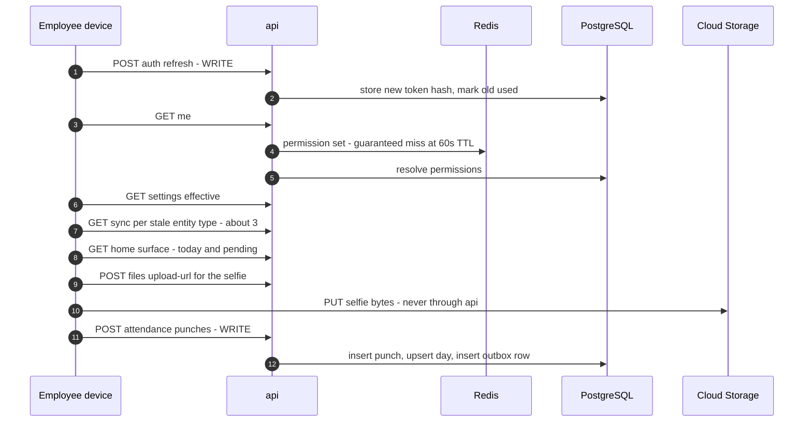

# Performance

Status: Active (Phase 4) · Related ADRs: `ADR-0002` (shared database, RLS, the partitioning note), `ADR-0004` (token rotation), `ADR-0005` (permission cache), `ADR-0007` (envelope, pagination, idempotency store), `ADR-0010` (queues, per-queue concurrency), `ADR-0012` (payroll chunking), `ADR-0013` (Drizzle conventions, the partitioning note), `ADR-0014` (Chromium footprint), `ADR-0019` (no automated metric analysis at promotion — **Proposed**), `ADR-0023` (table growth at the D1 ceiling — **Proposed**) · Source: `HANDBOOK_SPEC.md` §5 D1 and D2, `docs/07-operations/environments.md` §7, §9, §12 (what is configured), `docs/07-operations/observability.md` §3, §4 (what is measured), `docs/03-standards/api-standards.md` §5, §7 (pagination, idempotency), `docs/04-database/database-conventions.md` §7, §10 (index rules, migration rules) · Downstream: none — this is the last file in `docs/07-operations/`

## 1. Scope and seam

**`observability.md` says a budget was missed. This document says what the budget is made of, what must exist for it to be met, and how it is proven at volume before a customer proves it for us.**

Every other Phase 4 document reacts to a number. This one derives them. **Six documents deferred a figure here by name** — environments §1 for *"why that number, and how to tune it"*; testing-strategy §1 and ci-cd §1 for *"load, soak, latency budgets, D1/D2 ceilings, migration lock duration"*; observability §6.5 for the route-level fork; backup-restore §1 for *"the volumes that move these numbers"*; and system-overview §8, from Phase 2, for *"deeper guidance"* — and this is the last file in `docs/07-operations/`, so there is nowhere left to push them.

| This document owns | Owner elsewhere |
|---|---|
| D1 and D2 read at fleet scale: the arithmetic, and what it implies | `HANDBOOK_SPEC.md` §5 states the targets |
| Where the latency budget goes, and what is exempt from it | `observability.md` §3 measures it, §4 alerts on it |
| PostgreSQL timeouts, pool sizing, volume, growth | `database-conventions.md` §7 owns index rules, §10 owns migration rules |
| Redis memory budget and the cache registry | `environments.md` §9.1 owns the policy and the instance |
| Worker concurrency and the render budget | `ADR-0010` owns queue topology, `ADR-0012` owns chunking |
| Sizing **floors**, below which tier stops being a cost question | `environments.md` §7.3, §9, §12 own the values above the floor |
| Migration lock behaviour at volume | `ci-cd.md` §8.2 owns rollout order; `database-conventions.md` §10 owns the workflow |
| Load and soak: what is run, against what, and what passes | `testing-strategy.md` §13 owns every other threshold |
| The server load a client generates | `mobile-flutter.md`, `admin-nextjs.md`, `coding-standards-*.md` own client-side idiom |

Three topics the manifest row named are **quoted here and re-decided nowhere**: index rules are database-conventions §7's five, connection pooling is environments §7.4's arithmetic, and virtual scrolling is admin-nextjs §9's 200-row rule. A fourth document restating them would drift from them on the first edit.

**Reading rule for every number below.** A **derived** number shows its arithmetic inline; check the inputs and you have checked the number. A **chosen** number carries no arithmetic, says so, and names the measurement that supersedes it — almost always §11's rehearsal. A number in this document with no visible derivation is a competent guess, and it is labelled as one.

## 2. The workload

### 2.1 D1 is written per tenant, and that is not the load

D1 fixes the design point: 500 tenants, typical tenant ≤ 2,000 employees, and an attendance spike where **30% of a tenant's workforce clocks in within a 15-minute window**. Every document in the handbook has read that clause per tenant. attendance.md §14's spike test is *"600 concurrent punches for one tenant"* — 600 punches over 900 seconds, **0.7 writes per second**, a number no system needs sizing for.

The fleet reads differently, for one reason: **every tenant is Indonesian**. A-003 puts the whole product in `asia-southeast2`, offices open at the same hour, and WIB carries the large majority of the workforce. WITA and WIT spread the morning by up to two hours; the spread is real and it is small.

So the spike is not 500 independent events. It is one event.

### 2.2 The morning, counted properly

At the design point, 500 × 2,000 gives one million employees. Thirty percent inside fifteen minutes is 300,000 clock-ins over 900 seconds — **333 app opens per second**.

The mistake worth avoiding is stopping there. An employee does not issue a punch; they open an application, which does this before the punch and after it:

| Step | Kind | Why it happens every morning |
|---|---|---|
| `POST /auth/refresh` | **write** | The access token lives 15 minutes (`ADR-0004`); an overnight gap guarantees expiry. Rotation writes a new hash and marks the old used |
| Permission resolution | Redis read, then a database miss | 60-second TTL against a user who appears twice a day — §5.3 |
| `GET /me`, `GET /settings/effective` | reads | Bootstrap (UC-SET-005) |
| Delta pulls for stale entity types | reads | offline-sync §3 pulls whichever `ttlMinutes` expired overnight — assumed **3** |
| Signed URL mint for the selfie | read | `ADR-0009`; bytes go direct to storage, never through `api` |
| Home surface: today's attendance, pending requests | reads | The screen the punch button lives on |
| `POST /attendance/punches` | **write** | One of eight |

Which gives the peak this system is actually sized against:

| Quantity | At peak | Derivation |
|---|---|---|
| App opens | 333/s | 300,000 ÷ 900 s |
| HTTP requests | **≈ 2,700/s** | 333 × ~8 |
| HTTP writes | **≈ 670/s** | 333 × 2 — one refresh, one punch |
| Database write statements | **≈ 1,300/s** | refresh, plus the punch's insert + day upsert + outbox row |

**The punch is one of two writes and one of eight requests.** Anything sized against "333 writes per second" understates the morning by roughly eightfold, and token rotation is exactly as large a write source as the feature the spike is named after.

Two consequences land immediately. **`api` maxes at 6 replicas at 250m** (environments §7.3), a ceiling chosen before this number existed. And **PostgreSQL is not the bottleneck for punches** — §4.3 shows 2,700 requests per second sitting comfortably inside the configured pool, provided one condition holds. The clock-in spike is a Node and autoscaler problem wearing a database problem's name.

### 2.3 Month-end, which is a different peak on the same day

D1's other clause — 10,000 employees in under 30 minutes — is also per run. Per run it is 5.5 employees per second, and `ADR-0012` sized its chunking against exactly that.

At the fleet, one million payslips are produced each month, and Indonesian payroll dates cluster hard. Assuming they concentrate into three working days — **chosen; the tenant base does not exist yet to measure it** — that is 1,000,000 ÷ (3 × 8 × 3,600) ≈ **12 employees per second sustained for three days**, roughly twice the single-run rate, indefinitely rather than for half an hour.

And it is not one workload. A completed payroll run produces payslip PDFs (`ADR-0014`) and payslip-published notifications (notification.md §13), so calculation, Chromium rendering, and fan-out are **one causal chain**, all landing on the single `worker` Deployment that environments §7.1 gives 2 replicas and no HPA. That document named the split trigger as *"payroll CPU starving notification latency"*. §7.3 below shows it is not a hypothesis.

### 2.4 What is not synchronized

Stated so the fleet-coincidence lens is not over-applied. Admin-web traffic is a few hundred people across 500 tenants during working hours and never spikes. Report runs are human-initiated and uncorrelated. Imports are rare and bounded three ways (BR-IMP-007). Leave and overtime requests follow no clock. **Only two workloads are clock-synchronized across the whole fleet — the morning open and the month-end run — and both are the ones D1 named.**

## 3. Budgets

### 3.1 D2 is measured at the server, and this is the first document to say so

observability §3 already defines the read budget as the p95 of `hris_http_request_duration_seconds`, a prom-client histogram inside the `api` process. That is a decision, not a detail: **D2 is server time, from request received to response written.**

Client-observed latency is a different and larger number. A mobile device on a cellular network in Indonesia reaching `asia-southeast2` pays a round trip this document does not own and does not budget. Stated explicitly because the alternative is the recurring conversation where the application feels slow and every dashboard is green.

### 3.2 Where 300 milliseconds goes

| Segment | Cost | Source |
|---|---|---|
| Guards 2–5: throttler, JWT verify, tenant status, permission | **three Redis round trips**, no database queries | backend-nestjs §5; caches at multi-tenancy §2 and `ADR-0005` |
| `BEGIN` + `set_config('app.tenant_id')` | one round trip | multi-tenancy §4 |
| **The query** | **the remainder** | |
| Envelope, serialization, response | payload-dependent | `ADR-0007` |

Within a VPC those round trips are single-digit milliseconds, so **fixed overhead is roughly 10 ms of 300, and about 97% of the read budget is the query itself.**

That is the useful result. **A route missing D2 has one structurally wrong query — an N+1, a missing tenant-first index, an unbounded join — not accumulated overhead.** Five guards costing three Redis reads rather than three queries is worth knowing precisely because the instinct is the opposite, and because the wrong instinct sends an investigation into the middleware chain where nothing is wrong.

Where to look next is observability §6.5's, not this document's. The two rules this document adds, both already owned elsewhere and cited rather than restated: list endpoints load children in one `inArray` or a join, and a repository call inside a loop is a review blocker (coding-standards-nestjs §9); every list endpoint paginates, offset depth caps at `page × pageSize ≤ 10 000`, and `pageSize` never exceeds 100 (api-standards §5, `ADR-0007`).

### 3.3 One class of route is exempt, and the list is closed

D2 excludes batch jobs. It does not cover a route that is synchronous, HTTP, interactive, and legitimately slow — and one exists.

`GET /reports/{key}/result` runs a live query on `api` across 94 registered definitions, with **no cache by design** (BR-RPT-011, A-085), bounded by an `inlineRowCap` and a statement duration. It cannot meet 300 ms and is not supposed to. Meanwhile **OB1 alerts on read p95 across all routes**, so one admin running a report degrades the SLO guarding every other route in the product.

**The exemption list is closed, in the shape environments §12.1 used for `APP_ENV` branches: adding a second member is a conversation, not a commit.**

| Exempt route | Budget instead of D2 | Enforced by |
|---|---|---|
| `GET /reports/{key}/result` | statement duration bound, §4.1 | `RPT_RESULT_TOO_LARGE` with `details.bound = 'duration'` |

**OB1 and OB2 exclude this route by label.** An alert that fires on correct behaviour is the alert that gets muted, and muting OB1 costs the whole SLO.

### 3.4 Payroll's budget needs two clocks

D1 says a run completes in under 30 minutes. `ADR-0010` sets the `payroll` queue to low per-worker concurrency — deliberately, it is heavy CPU. Low concurrency on a queue shared by 500 tenants means month-end runs **wait behind each other**, and nothing in the handbook bounds how deep that gets.

OB16 fires when *"a payroll run exceeds D1's 30-minute budget"* and its triage says *"identify the phase"*. Both readings are broken. If the metric measures processing, a run that waited three hours reports 25 minutes and looks healthy while the customer waited three and a half. If it measures enqueue-to-completion, OB16 is a queue-depth alarm wearing a calculation alarm's runbook.

**Two clocks, on `ADR-0021`'s precedent and backup-restore §3.3's device:**

- **D1's 30 minutes is processing time** — first chunk started to last chunk finished. `hris_payroll_run_duration_seconds` measures this and nothing else.
- **Queue wait is separate and separately reported.** `hris_queue_oldest_job_age_seconds{queue="payroll"}` already exists and already carries it.
- **Customer-visible time is the sum**, and the sum is what gets quoted to a customer.

OB16's triage is amended to establish which clock ran long before anything else, because the remedies are unrelated: a slow calculation is a code or data problem, and a long wait is a capacity problem that §7.2 sizes.

## 4. PostgreSQL

### 4.1 Three timeouts, none of which existed

database-conventions §10 rule 6 routes backfills to `maintenance` jobs when they *"exceed lock/statement tolerances"* — and no tolerance was defined anywhere in the handbook. reports.md names *"the statement timeout"* five times and never gives it a value, while §12 correctly refuses to make it a tenant setting: *"a tenant raising its own query timeout is granting itself a denial of service against a shared database."*

Set per role, because the roles do genuinely different work:

| Setting | `hris_app` (api) | `hris_app` (worker) | `hris_migrator` | Why |
|---|---|---|---|---|
| `statement_timeout` | **5 s** | **300 s** | 0 | A backstop against runaway, not a budget — D2's 300 ms is the budget and §3.2 is how it is met. Batch work legitimately runs long |
| `lock_timeout` | **3 s** | **3 s** | **5 s** | §9.2 — the single most valuable line in this document |
| `idle_in_transaction_session_timeout` | **30 s** | **30 s** | 0 | A leaked transaction holds a connection *and* every lock it took |

All three are **chosen**, superseded by §11's measurement. The one documented override: **`GET /reports/{key}/result` runs at 15 s**, which supplies BR-RPT-010's `limitMs` — a value that mechanism has been waiting for since reports.md was written.

### 4.2 The connection pool has a right-hand side at last

environments §7.4 states the rule as an inequality and left one side blank:

> `DATABASE_POOL_MAX` × maximum replicas + the migrate Job + break-glass ≤ Cloud SQL `max_connections`.

Derived: 10 × 6 `api` + 10 × 2 `worker` + 5 migrate + 5 break-glass = **90**. OB6 alerts at 80% of `max_connections`, so a configuration that trips its own alert at steady state is wrong by construction: `max_connections` ≥ 90 ÷ 0.8 = **113**, and Cloud SQL derives `max_connections` from instance memory. §4.4 turns that into a floor.

### 4.3 The pool is not the constraint — hold time is

Little's Law: concurrency = throughput × hold time. Eighty pooled application connections carry §2.2's peak of 2,700 requests per second if and only if

> mean database hold time ≤ 80 ÷ 2,700 ≈ **30 ms**.

Which reframes OB5 completely. **`hris_db_pool_connections{state="waiting"}` above zero means hold time crossed 30 ms. It does not mean the pool is too small.**

**Raising `DATABASE_POOL_MAX` is the wrong fix, and it is the first thing anyone will try.** It pushes more concurrency onto the database that is already the constraint, converts a fast queue in the application into a slow queue in PostgreSQL, and trades a legible metric for an illegible one. The fix is always the query. observability §6.5's OB5 row is amended to say so at the moment somebody is looking at it.

### 4.4 Sizing floor

environments §12 files Cloud SQL tier under *"cost, not behaviour"*, and that stays true — above a floor. **This document sets the floor below which tier stops being a cost question and becomes a correctness one.**

- **`max_connections` ≥ 200**, derived in §4.2 with headroom, which on Cloud SQL implies a memory floor.
- **8 vCPU / 32 GB in production** — **chosen**. §2.2's peak is roughly 4,000 queries per second and the hot working set is today's attendance days plus employee master plus sessions, which should sit in shared buffers. Superseded by §11.

Staging is unchanged and deliberately smaller; nothing about it predicts this (§11.3).

### 4.5 Volume at the design point

No document has projected row counts, which is why database-conventions §7 rule 4's *"no speculative indexes"* has been unenforceable — nobody could say what "large" meant.

| Table family | Rows per year at 500 × 2,000 | Derivation |
|---|---|---|
| `attendance_punches` | **~500M** | 1M employees × 2 punches × 250 workdays |
| `attendance_days` | **~250M** | 1M × 250 |
| payslip lines | **~240M** | 1M payslips × 12 months × ~20 components |
| `payslips` | ~12M | 1M × 12 |
| `audit_log` | large, **already partitioned monthly** | audit-log.md, 2 years hot |
| notifications, inbox items | large, 12-month purge | database-conventions §4.4 |
| everything else | < 10M | master data and requests |

Punches-per-day and components-per-payslip are **chosen**; the rest is arithmetic over them.

Two of these exceed the audit log, which is the only table anyone thought to partition. `attendance_days` also takes an **upsert per punch**, making it the highest-churn large table in the system and the one place autovacuum behaviour is worth watching — dead tuples accumulate at 333 updates per second during the morning window.

### 4.6 Growth and partitioning

`ADR-0002` and `ADR-0013` both anticipated declarative partitioning by `tenant_id` and both deferred it **to this document by name**, `ADR-0002` adding that it *"may arrive via the performance doc without superseding this ADR"*.

`ADR-0023` discharges that. Summary, with the reasoning there:

- **No partitioning in V1**, with a numeric trigger: a single table crossing **500 million rows**, or autovacuum on `attendance_days` failing to complete between triggers.
- **The date-partition door on `attendance_punches` is already closed.** PostgreSQL requires the partition key to be a subset of every unique constraint, and `uq_attendance_punches_tenant_id_op_id` carries no date column — it cannot, it is an offline idempotency key. Hash by `tenant_id` remains available; range by date does not. `attendance_days` keeps both doors, which matters, because it is the hot read path.
- **Punch retention is a gap this document names and does not fill.** database-conventions §4.4 covers payroll, audit, employee master, operational clutter, and the mobile queue, and omits the largest table in the system. The number is a labour-law question, not an engineering one.

## 5. Redis

### 5.1 Seven caches, invented in seven documents

No document has ever seen them together, and there has been no rule for when a cache is permitted at all.

| Cache | Key | TTL | Invalidation | Serves | Owner |
|---|---|---|---|---|---|
| Tenant status | `hris:tenant:{tenantId}:status` | 30 s | post-commit bust | both | multi-tenancy §2 |
| Permissions | `hris:authz:{tenantId}:{userId}:permissions` | 60 s | post-commit bust | **admin web** | `ADR-0005`, BR-AUTHZ-008 |
| Feature flags | `hris:flags:{tenantId}` | 60 s | post-commit bust | both | UC-ADM-006 |
| Settings resolution | `hris:settings:{tenantId}:{companyId\|-}:{branchId\|-}` | 5 min | post-commit bust | both | BR-SET-009 |
| Org placement | `hris:organization:{tenantId}:placement:{employeeId}` | 5 min | event bust | **admin web** | organization.md |
| Shift verdicts | `hris:shift:{tenantId}:schedule:{employeeId}:{yyyy-mm}` | 15 min | four events | **admin web** | shift.md |
| Dashboard widgets | `hris:dashboard:{tenantId}:{widgetKey}:{scopeDigest}` | 60 / 300 / 3600 s | **TTL only** | admin web | BR-DSH-006, A-090 |

**The table is the registry**, and it follows the protocol the error catalog and the pagination registry already use: **the document that introduces a cache appends its row in the same session.**

Three admission rules, so the eighth cache is a decision rather than a reflex:

1. It serves a hot path whose miss cost is measured or bounded.
2. **The key is tenant-scoped and the RLS transaction still opens on every miss.** BR-DSH-006's rule, generalized — a cache never becomes the reason a tenant boundary is checked once instead of every time.
3. Staleness is bounded, and the bound is disclosed wherever it is user-visible.

**Default invalidation is a post-commit bust with the TTL as backstop**, which is what five of the seven already do. A-090's TTL-only remains the documented exception, for the reason recorded there: a bust per punch is 20–40k handler jobs a morning to delete keys expiring in 60 seconds anyway.

### 5.2 The idempotency envelope is the largest thing in Redis

`ADR-0007` keeps `hris:idem:{tenantId}:{key}` — **the full terminal `(status, body)`** — for **7 days**, on the sound reasoning that offline queues replay late.

At the design point punches are the dominant idempotent mutation. Two million punches a day, held seven days, is **14 million stored response bodies**, and UC-ATT-001 returns the punch *and* the derived day, so each is 1–2 KB. That is **roughly 14 to 28 GB**, in an instance where `maxmemory-policy` is `noeviction` — where filling up does not evict, it **rejects writes**, and `ADR-0010`'s at-least-once guarantee goes with it (environments §9.1).

And offline-sync §5 already states the envelope is not load-bearing:

> *"unique violation on `(tenant_id, op_id)` → the op already landed beyond the Redis window → load the existing row and respond as a replay. **Duplicates are impossible at any TTL, by construction.**"*

**The envelope TTL drops from 7 days to 24 hours.** `ADR-0007` already made it settings-tunable, so no supersession is needed — only the arithmetic explaining why. Residual, stated: a device offline past the window pays one extra database round trip on replay, gets the identical replay envelope, and still cannot create a duplicate. The single largest consumer of the most fragile resource in the system was a latency optimization on a rare path.

### 5.3 Three caches are pure overhead on the employee path

Permissions (60 s), org placement (5 min), and shift verdicts (15 min) are all keyed **per employee**. An administrator clicking through screens for an hour hits them constantly. An employee appears twice a day, so on the ESS path **every one is a guaranteed miss**: a Redis round trip, a database query, and a Redis write, on the hottest path in the system.

This is not a TTL problem. `ADR-0005`'s 60 seconds is a bounded-staleness security property, and changing it would need supersession for a benefit the cheaper fix already delivers. §6.2 is the fix. The `Serves` column above exists so the next cache's admission review asks which access pattern it is for.

### 5.4 Memory budget

Derived per consumer, at the design point, with the §5.2 TTL applied:

| Consumer | Estimate | Basis |
|---|---|---|
| BullMQ queues and job payloads | ~2 GB | eight queues; payroll chunk payloads dominate |
| Idempotency envelopes | **~3 GB** | 2M punches/day × 1.5 KB × 1 day |
| Shift verdicts | ~2 GB | ~2 KB per employee-month, one month live |
| Org placement | ~0.2 GB | 1M × ~200 B |
| Permissions, settings, flags, tenant status | < 0.5 GB | |
| Rate-limit counters, sessions coordination | < 0.5 GB | |
| Dashboard widgets | < 0.5 GB | |
| **Total** | **~9 GB** | |

**`maxmemory` floor: 16 GB in production**, which keeps OB7's 80% threshold well clear of steady state and gives the alert room to mean something. Chosen above the derivation deliberately: under `noeviction` the ceiling is an outage, not a slowdown.

At the original 7-day envelope TTL the total would have been ~27 GB and the floor an instance class higher. **The TTL decision in §5.2 is what makes 16 GB sufficient**, which is why the two sit in the same section.

## 6. The API process

### 6.1 The guard chain is cheap

Five guards, three Redis round trips, zero database queries on the common path (§3.2). Written down because a five-guard chain looks expensive and is not, and because an investigation that starts in the middleware is an investigation that starts in the wrong place.

### 6.2 Permission resolution is lazy

BR-AUTHZ-002 gives every route exactly one of `@RequirePermission(key…)`, `@Public()`, or `@AuthenticatedOnly()`, and BR-AUTHZ-009 resolves data scope in use cases and repositories rather than in guards. Employee self-service routes are `@AuthenticatedOnly()` — there is no permission key to check.

But multi-tenancy §1 has `RequestContext` carrying the effective permission set unconditionally, and whether it is built **eagerly** was never stated. It is the difference between the hottest path in the system paying for a permission resolution and skipping it entirely.

**A route declaring `@AuthenticatedOnly()` resolves no permission set and touches no cache.** The set is materialized on first access, which on that route never comes.

This does not reopen `ADR-0005`: the model, the key grammar, the 60-second TTL, and the post-commit bust are all unchanged. It decides *when* resolution runs, which no document had. On §2.2's peak it removes one guaranteed-miss Redis round trip and one database query from 333 requests per second.

### 6.3 Not owned here

N+1 discipline and repository shape are coding-standards-nestjs §9's. Pagination style per resource is api-standards §6's registry. Which route is slow, and what to open next, is observability §6.5's triage table. This section exists to point at them, not to have a second opinion.

## 7. Workers

### 7.1 Concurrency is bounded per queue, and that is the first move

environments §7.2 keeps one `worker` Deployment and names the trigger to split it. §2.3 shows month-end converges three workloads onto it. The cheapest correct response is not a second Deployment: it is **per-queue concurrency, which `ADR-0010` already owns as in-process configuration** — one values change, no new manifest, no new image.

Payroll's concurrency is set below the pod's capacity so that `notifications` and `maintenance` keep a share of the same process. Splitting `worker` stays the named escalation, with §11's measurement as its trigger.

### 7.2 Payroll capacity

The whole 30-minute budget rests on one number nobody has measured: **per-employee calculation CPU cost**. Every downstream figure is arithmetic over it.

- **Chosen starting value: 50 ms per employee** — PPh 21 TER, BPJS, overtime, proration, and the result write, over settings already resolved for the run.
- One run at D1's rate: 5.5 employees/s × 50 ms = **0.28 cores**.
- **Concurrent-run admission bound: 4**, giving ~1.1 cores of calculation against two pods requesting 500m each with no CPU limit, leaving the remainder for rendering and fan-out.
- Fifth and later runs queue, visibly, on the clock §3.4 separated out.

Every figure here is superseded by §11. The direction of the error is not knowable in advance, which is the honest reason it is a starting value rather than a specification.

### 7.3 The render budget, which does not currently fit

`ADR-0014` places payslip rendering *"outside the 30-minute calculation budget"* — outside it, and until now outside every other budget too.

Chromium costs 100–200 MB of resident memory per render. `worker` has a **1Gi memory limit** and environments §7.3 sets `NODE_OPTIONS=--max-old-space-size` to roughly 75% of it. Chromium is a separate process inside the same cgroup, so:

> 768 MB V8 heap + 200 MB Chromium ≈ 968 MB of a 1024 MB limit → **one concurrent render per pod**, with no margin.

Two pods at roughly one render per second is **~2 renders/s** against §2.3's month-end requirement of **~12/s**. Short by a factor of six, on the workload with the least tolerance for delay: an employee expecting a payslip on payday.

**This is where environments §7.2's split trigger stops being conditional.** The resolution is one of two things and both belong to environments' values file, informed by this arithmetic: raise `worker` memory so more than one render fits, or move `pdf` to its own Deployment where the memory profile is uniform and the fleet is not scaled for Chromium it does not run. **`pdf` concurrency is 1 per pod until one of them happens**, because the alternative is an OOMKill mid-run, and environments §7.3 set memory limit equal to request precisely so that kill is early and legible rather than late and mysterious.

### 7.4 Fan-out is already bounded

Cited, not re-decided. BR-NTF-009 chunks audience sends into jobs of **≤ 500 recipients**, each independently idempotent, and forbids synchronous loops over recipient lists in request paths. BR-IMP-007 bounds imports three ways — 10,000 rows, 20 MB, `.xlsx` only — all checked at parse, and BR-IMP-004 commits in ~200-row batches with a durable resume cursor. Exports stream.

A million payslip-published notifications a month is 2,000 chunk jobs. That is a scheduling load, not a memory or transaction load, and §7.1 is what keeps it from waiting behind payroll on the same pod.

## 8. Scaling

### 8.1 The spike is predictable and the autoscaler is not told

environments §7.3 gives `api` 2–6 replicas on CPU and states **no target utilization** — a configured autoscaler with an undefined trigger. It is set here, because environments §1 deferred *"why that number"* to this document.

**HPA target: 70% of CPU request — chosen**, superseded by §11.

Reaction time is the sum of metrics scrape lag (15–30 s) and Node pod start plus readiness (20–40 s), so **new capacity lands 60–90 seconds after the spike begins**, from a floor of 2 replicas sized for the overnight trough.

**`minReplicas` is derived from the trough, not the peak.** Raising it to hide a 90-second blip pays for six replicas overnight to serve nobody.

### 8.2 The blip is inside OB1's window, and now that is deliberate

OB1 fires only after **10 minutes sustained**. That clause was chosen to stop a p95 over four requests from paging a low-traffic Sunday. It also happens to be what makes a daily 60–90 second autoscaling lag non-paging.

**Recorded here so it stops being luck.** A future edit narrowing OB1's `for` clause now has a stated second reason to consider, and the daily blip is a known, accepted, measured cost on the most visible interaction in the product rather than something discovered from a support ticket.

Scheduled pre-scaling on a WIB floor is the named escalation — environments §9 already reasons in WIB for this exact class of coincidence — and its trigger is the blip exceeding OB1's window, not anyone's discomfort with it.

## 9. Migrations at volume

### 9.1 What each operation costs

The reference an author checks before writing the migration, which is what testing-strategy §16 meant by *"lock duration and behavior at volume belong to file 67"*.

| Operation | Lock | Cost at 500M rows |
|---|---|---|
| `ADD COLUMN` nullable, or with a constant default | ACCESS EXCLUSIVE, instant | metadata only — safe |
| `ADD COLUMN` with a volatile default | ACCESS EXCLUSIVE, held | full table rewrite — hours |
| `DROP COLUMN`, `RENAME`, `DROP INDEX` | ACCESS EXCLUSIVE, instant | metadata only — safe |
| `ALTER COLUMN TYPE` | ACCESS EXCLUSIVE, held | full rewrite — hours |
| `SET NOT NULL` | ACCESS EXCLUSIVE, held | full scan |
| `ADD CHECK`, `ADD FOREIGN KEY` | ACCESS EXCLUSIVE, held | full scan — ship `NOT VALID`, then `VALIDATE CONSTRAINT` separately |
| `CREATE INDEX` | SHARE — **blocks writes** | full build |
| `CREATE INDEX CONCURRENTLY` | does not block writes | two passes, and **cannot run inside a transaction** |

**Index creation on a large table is `CONCURRENTLY`**, which means it cannot ride a transactional migration. It goes in its own migration or a `maintenance` job, using the `-- manual:` convention database-conventions §10 rule 4 already provides. The default generated path is the blocking one, so this is a rule the author must apply rather than inherit.

These are also the tolerances database-conventions §10 rule 6 sends backfills to `maintenance` jobs for. Rule 6 has been correct and unenforceable since it was written.

### 9.2 `lock_timeout` is what makes the pipeline safe

The property that makes a blocked migration severe rather than merely slow: **a waiting `ACCESS EXCLUSIVE` request blocks every query that arrives behind it.** A migration stuck behind one long report does not wait politely — it takes the table down for the duration.

And ci-cd §8.2's ordering is `migrate` Job → `api` rollout → payroll drain gate → `worker` rollout. **The drain gate protects the worker restart. The schema change runs first and is gated by nothing** — so a merge on the 25th applies DDL to a database a payroll run is actively writing to, which is the more dangerous of the two operations sitting outside the gate invented to protect that moment.

**`lock_timeout` on the migration session converts that from an outage into a retry.** The migrate Job is the first pipeline step, so an abort leaves the old application running against the old schema — the cleanest failure state anywhere in the pipeline. The failure message must say the migration could not acquire a lock and name the blocking relation, or somebody will spend an hour debugging the application instead.

**The migrate Job stays ungated**, deliberately. Moving the drain gate ahead of it would make every deploy wait up to 35 minutes for payroll, including the majority carrying no migration at all. **Named escalation:** a migration class that genuinely cannot fail-and-retry declares itself and waits for the drain, classified by §9.1's table.

## 10. Clients

### 10.1 Mobile

The server load an employee app generates is §2.2's table, and it is this document's because no client document owns it. Two rules follow that mobile-flutter.md and offline-sync.md consume rather than restate:

- **The sync registry's `ttlMinutes` is a load parameter, not only a freshness one.** Entity types whose TTL expires overnight all pull at 08:00 together, which is the same fleet coincidence as the punch spike, arriving through a different door.
- **Selfie bytes never traverse `api`** (`ADR-0009`), which is why 333 clock-ins per second cost a signed-URL mint rather than 333 uploads. Restated here only because it is the single largest thing the punch path does *not* do.

Widget build cost, Drift query shape, and list virtualization are coding-standards-flutter §9's and mobile-flutter.md's.

### 10.2 Admin web

The scoping argument first, because it is what keeps this section short. The admin web has no SEO surface, no marketing page, no anonymous traffic, runs on desktop broadband, and is authenticated. LCP and CLS measure things that do not decide whether this product is pleasant to use. **INP does**, because the product is grids, forms, and approval clicks.

- **Initial JS per route: ≤ 300 KB compressed — chosen.** Next.js prints per-route JS on every build, so this is a deterministic, gateable number. It bounds two years of dependency drift, which is the failure that actually degrades an internal dashboard.
- **Interaction-to-render on the shared `DataTable`: measured, not gated.** A Lighthouse-in-CI gate is not deterministic, and testing-strategy §13's zero-retry rule means a flaky gate is either muted or fatal — the same reasoning that excluded the per-merge load gate in §11.2.

**Already correct, recorded so nobody optimizes it away:** there is no HTTP caching on the admin path at all. `Cache-Control: no-store` on every authenticated JSON response (security-standards §4) and no ETags in V1 (api-standards §9) are a security decision — *payroll data must never land in shared caches* — not an oversight. React Query's client cache is the only read cache on this path, by design. The dashboard refetch stampede is likewise already solved: A-090 single-flights every widget.

## 11. Proving it

### 11.1 Two questions, one of which is worth building for

| | Question | Needs |
|---|---|---|
| Capacity | Does §2.2's peak fit in 6 replicas? | Production-sized infrastructure, D1-scale data |
| Regression | Did this change make the punch path slower? | Consistency, not scale |

Only the first justifies machinery in V1, and it is the one every number in this document is waiting on.

### 11.2 The capacity rehearsal

A manual procedure with numeric pass criteria on a named interval, in backup-restore §14's shape rather than a pipeline stage.

- **Where:** a production-sized ephemeral environment, stood up by the existing Terraform root module (environments §13.1) and destroyed after. Not staging — §11.3. Not production — forcing peak load into `ADR-0021`'s service window is a self-inflicted outage, which is the argument backup-restore §14 used to refuse a forced failover drill.
- **Tool: k6.** Scripts are JavaScript, so the team reads them without a fourth language; it runs as a container (D5); it emits Prometheus metrics into the Grafana observability §7 already defines. Rejected: Gatling and Locust, each a new language; Artillery, same language but weak above a few hundred requests per second; JMeter, GUI-first and XML.
- **When:** before the first production release, and on named triggers — crossing a tenant-count threshold, changing the HPA ceiling, changing an instance class, or any change to §7.2's concurrency bound.
- **Scenarios:** §2.2's morning and §2.3's month-end, reusing the smoke journeys' shapes where they overlap so no second test-data vocabulary appears.

**A D1-scale synthetic tenant generator is a real deliverable named here**, because nothing else in the handbook produces one and three separate procedures need it. Rate limits make the alternative illegal rather than merely unrealistic: security-standards §3 caps punches at 12/min per user, so 333 punches per second requires thousands of distinct seeded users, and raising staging's limit is exactly the parity destruction environments §12.2 refused.

Its second consumer is backup-restore §3.2, whose 120-minute clone estimate is explicitly unmeasured and whose measurement needs data volume this generator is the only source of.

**Pass criteria:**

1. Read and write p95 inside D2 at the target rate, excluding §3.3's exempt route.
2. No OB5, OB6, or OB7 at any point in the run.
3. **Per-employee payroll CPU cost measured** — the number §7.2 is guessing.
4. **Render throughput measured** — the number §7.3 says does not currently fit.
5. Database hold time measured against §4.3's 30 ms.

Outputs 3, 4, and 5 replace chosen values in this document. **A rehearsal that changes no number in this file has not been read.**

### 11.3 Nothing per-merge, and staging is not a rehearsal

**No load gate on merge in V1.** At this organization's size it becomes a flaky job, and testing-strategy §13's zero-retry rule leaves only two outcomes — muted or fatal — both worse than absent. Trigger to reconsider: a performance regression reaching production twice.

**Staging cannot answer a capacity question and is not asked to.** Zonal Cloud SQL, Basic Memorystore, one replica of each workload against production's two to six, and two small synthetic tenants (environments §9, §7.3, §14). `ADR-0020` names this document as the owner of *"load characteristics with synthetic data"*, and this is what that ownership amounts to: the synthetic data is generated at scale, into a purpose-built environment, and destroyed.

The honest residual, same as backup-restore §14's: nothing automated enforces a rehearsal at this organization's size, an alert would be wrong because a calendar fact is not telemetry, and a missed rehearsal is an issue with an owner.

## 12. What is deliberately not optimized

Distinct from §13's exclusions: these are load paths that exist today, are understood, and are left alone.

- **Reports run on the primary.** Ninety-four definitions, no cache by design (BR-RPT-011, A-085), competing with §2.2's spike for the same database. The control is §4.1's 15-second statement bound, which is mechanism reports.md already built and was waiting on a number for. A read replica is §13's, with a trigger.
- **The three per-employee caches stay as they are.** §5.3 explains why the fix was §6.2 rather than a TTL change.
- **The morning autoscaling blip stays.** §8.2.
- **No table is partitioned.** §4.6 and `ADR-0023`.
- **`worker` has no HPA.** environments §7.1 refused it for a reason that still holds — a pod blocked on a Redis read looks exactly like a pod with nothing to do — and KEDA on queue depth is the correct instrument whenever the cost of a controller is worth paying.

## 13. Exclusions and future improvements

### 13.1 Excluded from V1

| Excluded | Trigger |
|---|---|
| **Per-tenant performance isolation or QoS** | One tenant's activity measurably degrading another's p95 — see below |
| Read replica | Report query duration correlating with OB1 across unrelated routes |
| Table partitioning | `ADR-0023`'s row count, or autovacuum on `attendance_days` failing to keep up |
| Scheduled pre-scaling | The morning blip exceeding OB1's 10-minute window |
| Per-merge load gate | A performance regression reaching production twice |
| CDN for admin-web assets | Users outside Indonesia — a commercial event before a technical one |

**Per-tenant isolation deserves more than a row.** `ADR-0002` guarantees tenants cannot see each other's data. **Nothing anywhere guarantees they cannot starve each other.** security-standards §3's rate limits are per-user and per-IP; there is no per-tenant limit, quota, or resource class in the system. A tenant at D1's 10,000-employee ceiling generates five times a typical tenant's load against one shared database, one `noeviction` Redis, and one `api` fleet, and is bounded by nothing.

It is listed here rather than left silent because **a reader of multi-tenancy.md will believe it is covered.** "Isolation" means one thing in that document and a reader will hear two. It is also the exclusion most likely to become a commercial commitment before an engineering one — the first contract promising a tenant-level guarantee creates the requirement, exactly as A-121 and A-130 predicted for availability.

**Inherited exclusions, cited with their owners and not re-argued here:** PgBouncer (environments §7.4, A-120), KEDA and splitting `worker` (environments §15.2), report caching and stored results (A-085, BR-RPT-011), a materialized layer under the heaviest report definitions (reports.md §15), ETags and conditional GET (api-standards §9, `ADR-0007`), and automated metric analysis at promotion (`ADR-0019` excluded progressive delivery, so a performance regression is caught by OB1 after deployment and answered by a rollback of depth one).

### 13.2 Future improvements

Continuous capacity validation, which is §11.2's rehearsal run automatically rather than by a human — the same shape backup-restore §16 identified as its own next step, and blocked on the same thing: an ephemeral environment cheap enough to stand up unattended.

A read replica, whose first tenant would be reports and whose seam is already cheap — `ADR-0002`'s `ConnectionProvider` keyed by `TenantContext` means a read-only variant is the same shape, and RLS with transaction-local `set_config` works unchanged on a replica. Worth recording that BR-RPT-011's refusal of caching does not forbid it: sub-second replication lag is not the failure that rule was written against, and `generatedAt` already discloses the staleness reports care about.

Declarative partitioning by `tenant_id` when `ADR-0023`'s trigger fires, and the harder question of what to do about `attendance_punches`, whose date-partition door is closed and whose retention window does not exist.

KEDA on queue depth, replacing §7.1's concurrency bound with a controller once queue latency tracks replica count closely enough that a human is doing arithmetic (environments §15.2 named this first).

Per-tenant metric labels, which A-122 currently forbids for cardinality reasons and which per-tenant QoS would require before it could be enforced or even observed.
