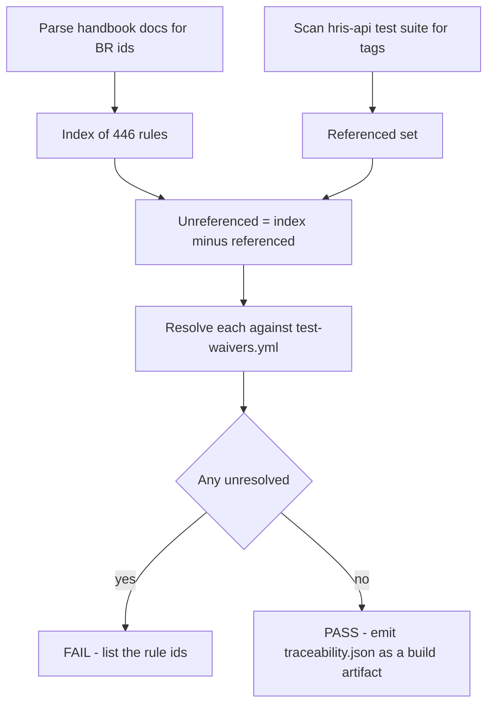
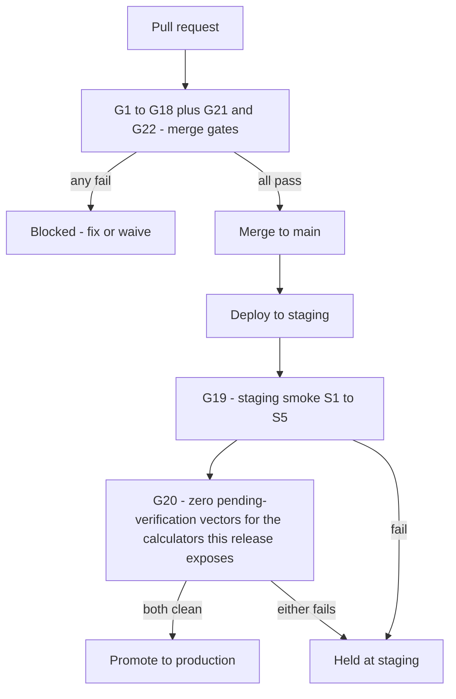

# Testing Strategy

Status: Active (Phase 4) · Related ADRs: `ADR-0002` (two-tenant tests mandatory), `ADR-0005` (permission-matrix tests), `ADR-0006` (assert codes, never messages), `ADR-0007` (envelope, open enums), `ADR-0010` (processor idempotency), `ADR-0012` (calculation engine), `ADR-0016` (encrypted columns), `ADR-0018` (statutory calculation test strategy — **Proposed**) · Source: `docs/03-standards/coding-standards-flutter.md` §9, `docs/03-standards/coding-standards-nestjs.md` §9, `docs/03-standards/coding-standards-nextjs.md` §9 (tiers, tooling, file layout — **not restated here**), `docs/02-architecture/multi-tenancy.md` §5 (leak matrix) · Downstream: `docs/07-operations/ci-cd.md` (consumes §13), `docs/07-operations/performance.md` (load testing), `docs/07-operations/environments.md` + `docs/07-operations/backup-restore.md` (§7 rule 4)

## 1. Purpose, scope, and what this document does not own

The handbook already contains the test scenarios. Every one of the 28 module documents carries a §14 table mapping named scenarios to `BR-*` / `UC-*` ids — roughly 480 rows across 446 business rules and 265 use cases. The three `coding-standards-*.md` §9 sections already fix the tier structure, the tooling per stack, and the file layout. Restating any of that here would produce a document that drifts from 31 source files.

This document owns what nothing else does:

- the numeric coverage targets all three coding-standards documents deferred here;
- the mechanism that turns 446 written rules into 446 enforced ones;
- the shared test kits four anchors promised and none defined;
- how the four statutory calculators are proven correct when their inputs are not yet verified;
- test-data rules that cross repo boundaries;
- the E2E journey list and the cross-repo tier;
- the gate table `ci-cd.md` consumes.

**Seam rule.** This document says **what must pass and at what threshold**. `ci-cd.md` says **where, when, and on which trigger it runs**. A threshold appears in exactly one of the two files, and it is this one.

Not owned, with owners named:

| Concern | Owner |
|---|---|
| Tier structure, tooling, test file layout per stack | `coding-standards-{flutter,nestjs,nextjs}.md` §9 |
| Load, soak, latency budgets, D1/D2 ceilings, migration lock duration | `docs/07-operations/performance.md` — **defined 2026-08-04**: D1 read at fleet scale, D2 decomposed with one closed exemption, and a manual k6 capacity rehearsal rather than a merge gate (§13's zero-retry rule is why) |
| Workflow files, job matrices, caching, artifact retention, branch protection | `docs/07-operations/ci-cd.md` |
| Alert thresholds, Sentry triage | `docs/07-operations/observability.md` |
| Restore rehearsal, DR drills | `docs/07-operations/backup-restore.md` §14 — **defined 2026-08-04**: a quarterly PITR drill to a random timestamp and a semi-annual tenant-extraction drill, both with numeric pass criteria |
| RLS policy-coverage gate against `pg_policies` | `docs/02-architecture/multi-tenancy.md` §4 |
| Dependency scanning, SAST, secret scanning | `docs/07-operations/ci-cd.md` §9 — **defined 2026-08-04**, gates C1–C5 |
| Penetration testing | **undefined — commercial decision, A-103 narrowed to this residual** |
| Manual UAT, release sign-off | **nobody — the org model has no QA role (A-102)** |

## 2. Test tiers

Four tiers. The first three are defined elsewhere and listed here only so the gate table has something to reference; the fourth is defined in §9 and exists only in this document.

| Tier | Scope | Runs on | Blocks | Defined in |
|---|---|---|---|---|
| 1 — Unit | Pure logic: domain, use cases, cubits, hooks, schemas, calculators | Every PR | Merge | flutter §9 · nestjs §9 · nextjs §9 |
| 2 — Integration | Real infrastructure, one repo: Testcontainers PostgreSQL and Redis, in-memory Drift, MSW-backed hooks | Every PR | Merge | nestjs §9 · flutter §9 · nextjs §9 |
| 3 — E2E | One application against a mocked or emulated boundary | Every PR | Merge | §8 here (journeys) · coding-standards §9 (tooling) |
| 4 — Staging smoke | **All three repos, real infrastructure** | Post-deploy to staging | Release promotion | §9 here |

Tiers 1 to 3 are single-repo by construction. Tier 4 exists because nothing else in the system can fail on wire drift: A-011 chose hand-written wire types with no cross-repo codegen, the web E2E tier runs against MSW, and backend e2e has no client. Tier 4 is the only place the three repos meet.

A fifth gate, not a tier: the **release gate** (§6.3, §13) — checks that must be clean to promote a build, but that do not block a merge.

## 3. Coverage targets

Line coverage is a proxy and a known liar — 90% with no assertions is achievable and common. These floors exist because three documents deferred a number here, not because the number is the goal. The gate that binds is the last row.

| Repo | Path | Floor |
|---|---|---|
| `hris-api` | `src/**/domain/`, `src/**/application/` — entities, value objects, use cases, calculators | **90%** |
| `hris-api` | `src/**/infrastructure/`, `src/**/presentation/` | **none** |
| `hris-mobile` | `lib/**/domain/`, cubits and blocs | **85%** |
| `hris-mobile` | widgets, DI composition, Drift generated code | **none** |
| `hris-admin` | `src/lib/`, Zod schemas, query and mutation hooks | **80%** |
| `hris-admin` | components, app shell, route files | **none** |
| All three | **changed lines in a pull request** | **80%** |

**The `none` rows are a decision, not an omission.** A floor on controllers, widgets, and components is how a codebase acquires tests that render a thing and assert nothing — the cheapest way to move a number is to execute code without checking it. Those layers are covered by tiers 2 and 3, where the assertion is the point.

Diff coverage is the real gate: it applies to the code being written now rather than to a repo-wide average that one large untested module can hide inside, and it does not punish a team for inheriting an old gap.

Coverage is measured but **never reported as a quality claim**. The claims this document makes are in §4, §5, and §6.

## 4. Traceability

### 4.1 Tag convention

A test references the rule it proves, verbatim, in a form a parser can find:

```ts
// backend + web
describe('BR-LVE-003: net days exclude non-working dates', () => { /* … */ });
it('BR-PAY-014 — a finalized run refuses recalculation', async () => { /* … */ });
```

```dart
// mobile
@Tags(['BR-HOL-010'])
void main() { /* … */ }
```

A trailing `// covers: BR-ATT-002, BR-ATT-011` comment is equally valid where a single test proves more than one rule. The id is matched by regex `\bBR-[A-Z]{3,5}-\d{3}\b`, so it must appear literally — no interpolation, no constants.

**The traceability matrix is generated, never written.** No table in this document, no table in any module document, lists rule-to-test mappings. The checker produces it on demand.

### 4.2 The BR gate

One gate, in `hris-api`, over all 446 rules.

Business rules are enforced server-side by definition — the clients render a server that already refuses. A rule genuinely enforced only on a device is an exception worth seeing, not a routine case worth modelling, so client repos tag opportunistically and gate nothing.

The checker:

1. parses every `BR-<MOD>-NNN` out of the handbook's `docs/` into an index;
2. scans the backend test suite for tags;
3. resolves anything unreferenced against the waiver file;
4. fails on any rule that is neither referenced nor waived.



`traceability.json` is a build artifact, not a committed file — regenerating it is cheaper than reviewing its diff.

### 4.3 The waiver file

Not every rule is provable by a test. `BR-BPJS-001` asserts an *absence* — a platform table with no runtime write path. `BR-HOL-005` is a database CHECK constraint. Forcing a test for these produces tests written to satisfy a parser.

`test-waivers.yml` lives in `hris-api`, is reviewed like code, and each entry must name the mechanism that enforces the rule instead:

```yaml
- rule: BR-BPJS-001
  mechanism: route-lint
  detail: no write route exists for bpjs_program_rates, bpjs_jkk_risk_rates, bpjs_parameters
  reviewer: backend-lead

- rule: BR-HOL-005
  mechanism: db-constraint
  detail: ck_holidays_branch_requires_company
  reviewer: backend-lead

- rule: BR-HOL-010
  mechanism: covered-in
  detail: hris-mobile test/features/holiday/resolution_test.dart
  reviewer: mobile-lead
```

Legal `mechanism` values: `db-constraint`, `rls-policy`, `route-lint`, `dependency-lint`, `type-system`, `covered-in`. Anything else fails the schema check — "reviewed manually" is not a mechanism.

The waiver file is the useful artifact, not the concession. It converts "we did not test this" into "here is the thing that enforces it," which is strictly more informative than a test, and the `covered-in` entries become the honest register of rules no server test covers. That register is worth reading at the Phase 4 audit.

### 4.4 The error-code gate

**Every code in the error catalog must be asserted by at least one test.** All 172, same waiver file, same review.

This is the other half of a circuit already half-built: error-catalog §1 item 4 requires every code to ship i18n keys, and item 6 requires every code to be referenced by a module document or ADR. Neither proves a code is *reachable*. This gate does, and a dead error code is how a client acquires a translated string for a condition that can no longer occur.

It is also the reason use cases need no gate of their own: a use case's substance is its alternate and exception flows, and those flows terminate in registered codes. A code tag cannot be satisfied by a title string — the assertion has to actually produce the code, which ADR-0006 already requires it to do rather than matching a message.

The first run will find codes nothing raises. Some will be genuinely unreachable and belong in the Deprecated section — that is a finding, not a chore.

### 4.5 Use cases are tagged, never gated

A test may declare `UC-LVE-002` and the checker will index it. Nothing fails. Gating both axes doubles the tagging burden for a weaker signal, because the rules inside a use case are exactly the `BR-*` ids §4.2 already forces.

## 5. Shared test kits

Four anchors promise shared suites — `ADR-0002` and multi-tenancy §5 (the leak matrix as *"a shared test-kit every module instantiates"*), `ADR-0005` (permission-matrix tests per module), `ADR-0010` (double-delivery per handler, mid-run re-execution per processor), `ADR-0006` and `ADR-0007` (codes and envelope shape).

**A kit is a parameterized suite invoked in one line, not a pattern to copy.** A documented pattern degrades — nine leak scenarios become five in the module written on a Friday, and nobody diffs test files across 30 modules.

```ts
describeTenantIsolation({ table: leaveRequests, repository: LeaveRequestRepository, seed: aLeaveRequest });
describePermissionMatrix({ routes: LEAVE_ROUTES, keys: LEAVE_PERMISSION_KEYS });
describeIdempotency({ processor: LeaveAccrualProcessor, job: aLeaveAccrualJob });
describeErrorContract({ routes: LEAVE_ROUTES });
```

**Enforcement:** a module that declares a tenant-class table and does not call `describeTenantIsolation` fails a lint. Same principle as multi-tenancy §4's policy-coverage gate — the check is that the call exists, not that someone remembered.

### 5.1 `describeTenantIsolation`

Expands to the full L1–L9 matrix of multi-tenancy §5, against Testcontainers PostgreSQL with real migrations applied. Seeds **identical data shapes in T1 and T2**, which is multi-tenancy §5's own stated requirement: an isolation bug must not be able to hide behind data asymmetry.

L8 and L9 apply only to modules reachable from a platform or impersonation context and are skipped with a recorded reason elsewhere.

### 5.2 `describePermissionMatrix`

For every route in the module: no token → 401; token without the key → `AUTHZ_PERMISSION_DENIED`; token with the key → pass; token with a **narrower data scope** than the resource → `SYS_NOT_FOUND`, never 403 (error-catalog §2's existence-hiding rule). Discharges `ADR-0005`'s promise of per-module permission-matrix tests including scope leaks.

The three registered 403 exceptions — `PRF_NOT_THE_REVIEWER`, `RPT_SCOPE_INSUFFICIENT`, and the `ADM_` case — are declared per route, so the kit asserts the exception rather than the default.

### 5.3 `describeIdempotency`

Three scenarios per processor, discharging `ADR-0010`: **double delivery** (the same job runs twice, side effects occur once), **mid-run re-execution** (the processor is killed after its first write and re-delivered, converging to the same state), and **`jobId` dedup** where a natural key exists.

For event handlers, the same three against `eventId`.

### 5.4 `describeErrorContract`

Every error response matches `ADR-0007`'s envelope exactly: `success: false`, `error.code`, `error.messageKey === 'errors.' + error.code`, `error.requestId` present. Every success response carries the success envelope. Asserts on **codes and shape, never message strings** — `ADR-0006`'s rule, now mechanical rather than a convention in a coding-standards document.

### 5.5 `describeRegistryIntegrity`

The fifth kit, promised by no anchor and the highest yield per line in this document.

The product is registry-heavy: **172 error codes over 29 prefixes**, **94 report definitions**, **45 notification templates**, **24 widgets over 4 layouts**, **8 fixed queues**, the import and export definition registries, the settings key registry, the permission key registry, the audit action strings, and the currently empty feature-flag registry. Each registry is individually valid and cross-references the others by string. Every break is invisible to `tsc` and fatal at runtime.

Latent failures the design already permits: a `ReportDefinition.requiredPermission` renamed in the permission registry → 403 for everyone, found by a customer. A `WidgetDefinition.reportKey` pointing at a definition later flagged `sensitiveRead` → `ReportQueryPort` refuses, the tile dies. A notification template a processor names but the registry no longer holds → the job exhausts its retry class into the failed set. A job name outside the eight queues → enqueue to nothing.

The suite is pure static cross-checking, needs no database, runs in milliseconds, cannot flake, and gates every PR:

| Check | Asserts |
|---|---|
| Reports × permissions | Every `ReportDefinition.requiredPermission` resolves in the permission key registry and belongs to the declaring `owner` module's namespace — BR-RPT-002 |
| Widgets × reports | Every `WidgetDefinition.reportKey` resolves; **no widget references a `sensitiveRead` definition** — BR-DSH-001, and the dashboard-analytics §14 row that already stated this |
| Codes × catalog × i18n | Every code thrown in code exists in the catalog; every catalog code has `errors.<CODE>` in **both** locales — extends error-catalog §1 item 4 |
| Templates | Every template a processor names exists; channel sets are legal; mandatory templates are not user-disableable |
| Settings | Every key read in code is declared with a type and a scope; no key is read that the registry does not hold |
| Jobs × queues | Every job name's queue is one of the eight fixed queues of `ADR-0010`; every job declares a retry class |
| Imports | Every `ImportDefinition` targets a table its declaring module owns under `ADR-0001` rule 5 |
| Verbs and prefixes | Every route verb is in naming §3's registered set; every error prefix is in naming §4 |

### 5.6 `describeTelemetryRedaction` (added 2026-08-04)

A sixth kit, promised by no anchor and requested by `docs/07-operations/observability.md` §12.

`ADR-0011` bans names, national identifiers, salary amounts, bank data, selfie URLs, and document contents from logs, traces, and Sentry, and names three enforcement routes: Pino `redact` paths, Sentry `beforeSend` scrubbers in all three SDKs, and span-attribute conventions. security-standards §10 holds the single registry all three consume. Until now **all three routes were declared and none were verified.**

This is the one rule in the handbook where a violation is not a bug but a reportable event under UU PDP, and it is durable — a salary logged today sits in Cloud Logging for 30 days and in Sentry for the retention of the plan, with no way to un-log it. The realistic failure is not malice; it is `logger.info({ employee }, 'updated')`, the object spread that logs a whole entity.

Parameterized over security-standards §10 so it cannot fall behind the registry:

| Repo | Check | Asserts |
|---|---|---|
| `hris-api` | Coverage | Every key in the security-standards §10 registry appears in the Pino `redact` paths **and** in the backend Sentry `beforeSend` |
| `hris-api` | Behaviour | A synthetic object carrying every registered key, passed through the **real** logger, emits none of the values |
| `hris-admin`, `hris-mobile` | Coverage | Every registered key appears in that SDK's `beforeSend` scrubber |
| `hris-admin`, `hris-mobile` | Behaviour | A synthetic Sentry event carrying every registered key, passed through the **real** `beforeSend`, emits none of the values |

**The gate runs in all three repositories, each asserting only the scrubber it owns.** A-006 splits the product across three repositories with no shared package, so each holds its own copy of the registry — the same cross-repo duplication A-011 already accepts for wire types, with the same residual: nothing proves the three copies agree. The residual is smaller here than for wire types, because a *missing* key fails that repo's own gate; only a key present in one repo's copy and absent from another's slips through, and it slips through as a redaction that is merely incomplete rather than wrong.

Adding a sensitive field and forgetting its redact path fails a merge gate rather than being discovered in a log. The property that makes this survive thirty modules: a module adding a sensitive field has exactly two obligations — the column and the registry line — because the test derives from the registry.

The complement is **not** a test: observability.md §12.2 adds a quarterly human sample of production log lines and Sentry events, because this suite only catches keys somebody thought of, and registry incompleteness is the more likely of the two failures.

## 6. Calculation correctness

Payroll, tax-pph21, bpjs, and overtime are arithmetic engines whose output *is* the product. A test whose expected values were typed by the person who wrote the calculator proves only that the code does what the code does.

Five module documents already promise "golden vectors" — holiday §4 and §14, shift §4, leave §14, overtime §14, attendance §14 — and no artifact was ever defined. This section defines it. The decision is recorded in **`ADR-0018`** because its audience is a payroll engineer in the implementation repository who will never open this file.

### 6.1 Vector file format

JSON, one file per calculator. Each vector carries its inputs, its expected output, and the authority it came from:

```json
{
  "engine": "tax-pph21/monthly-ter",
  "rateSet": "structural-fiction-v1",
  "vectors": [
    {
      "id": "ter-bracket-boundary-lower",
      "source": "BR-TAX-006 — rate resolved from tax_ter_rates by category and bracket; boundary inclusive at the lower edge",
      "input": { "grossMonthly": "10000000.00", "ptkpStatus": "TK/0", "hasNpwp": true },
      "expected": { "terRate": "0.0200", "withheld": "200000.00" }
    }
  ]
}
```

Two rules with teeth:

1. **A failing vector is a code defect until a human re-verifies the vector against the regulation and records why it changed.** The vector file's git history becomes the audit trail of every statutory reinterpretation the product has made.
2. **A vector is never edited to make a test pass.** Either the calculator changes, or the vector changes with a recorded re-verification. This is the whole value of the artifact.

Vectors are the acceptance artifact a domain expert can review **without reading TypeScript**, which is the only realistic way a payroll engine gets checked by someone who knows payroll.

### 6.2 Structural and statutory vectors are separate files

`CLAUDE.md` forbids inventing regulatory numbers, and every rate in this handbook carries `⚠️ VERIFY`. The statutory tables are seeded by migration (BR-TAX-001, BR-BPJS-001, BR-OVT-009), so the values in a test database are the unconfirmed ones. A golden vector computed against an unconfirmed rate produces a number that **looks like compliance evidence and is not**, and a green suite over it is worse than no suite.

| | Structural vectors | Statutory vectors |
|---|---|---|
| Rates used | A **deliberately fictional** set fixed in the fixture | The real published set |
| What they prove | Logic that is wrong independently of any rate | That the engine reproduces the regulator's own figures |
| `⚠️ VERIFY` | None needed — the rates are admittedly fake | **Per vector** |
| Status | Run and gate every PR | Tagged `pending-verification`, **skipped** |
| Blocks | Merge | **Release promotion only** |

Structural vectors cover: tier boundaries landing on the correct side, proration dividing by the correct denominator, rounding direction and unit, the month-to-date slice combining a THR run with a regular run, the JP age ceiling deriving from birth date, employer premiums reaching taxable assembly, the `wage_category` a component lands in, trace completeness.

### 6.3 The fictional rate set

`structural-fiction-v1` uses values no one could mistake for real: PTKP `100000000`, TER band boundaries on round millions, JKK `0.0100`, BPJS caps at round numbers, an overtime factor of exactly `2.0` in every tier.

**This is the rule to defend.** A structural fixture using *approximately* real rates is the version that quietly becomes the compliance suite — someone finds `PTKP = 54000000`, assumes it is authoritative, and cites a passing test in a compliance conversation. A fictional set cannot be mistaken for one, and an engineer who "corrects" it to a plausible value destroys the property that makes the suite honest. The file header says so.

The statutory vectors carry the marker at vector granularity:

> ⚠️ VERIFY: confirm against current Indonesian regulation before implementation.

Their non-empty `pending-verification` count is printed by CI and **blocks release promotion for the calculators that release exposes** *(scoped 2026-08-04, `ADR-0018` decision 5 — the count turned out to be **119 markers across twenty-seven files**, and read globally it holds every build at staging including a pilot whose BPJS code no path reaches)*. That is what makes verification a concrete, countable task rather than a line in `ASSUMPTIONS.md`.

### 6.4 Where vector files live

**A vector file lives in the handbook repository only when more than one implementation consumes it.** Otherwise it lives beside its single implementation.

Today that rule selects exactly one file. Audited: holiday.md §4 states BR-HOL-002's resolution is *"implemented once server-side and once in shared Dart domain code over the local mirror"*; shift.md §4 explicitly says *"implemented once, server-side"*; the four statutory calculators are server-only.

| File | Home | Consumers |
|---|---|---|
| `docs/07-operations/test-vectors/holiday-resolution.json` | **Handbook** | `hris-api` and `hris-mobile`, each reading it in place from the `docs/handbook/` submodule *(2026-08-05, `ADR-0025` — was "vendoring a copy with a `sha256` equality check in CI"; the pin is the equality guarantee and ci-cd **C8** is retired)* |
| `payroll-*.json`, `tax-*.json`, `bpjs-*.json`, `overtime-*.json` | `hris-api` | One |

The one file that gets the sync is the one that needs it: BR-HOL-010's reducer decides attendance day type **offline, on the device**, so a divergence between the two implementations writes wrong attendance records that no server test can see. A second implementation of any pure function moves its vectors up — that is the rule's own trigger.

### 6.5 Property-based tests

`fast-check`, backend only, five named properties. Not a general practice — a fixed list where the input space is arithmetic and the invariant is exact. All five are rate-independent, so they run against the fictional set and gate every PR.

| # | Property | Anchors |
|---|---|---|
| P1 | The sum of rounded component parts equals the rounded whole | `ADR-0012`, payroll §4 |
| P2 | For any duration, the overtime tier walk covers it with no gap and no overlap | BR-OVT-009 |
| P3 | For any month and any hire or exit date, a prorated amount lies in `[0, full]` and is monotonic in days worked | payroll §4 |
| P4 | For any date range, net leave days ≤ span, and adding a holiday never increases it | BR-LVE-003 |
| P5 | Gross-up never decreases tax; the bracket and TER walks are monotonic in gross | tax §4 |

These find the boundary an example vector failed to imagine. Roughly eighty lines for the product's highest-consequence arithmetic.

### 6.6 Rendered output — G21 (added 2026-08-04)

A correct number inside a broken PDF is still a wrong payslip, and `ADR-0014` owed a "golden-render diff" that had no home until `ci-cd.md` was written. It lands here, because it is a threshold.

One fixture payroll run renders one payslip and one 1721-A1, and the assertions are **structural, not visual**: expected page count, every required label present, every total present and matching the run's computed values, and no overflow or truncation marker. Backend tier 1, gating every PR; `ci-cd.md` §5 maps it to a job.

**Pixel diffing is rejected.** A Chromium version bump changes font hinting, so the baseline breaks on upgrades unrelated to the template, and the team learns to re-bless baselines without reading them — the same reasoning that rejected a visual-regression service in §14.2, applied to a surface where the failures that matter are a missing field, a blank page, or a wrong total. Text extraction catches all three; a pixel diff catches them alongside noise.

## 7. Test data and fixtures

Statutory tables arrive free — they are seeded by migration, so Testcontainers has them without fixture work. That is also the problem the first rule answers.

**Rule 1 — no integration or e2e test asserts a money amount.** Amounts are asserted only by the golden vectors of §6. An integration test asserting `4382500` against a migration-seeded unverified rate encodes that unverified number where nobody will look when the rate is corrected, and it will keep passing for the wrong reason. Integration tests assert **structure and flow**: the line exists, its `wage_category` is correct, the trace has the expected entry count, the ledger balances against itself, the run reached `calculated`.

**Rule 2 — builders are deterministic.** No `faker`, no randomness, injected `Clock`, fixed UUIDv7 seed. A test that fails one run in fifty because a generated value hit an edge is a flake §12 will quarantine and nobody will diagnose.

**Rule 3 — the two-tenant seed lives in the isolation kit.** Modules pass row shapes; the kit seeds T1 and T2 identically. No module writes its own two-tenant fixture.

**Rule 4 — fixture identifiers are structurally valid and obviously fake, and production data is never copied into any test or staging environment.** NIK, NPWP, and bank account numbers in fixtures use reserved or invalid ranges that still satisfy format validation, so a validator is exercised without a real identifier existing outside production.

This is a hard rule, not a preference. `ADR-0016` encrypts these columns precisely because they are the regulated data. A staging database seeded from a production dump reproduces every one of them outside the controls that protect them — into the staging smoke tenant of §9, into CI logs, and onto every laptop that has ever restored a dump. The anonymization path for any production restore used outside production belongs to `docs/07-operations/environments.md` and `docs/07-operations/backup-restore.md`; this document states the prohibition, those files own the mechanism. **Discharged 2026-08-04, by refusal:** `environments.md` §14 and `ADR-0020` build no anonymization path at all. `ADR-0016` already blocks one — the regulated columns are ciphertext under a per-tenant DEK wrapped by a *production* KMS key, so a staging restore either decrypts nothing or is granted production KMS access — and an anonymizer is a column allowlist that fails open the first time a migration adds a sensitive column nobody remembers to scrub. The need behind every such request is met instead by a **PITR restore into a temporary instance inside the production project**, read and then destroyed, so the data never crosses the boundary and there is nothing to anonymize.

## 8. E2E journeys

The tier is a **closed, numbered list**. Every "critical paths only" tier becomes a fat one by month four, one reasonable-looking pull request at a time, and then the pipeline takes forty minutes and people re-run it until it goes green.

**Enforcement is by filename.** Spec files are named `E3-permission-hidden-nav.spec.ts` and `M2-offline-punch-drain_test.dart`; a check asserts the set of prefixes on disk equals the set below. Adding a journey means editing this document, which is the intended friction.

### 8.1 Admin web — Playwright, MSW-backed

| # | Journey | Asserts |
|---|---|---|
| E1 | Login → tenant picker → employee grid | Session established, `ADR-0004` picker, grid renders |
| E2 | Grid filter → URL roundtrip → browser back | Filter state lives in the URL, back restores it |
| E3 | Permission-hidden navigation | A user without a key sees no nav entry and gets a 404 shell on direct URL entry |
| E4 | One form happy path with server validation | Zod client errors, then a 422 envelope mapped onto the correct field |
| E5 | Approval decision | Submit → chain renders → approver decides → inbox item clears |
| E6 | Payroll run: create → snapshot → calculate → finalize → payslip visible | The money path renders end to end |

E1 through E4 are the four already fixed by nextjs §9. E5 and E6 are added on one criterion: a whole-system failure no single-repo tier can see.

**Scope honesty.** These run against MSW, so E5 and E6 prove the **UI journey** — that the screens compose, the states render, the navigation holds. Their substantive assertions — the chain actually resolves, the inbox item actually completes, the notification is actually enqueued, the payslip row actually exists — are **backend e2e assertions** in the tier nestjs §9 defines, over supertest and Testcontainers. Neither tier alone proves the journey; §9 is where they meet.

### 8.2 Mobile — `integration_test` on emulator

| # | Journey | Asserts |
|---|---|---|
| M1 | Login → PIN or biometric unlock | `ADR-0004` local-only unlock, encrypted database opens |
| M2 | Punch offline → reconnect → queue drains → synced | `ADR-0003`'s core claim for the punch sync class |
| M3 | Logout with pending operations → prompt | The queue is not silently discarded |
| M4 | Leave request offline → queue → drain → server verdict reconciles | The **request** sync class, which M2 does not exercise |

M1 through M3 are flutter §9's three. M4 is added because the punch class and the request class converge differently — a punch is accepted, a request receives a verdict that may contradict the optimistic local state.

**Deliberately absent: no E2E for reports or dashboards.** Both are read surfaces over registries §5.5 already gates statically, and an E2E there would assert that a table renders rows a mock returned.

## 9. Staging smoke suite

Tier 4. Five journeys, running after every staging deployment against the real API, real PostgreSQL, real Redis, and the FCM sandbox.

| # | Journey | Catches |
|---|---|---|
| S1 | Health and version endpoints across all deployed services | A service that started but cannot reach a dependency |
| S2 | E1 against the real API | Auth wire drift, envelope drift |
| S3 | E5 against the real API and a real worker | Approval chain wire drift; the outbox relay actually relaying |
| S4 | E6 against the real API through to a generated payslip | Job pipeline, document storage, signed download |
| S5 | M2 against the real API from an emulator | Sync contract drift, `Idempotency-Key` replay |

**Tenant discipline.** The smoke suite runs on a dedicated tenant that the job **resets and reseeds before each run**. A smoke suite that accumulates state becomes a suite that only passes on Tuesdays, and then a suite people disable. The reset mechanism is `ci-cd.md` §12: a `smoke:reset` **Job, never an HTTP route**, double-guarded on environment and tenant slug, reseeding through system-administration §5.3's real provisioning path rather than a bespoke fixture — a smoke suite running on differently-shaped data tests a system that does not exist.

**It fails after merge.** That is the honest cost of keeping pull requests fast, and it is the tradeoff `ci-cd.md` inherits: a smoke failure blocks promotion to production, not the merge that caused it. If drift starts being caught here regularly, the upgrade path is to run tier 3 against a real backend in CI — deferred now because it doubles E2E cost and flake surface for a failure mode that has not yet occurred.

## 10. Contract drift gate

backend-nestjs §10 exports the OpenAPI JSON as a build artifact and calls it *"the reviewable API contract between the three repos."* Both clients hand-write their wire types (A-011, A-012 — no codegen). So today nothing diffs it.

**A breaking-change gate runs in `hris-api`, and only there.** Each pull request generates the spec and diffs it against the last released one, failing on:

- a removed path or operation;
- a removed response field, or a response field becoming nullable;
- a **narrowed** enum;
- a new required request field, or a required field's type changing.

Passing requires either fixing the change or incrementing the URI version, which `ADR-0007` already establishes as the sanctioned escape for a breaking change.

Two rules the gate must encode, both from the handbook rather than from a differ's defaults:

- **Adding an enum value is never a break.** `ADR-0007` declares open enums and both clients map unknown values to a domain `unknown` case (flutter §7). An off-the-shelf differ flags this, and a check that cries wolf on every legal change trains everyone to ignore it.
- **The whole surface versions together** (`ADR-0007`), so the diff is per-version, not per-path.

One check, one repo, no client-side path manifest, pointed the right way: the danger is the backend silently breaking two clients. The residual is stated — a client can still fall behind the published spec, and nothing catches that until S2 through S5 run.

## 11. Accessibility testing

design-system §8 is a binding WCAG 2.1 AA checklist and §13 assigns most of it elsewhere: contrast to a token-file script, icon sets and status-chip usage to review. Exactly one row lands here — *"Reduced-motion + focus-visible present — E2E/widget test samples."*

| Surface | Check |
|---|---|
| Admin web | `@axe-core/playwright` over the E1–E6 pages, failing on **serious and critical only**; moderate and minor are advisory |
| Admin web | A `prefers-reduced-motion: reduce` Playwright project asserting transitions collapse to a fade ≤ 100 ms (design-system §6) |
| Admin web | Keyboard traversal of each E2E journey: every interactive element shows a visible focus ring |
| Flutter | Goldens in **both themes** (already flutter §9) plus `MediaQuery.disableAnimations` widget tests |
| Flutter | `Semantics` label assertions on the kit widgets design-system §8 item 6 names: status chips, punch button, sync state indicators |

Contrast is deliberately excluded: §13 assigns it to the token script, and asserting it again in a browser is a second implementation of the same check against the same source values.

**The automated tier is a floor, not a conformance claim.** Automated tooling catches roughly a third of WCAG issues. design-system §8 remains a review checklist, and a green axe run is not evidence of AA conformance.

## 12. Flake policy and quarantine

**Zero retries on every merge-gating tier.** Playwright defaults to `retries: 2` in CI; that default is disabled deliberately. It is the most common way a real intermittent defect becomes permanently invisible — a race that fails one run in five passes on retry forever, and the test that was catching it now certifies it.

**Retries are allowed only on the staging smoke suite** (§9), which fights real network, real DNS, and real FCM, and does not block a merge.

Handling:

- A test that fails intermittently is **quarantined within one working day** — explicitly skipped, never deleted, with a tracker issue id and an expiry date inline.
- The quarantine list is a committed file, **capped at 10 entries**. A suite exceeding the cap fails the pipeline.
- An **expired** entry fails the pipeline too. Without that, quarantine becomes a graveyard.

Consequence, intended: a genuinely flaky third-party interaction in a merge-gating tier must be **mocked or moved to smoke**, not retried.

## 13. Gate summary

The table `ci-cd.md` consumes. This document fixes the threshold and the blocking level; that document fixes the trigger, the runner, and the workflow.

| # | Check | Tier | Threshold | Blocks |
|---|---|---|---|---|
| G1 | Unit suites, all repos | 1 | All pass | Merge |
| G2 | Layer coverage floors | 1 | §3 table | Merge |
| G3 | Diff coverage | 1 | ≥ 80% of changed lines | Merge |
| G4 | BR traceability gate | — | 446 referenced or waived | Merge |
| G5 | Error-code reachability | — | 172 asserted or waived | Merge |
| G6 | Registry integrity | 1 | All cross-references resolve | Merge |
| G7 | Structural golden vectors | 1 | All pass | Merge |
| G8 | Property tests P1–P5 | 1 | All pass | Merge |
| G9 | Tenant isolation kit L1–L9 | 2 | All pass, every tenant-class module | Merge |
| G10 | Permission matrix kit | 2 | All pass | Merge |
| G11 | Idempotency kit | 2 | All pass | Merge |
| G12 | Error contract kit | 2 | All pass | Merge |
| G13 | Destructive-operation class | 2 | §14 rules | Merge |
| G14 | OpenAPI breaking-change gate | — | No break within the version | Merge |
| G15 | E2E journeys E1–E6, M1–M4 | 3 | All pass, zero retries | Merge |
| G16 | Journey filename check | — | Disk set equals §8 set | Merge |
| G17 | Accessibility, serious and critical | 3 | Zero | Merge |
| G18 | Quarantine cap and expiry | — | ≤ 10, none expired | Merge |
| G19 | Staging smoke S1–S5 | 4 | All pass | **Release promotion** |
| G20 | Statutory vectors pending verification | — | Count = 0 | **Release promotion** |
| G21 | Payslip render check | 1 | Structure asserted, all labels and totals present | Merge |
| G22 | Telemetry redaction kit (§5.6) | 1 | Registry fully covered, zero values emitted | Merge |



The two release gates are the ones that cannot be merge gates: smoke needs a deployment to exist, and G20 is waiting on human verification of Indonesian regulation, which no pull request can supply.

## 14. Destructive operations, exclusions, and future improvements

### 14.1 Destructive-operation class

Counted: **26 crons, of which 10 delete data** — `announcement.purge`, `audit.archive`, `auth.purge-auth-tokens`, `auth.purge-dead-sessions`, `document.purge`, `document.staged-sweep`, `import-export.purge`, `inbox.purge`, `notification.purge`, `recruitment.candidate-purge` — plus every forward-only migration.

*Corrected 2026-08-04 (observability.md session): this said 27. The extra entry was `cron.contract-reminder.scan`, which appears only as an illustration in `ADR-0010` §"Scheduling" and was written before employee.md registered the real job as `cron.employee.contract-scan`. The registered set across all module documents is **26**, which is also the set `observability.md` OB14 covers.*

Nothing above covers them. The idempotency kit proves a purge can run twice safely; it says nothing about whether the predicate is right, and a purge with an inverted date comparison is perfectly idempotent and catastrophic. Testcontainers applies migrations to an **empty** database, so `ALTER TABLE … SET NOT NULL` on a populated table passes CI and fails in production.

**Rule 1 — every purge or archive job is tested two-sided.** Seed rows on both sides of the retention boundary, plus rows of the same shape in T2. Assert the expired rows are gone, **the in-window rows are present**, and T2 is untouched. A one-sided "the old row was deleted" test passes for a job that deletes everything.

**Rule 2 — migrations are applied forward from the previous release's schema, with data present.** One CI job: restore the last release's schema snapshot, apply the two-tenant seed, apply pending migrations, assert success and that seeded rows survived. Catches the populated-table `NOT NULL`, the unique index over existing duplicates, and the backfill that skipped a tenant.

The seam with `performance.md` stays clean: this asserts a migration is **correct against data**; lock duration and behavior at volume belong to file 67, **where §9.1 now carries the DDL cost table** — which operations are metadata-only, which rewrite, which scan — plus the `lock_timeout` that bounds them and the rule that a large-table index must be built `CONCURRENTLY` and therefore cannot ride a transactional migration. And it is a different question from `drizzle-kit check`, which detects drift between schema code and migration files and never touches a row.

### 14.2 Excluded from V1

| Excluded | Reason | Assumption |
|---|---|---|
| Mutation testing | Hours per run at this repo size, and the defect it targets — assertion-free tests inflating coverage — is attacked more directly by G4, G5, and human-reviewed vectors | A-099 |
| Visual regression service (Chromatic, Percy) | design-system §13 assigns contrast to a token script and the rest to review; a screenshot service adds a subscription, a baseline-approval workflow, and a new flake source | A-100 |
| Device farm (Firebase Test Lab) | Emulator in CI plus one physical device checked by hand per release; the trigger to revisit is a device-specific defect actually shipping | A-101 |
| Manual UAT / release sign-off gate | The org model has no QA role; inventing a gate here would invent a person | A-102 |
| Penetration testing | A commercial decision with none scheduled for V1. The scanning half of this row was closed 2026-08-04 by `ci-cd.md` §9 | A-103 (narrowed) |

### 14.3 Future improvements

- **Tier 3 against a real backend in CI**, replacing MSW, once staging smoke starts catching wire drift regularly — the §9 upgrade path.
- **Consumer-driven contract tests** if the client count grows beyond two or the backend team splits; today the §10 gate covers the same failure at a fraction of the infrastructure.
- **Generated API clients** from the OpenAPI artifact, which A-011 already describes as additive and adoptable later. It would retire §10's gate rather than extend it.
- **Load and soak suites** — `performance.md`, file 67 §11, defined 2026-08-04.
- **Verification of the statutory vector set**, tracked by G20's count rather than by prose. Reaching zero is the concrete definition of "the calculators are ready".
