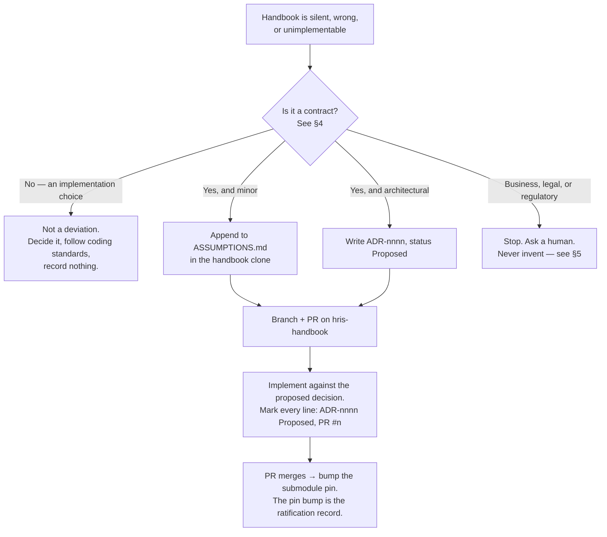

# AI Development Guide

Status: Active (Phase 4) · Source: `HANDBOOK_SPEC.md` §14 · Related: `docs/adr/ADR-0025-handbook-distribution-and-deviation-path.md` (distribution, namespace, contract authority), `docs/adr/ADR-0006-result-pattern-error-handling.md` (commissions this file as a checking mechanism), `docs/03-standards/naming-conventions.md` §13 (commissions the pairs) · Downstream: `docs/08-ai-guide/implementation-claude-md-template.md` · Checked by: `scripts/guide-check.mjs`

## 1. What this is, and what it is not

This file is read by an AI assistant implementing HRIS in `hris-api`, `hris-admin`, or `hris-mobile`. It is **not** a fourth copy of the coding standards.

Nine of the ten rule areas `HANDBOOK_SPEC.md` §14 names already have an imperative home: `coding-standards-{nestjs,nextjs,flutter}.md`, `naming-conventions.md`, `database-conventions.md`, `testing-strategy.md`, and the six `docs/02-architecture/` documents. Restating them here would produce a copy that drifts from the original, and the copy is always the one a reader trusts. So this file carries only what exists nowhere else:

- **How to read the handbook before writing code** (§2), because 83 files and ~23,500 lines do not fit in one context and nothing said which ones matter.
- **What to do when the handbook is wrong, silent, or unimplementable** (§3), across a repository boundary the agent cannot commit to.
- **Which parts of the handbook code must not contradict** (§4), and which parts were never the handbook's to decide.
- **What to do at a `⚠️ VERIFY` marker** (§5) — 121 of them, and an agent must not resolve one.
- **A pointer index to every rule** (§6). Pointers, not restatements.
- **Compliant/violation pairs** (§7), for the narrow set of rules where a pair carries information the rule itself does not.
- **The checks that keep all of the above true** (§8).

### 1.1 When a pair earns its place

`HANDBOOK_SPEC.md` §14 asks for a compliant and a violation example per rule. Applied to every rule in the handbook that is roughly 200 pairs, most of them noise. Two conditions decide it, and both must hold:

1. **A model's prior fights the rule.** An assistant trained on public NestJS code reaches for `throw new BadRequestException`. It does not reach for a floating promise. The first needs a pair; the second is already what the model would write.
2. **No automated check catches the violation.** A lint error teaches faster than prose and never drifts. `console.*`, `parseFloat` on money, `new Date()` in domain code, `riverpod` in `pubspec.yaml` — all already fail a build (`coding-standards-*.md` §10). Those get an index row in §6, not a pair.

What survives is the violation that **passes CI green**: `Promise.all` over repository calls inside one transaction, a use case injecting a sibling, a repository reaching into another module's table. Roughly fifty rules, listed in §7.

## 2. Reading protocol

**This section is mandatory before writing code.** `CLAUDE.md` in each implementation repository gates on it by name — see `implementation-claude-md-template.md`.

**Two files are named `CLAUDE.md` in every implementation repository, and only one is yours.** The repository root file instructs an implementer. `docs/handbook/CLAUDE.md` instructs a *handbook author* — it says to read `PROGRESS.md`, to generate one large document per task, and never to bulk-generate the handbook. None of it applies to writing product code. *(Six pair rows in §7 cited `CLAUDE.md` as their authority until 2026-08-05; they now cite the architecture document or ADR that owns each rule, which is where an implementer can act on it.)*

The handbook is mounted as a pinned git submodule at `docs/handbook/` (ADR-0025). Every path in this document is handbook-relative; from an implementation repository, prefix it — `docs/06-modules/leave.md` is `docs/handbook/docs/06-modules/leave.md`. If that directory is empty, **stop**: the submodule was not initialised (`git submodule update --init`), and any work done without the anchors will be wrong in ways nobody catches at review.

### 2.1 What to read

| Order | Read | Why |
|---|---|---|
| 1 | `CONTEXT.md` (360 ln) | The glossary. Naming a concept the project does not use is the first thing a reviewer sees. |
| 2 | `docs/adr/` — **all 25, in full** (2,000 ln) | See §2.2. |
| 3 | Your stack's pair: `docs/02-architecture/backend-nestjs.md` + `docs/03-standards/coding-standards-nestjs.md` (or `admin-nextjs` + `coding-standards-nextjs`, or `mobile-flutter` + `coding-standards-flutter`) | Architecture fixes the boundaries; coding standards fix how code inside them is written. |
| 4 | `docs/03-standards/naming-conventions.md` (238 ln) | Every identifier you are about to create. |
| 5 | Cross-cutting for your stack: `docs/03-standards/api-standards.md` and `docs/04-database/database-conventions.md` (backend); `docs/03-standards/design-system.md` (admin, mobile); `docs/02-architecture/offline-sync.md` (mobile) | |
| 6 | **The module document for the feature**, in full | `docs/06-modules/<module>.md` or `docs/05-platform/<module>.md`. Find it via `naming-conventions.md` §4's module registry. |
| 7 | For each port, event, or error code the module document names **in the sections you are implementing** — that symbol's declaration only | See §2.3. |

Roughly **3,300 lines before the module document**, and 3,400–3,900 with it. That is the budget. It is not negotiable downward: skipping step 2 or step 6 is how an agent re-decides something ADR-0002 settled.

### 2.2 The ADR corpus is read whole, never selected

25 files, 2,000 lines — about 1.4 module documents. Selective reading costs more logic than it saves context, and there is no safe subset: the most-cited ADR appears in 24 of 28 module documents and the rest is a flat tail, so any "top N" rule silently drops a decision some module depends on.

`Accepted` overrides `Proposed`. A `Proposed` ADR is still binding on new code — it is the current decision, awaiting ratification, and contradicting it is divergence, not initiative.

### 2.3 Dependency modules are never read whole

A module document's `Depends on:` header lists its domain dependencies. Following that list at full depth costs another 3,600–4,400 lines, and almost all of it is prose the feature never touches — `leave.md` depends on `employee.md`, but a leave feature needs the shape of one port, not employee's 620 lines.

**Read the entry module in full; resolve its dependencies by symbol.** The module document names the symbol that matters at the point it matters — *"`ShiftQueryPort` — the working-day test"* — so:

```
grep -rn "ShiftQueryPort" docs/handbook/docs/
```

Grep by **name**, not by section number. Port declarations are not in a consistent place: they appear under `4.2 Ports served`, `4.3 Ports consumed`, `4.4 Ports and reads consumed`, `4.5 Ports consumed`, `4.2 Ports (the consumer contracts)`, and `employee.md` declares `EmployeeStatusPort` in §13. Several module documents have no Ports heading at all. A name resolves regardless; a section citation does not.

**Read the hit, do not count it.** Module documents state which ports they *decline* as emphatically as which they consume — `asset.md`, `bpjs.md`, `expense-reimbursement.md` and `tax-pph21.md` each say **No `PeriodLockPort`** in bold, with the reasoning. A grep that treats a match as a consumer gets all four backwards. *(This is not hypothetical: the row 73 audit inherited a finding claiming those four consumed the port undeclared, produced by exactly that mistake.)*

### 2.4 Registries are grepped, not read

You do not read a catalog, you look up in it. Grep these; never load them whole:

| Registry | Lookup |
|---|---|
| `docs/03-standards/error-catalog.md` | Does this code exist? What is its HTTP status? |
| `naming-conventions.md` §4 | Which module owns this namespace? |
| `naming-conventions.md` §5, §6, §7, §8, §9, §10 | Permission keys, domain events, queues, Redis keys, settings keys, i18n keys |
| `docs/07-operations/environments.md` §6 | Does this environment variable exist? |
| `ASSUMPTIONS.md` | Has this gap already been decided? |

`CONTEXT.md` is the exception — it is read in full, because vocabulary shapes every line you write, not just the line that looks it up.

## 3. Deviation protocol

There is **one ADR namespace**, and it lives in the handbook (ADR-0025). Implementation repositories do not have their own `docs/adr/`, and they do not have their own `CONTEXT.md`. Two numbering schemes would mean `ADR-0002` names two different decisions depending on which repository you are standing in.

`docs/handbook/` is a **full clone**, not an export. You can write in it.



Rules, in order of how often they are broken:

1. **Never diverge silently.** A code comment explaining why the handbook is wrong is not a record — nobody indexes comments. The record is an ADR or an `ASSUMPTIONS.md` row, on a branch, in a pull request.
2. **PR only, never a direct push to `hris-handbook`.** The handbook carries branch protection like the other three repositories. An agent with push rights to the source of truth is one bad loop away from rewriting the anchors.
3. **You do not block.** Write the ADR, open the PR, implement against it. Waiting for a human to merge before writing code turns every discovered gap into a stalled task.
4. **Mark the code.** `// ADR-0025 (Proposed, PR #41)` on every line that depends on the unratified decision. If the PR is rejected, that marker is the grep that finds everything to revert. Without it, rejection means an archaeology exercise.
5. **The submodule pin bumps only when the PR merges.** That bump is the ratification record — it says, in one reviewable commit, that this repository now builds against a handbook containing this decision.
6. **New domain term → `CONTEXT.md`, same PR.** New error code → `error-catalog.md`, same PR. The handbook's same-session registry rule crosses the repository boundary unchanged: the pull request that introduces a term or a code adds its registry row.

### 3.1 Superseding an Accepted decision

Do not. Surface it: state which ADR you contradict, why, and what the alternative costs — then stop and let a human decide. Amending an `Accepted` ADR is a supersession, and a supersession has downstream documents to update. That is a human's call and a separate task, not a side effect of a feature.

## 4. Contract authority

The handbook is authoritative for **contracts**. It is silent on **implementation**.

| Module document section | Authority |
|---|---|
| §2 Actors & Permissions — permission keys | **Contract.** Code must match. |
| §3 Business Rules — `BR-*` | **Contract.** |
| §4 Domain Model — Drizzle schema, state machines | **Contract.** |
| §7 API — endpoints, request/response shapes | **Contract.** |
| §8 Validation Rules | **Contract.** |
| §11 Module Error Codes | **Contract.** |
| §12 Background Jobs & Events — queue names, event names, payload shapes | **Contract.** |
| §5 Use Cases, §6 UI Flow, §9 Edge Cases, §14 Test Scenarios | Behaviour it describes; the code is where it is true. |
| Anything about class layout, file organisation, helper shape, internal naming | **Never the handbook's to decide.** Not drift. Record nothing. |

Code diverging from a contract row is a **defect**, and it takes §3's path — the fix is a handbook PR, whichever side turns out to be wrong. Code differing from the handbook on an implementation detail is not drift, because the handbook never made a claim there.

This matters because the handbook is pinned and the code is not. Without this split, either every internal refactor owes an upstream PR (nobody would comply), or the handbook quietly becomes fiction and §2 starts instructing agents to trust a stale document.

### 4.1 What is checked mechanically

| Contract | Check | Where |
|---|---|---|
| Error codes | Error-code ↔ catalog ↔ i18n completeness — reads the handbook directly under ADR-0025 | already in `coding-standards-nestjs.md` §10 |
| Permission keys | `@RequirePermission` is already statically scanned by route lint (`backend-nestjs.md` §5); extend the scan to compare against the handbook's §2 matrices | `hris-api` CI |
| Drizzle schema | `scripts/erd-check.mjs` already parses `pgTable` blocks out of markdown, and the handbook's blocks *are* Drizzle TypeScript. Point the same parser at `hris-api/**/*.schema.ts` to compare declared against implemented | `hris-api` CI, once it exists |
| API surface | **Not checked.** Swagger emits machine-readable OpenAPI; module-document §7 is prose. Comparing them is real work for weak returns. Stated as a known gap. | — |

## 5. Statutory and regulatory values

**An assistant never types a regulatory number.** Not in code, not in a migration, not in a test fixture, not in a comment.

The handbook invents no regulatory value and therefore states none as confirmed: **121 `⚠️ VERIFY` markers across 28 documents** — `bpjs.md` 18, `tax-pph21.md` 16, `settings.md` 13, `overtime.md` 11, `payroll.md` 6, `leave.md` 5. Every PPh 21 rate, BPJS cap, overtime multiplier, and statutory leave figure carries one.

BR-TAX-001, BR-BPJS-001 and BR-OVT-009 make statutory parameters platform data seeded by migration — so something has to go in that migration. It is **`structural-fiction-v1`** (ADR-0018 §4, extended to seeds): the same deliberately fictional rate set the structural test vectors use. One rate set, two consumers, nothing to drift.

Why fiction rather than the handbook's best guess, in ADR-0018's own words:

> *A structural fixture using approximately real rates quietly becomes the compliance suite: someone finds `PTKP = 54000000` in a fixture, assumes it is authoritative, and cites a passing test.*

That hazard is worse in a seed than in a fixture, because a fixture asserts and a seed **runs**. A rate set nobody could mistake for real cannot be cited, and an engineer who "corrects" it to a plausible value has destroyed the property that makes it honest rather than fixed a typo.

Real values enter one way only: confirmed by a human against current regulation, through the platform rate-set path. Never through a migration an assistant wrote.

Statutory test vectors ship tagged `pending-verification` and skipped (ADR-0018 §3). Do not un-skip one. Do not compute an expected rupiah value to make one pass.

## 6. Rule index

Pointers. Nothing here is restated — follow the link.

| Area | Owner |
|---|---|
| TypeScript / Dart language rules, `any`, `!`, TS `enum`, exhaustive switch | `coding-standards-{nestjs,nextjs,flutter}.md` §1 |
| Folder anatomy, file suffixes, layer import rules | `naming-conventions.md` §11 · `backend-nestjs.md` §§3–4 · `admin-nextjs.md` · `mobile-flutter.md` §3 |
| Module facades, what may cross a boundary | `ADR-0001` §§1–7 |
| Result, error factories, catalog registration | `ADR-0006` · `coding-standards-nestjs.md` §3 |
| Envelope, versioning, idempotency, open enums | `ADR-0007` · `api-standards.md` |
| Money — decimal strings, `decimal.js`, Drift `TypeConverter` | `coding-standards-nestjs.md` §5.1 · `coding-standards-flutter.md` §6 · `coding-standards-nextjs.md` §4 |
| Time, `Clock` port, business dates | `coding-standards-nestjs.md` §6 |
| Drizzle idioms, migrations, `ON DELETE`, RLS, indexes | `database-conventions.md` · `ADR-0013` · `ADR-0002` |
| Drift, offline queue, sync classes, conflict handling | `ADR-0003` · `offline-sync.md` · `coding-standards-flutter.md` §6 |
| Jobs, queues, events, outbox, idempotency | `ADR-0010` · `coding-standards-nestjs.md` §7 |
| Permissions, roles, scope | `ADR-0005` · module document §2 |
| Approvals | `ADR-0008` · `approval-engine.md` |
| Files, signed URLs, storage paths | `ADR-0009` · `document-storage.md` |
| Encryption, blind indexes | `ADR-0016` |
| PDF | `ADR-0014` |
| Import/export | `ADR-0015` · `import-export.md` |
| Payroll determinism, snapshots, trace | `ADR-0012` |
| Logging, tracing, metrics, PII in telemetry | `ADR-0011` · `observability.md` · `coding-standards-nestjs.md` §8 |
| Design tokens, kit widgets, theming, accessibility | `design-system.md` |
| Testing — layers, tools, fixtures, coverage | `testing-strategy.md` · `coding-standards-*.md` §9 |
| CI gates, branches, commits, promotion | `ci-cd.md` · `naming-conventions.md` §12 · `ADR-0019` |
| Environment variables, secrets | `environments.md` §6 · `ADR-0020` |

## 7. Compliant and violation pairs

Format: `✗` is what a model reaches for by default; `✓` is what this handbook requires. Every row cites the document that owns the rule — the row is a signpost, not the rule.

Seven ADRs have **no code-shaped violation** and therefore no pair, declared here so §8's check can tell a deliberate absence from an omission: `ADR-0011`, `ADR-0019`, `ADR-0020`, `ADR-0021`, `ADR-0022`, `ADR-0023`, `ADR-0024`. They decide infrastructure, release process, and capability scope — nothing an assistant can violate inside a source file.

### 7.1 Cross-cutting — all three repositories

| Rule | ✗ | ✓ | Source |
|---|---|---|---|
| A business failure is a returned value | `throw new BadRequestException('insufficient balance')` | `return fail(leaveErrors.insufficientBalance({ available }))` | `ADR-0006` |
| Branch on the code, never the message | `if (e.message.includes('balance'))` | `if (e.code === 'LVE_INSUFFICIENT_BALANCE')` | `ADR-0006` rule 4 |
| No functional-programming Either library | `import { ok, err } from 'neverthrow'` | the vendored 30-line `Result` | `ADR-0006` |
| The three `Result` copies are one shape | editing `result.ts` in one repository | edit `ADR-0006`'s canonical block; all three follow | `ADR-0006` |
| Wire enums are open | `default: assertNever(status)` | `default:` → neutral rendering + breadcrumb | `ADR-0007` |
| A code exists before it is thrown | inventing `LVE_WEIRD_CASE` in `*.errors.ts` | catalog row first, same session | `error-catalog.md` §1 |
| Never type a statutory number | `const PTKP = 54_000_000` | reference `structural-fiction-v1` | §5, `ADR-0018` |
| A `Proposed` ADR still binds | implementing "the sensible thing" instead | implement the ADR; disagree in a PR | `ADR-0025` |
| A deviation is a pull request, not a comment | `// handbook says X but that can't work, doing Y` | ADR in the submodule clone + PR + `// ADR-nnnn (Proposed, PR #n)` on every dependent line | `ADR-0025` |

### 7.2 Backend — `hris-api`

| Rule | ✗ | ✓ | Source |
|---|---|---|---|
| ORM | `schema.prisma`, `prisma.leaveRequest.findMany` | `pgTable(...)`, Drizzle query builder | `ADR-0013`, `backend-nestjs.md` §1 |
| Primary keys | `serial('id').primaryKey()` | `uuid('id').primaryKey().defaultRandom()` | `ADR-0013` |
| HTTP method | `@Put(':id')` | `@Patch(':id')` | `api-standards.md` |
| Empty response | `@HttpCode(204)` | 200 with the envelope | `ADR-0007` |
| Authorization | `if (user.role === 'hr' \|\| user.role === 'admin')` | `@RequirePermission('leave.request.approve')` | `ADR-0005` |
| No role inheritance | `if (roleRank[user.role] >= roleRank.manager)` | grant the permission key to the role | `ADR-0005` |
| No deny rules | a `deniedPermissions` list | grant only what is allowed | `ADR-0005` |
| Tenant scoping | `db.select().from(leaveRequests)` in a repository | extend `TenantScopedRepository` | `ADR-0002` |
| Events, not queue messages | `queue.add('leave.approved', payload)` as the event bus | emit a domain event; the outbox dispatches | `ADR-0010` |
| Event payloads are pointers | embedding the full entity in the payload | ids + primitives; consumers re-read | `coding-standards-nestjs.md` §7 |
| Approvals are not per-module | an `if` chain over approver roles | `approval-engine` port | `ADR-0008` |
| Uploads | proxying file bytes through the API | issue a signed URL | `ADR-0009` |
| Searchable encryption | deterministic encryption so `WHERE nik = …` works | `nik_bidx` HMAC column | `ADR-0016` |
| Imports are asynchronous | parsing the upload in the request handler | BullMQ job + status polling | `ADR-0015` |
| PDF | `pdfmake`, `wkhtmltopdf` | Puppeteer HTML→PDF behind `PdfService` | `ADR-0014` |
| Payroll is snapshot-deterministic | recomputing a closed payslip from live data | stored snapshot + calculation trace | `ADR-0012` |
| Tokens carry identity, not authority | permissions array inside the access JWT | look permissions up server-side | `ADR-0004` |
| Platform staff are not tenant users | `isSuperAdmin: boolean('is_super_admin')` on `users` | the separate `platform_users` identity | `ADR-0017` |
| Repositories own SQL | `db.execute(sql\`…\`)` in a use case | inside the repository | `backend-nestjs.md` §1, `coding-standards-nestjs.md` §5 |
| Row types stay inside | `Promise<typeof leaveRequests.$inferSelect>` | `Promise<LeaveRequest>` via `toEntity` | `coding-standards-nestjs.md` §5 |

Three backend violations are invisible in a single line — the surrounding shape *is* the violation.

**Awaits inside a unit of work are sequential** (`coding-standards-nestjs.md` §4). The transaction rides one `pg` connection; parallelising interleaves statements on one socket.

```ts
// ✗ — passes lint, passes types, corrupts the transaction
await tx.run(async () => {
  const [balance, request] = await Promise.all([
    balanceRepo.lockFor(employeeId),
    requestRepo.insert(draft),
  ]);
});

// ✓
await tx.run(async () => {
  const balance = await balanceRepo.lockFor(employeeId);
  const request = await requestRepo.insert(draft);
});
```

**A use case never injects another use case** (`coding-standards-nestjs.md` §2). Same-module composition is a domain service; cross-module is the other module's port.

```ts
// ✗ — ADR-0001's boundary problem in miniature
constructor(private readonly approveLeave: ApproveLeaveRequestUseCase) {}

// ✓ — same module
constructor(private readonly leaveBalance: LeaveBalanceService) {}
// ✓ — another module
constructor(@Inject(SHIFT_QUERY_PORT) private readonly shifts: ShiftQueryPort) {}
```

**A repository never reads another module's table** (`ADR-0001` rule 2). This is the single most likely violation in the system, because the join is right there and it works.

```ts
// ✗ — in LeaveRequestRepository
const rows = await this.db
  .select({ id: leaveRequests.id, name: employees.fullName })
  .from(leaveRequests)
  .innerJoin(employees, eq(employees.id, leaveRequests.employeeId));

// ✓ — the published read-model view, ADR-0001 rule 6
  .innerJoin(employeeDirectory, eq(employeeDirectory.id, leaveRequests.employeeId));
// ✓ — or the owner's port, for anything the view does not carry
const names = await this.employees.namesByIds(ids);
```

### 7.3 Admin web — `hris-admin`

| Rule | ✗ | ✓ | Source |
|---|---|---|---|
| Router | `pages/leave/index.tsx` | `app/(dashboard)/leave/page.tsx` | `admin-nextjs.md` §1 |
| Client boundary | `'use client'` in every leaf file | once at the feature root; `page.tsx` stays RSC | `coding-standards-nextjs.md` §2 |
| Fetching | `useEffect(() => { fetch(...).then(setData) }, [])` | `useQuery` in a `use<Thing>` hook | `coding-standards-nextjs.md` §3 |
| Invalidation | `queryClient.invalidateQueries()` in a component | inside the mutation hook | `coding-standards-nextjs.md` §3 |
| Derive, don't sync | `useEffect(() => setTotal(a + b), [a, b])` | compute in render | `coding-standards-nextjs.md` §2 |
| No `Result` around queries | `Result<LeaveRequest[]>` from a hook | React Query's error channel + typed `ApiError` | `coding-standards-nextjs.md` §3 |
| Trust our own server | `leaveSchema.parse(response.data)` | the envelope interceptor types the unwrap | `coding-standards-nextjs.md` §5 |
| No global state library | `zustand`, `redux`, `jotai` | React Query + URL params + `useState` | `coding-standards-nextjs.md` §6 |
| Never edit generated shadcn | changing `components/ui/button.tsx` | wrap it | `admin-nextjs.md` §9 |
| Semantic tokens, not `dark:` | `dark:bg-slate-800` in a feature | `bg-surface` | `design-system.md` §2 |

### 7.4 Mobile — `hris-mobile`

| Rule | ✗ | ✓ | Source |
|---|---|---|---|
| State management | `ref.watch(leaveProvider)` | `context.read<LeaveCubit>()` | `mobile-flutter.md` §1, §4 |
| Bloc needs a reason | a `Bloc` for a list screen | `Cubit` by default; `Bloc` only for the two justified cases | `mobile-flutter.md` §4 |
| Local database | `Hive.box('leave')` | Drift table + DAO | `mobile-flutter.md` §1 |
| Settings storage | `SharedPreferences` for business data | Drift; `SharedPreferences` for trivial app settings only | `mobile-flutter.md` §1 |
| Sealed types are exhaustive | `default:` arm on a sealed hierarchy | one arm per case; let the compiler break the build | `coding-standards-flutter.md` §1 |
| Guard late emissions | `emit(...)` after an `await` | `if (isClosed) return;` first | `coding-standards-flutter.md` §3 |
| Cubits do not read cubits | injecting `LeaveCubit` into `HomeCubit` | a `core/` cubit, or compose in a use case | `coding-standards-flutter.md` §3 |
| Unknown enum values are data | `throw` on an unrecognised status string | map to the domain `unknown` case + breadcrumb | `coding-standards-flutter.md` §7 |
| No codegen but Drift | `@JsonSerializable()`, `@freezed` | hand-written `fromJson` / `toEntity` | `coding-standards-flutter.md` §7 |
| The server resolves conflicts | merging local and remote in the client | send the operation; apply the server's answer | `ADR-0003` |
| Pending data is never deleted | clearing the queue on logout | block logout, or keep the queue | `ADR-0003`, `offline-sync.md` |
| Money is never a `double` | `double amount` near a currency value | `TEXT` + `TypeConverter<Decimal, String>` | `coding-standards-flutter.md` §6 |
| Kit widgets are mandatory | a hand-rolled button | `design-system.md` §10 widget | `design-system.md` §13 |

The offline-sync one is worth seeing in shape, because "the server is authoritative" reads as obvious and is violated by code that looks like ordinary caution:

```dart
// ✗ — a merge. The client has decided what the truth is.
final merged = local.updatedAt.isAfter(remote.updatedAt) ? local : remote;
await dao.upsert(merged);

// ✓ — the server's row wins; the local optimistic row is reconciled, ADR-0003
await dao.upsert(remote);
await queue.ackAndReconcile(opId, remote);
```

## 8. Enforcement

Prose that nothing checks becomes false quietly. Two artifacts sit in the handbook, three gates in each implementation repository.

| # | Check | Where | Fails when |
|---|---|---|---|
| 1 | `scripts/erd-check.mjs` | handbook | The ERD, the FK census, or a schema block disagrees with `erd-overview.md` |
| 2 | `scripts/guide-check.mjs` | handbook | An ADR has neither a pair nor a §7 no-pair declaration; a pair cites a document or section that does not exist; a path in §2 or §6 does not resolve; a corpus count the guide quotes is stale |
| 3 | Banned dependencies | all three repos | `riverpod`/`hive`/stray `shared_preferences` in `pubspec.yaml` (already live — `coding-standards-flutter.md` §10); `prisma`, `typeorm` in `hris-api`; a `pages/` directory in `hris-admin` |
| 4 | Handbook present | all three repos | `docs/handbook/HANDBOOK_SPEC.md` is missing — a shallow or non-recursive clone. Fails loudly instead of an agent reasoning without anchors |
| 5 | Handbook-managed regions | all three repos | Any managed region diverges from its handbook source, over a manifest of pairs: the three `Result` files against `ADR-0006`'s canonical block, `CLAUDE.md` and `docs/agents/domain.md` against `implementation-claude-md-template.md`. Each pair has a `do not edit above this line` marker; local additions live below it |

Gates 3–5 are registered in `docs/07-operations/ci-cd.md` §5. Check 2 is what makes §7 a derivation rather than a memory: adding `ADR-0025` fails the build until it has a pair or an explicit declaration that it cannot have one.

## 9. Comments and code documentation

Short, because Swagger belongs to `api-standards.md` §12, commits and branches to `naming-conventions.md` §12, and ADRs to §3.

- Comment **why**, never **what**. `// ADR-0002 requires the tenant predicate even here — the parent join does not imply it` earns its line. `// loop over requests` does not.
- **No commented-out code.** Git has it.
- A deliberate shortcut names its ceiling and its upgrade path: `// naive O(n²) over ≤200 rows; index if the branch cap rises`.
- A deviation marker is a grep target and carries its PR: `// ADR-0025 (Proposed, PR #41)`.
- Public ports, exported facade symbols, and domain events carry a one-line doc comment naming the `BR-*` or `UC-*` they serve. Nothing else needs one — the module document is the documentation.

## 10. Maintenance

- **This file changes when a decision changes, not when code changes.** A new ADR adds an index row in §6 and either a pair in §7 or a no-pair declaration; check 2 enforces that. A refactor in `hris-api` touches nothing here — that is §4's whole point.
- **Nothing in §6 is ever restated.** If a rule appears here in full, delete it and leave the pointer; the copy will drift and readers trust copies.
- **A pair that CI starts catching gets deleted**, and moves to §6 as an index row. §1.1's second condition is a live test, not a one-time filter: every new lint rule shortens §7.
- **The reading budget in §2 is a real number.** If the anchors grow past roughly 3,500 lines before the module document, the protocol is failing and the answer is to split an anchor, not to quietly skip one.
- The three per-repo gates earn their `C` numbers in `ci-cd.md` §5 when each repository exists; check 1's schema comparison (§4.1) earns its number the day `hris-api` does.
