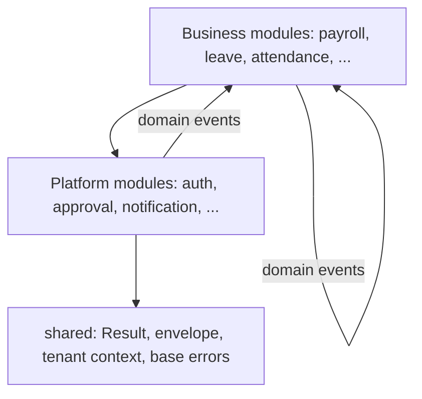

# ADR-0001: Modular Monolith and Module Boundaries

Status: Accepted · Date: 2026-08-01 · Deciders: product owner + engineering (spec §5.3, confirmed Phase 0)

## Context

HRIS ships ~30 modules (naming-conventions §4 registry) across payroll-critical, spiky (attendance clock-in bursts, D1) and batch-heavy (payroll runs) workloads, built by a small initial team. `HANDBOOK_SPEC.md` §5.3 mandates a NestJS modular monolith whose boundaries allow extracting microservices later **without rewriting business logic**. This ADR fixes what a module is, what may cross a boundary, and when a module is extraction-ready.

## Decision

One NestJS deployable. One module per namespace in the naming-conventions §4 registry, laid out per naming-conventions §11.1 (`domain/application/infrastructure/presentation`).

### Boundary rules

1. **Facade-only imports.** A module exposes a public facade (its NestJS module + an `index.ts` exporting application-layer ports: use cases, query services, DI tokens, DTOs, domain events). Other modules import **only** the facade. Importing another module's domain entities, repositories, infrastructure, or internal files is a lint error, not a review comment.
2. **Two communication channels.** Synchronous: call an exported application-layer port. Asynchronous: publish/consume domain events per `docs/adr/ADR-0010-background-jobs-events.md`. Nothing else — no shared service grab-bags, no reaching into another module's tables from repository code.
3. **Dependency direction.** Business modules → platform modules → `shared/`. Platform modules never import business modules (they emit events business modules consume). No cycles. Enforced in CI with a dependency-lint tool (e.g. dependency-cruiser); violations fail the build.

4. **Shared kernel is a whitelist.** `shared/` holds Result, response envelope, error base types, tenant/request context, pagination primitives, the **data-scope helpers** and the **`ADR-0016` crypto helpers** (both *added 2026-08-07, `hris-api` employee module*), and the cross-cutting HTTP machinery no module owns: the envelope interceptor and idempotency guard (`ADR-0007`), and the **rate-limit guard** (*added 2026-08-05, `hris-api` walking skeleton — an addition to the list, not a change to what the list is for, so no supersession; same class as `ADR-0007`'s two*). No business logic, no schema, no module may add to it without touching this ADR's whitelist in review.

   The two 2026-08-07 additions are the same class and each was already directed here by another Accepted ADR. `ADR-0005` §Decision-2 says modules resolve row visibility *"through **shared ownership helpers**"*, and the company-scope resolution organization wrote module-locally is the identical rule every module after it needs — no business logic, no schema, and no honest owner, since the module that happens to be built first does not get to own the rule for the rest. `ADR-0016`'s own consequences say *"`KeyProvider` port lands in `shared/`… crypto helpers are platform code, whitelisted per ADR-0001"*, which named the outcome before there was a caller; the employee module is that caller. Recorded as A-195.

   The rate-limit guard earns its place on ordering rather than on convenience. backend-nestjs §5 puts it at chain position **2**, ahead of authentication, so that credential stuffing pays no argon2 cost — which means it cannot live in the `auth` module whose cost it exists to protect. security-standards §3 owns its numbers; nothing about it is a business rule.
5. **Table ownership.** Every table has exactly one owning module (declared in the module doc's Domain Model section; core tables in `docs/04-database/core-schema.md`). Only the owner's repositories write it. Cross-module FKs are **allowed** (shared DB, integrity per database-conventions §1.7) but each one is part of the extraction cost inventory.

   **The inventory lives in `docs/04-database/erd-overview.md` §6, derived** (amended in place 2026-08-04, erd-overview regrilling — a relocation of a bookkeeping duty, not a change to what is permitted, so no supersession; same class as the §6 amendments below). A module doc references that inventory and does not copy it. As originally written this clause read *"module docs list their outbound FKs"*, and the reason it moved is that **24 of 26 module docs never did** — only `training.md` and `announcement.md` ever carried the block. Worse, `erd-overview.md` §1 asserted that all of them had, and that assertion is what concealed a genuine omission for three phases: `training_enrollments.development_item_id → development_items` was absent from the total, and with it the claim that exactly three module-to-module business couplings existed. There are four. A per-module list is a second copy of a fact the Drizzle block already states, and the two modules that maintained it correctly are the proof that the copying was never the unreliable step — reading 26 files and adding them up was. `scripts/erd-check.mjs` now derives the inventory from `.references()` directly and fails CI-style on any disagreement.
6. **Cross-module reads.** Default path is the owner's query port. Exceptions: `reports` and `dashboard-analytics` are designated read-model consumers — they may SELECT across module tables through dedicated, read-only query repositories, explicitly marked as extraction seams in their module docs.

   **Constraint (b) binds the designated consumers too** (amended in place 2026-08-03, `docs/06-modules/reports.md` — a tightening of an existing exception, not a reversal, so no supersession; same class as the asset.md amendment below). No designated read-model consumer may SELECT an ADR-0016 encrypted column or a column its owner masks, on identical reasoning: those columns are what the port channel exists to protect, and a consumer that reaches them bypasses masking, bypasses decryption policy, and skips the sensitive-read trail. As written, the exception granted the *widest* channel in the system the one freedom the *narrowest* one is denied — an inconsistency nobody had exercised yet, and reports.md is the file that would have. Where a report genuinely needs such a column, it is not a report: it is an `ExportDefinition` in the owning module with a gated column set, which is what `payroll.bank_file`, `tax.monthly_withholding`, and `bpjs.monthly_contribution` already are. A report over such a definition reads its `columnSets.base` only.

   Two consequences worth stating because they are load-bearing rather than incidental. Identity columns reach the consumers through **`employee_directory`**, the published view below, which is the channel already designed to carry a name without carrying a NIK. And **no report or dashboard output ever carries a gated column set**, which makes `document.download.gated_export` unreachable from those surfaces by construction rather than by discipline. This amendment binds `dashboard-analytics` in advance of its file being written.

   **Published read-model views** (amended in place 2026-08-03, `docs/06-modules/asset.md` — an extension of the exception list, not a reversal of rule 2, so no supersession; ADR-0002 cluster-D and ADR-0012 precedents). A module may publish a **named, read-only database view** over a narrow subset of its own tables, which any module's repositories may JOIN. Constraints, all four load-bearing:

   - **(a) Declared and owned.** The view is defined in the owner's module doc, versioned like any schema object, and changed only by the owner.
   - **(b) Nothing sensitive in it.** No ADR-0016 encrypted column, and no column the owner masks. This is what preserves rule 2's actual purpose: a joiner can never bypass masking, never decrypt, and never skip the sensitive-read trail, because those columns are not in the view at all.
   - **(c) `security_invoker = true` is mandatory.** A Postgres view executes with the view owner's rights by default, which would silently bypass the underlying table's RLS policy (ADR-0002) and turn a convenience join into a cross-tenant read. PG16 (A-010) supports the flag; a view without it is a leak, not a style choice, and the leak-test matrix (multi-tenancy §5) covers every published view.
   - **(d) Counted as extraction cost.** Every consumer lists the view in its module doc's ports-consumed section as an outbound read, exactly as rule 5 requires for cross-module FKs. At extraction it becomes an API call or a replicated projection — the same cost class already accepted for FKs.

   Read-only, always: no module writes another module's tables under any circumstance, and this exception does not touch that.

   **Why this is not the port channel with extra steps.** A query port returns rows *after* pagination, so it cannot serve `WHERE full_name ILIKE …` or `ORDER BY full_name` on a paged grid — the filter has to run in the database, before the page boundary. Every transactional grid in Phase 3 offers exactly that (`q=` over employee name and number), which means attendance, leave, overtime, and expense had all shipped a read with no sanctioned channel; asset.md surfaced it and this amendment is the repair. Enforcement stays mechanical: dependency-lint allows the published view name and keeps rejecting the underlying table.

   The first and, at this amendment, only published view is **`employee_directory`** (`docs/06-modules/employee.md` §13).
7. **Workers share the codebase.** BullMQ processors live in their owning module; the deployable can start as `api`, `worker`, or both via entrypoint flag — process-level separation without a repo split.

### Microservice-readiness criteria

A module is extraction-ready when: (a) all inbound coupling is facade calls + events (zero lint exceptions); (b) it exclusively owns its tables and its outbound FK list is empty or accepted as denormalization work; (c) its facade calls are replaceable by HTTP/queue adapters without signature changes; (d) its BullMQ queues are consumed only by it. Extraction triggers: sustained scaling asymmetry, team-ownership split, or fault-isolation need — never speculation.

## Alternatives considered

- **Microservices from day one.** Rejected: distributed transactions across payroll/attendance/leave, operational overhead for a small team, and D1 scale fits a well-indexed monolith.
- **Plain layered monolith (no enforced module boundaries).** Rejected: extraction becomes a rewrite; violates spec §5.3's microservice-readiness requirement.
- **Strict no-cross-module-FK (database-per-module discipline inside one DB).** Rejected: forfeits referential integrity and forces eventual-consistency plumbing now for a benefit only realized at extraction time; catalogued FKs keep the cost visible instead.

## Tradeoffs

Single deployable couples release cadence and blast radius (mitigated by worker/api process split and health-gated deploys). Facade + event ceremony costs boilerplate on small modules but keeps extraction an adapter-swap. Allowing cross-module FKs trades future data-migration work at extraction for integrity and simplicity now.

## Consequences

- Naming-conventions §4 registry is the authoritative module list; new module = registry entry + module doc + facade.
- Every module doc declares: consumed ports, consumed/emitted events, outbound FKs, and (2026-08-03) any published read-model view it owns or reads.
- CI adds dependency-lint gating; `shared/` changes require touching this ADR's whitelist.
- `docs/02-architecture/backend-nestjs.md` specifies the concrete folder/facade mechanics.

## Future considerations

Likely first extractions, in order of pressure: payroll calculation workers (CPU/batch isolation), notification fan-out, import/export workers — all start as worker-entrypoint processes of the monolith. Revisit this ADR at the first real extraction; the checklist above becomes the extraction runbook seed.
