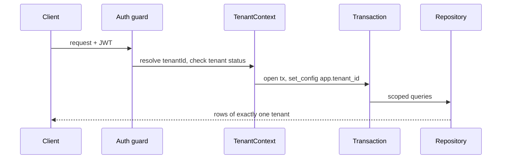

# ADR-0002: Multi-Tenancy Model and RLS Defense-in-Depth

Status: Accepted · Date: 2026-08-01 · Deciders: product owner + engineering (spec §5.5 + D11, confirmed Phase 0)

## Context

Spec §5.5 mandates: shared PostgreSQL, `tenant_id` isolation, repository auto-scoping such that no query can forget the tenant filter *by construction*, structural impossibility of cross-tenant access, and a future path to per-tenant databases without touching business logic. D11 (confirmed) adds PostgreSQL Row Level Security as defense-in-depth with session variable `app.tenant_id`. Scale target: 500 tenants, ≤10k employees each (D1). Mechanics conventions already fixed in `docs/04-database/database-conventions.md` §2 (table classification) and §9 (policy template, roles, `set_config` wiring); this ADR fixes the model those conventions implement.

## Decision

Two independent isolation layers; a tenant-data breach requires both to fail simultaneously.

### Layer 1 — application scoping

1. **Tenant resolution:** `tenantId` is a JWT claim, bound at login. No subdomain routing in V1. A request-scoped `TenantContext` (AsyncLocalStorage-based) carries it; requests without a resolvable tenant are rejected before any repository runs. Tenant status (`active`/`suspended`/`archived`) is validated at the guard with a short-TTL Redis cache.
2. **Repository auto-scoping:** all repositories for tenant-owned/company-scoped tables extend a tenant-scoped base repository that injects `TenantContext` and appends `tenant_id = :ctx` to every read/write it builds. Direct `db` access outside repository classes is prohibited (CLAUDE.md) and lint-enforced; there is no code path that composes a tenant-table query without the base class.
3. **Jobs:** every BullMQ payload carries `tenantId`; workers construct the same `TenantContext` + transaction before touching repositories.

### Layer 2 — PostgreSQL RLS

Every tenant-owned/company-scoped table gets the database-conventions §9 policy (`ENABLE` + `FORCE`, `USING`/`WITH CHECK` on `current_setting('app.tenant_id', true)::uuid`) in the migration that creates it. Runtime connects as `hris_app` — non-owner, no `BYPASSRLS`; unset variable yields zero rows / rejected writes (default deny). Every request and worker unit-of-work is a transaction that first runs `set_config('app.tenant_id', $tenantId, true)`; because the setting is transaction-local, this is compatible with transaction-mode connection pooling (PgBouncer/pgcat).

### Platform-level access (no bypass rule)

- **Platform tables** (no `tenant_id`): no RLS; guarded by platform permissions (Super Admin), accessed via platform-module repositories.
- **Cross-tenant operations** run *per tenant*, with `app.tenant_id` explicitly set to the target tenant and audit-logged (provisioning, support fixes).
- **Impersonation** issues a short-lived token carrying the target `tenantId` + impersonation claims; the whole session is audit-flagged (`docs/06-modules/system-administration.md`). **Specified 2026-08-04 in ADR-0017:** "short-lived" is **30 minutes with no refresh path** — the TTL is the entire session — against a named, `active` target user, with a mandatory reason, one live session per operator, and a cascade that ends it the instant its parent platform session is revoked. It is also the **only** bypass of `TenantStatusGuard` in the system, reaching `suspended` and `archived` tenants because fixing the cause of a suspension is what support is for.
- **Platform analytics** (tenant counts, health) never query across tenants live: per-tenant jobs materialize aggregates into platform tables.
- Net effect: **no runtime credential holds `BYPASSRLS`.** Only `hris_migrator` (CI migrations) owns objects — and carries `BYPASSRLS` (amended 2026-08-02, grilled: `FORCE` RLS binds the owner too; without the bypass, in-migration DML on tenant-class rows silently affects zero rows. CI-only credential, already omnipotent over schema — zero marginal risk). Runtime pre-tenant auth lookups use the narrow `SET LOCAL ROLE hris_auth` path (multi-tenancy §4, authentication.md §5) — SELECT-only on four tables, no bypass.

### Request flow

### Future per-tenant database path

Repositories obtain their handle from a `ConnectionProvider` keyed by `TenantContext` — V1 always returns the shared pool. Moving a tenant out later = teach the provider a catalog lookup, dump that tenant's rows (RLS-scoped export), restore into a dedicated instance. Business logic, repositories, and RLS policies are unchanged; policies become redundant-but-harmless on dedicated instances. Candidate triggers: contractual isolation demands, tenant size near the 10k ceiling, noisy-neighbor pressure.

## Alternatives considered

- **Schema-per-tenant.** Rejected: 500 schemas × migrations per release, pool fragmentation, painful platform operations; no material isolation gain over RLS.
- **Database-per-tenant from day one.** Rejected: operational cost at 500 tenants, cross-tenant platform features become federation problems; kept as the documented escape hatch instead.
- **`tenant_id` scoping without RLS.** Rejected by D11: one missed filter or ORM regression = cross-tenant breach; RLS reduces that to zero rows.
- **RLS as the only layer (no repository scoping).** Rejected: RLS failures are silent (empty results, mis-set variable writes to wrong tenant if resolution bugs out); the application layer gives explicit, testable scoping and better query plans.

## Tradeoffs

Every request pays a transaction + `set_config` round trip (reads included) — accepted for D2 SLOs; batching mitigates. Two layers mean isolation logic exists twice — intentional redundancy, cheap because both are templated. RLS adds planner predicate overhead — negligible with tenant-first composite indexes (spec §5.14, database-conventions §7). FORCE RLS makes ad-hoc DBA queries under `hris_app` return nothing — correct behavior, documented in operations runbooks.

## Consequences

- All request handling is transactional; the HTTP layer owns the tx + `set_config` wrapper (`docs/02-architecture/multi-tenancy.md` implements).
- `docs/04-database/core-schema.md` ships RLS policies with every tenant-class table.
- Test suites for every module seed **two tenants** and assert zero leakage both with and without repository scoping (RLS alone must already isolate); testing-strategy encodes this as a mandatory scenario class. **Discharged 2026-08-04** — `docs/07-operations/testing-strategy.md` §5.1: the `describeTenantIsolation` kit expands to the full L1–L9 matrix and a lint fails any module declaring a tenant-class table without invoking it.
- Platform dashboards get their data model from materialized platform aggregates, not live cross-tenant SQL.

## Future considerations

Per-tenant encryption keys (field-level, security-standards) can key off the same `TenantContext`. If PgBouncer is replaced or bypassed, revisit the pooling-compatibility note. Revisit RLS policy shape if Postgres adds native tenant-partitioning primitives; partitioning by `tenant_id` (declarative) is compatible with this design and may arrive via the performance doc without superseding this ADR. **Discharged 2026-08-04 by `ADR-0023`**, and as anticipated, without superseding anything: **no table is partitioned in V1**, with a numeric trigger rather than a feeling. It also recorded what this note could not have known — on `attendance_punches`, the largest table in the system, hash-by-`tenant_id` is the **only** key still available, because PostgreSQL requires the partition key to be a subset of every unique constraint and `uq_attendance_punches_tenant_id_op_id` carries no date column. Range-by-date, the key that would make retention a `DROP PARTITION`, is foreclosed by the constraint that makes offline dedup correct.

**A second thing this ADR does not guarantee, made explicit 2026-08-04** (`performance.md` §13.1): tenants cannot **see** each other's data, and nothing here or anywhere else stops them **starving** each other. Rate limits are per-user and per-IP (security-standards §3); there is no per-tenant quota or resource class. A tenant at D1's 10,000-employee ceiling generates five times a typical tenant's load against one shared database. Named because a reader of this ADR will otherwise hear two meanings in the word "isolation".
