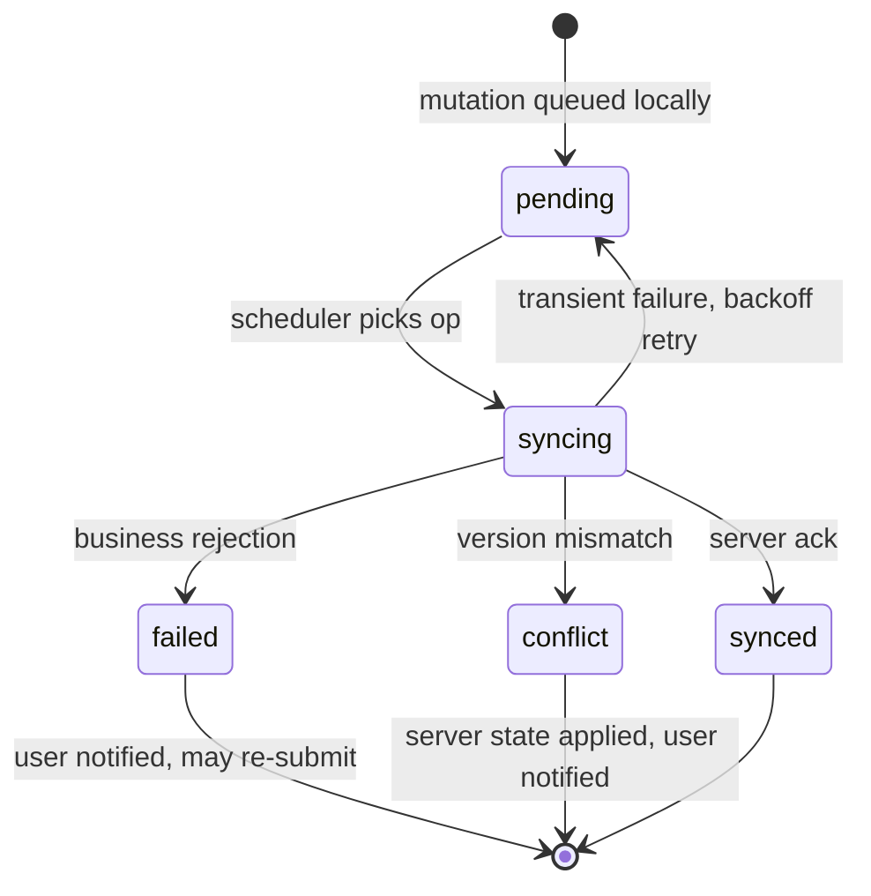

# ADR-0003: Offline-First Sync and Conflict Resolution

Status: Accepted · Date: 2026-08-01 · Deciders: product owner + engineering (spec §5.1/§5.7, confirmed Phase 0)

## Context

The Flutter employee app is offline-first (spec §5.1): attendance must work with no connectivity (§5.7), requests must be submittable offline, reads must come from a local Drift cache. Spec fixes the ingredients — sync queue, background sync, retry with backoff, per-entity conflict policy, crash-safe queue, pending-data protection — but not the model. This ADR fixes the model; `docs/02-architecture/offline-sync.md` (Phase 2) specifies the mechanics (queue schema, schedulers, crash recovery, pending-ops UI).

## Decision

**Server is always authoritative. The client never merges.** Offline writes are queued domain mutations, optimistically applied locally, pushed in the background, and reconciled against server truth.

### Sync model

- **Reads:** pull-based delta sync per entity (`updatedSince` cursor endpoints), replacing local rows; TTL per entity class in `local_cache_meta`.
- **Writes:** durable mutation queue in Drift (`local_sync_queue`): `{opId, entityType, entityId, operation, payload, baseVersion, status, attempts, lastError, createdAt}`. `opId` and `entityId` are client-generated UUIDv7 — `opId` doubles as the `Idempotency-Key` (ADR-0007), so replays are harmless by construction. Because the Redis replay window is finite (**24 hours**, ADR-0007 — *reduced from 7 days on 2026-08-04; `performance.md` §5.2 costed the original at 14–28 GB in a `noeviction` instance, and this very sentence is why the reduction is safe*) but a device may stay dark far longer, **rows created by sync-class writes also persist `op_id` in a unique column** — late replays collide at the database, independent of Redis TTL (confirmed in grilling 2026-08-02; module schemas apply this to every offline-created entity).
- **Ordering:** FIFO per entity aggregate; no global ordering guarantee; no op coalescing in V1 — ops replay in order against an idempotent server.
- **Scheduling:** push on connectivity regained, app foreground, and periodic OS background task (WorkManager / BGTaskScheduler).
- **Timestamps:** offline facts carry the device event time (`punched_at`) *and* receive a server time on arrival (`synced_at`); both are stored. Anti-fraud drift checks belong to attendance (D10).
- **Local DB encryption:** the Drift database is SQLCipher-encrypted; key generated per install, held in Keychain/Keystore (`flutter_secure_storage`). Employee PII and payslip data never sit in plaintext SQLite.

### Queue operation lifecycle

**Retry policy:** exponential backoff with jitter — base 10 s, factor 2, cap 30 min — retried indefinitely for transient failures (network, 5xx, 429). Business rejections (4xx with a catalog error code) are **never retried**: op → `failed`, local optimistic state rolled back to server truth, user informed. After 3 failed sync cycles the pending-ops UI escalates from passive badge to actionable banner. Defaults are client config, tunable via settings.

### Conflict policy — four sync classes

Every entity a module syncs is assigned exactly one class in its module doc (template §10 Offline Behavior):

| Sync class | Examples | Policy |
|---|---|---|
| **Append-only fact** | attendance punch, uploaded receipt | Cannot conflict: client UUID + idempotent insert. Server may still *reject* on business rules (duplicate window, geofence) → `failed`, not `conflict` |
| **Request aggregate** | leave/overtime/correction/expense request, data-change request | Single-writer (the owner) until submitted; immutable on the client after submission — later state changes arrive from the server. Offline action against advanced server state (e.g. cancel after approver approved) → server wins, op rejected with current state |
| **Mutable owned record** | draft requests, user preferences synced to server | Optimistic concurrency on `version` (database-conventions §1.10): mismatch → `conflict`, server state replaces local, user re-applies if still wanted. No field merge in V1 |
| **Reference data** | holidays, shifts, org data, balances, payslips | Read-only on device; server replaces on pull. Never enters the queue |

**Manager approvals are online-only in V1.** Approving against stale offline state risks silently overriding a colleague's decision or an escalation; MSS approval actions require connectivity and always act on fresh server state.

### Pending-data protection (hard rule, spec §5.1/§5.7)

Queue rows in `pending`/`syncing`/`failed`/`conflict` and every local row or file they reference (including punch selfies) are exempt from **all** cleanup: cache eviction, 90-day attendance retention, logout wipe prompts the user first. Enforced structurally: one shared cleanup helper owns deletion and always excludes referenced-by-unsynced-op data (database-conventions §11.5); no other code path deletes local rows.

## Alternatives considered

- **CRDT / operational-transform merging.** Rejected: no collaborative-editing use case; approval-mediated workflows make field-merge semantics meaningless; enormous complexity for zero product value.
- **Off-the-shelf sync engine (PowerSync, ElectricSQL, Firebase offline).** Rejected: tenant isolation (ADR-0002), approval semantics, and idempotent punch ingestion are custom regardless; the engines add lock-in and a second consistency model on top of Postgres truth.
- **Last-write-wins everywhere.** Rejected: an offline device could silently overwrite HR/approver actions — unacceptable for payroll-feeding data.
- **Online-only app with request retries.** Rejected by spec §5.1/§5.7.

## Tradeoffs

Server-authoritative + no merge means an occasional user re-entry after `conflict` — rare by design, since request aggregates are immutable post-submit and facts are append-only. Indefinite transient retries keep punches alive through long outages at the cost of queue growth — bounded in practice by pending-data UI escalation and the punch volume of one user. SQLCipher adds a key-management path and marginal I/O overhead — accepted for PII on personal devices (UU PDP posture). No op coalescing wastes some bandwidth replaying superseded drafts — simplicity wins until measured.

## Consequences

- API requirements land in ADR-0007/api-standards: `Idempotency-Key` honored on all queue-reachable mutation endpoints; delta endpoints expose `updatedSince` cursors; conflict responses return current server state with the error envelope.
- Server tables synced as *mutable owned records* carry `version` (database-conventions §1.10); sync endpoints echo and check it.
- Every mobile module doc must declare the sync class per entity and any deviation in §10 Offline Behavior.
- `SYNC_` error namespace (naming §4) covers queue/protocol errors; codes registered when offline-sync.md and modules land.
- `docs/02-architecture/offline-sync.md` owns: full `local_sync_queue`/`local_cache_meta` Drift schema, scheduler wiring, crash recovery invariants, pending-ops UI states, logout-with-pending flow.

## Future considerations

Op coalescing (drop superseded draft updates) if bandwidth telemetry justifies it. Optional offline MSS approvals with explicit stale-state acceptance UX — requires product sign-off, revisit post-GA. Kiosk mode (post-GA) reuses the queue model with a device-account twist. If a second offline platform appears (admin PWA), extract the sync protocol into a documented contract first.
