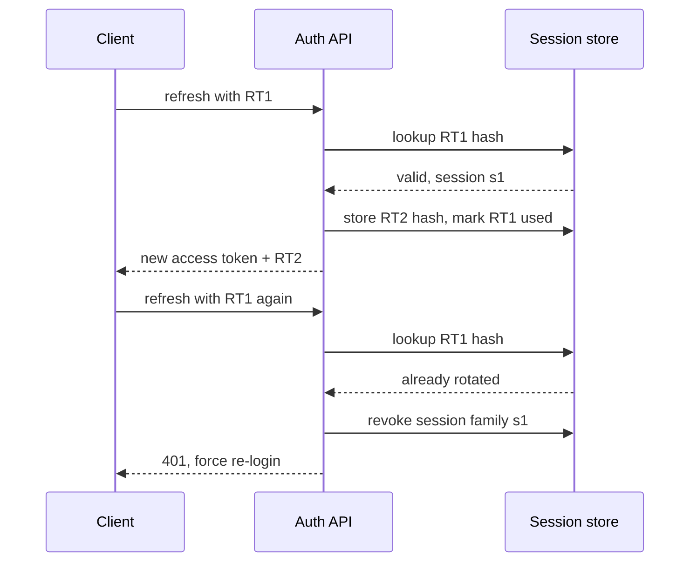

# ADR-0004: Authentication, Sessions, and Device Management

Status: Accepted · Date: 2026-08-01 · Deciders: product owner + engineering (spec §5.8, confirmed Phase 0)

## Context

Spec §5.8 mandates: JWT access + rotating refresh tokens, biometric and PIN login, remember-device, secure storage via Keychain/Keystore, session management, and device registration/revocation (admin- and self-service). Multi-tenancy binds identity to a tenant (ADR-0002: `tenantId` is a JWT claim). Offline-first (ADR-0003) requires the app to unlock and operate without connectivity. Attendance anti-fraud (D10) wants punches bound to a known device. This ADR fixes the credential, token, session, device, and unlock model; `docs/05-platform/authentication.md` specifies endpoints, schemas, and flows.

## Decision

### Identity and login

- Login identifier: **email, unique per tenant** (`uq_users_tenant_id_email`), *not* globally unique. After password verification, if the email+password matches users in multiple tenants, the client shows a tenant picker; only tenants where the password verified are revealed (no membership enumeration without the credential). No subdomains, no company-code field.
- Password hashing: **argon2id**. Password policy and lockout thresholds are tenant-tunable settings (`auth.*`), enforced per `docs/03-standards/security-standards.md`.
- **MFA is not in V1** (A-007): schema reserves `sessions.mfa_verified` and a credential-type discriminator so TOTP can land post-V1 without migration pain. **Scope clarified 2026-08-04 — this decision covers tenant users only.** `ADR-0017` makes TOTP **mandatory** for `platform_users`, a second identity class this ADR does not govern: A-007's stated evidence is spec §5.8's list of tenant login methods, and no platform login surface existed when it was written. Everything in this ADR still binds every tenant user unchanged; nothing here is superseded.

### Token model

| Token | Form | Lifetime | Content / storage |
|---|---|---|---|
| Access | JWT, stateless | 15 min | Claims: `sub`, `tenantId`, `sid` (session id), `typ`, impersonation claims when applicable. **No permission claims** — guards resolve permissions from a short-TTL Redis cache (ADR-0005), so role edits bite within cache TTL, not token expiry. Mobile: memory + secure storage; web: memory only |
| Refresh | Opaque 256-bit random, server-side record | Mobile: 30 d sliding, 90 d absolute. Web: 7 d sliding, 30 d absolute (12 h when "remember this device" unchecked). Tenant-tunable | Only the SHA-256 hash is stored server-side. Mobile: `flutter_secure_storage`; web: `httpOnly` `Secure` `SameSite=Strict` cookie scoped to the refresh path |

**Rotation:** every refresh use issues a new refresh token and marks the old one used — one active refresh token per session. **Reuse of a rotated token revokes the whole session family** (standard replay defense):

### Sessions

One session row per login (mobile device or browser): user, tenant, device link or user-agent fingerprint, IP, `created_at`, `last_used_at`, `revoked_at` + reason, current refresh-token hash. Self-service session list with per-session and revoke-all actions (mobile + web); System Administrator gets the tenant-wide view. Revocation kills the refresh path immediately; access tokens die at their 15-minute horizon — endpoints flagged as sensitive in module docs re-check session liveness server-side.

### Device management (mobile)

- Device registry row per install: client-generated install UUID, platform, model, OS/app version, FCM token, `last_seen_at`, status (`active`/`revoked`).
- **Default policy: one active mobile device per user**, tenant-tunable (`auth.max_active_devices`). Registering a new device requires re-authentication and, per tenant policy, either self-service replacement (old device auto-revoked) or admin approval. Attendance punches always carry the device id (D10 linkage).
- Revocation (self-service or admin): session revoked, FCM token dropped, device status `revoked`; next API contact gets 401. Local wipe honors the pending-sync prompt rule (ADR-0003).

### Local unlock (biometric / PIN)

Biometric and PIN are **device-local unlock, never server credentials**. After first password login + device registration, the refresh token is wrapped by a key held in Keystore/Keychain gated by BiometricPrompt/Face ID, with a 6-digit PIN fallback deriving a wrapping key (no PIN or PIN hash ever stored or transmitted). Unlock works fully offline — required by ADR-0003. **5 consecutive failed unlock attempts wipe local tokens** (not local pending data) and force password re-login. PIN change = re-wrap locally; password change or session revocation = wrapped token becomes useless server-side.

### Remember-device (web)

A login checkbox: checked → refresh lifetimes above and a `trusted_device` marker on the session; unchecked → 12-hour refresh, cookie dies with the browser session. The marker is also the future MFA-skip hook (A-007).

## Alternatives considered

- **Stateless (JWT) refresh tokens.** Rejected: spec demands revocation and session lists; stateless refresh can't be killed.
- **Permissions inside the access JWT.** Rejected: custom roles make tokens fat and stale; revocation semantics get worse. Redis-cached per-request resolution keeps enforcement fresh.
- **Server-verified PIN as a login credential.** Rejected: a 6-digit server credential invites brute force and can't unlock offline; local-only PIN gates a strong stored credential instead.
- **Hosted identity (Firebase Auth, Auth0, Keycloak).** Rejected for V1: per-tenant user model, device binding, and Jakarta data-residency (A-003) are custom anyway; adds cost and lock-in. Tenant SSO (OIDC/SAML) is the post-V1 reason to revisit.
- **Globally unique email.** Rejected: tenants don't control each other's user pools; per-tenant uniqueness + post-verification picker handles the rare overlap.

## Tradeoffs

Stateful refresh adds a store lookup per refresh — refreshes are minutes apart, cost is noise. **True per session, and quantified at the fleet 2026-08-04** (`performance.md` §2.2): rotation is a *write*, the 15-minute access horizon guarantees an expired token after any overnight gap, and so **every morning app open begins with one**. At D1's design point that is roughly 333 rotation writes per second across the clock-in window — **exactly as many as the punches themselves**, on the spike named after punching. The decision is unchanged and correct; it was simply never counted, and anything sized against the punch rate alone understates the morning by around eightfold. Permission-cache TTL introduces a bounded staleness window for role edits — acceptable against fat tokens. One-device default creates phone-swap friction — mitigated by self-service replacement flow; tenants wanting looser policy flip a setting. Local-wipe-after-5 trades occasional forced re-login for stolen-device protection; pending offline data survives the wipe.

## Consequences

- `docs/04-database/core-schema.md`: `users`, `sessions`, `devices` tables (+ password credential fields), per this model.
- `docs/05-platform/authentication.md`: full endpoint specs, `AUTH_` codes registered in the error catalog, reset-password and change-password flows, lockout mechanics.
- Settings keys `auth.*` (max devices, refresh lifetimes, password policy, device-replacement policy) land in `docs/05-platform/settings.md`.
- Notification module owns FCM token refresh; the device registry is its source of push targets.
- ADR-0005 builds the permission cache keyed by `sid`/user; ADR-0002's tenant claim comes from this token model.

## Future considerations

TOTP MFA post-V1 (fields reserved). Tenant SSO (OIDC/SAML) — likely the first enterprise demand; the session/device model is IdP-agnostic by design. Play Integrity / App Attest signals (post-GA, D10) attach to the device registry. Passkeys for admin web when the market is ready.
