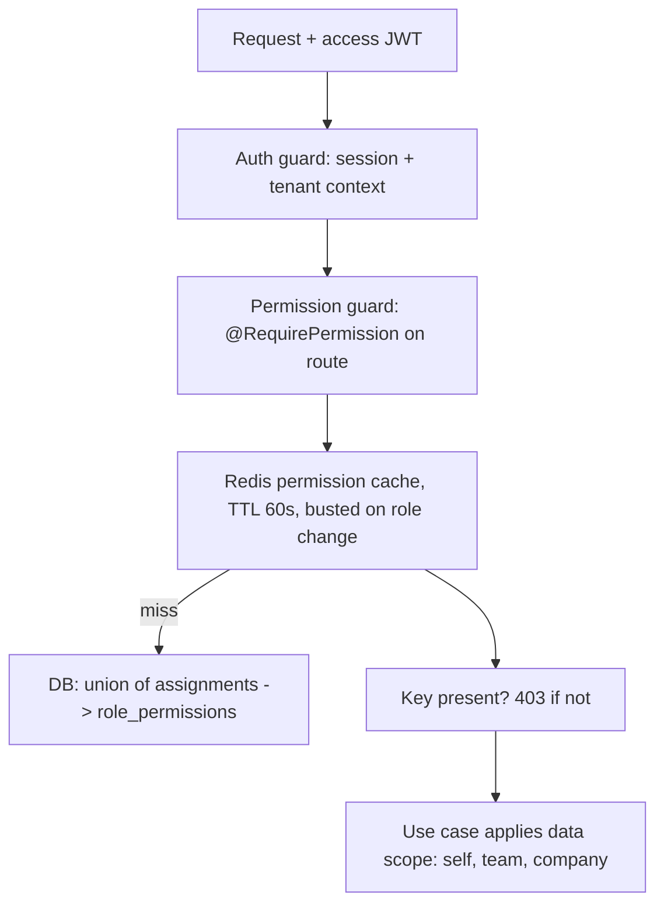

# ADR-0005: RBAC and Permission Model

Status: Accepted · Date: 2026-08-01 · Deciders: product owner + engineering (spec §5.9, confirmed Phase 0)

## Context

Spec §5.9: RBAC where **permissions are the unit of enforcement** and roles are permission bundles — role templates plus tenant-defined custom roles, scoped to tenant or company; every endpoint declares its required permission(s). Key grammar and the reserved verb set are fixed in naming-conventions §5; the ten role templates in `docs/00-overview/product-overview.md` §4 (System Administrator tenant-scoped per A-005). ADR-0004 already decided permissions live in a Redis cache, not in the JWT. This ADR fixes the model; `docs/05-platform/authorization-rbac.md` owns the concrete catalog and guard implementation.

## Decision

### Two-axis model: permission gates the action, data scope gates the rows

1. **Permissions are code-defined and static.** The catalog is a code registry (seeded to DB for the role-builder UI); tenants compose roles, never invent permissions — every key maps to real code paths. Grammar: `<ns>.<resource>.<action>` (naming §5), no wildcards anywhere.
2. **Data scope is a separate dimension.** Holding `leave.request.read` says nothing about *whose* requests. Modules resolve row visibility (`self` / `team` / `company` / `tenant`) through shared ownership helpers (self check, reporting-line check via org hierarchy, company membership) and document the scope per endpoint in their §2 permission matrix. Guards never do data scoping; use cases and repositories do.

### Roles

- **System role templates:** the ten product-overview roles, platform-defined in code, seeded per tenant at provisioning, `is_system = true`, **immutable** — platform upgrades re-sync them safely. Tenants clone a template or build custom roles from scratch.
- **Custom roles:** tenant-owned bundles of catalog permissions; same machinery, `is_system = false`.
- **Composition is additive-only.** A user's effective permission set is the union of all assignments. No role hierarchy, no inheritance, no deny rules — absence is denial. Auditable by reading, not simulating.

### Assignment and scoping

Scope lives on the **assignment**, not the role definition: `user_roles(user_id, role_id, company_id nullable)` — `company_id = NULL` means tenant-wide; set means that company only. One user holds many assignments (HR Admin of company A + read-only role in company B). Employee/Manager templates are assigned company-scoped by construction (their data scope is `self`/`team` anyway).

### Enforcement

- Every route declares `@RequirePermission('<key>')` (multiple keys = AND unless documented) or an explicit `@Public()` / `@AuthenticatedOnly()` marker. A route with none is a **startup/CI failure**, not a silent pass — deny by default, structurally.
- Cache: `hris:authz:{tenantId}:{userId}:permissions`, TTL 60 s **plus** explicit bust on any role/assignment mutation (ADR-0004's bounded-staleness promise).
- **Resolution is lazy** *(added 2026-08-04, `performance.md` §6.2)*. A route declaring `@AuthenticatedOnly()` has no permission key to check, so it resolves no permission set and touches no cache; the set materializes on first access, which on those routes never comes. This changes **when** resolution runs, not the model, the key grammar, the 60-second TTL, or the post-commit bust — none of which move. It matters because employee self-service routes are all `@AuthenticatedOnly()` (BR-AUTHZ-009 resolves their data scope in repositories), the cache is keyed **per user**, and an employee appears roughly twice a day — so on the hottest path in the system every lookup was a guaranteed miss followed by a database query and a cache write. The TTL is right for the admin web, which is what it was designed against.
- Clients fetch `/me/permissions` to drive UI visibility — advisory only, never enforcement.

### Boundaries with neighbors

- **Approval rights are two-gate:** the permission (`leave.request.approve`) gates the endpoint; *chain membership* (resolved by the approval engine per instance, ADR-0008) gates the specific request. Holding the permission never entitles approving an arbitrary request.
- **Super Admin** is a platform-level user outside tenant RBAC, holding platform permissions (`sysadmin.*` keys, same grammar); entering a tenant happens only via audited impersonation (ADR-0002/0004).
- **Delegation** (vacation hand-over of approvals) is an approval-engine feature, not a role grant — RBAC stays time-invariant in V1.

## Alternatives considered

- **ABAC / policy engines (OPA, Casbin, CASL).** Rejected for V1: HRIS access follows org structure, which two axes + ownership helpers express; policy engines cost latency, ops, and auditability. Revisit only if tenants demand conditional policies (time-bound, attribute-based).
- **Role hierarchy / inheritance.** Rejected: "why does this user see this?" must be answerable by listing assignments, not walking a tree.
- **Deny rules / negative permissions.** Rejected: union-plus-deny is the classic audit nightmare; additive-only keeps effective rights computable in one query.
- **Tenant-definable permissions.** Rejected: permissions are code contracts; tenant-invented keys can't map to enforcement.
- **Per-record ACL sharing.** Rejected: no HRIS use case for ad-hoc shares; org-structure scoping covers Manager/HR visibility.

## Tradeoffs

Custom roles will proliferate per tenant — that's the feature, and flat additive composition keeps it debuggable. 60 s cache staleness bounds how fast a grant lands — busting on mutation makes revocation immediate in practice. Two-axis means every module must spell out data scope per endpoint — deliberate documentation tax the module template already collects. No time-bound grants in RBAC — the one real need (approval hand-over) lives in delegation.

## Consequences

- `docs/04-database/core-schema.md`: `roles`, `permissions`, `role_permissions`, `user_roles` (with nullable `company_id`), template seed strategy.
- `docs/05-platform/authorization-rbac.md`: full permission catalog (~200–300 keys expected), guard/decorator implementation, template→permission matrices, `/me/permissions` spec, `AUTHZ_` codes.
- Every module doc §2: permission matrix (action × role) **including the data-scope column**.
- CI gains the route-decorator completeness check; testing-strategy adds permission-matrix tests per module (assert 403 for missing key, scope leaks for `team`/`company`). **Discharged 2026-08-04** — `docs/07-operations/testing-strategy.md` §5.2: the `describePermissionMatrix` kit asserts the four-way outcome per route, with the narrower-scope case returning `SYS_NOT_FOUND` rather than 403 per the existence-hiding rule, and the three registered 403 exceptions declared per route.

## Future considerations

Attribute conditions (e.g. branch-scoped HR) can extend the assignment row (`branch_id`) without changing the model. Time-bound assignments if delegation proves insufficient. If policy complexity ever justifies an engine, the static catalog + assignment data migrates into it cleanly — keys are already stable identifiers.
