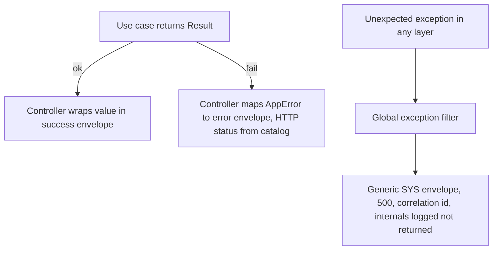

# ADR-0006: Result-Pattern Error Handling Across All Stacks

Status: Accepted · Date: 2026-08-01 · Deciders: product owner + engineering (spec §5.10, confirmed Phase 0)

## Context

Spec §5.10: Result pattern for business rules on backend, admin web, and mobile; exceptions reserved for unexpected infrastructure failures; one shared error philosophy and one error-code catalog (`docs/03-standards/error-catalog.md`), codes stable and namespaced (grammar + prefixes fixed in naming-conventions §4). Three separate repos (A-006) need one canonical contract without a shared package. This ADR fixes the Result shape, the throw/return boundary, and the code philosophy; ADR-0007 maps failures onto the HTTP envelope.

## Decision

### Canonical Result shape (vendored per repo, defined here)

TypeScript (backend `shared/result.ts`, admin web `src/lib/result.ts` — identical file):

```ts
export type Result<T, E = AppError> =
  | { readonly ok: true; readonly value: T }
  | { readonly ok: false; readonly error: E };

export const ok = <T>(value: T): Result<T, never> => ({ ok: true, value });
export const fail = <E>(error: E): Result<never, E> => ({ ok: false, error });

export interface AppError {
  readonly code: string;                    // catalog code: LVE_INSUFFICIENT_BALANCE
  readonly messageKey: string;              // always `errors.<code>`
  readonly details?: Record<string, unknown>; // safe-to-serialize context
  readonly cause?: unknown;                 // infra diagnostics — never serialized
}
```

Dart (mobile `core/result.dart`), native sealed classes — no functional-programming package:

```dart
sealed class Result<T> {
  const Result();
}

final class Success<T> extends Result<T> {
  final T value;
  const Success(this.value);
}

final class Failure<T> extends Result<T> {
  final AppFailure failure; // code, messageKey, details — mirror of AppError
  const Failure(this.failure);
}
```

Exhaustive `switch` pattern matching is the required consumption style in both languages; helper combinators (`map`, `andThen`) may be added to the vendored file, nothing else. The three copies are kept identical by this ADR + the AI development guide; diverging a copy is an anchor violation.

**The mechanism, named** *(amended in place 2026-08-05, `ai-development-guide.md` grilling — the enforcement this clause already asserted, now built, so no supersession)*. "Kept identical by this ADR + the AI development guide" was a claim with nothing behind it: no check existed, and the guide it named did not yet exist either. `ADR-0025` mounts the handbook in every implementation repository, which makes the canonical block above readable at build time, so the check is now `ai-development-guide.md` §8 gate 5 — each repository diffs its `Result` file against this block, above a `// ---- ADR-0006 canonical, nothing above this line ----` marker. The sanctioned combinators live below the marker, which is what lets the check be an equality test rather than a judgement call. The Dart copy is compared shape-for-shape rather than byte-for-byte; the two TypeScript copies are byte-identical to this block.

### The throw/return boundary

| Layer | Business failure | Infrastructure failure |
|---|---|---|
| Domain / use cases (all stacks) | `return fail(AppError)` — **never throw** | let it propagate |
| Repositories / data sources | not their job — they return data | throw (DB down, timeout); mobile data sources catch transport errors and convert to `Failure` with a `SYS_`/`SYNC_` code at the repository boundary |
| NestJS controllers | unwrap Result → envelope + HTTP status from the catalog entry | global exception filter → generic `SYS_` envelope, 500, correlation id, zero internal detail leaked |
| Flutter cubits | pattern-match Result → UI state | never see raw exceptions — repositories already converted |
| Admin web | axios interceptor parses the error envelope → typed `ApiError`; React Query `error` is always typed; `VAL_` detail rows map to form field errors | interceptor maps network/5xx to a typed transport failure |



Hard rules: no `HttpException` thrown from services/use cases (the NestJS habit is explicitly banned); no try/catch as control flow; transport validation (Zod / class-validator DTOs) rejects malformed input with `VAL_` codes **before** a use case runs — domain invariants inside use cases return Result failures with module codes.

### Error-code philosophy

1. A code is an **API contract**: clients branch on codes, never on messages or HTTP status alone.
2. Codes are immortal — never renamed, reused, or deleted; deprecated codes stay in the catalog marked deprecated.
3. Every catalog entry declares: code, owning module, HTTP status, `errors.<CODE>` message key (both locales, D12), description, and the endpoint(s)/rule(s) that raise it. The catalog is the single registry (registration protocol in `docs/03-standards/error-catalog.md`).
4. Server-side `message` text is developer-facing English; user-facing text always comes from the client's i18n bundle via `messageKey` — clients never display or parse server messages.
5. One failure, one code: a use case maps each distinct violated rule (`BR-*`) to a distinct code, so tests and support can identify the rule from the wire.

## Alternatives considered

- **Exception-based business errors (idiomatic NestJS `HttpException`).** Rejected by spec: invisible control flow, HTTP leaks into domain, exhaustiveness impossible.
- **`neverthrow` / `fp-ts` / `fpdart` / `dartz`.** Rejected: a 30-line vendored type beats a dependency + FP idiom tax in three codebases; Dart 3 sealed classes make library Eithers redundant.
- **Error class hierarchies + `instanceof` mapping.** Rejected: catalogs, not class trees, are the cross-stack contract; classes don't survive the wire.
- **Shared npm/pub package for Result.** Rejected for V1: publish/version ceremony for ~50 lines across three repos; ADR-canonical vendoring is cheaper. Revisit if the file grows real logic.

## Tradeoffs

Result plumbing adds ceremony to every use case — bounded by keeping the type minimal and combinators few. Vendored triplication can drift — accepted; the shape is frozen here and lint/ai-guide check it. Two validation layers (transport DTO + domain invariants) duplicate some checks — intentional: transport rejects garbage, domain owns rules. Engineers arriving with Nest exception habits need unlearning — the ai-guide carries compliant/violation examples.

## Consequences

- `docs/03-standards/error-catalog.md` seeds `VAL_`/`SYS_` codes and the entry format above; every module registers codes the session it documents them.
- ADR-0007 defines the envelope the controller mapping targets; correlation id propagation lands there + ADR-0011.
- `docs/02-architecture/backend-nestjs.md` specifies the exception filter and controller unwrap helper; coding-standards docs carry per-stack idioms; module docs reference codes per business rule.
- Tests assert on codes, never message strings (testing-strategy rule). **Discharged 2026-08-04** — `docs/07-operations/testing-strategy.md` §5.4 (`describeErrorContract`) makes it mechanical rather than conventional, and §4.4 adds the converse gate: **every one of the catalog's registered codes must be asserted by at least one test**, so an immortal code that nothing can raise is a build failure rather than a permanent orphan.

## Future considerations

If use-case composition gets deep, promote `andThen`/`mapError` combinators into the canonical file via an ADR edit — still no external dependency. A shared contract package becomes worth it only when envelope types, catalog types, and Result travel together; that is a post-V1 packaging decision.
