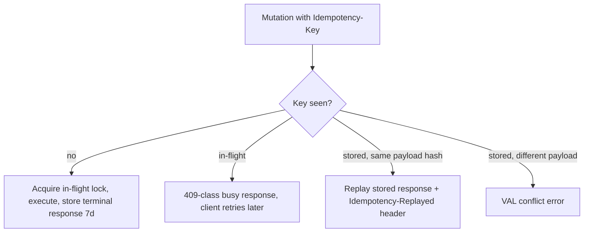

# ADR-0007: API Versioning, Response Envelope, and Request Conventions

Status: Accepted · Date: 2026-08-01 · Deciders: product owner + engineering (spec §5.11, confirmed Phase 0)

## Context

Spec §5.11 fixes: REST, URI versioning `/api/v1/...`, standard response envelope, standard error shape (code, message, details, correlation id), pagination (cursor for feeds, offset for admin tables, per-resource), filtering/sorting/search conventions, idempotency keys for retryable mutations. ADR-0006 fixed what a failure is; this ADR fixes how it crosses the wire. ADR-0003 requires replay-safe mutations (`opId` = idempotency key) and delta pulls. `docs/03-standards/api-standards.md` (Phase 2) carries the full per-convention detail; this ADR is the contract.

## Decision

### Versioning

- One version for the whole API surface: `/api/v1/...` (NestJS URI versioning). No per-resource versions — clients get one compatibility matrix entry, not thirty.
- **Additive changes never bump** (new endpoints, new optional fields, new enum values *only where the doc marks the enum open*). Breaking changes (remove/rename/retype/semantic shift) ship as `v2` side by side with a documented deprecation window for `v1`. Mobile reality: old app versions live for months — breaking-without-versioning is prohibited.

### Response envelope

Success:

```json
{ "success": true, "data": { }, "meta": { } }
```

Error:

```json
{
  "success": false,
  "error": {
    "code": "LVE_INSUFFICIENT_BALANCE",
    "message": "Developer-facing English, never shown to users",
    "messageKey": "errors.LVE_INSUFFICIENT_BALANCE",
    "details": [ { "field": "dates", "code": "VAL_DATE_RANGE_INVALID", "messageKey": "errors.VAL_DATE_RANGE_INVALID", "params": { } } ],
    "requestId": "01890b2e-..."
  }
}
```

- `X-Request-Id` header rides every response (success and error); the error body duplicates it as `requestId` for copy-paste support tickets. Client-supplied `X-Request-Id` is honored, else generated (ADR-0011 traces on it).
- `meta` is reserved for pagination and endpoint-declared extras; absent when empty. No other top-level keys, ever.
- `details` is the structured drill-down: for `VAL_` failures always the array shape above (`field` uses JSON dot-paths), which admin forms map to RHF `setError` and mobile maps to field states (ADR-0006 promise). Non-validation codes may carry an object payload documented with the code in the catalog.
- HTTP status comes from the code's catalog entry — clients branch on `error.code`, status is transport garnish.

### Data conventions on the wire

| Concern | Rule |
|---|---|
| IDs | UUID strings |
| Timestamps | ISO 8601 UTC with `Z` (`2026-08-01T03:15:00Z`); client renders in branch timezone |
| Date-only | `YYYY-MM-DD` |
| Money | **decimal string**: `"12500000.00"` — JSON floats never touch IDR amounts; clients parse with decimal types |
| Enum values | `snake_case` strings, verbatim from the pg enum (`on_leave`) — fields are camelCase, values are data |
| PATCH semantics | absent = unchanged; `null` = clear the value |
| Locale | `Accept-Language` (`id` default, `en`) — affects nothing but server-generated documents; UI strings are client-side (D12) |

### Pagination

| Style | Used for | Params | `meta` |
|---|---|---|---|
| Offset | admin grids (TanStack Table) | `page` (1-based), `pageSize` (default 20, max 100) | `{ "page", "pageSize", "totalItems", "totalPages" }` |
| Cursor | mobile lists, feeds, delta sync | `cursor` (opaque base64 keyset), `limit` (default 20, max 100) | `{ "nextCursor", "hasMore" }` — **never totals** |

Per-resource choice is declared in the module doc + api-standards table. Rule of thumb: humans paging a grid → offset; machines/infinite scroll/sync → cursor. Delta sync endpoints combine `updatedSince` + cursor and include soft-deleted tombstones (`deletedAt` set) so devices can evict.

### Filtering, sorting, search

- Sort: `sortBy=field:asc,other:desc`, whitelisted fields per endpoint.
- Filters: flat camelCase params per field; ranges as `<field>From` / `<field>To`; multi-value as comma lists (`status=approved,pending`). No generic filter language in V1.
- Search: `q`, endpoint documents searched fields.
- `includeDeleted=true`: admin-only, permission-gated (database-conventions §4.2).

### Idempotency

- Header `Idempotency-Key` (UUID). **Required** on mutations the catalog marks replay-prone — attendance punch, everything the offline queue can emit (key = `opId`, ADR-0003), payment-affecting operations. Accepted on any POST.
- Server keeps `hris:idem:{tenantId}:{key}` in Redis: in-flight lock, then the terminal `(status, body)` for **24 hours** *(reduced from 7 days on 2026-08-04 — `performance.md` §5.2; the TTL was already declared settings-tunable here, so this is a value change and not a supersession)*. **The arithmetic:** at D1's design point punches are the dominant idempotent mutation, so 7 days held ~14M stored response bodies at 1–2 KB each — **14 to 28 GB** — in an instance whose `maxmemory-policy` is `noeviction`, where filling up rejects writes rather than evicting and takes `ADR-0010`'s at-least-once guarantee with it. And the envelope is not load-bearing: offline-sync §5 already guarantees that a unique violation on `(tenant_id, op_id)` yields the same replay response, so **duplicates are impossible at any TTL, by construction**. A device offline past the window pays one extra database round trip and still cannot duplicate. Duplicate → identical replay + `Idempotency-Replayed: true` header. Same key with a different payload hash → rejected with a `VAL_` conflict code (registered at catalog seed).



### Swagger

Generated from code (spec §5.3); every endpoint shows: envelope schemas, error codes it can return, required permission key, pagination style, idempotency requirement. An endpoint missing any of these fails the api-standards review checklist.

## Alternatives considered

- **Header/media-type versioning.** Rejected: spec fixes URI; URI versions are visible in logs, caches, and support tickets.
- **RFC 7807 `application/problem+json`.** Rejected: our error object (catalog code + messageKey + field details) is richer; wrapping it in problem+json adds a standard's shell without its interop payoff. Envelope discriminator (`success`) keeps client interceptors trivial.
- **No envelope (bare resources + HTTP status).** Rejected: three clients want one parse path for data/error/meta; bare bodies scatter that logic.
- **GraphQL.** Rejected: REST mandated (§5.11); offline replay + idempotency semantics are cleaner over REST.
- **Money as JSON number.** Rejected: IEEE-754 corruption risk on aggregates; decimal strings are the fintech norm.

## Tradeoffs

Envelope adds one wrapper level — each client unwraps once in an interceptor, then forgets it. Whole-surface versioning is coarse: a v2 for one resource drags the version for all — accepted; additive-first discipline makes v2 rare. Decimal-string money pushes parsing to clients — deliberate, correctness over convenience. 7-day idempotency retention costs Redis memory — values are small envelopes, bounded by mutation volume.

## Consequences

- `docs/03-standards/api-standards.md`: full conventions doc + per-resource pagination registry; error catalog entries must carry HTTP status + details schema (ADR-0006 format extended).
- Envelope/`ApiError`/pagination meta types are vendored alongside Result in all three repos (same canon-by-ADR mechanism as ADR-0006).
- Backend ships the envelope interceptor + idempotency guard as `shared/` machinery (ADR-0001 whitelist addition).
- Delta-sync endpoint shape (tombstones, `updatedSince`) binds `docs/02-architecture/offline-sync.md`.
- The `VAL_` idempotency-conflict code and `X-Request-Id` behavior are seeded with `docs/03-standards/error-catalog.md` this phase.

## Future considerations

Webhooks/public partner API would reuse the envelope and versioning as-is; rate-limit headers (`RateLimit-*`) land with security-standards. If filter needs outgrow flat params, adopt a documented subset syntax via api-standards revision — not a new ADR unless the envelope changes. ETags/conditional GET for heavy admin grids if profiling asks.
