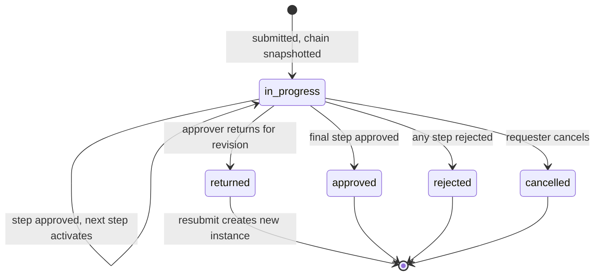

# ADR-0008: Approval Workflow Engine

Status: Accepted · Date: 2026-08-01 · Deciders: product owner + engineering (spec §10 platform scope, confirmed Phase 0)

## Context

At least eight request types route through approvals (leave, overtime, attendance correction, expense, data-change, resignation, job requisition, offer). Spec demands one generic engine: multi-level chains, sequential/parallel steps, role/position-based resolvers, delegation, escalation/SLA, audit trail. ADR-0005 set the two-gate rule (permission gates the endpoint, chain membership gates the instance); ADR-0003 made approval actions online-only in V1; ADR-0001 forbids the engine from touching domain tables. This ADR fixes the engine model; `docs/05-platform/approval-engine.md` carries schemas, APIs, and `APRV_` codes.

## Decision

### Integration contract (engine ↔ modules)

Modules submit `(requestType, requestId, requesterId, context)` — `context` is a typed, module-declared field set (amount, leaveType, durationDays, …). The engine resolves the chain, runs the instance, and emits `approval.instance.approved | rejected | returned | cancelled`. The owning module listens and applies the domain effect (activate leave, feed payroll). The engine never validates domain semantics (modules validate before submitting) and never writes domain tables; modules never mutate instance state except through engine APIs.

### Chain configuration

- Scoped per tenant + company + request type. Selection: an **ordered rule list** on declared context fields — first match wins (`durationDays > 5 → chain B`, default chain last).
- **Instances snapshot their resolved chain at creation** (jsonb snapshot, database-conventions §1.8). Config edits affect new instances only; in-flight instances are immutable — fixing a bad chain means cancel + resubmit, never silent mid-flight rewires.

### Steps

Ordered steps; each step has an approver set and a quorum policy: **`all`** (every resolved approver acts) or **`any`** (first action decides). Parallelism lives inside a step (N approvers, quorum `any`/`all`); sequence lives across steps. Max depth is a config guard (default 5). Reject at any step terminates the instance (no continue-on-reject in V1). Comment optional per step config; **reject always requires a comment** (default on).

### Resolvers

V1 set: `direct_manager(n)` (n levels up the reporting line), `position_holder(positionId)`, `role_holders(roleId)` (scoped to requester's company), `specific_user(userId)`.

- **Vacancy/failure fallback** per step: `skip` | `fallback_resolver` | route to the tenant-configured fallback role (default: HR Admin). Resolution happens at step activation, not instance creation — org changes between steps are honored.
- **Self-approval guard:** resolved approver = requester → default **reroute to next level** (configurable: skip step; `allow` exists but is never a default).

### Delegation

Date-ranged, per user, for all or a subset of request types. The engine still resolves to the original approver, then redirects the actionable item to the delegate at activation time. The delegate acts under their own identity with `acted_as_delegate_of` recorded; the original keeps read visibility. **No transitive delegation** — a delegate's own delegation does not cascade (loop-proof by construction).

### Escalation / SLA

Per-step SLA in hours (calendar hours in V1; business-hours/holiday-aware post-V1 — the holiday module makes it possible, product must ask for it). Breach ladder: reminder → after a second window, escalate to the approver's manager or the fallback role. **No auto-approve, no auto-reject on timeout, ever in V1** — payroll-feeding decisions don't default; instances stay pending and loudly visible.

### Actions and lifecycle

Actions: `approve`, `reject` (terminal), `return` (back to requester for revision), `cancel` (requester, while pending, per module rules). **Resubmission after return restarts the full chain** — every approver sees the final version. Concurrent double-actions are excluded by step-state optimistic checks (`version`, database-conventions §1.10).

Every action appends an immutable row (actor, acted-as, action, comment, step, timestamp); the engine also emits audit events (`docs/05-platform/audit-log.md`).

## Alternatives considered

- **BPMN/workflow engines (Camunda, Temporal, Zeebe).** Rejected for V1: HRIS chains are shallow (≤5 steps) and human-paced; an orchestration cluster adds ops weight, latency, and a second source of truth. Temporal becomes interesting only if long-running journeys (onboarding) land post-V1.
- **Per-module bespoke approval code.** Rejected: eight consumers guarantee drift, and the unified inbox needs one instance model.
- **Rules-engine DSL for chain selection.** Rejected: an ordered condition list over typed context fields covers HRIS reality and stays debuggable by admins.
- **Resume-at-current-step on resubmission.** Rejected: earlier approvers would have approved a version that no longer exists; restart keeps the audit trail honest.
- **Auto-approve on SLA breach.** Rejected: silent money-affecting decisions; escalation keeps humans accountable.

## Tradeoffs

A generic `context` payload means the engine can't catch domain nonsense — modules own pre-submit validation, and a bad context field surfaces as a chain-selection miss (falls to default chain). Chain snapshots make in-flight instances immune to config fixes — predictability over rescue. Full-chain restart on resubmit re-asks early approvers — audit clarity over convenience. Calendar-hour SLAs misfire across weekends/holidays until the business-hours upgrade.

## Consequences

- `docs/05-platform/approval-engine.md`: Drizzle schemas (chain configs, instances, steps, actions, delegations), step/instance state machines in full, engine APIs, `APRV_` codes, notification templates.
- Module docs declare in §13: request types, context fields, chain-selection dimensions, terminal-event effects; their §4 shows the request-side state machine referencing engine states.
- Inbox (`docs/05-platform/inbox.md`) renders actionable items from step activations; notification fan-out on activation/escalation/terminal events (ADR-0010 events).
- Org module must expose the reporting-line and position-holder queries resolvers depend on.

## Future considerations

Business-hours SLA clocks using the holiday calendar. Quorum percentages and conditional step skipping if tenants demand. Amount-banded auto-approval (skip chain under threshold) as explicit chain config, not engine default. Offline MSS approvals remain gated on the ADR-0003 revisit.
