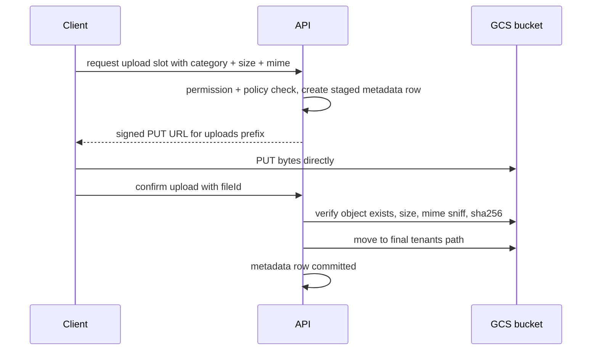

# ADR-0009: File Storage Strategy

Status: Accepted · Date: 2026-08-01 · Deciders: product owner + engineering (spec §5.4, confirmed Phase 0)

## Context

Spec §5.4 binds Firebase Storage. File classes: employee documents (KTP, contracts, certifications — with expiry reminders), punch selfies (the volume driver: D1 says 30% of a workforce clocks in within 15 minutes), expense receipts, generated payslips/tax PDFs, import files + error reports, CVs, asset handover docs. Auth is custom JWT (ADR-0004), **not** Firebase Auth — Firebase security rules cannot express our RBAC/data-scope model (ADR-0005). Data residency: Jakarta (A-003). This ADR fixes the access model, metadata authority, upload pipeline, and virus-scan posture; `docs/05-platform/document-storage.md` carries schemas, category registry, APIs, `DOC_` codes.

## Decision

### Storage layout

- Firebase Storage = one GCS bucket in `asia-southeast2`, provisioned in the same Firebase project as FCM. Server-side access via the GCS SDK + service account; **the Firebase client SDK is not used for storage at all** — clients only ever see signed URLs.
- Uniform bucket-level access, zero public objects, zero object ACLs.
- Object paths per naming §11.4: `tenants/{tenantId}/{ns}/{entityId}/{fileId}_{sanitizedOriginalName}`. Staging prefix `uploads/{tenantId}/…` with a 24 h lifecycle auto-delete for never-committed objects. Prefix-level lifecycle rules stand in for per-purpose buckets.

### Access model — server-signed URLs only

All authorization happens in the API (permission + data scope) **before** any URL is signed. Download: V4 signed GET, 10-minute expiry (module docs may shorten for payslips). Upload: V4 signed PUT constrained by exact content type and size range. The storage path is never constructed or guessed client-side — every access starts from the metadata row.

### Metadata is the authority

Table `files` (owned by document-storage): id, `tenant_id`, module ns, polymorphic owner (`entity_type` + `entity_id`), category, original name, storage path, mime, size, sha256, `uploaded_by`, status (`staged` → `committed`; `quarantined` reserved), category-driven `expires_at` (feeds reminder jobs), audit + soft delete per database-conventions. An object without a committed metadata row does not exist for the application; purge jobs delete object-then-row.

### Upload pipeline (direct-to-storage; API never proxies bytes)

The selfie spike (D1) rides this path: bytes go client→GCS; the API only signs and commits. Offline punches keep the selfie locally under sync-queue protection (ADR-0003) and upload during sync.

### Category policy table (defaults, settings-tunable)

| Category | Types | Max size | Notes |
|---|---|---|---|
| Punch selfie | jpeg | 1 MB | client compresses; retention A-008 (12 months default), punch row keeps sha256 after purge |
| Employee document | pdf, jpg, png | 10 MB | expiry reminders (KTP, contracts, certifications) |
| Receipt | pdf, jpg, png | 10 MB | |
| Generated documents (payslip, 1721-A1) | pdf | — (server-generated) | retention ≥ 10 years with payroll class (database-conventions §4.4) |
| Import file / error report | xlsx | 20 MB | staging prefix; D9 pipeline |
| CV / candidate file | pdf, docx | 10 MB | earliest AV-scan candidate (external origin) |

Type enforcement is three-layer: signed-URL constraint, commit-time mime sniff (magic bytes, not extension), and category whitelist.

### Virus-scan posture (honest, per spec)

**V1 ships without inline antivirus.** Mitigations that do ship: strict per-category type whitelist, magic-byte verification at commit, size caps, no execution or inline serving from the app origin (`Content-Disposition: attachment` for non-image types, separate storage origin, CSP per security-standards), signed-URL-only access, sha256 recorded. The pipeline reserves the hook: commit step can divert to `quarantined` pending an async scan verdict. Post-GA plan: ClamAV worker (BullMQ) scanning external-origin categories first (CVs, imports, receipts). Residual risk — a malicious-but-well-formed PDF passes through — is accepted for V1 and documented here, not hidden.

### Encryption and residency

GCS default encryption at rest (Google-managed keys); CMEK is post-V1 if a tenant contract demands it. Bucket region `asia-southeast2` satisfies A-003; signed URLs serve from that region.

## Alternatives considered

- **Firebase client SDK + security rules.** Rejected: rules cannot express permission catalog + data scopes, and dual auth systems (custom JWT + Firebase Auth) doubles the attack surface. One authz path, server-side.
- **API-proxied uploads/downloads.** Rejected: the clock-in spike would put selfie bytes through NestJS for no security gain over signed constraints; API stays on the metadata plane.
- **S3/MinIO.** Rejected: spec binds Firebase Storage; D5 already commits to the Google ecosystem (GKE, FCM).
- **Bucket per tenant.** Rejected: 500-bucket lifecycle/IAM sprawl; prefix isolation + server-side authz + signed URLs give the same practical isolation. Revisit only alongside the dedicated-DB tier (ADR-0002 escape hatch) for compliance-demanding tenants.
- **Inline AV in V1.** Rejected on cost/latency vs. risk: files are never executed server-side and reach only signed-URL consumers; hook reserved, adoption scheduled post-GA starting with external-origin categories.

## Tradeoffs

Every download costs an API round trip to mint a URL — short-lived URLs are the point; clients may cache within expiry. Direct upload trusts the client between sign and commit — bounded by the staging prefix, size/type constraints, and 24 h auto-delete. No AV in V1 is a real, accepted residual risk with a named adoption path. Single bucket concentrates lifecycle config — prefix discipline is enforced by the path grammar being generated, never hand-built.

## Consequences

- `docs/05-platform/document-storage.md`: `files` schema, category registry (the table above is its seed), sign/confirm APIs, `DOC_` codes, expiry-reminder job.
- Attendance, expense, employee, recruitment, training, asset, payroll, import-export modules all consume the same sign→PUT→confirm pipeline; none may invent their own storage path.
- Notification module runs document-expiry reminders off `files.expires_at`.
- Security-standards: storage origin isolation, CSP, signed-URL policy. Settings: `storage.*` caps + `attendance.selfie_retention_months`.
- A-008 logged: selfie retention 12 months default, tenant-tunable.

## Future considerations

ClamAV pipeline post-GA (external-origin categories first). CMEK per tenant if contracts demand. Image thumbnailing/deriving via worker if the admin UI needs it. If a second region ever ships, region becomes a tenant attribute resolved alongside the ADR-0002 connection provider.
