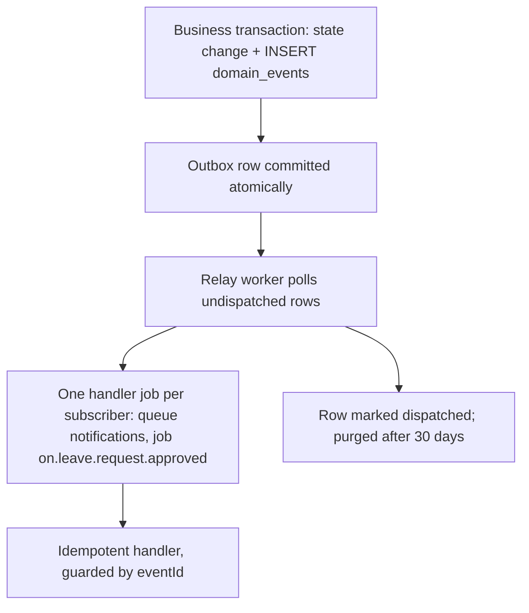

# ADR-0010: Background Jobs and Domain Events

Status: Accepted · Date: 2026-08-01 · Deciders: product owner + engineering (spec §5.4, confirmed Phase 0)

## Context

BullMQ is bound by spec §5.4 (payroll runs, exports, notifications, sync fan-out). Naming §7 fixed queue/job grammar. ADR-0001 made domain events the only async cross-module channel and requires microservice-ready seams; ADR-0002 requires tenant context in every worker; approval (ADR-0008), payroll (ADR-0012), import/export (ADR-0015) all ride this machinery. Open questions this ADR closes: queue topology, retry classes, scheduling across 500 tenants, and — the hard one — how events survive crashes (dual-write problem).

## Decision

### Queue topology (fixed set, registry-controlled)

One queue per domain, not per module or job type. Adding a queue = edit naming §7 + this table:

| Queue | Work | Retry class | Notes |
|---|---|---|---|
| `payroll` | run calculation, payslip generation, bank files | fail-fast | heavy CPU; worker concurrency low; D1: 10k-employee run < 30 min |
| `notifications` | FCM, email, in-app fan-out | fast-retry | high volume, low unit cost |
| `imports` | Excel import pipeline (D9) | standard | per-file jobs with progress |
| `exports` | Excel/PDF export generation | standard | |
| `reports` | parameterized report jobs | standard | |
| `sync` | server-side sync fan-out, delta precompute | standard | |
| `events` | outbox relay + event handler jobs | standard | see Domain events |
| `maintenance` | purges, retention, escalation scans, session cleanup | standard | mostly `cron.` |

Retry classes: **standard** = 5 attempts, exponential backoff from 30 s; **fast-retry** = 3 attempts from 10 s; **fail-fast** = 2 attempts — payroll failures are usually deterministic data problems; surface them on the run, don't grind. Stalled jobs: max 2 stalls → failed.

**Failed set is the DLQ.** After final failure: Sentry event (D6), visible in the platform-health failed-jobs view (system-administration) with manual retry; `maintenance` archives failed jobs older than 7 days to logs.

### Job conventions

- Payload envelope: `{ tenantId, actorId?, requestId?, data }`. `tenantId` mandatory for tenant work — the worker opens the ADR-0002 transaction (`set_config`) before any repository call. `requestId` propagates end-to-end correlation (ADR-0011).
- Job IDs per naming §7 (`run.calculate:tenantId:runId`) — BullMQ jobId dedup makes enqueues idempotent where a natural key exists.
- **Every processor is idempotent.** BullMQ is at-least-once (stalls, redeliveries): processors check current state before side effects (payslip exists → skip; notification already sent → skip via delivery record). Non-idempotent processor = review blocker.
- Graceful shutdown: workers stop taking jobs on SIGTERM, finish active work within the K8s grace window (D5), else the job stalls back to the queue — idempotency makes that safe.

### Scheduling across tenants (scan + fan-out)

Repeatable jobs (`cron.` prefix) are **platform-level and UTC**. A cron job never processes tenant data directly: `cron.contract-reminder.scan` iterates active tenants and enqueues `contract-reminder.process:tenantId` child jobs. *(Illustrative name only, written before employee.md existed — the registered job is `cron.employee.contract-scan`. Noted 2026-08-04 because two documents had counted this example as a 27th registered cron.)* Tenant/branch timezones are resolved inside per-tenant jobs. This keeps 500 tenants off the cron table, parallelizes naturally, and isolates failures per tenant.

### Domain events — transactional outbox

**Problem:** enqueueing an event in the same code path as a DB commit is a dual write — crash after commit loses the event (approval notification never sent); enqueue before rollback emits a phantom. For money- and approval-bearing facts, both are unacceptable.

**Decision:** events are written to a `domain_events` outbox table **in the same transaction** as the state change. A relay worker polls the outbox and enqueues one handler job per (event, subscriber) onto the subscriber's queue. Subscriptions are static code registrations (module declares what it consumes — ADR-0001 facade discipline).

- Event payload: `{ eventId (uuidv7), name, tenantId, aggregateId, occurredAt, requestId, version, data }`. Names per naming §6 (`leave.request.approved`).
- Handler jobs are named `on.<event-name>` — this extends naming §7 (registered there this session).
- Consumers dedupe on `eventId` (processed-event guard or naturally idempotent effect). At-least-once, unordered across aggregates; per-aggregate order preserved by outbox sequence.
- In-process `EventEmitter` is allowed **only** for same-module ephemera (cache busts); it is never a cross-module contract.
- Relay poll interval ~1–2 s; seconds-level latency is fine for HRIS facts.

**Jobs are commands, events are facts.** A module tells *its own* queue what to do (`payslip.generate`); it tells the world what *happened* (`payroll.run.completed`). Cross-module "please do" calls are facade ports (ADR-0001), never jobs on someone else's queue.

## Alternatives considered

- **Direct BullMQ enqueue as event bus (no outbox).** Rejected: dual-write loses or fabricates events exactly when things crash — the moment durability matters most.
- **In-process EventEmitter2 for cross-module events.** Rejected: no durability, no replay, no extraction seam; a crash mid-handler silently drops the fact.
- **Kafka / RabbitMQ / Pub/Sub now.** Rejected: real brokers earn their ops cost at scales and fan-outs D1 doesn't reach; the outbox relay is the swap point when one arrives — producers won't change.
- **Queue per module (~30 queues).** Rejected: worker/config sprawl; domain queues + job names carry the same information.
- **Per-tenant repeatable jobs.** Rejected: 500 cron entries per concern; scan + fan-out scales and isolates.

## Tradeoffs

Outbox adds a table, a relay, and seconds of latency — the price of never losing an approval or payroll fact. At-least-once forces idempotency discipline on every processor — that discipline is mandatory anyway under BullMQ stalls. Outbox table grows — purged at 30 days, sequence-scanned with a partial index on undispatched. Fixed queue set risks hot-queue contention — per-queue concurrency tuning first, queue split via registry edit second.

## Consequences

- `docs/04-database/core-schema.md` adds `domain_events` (outbox) + the processed-event guard pattern.
- naming-conventions §7 gains the `on.` handler-job prefix (edited this session).
- Every module doc §12 declares: jobs (queue, name, retry class, natural jobId key) and events (emitted: name + payload contract; consumed: handler + idempotency strategy).
- ADR-0012 (payroll runs) and ADR-0015 (imports) build directly on `payroll`/`imports` queues; escalation scans (ADR-0008) ride `maintenance`.
- **Job payloads are additive-only across a release pair (added 2026-08-04, `docs/07-operations/ci-cd.md` §8.5).** The event envelope above carries `version` and `outbox.version` records the payload schema version; the **job** envelope `{ tenantId, actorId?, requestId?, data }` carries neither. During any rollout, rollback, or aborted drain, workers at one version drain jobs enqueued by the other — so a new field in `data` must be optional within a release pair, and a genuinely breaking payload change ships as a **new job name**, with the old one drained and retired over two releases. This is the queue analogue of expand → migrate-data → contract, and it is what makes ci-cd §8.2's payroll drain gate safe to abort.
- Platform health (system-administration) surfaces queue depth, failure counts, manual retry; ADR-0011 wires queue metrics into Prometheus and job logs onto `requestId`. **Built 2026-08-04** (system-administration.md §5.9) and narrower than this line implies, deliberately: the console reads the failed set **directly, with no mirror table** — this ADR already declared the failed set to be the DLQ, so a copy would be a second truth — retries via `job.retry()` so the `jobId` and therefore the dedup semantics above are preserved, caps a batch at 50 with **no retry-all** (after an outage the set spans all eight queues and one button that re-floods them makes a recovery into a second incident), and **never renders a job's payload body**, since ADR-0011's PII ban would otherwise leak through a console page instead of a log line. Charts, latency, and alerting stay in Grafana; the console owns only the actions Grafana structurally cannot offer.
- Testing-strategy: every handler gets a double-delivery test; every processor a mid-run re-execution test. **Discharged 2026-08-04** — `docs/07-operations/testing-strategy.md` §5.3 (`describeIdempotency`, three scenarios per processor including `jobId` dedup, and the same three against `eventId` for handlers). §14.1 adds what idempotency does not cover: the ten data-deleting crons are tested **two-sided** — expired rows gone, in-window rows present, T2 untouched — because a purge with an inverted predicate is perfectly idempotent and destroys everything.

## Future considerations

Broker migration (Pub/Sub) = relay swap, producer-invisible. Event replay tooling (re-dispatch from outbox archive) when integrations appear. Priority lanes inside queues (BullMQ priorities) if payroll month-end contends with itself. Cron jitter/sharding if the tenant scan itself becomes the thundering herd.
