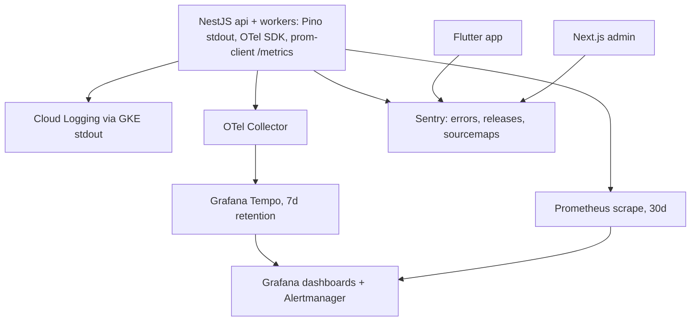

# ADR-0011: Observability Stack

Status: Accepted · Date: 2026-08-01 · Deciders: product owner + engineering (D6 confirmed Phase 0)

## Context

D6 fixes the stack: Pino structured JSON logs, OpenTelemetry tracing, Prometheus + Grafana metrics, Sentry error tracking across backend, admin web, and Flutter. D6 leaves open: log aggregation, trace backend, sampling policy, correlation contract, and PII discipline — all needed before backend-nestjs.md and the Phase 4 runbook (`docs/07-operations/observability.md`). D1–D3 SLOs define what alerting must watch. Deployment is GKE, cloud-portable (D5, A-003).

## Decision

### Pipeline

- **Logs:** Pino JSON to stdout; GKE ships to **Cloud Logging** (zero-infra sink, 30 d hot; portable swap = Loki, A-009). Base fields on every line: `timestamp, level, service, env, module, requestId, traceId, tenantId, userId, msg`. Prod level `info`; `debug` per-module via env flag.
- **Traces:** OTel SDK with auto-instrumentation (http, pg, ioredis, bullmq) + manual spans around use cases and payroll phases. W3C `traceparent` propagation, including into BullMQ job payloads. Export via **OTel Collector → Grafana Tempo** (A-009). Sampling: parent-based head sampling **10%**, plus force-sample hooks for payroll runs, imports, and requests slower than the D2 budget. Sentry performance tracing stays **off** — one trace system.
- **Metrics:** prom-client `/metrics` on api and workers; RED histograms per route (bucketed for D2 p95 alerts), BullMQ depth/failures/duration per queue (ADR-0010), DB pool and Redis stats, plus business meters (punch sync lag, payroll run duration vs the D1 30-min budget). Cluster metrics via kube-prometheus-stack. Dashboards are JSON in the backend repo — reviewed like code.
- **Errors:** Sentry on all three apps. Release = git SHA (CI uploads sourcemaps/Flutter symbols), environment tags, `requestId`/`traceId` attached. Errors sampled 100%. Backend exception filter (ADR-0006) reports every `SYS_`-mapped exception; handled business failures (Result) are **not** Sentry events.

### Correlation contract

One chain from user to support: client sends/receives `X-Request-Id` (ADR-0007) → Pino `requestId` → span attribute → Sentry tag → BullMQ payload `requestId` (ADR-0010) → outbox event field. Support gets a `requestId` from the error envelope and can walk logs, trace, and Sentry issue from it.

### PII discipline (UU PDP posture)

Logs, traces, and Sentry events carry **identifiers only** — never names, NIK/NPWP, salary amounts, bank data, selfie URLs, or document contents. Enforced three ways: Pino `redact` paths (auth headers, tokens, password fields, known sensitive keys), Sentry `beforeSend` scrubbers in all three SDKs, and span-attribute conventions (ids only). The sensitive-key registry lives in `docs/03-standards/security-standards.md`; adding a sensitive field updates that registry.

### Alerting (Alertmanager, SLO-driven)

Seed rules from D1–D3: API p95 over budget (reads 300 ms / writes 800 ms), 5xx rate, queue backlog age + DLQ growth per queue, payroll run duration vs 30-min budget, DB connection saturation, PITR/backup freshness, pod crash loops. Routing targets are an environments.md concern; the runbook owns thresholds and triage steps.

### Retention defaults

Metrics 30 d · traces 7 d · logs 30 d hot (Cloud Logging) · Sentry per plan. Audit-grade history is the audit log's job (D4), never the observability stack's.

## Alternatives considered

- **ELK/OpenSearch for logs.** Rejected: heaviest component in the room for V1; stdout→Cloud Logging is free of moving parts, Loki is the portable successor.
- **Datadog / New Relic.** Rejected: per-host/per-span pricing at 500-tenant scale, data residency preferences, and D6 already fixed the OSS stack.
- **All-in GCP (Cloud Trace + Cloud Monitoring).** Rejected: D5 demands cloud-portable; Prometheus/Grafana/Tempo move with the manifests. Cloud Logging is the one pragmatic GCP tie, with a named swap.
- **Sentry as the tracing system.** Rejected: two half-trace systems is worse than one; OTel owns spans, Sentry owns exceptions.
- **No collector (SDK direct-to-backend).** Rejected: the collector is where sampling policy, redaction backstop, and backend swaps live without redeploying apps.

## Tradeoffs

Self-hosting Prometheus/Grafana/Tempo adds cluster components — kube-prometheus-stack and a small Tempo keep it to helm values, and it stays portable. 10% head sampling loses some interesting traces — force-sample hooks cover the known-interesting classes; tail sampling is a collector upgrade later, not a redesign. Cloud Logging ties log search to GCP — accepted consciously (A-009) with Loki as the exit. Business failures skipping Sentry means product-level error trends live in metrics/logs, not Sentry — deliberate noise control.

## Consequences

- `docs/02-architecture/backend-nestjs.md`: Pino/OTel/prom-client module wiring, request-context propagation (requestId, tenantId) via AsyncLocalStorage.
- CI: sourcemap + symbol upload steps per repo (ci-cd.md). **Placed 2026-08-04** — `docs/07-operations/ci-cd.md` §10 requires Android `mapping.txt`, iOS dSYMs, and the Flutter `--split-debug-info` output to upload **in the same job as the binary, or not at all**, and §4.2 does the same for admin-web sourcemaps. Not a hygiene step: security-standards §12 mandates `--obfuscate` on release builds, so without the upload every Sentry crash from a released app is unreadable.
- `docs/07-operations/observability.md` (Phase 4): dashboards inventory, alert thresholds, triage runbook, Sentry workflow (link to GitHub Issues tracker). **Discharged 2026-08-04.** Six dashboards with panel lists and no PromQL, since the query would then exist in two places; **27 alert rules in six groups** *(26 at first writing; **OB27** added the same week — see below)*, each paired to a triage entry by id under a rule that makes the pairing a set difference rather than a matter of care; Sentry triaged into GitHub Issues manually via `docs/agents/issue-tracker.md`, resolved in a release and never by hand so a rollback does not resurrect a bug as a new issue. Three things this ADR left implicit are now explicit: **`tenant_id` is banned as a label** (this ADR's own cardinality warning, costed — over 12 million series from one metric at D1 scale), the **correlation contract is walked end to end** for the first time in the handbook rather than declared a sixth time, and the **10% sampling consequence is stated wherever anyone is told to look for a trace** — an ordinary request's trace is probably absent, and that is correct behaviour. Two gaps this ADR did not anticipate are closed there: nothing could detect a cron that **never ran** (OB14), and nothing could detect that the **alerting itself was dead**, since every component that decides whether to alert lives inside the cluster it watches (OB21). **One gap this ADR *did* anticipate was missed and is now closed (2026-08-04, `backup-restore.md` session): OB27.** The seed list above names *"PITR/backup freshness"*; every other item on it became a rule and this one did not, leaving the only signal that reports a **broken recovery capability** absent from a document whose organizing rule is that every alert has a triage entry. It is a Cloud Monitoring condition rather than a Prometheus rule, on OB21's precedent — the fact lives in Google's control plane and has no code path to instrument.
- `docs/07-operations/environments.md`: kube-prometheus-stack, Tempo, Collector deployment; alert routing. **Discharged 2026-08-04** — `environments.md` §11 deploys all three into an `observability` namespace in **both** environments, cutting staging on retention rather than on components, because dashboards live in the repository to be reviewed like code and one nobody can render before promotion is reviewed by reading JSON. Sentry is **three projects, one per repo, with environments as tags** — six would split every issue's history at the moment of promotion. Routing: production `critical` to chat and email, `warning` to chat, **staging to a separate channel**, Sentry to the production warning channel. **No PagerDuty** — paging needs a rotation and A-102's organization has no on-call role to hold one. This ADR keeps the thresholds; `observability.md` keeps triage.
- Security-standards owns the sensitive-key redaction registry; A-009 logged (Cloud Logging sink, Tempo backend).

## Future considerations

Tail-based sampling at the collector when trace volume justifies it. Loki if log costs or portability force the swap. Per-tenant usage metrics feeding the future billing module (D13) can ride the same Prometheus labels — design labels with `tenant_id` cardinality caps in mind (aggregate, don't explode).
